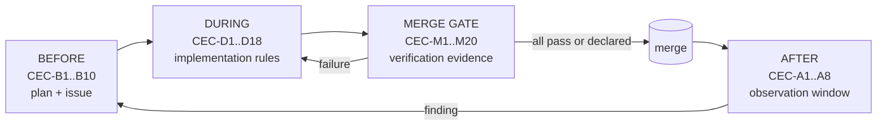

# VOL01 Policy, Scope, and Stakeholders — AOI Software Architecture, Secure Development, and Change-Control Standard, v1.0 (2026-07-15)

Scope of this volume: the engineering constitution of AOI Monitor — executive policy (§2), the mandatory Change Execution Contract (§3), product scope and non-scope (§4), source-requirement traceability (§5), the specification-defect and open-decision registers (§6), and the stakeholder/responsibility model with the GOV requirement catalogue (§7).

Supersedes/Related existing docs: supersedes the change-process portions of `Docs/Contributor_Quality_Checklist.md` where they conflict with §3 (that document remains as a quick reference). Incorporates by reference, without restating: `AGENTS.md` (concise AI-agent contract), `Docs/Standards_Traceability_Matrix.md` (certification-boundary wording), `Docs/Branch_Protection_and_Quality_Gates.md`, `Docs/Completion_Assessment_Methodology.md`, `Docs/Requirements_Traceability_Matrix.md` (legacy requirement-ID registry), `Docs/Stage_Mapping.md` and `Docs/Roadmap_and_Stages.md` (stage vocabulary and boundaries), `DESIGN.md` (UI design authority).

---

## 1. Document Control (Pointer)

Document Control — version history, volume register, ownership table, and navigation for all volumes — lives in `Docs/standard/00_Index.md`; this volume carries only its own version line above.

---

## 2. Executive Engineering Policy

This section is the constitution. Every other section of every volume elaborates one of the clauses below; where prose elsewhere appears to permit what this section prohibits, this section wins. The policy exists because the analysis behind this standard (§6) found that the dominant failure pattern of this project is not bad code — the codebase is more rigorous than its specifications — but ungoverned divergence: three source documents that contradict each other, the implementation, and current law, plus a repository whose elaborate quality gates are advisory in practice (`Docs/Branch_Protection_and_Quality_Gates.md` prescribes branch protection that is not enforced; CI failure currently blocks nothing).

**EP-1 — No change without the standard.** Every change — code, XAML, SQL schema, model artifact, recipe, configuration, script, CI workflow, or document — is made under the Change Execution Contract (§3). There is no category of change that is outside it.

**EP-2 — The excuses are void.** The following justifications for skipping any part of this standard are explicitly void: "it's small", "it's temporary", "it's just a PoC", "it's experimental", "it was AI-generated", "it's urgent", "it's only docs", "I'll fix it later". A proof-of-concept label changes claims (see EP-4); it changes no obligation. Urgency has exactly one sanctioned path: the Emergency Hotfix Standard (§50/VOL17), which is itself a controlled process with mandatory retroactive completion of skipped gates. AI-generated changes are held to the same contract as human changes and additionally to the AI-assisted development controls (§48/VOL17).

**EP-3 — Simplest architecture that satisfies.** The selected design for any change is the one with the fewest new processes, dependencies, technologies, and abstractions that satisfies the affected requirements of this standard. D-01 (modular monolith, .NET-first, in-process ONNX Runtime, worker split only on defined triggers) is the product-level application of this clause. Complexity is admitted only against a recorded trigger or requirement, never speculatively. The burden of proof is on the more complex option.

**EP-4 — Truthfulness.** The product and its documents are standards-aligned, never certified, unless a certificate from an accredited body exists and is on file. The exact wording discipline of `Docs/Standards_Traceability_Matrix.md` ("Certification Boundary" section) applies to every artifact: "standards-aligned evidence" is permitted; "ISO certified" and equivalents are forbidden. Simulated or mock evidence never satisfies a real-hardware or real-integration gate — the rule already stated in ≥6 repo documents (e.g. `Docs/Factory_Acceptance_Test_Plan.md`, `Docs/Completion_Assessment_Methodology.md`) is hereby elevated to standard level. This mirrors the `AGENTS.md` truthfulness contract.

**EP-5 — Decisions bind.** The Decision Register D-01..D-18 (recorded long-form in §11/VOL02) is settled. Requirements, reviews, and designs are written consistent with it. Reopening a decision requires an ADR that names the decision's recorded revisit condition and demonstrates it has been met; re-litigation in review threads, commit messages, or new documents is a §3 violation.

**EP-6 — Default deny.** Authorization, parsing, deserialization, network acceptance, and plugin loading default to denial; allow-lists are enumerated, deny is the fallback. The repository's current default-allow page gate (`AOI_Monitor/Services/RoleAuthorization.cs`, `_ => true` arm) is a recorded nonconformity to this clause with a mandated inversion (IAM catalogue, §28/VOL07).

**EP-7 — Root cause over symptom.** A fix that removes the observed symptom while leaving the causal defect class intact does not close the issue. The CEC requires the root cause to be named before code is written (CEC-B5) and the vulnerability-class question to be answered before merge (§54/VOL16 for security issues).

**EP-8 — Evidence over assertion.** A claim without a named evidence artifact is an opinion. Acceptance, readiness, performance, and security statements carry the artifact that proves them (gate log, test result, signed manifest, measurement export). This is the operating principle of the existing evidence pipeline (`Scripts/run-quality-gates.ps1`, `TestResults/industrial_quality_gate_report.json`) and it extends to every claim this standard governs.

**EP-9 — Safety boundary.** Per D-18, AOI Monitor is ordinary, non-safety-rated software. E-stop, guard interlocks, and safe stop live in an independent certified safety chain (safety PLC/relay per 13849-1). The application observes safety status and fails safe when observation is lost. No software change may move a safety function into the application; §34/VOL11 governs the observation interface.

**EP-10 — Requirements prevail over prose.** Where a numbered requirement record and surrounding prose differ, the requirement record is authoritative. Where two volumes conflict, the conflict is a defect to be recorded per GOV-010 and resolved by ADR — not silently interpreted.

### R: Executive policy requirements

**[GOV-001]** (P0 | ALL | All)
The change author SHALL complete the CEC-B checklist (§3.1) before beginning any change to source code, configuration, database schema, model artifacts, recipes, documentation, build scripts, or CI workflows.
- Why: uncontrolled change is the enabling condition for every defect class in §6; consultation-before-change is this standard's reason to exist. Maps: SSDF-PO.1; 62443-4-1 SM-1; CSF2 GV.PO.
- Verify: fitness function FF-GOV-01 (CEC record present and complete on every merged change). Evidence: CEC record attached to the PR or commit. Owner: Software Architect. Auto: Partially automated.
- Exception: Not allowed. Review: Per release.

**[GOV-002]** (P0 | ALL | All)
A change SHALL NOT be exempted from this standard on the grounds that it is small, temporary, proof-of-concept, experimental, AI-generated, urgent, or documentation-only; the only exemption path is the exception process (§53/VOL17).
- Why: "just this once" erosion is how governed codebases decay; the named excuses are the ones observed to precede real incidents. Maps: 62443-4-1 SM-1; SSDF-PO.2; Internal.
- Verify: quarterly retrospective audit (GOV-024) checks merged changes for undocumented exemptions. Evidence: quarterly governance report. Owner: Software Architect. Auto: Manual review.
- Exception: Not allowed. Review: Quarterly.

**[GOV-003]** (P1 | ALL | All)
Product documents, UI text, exports, and marketing materials SHALL NOT claim or imply certification to any standard; claims are limited to the standards-aligned wording defined in `Docs/Standards_Traceability_Matrix.md` (Certification Boundary section).
- Why: false certification claims create legal exposure and break the repo truthfulness contract (`AGENTS.md`); the claim-language CI gates already police part of this. Maps: SBD; CRA; Internal.
- Verify: existing claim-language gates PR-CLAIM-001/PR-PROD-CLAIM-001 (`Scripts/check-pr-quality.ps1`) plus release review of customer-facing text. Evidence: CI gate log; release review record. Owner: Product Owner. Auto: Partially automated.
- Exception: Not allowed. Review: Per release.

**[GOV-004]** (P2 | ALL | All)
The CEC-B6 change plan SHALL record why the chosen design is the simplest that satisfies the affected requirements, naming at least one rejected simpler alternative or stating that none exists.
- Why: complexity is the dominant cost driver in a solo-maintained 66,305-LOC application (`AOI_Monitor`); D-01's modular monolith is premised on this principle. Maps: 42010; Internal.
- Verify: review checklist item CEC-B6 during change review. Evidence: CEC record. Owner: Software Architect. Auto: Manual review.
- Exception: Allowed — approver: Software Architect. Review: Quarterly.

---

## 3. Mandatory Change Execution Contract

The Change Execution Contract (CEC) is the operational form of §2. It is deliberately concise: four checklists, one per phase, each item with a stable anchor code so reviews, audits, and exceptions can cite items unambiguously (e.g. "violates CEC-D7"). The detailed catalogues behind each item live in the owning volumes (coding rules in the COD catalogue §23/VOL06, review rules in the CHG catalogue §48–53/VOL17, testing in the TST catalogue §39/VOL14); the CEC is the index a change author walks through, not a restatement of those catalogues.

Applicability is proportional but never zero: for a pure documentation change most items resolve to "not applicable" in seconds — but the record of that resolution is still made (GOV-005). "Not applicable" is a recorded judgment, not a silent skip.

**Reading this diagram:** a change moves left to right through four phases. The BEFORE checklist (CEC-B1..B10) is completed before any code is written and produces the plan and issue record. The DURING rules (CEC-D1..D18) bind the implementation itself. The BEFORE MERGE gate (CEC-M1..M20) is the verification wall: every item either passes with evidence or is explicitly declared unrun with justification (CEC-M20) — only then is the merge made. The AFTER MERGE checklist (CEC-A1..A8) is a bounded observation window on the merged result; any finding there loops back into a new BEFORE phase as a fresh issue. A merge-gate failure returns the change to the DURING phase; it never proceeds by silence.

### 3.1 BEFORE any code change (CEC-B1..B10)

| Anchor | Item |
|---|---|
| CEC-B1 | A recorded issue exists with reproduction steps (defects) or motivation and acceptance statement (features). |
| CEC-B2 | Affected requirement IDs of this standard are listed; "none" is written explicitly if true. |
| CEC-B3 | Affected modules and any crossed trust boundaries (§9/VOL02) are named against the §4 scope table. |
| CEC-B4 | Sensitive-area screen answered yes/no per area: authentication/authorization, parsing/deserialization, secrets, cryptography, model artifacts, recipes, data retention, camera/lighting hardware, robot commands, safety-status observation/interlocks, MES/OPC UA, installer/update, customer data. Any "yes" triggers the owning volume's checklist. |
| CEC-B5 | Root cause identified and written down; symptom-only fixes are rejected at plan stage (EP-7). |
| CEC-B6 | Smallest coherent change plan written; simplicity justification per GOV-004. |
| CEC-B7 | Regression tests defined: which new or existing tests will prove the change and guard against recurrence. |
| CEC-B8 | Rollback defined: how the change is reverted in code, schema, config, and (if shipped) in the field. |
| CEC-B9 | Size/complexity limits checked against D-15 (file soft 250 / hard 400 logical lines, method soft 20 / hard 50, cyclomatic ≤ 10, cognitive ≤ 15, nesting ≤ 3, params ≤ 5, ctor deps soft 5, PR soft 400 / hard-review 800); plan split if breached. |
| CEC-B10 | Specialist reviewers identified from the §7.2 RACI for every "yes" in CEC-B4 (role-hats, per GOV-022, when one person serves). |

### 3.2 DURING implementation (CEC-D1..D18)

| Anchor | Item |
|---|---|
| CEC-D1 | Module and layer boundaries preserved; no new UI→data shortcuts (the 21 existing views calling `AoiDatabase` directly are a capped legacy set, not a precedent — dependency rules in §15/VOL03). |
| CEC-D2 | No new dependency (NuGet, Python package, vendor SDK, GitHub Action) without the approval row in §7.2; lock files updated per D-07. |
| CEC-D3 | No unrelated refactors mixed into the change; opportunistic cleanups become their own issue. |
| CEC-D4 | Doc comments and affected documents updated with the code they describe. |
| CEC-D5 | Tests written or updated alongside the code, per the CEC-B7 plan — not deferred to a later change. |
| CEC-D6 | All new external input (files, images, network payloads, config, CLI args) validated per the INP catalogue (§29/VOL08). |
| CEC-D7 | Authorization enforced at the service boundary, not only in UI code-behind; default deny per EP-6. |
| CEC-D8 | Every new I/O or long-running operation has an explicit timeout and honors cancellation. |
| CEC-D9 | Every new queue, buffer, cache, or collection that grows with input is explicitly bounded. |
| CEC-D10 | State-changing operations on audited entities write audit events with operator identity (existing `AoiDatabase.RecordAuditEvent` path). |
| CEC-D11 | Architecture diagrams and ADRs updated when structure, boundaries, or decisions change. |
| CEC-D12 | Patches kept small: D-15 PR limits respected; oversized changes split before review. |
| CEC-D13 | No compiler/analyzer warning silenced by pragma, severity downgrade, or suppression attribute without a recorded justification in the CEC record. |
| CEC-D14 | No empty catch blocks or silently swallowed exceptions (existing gate CQ-CATCH-001 is the floor; error architecture in §25/VOL06). |
| CEC-D15 | No debug backdoors: hidden endpoints, magic key sequences, auth bypass flags, or "test mode" switches reachable in production builds. |
| CEC-D16 | No temporary credentials, hardcoded secrets, or personal tokens — not even "just for now" (secrets handling per §30/VOL08). |
| CEC-D17 | No commented-out code committed; deleted code lives in git history. |
| CEC-D18 | Every TODO/FIXME added carries an issue link, an owner, and an expiry date; expired markers fail review. |

### 3.3 BEFORE MERGE (CEC-M1..M20)

| Anchor | Item |
|---|---|
| CEC-M1 | Formatting gate passed: `dotnet format --verify-no-changes` (existing `Scripts/check-code-quality.ps1` step). |
| CEC-M2 | Release build clean with analyzers as configured (Directory.Build.props WarningsAsErrors set) — the typecheck gate. |
| CEC-M3 | Full unit test suite green (`dotnet test`, Release — the existing ~524-case xUnit suite per D-13). |
| CEC-M4 | Integration/UI test suites green where touched surfaces have them (`AOI_Monitor.UiTests`, STA, Windows-only). |
| CEC-M5 | Architecture fitness tests green (dependency direction, layering — §52/VOL17 plan; NetArchTest.Rules per D-14). |
| CEC-M6 | Static analysis pass recorded (Roslyn analyzers + dangerous-pattern scan in `check-code-quality.ps1`). |
| CEC-M7 | Secret scan run (per D-14 a gitleaks-style scanner; the current homemade regex CQ-SEC-001 is the interim floor). |
| CEC-M8 | Dependency vulnerability scan run (`dotnet list package --vulnerable` per D-14) when any dependency or lock file changed. |
| CEC-M9 | Authorization tests executed if permissions, roles, or page/service gates changed (extends `RoleAuthorizationTests`). |
| CEC-M10 | Fuzz/negative-input tests executed if any parser, decoder, or deserializer changed (INP catalogue, §29/VOL08). |
| CEC-M11 | Migration tests (forward + rollback on representative data) executed if schema or storage format changed (`AoiDatabaseMigrations.cs` discipline). |
| CEC-M12 | Simulator or hardware-in-the-loop evidence captured if device-facing behavior changed (camera/lighting/robot/3D — `Docs/Hardware_In_The_Loop_Checklist.md`), labeled simulated vs real per EP-4. |
| CEC-M13 | Model regression suite executed if inference, preprocessing, postprocessing, thresholds, or taxonomy mapping changed (AIM catalogue, §31/VOL09). |
| CEC-M14 | Log-leak review done: new/changed log statements checked for secrets, personal data, customer image paths (extends `SecretProtectionService.RedactKnownSecrets` coverage). |
| CEC-M15 | Rollback from CEC-B8 verified as executable (revert builds; down-migration runs; field rollback documented). |
| CEC-M16 | Documentation updates verified present and accurate, including this standard where affected (GOV-008, GOV-014). |
| CEC-M17 | Traceability updated: §5 tables and `Docs/Requirements_Traceability_Matrix.md` rows touched by the change. |
| CEC-M18 | Code-owner/role approval recorded per the §7.2 RACI, with role-hat named (GOV-022); cooling period observed where GOV-023 applies. |
| CEC-M19 | Commands run and their results recorded in the CEC record (the exact gate invocations and outcomes). |
| CEC-M20 | Every unrun applicable check is explicitly declared with justification and a follow-up issue — silence is failure. |

### 3.4 AFTER MERGE (CEC-A1..A8)

| Anchor | Item |
|---|---|
| CEC-A1 | Post-merge CI run on `main` and first application runs observed; failures triaged same day. |
| CEC-A2 | Migration success verified on realistic data (not only the test fixture) before the change ships. |
| CEC-A3 | Model/recipe activation state confirmed as intended — no unintended activation or deactivation (`SetActiveModel` path is a known weak point; ORC catalogue §19/VOL04). |
| CEC-A4 | Resource growth watched over the observation window: memory, DB size, image-vault growth, log volume. |
| CEC-A5 | Authorization regression spot-checked for changed roles/pages (default-deny still holding). |
| CEC-A6 | Escape and false-call trend watched where detection behavior changed (existing false-call target and escape-evidence reporting). |
| CEC-A7 | Field rollback readiness confirmed for shipped changes: previous package retained, rollback steps tested per `Docs/Deployment_Package_Guide.md`. |
| CEC-A8 | Risk register (§56/VOL19) updated with any new or retired risk the change created or removed. |

### R: Contract recording requirements

**[GOV-005]** (P2 | ALL | CI)
Every merged change SHALL carry a completed CEC record listing the outcome of each applicable CEC-B/D/M item and naming the items ruled not applicable.
- Why: an unchecked checklist is decoration; recorded outcomes make §3 auditable and give GOV-024 its input. Maps: SSDF-PO.3; 62443-4-1 SM-12.
- Verify: fitness function FF-GOV-01 (presence and completeness check of the CEC block in the PR description or commit trailer). Evidence: CEC record in PR/commit. Owner: Software Lead. Auto: Partially automated.
- Exception: Allowed — approver: Software Architect. Review: Quarterly.

**[GOV-006]** (P3 | ALL | All)
Review comments that report a violation of this standard SHOULD cite the violated requirement ID or CEC anchor code.
- Why: anchor-coded findings make the quarterly audit and exception register queryable instead of requiring prose archaeology. Maps: Internal.
- Verify: quarterly retrospective audit samples review threads for anchor citations. Evidence: quarterly governance report. Owner: QA Lead. Auto: Manual review.
- Exception: Allowed — approver: QA Lead. Review: Annual.

---

## 4. Scope and Non-Scope

This section fixes what the standard governs, so that CEC-B3 has an authoritative table to check against and so that acceptance criteria can never again conflate stages (SD-17).

### 4.1 In scope

**The four stages** (vocabulary per `Docs/Roadmap_and_Stages.md` and `Docs/Stage_Mapping.md`):

| Stage | Content | Current status (2026-07-15) |
|---|---|---|
| S1 | Offline image upload, image-only learning, AI validation, evidence export | Code-complete; exit is evidence-gated |
| S2 | Live GigE/USB3 cameras, lighting control, 3D acquisition, view switching | Architecture seams ready; no real hardware yet |
| S3 | Robot cell integration (load–inspect–unload), trigger sync, safety-status observation | Planned 2027; simulation-only today |
| S4 | MES/ERP integration (REST/OPC UA), traceability upload, federated identity | Planned 2027; labeled mock boundary today |

**The product surfaces:**

- `AOI_Monitor` — the WPF desktop application (HMI, ViewModels, Services, Data, Models, Controls, Styles).
- `AOI_Monitor.Tools` — the evidence/CLI companion (stage-exit evidence, image-learning demo commands).
- `AOI_Monitor.Tests`, `AOI_Monitor.UiTests` — the test estate (D-13).
- `Templates/*` — the four vendor adapter template projects and the plugin loading surface (camera/lighting adapters; the current unsigned `Assembly.LoadFrom` path is a recorded nonconformity, §15/VOL03 plugin rule).
- The offline training pipeline on engineering machines (D-01 confines Python here; currently documented in `Docs/ONNX_Model_Training.md` — anomalib-based ONNX export; a `Scripts/ml` home is the target layout).
- Build, CI, and release machinery: `.github/workflows/dotnet-ci.yml`, `.github/workflows/build-windows-app.yml`, `Scripts/*.ps1` quality gates, `Tools/quality-gates/*.json`, the future WiX MSI installer and signed update pipeline (D-08, D-12).
- The documentation set (`Docs/`, `README.md`, `DESIGN.md`, `AGENTS.md`, this standard).
- Local persistence and evidence stores: SQLite database, image vault, export/evidence directories (D-04).

### 4.2 Out of scope (explicit non-scope)

| Area | Boundary statement |
|---|---|
| Safety-function engineering | E-stop, guard interlocks, safe stop, and their risk assessment per 12100/13849-1 belong to the machine builder's certified safety chain (D-18). This standard governs only the software's observation of safety status and its fail-safe reaction to losing that observation (§34/VOL11). No requirement in this standard is a safety-function requirement. |
| Customer MES/ERP internals | The standard governs AOI Monitor's client behavior up to the MES interface contract (§35/VOL11). MES server configuration, uptime, and data handling beyond the interface are the customer's domain (IT Admin role). |
| PCB design-data interpretation beyond images | The product interprets images (2D/3D/side-view). CAD/Gerber/BOM semantic interpretation is not governed by v1.0; the post-Stage-1 roadmap names CAD/BOM-driven programming as a future priority (`Docs/Roadmap_and_Stages.md`), and its adoption requires a scope amendment ADR. |
| Cloud SaaS / multi-station cloud aggregation | Named "Future Expansion" in the GUI spec (`gui-spec.md:182-186`). Excluded from v1.0; any cloud feature triggers a new threat model and a scope amendment ADR before the first line of code. |
| PCB manufacturing process engineering | The defect taxonomy (D-17) classifies observations; it does not prescribe SMT process corrections. |

### R: Scope guard requirement

**[GOV-007]** (P2 | ALL | All)
A change implementing any §4.2 non-scope area SHALL NOT be merged before a scope amendment is adopted via ADR and a version bump of this volume.
- Why: scope creep into safety-function engineering or cloud services would silently invalidate the stage threat models and the D-18 safety boundary. Maps: 62443-4-1 SM-3; CSF2 GV.OC.
- Verify: review checklist item CEC-B3 (affected modules checked against the §4 tables). Evidence: CEC record; ADR when scope is amended. Owner: Product Owner. Auto: Manual review.
- Exception: Not allowed. Review: Annual.

---

## 5. Source Requirements Traceability

The three customer-facing source documents are scope inputs, not correct architecture (§6 records where they are wrong). This section maps every requirement statement in them to the standard section(s) and requirement category(-ies) that govern it, or marks it REJECTED/SUPERSEDED with the SD-xx defect reference. Line numbers refer to the extracted working texts of the three documents (the same references used throughout §6); dispositions:

- **ADOPTED** — governed as stated.
- **ADOPTED-CORRECTED** — governed with a recorded correction (SD-xx names the defect).
- **SUPERSEDED** — replaced by a stricter or different rule (SD-xx).
- **REJECTED** — not implemented as written (SD-xx); the replacement is named.
- **NOT A REQUIREMENT** — planning/market content; recorded for completeness.

### 5.1 Roadmap ("AOI PoC Software – Development Roadmap & Commercialization Plan")

| Ref | Statement (condensed) | Disposition | Governed by |
|---|---|---|---|
| roadmap:15 | Image upload module (PNG/JPG) | ADOPTED | §29 (INP), §36 (HMI) |
| roadmap:16 | Offline AI inference engine | ADOPTED | §12 (ARC), §31 (AIM); engine is ONNX Runtime per D-03 |
| roadmap:17 | Defect overlay visualization | ADOPTED | §36 (HMI) |
| roadmap:18 | Batch test tool for customer datasets | ADOPTED | §39 (TST), §36 (HMI) |
| roadmap:19 | Export of annotated images and CSV reports | ADOPTED | §37 (DAT) |
| roadmap:19 | "Customer validation of AI accuracy" | SUPERSEDED — SD-06 | §31 (AIM), §39 (TST): per-class recall, false-call, escape with CIs |
| roadmap:21 | Deliverable "AI model (v1.0)" | SUPERSEDED — SD-20 | §19 (ORC), §31 (AIM): single deliverable definition |
| roadmap:22–23 | PoC GUI (image-based); customer validation report | ADOPTED | §36 (HMI), §39 (TST) |
| roadmap:29 | GigE/USB3 Vision camera drivers | ADOPTED | §32 (CAM), §11 (ARC) |
| roadmap:30 | Real-time image acquisition | ADOPTED | §32 (CAM), §40 (PER) |
| roadmap:31 | Lighting control (Ethernet/Serial) | ADOPTED | §32 (CAM) |
| roadmap:32 | Top/Side/Bottom view switching | ADOPTED | §32 (CAM), §36 (HMI) |
| roadmap:33 | Real PCB inspection validation | ADOPTED | §39 (TST) |
| roadmap:34–36 | Stage-2 deliverables (live GUI, HW test report, on-site validation) | ADOPTED | §39 (TST), §24 (DOC) |
| roadmap:44 | Robot controller API integration (Ethernet/RS-485) | ADOPTED | §34 (ROB), §22 (API) |
| roadmap:45 | Commands: Load → Inspect → Unload | ADOPTED | §17 (ORC), §34 (ROB) |
| roadmap:46 | Trigger synchronization with camera | ADOPTED | §32 (CAM), §34 (ROB) |
| roadmap:47 | "Safety interlock & emergency stop" (software scope) | REJECTED — SD-04 | D-18; §34 (SAF): observe-only, fail-safe |
| roadmap:48 | Cycle time optimization | ADOPTED | §40 (PER) |
| roadmap:50–51 | Stage-3 deliverables (automated cycle, robot test report) | ADOPTED-CORRECTED — SD-04 | §39 (TST); deliverable text must exclude safety-function claims |
| roadmap:56 | REST API / OPC UA communication | ADOPTED | §22 (API), §35 (MES, OPU) |
| roadmap:57 | Lot ID, Model, Result, Timestamp upload | ADOPTED | §21 (DAT), §35 (MES) |
| roadmap:58 | Image & defect data archiving | ADOPTED-CORRECTED — SD-21 | §37 (DAT), §35 (MES): no local purge before confirmed upload |
| roadmap:59 | "MES-based user authentication" | SUPERSEDED — SD-03 | §28 (IAM) per D-11: federation with defined offline fallback |
| roadmap:61–62 | Stage-4 deliverables incl. end-to-end traceability validation | ADOPTED | §21 (DAT), §39 (TST) |
| roadmap:64–82 | Commercialization timeline (1Q 2027 release, license counts) | NOT A REQUIREMENT — SD-19, OD-05 | planning input; release scope decided via OD-05 |
| roadmap:84–93 | Market forecast (50–200+ licenses) | NOT A REQUIREMENT | informs OD-04 (licensing mechanism) |

### 5.2 GUI Specification ("AOI PoC Software GUI – Concept & Functional Specification")

| Ref | Statement (condensed) | Disposition | Governed by |
|---|---|---|---|
| gui-spec:7 | Standalone QC cell, independent of SMT lines | ADOPTED | §4; §9 (ARC) |
| gui-spec:7 | 2D, 3D, and side-view imaging of T-Box PCBs | ADOPTED (staged) | §32 (CAM), §33 (THD) |
| gui-spec:16–21 | Five GUI modules (Main, Recipe, AI Test, Log/Export, 3D Viewer) | ADOPTED | §14 (MOD), §36 (HMI) |
| gui-spec:22 | "high contrast, large buttons, minimal text, and clear color coding" | ADOPTED-CORRECTED — SD-11 | §36 (HMI): color never the only signal |
| gui-spec:28 | Live camera feed (Top/Side/Bottom) | ADOPTED (S2+) | §32 (CAM), §36 (HMI) |
| gui-spec:29–30 | Defect overlays with boxes/labels; defect list columns | ADOPTED | §36 (HMI) |
| gui-spec:31 | Control buttons Start/Stop/Next Board/Save Result | ADOPTED | §36 (HMI) |
| gui-spec:32 | Alarm log with timestamps and messages | ADOPTED | §36 (HMI), §38 (OBS) |
| gui-spec:34 | Real-time update of defect overlays | ADOPTED-CORRECTED — SD-07 | §40 (PER) supplies the missing definition |
| gui-spec:35 | "Color coding: Green (OK), Red (NG), Yellow (Warning)" | SUPERSEDED — SD-11 | §36 (HMI): 5-color semantic palette + non-color redundancy |
| gui-spec:36 | Auto-save inspection results after each board | ADOPTED-CORRECTED — SD-14 | §21 (DAT): saved with full version lineage |
| gui-spec:41–42 | ROI drawing/editing; ROI types (Presence, Polarity, Solder Bridge, Height, Anomaly) | ADOPTED | §18 (ORC), §31 (AIM) taxonomy link per D-17 |
| gui-spec:43 | Parameter fields: AI Score, Height Min/Max, Volume Min/Max | ADOPTED | §18 (ORC) |
| gui-spec:44 | Buttons: Test Run, Save Recipe | ADOPTED | §18 (ORC), §36 (HMI) |
| gui-spec:46 | ROI colors (yellow active, green saved) | ADOPTED-CORRECTED — SD-11 | §36 (HMI) |
| gui-spec:47 | Zoom/pan for ROI placement | ADOPTED | §36 (HMI) |
| gui-spec:48 | Recipe revisions saved with timestamp and user ID | ADOPTED | §18 (ORC), §21 (DAT/Audit) |
| gui-spec:53 | Batch test folder selection | ADOPTED | §39 (TST) |
| gui-spec:54 | "Display metrics: Accuracy, Precision, Recall, False Call Rate" | ADOPTED-CORRECTED — SD-06 | §31 (AIM), §39 (TST): accuracy informational only |
| gui-spec:55–56 | Results table; Run Again/Export CSV/Export Report | ADOPTED | §36 (HMI), §37 (DAT) |
| gui-spec:58 | Highlight failed samples in red | ADOPTED-CORRECTED — SD-11 | §36 (HMI) |
| gui-spec:59–60 | Image preview per case; store test results in local DB | ADOPTED | §36 (HMI), §21 (DAT) |
| gui-spec:65 | Log table: Time, Model, Result, Defects | ADOPTED-CORRECTED — SD-18 | §21 (DAT): adds Operator and Lot ID columns |
| gui-spec:66 | Export options: CSV, image overlay | ADOPTED | §37 (DAT) |
| gui-spec:67 | "Filter by date, model, or operator" | ADOPTED-CORRECTED — SD-18 | §37 (DAT) |
| gui-spec:69–70 | Sortable columns; confirmation dialog before export | ADOPTED | §36 (HMI) |
| gui-spec:71 | "Auto-archive logs older than 30 days" | SUPERSEDED — SD-02 | §37 (DAT), §46 (PRI): configurable archive-then-purge |
| gui-spec:75 | 3D height map, color-coded scale | ADOPTED-CORRECTED — SD-11 | §33 (THD), §36 (HMI) |
| gui-spec:76–77 | Defect details (Type/Height/Volume); height slice graph | ADOPTED | §33 (THD) |
| gui-spec:79 | "Buttons: Accept Defect, Reject Defect" | ADOPTED-CORRECTED — SD-10 | §28 (IAM): disposition authority assigned to a role |
| gui-spec:81–83 | Rotate/zoom/pan; dynamic legend; defect-list sync | ADOPTED | §36 (HMI) |
| gui-spec:89–93 | Stage-1 requirements (upload, offline inference, overlays+scores, export, deliver model+report) | ADOPTED except deliverable — SD-01/SD-20 | §19 (ORC), §31 (AIM), §39 (TST) |
| gui-spec:95 | "AI model (.pt or .h5 format)" | REJECTED — SD-01 | D-03: single-file ONNX + signed manifest |
| gui-spec:100–105 | Stage-2 requirements (GigE/USB3, real-time acquisition, trigger+lighting sync, live feed, on-board validation) | ADOPTED | §32 (CAM), §40 (PER), §39 (TST) |
| gui-spec:113–115 | Stage-3 requirements (robot interface, Load/Inspect/Unload, motion–trigger sync) | ADOPTED | §34 (ROB), §17 (ORC) |
| gui-spec:116 | "Safety interlock and emergency stop integration" | REJECTED — SD-04 | D-18; §34 (SAF) |
| gui-spec:124–126 | Stage-4 requirements (REST/OPC UA, data exchange, result/image upload) | ADOPTED | §35 (MES, OPU), §21 (DAT) |
| gui-spec:127 | "Support user authentication via MES" | SUPERSEDED — SD-03 | §28 (IAM) per D-11 |
| gui-spec:134 | "OS: Windows 10/11 Industrial Edition" | REJECTED — SD-09 | D-02: Windows 11 IoT Enterprise LTSC 2024 primary |
| gui-spec:135 | ".NET / C# or Python (PyQt / Tkinter)" | REJECTED — SD-05 | D-01/D-02: .NET 10 WPF, C# |
| gui-spec:136 | "GPU acceleration for AI inference (NVIDIA CUDA)" | SUPERSEDED — SD-12 | D-01: CPU EP baseline; GPU via OD-02 triggers |
| gui-spec:138–139 | 2D/3D cameras (GigE/USB3); lighting via serial/Ethernet | ADOPTED | §32 (CAM); GIGEV, U3V, GENICAM |
| gui-spec:140 | Robot and MES communication via TCP/IP | ADOPTED-CORRECTED | §34 (ROB), §35 (MES): protocol + security per §22/§27 |
| gui-spec:142 | "Local SQLite or PostgreSQL database" | SUPERSEDED — SD-13 | D-04: SQLite (WAL) default; PostgreSQL criteria + OD-01 |
| gui-spec:143 | Image storage path configurable | ADOPTED-CORRECTED | §37 (DAT); OD-07 constrains production paths |
| gui-spec:144 | Export format: CSV, PNG, PDF | ADOPTED | §37 (DAT) |
| gui-spec:146 | "TensorFlow / PyTorch inference engine" | REJECTED — SD-01 | D-03: ONNX Runtime (pinned) |
| gui-spec:147 | Model version control | ADOPTED | §19 (ORC) |
| gui-spec:148 | Configurable confidence threshold | ADOPTED | §18 (ORC), §31 (AIM) |
| gui-spec:151–155 | UI guidelines: 1920×1080 min, sans-serif ≥14 pt, buttons ≥120×40 px, 12-column grid | ADOPTED | §36 (HMI); matches existing `Docs/Industrial_HMI_and_Software_Quality_Baseline.md` |
| gui-spec:152 | "green/red/yellow indicators" | SUPERSEDED — SD-11 | §36 (HMI) |
| gui-spec:157–160 | Roles: Operator, Engineer, Admin | SUPERSEDED — SD-10 | §28 (IAM): expanded role model |
| gui-spec:162–166 | Data flow summary | ADOPTED (informative) | §12 (ARC), §17 (ORC) |
| gui-spec:168–173 | Deliverables: GUI source, DB schema, AI model integration module, HW drivers, manuals | ADOPTED-CORRECTED — SD-20 | §24 (DOC), §43 (BLD, RELS) |
| gui-spec:176 | "GUI matches mockups and functional flow" | ADOPTED | §39 (TST) |
| gui-spec:177 | "Real-time defect visualization within 1 second per image" | SUPERSEDED — SD-07 | §40 (PER): P95 latency budget on reference hardware |
| gui-spec:178 | "Stable operation for 8-hour continuous PoC testing" | ADOPTED-CORRECTED — SD-08 | §39/§40: PoC minimum; production soak separate |
| gui-spec:179 | "Exported reports verified for accuracy" | ADOPTED-CORRECTED — SD-06 | §37/§39: renamed report-integrity verification |
| gui-spec:180 | "Successful integration with camera, robot, and MES" (single list) | SUPERSEDED — SD-17 | §39 (TST): per-stage acceptance criteria |
| gui-spec:182–186 | Future expansion (inline AOI, multi-station dashboard, predictive analytics, cloud) | DEFERRED | §4.2 non-scope; scope amendment ADR required |

### 5.3 PCBA Defect Classification Table (v1.0, 2026-04-27)

| Ref | Statement (condensed) | Disposition | Governed by |
|---|---|---|---|
| defect-table:10–16 | Six defect categories | ADOPTED | §31 (AIM): taxonomy seed per D-17 |
| defect-table:19–73 | 33 classification rows with severity | ADOPTED-CORRECTED | §31 (AIM): severities reconciled to IPC-610 three-disposition model (Acceptable / Process Indicator / Defect) |
| defect-table:19–73 | Detection-method column (AOI/SPI/X-ray/ICT/Visual/3D) | ADOPTED-CORRECTED — SD-16 | §31 (AIM): per-class sensor-scope and stage-availability flags |
| defect-table:63 | "Short Circuit … AOI" | ADOPTED-CORRECTED — SD-16 | §31 (AIM): scoped to visible bridge shorts |
| defect-table:76–88 | Mandatory AOI Defect Set (10 classes) | ADOPTED-CORRECTED — SD-15 | §31 (AIM) + OD-08: reconciled membership; "Unknown/Unclassifiable" added per D-17 |
| defect-table:89–95 | Usage: recipe development, AI labeling, QC standardization | ADOPTED | §31 (AIM), §18 (ORC) |

### 5.4 Requirement-ID namespaces and reconciliation rule

Three legacy ID vocabularies exist and partially collide (verified 2026-07-15): `Docs/Requirements_Traceability_Matrix.md` (119 rows: MI/RE/AI/LE/3D/S1–S4/TR/RP/AC), `Docs/Industrial_Quality_Checklist.md` (30 rows: HMI/COLOR/ALARM/PERF/REL/SEC/MAINT/EXPORT/HW/MES/PKG), and the runtime matrix in `AOI_Monitor/Services/StandardsTraceabilityService.cs` (HMI/PERF/REL/EXPORT/HW/MES/CI/ALARM/QUAL rows). At least seven IDs (HMI-003, HMI-004, PERF-001, PERF-002, REL-001, ALARM-002, HW-001) carry different meanings in the checklist document versus the runtime service.

The reconciliation rule, normative for all repository documents:

1. This standard's requirement IDs are the only namespace authority going forward. New requirement IDs are created only within this standard's category set (GOV, ARC, MOD, ORC, DAT, API, COD, DOC, SEC, IAM, INP, SER, CRY, AIM, CAM, THD, ROB, SAF, MES, OPU, HMI, LOC, OBS, PER, REL, TST, SUP, BLD, RELS, DEP, OPS, PRI, IR, COM, LIC, CHG).
2. Where a standard category shares a prefix with a legacy ID (e.g. HMI, REL, MES, SEC), any citation that leaves this standard's own pages names the source: "AOI-STD HMI-001 (§36/VOL12)" versus "Industrial_Quality_Checklist HMI-001" versus "runtime HMI-001 (StandardsTraceabilityService)". Bare colliding IDs in new text are a review defect (CEC-M16).
3. Legacy IDs remain valid inside their own documents and exports; they are not renumbered retroactively. The requirement catalogue (§58/VOL20) carries the legacy→standard mapping table, and reconciling the checklist-vs-runtime collisions is a tracked remediation (see SD-22/SD-23 handling pattern; owner Software Architect).
4. `Docs/Requirements_Traceability_Matrix.md` continues to map source-spec statements to implementation evidence; this §5 maps source-spec statements to governing standard sections. Both are maintained; where they touch the same statement, RTM rows cite the SD-xx or standard section that governs them.

### R: Traceability maintenance requirements

**[GOV-008]** (P2 | ALL | All)
The §5 traceability tables SHALL be updated in the same change that modifies a mapped source-document statement, a governing section reference, or a disposition.
- Why: a stale traceability matrix silently detaches the standard from the customer-facing specs it governs; source-vs-implementation drift is the dominant defect pattern recorded in §6. Maps: SSDF-PO.1; Internal.
- Verify: fitness function FF-GOV-02 (change touching §5 sources requires a §5 delta or an explicit no-impact note in the CEC record). Evidence: CI gate log; diff. Owner: Software Architect. Auto: Partially automated.
- Exception: Allowed — approver: Software Architect. Review: Quarterly.

**[GOV-009]** (P2 | ALL | All)
A requirement identifier outside this standard's category set (§5.4 item 1) SHALL NOT be created in any repository document after adoption of v1.0.
- Why: the repo already has 7+ colliding IDs between `Docs/Industrial_Quality_Checklist.md` and `StandardsTraceabilityService.cs`; a single namespace authority stops further collisions. Maps: Internal.
- Verify: repository documentation review during CEC-M16. Evidence: CEC record; doc diff. Owner: Software Architect. Auto: Manual review.
- Exception: Allowed — approver: Software Architect. Review: Annual.

---

## 6. Specification Defects and Open Decisions

### 6.1 How to read this register

Each SD entry records: exact quote + source, defect class (contradiction / unsafe / ambiguous / obsolete / unrealistic), severity (Blocker / Major / Minor), recommended resolution, and status (`Resolved-by-D-xx`, `Resolved-by-§xx`, or `Open`). Severity meanings: **Blocker** — will cause an acceptance dispute, safety exposure, or a non-buildable requirement; **Major** — contradiction or obsolete content that will misdirect work or client expectations; **Minor** — ambiguity or staleness with contained blast radius. SD-01..SD-11 keep the numbering seeded by the commissioning brief; SD-12..SD-23 absorb the remaining findings of the 2026-07-15 specification-defect analysis. Repo-internal implementation nonconformities (default-allow authorization, unsigned plugin loading, etc.) are NOT specification defects and are governed as migration obligations in their owning volumes.

### 6.2 Specification Defect register (SD-01..SD-23)

**SD-01 — Unsafe model serialization formats as deliverable.**
- Quote: "AI model (.pt or .h5 format)" (`gui-spec.md:95`); "TensorFlow / PyTorch inference engine" (`gui-spec.md:146`).
- Class: unsafe + obsolete. Severity: **Major**.
- Assessment: `.pt` is pickle-based and executes arbitrary code on load; Keras `safe_mode` is silently ignored for `.h5` (CVE-2025-9905). No TF/PyTorch runtime exists in the shipped .NET app — inference is `Microsoft.ML.OnnxRuntime 1.27.0` (`AOI_Monitor/AOI_Monitor.csproj`).
- Resolution: deliverable format is single-file ONNX (external-data tensors prohibited) + signed manifest; conversion happens only in the controlled training environment.
- Status: **Resolved-by-D-03**.

**SD-02 — Hardcoded 30-day log auto-archive.**
- Quote: "Auto-archive logs older than 30 days." (`gui-spec.md:71`).
- Class: contradiction (vs "End-to-end traceability validation", `gui-spec.md:130`, and Tier-1 automotive retention expectations, `roadmap.md:78`) + ambiguous ("archive" undefined). Severity: **Major**.
- Assessment: the repo already deviated correctly — configurable archive-then-purge with recoverable `LogArchive` payloads (`AOI_Monitor/Data/AoiDatabase.Infrastructure.cs`, migration 29).
- Resolution: codify the implemented behavior — configurable retention (default 30 days), Admin-gated, lossless recoverable archive, retention satisfying customer quality-record policy, no purge of records lacking confirmed MES upload.
- Status: **Resolved-by-§37/§46** (DAT/PRI catalogues).

**SD-03 — MES authentication with undefined offline behavior.**
- Quote: "MES-based user authentication" (`roadmap.md:59`); "Support user authentication via MES" (`gui-spec.md:127`).
- Class: ambiguous + unsafe. Severity: **Major**.
- Assessment: fail-open is a security defect; fail-closed is a production-stoppage defect; the spec forces an implementer's arbitrary choice — and the current stub made one (MES boundary mode force-downgrades to Operator, `AOI_Monitor/MainWindow.xaml.cs`).
- Resolution: federation with explicit offline fallback — fail-closed for privileged operations, fail-open only for view-only operator functions, bounded 72 h, fully audited.
- Status: **Resolved-by-D-11**.

**SD-04 — Safety interlock/e-stop assigned to application software.**
- Quote: "Safety interlock & emergency stop" (`roadmap.md:47`); "Safety interlock and emergency stop integration" (`gui-spec.md:116`).
- Class: unsafe. Severity: **Blocker**.
- Assessment: a non-real-time Windows WPF application cannot implement an e-stop or interlock safety function under 60204-1/13849-1; as written, a contractor is free to "satisfy" the requirement with an in-app stop button — a machine-safety liability. The repo already takes the correct monitor-only posture (`IEmergencyStopMonitor`, `Docs/Stage_Mapping.md`).
- Resolution: the application interfaces with the hardware safety circuit (monitors state, honors interlock inputs, reports trips); the safety function is realized in certified hardware outside software scope; software failure must never defeat the interlock.
- Status: **Resolved-by-D-18**.

**SD-05 — Undecided platform including Tkinter.**
- Quote: "Framework: .NET / C# or Python (PyQt / Tkinter)." (`gui-spec.md:135`).
- Class: obsolete + ambiguous. Severity: **Major**.
- Assessment: the decision was made long ago (`net10.0-windows` WPF, `AOI_Monitor.csproj`); Tkinter was never a defensible industrial HMI option against the spec's own 1920×1080/HMI demands.
- Resolution: strike the alternatives; the platform is .NET 10 WPF/C# per the repo csproj.
- Status: **Resolved-by-D-01/D-02**.

**SD-06 — "Accuracy" as headline metric with zero numeric thresholds.**
- Quote: "Display metrics: Accuracy, Precision, Recall, False Call Rate" (`gui-spec.md:54`); "Customer validation of AI accuracy" (`roadmap.md:19`); "Exported reports verified for accuracy" (`gui-spec.md:179`, a second colliding sense).
- Class: unrealistic + ambiguous. Severity: **Blocker** (Stage-1 exit/acceptance).
- Assessment: with low defect prevalence, a model that calls everything OK scores >99% "accuracy" while escaping every defect; no source document states a single numeric target, so the customer decides pass/fail post-hoc. The repo is ahead of the spec (false-call target 0.05, escape evidence, binomial CIs).
- Resolution: acceptance metrics with numbers and statistics — per-defect-class recall, maximum false calls per board, escape-rate bound, minimum dataset size, 95% CI reported; accuracy displayed for information only; `gui-spec.md:179` renamed to report-integrity verification.
- Status: **Resolved-by-§31/§39/§40** (AIM/TST/PER catalogues).

**SD-07 — "Within 1 second per image" undefined.**
- Quote: "Real-time defect visualization within 1 second per image." (`gui-spec.md:177`).
- Class: ambiguous. Severity: **Major**.
- Assessment: no percentile, no hardware profile, no image size, no pipeline-stage boundary; the implementation had to invent the missing definition (per-stage timing, over-1s counters, stored P95 metrics).
- Resolution: P95 total inspection time (load→overlay) bounded per image size class on a documented reference hardware profile, with a stated maximum; defined in the §40 latency budget.
- Status: **Resolved-by-§40** (PER catalogue).

**SD-08 — 8-hour stability as the only stability criterion.**
- Quote: "Stable operation for 8-hour continuous PoC testing." (`gui-spec.md:178`).
- Class: ambiguous + unrealistic (as a production gate). Severity: **Major**.
- Assessment: "stable" undefined; 8 h is a PoC number sitting in a whole-document acceptance list while production SMT lines run 24/7; repo docs already distinguish PoC vs factory soak (`Docs/Factory_Acceptance_Test_Plan.md`).
- Resolution: keep 8 h soak (zero crashes, bounded memory growth, all cycles logged) as the PoC minimum; production gates use ≥72 h soak with MTBF and resource-growth targets, defined separately.
- Status: **Resolved-by-§39/§40** (TST/PER catalogues).

**SD-09 — EOL operating system and nonexistent SKU.**
- Quote: "OS: Windows 10/11 Industrial Edition." (`gui-spec.md:134`).
- Class: obsolete. Severity: **Major**.
- Assessment: Windows 10 reached end of support 2025-10-14, before the first planned commercial release (1Q 2027); "Industrial Edition" is not a Microsoft SKU (the real options are IoT Enterprise LTSC).
- Resolution: Windows 11 IoT Enterprise LTSC 2024 (supported to 2034-10-10) primary; Windows 11 Pro 24H2+ accepted; Windows 10 prohibited for new deployments.
- Status: **Resolved-by-D-02**.

**SD-10 — Role model too small for its own workflows.**
- Quote: "Operator: Run inspection, view results. / Engineer: Edit recipes, test AI models. / Admin: Manage users, export logs, system settings." (`gui-spec.md:158-160`).
- Class: ambiguous (missing authorities). Severity: **Minor** at Stage 1, **Major** by Stage 4.
- Assessment: the spec's own "Accept Defect / Reject Defect" (`gui-spec.md:79`) is a QA disposition no defined role owns; audits need a read-only role; Stage 4 adds service accounts. Code matches the 3-role model 1:1 (`RoleAuthorization.cs`).
- Resolution: expanded role model (QA/Reviewer disposition authority, Auditor read-only, Stage-4 service accounts) with accept/reject explicitly assigned.
- Status: **Resolved-by-§28** (IAM catalogue).

**SD-11 — Color as the only status signal.**
- Quote: "Color coding: Green (OK), Red (NG), Yellow (Warning)." (`gui-spec.md:35`); "clear color coding" (`gui-spec.md:22`); "green/red/yellow indicators" (`gui-spec.md:152`).
- Class: unsafe + contradiction. Severity: **Major**.
- Assessment: red/green is the classic red-green color-vision-deficiency failure pair (~8% of males; deuteranopia specifically ~1%); a color-only NG signal on a factory floor is a defect-escape mechanism. Directly contradicts the repo's binding rule "Color must never be the only signal" (`AGENTS.md`) and the purple=simulated convention the 3-color palette cannot express.
- Resolution: every status pairs color with text/icon/shape; the 5-color semantic palette from `AGENTS.md`/`DESIGN.md` is authoritative.
- Status: **Resolved-by-§36** (HMI catalogue).

**SD-12 — CUDA GPU required vs CPU-only runtime shipped.**
- Quote: "GPU acceleration for AI inference (NVIDIA CUDA)." (`gui-spec.md:136`).
- Class: contradiction + unrealistic (cost-loads every forecast license with unjustified hardware). Severity: **Minor** today; Major if the latency budget proves CPU-infeasible.
- Resolution: CPU inference baseline; GPU execution provider adopted only on defined triggers (D-01), decision tracked as OD-02.
- Status: **Resolved-by-D-01** (+ OD-02).

**SD-13 — Undecided persistence ("SQLite or PostgreSQL").**
- Quote: "Local SQLite or PostgreSQL database." (`gui-spec.md:142`).
- Class: ambiguous. Severity: **Minor**.
- Resolution: SQLite (WAL) embedded per station for Stages 1–3; PostgreSQL adoption on defined criteria; central sync is store-and-forward, shared-file SQLite over SMB prohibited. Timing tracked as OD-01.
- Status: **Resolved-by-D-04** (+ OD-01).

**SD-14 — Auto-save without version lineage or schema-versioning requirement.**
- Quote: "Auto-save inspection results after each board." (`gui-spec.md:36`); deliverable "Database schema." (`gui-spec.md:170`) — with no versioning/migration/lineage requirement anywhere.
- Class: ambiguous (omission). Severity: **Minor**.
- Assessment: auto-saved records without model/recipe/threshold lineage are unusable as quality evidence; the repo already implements schema versioning + migrations and persists engine/model version per result — the spec should require what the code guarantees.
- Resolution: every persisted result records schema version, engine/model version, recipe revision, thresholds, calibration profile, software version, and operator; schema changes ship with automated migration.
- Status: **Resolved-by-§21** (DAT catalogue).

**SD-15 — Mandatory AOI Defect Set inconsistent with its own table.**
- Quote: mandatory set (`defect-table.md:76-88`) includes "Cold Joint" whose own row says detection "Visual" (`defect-table.md:24`); "3D Coplanarity" and "Solder Volume" appear in no classification row; "Connector Pin Height" matches no row name (nearest "Pin Height Error", `defect-table.md:71`).
- Class: contradiction. Severity: **Major**.
- Assessment: a recipe author cannot include a mandatory defect the table says AOI cannot detect, nor label training data for classes the taxonomy never defines — and this document explicitly feeds AI labeling (`defect-table.md:92`), so the drift propagates into the model.
- Resolution: taxonomy v1 (D-17) normalizes names, adds sensor-scope rows for the 3D-only classes (deferred to Stage 2 3D acquisition), and marks Cold Joint as limited-confidence visual pending customer reconciliation (OD-08).
- Status: **Resolved-by-D-17** (+ OD-08).

**SD-16 — Non-optical detection methods in an AOI mandatory-use document.**
- Quote: SPI rows (`defect-table.md:44-48`), X-ray (`defect-table.md:48,65`), ICT (`defect-table.md:62`); "Short Circuit … AOI" (`defect-table.md:63`).
- Class: ambiguous. Severity: **Minor**.
- Resolution: per-class sensor-scope flags marking which rows are in AOI-PoC scope per stage; Short Circuit caveated to visible bridge shorts only.
- Status: **Resolved-by-§31** (AIM catalogue).

**SD-17 — Whole-document acceptance list conflates Stage 1 with Stages 2–4.**
- Quote: "Successful integration with camera, robot, and MES." (`gui-spec.md:180`) in the single acceptance list beside PoC items.
- Class: contradiction. Severity: **Major**.
- Assessment: read literally, no stage can be accepted (and Stage-1 milestones can be withheld) until robot and MES integration completes in 2027 — contradicting the roadmap's own staged deliverable structure.
- Resolution: per-stage acceptance criteria matching stage deliverables; Stage-1 exit is image-based validation only (as `Docs/Roadmap_and_Stages.md` already states).
- Status: **Resolved-by-§39** (TST catalogue) + §4 stage scope.

**SD-18 — Filter on a column the log table does not define.**
- Quote: "Display log table: Time, Model, Result, Defects." (`gui-spec.md:65`) vs "Filter by date, model, or operator." (`gui-spec.md:67`).
- Class: contradiction. Severity: **Minor**.
- Resolution: Operator (and Lot ID, per `roadmap.md:57`) added to the log schema and table; the implementation already persists user ID per audit row.
- Status: **Resolved-by-§21/§37** (DAT catalogue).

**SD-19 — Commercial release scheduled before its feature set exists.**
- Quote: "1Q 2027 - Official Product Release - First commercial version ready" (`roadmap.md:72-73`) while Phase 2 (Stages 3–4, 24–32 weeks) runs through 2027 (`roadmap.md:38-62`) and mid-Q3 2026 status is Stage 1 evidence-gated, Stage 2 without hardware.
- Class: contradiction + unrealistic. Severity: **Major**.
- Resolution: define the 1Q 2027 release scope explicitly (default: Stage 1+2 standalone QC cell, MES optional) or slide the date; re-baseline Phase-1 dates against actual Stage-1 exit evidence.
- Status: **Open** — decision tracked as OD-05.

**SD-20 — Stage-1 model deliverable defined three different ways.**
- Quote: "AI model (v1.0)" (`roadmap.md:21`) vs "AI model (.pt or .h5 format)" (`gui-spec.md:95`) vs repo reality: learned reference + tolerance map + evidence package + optional customer-supplied ONNX, no trained production model bundled (`Docs/Stage_Mapping.md`).
- Class: contradiction. Severity: **Major**.
- Resolution: one deliverable definition referenced by both documents — Stage 1 delivers the image-learning evidence package (learned reference, tolerance map, validation report, CSV/overlays) and, where a trained ONNX model is supplied and accepted, the model + acceptance record per D-03.
- Status: **Resolved-by-§19** (ORC catalogue) + D-03.

**SD-21 — Local purge vs MES archiving with no ordering constraint.**
- Quote: "Image & defect data archiving" (`roadmap.md:58`) vs "Auto-archive logs older than 30 days." (`gui-spec.md:71`).
- Class: ambiguous. Severity: **Minor** (until Stage 4).
- Resolution: local retention/purge must not remove records lacking confirmed MES upload.
- Status: **Resolved-by-§37** (DAT catalogue).

**SD-22 — Stale RTM row contradicting the shipped PDF exporter.**
- Quote: "print-to-PDF instructions instead of native PDF library" (`Docs/Requirements_Traceability_Matrix.md:50`) — while `AOI_Monitor/Services/PdfExportService.cs` implements a native text-only PDF writer used by 10+ services.
- Class: obsolete (repo-internal doc). Severity: **Minor**.
- Resolution: update RTM row AI-005; document which artifacts are native PDF vs HTML+print instructions.
- Status: **Open** — remediation issue; owner: Software Lead.

**SD-23 — Windows 10 in four client-facing repo docs without EOL/LTSC caveat.**
- Quote/locations: `Docs/Installation_Guide.md:11`, `Docs/Client_Test_Kit_Guide.md:23`, `Docs/Deployment_Package_Guide.md:7`, `Docs/Image_Learning_Quickstart_Test.md:11`.
- Class: obsolete (repo-internal docs). Severity: **Minor**.
- Resolution: align the four documents with D-02 (Windows 11 IoT Enterprise LTSC 2024 primary; Windows 10 prohibited for new deployments).
- Status: **Resolved-by-D-02** at policy level; document updates **Open** — remediation issue; owner: Software Lead.

### 6.3 Open Decisions register (OD-01..OD-09)

Defaults are normative: if the needed-by gate arrives without a recorded decision, the default applies (GOV-012).

| ID | Decision | Owner | Needed by | Default if undecided | Last review |
|---|---|---|---|---|---|
| OD-01 | PostgreSQL / central-store adoption timing | Software Architect | Stage 4 start | Remain SQLite per D-04; store-and-forward sync only | 2026-07-15 |
| OD-02 | GPU execution provider (CUDA/DirectML) adoption | ML Lead | Stage 2 exit (latency evidence) | CPU EP stays; worker-process split only on D-01 triggers | 2026-07-15 |
| OD-03 | Authenticode OV certificate procurement (commercial CA, hardware key custody per D-12) | Release Manager | First customer-shipped package (≤ OD-05 date) | Unsigned builds SHALL NOT ship to customers; internal distribution only | 2026-07-15 |
| OD-04 | Licensing mechanism for 50–200+ forecast licenses | Product Owner | 1Q 2027 release | Per-station manual license file, offline-verifiable, no online activation | 2026-07-15 |
| OD-05 | 1Q 2027 commercial release feature scope (SD-19) | Product Owner | Q4 2026 | Stage 1+2 standalone QC cell; MES optional; robot excluded | 2026-07-15 |
| OD-06 | Stage-4 identity federation detail (MES vendor protocol vs AD) | Software Architect | Stage 4 start | Local users remain authoritative with D-11 offline fallback | 2026-07-15 |
| OD-07 | Production storage-root location policy (current default resolves under a OneDrive-synced profile path — sync/corruption hazard) | Software Lead | Stage 2 pilot install | Non-synced local path (`%ProgramData%\AOI_Monitor` or dedicated data drive); cloud-synced paths prohibited on production stations | 2026-07-15 |
| OD-08 | Defect-taxonomy reconciliation with customer (SD-15: Cold Joint confidence, 3D-only classes, name normalization) | ML Lead | Stage 1 exit | Taxonomy v1 ships with 3D-only classes flagged Stage-2-deferred and Cold Joint flagged limited-confidence | 2026-07-15 |
| OD-09 | EU market entry timing (triggers CRA Art 14 reporting from 2026-09-11 for products on the EU market, MR 2023/1230 from 2027-01-20, CRA full application 2027-12-11) | Product Owner | 2H 2027 (roadmap overseas expansion) | No EU placement until the CRA conformity package (self-assessment, Module A) is complete | 2026-07-15 |

### 6.4 Revision watch list

External anchors under active revision, re-verified at each quarterly OD review (GOV-013): SSDF v1.2 (SP 800-218r1, draft Dec 2025 — adds PO.6/PS.4); NIST AI RMF 1.0 (under revision); EN ISO 10218:2025 OJ citation status; CISA 2025 SBOM minimum-elements draft (NTIA 2021 remains operative); EU AI Act Digital Omnibus final OJ text (quality-control carve-out UNVERIFIED against final text as of 2026-07-15); Machinery Regulation cybersecurity-EHSR postponement request (UNVERIFIED whether any postponement will be adopted).

### 6.5 Assumptions of this volume

- **ASSUMPTION A-VOL01-1:** the solo-developer situation (personal GitHub account `jdseo921`, no enforced branch protection) persists through at least Stage 2, so the §7.4 compensating controls are active from adoption day. Risk: if a team forms without updating the RACI and de-activating the solo-mode controls, approvals become ambiguous. Mitigation: GOV-015/GOV-016 reviews.
- **ASSUMPTION A-VOL01-2:** the three source documents are negotiable drafts, not signed contracts, so §6 resolutions can be folded into them. Risk: if any is already contractually binding, each SD resolution becomes a formal change request. Confirmation owner: Product Owner, by end of Q3 2026.
- **ASSUMPTION A-VOL01-3:** 10-year release-evidence retention (GOV-017) satisfies the strictest plausible customer quality-record demand and the CRA technical-documentation duty. Risk: a specific automotive contract may demand 15 years; retention is configured upward per contract, never downward.
- **ASSUMPTION A-VOL01-4:** English-normative / Korean-informative (GOV-021) matches current authoring reality (repo docs are EN-primary with KR summaries). Risk: a Korean customer contract may demand Korean-normative text; that requires a controlled translation process with External Legal Counsel consulted before signature.

### R: Register upkeep requirements

**[GOV-010]** (P2 | ALL | All)
A newly discovered specification defect SHALL be added to the §6.2 register within 5 working days of discovery, with quote, source, class, severity, and recommended resolution.
- Why: unrecorded spec defects get re-litigated and re-implemented; the register is the project's single memory of what the sources got wrong. Maps: 62443-4-1 SM-11; SSDF-RV.3.
- Verify: quarterly governance audit reconciles the issue tracker against the register. Evidence: SD register diff; governance report. Owner: Software Architect. Auto: Manual review.
- Exception: Allowed — approver: Software Architect. Review: Quarterly.

**[GOV-011]** (P1 | ALL | All)
Every OD-xx open decision SHALL be reviewed at least quarterly, with the review date and outcome recorded in the §6.3 table.
- Why: open decisions with expired context become accidental permanent defaults; OD-03 and OD-05 gate the commercial release directly. Maps: CSF2 GV.OV; 62443-4-1 SM-13.
- Verify: §6.3 last-review column checked for staleness > 92 days during the quarterly audit. Evidence: register diff; governance report. Owner: Product Owner. Auto: Manual review.
- Exception: Allowed — approver: Product Owner. Review: Quarterly.

**[GOV-012]** (P2 | ALL | All)
Each open decision SHALL carry an owner, a needed-by stage gate, and a default-if-undecided that takes effect automatically when the gate is reached without a recorded decision.
- Why: undecided items must fail to a defined state instead of stalling a stage gate or forcing an ad-hoc choice under deadline pressure. Maps: CSF2 GV.RM; Internal.
- Verify: schema check of §6.3 table columns during the annual review. Evidence: §6.3 table. Owner: Product Owner. Auto: Manual review.
- Exception: Not allowed. Review: Annual.

**[GOV-013]** (P3 | ALL | All)
The §6.4 revision-watch list SHOULD be re-verified against primary sources during each quarterly OD review.
- Why: several cited anchors are moving (SSDF v1.2 draft, AI RMF revision, EN ISO 10218:2025 OJ status); stale citations degrade every Maps field that uses them. Maps: Internal.
- Verify: quarterly governance report includes watch-list status per item. Evidence: governance report. Owner: Software Architect. Auto: Manual review.
- Exception: Allowed — approver: Software Architect. Review: Quarterly.

---

## 7. Stakeholders and Responsibility Model

### 7.1 Canonical roles

The 13 roles below are hats, not headcount (see §7.4). Owner fields throughout this standard use exactly these names.

| # | Role | Abbrev. | Mandate (one line) |
|---|---|---|---|
| 1 | Product Owner | PO | Owns scope, release scope decisions, customer commitments, claim discipline |
| 2 | Software Architect | SA | Owns this standard, ADRs, D-01..D-18 stewardship, dependency and boundary rulings |
| 3 | Software Lead | SL | Owns the codebase, CEC execution, merge quality, remediation issues |
| 4 | Security Lead | SEC | Owns threat models, security requirements, secret/key handling, incident response |
| 5 | ML Lead | ML | Owns training pipeline, model lifecycle, taxonomy, model acceptance evidence |
| 6 | QA Lead | QA | Owns test strategy, acceptance gates, disposition authority, retrospective audits |
| 7 | Controls & Safety Engineer | CSE | Owns the robot-cell interface from the software side and the D-18 boundary |
| 8 | Release Manager | RM | Owns build/signing/packaging, release evidence archive, field update rollout |
| 9 | Field Service | FS | Owns installation, on-site rollback, field observation reporting |
| 10 | IT Admin (customer) | IT | Owns customer network, OS baseline, MES endpoint, station accounts |
| 11 | Data Protection Officer (advisory) | DPO | Advises on PIPA/GDPR handling of operator and customer data |
| 12 | External Safety Assessor | ESA | Independently assesses the Stage-3 cell safety posture against 13849-1/10218-2 |
| 13 | External Legal Counsel | ELC | Advises on contracts, certification-claim wording, CRA/AI-Act/PIPA exposure |

### 7.2 RACI for key decision types

Legend: R = Responsible (does the work), A = Accountable (exactly one per row; final approver), C = Consulted, I = Informed, — = not involved. Cross-references: exception mechanics §53/VOL17; hotfix §50/VOL17; model/recipe lifecycles §18–19/VOL04.

| Decision type | PO | SA | SL | SEC | ML | QA | CSE | RM | FS | IT | DPO | ESA | ELC |
|---|---|---|---|---|---|---|---|---|---|---|---|---|---|
| 1. Standard amendment (ADR + version bump) | C | A | R | C | C | C | I | I | I | — | — | — | — |
| 2. Release approval (customer-shipped build) | C | C | R | C | I | R | I | A | I | I | — | — | — |
| 3. Emergency hotfix approval (§50/VOL17) | I | C | R | C | I | I | I | A | I | I | — | — | — |
| 4. Exception grant (§53/VOL17; P0 non-waivable) | I | A | R | C | I | C | I | I | — | — | — | — | — |
| 5. Model activation on a production station | I | I | C | I | R | A | — | I | I | I | — | — | — |
| 6. Recipe approval / activation | I | — | R | — | C | A | — | — | I | — | — | — | — |
| 7. Defect-taxonomy version change (D-17) | C | I | I | — | R | A | — | I | — | — | — | — | — |
| 8. Safety-boundary-adjacent change (SafetyStatus, RobotAdapter) | I | C | R | C | — | I | A | I | I | — | — | C | — |
| 9. Security-sensitive change (IAM/CRY/secrets/plugin loading) | I | C | R | A | — | I | — | I | — | — | — | — | — |
| 10. New third-party dependency (NuGet/PyPI/SDK/Action) | I | A | R | C | C | I | — | I | — | — | — | — | — |
| 11. Database schema migration | I | A | R | — | — | C | — | I | I | — | — | — | — |
| 12. Data-retention policy change | A | I | R | C | — | C | — | — | — | C | C | — | — |
| 13. Customer dataset intake / handling | A | — | I | C | R | C | — | — | — | C | C | — | C |
| 14. Field update rollout / rollback | I | I | C | — | — | C | — | A | R | C | — | — | — |
| 15. CI/build pipeline change | — | A | R | C | — | I | — | C | — | — | — | — | — |
| 16. Certification/compliance claim wording | A | I | I | C | — | C | — | R | — | — | — | — | C |

Row 8 note: the Accountable for safety-boundary-adjacent software changes is the Controls & Safety Engineer, with the External Safety Assessor consulted; the External Safety Assessor never approves software merges — their consultation output is an assessment record attached to the CEC record.

### 7.3 Separation-of-duties minimums

- No person merges a change they alone authored into a customer-shipped release without either a second reviewer or the §7.4 solo-mode controls.
- The Accountable role for a decision is never the same role-hat that produced the artifact being approved, except under §7.4.
- Signing-key custody (D-12) is never held by the role that authors release scripts; on a solo team this is realized by hardware-token custody with recorded check-out (SUP/BLD catalogues, §42–43/VOL15).

### 7.4 The solo-developer reality and its compensating controls

Honesty clause: as of 2026-07-15 this project is developed by one person on a personal GitHub repository; branch protection is not enforced, pushes land directly on `main`, `CODEOWNERS` names teams that cannot exist under a user account, and the elaborate CI is a detector, not a gate. A RACI on paper does not change that. The following compensating controls are therefore **normative content**, not advice — they are what makes the RACI meaningful until real separation of duties exists:

- **CC-1 — Role-hat recording (GOV-022).** Every approval names the role-hat exercised, so the RACI stays checkable even with one human.
- **CC-2 — Enforced gate scripts.** The local push gate (`.claude/hooks/push-gate.ps1`: Release build + hygiene + code-quality before any `git push`) and `Scripts/run-quality-gates.ps1` are the machine substitute for a blocking reviewer; keeping them active and unbypassed is a standing obligation (their CI-side enforcement plan lives in the CHG catalogue, §49/VOL17).
- **CC-3 — Cooling period (GOV-023).** Self-approved changes touching any P0/P1 requirement rest ≥ 24 hours before merge, then get a recorded fresh-eyes self-review. Time-shifted review is the strongest available substitute for a second reviewer.
- **CC-4 — Quarterly retrospective audit (GOV-024).** A scheduled after-the-fact re-examination of merged changes against the CEC, catching what in-the-moment discipline missed.

When a second engineer joins, CC-3 relaxes to ordinary two-person review for the affected categories via an ADR that updates this section; CC-1, CC-2, and CC-4 remain permanently.

### R: Governance-of-the-standard requirements

**[GOV-014]** (P1 | ALL | All)
An amendment to any volume of this standard SHALL be adopted only through a recorded ADR plus a version bump and change-log entry in `Docs/standard/00_Index.md`.
- Why: an ungoverned standard cannot govern; ADR discipline preserves the rationale trail that D-01..D-18 depend on. Maps: 42010; 62443-4-1 SM-1; SSDF-PO.2.
- Verify: review checklist item CEC-M16; audit of `Docs/standard/` git history against the change log. Evidence: ADR file + 00_Index.md change-log entry. Owner: Software Architect. Auto: Manual review.
- Exception: Not allowed. Review: Per release.

**[GOV-015]** (P2 | ALL | All)
Every volume of this standard SHALL have exactly one named owner role recorded in the Document Control register in `Docs/standard/00_Index.md`.
- Why: unowned documents rot — several existing normative repo docs carry no version, date, or owner today (documentation-inventory finding, 2026-07-15). Maps: CSF2 GV.RR; 62443-4-1 SM-2.
- Verify: annual review checks register completeness against the volume list. Evidence: 00_Index.md register. Owner: Software Architect. Auto: Manual review.
- Exception: Allowed — approver: Product Owner. Review: Annual.

**[GOV-016]** (P2 | ALL | All)
Every volume SHALL undergo a recorded full review at least once per 12 months, covering accuracy against the codebase, citation currency, and requirement-quota integrity.
- Why: the standard cites live repo facts (file paths, gate scripts, line counts) that change; an unreviewed standard silently becomes fiction. Maps: 62443-4-1 SM-13; SSDF-PO.2.
- Verify: annual review report per volume filed with the change log. Evidence: review report in `Docs/standard/`. Owner: Software Architect. Auto: Manual review.
- Exception: Allowed — approver: Product Owner. Review: Annual.

**[GOV-017]** (P2 | ALL | Audit)
Evidence supporting a customer-shipped release — gate logs, test results, CEC records, signed manifests, acceptance records — SHALL be archived in the release evidence store and retained for at least 10 years from the release date.
- Why: automotive quality-record expectations and the CRA 10-year technical-documentation duty both exceed GitHub's default 90-day artifact retention. Maps: CRA; 62443-4-1 SM-6; SSDF-PS.3.
- Verify: release checklist verifies the archive write; annual audit samples one past release for retrievability. Evidence: evidence-store index. Owner: Release Manager. Auto: Partially automated.
- Exception: Allowed — approver: Product Owner. Review: Annual.

**[GOV-018]** (P3 | ALL | CI)
Evidence for merged changes that are not part of a shipped release (CI run outputs, review records) SHOULD be retained for at least 12 months.
- Why: the quarterly retrospective audit and incident root-cause analysis need a look-back window longer than default CI artifact expiry. Maps: SSDF-PS.3; Internal.
- Verify: retention configuration reviewed during the annual review. Evidence: CI settings; archive index. Owner: Software Lead. Auto: Manual review.
- Exception: Allowed — approver: Software Lead. Review: Annual.

**[GOV-019]** (P1 | ALL | All)
A detected nonconformity to this standard SHALL be recorded within 5 working days as either a remediation issue with owner and due date or an exception request per the exception process (§53/VOL17).
- Why: the repo carries known nonconformities today (default-allow page gate, unsigned plugin loading); silent deviation converts a standard into a suggestion. Maps: 62443-4-1 SM-11; SSDF-RV.2; CSF2 GV.OV.
- Verify: quarterly audit reconciles audit findings to issues and the exception register. Evidence: issue tracker; exception register. Owner: Software Architect. Auto: Manual review.
- Exception: Not allowed. Review: Quarterly.

**[GOV-020]** (P3 | ALL | All)
A person or AI agent SHOULD complete recorded onboarding — reading VOL01, `AGENTS.md`, and the volume(s) governing their first change — before their first merged change.
- Why: the CEC only works if change authors know it exists; `AGENTS.md` remains the concise agent contract and points here. Maps: SSDF-PO.2; 62443-4-1 SM-4; MS-SDL.
- Verify: onboarding log entry predates the first merge. Evidence: onboarding log in `Docs/standard/`. Owner: Software Lead. Auto: Manual review.
- Exception: Allowed — approver: Software Lead. Review: Annual.

**[GOV-021]** (P2 | ALL | All)
Where English and translated texts of this standard conflict, the English text SHALL govern.
- Why: Korea-first deployment will produce Korean translations; a single normative language prevents divergent obligations (see A-VOL01-4 for the contract-driven exception path). Maps: Internal.
- Verify: annual review confirms every translated file of this standard carries the informative-status banner declaring the English text normative and that no translated file asserts independent normativity. Evidence: translated file headers; annual review record. Owner: Product Owner. Auto: Manual review.
- Exception: Not allowed. Review: Annual.

**[GOV-022]** (P1 | ALL | All)
Every approval recorded under this standard SHALL name the approver's role-hat (one of the 13 §7.1 roles) in addition to the person's identity.
- Why: with one person holding several roles, an approval without a role-hat cannot be checked against the RACI or the separation-of-duties minimums. Maps: CSF2 GV.RR; 62443-4-1 SM-2.
- Verify: quarterly audit samples approvals for the role-hat field. Evidence: PR approvals / CEC records. Owner: Software Architect. Auto: Manual review.
- Exception: Not allowed. Review: Quarterly.

**[GOV-023]** (P1 | ALL | All)
A self-approved change touching any P0 or P1 requirement SHALL rest for a cooling period of at least 24 hours between final authoring and merge, followed by a recorded fresh-eyes self-review.
- Why: a solo developer has no independent reviewer; time-shifted review is the strongest available substitute for critical changes (emergency path: §50/VOL17 hotfix standard, with retroactive completion). Maps: SSDF-PW.7; Internal.
- Verify: last-commit vs merge timestamps checked in the quarterly audit sample. Evidence: git history + CEC record. Owner: Software Lead. Auto: Partially automated.
- Exception: Allowed — approver: Product Owner. Review: Quarterly.

**[GOV-024]** (P2 | ALL | All)
A quarterly retrospective audit SHALL re-examine a sample of at least 10 merged changes (or all changes if fewer) against the CEC checklists and record findings in the governance report.
- Why: with CI currently advisory and branch protection unenforced, after-the-fact audit is the control that detects process bypass. Maps: 62443-4-1 SM-12; SSDF-PO.3; CSF2 GV.OV.
- Verify: governance report exists per quarter and lists the sampled changes with per-anchor findings. Evidence: quarterly governance report. Owner: QA Lead. Auto: Manual review.
- Exception: Allowed — approver: Product Owner. Review: Quarterly.

**[GOV-025]** (P3 | ALL | All)
The quarterly governance report SHOULD state counts of open SDs, open ODs, recorded deviations, active and expired exceptions, and the CEC-record compliance rate.
- Why: trend numbers reveal whether governance is improving or decaying; a register nobody counts is a register nobody reads. Maps: CSF2 GV.OV; MS-SDL.
- Verify: report template fields present and populated. Evidence: quarterly governance report. Owner: QA Lead. Auto: Manual review.
- Exception: Allowed — approver: QA Lead. Review: Annual.

**[GOV-026]** (P2 | ALL | All)
The change author SHALL record the outcome of each applicable CEC-A after-merge item within the change's bounded observation window, naming the items ruled not applicable and routing any finding to a fresh issue per GOV-019.
- Why: the after-merge phase (CEC-A1..A8) — migration success on real data, resource-growth watch, authorization-regression spot-check, field-rollback readiness, risk-register update — is otherwise unenforced (GOV-005 stops at CEC-M), leaving a whole CEC phase skippable in a standard whose thesis is that no change is ungoverned and every claim carries evidence (EP-1, EP-8). Maps: SSDF-PO.3; 62443-4-1 SM-12; CSF2 GV.OV.
- Verify: quarterly retrospective audit (GOV-024) samples merged changes for a completed CEC-A observation record. Evidence: CEC-A observation record appended to the CEC record. Owner: Software Lead. Auto: Manual review.
- Exception: Allowed — approver: Software Architect. Review: Quarterly.

---

*End of VOL01. Requirement records in this volume: GOV-001..GOV-026 (26). Assumptions: A-VOL01-1..4. Open decisions owned here: OD-01..OD-09. Specification defects owned here: SD-01..SD-23.*
