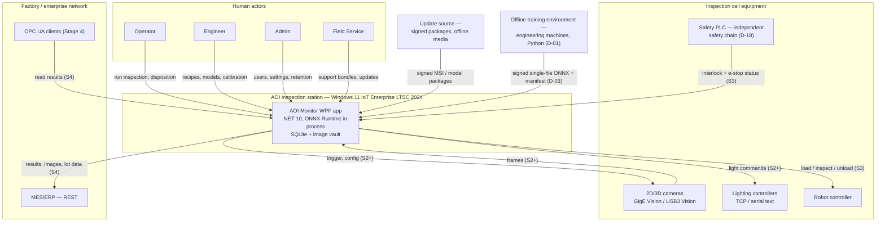
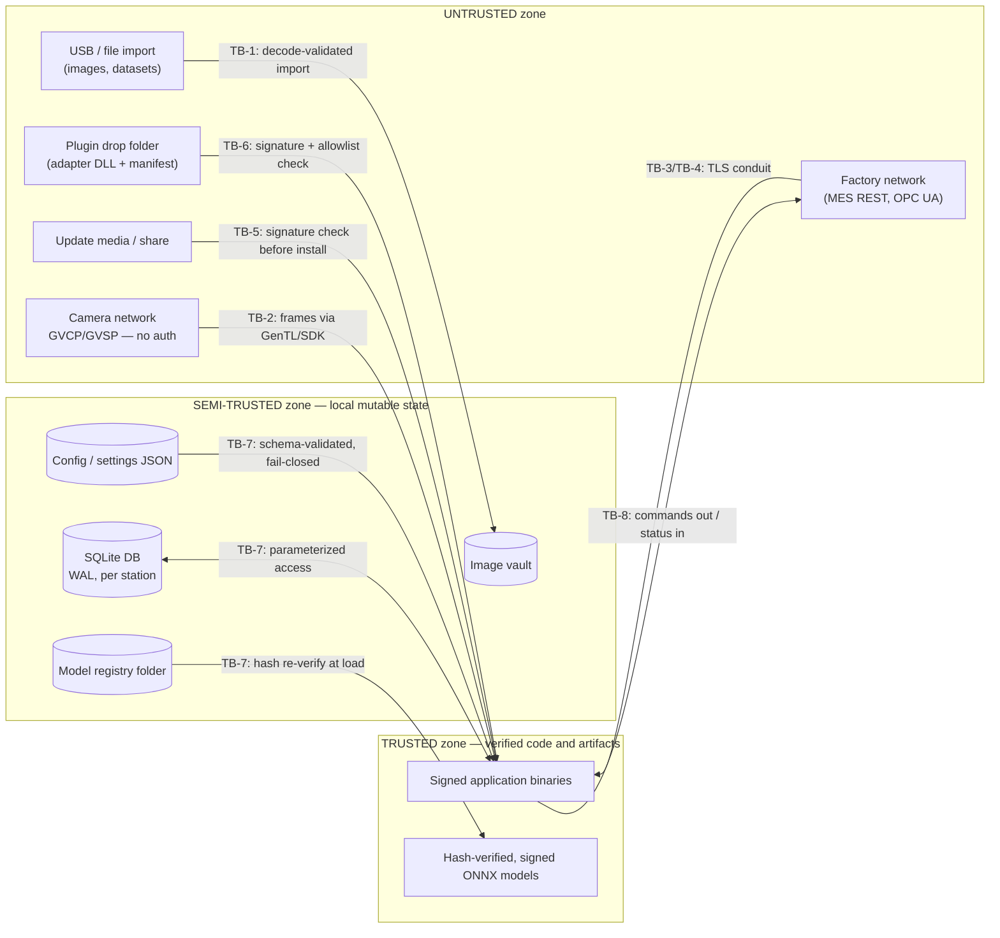

OpenAI/Codex and numerous other coding agents will review your output once you are done.

# VOL02 Context, Quality, and Technology — AOI Software Architecture, Secure Development, and Change-Control Standard, v1.0 (2026-07-15)

Scope: this volume defines the system asset register and data classification (§8), the system context and trust boundaries (§9), the measurable quality-attribute scenarios (§10), and the binding technology decision with the supported-platform matrix and end-of-life policy (§11) for the AOI Monitor product (`jdseo921/AOI_PCB_Database`).

Supersedes/Related existing docs: the §11.4 platform matrix **supersedes** the OS statements in `Docs/DEPLOYMENT.md`, `Docs/VALIDATION.md`, `Docs/DEPLOYMENT.md`, and `Docs/VALIDATION.md` (all four still name Windows 10, which is end-of-support — SD-09). §10 **refines** the numeric targets in `DESIGN.md` and `CONTRIBUTING.md`; where numbers conflict, this standard prevails. `Docs/ROADMAP.md`, `Docs/ROADMAP.md`, `Docs/ARCHITECTURE.md`, and `DESIGN.md` remain authoritative for stage vocabulary and UI design authority and are cited, not restated.

Requirement IDs owned by this volume: **ARC-001..015**. Assumptions: **A-VOL02-1..6**. Open decisions: **OD-VOL02-1..3** (§11.6; merged into §6/VOL01).

---

## 8. System Assets and Data Classification

This section establishes the canonical asset register: every data or key material the product creates, stores, transports, or depends on, with its confidentiality classification, integrity criticality, availability criticality, dominant threats, and a pointer to the section that owns its handling rules. It exists because every downstream control — encryption, signing, retention, redaction, export, backup — is scoped by classification; an asset missing from this register is an asset with no rules. The boundary with neighboring sections: §9 says *where* these assets cross trust boundaries; §21/VOL05 and §37/VOL05 own persistence and retention mechanics; §27–§31 (VOL07–VOL09) own the protective controls.

### 8.1 Classification levels

| Level | Meaning |
|---|---|
| Public | Disclosure causes no harm (published docs, marketing text). |
| Internal | Vendor-internal engineering/operational data; disclosure causes limited harm. |
| Confidential | Disclosure causes material harm to the vendor or to customer operations. |
| Customer-IP | Customer-owned intellectual property or quality records; contractual and PIPA/GDPR duties attach (§46/VOL16). |
| Secret | Authentication, signing, or credential material; disclosure enables impersonation, forgery, or code execution. |

### 8.2 Criticality levels

- **Integrity — High**: undetected tampering can cause escaped defects, unsafe motion, falsified quality evidence, or arbitrary code execution. **Med**: tampering degrades quality or operations but is detectable before harm. **Low**: tampering is a nuisance.
- **Availability — High**: loss stops inspection or breaks a traceability duty. **Med**: loss degrades operations; workaround exists. **Low**: loss is recoverable without production impact.

### 8.3 Asset register (Table 8-1)

Classification column abbreviations: Pub/Int/Conf/C-IP/Sec. Criticality: H/M/L.

| Asset | Class | Integ. | Avail. | Primary threats | Handling rules |
|---|---|---|---|---|---|
| Customer PCB images (incl. golden refs) | C-IP | H | M | exfiltration, training-set poisoning, evidence tamper | §29/VOL08, §46/VOL16 |
| Ground-truth labels / validation manifests | C-IP | H | M | label poisoning → false model acceptance | §31/VOL09 |
| Inspection recipes | C-IP | H | H | tamper → silent escapes; process know-how theft | §18/VOL04, §29/VOL08 |
| ROI definitions | C-IP | H | H | tamper disables inspection zones | §18/VOL04 |
| Thresholds / threshold profiles | Conf | H | H | threshold lowering → silent detection loss | §18/VOL04, §31/VOL09 |
| AI models (ONNX + manifests) | Conf | H | H | model swap/backdoor, theft of trained IP | §19/VOL04, §31/VOL09 |
| Model-signing keys | Sec | H | M | key theft → forged "verified" models | §30/VOL08 |
| Calibration data / profiles | Int | H | H | tamper → false 3D metrology verdicts | §20/VOL04, §33/VOL10 |
| Camera identities (serial/MAC/device ID) | Int | H | M | spoofed camera → forged frame provenance | §32/VOL10 |
| Lighting profiles | Int | M | M | tamper degrades acquisition repeatability | §32/VOL10 |
| Robot command channel | Int | H | H | command injection/replay → unsafe motion | §34/VOL11 |
| Interlock / safety status (observed) | Int | H | H | spoofed "safe" state, observation-channel DoS | §34/VOL11 (D-18) |
| MES credentials (API key/bearer/basic) | Sec | H | M | theft → forged MES records, lateral movement | §30/VOL08, §35/VOL11 |
| OPC UA certificates + private keys | Sec | H | M | endpoint impersonation | §30/VOL08, §35/VOL11 |
| User accounts + password hashes | Conf | H | H | store tamper → privilege escalation (§8.4 note 2) | §28/VOL07 |
| Audit logs | Conf | H | H | tamper/deletion destroys forensics (§8.4 note 3) | §38/VOL13, §21/VOL05 |
| Defect / inspection results | C-IP | H | H | falsification of quality records | §21/VOL05, §37/VOL05 |
| Lot / serial traceability data | C-IP | H | H | falsification breaks recall traceability | §21/VOL05, §35/VOL11 |
| Update packages | Conf | H | M | trojanized update → fleet code execution | §42–43/VOL15 |
| License files | Int | M | H | forgery (revenue), tamper → station refusal | §42/VOL15 |
| Source code | Conf | H | M | supply-chain implant, IP theft | §42/VOL15, §49/VOL17 |
| Build credentials (CI tokens, secrets) | Sec | H | M | theft → poisoned releases | §42/VOL15 |
| Code-signing keys | Sec | H | M | theft → signed malware under product identity | §30/VOL08, §43/VOL15 |
| Support bundles / crash reports | Conf | M | L | residual-data exfiltration past redaction | §45/VOL15, §46/VOL16 |

### 8.4 Current-state notes (repo reality, binding context for the handling-rule owners)

1. **Storage location hazard.** The development storage root resolves under a OneDrive-synced user-profile path (`Docs`-documented default is `%LOCALAPPDATA%\AOI_Monitor`, but the repo itself lives under `C:/Users/smic9/OneDrive/Desktop/`). Cloud-sync of Customer-IP assets is a confidentiality and corruption hazard; §37/VOL05 owns the relocation obligation.
2. **User store is plain unsigned JSON** (`AOI_Monitor/Services/AuthenticationSettingsService.cs:48,270-275`): anyone with file write access can grant Admin or drop PBKDF2 iterations to 1 (verification honors the stored count, line 149). Classification of this asset as Confidential/Integrity-High is therefore currently unmet; §28/VOL07 owns the fix.
3. **Audit rows carry no tamper evidence** (no hash chain or HMAC; `AOI_Monitor/Data/AoiDatabase.Audit.cs`): the Integrity-High rating is currently unmet; §38/VOL13 owns the fix.
4. **Model SHA-256 is computed at registration but never re-verified at load** (`ModelRegistryService.cs:33` vs `OnnxInspectionEngine.cs:59`); manifests are unsigned. The AI-model row's Integrity-High rating is currently unmet; §19/VOL04 and §31/VOL09 own the fix.
5. **Secrets use DPAPI CurrentUser with null entropy** (`SecretProtectionService.cs:9-35`): any same-user process decrypts all Secret-class rows above. §30/VOL08 owns the hardening.

These notes record nonconformities against the register; they are not waivers. Each cited owner section carries the corrective requirement.

### 8.5 Minimum handling obligations by classification

The handling-rule pointers in Table 8-1 name the sections that own the detailed controls. The floor below applies to every asset of the given class regardless of which section owns it; owner sections MAY tighten but SHALL NOT relax these floors.

| Class | At rest | In transit | Export / disclosure | Disposal |
|---|---|---|---|---|
| Public | none | none | free | none |
| Internal | NTFS ACLs on station | integrity-protected channel | vendor discretion, logged | standard deletion |
| Confidential | volume encryption minimum (OD-VOL02-3) | authenticated + encrypted channel | named-recipient only, audited | verified deletion |
| Customer-IP | volume encryption minimum; never on cloud-synced paths | authenticated + encrypted channel | customer consent required (§46/VOL16) | contract-driven; certificate of deletion on request |
| Secret | DPAPI/HSM/token per §30/VOL08; never plaintext, never in repo/CI logs | never transmitted in plaintext; never in URLs | prohibited; rotation on suspected exposure | cryptographic erasure / key destruction |

Two composition rules complete the scheme:

1. **Aggregation rule.** A composite artifact (support bundle, export package, configuration backup, database file) takes the classification of the highest-classified asset it contains. A support bundle that embeds redacted MES settings is Confidential even though every individual field was redacted, because redaction is a blocklist mechanism with known bypass shapes (`SecretProtectionService.RedactKnownSecrets` matches literal strings and three regex families only — encoded or relocated secrets pass through).
2. **Labeling rule.** Every export artifact SHALL carry its classification in its manifest so downstream handlers (Field Service, customer IT) can apply their own controls; the export machinery in §37/VOL05 owns the manifest field.

### R: Asset-register requirements

**[ARC-001]** (P1 | ALL | All)
The Software Architect SHALL update Table 8-1 in the same release cycle as any change that adds, removes, or reclassifies an asset.
- Why: an outdated asset register silently un-scopes encryption, signing, retention, and export controls downstream. Maps: 62443-4-1 SR-1; CSF2; SSDF-PW.1.
- Verify: release checklist item RC-ARC-01 (asset-register diff reviewed against the release change log). Evidence: release checklist record. Owner: Software Architect. Auto: Manual review.
- Exception: Not allowed. Review: Per release.

**[ARC-002]** (P2 | ALL | Persistence, Config)
Every new persistent data store (table group, file store, or configuration file) SHALL be assigned a §8.1 classification and §8.2 criticality rating in its pull-request description before merge.
- Why: unclassified stores escape handling rules; the schema already grew from a documented ~40 tables to 60 without register updates (`AoiDatabase.Infrastructure.cs`). Maps: 62443-4-1 SR-1; CSF2; Internal.
- Verify: PR template classification field; reviewer confirms rating or rejects. Evidence: PR record. Owner: Software Lead. Auto: Manual review.
- Exception: Not allowed. Review: Per release.

---

## 9. System Context and Trust Boundaries

This section fixes the external actors and systems the product talks to, and the trust boundaries every data flow crosses. It exists so that threat models (§27/VOL07), zone/conduit designs (§13/VOL03), and input-validation rules (§29/VOL08) all start from one agreed picture instead of per-author sketches. Boundary with neighbors: §12–§16/VOL03 decompose the inside of the application; this section treats the application as one node.

### 9.1 System context

**Reading this diagram:** four human roles (Operator, Engineer, Admin, Field Service) interact only through the AOI Monitor application on the station. The station exchanges data with four equipment classes in the inspection cell — cameras and lighting from Stage 2, robot controller and safety PLC from Stage 3 — and with MES/ERP and OPC UA clients on the factory network from Stage 4. Two flows enter from outside the factory loop: signed update packages (installer and model updates, offline-capable per D-08) and trained models produced in the offline Python training environment, which reach a station only as signed single-file ONNX plus manifest (D-03). The safety PLC is drawn as a status *source*, not a command target: per D-18 the application observes safety state and never implements a safety function. The training environment is never network-connected to production stations.

### 9.2 Data-flow diagram with trust boundaries

**Reading this diagram:** three zones. The **untrusted** zone contains everything the product does not control: files and USB media brought by users, the camera network (GigE Vision GVCP/GVSP carry zero authentication, integrity, or confidentiality [GIGEV] — any host on the segment can control a camera), the factory network including MES endpoints and OPC UA peers, update media, and the plugin drop folder (any writer to that folder is an untrusted code supplier). The **semi-trusted** zone is the station's own mutable state — SQLite database, image vault, JSON configuration, and the model-registry folder. It is "semi" because the files are user-writable on a shared shop-floor PC: the application must treat them as authentic only after integrity verification (schema validation, hash re-verification, signed manifests), never by location. The **trusted** zone contains only artifacts whose integrity is cryptographically established: Authenticode-signed binaries (D-12) and models whose SHA-256 has been re-verified against a signed manifest at load time (D-03). Every arrow label names the trust-boundary control that binds at that crossing; the controls are specified in the owning sections listed in Table 9-1.

### 9.3 Trust-boundary register (Table 9-1)

| ID | Boundary | Crossing rule (summary) | Owner section | Current state |
|---|---|---|---|---|
| TB-1 | File/USB image import | extension allowlist, full decode, pixel-bomb guard, SHA-256 dedupe | §29/VOL08 | Implemented (`AoiDatabase.Images.cs:99-137`) |
| TB-2 | Camera network (GVCP/GVSP) | isolated segment; treat all GVCP writes as unauthenticated; validate device XML | §32/VOL10, §13/VOL03 | No hardware yet; rules bind at S2 |
| TB-3 | MES REST conduit | HTTPS only, credential protection, response schema validation | §35/VOL11 | Nonconforming: `http://` accepted (`MesIntegrationSettingsService.cs:83-87`) |
| TB-4 | OPC UA conduit | min Basic256Sha256; prefer Aes256_Sha256_RsaPss [OPCUA-P2] | §35/VOL11 | Stage 4 stub (`NullOpcUaMesClient`) |
| TB-5 | Update media/source | signature verification before any install or activation (D-08, D-12) | §43/VOL15 | Absent: unsigned publish (`build-windows-app.yml`) |
| TB-6 | Plugin drop folder | signed + allowlisted assemblies only | §15/VOL03, §16/VOL03 | Nonconforming: unsigned `Assembly.LoadFrom` (`VisionCameraAdapters.cs:134`) |
| TB-7 | Local mutable state | parameterized SQL; schema-validated fail-closed config; hash re-verify models at load | §21/VOL05, §29/VOL08 | Partial: SQL parameterized; config unsigned; no model re-verify |
| TB-8 | Robot/safety channel | commands gated on observed-safe status; fail safe on channel loss (D-18) | §34/VOL11 | Partial: edge-polled only; bypass flag defaults true (`RobotCycleService.cs:37`) |
| TB-9 | Training → production transfer | signed single-file ONNX + manifest only; pickle-class formats prohibited (D-03) | §31/VOL09, §19/VOL04 | Partial: ONNX-only path exists, signing absent |

The "Current state" column records verified repo facts as of 2026-07-15. Rows marked Nonconforming or Partial are existing defects governed by the owner sections' requirements; this table does not waive them. Boundary controls follow the IEC 62443 zone/conduit model [62443-3-2]; the segmentation architecture (industrial DMZ between cell and enterprise, no direct corporate-to-cell connection) follows NIST SP 800-82r3 §6 [800-82] and is specified in §13/VOL03.

Four boundary groups deserve explicit interpretation, because they are where the current implementation and the required posture diverge most sharply:

- **Data-in boundaries (TB-1, TB-2).** Image import is the one boundary the codebase already treats correctly: extension allowlist, full decode before acceptance, a decompression-bomb pixel cap, and SHA-256 dedupe. The camera network is the opposite case: GVCP and GVSP travel as plaintext UDP with no authentication of any kind [GIGEV], and GenICam device XML is fetched *from the device*, so a spoofed camera is simultaneously a data-integrity and a parser-attack vector. No protocol fix exists; the only controls are an isolated camera segment, host allow-listing of camera identities (which is why camera identity is an Integrity-High asset in Table 8-1), and bounded, validated XML parsing — all owned by §32/VOL10.
- **Code-in boundaries (TB-5, TB-6, TB-9).** These are the arbitrary-code-execution boundaries and carry the strictest crossing rule in the standard: nothing executes unless its signature verifies against a product-controlled identity. Today all three are open: published packages are unsigned, the plugin loader runs `Assembly.LoadFrom` on any DLL a JSON manifest names in a user-configurable folder, and model manifests are unsigned with hashes never re-verified after registration. The severity is stated plainly: until §15/VOL03 (plugins) and §43/VOL15 (updates) close these, any writer to the adapter folder or update share owns the station.
- **Peer-conduit boundaries (TB-3, TB-4, TB-8).** MES, OPC UA, and robot/safety channels connect to systems the vendor does not control on networks the customer operates. The crossing rules are mutual authentication and encrypted transport where the protocol supports it (HTTPS-only for MES — the current `http://` acceptance is a defect; Basic256Sha256 minimum for OPC UA [OPCUA-P2]) and, for the robot channel where legacy text protocols may offer neither, compensating segmentation plus the D-18 observe-and-fail-safe posture.
- **Local-state boundary (TB-7).** The subtlest one: the application's own files. A shop-floor PC with a shared Windows account gives every local process and every USB-wielding visitor write access to SQLite files, JSON settings, and the model registry. Location on disk therefore confers zero trust; authenticity comes only from verification at read time (schema-validated fail-closed config per D-10, hash re-verification of models per D-03, tamper-evident audit records per §38/VOL13). The §8.4 notes list where this verification is missing today.

### 9.4 Stage activation of boundaries

Trust boundaries activate cumulatively across the staged rollout (`Docs/ROADMAP.md` owns stage vocabulary): Stage 1 exposes TB-1, TB-5, TB-6, TB-7, and TB-9 (an offline station still imports files, loads plugins, takes updates, and receives models); Stage 2 adds TB-2 (camera network); Stage 3 adds TB-8 (robot/safety); Stage 4 adds TB-3 and TB-4 (MES/OPC UA conduits). Consequence: the code-execution and local-state boundaries are *already live today* — "offline Stage 1" is not a safe harbor, which is why ARC-004 re-approves the diagrams at each stage transition instead of deferring all boundary work to Stage 4.

### R: Trust-boundary requirements

**[ARC-003]** (P1 | ALL | All)
Any change that adds or alters a network listener, outbound connection, file-import path, IPC endpoint, or plugin load path SHALL include an updated §9.2/§9.3 trust-boundary entry recorded in the pull request before merge.
- Why: unreviewed boundary changes are how untrusted input bypasses validation (trust boundary violation). Maps: CWE-501; 62443-4-1 SR-2; SSDF-PW.1.
- Verify: PR template trust-boundary field; reviewer confirms the diagram/table delta or an explicit "no boundary change" statement. Evidence: PR record. Owner: Security Lead. Auto: Manual review.
- Exception: Not allowed. Review: Per release.

**[ARC-004]** (P3 | S2+ | All)
The §9.1 and §9.2 diagrams SHALL be re-reviewed and re-approved before the first production deployment of each new stage (S2, S3, S4).
- Why: each stage adds boundaries (camera network, robot/safety, MES/OPC UA); stale context diagrams misdirect the per-stage threat models in §27/VOL07. Maps: 62443-4-1 SR-2; 42010; 800-82.
- Verify: stage-transition checklist item with recorded approval. Evidence: stage readiness record. Owner: Software Architect. Auto: Manual review.
- Exception: Not allowed. Review: On change.

**[ARC-005]** (P3 | S2+ | REST, OPCUA, RobotAdapter)
The project SHALL publish and keep release-current a communications matrix listing every listening port, outbound destination, protocol, and direction for each Table 9-1 conduit.
- Why: integrators need conduit facts to write the zone/conduit Cybersecurity Requirements Specification (ZCR 6); undocumented flows block customer firewall approval. Maps: 62443-3-2; 800-82; Internal.
- Verify: matrix document exists in `Docs/standard/` and its diff is reviewed each release. Evidence: released communications matrix. Owner: Software Architect. Auto: Manual review.
- Exception: Not allowed. Review: Per release.

---

## 10. Quality Attributes and Measurable Scenarios

This section states the product's quality requirements as measurable stimulus–response scenarios, organized by the nine product-quality characteristics of ISO/IEC 25010:2023 [25010] (which adds **safety** as a top-level characteristic and renames usability to **interaction capability** and portability to **flexibility**). It exists because unmeasured quality goals decay into slogans; the source specs demonstrated this with "within 1 second" (SD-07) and "8-hour stability" (SD-08). Boundary with neighbors: §40/VOL13 owns the detailed latency/capacity budgets, §41/VOL13 the reliability engineering, §39/VOL14 the test methods; this section fixes the *targets and measures* they must satisfy.

Each scenario is marked **Automated** (measured by CI/soak tooling — the repo already has `InspectionLatencyTraces`, `UiPerformanceMonitorService`, `SoakTestService`, and `UiNavigationPerformanceTests` as instrumentation seeds) or **Assessed** (measured by a documented manual procedure). Targets marked with an assumption ID are conservative defaults pending the open decisions in §11.6.

### 10.1 Measurement governance

Three rules govern how the scenario measures are produced, so that numbers in release evidence are comparable release-to-release:

1. **One instrument per measure.** Each Automated measure names its data source: QAS-01/02 read the `InspectionLatencyTraces` table and the batch-run timing columns already persisted by the data layer; QAS-03/11 read the soak harness (`SoakTestService`) and alarm log; QAS-06 reads the service-layer authorization architecture-test/analyzer output together with the maintained privileged-operation inventory; QAS-07's Automated gate-time measure reads the CI gate-execution timing (its lead-time measure is Assessed — see the summary map — and reads the change-tracking system); QAS-08 reads analyzer/gate output; QAS-12 reads the safety-status observation command-gate test harness; QAS-13 reads the startup timeline event (ARC-015 gives it a stable event ID). Substituting a different instrument is a measurement-method change and requires a recorded rationale in the release evidence.
2. **Percentiles, not means.** Every latency-class measure is stated as P95 plus max. Means are recorded for information only — the source spec's undefined "within 1 second" (SD-07) is precisely the failure mode this rule prevents.
3. **Environment binding.** Every measurement records the hardware profile, OS build, and application version it ran on (the ARC-015 startup inventory makes this free). A number without its environment is not release evidence.

Summary map of scenarios to ISO/IEC 25010:2023 characteristics [25010]:

| QAS | Characteristic (2023 model) | Mode | Detail owner |
|---|---|---|---|
| 01 | Performance efficiency — time behaviour | Automated | §40/VOL13 |
| 02 | Performance efficiency — capacity | Automated | §40/VOL13 |
| 03 | Reliability — availability | Automated | §41/VOL13 |
| 04 | Reliability — recoverability | Assessed | §41/VOL13 |
| 05 | Security — resistance (patch response) | Assessed | §54/VOL16 |
| 06 | Security — accountability, authenticity | Automated | §28/VOL07 |
| 07 | Maintainability — modifiability | Automated (gate) / Assessed (lead time) | §49–51/VOL17 |
| 08 | Maintainability — modularity, testability | Automated | §23/VOL06 |
| 09 | Flexibility — installability | Assessed | §44/VOL15 |
| 10 | Interaction capability — operability, user-error protection | Assessed | §36/VOL12 |
| 11 | Reliability — fault tolerance | Automated | §41/VOL13 |
| 12 | Safety — fail safe, hazard warning | Automated | §34/VOL11 |
| 13 | Performance efficiency — time behaviour | Automated | §40/VOL13 |

The safety row uses the characteristic newly added at the top level in the 2023 edition; earlier 25010:2011 citations in existing repo docs (e.g., `DESIGN.md` "ISO/IEC 25010-style") predate this and are read as referring to the 2023 model from this standard's effective date.

### QAS-01 Inspection latency (performance efficiency — time behaviour) — Automated

| Field | Specification |
|---|---|
| Source / stimulus | One inspection image (≤ 5 megapixels) submitted for analysis |
| Environment | Production station, reference hardware profile (A-VOL02-6), steady state |
| Artifact | Inference pipeline: load → preprocess → inference → overlay |
| Response | Verdict and overlay rendered; latency trace row persisted |
| Response measure | Live S2+ path: P95 ≤ 1,000 ms, P99 ≤ 1,500 ms, hard watchdog ceiling 3,000 ms; S1 batch (WL-BATCH) workload: P95 ≤ 2,000 ms. The §40/VOL13 latency budget is authoritative for these figures (supersedes SD-07's undefined "1 second") |

### QAS-02 Sustained board throughput (performance efficiency — capacity) — Automated

| Field | Specification |
|---|---|
| Source / stimulus | Continuous board arrivals, 3 views per board (A-VOL02-2) |
| Environment | Stage 2+ station, 8-hour run |
| Artifact | Acquisition + inference + persistence pipeline |
| Response | Every board fully processed and persisted before the next mechanical cycle completes |
| Response measure | P95 software processing ≤ 5 s per 3-view board set; zero unbounded queue growth over 8 h |

### QAS-03 Continuous-operation availability (reliability — availability) — Automated

| Field | Specification |
|---|---|
| Source / stimulus | Normal 24/7 production operation |
| Environment | Production station, monthly window, planned maintenance excluded |
| Artifact | Whole application |
| Response | Application available for inspection on demand |
| Response measure | Availability ≥ 99.5 % per calendar month (A-VOL02-3); production soak evidence ≥ 72 h without crash (supersedes SD-08's 8 h, which remains the PoC minimum) |

### QAS-04 Recovery time (reliability — recoverability) — Assessed

| Field | Specification |
|---|---|
| Source / stimulus | Process crash; separately, station power loss |
| Environment | Production station with committed inspection data in SQLite WAL |
| Artifact | Application + database + image vault |
| Response | Restart to inspection-ready; WAL recovery; no committed record lost |
| Response measure | ≤ 5 min after crash; ≤ 15 min after power loss including OS boot; 0 committed-transaction loss |

### QAS-05 Security patch turnaround (security) — Assessed

| Field | Specification |
|---|---|
| Source / stimulus | Published vulnerability in a shipped component (OS-external, e.g., ONNX Runtime, SQLite bundle, NuGet dependency) |
| Environment | Vendor release process; §54/VOL16 intake |
| Artifact | Release pipeline and update channel |
| Response | Patched release or documented mitigation available to customers |
| Response measure | KEV-listed or CVSS ≥ 9.0: ≤ 14 days; CVSS 7.0–8.9: ≤ 30 days (consistent with D-03's 30-day patch-adoption bound) |

### QAS-06 Authorization coverage (security — accountability, authenticity) — Automated

| Field | Specification |
|---|---|
| Source / stimulus | Any invocation of a privileged operation (user CRUD, model deploy/activate, threshold change, retention change, export) |
| Environment | Any authentication mode, any code path including tests and tools |
| Artifact | Service-layer authorization (`RoleAuthorization` and successors) |
| Response | Operation permitted only with an authenticated session holding the required role; default-deny for unknown operations and page keys |
| Response measure | 100 % of the privileged-operation inventory enforced at service layer; 0 default-allow arms. Current nonconformities: `RoleAuthorization.cs:41` (`_ => true`) and unguarded `ModelRegistryService.SetActiveModel` — corrective requirements are owned by §28/VOL07 |

### QAS-07 Change lead time (maintainability — modifiability) — Automated (gate time) / Assessed (lead time)

| Field | Specification |
|---|---|
| Source / stimulus | Approved P1 defect fix enters implementation |
| Environment | Normal development, full quality gate (`Scripts/run-quality-gates.ps1`) |
| Artifact | Build/test/gate pipeline |
| Response | Release-candidate package with all gates green |
| Response measure | Automated: single gate execution ≤ 30 min on CI. Assessed (source: change-tracking system): change lead time from approved-fix start-of-implementation to green release candidate ≤ 5 working days P50, ≤ 10 working days P95 |

### QAS-08 Code-limit conformance (maintainability — modularity, testability) — Automated

| Field | Specification |
|---|---|
| Source / stimulus | Any merged change |
| Environment | CI analyzers + gates |
| Artifact | Source tree |
| Response | D-15 limits enforced (file soft 250 / hard 400 logical lines, method 20/50, cyclomatic ≤ 10, cognitive ≤ 15, nesting ≤ 3, params ≤ 5) |
| Response measure | 0 new violations per release; pre-existing violations (e.g., `AoiDatabase.Infrastructure.cs` at 4,409 lines, `MainWindow.xaml.cs` at 1,744) tracked on the §23/VOL06 burn-down list and not grown |

### QAS-09 Station provisioning time (flexibility — installability) — Assessed

| Field | Specification |
|---|---|
| Source / stimulus | New station commissioning from bare approved OS image |
| Environment | Offline factory floor, signed install media only, documented runbook |
| Artifact | Installer + configuration + readiness checks |
| Response | Station reaches inspection-ready state with readiness panel green |
| Response measure | ≤ 4 h end-to-end by one Field Service engineer (A-VOL02-4); zero undocumented manual steps |

### QAS-10 Operator task error rate (interaction capability — operability, user-error protection) — Assessed

| Field | Specification |
|---|---|
| Source / stimulus | Trained operator performs defect disposition (accept/reject/review) |
| Environment | Acceptance trial, ≥ 100 disposition actions, Korean-language UI |
| Artifact | HMI disposition workflow |
| Response | Dispositions recorded with correct verdict and audit identity |
| Response measure | Erroneous disposition rate ≤ 2 % (A-VOL02-5); Critical alarm acknowledged ≤ 10 s after display; no status conveyed by color alone (per `DESIGN.md` and SD-11) |

### QAS-11 Degraded-mode fault tolerance (reliability — fault tolerance) — Automated

| Field | Specification |
|---|---|
| Source / stimulus | Camera disconnect (or frame timeout) during a live run |
| Environment | Stage 2+ station mid-production |
| Artifact | Acquisition layer + alarm pipeline |
| Response | No crash; Critical alarm raised; new inspections refused; completed results retained; recovery on reconnect without restart |
| Response measure | Alarm ≤ 2 s from fault detection; 0 corrupted or half-written result rows; resume without application restart |

### QAS-12 Safety observation fail-safe (safety — fail safe, hazard warning) — Automated

| Field | Specification |
|---|---|
| Source / stimulus | Safety-status observation channel lost or stale (PLC unreachable) during Stage 3 operation |
| Environment | Robot cell, motion pending or in progress |
| Artifact | Safety-status observation + robot command gate (D-18) |
| Response | All further motion commands refused; operator alarmed; state audited |
| Response measure | Refusal decided at the next command gate and ≤ 500 ms after staleness detection; the simulation bypass flag (`PermitSafetyBypassForSimulation`, currently defaulting to true) is governed by a false-in-production requirement owned by §34/VOL11 |

### QAS-13 Cold start (performance efficiency — time behaviour; reliability) — Automated

| Field | Specification |
|---|---|
| Source / stimulus | Application launch on a provisioned station |
| Environment | Post-boot, storage root on local non-synced disk |
| Artifact | Startup sequence (DB init, retention sweep, readiness evaluation) |
| Response | Home page interactive; on DB-init failure, degraded mode with Critical alarm instead of crash (existing behavior, `MainWindow.OnLoaded`) |
| Response measure | ≤ 30 s to interactive on reference hardware; degraded-mode entry ≤ 45 s on induced DB failure |

### R: Quality-scenario requirements

**[ARC-006]** (P2 | ALL | CI, Diagnostics)
The release pipeline SHALL measure and record the response measures of every §10 scenario marked "Automated" whose stage precondition is met by the release candidate's target stage, for each release candidate.
- Why: quality scenarios decay without per-release measurement; the repo already emits latency and navigation-performance JSON that no gate consumes (`Scripts/run-quality-gates.ps1` artifacts). Maps: 25010; SSDF-PW.8; Internal.
- Verify: fitness function FF-ARC-QAS-01 (aggregates QAS measurements into one release report). Evidence: `TestResults/` QAS report per release. Owner: QA Lead. Auto: Fully automated.
- Exception: Not allowed. Review: Per release.

**[ARC-007]** (P2 | ALL | CI)
A release candidate with any Automated §10 response measure breaching its threshold SHALL NOT be released without an exception recorded through the exception process (§53/VOL17).
- Why: converts scenarios into enforceable gates; otherwise latency and availability regressions ship to factories unnoticed. Maps: 25010; Internal.
- Verify: release gate compares the FF-ARC-QAS-01 report to §10 thresholds. Evidence: gate log plus exception record where applicable. Owner: Release Manager. Auto: Partially automated.
- Exception: Allowed — approver: Product Owner. Review: Per release.

---

## 11. Technology Decision and Supported Platform Matrix

This section records the binding technology decision (D-01) with the full alternatives analysis the commissioning prompt demands, renders the complete decision register D-01..D-18 as ADR summaries, fixes the supported-platform matrix, and states the end-of-life policy. It exists so that platform arguments are settled once, with recorded revisit conditions, instead of re-litigated per feature. Boundary with neighbors: §12–§16/VOL03 specify the internal architecture that D-01 implies; §43/VOL15 owns installer/update mechanics (D-08); §31/VOL09 owns the model-format security rules that motivate D-03.

### 11.1 Decision context and constraints

Fixed constraints, all verified in the repo or the research pack:

1. The product is a Windows industrial HMI: 66,305 LOC of C# WPF exists today (`AOI_Monitor.csproj`, `net10.0-windows`), with 524 executable xUnit test cases and exactly 3 NuGet packages (`Microsoft.Data.Sqlite` 10.0.1, `Microsoft.ML.OnnxRuntime` 1.27.0, `SQLitePCLRaw.bundle_e_sqlite3` 3.0.3).
2. Deployment targets are offline-capable factory stations in Korea first, then ASEAN/Japan/EU (`sources/roadmap.md`), with customer IT departments that routinely enforce application allow-listing (App Control for Business) and prohibit interpreters on production equipment.
3. Inference is currently CPU-only ONNX Runtime; the source spec's "TensorFlow/PyTorch + CUDA" requirement (SD-01, defect #2/#10 in the contradictions register) does not match any shipped code.
4. The team is very small (VOL01 §7 reality note); every additional runtime, language, or process multiplies its support burden.
5. Camera vendor SDKs (Basler, Hikrobot, Cognex, Keyence — the vendors named in `Templates/CameraAdapterTemplate`) ship first-class C++ and .NET bindings; Python bindings are secondary.

### 11.2 Strategy evaluation

Strategies evaluated:

- **A** — C#/.NET WPF HMI + isolated **Python** inference worker process (gRPC/IPC from day one).
- **B** — C#/.NET WPF with **in-process ONNX Runtime** (CPU EP). The incumbent: this is what the repo builds today.
- **C** — **Python desktop application** with a production GUI framework (PySide6/Qt; Tkinter is excluded as indefensible for industrial HMI — SD-05).
- **D** — C#/.NET WPF HMI + **native C++ inference service** (ONNX Runtime C++ API or TensorRT) over local IPC.

Scores are 1 (poor) to 5 (excellent) per axis; higher is better. "Simpler/safer" scores high on complexity axes.

| # | Axis | A | B | C | D | Note |
|---|---|---|---|---|---|---|
| 1 | Windows deployment reliability | 3 | 5 | 2 | 4 | Python redistribution on locked-down Windows is fragile; B is one self-contained publish |
| 2 | GUI maintainability | 4 | 4 | 2 | 4 | WPF identical for A/B/D; Qt-in-Python weaker tooling for this codebase |
| 3 | Team skills | 3 | 5 | 2 | 2 | 66 kLOC C# exists; no C++ capacity; Python only in `Scripts/ml` |
| 4 | Camera SDK compatibility | 4 | 4 | 3 | 4 | Acquisition lives in the .NET HMI process for A/B/D; vendor .NET bindings first-class |
| 5 | Robot SDK compatibility | 4 | 4 | 3 | 4 | Ethernet/RS-485 text protocols reachable from all; .NET adapters already templated |
| 6 | CUDA / model support | 5 | 4 | 5 | 5 | Python native to ML tooling; ORT CUDA EP also available to B/D when triggered |
| 7 | Process isolation | 5 | 2 | 2 | 5 | A/D isolate native inference faults; B/C run everything in one process |
| 8 | Memory safety | 3 | 4 | 3 | 2 | B is managed + one native lib; D adds a whole C++ service; A adds native wheel zoo |
| 9 | Crash containment | 5 | 2 | 2 | 5 | Worker crash restartable without HMI loss in A/D |
| 10 | Debug simplicity | 2 | 5 | 3 | 2 | B: one runtime, one process; A/D: two runtimes + IPC traces |
| 11 | Installer simplicity | 2 | 5 | 3 | 3 | B: single MSI payload; A must ship a pinned Python env |
| 12 | Patchability | 3 | 5 | 2 | 3 | B: monthly .NET servicing of one runtime; A/C add PyPI churn |
| 13 | Dependency risk | 2 | 5 | 1 | 3 | B has 3 locked NuGet packages today; PyPI surface is orders of magnitude larger |
| 14 | Startup time | 3 | 4 | 3 | 4 | Python worker cold start adds seconds; QAS-13 bounds all |
| 15 | Performance | 3 | 4 | 3 | 5 | Inference is native in all; A pays IPC image copies; D can specialize |
| 16 | Long-term support | 3 | 5 | 2 | 4 | .NET 10 LTS to 2028-11-14 [NET-LC]; ML Python deps churn fastest |
| 17 | Licensing | 4 | 5 | 2 | 4 | B all-MIT; C: PySide LGPL / PyQt GPL-or-commercial ambiguity |
| 18 | Observability | 3 | 5 | 3 | 3 | Single logging service (D-09) trivial in one process; A/D need cross-process correlation |
| 19 | Testability | 3 | 5 | 2 | 3 | 524-case xUnit suite + static reset seams exist for B; A/D add contract-test stacks |
| 20 | International deployment | 3 | 4 | 3 | 3 | One runtime to localize/service abroad; WPF Korean IME/font support proven in repo |
| 21 | Customer IT acceptance | 2 | 5 | 2 | 4 | Signed single .NET MSI is familiar; interpreters on production stations are routinely refused |
| 22 | Offline capability | 3 | 5 | 3 | 4 | All can run air-gapped; B is easiest to keep patched offline |
| — | **Total (of 110)** | **72** | **96** | **56** | **80** | |

#### Axis-group analysis

- **Deployment and supply chain (axes 1, 11, 12, 13, 21, 22).** This group decides industrial viability more than raw capability does, and it is where the strategies separate hardest: B scores 30/30, D 22, A 15, C 13. The mechanism is concrete: a self-contained .NET publish is one signed MSI whose runtime is patched by rebuilding; a Python runtime on a station is an interpreter plus a package tree that App Control for Business policies must enumerate, that antivirus interferes with, and that customer IT audits item by item. The repo's current 3-package, lock-file dependency posture is an asset the decision protects.
- **Fault isolation (axes 7, 8, 9).** The only group B loses (8/15 vs 13 for A and 12 for D). The exposure is real: ONNX Runtime is native code in the HMI process, and Stage 2 will add vendor camera SDKs — historically the least stable native components in machine-vision systems. The decision does not deny this; it prices it. The triggers in D-01 convert the exposure into a monitored quantity (ARC-011) with a pre-decided response (worker split over D-06 IPC), and §16/VOL03 bounds the blast radius in the interim.
- **ML ecosystem (axis 6).** A and C win on paper, but the axis matters less than it looks: training already lives in Python off-station (D-01 confinement), and the station only needs to *execute* a frozen ONNX graph. The station-side ML flexibility A would buy is flexibility the architecture deliberately does not want on quality-critical equipment.
- **People and lifecycle (axes 3, 10, 16, 19, 20).** A small team pays every complexity cost twice — once to build, once per support incident at a customer site abroad. B's single runtime, single debugger, single test stack (524 existing cases) is the difference between a field issue diagnosed from a log bundle and one requiring a bilingual two-runtime remote session.

**Strategy A (Python worker from day one).** Its only decisive wins are ML-ecosystem flexibility (axis 6) and isolation (7, 9). It pays for them immediately in deployment (1, 11), supply chain (13 — PyPI on every production station), customer IT acceptance (21), and dual-runtime debugging (10) — costs incurred on day one for an isolation benefit the product does not yet need, since the incumbent CPU-EP inference has produced no crash evidence. A is the correct *shape* if the triggers in D-01 fire and the natural inference host is Python; it is the wrong starting point.

**Strategy B (incumbent).** Wins 15 of 22 axes outright. Its two real weaknesses are honest ones: process isolation and crash containment (7, 9) — a native fault in ONNX Runtime or a future vendor camera SDK takes down the HMI. This is exactly what the D-01 worker-split triggers exist for: the weakness is accepted *conditionally*, with tripwires, not ignored. Everything else — single signed MSI, 3 locked dependencies, one LTS runtime, one test stack, one logging pipeline — compounds in B's favor for a small team shipping to conservative factory IT.

**Strategy C (Python desktop app).** Rejected with severity. It scores last on 13 axes, would discard 66 kLOC of working, tested C# (a rewrite with zero customer-visible benefit), puts a full interpreter plus PyPI surface on every production station, and inherits Qt licensing ambiguity. Tkinter, named in the source spec (SD-05), cannot meet the spec's own HMI requirements and was never a defensible option. C is documented here so it stays rejected on the record.

**Strategy D (C++ inference service).** The strongest alternative to B on paper: best raw performance and equal-best isolation. It fails on team reality (axis 3 — nobody maintains a hardened C++ service here), memory safety (axis 8 — CISA Secure by Design [SBD] explicitly steers away from new memory-unsafe components), and doubled toolchain/installer complexity. D becomes relevant only if a *vendor-supplied* native inference component with its own support contract appears; in that case it re-enters through the D-01 worker split with the worker implemented in whatever language the supported component dictates. A variant of D — a .NET worker process hosting ONNX Runtime, i.e., Strategy B split across two processes — is in fact the *default* realization of the D-01 worker split: it keeps every B advantage (one language, one test stack, one signing pipeline) while adding the isolation A and D were credited for. This is why the split is a trigger-driven evolution of B rather than a competing strategy.

#### Sensitivity of the decision

The 24-point gap between B and the runner-up is not score-tuning noise, but it is honest to state what would erode it: (a) sustained native-crash evidence (trigger T2) removes B's debug/observability advantages by forcing the split anyway — at which point the split costs the same whether taken early or late, and taking it late means it is paid only if needed; (b) a customer-mandated GPU requirement (trigger T1) removes part of the CUDA axis penalty on A/D — but the split-B variant above answers it equally well; (c) a hypothetical cross-platform mandate (Linux stations) would invalidate WPF and reopen D-05/D-01 wholesale — no such requirement exists in any source document, and the decision explicitly does not hedge against it. No plausible single-axis change flips the ranking; only trigger events do, and they lead to the split-B variant, not to A, C, or D.

### 11.3 The architecture decision (ADR for D-01) and the decision register

**ADR D-01 — Target architecture: modular monolith, .NET-first (Strategy B).** *Status: Accepted (2026-07-15).*

- **Decision.** The product is a single C#/.NET 10 WPF desktop application with in-process ONNX Runtime (CPU execution provider) as the Stage 1–2 baseline. Internally it SHALL be structured as a modular monolith with the module and dependency rules of §14–§15/VOL03, so that the inference module remains extractable.
- **Worker-split triggers.** A separately isolated local inference worker process (same machine, versioned IPC contract per D-06) SHALL be introduced when **any** of: (T1) a GPU/CUDA execution provider is adopted; (T2) a native vendor SDK proves crash-prone in production evidence (≥ 2 attributable HMI crashes in 90 days); (T3) measured inference impact on the UI thread breaches the QAS-01/§40 HMI budget at P95 for two consecutive releases.
- **Python confinement.** Python is prohibited on production stations; it is confined to the offline training pipeline (`Scripts/ml`) on engineering machines (see ARC-012).
- **Consequences.** Accepted: single-process crash blast radius until a trigger fires (mitigated by QAS-11/QAS-13 fail-degraded behavior and crash reporting). Gained: minimum deployment/supply-chain/testing surface for a small team. The trigger evaluation is a per-release obligation (ARC-011).
- **Revisit.** Any trigger firing; or .NET desktop strategy change at .NET 12 LTS planning time.

The full register follows. Authors of other volumes cite these as D-xx and do not reopen them; each entry's long-form tradeoff analysis lives here by reference to §11.2 or the owning volume.

| ID | Decision (condensed) | Status | Rationale (condensed) | Revisit condition |
|---|---|---|---|---|
| D-01 | Modular monolith, .NET-first (Strategy B); worker split on triggers T1–T3 | Accepted | Wins 15/22 axes (§11.2); isolation deferred behind explicit tripwires | Any trigger T1–T3 fires |
| D-02 | .NET 10 LTS; Windows 11 IoT Enterprise LTSC 2024 primary, Win 11 Pro 24H2+ accepted; Win 10 prohibited; x64 only | Accepted | OS window to 2034-10-10 [WIN-LC]; runtime to 2028-11-14 [NET-LC]; Win 10 EOL 2025-10-14 (SD-09) | .NET 12 LTS GA (expected Nov 2027); OS servicing change |
| D-03 | ONNX Runtime pinned exact (1.27.0); single-file ONNX + signed manifest; external-data tensors and pickle-class formats prohibited | Accepted | No vendor LTS → product-defined window; external-data path-traversal CVE class [ONNX-SEC]; corrects SD-01 | Quarterly ORT review; CVE in pinned version |
| D-04 | SQLite (WAL) per station for S1–S3; PostgreSQL adoption criteria defined; SMB-shared SQLite prohibited | Accepted | Single writer, offline, zero admin; store-and-forward central sync | Any criterion: >1 writer, central store, networked DB, >50 GB or write contention |
| D-05 | WPF + MVVM; business rules never in code-behind/XAML | Accepted | Matches repo AGENTS.md; current 14.6 kLOC code-behind is migration debt (§23/VOL06), not a counter-decision | WPF investment signals change in .NET 12+ |
| D-06 | gRPC over Windows named pipes for worker IPC; versioned protos, length limits, deadlines | Accepted (dormant) | Local-only transport, contract versioning ready for the split | Activates with D-01 split; cross-machine need reopens transport |
| D-07 | NuGet locked mode (`packages.lock.json`); training-env Python pinned with hashes | Accepted | Lock files exist; locked-mode restore must be enabled (ARC-014) | Central package management adoption |
| D-08 | Signed WiX MSI per-machine, offline-capable; signed updates, staged activation, no auto-download; MSIX rejected | Accepted | Air-gap and kiosk constraints; analysis in §43/VOL15 | MSIX servicing model changes for LTSC |
| D-09 | One structured logging service, stable event IDs, rolling size-capped files; no third-party telemetry by default | Accepted | Fleet diagnostics + plant SIEM mapping [800-82] | Stage 4 central log aggregation requirement |
| D-10 | Layered JSON config (defaults<site<station), schema-validated, fail-closed; secrets via DPAPI | Accepted | Current unsigned JSON + null-entropy DPAPI are nonconformities (§8.4) | Multi-station central configuration need |
| D-11 | Local accounts, PBKDF2 ≥ 600k SHA-256; RBAC default-deny at service boundary; S4 MES/AD federation with bounded 72 h offline fallback | Accepted | Corrects SD-03/SD-10; current default-allow gate is a nonconformity (QAS-06) | Customer IdP mandate at Stage 4 |
| D-12 | Authenticode OV cert, HSM/token custody, commercial CA; SHA-256 manifest + detached signature for models/recipes/updates | Accepted | CA/B hardware-key rule since 2023-06; Azure Artifact Signing Public Trust unavailable to KR orgs; EV buys no SmartScreen bypass | Artifact Signing KR eligibility change |
| D-13 | xUnit 2.9.3 suite + WPF UI tests + coverlet with thresholds + Stryker.NET on critical modules | Accepted | 524 cases exist; coverage referenced but never collected — must be activated (§39/VOL14) | Framework EOL or .NET 12 migration |
| D-14 | Roslyn analyzers as errors, dotnet format, NetArchTest, PS quality gates, secret scan, CycloneDX SBOM, vuln gate; CI actions SHA-pinned | Accepted | Existing `Scripts/` gates are the seed; CI is currently advisory (§52/VOL17 owns enforcement) | CI platform change |
| D-15 | Code limits: file 250/400, method 20/50, cyclomatic ≤10, cognitive ≤15, nesting ≤3, params ≤5, ctor deps 5, PR 400/800 | Accepted | Commissioning defaults; tightening free, relaxation only via §53/VOL17 exception | Two consecutive releases of exception churn |
| D-16 | UTC persisted; local time display-only; monotonic clocks for durations; NTP monitored | Accepted | Traceability and cross-station correlation | None foreseen |
| D-17 | Versioned defect taxonomy, stable string IDs, per-model-version mapping table; 3-disposition model per IPC-A-610J | Accepted | Decouples model class indices from quality records [IPC-610] | IPC-A-610 revision K |
| D-18 | Application is non-safety-rated; safety functions live in an independent safety chain (safety PLC/relay, ISO 13849-1 PLr); app observes and fails safe | Accepted | Corrects SD-04; a Windows WPF app cannot host an e-stop function [13849-1] | Machinery Regulation 2023/1230 harmonized standards (applies 2027-01-20) |

#### 11.3.1 Accepted tradeoffs per decision

Each register entry buys something by paying something. The payment side is recorded here so future authors do not mistake a priced cost for an oversight.

- **D-02.** Windows 11 IoT Enterprise LTSC 2024 is the only 10-year Windows 11 option (non-IoT LTSC 2024 gets 5 years, Pro churns feature updates) [WIN-LC], but its procurement channel is less familiar to some customers; accepting Win 11 Pro 24H2+ as a second tier buys customer flexibility at the price of a dual-track OS validation burden. x64-only forgoes ARM industrial PCs.
- **D-03.** Pinning ONNX Runtime exactly forgoes automatic improvements and puts lifecycle diligence on the product (no vendor LTS exists). Prohibiting external-data tensors caps single-file models at the practical ONNX protobuf limit — an accepted ceiling for the current model class; a model that genuinely needs external data re-enters via ADR (ARC-010), not by quietly relaxing the rule.
- **D-04.** SQLite caps concurrency at one writing process and makes central reporting a store-and-forward design (already partially built: `CentralSyncService`). It buys zero database administration on stations and offline-first operation. Prohibiting shared-file SQLite over SMB forgoes the "easy" central file at the price the corruption literature demands.
- **D-05.** WPF is Windows-only and its Fluent theming is explicitly incomplete in .NET 10; both are acceptable because D-02 binds the HMI to Windows anyway. The real cost is enforcement debt: the repo today is View-plus-static-Service (14,652 LOC code-behind vs 581 LOC ViewModels, 21 views calling `AoiDatabase` directly), so D-05 is a migration obligation (§23/VOL06), not a description of current state.
- **D-06.** Named pipes are unroutable — the worker can never accidentally become a network service. The same property forbids a remote inference host without a recorded transport decision; that constraint is deliberate.
- **D-07.** Locked-mode restore makes every dependency bump an explicit, reviewable diff; the friction is the control. Hash-pinned Python requirements slow training-environment updates for the same reason.
- **D-08.** MSI lacks MSIX's containerized rollback; compensated by staged activation plus the explicit rollback procedure in §43/VOL15. "No auto-download" shifts patch latency onto Field Service scheduling — accepted, because unsolicited downloads are unacceptable in air-gapped and change-controlled factories.
- **D-09.** No third-party telemetry means no automatic field crash analytics for the vendor; support bundles (operator-initiated, redacted, §45/VOL15) are the substitute. This is the privacy-preserving default the Customer-IP classification demands.
- **D-10.** Fail-closed configuration can stop a station on a bad edit; that is preferred over running with undefined behavior. DPAPI binds secrets to machine/account state, so reimaging destroys them — a documented key-loss/recovery runbook is a §30/VOL08 obligation, not an afterthought.
- **D-11.** Local accounts cost per-station user administration that MES SSO would avoid; accepted because an MES outage must not lock operators out of a running line (bounded 72 h view-only fallback). PBKDF2 at ≥ 600k iterations costs tens of milliseconds per login — negligible at HMI login rates.
- **D-12.** An OV certificate accrues SmartScreen reputation gradually (EV no longer buys instant reputation — Microsoft states this outright), so first releases may show warnings on unmanaged machines; managed factory PCs neutralize this via App Control policy. HSM/token custody adds signing-ceremony friction; the CA/B baseline made that mandatory economy-wide in 2023, and the Korea ineligibility for Azure Artifact Signing Public Trust forecloses the cheap alternative.
- **D-13.** Keeping xUnit 2.9.3 avoids suite churn across 524 cases. Activating coverlet thresholds will initially fail red — the activation ramp (thresholds, exclusions, ratchet) is owned by §39/VOL14. Stryker runtime cost is confined to critical modules by policy.
- **D-14.** Analyzers-as-errors and SHA-pinned actions add per-PR friction and periodic pin-maintenance work; that is the price of converting the currently *advisory* CI (no branch protection, tag-pinned actions, no `permissions:` blocks) into an enforcing gate system (§52/VOL17).
- **D-15.** Hard size/complexity limits can force mechanical splits — the repo's partial-class decomposition of `AoiDatabase` and the large views shows both the pattern and its limit (partials shrink files, not coupling). The limits still bind; the coupling problem is governed separately by the §14–15/VOL03 module rules.
- **D-16.** UTC-only persistence makes raw rows less readable for operators; the display layer owns conversion. Monotonic-clock durations forbid wall-clock arithmetic in timing code — a retrofit cost where existing code subtracts timestamps.
- **D-17.** A per-model-version mapping table is permanent bookkeeping; it prevents the silent class-index drift that would corrupt historical quality records when models are retrained. Adopting the IPC-A-610J three-disposition model (Acceptable / Process Indicator / Defect — "Target" was removed in revision J [IPC-610]) keeps the taxonomy aligned with the standard customers audit against.
- **D-18.** The observe-and-fail-safe posture means the application cannot claim to *add* safety even when it detects danger — it refuses commands and alarms, nothing more. Accepted deliberately: claiming a software safety function would place ML in a safety function and trigger mandatory notified-body conformity under the Machinery Regulation from 2027 [MR], and a non-real-time Windows process could not honor the claim anyway [13849-1].

### 11.4 Supported-platform matrix

All dates verified in the research pack on 2026-07-15 unless marked otherwise. "Support window" is the vendor lifecycle; "product action" is what this standard requires before the window closes (see §11.5).

| Component | Pinned / accepted version | Support window | Product action | Source |
|---|---|---|---|---|
| OS (primary) | Windows 11 IoT Enterprise LTSC 2024 | Extended support to **2034-10-10** | None until 2034 planning | [WIN-LC] |
| OS (accepted) | Windows 11 Pro/Enterprise 24H2 or later | Modern lifecycle, per-build servicing | Verify build support at each install (ARC-013) | [WIN-LC] |
| OS (prohibited) | Windows 10, all editions | EOL **2025-10-14** (consumer ESU to 2026-10-13) | No new deployments; existing must migrate (SD-09) | [WIN-LC] |
| Runtime | .NET 10 LTS (10.0.x, SDK pinned via `global.json`) | EOL **2028-11-14** | Begin .NET 12 LTS migration by 2028-05-18 (180 days before 2028-11-14) | [NET-LC] |
| Runtime servicing | Self-contained publish carries its own runtime copy | Monthly Patch Tuesday releases | Rebuild + redeploy on security patches; self-contained apps do NOT auto-update | [NET-LC] |
| Inference | ONNX Runtime **1.27.0** exact pin | **No vendor LTS exists** | Product-defined window: quarterly review; adopt security patch releases ≤ 30 days (D-03) | [ONNX-SEC] |
| Database | Microsoft.Data.Sqlite 10.0.1 + SQLitePCLRaw.bundle_e_sqlite3 3.0.3 | Assumed to track the .NET 10 lifecycle (A-VOL02-1) | Review with the quarterly matrix review | [NET-LC], A-VOL02-1 |
| GPU driver / CUDA | Not applicable at baseline (CPU EP only) | — | On trigger T1: pin NVIDIA driver branch + CUDA/cuDNN to the ORT EP compatibility matrix before adoption (OD-VOL02-2) | Internal |
| Python (training env only) | CPython 3.11.x, pinned with hashed requirements (D-07) | Upstream EOL October 2027 — **UNVERIFIED** against the research pack | Plan 3.12+ migration of `Scripts/ml` during 2027; never present on stations (ARC-012) | Internal |
| Auxiliary .NET tooling | Any tool still on .NET 8 or 9 | Both EOL **2026-11-10** | Migrate to .NET 10 before 2026-11-10 (currently none known in repo — all projects target net10.0) | [NET-LC] |

### 11.5 End-of-life policy

1. **180-day rule.** For every row of §11.4, a migration plan SHALL exist and be in execution no later than 180 days before the component's end-of-support date (enforced by ARC-009).
2. **No EOL in production.** No production station runs the product on any component past its end-of-support date (enforced by ARC-008, P0). Customer refusal to upgrade an OS is handled as a §53/VOL17 risk-acceptance case owned by the customer, documented in writing, and excludes the station from Stage 2+ (network-connected) operation.
3. **Product-defined windows.** Components without a vendor lifecycle (ONNX Runtime, SQLitePCLRaw bundle) get a product-defined window: exact pin + quarterly review + 30-day security-patch adoption (D-03). The quarterly review is the ARC-009 record.
4. **Fleet visibility.** Per-station platform inventory is logged at startup (ARC-015) so Field Service can produce an EOL exposure report for the whole fleet on demand.
5. **Known horizon events** as of 2026-07-15: .NET 8/9 wall 2026-11-10 (no repo exposure); CPython 3.11 training-env migration during 2027 (UNVERIFIED date); .NET 10 → .NET 12 LTS migration start ≥ 2028-05-18 (180 days before 2028-11-14); Windows 11 IoT LTSC 2024 horizon 2034-10-10.

### 11.6 Assumptions and open decisions (VOL02)

| ID | Statement | Risk | Disposition |
|---|---|---|---|
| A-VOL02-1 | Microsoft.Data.Sqlite/SQLitePCLRaw support tracks the .NET 10 lifecycle; no independent vendor LTS statement was verified | Patch orphaning if the bundle decouples from .NET servicing | Reviewed at each quarterly matrix review (ARC-009) |
| A-VOL02-2 | Board cycle model: 3 views/board, ≤ 5 MP/view; software budget ≤ 5 s P95 per board so software never gates a ≥ 15 s mechanical cycle | Customer takt time may be faster | OD-VOL02-1 |
| A-VOL02-3 | Availability target 99.5 %/month; no customer SLA exists yet | Contractual SLA may be stricter | OD-VOL02-1 |
| A-VOL02-4 | Provisioning target 4 h from bare approved image | First real commissioning may exceed it | Re-baseline after first Stage 2 commissioning |
| A-VOL02-5 | Operator error-rate target 2 % over ≥ 100 disposition actions, measured in the acceptance trial | Trial method not yet customer-agreed | Method fixed in §39/VOL14 test plan |
| A-VOL02-6 | Reference hardware profile = the CPU class of the first customer-approved station build; all QAS-01/02/13 numbers bind to it | Numbers unanchored until the profile is published | Publish profile with first Stage 2 station order |

Open decisions (merged into §6/VOL01):

- **OD-VOL02-1** — Customer takt time, throughput contract, and availability SLA are unspecified in all three source documents. Owner: Product Owner. Needed before: Stage 2 customer validation. Until decided, A-VOL02-2/-3 targets bind.
- **OD-VOL02-2** — GPU driver/CUDA/cuDNN pinning policy is deliberately undecided until D-01 trigger T1 fires; deciding it now would pin versions that will be stale at adoption time. Owner: Software Architect.
- **OD-VOL02-3** — Database/image-vault encryption-at-rest mechanism (BitLocker volume-level vs SQLCipher-class page-level) affects the handling rules of six Table 8-1 rows. Owner: Security Lead. Decided in §30/VOL08; until then BitLocker on all production stations is the minimum interim control.

### R: Platform and decision-governance requirements

**[ARC-008]** (P0 | ALL | Installer, Update)
Production stations SHALL NOT run the product on an operating system, .NET runtime, or §11.4-listed component that is past its vendor end-of-support date.
- Why: EOL components receive no security fixes; the source spec's Windows 10 target (SD-09) was already end-of-support before first commercial release. Maps: CWE-1104; WIN-LC; NET-LC; 800-82.
- Verify: fitness function FF-ARC-EOL-01 (startup platform check per ARC-015 aggregated into a fleet EOL report each release). Evidence: fleet EOL report. Owner: Release Manager. Auto: Partially automated.
- Exception: Not allowed. Review: Quarterly.

**[ARC-009]** (P1 | ALL | Build, CI)
The Release Manager SHALL review the §11.4 platform matrix at least quarterly and record each row's remaining support window together with any migration plan required by the 180-day rule.
- Why: support windows move (ONNX Runtime has no vendor LTS; .NET patch cadence is monthly); an unwatched matrix defeats the §11.5 lead-time policy. Maps: NET-LC; WIN-LC; SSDF-PW.4; CWE-1104.
- Verify: dated review record referencing the matrix revision. Evidence: quarterly review record in `Docs/standard/`. Owner: Release Manager. Auto: Manual review.
- Exception: Not allowed. Review: Quarterly.

**[ARC-010]** (P2 | ALL | All)
Adopting, replacing, or removing a runtime, GUI framework, database engine, inference runtime, IPC mechanism, or installer technology SHALL be recorded as an ADR citing the affected D-01..D-18 entries before implementation begins.
- Why: prevents silent reopening of decided tradeoffs; keeps the §11.3 register the single authority for platform decisions. Maps: 42010; SSDF-PW.1; Internal.
- Verify: review checklist — ADR file exists under `Docs/standard/adr/` and names the decision IDs. Evidence: ADR file. Owner: Software Architect. Auto: Manual review.
- Exception: Not allowed. Review: On change.

**[ARC-011]** (P2 | S1–S4 | Inference, Diagnostics)
Release evidence SHALL record an evaluation of the three D-01 worker-split triggers (T1 GPU EP adoption, T2 crash-prone native SDK, T3 HMI latency-budget breach) with a measured or observed result for each.
- Why: D-01 defers process isolation behind explicit tripwires; unmeasured triggers rot the deferral into an unbounded in-process risk. Maps: Internal; 25010.
- Verify: release-evidence template field populated from the build's ONNX Runtime execution-provider configuration (T1), the crash-report log (T2), and QAS-01/§40 latency measurements (T3). Evidence: release evidence package. Owner: Software Architect. Auto: Partially automated.
- Exception: Not allowed. Review: Per release.

**[ARC-012]** (P1 | ALL | Installer, Build)
Production station images and installer payloads SHALL NOT contain a Python interpreter, Python standard library, or any component requiring one at runtime.
- Why: D-01 confines Python to the offline training environment; a station interpreter reopens the PyPI supply-chain and unsigned-script execution surface on quality-critical equipment. Maps: 62443-4-2 CR 7.7; SSDF-PW.4; Internal.
- Verify: fitness function FF-ARC-PY-01 (publish-output scan for `python*.exe`/`python3*.dll` and package-manifest audit). Evidence: CI gate log. Owner: Software Lead. Auto: Fully automated.
- Exception: Not allowed. Review: Per release.

**[ARC-013]** (P2 | S1–S4 | Installer)
The installer SHALL refuse installation when the target OS build or .NET runtime prerequisite does not match a supported row of the §11.4 matrix.
- Why: install-time enforcement is the cheapest point to stop deployment onto Windows 10 or unsupported builds (SD-09); field remediation costs a site visit. Maps: WIN-LC; NET-LC; Internal.
- Verify: installer test matrix including at least one unsupported-OS VM case. Evidence: installer test report. Owner: Release Manager. Auto: Partially automated.
- Exception: Allowed — approver: Software Architect. Review: Per release.

**[ARC-014]** (P2 | ALL | CI, Build)
Dependency restore for every project's committed `packages.lock.json` SHALL run in locked mode (`RestoreLockedMode=true`) as required by the authoritative supply-chain restore-integrity rule in the SUP catalogue (§42/VOL15), which governs both CI and release restore and defines the failure behaviour on lock drift.
- Why: lock files exist (`Directory.Build.props:5`) but restore is not locked today (`dotnet-ci.yml:25`); this entry is the D-07 technology-decision hook and defers to §42/VOL15 for the restore-integrity mechanism rather than maintaining a parallel specification. Maps: CWE-494; SSDF-PW.4; SLSA.
- Verify: the locked-mode restore fitness function owned by §42/VOL15 covers this product's CI and release restore steps; no separate VOL02 gate. Evidence: CI configuration plus gate log. Owner: Software Lead. Auto: Fully automated.
- Exception: Not allowed. Review: On change.

**[ARC-015]** (P3 | ALL | Diagnostics, Logging)
At every startup the application SHALL write the OS build number, .NET runtime version, ONNX Runtime version, and application version to the diagnostics log under one stable event ID.
- Why: fleet EOL tracking (ARC-008/-009) and OT asset inventory both need machine-readable per-station platform facts. Maps: 800-82; NET-LC; Internal.
- Verify: unit test class PlatformInventoryLoggingTests asserts the event and its four fields. Evidence: test run plus sample log line. Owner: Software Lead. Auto: Fully automated.
- Exception: Not allowed. Review: Annual.
