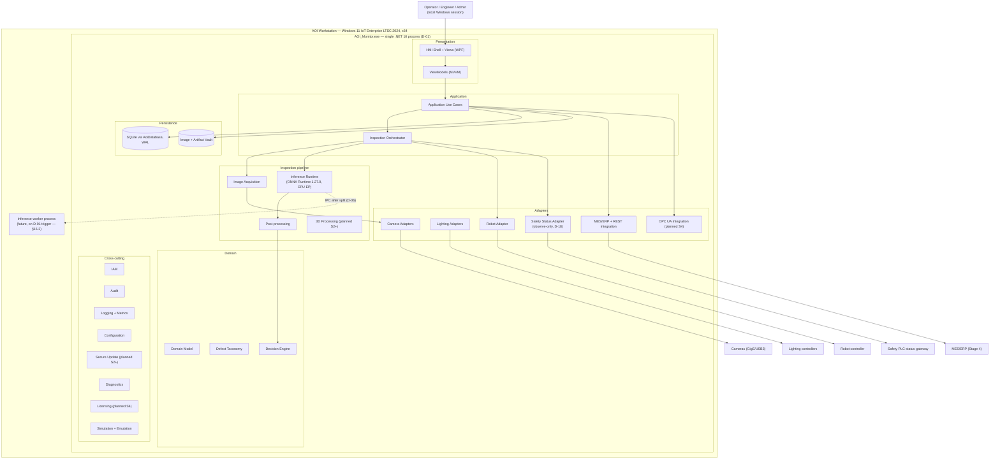
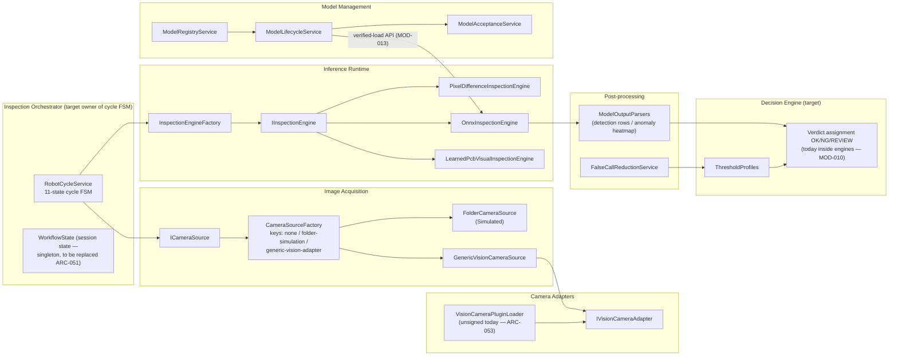
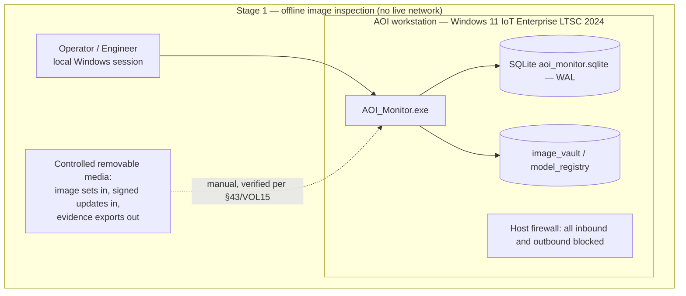
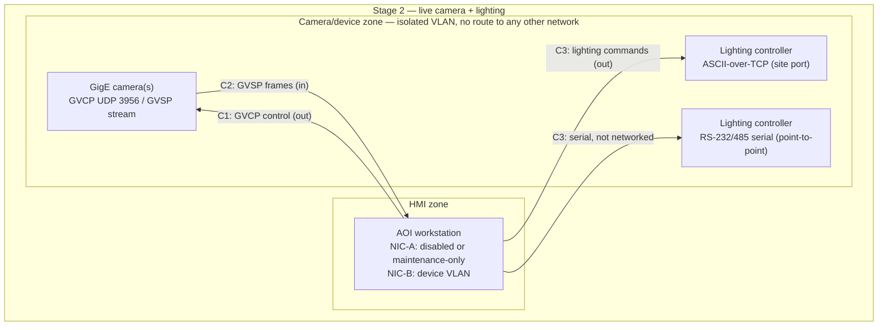
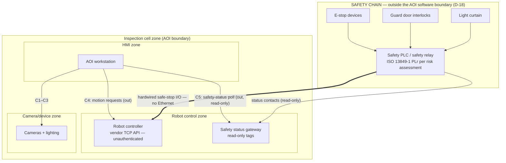
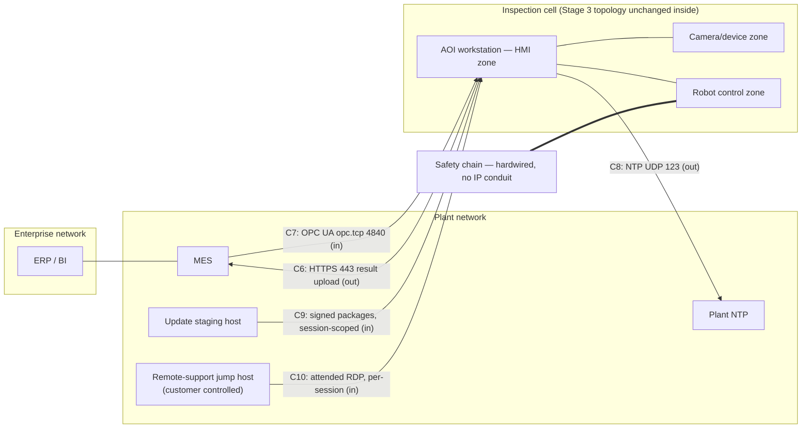
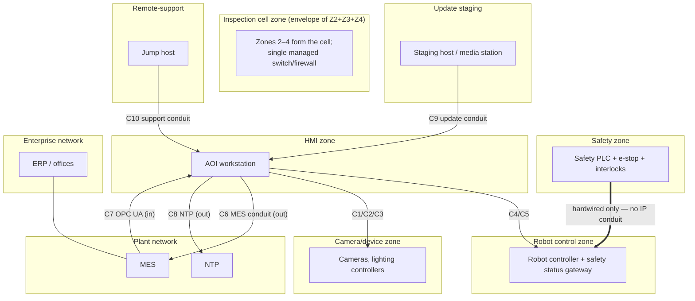
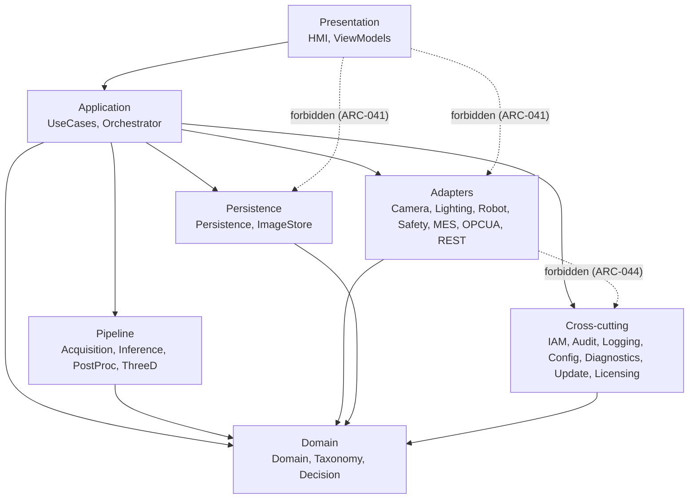
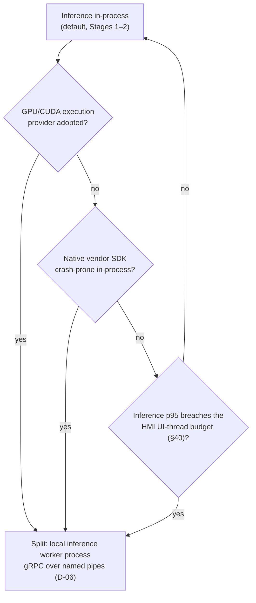

# VOL03 Architecture, Modules, and Dependencies — AOI Software Architecture, Secure Development, and Change-Control Standard, v1.0 (2026-07-15)

Scope: this volume defines the binding target architecture of AOI Monitor, the deployment topology and network zone model for rollout Stages 1–4, the complete module catalogue, the dependency rules between modules, and the process/isolation boundaries — including the conditions under which the in-process inference runtime is split into a worker process (D-01).

Supersedes/Related existing docs: `Docs/Architecture_Overview.md`, `Docs/Architecture_Extension_Guide.md`, `Docs/Integration_Boundaries.md`, `Docs/Vendor_Adapter_Implementation_Guide.md`, and `Docs/Stage_Mapping.md` remain in force as descriptive and procedural guides; where their prose conflicts with a requirement in this volume, this volume prevails. `DESIGN.md` remains the UI design authority (HMI rules are governed in §36/VOL12). The repo `AGENTS.md` truthfulness contract is unchanged and is reinforced here (simulation isolation, §16.5).

---

## 12. Target Architecture

This section defines the target software architecture that every change must move toward. It governs the shape of the codebase (layers, containers, components); the inspection, recipe, model, and device lifecycles that run inside this shape are governed in §17–20/VOL04, and the data architecture in §21/VOL05. The architecture is an **evolution of the existing `AOI_Monitor` codebase, not a rewrite** (ARC-030): the repo already contains the correct seams (engine factory, `IntegrationContracts.cs`, adapter templates, single persistence gateway) and this section names them as the skeleton of the target.

### 12.1 Architectural style and honest current state

Per decision D-01, AOI Monitor is a **modular monolith**: a single C#/.NET 10 WPF desktop process (`AOI_Monitor.exe`, `net10.0-windows`, win-x64) with in-process ONNX Runtime (CPU execution provider) for Stages 1–2, SQLite (WAL) embedded persistence (D-04), and a filesystem image/artifact vault. Python is prohibited on production stations and confined to the offline training pipeline (`Scripts/ml/`) on engineering machines.

The current state, measured 2026-07-15, deviates from the target in three structural ways that this volume converts into governed, ratcheted debt rather than silent facts:

1. **MVVM is nominal.** 14,652 LOC of view code-behind versus 581 LOC of ViewModels; 21 view files call `AoiDatabase` directly; business flows are orchestrated from code-behind (332 `MessageBox.Show` call sites in Views + shell). Target: D-05 MVVM with logic in ViewModels/application services (ARC-017/018/041).
2. **Services are static.** 97 of 114 service files are `static class`; cross-module signaling uses 8 `public static event` members; `WorkflowState.Instance` and `IntegrationBoundaryRegistry` are global mutable state. Target: instance services with constructor-declared dependencies and typed notification interfaces (ARC-019/020/050/051).
3. **Module boundaries are implicit.** There is no machine-readable assignment of files to modules, so no dependency rule is enforceable. Target: the §14 catalogue plus `Tools/quality-gates/module_map.json` and the `ArchitectureRulesTests` NetArchTest suite (ARC-016/049).

What is already right and is retained unchanged in the target: the four-state integration status vocabulary (`NotConnected / Simulated / Error / Ready`), the Null-object adapters that fail closed, the engine factory seam (`InspectionEngineFactory`), the versioned SQLite migration mechanism, the navigation lifecycle engineering in the shell, and the simulated-evidence provenance discipline.

### 12.2 C4 container view

**Reading this diagram:** The single box `AOI_Monitor.exe` is the entire production application: one OS process on one Windows 11 workstation. Inside it, the Presentation layer (HMI shell, Views, ViewModels) talks only downward to Application Use Cases, which delegate live inspection sequencing to the Inspection Orchestrator. The Orchestrator drives the inspection pipeline (Image Acquisition → Inference Runtime → Post-processing → Decision Engine) and, at Stage 3, the Robot Adapter — always after consulting the observe-only Safety Status Adapter. The Domain group (Domain Model, Defect Taxonomy, Decision Engine) depends on nothing infrastructural. Adapters wrap all external systems (cameras, lighting, robot, safety PLC status, MES/ERP); the Persistence group (SQLite gateway plus filesystem vault) is reached only from application services, never from Presentation. Cross-cutting services (IAM, Audit, Logging, Configuration, Secure Update, Diagnostics, Licensing, Simulation) are callable from the layers that the §15.2 matrix permits. The dashed arrow to the "Inference worker process" is the only planned second process: it does not exist today and is created only when a §16.2 trigger fires.

### 12.3 C4 component view — inspection pipeline and adapter seams (current names)

**Reading this diagram:** This zooms into the pipeline containers of §12.2 using the class names that exist in the repo today. Acquisition flows from `ICameraSource` through `CameraSourceFactory` (three source keys; unknown keys normalize fail-closed to the null source) to either the simulated `FolderCameraSource` or `GenericVisionCameraSource`, which bridges to the vendor seam `IVisionCameraAdapter`; the plugin loader that populates that seam is unsigned today and is a declared nonconformity (ARC-053). Inference flows from `InspectionEngineFactory` to one of three `IInspectionEngine` implementations; ONNX outputs pass through `ModelOutputParsers` (post-processing). Verdict assignment currently lives inside the engines and `BatchValidationService`; the target moves it into a single Decision Engine component (MOD-010) fed by post-processing scores and threshold profiles. Model Management (`ModelRegistryService` → `ModelLifecycleService` → `ModelAcceptanceService`) becomes the sole gateway through which the Inference Runtime obtains model artifacts (MOD-013). `RobotCycleService` already implements the 11-state cycle FSM and is the nucleus of the target Inspection Orchestrator.

### 12.4 Mapping: current repo layout → target modules

| Current repo element (2026-07-15) | Target module(s) | Evolution action |
|---|---|---|
| `Views/` (18 pages), `MainWindow.xaml.cs` (1,744 LOC) | HMI/Presentation | shrink code-behind (ARC-017/018) |
| `ViewModels/` (4 files, 581 LOC) | HMI/Presentation (VM layer) | grow; absorb view orchestration |
| `Services/` (114 files, 97 static) | UseCases + adapters + cross-cutting | classify per file in `module_map.json` |
| `Services/IntegrationContracts.cs` (620 LOC) | adapter contracts hub | keep; merge `IMesClient`≡`ITraceabilityUploader` |
| `Services/InspectionEngineFactory.cs` + 3 engines | Inference Runtime | async contract (MOD-034) |
| `Services/ModelOutputParsers.cs` | Post-processing | keep |
| `Services/RobotCycleService.cs` (387 LOC) | Inspection Orchestrator + Robot Adapter | split FSM from adapter command path |
| `Services/RoleAuthorization.cs`, `AuthenticationSettingsService.cs`, `LocalUserService.cs` | Identity and Authorization | default-deny (MOD-009) |
| `Data/AoiDatabase.*` (10 partials + migrations) | Persistence, Audit, Image/Artifact Storage | continue partial split; repo interfaces (ARC-021) |
| `Models/` (14 POCO files) | Domain Model | keep BCL-pure (ARC-022) |
| `Services/*SettingsService.cs` (~20 files) | Configuration | consolidate behind schema-validated accessors |
| `Services/{SupportBundle,CrashReport,HmiLayoutAudit,FactoryReadiness,SoakTest}Service.cs` | Diagnostics | keep |
| `Services/{MesRestClient,MesSpoolService,TraceabilityUploadService,CentralSyncService}.cs` | MES/ERP + REST Integration | outbox-first (MOD-020) |
| `Templates/*` (4 adapter template projects) | Simulation / vendor starting points | keep; retire duplicate robot template |
| `Scripts/ml/` (anomalib training) | Training pipeline — engineering machines only | not a station module (§31/VOL09) |
| `Services/WorkflowState.cs` singleton | UseCases session-state service | replace singleton (ARC-051) |
| `IntegrationBoundaryRegistry` (8 static slots) | composition root (not a module) | freeze (ARC-050), replace with injection |

### R: Target-architecture requirements (ARC-016…ARC-030)

#### Structure and module ownership

**[ARC-016]** (P1 | ALL | All)
The application SHALL be organized as the single-process modular monolith of §12.2, in which every source file belongs to exactly one §14 module as recorded in `Tools/quality-gates/module_map.json`.
- Why: unowned files defeat dependency enforcement, review routing, and threat-model scoping in a codebase already at 66,305 LOC. Maps: 42010; 62443-4-1 SD-1; Internal.
- Verify: fitness function FF-ARC-01 (module-map completeness scan in `Scripts/run-quality-gates.ps1`). Evidence: CI gate log; `module_map.json` history. Owner: Software Architect. Auto: Fully automated.
- Exception: Not allowed. Review: Per release.

**[ARC-017]** (P1 | ALL | HMI,ViewModels)
User-visible behavior added or changed after 2026-07-15 SHALL be implemented in ViewModels or application services, with code-behind restricted to view wiring (event forwarding, focus, visual-tree manipulation) per D-05.
- Why: 14,652 LOC of code-behind vs 581 LOC of ViewModels makes UI logic testable only through 12 slow UI tests; D-05 binds MVVM. Maps: MS-SDL; 25010; Internal.
- Verify: review checklist item CR-ARC-1 plus fitness function FF-ARC-02 (code-behind ratchet). Evidence: PR review record; ratchet report artifact. Owner: Software Lead. Auto: Partially automated.
- Exception: Allowed — approver: Software Architect. Review: Per release.

**[ARC-018]** (P2 | ALL | HMI)
A pull request that modifies a file under `AOI_Monitor/Views/` SHALL NOT increase that file's logical line count above the 2026-07-15 baseline recorded in `Tools/quality-gates/codebehind_baseline.json`.
- Why: ratchets the 14,652-LOC code-behind mass downward without a big-bang rewrite; growth reverses the D-05 migration. Maps: Internal; 25010.
- Verify: fitness function FF-ARC-02 (baseline-ratchet script in the quality-gate runner). Evidence: CI gate log. Owner: Software Lead. Auto: Fully automated.
- Exception: Allowed — approver: Software Architect. Review: Quarterly.

**[ARC-019]** (P2 | ALL | UseCases)
New application-service classes SHALL be instance classes with constructor-declared dependencies; adding a new `static class` to the UseCases module is prohibited.
- Why: 97 of 114 existing service files are static, blocking per-scope composition, seams for the D-01 worker split, and fake-free unit tests. Maps: Internal; 25010.
- Verify: fitness function FF-DEP-06 (static-class scan scoped to UseCases namespaces) in test class `ArchitectureRulesTests`. Evidence: CI test log. Owner: Software Lead. Auto: Fully automated.
- Exception: Allowed — approver: Software Architect. Review: Quarterly.

**[ARC-020]** (P2 | ALL | All)
New cross-module notifications SHALL be published through a typed, injected notification interface instead of new `public static event` members.
- Why: the 8 existing static events require 10 hand-paired subscribe/unsubscribe lambdas in `MainWindow.xaml.cs:113-132` and leak subscriptions in forever-cached views. Maps: CWE-401; Internal.
- Verify: FF-DEP-06 static-event ratchet (repo-wide count of cross-module `public static event` may only decrease from 8). Evidence: CI test log. Owner: Software Lead. Auto: Fully automated.
- Exception: Allowed — approver: Software Architect. Review: Quarterly.

**[ARC-021]** (P3 | ALL | Persistence)
New persistence entry points SHOULD be declared on instance repository interfaces owned by the Persistence module rather than as additional `public static` methods on `AoiDatabase`.
- Why: `AoiDatabase` is one static type across 10 partials with a 4,409-line schema file; interface seams are the precondition for the D-04 PostgreSQL trigger. Maps: 42010; Internal.
- Verify: review checklist item CR-ARC-2; deviation rationale recorded in the PR. Evidence: PR review record. Owner: Software Lead. Auto: Manual review.
- Exception: Allowed — approver: Software Architect. Review: Annual.

**[ARC-022]** (P1 | ALL | Domain)
The Domain module SHALL reference only the .NET base class library — no WPF assemblies, `Microsoft.Data.Sqlite`, `Microsoft.ML.OnnxRuntime`, adapter, or Services types.
- Why: domain purity keeps inspection semantics testable in milliseconds and portable across the D-01 worker split; infrastructural bleed-through is costly to reverse. Maps: 42010; 62443-4-1 SD-1; Internal.
- Verify: fitness function FF-DEP-02 (NetArchTest rule in `ArchitectureRulesTests`). Evidence: CI test log. Owner: Software Architect. Auto: Fully automated.
- Exception: Not allowed. Review: Per release.

**[ARC-023]** (P2 | S2+ | Orchestrator)
The Inspection Orchestrator SHALL be the only module that sequences acquisition, inference, post-processing, and decision steps of a live inspection cycle.
- Why: today views orchestrate business flows directly (21 views call `AoiDatabase`; `MonitorView.xaml.cs` is 1,441 LOC), so cycle logic cannot be reused for robot-fed Stage 3 operation. Maps: 42010; Internal.
- Verify: fitness function FF-ARC-05 (scan: Acquisition→Inference→PostProc→Decision step-sequencing calls occur only within Orchestrator namespaces) plus review checklist item CR-ARC-3. Evidence: CI gate log; PR review record. Owner: Software Architect. Auto: Partially automated.
- Exception: Allowed — approver: Software Architect. Review: Per release.

#### Cross-cutting service usage

**[ARC-024]** (P2 | ALL | Logging)
Modules SHALL emit runtime logs exclusively through the Logging module's structured logging API with a stable event ID per message type (D-09).
- Why: scattered ad-hoc logging defeats plant-SOC consumption (ATT&CK ICS detection analytics) and the §38/VOL13 observability model. Maps: 62443-4-2 CR 2.8; ATTACK-ICS; 800-82.
- Verify: fitness function FF-LOG-01 (scan: no direct `File.AppendAllText`/`Trace.Write` log emission outside Logging namespaces). Evidence: CI gate log. Owner: Software Lead. Auto: Fully automated.
- Exception: Allowed — approver: Software Architect. Review: Quarterly.

**[ARC-025]** (P2 | ALL | Config)
Modules other than Configuration SHALL NOT read or write configuration files directly.
- Why: layered, fail-closed, schema-validated configuration (D-10) is unenforceable if modules parse their own JSON; ~20 `*SettingsService` files today become the Configuration module's internals. Maps: 62443-4-2 CR 7.6; Internal.
- Verify: fitness function FF-CFG-01 (file-IO scan for settings paths outside Configuration namespaces). Evidence: CI gate log. Owner: Software Lead. Auto: Fully automated.
- Exception: Allowed — approver: Software Architect. Review: Quarterly.

**[ARC-026]** (P1 | ALL | IAM,UseCases)
Every privileged operation SHALL be authorized inside its owning application service before any state change executes, independent of HMI-layer checks.
- Why: today most capability checks run in code-behind `EnsurePermission` (`MainWindow.xaml.cs:1009-1186`) and `ModelRegistryService.SetActiveModel` carries no service-layer role check — any non-GUI code path bypasses the gate. Maps: CWE-862; 62443-4-2 CR 2.1; SBD.
- Verify: test class `AuthorizationBoundaryTests` (service-layer denial case per capability) plus review checklist item CR-SEC-1. Evidence: CI test log. Owner: Security Lead. Auto: Partially automated.
- Exception: Not allowed. Review: Per release.

#### Architecture stewardship

**[ARC-027]** (P2 | ALL | All)
The §12.2/§12.3 architecture views SHALL be updated in the same pull request as any change that adds, removes, or re-parents a §14 module.
- Why: stale architecture diagrams misdirect threat modeling and onboarding; the repo already shows quantitative docs drift (60 actual tables vs "~40" documented in `Docs/Architecture_Overview.md:37`). Maps: 42010; 62443-4-1 SD-3; Internal.
- Verify: review checklist item CR-ARC-4 (diagram delta required when `module_map.json` changes). Evidence: PR review record. Owner: Software Architect. Auto: Manual review.
- Exception: Not allowed. Review: Per release.

**[ARC-028]** (P3 | ALL | HMI)
Shell operations that act on the current page (refresh, export) SHOULD dispatch through page-implemented interfaces (`IRefreshablePage`, `IExportablePage`) rather than type-switches over concrete view classes.
- Why: `MainWindow.OnRefreshClick`/`OnExportClick` if-else over 10 concrete view types (`MainWindow.xaml.cs:669-726, 1037-1061`) force shell edits for every new page. Maps: Internal; 25010.
- Verify: review checklist item CR-ARC-5; deviation rationale in the PR. Evidence: PR review record. Owner: Software Lead. Auto: Manual review.
- Exception: Allowed — approver: Software Lead. Review: Annual.

**[ARC-029]** (P2 | ALL | HMI)
Navigation page keys SHALL be defined in exactly one registry consumed by routing, titles, localization, and page authorization.
- Why: four parallel switch tables (`PageTitles`, `CreatePage`, `LocalizedPageTitle`, `MainViewModel.RefreshLanguage`) plus string-keyed fallbacks silently swallow typos and desynchronize role gating. Maps: CWE-862; Internal.
- Verify: fitness function FF-ARC-03 (single-registry parity test in `ArchitectureRulesTests`) plus existing `UiNavigationPerformanceTests`. Evidence: CI test log. Owner: Software Lead. Auto: Fully automated.
- Exception: Allowed — approver: Software Architect. Review: Quarterly.

**[ARC-030]** (P3 | ALL | All)
Restructuring toward the §12 target SHALL proceed by incremental extract-and-redirect steps on the live codebase, not by parallel replacement implementations of a §14 module.
- Why: the working 66 kLOC application with ~524 passing tests is the asset; a rewrite discards the tested navigation, error-boundary, and lifecycle engineering already in the shell. Maps: Internal; 42010.
- Verify: review checklist item CR-ARC-6 (ADR present for each extraction step). Evidence: ADR register. Owner: Software Architect. Auto: Manual review.
- Exception: Allowed — approver: Product Owner. Review: Annual.

---

## 13. Deployment Topologies by Development Stage

This section defines the physical/network deployment target per rollout stage and the zone-and-conduit model the product must fit. It exists because the machine-vision and robot transports in this product's path (GVCP/GVSP, vendor robot TCP APIs, serial lighting links) carry **no authentication, integrity, or confidentiality** — segmentation and deny-by-default conduits are the compensating control, not an optional hardening step (GIGEV; 800-82; 62443-3-2). Threat models per stage are owned by §27/VOL07; this section fixes the topology those threat models analyze.

### 13.1 Stage 1 — Offline workstation

**Reading this diagram:** Stage 1 is a fully offline workstation. The application, database, and image vault live on one machine; no network interface carries application traffic, and the host firewall blocks all inbound and outbound flows. The only data ingress/egress is controlled removable media: customer image sets and signed update packages in, evidence export packages out. Media handling and update verification rules are owned by §43–44/VOL15; the topology fact that matters here is that Stage 1 has **zero network conduits** (Table 13-1 row C13 applies to everything).

### 13.2 Stage 2 — Camera and lighting VLAN

**Reading this diagram:** Stage 2 adds real acquisition hardware on a dedicated **camera/device zone**: an isolated VLAN (or physically separate switch) reachable only from the workstation's second NIC. GigE Vision control (GVCP, UDP 3956) and streaming (GVSP) stay entirely inside this zone — these protocols are plaintext UDP with no authentication, so any host that can reach the VLAN can reconfigure cameras or inject frames (arXiv:2410.05417 demonstrates working GVSP frame injection). Lighting controllers sit in the same device zone (TCP text protocol as implemented in `LightingControllers.cs`) or on point-to-point serial links that never touch Ethernet. The workstation's first NIC remains disabled or reserved for attended maintenance; there is still no plant/enterprise connectivity at Stage 2.

### 13.3 Stage 3 — Robot cell, safety chain outside the AOI boundary

**Reading this diagram:** Stage 3 introduces the robot cell. The critical fact is the top box: **the safety chain (e-stop, guard interlocks, light curtain, safety PLC/relay) is drawn outside the AOI boundary** because it is outside it — safety functions are implemented in dedicated safety hardware rated per ISO 13849-1 and hardwired to the robot controller's safe-stop inputs. No Ethernet path exists from any IP zone into the safety chain (Table 13-1 row C11). The AOI workstation only **observes** safety state through a read-only status gateway (conduit C5) and commands robot motion through the vendor TCP API (conduit C4), which is treated as unauthenticated and therefore confined to the robot control zone. Cameras and lighting keep their Stage 2 zone. If the observation channel is lost, the application must behave as if motion is not permitted — the fail-safe observation rules are owned by §34/VOL11.

### 13.4 Stage 4 — MES-connected

**Reading this diagram:** Stage 4 connects the cell to the plant through exactly one MES conduit pair: station-initiated HTTPS result/traceability upload (C6) and, if the OPC UA server option is confirmed (OD-VOL03-1), an inbound OPC UA connection from the MES only (C7). Time sync (C8), staged signed updates (C9), and attended, per-session remote support through a customer-controlled jump host (C10) are the only other plant-facing flows. Everything inside the cell keeps its Stage 3 shape; nothing in the camera/device or robot control zones is routable from the plant, and the workstation never bridges between its zones (ARC-036). The enterprise network reaches the cell's data only through the MES — never directly.

### 13.5 Network zones and conduits (all stages)

**Reading this diagram:** Ten zones cover the full deployment. The safety zone has **no IP conduit at all** — its only connection is hardwired I/O into the robot controller. The robot control and camera/device zones are reachable exclusively from the HMI zone (the workstation), which is the cell's single security choke point. Together, zones 2–4 form the inspection cell zone behind one managed switch/firewall. The plant network touches the cell only through the MES conduit (C6/C7) plus time sync (C8); the enterprise network never touches the cell directly. Update staging (C9) and remote support (C10) are separate, individually controllable conduits so that each can be disabled without affecting production flows. Every conduit is enumerated in Table 13-1; anything not listed is denied (ARC-034).

### 13.6 Conduit table (Table 13-1) — deny-by-default

| # | Source zone | Dest zone | Protocol / port | Dir | Justification |
|---|---|---|---|---|---|
| C1 | HMI | Camera/device | GVCP UDP 3956 | out | Camera discovery/control; protocol unauthenticated — isolation is the control |
| C2 | Camera/device | HMI | GVSP UDP (negotiated) | in | Frame streaming to acquisition |
| C3 | HMI | Camera/device | Lighting ASCII/TCP (site port) or RS-232/485 serial | out | Lighting commands (`LightingControllers.cs`) |
| C4 | HMI | Robot control | Vendor robot TCP API (port fixed at commissioning) | out | Non-safety motion requests (A-VOL03-2) |
| C5 | HMI | Robot control | Safety-status read, read-only tags, polled | out | D-18 observation channel only |
| C6 | HMI | Plant (MES) | HTTPS TCP 443, TLS 1.2+ | out | Result/traceability upload (Stage 4) |
| C7 | Plant (MES) | HMI | OPC UA opc.tcp TCP 4840, Basic256Sha256+ | in | MES result/recipe access (A-VOL03-4; OD-VOL03-1) |
| C8 | HMI | Plant (NTP) | NTP UDP 123 | out | D-16 monitored time sync |
| C9 | Update staging | HMI | Signed package transfer: SMB TCP 445 session-scoped, or removable media | in | D-08 staged updates; no auto-download |
| C10 | Remote-support | HMI | RDP TCP 3389 via customer jump host, attended, time-limited | in | Field support; disabled by default (ARC-039) |
| C11 | Safety zone | any IP zone | none — hardwired I/O only | — | D-18: no safety function over IP |
| C12 | Camera/device | Plant / Enterprise | none | — | GVCP/GVSP never routed beyond the cell (ARC-031) |
| C13 | any | any (not listed above) | any | — | **DENY** — deny-by-default (ARC-034) |

Site commissioning instantiates this table with concrete VLAN IDs, IP ranges, and vendor ports; the instantiated copy is a required commissioning artifact (§45/VOL15) and the input to the customer's 62443-3-2 CRS.

### R: Deployment and zone requirements (ARC-031…ARC-040)

**[ARC-031]** (P0 | S2+ | CameraAdapter,Acquisition)
GigE Vision traffic (GVCP UDP/3956 control and GVSP streaming) SHALL be confined to the camera/device zone, with no route to plant, enterprise, or MES-facing networks.
- Why: GVCP/GVSP carry zero authentication, integrity, or confidentiality; demonstrated GVSP frame injection can force false PASS on defective boards (arXiv:2410.05417). Maps: GIGEV; 62443-3-3 SR 5.1; 800-82.
- Verify: commissioning checklist item COM-NET-1 (switch/VLAN config capture plus host firewall export). Evidence: site commissioning record. Owner: Field Service. Auto: Manual review.
- Exception: Not allowed. Review: On change.

**[ARC-032]** (P0 | S3–S4 | SafetyStatus)
Emergency stop, guard interlocks, and safe-stop functions SHALL be implemented in an independent safety chain (safety PLC/relay per the machinery risk assessment) with no functional dependency on the AOI workstation or its software (D-18).
- Why: the AOI application is non-safety-rated; routing safety through it would violate the ISO 13849-1 PLr architecture and the Machinery Regulation EHSRs binding the Stage 3 cell. Maps: 13849-1; 60204-1; MR.
- Verify: external safety assessment of the cell design plus the §34/VOL11 safety-boundary checklist. Evidence: safety assessment report. Owner: Controls & Safety Engineer. Auto: External assessment.
- Exception: Not allowed. Review: On change.

**[ARC-033]** (P1 | ALL | All)
The AOI workstation SHALL NOT have a route to the public internet in any deployment stage.
- Why: removes the remote exploitation and exfiltration path for a host that stores customer board images and commands cell hardware; updates arrive via staged signed packages (D-08). Maps: 800-82; SBD; 62443-3-3 SR 5.1.
- Verify: commissioning checklist item COM-NET-2 (default-route and proxy audit) plus the Diagnostics network self-check. Evidence: site commissioning record; diagnostics report. Owner: IT Admin (customer). Auto: Partially automated.
- Exception: Allowed — approver: Security Lead. Review: On change.

**[ARC-034]** (P1 | S2+ | All)
Zone boundaries around the AOI station SHALL enforce deny-by-default, permitting only flows enumerated in the site-instantiated copy of Table 13-1.
- Why: an allowlist conduit model is the only compensating control for the unauthenticated device protocols in the cell (GVCP/GVSP, vendor robot TCP, serial-class links). Maps: 62443-3-2; 62443-3-3 SR 5.2; 800-82.
- Verify: fitness function FF-NET-01 (host-firewall export diff against the conduit table) plus commissioning checklist item COM-NET-3. Evidence: firewall export artifact. Owner: IT Admin (customer). Auto: Partially automated.
- Exception: Allowed — approver: Security Lead. Review: On change.

**[ARC-035]** (P1 | S4 | MES,OPCUA,REST)
MES/ERP transport SHALL use HTTPS over TLS 1.2 or newer, or OPC UA with security policy Basic256Sha256 or stronger.
- Why: MES settings currently accept `http://` (`MesIntegrationSettingsService.cs:83-87`), exposing API keys and Basic credentials on the factory network; Basic128Rsa15/Basic256 are deprecated SHA-1-era policies. Maps: OPCUA-P2; CWE-319; 62443-4-2 CR 3.1.
- Verify: test class `MesEndpointPolicyTests` (rejects non-TLS endpoints and deprecated OPC UA policies). Evidence: CI test log. Owner: Security Lead. Auto: Fully automated.
- Exception: Allowed — approver: Security Lead. Review: Per release.

**[ARC-036]** (P2 | S2+ | All)
The AOI workstation SHALL NOT forward or bridge traffic between the plant network and the camera/device, robot control, or safety zones.
- Why: the dual-NIC station is the natural pivot from IT into the unauthenticated device networks; bridging would collapse the zone model into one flat segment. Maps: 62443-3-3 SR 5.1; 800-82; ATTACK-ICS.
- Verify: commissioning checklist item COM-NET-4 (IP forwarding disabled; no bridge interfaces) plus the Diagnostics self-check. Evidence: site commissioning record. Owner: IT Admin (customer). Auto: Partially automated.
- Exception: Not allowed. Review: On change.

**[ARC-037]** (P1 | S3–S4 | RobotAdapter)
Robot controller network interfaces SHALL reside in a dedicated robot control zone reachable only from the HMI zone through conduit C4 of Table 13-1, with the vendor TCP API treated as unauthenticated.
- Why: industrial robot controllers were designed for physical safety, not network security — unauthenticated services and silently manipulable configuration are documented in the "Rogue Robots" research. Maps: ATTACK-ICS; 62443-3-2; Internal.
- Verify: commissioning checklist item COM-NET-5 (robot zone reachability scan). Evidence: site commissioning record. Owner: Controls & Safety Engineer. Auto: Manual review.
- Exception: Not allowed. Review: On change.

**[ARC-038]** (P2 | S2+ | Update)
Software, model, and recipe update packages SHALL enter the station exclusively through the update-staging conduit C9 of Table 13-1 (signed package, verified at install, no auto-download) per D-08/D-12.
- Why: uncontrolled ingress (USB drops, ad-hoc shares, downloads) is the primary OT malware path (ATT&CK ICS T0847 removable media, T0862 supply chain). Maps: ATTACK-ICS; 62443-4-1 SUM-4; SLSA.
- Verify: §43/VOL15 update-verification tests plus the Diagnostics install-source audit. Evidence: update audit log. Owner: Release Manager. Auto: Partially automated.
- Exception: Not allowed. Review: Per release.

**[ARC-039]** (P2 | ALL | Diagnostics)
Remote support access SHALL be disabled by default and enabled only per session, time-limited, through the customer-controlled remote-support conduit C10 of Table 13-1.
- Why: standing remote access is the highest-frequency real-world OT intrusion vector; SP 800-82r3 requires intermediaries and time-limited sessions for OT remote access. Maps: 800-82; 62443-3-3 SR 1.13; Internal.
- Verify: §45/VOL15 field-operations checklist; remote-session log review. Evidence: remote-session audit records. Owner: Field Service. Auto: Manual review.
- Exception: Allowed — approver: Security Lead. Review: Quarterly.

**[ARC-040]** (P2 | S2+ | Config,Diagnostics)
The product SHALL ship a machine-readable communications matrix (every listening port, outbound flow, protocol, and direction per stage) as a versioned release artifact for the customer's zone-and-conduit risk assessment.
- Why: 62443-3-2 ZCR 6 requires a Cybersecurity Requirements Specification; integrators cannot author one without the component's flow facts, and Table 13-1 must not drift from the shipped reality. Maps: 62443-3-2; 62443-4-2 CR 7.6; 800-82.
- Verify: fitness function FF-NET-02 (matrix schema validation plus parity check against Table 13-1) in CI. Evidence: released artifact `communications_matrix.json`. Owner: Software Architect. Auto: Fully automated.
- Exception: Not allowed. Review: Per release.

---

## 14. Module and Component Catalogue

This section is the authoritative inventory of the 29 modules that compose AOI Monitor. Every source file maps to exactly one of them (ARC-016, `Tools/quality-gates/module_map.json`); §15 binds the rules *between* modules; §16 binds the process boundaries *around* them. A capability, integration, or feature that fits no record below is not buildable until this catalogue changes (MOD-003, ARC-027).

### 14.1 Record conventions

- **Capability flags.** Each record grants or withholds three capabilities, enforced by MOD-002: *command hardware* (send commands to cameras, lighting, robot, or any physical device), *customer data* (board images, recipes, inspection results, lot/serial identifiers — classification per §8/VOL02), *executable/model artifacts* (load plugin assemblies or model files into the process).
- **planned (StageN).** The module has a reserved position and binding rules but no shipped implementation; MOD-003 gates its introduction behind a completed record and threat-model update.
- **Owner** is the §7/VOL01 role accountable for the module's design and review routing; solo-team role-hat rules of §7/VOL01 apply.
- **Perf budget** names the §40/VOL13 budget row constraining the module; "none" means the module is off the inspection path.
- **Repo mapping** cites the files owning the module today (2026-07-15). Where current code violates this volume's rules, the record says so and names the governing requirement instead of pretending conformance.

### 14.2 Catalogue index

| # | Module | Component key(s) | Since | Repo status (2026-07-15) |
|---|---|---|---|---|
| 1 | HMI/Presentation | HMI, ViewModels | S1 | present (code-behind heavy, ARC-017/018) |
| 2 | Application Use Cases | UseCases | S1 | present, unlabeled inside `Services/` |
| 3 | Inspection Orchestrator | Orchestrator | S1 | nucleus present (`RobotCycleService`) |
| 4 | Domain Model | Domain | S1 | present (`Models/`) |
| 5 | Defect Taxonomy | Taxonomy | S1 | planned (S1) — D-17 not yet implemented |
| 6 | Recipe Management | Recipe | S1 | present |
| 7 | Model Management | ModelMgmt | S1 | present, gaps per MOD-013/014 |
| 8 | Image Acquisition | Acquisition | S1 | present |
| 9 | Camera Adapters | CameraAdapter | S2 | seam present, no real vendor adapter |
| 10 | Lighting Adapters | LightingAdapter | S2 | partially real (TCP/serial text) |
| 11 | 3D Processing | ThreeD | S2 | planned (S2) |
| 12 | Inference Runtime | Inference | S1 | present (3 engines, ONNX CPU EP) |
| 13 | Post-processing | PostProc | S1 | present |
| 14 | Decision Engine | Decision | S1 | planned (S1) — extraction, MOD-010 |
| 15 | Robot Adapter | RobotAdapter | S3 | interface present, simulation only |
| 16 | Safety Status Adapter | SafetyStatus | S3 | interface present, no real PLC I/O |
| 17 | MES/ERP Integration | MES | S4 | spool/upload code present |
| 18 | OPC UA Integration | OPCUA | S4 | planned (S4) — null client only |
| 19 | REST Integration | REST | S4 | client present (`MesRestClient`) |
| 20 | Identity and Authorization | IAM | S1 | present, default-allow defect (MOD-009) |
| 21 | Persistence | Persistence | S1 | present (static gateway, ARC-021) |
| 22 | Image and Artifact Storage | ImageStore | S1 | present, storage-root hazard (MOD-028) |
| 23 | Audit | Audit | S1 | present, no tamper evidence (MOD-030) |
| 24 | Logging and Metrics | Logging | S1 | partial — D-09 service planned (S1) |
| 25 | Configuration | Config | S1 | present (~20 settings services) |
| 26 | Licensing | Licensing | S4 | planned (S4) |
| 27 | Secure Update | Update | S2 | planned (S2) |
| 28 | Diagnostics | Diagnostics | S1 | present, unusually strong |
| 29 | Simulation and Hardware Emulation | Simulation | S1 | present, co-located files (§16.5) |

### 14.3 Module records

#### 14.3.1 HMI/Presentation (`HMI`, `ViewModels`)

- Purpose: WPF shell, pages, and ViewModels — operator display and input only; business rules prohibited (D-05).
- Owned data: view state, page cache, layout and language display preferences; no persistent business data.
- Public interface style: XAML views bound to `INotifyPropertyChanged` ViewModels and `ICommand`s; consumes UseCases interfaces.
- Allowed deps: UseCases, Domain (display types), IAM (read-only capability queries for display gating), Logging, Diagnostics.
- Forbidden deps: Persistence, ImageStore internals, every adapter module, Inference, PostProc, MES/REST/OPCUA, raw config file I/O (ARC-041).
- Thread/process ownership: WPF dispatcher (UI thread); all long work delegated to async UseCases calls.
- Failure behavior: per-navigation error boundary (`UiErrorBoundaryService`) renders operator-safe error cards; raw stack traces never shown (DESIGN.md).
- Security boundary: none — display gating is usability only; enforcement lives in UseCases (ARC-026).
- Test strategy: `AOI_Monitor.UiTests` (STA), `HmiLayoutAuditTests`, `UiNavigationPerformanceTests`; ViewModel unit tests grow as logic migrates (ARC-017).
- Perf budget: §40/VOL13 HMI interaction budget.
- Owner: Software Lead.
- Capabilities: command hardware — no; customer data — yes (display only); executable/model artifacts — no.
- Repo mapping: `AOI_Monitor/Views/` (18 pages, 29 files), `AOI_Monitor/MainWindow.xaml.cs`, `AOI_Monitor/ViewModels/`, `AOI_Monitor/Controls/`, `AOI_Monitor/Styles/FactoryHmiLayout.xaml`, `AOI_Monitor/App.xaml.cs`.

#### 14.3.2 Application Use Cases (`UseCases`)

- Purpose: application services that coordinate domain, persistence, adapters, and audit per operator or system action; the service-layer authorization point (ARC-026).
- Owned data: operator session state (user, role, auth mode, recipe lock — MOD-005), per-operation result records.
- Public interface style: instance service interfaces with async `Task`-returning methods and typed results (ARC-019).
- Allowed deps: Domain, Taxonomy, Recipe, ModelMgmt, Orchestrator, Persistence, ImageStore, Audit, Logging, Config, IAM, MES, Diagnostics.
- Forbidden deps: HMI/ViewModels (no upward dependency), vendor SDKs, direct camera/robot/lighting APIs (hardware only via Orchestrator or adapters).
- Thread/process ownership: caller's async context; no dispatcher affinity, no UI-thread assumptions.
- Failure behavior: typed failure results plus audit entry; unexpected exceptions route to the §25/VOL06 error architecture.
- Security boundary: yes — every privileged operation is authorized here before state changes (ARC-026).
- Test strategy: xUnit unit tests (primary target of the existing 488-Fact suite as logic migrates out of code-behind).
- Perf budget: budgets of the flows it fronts (§40/VOL13).
- Owner: Software Lead.
- Capabilities: command hardware — no (requests via Orchestrator/adapters); customer data — yes; executable/model artifacts — no.
- Repo mapping: subset of `AOI_Monitor/Services/` (114 files) classified per file in `module_map.json`; `Services/WorkflowState.cs` (session state, to be replaced per ARC-051).

#### 14.3.3 Inspection Orchestrator (`Orchestrator`)

- Purpose: owns the live inspection cycle FSM; sequences acquisition → inference → post-processing → decision and, at S3, robot load/unload (ARC-023).
- Owned data: cycle state, transition history (MOD-006), in-flight cycle context.
- Public interface style: instance service, async, cancellation-aware; consumed by UseCases.
- Allowed deps: Acquisition, Inference, PostProc, Decision, RobotAdapter, SafetyStatus, Domain, Audit, Logging.
- Forbidden deps: HMI, Persistence (results persist through UseCases), Config file I/O, MES.
- Thread/process ownership: background execution context; never the UI thread; single cycle owner per station (no concurrent cycles in-process).
- Failure behavior: transitions to `Faulted`/`EmergencyStopped`/`Canceled` with audited reason; cancellation propagates to all pipeline steps.
- Security boundary: consumes safety observations; makes no authorization decisions (motion-permission behavior rules owned by §34/VOL11).
- Test strategy: FSM unit tests (`IntegrationContractsTests`, 19 Facts today) plus simulated end-to-end cycle tests.
- Perf budget: §40/VOL13 cycle-time budget.
- Owner: Software Architect.
- Capabilities: command hardware — no (issues requests only through Robot/Camera adapters); customer data — yes (frames in flight); executable/model artifacts — no.
- Repo mapping: `AOI_Monitor/Services/RobotCycleService.cs` (387 LOC, 11-state FSM nucleus); adapter command path splits out per §12.4.

#### 14.3.4 Domain Model (`Domain`)

- Purpose: inspection semantics as plain types — results, verdict vocabulary, board/lot identity, thresholds; the stable meaning layer (ARC-022).
- Owned data: the `AnalysisResult` contract (MOD-007), value types for verdicts, defect references, identifiers.
- Public interface style: plain immutable types and pure functions; no services.
- Allowed deps: .NET BCL only.
- Forbidden deps: everything else — WPF, SQLite, ONNX Runtime, adapters, Services types (ARC-022, FF-DEP-02).
- Thread/process ownership: none — immutable/stateless, thread-agnostic, serializable (MOD-036).
- Failure behavior: argument validation on construction; no I/O, so no runtime failure modes.
- Security boundary: none.
- Test strategy: fast pure unit tests; property-based tests permitted.
- Perf budget: none (allocation behavior governed by §40/VOL13 only indirectly).
- Owner: Software Architect.
- Capabilities: command hardware — no; customer data — yes (in-memory values only); executable/model artifacts — no.
- Repo mapping: `AOI_Monitor/Models/` (14 POCO files; `Models/AoiModels.cs` 1,385 LOC).

#### 14.3.5 Defect Taxonomy (`Taxonomy`)

- Purpose: the canonical, versioned defect taxonomy of D-17 — stable string IDs (`DEF-*`), severity, disposition vocabulary; content standard owned by §31/VOL09.
- Owned data: taxonomy versions, defect class definitions, mandatory Unknown/Unclassifiable members.
- Public interface style: read-only catalogue service plus immutable taxonomy-version records.
- Allowed deps: Domain, Persistence (via owned tables), Logging.
- Forbidden deps: Inference, ModelMgmt (mapping direction is ModelMgmt → Taxonomy, never reverse), HMI, adapters.
- Thread/process ownership: read-mostly shared data; immutable snapshots per version.
- Failure behavior: missing/unknown class resolves to the Unknown member — never to silent omission (MOD-008).
- Security boundary: none; taxonomy content changes are change-controlled artifacts (§18–19/VOL04 lifecycles reference them).
- Test strategy: `TaxonomyMappingTests` (round-trip and version-pinning cases).
- Perf budget: none.
- Owner: ML Lead.
- Capabilities: command hardware — no; customer data — no (definitions only); executable/model artifacts — no.
- Repo mapping: planned (S1) — no dedicated taxonomy component exists; defect labels currently live inside engine/learning code paths and must be extracted (MOD-008).

#### 14.3.6 Recipe Management (`Recipe`)

- Purpose: authoring, versioning, and activation of inspection recipes; lifecycle states per §18/VOL04.
- Owned data: recipe definitions, versions, approval metadata, active-recipe pointer (MOD-011).
- Public interface style: instance service interface; immutable recipe-version records.
- Allowed deps: Domain, Taxonomy, Persistence, Audit, Config, Logging, IAM (via UseCases authorization).
- Forbidden deps: HMI, adapters, Inference, MES.
- Thread/process ownership: caller context; cached recipe snapshots invalidated explicitly (existing `RecipeService.Invalidate()` seam).
- Failure behavior: activation failures fail closed — prior active recipe remains active; failure audited.
- Security boundary: approval/activation are privileged operations authorized in UseCases (ARC-026).
- Test strategy: `RecipeVersioningTests` plus existing recipe suite.
- Perf budget: none (activation is not on the per-board path).
- Owner: Software Lead.
- Capabilities: command hardware — no; customer data — yes (recipes are customer IP, §46/VOL16); executable/model artifacts — no.
- Repo mapping: `AOI_Monitor/Services/RecipeService.cs`; rows via `AOI_Monitor/Data/AoiDatabase.Recipes.cs`.

#### 14.3.7 Model Management (`ModelMgmt`)

- Purpose: registration, verification, lifecycle, acceptance, and activation of model artifacts; the only gateway to model files (MOD-013); owns the per-model-version class-index → taxonomy-ID mapping (D-17).
- Owned data: model registry entries, signed manifests, acceptance records, class-index mapping tables, active-model pointer.
- Public interface style: instance services (`ModelRegistryService` → `ModelLifecycleService` → `ModelAcceptanceService`) behind interfaces; verified-load API for Inference.
- Allowed deps: Domain, Taxonomy, Persistence, ImageStore (artifact vault), Audit, Config, Logging.
- Forbidden deps: HMI, adapters, MES; Inference depends on ModelMgmt, never the reverse.
- Thread/process ownership: caller context; artifact verification is CPU-bound and runs off the UI thread.
- Failure behavior: verification failure = artifact refused, prior active model retained, Critical alarm + audit (fail closed).
- Security boundary: yes — manifest signature/hash verification (D-03/D-12) and activation authorization (MOD-014).
- Test strategy: `ModelVerifiedLoadTests`, `ModelLifecycleTests`, `AuthorizationBoundaryTests` activation cases.
- Perf budget: §40/VOL13 model-activation budget (activation is excluded from the per-board path).
- Owner: ML Lead.
- Capabilities: command hardware — no; customer data — yes (models embed customer-trained parameters); executable/model artifacts — yes (verify + hand to Inference).
- Repo mapping: `AOI_Monitor/Services/ModelRegistryService.cs`, `ModelLifecycleService`, `ModelAcceptanceService`; rows via `AOI_Monitor/Data/AoiDatabase.Models.cs`.

#### 14.3.8 Image Acquisition (`Acquisition`)

- Purpose: frame sourcing and normalization — source selection, frame metadata guarantees (MOD-012), bridging camera adapters to the pipeline.
- Owned data: source selection state, normalized `CameraFrame` stream and its provenance metadata.
- Public interface style: `ICameraSource` (Start/Stop/GetNextFrame + status) consumed by the Orchestrator; `CameraSourceFactory` with fail-closed key normalization.
- Allowed deps: CameraAdapter, Domain, Config (source settings via Config API), Logging, Simulation (composition root injection only, §16.5).
- Forbidden deps: HMI, Persistence, Inference, MES, IAM.
- Thread/process ownership: acquisition thread(s) owned by the active source; frames handed off via thread-safe queues.
- Failure behavior: unknown source keys normalize to the null source (existing behavior, `CameraSourceFactory.cs:63-71`); adapter failure degrades status to `Error`/`NotConnected`.
- Security boundary: none beyond provenance integrity (MOD-012, MOD-039).
- Test strategy: unit tests on factory normalization and `GenericVisionCameraSource.NormalizeFrame`; folder-source replay tests.
- Perf budget: §40/VOL13 acquisition-to-verdict latency budget (acquisition share).
- Owner: Software Lead.
- Capabilities: command hardware — no (requests only through Camera Adapters); customer data — yes (frames); executable/model artifacts — no.
- Repo mapping: `AOI_Monitor/Services/ICameraSource.cs`, `CameraSourceFactory.cs`, `GenericVisionCameraSource.cs` (`FolderCameraSource.cs` belongs to Simulation, §14.3.29).

#### 14.3.9 Camera Adapters (`CameraAdapter`)

- Purpose: the vendor-SDK boundary for cameras — connect, trigger, frame retrieval, device discovery, diagnostics; plugin packaging for vendor adapters.
- Owned data: adapter manifests, device identity and diagnostics records.
- Public interface style: `IVisionCameraAdapter` (Connect/Disconnect/Start/Stop/Trigger/TryGetFrame/GetDiagnostics) plus factory/discovery seams.
- Allowed deps: Domain (frame types), Logging, Config (own settings via Config API); the wrapped vendor SDK (confined here, ARC-043).
- Forbidden deps: IAM (ARC-044), Persistence, HMI, Inference, MES.
- Thread/process ownership: vendor SDK threads confined inside the adapter; all callbacks marshaled to owned queues before crossing the module boundary.
- Failure behavior: load/validation failure substitutes `DiagnosticNullVisionCameraAdapter` reporting `NotConnected` (MOD-015); no partial initialization.
- Security boundary: yes — plugin loading is a code-execution boundary; signed/allowlisted loading per ARC-053 (current unsigned `Assembly.LoadFrom` is a declared nonconformity).
- Test strategy: `VendorAdapterTemplateTests`, `CameraAdapterPackageValidationServiceTests`, `PluginSigningTests` (ARC-053); vendor acceptance via `Scripts/validate-camera-adapter-package.ps1`.
- Perf budget: §40/VOL13 acquisition-to-verdict latency budget (trigger-to-frame share); timing expectations per `Docs/Vendor_Adapter_Implementation_Guide.md:52-61`.
- Owner: Software Lead.
- Capabilities: command hardware — yes; customer data — yes (frames); executable/model artifacts — yes (signed plugin assemblies only, ARC-053).
- Repo mapping: `AOI_Monitor/Services/VisionCameraAdapters.cs` (324 LOC incl. `VisionCameraPluginLoader`), `Templates/CameraAdapterTemplate/`.

#### 14.3.10 Lighting Adapters (`LightingAdapter`)

- Purpose: illumination control boundary — channel/intensity commands to lighting controllers over TCP text or serial links.
- Owned data: lighting controller configuration and command/status log.
- Public interface style: `ILightingController` behind `LightingControllerFactory`; plugin packaging mirrors the camera loader.
- Allowed deps: Logging, Config (own settings via Config API); wrapped transport (TCP/serial) confined here.
- Forbidden deps: IAM, Persistence, HMI, Inference, MES.
- Thread/process ownership: command I/O on background threads; serial access single-owner per port.
- Failure behavior: transport failure degrades status to `Error`; commands never silently retried without status change; delivery confirmation per MOD-016.
- Security boundary: yes — same plugin code-execution boundary as cameras (ARC-053); lighting links are unauthenticated, confinement per Table 13-1 C3.
- Test strategy: template conformance tests; transport fault-injection unit tests; `PluginSigningTests` coverage.
- Perf budget: §40/VOL13 acquisition-to-verdict latency budget (illumination settle share).
- Owner: Software Lead.
- Capabilities: command hardware — yes; customer data — no; executable/model artifacts — yes (signed plugin assemblies only, ARC-053).
- Repo mapping: `AOI_Monitor/Services/LightingControllers.cs` (real TCP + reflective serial), `LightingControllerFactory.cs` (incl. `LightingAdapterPluginService`), `Templates/LightingAdapterTemplate/`.

#### 14.3.11 3D Processing (`ThreeD`)

- Purpose: height-map/point-cloud computation and coordinate-system transforms for 3D metrology; metrology integrity rules owned by §33/VOL10.
- Owned data: calibration-linked transform parameters, derived 3D artifacts.
- Public interface style: instance pipeline-step interface consumed by the Orchestrator, same contract discipline as Inference (MOD-036/037 apply).
- Allowed deps: Domain, Acquisition (frame input), Logging, Config.
- Forbidden deps: HMI, Persistence, IAM, MES, adapters other than through Acquisition contracts.
- Thread/process ownership: CPU-bound background execution; candidate for the same worker process as Inference if a native 3D SDK arrives (D-01 T2 applies).
- Failure behavior: computation failure yields a typed failure result; never a fabricated height map.
- Security boundary: none beyond artifact provenance.
- Test strategy: golden-dataset regression tests against reference height maps.
- Perf budget: §40/VOL13 acquisition-to-verdict latency budget (3D share).
- Owner: ML Lead.
- Capabilities: command hardware — no; customer data — yes; executable/model artifacts — no.
- Repo mapping: planned (S2) — no 3D code exists in the repo.

#### 14.3.12 Inference Runtime (`Inference`)

- Purpose: model execution — ONNX Runtime session ownership and the `IInspectionEngine` implementations; a pure compute boundary (ARC-046).
- Owned data: loaded model sessions, per-invocation execution telemetry.
- Public interface style: `IInspectionEngine` behind `InspectionEngineFactory`; async, cancellable, timeout-bounded invocations (MOD-034); boundary contract per MOD-036/037.
- Allowed deps: Domain, ModelMgmt (verified-load API only, MOD-013), Logging; `Microsoft.ML.OnnxRuntime` confined here.
- Forbidden deps: IAM (ARC-046), Persistence, HMI, Config file I/O, adapters, MES.
- Thread/process ownership: dedicated inference execution context in-process today; relocates to the D-01 worker process on trigger (§16.2) with contract unchanged.
- Failure behavior: engine failure returns a typed failure `AnalysisResult`; a failed inference is never reported as a PASS verdict.
- Security boundary: yes — model artifact ingestion (single-file ONNX only, MOD-017); no network, no file I/O outside the verified-load path.
- Test strategy: `InferenceContractTests` (async/cancel/timeout/serialization), engine regression tests against pinned models.
- Perf budget: §40/VOL13 inference latency budget (per-view P95).
- Owner: ML Lead.
- Capabilities: command hardware — no; customer data — yes (pixel data); executable/model artifacts — yes (ONNX via MOD-013 path only).
- Repo mapping: `AOI_Monitor/Services/InspectionEngineFactory.cs:12-26` and the three `IInspectionEngine` implementations (`PixelDifferenceInspectionEngine`, `OnnxInspectionEngine`, `LearnedPcbVisualInspectionEngine`).

#### 14.3.13 Post-processing (`PostProc`)

- Purpose: converting raw model outputs (detection rows, anomaly heatmaps) into validated, taxonomy-referenced candidate findings; false-call reduction.
- Owned data: parser configurations, false-call reduction parameters (as versioned profiles).
- Public interface style: pure transformation functions/services: tensor output in, typed candidate findings out.
- Allowed deps: Domain, Taxonomy (via ModelMgmt mapping), Logging.
- Forbidden deps: HMI, Persistence, IAM, adapters, MES, ONNX Runtime types (raw tensors are handed over as arrays/buffers).
- Thread/process ownership: caller context (Orchestrator pipeline); stateless between invocations.
- Failure behavior: malformed outputs rejected with a typed failure (MOD-018); never coerced into empty "no defects found".
- Security boundary: input-validation boundary for model outputs (MOD-018).
- Test strategy: malformed-tensor unit tests on `ModelOutputParsers`; false-call regression suite.
- Perf budget: §40/VOL13 acquisition-to-verdict latency budget (post-processing share).
- Owner: ML Lead.
- Capabilities: command hardware — no; customer data — yes; executable/model artifacts — no.
- Repo mapping: `AOI_Monitor/Services/ModelOutputParsers.cs`, `AOI_Monitor/Services/FalseCallReductionService.cs`.

#### 14.3.14 Decision Engine (`Decision`)

- Purpose: the single authority that turns candidate findings plus versioned threshold profiles into final verdicts OK/NG/REVIEW (MOD-010).
- Owned data: threshold profiles (versioned), verdict assignment rules, decision audit context.
- Public interface style: pure decision function: findings + profile + taxonomy version in, verdict + rationale out.
- Allowed deps: Domain, Taxonomy, Logging.
- Forbidden deps: Inference, HMI, Persistence, IAM, adapters, MES — decisions are reproducible from inputs alone.
- Thread/process ownership: caller context; stateless.
- Failure behavior: missing/invalid profile fails closed to REVIEW verdict, never to OK.
- Security boundary: none (authorization for profile changes lives in UseCases).
- Test strategy: `DecisionEngineTests` decision-table cases including fail-closed paths.
- Perf budget: §40/VOL13 acquisition-to-verdict latency budget (decision share, negligible).
- Owner: Software Architect.
- Capabilities: command hardware — no; customer data — yes (findings); executable/model artifacts — no.
- Repo mapping: planned (S1) — extraction of verdict logic currently inside the engines and `BatchValidationService` (MOD-010).

#### 14.3.15 Robot Adapter (`RobotAdapter`)

- Purpose: vendor robot command boundary — load/move/unload requests over the vendor TCP API (conduit C4); behavior rules owned by §34/VOL11.
- Owned data: robot connection configuration, command/response log.
- Public interface style: `IRobotController` with Null/Simulated implementations; registered only via commissioning bootstrap (MOD-024).
- Allowed deps: Logging, Config (own settings via Config API); vendor API confined here (ARC-043).
- Forbidden deps: IAM (ARC-044), Persistence, HMI, Inference, MES, SafetyStatus (the Orchestrator consults safety, not the robot adapter).
- Thread/process ownership: command I/O on background threads; one in-flight command per controller.
- Failure behavior: command failure surfaces as typed error to the Orchestrator FSM (`Faulted`); adapter never retries motion autonomously.
- Security boundary: yes — treated as an unauthenticated hardware channel; zone confinement per ARC-037.
- Test strategy: `IntegrationContractsTests` command gating; vendor adapter acceptance at commissioning (§45/VOL15).
- Perf budget: §40/VOL13 cycle-time budget (motion share).
- Owner: Controls & Safety Engineer.
- Capabilities: command hardware — yes; customer data — no; executable/model artifacts — no (no plugin loading, MOD-024).
- Repo mapping: `AOI_Monitor/Services/IntegrationContracts.cs` (`IRobotController` L73, `NullRobotController` L208; `SimulatedRobotController` belongs to Simulation), `Templates/RobotControllerTemplate/`; real vendor adapter planned (S3).

#### 14.3.16 Safety Status Adapter (`SafetyStatus`)

- Purpose: read-only observation of the independent safety chain (D-18) — six interlocks plus e-stop state via the safety status gateway (conduit C5).
- Owned data: last-observed `SafetyStatus` snapshots with observation timestamps.
- Public interface style: `IPlcSafetyController`/`IEmergencyStopMonitor` read-only observation surface; no bypass/mask/force members (MOD-026).
- Allowed deps: Logging, Config (own settings via Config API).
- Forbidden deps: IAM, Persistence, HMI, RobotAdapter, Inference, MES.
- Thread/process ownership: polling loop on a background thread; snapshots immutable.
- Failure behavior: fail closed — channel loss or stale data reports not-safe-to-move (behavioral staleness rules owned by §34/VOL11; `NullPlcSafetyController` already reports all interlocks false).
- Security boundary: yes — the observation channel is integrity-critical; read-only tags only (A-VOL03-3).
- Test strategy: `IntegrationContractsTests` safety-blocking cases; commissioning validation with the physical chain (§34/VOL11).
- Perf budget: §40/VOL13 cycle-time budget (safety-poll share).
- Owner: Controls & Safety Engineer.
- Capabilities: command hardware — no (observe-only, D-18); customer data — no; executable/model artifacts — no.
- Repo mapping: `AOI_Monitor/Services/IntegrationContracts.cs` (`IEmergencyStopMonitor` L135, `IPlcSafetyController` L182, `PlcEmergencyStopMonitor` L531; the no-I/O stub `TcpTextPlcSafetyController` L341-379 is a declared misnomer per MOD-033), `Templates/RobotPlcAdapterTemplate/`; real PLC I/O planned (S3).

#### 14.3.17 MES/ERP Integration (`MES`)

- Purpose: result/traceability upload semantics, durable spool (outbox, MOD-020), central store-and-forward sync (D-04).
- Owned data: `MesSpoolQueue` rows, `MesUploadAttempts` log, `CentralSyncQueue` rows, upload signoff records.
- Public interface style: instance services over `IMesClient`/`ITraceabilityUploader` (interfaces to be merged per §12.4) with typed payloads.
- Allowed deps: REST (transport), Persistence (owned tables), Audit, Logging, Config, Domain.
- Forbidden deps: HMI, adapters, Inference, IAM (authorization via UseCases; existing `MarkAbandoned` role check moves accordingly).
- Thread/process ownership: background retry scheduler (MOD-021); enqueue on caller context.
- Failure behavior: store-and-forward — failures never lose payloads (MOD-020); statuses Pending/Sent/Failed/Abandoned with full attempt log.
- Security boundary: yes — the only module talking to the plant network (with OPCUA/REST), conduit C6; secret redaction per MOD-019.
- Test strategy: `MesRestIntegrationTests` (16 Facts today) plus `MesOutboxTests` (crash-injection, backoff, attempt accounting).
- Perf budget: §40/VOL13 MES upload throughput budget.
- Owner: Software Lead.
- Capabilities: command hardware — no; customer data — yes; executable/model artifacts — no.
- Repo mapping: `AOI_Monitor/Services/MesSpoolService.cs`, `TraceabilityUploadService.cs`, `TraceabilitySignoffService.cs`, `CentralSyncService.cs`; rows via `AOI_Monitor/Data/AoiDatabase.Integration.cs`.

#### 14.3.18 OPC UA Integration (`OPCUA`)

- Purpose: Stage 4 OPC UA surface for MES result/recipe access over conduit C7 (existence pending OD-VOL03-1); protocol rules owned by §35/VOL11.
- Owned data: OPC UA endpoint configuration, certificate trust lists, session log.
- Public interface style: `IOpcUaMesClient` (existing seam) or server-side node model, per OD-VOL03-1 resolution.
- Allowed deps: Domain, Config, Logging, Audit; OPC UA stack confined here (ARC-043).
- Forbidden deps: HMI, Persistence write paths outside owned tables, adapters, Inference.
- Thread/process ownership: OPC UA stack threads confined inside the module.
- Failure behavior: session loss degrades status to `Error`/`NotConnected`; no silent reconnect without status reflection.
- Security boundary: yes — inbound plant conduit; deprecated policies rejected (MOD-023).
- Test strategy: policy allowlist tests plus interoperability tests against the customer MES stack at commissioning.
- Perf budget: §40/VOL13 MES upload throughput budget (shared).
- Owner: Software Lead.
- Capabilities: command hardware — no; customer data — yes; executable/model artifacts — no.
- Repo mapping: planned (S4) — only `NullOpcUaMesClient` exists (`IntegrationContracts.cs:590-600`).

#### 14.3.19 REST Integration (`REST`)

- Purpose: the HTTP transport client — request construction, ApiKey/Bearer/Basic auth headers, response schema validation, redaction (MOD-019); one attempt per dispatch (MOD-022).
- Owned data: endpoint configuration (via Config), transport-level attempt records.
- Public interface style: typed client (`MesRestClient`) with request/response records; no retry policy of its own.
- Allowed deps: Config (endpoint settings), Logging, Domain (payload types).
- Forbidden deps: HMI, Persistence, adapters, Inference, IAM.
- Thread/process ownership: async I/O on the thread pool; no dedicated threads.
- Failure behavior: typed transport results (accepted/rejected/unreachable) with redacted diagnostics; schema-invalid responses are failures, not successes.
- Security boundary: yes — TLS enforcement per ARC-035 (current `http://` acceptance in `MesIntegrationSettingsService.cs:83-87` is the named nonconformity).
- Test strategy: `MesRestIntegrationTests` transport cases; endpoint-policy tests (`MesEndpointPolicyTests`, ARC-035).
- Perf budget: §40/VOL13 MES upload throughput budget (shared).
- Owner: Software Lead.
- Capabilities: command hardware — no; customer data — yes (payload transport); executable/model artifacts — no.
- Repo mapping: `AOI_Monitor/Services/MesRestClient.cs` (278 LOC; `MockMesClient.cs` belongs to Simulation).

#### 14.3.20 Identity and Authorization (`IAM`)

- Purpose: local user accounts, credential verification (D-11), role model, capability map, authentication modes; behavior rules owned by §28/VOL07.
- Owned data: user store, role definitions, page/capability authorization map, authentication-mode configuration.
- Public interface style: instance services behind interfaces; queried by UseCases (enforcement) and HMI (display gating only).
- Allowed deps: Persistence (owned tables), Audit, Config, Logging.
- Forbidden deps: HMI, adapters, Inference, MES — IAM must be reachable from headless paths.
- Thread/process ownership: caller context; credential hashing off the UI thread.
- Failure behavior: fail closed — store unreadable or mode invalid means no privileged capability resolves to allowed (MOD-009).
- Security boundary: yes — the primary authorization authority; current nonconformities (default-allow fallback, passwordless Demo mode booting as in-memory Admin, unsigned JSON stores) are governed in §28/VOL07 with MOD-009 owning the default-deny inversion.
- Test strategy: `AuthorizationBoundaryTests` (per-capability denial cases, unknown-key denial).
- Perf budget: none.
- Owner: Security Lead.
- Capabilities: command hardware — no; customer data — no (operator identity is not customer data; privacy rules per §46/VOL16); executable/model artifacts — no.
- Repo mapping: `AOI_Monitor/Services/RoleAuthorization.cs`, `AuthenticationSettingsService.cs`, `LocalUserService.cs`.

#### 14.3.21 Persistence (`Persistence`)

- Purpose: the single embedded-database gateway — SQLite (WAL) access, schema ownership, versioned migrations, and transaction boundaries (D-04); the only module that issues SQL.
- Owned data: the 60-table SQLite schema (`AoiDatabase.Infrastructure.cs`, 90 `CREATE TABLE IF NOT EXISTS`), migration-version records, connection lifetime.
- Public interface style: today one `public static partial class AoiDatabase` across 10 partials; target is instance repository interfaces owned per consuming module (ARC-021).
- Allowed deps: .NET BCL, `Microsoft.Data.Sqlite`, `SQLitePCLRaw.bundle_e_sqlite3`, Domain (row-mapped types), Logging.
- Forbidden deps: HMI/ViewModels, adapters, Inference, MES transport, direct Config file I/O (settings arrive as parameters, ARC-045).
- Thread/process ownership: single writer per station enforced by the single-instance mutex (`App.xaml.cs:14-28`); WAL permits concurrent readers.
- Failure behavior: parameterized commands only; a failed migration or corrupt store raises a Critical alarm and the app runs read-degraded rather than writing through an unverified schema.
- Security boundary: yes — SQL executes only through parameterized commands (§29/VOL08 owns the injection rule); the store is user-writable, so tamper evidence for audit rows is added by the Audit module (MOD-030), not here.
- Test strategy: `AoiDatabaseTests` (114 Facts) with per-class temp-root isolation (`ConfigureStorageRoot`); `MigrationTests` for forward-migration ordering.
- Perf budget: §40/VOL13 persistence write/query budget (off the per-board latency path).
- Owner: Software Lead.
- Capabilities: command hardware — no; customer data — yes (results, recipes, lot/serial identifiers); executable/model artifacts — no.
- Repo mapping: `AOI_Monitor/Data/AoiDatabase.cs` and 9 domain partials, `AoiDatabase.Infrastructure.cs` (4,409 LOC), `AoiDatabaseMigrations.cs`.

#### 14.3.22 Image and Artifact Storage (`ImageStore`)

- Purpose: the content-addressed filesystem vault for board images and model/recipe artifacts — write-once storage keyed by SHA-256, retrieval, and retention execution; storage architecture owned by §37/VOL05.
- Owned data: the `image_vault/` and `model_registry/` file trees, content hashes, vault-index rows, orphan/retention bookkeeping.
- Public interface style: instance storage-service interface returning content handles (hash plus relative path); no raw filesystem path crosses the module boundary.
- Allowed deps: .NET BCL, Persistence (index rows), Config (root location via the Config API), Logging, Audit.
- Forbidden deps: HMI, adapters, Inference, MES, IAM.
- Thread/process ownership: caller context; large copies run off the UI thread; the vault root is single-writer per station.
- Failure behavior: store-then-index is transactional (MOD-029) — a blob without its index row, or the reverse, is a fail-closed error, not a silent orphan; a missing blob on read is an error, never a fabricated image.
- Security boundary: yes — the vault holds customer board images (customer IP, §46/VOL16); every path is hash-derived, never operator-string-derived (CWE-22).
- Test strategy: `ImageVaultTests` (content-addressing, orphan-injection, retention) with storage-root isolation per test class.
- Perf budget: §40/VOL13 image-persist budget (off the per-board verdict path).
- Owner: Software Lead.
- Capabilities: command hardware — no; customer data — yes (board images); executable/model artifacts — no (stores artifact bytes; loading into the process is ModelMgmt/Inference only).
- Repo mapping: image/artifact paths in `AOI_Monitor/Data/AoiDatabase.Images.cs`, `StorageRootSettingsService.cs`, `ImageCacheService.cs`; storage-root hazard governed by MOD-028.

#### 14.3.23 Audit (`Audit`)

- Purpose: the append-only record of security- and safety-relevant actions (authentication, model/recipe activation, robot bypass, configuration change) with a resolved actor identity; audit content standard owned by §38/VOL13.
- Owned data: `AuditEvents` rows (category, actor, station, UTC timestamp, detail) and the tamper-evidence chain state (MOD-030).
- Public interface style: instance audit-writer interface; identity is supplied by injected ambient-identity providers, never read from the UI (MOD-031).
- Allowed deps: .NET BCL, Persistence (owned table), Logging.
- Forbidden deps: HMI, adapters, Inference, MES, IAM (identity arrives as resolved values, not by calling IAM).
- Thread/process ownership: caller context; writes are synchronous and ordered to preserve the hash chain.
- Failure behavior: an audit write that cannot be persisted fails the P0/P1 action it records (fail closed); it is never dropped silently.
- Security boundary: yes — audit is the accountability boundary; rows live in a user-writable SQLite store with no tamper evidence today, inverted by MOD-030 (hash chain) and MOD-031 (mandatory identity).
- Test strategy: `AuditChainTests` (chain continuity, tamper detection), `AuditIdentityTests` (no null/anonymous actor on privileged actions).
- Perf budget: §40/VOL13 persistence write budget (audit share).
- Owner: Security Lead.
- Capabilities: command hardware — no; customer data — yes (rows reference lot/serial/recipe identifiers); executable/model artifacts — no.
- Repo mapping: `AOI_Monitor/Data/AoiDatabase.Audit.cs`; ambient identity via `AoiDatabase.AuditOperatorProvider/AuditUserIdProvider/AuditUserRoleProvider/AuditStationProvider` delegates set by `Services/WorkflowState.cs:36-41`.

#### 14.3.24 Logging and Metrics (`Logging`)

- Purpose: the single structured-logging and runtime-metrics service — stable event IDs, rolling size-capped files, and UI/performance counters (D-09); the observability model is owned by §38/VOL13.
- Owned data: log sinks and rotation state, the event-ID registry, in-process performance counters (navigation, cycle timing).
- Public interface style: instance logger obtained per consuming type plus typed metric recorders; callers never write files directly (ARC-024).
- Allowed deps: .NET BCL, Config (sink location via the Config API).
- Forbidden deps: HMI, adapters, Inference, Persistence business tables, MES, IAM — Logging is a leaf that everything may use but that depends on almost nothing.
- Thread/process ownership: thread-safe sinks; metric recording is lock-free on the hot path; file rotation runs on a background writer.
- Failure behavior: a failed log write degrades to the next sink and raises a single rate-limited internal warning; a logging failure never aborts an inspection.
- Security boundary: yes — customer identifiers and secrets are redacted at the logging boundary (MOD-019 applies to transport logs); logs are operational metadata, not an evidence store.
- Test strategy: `LoggingEventIdTests` (stable IDs, no ad-hoc emission), `UiPerformanceMonitorServiceTests`; FF-LOG-01 emission scan (ARC-024).
- Perf budget: §40/VOL13 logging-overhead budget (bounded per-event cost on the inspection path).
- Owner: Software Lead.
- Capabilities: command hardware — no; customer data — no (operational logs; customer identifiers redacted); executable/model artifacts — no.
- Repo mapping: planned (S1) — the D-09 single logging service is not yet extracted; today `Services/UiPerformanceMonitorService.cs` and scattered emission points must consolidate behind MOD-032.

#### 14.3.25 Configuration (`Config`)

- Purpose: layered configuration (defaults < site < station) parsed and schema-validated at startup, fail-closed on invalid input, with secrets held via Windows DPAPI (D-10); the only module that reads or writes settings files (ARC-025).
- Owned data: the merged configuration model, its JSON schema, DPAPI-protected secret blobs, and change notifications.
- Public interface style: instance typed-accessor interfaces per settings area; consumers receive validated values, never raw JSON or file paths.
- Allowed deps: .NET BCL, Logging; `System.Security.Cryptography.ProtectedData` is confined here for secret handling (crypto rules §30/VOL08).
- Forbidden deps: HMI, adapters, Inference, Persistence, MES — Configuration supplies values downward and does not call business modules.
- Thread/process ownership: caller context; the merged model is an immutable snapshot swapped atomically on reload.
- Failure behavior: invalid or schema-violating configuration fails closed at startup with a Critical alarm — the module never falls back to unvalidated defaults (MOD-025).
- Security boundary: yes — secrets never persist in plaintext; endpoint policy (TLS-only, ARC-035) is validated here before any value reaches REST/MES.
- Test strategy: `ConfigSchemaValidationTests` (reject-invalid, fail-closed), `SettingsLayeringTests` (precedence), secret round-trip tests.
- Perf budget: none (startup and reload only; off the inspection path).
- Owner: Software Lead.
- Capabilities: command hardware — no; customer data — no (operational settings and protected secrets only); executable/model artifacts — no.
- Repo mapping: ~20 `AOI_Monitor/Services/*SettingsService.cs` files (e.g. `MesIntegrationSettingsService.cs`, `StorageRootSettingsService.cs`, `AuthenticationSettingsService.cs`) consolidated behind schema-validated accessors.

#### 14.3.26 Licensing (`Licensing`)

- Purpose: entitlement and feature-gating for shipped installations; a reserved position only — no enforcement is claimed or implemented today (MOD-035).
- Owned data: planned signed entitlement records, feature-flag entitlements, and activation state.
- Public interface style: planned instance entitlement-query interface consumed by UseCases for feature gating; enforcement in application services, never in HMI.
- Allowed deps: planned Domain, Config, Audit, Logging; signature verification shares the §30/VOL08 crypto boundary.
- Forbidden deps: HMI, adapters, Inference, Persistence business tables, MES — a licensing check must never sit on the inspection or safety path.
- Thread/process ownership: planned caller context; entitlement verification off the UI thread.
- Failure behavior: planned — an unreadable or invalid entitlement fails closed to the unlicensed feature set, never open to full capability, and never blocks a safety-relevant stop.
- Security boundary: yes (planned) — entitlement artifacts are signature-verified (D-12) before trust; tampering is an audited event.
- Test strategy: planned entitlement-verification and fail-closed unit tests introduced with the module under MOD-003.
- Perf budget: none (not on the inspection path).
- Owner: Product Owner.
- Capabilities: command hardware — no; customer data — no; executable/model artifacts — no.
- Repo mapping: planned (S4) — no licensing service exists in the repo; introduction is gated by MOD-003 and MOD-035.

#### 14.3.27 Secure Update (`Update`)

- Purpose: verified application/model/recipe update intake via signed WiX MSI and signed update packages, staged activation, no auto-download (D-08); the update flow is owned by §43/VOL15.
- Owned data: planned staged-package inventory, verification results, and applied-version history.
- Public interface style: planned instance update-service interface; packages enter only through conduit C9 (ARC-038) and are verified before staging.
- Allowed deps: planned Config, Audit, Logging, Diagnostics; signature/hash verification shares the §30/VOL08 crypto boundary.
- Forbidden deps: HMI (beyond a status surface), adapters, Inference, MES — the updater never reaches into the inspection pipeline.
- Thread/process ownership: planned out-of-process installer (MSI) for application updates; in-process staging for model/recipe bundles off the UI thread.
- Failure behavior: planned — a signature or hash failure refuses the package, retains the running version, and raises a Critical audited alarm (fail closed); no partial application.
- Security boundary: yes (planned) — every package is Authenticode/manifest-verified (D-12) before it is trusted; downgrade and unsigned packages are rejected.
- Test strategy: planned package-verification, downgrade-rejection, and staged-activation tests introduced with the module (§43/VOL15).
- Perf budget: none (not on the inspection path).
- Owner: Release Manager.
- Capabilities: command hardware — no; customer data — no; executable/model artifacts — yes (verifies update payloads before any is trusted, MOD-038).
- Repo mapping: planned (S2) — no in-app updater exists; today packaging is `Scripts/publish.ps1` (unsigned, §43/VOL15), and MOD-003/MOD-038 gate the module's introduction.

#### 14.3.28 Diagnostics (`Diagnostics`)

- Purpose: crash capture, support-bundle assembly, system self-check, and HMI-layout/readiness auditing — the operator- and field-facing health surface; remote-support rules owned by §45/VOL15.
- Owned data: crash reports, support bundles, self-check results, and layout-audit/readiness JSON/HTML artifacts.
- Public interface style: instance diagnostic services producing typed report artifacts, consumed by the shell and field tooling.
- Allowed deps: .NET BCL, Config, Logging, Persistence (read-only health queries), Audit.
- Forbidden deps: adapter command paths, Inference, MES transport, IAM mutation — Diagnostics observes, it does not act on hardware.
- Thread/process ownership: background collection off the UI thread; crash handlers run in the failing thread's context (`App.xaml.cs:31-33`).
- Failure behavior: a diagnostics failure is contained and reported as a degraded self-check result; it never masks or escalates the underlying fault.
- Security boundary: yes — support bundles are redacted of secrets and customer identifiers before export (MOD-027); a bundle is an egress path off the station.
- Test strategy: `CrashReportServiceTests`, `SupportBundleRedactionTests`, `HmiLayoutAuditTests`, `FactoryReadinessServiceTests` (27 Facts).
- Perf budget: none (off the inspection path; collection is bounded and background).
- Owner: Field Service.
- Capabilities: command hardware — no; customer data — yes (bundles may include images/results, redacted per MOD-027); executable/model artifacts — no.
- Repo mapping: `AOI_Monitor/Services/CrashReportService.cs`, `SupportBundleService.cs`, `SystemDiagnosticService.cs`, `HmiLayoutAuditService.cs` (1,198 LOC), `FactoryReadinessService.cs`, `SoakTestService.cs`.

#### 14.3.29 Simulation and Hardware Emulation (`Simulation`)

- Purpose: the simulated and emulated hardware sources used before vendor adapters exist — folder camera replay, simulated robot/PLC/e-stop, mock MES — plus the Null-object fail-closed defaults; provenance and isolation are the defining rules (MOD-039/040).
- Owned data: simulated device state, replay-dataset pointers, and the four-state status defaults (`NotConnected/Simulated/Error/Ready`).
- Public interface style: the same adapter interfaces as their real counterparts (`ICameraSource`, `IRobotController`, `IPlcSafetyController`, `IMesClient`), always reporting `Simulated`/`NotConnected` and stamping evidence `IsSimulated = true`.
- Allowed deps: Domain, Logging, Config, and the integration-contract interfaces it implements.
- Forbidden deps: real vendor SDKs, real hardware transports, IAM, MES production transport — a simulation module never performs real I/O.
- Thread/process ownership: the same threading contract as the real adapter it substitutes; no privileged threads.
- Failure behavior: fail closed by construction — `NullPlcSafetyController` reports all interlocks false, `NullRobotController` rejects commands, and every simulated result embeds "No real … was sent/commanded".
- Security boundary: yes — simulated evidence is never relabeled as real hardware evidence (MOD-039), and simulation is never auto-registered into a production composition (MOD-040); simulated surfaces are purple-labeled in the HMI (DESIGN.md).
- Test strategy: `SimulationProvenanceTests` (no real-relabel), `IntegrationContractsTests` fail-closed cases, `VendorAdapterTemplateTests`.
- Perf budget: none (simulation is not a production performance path).
- Owner: QA Lead.
- Capabilities: command hardware — no (never issues real commands, by construction); customer data — yes (replays customer image sets); executable/model artifacts — no.
- Repo mapping: `AOI_Monitor/Services/FolderCameraSource.cs`, `MockMesClient.cs`, `SimulatedRobotController`/`SimulatedPlcSafetyController`/`SimulatedEmergencyStopMonitor` and the `Null*` implementations in `Services/IntegrationContracts.cs`, and `Templates/*` fakes; composition via `IntegrationBoundaryRegistry` (frozen, ARC-050).

### R: Module-catalogue requirements (MOD-001…MOD-039 and MOD-041; process-boundary records MOD-034/036/037/040 are stated in §16)

#### Catalogue integrity and capability control

**[MOD-001]** (P1 | ALL | All)
Each module SHALL be defined by exactly one §14.3 record.
- Why: an unbounded module defeats dependency enforcement and threat-model scoping; the record is the contract the §15 architecture tests check against. Maps: 42010; 62443-4-1 SD-1; Internal.
- Verify: fitness function FF-ARC-01 (record/module-map parity) plus `ArchitectureRulesTests`. Evidence: CI test log. Owner: Software Architect. Auto: Fully automated.
- Exception: Not allowed. Review: Per release.

**[MOD-002]** (P1 | ALL | All)
A module SHALL NOT command hardware, access customer data, or load executable/model artifacts unless its §14.3 record's capability line grants that specific capability.
- Why: unbounded capability is the blast radius of a compromised module; explicit grants make the S1–S4 threat models tractable. Maps: 62443-4-2 CR 2.1; CWE-250; SBD.
- Verify: test class `CapabilityBoundaryTests` (per-module grant assertions) plus review checklist item CR-ARC-7. Evidence: CI test log. Owner: Software Architect. Auto: Partially automated.
- Exception: Not allowed. Review: Per release.

**[MOD-003]** (P2 | ALL | All)
A module marked planned SHALL NOT ship executable code on a production station until its §14.3 record is completed and its stage threat model is updated.
- Why: shipping scaffolding as production creates capability with no analysis (e.g. the `TcpTextPlcSafetyController` stub); the record-plus-threat-model gate is the entry control. Maps: 62443-4-1 SD-2; SBD; Internal.
- Verify: review checklist item CR-ARC-8 (record completeness plus threat-model delta on module activation). Evidence: PR review record; threat-model register. Owner: Software Architect. Auto: Manual review.
- Exception: Allowed — approver: Product Owner. Review: Per release.

**[MOD-004]** (P2 | S2+ | CameraAdapter,LightingAdapter,RobotAdapter)
Physical device commands SHALL be issued only by the adapter modules whose record grants the command-hardware capability (Camera Adapters, Lighting Adapters, Robot Adapter).
- Why: concentrating hardware egress in three audited seams keeps command paths reviewable and preserves the observe-only safety boundary (D-18). Maps: 62443-4-2 CR 2.1; 800-82; Internal.
- Verify: fitness function FF-DEP-03 (device-API call-site scan outside adapter namespaces) in `ArchitectureRulesTests`. Evidence: CI test log. Owner: Software Architect. Auto: Fully automated.
- Exception: Not allowed. Review: Per release.

#### Application, orchestration, and domain invariants

**[MOD-005]** (P3 | ALL | UseCases)
New code SHOULD obtain operator session state from a single injected session-state service rather than from `WorkflowState.Instance`.
- Why: the `WorkflowState` singleton is global mutable state with a 24-view fan-out and a hidden initialization-order requirement; a single owned service is the precondition for ARC-051. Maps: Internal; 25010.
- Verify: fitness function FF-DEP-06 (references to `WorkflowState.Instance` may only decrease from the 2026-07-15 baseline). Evidence: CI test log. Owner: Software Lead. Auto: Fully automated.
- Exception: Allowed — approver: Software Architect. Review: Quarterly.

**[MOD-006]** (P2 | S3–S4 | Orchestrator)
The Inspection Orchestrator SHALL record every inspection-cycle state transition with a UTC timestamp and reason before the transition takes effect.
- Why: the 11-state cycle FSM drives robot motion, so an unrecorded transition is an unauditable safety-relevant event. Maps: 62443-4-2 CR 2.8; 800-82; Internal.
- Verify: `IntegrationContractsTests` transition-log cases (19 Facts today) plus `CycleAuditTests`. Evidence: CI test log. Owner: Software Architect. Auto: Fully automated.
- Exception: Not allowed. Review: Per release.

**[MOD-007]** (P2 | ALL | Domain)
The `AnalysisResult` domain contract SHALL be a BCL-only immutable type carrying verdict, per-defect findings, and provenance, with no dependency on any engine, adapter, or persistence type.
- Why: the result contract crosses the future D-01 worker boundary; infrastructural bleed-through would make it non-serializable and non-portable. Maps: 42010; 25010; Internal.
- Verify: fitness function FF-DEP-02 (NetArchTest Domain-purity rule) plus `AnalysisResultContractTests`. Evidence: CI test log. Owner: Software Architect. Auto: Fully automated.
- Exception: Not allowed. Review: Per release.

**[MOD-008]** (P2 | ALL | Taxonomy)
An inference class index that does not map to a defined taxonomy member SHALL resolve to the mandatory Unknown/Unclassifiable member, never to silent omission of the finding.
- Why: dropping an unmapped detection hides a real defect as a PASS; D-17 mandates an Unknown member exactly to prevent silent loss. Maps: CWE-704; AITG; Internal.
- Verify: `TaxonomyMappingTests` (unmapped index resolves to Unknown, no omission). Evidence: CI test log. Owner: ML Lead. Auto: Fully automated.
- Exception: Not allowed. Review: Per release.

**[MOD-009]** (P0 | ALL | IAM)
Page and capability authorization SHALL default to deny for any key not explicitly granted to the acting role, inverting the current `_ => true` default-allow fallback.
- Why: `RoleAuthorization` returns allow for unknown page keys (`_ => true`), so any new or mistyped page is world-accessible — a direct broken-access-control defect. Maps: CWE-862; 62443-4-2 CR 2.1; SBD.
- Verify: `AuthorizationBoundaryTests` unknown-key denial case. Evidence: CI test log. Owner: Security Lead. Auto: Fully automated.
- Exception: Not allowed. Review: Per release.

**[MOD-010]** (P2 | ALL | Decision)
Final verdict assignment (OK/NG/REVIEW) SHALL be produced only by the Decision Engine component from candidate findings plus a versioned threshold profile.
- Why: verdict logic scattered across the three engines and `BatchValidationService` cannot be reproduced or reasoned about; one authority makes decisions auditable and testable. Maps: 42010; 25010; Internal.
- Verify: `DecisionEngineTests` plus fitness function FF-DEP-04 (no verdict assignment outside the Decision namespace). Evidence: CI test log. Owner: Software Architect. Auto: Partially automated.
- Exception: Allowed — approver: Software Architect. Review: Per release.

**[MOD-011]** (P2 | ALL | Recipe)
Recipe activation SHALL be atomic and versioned, such that a failed activation leaves the previously active recipe active and writes a failure entry to the audit log.
- Why: a half-applied recipe change would inspect boards against an undefined configuration; fail-closed activation preserves a known-good state. Maps: 62443-4-2 CR 2.1; 25010; Internal.
- Verify: `RecipeVersioningTests` (activation failure retains the prior active recipe). Evidence: CI test log. Owner: Software Lead. Auto: Fully automated.
- Exception: Not allowed. Review: Per release.

**[MOD-012]** (P1 | S2+ | Acquisition)
Every acquired frame SHALL carry immutable provenance metadata — stable FrameId, real CameraId, UTC capture time, and an `IsSimulated` flag — set at the source and never rewritten downstream.
- Why: evidence integrity depends on knowing whether a frame is real; `GenericVisionCameraSource.NormalizeFrame` already guarantees a simulated frame is never relabeled real, and this makes it binding. Maps: 62443-4-1 SD-4; CWE-345; Internal.
- Verify: `FrameProvenanceTests` (metadata presence and no-relabel) on `NormalizeFrame`. Evidence: CI test log. Owner: Software Lead. Auto: Fully automated.
- Exception: Not allowed. Review: Per release.

#### Inference, model, and post-processing invariants

**[MOD-013]** (P0 | ALL | ModelMgmt,Inference)
The Inference Runtime SHALL obtain model artifacts only through the Model Management verified-load API, which re-verifies the artifact's SHA-256 against its signed manifest at load time.
- Why: hashes are computed at registration but never re-verified at load today, so a swapped artifact in the user-writable vault would execute unchecked. Maps: CWE-345; ONNX-SEC; 62443-4-2 CR 3.4.
- Verify: `ModelVerifiedLoadTests` (load rejects hash/manifest mismatch). Evidence: CI test log. Owner: ML Lead. Auto: Fully automated.
- Exception: Not allowed. Review: Per release.

**[MOD-014]** (P1 | ALL | ModelMgmt,IAM)
Setting a model active SHALL be authorized at the service layer against the acting role before activation; `SetActiveModel` SHALL NOT rely on any HMI-layer check.
- Why: `ModelRegistryService.SetActiveModel` carries no service-layer role check, so a non-GUI path can activate an unaccepted model and bypass the acceptance gate. Maps: CWE-862; 62443-4-2 CR 2.1; SBD.
- Verify: `AuthorizationBoundaryTests` activation cases (service-layer denial). Evidence: CI test log. Owner: Security Lead. Auto: Fully automated.
- Exception: Not allowed. Review: Per release.

**[MOD-015]** (P2 | S2+ | CameraAdapter)
A camera adapter that fails to load or validate SHALL be substituted by the diagnostic null adapter reporting `NotConnected`, with no partial initialization exposed to the pipeline.
- Why: partial adapter state would present unusable or fabricated frames as live hardware; the existing `DiagnosticNullVisionCameraAdapter` fail-closed path makes this binding. Maps: 62443-4-1 SD-4; CWE-755; Internal.
- Verify: `CameraAdapterPackageValidationServiceTests` (load failure yields the diagnostic null adapter). Evidence: CI test log. Owner: Software Lead. Auto: Fully automated.
- Exception: Not allowed. Review: Per release.

**[MOD-016]** (P2 | S2+ | LightingAdapter)
A lighting command SHALL update the controller's reported status to reflect delivery success or failure before any retry or the next command is issued.
- Why: fire-and-forget lighting with no acknowledgement can leave illumination in an unknown state while inspection proceeds, corrupting results. Maps: 62443-4-2 CR 2.1; CWE-392; Internal.
- Verify: transport fault-injection unit tests on `TcpTextLightingController`/`SerialTextLightingController`. Evidence: CI test log. Owner: Software Lead. Auto: Partially automated.
- Exception: Allowed — approver: Software Lead. Review: Annual.

**[MOD-017]** (P0 | ALL | Inference)
The Inference Runtime SHALL load only single-file ONNX artifacts, rejecting external-data ONNX tensors and any pickle-bearing or code-executing artifact (`.pt`, `.pth`, `.pkl`, `.h5`).
- Why: external-data ONNX is a recurring path-traversal CVE class and pickle-bearing formats execute code on load; D-03 confines conversion to the training environment. Maps: ONNX-SEC; CWE-502; PT-SEC.
- Verify: `InferenceArtifactPolicyTests` (reject external-data tensors and non-ONNX formats). Evidence: CI test log. Owner: ML Lead. Auto: Fully automated.
- Exception: Not allowed. Review: Per release.

**[MOD-018]** (P1 | ALL | PostProc)
Post-processing SHALL reject a malformed or out-of-contract model output with a typed failure and SHALL NOT coerce it into an empty "no defects found" result.
- Why: coercing a parse failure to zero findings turns a broken model into a silent PASS machine — the highest-consequence AOI failure. Maps: CWE-704; AITG; Internal.
- Verify: `ModelOutputParsersTests` (malformed tensor yields a typed failure, never an empty pass). Evidence: CI test log. Owner: ML Lead. Auto: Fully automated.
- Exception: Not allowed. Review: Per release.

#### Integration and boundary invariants

**[MOD-019]** (P1 | S4 | REST,MES)
Transport diagnostics, spool exports, and logs SHALL redact API keys, bearer tokens, and Basic credentials before they are written.
- Why: MES authentication material on the factory network or in exported queues is a credential-leak path; the existing write-time redaction becomes binding across all sinks. Maps: CWE-532; 62443-4-2 CR 4.1; SBD.
- Verify: `RedactionTests` on `MesRestClient`, spool HTML/JSON exports, and `LastError` writes. Evidence: CI test log. Owner: Security Lead. Auto: Fully automated.
- Exception: Not allowed. Review: Per release.

**[MOD-020]** (P1 | S4 | MES)
Result and traceability payloads SHALL be persisted to the durable outbox before the upload is attempted, so that no payload is lost if the upload or the process fails.
- Why: the current send-then-spool path loses payloads on a crash between failure and enqueue, and failed image uploads are never spooled at all. Maps: CWE-460; 62443-4-2 CR 2.8; Internal.
- Verify: `MesOutboxTests` (crash injection between persist and send; image-upload spooling). Evidence: CI test log. Owner: Software Lead. Auto: Fully automated.
- Exception: Not allowed. Review: Per release.

**[MOD-021]** (P2 | S4 | MES)
Due outbox items SHALL be retried by a background scheduler on their `NextAttemptAtUtc` schedule, independent of any operator opening a view.
- Why: retry today fires only from a Reports-view button, so an unattended station never drains its queue and traceability silently stalls. Maps: 62443-4-2 CR 2.8; 25010; Internal.
- Verify: `MesRetrySchedulerTests` (unattended due-item drain). Evidence: CI test log. Owner: Software Lead. Auto: Fully automated.
- Exception: Allowed — approver: Software Architect. Review: Quarterly.

**[MOD-022]** (P2 | S4 | REST)
The REST transport client SHALL make exactly one delivery attempt per dispatch and SHALL NOT run its own internal retry loop; retry scheduling belongs to the outbox (MOD-021).
- Why: the client's inner retry multiplied by the spool's outer retry produces up to (N+1)² HTTP calls per item, hammering the MES on every failure. Maps: CWE-405; 25010; Internal.
- Verify: `MesRestIntegrationTests` attempt-count case (one HTTP call per dispatch). Evidence: CI test log. Owner: Software Lead. Auto: Fully automated.
- Exception: Allowed — approver: Software Lead. Review: Annual.

**[MOD-023]** (P2 | S4 | OPCUA)
The OPC UA integration SHALL apply the security-policy allowlist governed by §27/VOL07 (Basic256Sha256 floor; SecurityPolicy None, Basic128Rsa15, and Basic256 disabled).
- Why: the authoritative OPC UA security-policy floor is owned by §27/VOL07; this record binds the OPC UA integration module to apply it so the plant conduit never negotiates SHA-1-era or unencrypted policies. Maps: OPCUA-P2; CWE-327; 62443-4-2 CR 3.1.
- Verify: policy-allowlist tests on the OPC UA client configuration. Evidence: CI test log. Owner: Security Lead. Auto: Fully automated.
- Exception: Not allowed. Review: Per release.

**[MOD-024]** (P1 | S3–S4 | RobotAdapter,SafetyStatus)
No production module SHALL load a robot or PLC/safety controller through a drop-folder or `Assembly.LoadFrom` plugin path; binding occurs only through the reviewed commissioning/bootstrap registration governed by §34/VOL11.
- Why: motion and safety hardware must never be bound from an unattended folder scan; this module-boundary rule keeps that seam closed while §34/VOL11 owns the commissioning-registration obligation. Maps: CWE-494; 62443-4-1 SD-4; 800-82.
- Verify: fitness function FF-DEP-05 (no robot/PLC assembly-load call sites) plus commissioning checklist item COM-ROB-1. Evidence: CI test log; commissioning record. Owner: Controls & Safety Engineer. Auto: Partially automated.
- Exception: Not allowed. Review: On change.

#### Cross-cutting module invariants

**[MOD-025]** (P2 | ALL | Config)
Configuration SHALL be validated against its schema at startup and SHALL fail closed on any invalid or missing required value, never falling back to unvalidated defaults.
- Why: D-10 requires fail-closed layered configuration; silent defaulting would let a mis-set endpoint or storage root run unnoticed. Maps: 62443-4-2 CR 7.6; CWE-1188; SBD.
- Verify: `ConfigSchemaValidationTests` (invalid configuration aborts startup). Evidence: CI test log. Owner: Software Lead. Auto: Fully automated.
- Exception: Not allowed. Review: Per release.

**[MOD-026]** (P0 | S3–S4 | SafetyStatus)
The Safety Status Adapter SHALL expose only read-only observation of safety state and SHALL NOT expose any bypass, mask, force, or write member (D-18).
- Why: a writable safety surface in non-safety-rated software would let the application defeat the independent safety chain — exactly the ISO 13849-1 boundary D-18 forbids. Maps: 13849-1; 62443-4-2 CR 2.1; MR.
- Verify: test class `SafetySurfaceTests` (no mutating members on `IPlcSafetyController`/`IEmergencyStopMonitor`) plus external safety review. Evidence: CI test log; safety assessment report. Owner: Controls & Safety Engineer. Auto: Partially automated.
- Exception: Not allowed. Review: On change.

**[MOD-027]** (P2 | ALL | Diagnostics)
Support bundles and diagnostic exports SHALL redact secrets and customer identifiers before they leave the station.
- Why: a support bundle is an egress path that can carry board images, lot IDs, and endpoint secrets off a station that otherwise has no internet route. Maps: CWE-532; 62443-4-2 CR 4.1; Internal.
- Verify: `SupportBundleRedactionTests` (no secrets or customer identifiers in the exported bundle). Evidence: CI test log. Owner: Field Service. Auto: Fully automated.
- Exception: Allowed — approver: Security Lead. Review: Per release.

**[MOD-028]** (P2 | ALL | ImageStore,Persistence)
The database and image-vault storage root SHALL resolve to a local, non-synchronized path and SHALL NOT default to a cloud-synchronized profile location such as OneDrive.
- Why: a OneDrive-synced root risks SQLite/WAL corruption and uncontrolled off-station replication of customer images; storage architecture is owned by §37/VOL05. Maps: CWE-1188; PIPA; Internal.
- Verify: `StorageRootResolutionTests` (rejects synchronized or profile roots) plus commissioning checklist item COM-STORE-1. Evidence: CI test log; commissioning record. Owner: IT Admin (customer). Auto: Partially automated.
- Exception: Allowed — approver: Software Architect. Review: On change.

**[MOD-029]** (P2 | ALL | ImageStore)
A vault write and its index row SHALL be committed transactionally so that neither a blob without an index row nor an index row without a blob can persist.
- Why: the current copy-then-insert order can orphan blobs or dangle index rows on a crash, and silent-fallback readers then mask the corruption. Maps: CWE-459; CWE-755; Internal.
- Verify: `ImageVaultTests` orphan-injection cases (crash between copy and insert). Evidence: CI test log. Owner: Software Lead. Auto: Fully automated.
- Exception: Not allowed. Review: Per release.

**[MOD-030]** (P1 | ALL | Audit)
Audit rows SHALL be chained with a per-row cryptographic hash over the prior row so that deletion or modification of any row is detectable.
- Why: audit lives in a user-writable SQLite store with no tamper evidence today; without a chain, the accountability record is trivially editable. Maps: CWE-345; 62443-4-2 CR 3.9; Internal.
- Verify: `AuditChainTests` (tampering or deletion is detected). Evidence: CI test log. Owner: Security Lead. Auto: Fully automated.
- Exception: Not allowed. Review: Per release.

**[MOD-031]** (P2 | ALL | Audit)
Every audited action SHALL record a resolved actor identity and station; an audit write SHALL NOT proceed with a null or anonymous actor for a privileged operation.
- Why: the app can boot as an in-memory Admin under passwordless Demo mode, so rows can carry a cosmetic actor — accountability requires a real resolved identity. Maps: CWE-778; 62443-4-2 CR 2.8; Internal.
- Verify: `AuditIdentityTests` (a privileged action with an unresolved actor is refused). Evidence: CI test log. Owner: Security Lead. Auto: Fully automated.
- Exception: Not allowed. Review: Per release.

**[MOD-032]** (P2 | ALL | Logging)
The Logging module SHALL write runtime log messages to size-capped rolling files that rotate before a configured size cap is exceeded, with bounded total retention (D-09).
- Why: unbounded log files exhaust station disk and slow forensic retrieval; size-capped rotation with bounded retention keeps logs available without filling the volume. Maps: CWE-400; 62443-4-2 CR 2.8; Internal.
- Verify: test class `LogRollingFileTests` (rotation at the configured size cap and enforcement of the retention bound). Evidence: CI test log. Owner: Software Lead. Auto: Fully automated.
- Exception: Allowed — approver: Software Architect. Review: Quarterly.

**[MOD-033]** (P3 | ALL | SafetyStatus)
A boundary type SHOULD NOT be named to imply real hardware I/O it does not perform.
- Why: `TcpTextPlcSafetyController`, which performs no TCP I/O, is renamed to reflect its stub behavior; a misnamed safety stub invites a reader to assume real PLC I/O exists, contradicting the repo's truthful-evidence contract (AGENTS.md). Maps: 62443-4-1 SD-3; CWE-1059; Internal.
- Verify: review checklist item CR-ARC-9 (name-versus-behavior audit for boundary stubs). Evidence: PR review record. Owner: Software Architect. Auto: Manual review.
- Exception: Allowed — approver: Software Architect. Review: Annual.

**[MOD-035]** (P2 | S4 | Licensing)
The product SHALL NOT present or enforce licensing entitlements until the Licensing module ships with signature-verified entitlement artifacts.
- Why: claiming enforcement that does not exist violates the truthfulness contract, and an entitlement surface without signature-verified artifacts is meaningless. Maps: 62443-4-1 SD-2; SBD; Internal.
- Verify: review checklist item CR-ARC-15 (no licensing enforcement claimed or active before signature-verified entitlement artifacts ship). Evidence: PR review record. Owner: Product Owner. Auto: Manual review.
- Exception: Allowed — approver: Product Owner. Review: Annual.

**[MOD-038]** (P1 | S2+ | Update)
Application, model, and recipe update payloads SHALL be refused, with the running version retained, unless signature- and hash-verification succeeds before staging or application (D-08/D-12).
- Why: unverified update intake is the primary OT compromise path; fail-closed verification keeps a rejected package from ever executing. Maps: SLSA; 62443-4-1 SUM-4; CWE-494.
- Verify: §43/VOL15 update-verification tests (reject unsigned, downgrade, and tampered packages). Evidence: CI test log; update audit log. Owner: Release Manager. Auto: Partially automated.
- Exception: Not allowed. Review: Per release.

**[MOD-039]** (P1 | ALL | Simulation)
Simulated or mock output SHALL be marked `IsSimulated`/`Simulated` end to end and SHALL NOT be recorded, exported, or displayed as real hardware evidence.
- Why: relabeling simulated results as real would produce fraudulent acceptance evidence; the repo already enforces this structurally and it must stay binding. Maps: 62443-4-1 SD-4; CWE-345; Internal.
- Verify: `SimulationProvenanceTests` plus the PR claim-language gate (PR-CLAIM/STAGE2/PROD). Evidence: CI test log; CI gate log. Owner: QA Lead. Auto: Fully automated.
- Exception: Not allowed. Review: Per release.

**[MOD-041]** (P2 | S4 | Licensing)
No licensing entitlement gate SHALL sit on the inspection or safety execution path; entitlement checks are confined to non-inspection, non-safety features.
- Why: an entitlement check on the inspection or safety path is a production-availability hazard that could halt inspection or interfere with the observe-only safety boundary (D-18). Maps: 62443-4-1 SD-2; CWE-693; Internal.
- Verify: review checklist item CR-ARC-10 (no licensing gate on inspection or safety paths). Evidence: PR review record. Owner: Product Owner. Auto: Manual review.
- Exception: Allowed — approver: Product Owner. Review: Annual.

---

## 15. Dependency Rules

This section binds the permitted dependency directions between the §14 modules. §12 fixed the shape of the architecture and §14 inventoried its modules; this section states which module may depend on which, and it is the layer that the automated architecture tests (ARC-049) enforce. The rules exist because an unowned dependency is where a modular monolith quietly rots into a big ball of mud — and this codebase already carries three such inversions that §15.3 converts into governed migration obligations rather than silent debt. §16 governs the process boundaries around these modules.

### 15.1 The dependency-direction rule

Dependencies point one way: Presentation → Application → Domain, with the inspection pipeline and adapters reached from the Application/Orchestrator layer, cross-cutting services callable from the layers §15.2 permits, and Persistence reached only from application-layer code. The Domain layer is the sink — it depends on nothing infrastructural (ARC-022). No module depends upward, and no dependency cycle between modules is permitted (ARC-042).

**Reading this diagram:** Solid arrows are permitted dependencies; every one points down or sideways-then-down, never up. Presentation may depend only on Application (and on Domain display types, plus read-only IAM/Logging/Diagnostics not drawn here); it reaches data and hardware exclusively through Application. The Application layer (UseCases and the Orchestrator) is the only layer allowed to touch the pipeline, the adapters, Persistence, and the cross-cutting services in the same call graph. The pipeline, adapters, Persistence, and cross-cutting services all bottom out in the Domain, which depends on nothing but the .NET base class library. The two dotted arrows from Presentation are the exact inversions the repo exhibits today (21 views call `AoiDatabase`, and code-behind reaches adapters) and are forbidden going forward by ARC-041; the dotted arrow from Adapters to Cross-cutting marks that a hardware adapter may use Logging and Config but SHALL NOT reach IAM to make an authorization decision (ARC-044).

### 15.2 Allowed-dependency matrix

| Source layer | May depend on | Never on |
|---|---|---|
| Presentation (HMI, ViewModels) | Application, Domain display types, IAM (read-only display gating), Logging, Diagnostics | Persistence, ImageStore, adapters, pipeline, MES/REST/OPCUA, settings files (ARC-041) |
| Application (UseCases, Orchestrator) | Domain, pipeline, adapters, Persistence, ImageStore, all cross-cutting | Presentation; vendor SDKs directly |
| Pipeline (Acquisition, Inference, PostProc, ThreeD) | Domain, ModelMgmt verified-load API, Logging | Presentation, Persistence, IAM (ARC-046), adapters except via contracts, MES |
| Adapters (Camera/Lighting/Robot/Safety/MES/OPCUA/REST) | Domain types, Logging, Config, own wrapped vendor SDK | Presentation, Persistence, IAM (ARC-044), Inference |
| Domain (Domain, Taxonomy, Decision) | .NET base class library only | Everything infrastructural (ARC-022) |
| Persistence (Persistence, ImageStore) | .NET BCL, SQLite, Domain, Logging | Presentation, adapters, Inference, GUI types (ARC-045) |
| Cross-cutting (IAM/Audit/Logging/Config/Diagnostics) | Domain, Persistence owned tables, Logging | Presentation, adapters, Inference |

This matrix is the human-readable form of the §14.3 per-module "Allowed/Forbidden deps" lines; where the two disagree, the stricter of the two governs and the discrepancy is a §12.4 defect to reconcile.

### 15.3 Named migration obligations

Three concrete inversions exist in the code today. Each is governed by a requirement that permits the current state to persist only under a downward ratchet, never to grow:

1. **Presentation → Persistence (dependency inversion).** 21 view files call `AoiDatabase` directly. No new view-to-persistence call site is permitted; new data access is routed through an Application service, and the existing call sites are ratcheted down (ARC-041). This is a dependency-inversion obligation, not a rewrite.
2. **Static services and service locators.** 97 of 114 service files are static, `IntegrationBoundaryRegistry` is an 8-slot static service locator, and `WorkflowState.Instance` is a global mutable singleton. The target is injected instance services; the registry and singleton are frozen (ARC-050, ARC-051) and migrated behind interfaces (MOD-005), with no new service-locator lookup, static cross-module mutable state, or cross-module reflection introduced.
3. **Unsigned plugin loading.** `VisionCameraPluginLoader` and `LightingAdapterPluginService` call `Assembly.LoadFrom` on any DLL named in a user-folder manifest, with string-match identity only — an arbitrary-code-execution path. Before any real vendor adapter is loaded on a station, this SHALL become a separately threat-modeled signed and allowlisted plugin architecture (ARC-053); that threat model is owned jointly by §29/VOL08 (input, file, and serialization security) and §42/VOL15 (software supply-chain security).

### R: Dependency requirements (ARC-041…ARC-053)

#### Layering and direction

**[ARC-041]** (P1 | ALL | HMI,ViewModels)
Presentation code SHALL NOT depend on Persistence, ImageStore, any adapter module, the inspection pipeline, MES/REST/OPCUA, or settings files directly; it SHALL reach data and hardware only through Application services.
- Why: 21 views call `AoiDatabase` and code-behind orchestrates flows, so UI logic is untestable and the layer story is fictional; this is the inversion §15.3 ratchets down. Maps: 42010; CWE-1061; 25010.
- Verify: fitness function FF-DEP-01 (NetArchTest presentation-layer rule) in `ArchitectureRulesTests`. Evidence: CI test log. Owner: Software Architect. Auto: Fully automated.
- Exception: Allowed — approver: Software Architect. Review: Per release.

**[ARC-042]** (P2 | ALL | All)
The module dependency graph SHALL be acyclic; introducing a dependency cycle between any two §14 modules is prohibited.
- Why: cycles couple modules into a single unit that cannot be tested, threat-modeled, or split for the D-01 worker independently. Maps: 42010; 25010; Internal.
- Verify: fitness function FF-DEP-08 (NetArchTest acyclic-dependency rule). Evidence: CI test log. Owner: Software Architect. Auto: Fully automated.
- Exception: Not allowed. Review: Per release.

**[ARC-043]** (P1 | S2+ | CameraAdapter,LightingAdapter,RobotAdapter)
Each vendor SDK, robot API, or protocol stack SHALL be confined behind its owning adapter's narrow interface; vendor or protocol types SHALL NOT appear in Domain, UseCases, Orchestrator, or pipeline signatures.
- Why: a leaked vendor type couples the whole application to one vendor and defeats the Null/Simulated substitution that the boundary model depends on. Maps: 42010; 62443-4-1 SD-1; Internal.
- Verify: fitness function FF-DEP-09 (vendor-namespace containment scan) plus the repo-hygiene vendor-package gate. Evidence: CI test log; CI gate log. Owner: Software Architect. Auto: Fully automated.
- Exception: Not allowed. Review: Per release.

**[ARC-044]** (P1 | ALL | CameraAdapter,RobotAdapter)
Hardware adapter modules SHALL NOT reference IAM or make any authorization decision; authorization is decided in Application services before a command reaches an adapter.
- Why: an adapter that gates its own commands would place the authorization decision outside the reviewed service boundary and duplicate policy in vendor-specific code. Maps: CWE-863; 62443-4-2 CR 2.1; Internal.
- Verify: fitness function FF-DEP-10 (no IAM references from adapter namespaces) in `ArchitectureRulesTests`. Evidence: CI test log. Owner: Software Architect. Auto: Fully automated.
- Exception: Not allowed. Review: Per release.

**[ARC-045]** (P2 | ALL | Persistence)
Persistence and repository code SHALL NOT contain GUI behavior — no WPF types, `MessageBox`, or dispatcher access; it returns data and typed errors only.
- Why: GUI behavior in the data layer freezes the single-writer store on the UI thread and makes repositories impossible to test headless. Maps: 42010; CWE-1061; 25010.
- Verify: fitness function FF-DEP-11 (no WPF/`MessageBox`/dispatcher references in Persistence namespaces). Evidence: CI test log. Owner: Software Lead. Auto: Fully automated.
- Exception: Not allowed. Review: Per release.

**[ARC-046]** (P1 | ALL | Inference)
The Inference Runtime SHALL NOT reference IAM or make any permission decision; it is a pure compute boundary consuming a verified model and pixel data only.
- Why: an inference component that consults identity mixes a compute path with an authorization path, making both untestable and creating a bypass surface. Maps: CWE-863; 62443-4-1 SD-1; Internal.
- Verify: fitness function FF-DEP-12 (no IAM references from Inference namespaces). Evidence: CI test log. Owner: Software Architect. Auto: Fully automated.
- Exception: Not allowed. Review: Per release.

**[ARC-047]** (P1 | S3–S4 | SafetyStatus)
Safety status SHALL be derived only from the safety-observation channel and SHALL NOT be inferred from GUI state, session state, or any application-computed value.
- Why: inferring "safe to move" from UI state would let a stale or spoofed screen authorize motion; D-18 requires the observation channel to be the sole source. Maps: 13849-1; CWE-807; MR.
- Verify: `SafetyStatusSourceTests` (safety state ignores GUI/session inputs) plus external safety review. Evidence: CI test log; safety assessment report. Owner: Controls & Safety Engineer. Auto: Partially automated.
- Exception: Not allowed. Review: On change.

#### Contracts, cycles, and anti-locator rules

**[ARC-048]** (P2 | ALL | All)
Data crossing a module boundary SHALL be a versioned, explicitly typed contract; passing anonymous, `dynamic`, or loosely-keyed dictionaries across a module boundary is prohibited.
- Why: untyped cross-module payloads defeat compile-time dependency checks and make the D-01 worker contract unversionable. Maps: 42010; CWE-1059; 25010.
- Verify: review checklist item CR-ARC-12 (typed-contract check on new cross-module APIs) plus FF-DEP-02. Evidence: PR review record; CI test log. Owner: Software Architect. Auto: Partially automated.
- Exception: Allowed — approver: Software Architect. Review: Per release.

**[ARC-049]** (P1 | ALL | All)
Dependency-direction rules SHALL be enforced by an automated NetArchTest suite (`ArchitectureRulesTests`) executed in CI, failing the build on any violation.
- Why: dependency rules that are not machine-checked decay on the first deadline; NetArchTest.Rules is the D-14 tool named for this and is not yet in the repo. Maps: 42010; 62443-4-1 SD-1; SSDF.
- Verify: presence and execution of `ArchitectureRulesTests` in the CI test run (meta-check FF-ARC-04). Evidence: CI test log. Owner: Software Architect. Auto: Fully automated.
- Exception: Not allowed. Review: Per release.

**[ARC-050]** (P2 | ALL | All)
No new use of a global service locator, static cross-module mutable state, or cross-module reflection-based type resolution SHALL be introduced; `IntegrationBoundaryRegistry` is frozen at its 2026-07-15 slot set.
- Why: the static registry has no thread safety and hidden temporal coupling (`ApplyIntegrationBoundary` must run first), and reflection resolution hides dependency edges from every static check. Maps: CWE-1104; 42010; Internal.
- Verify: fitness function FF-DEP-06 (registry-slot and cross-module reflection ratchet). Evidence: CI test log. Owner: Software Architect. Auto: Fully automated.
- Exception: Allowed — approver: Software Architect. Review: Quarterly.

**[ARC-051]** (P2 | ALL | UseCases)
The `WorkflowState.Instance` singleton SHALL be replaced by an injected session-state service, and no new global mutable cross-module state SHALL be added.
- Why: the singleton's 24-view fan-out and init-order dependency block per-scope composition and are a latent source of ordering bugs before any audited write. Maps: CWE-1104; 25010; Internal.
- Verify: fitness function FF-DEP-06 (singleton-reference ratchet from the 2026-07-15 baseline). Evidence: CI test log. Owner: Software Lead. Auto: Fully automated.
- Exception: Allowed — approver: Software Architect. Review: Quarterly.

**[ARC-052]** (P3 | ALL | All)
Customer-specific customization SHOULD be delivered through configuration, recipes, or approved signed adapters, not through per-customer source forks of the application.
- Why: source forks fragment the security baseline and make a fleet un-updatable; the config/recipe/adapter seams exist precisely to absorb customization. Maps: 62443-4-1 SM-7; SLSA; Internal.
- Verify: review checklist item CR-ARC-13 (customization routed through supported seams). Evidence: PR review record. Owner: Software Architect. Auto: Manual review.
- Exception: Allowed — approver: Product Owner. Review: Annual.

#### Plugin loading

**[ARC-053]** (P0 | S2+ | CameraAdapter,LightingAdapter)
Camera and lighting plugin assemblies SHALL be signature-verified against an allowlist of trusted signers before load; the current unsigned `Assembly.LoadFrom` path SHALL be replaced before any real vendor adapter is loaded on a station.
- Why: `Assembly.LoadFrom` on any DLL named in a user-folder manifest, with string-match identity only, is arbitrary code execution with process-level privilege — the codebase's highest-severity architectural defect. Maps: CWE-494; CWE-829; 62443-4-1 SD-4.
- Verify: test class `PluginSigningTests` (unsigned or untrusted-signer assembly is refused) plus the §29/VOL08 plugin threat model. Evidence: CI test log; threat-model record. Owner: Security Lead. Auto: Partially automated.
- Exception: Not allowed. Review: On change.

---

## 16. Process and Isolation Boundaries

This section binds the process boundaries around the §14 modules: how many operating-system processes exist, where the isolation edges fall, and the exact conditions under which the in-process inference runtime becomes a separate local worker (D-01). §15 governed in-process dependency direction; this section governs process edges and the Simulation isolation guarantee (§16.5). It exists because the single most likely near-term structural change to this product is the inference-worker split, and an architecture that has not prepared for it pays for it in a rewrite.

### 16.1 Current single-process reality

Production AOI Monitor is one operating-system process, `AOI_Monitor.exe`, enforced by the named single-instance mutex `Local\AOI_Monitor_SingleInstance` (`App.xaml.cs:14-28`) because a second instance would race the shared SQLite store and JSON snapshots. Every module runs in this process; ONNX Runtime (CPU execution provider) inference runs on a background execution context, not the UI thread. For the Stage 1–2 baseline this single-process shape is correct per D-01, and assumption A-VOL03-1 records that none of the split triggers is expected to fire before Stage 2 GPU or native-SDK adoption.

### 16.2 Inference-worker split triggers (normative)

The inference runtime SHALL be relocated into a separate local worker process when any one of the following conditions becomes true (ARC-054); until then it SHALL remain in-process.

**Reading this diagram:** Inference stays in the main process by default. Three conditions each independently force the split, and they are checked continuously, not once: T1, adoption of a GPU/CUDA execution provider (a native, crash-and-leak-prone surface that must not share the UI process); T2, a native vendor SDK — camera, 3D, or inference — proving crash-prone in-process; and T3, measured inference p95 impact on the UI thread breaching the §40/VOL13 HMI interaction budget. If none holds, the runtime stays in-process. If any holds, inference moves to a separate local worker on the same machine, reached through the D-06 contract (gRPC over Windows named pipes, versioned proto, length-limited messages, per-call deadlines). The split is a deployment topology change, not a redesign, precisely because §16.3's preconditions are maintained the whole time.

### 16.3 Preconditions that keep the split cheap

Three preconditions are maintained continuously, in-process, so that a trigger in §16.2 can be answered by configuration rather than by re-engineering:

1. **No shared mutable state across the inference boundary** (MOD-037): inputs and outputs cross as owned, immutable values, so moving the boundary to a process edge introduces no new data race.
2. **Async, cancellable, timeout-bounded inference calls** (MOD-034): the caller already tolerates latency and cancellation, so an IPC round-trip is a latency change, not a control-flow change.
3. **Serializable value contracts at the boundary** (MOD-036): the payload already serializes cleanly, so the D-06 proto contract is a transcription of an existing type, not a new design.

### 16.4 IPC contract on split (D-06)

When the split occurs, the worker SHALL communicate only through the versioned D-06 contract: gRPC over Windows named pipes, versioned proto definitions, length-limited request/response messages, and a per-call deadline. The worker holds exactly the capability grants of the Inference module record (§14.3.12) — no hardware command capability, customer pixel data yes, model artifacts yes but only through the Model Management verified-load API (MOD-013) — and no others. The worker has no network listener and no filesystem access beyond the verified-load path.

### 16.5 Simulation and emulation isolation

Simulation and emulation implementations share the same interfaces as their real counterparts, which makes silent substitution possible; this section forbids it. Simulation code SHALL NOT be auto-registered into a production composition root (MOD-040); its activation is explicit, audited, and surfaced as purple-labeled simulated status in the HMI (DESIGN.md), preserving the AGENTS.md truthfulness contract that simulated evidence never masquerades as real (MOD-039). The Simulation module (§14.3.29) is the only place the Null, Mock, and Simulated implementations live, and composition-root injection is the only path by which a non-Simulation module obtains one; no production module references a simulated type directly.

### R: Process-boundary requirements (ARC-054–ARC-055; MOD-034, MOD-036, MOD-037, MOD-040)

**[ARC-054]** (P1 | ALL | All)
Inference SHALL run in the single application process until a §16.2 trigger fires, at which point it SHALL be relocated to a separate local worker process reached only through the versioned D-06 IPC contract.
- Why: an unmanaged in-process native inference surface (GPU/CUDA or crash-prone SDK) can take down the HMI and cell control with it; the worker split contains that blast radius. Maps: 42010; 62443-4-1 SD-1; Internal.
- Verify: review checklist item CR-ARC-14 (trigger evaluation recorded per release) plus the §16.3 precondition tests. Evidence: architecture review record; CI test log. Owner: Software Architect. Auto: Partially automated.
- Exception: Allowed — approver: Software Architect. Review: Per release.

**[ARC-055]** (P2 | ALL | Simulation)
Simulation and emulation implementations SHALL be isolated in the Simulation module and reachable by production modules only through composition-root injection, never by a direct reference from a non-Simulation module.
- Why: a simulated adapter referenced directly by a production module can be bound silently and run inspection against fake hardware while appearing operational. Maps: 62443-4-1 SD-4; CWE-665; Internal.
- Verify: fitness function FF-DEP-13 (no direct references to Simulation types from non-Simulation, non-composition namespaces). Evidence: CI test log. Owner: Software Architect. Auto: Fully automated.
- Exception: Not allowed. Review: Per release.

**[MOD-034]** (P2 | ALL | Inference)
Inference invocations SHALL be asynchronous, cancellation-aware, and bounded by a configured timeout, returning a typed failure on timeout rather than blocking the caller.
- Why: a synchronous in-process inference call blocks the UI thread and cannot be relocated cleanly to the D-01 worker; async, cancellable, timeout-bounded calls are the precondition for the split. Maps: 25010; CWE-834; Internal.
- Verify: `InferenceContractTests` (async, cancellation, and timeout cases). Evidence: CI test log. Owner: ML Lead. Auto: Fully automated.
- Exception: Allowed — approver: Software Architect. Review: Per release.

**[MOD-036]** (P2 | ALL | Inference,ThreeD)
The types crossing the inference and 3D pipeline boundary SHALL be serializable value contracts with no references to WPF, ONNX Runtime, or adapter types.
- Why: the D-06 gRPC worker split requires the boundary payload to serialize across a process edge, which infrastructural references make impossible. Maps: 42010; 25010; Internal.
- Verify: test class `BoundaryContractSerializationTests` (round-trip serialization) plus FF-DEP-02. Evidence: CI test log. Owner: Software Architect. Auto: Fully automated.
- Exception: Not allowed. Review: Per release.

**[MOD-037]** (P2 | ALL | Inference,Orchestrator)
No mutable state SHALL be shared by reference across the inference pipeline boundary; inputs and outputs SHALL be passed as owned, immutable values.
- Why: a shared mutable reference across the boundary would break process isolation on the D-01 split and create data races between the pipeline and the worker. Maps: CWE-362; 25010; Internal.
- Verify: fitness function FF-DEP-07 (boundary-signature scan for shared-reference or mutable types) plus review checklist item CR-ARC-11. Evidence: CI test log. Owner: Software Architect. Auto: Partially automated.
- Exception: Not allowed. Review: Per release.

**[MOD-040]** (P2 | ALL | Simulation)
Simulation and emulation implementations SHALL NOT be auto-registered into a production composition root; their activation is explicit and audited.
- Why: a simulated adapter silently bound in production would run inspection with fake hardware while appearing operational; explicit, audited activation prevents that. HMI purple-label surfacing of simulated status is governed by §36/VOL12. Maps: 62443-4-2 CR 2.8; CWE-1188; Internal.
- Verify: test class `SimulationIsolationTests` (no simulated type auto-registered in the production composition set; activation emits an audit event). Evidence: CI test log. Owner: QA Lead. Auto: Fully automated.
- Exception: Not allowed. Review: Per release.

---

## Open Decisions and Assumptions (VOL03)

These entries are merged into the standard's §6 register. Assumptions are conservative defaults chosen where a fact was unconfirmed at generation; open decisions are unresolved choices with a named owner and a decision deadline.

- **A-VOL03-1** (assumption) — No §16.2 inference-worker-split trigger fires before Stage 2 GPU or native-SDK adoption; the single-process topology (§16.1) is therefore the Stage 1–2 baseline. Risk: if a Stage 1 CPU model breaches the HMI budget under production image sizes, the split arrives earlier than planned; mitigated by maintaining the §16.3 preconditions continuously. Owner: Software Architect.
- **A-VOL03-2** (assumption) — The robot vendor TCP API (conduit C4) exposes non-safety motion requests on a port fixed at commissioning and is treated as unauthenticated. Risk: a vendor API with weaker guarantees than assumed would still be contained by the robot-control-zone isolation (ARC-037); a stronger one does not relax the zone rule. Owner: Controls & Safety Engineer.
- **A-VOL03-3** (assumption) — The safety status gateway (conduit C5) exposes read-only status tags only, with no writable safety control surface reachable from the AOI workstation (D-18). Risk: if a customer gateway exposes writable safety points, the integration SHALL leave them unbound and the deviation is a safety-review item (MOD-026, ARC-047). Owner: Controls & Safety Engineer.
- **A-VOL03-4** (assumption) — At Stage 4 the MES exposes an HTTPS result/traceability endpoint (conduit C6) and, optionally, an OPC UA endpoint (conduit C7) reachable inbound from the MES only. Risk: a different MES integration shape would change the conduit set in Table 13-1 and its shipped communications matrix (ARC-040). Owner: Software Lead.
- **OD-VOL03-1** (open decision) — Whether the Stage 4 OPC UA integration (§14.3.18) ships as an OPC UA client consuming an MES server, or as an OPC UA server exposing an AOI node model to the MES. This choice sets the module's public interface style and its inbound-versus-outbound conduit direction. Owner: Software Architect. Decision deadline: Stage 4 architecture freeze; default if unresolved is client-only (no inbound listener), the more restrictive posture.
- **OD-VOL03-2** (open decision) — Whether 3D Processing (§14.3.11) shares the inference worker process on the D-01 split or runs in its own worker. Owner: Software Architect. Decision deadline: first native 3D SDK adoption; default if unresolved is co-location with inference in a single worker to minimize process count.

*End of VOL03 — Architecture, Modules, and Dependencies (§12–§16). This volume defines module records §14.3.1–§14.3.29, dependency rules §15, process boundaries §16, and requirement records ARC-016…ARC-055 and MOD-001…MOD-041.*
