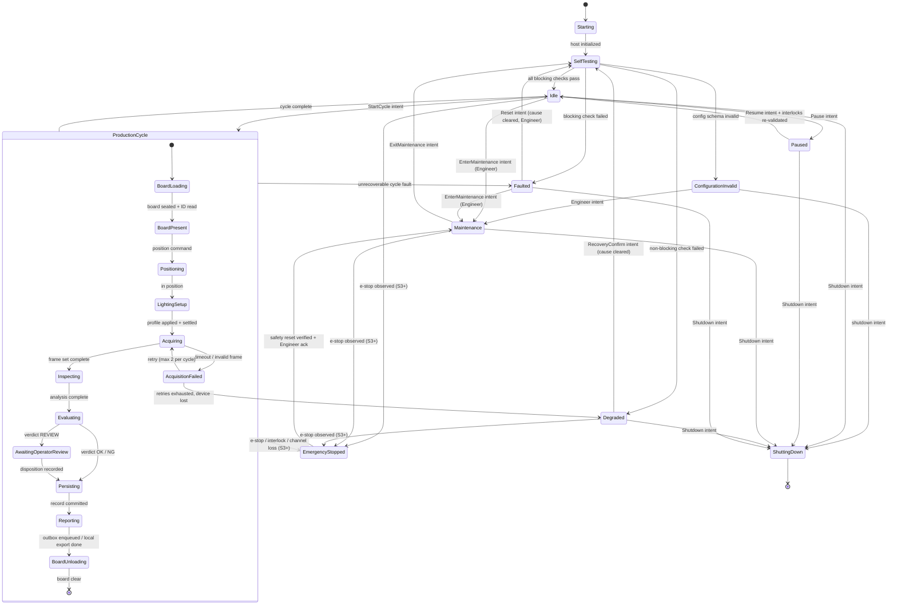
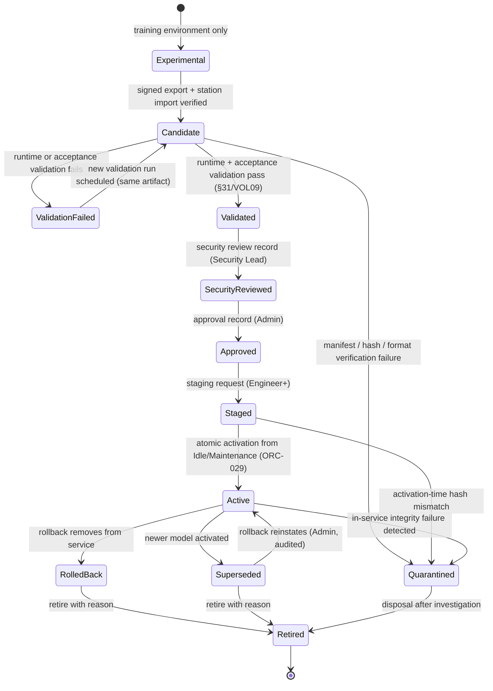
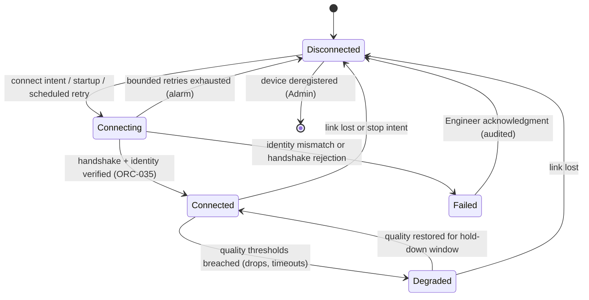
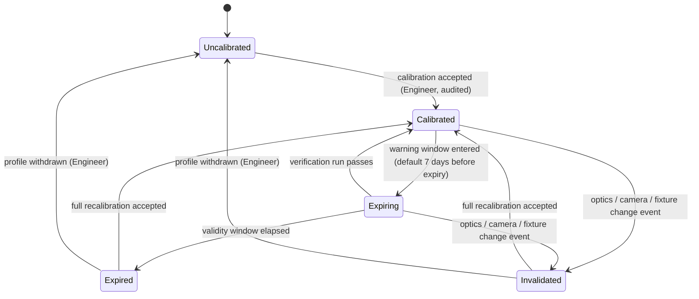

# VOL04 Orchestration and Lifecycles — AOI Software Architecture, Secure Development, and Change-Control Standard, v1.0 (2026-07-15)

Scope: the normative inspection state machine (§17), recipe lifecycle (§18), AI model lifecycle states and activation rules (§19; deep ML quality/security requirements live in §31/VOL09), and device and calibration lifecycle (§20) for AOI Monitor, Stages 1–4.

Supersedes/Related existing docs: `Docs/Integration_Boundaries.md` and the `RobotCycleService` FSM notes remain implementation references subordinate to §17; the Recipe Editor and 2D Calibration sections of `Docs/User_Manual.md` and `IMPLEMENTED_FEATURES.md` remain descriptive (non-normative); `Docs/Architecture_Extension_Guide.md` remains the engine-extension how-to under §14–15/VOL03.

---

## 17. Inspection State Machine

This section defines the single authoritative state machine that governs every inspection cycle from board arrival to report emission, in every deployment stage. It exists because the current codebase has **no central orchestrator**: cycle logic is distributed across view code-behind (21 views call `AoiDatabase` directly; `MonitorView.xaml.cs` alone is 1,441 lines), the `WorkflowState` singleton, and the partial `RobotCycleService` FSM (`Services/RobotCycleService.cs:6-19`, 11 states, robot-scope only). Distributed cycle logic means distributed guards — and a guard that lives in a button handler is a guard that another button handler can skip. Boundary with neighbors: the target module decomposition and the Orchestrator component itself are defined in §12/§14 (VOL03); process/thread ownership in §16 (VOL03) and §26 (VOL06); camera acquisition internals in §32 (VOL10); robot and safety-boundary behavior in §34 (VOL11); HMI presentation of states and alarms in §36 (VOL12); degraded-mode and recovery engineering in §41 (VOL13).

**Governing rule (binding, restated as ORC-001):** no hardware command is ever issued outside the orchestrator. UI event handlers raise named *intents* (StartCycle, Pause, Cancel, EnterMaintenance, Shutdown, Disposition, RecoveryConfirm); the orchestrator alone decides whether the current state admits the intent. This rule is the software-side complement of D-18: the application never implements a safety function, it *observes* safety status and fails safe when observation is lost.

### 17.1 Current state (facts this section builds on)

| Item | Repo evidence |
|---|---|
| Robot-scope FSM | `RobotCycleService` 11 states, transition log, invalid transitions rejected + audited (RobotCycleService.cs:339-380) |
| Safety gating | Safety + e-stop checked at command edges only; no in-flight abort hook (RobotCycleService.cs:249-278) |
| Safety bypass flag | `PermitSafetyBypassForSimulation` defaults **true** (RobotCycleService.cs:37) — governed in §34/VOL11 |
| Cycle logic today | Views orchestrate flows directly; `WorkflowState.Instance` shared singleton, 24/29 views reference it |
| Startup | `MainWindow.OnLoaded` runs DB init, retention, boundary wiring synchronously on the UI thread (MainWindow.xaml.cs:60-138) |
| Shutdown | No orderly shutdown sequence exists; window close disposes nothing beyond WPF defaults |
| Status vocabulary | `IntegrationConnectionStatus { NotConnected, Simulated, Error, Ready }` (IntegrationContracts.cs:5-11) |
| Error containment | Global exception handlers + `UiErrorBoundaryService` per page refresh (App.xaml.cs:31-33) |

The `RobotCycleService` FSM is the seed of the target machine: its transition-rejection and audit discipline carry forward; its scope (robot only, polled safety, thread-unsafe state) does not.

### 17.2 Canonical states

Twenty-two states. **Rest states** (no timeout; the machine may remain indefinitely): Idle, Paused, Maintenance, Degraded, Faulted, EmergencyStopped, ConfigurationInvalid, AwaitingOperatorReview. All others are **transient** and carry a timeout (Table 17-2).

**Table 17-1 — Canonical states**

| State | Meaning |
|---|---|
| Starting | Process launched; configuration loading; no subsystem started |
| SelfTesting | Startup self-test: DB integrity, model hash verification, device handshake, calibration validity, safety channel (S3+) |
| ConfigurationInvalid | Configuration schema validation failed; fail-closed per D-10; inspection prohibited |
| Idle | Ready; no board; no hardware output active |
| BoardLoading | Board being loaded by robot/conveyor (S3+) or operator confirmation pending (S2) |
| BoardPresent | Board seated/clamped; board identity (barcode/lot) read |
| Positioning | Board/camera moved to inspection pose (S3+; S2 fixed fixture passes through) |
| LightingSetup | Versioned lighting profile applied; settle time running |
| Acquiring | Camera trigger issued; frame set being captured |
| AcquisitionFailed | Trigger/frame failure detected; bounded retry decision pending |
| Inspecting | Inference/analysis executing on the acquired frame set |
| Evaluating | Recipe thresholds + taxonomy mapping applied; verdict derived (OK/NG/REVIEW) |
| AwaitingOperatorReview | REVIEW verdict awaiting a role-checked human disposition |
| Persisting | Inspection record, defects, and version lineage committed in one transaction |
| Reporting | Local evidence finalized; MES payload enqueued to the outbox (S4) |
| BoardUnloading | Board released/unloaded (S3+) or operator removal confirmed (S2) |
| Paused | Operator pause between cycles; outputs at configured safe values |
| Maintenance | Role-gated manual mode: jog/test commands permitted under interlocks; production prohibited |
| Degraded | Reduced-capability operation per the degraded-capability matrix (Table 17-5) |
| Faulted | Recoverable fault recorded; production blocked until cause cleared + reset |
| EmergencyStopped | Safety chain reports e-stop/interlock trip, or the safety observation channel is lost (S3+) |
| ShuttingDown | Orderly stop: acquisition stopped, adapters released, outbox state persisted, clean-shutdown marker written |

### 17.3 State machine diagram



**Reading this diagram:** the machine boots through Starting → SelfTesting and reaches Idle only when every blocking self-test check passes; an invalid configuration lands in ConfigurationInvalid (fail-closed), a blocking check failure in Faulted, a non-blocking one in Degraded. From Idle, a StartCycle intent enters the production cycle, which runs BoardLoading → BoardPresent → Positioning → LightingSetup → Acquiring → Inspecting → Evaluating → (AwaitingOperatorReview when the verdict is REVIEW) → Persisting → Reporting → BoardUnloading and returns to Idle. Acquisition failures loop through AcquisitionFailed at most twice before escalating to Degraded (device lost) or Faulted (cycle fault). EmergencyStopped is reachable from every operational state in S3+ and exits **only** into Maintenance after the independent safety chain reports reset and an Engineer acknowledges. Maintenance always exits through SelfTesting — never directly into production. ShuttingDown is reachable only from rest states (a mid-cycle shutdown first completes or aborts the cycle, §17.8). Persisting always precedes Reporting: no MES payload ever describes an unpersisted result.

### 17.4 Per-state contract and transition matrix

Timeout defaults below are engineering defaults under ASSUMPTION A-VOL04-1 (configurable per station within the stated bounds via the schema-validated config of D-10; bounds: 0.5×–4× the default).

**Table 17-2 — Entry/exit/timeout/hardware contract per state**

| State | Entry condition | Exit condition | Timeout → target | HW commands permitted |
|---|---|---|---|---|
| Starting | process start | config loaded | 30 s → Faulted | none |
| SelfTesting | Starting done; or exit from Maintenance/Degraded/Faulted | all checks evaluated | 120 s → Faulted | device handshake, lighting self-check; no motion |
| ConfigurationInvalid | config schema validation failed | Engineer intent | none | none |
| Idle | self-test pass; or cycle complete | intent received | none | none (status polling only) |
| BoardLoading | StartCycle admitted | board seated + ID read | 60 s → Faulted | robot/conveyor load (S3+) |
| BoardPresent | board seated | position command issued | 30 s → Faulted | clamp, barcode reader |
| Positioning | board clamped | pose reached | 30 s → Faulted | robot/stage motion (S3+) |
| LightingSetup | pose reached | profile applied + settled | 2 s → AcquisitionFailed | lighting channel writes |
| Acquiring | lighting settled | frame set complete | 250 ms capture / 100 ms transfer Max (§40/VOL13) → AcquisitionFailed | camera trigger; lighting hold |
| AcquisitionFailed | acquisition fault | retry or escalate decided | 5 s → Degraded/Faulted | camera re-trigger only |
| Inspecting | frame set complete | analysis returned | 1200 ms inference Max (§40/VOL13) → NoResult; hang > 3000 ms watchdog → Faulted | none |
| Evaluating | analysis returned | verdict derived | 2 s → Faulted | none |
| AwaitingOperatorReview | verdict REVIEW | disposition recorded | none (alarm at 10 min; OD-VOL04-1) | none |
| Persisting | verdict final | transaction committed | 5 s → Faulted | none |
| Reporting | record committed | outbox enqueued / export done | 10 s → complete with MES-pending warning | none (MES network I/O only) |
| BoardUnloading | reporting done | board clear | 60 s → Faulted | robot unload, unclamp (S3+) |
| Paused | Pause intent from Idle | Resume intent | none | none; outputs at safe values |
| Maintenance | role-gated intent | ExitMaintenance intent | none | manual jog/test, interlocked |
| Degraded | cause recorded | RecoveryConfirm + cause cleared | none | per Table 17-5 |
| Faulted | fault recorded | Reset intent + cause cleared | none | none (status polling only) |
| EmergencyStopped | safety observation (S3+) | safety reset verified + ack | none | none (status polling only) |
| ShuttingDown | Shutdown intent from rest state | cleanup complete | 30 s → forced exit, no clean marker | stop/park/disconnect only |

**Cycle-stage timeouts defer to §40/VOL13.** The Acquiring and Inspecting timeouts carry the per-stage Max-tolerated bounds of the §40/VOL13 latency budget (Table 40-2), which is authoritative for cycle-stage timing and overrides the generic A-VOL04-1 configurability for these two rows. An inspection cycle that exceeds the §40/VOL13 end-to-end watchdog (3000 ms) is aborted to a **NoResult** outcome — the honest disposition for an over-run, distinct from OK/NG and complementary to the INTERRUPTED outcome of ORC-011 (fault, cancellation, e-stop, shutdown, or process exit); **Faulted** is reserved for a stage that does not return at all beyond the watchdog bound.

**Table 17-3 — Audit, restart, recovery, cancellation per state**

| State | Audit event(s) | After process restart | Recovery path | Cancel intent behavior |
|---|---|---|---|---|
| Starting | CYCLE_STATE | re-enter Starting | n/a | ignored |
| SelfTesting | CYCLE_STATE + per-check detail | re-run fully | re-run | ignored |
| ConfigurationInvalid | CONFIG_INVALID | re-validate at startup | fix config → SelfTesting | n/a |
| Idle | CYCLE_STATE | reached via SelfTesting | n/a | no-op |
| BoardLoading | CYCLE_STATE | INTERRUPTED record; board state unknown → Maintenance prompt | operator clears board | abort load; → Idle after board clear |
| BoardPresent | CYCLE_STATE + board ID | as BoardLoading | operator clears board | unclamp; → BoardUnloading |
| Positioning | CYCLE_STATE | as BoardLoading | robot to safe pose (Maintenance) | stop motion at safe point; → Faulted if unreachable |
| LightingSetup | CYCLE_STATE + profile version | INTERRUPTED record | lights to safe values | lights off; → BoardUnloading |
| Acquiring | CYCLE_STATE + correlation ID | INTERRUPTED record | §17.9 | abort trigger; → BoardUnloading |
| AcquisitionFailed | ACQ_FAILED (cause, retry #) | INTERRUPTED record | §17.9 | skip retries; → BoardUnloading |
| Inspecting | CYCLE_STATE | INTERRUPTED record | re-run cycle on same board | discard analysis; → BoardUnloading |
| Evaluating | CYCLE_STATE | INTERRUPTED record | re-run cycle | discard; → BoardUnloading |
| AwaitingOperatorReview | REVIEW_PENDING / DISPOSITION | INTERRUPTED record; disposition never auto-applied | re-present after re-inspection | cancel = INTERRUPTED, never OK |
| Persisting | INSPECTION_RESULT | transaction atomicity guarantees no partial record | commit or nothing | not cancellable |
| Reporting | MES_SPOOL / EXPORT | outbox row survives restart (store-and-forward) | outbox retry per §35/VOL11 | not cancellable (async) |
| BoardUnloading | CYCLE_STATE | board state unknown → Maintenance prompt | operator clears board | not cancellable |
| Paused | CYCLE_STATE | not persisted; restart → SelfTesting | n/a | n/a |
| Maintenance | MAINTENANCE_ENTER/EXIT | not persisted; restart → SelfTesting | n/a | n/a |
| Degraded | DEGRADED_ENTER (cause) / RECOVERY | cause re-detected by SelfTesting | §17.9 | n/a |
| Faulted | FAULT (cause) / RESET | cause re-detected by SelfTesting | Engineer reset | n/a |
| EmergencyStopped | ESTOP_OBSERVED / SAFETY_CHANNEL_LOST / SAFETY_RESET_ACK | safety status re-read at SelfTesting | §34/VOL11 reset procedure | n/a |
| ShuttingDown | SHUTDOWN | clean marker present = clean start; absent = unclean-start audit | n/a | not cancellable |

**Table 17-4 — Major transitions: initiator, guards, retry, idempotency**

| Transition | Authorized initiator | Guards / interlocks (S3+) | Retry | Idempotent? |
|---|---|---|---|---|
| Idle → BoardLoading | Operator+ intent; MES order (S4); robot handshake (S3) | all six interlocks safe; devices Connected; recipe Deployed; model Active | n/a | yes — duplicate StartCycle SHOULD be rejected (ORC-013) |
| BoardLoading → BoardPresent | orchestrator (sensor/confirm) | clamp confirmed | per adapter | yes (sensor re-read) |
| Positioning → LightingSetup | orchestrator | pose-reached confirmation | 1 re-command | yes |
| Acquiring → AcquisitionFailed | orchestrator (timeout/invalid frame) | — | max 2 retries/cycle (ORC-010) | yes |
| Evaluating → AwaitingOperatorReview | orchestrator (verdict REVIEW) | — | n/a | yes |
| AwaitingOperatorReview → Persisting | Operator+ disposition (role per §28/VOL07) | disposition audited with role | n/a | duplicate disposition rejected |
| Persisting → Reporting | orchestrator | transaction committed | commit retried once on transient SQLite busy | yes — same record never written twice |
| Any → EmergencyStopped | orchestrator (safety observation) | none — unconditional | n/a | yes |
| EmergencyStopped → Maintenance | Engineer+ ack | safety chain reports reset complete | n/a | yes |
| Faulted → SelfTesting | Engineer+ Reset intent | recorded cause cleared | n/a | yes |
| Degraded → SelfTesting | Engineer+ or Field Service RecoveryConfirm | degradation cause cleared | n/a | yes |
| Maintenance → SelfTesting | Engineer+ ExitMaintenance | no manual command in flight | n/a | yes |
| Idle → Maintenance | Engineer+ | no cycle in flight | n/a | yes |
| Rest state → ShuttingDown | Operator+ intent; OS session end | see §17.8 | n/a | yes |

**Forbidden transitions (enforced by the transition matrix; each attempt is rejected and audited):**

1. EmergencyStopped → any state other than Maintenance. In particular EmergencyStopped → Acquiring/Positioning/Idle without the safety-chain reset plus Engineer acknowledgment is prohibited.
2. Faulted → Inspecting/Acquiring/Positioning (any production state) without the recorded cause cleared and a Reset intent — Faulted exits only through SelfTesting or Maintenance.
3. ConfigurationInvalid → Idle directly; the only path is corrected configuration re-validated in SelfTesting.
4. Maintenance → any production state directly; Maintenance exits only through SelfTesting.
5. Starting → Idle skipping SelfTesting.
6. SelfTesting → Idle while any blocking check has failed.
7. Evaluating/AwaitingOperatorReview → Reporting skipping Persisting (no unpersisted result may reach MES or an export).
8. AwaitingOperatorReview → BoardUnloading without a persisted disposition or an INTERRUPTED record.
9. Paused → any production state directly; resume passes through Idle with interlock re-validation.
10. Degraded → production states when the degradation cause is camera loss, calibration invalidity, or safety-channel loss (Table 17-5 rows marked "blocked").
11. Any state → ShuttingDown while a motion command is in flight (the motion completes to a safe point or is aborted first).

### 17.5 Stage activity matrix and degraded-capability matrix

**Table 17-5 — Degraded-capability matrix (normative seed; extended by §41/VOL13)**

| Degradation cause | Inspection | Robot motion | MES upload | Allowed exit |
|---|---|---|---|---|
| MES unreachable (S4) | permitted; outbox accumulates | permitted | blocked (spooled) | auto on reconnect + RecoveryConfirm |
| Camera lost | blocked | blocked | permitted (backlog) | reconnect + identity re-verify + SelfTesting |
| Calibration Expired/Invalidated | blocked for metric (mm) judgments; pixel-only runs labeled | permitted | permitted | recalibration (§20) |
| Safety channel lost (S3+) | n/a — this cause forces EmergencyStopped, not Degraded | — | — | — |
| Lighting controller Error | blocked (evidence lighting unverifiable) | permitted | permitted | controller recovery + SelfTesting |
| Disk/DB pressure above threshold | blocked before acquisition of new evidence | permitted | permitted | space recovered + SelfTesting |

**Table 17-6 — States active per stage**

| State | S1 | S2 | S3 | S4 |
|---|---|---|---|---|
| Starting, SelfTesting, ConfigurationInvalid, Idle | ● | ● | ● | ● |
| Inspecting, Evaluating, AwaitingOperatorReview, Persisting, Reporting | ● | ● | ● | ● |
| Paused, Maintenance, Degraded, Faulted, ShuttingDown | ● | ● | ● | ● |
| LightingSetup, Acquiring, AcquisitionFailed | sim only | ● | ● | ● |
| BoardPresent | sim only | ● (manual confirm) | ● | ● |
| BoardLoading, Positioning, BoardUnloading | — | pass-through (manual) | ● | ● |
| EmergencyStopped | — | — | ● | ● |

Notes: in S1 the "cycle" runs on imported image files; Reporting means local export/evidence packaging only. Simulation sources (`FolderCameraSource`, simulated adapters) MAY exercise the S2+ states, but every resulting record carries the simulated-evidence marking already enforced by `CameraFrame.IsSimulated` (GenericVisionCameraSource.cs:96-118) and the HMI purple convention (§36/VOL12). In S2, board handling is manual under ASSUMPTION A-VOL04-2: BoardLoading/Positioning/BoardUnloading are operator-confirmed pass-through states with no motion commands. EmergencyStopped exists only where a safety chain exists to observe (S3+); S1/S2 stations have no motion axes under this standard's scope (§4/VOL01).

### 17.6 Full inspection cycle sequence (S2 live)

```mermaid
sequenceDiagram
    participant OP as Operator (HMI)
    participant ORC as Orchestrator
    participant LIT as LightingAdapter
    participant ACQ as Acquisition (CameraAdapter)
    participant ENG as Inference engine
    participant DEC as Decision (recipe evaluation)
    participant DB as Persistence + Audit
    participant OUT as MES outbox

    OP->>ORC: StartCycle intent (intent ID)
    ORC->>DB: audit CYCLE_STATE; allocate correlation ID (CID)
    ORC->>ORC: Idle -> BoardPresent (manual load confirmed, S2)
    ORC->>LIT: apply lighting profile version vN (CID)
    LIT-->>ORC: applied (Error -> Degraded per Table 17-5)
    ORC->>ORC: LightingSetup -> Acquiring
    ORC->>ACQ: trigger (CID; TriggerTimeoutMs 250, FrameTimeoutMs 1000)
    ACQ-->>ORC: CameraFrame (CID, seq, UTC, IsSimulated=false)
    ORC->>ORC: Acquiring -> Inspecting
    ORC->>ENG: Analyze(frame set, active model vM, recipe revision rR)
    ENG-->>ORC: AnalysisResult (regions, scores, evidence refs)
    ORC->>ORC: Inspecting -> Evaluating
    ORC->>DEC: apply recipe rR thresholds + taxonomy version vT
    DEC-->>ORC: verdict OK | NG | REVIEW
    alt verdict REVIEW
        ORC->>OP: AwaitingOperatorReview (disposition prompt)
        OP-->>ORC: disposition (role-checked, audited)
    end
    ORC->>ORC: Evaluating -> Persisting
    ORC->>DB: one transaction: result + defects + lineage (rR, vM, vT, calibration C, lighting vN, CID)
    DB-->>ORC: committed (record ID)
    ORC->>ORC: Persisting -> Reporting
    ORC->>OUT: enqueue MES payload (outbox row keyed by CID, S4)
    ORC->>OP: verdict + evidence displayed (non-color-redundant, §36/VOL12)
    ORC->>ORC: Reporting -> Idle (operator removes board, S2)
```

**Reading this diagram:** the operator's StartCycle intent is the only human contribution to a normal cycle; everything after it is orchestrator-driven. A correlation ID (CID) is allocated at cycle start and rides through the lighting command, the camera trigger, the frame, the analysis result, the persisted record, and the MES payload — the same end-to-end correlation discipline §32/VOL10 requires at the trigger level. The Persisting step is a single transaction that stores the verdict **together with its full version lineage** (recipe revision, model version, taxonomy version, calibration profile, lighting profile version): a verdict without lineage is not quality evidence (§21/VOL05 owns the data model). Only after commit does Reporting enqueue the MES payload into the durable outbox — the send-then-spool pattern of the current `TraceabilityUploadService` (spools only on failure, crash-lossy; hardware.md finding) is prohibited on this path by ORC-011/§35(VOL11). REVIEW verdicts insert a human disposition before persistence; the disposition is role-checked and audited, never defaulted.

### 17.7 Startup and self-test sequence

```mermaid
sequenceDiagram
    participant HOST as App host
    participant ORC as Orchestrator
    participant CFG as Config service
    participant DB as Persistence (AoiDatabase)
    participant MDL as ModelMgmt
    participant DEV as Device registry
    participant SAF as SafetyStatus channel (S3+)
    participant HMI as HMI shell

    HOST->>ORC: process start -> Starting
    ORC->>CFG: load + schema-validate layered config (D-10)
    alt config invalid
        CFG-->>ORC: validation errors
        ORC->>HMI: ConfigurationInvalid (fail closed, ORC-008)
    else config valid
        ORC->>ORC: Starting -> SelfTesting
        ORC->>DB: Initialize(): migrations, PRAGMA integrity_check
        ORC->>MDL: verify active model manifest + recomputed SHA-256 (ORC-028)
        ORC->>DEV: connect registered devices; verify identity (ORC-035)
        ORC->>DEV: calibration validity check (ORC-037)
        ORC->>SAF: safety-status channel handshake (S3+)
        alt all blocking checks pass
            ORC->>HMI: readiness panel -> Idle
        else only non-blocking checks failed
            ORC->>HMI: Degraded (cause displayed, Table 17-5)
        else any blocking check failed
            ORC->>HMI: Faulted (Critical alarm; inspection blocked)
        end
    end
```

**Reading this diagram:** startup is a gate, not a race. Configuration is validated against its schema before any subsystem starts; an invalid configuration fail-closes into ConfigurationInvalid (D-10) rather than booting with defaults. SelfTesting then runs the blocking checks — database migration + integrity, active-model hash re-verification (which the current code never does after registration; ml-pipeline.md gap 1), device identity, calibration validity, and the safety-status handshake in S3+ — and the machine reaches Idle only when all of them pass. This replaces the current behavior in which `MainWindow.OnLoaded` initializes the database synchronously on the UI thread and continues in an ad-hoc degraded mode on failure (MainWindow.xaml.cs:60-138); the readiness panel remains the HMI surface, but the *decision* now lives in the orchestrator. The absence of the clean-shutdown marker (§17.8) at startup raises an unclean-start audit event and forces the INTERRUPTED reconciliation of ORC-012.

### 17.8 Shutdown sequence

```mermaid
sequenceDiagram
    participant OP as Operator / OS session
    participant ORC as Orchestrator
    participant ACQ as Acquisition
    participant ROB as RobotAdapter (S3+)
    participant DB as Persistence
    participant OUT as MES outbox

    OP->>ORC: Shutdown intent
    alt mid-cycle
        ORC->>ORC: complete cycle to Persisting, or abort to board-safe point
        ORC->>DB: INTERRUPTED record if aborted (ORC-011)
    end
    ORC->>ORC: rest state -> ShuttingDown
    ORC->>ACQ: stop acquisition; return buffers; disconnect
    ORC->>ROB: controlled-stop handshake; no new motion commands
    ORC->>OUT: outbox state already durable (store-and-forward resumes next start)
    ORC->>DB: audit SHUTDOWN; write clean-shutdown marker
    ORC->>OP: process exit (30 s budget; forced exit leaves no clean marker)
```

**Reading this diagram:** shutdown is only accepted from rest states; a mid-cycle shutdown intent first drives the cycle to a defined end — either completion through Persisting or an abort that leaves a board-safe mechanical situation (A-VOL04-6) and an INTERRUPTED record. Hardware release order is fixed: acquisition stops and returns native buffers before adapters disconnect (the buffer-return discipline of §32/VOL10), the robot receives a controlled-stop handshake and no further motion commands, and the outbox is *not* flushed — it is durable by design and resumes on next start. The final act is writing the clean-shutdown marker; its absence at the next startup is the machine-readable signature of a crash or forced kill, triggering the unclean-start reconciliation path. The 30 s budget bounds hostile cases (hung adapter DLLs): the process exits anyway, deliberately without the marker.

### 17.9 Failure-recovery sequence (camera loss mid-cycle)

```mermaid
sequenceDiagram
    participant ORC as Orchestrator
    participant ACQ as Acquisition (CameraAdapter)
    participant DB as Persistence + Audit
    participant HMI as HMI
    participant FS as Engineer / Field Service

    ORC->>ACQ: trigger (CID)
    ACQ--xORC: frame timeout (FrameTimeoutMs 1000)
    ORC->>ORC: Acquiring -> AcquisitionFailed (audit ACQ_FAILED, retry 1)
    ORC->>ACQ: re-trigger (retry 1 of 2)
    ACQ--xORC: adapter reports Disconnected
    ORC->>DB: INTERRUPTED inspection record (CID, last state = Acquiring)
    ORC->>ORC: AcquisitionFailed -> Degraded (cause: camera lost)
    ORC->>HMI: Critical alarm within 2 s; inspection starts blocked
    ACQ->>ACQ: bounded reconnection backoff (policy per §32/VOL10)
    FS->>ORC: RecoveryConfirm intent (or EnterMaintenance for physical work)
    ORC->>ACQ: reconnect; device identity re-verification (ORC-035)
    ORC->>ORC: Degraded -> SelfTesting -> Idle
    ORC->>DB: audit RECOVERY (cause, downtime, initiator)
```

**Reading this diagram:** a frame timeout inside Acquiring moves the cycle to AcquisitionFailed, which retries within its bounded budget (max 2, ORC-010). When the adapter itself reports Disconnected, retrying is pointless: the orchestrator persists an INTERRUPTED record for the in-flight board (never OK, never NG — ORC-011), enters Degraded with cause *camera lost* (a "blocked" row in Table 17-5, so no new inspection can start), and raises a Critical alarm. Reconnection attempts run in the background under the bounded-backoff policy owned by §32/VOL10, but returning to production is a human decision: an Engineer or Field Service issues RecoveryConfirm, the device identity is re-verified against the registry (a reconnected "camera" is not trusted to be the *same* camera — §20), and the machine re-enters Idle only through a full SelfTesting pass. The board that was on the fixture during the loss is re-inspected from scratch; partial frame sets are discarded.

### R: Orchestrator authority and transition integrity (ORC-001–ORC-004)

**[ORC-001]** (P0 | ALL | Orchestrator, HMI)
The application SHALL issue every hardware command (camera trigger, lighting change, robot motion, clamp, PLC write) exclusively from the inspection orchestrator, with UI event handlers limited to raising named intents that the orchestrator admits or rejects against the current state.
- Why: cycle logic currently lives in view code-behind (21 views call services/DB directly; architecture.md), so a button handler can bypass every interlock and state guard; centralizing command authority makes the §17.4 guards unbypassable. Maps: 62443-4-1; CWE-696; Internal.
- Verify: fitness function FF-ORC-01 (NetArchTest: types under Views/ViewModels forbidden to reference ICameraSource, ILightingController, IRobotController, IPlcSafetyController, IVisionCameraAdapter). Evidence: CI gate log. Owner: Software Architect. Auto: Fully automated.
- Exception: Not allowed. Review: Per release.

**[ORC-002]** (P1 | ALL | Orchestrator)
The orchestrator SHALL hold cycle state in a single authoritative state variable that changes only through one guarded transition function which rejects, and audits, any transition absent from the §17.4 transition matrix (including every entry in the forbidden-transitions list).
- Why: `RobotCycleService` already rejects invalid transitions (RobotCycleService.cs:339-347) but state is duplicated across `WorkflowState` and view fields; two state sources desynchronize guards and produce impossible-state bugs. Maps: CWE-372; 25010.
- Verify: exhaustive transition-matrix unit test enumerating all 22×22 state pairs against the matrix. Evidence: test run log. Owner: Software Lead. Auto: Fully automated.
- Exception: Not allowed. Review: Per release.

**[ORC-003]** (P2 | ALL | Orchestrator, Audit)
Every state transition SHALL be recorded as an audit event carrying prior state, new state, triggering intent or fault cause, initiator identity and role, and the cycle correlation ID.
- Why: a disputed accept/reject is reconstructable only if the full state history of the cycle is on record; the existing `ROBOT_CYCLE` transition log (RobotCycleService.cs:364-380) proves the pattern and is generalized here. Maps: 62443-4-2 CR 2.8; Internal.
- Verify: transition-audit unit test asserting the event schema for every transition class. Evidence: test run log. Owner: Software Lead. Auto: Fully automated.
- Exception: Not allowed. Review: Annual.

**[ORC-004]** (P3 | ALL | Orchestrator, CI)
The transition matrix, per-state timeouts, and retry limits SHOULD be encoded as one reviewable data table from which the §17.3 diagram is regenerated, with a CI gate failing when code and published diagram diverge.
- Why: hand-maintained state diagrams drift from code silently; generating the diagram from the enforcement table makes §17 self-verifying. Maps: Internal.
- Verify: fitness function FF-ORC-02 (diagram-sync gate in Scripts/run-quality-gates.ps1). Evidence: CI gate log. Owner: Software Lead. Auto: Fully automated.
- Exception: Allowed — approver: Software Architect. Review: On change.

### R: Safety observation and fail-safe behavior (ORC-005–ORC-007)

**[ORC-005]** (P0 | S3+ | Orchestrator, SafetyStatus)
The orchestrator SHALL transition to EmergencyStopped from any state within 250 ms of observing an e-stop assertion, any unsafe interlock, or loss of the safety-status observation channel.
- Why: per D-18 the application only observes the independent safety chain and must fail safe on lost observation; the current code treats a NotConnected PLC as bypassable in simulation (RobotCycleService.cs:289-310), which this requirement forbids for S3+ production. Maps: 13849-1; 60204-1; Internal.
- Verify: simulated-PLC integration tests toggling each interlock plus a channel-loss case with timing assertion; HIL e-stop drill at commissioning. Evidence: test run log + HIL record. Owner: Controls & Safety Engineer. Auto: Partially automated.
- Exception: Not allowed. Review: Per release.

**[ORC-006]** (P1 | S3+ | Orchestrator, SafetyStatus)
Exit from EmergencyStopped SHALL occur only into Maintenance, and only after the independent safety chain reports reset complete and an Engineer or higher records a reset acknowledgment.
- Why: automatic restart after an e-stop is the canonical machinery-safety defect (ISO 13850 requires manual reset); the software must not present a faster path than the safety chain permits. Maps: 13850; 60204-1.
- Verify: FSM matrix test (forbidden-transition item 1) plus HIL e-stop recovery drill. Evidence: test run log + HIL record. Owner: Controls & Safety Engineer. Auto: Partially automated.
- Exception: Not allowed. Review: Per release.

**[ORC-007]** (P1 | S3+ | Orchestrator, SafetyStatus)
During any motion or acquisition state the orchestrator SHALL poll safety and device status at intervals of 100 ms or less and abort the in-flight command when the observed status becomes unsafe, instead of checking only at command boundaries.
- Why: the current design polls e-stop only at command edges (RobotCycleService.cs:249-278; hardware.md gap 2), leaving a whole motion command blind to a trip; observation-side abort limits damage while the hardware safety chain performs the actual stop. Maps: 13849-1; Internal.
- Verify: integration test dropping an interlock mid-command against the simulated PLC and asserting abort latency. Evidence: test run log. Owner: Controls & Safety Engineer. Auto: Fully automated.
- Exception: Not allowed. Review: Per release.

### R: Fail-closed startup, timeouts, retries (ORC-008–ORC-010)

**[ORC-008]** (P2 | ALL | Orchestrator, Config)
The orchestrator SHALL enter ConfigurationInvalid and refuse all inspection when startup configuration schema validation fails, exiting only after corrected configuration passes a full SelfTesting run.
- Why: booting on defaults after a failed config parse silently changes inspection behavior (thresholds, boundaries); D-10 mandates fail-closed configuration and this state is its FSM anchor. Maps: 62443-4-2 CR 7.6; Internal.
- Verify: startup integration test with malformed and schema-violating config files. Evidence: test run log. Owner: Software Lead. Auto: Fully automated.
- Exception: Not allowed. Review: Annual.

**[ORC-009]** (P2 | ALL | Orchestrator)
Every transient state SHALL enforce its Table 17-2 timeout and transition to the designated timeout target instead of waiting indefinitely.
- Why: an indefinite wait on an unauthenticated transport or a hung adapter stalls the line invisibly (CWE-400 class); explicit timeout targets convert hangs into diagnosable states. Maps: CWE-400; 25010.
- Verify: fake-clock unit tests per transient state asserting target-state entry at timeout. Evidence: test run log. Owner: Software Lead. Auto: Fully automated.
- Exception: Allowed — approver: Software Architect. Review: On change.

**[ORC-010]** (P2 | S2+ | Orchestrator, Acquisition)
The orchestrator SHALL limit automatic acquisition retries to 2 per cycle, escalating on exhaustion to Degraded when the device is lost or to Faulted for a cycle-scope fault.
- Why: unbounded retry hides hard camera faults and hammers the camera segment; a bounded budget with an explicit escalation target makes acquisition failure observable and recoverable (§17.9). Maps: 25010; Internal.
- Verify: retry-exhaustion unit tests covering both escalation targets. Evidence: test run log. Owner: Software Lead. Auto: Fully automated.
- Exception: Allowed — approver: Software Architect. Review: On change.

### R: Interruption, restart, idempotency (ORC-011–ORC-013)

**[ORC-011]** (P2 | ALL | Orchestrator, Persistence)
A cycle terminated by fault, cancellation, e-stop, shutdown, or process exit SHALL persist an inspection record with outcome INTERRUPTED — never OK and never NG — referencing the correlation ID and the last completed state.
- Why: a silently vanished cycle is indistinguishable from a skipped board in later traceability disputes; INTERRUPTED is the honest third outcome and feeds the §41/VOL13 recovery metrics. Maps: Internal; 62443-4-2 CR 2.8.
- Verify: kill-and-restart integration test plus cancellation tests asserting the INTERRUPTED record. Evidence: test run log. Owner: QA Lead. Auto: Partially automated.
- Exception: Not allowed. Review: Per release.

**[ORC-012]** (P2 | ALL | Orchestrator)
After process restart the orchestrator SHALL enter Starting and proceed through SelfTesting, reconciling any persisted mid-cycle evidence into INTERRUPTED records rather than resuming the interrupted state.
- Why: resuming a persisted mid-cycle state after a crash pairs stale hardware reality with stale software state (board may have been removed, camera power-cycled); a full restart through self-test is the only defensible posture for a quality-evidence system. Maps: CWE-372; 25010.
- Verify: restart integration test asserting entry state and INTERRUPTED reconciliation. Evidence: test run log. Owner: Software Lead. Auto: Fully automated.
- Exception: Not allowed. Review: Annual.

**[ORC-013]** (P3 | ALL | Orchestrator, HMI)
The orchestrator SHOULD deduplicate operator intents by a client-generated intent ID so that re-delivery, double-click, or UI retry submits at most one transition.
- Why: double-submitted StartCycle or Disposition intents create duplicate cycles or double dispositions; intent-ID dedup is cheap idempotency at the only human boundary. Maps: CWE-837; Internal.
- Verify: double-dispatch unit test asserting single transition per intent ID. Evidence: test run log. Owner: Software Lead. Auto: Fully automated.
- Exception: Allowed — approver: Software Architect. Review: On change.

### R: Rest-state semantics and stage gating (ORC-014–ORC-016)

**[ORC-014]** (P2 | ALL | Orchestrator)
Entering Paused SHALL first bring the current cycle to a defined end (completion through Persisting, or abort to a board-safe point with an INTERRUPTED record), stop acquisition, and hold hardware outputs at their configured safe values until a Resume intent re-validates interlocks through Idle.
- Why: a pause that freezes mid-motion or leaves lighting energized is a hidden hazard and an evidence gap; pause must be a rest state with defined mechanical meaning (A-VOL04-6). Maps: 60204-1; Internal.
- Verify: pause/resume integration tests including a mid-cycle pause. Evidence: test run log. Owner: QA Lead. Auto: Fully automated.
- Exception: Allowed — approver: Software Architect. Review: On change.

**[ORC-015]** (P2 | ALL | Orchestrator, Diagnostics)
While in Degraded the orchestrator SHALL permit only the capability subset recorded for the active degradation cause in Table 17-5 and display that cause with its blocked capabilities on the HMI.
- Why: "degraded" without a cause-specific capability matrix decays into "ignore the alarms and keep running"; the matrix makes the reduced envelope explicit, auditable, and testable. Maps: 25010; Internal.
- Verify: degraded-matrix unit tests per cause row of Table 17-5. Evidence: test run log. Owner: Software Lead. Auto: Fully automated.
- Exception: Allowed — approver: Software Architect. Review: On change.

**[ORC-016]** (P3 | ALL | Orchestrator, Config)
The transition matrix SHOULD be stage-parameterized so that states not marked active for the configured deployment stage in Table 17-6 are unreachable at runtime.
- Why: an S2 station that can enter BoardLoading (a motion state) misrepresents its own capabilities and invites untested paths; stage gating keeps the runtime surface equal to the deployed reality. Maps: Internal.
- Verify: per-stage FSM unit tests asserting unreachability of excluded states. Evidence: test run log. Owner: Software Lead. Auto: Fully automated.
- Exception: Allowed — approver: Software Architect. Review: On change.

---

## 18. Recipe Lifecycle

This section defines the lifecycle of an inspection recipe — the versioned artifact that binds board program, ROI definitions, thresholds, taxonomy references, and lighting profile into an executable inspection specification. It exists because a recipe *is* the inspection: a wrong threshold escapes defects as effectively as a broken model, yet the current implementation treats recipe changes as ordinary saves. Boundary with neighbors: recipe storage schema and JSON canonicalization are owned by §21/VOL05; role definitions by §28/VOL07; the change-governance process (review evidence, PR linkage) by the CHG catalogue, §48–53/VOL17; taxonomy versioning itself by §31/VOL09.

### 18.1 Current state (facts this section builds on)

- Recipe revisions are stored append-only in `RecipeRevisions` (Id, RecipeName, Revision, BoardProgram, OperatorId, DetectionPriority, RecipeJson, CreatedAtUtc — AoiDatabase.Infrastructure.cs:3681-3693). There is **no state column**: every saved revision is immediately live, because `RecipeService.LoadLatestRecipe` returns the newest row for the board program (RecipeService.cs:162-175).
- Saves audit `RECIPE_SAVE` (AoiDatabase.Recipes.cs:1074-1109); Engineer role is required by UI-layer checks only.
- There is **no review, approval, or deployment step**, no schema version in the JSON, no content hash, and no compatibility check against model or taxonomy versions.
- The "recipe lock" is a UI toggle on the `WorkflowState` singleton (`IsRecipeLocked`, WorkflowState.cs:27) flipped from two views — a convention, not a control.
- A transient in-editor preview override lets Test Run exercise unsaved edits (`RecipeService.SetPreviewOverride`, RecipeService.cs:47-64); it is cleared in `finally` blocks by convention.
- Korean-localized token healing rewrites display strings back to canonical English tokens at parse time (`HealLocalizedTokens`, RecipeService.cs:114-122) — evidence that recipe JSON has historically absorbed UI-layer mutations.

The append-only revision table is the correct foundation; what is missing is the state dimension on top of it. The lifecycle below adds states **without** changing the immutability property.

### 18.2 Recipe states

```mermaid
stateDiagram-v2
    [*] --> Draft: create / clone / import validated
    [*] --> Quarantined: import or validation failure
    Draft --> Draft: edit (new working copy)
    Draft --> InReview: submit (Engineer)
    InReview --> Rejected: reviewer rejects with reason
    InReview --> Approved: reviewer approves (diff + record)
    Rejected --> Draft: rework as new revision
    Approved --> Deployed: deployment gate passes (ORC-021)
    Deployed --> Superseded: newer revision deployed for board program
    Superseded --> Deployed: rollback (Admin, audited)
    Approved --> Retired: retire (Admin, reason)
    Superseded --> Retired: retire (Admin, reason)
    Deployed --> Retired: retire (Admin; only after replacement or line stop)
    Quarantined --> Draft: corrected re-import as new revision
    Quarantined --> [*]: delete (Admin, audited)
    Retired --> [*]
```



**Reading this diagram:** a recipe revision is born as Draft (from scratch, clone, or a validated import) or as Quarantined when import validation fails — a quarantined revision is never loadable and can only be deleted or re-imported as a fresh Draft. Draft edits stay in Draft; submission freezes the revision (immutability begins at InReview, ORC-018) and hands it to a reviewer who either rejects it (Rejected → rework produces a *new* Draft revision) or approves it, creating a durable approval record. Approved is not live: deployment is a separate, gated transition that checks model/taxonomy compatibility (ORC-021). Deploying a newer revision moves the previous Deployed revision to Superseded, from which an audited Admin rollback can restore it. Retired is terminal; retired and superseded revisions are retained for traceability, never deleted, because historical inspection records reference them.

### 18.3 Recipe-approval sequence

```mermaid
sequenceDiagram
    participant ENG as Engineer (author)
    participant VAL as Recipe validation
    participant REV as Reviewer (Engineer/QA Lead, not author)
    participant DB as Persistence + Audit
    participant ORC as Orchestrator

    ENG->>VAL: save Draft revision rN
    VAL-->>ENG: schema + ROI + taxonomy validation report
    ENG->>DB: submit rN -> InReview (immutable from here, ORC-018)
    REV->>DB: load diff rN vs current Deployed revision
    REV->>REV: review checklist (thresholds, ROIs, taxonomy refs, lighting profile)
    alt rejected
        REV->>DB: Rejected + reason (audited)
        DB-->>ENG: rework -> new Draft revision
    else approved
        REV->>DB: approval record (reviewer, UTC, SHA-256 of canonical JSON)
        DB-->>ENG: rN Approved
        ENG->>ORC: deploy request
        ORC->>ORC: compatibility gate: taxonomy vT + model vM resolve (ORC-021)
        alt gate fails
            ORC-->>ENG: deployment refused, reason recorded
        else gate passes
            ORC->>DB: rN Deployed; prior Deployed -> Superseded (audited)
        end
    end
```

**Reading this diagram:** the author saves and validates a Draft, then submits it — from that moment the revision bytes are frozen. The reviewer (a different person than the author; the solo-developer compensating control of §7/VOL01 applies when the team cannot provide one) reviews the *diff against the currently deployed revision*, not the whole document, because threshold drift hides in diffs. Approval writes a durable record containing the reviewer identity, timestamp, and the SHA-256 of the canonical recipe JSON — the same hash that ORC-023 re-verifies at every subsequent load. Deployment is the orchestrator's decision: it refuses when a taxonomy ID or model reference in the recipe does not resolve against the active taxonomy and an activation-eligible model. Deploying supersedes the prior revision atomically, so exactly one Deployed revision exists per board program at any time.

### 18.4 Versioning and migration rules

1. **Immutable revisions.** A revision's content never changes after submission. "Editing" an Approved or Deployed recipe means cloning it into a new Draft revision. The existing append-only `RecipeRevisions` behavior already satisfies the storage half; the missing enforcement half is ORC-018.
2. **Semantic recipe schema version.** Every revision embeds `schemaVersion` (MAJOR.MINOR) (ORC-041). MINOR additions are backward-compatible (loaders ignore unknown optional fields); MAJOR changes require a migration. The current un-versioned `RecipeDocument` shape is retroactively schema version 1.0 (ASSUMPTION A-VOL04-3).
3. **Migration rules.** A loader encountering an older MAJOR version applies a registered, tested migration to the current shape *in memory* and records the migration in the load result; it never rewrites the stored revision. A loader encountering a newer MAJOR version than it supports refuses the revision (ORC-020) — forward compatibility is never guessed.
4. **No token mutation.** The `HealLocalizedTokens` repair (RecipeService.cs:114-122) remains for legacy revisions only; revisions at schema version ≥ 1.1 SHALL store canonical English tokens (enforced by validation), retiring the healing path from the live pipeline. Localization is a display concern (§47/VOL12).
5. **Lock is a state, not a toggle.** The `WorkflowState.IsRecipeLocked` UI toggle is superseded by the state machine: only Deployed revisions execute (ORC-017), so "locked" is the natural condition and requires no operator discipline.

### R: Recipe state gating and immutability (ORC-017–ORC-019)

**[ORC-017]** (P1 | ALL | Recipe, Orchestrator)
Production inspection SHALL execute only recipe revisions in Deployed state, rejecting Draft, InReview, Rejected, Quarantined, Superseded, and Retired revisions at load time.
- Why: today the newest saved row is live immediately (RecipeService.cs:162-175), so any Engineer save silently changes production inspection with no review; state gating is the control that makes recipe change-control real. Maps: 62443-4-2 CR 3.4; Internal.
- Verify: loader gate unit tests per state; fitness function FF-ORC-03 (no code path loads by newest-row outside the Deployed filter). Evidence: test run log + CI gate log. Owner: Software Lead. Auto: Fully automated.
- Exception: Not allowed. Review: Per release.

**[ORC-018]** (P1 | ALL | Recipe, Persistence)
A recipe revision SHALL be immutable from submission onward, with any change to an InReview-or-later revision expressed as a new revision carrying a new identifier.
- Why: mutable "approved" artifacts void the approval — the reviewer approved different bytes; the append-only `RecipeRevisions` table already stores this way, and this requirement forbids ever adding an UPDATE path to `RecipeJson`. Maps: Internal; 62443-4-1.
- Verify: data-layer test asserting absence of an update API for submitted revisions; code-review checklist item on Recipes partial changes. Evidence: test run log + review record. Owner: Software Lead. Auto: Partially automated.
- Exception: Not allowed. Review: Annual.

**[ORC-019]** (P2 | ALL | Recipe, IAM)
The InReview → Approved transition SHALL be recorded by a reviewer whose identity differs from the submitting author (the §7/VOL01 solo-developer compensating control applies), together with the reviewed diff and the SHA-256 of the canonical recipe JSON.
- Why: self-approval collapses the review gate; recording the diff and content hash binds the approval to exact bytes, preventing after-the-fact substitution. Maps: SSDF; Internal.
- Verify: approval-record schema unit test (author ≠ reviewer enforced; hash present); quarterly audit sample of approval records. Evidence: test run log + audit sample. Owner: QA Lead. Auto: Partially automated.
- Exception: Allowed — approver: Product Owner. Review: Quarterly.

### R: Recipe schema versioning, compatibility, integrity (ORC-020–ORC-024)

**[ORC-020]** (P2 | ALL | Recipe)
Loaders SHALL NOT load a recipe revision whose embedded semantic schema version (MAJOR.MINOR) carries a MAJOR component exceeding the application's supported schema version.
- Why: an old station loading a structurally newer recipe silently drops fields it does not understand — thresholds vanish without error; refusing unknown MAJOR versions converts silent misinspection into a visible block. Maps: Internal; CWE-372.
- Verify: loader version-gate unit tests (older-minor accepted, newer-major refused, migration recorded). Evidence: test run log. Owner: Software Lead. Auto: Fully automated.
- Exception: Not allowed. Review: On change.

**[ORC-021]** (P2 | ALL | Recipe, ModelMgmt, Taxonomy)
The Approved → Deployed transition SHALL pass a compatibility gate verifying that every taxonomy ID referenced by the recipe resolves in the active taxonomy version and that every model reference resolves to a model version eligible for activation.
- Why: recipes reference taxonomy IDs (D-17) and engine/model expectations; deploying a recipe against a taxonomy or model that lacks its references produces unclassifiable defects at runtime, discovered only on the line. Maps: Internal; AI-RMF.
- Verify: compatibility-gate unit tests (missing taxonomy ID, retired model, version skew). Evidence: test run log. Owner: ML Lead. Auto: Fully automated.
- Exception: Not allowed. Review: Per release.

**[ORC-022]** (P2 | ALL | Recipe)
A recipe import or validation failure SHALL place the revision in Quarantined, from which the only permitted transitions are audited deletion by an Admin or re-import as a new Draft.
- Why: partially-imported or schema-invalid recipes that remain visible get "fixed forward" by hand and leak into production; quarantine isolates the artifact while preserving it for diagnosis. Maps: CWE-345; Internal.
- Verify: import-failure unit tests (malformed JSON, unknown ROI type, hash mismatch) asserting quarantine placement and non-loadability. Evidence: test run log. Owner: Software Lead. Auto: Fully automated.
- Exception: Not allowed. Review: Annual.

**[ORC-023]** (P1 | ALL | Recipe, Audit)
A SHA-256 hash over the canonical recipe JSON SHALL be computed at approval and re-verified at every load, with a mismatch moving the revision to Quarantined and raising a Critical alarm.
- Why: recipes live in a user-writable SQLite file (security.md); without load-time re-verification an out-of-band edit to `RecipeJson` executes unreviewed thresholds while the approval record still vouches for the old bytes. Maps: CWE-345; 62443-4-2 CR 3.4.
- Verify: tamper test (byte-flip stored RecipeJson, assert quarantine + alarm); FF-ORC-04 hash-verify-on-load gate test. Evidence: test run log. Owner: Security Lead. Auto: Fully automated.
- Exception: Not allowed. Review: Per release.

**[ORC-024]** (P3 | ALL | Recipe, HMI)
The in-editor preview override SHOULD remain active only while a Recipe Editor test run executes, be cleared on navigation away from the editor, and mark every resulting analysis as PREVIEW, excluded from production statistics and MES upload.
- Why: `SetPreviewOverride` (RecipeService.cs:47-64) substitutes unsaved edits for the deployed recipe; if a preview leaks past the editor it silently inspects production boards with unreviewed parameters. Maps: Internal.
- Verify: unit tests for override clearing on navigation and PREVIEW labeling of results. Evidence: test run log. Owner: Software Lead. Auto: Fully automated.
- Exception: Allowed — approver: Software Architect. Review: On change.

---

## 19. AI Model Lifecycle

This section defines the normative model lifecycle states and the orchestration rules for importing, staging, activating, and rolling back inference models on production stations. It deliberately stops at the state machine and activation mechanics: acceptance criteria, dataset governance, adversarial-ML controls, manifest schema, and training-environment security live in §31/VOL09; artifact format and serialization security in D-03 and §29/VOL08; signing key custody in §30/VOL08 and D-12.

### 19.1 Current state (facts this section builds on)

- The existing lifecycle enum `ModelLifecycleState` has eight values: `Registered → RuntimeValidated → AcceptanceFailed | AcceptanceConditional | AcceptancePassed → ProductionCandidate → Deployed → Retired` (Models/InspectionModelConfiguration.cs:127-137). (Some repo analysis notes count nine; the enum defines eight — the code is authoritative.)
- `ModelLifecycleService` gates transitions by role (Engineer for validation/promotion, Admin for deploy/retire) and audits every transition; deploy requires a PASS acceptance run **or** an Admin waiver with reason, future expiry, and risk classification (ModelLifecycleService.cs:84-143).
- **Bypass exists:** `ModelRegistryService.SetActiveModel` blocks only `Retired` and `AcceptanceFailed` and carries **no service-layer role check** — a merely `Registered` model can be made the live engine without any acceptance run (ModelRegistryService.cs:126-149; ml-pipeline.md gap 3).
- SHA-256 is computed once at registration and echoed into evidence but **never re-verified** at load or inference; `OnnxInspectionEngine.Analyze` re-reads the model file per call (OnnxInspectionEngine.cs:59), widening the TOCTOU window (ml-pipeline.md gap 1).
- `metadata.json` and `model_release_manifest.json` are **unsigned**; waiver expiry produces a readiness warning only, not an enforcement action (FactoryReadinessService.cs:410-416).
- The learned-visual (Stage-1 image-only) path activates via `SetActiveLearnedVisualModel` with an Engineer role check and no acceptance gate, by design of the Stage-1 evidence boundary (LearnedVisualModelRegistryService.cs:111-152).

### 19.2 Normative states and mapping to the existing enum

Twelve normative states: **Experimental, Candidate, ValidationFailed, Validated, SecurityReviewed, Approved, Staged, Active, Superseded, RolledBack, Quarantined, Retired.**

**Table 19-1 — Mapping and migration obligations**

| Normative state | Existing enum value | Migration obligation |
|---|---|---|
| Experimental | — | training-environment-only; never persisted on stations (ORC-027 boundary) |
| Candidate | Registered, RuntimeValidated | RuntimeValidated = Candidate with runtime-check evidence attached |
| ValidationFailed | AcceptanceFailed; AcceptanceConditional without approved waiver | today a runtime-validation failure resets to Registered, erasing the failure — new state preserves it |
| Validated | AcceptancePassed | — |
| SecurityReviewed | — | new gate before Approved; review record schema per §31/VOL09 |
| Approved | ProductionCandidate | rename; approval record made mandatory |
| Staged | — | new; artifact positioned for activation, not live |
| Active | Deployed **and** active-pointer set | today Deployed and "active" are separable (`SetActiveModel`); Active collapses them |
| Superseded | — | today the prior deployed model silently loses the pointer; new state retains it for rollback |
| RolledBack | — | new; marks a version removed from service by rollback |
| Quarantined | — | new; integrity/verification failure isolation |
| Retired | Retired | — |

The migration is additive (extend the enum and the `ModelRegistry` state column; map historical rows per this table in a versioned `AoiDatabaseMigrations` entry) and is a precondition for closing the `SetActiveModel` bypass, because the enforcement point (ORC-026) needs the target states to exist. Historical audit rows keep their original state strings; the migration record retains the mapping permanently (ASSUMPTION A-VOL04-5).

### 19.3 Model state machine



**Reading this diagram:** models are born Experimental inside the controlled training environment and cross onto a station only as a signed, hash-verified Candidate — the Experimental state never exists on a production machine. A Candidate either fails verification into Quarantined (isolated, never loadable), fails validation into ValidationFailed (the failure is preserved, unlike today's reset-to-Registered), or passes both runtime and acceptance validation into Validated. Two human gates follow: SecurityReviewed (Security Lead) and Approved (Admin). Approved models are Staged — physically positioned and re-hash-verified — and become Active only through the atomic activation of ORC-029, executed exclusively while the inspection FSM is in Idle or Maintenance. Activation supersedes the previous Active model, which is retained on disk and in the registry as Superseded precisely so the rollback arrows work: a rollback reinstates the Superseded version and marks the failed one RolledBack. An in-service integrity failure (hash mismatch on load) sends the Active model to Quarantined and the engine refuses inference. Retired is terminal; the AcceptanceConditional-with-waiver path of the current code maps to a documented waiver record on the Approved transition, governed by §31/VOL09 and time-boxed by ORC-034.

### 19.4 Model deployment sequence

```mermaid
sequenceDiagram
    participant TRN as Training environment (Scripts/ml)
    participant ML as ML Lead
    participant MM as ModelMgmt (station)
    participant SEC as Security Lead
    participant ADM as Admin
    participant ORC as Orchestrator
    participant DB as Persistence + Audit

    TRN->>ML: single-file ONNX + signed manifest (per-file SHA-256, taxonomy vT, provenance)
    ML->>MM: explicit import action (no directory watch, ORC-027)
    MM->>MM: verify manifest signature; recompute per-file SHA-256 (ORC-028)
    alt verification fails
        MM->>DB: Quarantined + audit (artifact isolated, not loadable)
    else verification passes
        MM->>DB: Candidate registered (immutable copy in model registry)
        ML->>MM: runtime validation + acceptance run (criteria per §31/VOL09)
        MM->>DB: Validated (or ValidationFailed, preserved)
        SEC->>DB: security review record -> SecurityReviewed
        ADM->>DB: approval record -> Approved -> Staged
        ADM->>ORC: activation request
        ORC->>ORC: confirm FSM state is Idle or Maintenance (ORC-029)
        ORC->>MM: re-verify staged artifact SHA-256 against manifest
        MM-->>ORC: hash confirmed
        ORC->>DB: atomic active-pointer swap; prior Active -> Superseded (retained, ORC-031)
        ORC->>DB: audit MODEL_ACTIVATION (actor, role, hashes, versions)
        ORC->>ORC: monitored window (false-call/escape drift per §31/VOL09, §38/VOL13)
        opt regression or integrity failure detected
            ADM->>ORC: rollback intent
            ORC->>DB: Superseded -> Active reinstated; failed version -> RolledBack (audited)
        end
    end
```

**Reading this diagram:** the pipeline has exactly one entry (a signed export from the training environment) and one live switch (the atomic pointer swap). Import is an explicit human action — the application never watches a directory and never loads what it merely finds (ORC-027), which closes the unsigned-plugin analogy on the model side. Verification happens twice: at import (manifest signature plus recomputed per-file SHA-256, per D-03 and D-12) and again at activation, because the artifact sat on a user-writable disk between the two moments. Activation is refused unless the inspection FSM is at rest in Idle or Maintenance; there is no hot swap during an active inspection, so no board is ever judged by two models. The previous Active version stays on disk and in the registry as Superseded, making rollback a state transition rather than a re-deployment. The post-activation monitored window watches false-call and escape drift; its thresholds belong to §31/VOL09 and §38/VOL13. Every arrow in this diagram writes an audit event with actor, role, and hashes.

### R: Model state authority and activation gating (ORC-025–ORC-029)

**[ORC-025]** (P2 | ALL | ModelMgmt, Persistence)
The model registry SHALL implement the twelve normative states of Table 19-1 through an additive schema migration that maps existing `ModelLifecycleState` rows per that table and preserves historical state strings in the migration record.
- Why: the enforcement requirements of this section need states (Staged, Superseded, Quarantined, SecurityReviewed) that the current eight-value enum lacks; an additive mapping keeps historical acceptance evidence interpretable. Maps: Internal; AI-RMF.
- Verify: migration unit test on a copy of a v30-schema database asserting row mapping; enum-coverage test. Evidence: test run log. Owner: ML Lead. Auto: Fully automated.
- Exception: Not allowed. Review: On change.

**[ORC-026]** (P0 | ALL | ModelMgmt, IAM)
The service layer SHALL enforce state and role on every model-activation API so that only a Staged model can become Active and only through the gated deployment path, closing the `SetActiveModel` route that currently accepts a merely Registered model without a role check.
- Why: `ModelRegistryService.SetActiveModel` (ModelRegistryService.cs:126-149) blocks only Retired/AcceptanceFailed and has UI-layer authorization only, so any code path or test harness can put an unvalidated model on the live inspection path — the single largest lifecycle hole in the repo (ml-pipeline.md gap 3). Maps: CWE-862; 62443-4-2 CR 2.1; AISVS.
- Verify: unit tests asserting rejection of activation from every non-Staged state and for every role below Admin at the service layer; FF-ORC-05 (no caller reaches the active-pointer write except the gated path). Evidence: test run log + CI gate log. Owner: Security Lead. Auto: Fully automated.
- Exception: Not allowed. Review: Per release.

**[ORC-027]** (P1 | ALL | ModelMgmt)
Model artifacts SHALL enter a station only through an explicit, role-gated import action; loading models discovered by directory watching, folder scanning, or path convention is prohibited.
- Why: auto-load from a watched folder turns file-write access into inference-behavior control — the exact defect class of the unsigned camera-plugin loader (VisionCameraAdapters.cs:134); explicit import binds every artifact to an accountable human action. Maps: CWE-494; SSDF; AISVS.
- Verify: code inspection gate FF-ORC-06 (no FileSystemWatcher or scan-load in ModelMgmt); import-path unit tests. Evidence: CI gate log + test run log. Owner: ML Lead. Auto: Fully automated.
- Exception: Not allowed. Review: Annual.

**[ORC-028]** (P1 | ALL | ModelMgmt, Audit)
Manifest signature and per-file SHA-256 SHALL be verified at import and re-verified at activation and at every engine load of the active model, with any mismatch transitioning the model to Quarantined and refusing inference.
- Why: hashes are currently computed once at registration and echoed forever (OnnxInspectionEngine.cs:172-183) — a swapped model file runs while evidence reports the original hash, which is actively misleading audit output (ml-pipeline.md gap 1). Maps: CWE-345; 62443-4-2 CR 3.4; SSDF.
- Verify: tamper tests (byte-flip model file post-import, post-staging, post-activation) asserting quarantine + inference refusal. Evidence: test run log. Owner: Security Lead. Auto: Fully automated.
- Exception: Not allowed. Review: Per release.

**[ORC-029]** (P1 | ALL | ModelMgmt, Orchestrator)
Model activation SHALL execute as an atomic active-pointer swap performed only while the inspection state machine is in Idle or Maintenance, and never during an in-flight inspection cycle.
- Why: a hot swap mid-cycle can pair a frame analyzed by model A with a verdict evaluated against model B's thresholds, producing evidence no one can reproduce; activation from a rest state guarantees every cycle is judged by exactly one model version. Maps: Internal; AI-RMF; CWE-362.
- Verify: orchestrator-gate unit tests (activation refused in every non-rest state); concurrency test issuing activation during a running cycle. Evidence: test run log. Owner: Software Lead. Auto: Fully automated.
- Exception: Not allowed. Review: Per release.

### R: Staging, rollback, quarantine, audit, waivers (ORC-030–ORC-034)

**[ORC-030]** (P3 | S2+ | ModelMgmt, Inference)
A Staged model SHOULD complete a station-local smoke evaluation (bounded reference image set, expected-verdict assertions) before the activation request is accepted.
- Why: acceptance runs execute in validation context; a staged-artifact smoke run catches environment-specific failures (missing label map, tensor-name drift, ONNX Runtime version skew) before the model touches production. Maps: AI-RMF; AITG; Internal.
- Verify: staged-smoke test harness with recorded expected verdicts. Evidence: smoke-run record attached to activation audit. Owner: ML Lead. Auto: Fully automated.
- Exception: Allowed — approver: ML Lead. Review: Per release.

**[ORC-031]** (P2 | ALL | ModelMgmt, Persistence)
The previously Active model version SHALL be retained on disk and in the registry as Superseded so that rollback is a state transition rather than a re-import.
- Why: a rollback that requires re-import is not a rollback — it is a new deployment under incident pressure; retention plus a tested transition makes recovery a state change measured in seconds. Maps: Internal; AI-RMF; SSDF.
- Verify: rollback integration test (activate B, roll back to A, assert A serves inference and B is RolledBack). Evidence: test run log. Owner: ML Lead. Auto: Fully automated.
- Exception: Not allowed. Review: Per release.

**[ORC-032]** (P2 | ALL | ModelMgmt)
A model in Quarantined state SHALL be excluded from every load, activation, and inference path, with the artifact preserved unmodified for investigation until an Admin records its disposal to Retired.
- Why: deleting a failed artifact destroys the forensic evidence of *why* it failed (tampering versus corruption versus bad export); quarantine isolates without destroying. Maps: CWE-345; Internal.
- Verify: unit tests asserting non-loadability from Quarantined; disposal-path audit test. Evidence: test run log. Owner: Security Lead. Auto: Fully automated.
- Exception: Not allowed. Review: Annual.

**[ORC-033]** (P2 | ALL | ModelMgmt, Audit)
Every model lifecycle transition SHALL write an audit event carrying actor identity, role, source and target state, artifact SHA-256, model version, and reason text where the transition is human-initiated.
- Why: the existing code already audits transitions (MODEL_REGISTRY, MODEL_LIFECYCLE, MODEL_DEPLOYMENT events; ml-pipeline.md §3) — this requirement pins the event content so the audit trail survives the state-model migration. Maps: 62443-4-2 CR 2.8; SSDF-AI.
- Verify: audit-schema unit test per transition class. Evidence: test run log. Owner: ML Lead. Auto: Fully automated.
- Exception: Not allowed. Review: Annual.

**[ORC-034]** (P2 | ALL | ModelMgmt, Orchestrator)
An expired deployment waiver SHALL block model activation and, for an already Active model, force Degraded (inspection blocked) at the next SelfTesting pass until the waiver is renewed or the model revalidated.
- Why: waiver expiry is currently a readiness warning only (FactoryReadinessService.cs:410-416) — an expired risk acceptance keeps running indefinitely, which inverts the meaning of "time-boxed"; enforcement converts the expiry date into behavior. Maps: Internal; AI-RMF.
- Verify: waiver-expiry unit tests (activation refused; SelfTesting downgrade path). Evidence: test run log. Owner: QA Lead. Auto: Fully automated.
- Exception: Allowed — approver: Product Owner. Review: Quarterly.

---

## 20. Device and Calibration Lifecycle

This section defines how hardware devices (cameras, lighting controllers, and — at S3+ — robot and PLC boundaries) are registered, how their connection state is tracked, and how the calibration and lighting-profile artifacts that convert pixels into engineering units are versioned, expired, and traced. It exists because a metrology system whose calibration has no lifecycle produces numbers that *look* precise and mean nothing. Boundary with neighbors: transport security, SDK containment, reconnection backoff parameters, and frame metadata are owned by §32/VOL10; 3D coordinate-system integrity by §33/VOL10; network zones by §13/VOL03; the acquisition-time consequences of device state by §17 (Table 17-5).

### 20.1 Current state (facts this section builds on)

- Device connection status uses the four-value `IntegrationConnectionStatus { NotConnected, Simulated, Error, Ready }` (IntegrationContracts.cs:5-11); there is no device registry — adapters are selected by settings key, and identity is whatever the manifest and adapter self-report (string-match only, VisionCameraAdapters.cs:204-218).
- `Docs/Vendor_Adapter_Implementation_Guide.md:34-48` already requires stable `FrameId`, real `CameraId`, UTC timestamps, and `IsSimulated=false` only for live frames — the identity *contract* exists; verification does not.
- Calibration persists as `CalibrationProfiles` (ProfileName, BoardModel, ViewType, ScaleX/OffsetX/ScaleY/OffsetY, TransformSummary, CreatedAtUtc) with `CalibrationPoints` children (AoiDatabase.Infrastructure.cs:3705-3732). There is **no state, no expiry, no invalidation event, and no link from `InspectionResults` to the calibration profile that was active** — an inspection's mm values cannot be traced to the transform that produced them.
- Lighting profiles exist as a recipe field (`LightingProfile`, healed by RecipeService.cs:117) and as acceptance evidence (`LightingAcceptanceRuns/Steps`), but have no versioned artifact of their own; `TcpTextLightingController` writes are fire-and-forget with no ACK read (LightingControllers.cs:68-120).

### 20.2 Device registration and identity

Every physical device that contributes evidence is registered before first production use. A registration record binds: device type, vendor, model, **serial number**, firmware version where readable, adapter package identity (per the §15/VOL03 signed-plugin rule), the interface parameters (IP/MAC for GigE, VID/PID for USB3), and the registering Engineer. At every connection, the orchestrator verifies the device's self-reported identity (GenICam `DeviceSerialNumber`/`DeviceVendorName` features, or the adapter's equivalent [GENICAM]) against the registration record; a mismatch is a Failed connection, never a silent re-bind. This matters because GigE Vision device discovery is an unauthenticated UDP broadcast [GIGEV] — "a camera answered" is not "our camera answered."

### 20.3 Device connection state machine

The five canonical lifecycle states are **Disconnected, Connecting, Connected, Degraded, Failed**. Adapter-internal states (including the acquisition-level states of §32/VOL10 and the existing `IntegrationConnectionStatus` values) map onto these five for orchestrator and HMI purposes: `Ready → Connected`, `Error → Degraded or Failed` per cause, `NotConnected → Disconnected`, `Simulated → Connected with the simulated marking` (the marking itself is governed by §36/VOL12 and the `IsSimulated` provenance rule).



**Reading this diagram:** Connecting is the only path into Connected, and it embeds identity verification — a device that answers the handshake but reports the wrong serial lands in Failed, which is deliberately sticky: it exits only through an audited Engineer acknowledgment, because an identity mismatch is either a cabling/replacement event that maintenance must confirm or an active spoofing attempt that security must see. Degraded tracks quality (frame drops, trigger timeouts, partial transfers) against thresholds owned by §32/VOL10 and recovers only after a sustained hold-down window, preventing flapping. Reconnection retries out of Disconnected follow the bounded-backoff policy of §32/VOL10; retry exhaustion raises an alarm rather than looping forever. Deregistration is an Admin action that ends the lifecycle. The orchestrator consumes these states through Table 17-5: a camera not in Connected (or Degraded with an acquisition-permitting cause) blocks inspection starts.

### 20.4 Calibration lifecycle

Calibration states: **Uncalibrated, Calibrated, Expiring, Expired, Invalidated.**



**Reading this diagram:** a calibration profile is trustworthy (Calibrated) only inside its validity window and only while nothing that physically determines the transform has changed. Two independent forces end trust: **time** (Calibrated → Expiring → Expired, with the Expiring window giving operations 7 days of warning to schedule re-verification) and **events** (any optics, camera, lens, or fixture change immediately Invalidates the profile regardless of remaining validity — a bumped camera does not wait for a calendar). Re-verification during Expiring is cheap (measure a reference target, compare against tolerance); recovery from Expired or Invalidated requires full recalibration. The defaults — 30-day validity, 7-day warning, verification at every production-shift start or 24 h, whichever comes first — are engineering defaults under ASSUMPTION A-VOL04-4, site-tunable within 1–90 days. Consequences for inspection are in Table 17-5: Expired/Invalidated calibration blocks metric (mm) judgments; pixel-only inspection may continue with the record explicitly labeled.

**Calibration traceability.** Every inspection record stores the calibration profile ID and its CreatedAtUtc acceptance timestamp that was active for the measurement (ORC-039). This is a schema migration obligation: `InspectionResults` currently has no such column, so today two inspections a month apart cannot prove they used the same mm-per-pixel transform — an unanswerable question in any metrology dispute (supports IPC-610 disposition evidence).

### 20.5 Lighting profile versioning

Lighting determines what the camera sees; an unversioned lighting change is an invisible dataset shift that degrades model performance with no audit trace. Lighting profiles therefore become first-class versioned artifacts: a profile (channel intensities, strobe/settle timing, color/angle selection) is immutable once referenced by a recipe revision or an inspection record; changes create a new profile version. The recipe's `LightingProfile` field references profile ID + version; the inspection record stores the applied version (via the Persisting transaction of §17.6). Because the current TCP/serial lighting writes are fire-and-forget with no acknowledgment (LightingControllers.cs:68-120), the applied-version claim is qualified: where the controller cannot confirm application, the record marks lighting state `Unverified` (ORC-043) — the honesty rule of the existing status vocabulary extended to illumination (§32/VOL10 owns the ACK requirement itself).

### R: Device and calibration lifecycle (ORC-035–ORC-040)

**[ORC-035]** (P2 | S2+ | Acquisition, CameraAdapter)
Every evidence-contributing device SHALL be registered (type, vendor, model, serial number, adapter identity, interface parameters, registering Engineer) before production use, with the device's self-reported identity verified against the registration at every connection and any mismatch treated as a Failed connection.
- Why: GigE Vision discovery is unauthenticated UDP broadcast [GIGEV] and current adapter identity is self-attested string matching (VisionCameraAdapters.cs:204-218); serial-pinned registration is the host-side control that makes "our camera" a checkable claim. Maps: GIGEV; GENICAM; CWE-345.
- Verify: registration + identity-mismatch unit tests against fake adapters; HIL identity check at commissioning. Evidence: test run log + HIL record. Owner: Software Lead. Auto: Partially automated.
- Exception: Not allowed. Review: Per release.

**[ORC-036]** (P2 | S2+ | Acquisition, Diagnostics)
Adapter-reported status SHALL map onto the five canonical connection states of §20.3 through a single documented mapping table, with every state change audited with cause and, for Failed, exit permitted only via audited Engineer acknowledgment.
- Why: the existing four-value status enum conflates transient and permanent failure (`Error` covers both), and unmapped vendor states would otherwise leak vendor-specific semantics into the orchestrator's gating logic. Maps: Internal; 25010.
- Verify: mapping-table unit tests per adapter family; Failed-exit audit test. Evidence: test run log. Owner: Software Lead. Auto: Fully automated.
- Exception: Allowed — approver: Software Architect. Review: On change.

**[ORC-037]** (P1 | S2+ | Acquisition, Decision)
Metric (millimeter-based) judgments SHALL execute only under a calibration profile in Calibrated or Expiring state, with Expired, Invalidated, or Uncalibrated profiles blocking metric evaluation and labeling any permitted pixel-only run on the record and the HMI.
- Why: a stale or invalidated transform silently converts precise-looking mm values into fiction; blocking at the decision boundary is the only place the error cannot propagate into dispositions (IPC-610 dispositions depend on measured values). Maps: IPC-610; Internal; 25010.
- Verify: decision-gate unit tests per calibration state; UI test asserting the pixel-only label. Evidence: test run log. Owner: QA Lead. Auto: Fully automated.
- Exception: Not allowed. Review: Per release.

**[ORC-038]** (P2 | S2+ | Acquisition, Config)
Calibration profiles SHALL carry a validity window (default 30 days, bounds 1–90 days per A-VOL04-4) after whose elapse the profile transitions to Expired.
- Why: time-based expiry catches slow drift a technician would not notice; without a hard validity window a months-old transform keeps producing precise-looking mm values indefinitely (event-based invalidation is ORC-042). Maps: Internal; 25010.
- Verify: expiry fake-clock unit tests asserting transition to Expired at window elapse across the 1–90 day bounds. Evidence: test run log. Owner: Software Lead. Auto: Fully automated.
- Exception: Allowed — approver: Software Architect. Review: On change.

**[ORC-039]** (P1 | S2+ | Persistence, Audit)
Every inspection record SHALL store the calibration profile ID and its CreatedAtUtc acceptance timestamp active at measurement time, added to `InspectionResults` by a versioned schema migration.
- Why: `InspectionResults` currently carries no calibration linkage (AoiDatabase.Infrastructure.cs:3705-3732 defines the profiles, nothing references them), so mm-based evidence cannot be traced to its transform — a traceability break in the product's core value claim (§21/VOL05 data model). Maps: Internal; 62443-4-2 CR 2.8; IPC-610.
- Verify: migration test + persistence unit test asserting the calibration profile ID and CreatedAtUtc are stored on every new inspection record. Evidence: test run log. Owner: Software Lead. Auto: Fully automated.
- Exception: Not allowed. Review: Annual.

**[ORC-040]** (P2 | S2+ | LightingAdapter, Recipe)
Lighting profiles SHALL be immutable versioned artifacts referenced by profile ID and version from recipe revisions and inspection records, with any parameter change producing a new version.
- Why: an unversioned lighting tweak shifts the imaging distribution under every model and recipe without a trace; immutable per-version artifacts make every illumination change an auditable event (application-confirmation state is ORC-043). Maps: Internal; AI-RMF; 25010.
- Verify: profile-immutability unit tests asserting a parameter change yields a new version and referenced versions are never mutated. Evidence: test run log. Owner: Software Lead. Auto: Fully automated.
- Exception: Allowed — approver: Software Architect. Review: On change.

### R: Records appended by atomic-obligation split (ORC-041–ORC-043)

These three records isolate single obligations split out of ORC-020 (recipe schema embedding), ORC-038 (calibration event invalidation), and ORC-040 (lighting verification state) so that each record binds exactly one obligation; they are numbered at the end of the ORC range to preserve the stable numbering of the existing records.

**[ORC-041]** (P2 | ALL | Recipe)
Every recipe revision SHALL embed a semantic recipe schema version (MAJOR.MINOR) in its canonical JSON at creation, enforced by validation that rejects any submitted revision lacking a well-formed version.
- Why: the loader MAJOR-version gate (ORC-020) can only refuse a structurally newer recipe if every revision declares its own version; an unversioned revision is un-gateable and silently drops fields it does not understand. Maps: Internal; CWE-372.
- Verify: schema-validation unit tests asserting a created or submitted revision carries a well-formed schemaVersion and that a missing or malformed version is rejected. Evidence: test run log. Owner: Software Lead. Auto: Fully automated.
- Exception: Not allowed. Review: On change.

**[ORC-042]** (P2 | S2+ | Acquisition, Config)
A recorded optics, camera, lens, or fixture change event SHALL transition the affected calibration profile to Invalidated regardless of remaining validity window.
- Why: event-based invalidation catches step changes that time-based expiry (ORC-038) cannot — a swapped or bumped camera with a valid-looking calendar is the classic silent metrology failure. Maps: Internal; 25010.
- Verify: invalidation-event unit tests wired to device re-registration and maintenance events asserting the profile enters Invalidated. Evidence: test run log. Owner: Software Lead. Auto: Fully automated.
- Exception: Allowed — approver: Software Architect. Review: On change.

**[ORC-043]** (P2 | S2+ | LightingAdapter, Persistence)
Where a lighting controller cannot confirm profile application, the inspection record SHALL mark the applied lighting state `Unverified` rather than asserting an unconfirmed profile version.
- Why: fire-and-forget TCP/serial lighting writes (LightingControllers.cs:68-120) cannot prove application; recording a confirmed version the controller never acknowledged would forge evidence, so Unverified is the honest state. Maps: Internal; 25010.
- Verify: persistence unit test asserting the Unverified marking is recorded when the controller returns no acknowledgment. Evidence: test run log. Owner: Software Lead. Auto: Fully automated.
- Exception: Allowed — approver: Software Architect. Review: On change.

### 20.6 VOL04 assumptions and open decisions

- **ASSUMPTION A-VOL04-1**: the Table 17-2 timeout defaults are engineering defaults, configurable per station within 0.5×–4× of the default through the schema-validated configuration (D-10). Risk: defaults mis-sized for specific hardware inflate cycle time or mask faults; mitigated by commissioning-time tuning recorded in the station config and reviewed at S2/S3 acceptance.
- **ASSUMPTION A-VOL04-2**: S2 board handling is manual; BoardLoading/Positioning/BoardUnloading are operator-confirmed pass-through states issuing no motion commands. Risk: semi-automated S2 fixtures (powered conveyor without robot) would blur the S2/S3 boundary; any motion axis reclassifies the station as S3 for §17/§34 purposes.
- **ASSUMPTION A-VOL04-3**: the current un-versioned `RecipeDocument` JSON shape is retroactively recipe schema version 1.0; existing revisions load under the 1.0 migration path. Risk: historical revisions containing localized tokens depend on the `HealLocalizedTokens` legacy path until re-approved under ≥ 1.1.
- **ASSUMPTION A-VOL04-4**: calibration validity defaults — 30-day window, 7-day Expiring warning, verification at each production-shift start or every 24 h, whichever comes first; site-tunable 1–90 days. Risk: harsh thermal/vibration environments drift faster than 30 days; the verification cadence, not the window, is the safety margin.
- **ASSUMPTION A-VOL04-5**: the normative model states are implemented as an additive extension of `ModelLifecycleState` with historical rows mapped per Table 19-1 and original state strings preserved in the migration record. Risk: historical evidence exports name old states; the mapping table is therefore retained permanently in the schema documentation.
- **ASSUMPTION A-VOL04-6**: the "board-safe point" for pause/cancel/abort in S3 (robot pose, clamp state) is defined by the cell's machinery risk assessment under D-18; this standard requires only that the point exists, is documented, and is the abort target. Risk: an undefined safe point makes ORC-014 untestable at S3 — the risk assessment is a commissioning prerequisite.

Open decisions (merged into §6 / VOL01):

- **OD-VOL04-1**: whether AwaitingOperatorReview escalates after its 10-minute alarm to an automatic fail-safe NG disposition or holds the line indefinitely — a customer quality-policy decision; this standard's default is alarm-escalation only, never auto-disposition.
- **OD-VOL04-2**: S4 recipe distribution model (central recipe store with per-station pull versus per-station approval) — deferred until a D-04 PostgreSQL/central-store trigger fires; §18 states apply per station either way.
- **OD-VOL04-3**: the calibration verification artifact (reference target plate specification and tolerance) — Controls & Safety Engineer with the ML Lead to select during S2 commissioning; ORC-037/038 are artifact-agnostic.
