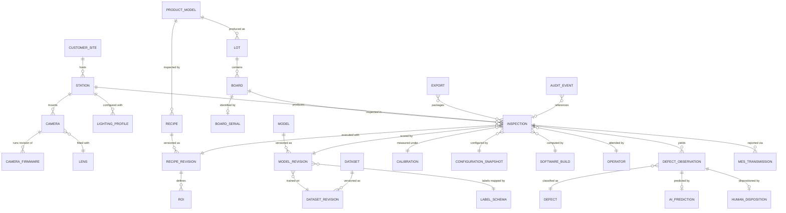
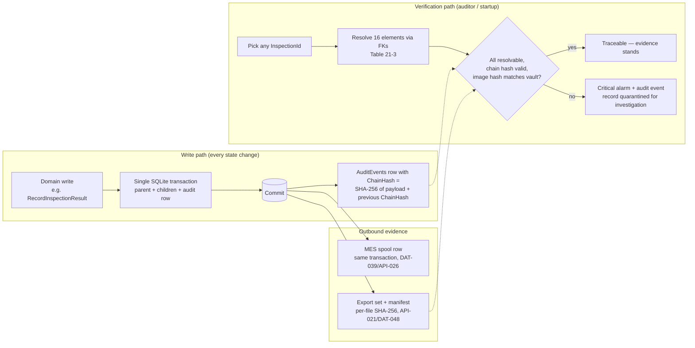
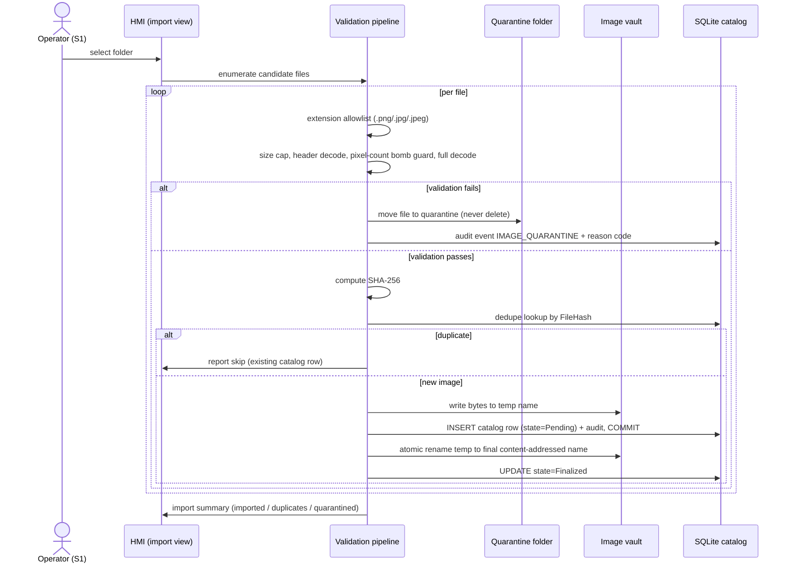

OpenAI/Codex and numerous other coding agents will review your output once you are done.

# Data Architecture, APIs, and Storage — AOI Software Architecture, Secure Development, and Change-Control Standard, v1.0 (2026-07-15)

Scope: this volume defines the canonical data model and traceability guarantee (§21), the contract rules for every internal, IPC, REST, and file-based boundary (§22), and the database, image-vault, archiving, retention, and export standard (§37) for AOI Monitor.

Supersedes/Related existing docs: normatively supersedes the "Migration Policy" and "Data Growth and Retention Boundary" sections of `Docs/DATA_PIPELINE.md` (which remains as a descriptive schema inventory; on conflict this volume prevails); extends `Docs/DATA_PIPELINE.md` and `Docs/ARCHITECTURE.md` without replacing them; reuses the certification-boundary wording of `Docs/Standards_Traceability_Matrix.md` by reference. The DAT/API identifier namespaces introduced here are new and do not collide with the RTM, checklist, or runtime ID schemes inventoried in VOL01 §5.

This standard is standards-aligned, not certified; mappings in `Maps:` fields indicate alignment, never certification.

---

## 21. Data Architecture and Traceability Model

This section defines the canonical entities, identifier rules, and relationship model for all persisted data, and the 16-element traceability guarantee that every inspection result must satisfy. It exists because AOI Monitor is a quality-evidence product: an inspection verdict that cannot be reconstructed — exact software, model, recipe, calibration, hardware, operator, and image — is commercially and legally worthless to the customer. §22 governs how this data crosses boundaries; §37 governs how it is stored, retained, and exported; §38 (VOL13) governs the logging/metrics pipeline that surrounds it.

The existing schema is the baseline, not the enemy: `AOI_Monitor/Data/AoiDatabase.Infrastructure.cs` (4,409 lines) defines **60 distinct tables**, `AOI_Monitor/Data/AoiDatabaseMigrations.cs` defines **30 ordered migrations**, and the `AoiDatabase` static partial class is split into 10 domain partials (Inspection, Images, Audit, Learning, Models, Pilot, Recipes, Integration, Infrastructure, root). Every delta in this section is expressed as an **additive migration obligation** (M-21-x) against that schema — no rewrite, no parallel store.

### 21.1 Canonical entity catalogue and identifier rules

Identifier rules that apply to every entity below:

1. **Internal key**: each table keeps its SQLite `INTEGER PRIMARY KEY` surrogate. Internal keys are never exported, never reused, and never shown to operators as identity.
2. **Public identifier**: every entity instance that crosses the export, central-sync, or MES boundary carries a `PublicId` — a lowercase RFC 4122 v4 GUID generated at creation (ASSUMPTION A-VOL05-1: GUIDv4 is sufficient because cross-station uniqueness, not ordering, is the requirement; risk: none material — ULID may later be preferred for sort locality and is an additive change).
3. **Revisioned assets** (Recipe, Model, Calibration, Dataset, LabelSchema, ConfigurationSnapshot) are identified by `(AssetId, RevisionNumber)`; a revision row is immutable after creation.
4. **Natural keys** (board serials, lot codes, recipe names, camera vendor serials) are uniquely indexed attributes, never primary keys — they are customer-controlled and can collide, change, or be re-etched.

Vocabulary note (binding): the repo table `Defects` stores per-inspection findings; in this standard's vocabulary that entity is **DefectObservation**. **Defect** means the taxonomy entry (stable string ID such as `DEF-SOLDER-BRIDGE` per D-17, stored in `DefectTaxonomyEntries`). The physical table is not renamed (rename is destructive churn for zero data value); the mapping is recorded here and in the VOL01 §5 reconciliation register.

**Table 21-1a — Physical and organizational entities**

| Entity | Canonical identifier | Existing anchor (repo) | Delta |
|---|---|---|---|
| CustomerSite | SiteId + PublicId | none (single site implicit) | M-21-1 |
| Station | StationId + PublicId | `AuditEvents.StationId` text column only | M-21-1 |
| Operator | UserId (+ role at event time) | `LocalUsers`, `LocalUserSessions` | none |
| ProductModel | ProductModelId + customer part code | none (implied by recipe name) | M-21-2 |
| Lot | LotId + LotCode (natural, unique) | none | M-21-2 |
| Board | BoardId | none | M-21-2 |
| BoardSerial | BoardSerialId + serial text (unique) | none | M-21-2 |
| Camera | CameraId + vendor serial | `CameraAcceptanceRuns` (evidence only) | M-21-3 |
| CameraFirmware | (CameraId, FirmwareVersion) | none | M-21-3 |
| Lens | LensId + model/serial | none | M-21-3 |
| LightingProfile | (LightingProfileId, Revision) | `LightingAcceptanceRuns` (evidence only) | M-21-3 |

**Table 21-1b — Versioned technical assets**

| Entity | Canonical identifier | Existing anchor (repo) | Delta |
|---|---|---|---|
| Recipe | RecipeId (stable name) | `RecipeRevisions` | none |
| RecipeRevision | (RecipeId, Revision), immutable | `RecipeRevisions` | none |
| ROI | (RecipeRevision, RoiId) | JSON payload inside recipe revision | stable RoiId required |
| Model | logical model name | `ModelRegistry.Name` | none |
| ModelRevision | registry ModelId + SHA-256 | `ModelRegistry` row (`Sha256` NOT NULL) | none |
| Dataset | DatasetId | none (folder-path based today) | M-21-7 |
| DatasetRevision | (DatasetId, Revision) + content hash | `ModelAcceptanceRuns.DatasetHash` (weak: folder name + CSV hash only) | M-21-7 |
| LabelSchema | (TaxonomyId, Version) per D-17 | `DefectTaxonomies`, `DefectTaxonomyEntries` | none |
| Calibration | (CalibrationProfileId, Revision) | `CalibrationProfiles`, `CalibrationPoints` | revision semantics M-21-9 |
| SoftwareBuild | BuildId = version + commit SHA | `BuildTestEvidence` | link to results M-21-1 |
| ConfigurationSnapshot | SnapshotId + SHA-256 | none (live unsigned JSON files) | M-21-4 |

**Table 21-1c — Event and evidence entities**

| Entity | Canonical identifier | Existing anchor (repo) | Delta |
|---|---|---|---|
| Inspection | InspectionId + PublicId | `InspectionResults` | revisioning M-21-5 |
| Defect (taxonomy entry) | stable string ID (`DEF-*`) | `DefectTaxonomyEntries` | none |
| DefectObservation | ObservationId | `Defects` table (see vocabulary note) | none |
| AiPrediction | PredictionId | `Defects` rows + result verdict fields | M-21-6 |
| HumanDisposition | DispositionId | `ReviewEvents` | none |
| Export | ExportId | `ExportHistory`, `ExportVerification` | none |
| MesTransmission | TransmissionId | `MesUploadAttempts`, `MesSpoolQueue` | none |
| AuditEvent | AuditEventId (rowid) | `AuditEvents` | chain hash M-21-8 |

### 21.2 Core relationship model

**Reading this diagram:** a CustomerSite hosts Stations; each Station mounts Cameras (each running a specific CameraFirmware revision and fitted with a Lens) and holds LightingProfiles. A ProductModel is produced as Lots of Boards, each Board optionally carrying one BoardSerial. Every Inspection is produced by exactly one Station on one Board and is pinned to exactly one RecipeRevision (which defines ROIs), one ModelRevision (trained on a DatasetRevision, its class indices mapped through a LabelSchema per D-17), one Calibration revision, one ConfigurationSnapshot, one SoftwareBuild, and one attending Operator. An Inspection yields DefectObservations; each observation is classified against a taxonomy Defect entry and carries at most one AiPrediction and at most one current HumanDisposition. Inspections are reported outward through MesTransmissions and packaged into Exports; AuditEvents reference any entity via typed entity references. Cardinality `}o--||` means "many-to-exactly-one": an inspection cannot exist without its pinned revisions — that is the mechanical core of the traceability guarantee.

### 21.3 The 16-element traceability guarantee

Every persisted inspection result SHALL be resolvable — by recorded identifiers alone, with no reliance on file-system state, in-memory state, or operator memory — to all 16 elements below (bound by DAT-005). "Anchor" cites where the element lives today; "Delta" names the migration obligation where it does not.

**Table 21-3 — 16-element traceability guarantee**

| # | Element | Anchor today (repo) | Delta |
|---|---|---|---|
| 1 | Exact software version (build + commit) | engine name/version on result; `BuildTestEvidence` unlinked | M-21-1 |
| 2 | Model version (registry ID + SHA-256) | `ModelRegistry` row, echoed in evidence | FK: M-21-9 |
| 3 | Recipe version | `RecipeRevisions` | FK: M-21-9 |
| 4 | Taxonomy (label schema) version | `DefectTaxonomies` versioned | stamp: DAT-009 |
| 5 | Calibration version | `CalibrationProfiles` | FK + revision: M-21-9 |
| 6 | Camera + lighting configuration | acceptance-run tables only, not per-inspection | M-21-3 |
| 7 | Hardware identity (camera serial, station) | `CameraFrame.CameraId` transient; `StationId` on audit only | M-21-1/-3 |
| 8 | Post-processing version (parser/PostProc) | none | M-21-9 |
| 9 | Threshold set in force | `ThresholdProfiles`/`Deployments` exist, deployment not stamped | M-21-9 |
| 10 | Operator or service identity | `AuditEvents.UserId/UserRole`, `ReviewEvents` | none |
| 11 | UTC timestamp | ISO-8601 "O" TEXT everywhere | none |
| 12 | Display timezone of the station | none (local timestamp only on audit rows) | M-21-1 |
| 13 | Lot / board identifiers | none | M-21-2 |
| 14 | Original image hash (SHA-256) | `Images.FileHash` + `IX_Images_FileHash` | none |
| 15 | Result revision (supersession chain) | none — results have no revision concept | M-21-5 |
| 16 | Human override / disposition | `ReviewEvents` | link hardening: M-21-6 |

Stage reality: elements 6, 7, and 13 cannot carry real values in the Stage 1 offline image workflow (no camera, no lot feed). They SHALL be populated with the explicit sentinel members `UNSERIALIZED` (lot/board) and `OFFLINE-IMPORT` (acquisition hardware) rather than NULL, so that queries can distinguish "not applicable at this stage" from "lost". This follows the repo's existing honesty discipline (`IntegrationConnectionStatus.Simulated` is a first-class value, `Services/IntegrationContracts.cs:5-11`).

### 21.4 Schema delta — migration obligations

The following migrations extend the existing 30-migration chain (`AoiDatabaseMigrations.OrderedMigrations`). All are additive per the existing policy in `Docs/DATA_PIPELINE.md`; none rewrites existing rows. Target stage = the stage gate the migration must precede.

**Table 21-4 — Schema-delta migration obligations**

| ID | Content | Target |
|---|---|---|
| M-21-1 | `Stations`, `CustomerSites` tables; `StationId`, `SoftwareBuildId`, `DisplayTimezone` columns on `InspectionResults` | S1 exit |
| M-21-2 | `ProductModels`, `Lots`, `Boards`, `BoardSerials` tables; FK from `InspectionResults` with `UNSERIALIZED` sentinel | S2 pilot |
| M-21-3 | `Cameras`, `CameraFirmwares`, `Lenses`, `LightingProfiles` tables; per-inspection acquisition link | S2 pilot |
| M-21-4 | `ConfigurationSnapshots` table (schema-versioned JSON + SHA-256); FK from `InspectionResults` | S1 exit |
| M-21-5 | Result revisioning: `SupersedesInspectionResultId`, `RevisionNumber`, `RevisionReason` on `InspectionResults` | S1 exit |
| M-21-6 | `ReviewEvents` gains FK to the superseded verdict revision it overrides | S1 exit |
| M-21-7 | `Datasets`, `DatasetRevisions` tables with full content hashing (closes the folder-name-only `DatasetHash` weakness, `ModelAcceptanceService.cs:348-352`) | S2 pilot |
| M-21-8 | `ChainHash` column on `AuditEvents` + backfill anchor row (see DAT-012) | S1 exit |
| M-21-9 | `ModelRegistryId`, `RecipeRevisionId`, `CalibrationProfileId`, `CalibrationRevision`, `PostProcVersion`, `ThresholdProfileDeploymentId` FKs on `InspectionResults` | S1 exit |

### 21.5 Audit and traceability flow

**Reading this diagram:** on the write path, every state-changing domain operation commits its parent row, child rows, and its audit event inside one SQLite transaction (DAT-014); the audit row carries a chain hash linking it to the previous audit row (DAT-012), which converts the audit table from plain rows into a tamper-evident sequence. Outbound, the same commit atomically enqueues any MES spool row (API-026) and any export is packaged with a per-file SHA-256 manifest (API-021, persisted per DAT-048). On the verification path, an auditor (or the startup self-check) picks any inspection, resolves all 16 traceability elements through recorded foreign keys, re-verifies the audit chain and the original-image hash against the vault, and either confirms traceability or raises a Critical alarm and quarantines the record — never silently repairing it (DAT-027).

### R: §21 requirements (DAT-001–DAT-016)

#### Identity and entity model

**[DAT-001]** (P2 | ALL | Persistence, Domain)
Every entity instance in the §21.1 catalogue SHALL be persisted with an immutable primary identifier that is never modified, reused, or recycled after deletion.
- Why: identifier reuse silently rebinds historical evidence to the wrong physical object, corrupting traceability. Maps: Internal; 62443-4-2 CR 3.4.
- Verify: schema review checklist item + xUnit suite AoiDatabaseTests identity cases. Evidence: review record, test run report. Owner: Software Lead. Auto: Partially automated.
- Exception: Not allowed. Review: Annual.

**[DAT-002]** (P2 | ALL | Persistence, Export)
Every entity instance that crosses the export, central-sync, or MES boundary SHALL carry a stable lowercase GUID `PublicId` distinct from its SQLite integer key.
- Why: rowids collide across stations and change on restore/merge; central sync and MES correlation need globally unique identity. Maps: Internal; OPCUA-MV.
- Verify: fitness function FF-DAT-04 (schema scan for PublicId on boundary tables) + contract tests. Evidence: CI gate log. Owner: Software Architect. Auto: Fully automated.
- Exception: Allowed — approver: Software Architect. Review: On change.

**[DAT-003]** (P3 | ALL | Persistence)
Natural business keys (board serials, lot codes, recipe names, camera vendor serials) SHALL be stored as uniquely indexed attributes rather than as primary keys.
- Why: customer-controlled identifiers can collide, change, or be re-etched; keying on them makes history unrepairable. Maps: Internal.
- Verify: schema review checklist item per migration. Evidence: migration review record. Owner: Software Lead. Auto: Manual review.
- Exception: Allowed — approver: Software Architect. Review: On change.

**[DAT-004]** (P1 | S1–S4 | Persistence)
Each migration obligation in Table 21-4 SHALL be implemented as an additive schema migration merged before the target stage gate stated in that table.
- Why: the 16-element guarantee (DAT-005) is unmeetable without these entities; deferring past the stage gate ships untraceable evidence. Maps: Internal; 62443-4-1 SM-7.
- Verify: fitness function FF-DAT-05 (migration-presence gate keyed to stage profile) + stage-gate review. Evidence: CI gate log, stage-gate record. Owner: Software Architect. Auto: Partially automated.
- Exception: Allowed — approver: Product Owner. Review: Per release.

#### Traceability guarantee

**[DAT-005]** (P0 | ALL | Persistence, Audit)
Every persisted inspection result SHALL be resolvable, by recorded identifiers alone, to all 16 traceability elements enumerated in Table 21-3, using the defined sentinels where a stage has no real value.
- Why: an unreconstructable verdict is worthless as quality evidence and indefensible in a customer escape investigation. Maps: 62443-3-3 SR 2.8; SSDF-PS.3; CFX.
- Verify: xUnit suite TraceabilityResolutionTests (new) resolving all 16 elements on every fixture result. Evidence: test run report per release. Owner: Software Architect. Auto: Fully automated.
- Exception: Not allowed. Review: Per release.

**[DAT-006]** (P1 | ALL | Persistence, Audit)
The application SHALL NOT update or delete a persisted quality record (inspection result, defect observation, disposition, audit event) in place outside the governed retention purge of §37.5.
- Why: in-place mutation destroys evidentiary value and enables silent verdict rewriting. Maps: 62443-3-3 SR 3.9; CWE-471.
- Verify: fitness function FF-DAT-06 (grep/analyzer gate: no UPDATE/DELETE against quality tables outside retention module). Evidence: CI gate log. Owner: Software Lead. Auto: Fully automated.
- Exception: Allowed — approver: Security Lead. Review: Quarterly.

**[DAT-007]** (P2 | ALL | Persistence)
Every correction to an inspection result SHALL be recorded as a new result-revision row that references the superseded row and records a non-empty revision reason.
- Why: corrections are legitimate; untracked corrections are indistinguishable from tampering. Maps: Internal; 62443-3-3 SR 2.8.
- Verify: xUnit suite AoiDatabaseTests revision cases (new, on M-21-5). Evidence: test run report. Owner: Software Lead. Auto: Fully automated.
- Exception: Not allowed. Review: Annual.

**[DAT-008]** (P2 | ALL | ModelMgmt, Persistence)
Reprocessing an image with a different model revision, threshold, or post-processor SHALL store its output as a new AiPrediction record linked to a new result revision, leaving every original AiPrediction record unmodified.
- Why: overwriting AI output on reprocess destroys the record of what the deployed model actually said — the core dataset for escape analysis and model debugging. Maps: AI-RMF; AISVS; Internal.
- Verify: xUnit suite ReprocessingVersioningTests (new). Evidence: test run report. Owner: ML Lead. Auto: Fully automated.
- Exception: Not allowed. Review: Annual.

**[DAT-009]** (P2 | ALL | Taxonomy, Persistence)
Every DefectObservation SHALL record both the taxonomy entry ID and the taxonomy version in force at classification time.
- Why: taxonomy evolution (D-17) otherwise silently re-labels historical observations; per-model-version class mapping requires the version stamp. Maps: Internal; AI-RMF.
- Verify: xUnit suite AoiDatabaseTests taxonomy stamp cases. Evidence: test run report. Owner: ML Lead. Auto: Fully automated.
- Exception: Not allowed. Review: Annual.

**[DAT-010]** (P2 | ALL | Persistence)
The persistence layer SHALL store every timestamp as an ISO-8601 round-trip ("O") UTC value in the invariant culture.
- Why: mixed-zone or culture-formatted timestamps break ordering, retention cutoffs, and cross-station correlation (D-16); this codifies the existing repo convention. Maps: Internal; NET-LC.
- Verify: fitness function FF-DAT-07 (analyzer gate: no DateTime.Now / local-format persistence in Data layer). Evidence: CI gate log. Owner: Software Lead. Auto: Fully automated.
- Exception: Not allowed. Review: Annual.

**[DAT-011]** (P1 | ALL | Persistence, ImageStore)
Every inspection result SHALL reference the SHA-256 content hash of each original image it was computed from.
- Why: the image hash is traceability element 14 and the only durable link between verdict and pixels; `Images.FileHash` exists — the reference from results must be mandatory, not incidental. Maps: 62443-4-2 CR 3.4; SSDF-PS.3.
- Verify: xUnit suite TraceabilityResolutionTests image-hash cases. Evidence: test run report. Owner: Software Lead. Auto: Fully automated.
- Exception: Not allowed. Review: Annual.

#### Audit integrity

**[DAT-012]** (P0 | ALL | Audit, Persistence)
Each AuditEvents row SHALL include a chain hash computed as SHA-256 over the canonicalized row payload concatenated with the previous row's chain hash, anchored at a recorded genesis value.
- Why: audit rows in user-writable SQLite currently have zero tamper evidence (repo gap: no hash chain on `AuditEvents`, `Data/AoiDatabase.Audit.cs`); a chain makes deletion or edit of history detectable. Maps: 62443-3-3 SR 3.9; ASVS-V16; CWE-778.
- Verify: xUnit suite AuditChainTests (new) covering append, verify, and tamper-detection cases. Evidence: test run report. Owner: Security Lead. Auto: Fully automated.
- Exception: Not allowed. Review: Per release.

**[DAT-013]** (P2 | ALL | Audit, Diagnostics)
The application SHALL verify the audit chain hash end-to-end at every startup and on operator demand, raising a Critical alarm and recording an audit event on the first mismatch.
- Why: a chain nobody verifies is decoration; startup verification bounds the undetected-tampering window to one session. Maps: 62443-3-3 SR 2.10; ASVS-V16.
- Verify: xUnit suite AuditChainTests verification cases + startup log inspection. Evidence: test run report, startup audit event. Owner: Security Lead. Auto: Fully automated.
- Exception: Allowed — approver: Security Lead. Review: Quarterly.

**[DAT-014]** (P2 | ALL | Audit, Persistence)
Every state-changing domain write SHALL record its audit event within the same database transaction as the domain change.
- Why: the repo currently writes audit after-commit for inspections (`Inspection.cs:100-106`) and before-delete for learning projects (`Learning.cs:171-176`); both orderings leave crash windows where data and audit disagree. Maps: 62443-3-3 SR 2.8; Internal.
- Verify: fitness function FF-DAT-08 (analyzer: RecordAuditEvent call sites must receive the ambient transaction) + AuditChainTests. Evidence: CI gate log. Owner: Software Lead. Auto: Fully automated.
- Exception: Allowed — approver: Software Architect. Review: On change.

**[DAT-015]** (P2 | ALL | Config, Persistence)
The application SHALL persist a ConfigurationSnapshot row (schema-versioned JSON plus its SHA-256) whenever any inspection-relevant configuration value changes.
- Why: traceability element for "configuration in force" is unmeetable from live mutable JSON files; snapshots pin what the inspection actually ran with. Maps: 62443-3-3 SR 7.6; SSDF-PS.1.
- Verify: xUnit suite ConfigurationSnapshotTests (new, on M-21-4). Evidence: test run report. Owner: Software Lead. Auto: Fully automated.
- Exception: Not allowed. Review: Annual.

**[DAT-016]** (P2 | ALL | Persistence)
Every evidence-link column introduced after v1.0 of this standard SHALL be declared as an enforced foreign key rather than an unconstrained integer column.
- Why: the schema has 48 FK declarations but many evidence links (`ModelRegistry.AuditEventId`, `ExportHistory.AuditEventId`) are plain columns — orphanable by convention; new links must not repeat this. Maps: Internal; CWE-1062.
- Verify: migration review checklist item + fitness function FF-DAT-09 (DDL scan for unconstrained *Id columns in new migrations). Evidence: CI gate log, review record. Owner: Software Lead. Auto: Partially automated.
- Exception: Allowed — approver: Software Architect. Review: On change.

---

## 22. API and Protocol Standards

This section governs every boundary across which data moves: in-process service contracts, the future inference-worker IPC (D-01/D-06), REST (MES, future central sync), and file-based exchange (image import folders, adapter manifests, central-sync drops, export packages). It exists because boundary contracts are where version skew, unit confusion, silent data loss, and injection enter a system. §21 defines what the data means; §37 defines how it rests; VOL11 owns the MES/OPC UA domain semantics and VOL15 owns update-bundle contents — the contract rules here apply to all of them.

### 22.1 Boundary inventory

| Boundary | Mechanism today (repo) | Contract artifact required |
|---|---|---|
| In-process service seams | C# interfaces: `Services/IntegrationContracts.cs` (620 lines, 8 interfaces), `IInspectionEngine`, `ICameraSource`/`IVisionCameraAdapter` | the interface + XML doc + status vocabulary |
| Inference worker IPC (future) | none yet — introduced per D-01 triggers | `.proto` files in repo (D-06) |
| MES REST (Stage 4) | `Services/MesRestClient.cs` JSON POST + multipart image upload | versioned JSON Schema files |
| Central sync | `Services/CentralSyncService.cs` file-drop JSON (REST mode is a non-functional label today) | versioned JSON Schema files |
| File exchange | image import folders, `*.camera-adapter.json` / `*.lighting-adapter.json` manifests, dataset validation CSV manifest, export packages | schema file + manifest per §22.5/§37.7 |
| OPC UA (Stage 4) | none (`NullOpcUaMesClient` only) | companion-spec mapping per VOL11 §35 |

### 22.2 Contract versioning

Every contract schema carries `SchemaVersion` as `major.minor`. Within a major version, changes are additive only: new optional fields with defined defaults. Field removal, rename, retype, semantic change, or unit change requires a new major version. Schema artifacts live in the repo under `Docs/contracts/` (new directory), one file per contract per major version, immutable after release. Each schema marks fields as **critical** (receiver must understand them to act safely — e.g., units, coordinate frame, simulated-provenance flags, verdicts) or non-critical. Receivers reject unknown critical fields and tolerate unknown non-critical fields — fail-closed where safety or evidence is at stake, forward-compatible everywhere else.

### 22.3 Errors and correlation

Every boundary error is a structured, typed record: stable machine-readable error code (registry per boundary, versioned with the schema), human-readable message, correlation ID, retryability flag, and UTC timestamp. Raw exceptions never cross a boundary; internal paths, stack traces, and connection strings never leave the process (the existing `RedactSecrets` discipline in `MesRestClient.cs` extends to all boundaries). Every cross-boundary request carries a correlation GUID propagated into logs, audit events, and downstream calls — the repo has no correlation concept today; this is a new obligation wired through the D-09 logging service.

### 22.4 Units and coordinate frames

Dimensioned fields declare units in the schema and carry unit-bearing names (`ExposureMicroseconds`, `BoardWidthMm`, `OffsetPx`). Coordinate-bearing payloads name their frame from the frame registry defined in §33 (VOL10): pixel frame, board frame, machine frame. A message with coordinates and no frame identifier is malformed and rejected. This rule exists because the repo already mixes pixel and normalized coordinates with runtime heuristics (`GenericDetectionOutputParser` auto-converts when values > 1.5, `ModelOutputParsers.cs:25-96`) — heuristic unit detection is prohibited at every new boundary.

### 22.5 Limits, timeouts, idempotency, pagination

Every boundary declares: maximum message/file size (enforced before parsing), per-call deadline (no infinite defaults), cancellation propagation, an idempotency class per operation (idempotent / at-least-once-safe / non-idempotent), and bounded pagination for list operations. Retry policy is defined at exactly one layer per call path — the repo's current nesting (spool retry × `MesRestClient` internal retry = quadratic attempts, `MesSpoolService.cs` + `MesRestClient.cs:143-192`) is the anti-pattern this rule eliminates.

### 22.6 Image-upload pipeline (S1)

The Stage 1 offline workflow ingests operator-selected image folders. The pipeline below is normative (API-027, DAT-041); it corrects the current repo ordering, which copies the vault file **before** the DB insert (`Images.cs:29-51`) and can strand orphan vault files on insert failure.

**Reading this diagram:** the operator selects a folder; each file passes the validation pipeline — extension allowlist, size cap, header decode, decompression-bomb guard (the existing `MaxDecodePixels` check, `Images.cs:99-103`), and full decode. Failures move the file to a quarantine folder with an audited reason code; nothing invalid is silently skipped or deleted. Valid files are hashed (SHA-256), deduplicated against `Images.FileHash`, then stored with the corrected ordering: temp write → catalog insert → commit → atomic rename to the final content-addressed name → finalize. A crash between commit and rename leaves a Pending row pointing at a temp file, which the reconciliation sweep (DAT-042) detects and repairs; the current copy-then-insert ordering instead leaves an invisible orphan file.

### R: §22 requirements (API-001–API-030)

#### Contracts and versioning

**[API-001]** (P1 | ALL | All)
Every inter-process, network, or file-based boundary SHALL have a written schema artifact committed to the repository before the boundary ships.
- Why: unversioned implicit contracts make skew undetectable and every integration change a guess. Maps: SSDF-PW.1; 42010; ASVS-V4.
- Verify: fitness function FF-API-01 (boundary inventory vs `Docs/contracts/` presence check). Evidence: CI gate log. Owner: Software Architect. Auto: Fully automated.
- Exception: Not allowed. Review: Per release.

**[API-002]** (P2 | ALL | All)
Every contract message or exchange file SHALL embed the schema's major.minor version identifier in a `SchemaVersion` field.
- Why: receivers cannot select parsing or reject skew without an in-band version. Maps: ASVS-V4; Internal.
- Verify: contract tests ContractGoldenTests (new) assert SchemaVersion presence. Evidence: test run report. Owner: Software Architect. Auto: Fully automated.
- Exception: Allowed — approver: Software Architect. Review: On change.

**[API-003]** (P1 | ALL | All)
Within a major contract version, schema changes SHALL be limited to adding optional fields with defined defaults.
- Why: removal, rename, retype, or semantic change inside a major version breaks deployed stations silently. Maps: SSDF-PW.1; Internal.
- Verify: fitness function FF-API-02 (schema-diff gate against released schema files). Evidence: CI gate log. Owner: Software Architect. Auto: Fully automated.
- Exception: Allowed — approver: Software Architect. Review: Per release.

**[API-004]** (P0 | ALL | All)
Receivers SHALL reject any message or exchange file containing an unrecognized field marked critical in the schema, rather than ignoring it.
- Why: silently dropping an unknown units, frame, provenance, or verdict qualifier can invert the meaning of accepted data — fail closed. Maps: ASVS-V2; CWE-20; 62443-4-2 CR 3.5.
- Verify: contract tests with critical-field injection fixtures. Evidence: test run report. Owner: Software Architect. Auto: Fully automated.
- Exception: Not allowed. Review: Per release.

**[API-005]** (P3 | ALL | All)
Receivers SHALL ignore unknown non-critical fields without error.
- Why: tolerant reading of non-critical additions is what makes API-003's additive evolution deployable across mixed-version fleets. Maps: Internal.
- Verify: contract tests with non-critical-field injection fixtures. Evidence: test run report. Owner: Software Lead. Auto: Fully automated.
- Exception: Allowed — approver: Software Architect. Review: On change.

#### Errors, correlation, semantics

**[API-006]** (P1 | ALL | Logging, All)
Every cross-boundary request SHALL carry a correlation GUID that is propagated to all resulting log entries, audit events, and downstream calls.
- Why: without correlation, multi-boundary failures (import → inference → spool → MES) cannot be reconstructed from logs. Maps: ASVS-V16; 62443-3-3 SR 2.8.
- Verify: xUnit suite CorrelationPropagationTests (new) + log inspection checklist. Evidence: test run report. Owner: Software Lead. Auto: Partially automated.
- Exception: Allowed — approver: Software Architect. Review: On change.

**[API-007]** (P1 | ALL | All)
Every boundary error SHALL use the §22.3 structured error contract with a stable machine-readable code, human message, correlation ID, retryability flag, and UTC timestamp.
- Why: free-text errors cannot drive retry logic, alarm routing, or operator guidance; stable codes make errors testable. Maps: ASVS-V16; 62443-3-3 SR 3.7.
- Verify: contract tests asserting error-shape conformance per boundary. Evidence: test run report. Owner: Software Lead. Auto: Fully automated.
- Exception: Allowed — approver: Software Architect. Review: On change.

**[API-008]** (P2 | ALL | All)
Error payloads crossing any boundary SHALL NOT contain stack traces, internal file paths, or connection strings.
- Why: boundary errors reach MES logs, export files, and support bundles — leakage discloses attack-relevant internals. Maps: ASVS-V16; CWE-209.
- Verify: xUnit suite redaction cases (extends AuthenticationAndSecretHandlingTests pattern). Evidence: test run report. Owner: Security Lead. Auto: Fully automated.
- Exception: Not allowed. Review: Annual.

**[API-009]** (P2 | ALL | All)
Every dimensioned numeric field in a contract schema SHALL declare an explicit unit in the schema file and carry a unit-bearing field name.
- Why: unit ambiguity across camera exposure, board geometry, and latency fields produces wrong-by-1000x defects that pass type checks. Maps: Internal; CWE-682.
- Verify: fitness function FF-API-03 (schema lint: dimensioned fields require unit annotation). Evidence: CI gate log. Owner: Software Architect. Auto: Fully automated.
- Exception: Allowed — approver: Software Architect. Review: On change.

**[API-010]** (P2 | S2+ | All)
Every coordinate-bearing message SHALL name its coordinate frame identifier from the §33 frame registry.
- Why: the repo already guesses pixel-vs-normalized at runtime (`ModelOutputParsers.cs:25-96`); frame guessing at hardware boundaries misplaces defects on real boards. Maps: Internal; OPCUA-MV.
- Verify: schema lint FF-API-03 + contract tests with frame-missing fixtures. Evidence: CI gate log. Owner: Software Architect. Auto: Fully automated.
- Exception: Not allowed. Review: Annual.

#### Limits, timeouts, idempotency, pagination

**[API-011]** (P2 | ALL | All)
Every boundary SHALL enforce a declared maximum message or file size, rejecting oversized input before parsing.
- Why: unbounded input is a denial-of-service primitive on a production station (CWE-770 is in the 2025 CWE Top 25). Maps: CWE-770; ASVS-V2; 62443-3-3 SR 7.2.
- Verify: contract tests with oversized fixtures per boundary. Evidence: test run report. Owner: Software Lead. Auto: Fully automated.
- Exception: Allowed — approver: Software Architect. Review: On change.

**[API-012]** (P1 | ALL | All)
Every outbound cross-boundary call SHALL execute under an explicit per-call deadline with no infinite default timeout.
- Why: a hung MES endpoint or dead named pipe must degrade the boundary, not freeze inspection flow. Maps: Internal; 62443-3-3 SR 7.1.
- Verify: fitness function FF-API-04 (analyzer: HttpClient/gRPC/pipe calls require timeout or deadline argument). Evidence: CI gate log. Owner: Software Lead. Auto: Fully automated.
- Exception: Not allowed. Review: Annual.

**[API-013]** (P2 | ALL | All)
Every asynchronous boundary method SHALL accept a CancellationToken and propagate it to the underlying I/O operation.
- Why: navigation and shutdown cancellation (already implemented in the shell, `MainWindow.xaml.cs:168-261`) is defeated by boundary calls that cannot be canceled. Maps: Internal; NET-LC.
- Verify: fitness function FF-API-05 (analyzer: async boundary signatures require CancellationToken). Evidence: CI gate log. Owner: Software Lead. Auto: Fully automated.
- Exception: Allowed — approver: Software Architect. Review: On change.

**[API-014]** (P3 | ALL | All)
Every operation in a contract schema SHALL declare its idempotency class (idempotent, at-least-once-safe, or non-idempotent) in the schema artifact.
- Why: retry safety cannot be reasoned about per call site; the declaration makes API-025 retry policies checkable. Maps: Internal.
- Verify: schema lint FF-API-03 idempotency annotation check. Evidence: CI gate log. Owner: Software Architect. Auto: Fully automated.
- Exception: Allowed — approver: Software Architect. Review: On change.

**[API-015]** (P1 | S4 | MES, REST)
Every MES result upload SHALL carry a client-generated idempotency key derived from the inspection PublicId so that retries cannot create duplicate MES records.
- Why: the spool retries transmissions (`MesSpoolService.cs`); without an idempotency key every retry risks duplicate quality records in the customer MES. Maps: Internal; CFX.
- Verify: MesRestIntegrationTests duplicate-retry cases (extend existing 16-fact suite). Evidence: test run report. Owner: Software Lead. Auto: Fully automated.
- Exception: Not allowed. Review: Per release.

**[API-016]** (P3 | ALL | All)
Every list-returning API SHALL implement bounded pagination with a maximum page size declared in the schema.
- Why: unbounded list responses are a memory and latency hazard as stations accumulate years of records. Maps: CWE-770; Internal.
- Verify: contract tests pagination cases. Evidence: test run report. Owner: Software Lead. Auto: Fully automated.
- Exception: Allowed — approver: Software Architect. Review: On change.

#### Transport-specific rules

**[API-017]** (P2 | ALL | All)
Receivers SHALL validate every inbound message or exchange file against the committed schema before acting on any field.
- Why: parse-then-validate ordering lets malformed data reach domain logic; validation at the boundary is the single choke point (`MesRestClient.cs:197-237` already validates response schemas — this generalizes it). Maps: ASVS-V2; CWE-20; 62443-4-2 CR 3.5.
- Verify: contract tests malformed-fixture cases per boundary. Evidence: test run report. Owner: Software Lead. Auto: Fully automated.
- Exception: Allowed — approver: Security Lead. Review: On change.

**[API-018]** (P2 | S2+ | Inference, Orchestrator)
The inference-worker IPC, when introduced per the D-01 triggers, SHALL use gRPC over Windows named pipes with versioned proto contracts stored in the repository, per-call deadlines, and length-limited messages per D-06.
- Why: D-06 is decided; restating it as a checkable requirement prevents an ad-hoc socket or shared-memory protocol emerging under schedule pressure. Maps: Internal; 62443-4-1 SD-4.
- Verify: architecture review at worker introduction + FF-API-01 proto presence. Evidence: review record, CI gate log. Owner: Software Architect. Auto: Partially automated.
- Exception: Not allowed. Review: On change.

**[API-019]** (P0 | ALL | MES, REST, Config)
MES endpoint validation SHALL reject any base URL whose scheme is not `https`.
- Why: the current validator accepts `http://` (`MesIntegrationSettingsService.cs:83-87`), allowing API keys, bearer tokens, and Basic credentials to transit plaintext on factory networks. Maps: ASVS-V12; CWE-319; 62443-3-3 SR 4.1.
- Verify: xUnit suite MesRestIntegrationTests scheme-rejection cases. Evidence: test run report. Owner: Security Lead. Auto: Fully automated.
- Exception: Not allowed. Review: Per release.

**[API-020]** (P1 | S4 | REST, IAM)
Every REST endpoint exposed or consumed by the product SHALL require authentication.
- Why: missing authentication for critical functions is #4 on the 2025 KEV-informed CWE list; anonymous quality-data endpoints are indefensible. Maps: CWE-306; ASVS-V4; 62443-3-3 SR 1.1.
- Verify: Stage 4 integration test suite + configuration review checklist. Evidence: test run report, review record. Owner: Security Lead. Auto: Partially automated.
- Exception: Not allowed. Review: Per release.

**[API-021]** (P2 | ALL | Export, Config)
Every file-based exchange package (central-sync drop, export package, update bundle, adapter package) SHALL include a manifest listing schema version and SHA-256 per contained file.
- Why: file drops have no transport-layer integrity; the manifest is the only means of detecting truncation, tamper, or partial delivery. Maps: 62443-4-2 CR 3.4; SSDF-PS.2; SLSA.
- Verify: xUnit suites SupportBundleServiceTests/ExportVerification cases extended to all package types. Evidence: test run report. Owner: Software Lead. Auto: Fully automated.
- Exception: Not allowed. Review: Annual.

**[API-022]** (P2 | ALL | Export, ImageStore)
File-based exchange writers SHALL publish each file by writing to a temporary name and atomically renaming it into the consumer-visible path.
- Why: consumers polling a drop folder must never observe half-written JSON or images; rename-into-place is the only atomic publish primitive on NTFS. Maps: Internal; CWE-362.
- Verify: xUnit suite FileExchangeAtomicityTests (new). Evidence: test run report. Owner: Software Lead. Auto: Fully automated.
- Exception: Allowed — approver: Software Architect. Review: On change.

#### Internal contracts and pipeline conformance

**[API-023]** (P3 | ALL | All)
Every integration endpoint implementation SHALL report exactly one of the `IntegrationConnectionStatus` values (NotConnected, Simulated, Error, Ready) defined in `Services/IntegrationContracts.cs`.
- Why: the four-state vocabulary is the repo's core honesty mechanism; a fifth ad-hoc state or a misused Ready breaks every readiness gate built on it. Maps: Internal.
- Verify: xUnit suite IntegrationContractsTests conformance cases (extend existing 19 facts). Evidence: test run report. Owner: Software Lead. Auto: Fully automated.
- Exception: Not allowed. Review: Annual.

**[API-024]** (P1 | ALL | All)
Simulated-provenance fields (`IsSimulated`, `isRealHardware`) SHALL be propagated unmodified through every boundary and into every record derived from them.
- Why: relabeling simulated evidence as real would falsify acceptance claims; `GenericVisionCameraSource.NormalizeFrame` already enforces this for frames — it must hold at every boundary. Maps: Internal; SSDF-PS.3.
- Verify: xUnit suite provenance-propagation cases per boundary. Evidence: test run report. Owner: QA Lead. Auto: Fully automated.
- Exception: Not allowed. Review: Per release.

**[API-025]** (P2 | ALL | MES, All)
Every boundary retry policy SHALL be bounded, use jittered exponential backoff, and be defined at exactly one layer per call path.
- Why: the current spool-retry × client-retry nesting multiplies HTTP attempts quadratically (`MesSpoolService.cs` + `MesRestClient.cs:143-192`), hammering the MES during outages. Maps: Internal; 62443-3-3 SR 7.1.
- Verify: code review checklist item + MesRestIntegrationTests attempt-count cases. Evidence: test run report, review record. Owner: Software Lead. Auto: Partially automated.
- Exception: Allowed — approver: Software Architect. Review: On change.

**[API-026]** (P1 | ALL | Persistence, MES)
Every outbound integration payload — MES upload, central-sync drop, or future REST call — SHALL be durably spooled in the same database transaction as the domain event that produced it, before any transmission attempt.
- Why: the current send-then-spool-on-failure design loses payloads on crash, and failed image uploads are never spooled at all (`TraceabilityUploadService.cs:53-57`, `TraceabilitySignoffService.cs:84`); a transactional outbox spanning every integration makes loss structurally impossible. Maps: Internal; CFX; 62443-3-3 SR 7.1.
- Verify: xUnit suite OutboxTransactionTests (new) incl. crash-window simulation. Evidence: test run report. Owner: Software Lead. Auto: Fully automated.
- Exception: Not allowed. Review: Per release.

**[API-027]** (P1 | S1–S4 | ImageStore, Acquisition)
Folder-based image ingestion SHALL execute the §22.6 validation stages — extension allowlist, size cap, header and full decode, decompression-bomb guard, quarantine-on-failure, SHA-256 hashing, and dedupe — before any catalog write.
- Why: letting unvalidated bytes reach the catalog or vault admits malformed, oversized, or decompression-bomb images and produces unaudited rejections; the write-ordering that follows validation is owned by DAT-041. Maps: ASVS-V5; CWE-434; CWE-409.
- Verify: xUnit suite ImageImportPipelineTests (new) asserting validation-stage ordering and quarantine behavior. Evidence: test run report. Owner: Software Lead. Auto: Fully automated.
- Exception: Allowed — approver: Software Architect. Review: On change.

**[API-028]** (P2 | ALL | CI, All)
Every versioned contract SHALL have automated contract tests that pin the wire or file format against golden samples for every supported major version.
- Why: refactors silently change serialized shapes; golden-sample pinning turns contract drift into a red build instead of a field incident. Maps: SSDF-PW.8; Internal.
- Verify: xUnit suite ContractGoldenTests presence gate FF-API-06. Evidence: CI gate log, test run report. Owner: QA Lead. Auto: Fully automated.
- Exception: Allowed — approver: QA Lead. Review: Per release.

**[API-029]** (P3 | ALL | All)
A superseded contract major version SHALL remain supported for at least 12 months after its successor ships, with the deprecation date recorded in the schema artifact.
- Why: stations and MES integrations upgrade on customer schedules, not ours; an unmanaged cutoff strands deployed fleets. Maps: Internal; CRA.
- Verify: schema artifact review at release. Evidence: release checklist record. Owner: Release Manager. Auto: Manual review.
- Exception: Allowed — approver: Product Owner. Review: Per release.

**[API-030]** (P2 | ALL | All)
Every timestamp field crossing a boundary SHALL be serialized as ISO-8601 UTC with the `Z` designator.
- Why: offset-free or local timestamps at boundaries reintroduce the ambiguity D-16 eliminates in storage. Maps: Internal; CFX.
- Verify: contract tests timestamp-format cases + schema lint FF-API-03. Evidence: test run report. Owner: Software Lead. Auto: Fully automated.
- Exception: Not allowed. Review: Annual.

---

## 37. Database, Image Storage, Archiving, and Export

This section governs the persistence engine and its operating rules, schema migrations, retention and legal hold, the image vault, and every export format. It exists because the database and vault ARE the product's evidence; §21 defines their content, §38 (VOL13) consumes them for observability, and §29 (VOL08) governs the input-side security of files this section only exports.

### 37.1 Engine decision (renders D-04)

D-04 is decided: **SQLite in WAL mode, embedded per station**, is the Stage 1–3 default; PostgreSQL is the designated successor when any adoption trigger fires. The factor analysis:

| # | Factor | Stage 1–3 reality | SQLite fit | PostgreSQL trigger |
|---|---|---|---|---|
| 1 | Writing processes | one resident writer (the WPF app) | designed for this | >1 writing process |
| 2 | Stations | 1–10 per site, independent | per-station file | shared multi-station store |
| 3 | Concurrent writers | in-process threads, WAL-serialized | adequate | sustained write contention |
| 4 | Network access | local file only; SMB prohibited (D-04) | adequate | customer requires networked DB |
| 5 | Availability | station-local; no DB server to fail | embedded wins | central HA requirement |
| 6 | Backup | single-file Online Backup API / VACUUM INTO | simple, verifiable | PITR / WAL-archiving need |
| 7 | Restore | file replace + integrity_check | minutes, no DBA | point-in-time restore demand |
| 8 | Ops expertise | no DBA at customer factories | zero-admin wins | customer operates a DB team |
| 9 | Customer IT restrictions | air-gapped lines; server installs often refused | in-process wins | customer mandates managed DB |
| 10 | Volume | low GB/station-year (images live outside DB) | comfortable | single-station DB > 50 GB |
| 11 | Retention | years, archive-then-purge locally | adequate | central long-horizon consolidation |
| 12 | Query complexity | keyed lookups + reporting joins | adequate | cross-station analytics |
| 13 | Centralization | store-and-forward to central (existing `CentralSyncService`) | adequate | central store becomes system of record |
| 14 | Cost/footprint | 3 NuGet packages, zero install, deterministic | wins outright | n/a (PostgreSQL adds service ops, not license cost) |

**PostgreSQL adoption criteria (any one fires D-04):** (a) more than one writing process required; (b) a central multi-station store becomes the system of record; (c) a customer requires networked database access; (d) a single-station database exceeds 50 GB or exhibits sustained write contention (measured busy-timeout retries, DAT-028). Shared-file SQLite over SMB/NFS is prohibited in all cases — SQLite's locking is not reliable on network filesystems and corruption is the documented failure mode. Central sync remains store-and-forward from station SQLite to the central store.

**Explicit SQLite suitability limits** (accepted, monitored via DAT-028): one writer at a time (WAL readers don't block, writers serialize); whole-file blast radius on corruption; no online replication; no row-level access control (compensated by process-level controls, VOL07); practical comfort zone well under 50 GB per file.

### 37.2 SQLite operating rules

Current repo state, kept or corrected: WAL is set persistently in the schema SQL (`Infrastructure.cs:3527`) — kept. `PRAGMA foreign_keys = ON` runs **only** on the Initialize connection (`Infrastructure.cs:3528`) while every other connection relies on compile-time defaults, and `RunLogRetention` deliberately sets it OFF (`Infrastructure.cs:3298-3302`) — corrected by DAT-018 (every connection, at open, in `OpenConnection()`); the retention job may suspend FK enforcement only inside its own documented transaction with a recorded justification. No busy timeout is configured today — corrected by DAT-019. Connection-per-operation is kept (it is what makes the static gateway thread-tolerant).

### 37.3 Migrations

The existing mechanism (versioned `OrderedMigrations`, per-migration transactions, version stamped inside the same transaction, `SchemaInfo` bookkeeping — `AoiDatabaseMigrations.cs:53-88`) is sound and is retained. Two defects are corrected: (1) migrations delegate to live `Ensure*` builders whose DDL evolves after merge, so the migration history is not a reproducible snapshot — the **freeze obligation** (DAT-029) requires each newly merged migration to contain literal, immutable SQL; (2) a database already stamped at the latest version with a physically missing column is never repaired — the **schema-fingerprint check** (DAT-034) detects drift at startup instead of hoping. Existing migrations v1–v30 are grandfathered as-is (retroactively freezing them would falsify history); the freeze applies from the first migration merged after adoption of this standard.

### 37.4 Query discipline and integrity

The repo's parameterization discipline is genuinely good — data values are consistently bound with `$name` parameters and the only interpolated SQL fragments are identifiers from hard-coded internal lists with proper quoting (`Infrastructure.cs:75, 3466`). DAT-035 makes this survival-mandatory rather than habitual. Multi-statement writes already use explicit transactions at 22 sites; DAT-036 makes the rule universal. The silent-fallback readers (`ParseDateTime` → `DateTime.MinValue`, `DeserializeOrDefault` → default object, `Infrastructure.cs:2032-2069`) are prohibited by DAT-027: masked corruption in a quality-evidence store is worse than a visible failure.

### 37.5 Retention and legal hold

SD-02 (hardcoded "auto-archive logs older than 30 days" in the source spec) is resolved: retention is configurable per data class, with legal hold. The current single-policy retention covers only 4 log tables (`RunLogRetention`, `Infrastructure.cs:3288-3332`); everything else grows unbounded. Target data classes:

**Table 37-5 — Retention data classes**

| Class | Contents | Default retention | Purge precondition |
|---|---|---|---|
| Quality evidence | InspectionResults, Defects, ReviewEvents, ExportHistory/Verification, AuditEvents | 730 days | DAT-039 gate; archive-then-purge |
| Original images | vault files + Images rows | 365 days | linked evidence exported or purged |
| Derived artifacts | annotated exports, report folders | 180 days | none beyond age |
| Operational logs | Rolling application log files (latency traces/spans → §38/VOL13) | 90 days | none |
| Training data | TrainingSamples, ImageLearning* | explicit project deletion only | Engineer action, audited |
| Queues | MesSpoolQueue/CentralSyncQueue rows in terminal states | 90 days after terminal state | Sent/Abandoned/Skipped only |
| Backups | daily DB backups | last 7 daily + 4 weekly | never while sole copy |

All defaults are engineering defaults pending customer/compliance review (ASSUMPTION A-VOL05-2; risk: customer contracts or sector rules may require longer — the mechanism, not the numbers, is normative). Legal hold (DAT-038) suspends purge for a flagged data class or lot until explicitly released by an Admin with a recorded reason. The archive-then-purge pattern (rows serialized to `LogArchive` before deletion) is retained and extended to all purged classes.

### 37.6 Image vault

Images live **outside the database** in the content-addressed vault (`{StorageRoot}\image_vault`); the DB stores metadata and the SHA-256. This is kept — BLOB storage would balloon the DB past SQLite's comfort zone and break the backup story. Corrections and hardening:

- **Content addressing** (DAT-040): new imports store under `image_vault/sha256/<hh>/<full-hash>.<ext>` (two-hex-char fan-out). Existing timestamp-named files (`MakeVaultFileName`, `Infrastructure.cs:3509-3516`) remain valid at their recorded `VaultPath`; the sweep verifies both generations.
- **Ordering** (DAT-041): the current copy-then-insert ordering strands orphan files when the insert fails (acknowledged in `Docs/DATA_PIPELINE.md`). The corrected ordering is §22.6's: temp write → catalog insert (state=Pending) → commit → atomic rename → finalize. Every failure mode then leaves a DB-visible trace instead of an invisible file.
- **Reconciliation** (DAT-042): a scheduled sweep detects vault files without catalog rows (orphans) and catalog rows whose files are missing — both are reported, never silently deleted or re-created.
- **Tamper detection** (DAT-043): the sweep re-verifies SHA-256 on a rotating sample; a mismatch on a quality-evidence image is a Critical alarm, because the model-artifact analog of this gap (hash computed once, never re-verified) is already a known repo weakness.
- **Immutability** (DAT-044): originals are never modified after finalization; annotation happens on derived copies in export paths only.

### 37.7 Export standard

Exports are the product's mouth: they carry quality evidence into customer Excel sheets, MES archives, and audit binders. Every export set gets a manifest with per-file SHA-256 (extending the existing `ExportVerification` mechanism, `Infrastructure.cs:3253-3280`).

#### 37.7.1 CSV profile

RFC 4180 quoting (fields containing delimiter, quote, CR, or LF are quoted; embedded quotes doubled); encoding UTF-8 **with BOM** (Excel — the dominant consumer in Korean factories — misdetects BOM-less UTF-8 Korean text); delimiter comma, declared in the manifest together with encoding and the invariant-culture numeric format (`.` decimal separator); timestamps ISO-8601 UTC; mandatory header row; a `SchemaVersion` column on every row. **Formula-injection defense** (DAT-046): any cell whose first character is `=`, `+`, `-`, `@`, tab (0x09), or carriage return (0x0D) is prefixed with a single quote `'`; OWASP documents that quoting alone can be stripped by Excel on save/reopen, so the prefix-escape is applied in addition to RFC 4180 quoting, and numeric cells are emitted as culture-invariant numbers, never as text beginning with `-`.

#### 37.7.2 Image exports

Original-mode exports are byte-identical vault copies whose hash matches the manifest entry. Annotated-mode exports render overlays and are marked `ANNOTATED` in both the filename and a burned-in text overlay — an annotated image must never be mistakable for the original evidence. Filenames are generated, never user-derived: `<type>_<inspection-public-id>_<utc-compact>.<ext>` from the allowlist `[a-z0-9._-]`; user text (recipe names, folder names, operator remarks) never reaches a filename. Annotated exports carry only the documented metadata allowlist (generator version, inspection PublicId, UTC timestamp) — no EXIF pass-through of customer-identifying capture metadata into outbound packages.

#### 37.7.3 PDF reports

PDFs are generated in-process by a managed library from controlled templates versioned in the repo. Untrusted content (defect notes, file names, operator remarks, Korean free text) is escaped/encoded by the template engine, never concatenated into template markup. Prohibited: external converters (headless browsers, Office automation, shell-out converters), embedded JavaScript or any active content, external resource fetches at generation or view time. Generator name and version are embedded in the document-information dictionary; documents are capped at 50 MB (A-VOL05-3). Where a customer contract requires digitally signed reports, the signing mechanism follows D-12 key custody and is an open decision (OD-VOL05-2) until the first such contract — no interim ad-hoc signing.

#### 37.7.4 Archive profile

ZIP only. Creation: manifest with per-file SHA-256, forward-slash relative paths, no empty directories. Extraction (config-backup restore, validation kits, adapter packages) enforces, before any entry is written: canonical-path containment under a dedicated extraction root; rejection of absolute paths, `..` segments, symlinks/reparse points, and device names; entry count ≤ 10,000; total expanded size ≤ 10 GB; compression ratio ≤ 100:1 per entry; archive nesting depth ≤ 2. After extraction, manifest hashes are verified before any extracted file is used. Limits are conservative defaults (A-VOL05-3).

### R: §37 requirements (DAT-017–DAT-055)

#### Engine operating rules

**[DAT-017]** (P2 | ALL | Persistence)
Every production station database SHALL run in SQLite WAL journal mode.
- Why: WAL gives non-blocking readers with a serialized writer — the concurrency model D-04 assumes; rollback-journal mode reintroduces reader/writer blocking. Maps: Internal; 62443-3-3 SR 7.1.
- Verify: xUnit suite AoiDatabaseTests journal-mode assertion. Evidence: test run report. Owner: Software Lead. Auto: Fully automated.
- Exception: Not allowed. Review: Annual.

**[DAT-018]** (P1 | ALL | Persistence)
Every database connection SHALL execute `PRAGMA foreign_keys = ON` at open, in the shared connection factory.
- Why: the pragma is per-connection in SQLite and currently runs only on the Initialize connection (`Infrastructure.cs:3528`), so FK enforcement on all other connections is a compile-time accident. Maps: CWE-1062; Internal.
- Verify: xUnit suite AoiDatabaseTests per-connection pragma assertion + fitness function FF-DAT-01 (OpenConnection code gate). Evidence: test run report, CI gate log. Owner: Software Lead. Auto: Fully automated.
- Exception: Allowed — approver: Software Architect. Review: On change.

**[DAT-019]** (P2 | ALL | Persistence)
Every database connection SHALL set a busy timeout of at least 5000 ms at open.
- Why: with no busy timeout configured today, any lock overlap surfaces as an immediate SQLITE_BUSY failure instead of a brief wait. Maps: Internal.
- Verify: xUnit suite AoiDatabaseTests busy-timeout assertion. Evidence: test run report. Owner: Software Lead. Auto: Fully automated.
- Exception: Allowed — approver: Software Architect. Review: On change.

**[DAT-020]** (P2 | ALL | Persistence)
The application SHALL verify single-instance execution (the existing named mutex `Local\AOI_Monitor_SingleInstance`) before opening any write connection to the station database.
- Why: two app instances racing one SQLite file plus JSON snapshots is the documented corruption scenario the mutex exists for (`App.xaml.cs:14-28`); the check must gate DB writes, not just window creation. Maps: Internal; CWE-362.
- Verify: xUnit/UI test covering second-instance startup behavior. Evidence: test run report. Owner: Software Lead. Auto: Fully automated.
- Exception: Not allowed. Review: Annual.

**[DAT-021]** (P2 | ALL | Persistence, Config)
Startup validation SHALL fail closed when the configured storage root or database path resolves to a network share or a file-synchronization directory (OneDrive, Dropbox, Google Drive, roaming profile).
- Why: sync services and SMB both break SQLite locking assumptions and can corrupt the DB or vault mid-write; the development checkout itself sits under OneDrive, so the hazard is demonstrably real. Maps: Internal; 62443-3-3 SR 7.1.
- Verify: xUnit suite StorageRootValidationTests (new) with synthetic sync-root paths. Evidence: test run report. Owner: Software Lead. Auto: Fully automated.
- Exception: Allowed — approver: Software Architect. Review: On change.

**[DAT-022]** (P1 | ALL | Persistence)
Database backups SHALL be produced at least every 24 h of operation, exclusively via the SQLite Online Backup API or `VACUUM INTO`.
- Why: file-copying a live WAL database captures a torn state; the Online Backup API and VACUUM INTO are the only consistent-snapshot mechanisms. Backup retention counts are governed by DAT-058. Maps: 62443-3-3 SR 7.3; CSF2.
- Verify: xUnit suite BackupServiceTests (new) + scheduled-task configuration review. Evidence: test run report, backup audit events. Owner: Software Lead. Auto: Partially automated.
- Exception: Allowed — approver: Software Architect. Review: Quarterly.

**[DAT-023]** (P2 | ALL | Persistence, CI)
Every release SHALL include an automated test that restores a backup produced by the previous release schema and passes `PRAGMA integrity_check` plus a migration to the current version.
- Why: an unrestorable backup is discovered exactly when it is needed; restore testing is the only proof backups work. Maps: 62443-3-3 SR 7.4; SSDF-RV.1.
- Verify: xUnit suite RestoreCompatibilityTests (new) in the release gate. Evidence: CI gate log. Owner: QA Lead. Auto: Fully automated.
- Exception: Allowed — approver: QA Lead. Review: Per release.

**[DAT-024]** (P2 | ALL | Persistence, Diagnostics)
The application SHALL run `PRAGMA quick_check` at every startup, recording the result as an audit event.
- Why: a fast startup consistency probe bounds the window in which page-level corruption goes unnoticed to one session; the deeper periodic scan is DAT-056. Maps: 62443-3-3 SR 3.4; Internal.
- Verify: xUnit suite IntegrityCheckSchedulingTests (new) startup-quick_check cases + audit-event inspection. Evidence: test run report, audit events. Owner: Software Lead. Auto: Fully automated.
- Exception: Allowed — approver: Software Architect. Review: Quarterly.

**[DAT-025]** (P1 | ALL | Persistence, HMI)
On SQLITE_FULL or free disk space below 500 MB, the application SHALL halt new inspection intake and raise a Critical alarm while keeping read-only review functions available.
- Why: writing quality evidence into a full disk produces partial records and vault/DB divergence; degrading loudly and early is the only safe behavior (threshold is A-VOL05-3). Maps: 62443-3-3 SR 7.2; CWE-400.
- Verify: xUnit suite DiskPressureTests (new) with fault injection. Evidence: test run report. Owner: Software Lead. Auto: Fully automated.
- Exception: Not allowed. Review: Annual.

**[DAT-026]** (P1 | ALL | Persistence)
On detected database corruption the application SHALL stop all writes, quarantine the corrupt file under a timestamped name, and restore only from the most recent verified backup via the documented recovery procedure.
- Why: continuing to write into a corrupt SQLite file destroys recoverable pages; ad-hoc manual repair produces unauditable evidence. Maps: 62443-3-3 SR 7.4; CSF2.
- Verify: recovery-procedure drill (documented runbook executed against an induced-corruption fixture) once per release cycle. Evidence: drill record. Owner: Software Lead. Auto: Manual review.
- Exception: Not allowed. Review: Per release.

**[DAT-027]** (P1 | ALL | Persistence)
Data readers SHALL surface unparseable stored values as explicit data-integrity errors instead of coercing them to type defaults.
- Why: `ParseDateTime` → `DateTime.MinValue` and `DeserializeOrDefault` → default object (`Infrastructure.cs:2032-2069`) mask corruption in a quality-evidence store — corrupted evidence must be visible, quarantined, and investigated. Maps: CWE-391; ASVS-V2; 62443-3-3 SR 3.4.
- Verify: fitness function FF-DAT-02 (analyzer gate on silent-default read helpers) + xUnit corrupt-fixture cases. Evidence: CI gate log, test run report. Owner: Software Lead. Auto: Fully automated.
- Exception: Allowed — approver: Software Architect. Review: On change.

**[DAT-028]** (P3 | ALL | Persistence)
The Software Lead SHALL record, quarterly, the measured database file size, busy-timeout retry counts, and writer-process inventory against the D-04 PostgreSQL adoption triggers.
- Why: D-04's triggers are only meaningful if someone measures them; unmeasured growth discovers the 50 GB limit in production. Maps: Internal.
- Verify: quarterly review checklist item with recorded measurements. Evidence: review record. Owner: Software Lead. Auto: Manual review.
- Exception: Allowed — approver: Software Architect. Review: Quarterly.

#### Migrations

**[DAT-029]** (P1 | ALL | Persistence, CI)
Every schema migration merged after adoption of this standard SHALL contain frozen literal SQL that is never edited after merge.
- Why: current migrations delegate to live `Ensure*` builders (`AoiDatabaseMigrations.cs:156-169`) whose DDL evolves, so the recorded history is not what actually ran on old databases; frozen SQL makes every upgrade path reproducible. Maps: SSDF-PS.1; Internal.
- Verify: fitness function FF-DAT-03 (CI gate: content hash of merged migration bodies must never change). Evidence: CI gate log. Owner: Software Lead. Auto: Fully automated.
- Exception: Not allowed. Review: Per release.

**[DAT-030]** (P3 | ALL | Persistence)
Each migration SHALL be identified by a monotonically increasing integer version and a snake_case description recorded in `SchemaInfo`.
- Why: codifies the existing convention so ordering and provenance stay machine-checkable as authorship widens. Maps: Internal.
- Verify: fitness function FF-DAT-03 naming lint. Evidence: CI gate log. Owner: Software Lead. Auto: Fully automated.
- Exception: Allowed — approver: Software Architect. Review: On change.

**[DAT-031]** (P1 | ALL | Persistence)
Any migration that drops, renames, or rewrites existing data SHALL create and verify a pre-migration backup before executing its first statement.
- Why: destructive migrations are the one moment a bug erases customer quality history; the existing policy ("never destructive at startup") gains an enforced safety net for the exceptional governed case. Maps: 62443-3-3 SR 7.3; SSDF-PS.1.
- Verify: xUnit suite MigrationSafetyTests (new) + migration review checklist. Evidence: test run report, review record. Owner: Software Lead. Auto: Partially automated.
- Exception: Not allowed. Review: Per release.

**[DAT-032]** (P3 | ALL | Persistence)
Every migration SHALL document its rollback step (reverse migration or restore-from-backup instruction) in the migration's header comment.
- Why: rollback improvised during an upgrade incident is where data loss compounds; the plan must exist before the migration runs. Maps: SSDF-RV.1; Internal.
- Verify: migration review checklist item. Evidence: review record. Owner: Software Lead. Auto: Manual review.
- Exception: Allowed — approver: Software Architect. Review: On change.

**[DAT-033]** (P2 | ALL | Persistence, CI)
Every migration SHALL be covered by an automated test that upgrades a database fixture from the previous schema version and asserts the migration's post-conditions.
- Why: migrations run unattended on customer stations; untested upgrade paths are field incidents waiting for data shapes the developer machine never had. Maps: SSDF-PW.8; Internal.
- Verify: xUnit suite MigrationUpgradeTests (new) presence gate in CI. Evidence: CI gate log, test run report. Owner: QA Lead. Auto: Fully automated.
- Exception: Allowed — approver: QA Lead. Review: Per release.

**[DAT-034]** (P2 | ALL | Persistence, Diagnostics)
Startup SHALL verify the physical schema against the expected schema fingerprint for the current version and refuse writes on mismatch until repaired via a governed migration.
- Why: a database stamped at the latest version with a physically missing column is never repaired today (column repair only runs while an upgrade is pending) — drift must be detected, not assumed away. Maps: 62443-3-3 SR 3.4; Internal.
- Verify: xUnit suite SchemaFingerprintTests (new) with induced-drift fixtures. Evidence: test run report. Owner: Software Lead. Auto: Fully automated.
- Exception: Allowed — approver: Software Architect. Review: On change.

#### Query discipline, transactions, retention

**[DAT-035]** (P0 | ALL | Persistence)
The application SHALL execute every SQL statement through parameterized commands; building SQL by concatenating any variable data is prohibited, with identifier interpolation permitted only from hard-coded internal lists through `QuoteIdentifier`.
- Why: prevents SQL injection (CWE-89, #2 in the 2025 CWE Top 25) via recipe names, lot IDs, filter text, file paths; codifies the repo's existing discipline as non-negotiable. Maps: CWE-89; ASVS-V5; 62443-4-2 CR 3.5.
- Verify: fitness function FF-SQL-01 (analyzer + grep gate on the Data layer). Evidence: CI gate log. Owner: Software Lead. Auto: Fully automated.
- Exception: Not allowed. Review: Annual.

**[DAT-036]** (P2 | ALL | Persistence)
Every write that must be atomic across multiple statements (parent row plus children, domain change plus audit event) SHALL execute inside a single explicit transaction.
- Why: autocommit interleavings leave half-written evidence on crash; the 22 existing transaction sites show the pattern — the rule removes discretion. Maps: Internal; CWE-362.
- Verify: code review checklist item + xUnit crash-window cases in AoiDatabaseTests. Evidence: review record, test run report. Owner: Software Lead. Auto: Partially automated.
- Exception: Allowed — approver: Software Architect. Review: On change.

**[DAT-037]** (P2 | ALL | Persistence, Config)
Retention periods SHALL be configurable per data class of Table 37-5, with no retention duration hardcoded in source code.
- Why: resolves SD-02 (hardcoded 30-day archival in the source spec); retention is a customer/compliance decision, not a compile-time constant. Maps: Internal; GDPR; PIPA.
- Verify: fitness function FF-DAT-10 (grep gate: no literal retention durations outside config schema defaults) + LogRetentionTests extension. Evidence: CI gate log, test run report. Owner: Software Lead. Auto: Fully automated.
- Exception: Not allowed. Review: Annual.

**[DAT-038]** (P2 | ALL | Persistence, Audit)
The application SHALL support a legal-hold flag, per data class and per lot, that suspends every purge and archival deletion for flagged records until an Admin releases it with a recorded reason.
- Why: escape investigations and litigation require freezing evidence mid-lifecycle; without a hold mechanism, routine retention destroys it on schedule. Maps: Internal; GDPR; PIPA.
- Verify: xUnit suite LegalHoldTests (new) covering hold, purge suppression, audited release. Evidence: test run report. Owner: Software Lead. Auto: Fully automated.
- Exception: Not allowed. Review: Annual.

**[DAT-039]** (P1 | ALL | Persistence, MES)
The retention job SHALL NOT purge a quality record until its containing lot or export set has a confirmed MES upload acknowledgment, or — where no MES is connected (Stages 1–3) — a verified export plus recorded Admin sign-off.
- Why: purging quality evidence that never reached the system of record destroys the customer's traceability chain; the Stage 1–3 fallback is A-VOL05-4 (risk: Admin sign-off is weaker than a machine acknowledgment and must be audited). Maps: CFX; 62443-3-3 SR 2.9; Internal.
- Verify: xUnit suite RetentionGateTests (new) covering ack-present, ack-absent, and fallback paths. Evidence: test run report. Owner: Software Lead. Auto: Fully automated.
- Exception: Allowed — approver: Product Owner. Review: Per release.

#### Image vault

**[DAT-040]** (P2 | ALL | ImageStore)
Every newly imported original image SHALL be stored outside the database in the image vault under a content-addressed path derived from its SHA-256 hash.
- Why: content addressing makes the path a verifiable claim about the bytes, collapses duplicates structurally, and keeps the DB inside SQLite's comfort zone; existing timestamp-named files remain valid at their recorded VaultPath. Maps: 62443-4-2 CR 3.4; SSDF-PS.3.
- Verify: xUnit suite ImageImportPipelineTests path-derivation cases. Evidence: test run report. Owner: Software Lead. Auto: Fully automated.
- Exception: Allowed — approver: Software Architect. Review: On change.

**[DAT-041]** (P1 | ALL | ImageStore, Persistence)
Image import SHALL follow the ordering: write vault bytes to a temporary name, insert the catalog row and commit, then atomically rename the temporary file to its final content-addressed name and mark the row finalized.
- Why: the current copy-then-insert ordering (`Images.cs:29-51`) strands invisible orphan vault files on insert failure; insert-then-commit-then-finalize guarantees every failure mode leaves a DB-visible trace the sweep can repair. Maps: Internal; CWE-362.
- Verify: xUnit suite ImageImportPipelineTests fault-injection cases (crash between each stage). Evidence: test run report. Owner: Software Lead. Auto: Fully automated.
- Exception: Not allowed. Review: Per release.

**[DAT-042]** (P3 | ALL | ImageStore, Diagnostics)
A scheduled vault sweep SHALL run at least weekly, reporting counts of vault files without catalog rows and catalog rows without vault files as audit events, without deleting or re-creating either side automatically.
- Why: two-way reconciliation is the only detector for orphans, sync damage, and manual file meddling; automatic "repair" would destroy evidence of the underlying fault. Maps: 62443-3-3 SR 3.4; Internal.
- Verify: xUnit suite VaultReconciliationTests (new). Evidence: test run report, sweep audit events. Owner: Software Lead. Auto: Fully automated.
- Exception: Allowed — approver: Software Architect. Review: Quarterly.

**[DAT-043]** (P2 | ALL | ImageStore, Audit)
The vault sweep SHALL re-verify the SHA-256 of a rotating sample of at least 5% of vault files per run, raising a Critical alarm and audit event on any mismatch.
- Why: a hash computed once at import and never re-checked cannot detect tamper or bit rot — the identical gap already documented for model artifacts; re-verification makes the stored hash a living control. Maps: 62443-4-2 CR 3.4; CWE-354.
- Verify: xUnit suite VaultReconciliationTests tamper-fixture cases. Evidence: test run report. Owner: Security Lead. Auto: Fully automated.
- Exception: Allowed — approver: Security Lead. Review: Quarterly.

**[DAT-044]** (P1 | ALL | ImageStore)
The application SHALL NOT modify, re-encode, or overwrite an original vault image after finalization.
- Why: the original image is the root evidence for every verdict computed from it; annotation and re-encoding belong exclusively to derived export copies (§37.7.2). Maps: 62443-3-3 SR 3.4; SSDF-PS.3.
- Verify: fitness function FF-DAT-11 (analyzer: no write-mode file APIs against vault paths outside import module) + VaultReconciliationTests. Evidence: CI gate log, test run report. Owner: Software Lead. Auto: Fully automated.
- Exception: Not allowed. Review: Annual.

**[DAT-045]** (P3 | ALL | ImageStore, Config)
The application SHALL enforce a configurable vault quota, halting new imports with an operator alarm when the quota is reached.
- Why: unbounded vault growth (documented Stage-2 boundary in `Docs/DATA_PIPELINE.md`) eventually triggers the DAT-025 disk-pressure stop at the worst possible moment; a quota fails predictably and earlier. Maps: CWE-770; Internal.
- Verify: xUnit suite DiskPressureTests quota cases. Evidence: test run report. Owner: Software Lead. Auto: Fully automated.
- Exception: Allowed — approver: Software Architect. Review: On change.

#### Exports

**[DAT-046]** (P1 | ALL | Export)
Every CSV cell whose first character is `=`, `+`, `-`, `@`, tab (0x09), carriage return (0x0D), or a full-width Unicode variant of these SHALL be prefixed with a single-quote character before writing, in addition to RFC 4180 quoting, consistent with the §29 (VOL08) formula-neutralization rule.
- Why: defect-report CSVs are opened in Excel by production engineers; unescaped cells (including full-width homoglyphs) execute as formulas (CSV/formula injection), turning an export into code execution on a customer PC. Maps: CWE-1236; CSC; ASVS-V1.
- Verify: xUnit suite ExportInjectionTests (new) with hostile-content fixtures. Evidence: test run report. Owner: Security Lead. Auto: Fully automated.
- Exception: Not allowed. Review: Per release.

**[DAT-047]** (P2 | ALL | Export)
Every CSV export SHALL conform to the §37.7.1 profile: RFC 4180 quoting, UTF-8 with BOM, declared delimiter, invariant-culture numerics, ISO-8601 UTC timestamps, mandatory header row, and a SchemaVersion column.
- Why: undeclared encodings and locale-dependent numerics corrupt Korean text and decimal values in the customer's tooling; the SchemaVersion column makes files self-describing years later. Maps: Internal; ASVS-V1.
- Verify: xUnit suite ExportProfileTests (new) golden-file comparison. Evidence: test run report. Owner: Software Lead. Auto: Fully automated.
- Exception: Allowed — approver: Software Architect. Review: On change.

**[DAT-048]** (P2 | ALL | Export)
Every export set SHALL persist its API-021 exchange-package manifest as `ExportVerification` rows that link each contained file's SHA-256 hash to the export's `ExportId`.
- Why: API-021 owns the on-disk manifest contents; this records those hashes as queryable in-database evidence so completeness and integrity are provable without re-reading the shipped package. Maps: 62443-4-2 CR 3.4; SSDF-PS.2.
- Verify: xUnit suite ExportProfileTests manifest-persistence cases + ExportVerificationService records. Evidence: test run report, ExportVerification rows. Owner: Software Lead. Auto: Fully automated.
- Exception: Not allowed. Review: Annual.

**[DAT-049]** (P2 | ALL | Export)
Export file and folder names SHALL be generated exclusively from the allowlist `[a-z0-9._-]` using the §37.7.2 naming grammar, with user-supplied text never incorporated into any path component.
- Why: recipe names, folder names, and operator text reaching filenames enable path traversal and filesystem-hostile names (CWE-22 is #6 in the 2025 CWE Top 25). Maps: CWE-22; ASVS-V5; CSC.
- Verify: xUnit suite ExportInjectionTests filename cases with traversal fixtures. Evidence: test run report. Owner: Security Lead. Auto: Fully automated.
- Exception: Not allowed. Review: Annual.

**[DAT-050]** (P2 | ALL | Export, ImageStore)
Annotated image exports SHALL carry the marker `ANNOTATED` in both the filename and a burned-in text overlay.
- Why: an annotated rendering mistaken for the original falsifies evidence; a dual filename-plus-overlay marker makes the annotation unmissable however the file is later viewed. Maps: Internal; SSDF-PS.3.
- Verify: xUnit suite ImageLearningOverlayExportServiceTests marker cases. Evidence: test run report. Owner: QA Lead. Auto: Fully automated.
- Exception: Not allowed. Review: Annual.

**[DAT-051]** (P3 | ALL | Export)
Annotated image exports SHALL embed only the metadata allowlist of §37.7.2 (generator version, inspection PublicId, UTC timestamp).
- Why: EXIF pass-through can leak customer-identifying capture metadata and internal paths into outbound packages. Maps: ASVS-V14; CWE-200.
- Verify: xUnit suite ExportProfileTests metadata cases. Evidence: test run report. Owner: Software Lead. Auto: Fully automated.
- Exception: Allowed — approver: Security Lead. Review: On change.

**[DAT-052]** (P2 | ALL | Export)
PDF reports SHALL be generated in-process by a managed library from repo-versioned templates, with all untrusted content escaped by the template engine and with no embedded active content or external converter processes.
- Why: shell-out converters and active PDF content turn report generation into a code-execution surface on the station and the reader's PC. Maps: CWE-94; CWE-78; ASVS-V1.
- Verify: xUnit suite PdfGenerationTests (new) + fitness function FF-DAT-12 (no Process.Start in export modules). Evidence: test run report, CI gate log. Owner: Security Lead. Auto: Fully automated.
- Exception: Not allowed. Review: Per release.

**[DAT-053]** (P3 | ALL | Export)
Every generated PDF SHALL embed the generator component name and version in its document-information dictionary and remain within the 50 MB size limit.
- Why: version stamping makes field-reported rendering defects reproducible; the cap prevents runaway image embedding from producing undeliverable reports. Maps: Internal; CWE-770.
- Verify: xUnit suite PdfGenerationTests metadata and size cases. Evidence: test run report. Owner: Software Lead. Auto: Fully automated.
- Exception: Allowed — approver: Software Architect. Review: On change.

**[DAT-054]** (P2 | ALL | Export, CI)
The export test suite SHALL include malformed- and adversarial-input cases (oversized strings, control characters, formula prefixes, invalid UTF-8, hostile filenames) for every export format.
- Why: exports concatenate customer-controlled text into structured formats; only adversarial fixtures prove the escaping rules (DAT-046, DAT-049, DAT-052) actually hold. Maps: SSDF-PW.8; WSTG; ASVS-V1.
- Verify: fitness function FF-DAT-13 (CI presence gate for adversarial fixture sets per format). Evidence: CI gate log, test run report. Owner: QA Lead. Auto: Fully automated.
- Exception: Allowed — approver: QA Lead. Review: Per release.

**[DAT-055]** (P1 | ALL | Export, Persistence)
Archive extraction SHALL enforce the §37.7.4 safety profile — canonical-path containment, rejection of absolute paths, `..` segments, and symlinks/reparse points, entry count ≤ 10,000, expanded size ≤ 10 GB, per-entry compression ratio ≤ 100:1, nesting depth ≤ 2, and post-extraction manifest hash verification — before any extracted file is used.
- Why: config-backup restore and validation-kit import extract archives that may transit untrusted media; zip-slip, symlink escape, and decompression bombs are the classic vectors (CWE-22, CWE-409). Maps: CWE-22; CWE-409; ASVS-V5.
- Verify: xUnit suite ArchiveSafetyTests (new) with zip-slip, symlink, bomb, and tampered-manifest fixtures. Evidence: test run report. Owner: Security Lead. Auto: Fully automated.
- Exception: Not allowed. Review: Per release.

#### Split-out atomic obligations

These records carry obligations split from earlier requirements so that each binds exactly one atomic action; they are appended here to preserve frozen IDs (no renumbering).

**[DAT-056]** (P2 | ALL | Persistence, Diagnostics)
The application SHALL run a full `PRAGMA integrity_check` at least once every 7 days, recording the result as an audit event.
- Why: `RunIntegrityCheck()` exists (`Integration.cs:734-742`) but nothing schedules it; the deep periodic scan catches corruption that the startup quick_check (DAT-024) can miss, before it propagates into backups. Maps: 62443-3-3 SR 3.4; Internal.
- Verify: xUnit suite IntegrityCheckSchedulingTests (new) weekly-schedule cases + audit-event inspection. Evidence: test run report, audit events. Owner: Software Lead. Auto: Fully automated.
- Exception: Allowed — approver: Software Architect. Review: Quarterly.

**[DAT-057]** (P2 | ALL | Export, ImageStore)
Every original-mode image export SHALL be byte-identical to its source vault file, verified against the export manifest hash (API-021/DAT-048).
- Why: an original-mode export is evidence only if it reproduces the vaulted bytes exactly; a re-encoded or re-compressed "original" silently diverges from the hash the manifest attests. Maps: Internal; SSDF-PS.3; 62443-4-2 CR 3.4.
- Verify: xUnit suite ImageLearningOverlayExportServiceTests byte-identity cases. Evidence: test run report. Owner: QA Lead. Auto: Fully automated.
- Exception: Not allowed. Review: Annual.

**[DAT-058]** (P1 | ALL | Persistence)
The backup store SHALL retain at minimum the last 7 daily and 4 weekly backup copies, pruning only copies older than that horizon.
- Why: retention is a distinct obligation from producing a consistent backup (DAT-022); pruning a newer copy or dropping below the horizon destroys the recovery points a restore depends on. Maps: 62443-3-3 SR 7.3; Internal.
- Verify: xUnit suite BackupServiceTests retention-count cases. Evidence: test run report. Owner: Software Lead. Auto: Fully automated.
- Exception: Allowed — approver: Software Architect. Review: Quarterly.

### 37.9 VOL05 Open Decisions and Assumptions

Assumptions (conservative, labeled per §1 rule 2):

- **A-VOL05-1** (§21.1): PublicId format is lowercase GUIDv4. Risk: none material; ULID adoption for sort locality would be an additive change.
- **A-VOL05-2** (§37.5): Table 37-5 retention defaults (730/365/180/90 days) are engineering defaults pending customer/compliance review per SD-02's resolution. Risk: contracts or sector rules may demand longer horizons; mechanism is normative, numbers are not.
- **A-VOL05-3** (§37.6/§37.7): the 500 MB disk-pressure floor, 50 MB PDF cap, and archive limits (10,000 entries / 10 GB / 100:1 / depth 2) are conservative defaults. Risk: high-resolution 3D profile data (Stage 2+) may require raising them via recorded exception.
- **A-VOL05-4** (DAT-039): where no MES exists (Stages 1–3), verified export plus audited Admin sign-off substitutes for a machine acknowledgment. Risk: human sign-off is weaker; compensated by the audit chain (DAT-012).
- **A-VOL05-5** (§37.1): the `AOI_Monitor.Tools` CLI is not run concurrently with the application against the same station database; WAL plus busy_timeout (DAT-019) tolerates brief overlap. Risk: sustained concurrent CLI writing would count as a second writing process and fire the D-04 trigger.

Open decisions (for merge into §6, VOL01):

- **OD-VOL05-1**: Central-store schema and technology design (PostgreSQL) is deferred until a D-04 adoption trigger fires. Owner: Software Architect.
- **OD-VOL05-2**: PDF signing mechanism (certificate profile, PAdES vs detached signature) when a customer contract first requires signed reports; depends on D-12 key custody. Owner: Security Lead.
- **OD-VOL05-3**: BoardSerial capture path at Stage 2 (scanner integration vs MES push) — affects M-21-2 column design. Owner: Software Architect.
- **OD-VOL05-4**: Correlation-ID propagation into MES payloads (API-006) requires per-customer MES field agreement at Stage 4. Owner: Software Lead.
