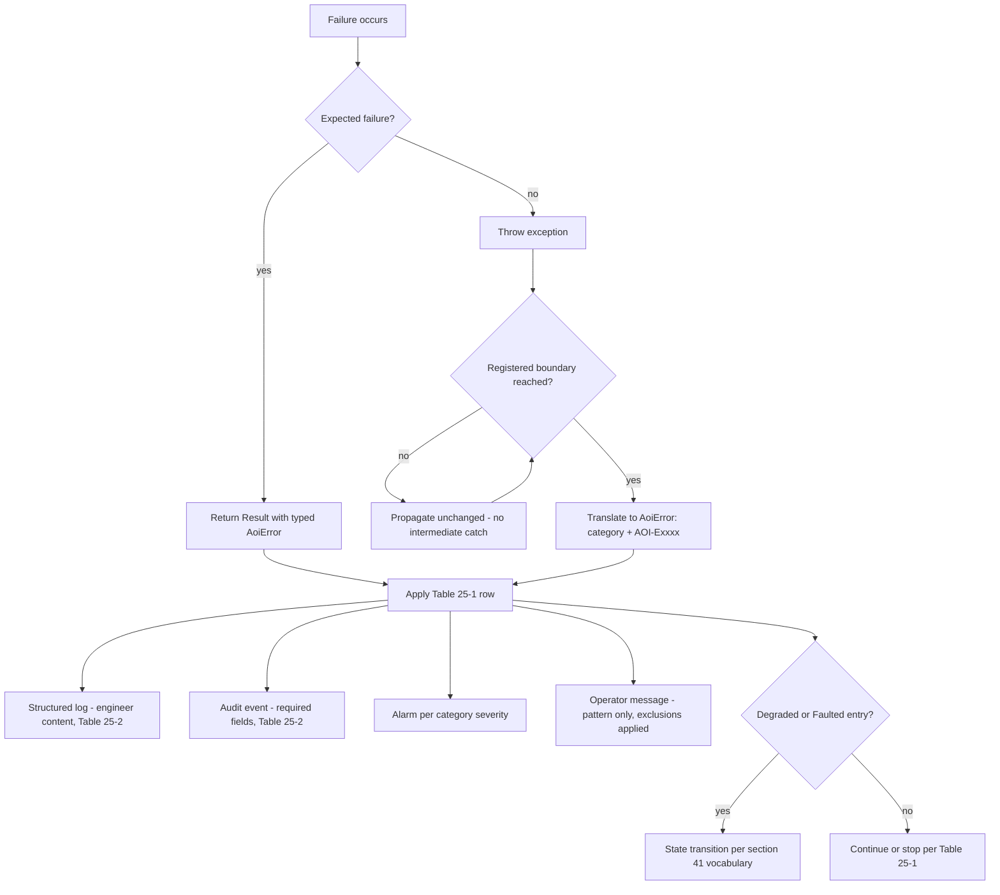

# VOL06 — Coding, Documentation, Errors, and Concurrency — AOI Software Architecture, Secure Development, and Change-Control Standard, v1.0 (2026-07-15)

Scope: this volume defines the binding coding and file-organization standard (§23), the documentation standard (§24), the typed error and exception architecture (§25), and the concurrency, scheduling, and resource-ownership rules (§26) for all AOI Monitor code — the WPF application (`AOI_Monitor/`), test projects, `AOI_Monitor.Tools`, `Templates/*` adapter projects, PowerShell scripts in `Scripts/`, and Python training code in `Scripts/ml/`.

Supersedes/Related existing docs: no existing document is retired outright. This volume **governs and extends** the rule sets implemented in `Scripts/check-code-quality.ps1` (CQ-CATCH-001, CQ-ASYNC-001, CQ-UI-001/002, CQ-MSG-001, CQ-SEC-001) and `Scripts/check-pr-quality.ps1` (PR-* rules); those scripts become implementations of the fitness functions named here. `DESIGN.md` remains the UI/design authority; its "no heavy work in page constructors" and "no stack traces to operators" rules are subsumed by COD-028 and COD-053 without contradiction. `Docs/Developer_CI.md` and `Docs/Contributor_Quality_Checklist.md` remain process guides and are related, not superseded. Requirement-ID reconciliation with the pre-existing `HMI-*/PERF-*/REL-*` namespaces follows the rule stated in §5 (VOL01); this volume's IDs use only the `COD-` and `DOC-` categories.

---

## 23. Coding and File-Organization Standard

### 23.1 What this section governs and why

This section sets measurable limits on code size and complexity, defines how source files are organized, and catalogs prohibited constructs. It exists because the dominant defect amplifier in this codebase is concentration: the repository holds 66,305 LOC of application code with `AOI_Monitor/Data/AoiDatabase.Infrastructure.cs` at 4,409 lines, `AOI_Monitor/MainWindow.xaml.cs` at 1,744 lines, `AOI_Monitor/Views/MonitorView.xaml.cs` at 1,441 lines, and `AOI_Monitor/Models/AoiModels.cs` at 1,385 lines, while 14,652 LOC of view code-behind faces only 581 LOC of ViewModels. Every limit below implements decision D-15; the architecture rules that these limits serve (layering, dependency direction, module boundaries) live in §12–§16 (VOL03). Error-handling constructs are governed by §25 and concurrency constructs by §26; §23 owns everything about the *shape* of code.

Boundary with neighboring sections: §48–53 (VOL17) owns PR process and review mechanics; §23 owns the numeric PR size limits because they are code-shape limits. §39 (VOL14) owns test content; §23's rules apply equally to test code except where a requirement states otherwise.

### 23.2 Definitions and measurement

- **Logical line**: a statement or member declaration as counted by fitness function FF-COD-01; blank lines, comment-only lines, brace-only lines, `using` directives, and attribute-only lines are excluded. `ASSUMPTION A-VOL06-1`: this definition matches what Roslyn syntax-tree statement counting produces; risk is low (a different counter shifts thresholds by <10%), and the counter implementation is pinned with the gate.
- **Cognitive complexity**: computed per the published Sonar cognitive-complexity specification. `ASSUMPTION A-VOL06-2`: an off-the-shelf Roslyn analyzer (SonarAnalyzer.CSharp or Roslynator) reports this metric faithfully; tool selection is Open Decision OD-VOL06-1.
- **Changed logical lines (PR)**: added plus modified logical lines across the PR diff, excluding generated files (per COD-014), lock files, and `.xaml` resource-only edits.
- **Legacy ratchet**: FF-COD-01 runs against a checked-in baseline file (`Tools/quality-gates/cod_size_baseline.json`) listing current violators and their measured values. Any new violation, and any growth of a baselined value, fails CI. The baseline may only shrink; shrinkage is reviewed quarterly by the Software Architect. This is how the SHALL-level limits below coexist with the existing oversized files without a mass rewrite.

### 23.3 Current nonconformity register (facts, 2026-07-15)

| Artifact | Measured | Limit violated |
|---|---|---|
| `Data/AoiDatabase.Infrastructure.cs` | 4,409 lines | COD-002 (file hard 400) |
| `MainWindow.xaml.cs` | 1,744 lines | COD-002 |
| `Views/MonitorView.xaml.cs` | 1,441 lines | COD-002 |
| `Models/AoiModels.cs` | 1,385 lines | COD-002, COD-010 |
| `Views/AIModelTestView.xaml.cs` | 1,196 lines | COD-002 |
| `public static partial class AoiDatabase` (10 partials) | one static type, 60-table schema | COD-003 (type hard 350) |
| 97 of 114 service files contain `static class` | global mutable state pattern | COD-025 (governed, not banned retroactively) |
| Page routing via string keys in 4 parallel switch/dictionaries | `MainWindow.xaml.cs:326-345`, `MainViewModel.cs:60-74` | COD-033 |
| `RoleAuthorization.CanAccessPage` default arm `_ => true` | `Services/RoleAuthorization.cs:41` | COD-037 (and default-deny per §28/VOL07) |
| `CreatePage` fallback `_ => new HomeView()` | `MainWindow.xaml.cs` | COD-037 |

All rows are governed by the legacy ratchet (§23.2) plus the migration obligations stated in the relevant requirement's prose. None of these rows is an accepted permanent exception.

### 23.4 Fitness functions referenced in this volume

Full machine-enforcement planning is owned by §52 (VOL17). This volume names and defines the checks its `Verify:` fields cite:

| FF | Checks | Implementation seat |
|---|---|---|
| FF-COD-01 | logical-line, type, method, cyclomatic ≤10, cognitive ≤15, nesting ≤3, parameter-count limits; ratchet baseline | Roslyn analyzers + `Scripts/check-code-quality.ps1` extension |
| FF-COD-02 | one public top-level type per file; banned dumping-ground names | Roslyn analyzer/script |
| FF-COD-03 | PR changed-logical-line limits; generated/lock-file exclusion | `Scripts/check-pr-quality.ps1` extension |
| FF-COD-04 | generated-file marker present; hand-edit detection (diff inside generated regions) | script gate |
| FF-COD-05 | banned constructs: `Reflection.Emit`, `DynamicMethod`, `CSharpScript`, `Activator` on external types, Python `eval`/`exec`, runtime package install commands | analyzer + grep gate |
| FF-COD-06 | magic-number/magic-string detection in domain, state-machine, and protocol code | analyzer + reviewed allowlist |
| FF-COD-07 | nullable diagnostics as errors in all configurations; unaudited `!` operator | build property + analyzer |
| FF-COD-08 | empty catch (extends CQ-CATCH-001), broad catch outside boundary registry, `throw` for expected-flow control | analyzer + script |
| FF-COD-09 | `.Wait()`/`.Result`/`GetAwaiter().GetResult()`, non-handler `async void` (extends CQ-ASYNC-001), `Thread.Sleep` in UI paths (CQ-UI-001), lock-across-await, `new Thread` | analyzer + script |
| FF-COD-10 | blocking API without `CancellationToken` overload; `Timeout.Infinite`/`-1` timeouts; awaits without timeout class | analyzer + grep gate |
| FF-COD-11 | UI mutation off dispatcher (debug-build runtime assert + UI test sweep) | `UiDispatcher` assert + `AOI_Monitor.UiTests` |
| FF-DOC-01 | `GenerateDocumentationFile=true` + CS1591 as error for public members | MSBuild + `Directory.Build.props` |
| FF-DOC-02 | doc-comment coverage for non-public methods incl. tests | custom Roslyn analyzer (A-VOL06-5) |
| FF-DOC-03 | Python docstring presence/format (pydocstyle "D" rules) | ruff in training-env CI |
| FF-DOC-04 | normative-doc version header + dead-link check (extends existing hygiene gate) | `Scripts/check-repo-hygiene.ps1` extension |
| FF-DOC-05 | error-code registry ↔ code ↔ documentation parity | script gate over `Tools/quality-gates/error_code_registry.json` |

### R: Size and complexity limits (D-15)

**[COD-001]** (P3 | ALL | All)
Source files SHOULD NOT exceed 250 logical lines, types 200 logical lines, and methods 20 logical lines.
- Why: soft limits force decomposition pressure before hard caps; oversized artifacts correlate with change-coupling defects (§23.3 register). Maps: CWE-1080; 25010; Internal.
- Verify: FF-COD-01 warning tier; exceedance justification recorded in PR description. Evidence: CI gate log + PR text. Owner: Software Lead. Auto: Fully automated.
- Exception: Allowed — approver: Software Lead. Review: Annual.

**[COD-002]** (P2 | ALL | All)
A source file SHALL NOT exceed 400 logical lines.
- Why: files past this size become change-coupling magnets (worst case in repo: 4,409 lines, `AoiDatabase.Infrastructure.cs`). Maps: CWE-1080; 25010.
- Verify: FF-COD-01 fail tier with legacy ratchet baseline (§23.2). Evidence: CI gate log + `cod_size_baseline.json` history. Owner: Software Lead. Auto: Fully automated.
- Exception: Allowed — approver: Software Architect. Review: Quarterly.

**[COD-003]** (P2 | ALL | All)
A type, summed across all of its partial declarations, SHALL NOT exceed 350 logical lines.
- Why: the repo's partial-split campaign reduces file size but not type cohesion; `AoiDatabase` remains one static type with one lock domain across 10 partials. Maps: CWE-1080; 25010.
- Verify: FF-COD-01 (per-type aggregation across partials). Evidence: CI gate log. Owner: Software Lead. Auto: Fully automated.
- Exception: Allowed — approver: Software Architect. Review: Quarterly.

**[COD-004]** (P2 | ALL | All)
A method or local function SHALL NOT exceed 50 logical lines.
- Why: long methods defeat review and unit isolation; the ~524-case unit suite cannot target sub-behaviors of monolithic methods. Maps: CWE-1080; SSDF-PW.5.
- Verify: FF-COD-01. Evidence: CI gate log. Owner: Software Lead. Auto: Fully automated.
- Exception: Allowed — approver: Software Architect. Review: Quarterly.

**[COD-005]** (P2 | ALL | All)
A method SHALL NOT exceed cyclomatic complexity 10.
- Why: bounds branch count per unit, keeping test-case count per method tractable and mutation testing (D-13) meaningful. Maps: CWE-1121; 25010.
- Verify: FF-COD-01 (Roslyn cyclomatic metric). Evidence: CI gate log. Owner: Software Lead. Auto: Fully automated.
- Exception: Allowed — approver: Software Architect. Review: Quarterly.

**[COD-006]** (P2 | ALL | All)
A method SHALL NOT exceed cognitive complexity 15.
- Why: cognitive complexity penalizes nesting and flow breaks that cyclomatic misses; both metrics together bound reviewability. Maps: CWE-1120; 25010.
- Verify: FF-COD-01 (analyzer per A-VOL06-2/OD-VOL06-1). Evidence: CI gate log. Owner: Software Lead. Auto: Fully automated.
- Exception: Allowed — approver: Software Architect. Review: Quarterly.

**[COD-007]** (P2 | ALL | All)
Statement nesting depth within a method SHALL NOT exceed 3.
- Why: deep nesting hides error paths and early-exit conditions; guard clauses and extracted methods are the required shape. Maps: CWE-1124; Internal.
- Verify: FF-COD-01. Evidence: CI gate log. Owner: Software Lead. Auto: Fully automated.
- Exception: Allowed — approver: Software Lead. Review: Annual.

**[COD-008]** (P2 | ALL | All)
A method SHALL NOT declare more than 5 parameters; a sixth concern requires introducing a named, typed parameter object.
- Why: long parameter lists produce transposition bugs the compiler cannot catch (adjacent same-typed arguments). Maps: CWE-1068; Internal.
- Verify: FF-COD-01 parameter-count rule. Evidence: CI gate log. Owner: Software Lead. Auto: Fully automated.
- Exception: Allowed — approver: Software Lead. Review: Annual.

**[COD-009]** (P3 | ALL | All)
A constructor SHOULD NOT accept more than 5 dependencies.
- Why: more than 5 injected collaborators signals a type owning multiple concerns; the fix is decomposition, not a parameter object. Maps: 25010; Internal.
- Verify: FF-COD-01 warning tier; exceedance justification in PR. Evidence: CI gate log + PR text. Owner: Software Architect. Auto: Fully automated.
- Exception: Allowed — approver: Software Architect. Review: Annual.

**[COD-010]** (P3 | ALL | All)
A source file SHALL contain at most one public top-level type, with partial classes counting as one type whose per-file limits still apply to each partial file.
- Why: one-type-per-file makes file names navigable and diffs reviewable; `Models/AoiModels.cs` (1,385 lines of stacked POCOs) is the standing counterexample. Maps: Internal; 25010.
- Verify: FF-COD-02. Evidence: CI gate log. Owner: Software Lead. Auto: Fully automated.
- Exception: Allowed — approver: Software Lead. Review: Annual.

**[COD-011]** (P3 | ALL | CI)
A pull request SHOULD NOT exceed 400 changed logical lines.
- Why: review defect-detection rates collapse on large diffs; 400 lines keeps a single-sitting review honest. Maps: SSDF-PW.7; Internal.
- Verify: FF-COD-03 warning tier. Evidence: PR gate log. Owner: Software Lead. Auto: Fully automated.
- Exception: Allowed — approver: Software Lead. Review: Annual.

**[COD-012]** (P2 | ALL | CI)
A pull request exceeding 800 changed logical lines SHALL either be split or undergo the hard-review procedure of §49 (VOL17), which for a solo developer means the documented self-review plus cooling-period control of §7 (VOL01).
- Why: past 800 lines a normal review is theater; forcing a split or an explicit heavyweight review keeps the change-control contract truthful. Maps: SSDF-PW.7; 62443-4-1.
- Verify: FF-COD-03 fail tier unless hard-review record attached. Evidence: PR gate log + review record. Owner: Software Lead. Auto: Partially automated.
- Exception: Allowed — approver: Software Architect. Review: Per release.

**[COD-013]** (P2 | ALL | CI)
A pull request SHALL be scoped to exactly one deployable architectural concern — one §14 module/component or one named cross-cutting rule change — excluding any mixing of behavioral change with mechanical refactoring.
- Why: mixed-concern PRs defeat bisection, rollback, and the claim-language gates; the repo's own history shows refactor-only PRs are practical. Maps: SSDF-PW.7; Internal.
- Verify: review checklist item in `.github/pull_request_template.md`; FF-COD-03 heuristic (paths spanning >1 module group flagged). Evidence: PR record. Owner: Software Architect. Auto: Partially automated.
- Exception: Allowed — approver: Software Architect. Review: Per release.

### R: Generated files

**[COD-014]** (P2 | ALL | Build, CI)
A file SHALL be excluded from COD-001 through COD-010 only when it carries a machine-readable generated-file marker (`<auto-generated/>` header or `generated_code = true` scope in `.editorconfig`).
- Why: unmarked "generated" claims are unverifiable; the marker is what FF-COD-01 keys its exclusion on. Maps: Internal; SSDF-PW.5.
- Verify: FF-COD-04. Evidence: CI gate log. Owner: Software Lead. Auto: Fully automated.
- Exception: Not allowed. Review: Annual.

**[COD-015]** (P2 | ALL | Build, CI)
Generated files SHALL NOT be hand-edited; changes are made by re-running the generator, whose identity and version are pinned in the repository.
- Why: hand-edits to generated output are silently destroyed on regeneration, producing phantom regressions. Maps: Internal; SLSA.
- Verify: FF-COD-04 (diff inside generated regions without generator-version change fails). Evidence: CI gate log. Owner: Software Lead. Auto: Fully automated.
- Exception: Not allowed. Review: Annual.

**[COD-016]** (P2 | ALL | Build, CI)
Generated code SHALL remain in scope for compiler analyzers and for the security review checklist of §49 (VOL17); the COD-014 exclusion covers size and complexity limits only.
- Why: a generator is an amplifier — one flaw replicates everywhere; excluding generated code from security scrutiny is how injectable templates ship. Maps: SSDF-PW.5; 62443-4-1; CWE-94.
- Verify: analyzer configuration review + FF-COD-05 runs over generated output. Evidence: CI gate log + review checklist. Owner: Security Lead. Auto: Partially automated.
- Exception: Not allowed. Review: Annual.

### R: File and feature organization

**[COD-017]** (P3 | ALL | All)
New source files SHALL be placed in the feature/subsystem directory that matches their owning §14 (VOL03) module, not in layer-generic catch-all folders.
- Why: the current `Services/` flat directory (114 files) hides module boundaries; cohesive directories make dependency rules (§15) mechanically checkable. Maps: 42010; 25010.
- Verify: review checklist + NetArchTest namespace-to-directory rule (D-14). Evidence: architecture test run. Owner: Software Architect. Auto: Partially automated.
- Exception: Allowed — approver: Software Architect. Review: Annual.

**[COD-018]** (P3 | ALL | All)
New types and namespaces SHALL NOT use the dumping-ground names `Manager`, `Helper`, `Utils`, `Util`, `Common`, or `Misc` (existing types such as `Services/HashUtil.cs` are renamed when substantively modified).
- Why: dumping-ground names attract unrelated logic and defeat the cohesion limits above; a type that cannot be named by its responsibility has none. Maps: Internal; 25010.
- Verify: FF-COD-02 name rule. Evidence: CI gate log. Owner: Software Lead. Auto: Fully automated.
- Exception: Allowed — approver: Software Lead. Review: Annual.

**[COD-019]** (P2 | ALL | Domain)
Business logic SHALL NOT be duplicated by copy-paste variants; any duplicated block of 20 or more logical lines implementing a domain rule is a defect to be consolidated in the same PR that touches it.
- Why: divergent copies of one rule (thresholds, disposition logic, defect mapping) produce inconsistent verdicts between screens — a direct quality-evidence integrity risk. Maps: CWE-1041; 25010.
- Verify: duplicate-detection in FF-COD-01 (token-based, threshold 20 logical lines) + review checklist. Evidence: CI gate log. Owner: Software Lead. Auto: Partially automated.
- Exception: Allowed — approver: Software Architect. Review: Quarterly.

**[COD-020]** (P1 | ALL | IAM, Domain)
Authorization and input-validation decisions SHALL each be implemented in exactly one authority (`RoleAuthorization` for role checks; the §29/VOL08 validators for input), and re-implementations or inline copies of those decisions are prohibited.
- Why: 332 `MessageBox.Show` sites and `EnsurePermission` calls scattered through code-behind show how parallel enforcement drifts; duplicated authz is how default-allow holes (repo gap: `RoleAuthorization.cs:41`) survive. Maps: CWE-284; ASVS-V8; 62443-4-2 CR 2.1.
- Verify: FF-COD-05 rule (role-comparison expressions outside `RoleAuthorization` fail) + review checklist. Evidence: CI gate log. Owner: Security Lead. Auto: Partially automated.
- Exception: Not allowed. Review: Per release.

### R: Prohibited constructs

**[COD-021]** (P2 | ALL | All)
Domain and state-machine behavior SHALL NOT be dispatched through reflection or made to depend on static-constructor execution order.
- Why: the repo already carries a fragile instance — `WorkflowState`'s private constructor must run before any audited DB write to install `AoiDatabase.AuditOperatorProvider` (`Services/WorkflowState.cs:36-41`); such ordering dependencies break silently, and reflection dispatch hides domain flow from the explicit call graph. Maps: CWE-696; Internal.
- Verify: FF-COD-05 flags reflection-based dispatch of domain logic and static-constructor side effects that gate later behavior; review checklist for the `WorkflowState` ctor-ordering instance. Evidence: CI gate log + review record. Owner: Software Architect. Auto: Partially automated.
- Exception: Allowed — approver: Software Architect. Review: Annual.

**[COD-022]** (P1 | ALL | All)
Runtime replacement or interception of existing members (detour/patching libraries in .NET, monkey patching in Python outside test fixtures) SHALL NOT be used in product or training code.
- Why: patched members invalidate every review and test result obtained on the unpatched code and are a classic malware persistence shape. Maps: CWE-1123; SSDF-PW.5.
- Verify: FF-COD-05 (package and API blocklist) + dependency review. Evidence: CI gate log. Owner: Security Lead. Auto: Fully automated.
- Exception: Not allowed. Review: Annual.

**[COD-023]** (P1 | ALL | All)
Runtime code generation (`Reflection.Emit`, `DynamicMethod`, runtime Roslyn compilation, expression-tree compilation of externally influenced expressions) SHALL NOT be introduced without a recorded Security Lead review naming the input sources and their trust level.
- Why: runtime codegen converts data-plane inputs into executable code paths; unreviewed, it is an arbitrary-code-execution primitive inside a station that holds DPAPI secrets. Maps: CWE-94; SSDF-PW.5; 62443-4-1.
- Verify: FF-COD-05 API blocklist; exception path requires linked review record. Evidence: CI gate log + review record. Owner: Security Lead. Auto: Partially automated.
- Exception: Allowed — approver: Security Lead. Review: Per release.

**[COD-024]** (P0 | ALL | All)
The product SHALL NOT evaluate or execute code supplied as string or serialized data at runtime, including `CSharpScript` evaluation, `XamlReader` parsing of non-repository XAML, and Python `eval`/`exec`/pickle-deserialization execution paths.
- Why: string-eval is the highest-severity injection primitive (arbitrary code execution); D-03 already bans pickle-bearing model artifacts for the same reason. Maps: CWE-95; CWE-502; ASVS-V15.
- Verify: FF-COD-05 blocklist (repo currently has zero hits — keep it that way). Evidence: CI gate log. Owner: Security Lead. Auto: Fully automated.
- Exception: Not allowed. Review: Annual.

**[COD-025]** (P2 | ALL | All)
New publicly mutable static state SHALL NOT be introduced unless it is registered in the module README (DOC-010) with a named owner, documented thread-safety model, and a test reset seam.
- Why: the existing 97 static service classes are tolerable only because each exposes a storage-root/reset seam (`AoiDatabase.ConfigureStorageRoot`, `FirstRunSettingsService.ResetForTests`); unmanaged additions erode that discipline and block per-scope composition forever. Maps: CWE-1108; Internal.
- Verify: FF-COD-02 (new `static` mutable fields flagged) + README cross-check. Evidence: CI gate log + module README. Owner: Software Architect. Auto: Partially automated.
- Exception: Allowed — approver: Software Architect. Review: Quarterly.

**[COD-026]** (P2 | ALL | HMI, Domain)
`WorkflowState.Instance` SHALL be frozen to session/UI concerns (current user, auth mode, navigation context, event history), and domain or inspection state SHALL NOT be added to it or to any other mutable singleton.
- Why: `WorkflowState` is already referenced by 24 of 29 view code-behind files; letting inspection results or recipe state accrete there creates an untestable god-object and blocks the D-01 worker-process split. Maps: Internal; 25010.
- Verify: review checklist + NetArchTest rule (Domain types must not reference `WorkflowState`). Evidence: architecture test run. Owner: Software Architect. Auto: Partially automated.
- Exception: Allowed — approver: Software Architect. Review: Quarterly.

**[COD-027]** (P2 | ALL | All)
Property getters SHALL NOT perform I/O, mutate state, raise events, or otherwise produce side effects.
- Why: side-effectful getters execute at unpredictable times (data binding, debugger evaluation, LINQ) and turn reads into hidden writes. Maps: CWE-696; Internal.
- Verify: review checklist + analyzer heuristic in FF-COD-01 (I/O API calls inside getters). Evidence: review record. Owner: Software Lead. Auto: Partially automated.
- Exception: Allowed — approver: Software Lead. Review: Annual.

**[COD-028]** (P2 | ALL | All)
Constructors and composition-root registration code SHALL NOT perform filesystem, network, database, or device I/O, nor any work exceeding 10 ms on the calling thread.
- Why: I/O in construction makes object creation fail non-locally and serializes startup; `DESIGN.md` already forbids heavy work in page constructors, and `MainWindow.OnLoaded`'s synchronous DB init shows the cost of skirting it. `ASSUMPTION A-VOL06-6`: 10 ms is the construction budget; risk is low and it is tunable via exception. Maps: CWE-1176; Internal.
- Verify: review checklist + FF-COD-01 heuristic (I/O APIs in ctors); startup profile in nav-perf artifact. Evidence: review record + `TestResults` nav-perf JSON. Owner: Software Lead. Auto: Partially automated.
- Exception: Allowed — approver: Software Architect. Review: Annual.

**[COD-029]** (P2 | ALL | Acquisition, CameraAdapter, LightingAdapter)
Static initializers and static constructors SHALL NOT initialize hardware, open device handles, or start vendor SDK sessions.
- Why: static-init hardware access runs at unpredictable first-touch time, cannot be cancelled or retried, and turns a missing camera into a type-load exception. Maps: CWE-1188; Internal.
- Verify: FF-COD-05 (device/SDK API calls inside `static` ctors) + adapter review per `Docs/Vendor_Adapter_Implementation_Guide.md`. Evidence: CI gate log. Owner: Software Lead. Auto: Partially automated.
- Exception: Not allowed. Review: Annual.

**[COD-030]** (P0 | ALL | Update, ModelMgmt, Build)
The application SHALL NOT install packages, download executables, or fetch model artifacts at runtime or startup; all executable content and models arrive only through the signed install/update mechanism of §43 (VOL15) and the model-manifest path of D-03.
- Why: runtime acquisition bypasses signing, SBOM, and review — the exact supply-chain hole D-08/D-12 close; air-gapped Stage 3/4 cells make it an availability defect too. Maps: CWE-494; SLSA; SSDF-PS.1.
- Verify: FF-COD-05 (package-manager/download API blocklist) + egress review in §13 network zones. Evidence: CI gate log. Owner: Security Lead. Auto: Fully automated.
- Exception: Not allowed. Review: Annual.

### R: Explicit semantics

**[COD-031]** (P3 | ALL | All)
Public and internal methods SHALL NOT take positional `bool` parameters whose meaning is not evident at the call site; a two-value named enum or a named parameter object is required instead.
- Why: `Analyze(path, true, false)` is unreviewable; enums make call sites self-documenting and extensible. Maps: Internal; 25010.
- Verify: FF-COD-01 rule (positional bool literal arguments flagged). Evidence: CI gate log. Owner: Software Lead. Auto: Fully automated.
- Exception: Allowed — approver: Software Lead. Review: Annual.

**[COD-032]** (P3 | ALL | All)
Numeric literals other than -1, 0, 1, and 2 SHALL NOT appear inline in domain, threshold, or protocol logic; they are declared as named constants or configuration values with units in the name or type.
- Why: unexplained numbers (tolerances, retry counts, sizes) cannot be audited against specs; the acceptance-criteria defaults in `Models/AoiModels.cs:460-473` show the correct named pattern. Maps: CWE-547; Internal.
- Verify: FF-COD-06 with reviewed allowlist. Evidence: CI gate log. Owner: Software Lead. Auto: Fully automated.
- Exception: Allowed — approver: Software Lead. Review: Annual.

**[COD-033]** (P2 | ALL | HMI, Domain, Taxonomy)
Inline string literals SHALL NOT encode machine states, roles, defect classes, physical units, page keys, or protocol commands; each such vocabulary is a single enum or const registry consumed by every user.
- Why: the shell currently keeps 4 parallel string-keyed switches for page routing (`PageTitles`, `CreatePage`, `LocalizedPageTitle`, `MainViewModel.RefreshLanguage`) where one missed edit is a silent defect; defect classes are governed by D-17 stable IDs. Maps: CWE-547; Internal.
- Verify: FF-COD-06 (string-switch on known vocabularies flagged); page-key registry refactor tracked in baseline. Evidence: CI gate log. Owner: Software Lead. Auto: Partially automated.
- Exception: Allowed — approver: Software Architect. Review: Quarterly.

**[COD-034]** (P2 | ALL | Domain, Recipe, ModelMgmt)
Identifiers (recipe, model, lot, image, station) and physical quantities (durations, lengths, pixel counts) SHALL be represented by dedicated types (`readonly record struct` IDs; `TimeSpan`; unit-named quantity types), not bare `string`/`int`/`double`, in all new and substantively modified domain contracts.
- Why: `string modelId` and `string recipeId` are mutually assignable — the compiler catches nothing; typed IDs and units eliminate transposition and unit-confusion defects (mm vs px in calibration paths). Maps: CWE-1287; Internal.
- Verify: review checklist + FF-COD-06 heuristic on domain method signatures. Evidence: review record. Owner: Software Architect. Auto: Partially automated.
- Exception: Allowed — approver: Software Architect. Review: Quarterly.

**[COD-035]** (P2 | ALL | All)
Nullable reference diagnostics (CS8600/8602/8603/8604/8618/8625/8765) SHALL be compiler errors in Debug as well as Release builds.
- Why: the repo enables `Nullable=enable` everywhere but promotes the diagnostics to errors only in Release (`Directory.Build.props:12`), so local Debug work accumulates null bugs CI catches late. Maps: CWE-476; Internal.
- Verify: FF-COD-07 nullable-as-error configuration check. Evidence: build log + CI gate log. Owner: Software Lead. Auto: Fully automated.
- Exception: Allowed — approver: Software Lead. Review: Annual.

**[COD-066]** (P2 | ALL | All)
Every null-forgiving `!` operator SHALL carry a same-line justification comment naming the invariant that guarantees non-null.
- Why: companion to COD-035 — an unaudited `!` silently re-opens the null-safety hole the nullable diagnostics close, asserting non-null without recorded evidence. Maps: CWE-476; Internal.
- Verify: FF-COD-07 unaudited `!`-operator check. Evidence: build log + CI gate log. Owner: Software Lead. Auto: Fully automated.
- Exception: Allowed — approver: Software Lead. Review: Annual.

**[COD-036]** (P2 | ALL | Domain)
Data-transfer, model, and message types SHALL be immutable by default, declared as C# `record` types or classes with `init`-only setters, using `required` members for mandatory fields.
- Why: immutable models make results safe to share across threads (§26) and prevent post-persist mutation of quality evidence; `required` members make invalid construction a compile error. Maps: CWE-374; Internal.
- Verify: review checklist + analyzer rule (settable public properties on `Models/` types flagged). Evidence: review record. Owner: Software Lead. Auto: Partially automated.
- Exception: Allowed — approver: Software Lead. Review: Annual.

**[COD-037]** (P0 | ALL | Orchestrator, Domain, SafetyStatus)
Switches over domain enums and state-machine states in critical paths (inspection state §17, model lifecycle §19, safety-status handling, authorization) SHALL handle every member explicitly, and the default arm SHALL throw an `InternalInvariant` (AOI-E24xx) error rather than silently selecting a fallback.
- Why: silent defaults are how the repo's two worst latent defects exist — `RoleAuthorization.CanAccessPage` default-allow (`_ => true`, `RoleAuthorization.cs:41`) and `CreatePage`'s `_ => new HomeView()` typo-swallowing; in safety-status handling a silent default is a hazard, not a bug. Maps: CWE-478; CWE-1069; 62443-4-2 CR 3.7.
- Verify: FF-COD-06 exhaustiveness rule + targeted unit tests per state machine (suite `StateMachineExhaustivenessTests`, to be added). Evidence: CI gate log + test results. Owner: Software Architect. Auto: Fully automated.
- Exception: Not allowed. Review: Per release.

**[COD-038]** (P3 | ALL | Domain, Inference)
Domain and inspection-decision logic SHALL obtain current time only through an injected clock abstraction (UTC per D-16) and randomness only through an injected, seed-recordable generator.
- Why: direct `DateTime.Now`/`Random` calls make verdicts irreproducible, which breaks evidence replay and flaky-test triage; D-16 already mandates UTC persistence and `Stopwatch` durations. Maps: Internal; AI-RMF.
- Verify: FF-COD-05 (direct `DateTime.Now`/`new Random()` in Domain/Inference paths flagged). Evidence: CI gate log. Owner: Software Lead. Auto: Fully automated.
- Exception: Allowed — approver: Software Lead. Review: Annual.

### R: Resource ownership and C# idioms

**[COD-039]** (P2 | ALL | All)
Every disposable resource SHALL have exactly one owner, named in the creating code (variable scope, containing type, or ownership-transfer comment at the handoff site).
- Why: ambiguous ownership is the root of both leaks and double-dispose; §26 (Table 26-1) depends on ownership being decidable per object. Maps: CWE-772; Internal.
- Verify: review checklist + CA2000 (already error in Release). Evidence: build log + review record. Owner: Software Lead. Auto: Partially automated.
- Exception: Allowed — approver: Software Lead. Review: Annual.

**[COD-040]** (P1 | ALL | Acquisition, Inference, Persistence)
Camera frames, GPU buffers and `InferenceSession` objects, file handles, database connections, serial ports, sockets, and `CancellationTokenSource` instances SHALL be disposed deterministically via `using`/`await using` (implementing `IAsyncDisposable` where release requires awaiting), never left to finalization.
- Why: at Stage 2+ frame rates, finalizer-dependent release exhausts native buffers within minutes; today `OnnxInspectionEngine.Analyze` creating a new `InferenceSession` per call (`OnnxInspectionEngine.cs:59`) makes session lifetime a live correctness issue. Maps: CWE-772; CWE-404.
- Verify: CA2000/CA2012/CA2016 as errors (existing) + FF-COD-09 disposal sweep for the listed types. Evidence: build log + CI gate log. Owner: Software Lead. Auto: Fully automated.
- Exception: Not allowed. Review: Annual.

**[COD-041]** (P3 | ALL | All)
Code under `AOI_Monitor/Services/` and `AOI_Monitor/Data/` that does not touch UI state SHALL use `ConfigureAwait(false)` on every await, enforced by scoping CA2007 to error severity for those directories.
- Why: context-free continuations prevent UI-thread re-entry deadlocks with COD-056 and keep services usable from the future worker process (D-01); `.editorconfig:61-67` currently downgrades CA2007 to suggestion everywhere. Maps: Internal; 25010.
- Verify: FF-COD-09 via scoped CA2007. Evidence: build log. Owner: Software Lead. Auto: Fully automated.
- Exception: Allowed — approver: Software Lead. Review: Annual.

---

## 24. Documentation Standard

### 24.1 What this section governs and why

This section makes documentation a build artifact with a gate, not a courtesy. It covers doc comments on every function, type-level and module-level documentation, ADRs, operational documents, and the dictionaries the product's evidence claims depend on. The repository already has 46 top-level docs (6,272 lines) with strong claim discipline but no version headers, plus measurable drift (`Docs/Architecture_Overview.md:37` says "~40 tables" against 60 actual; `Docs/Database_Schema.md:8` says baseline 28 against `LatestVersion` 30). §24 fixes the mechanics; content ownership stays with the owning volumes (defect-taxonomy content with §31/VOL09; HMI text rules with `DESIGN.md`).

### 24.2 The function-documentation mandate

Every non-generated function or method — public, internal, private, and test — carries a documentation comment stating its purpose: `/// 
` in C#, a PEP 257 docstring in Python. A one-line summary is sufficient for trivial functions, but it must add information beyond the identifier; `/// 
Gets the recipe.
` on `GetRecipe` fails review. The **extended-contract class** — functions that are public module API, cross a process/hardware/network boundary, are security-sensitive (authn/authz, crypto, plugin load, path handling), touch hardware, create or synchronize concurrency, or exceed cyclomatic complexity 5 — documents every applicable field of Table 24-1.

Table 24-1 — extended contract fields (document each field that applies; state "none" where the honest answer is none):

| # | Field | # | Field |
|---|---|---|---|
| 1 | Inputs (meaning, valid ranges) | 9 | Cancellation behavior |
| 2 | Output (meaning, ownership) | 10 | Authorization assumptions |
| 3 | Units (px, mm, ms, UTC) | 11 | Expected errors (taxonomy categories/codes) |
| 4 | Preconditions | 12 | Retry behavior |
| 5 | Postconditions | 13 | Idempotency |
| 6 | Side effects | 14 | Safety implications (D-18 observer role) |
| 7 | External resources touched | 15 | Data sensitivity (§8 classes) |
| 8 | Thread safety | | |

### R: Function and type documentation

**[DOC-001]** (P1 | ALL | All)
Every non-generated C# method — including private methods and test methods — SHALL carry a `/// 
` documentation comment stating its purpose.
- Why: undocumented intent is unreviewable intent; in a 66 kLOC codebase maintained by a very small team, doc comments are the only durable record of why a method exists. Maps: SSDF-PW.7; 25010; Internal.
- Verify: FF-DOC-01 (public) + FF-DOC-02 (non-public, incl. tests). Evidence: CI gate log. Owner: Software Lead. Auto: Fully automated.
- Exception: Allowed — approver: Software Lead. Review: Annual.

**[DOC-002]** (P1 | ALL | All)
Functions in the extended-contract class defined in §24.2 SHALL document every applicable Table 24-1 field.
- Why: boundary, security, hardware, and concurrent functions are exactly where "purpose only" comments hide the failure modes (units, cancellation, idempotency, authorization) that cause field incidents. Maps: 62443-4-1; SSDF-PW.7; ASVS-V15.
- Verify: FF-DOC-02 structural check (field tags present) + review checklist for content quality. Evidence: CI gate log + review record. Owner: Software Lead. Auto: Partially automated.
- Exception: Allowed — approver: Software Architect. Review: Per release.

**[DOC-003]** (P2 | ALL | All)
A documentation comment SHALL convey information beyond a restatement of the identifier name, and a name-restating comment is a review-failing defect.
- Why: restating comments are worse than none — they consume review attention and create false confidence of coverage. Maps: Internal; 25010.
- Verify: review checklist + FF-DOC-02 heuristic (normalized summary equals normalized identifier fails). Evidence: review record. Owner: Software Lead. Auto: Partially automated.
- Exception: Not allowed. Review: Annual.

**[DOC-004]** (P2 | ALL | All)
An in-code comment or `///` doc comment made inaccurate by a code change SHALL be corrected in the same change; stale documentation is a defect, not a backlog item.
- Why: a wrong comment actively misleads the next maintainer; same-change repair is the only policy that keeps the FF-DOC gates meaningful. Maps: Internal; SSDF-PW.7.
- Verify: review checklist item in PR template. Evidence: PR record. Owner: Software Lead. Auto: Manual review.
- Exception: Not allowed. Review: Annual.

**[DOC-005]** (P1 | ALL | CI, Build)
The build SHALL set `GenerateDocumentationFile=true` with CS1591 promoted to error in all configurations for all product projects.
- Why: CS1591 is the compiler-native gate for public-member documentation; without it DOC-001 is unenforceable for the public surface. Maps: SSDF-PW.7; Internal.
- Verify: FF-DOC-01 (`Directory.Build.props` inspection + build). Evidence: build log. Owner: Software Lead. Auto: Fully automated.
- Exception: Allowed — approver: Software Lead. Review: Annual.

**[DOC-006]** (P1 | ALL | CI)
CI SHALL run a documentation-coverage gate (FF-DOC-02) that fails when any non-generated, non-public method lacks a doc comment, using a ratchet baseline for the existing backlog.
- Why: CS1591 covers only public members; the mandate covers private and test methods, which no compiler switch checks. `ASSUMPTION A-VOL06-5`: FF-DOC-02 ships as a custom Roslyn analyzer, with an interim PowerShell heuristic acceptable for at most two release cycles; risk is heuristic false negatives, contained by the ratchet. Maps: Internal; SSDF-PW.7.
- Verify: FF-DOC-02 in `Scripts/run-quality-gates.ps1`. Evidence: CI gate log + baseline history. Owner: Software Lead. Auto: Fully automated.
- Exception: Allowed — approver: Software Lead. Review: Quarterly.

**[DOC-007]** (P2 | ALL | All)
Every public type and interface SHALL carry a doc comment stating its responsibility and its owning §14 (VOL03) module.
- Why: type-level docs are the entry point for navigation and the anchor for the module catalogue; interfaces (`IInspectionEngine`, `IVisionCameraAdapter`, `IMesClient`) are contracts whose semantics cannot live in code alone. Maps: 42010; 25010.
- Verify: FF-DOC-01 (types included in CS1591 scope). Evidence: build log. Owner: Software Lead. Auto: Fully automated.
- Exception: Allowed — approver: Software Lead. Review: Annual.

**[DOC-008]** (P3 | ALL | All)
Every test method's doc comment SHALL state the scenario under test and the expected outcome.
- Why: 524 test cases are quality evidence only if a reader can tell what each proves; scenario/outcome summaries also expose assertion-free tests in review. Maps: Internal; SSDF-PW.8.
- Verify: FF-DOC-02 over test projects. Evidence: CI gate log. Owner: QA Lead. Auto: Fully automated.
- Exception: Allowed — approver: QA Lead. Review: Annual.

**[DOC-009]** (P2 | ALL | Training)
Every Python module and function in `Scripts/ml/` SHALL carry a PEP 257 docstring, enforced by pydocstyle ("D") rules in the training-environment checks.
- Why: the training pipeline (`train_patchcore.py`, `evaluate_onnx.py`) produces artifacts that ship to stations; its code is in scope for the same documentation mandate as C#. Maps: SSDF-AI; Internal.
- Verify: FF-DOC-03 (ruff D rules). Evidence: training-env CI log. Owner: ML Lead. Auto: Fully automated.
- Exception: Allowed — approver: ML Lead. Review: Annual.

**[DOC-010]** (P2 | ALL | All)
Each §14 (VOL03) subsystem SHALL have a module README covering: purpose, public contracts, allowed dependencies, owned threads/queues (Table 26-1 rows), registered static state (COD-025), and error categories emitted (Table 25-1).
- Why: module READMEs are where the ownership registries of §23/§26 live; without them the standard's per-module obligations have no home. Maps: 42010; 62443-4-1.
- Verify: FF-DOC-04 presence check + review checklist for content. Evidence: repo tree + review record. Owner: Software Architect. Auto: Partially automated.
- Exception: Allowed — approver: Software Architect. Review: Per release.

**[DOC-011]** (P1 | ALL | All)
Every architecturally significant decision (new dependency, boundary change, technology choice, D-xx revisit) SHALL be recorded as a numbered, immutable ADR using the §57 (VOL18) template, superseded only by a new ADR rather than edited in place once accepted.
- Why: the D-01..D-18 register exists because undocumented decisions get re-litigated; immutable ADRs preserve the reasoning that reviews and audits depend on. Maps: 42010; SSDF-PO.
- Verify: review checklist (PRs meeting the significance trigger must link an ADR); FF-DOC-04 numbering check. Evidence: `Docs/standard/adr/` history. Owner: Software Architect. Auto: Partially automated.
- Exception: Allowed — approver: Software Architect. Review: Per release.

**[DOC-012]** (P3 | ALL | All)
Every public service contract and integration interface SHALL be accompanied by at least one compiling usage example (doc-comment `<example>` or example test).
- Why: `Docs/Architecture_Extension_Guide.md` already shows examples are how vendor engineers onboard; an example that compiles is the only example that stays true. Maps: Internal; 25010.
- Verify: example tests compiled in `AOI_Monitor.Tests` (suite `ContractExampleTests`). Evidence: test results. Owner: Software Lead. Auto: Fully automated.
- Exception: Allowed — approver: Software Lead. Review: Annual.

**[DOC-013]** (P2 | S2+ | MES, OPCUA, RobotAdapter)
Every external protocol integration (MES REST, OPC UA, robot/lighting serial) SHALL be documented with concrete request/response or command/ack example pairs with secrets redacted per the `SecretProtectionService` redaction rules.
- Why: protocol behavior disputes with vendors and customers are settled by examples, not prose; redaction keeps examples shippable in support bundles. Maps: OPCUA-P2; CFX; Internal.
- Verify: review checklist at integration change; FF-DOC-04 presence check per integration doc. Evidence: `Docs/` protocol pages. Owner: Software Lead. Auto: Manual review.
- Exception: Allowed — approver: Software Architect. Review: On change.

**[DOC-014]** (P1 | ALL | Logging, HMI)
Every registered AOI-Exxxx error code SHALL be documented with its operator message (English and Korean), engineer diagnostic meaning, and prescribed operator/engineer action, generated from the registry so code and documentation cannot diverge.
- Why: error codes exist so operators can report and engineers can act without shared context; an undocumented code is a dead end at 3 a.m. on a production line. Maps: ASVS-V16; 62443-4-1; Internal.
- Verify: FF-DOC-05 parity gate (registry ↔ docs ↔ resource strings). Evidence: CI gate log. Owner: Software Lead. Auto: Fully automated.
- Exception: Not allowed. Review: Per release.

**[DOC-015]** (P2 | S2+ | All)
Runbooks SHALL exist for installation, startup/shutdown, update and rollback, backup/restore, retention administration, and each §41 (VOL13) degraded mode, each with numbered steps and expected observable outcomes.
- Why: `Docs/Deployment_Package_Guide.md` and `Docs/Installation_Guide.md` are the seeds; degraded-mode operations currently have no operator-executable procedure at all. Maps: 62443-4-1; 800-82; Internal.
- Verify: FF-DOC-04 presence check; runbook walk-through at FAT per `Docs/Factory_Acceptance_Test_Plan.md`. Evidence: runbook docs + FAT record. Owner: Field Service. Auto: Manual review.
- Exception: Allowed — approver: Product Owner. Review: Per release.

**[DOC-016]** (P3 | S2+ | All)
A troubleshooting guide SHALL exist, keyed by error code and by observable symptom, with an escalation path per entry.
- Why: symptom-keyed lookup is how operators actually search; code-keyed lookup is how support triages — both indexes over one content set. Maps: Internal; 25010.
- Verify: FF-DOC-05 (every Critical/Alarm-tier code has a troubleshooting entry). Evidence: CI gate log. Owner: Field Service. Auto: Partially automated.
- Exception: Allowed — approver: Product Owner. Review: Per release.

**[DOC-017]** (P2 | ALL | Persistence)
A data dictionary SHALL document every SQLite table (60 as of 2026-07-15) and every settings JSON file: column/field meaning, units, retention class, and §8 (VOL02) sensitivity class.
- Why: `Docs/Database_Schema.md` covers fewer than half the actual tables; undocumented evidence tables cannot support customer traceability claims. Maps: Internal; 25010; GDPR.
- Verify: FF-DOC-05 table-count parity (dictionary rows vs `CREATE TABLE` extraction). Evidence: CI gate log. Owner: Software Lead. Auto: Fully automated.
- Exception: Allowed — approver: Software Architect. Review: Per release.

**[DOC-018]** (P2 | ALL | Taxonomy)
Each released defect-taxonomy version (content owned by §31/VOL09, IDs per D-17) SHALL be published as a versioned dictionary document listing every stable ID, its definition, severity, and per-model-version class mapping.
- Why: the taxonomy is a customer-facing labeling contract; the source defect table already contains internal inconsistencies (mandatory defects absent from its own classification rows) that only a versioned dictionary can control. Maps: IPC-610; Internal.
- Verify: FF-DOC-05 (dictionary version matches `DefectTaxonomies` DB content). Evidence: CI gate log + export. Owner: ML Lead. Auto: Fully automated.
- Exception: Allowed — approver: Product Owner. Review: On change.

**[DOC-019]** (P2 | S2+ | HMI)
Operator-facing documentation (user manual, error messages, troubleshooting entries) SHALL be available in English and Korean with a parity check before any Korean customer deployment.
- Why: Korean-first deployment is a product fact; the repo already enforces EN/KO parity for UI resources (`LocalizationParityTests`), and docs must meet the same bar. Maps: Internal; PIPA.
- Verify: extension of `LocalizationParityTests` to doc resources; FF-DOC-04. Evidence: test results. Owner: Product Owner. Auto: Partially automated.
- Exception: Allowed — approver: Product Owner. Review: Per release.

**[DOC-020]** (P2 | ALL | All)
Every normative document SHALL carry a header with version, date, owning role, and a change log.
- Why: the docs inventory found that no normative repo doc (DESIGN.md, baseline, checklist) carries version/date/owner, making "supersedes" semantics informal and disputes unresolvable. Maps: 42010; Internal.
- Verify: FF-DOC-04 header check. Evidence: CI gate log. Owner: Software Architect. Auto: Fully automated.
- Exception: Allowed — approver: Software Architect. Review: Annual.

**[DOC-021]** (P2 | ALL | All)
A standalone `Docs/` document describing changed behavior SHALL be updated in the same PR as the behavior change.
- Why: measured drift already exists ("~40 tables" vs 60; schema baseline 28 vs 30) in a project whose brand is truthful evidence; same-PR repair is the only drift control that scales to a small team. Maps: SSDF-PW.7; Internal.
- Verify: review checklist item + FF-DOC-04 dead-link/claim gates. Evidence: PR record. Owner: Software Lead. Auto: Manual review.
- Exception: Not allowed. Review: Annual.

**[DOC-022]** (P3 | ALL | All)
`<inheritdoc/>` SHALL be used only where the inherited contract applies unchanged, with any override that narrows, widens, or otherwise alters behavior restating its contract explicitly instead.
- Why: inherited docs on behavior-changing overrides are stale-by-construction documentation. Maps: Internal; 25010.
- Verify: review checklist; FF-DOC-02 flags `<inheritdoc/>` on overrides with added throws/side effects. Evidence: review record. Owner: Software Lead. Auto: Partially automated.
- Exception: Allowed — approver: Software Lead. Review: Annual.

**[DOC-023]** (P2 | ALL | All)
All documentation SHALL obey the claim-language discipline: the certification-boundary wording of `Docs/Standards_Traceability_Matrix.md` (standards-aligned, never "certified") and the forbidden-overclaim phrase list enforced by `Scripts/check-repo-hygiene.ps1`.
- Why: overclaiming simulation or standards status is the project's named reputational risk, and machine-enforced claim gates already exist — this requirement binds new standard documents to them. Maps: Internal; SBD.
- Verify: existing hygiene forbidden-phrase gate + PR-CLAIM rules, extended over `Docs/standard/`. Evidence: CI gate log. Owner: Product Owner. Auto: Fully automated.
- Exception: Not allowed. Review: Annual.

**[DOC-024]** (P3 | ALL | All)
Every architecture diagram SHALL be committed with editable source (Mermaid preferred) and an adjacent "Reading this diagram:" prose paragraph.
- Why: binary-only diagrams rot and exclude diff review; the prose paragraph keeps documents usable without rendering, per this standard's own style contract. Maps: 42010; Internal.
- Verify: FF-DOC-04 (diagram blocks followed by reading paragraph). Evidence: CI gate log. Owner: Software Architect. Auto: Fully automated.
- Exception: Allowed — approver: Software Architect. Review: Annual.

**[DOC-025]** (P2 | ALL | All)
Every public static service class SHALL document in its type doc comment, or link to the COD-025 registry entry for, its thread-safety model, owned state, and test reset seam.
- Why: 97 static service classes are the de facto composition model; their concurrency contracts are currently folklore, which §26 (single-writer, ownership) cannot be enforced against. Retrofit deadline is Open Decision OD-VOL06-4. Maps: Internal; CWE-820.
- Verify: FF-DOC-02 rule for `static class` types with mutable state. Evidence: CI gate log. Owner: Software Lead. Auto: Fully automated.
- Exception: Allowed — approver: Software Architect. Review: Quarterly.

---

## 25. Error and Exception Architecture

### 25.1 What this section governs and why

This section defines the single typed error taxonomy for the product, the stable error-code scheme, per-category runtime behavior, and the coding rules for exceptions and retries. It exists because failure behavior on a production line is a contract: the operator needs an actionable message, the engineer needs a diagnosable record, the line needs a decision (continue, degrade, fault), and the audit trail needs required fields — every time, for every category. The repo already implements pieces correctly: three global handlers in `App.xaml.cs:31-33` route through `CrashReportService` with a factory-safe dialog and no stack traces to operators (the `DESIGN.md` rule, machine-checked by CQ-MSG-001); `OnnxInspectionEngine` refuses unavailable models with a synthetic REVIEW verdict instead of throwing; `UiErrorBoundaryService.RunAsync` converts page-refresh failures into operator-safe error cards. This section generalizes those patterns and closes the gaps: silent-fallback readers that hide corruption (`ParseDateTime` → `DateTime.MinValue`, `DeserializeOrDefault`, `AoiDatabase.Infrastructure.cs:2032-2069`), the misleading `DeleteMesSpoolItem` alias (`Integration.cs:401-402`), and the MES outbox's nested retry multiplication.

Boundary with neighbors: §38 (VOL13) owns log formats, event IDs, and audit mechanics; §25 owns which severities, fields, and behaviors each error category must produce. §41 (VOL13) owns degraded-mode semantics; §25 owns which categories enter them. §36 (VOL12) owns operator-message presentation; §25 owns content limits.

### 25.2 The typed error contract

All cross-boundary failures are expressed as a typed error value (`AoiError`) carrying: category (Table 25-1 enum, 25 members), stable code (`AOI-Exxxx`), operator message key (localized per DOC-019), engineer detail, source module, correlation ID, and UTC timestamp. Expected failures travel as `Result<T, AoiError>`-shaped returns; exceptions are reserved for unexpected faults and are translated to `AoiError` at registered boundaries. The `Result` type implementation choice is Open Decision OD-VOL06-3.

**Error-code format**: `AOI-E` + 4 decimal digits; digits 1–2 are the category block (01–25 per Table 25-1), digits 3–4 the specific error. Codes are registered in `Tools/quality-gates/error_code_registry.json`, are unique, and are never reused or renumbered after release.

**Reading this diagram:** every failure takes one of two paths. Expected failures (validation misses, offline MES, a busy database) never become exceptions — the function returns a `Result` carrying a typed `AoiError`. Unexpected failures throw, and the exception crosses no more than the layers between its origin and the nearest registered boundary (COD-046 lists them), where it is translated into the same `AoiError` shape. From that point both paths converge on one decision table: Table 25-1 fixes the log severity, alarm, retry eligibility, whether inspection may continue, and whether the system enters Degraded or Faulted; Table 25-2 fixes what the operator sees, what the engineer gets in logs and support bundles, which audit fields are mandatory, and what is excluded from operator-facing output. No component improvises its own failure behavior.

### 25.3 Category behavior table

Table 25-1 — runtime behavior per category (binding via COD-044). "Continue" = may inspection of subsequent boards continue. Alarm tiers use the existing vocabulary Info/Warning/Alarm/Critical. Degraded/Faulted semantics per §41 (VOL13).

| # | Category | Codes | Log severity | Alarm | Retry | Continue | Degraded/Faulted |
|---|---|---|---|---|---|---|---|
| 01 | Validation | E01xx | Warning | None | Manual after correction | Yes | No |
| 02 | Authorization | E02xx | Warning | None | No | Yes | No |
| 03 | Authentication | E03xx | Warning | Warning at ≥5 failures/10 min | Manual | Yes (view-only per D-11) | No |
| 04 | Configuration | E04xx | Error | Alarm | No (fail-closed per D-10) | No | Faulted until valid config |
| 05 | Camera | E05xx | Error | Alarm | Auto, 3 attempts | No (no frame, no verdict) | Degraded if redundant view, else Faulted |
| 06 | Lighting | E06xx | Error | Alarm | Auto, 3 attempts | Recipe-conditional | Degraded |
| 07 | Sensor3D | E07xx | Error | Alarm | Auto, 3 attempts | Conditional (2D-only mode) | Degraded |
| 08 | Gpu | E08xx | Error | Alarm | No | Conditional (validated CPU fallback) | Degraded |
| 09 | Inference | E09xx | Error | Alarm | Auto, 1 attempt same image | No — image verdict = REVIEW | Degraded at ≥3 consecutive |
| 10 | ModelIntegrity | E10xx | Critical | Critical | No | No | Faulted (inference blocked) |
| 11 | RecipeIntegrity | E11xx | Critical | Critical | No | No | Faulted (recipe blocked) |
| 12 | Robot | E12xx | Error | Alarm | No (manual recovery) | No | Faulted (cell stop observed) |
| 13 | Interlock | E13xx | Critical | Critical | No | No | Faulted until safety chain reset (D-18) |
| 14 | SafetyStatus | E14xx | Critical | Critical | No | No | Fail-safe: block starts on observation loss (D-18) |
| 15 | Mes | E15xx | Warning | Warning | Auto per outbox policy | Yes (store-and-forward, D-04) | Degraded (buffering) |
| 16 | OpcUa | E16xx | Warning | Warning | Auto per session policy | Yes | Degraded |
| 17 | Network | E17xx | Warning | Warning | Auto per dependency policy | Yes (local-first) | Degraded |
| 18 | Database | E18xx | Critical | Critical | Auto, 3 attempts, busy/locked only | No (results must persist) | Faulted |
| 19 | Storage | E19xx | Error | Alarm | Auto, 1 attempt | Conditional (space above hard floor) | Degraded, Faulted at hard floor |
| 20 | Export | E20xx | Warning | Warning | Manual | Yes | No |
| 21 | Licensing | E21xx | Error | Alarm | No | Per §45 grace policy | Degraded during grace |
| 22 | Update | E22xx | Error | Warning | Manual | Yes (current version keeps running) | No (rollback per D-08) |
| 23 | Dependency | E23xx | Error | Alarm | Auto per dependency policy | Conditional | Degraded |
| 24 | InternalInvariant | E24xx | Critical | Critical | No | No | Faulted (restart required) |
| 25 | ResourceExhaustion | E25xx | Critical | Critical | No | No | Degraded (shed load), Faulted on floor breach |

Table 25-2 — content per category (binding via COD-044). "Engineer diagnostics" defines both the structured-log fields and the support-bundle content (bundles inherit `CrashReportService`/`SupportBundleService` redaction). "Base audit fields" — always required: TimestampUtc, UserId, UserRole, StationId, ActionCategory, error code, category, correlation ID (extends existing `AuditEvents` columns, `AoiDatabase.Audit.cs:36-45`). Column 5 lists content excluded from operator-facing output in addition to the global COD-053 exclusions.

| # | Category | Operator message pattern | Engineer diagnostics (log/support bundle) | Extra audit fields | Operator-excluded |
|---|---|---|---|---|---|
| 01 | Validation | "[code] {field}: value out of range {min}–{max}" | rule ID, offending value | entity type/ID | full payload dumps |
| 02 | Authorization | "[code] Action requires {role}" | capability key, acting role, page key | capability key, acting role | role-store internals |
| 03 | Authentication | "[code] Sign-in failed" (uniform) | user ID, auth mode, failure reason code | user ID, auth mode | reason detail, hash params |
| 04 | Configuration | "[code] {item} invalid — see engineer" | file, schema path, validation error | config file, schema version | secret values, full paths |
| 05 | Camera | "[code] Camera {name} not responding" | adapter ID/version, transport status, frame counters | camera ID, adapter version | SDK paths |
| 06 | Lighting | "[code] Lighting {channel} fault" | controller ID, command, response bytes | controller ID | raw protocol bytes |
| 07 | Sensor3D | "[code] 3D sensor {name} fault" | sensor status, calibration profile ID | sensor ID, profile ID | vendor internals |
| 08 | Gpu | "[code] Acceleration off — CPU mode" | EP name, driver/CUDA versions, fallback decision | EP name, fallback flag | driver paths |
| 09 | Inference | "[code] Image sent to review" | model ID, tensor shapes, latency, exception type | model ID, image ID | model file paths |
| 10 | ModelIntegrity | "[code] Model blocked — call engineer" | expected vs actual SHA-256, manifest status | model ID, both hashes | file paths |
| 11 | RecipeIntegrity | "[code] Recipe blocked — call engineer" | recipe revision, hash mismatch detail | recipe ID/revision, hashes | file paths |
| 12 | Robot | "[code] Robot stopped — manual recovery" | command ID, ack state, cell-state snapshot | command ID, cell state | controller internals |
| 13 | Interlock | "[code] Interlock active — {guard}" | interlock input ID, chain state | interlock ID, state | wiring detail |
| 14 | SafetyStatus | "[code] Safety status unavailable — starts blocked" | channel ID, last-good timestamp, loss duration | channel ID, loss duration | none extra |
| 15 | Mes | "[code] Results buffered — will resend" | endpoint, HTTP status, redacted body | spool item ID, attempt count | credentials, tokens, URLs |
| 16 | OpcUa | "[code] Factory link degraded" | endpoint, security policy, status code | node IDs | endpoint URLs |
| 17 | Network | "[code] Connection lost — local mode" | host class, DNS/latency detail | endpoint class | IPs/hostnames |
| 18 | Database | "[code] Storage error — call maintenance" | SQLite result code, statement class (no data values) | schema version, result code | SQL text, DB path |
| 19 | Storage | "[code] Disk space low — {free} remaining" | volume, free bytes, threshold | volume ID, free bytes | full paths |
| 20 | Export | "[code] Export failed — retry available" | writer error, target format | export ID, format | customer data content |
| 21 | Licensing | "[code] License issue — contact admin" | license ID, expiry, feature flag | license ID | license keys |
| 22 | Update | "[code] Update failed — current version running" | package version, signature status, hash | package version | signing internals |
| 23 | Dependency | "[code] Component {name} unavailable" | dependency name/version, probe result | dependency name | internal endpoints |
| 24 | InternalInvariant | "[code] Internal error logged — image sent to review" | full exception + stack in crash report | crash report ID | stack traces |
| 25 | ResourceExhaustion | "[code] System busy — inspection paused" | memory/handle/queue metrics | resource type, level | process internals |

### R: Taxonomy and exception rules

**[COD-042]** (P1 | ALL | All)
Every failure crossing a module, process, or UI boundary SHALL be expressed as a typed `AoiError` whose category is one of the 25 Table 25-1 members.
- Why: a single typed contract is what makes failure behavior decidable by table instead of by each caller's guess; today failures surface variously as bools, nulls, magic strings, and dialogs. Maps: ASVS-V16; CWE-756; 62443-4-1.
- Verify: NetArchTest rule (boundary methods return `Result`/`AoiError` shapes) + review checklist; suite `ErrorTaxonomyContractTests` (to be added). Evidence: architecture test run. Owner: Software Architect. Auto: Partially automated.
- Exception: Allowed — approver: Software Architect. Review: Per release.

**[COD-043]** (P1 | ALL | All)
Every `AoiError` SHALL carry a stable code in the format `AOI-E` + 4 digits whose two-digit block matches its category per Table 25-1, registered in `Tools/quality-gates/error_code_registry.json` and never reused after release.
- Why: stable codes are the joint key for operator reports, troubleshooting docs (DOC-014/016), and support triage; reuse or renumbering silently corrupts historical evidence. Maps: ASVS-V16; Internal.
- Verify: FF-DOC-05 registry parity gate. Evidence: CI gate log. Owner: Software Lead. Auto: Fully automated.
- Exception: Not allowed. Review: Per release.

**[COD-044]** (P1 | ALL | All)
The per-category behavior defined in Table 25-1 and content defined in Table 25-2 (severity, alarm, retry eligibility, continuation, degraded/faulted entry, audit fields, bundle content, exclusions) SHALL be implemented as stated for every emitted error.
- Why: the tables are the normative core of §25 — without a binding requirement they are advice; divergent per-module behavior is precisely the current state being corrected. Maps: ASVS-V16; 62443-4-2 CR 6.2; Internal.
- Verify: suite `ErrorCategoryBehaviorTests` asserting one representative code per category against the table rows. Evidence: test results. Owner: QA Lead. Auto: Fully automated.
- Exception: Allowed — approver: Software Architect. Review: On change.

**[COD-045]** (P1 | ALL | All)
Every `catch` block SHALL rethrow, translate to a typed `AoiError`, or complete a documented recovery that logs a stable event ID; empty and log-and-continue-silently catches are prohibited.
- Why: swallowed exceptions convert faults into silent data corruption; the CQ-CATCH-001 gate already fails empty catches — this extends it to catches that neither recover nor surface. Maps: CWE-390; CWE-392; ASVS-V16.
- Verify: FF-COD-08 (extends CQ-CATCH-001). Evidence: CI gate log. Owner: Software Lead. Auto: Fully automated.
- Exception: Not allowed. Review: Annual.

**[COD-046]** (P1 | ALL | All)
Catching `System.Exception` or `SystemException` SHALL occur only at the registered boundary list — the three `App.xaml.cs` global handlers, `UiErrorBoundaryService` page boundaries, worker-loop top frames, CLI command top level, and migration/retention maintenance wrappers — and every such catch SHALL translate into the Table 25-1 taxonomy.
- Why: broad catches below boundaries mask invariant violations and turn InternalInvariant faults into wrong verdicts; a registered list makes "is this catch legal?" mechanically checkable. Maps: CWE-396; ASVS-V16; MS-SDL.
- Verify: FF-COD-08 boundary registry check (file/method allowlist in repo). Evidence: CI gate log. Owner: Software Architect. Auto: Fully automated.
- Exception: Allowed — approver: Software Architect. Review: Per release.

**[COD-047]** (P2 | ALL | Domain)
Exceptions SHALL NOT be used to implement expected control flow; conditions that occur in normal operation (validation failure, record not found, offline dependency) are expressed as `Result` values.
- Why: exception-driven flow hides the happy path, costs orders of magnitude more than a return, and makes boundary catches (COD-046) ambiguous about what is truly unexpected. Maps: CWE-705; Internal.
- Verify: FF-COD-08 heuristic (throw/catch pairs within one module for non-fault conditions) + review checklist. Evidence: review record. Owner: Software Lead. Auto: Partially automated.
- Exception: Allowed — approver: Software Lead. Review: Annual.

**[COD-048]** (P2 | ALL | All)
A method SHALL NOT return success/failure ambiguously: no bool returns carrying partial-success meaning, no sentinel values doubling as data, and no API whose name asserts an effect it does not perform.
- Why: `DeleteMesSpoolItem` aliasing "mark sent" (`AoiDatabase.Integration.cs:401-402`) is the standing example — queue-state reports can misstate operator intent; ambiguous returns are audit defects, not style issues. Maps: CWE-393; Internal.
- Verify: review checklist; rename/retrofit of the known alias tracked in the ratchet baseline. Evidence: review record. Owner: Software Lead. Auto: Manual review.
- Exception: Allowed — approver: Software Lead. Review: Annual.

**[COD-049]** (P2 | ALL | Persistence, Config)
`null` (or a default-constructed object) SHALL NOT encode more than one failure mode; readers of persisted or configured data SHALL distinguish absent, invalid, and corrupt via distinct `AoiError` codes rather than silent fallbacks.
- Why: the silent-fallback readers `ParseDateTime` → `DateTime.MinValue` and `DeserializeOrDefault` → default object (`AoiDatabase.Infrastructure.cs:2032-2069`) currently mask stored-data corruption — a traceability product must surface corruption, not absorb it. Maps: CWE-476; CWE-758; Internal.
- Verify: FF-COD-08 fallback-reader rule + unit tests for corrupt-input paths (suite `CorruptDataSurfacingTests`). Evidence: CI gate log + test results. Owner: Software Lead. Auto: Fully automated.
- Exception: Allowed — approver: Software Architect. Review: Quarterly.

**[COD-050]** (P1 | ALL | MES, REST, Persistence)
Retries SHALL occur only through a named, declared retry policy (attempt count, backoff, eligibility per Table 25-1) attached at one layer, and inline ad-hoc retry loops are prohibited.
- Why: hidden retries multiply — the MES outbox already exhibits nested retry multiplication (retry inside retry), which turns one outage into a duplicate-submission storm; single-layer declared policies make retry behavior auditable. Maps: CWE-799; Internal.
- Verify: FF-COD-08 (loop-with-catch-and-delay heuristic outside policy types) + review checklist. Evidence: CI gate log. Owner: Software Lead. Auto: Partially automated.
- Exception: Allowed — approver: Software Architect. Review: Per release.

**[COD-051]** (P0 | ALL | RobotAdapter, MES, Persistence)
Non-idempotent commands (robot motion, MES result submission, database mutations, export generation with side effects) SHALL NOT be automatically retried unless the operation carries an idempotency key or a documented idempotency design that makes replay safe.
- Why: replaying a robot motion command is a physical hazard; replaying a MES submission double-counts production; retry without idempotency is how "recovery" creates incidents. Maps: CWE-799; 62443-4-2 CR 3.7; Internal.
- Verify: review checklist per integration + suite `IdempotencyContractTests` for MES spool and robot command paths. Evidence: test results + review record. Owner: Software Architect. Auto: Partially automated.
- Exception: Not allowed. Review: Per release.

**[COD-052]** (P1 | ALL | MES, REST)
Every automatic retry policy SHALL bound attempts (≤5), apply exponential backoff with jitter (base ≥1 s, factor ≥2, jitter ≥±20%), and open a per-dependency circuit breaker after policy exhaustion.
- Why: unbounded or synchronized retries produce retry storms that finish off a struggling dependency and saturate the factory network segment; numeric floors make the policy testable. Maps: CWE-400; CWE-799; Internal.
- Verify: suite `RetryPolicyTests` asserting bounds/backoff/jitter/breaker per policy. Evidence: test results. Owner: Software Lead. Auto: Fully automated.
- Exception: Allowed — approver: Software Architect. Review: Per release.

**[COD-053]** (P0 | ALL | HMI, Logging)
Operator-facing surfaces (dialogs, alarm banners, error cards, operator-visible exports) SHALL NOT contain stack traces, SQL text, filesystem paths, credentials or secrets, or internal identifiers beyond the AOI-Exxxx code and Table 25-2 pattern fields.
- Why: internals leak attack-surface detail and confuse operators; the repo already enforces pieces (CQ-MSG-001 gate, `CrashReportService` redaction, DESIGN.md rule) — this makes the exclusion set complete and binding. Maps: CWE-209; CWE-532; ASVS-V16.
- Verify: FF-COD-08 message-content rule (extends CQ-MSG-001) + `SupportBundleService`/`CrashReportService` redaction tests (exist: `AuthenticationAndSecretHandlingTests`, `SupportBundleServiceTests`). Evidence: CI gate log + test results. Owner: Security Lead. Auto: Fully automated.
- Exception: Not allowed. Review: Annual.

---

## 26. Concurrency, Scheduling, and Resource Ownership

### 26.1 What this section governs and why

This section fixes who owns every thread and queue, how work crosses the UI boundary, how cancellation and timeouts bound every blocking operation, and in what order resources die at shutdown. The current model is a classic WPF dispatcher app: heavy work via `Task.Run` inside async handlers (35 sites in Views), 56 `async void` event handlers backstopped by global handlers, cross-thread marshaling standardized in `UiDispatcher.InvokeIfAvailable`, and cancellable navigation with sequence tokens. Those mechanisms are sound; what is missing is a binding ownership registry, bounded queues, systematic timeouts (the data layer configures no SQLite busy timeout; `HttpClient` defaults are uncontrolled), and a defined shutdown order. The known nonconformity: `MainWindow.OnLoaded` runs DB initialization, retention sweep, and alarm expiry synchronously on the dispatcher (`MainWindow.xaml.cs:60-138`) — tolerable on a fast disk, a first-paint freeze on a slow one.

Boundary with neighbors: §40 (VOL13) owns latency budgets and capacity targets; §26 owns thread and queue mechanics. §17–§20 (VOL04) own state-machine semantics; §26 owns their single-writer execution discipline. D-01's worker-process split criteria are restated here only as the trigger that moves the Inference row of Table 26-1 out of process.

### 26.2 Thread and queue ownership registry

Table 26-1 — ownership registry (binding via COD-058). Each row's owning module documents its rows in its module README (DOC-010). "Target" marks rows that exist only after the §14-aligned refactor; until then the owner is the shell.

| Module (§14) | Owned execution resources | Queue bound / overflow | Status |
|---|---|---|---|
| HMI shell | WPF dispatcher thread; navigation CTS + sequence token | dispatcher queue (WPF-owned) | Exists (`MainWindow.xaml.cs:168-261`) |
| Orchestrator | inspection-loop single-writer task | bounded work queue, 16 items, Block w/ timeout | Target |
| Acquisition/CameraAdapter | per-camera grab thread (vendor SDK); frame ring buffer | ring buffer, 8 frames, DropOldest + counter | Target (S2) |
| LightingAdapter | serial I/O worker | command queue, 32, Fail | Target (S2) |
| Inference | inference worker task; model-load queue | queue, 4, Block w/ timeout | Target; separate process on D-01 triggers |
| RobotAdapter | robot session thread; command queue | queue, 1 in-flight, Fail | Target (S3) |
| SafetyStatus | observation poll timer (500 ms) | n/a | Target (S3), observer-only per D-18 |
| MES | outbox pump single-writer over `MesSpoolQueue` | DB-backed spool (bounded by retention) | Partial (spool exists; pump is manual-retry) |
| OPCUA | stack-owned session/keep-alive threads, wrapped | stack defaults, documented | Target (S4) |
| Persistence | none (connection-per-operation; WAL single-writer) | n/a | Exists (`AoiDatabase.Infrastructure.cs:13-24`) |
| Logging | single background writer | bounded channel, 4096, DropOldest + drop counter | Target (D-09) |
| Diagnostics | perf-monitor timers | n/a | Exists (`UiPerformanceMonitorService`) |
| Update | staged-activation worker (idle only) | n/a | Target (D-08) |

### 26.3 Timeout classes

Table 26-2 — operation timeout classes (binding via COD-061). `ASSUMPTION A-VOL06-4`: values are conservative engineering defaults pending hardware characterization; risk is premature timeouts on slow stations, mitigated by per-station config override (D-10) and Open Decision OD-VOL06-2. All timeouts are cooperative (CancellationToken) with the stated ceiling.

| Operation class | Default ceiling | Notes |
|---|---|---|
| UI dispatcher marshal | 2 s | exceeding logs E25xx diagnostic |
| Local DB read | 5 s | plus SQLite `busy_timeout` 5 s (currently unset — must be set) |
| Local DB write/transaction | 10 s | busy/locked retry per Table 25-1 row 18 |
| Settings/report file I/O | 15 s | OneDrive-synced paths are the known hazard |
| Image decode/import | 30 s | decompression-bomb guard already enforced |
| Model load / session create | 60 s | once per activation, never per image (COD-040) |
| Inference per image (CPU) | 10 s hard | p95 budget 1 s owned by §40 |
| Camera trigger→frame | max(2× frame period, 5 s) | S2; vendor-confirmed at HIL |
| Lighting serial command | 2 s | S2 |
| Robot command ack / motion complete | 5 s / 60 s | S3; vendor-confirmed (OD-VOL06-2) |
| Safety-status staleness | 2 s (500 ms poll) | staleness ⇒ fail-safe per Table 25-1 row 14 |
| MES REST call | 30 s total | override `HttpClient` 100 s default explicitly |
| OPC UA operation | 10 s | S4 |
| Central sync batch | 120 s | store-and-forward, D-04 |
| Export/report generation | 300 s | operator-cancellable |
| Shutdown drain | 5 s per stage, 20 s total | Figure §26.4 |

### 26.4 Shutdown order

```mermaid
flowchart LR
    S1[1. Block new work:<br/>intake + navigation refused] --> S2[2. Cancel root CTS:<br/>cooperative stop signal]
    S2 --> S3[3. Drain bounded queues<br/>max 5 s each]
    S3 --> S4[4. Stop pumps:<br/>MES outbox, OPC UA, central sync<br/>spool state persisted]
    S4 --> S5[5. Dispose hardware adapters:<br/>camera, lighting, 3D, robot session]
    S5 --> S6[6. Stop safety-status observer<br/>last hardware channel down]
    S6 --> S7[7. Final DB writes:<br/>shutdown audit event, state persist]
    S7 --> S8[8. Flush + dispose logging,<br/>release single-instance mutex, exit]
```

**Reading this diagram:** shutdown is a fixed eight-stage sequence in reverse dependency order, with a 5-second bound per stage and 20 seconds overall (Table 26-2). First the system refuses new work and signals cancellation through the root `CancellationTokenSource` hierarchy, so in-flight work stops cooperatively rather than being aborted. Queues drain within their bound; whatever does not drain is persisted (MES spool rows stay in `MesSpoolQueue` — the store-and-forward design means unsent results survive shutdown by construction). Hardware adapters are disposed before the safety-status observer so the observer can still report while actuating hardware winds down; the app only observes safety state (D-18), so stopping the observer last-but-one maximizes observation coverage. The database receives the final shutdown audit event before the logging pipeline — the only component allowed to outlive persistence — flushes and the single-instance mutex (`App.xaml.cs:14-28`) is released. Any stage exceeding its bound is logged as E24xx/E25xx evidence, and the process still exits at the 20-second cap.

### R: UI thread and async discipline

**[COD-054]** (P1 | ALL | HMI, ViewModels)
UI elements and UI-bound state SHALL be mutated only on the WPF dispatcher thread, reached exclusively through the single marshaling helper (`UiDispatcher.InvokeIfAvailable` or its successor).
- Why: cross-thread UI mutation is a nondeterministic crash (InvalidOperationException at best, corrupted visual state at worst); the repo already standardized the helper — this bans bypasses. Maps: CWE-362; Internal.
- Verify: FF-COD-11 (debug-build dispatcher assert + UiTests sweep). Evidence: UI test results. Owner: Software Lead. Auto: Fully automated.
- Exception: Not allowed. Review: Annual.

**[COD-055]** (P1 | ALL | HMI)
No operation SHALL block the UI thread for more than 50 ms; longer work runs off-thread with progress or overlay per `DESIGN.md`.
- Why: dispatcher stalls freeze alarms and operator input — an operational hazard, not a cosmetic one; `MainWindow.OnLoaded`'s synchronous DB init is the tracked nonconformity to be made async. `ASSUMPTION A-VOL06-3`: the 50 ms budget is measured by the existing `UiPerformanceMonitorService` instrumentation; risk is measurement overhead, negligible at this granularity. Maps: Internal; 25010.
- Verify: FF-COD-09 (Thread.Sleep/sync-I/O in UI paths, extends CQ-UI-001/002) + nav-perf smoke PERF-001 gate artifact. Evidence: CI gate log + `TestResults` nav-perf JSON. Owner: Software Lead. Auto: Fully automated.
- Exception: Allowed — approver: Software Architect. Review: Quarterly.

**[COD-056]** (P1 | ALL | All)
Code SHALL NOT synchronously block on asynchronous work via `.Wait()`, `.Result`, or `GetAwaiter().GetResult()` on incomplete tasks.
- Why: sync-over-async deadlocks the dispatcher under context capture and exhausts the thread pool under load; with COD-041 there is always an async path available instead. Maps: CWE-833; Internal.
- Verify: FF-COD-09 blocklist. Evidence: CI gate log. Owner: Software Lead. Auto: Fully automated.
- Exception: Allowed — approver: Software Architect. Review: Annual.

**[COD-057]** (P2 | ALL | HMI)
`async void` SHALL appear only in WPF event-handler signatures whose body delegates to a `Task`-returning method executed through `UiErrorBoundaryService` (or the App global-handler path for shell-level handlers).
- Why: `async void` exceptions bypass normal awaiting and crash or vanish; the repo's 56 occurrences are acceptable only because boundaries backstop them — this makes that pattern mandatory rather than incidental. Maps: CWE-248; Internal.
- Verify: FF-COD-09 (extends CQ-ASYNC-001) + boundary-delegation heuristic. Evidence: CI gate log. Owner: Software Lead. Auto: Fully automated.
- Exception: Allowed — approver: Software Lead. Review: Annual.

### R: Ownership, queues, cancellation, timeouts

**[COD-058]** (P2 | ALL | All)
Threads, timers, and long-running tasks SHALL be created only by the owning modules registered in Table 26-1, and creating execution resources outside a registered row is prohibited.
- Why: unbounded ad-hoc thread/task creation makes load, shutdown order, and leak analysis impossible; the registry is what COD-065 and the §40 capacity model execute against. Maps: CWE-400; Internal.
- Verify: FF-COD-09 (`new Thread`, `Task.Factory.StartNew` long-running, `Timer` creation outside registered types) + README cross-check. Evidence: CI gate log. Owner: Software Architect. Auto: Partially automated.
- Exception: Allowed — approver: Software Architect. Review: Per release.

**[COD-059]** (P2 | ALL | Orchestrator, Logging, MES)
Every in-memory inter-thread queue or channel SHALL be bounded with the capacity and named overflow policy (DropOldest, DropNewest, Block-with-timeout, or Fail) recorded in Table 26-1, and dropped items SHALL increment an observable counter.
- Why: unbounded queues convert a slow consumer into unbounded memory growth and a delayed crash far from the cause; explicit overflow policy makes degradation a design decision instead of an accident. Maps: CWE-400; CWE-1050; Internal.
- Verify: suite `BoundedChannelPolicyTests` per registered queue; FF-COD-09 flags `Channel.CreateUnbounded`/unbounded `BlockingCollection`. Evidence: test results + CI gate log. Owner: Software Lead. Auto: Fully automated.
- Exception: Allowed — approver: Software Architect. Review: Per release.

**[COD-060]** (P1 | ALL | All)
Every potentially blocking public API (I/O, device, network, database, queue take, inference) SHALL accept a `CancellationToken` and SHALL honor it end-to-end, including during retries and backoff waits.
- Why: cooperative cancellation is the boundary contract that makes navigation cancellation, shutdown (Figure §26.4), and operator abort possible; the navigation CTS pattern already proves it works in this codebase. Maps: CWE-400; Internal; 25010.
- Verify: FF-COD-10 (blocking API without CT overload) + suite `CancellationPropagationTests`. Evidence: CI gate log + test results. Owner: Software Lead. Auto: Fully automated.
- Exception: Allowed — approver: Software Architect. Review: Per release.

**[COD-061]** (P1 | ALL | All)
Every blocking operation SHALL be bounded by the timeout ceiling of its Table 26-2 class, and unbounded waits (`Timeout.Infinite`, `-1`, waits without a timeout parameter) are prohibited.
- Why: an indefinite wait on a dead camera, locked DB, or unreachable MES becomes a silent line stoppage with no alarm; the data layer's unset SQLite busy timeout and `HttpClient`'s 100 s default are the live gaps this closes. Maps: CWE-1088; CWE-400; 62443-4-2 CR 7.1.
- Verify: FF-COD-10 (infinite-timeout blocklist; timeout-class annotation check) + `RetryPolicyTests`. Evidence: CI gate log. Owner: Software Lead. Auto: Fully automated.
- Exception: Allowed — approver: Software Architect. Review: On change.

**[COD-062]** (P2 | ALL | All)
A thread-affine synchronization primitive (`lock`/`Monitor`, `Mutex`, `ReaderWriterLockSlim`, `SpinLock`) SHALL NOT be held across an `await` point; async-compatible primitives (`SemaphoreSlim.WaitAsync`) with release in `finally` are the only awaited-region guards.
- Why: holding a thread-affine lock across await releases on a different thread or not at all — an intermittent deadlock/corruption class that testing rarely catches. Maps: CWE-667; CWE-833.
- Verify: FF-COD-09 lock-across-await analyzer rule. Evidence: CI gate log. Owner: Software Lead. Auto: Fully automated.
- Exception: Not allowed. Review: Annual.

**[COD-063]** (P1 | ALL | Orchestrator, ModelMgmt, MES)
Each state machine (inspection §17, recipe §18, model lifecycle §19, device/calibration §20, MES outbox) SHALL have its state mutated by exactly one writer (one thread or one serialized queue consumer), with all other components restricted to immutable snapshots or command submission.
- Why: multi-writer state machines produce torn transitions that no per-field lock fixes; single-writer plus COD-036 immutable snapshots is the only model simple enough to verify in this codebase. Maps: CWE-362; CWE-820; Internal.
- Verify: review checklist per state machine + suite `SingleWriterDisciplineTests` (concurrent-mutation attempts must fail or serialize). Evidence: test results. Owner: Software Architect. Auto: Partially automated.
- Exception: Allowed — approver: Software Architect. Review: Per release.

**[COD-064]** (P1 | ALL | All)
Fire-and-forget execution SHALL occur only through an owned launcher that registers the task with its Table 26-1 owner, links it to the owner's `CancellationToken`, logs start and completion, and observes exceptions into the §25 taxonomy; bare discarded tasks (`_ = Task.Run(...)`) are prohibited.
- Why: an unobserved task is invisible work that outlives its screen, leaks its captures (the static-event leak pattern already exists in the shell), and dies silently; the launcher makes background work enumerable at shutdown. Maps: CWE-248; CWE-772; Internal.
- Verify: FF-COD-09 (discarded-task pattern) + launcher unit tests. Evidence: CI gate log + test results. Owner: Software Lead. Auto: Fully automated.
- Exception: Allowed — approver: Software Architect. Review: Per release.

**[COD-065]** (P2 | ALL | All)
Shutdown SHALL execute the eight-stage sequence of §26.4 in order, with a 5-second bound per stage and a 20-second process-exit cap, logging any stage overrun.
- Why: undefined shutdown order is where camera handles leak, spool state tears, and the final audit event is lost; a fixed order with bounds makes shutdown testable and the soak-test exit criteria meaningful. Maps: CWE-404; Internal; 62443-4-2 CR 7.4.
- Verify: suite `ShutdownSequenceTests` + soak-test shutdown evidence (`SoakTestService` extension). Evidence: test results + soak report. Owner: Software Architect. Auto: Fully automated.
- Exception: Allowed — approver: Software Architect. Review: Per release.

---

## Open Decisions (VOL06 — for merge into §6)

| ID | Decision needed | Default until decided | Linked assumption |
|---|---|---|---|
| OD-VOL06-1 | Analyzer providing cognitive-complexity and duplicate-detection metrics (SonarAnalyzer.CSharp vs Roslynator vs custom) — D-14 tooling family, selection open | FF-COD-01 ships with whichever analyzer lands first; thresholds fixed regardless | A-VOL06-2 |
| OD-VOL06-2 | Confirmation of Table 26-2 hardware timeout defaults (camera, lighting, robot) against real vendor SDKs at Stage-2/3 HIL entry | Table 26-2 values, per-station override via D-10 config | A-VOL06-4 |
| OD-VOL06-3 | `Result<T, AoiError>` implementation: hand-rolled `readonly record struct` vs adopted library (new dependency needs §15/VOL03 approval + ADR) | hand-rolled struct, no new dependency | — |
| OD-VOL06-4 | Retrofit deadline for DOC-025 thread-safety/ownership doc comments across the 97 existing static service classes | two release cycles, ratchet-tracked | — |

Assumptions registered in this volume: A-VOL06-1 (logical-line counter definition, §23.2), A-VOL06-2 (cognitive-complexity analyzer fidelity, §23.2), A-VOL06-3 (50 ms UI budget measured via `UiPerformanceMonitorService`, COD-055), A-VOL06-4 (conservative timeout defaults, §26.3), A-VOL06-5 (FF-DOC-02 interim implementation, DOC-006), A-VOL06-6 (10 ms construction budget, COD-028).
