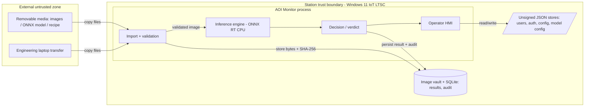
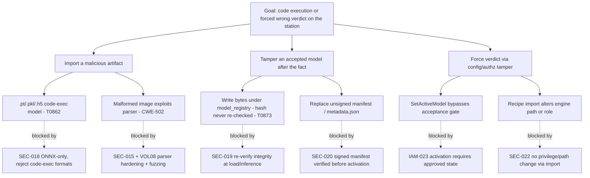
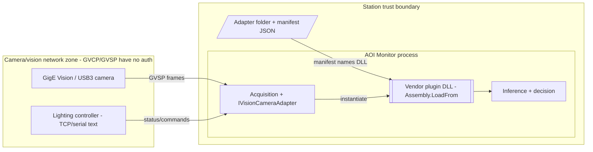
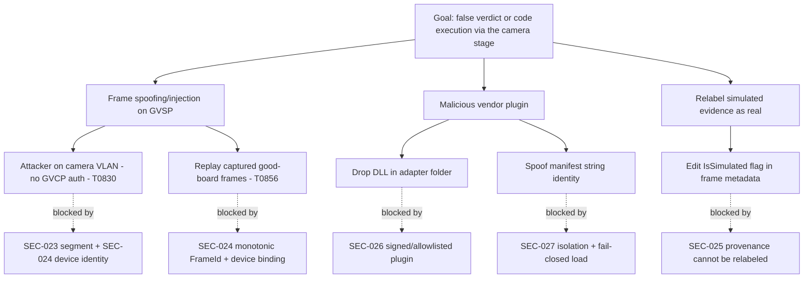
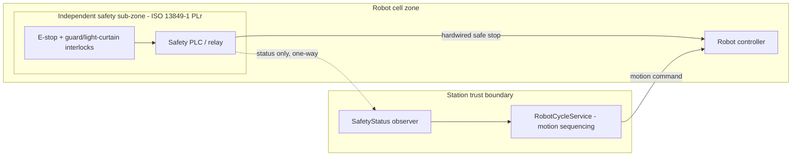
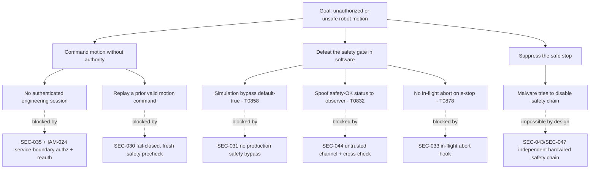
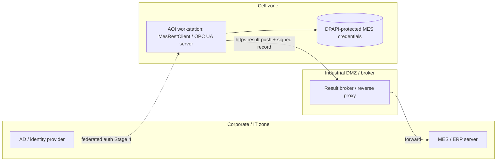
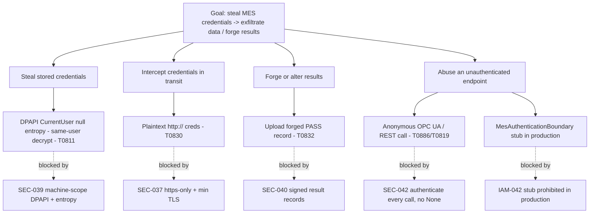

# VOL07 — Security Architecture and Identity — AOI Software Architecture, Secure Development, and Change-Control Standard, v1.0 (2026-07-15)

Scope note: This volume governs the security architecture of AOI Monitor across Stages 1–4 (§27) and the identity, authentication, authorization, and session model (§28). It sets architecture-level obligations and the full permissions matrix; deep input/serialization/crypto controls live in §29–30 / VOL08, AI/ML and training security in §31 / VOL09, and supply-chain/build/field controls in §42–45 / VOL15.

Supersedes/Related existing docs: Supersedes the security and role rules stated as prose in `Docs/Industrial_HMI_and_Software_Quality_Baseline.md` (§ security, l.69–73) and the `SEC-001..003` / role rows of `Docs/Industrial_Quality_Checklist.md` for identity, authorization, and threat-model matters (those documents' IDs are retired for this subject; ID reconciliation rule is owned by §5 / VOL01). Related and not superseded: `DESIGN.md`, `Docs/HMI_Style_Guide.md`, the certification-boundary wording of `Docs/Standards_Traceability_Matrix.md` (l.56–71, reused by reference), `Docs/Requirements_Traceability_Matrix.md` rows `RP-001..006` (roles/permissions) and `AC-*`, and `AGENTS.md`. This volume's `SEC-`/`IAM-` IDs are a new namespace and do not reuse the runtime `SEC-001..003` meanings in `AOI_Monitor/Services/StandardsTraceabilityService.cs`.

This volume is standards-aligned, not certified. All mappings state support for a clause ("supports 62443-4-2 CR 1.1"); no compliance is claimed.

---

## 27. Security Architecture

This section governs how AOI Monitor is designed to resist attack at each rollout stage, and how security interacts with the independent machine-safety chain. It exists because the current codebase implements a **cosmetic** trust boundary: the acting role is client-held state, the app boots as an in-memory Administrator under passwordless Demo authentication, adapter DLLs load unsigned via `Assembly.LoadFrom`, audit rows carry no tamper evidence, and model bytes are hashed once at registration but never re-verified at load (repo facts pack, `context/repo/security.md` §7, `context/repo/ml-pipeline.md` gap 1). The boundary with neighboring sections: §29–30 (VOL08) own file/image/serialization/crypto mechanics; §31 (VOL09) owns AI/ML model security and the training-environment threat model interior; §34–35 (VOL11) own robot/safety and MES/OPC UA protocol design; this section owns the cross-cutting security architecture, the four stage threat models, and the safety-security interaction analysis.

### 27.1 Security architecture principles

Six principles bind the whole product. Each maps to IEC 62443-4-1 secure-development practices, 62443-4-2 component requirements, and NIST SSDF practice IDs from the research pack (`context/research/ot-ics.md`, `context/research/ssdf-sdl.md`).

1. **Default deny.** Every trust boundary — page access, service operation, network endpoint, plugin load — denies unless an explicit rule allows. This directly inverts the repo's `RoleAuthorization.CanAccessPage` default arm `_ => true` (`AOI_Monitor/Services/RoleAuthorization.cs:41`). Supports 62443-4-2 CR 2.1; SSDF PW.9; CISA SbD secure-by-default.
2. **Least privilege.** Every process, Windows service identity, and human role holds only the rights its function needs; the app SHALL NOT require routine local-admin. Supports 62443-4-2 CCSC 3; SSDF PW.9; 800-82r3 endpoint hardening.
3. **Defense in depth.** No single control is load-bearing alone; ingest, authorization, integrity, network segmentation, and audit each form an independent layer. Supports 62443-4-1 SD-2; MS-SDL practice 3.
4. **Fail closed on privileged and motion-affecting paths.** When an authorization, integrity, or safety-observation check cannot complete, the path denies (motion refused, deployment blocked, privileged action rejected). View-only availability is preserved where safe (see D-11). Supports 62443-3-3 SR 7.1 (degraded mode); 25010:2023 safety/fail-safe.
5. **Audit everything privileged.** Every privileged action produces a tamper-evident audit record with identity, role, station, timestamp, and (for overrides/waivers) a reason code. Supports 62443-4-2 CR 2.8–2.12; ASVS-V16; SSDF PS.1.
6. **Trust the server, never the client.** Authorization decisions are made at the service boundary from an authoritative session, never from UI state or from metadata inside an imported artifact. Supports 62443-4-2 CR 1.1/2.1; CWE-862/CWE-863.

These principles are realized as the requirement blocks `SEC-001`..`SEC-011` and the identity requirements in §28.

### 27.2 Stage threat models (S1–S4)

Each stage adds attack surface. The threat models below are scoped to what changes at that stage; every model names its trust boundaries, gives a STRIDE table by element class, lists abuse/misuse cases, and carries one attack tree for that stage's critical path. Attacker techniques are mapped to MITRE ATT&CK for ICS **v19.1** (pinned; `context/research/ot-ics.md` §7). The models are the living artifact required by 62443-4-1 SR-2 and SSDF PW.1 (`SEC-012`).

STRIDE element classes used throughout: **P** = Process, **DS** = Data Store, **DF** = Data Flow, **EE** = External Entity, **TB** = Trust Boundary.

#### 27.2.1 Stage 1 — offline image workflow

**Reading this diagram:** Stage 1 has three nested trust boundaries. The outermost boundary separates the **External untrusted zone** (USB media and engineering-laptop transfers — the only ingress, since Stage 1 is offline) from the **Station**. Inside the station, the **AOI Monitor process** boundary separates in-process code from the on-disk **image vault + SQLite** store and the **unsigned JSON stores** that hold users, authentication settings, operating mode, and model configuration. The dangerous data flows are the two "copy files" arrows crossing the outer boundary (untrusted images, models, recipes) and the "read/write" arrow to the unsigned JSON stores, which today anyone with same-user file access can rewrite to grant themselves Administrator (`context/repo/security.md` §7.2). The store is user-writable, so the persistence arrows are also a tamper surface.

STRIDE, Stage 1:

| Class | Threat | Vector at this stage | Primary mitigation (req) |
|---|---|---|---|
| EE | Spoofing | Untrusted USB image/model asserts a fake identity/provenance | `SEC-017`, `SEC-020`; ATT&CK T0847, T0862 |
| DF | Tampering | Model bytes swapped under `model_registry`; hash never re-checked | `SEC-019`; ATT&CK T0873 |
| P | Elevation | `.pt`/`.pkl`/`.h5` code-exec artifact loaded on station | `SEC-018` (D-03); CWE-502/CWE-94 |
| P | Denial | Decompression-bomb / malformed image exhausts memory | §29/VOL08 parser limits; `SEC-015`; CWE-770 |
| DS | Tampering | Unsigned `local_users.json`/`auth_settings.json` edited to elevate | `SEC-054`, `IAM-011` |
| DS | Repudiation | Audit rows altered/deleted (no hash chain) | `SEC-048` |
| DF | Info disclosure | DPAPI CurrentUser/null entropy: any same-user process reads secrets | `SEC-039`, `SEC-051` |
| TB | Elevation | Recipe/config import mutates authorization or engine path | `SEC-022`, `IAM-021` |

Abuse/misuse cases (S1):
- **AB-S1-1:** An attacker with USB access supplies a pickle-bearing `.pt` "model" hoping the station loads it and executes embedded code. Countered by D-03 (ONNX-only, code-exec formats rejected) — `SEC-018`.
- **AB-S1-2:** A malicious engineering laptop replaces an accepted model's bytes on disk after acceptance; the app runs the tampered model while echoing the original SHA-256 into evidence, actively misleading the audit trail (`context/repo/ml-pipeline.md` gap 1). Countered by load-time re-verification — `SEC-019`.
- **AB-S1-3:** A crafted recipe/config import carries fields that flip an authorization decision or select a different inspection engine. Countered by `SEC-022`/`IAM-021`.
- **AB-S1-4:** A shop-floor user edits unsigned `authentication_settings.json` to flip operating mode back to Demo and re-enable the passwordless role selector, booting as Administrator. Countered by store integrity + default-deny — `SEC-054`, `IAM-002`, `IAM-014`.
- **AB-S1-5:** A decompression-bomb TIFF/PNG in a batch import exhausts memory and denies inspection. Countered by decode limits/fuzzing — `SEC-015` (mechanics in §29/VOL08).
- **AB-S1-6:** An operator disputes a verdict and edits the SQLite result directly to change the disposition, defeating traceability. Countered by tamper-evident audit + service-boundary writes — `SEC-048`, `IAM-039`.

**Reading this diagram:** The critical path for Stage 1 is "code execution or a forced wrong verdict." The tree splits into three branches: importing a malicious artifact (A1), tampering an already-accepted model (A2), and forcing a verdict by tampering configuration or authorization (A3). Each leaf carries the ATT&CK-ICS technique or CWE it exploits, and each dashed edge names the requirement that blocks it. The two highest-value leaves are A2a (byte-swap under `model_registry`, undetected because the SHA-256 is echoed but never recomputed) and A3a (`SetActiveModel` activating a never-accepted model because the gate lives only in the UI/lifecycle layer, not at the service boundary) — both are current repo gaps, blocked respectively by `SEC-019` and `IAM-023`.

#### 27.2.2 Stage 2 — live camera and lighting

**Reading this diagram:** Stage 2 introduces the **camera/vision network zone**, which is the weakest new surface: GigE Vision GVCP/GVSP and the generic TCP/serial lighting protocol carry **no authentication, integrity, or confidentiality** (`context/research/vision-hw.md`; `context/repo/security.md` §5). Anyone on that network segment can inject or replay frames. Inside the station, the second dangerous element is the **vendor plugin DLL**: the adapter folder holds a manifest JSON that names a DLL which `Assembly.LoadFrom` executes in-process with only string-match "identity" checks (`AOI_Monitor/Services/VisionCameraAdapters.cs:134`), so write access to the adapter folder is arbitrary code execution inheriting the process's DPAPI access. The trust boundary that matters is the process boundary crossed by the "instantiate" arrow and the network boundary crossed by the "GVSP frames" arrow.

STRIDE, Stage 2 (delta over S1):

| Class | Threat | Vector | Mitigation (req) |
|---|---|---|---|
| DF | Spoofing/Tampering | Frame injection/replay on GVSP; no auth | `SEC-023`, `SEC-024`; ATT&CK T0856/T0830 |
| EE | Spoofing | Simulated frame relabeled as real hardware evidence | `SEC-025` |
| P | Elevation | Unsigned plugin DLL executes arbitrary code | `SEC-026`, `SEC-027`; CWE-94 |
| DF | Tampering | Malformed lighting/camera command over-runs a parser | `SEC-028`; CWE-20 |
| TB | Info disclosure | Camera zone bridged to corporate/internet | `SEC-023` (segmentation) |

Abuse/misuse cases (S2):
- **AB-S2-1:** Attacker on the camera VLAN injects a golden-looking frame so a defective board passes. Countered by zone isolation + device-identity binding — `SEC-023`, `SEC-024`.
- **AB-S2-2:** Attacker drops a hostile `*.camera-adapter.json` + DLL in the adapter folder; the loader runs it in-process. Countered by signed/allowlisted, isolated plugin loading — `SEC-026`, `SEC-027`.
- **AB-S2-3:** A folder/simulated source is passed off as real-hardware evidence by editing the `IsSimulated` flag. Countered by structural provenance preservation — `SEC-025`.
- **AB-S2-4:** A rogue lighting controller sends an oversized status string to crash the acquisition thread. Countered by length/format validation — `SEC-028`.
- **AB-S2-5:** The camera network is patched into the office LAN for "convenience," exposing the station to internet reconnaissance. Countered by mandated segmentation and a documented communications matrix — `SEC-023`, `SEC-062`.

**Reading this diagram:** The Stage 2 critical path is "false verdict or code execution via the camera stage." Branch B1 (frame spoofing) exploits the unauthenticated GVSP protocol and is blocked by network segmentation plus binding acquisition to a known device identity and monotonic frame IDs. Branch B2 (malicious plugin) exploits the unsigned `Assembly.LoadFrom` loader and is blocked by signing/allowlisting and load isolation. Branch B3 preserves the repo's existing strength — the `IsSimulated` flag cannot be silently relabeled (`GenericVisionCameraSource.NormalizeFrame`) — and elevates it from a code comment to a binding requirement, `SEC-025`.

#### 27.2.3 Stage 3 — robot cell

**Reading this diagram:** Stage 3 has two zones. The **independent safety sub-zone** (e-stop, interlocks, safety PLC/relay) is the machine-safety chain per D-18 and ISO 13849-1; it stops the robot through a **hardwired** path (solid arrow to the robot) that does not pass through software. The AOI application lives in the **station** and only **observes** safety status over a one-way channel (dashed arrow) and issues motion sequencing commands. The security-critical property is that the dashed "status only" channel is untrusted input to the app, and the solid "hardwired safe stop" path must remain effective even if the entire station is compromised. The application's motion command arrow to the robot is the attack target for "unauthorized motion."

STRIDE, Stage 3 (delta):

| Class | Threat | Vector | Mitigation (req) |
|---|---|---|---|
| P | Elevation | Motion issued without authorization/reauth | `SEC-035`, `IAM-024` |
| DF | Tampering | Safety-OK status spoofed to the observer | `SEC-044`, `SEC-045` |
| P | Denial/Tamper | `PermitSafetyBypassForSimulation` (default true) grants motion | `SEC-031` |
| P | Tampering | No in-flight abort; e-stop only polled at command edges | `SEC-033` |
| TB | Elevation | Robot registered via unreviewed path | `SEC-034` |
| DS | Tampering | Security compromise attempts to disable the safety chain | `SEC-043` (must be impossible) |

Abuse/misuse cases (S3):
- **AB-S3-1:** A compromised station process issues a jog command with no authenticated engineering session. Countered by service-boundary authz + step-up reauth — `SEC-035`, `IAM-024`.
- **AB-S3-2:** Attacker feeds a spoofed "all interlocks OK" status to the observer so the app believes it is safe to move. Countered by treating the observation channel as untrusted and cross-checking two sources — `SEC-044`.
- **AB-S3-3:** A misbehaving real adapter reports `Simulated`/`Error` with no PLC configured and is granted motion under the default-true simulation bypass (`RobotCycleService.cs:37`). Countered by removing the default and forbidding bypass in production builds — `SEC-031`.
- **AB-S3-4:** E-stop is pressed mid-motion but the app only re-checks at the next command boundary, so an in-flight adapter call continues. Countered by an e-stop-driven in-flight abort hook — `SEC-033`.
- **AB-S3-5:** Malware on the station tries to suppress the safe-stop to keep the line running. This SHALL be architecturally impossible because the safe stop is hardwired outside software — `SEC-043`, `SEC-047`.
- **AB-S3-6:** The safety-status HMI is manipulated to show "safe" while an interlock is open. Countered by display-integrity requirements and fail-safe on channel loss — `SEC-045`, `SEC-032`.

**Reading this diagram:** The Stage 3 critical path is "unauthorized or unsafe robot motion." Branch C2 is the software-defeat branch and holds the two current repo weaknesses: C2a (the default-true `PermitSafetyBypassForSimulation`) and C2b/C2c (safety polled only at command edges with no cross-checked, untrusted-channel treatment). Branch C3 (suppress the safe stop) terminates in "impossible by design" because D-18 places the safe stop in an independent hardwired safety chain — the security architecture's job is to preserve that independence, which `SEC-043`/`SEC-047` make binding. ATT&CK-ICS techniques T0858 (change operating mode), T0832 (manipulation of view), and T0878 (alarm suppression) map to the C2 leaves.

#### 27.2.4 Stage 4 — MES-connected

**Reading this diagram:** Stage 4 connects the cell to the enterprise. Per 800-82r3 and 62443-3-2, there is **no direct corporate-to-cell path**: the AOI workstation pushes results over HTTPS to a broker/reverse proxy in an **industrial DMZ**, which forwards to MES/ERP. Federated authentication (AD/MES) crosses into the cell zone only at Stage 4. The two security-critical stores/flows are the **DPAPI-protected MES credentials** on the station (today `DataProtectionScope.CurrentUser` with null entropy, so any same-user process decrypts them — `context/repo/security.md` §7.6) and the **result push** flow (today the client permits plaintext `http://` and results are unsigned, so a network attacker can read credentials or forge results — `context/repo/security.md` §7.4).

STRIDE, Stage 4 (delta):

| Class | Threat | Vector | Mitigation (req) |
|---|---|---|---|
| DS | Info disclosure | DPAPI CurrentUser/null entropy: creds decryptable by same-user process | `SEC-039`; CWE-522 |
| DF | Info disclosure | Credentials transit plaintext `http://` | `SEC-037`; CWE-319 |
| DF | Tampering | Forged/altered result record uploaded to MES | `SEC-040`; CWE-345 |
| P | Spoofing | Unauthenticated/anonymous MES or OPC UA call accepted | `SEC-042`; CWE-306/CWE-288 |
| TB | Elevation | Direct corporate→cell route bypasses DMZ | `SEC-036` |
| DF | Tampering | Weak OPC UA policy (Basic128Rsa15/Basic256) negotiated | `SEC-038` |

Abuse/misuse cases (S4):
- **AB-S4-1:** Malware running as the operator account decrypts stored MES API keys via DPAPI and exfiltrates them. Countered by machine-scope DPAPI + secondary entropy or a managed secret store — `SEC-039`.
- **AB-S4-2:** A MITM on a misconfigured `http://` MES URL captures Basic/API-key credentials. Countered by HTTPS-only + minimum TLS — `SEC-037`.
- **AB-S4-3:** An attacker forges a "PASS" result record and uploads it to MES to ship a defective lot. Countered by signing result records before upload — `SEC-040`.
- **AB-S4-4:** An attacker calls the Stage-4 OPC UA/REST surface anonymously to read or command. Countered by authenticating every call and disabling anonymous/`None` — `SEC-042`, `SEC-038`.
- **AB-S4-5:** The `MesAuthenticationBoundary` stub is left active in production, letting any typed user ID become the audited operator with no credential (`context/repo/security.md` §7.8). Countered by prohibiting the stub in production — `IAM-042`.
- **AB-S4-6:** A legacy MES forces a deprecated OPC UA policy; the station accepts it. Countered by a policy allowlist with `Basic256Sha256` floor and documented risk acceptance for exceptions — `SEC-038`.

**Reading this diagram:** The Stage 4 critical path is credential theft leading to data exfiltration or forged results. The four branches map to storage theft (D1), transit interception (D2), result forgery (D3), and endpoint abuse (D4). Three of the leaves — D1a (DPAPI CurrentUser/null entropy), D2a (plaintext `http://`), and D4b (the `MesAuthenticationBoundary` stub) — are current repo realities, blocked by `SEC-039`, `SEC-037`, and `IAM-042` respectively. ATT&CK-ICS techniques T0811 (data from information repositories), T0830 (adversary-in-the-middle), T0832 (manipulation of view), and T0886/T0819 (remote services / exploit public-facing application) map to the leaves.

### 27.3 Safety-security interaction analysis

D-18 fixes the boundary: the AOI application is ordinary, non-safety-rated software; the safe stop, guard interlocks, and e-stop are realized in an independent safety chain (safety PLC/relay to a PLr from a machinery risk assessment per ISO 13849-1). The security architecture SHALL preserve two invariants:

1. **A security failure SHALL NOT be able to defeat the safety function.** Because the safe stop is hardwired outside software (§27.2.3), no amount of station compromise can suppress it. The application's role is limited to observation and to failing safe when observation is lost. This is `SEC-043` (must be architecturally impossible) and `SEC-047` (safety logic never inside the app), reinforcing D-18 and 25010:2023 "safety / fail safe."
2. **A security control SHALL NOT drive the machine into an unsafe state.** A lockout, throttle, or integrity failure never commands motion and never removes a guard; the worst-case security response on a motion path is a safe stop (`SEC-046`).

**E-stop status spoofing analysis.** The status channel from the safety sub-zone to the observer is untrusted input. An attacker who controls the network segment or a compromised adapter can assert "all interlocks OK / e-stop clear" when the physical state is otherwise. The mitigations are: (a) treat the observation channel as untrusted and cross-check the two independent sources the repo already polls — `IEmergencyStopMonitor` and `IPlcSafetyController` (`RobotCycleService.ExecuteRobotCommandAsync`) — and deny motion on any disagreement (`SEC-044`); (b) fail safe when the observation channel is lost or stale rather than assuming the last-good value (`SEC-032`); (c) protect the integrity of the safety-status HMI so an operator is never shown a false "safe" (`SEC-045`). Critically, a spoofed "OK" status can at most cause the **application** to believe it is safe to command motion — it can never disable the hardwired safe stop, which remains the independent protective layer. This is why motion commands additionally fail closed (`SEC-030`) and the simulation bypass is removed in production (`SEC-031`). ATT&CK-ICS mapping: T0832 (manipulation of view), T0878 (alarm suppression), T0858 (change operating mode).

### 27.4 Security architecture for adjacent environments

**AI training environment boundary.** The Python training pipeline (`Scripts/ml`) runs only on engineering machines, never on production stations (D-01). It is a software-development environment and SHALL be isolated and segmented from production stations and from the corporate network (SSDF PO.5; 62443-4-1 SM-7). Training data provenance, model-poisoning controls, and the training-to-ONNX conversion are owned by §31 / VOL09; this volume requires the **boundary**: training artifacts enter production only as a single-file ONNX + signed manifest through the controlled release path, and no training tool or data path reaches a production station (`SEC-056`, `SEC-057`).

**Build and release environment.** Code-signing keys (Authenticode OV with hardware/HSM custody per D-12) SHALL never reside on developer machines or ordinary CI runners; signing occurs in a controlled environment (62443-4-1 SM-8; SSDF PS.2). Detailed build/packaging/signing/update controls are owned by §42–43 / VOL15; this volume requires the security-architecture facts: key custody isolation (`SEC-058`), an SBOM per release as component inventory (`SEC-059`), and a vulnerability-intake/PSIRT channel with CVE monitoring of .NET, ONNX Runtime, SQLite, camera SDKs, and the OPC UA stack (`SEC-060`; 62443-4-1 DM practices). Remote support into a station SHALL use MFA, a jump host, and a time-limited, recorded session (`SEC-061`; 800-82r3 remote-access guidance) — detailed field-ops controls in §45 / VOL15.

### R: Security architecture requirements

**[SEC-001]** (P1 | ALL | IAM, All)
Every trust boundary — page access, service operation, network endpoint, and plugin load — SHALL deny access unless an explicit rule allows it.
- Why: default-deny is the industrial baseline for every boundary; the concrete `RoleAuthorization` page-arm `_ => true` inversion is owned by IAM-002. Maps: 62443-4-2 CR 2.1; SSDF-PW.9; CWE-862.
- Verify: fitness function FF-DENY-01 asserts no reachable authorization path returns allow without an explicit rule. Evidence: analyzer + unit test log. Owner: Security Lead. Auto: Fully automated.
- Exception: Not allowed. Review: Per release.

**[SEC-002]** (P2 | ALL | All)
Every process and Windows service identity SHALL run with only the privileges its function requires.
- Why: least privilege limits blast radius of any single compromise; the no-local-admin-for-interactive-users obligation is owned by IAM-052. Maps: 62443-4-2 CCSC 3; SSDF-PW.9; 800-82r3.
- Verify: review checklist SEC-LP-01 verifies each process and service identity against the least-privilege service-identity matrix (§28.9). Evidence: hardening report. Owner: IT Admin (customer). Auto: Partially automated.
- Exception: Allowed — approver: Security Lead. Review: Per release.

**[SEC-003]** (P2 | ALL | All)
The architecture SHALL implement at least four independent security layers — input/ingest validation, service-boundary authorization, artifact/audit integrity, and network segmentation — such that no single layer's failure alone yields a full compromise.
- Why: defense in depth prevents single-control failure from being catastrophic. Maps: 62443-4-1 SD-2; MS-SDL practice 3; SBD.
- Verify: threat-model review confirms all four named layers — ingest validation, service-boundary authorization, artifact/audit integrity, and network segmentation — are present, and that removing any one still leaves each critical path with at least one enforcing control. Evidence: threat-model document. Owner: Software Architect. Auto: Manual review.
- Exception: Not allowed. Review: Per release.

**[SEC-004]** (P0 | S3–S4 | Decision, RobotAdapter, IAM)
When an authorization, integrity, or safety-observation check on a privileged or motion-affecting path cannot complete, the system SHALL deny the action (fail closed).
- Why: fail-open on privileged/motion paths risks unsafe motion or unauthorized change. Maps: 62443-3-3 SR 7.1; 25010-safety; 13849-1.
- Verify: named test suite `FailClosedTests` covers timeout/error on each privileged and motion path. Evidence: test run. Owner: Controls & Safety Engineer. Auto: Fully automated.
- Exception: Not allowed. Review: Per release.

**[SEC-005]** (P1 | ALL | Audit, Logging)
Every privileged action SHALL produce an audit record containing identity, role, station, UTC timestamp, and (for overrides and waivers) a reason code.
- Why: accountability and traceability for quality-evidence and forensics. Maps: 62443-4-2 CR 2.8; ASVS-V16; SSDF-PS.1.
- Verify: test suite asserts each privileged operation writes an audit row with required fields. Evidence: audit-schema test. Owner: Security Lead. Auto: Fully automated.
- Exception: Not allowed. Review: Per release.

**[SEC-006]** (P1 | ALL | Config, Installer)
The shipped default configuration SHALL pass secure-default gate FF-CFG-01, which asserts the defaults required by IAM-007, SEC-050, SEC-026, and IAM-014.
- Why: secure-by-default removes the most common deployment weaknesses; each asserted default is owned by its own requirement and this gate composes them into one verifiable check. Maps: SBD secure-by-default; SSDF-PW.9; 62443-4-1 SG-1.
- Verify: gate FF-CFG-01 inspects the shipped config bundle and fails if any composed default (no default password, security logging on, unsigned-plugin loading disabled, Demo confined to Demo mode) is violated. Evidence: config-audit report. Owner: Release Manager. Auto: Fully automated.
- Exception: Not allowed. Review: Per release.

**[SEC-007]** (P1 | ALL | IAM, UseCases)
Authorization decisions SHALL be computed only in the service or domain layer from an authoritative session, never in the presentation layer.
- Why: "trust the server" places authorization in the service layer as an architecture principle; the concrete matrix-operation enforcement and the `EnsurePermission`-not-sole rule are owned by IAM-005. Maps: 62443-4-2 CR 2.1; CWE-862; ASVS-V8.
- Verify: NetArchTest rule that the presentation layer (views and code-behind) contains no authorization-decision logic. Evidence: NetArchTest rule log. Owner: Software Lead. Auto: Fully automated.
- Exception: Not allowed. Review: Per release.

**[SEC-008]** (P3 | ALL | Installer, Diagnostics)
The workstation image SHALL disable or remove services, ports, and features not required by the deployment stage, and the product SHALL ship a hardening guide enumerating them.
- Why: attack-surface reduction / least functionality on an OT endpoint. Maps: 62443-4-1 SG-2; 62443-4-2 CR 7.7; 800-82r3.
- Verify: hardening guide reviewed against a ports/services matrix; CIS Win11 v5.0.0 baseline referenced. Evidence: hardening guide. Owner: IT Admin (customer). Auto: External assessment.
- Exception: Allowed — approver: Security Lead. Review: Annual.

**[SEC-009]** (P2 | ALL | All)
Every security control SHALL remain effective when the UI process is bypassed, automated, or replaced by a headless tool invocation.
- Why: 21 views call `AoiDatabase` directly and headless tools (`AOI_Monitor.Tools`) exist; a control that runs only in the UI is not a control. Maps: 62443-4-2 CR 2.1; CWE-602.
- Verify: review that headless/tool invocation paths (`AOI_Monitor.Tools`) enforce the same checks. Evidence: review record. Owner: Software Architect. Auto: Manual review.
- Exception: Not allowed. Review: Per release.

**[SEC-010]** (P2 | S1–S4 | Inference, CameraAdapter, Update)
Native-interop components (ONNX Runtime, camera/lighting SDKs, image codecs) SHALL be patched within 30 days of a security release.
- Why: memory-safety CWEs (416/787/122) dominate the KEV list and live in native code. Maps: KEV; SSDF-PW.4.4; 62443-4-1 SUM-3.
- Verify: dependency-update SLA gate + `dotnet list package --vulnerable`. Evidence: dependency scan log. Owner: Software Lead. Auto: Partially automated.
- Exception: Allowed — approver: Security Lead. Review: Quarterly.

**[SEC-011]** (P3 | ALL | All)
Each release SHALL include a documented security architecture description recording trust boundaries, data flows, and security requirements with rationale.
- Why: documented security requirements with rationale; supports the 42010 architecture-description elements without claiming conformance. Maps: 62443-4-1 SR-3; 42010; SSDF-PW.1.
- Verify: review that the architecture description is present, dated, version-linked, and enumerates the trust boundaries, data flows, and security requirements it claims. Evidence: architecture document. Owner: Software Architect. Auto: Manual review.
- Exception: Allowed — approver: Software Architect. Review: Per release.

**[SEC-012]** (P2 | S1–S4 | All)
A STRIDE threat model SHALL be maintained for each stage and reviewed at every release and on any change to a trust boundary.
- Why: keep the SR-2 threat model current across image ingest, camera, robot, and MES surfaces. Maps: 62443-4-1 SR-2; SSDF-PW.1; MS-SDL practice 3.
- Verify: release checklist item confirms the model was reviewed; diff shows updates on boundary changes. Evidence: threat-model changelog. Owner: Security Lead. Auto: Manual review.
- Exception: Not allowed. Review: Per release.

**[SEC-013]** (P2 | S1–S4 | All)
Each documented abuse/misuse case SHALL be linked to a mitigating requirement and to a threat-mitigation test.
- Why: abuse cases without tests are undischarged risk. Maps: 62443-4-1 SVV-2; ASVS-V1; WSTG.
- Verify: traceability check that every AB-Sx-n maps to a requirement ID and a test. Evidence: traceability matrix. Owner: QA Lead. Auto: Partially automated.
- Exception: Not allowed. Review: Per release.

**[SEC-014]** (P3 | S1–S4 | All)
Each stage SHALL have one maintained attack tree for its critical path, reviewed on change to that path.
- Why: attack trees keep critical-path reasoning explicit and reviewable. Maps: 62443-4-1 SR-2; ATTACK-ICS.
- Verify: review that each stage attack tree exists and is dated. Evidence: threat-model document. Owner: Security Lead. Auto: Manual review.
- Exception: Allowed — approver: Security Lead. Review: Per release.

**[SEC-015]** (P2 | S1–S4 | ImageStore, ModelMgmt, Inference)
The image-ingest and model-load surfaces SHALL be exercised by fuzz testing and by a known-vulnerability scan before each release.
- Why: untrusted-parser surfaces (Stage 1 ingest) need fuzzing and SCA. Maps: 62443-4-1 SVV-3; SSDF-PW.8; WSTG-INPV.
- Verify: CI fuzz job over the image/model parsers + SCA gate. Evidence: fuzz + scan logs. Owner: QA Lead. Auto: Partially automated.
- Exception: Allowed — approver: Security Lead. Review: Per release.

**[SEC-016]** (P3 | S1–S4 | Logging, Diagnostics)
The threat model SHALL map prioritized attacker techniques to MITRE ATT&CK for ICS, pinned to an explicit version, and SHALL update the mapping when the pinned version changes.
- Why: versioned technique IDs feed detection content and 62443-4-1 SR-2. Maps: ATTACK-ICS v19.1; 800-82r3.
- Verify: review that the mapping cites a pinned ATT&CK version and technique IDs. Evidence: threat-model appendix. Owner: Security Lead. Auto: Manual review.
- Exception: Allowed — approver: Security Lead. Review: Annual.

**[SEC-017]** (P1 | S1+ | ImageStore, ModelMgmt)
Every ingested image, model, and recipe SHALL be treated as untrusted and processed in a least-privilege context isolated from privileged operations.
- Why: Stage 1's only ingress is untrusted media; treat all inputs as hostile. Maps: ASVS-V5; CWE-20; 800-82r3.
- Verify: review that ingest runs without elevated rights and outside execution/serving paths. Evidence: ingest design review. Owner: Software Lead. Auto: Manual review.
- Exception: Not allowed. Review: Per release.

**[SEC-018]** (P1 | S1+ | ModelMgmt, Inference)
Production stations SHALL enforce the model-artifact loading allowlist — single-file ONNX plus signed manifest, with pickle-bearing and code-executing formats refused — as specified for artifact loading in §29 / VOL08.
- Why: the enforcement point is the station (this section); the format and manifest allowlist detail is owned by the SER catalogue, §29 / VOL08, per D-03. Maps: ONNX-SEC; CWE-502; D-03.
- Verify: test that non-ONNX and external-data artifacts are refused; loader allowlist check. Evidence: loader test log. Owner: ML Lead. Auto: Fully automated.
- Exception: Not allowed. Review: Per release.

**[SEC-019]** (P1 | S1+ | ModelMgmt, Inference, ImageStore)
The system SHALL recompute and verify the SHA-256 of a model, recipe, or artifact against its recorded value at load and before inference, and SHALL refuse to use it on mismatch.
- Why: today the hash is computed once at registration and echoed but never re-verified, so on-disk byte-swaps run undetected (`ml-pipeline.md` gap 1). Maps: 62443-4-2 CR 3.4; CWE-345; SLSA.
- Verify: test that a mutated artifact is refused with an audited failure. Evidence: integrity test log. Owner: ML Lead. Auto: Fully automated.
- Exception: Not allowed. Review: Per release.

**[SEC-020]** (P1 | S1+ | ModelMgmt, Update)
Model, recipe, and update manifests SHALL be signed, and the signature SHALL be verified before the artifact is activated.
- Why: manifests (`metadata.json`, `model_release_manifest.json`) are unsigned today, so provenance is unprovable. Maps: D-12; SIGSTORE; 62443-4-1 SUM-4; SSDF-PS.2.
- Verify: test that an unsigned or wrongly-signed manifest blocks activation. Evidence: signature-verification test. Owner: Release Manager. Auto: Fully automated.
- Exception: Not allowed. Review: Per release.

**[SEC-021]** (P2 | S1+ | ImageStore, Config)
The removable-media import path SHALL restrict accepted files to an allowlist of formats, disable autorun, and record the source of each imported batch.
- Why: USB transfer is the Stage 1 initial-access vector (T0847). Maps: ATTACK-ICS T0847; ASVS-V5; 800-82r3.
- Verify: test that disallowed extensions are refused and import source is audited. Evidence: import test log. Owner: Software Lead. Auto: Partially automated.
- Exception: Allowed — approver: Security Lead. Review: Per release.

**[SEC-022]** (P1 | S1+ | Recipe, Config, IAM)
An imported recipe, configuration, or model SHALL NOT be able to change any authorization rule, role assignment, or executable code path.
- Why: prevents privilege escalation or engine substitution via crafted import content. Maps: CWE-94; CWE-863; 62443-4-2 CR 3.4.
- Verify: test that authz/role/engine selection ignores imported artifact metadata. Evidence: import-isolation test. Owner: Software Lead. Auto: Fully automated.
- Exception: Not allowed. Review: Per release.

**[SEC-023]** (P2 | S2+ | Acquisition, CameraAdapter)
The camera/vision network SHALL be deployed in its own network segment with no route to the corporate network or internet, and the product SHALL publish a communications matrix for that segment.
- Why: GigE Vision GVCP/GVSP have no authentication/integrity/confidentiality; segmentation is the only control. Maps: 62443-3-2 ZCR3; 62443-3-3 SR 5.1; 800-82r3; GIGEV.
- Verify: deployment review against the reference network architecture + communications matrix. Evidence: network design document. Owner: IT Admin (customer). Auto: External assessment.
- Exception: Allowed — approver: Security Lead. Review: Per release.

**[SEC-024]** (P2 | S2+ | Acquisition, CameraAdapter)
Acquisition SHALL bind to a known camera device identity and SHALL reject frames that lack a matching device identity or a monotonic frame identifier.
- Why: counters frame spoofing/replay on the unauthenticated camera link. Maps: 62443-4-2 CR 3.1; ATTACK-ICS T0856; U3V/GENICAM.
- Verify: test that frames from an unexpected device or with non-monotonic IDs are rejected. Evidence: acquisition test log. Owner: Software Lead. Auto: Partially automated.
- Exception: Allowed — approver: Security Lead. Review: Per release.

**[SEC-025]** (P2 | S2+ | Acquisition, Audit)
A frame or evidence record marked simulated SHALL NOT be relabeled as real-hardware evidence at any later stage.
- Why: preserves the repo's provenance guarantee (`GenericVisionCameraSource.NormalizeFrame`) as a binding control against evidence forgery. Maps: 62443-4-2 CR 3.4; Internal.
- Verify: test that the simulated flag survives normalization, export, and central sync. Evidence: provenance test log. Owner: QA Lead. Auto: Fully automated.
- Exception: Not allowed. Review: Per release.

**[SEC-026]** (P1 | S2+ | CameraAdapter, LightingAdapter)
Camera and lighting adapter assemblies SHALL be loaded only if signed by a trusted publisher and present on an allowlist; unsigned `Assembly.LoadFrom` of adapter DLLs is prohibited.
- Why: unsigned manifest-named DLL load is arbitrary in-process code execution (`VisionCameraAdapters.cs:134`). Maps: CWE-94; 62443-4-2 CR 3.4; SSDF-PW.4.
- Verify: test that an unsigned or non-allowlisted adapter is refused. Evidence: plugin-load test. Owner: Software Lead. Auto: Fully automated.
- Exception: Not allowed. Review: Per release.

**[SEC-027]** (P2 | S2+ | CameraAdapter, LightingAdapter)
Adapter plugins SHALL be loaded into an isolated load context (or separate process), and a load or identity-validation failure SHALL fail closed to the null adapter.
- Why: isolation limits a hostile plugin's reach; fail-closed keeps the station safe on load failure. Maps: 62443-4-2 CCSC 2; CWE-94; 25010-safety.
- Verify: test that plugin load failure yields the null adapter and no partial execution. Evidence: isolation test log. Owner: Software Lead. Auto: Fully automated.
- Exception: Allowed — approver: Security Lead. Review: Per release.

**[SEC-028]** (P2 | S2+ | LightingAdapter, CameraAdapter)
Inbound status and command messages on lighting and camera channels SHALL be length-bounded and format-validated before parsing.
- Why: an oversized/malformed device message must not crash or corrupt the acquisition thread. Maps: CWE-20; CWE-770; ASVS-V2.
- Verify: fuzz test of the lighting/camera message parsers with bounded-length assertions. Evidence: parser fuzz log. Owner: Software Lead. Auto: Partially automated.
- Exception: Allowed — approver: Security Lead. Review: Per release.

**[SEC-029]** (P2 | S3+ | RobotAdapter, SafetyStatus)
The robot cell SHALL be modeled as its own security zone with safety-related assets placed in a separate safety sub-zone.
- Why: 62443-3-2 requires separating safety assets into their own zone/sub-zone. Maps: 62443-3-2 ZCR3; 62443-3-3 SR 5.1; 800-82r3.
- Verify: zone/conduit diagram reviewed against ZCR3 rules. Evidence: zone model document. Owner: Controls & Safety Engineer. Auto: External assessment.
- Exception: Allowed — approver: Security Lead. Review: Per release.

**[SEC-030]** (P0 | S3+ | RobotAdapter, Decision, SafetyStatus)
A motion command SHALL be issued only when the current safety status is affirmatively OK from a fresh precheck; a stale, unknown, or not-OK status SHALL block motion.
- Why: fail-closed motion prevents movement under uncertain safety state. Maps: 13849-1; 25010-safety; 62443-3-3 SR 7.1.
- Verify: `FailClosedTests` covers stale/unknown/not-OK precheck blocking motion. Evidence: test run. Owner: Controls & Safety Engineer. Auto: Fully automated.
- Exception: Not allowed. Review: Per release.

**[SEC-031]** (P1 | S3+ | RobotAdapter, SafetyStatus)
Production builds SHALL NOT contain any safety-bypass flag that defaults to enabling motion.
- Why: a safety-bypass flag that defaults to enabling motion grants motion to a misbehaving adapter; the specific `PermitSafetyBypassForSimulation` default and scope are owned by SEC-067. Maps: 13849-1; 25010-safety; Internal.
- Verify: build-config test that the bypass is absent/disabled in production builds. Evidence: config test log. Owner: Controls & Safety Engineer. Auto: Fully automated.
- Exception: Not allowed. Review: Per release.

**[SEC-032]** (P0 | S3+ | SafetyStatus)
When the safety-status observation channel is lost or its reading is stale beyond a configurable staleness interval (documented default 500 ms), the application SHALL enter a safe state and block motion.
- Why: D-18 requires the app to fail safe when the observation channel is lost. Maps: 13849-1; 13850; 25010-safety.
- Verify: test that channel loss or staleness beyond the 500 ms default triggers the safe state within the interval. Evidence: fault-injection test. Owner: Controls & Safety Engineer. Auto: Fully automated.
- Exception: Not allowed. Review: Per release.

**[SEC-033]** (P1 | S3+ | RobotAdapter, SafetyStatus)
An e-stop or interlock transition to not-safe SHALL trigger an in-flight abort of any motion command in progress, not only a check at the next command boundary.
- Why: today e-stop is polled only at command edges, so an in-flight adapter call continues (`hardware.md` §3). Maps: 13850; 13849-1; 25010-safety.
- Verify: test that a mid-command not-safe transition aborts the in-flight command. Evidence: abort test log. Owner: Controls & Safety Engineer. Auto: Fully automated.
- Exception: Not allowed. Review: Per release.

**[SEC-034]** (P2 | S3+ | RobotAdapter)
Loading a robot or PLC controller from a drop-folder or via `Assembly.LoadFrom` SHALL be prohibited on production stations as an untrusted-code-execution path.
- Why: frames the no-robot-loader posture as a security control against arbitrary code execution; the commissioning-registration mechanism is owned by the ROB catalogue, §34 / VOL11. Maps: CWE-94; 62443-4-2 CR 3.4; Internal.
- Verify: review that no robot/PLC drop-folder or `Assembly.LoadFrom` path exists on a production station. Evidence: code and commissioning review. Owner: Controls & Safety Engineer. Auto: Manual review.
- Exception: Not allowed. Review: Per release.

**[SEC-035]** (P1 | S3+ | RobotAdapter, IAM)
Every motion command SHALL be authorized at the service boundary against an authenticated engineering session with step-up reauthentication.
- Why: prevents unauthorized motion by a compromised or automated caller. Maps: 62443-4-2 CR 2.1; CWE-306; 800-82r3.
- Verify: test that motion is refused without an authenticated, reauthenticated engineering session. Evidence: authz test log. Owner: Security Lead. Auto: Fully automated.
- Exception: Not allowed. Review: Per release.

**[SEC-036]** (P2 | S4 | MES, REST, OPCUA)
The MES/ERP connection SHALL traverse an industrial DMZ or broker; a direct route from the corporate network into the cell zone is prohibited.
- Why: 800-82r3 and 62443-3-2 forbid direct corporate-to-cell connections. Maps: 800-82r3; 62443-3-2 ZCR3; 62443-3-3 SR 5.2.
- Verify: network review confirms no direct corporate→cell path. Evidence: network design document. Owner: IT Admin (customer). Auto: External assessment.
- Exception: Allowed — approver: Security Lead. Review: Per release.

**[SEC-037]** (P1 | S4 | MES, REST)
MES endpoints SHALL be HTTPS with a minimum TLS version of 1.2, and the client SHALL reject `http://` MES base URLs.
- Why: MES validation permits `http://` today, exposing API keys/Basic credentials in transit (`security.md` §7.4). Maps: CWE-319; ASVS-V12; 62443-4-2 CR 4.3.
- Verify: test that an `http://` endpoint is rejected and TLS < 1.2 is refused. Evidence: TLS config test. Owner: Software Lead. Auto: Fully automated.
- Exception: Not allowed. Review: Per release.

**[SEC-038]** (P2 | S4 | OPCUA)
An OPC UA endpoint SHALL restrict security policies to an allowlist with `Basic256Sha256` as the floor and SHALL disable SecurityPolicy `None` and the deprecated `Basic128Rsa15`/`Basic256` in production.
- Why: SHA-1-based policies are broken; None is unauthenticated. Maps: OPCUA-P2; OPCUA-P7; 62443-4-2 CR 4.3.
- Verify: test that only allowlisted policies are offered and None/deprecated are rejected. Evidence: OPC UA config test. Owner: Software Lead. Auto: Fully automated.
- Exception: Allowed — approver: Security Lead. Review: Per release.

**[SEC-039]** (P1 | S4 | MES, Config, IAM)
MES and integration secrets SHALL be protected with machine-scope DPAPI plus secondary entropy (or an equivalent per-machine secret store), so that an arbitrary same-user process cannot decrypt them.
- Why: current DPAPI CurrentUser/null entropy lets any same-user process decrypt every secret (`security.md` §7.6). Maps: CWE-522; 62443-4-2 CR 4.1; ASVS-V14.
- Verify: test that decryption requires the machine/entropy context, not just the user account. Evidence: secret-scope test. Owner: Security Lead. Auto: Fully automated.
- Exception: Not allowed. Review: Per release.

**[SEC-040]** (P1 | S4 | MES, Export, Audit)
An inspection result record SHALL be signed or otherwise tamper-evident before upload to MES, so a forged or altered record is detectable by the receiver.
- Why: unsigned result upload allows forged PASS records (Stage 4 attack tree D3). Maps: CWE-345; 62443-4-2 CR 3.1; SBOM-MIN.
- Verify: test that a modified result fails signature verification at the boundary. Evidence: result-integrity test. Owner: Software Lead. Auto: Fully automated.
- Exception: Not allowed. Review: Per release.

**[SEC-041]** (P2 | S4 | MES, REST, OPCUA)
Result transmission SHALL be outbound-only from the station.
- Why: limits the Stage 4 inbound attack surface; inbound-command schema-validation is owned by SEC-068 and authentication by SEC-042. Maps: 62443-4-2 CR 3.5; ASVS-V4; CWE-20.
- Verify: test that the station opens no inbound result-transmission listener and only pushes results outbound. Evidence: endpoint test log. Owner: Software Lead. Auto: Fully automated.
- Exception: Allowed — approver: Security Lead. Review: Per release.

**[SEC-042]** (P1 | S4 | REST, OPCUA, IAM)
Every REST and OPC UA operation on the station's Stage-4 surface SHALL be authenticated; no anonymous access to any privileged operation is permitted.
- Why: missing authentication for critical functions is a top KEV weakness (CWE-306/288). Maps: CWE-306; CWE-288; OPCUA-P4; ASVS-V4.
- Verify: test that anonymous/privileged calls are refused on every endpoint. Evidence: endpoint auth test. Owner: Security Lead. Auto: Fully automated.
- Exception: Not allowed. Review: Per release.

**[SEC-043]** (P0 | S3–S4 | SafetyStatus, RobotAdapter)
A failure or compromise of any software security control SHALL NOT be able to disable, degrade, or suppress the independent safety chain.
- Why: D-18 places the safe stop in independent hardware; security failures must never defeat it. Maps: 13849-1; 25010-safety; 62443-3-3 SR 7.1.
- Verify: design review + fault-injection confirming the hardwired safe stop is independent of the station. Evidence: safety-security review record. Owner: External Safety Assessor. Auto: External assessment.
- Exception: Not allowed. Review: Per release.

**[SEC-044]** (P1 | S3+ | SafetyStatus)
The safety-status observation channel SHALL be treated as untrusted input and cross-checked across the two independent status sources, denying motion on any disagreement.
- Why: a spoofed "OK" status must not authorize motion; cross-checking `IEmergencyStopMonitor` and `IPlcSafetyController` detects manipulation. Maps: ATTACK-ICS T0832; 13849-1; 62443-4-2 CR 3.1.
- Verify: test that disagreement between the two sources blocks motion. Evidence: cross-check test log. Owner: Controls & Safety Engineer. Auto: Fully automated.
- Exception: Not allowed. Review: Per release.

**[SEC-045]** (P2 | S3+ | HMI, SafetyStatus)
The safety-status indication presented to the operator SHALL reflect the cross-checked status and SHALL NOT display a "safe" state while any interlock is open or the channel is lost.
- Why: prevents manipulation-of-view that shows false safety. Maps: ATTACK-ICS T0832; 25010-safety; HMI.
- Verify: UI test that open-interlock/channel-loss states never render as safe. Evidence: HMI safety-status test. Owner: QA Lead. Auto: Partially automated.
- Exception: Not allowed. Review: Per release.

**[SEC-046]** (P2 | S3–S4 | Decision, RobotAdapter)
A security control response (lockout, throttle, integrity failure) SHALL NOT command motion or remove a safeguard; the worst-case response on a motion path SHALL be a safe stop.
- Why: security responses must never create an unsafe state. Maps: 25010-safety; 13850; 62443-3-3 SR 7.1.
- Verify: test that security-triggered responses on motion paths result only in safe stop. Evidence: response-path test. Owner: Controls & Safety Engineer. Auto: Fully automated.
- Exception: Not allowed. Review: Per release.

**[SEC-047]** (P0 | S3–S4 | SafetyStatus, All)
Safety functions (e-stop, interlocks, safe stop) SHALL NOT be implemented in the AOI application software; the application SHALL only observe and report safety state.
- Why: a non-real-time WPF application cannot realize an IEC 60204-1/13849 safety function (D-18, SD-04). Maps: 60204-1; 13849-1; 25010-safety.
- Verify: architecture review confirming no safety function resides in the app. Evidence: safety-boundary review. Owner: External Safety Assessor. Auto: External assessment.
- Exception: Not allowed. Review: Per release.

**[SEC-048]** (P1 | ALL | Audit, Persistence)
Audit records SHALL be tamper-evident through a verifiable hash chain (or equivalent), so that alteration or deletion of a row is detectable.
- Why: audit rows are plain, user-writable, with no hash chain — the biggest forensic gap (`data-layer.md` §11.1). Maps: 62443-4-2 CR 2.8; CWE-345; ASVS-V16.
- Verify: test that mutating or removing an audit row breaks chain verification. Evidence: audit-integrity test. Owner: Security Lead. Auto: Fully automated.
- Exception: Not allowed. Review: Per release.

**[SEC-049]** (P2 | ALL | Audit, Logging)
The system SHALL monitor audit-storage capacity and SHALL define a response to audit-write failure that does not silently drop privileged-action records.
- Why: 62443-4-2 requires audit storage capacity and response to audit failure. Maps: 62443-4-2 CR 2.9; CR 2.10; ASVS-V16.
- Verify: test that audit-write failure raises an alarm and is not silently ignored. Evidence: audit-failure test. Owner: Security Lead. Auto: Partially automated.
- Exception: Not allowed. Review: Per release.

**[SEC-050]** (P3 | ALL | Logging)
Security event logging SHALL be enabled by default and use stable event identifiers for security-relevant events.
- Why: default-on logging with stable IDs (D-09) supports detection and SIEM integration. Maps: 62443-4-2 CR 6.1; SBD; ASVS-V16.
- Verify: review that security events have stable IDs and logging defaults on. Evidence: logging catalogue. Owner: Software Lead. Auto: Manual review.
- Exception: Allowed — approver: Security Lead. Review: Per release.

**[SEC-051]** (P2 | ALL | Logging, Export, Diagnostics)
Secrets SHALL never be written in plaintext to logs, exports, crash reports, or support bundles, and redaction SHALL be verified by test.
- Why: current redaction is blocklist string-matching that misses encoded/wrapped secrets (`security.md` §7.7). Maps: CWE-532; ASVS-V16; 62443-4-2 CR 4.1.
- Verify: test that generated diagnostics contain no known secret in any encoding. Evidence: redaction test. Owner: Security Lead. Auto: Partially automated.
- Exception: Not allowed. Review: Per release.

**[SEC-052]** (P2 | ALL | Persistence, Config, MES)
The system SHALL NOT use `BinaryFormatter` or any deserializer that resolves types from the input stream for untrusted data.
- Why: preserves the repo's current strength (no BinaryFormatter; System.Text.Json throughout) as a binding rule. Maps: CWE-502; ASVS-V15; CSC.
- Verify: analyzer/grep gate for BinaryFormatter and unsafe `TypeNameHandling`. Evidence: analyzer log. Owner: Software Lead. Auto: Fully automated.
- Exception: Not allowed. Review: Annual.

**[SEC-053]** (P2 | ALL | Persistence, ImageStore, Config)
The storage root (database, image vault, settings) SHALL default to a local, non-synced path and SHALL NOT default to a OneDrive-synced profile directory.
- Why: a OneDrive-synced storage root risks sync corruption and unintended cloud exposure (`data-layer.md`; `architecture.md` risk 6). Maps: CWE-552; 62443-4-2 CR 4.1; Internal.
- Verify: test that the default storage root resolves outside synced profile paths. Evidence: storage-root test. Owner: Software Lead. Auto: Fully automated.
- Exception: Allowed — approver: IT Admin (customer). Review: Per release.

**[SEC-054]** (P2 | ALL | Config, IAM, Persistence)
Authoritative on-disk stores for users, authentication, and operating mode SHALL carry integrity protection (signature or keyed MAC) verified on load, and the app SHALL fail closed on a broken or missing integrity check.
- Why: unsigned JSON stores make the trust boundary cosmetic — anyone with file write can grant Admin or drop iterations to 1 (`security.md` §7.2). Maps: CWE-345; 62443-4-2 CR 3.4; ASVS-V14.
- Verify: test that a tampered store fails verification and blocks privileged boot. Evidence: store-integrity test. Owner: Security Lead. Auto: Fully automated.
- Exception: Not allowed. Review: Per release.

**[SEC-055]** (P3 | ALL | Diagnostics, Export)
Crash reports and support bundles SHALL be signed and redacted, and the reader SHALL be able to verify integrity independently.
- Why: bundles carry a SHA-256 manifest but are unsigned, so the manifest proves nothing against a tamperer (`security.md` §3). Maps: CWE-345; ASVS-V16; SSDF-PS.2.
- Verify: test that a bundle's signature verifies and redaction holds. Evidence: bundle-signing test. Owner: Software Lead. Auto: Partially automated.
- Exception: Allowed — approver: Security Lead. Review: Per release.

**[SEC-056]** (P2 | ALL | Training, Build)
The AI training environment SHALL be isolated and segmented from production stations and the corporate network, and no training tool or dataset path SHALL be reachable from a production station.
- Why: the training pipeline is a development environment requiring hardening/segmentation (SSDF PO.5; SM-7); see §31/VOL09 for interior controls. Maps: SSDF-PO.5; 62443-4-1 SM-7; SSDF-AI.
- Verify: review that production stations have no training tooling or data-path reachability. Evidence: environment segmentation review. Owner: ML Lead. Auto: Manual review.
- Exception: Not allowed. Review: Per release.

**[SEC-057]** (P2 | ALL | Training, ModelMgmt, Update)
Training artifacts SHALL enter production only as a single-file ONNX plus signed manifest through the controlled release path.
- Why: enforces the training→production boundary; conversion happens in the controlled environment (D-03). Maps: D-03; SSDF-PS.2; SLSA.
- Verify: test/review that no path admits a production model outside the signed release flow. Evidence: release-path review. Owner: Release Manager. Auto: Partially automated.
- Exception: Not allowed. Review: Per release.

**[SEC-058]** (P1 | ALL | Build, CI, Installer)
Code-signing private keys SHALL be held under the hardware key-custody controls owned by §30 / VOL08, isolated from developer machines and ordinary CI runners.
- Why: D-12 and 62443-4-1 SM-8 require signing-key protection; the concrete hardware-assurance custody floor is owned by the CRY catalogue, §30 / VOL08. Maps: D-12; 62443-4-1 SM-8; SSDF-PS.2.
- Verify: review of key-custody procedure; scan that no signing key material is in the repo or runner. Evidence: key-custody attestation. Owner: Release Manager. Auto: Partially automated.
- Exception: Not allowed. Review: Per release.

**[SEC-059]** (P3 | ALL | Build, CI)
Each release SHALL include a machine-readable SBOM enumerating software and model components.
- Why: component inventory per release; detailed supply-chain controls in §42/VOL15. Maps: SBOM-MIN; CDX; SSDF-PS.3.
- Verify: CI step generates and attaches a CycloneDX SBOM. Evidence: SBOM artifact. Owner: Release Manager. Auto: Fully automated.
- Exception: Allowed — approver: Release Manager. Review: Per release.

**[SEC-060]** (P3 | ALL | Diagnostics, Update)
The product SHALL operate a vulnerability-intake channel and SHALL monitor named vulnerability sources for .NET, ONNX Runtime, SQLite, camera SDKs, and the OPC UA stack.
- Why: 62443-4-1 DM practices require a vulnerability intake/PSIRT even for a small vendor. Maps: 62443-4-1 DM-1; SSDF-RV.1; CRA.
- Verify: review that the intake channel and monitored-source list exist and are current. Evidence: PSIRT procedure. Owner: Security Lead. Auto: Manual review.
- Exception: Allowed — approver: Security Lead. Review: Quarterly.

**[SEC-061]** (P2 | S4 | Diagnostics, Update)
Remote support access to a station SHALL require multifactor authentication, a jump host, and a time-limited, recorded session.
- Why: 800-82r3 remote-access guidance; detailed field-ops controls in §45/VOL15. Maps: 800-82r3; 62443-3-3 SR 1.13; 62443-4-2 CR 1.1.
- Verify: review of the remote-support procedure against MFA/jump-host/time-limit/recording. Evidence: remote-support procedure. Owner: Field Service. Auto: Manual review.
- Exception: Allowed — approver: Security Lead. Review: Per release.

**[SEC-062]** (P3 | S2–S4 | Config, Diagnostics)
The product SHALL expose its network and security configuration (ports, protocols, endpoints) through a documented machine-readable interface.
- Why: 62443-4-2 CR 7.6 and ZCR6 need the component facts a CRS author consumes. Maps: 62443-4-2 CR 7.6; 62443-3-2 ZCR6; CR 7.7.
- Verify: review that the config interface enumerates ports/protocols/endpoints. Evidence: config-export sample. Owner: Software Lead. Auto: Partially automated.
- Exception: Allowed — approver: Software Architect. Review: Per release.

**[SEC-063]** (P3 | S2–S4 | Logging, Diagnostics)
The product SHALL emit security-relevant logs in a form consumable by a plant monitoring/SIEM system.
- Why: 62443-4-2 CR 6.2 continuous-monitoring hooks; feeds plant detection content. Maps: 62443-4-2 CR 6.2; 800-82r3; ATTACK-ICS.
- Verify: review that a documented log export/format is available for SIEM ingestion. Evidence: log-export spec. Owner: Software Lead. Auto: Manual review.
- Exception: Allowed — approver: Security Lead. Review: Annual.

**[SEC-064]** (P2 | ALL | Persistence, ModelMgmt, Update)
Backups of inspection programs, models, and the database SHALL be integrity-protected and their restore path SHALL verify integrity before use.
- Why: 62443-4-2 CR 7.3/7.4 backup and recovery; a tampered backup must not silently restore. Maps: 62443-4-2 CR 7.3; CR 7.4; CWE-345.
- Verify: test that a tampered backup fails restore verification. Evidence: backup-restore test. Owner: Software Lead. Auto: Partially automated.
- Exception: Not allowed. Review: Per release.

**[SEC-065]** (P3 | S1–S4 | All)
The product documentation SHALL declare a target capability security level per foundational requirement, with `SL-C 2` as the baseline unless a customer risk assessment raises it.
- Why: 62443 integrators need declared SL-C claims per FR to slot the cell into their zone model. Maps: 62443-4-2 SL-C; 62443-3-3; 62443-3-2 ZCR5.
- Verify: review that the SL-C vector is declared and justified per FR. Evidence: SL-C declaration. Owner: Security Lead. Auto: External assessment.
- Exception: Allowed — approver: Security Lead. Review: Annual.

**[SEC-066]** (P2 | S1–S4 | Inference, CameraAdapter, ImageStore)
For each untrusted-input format that has a managed decoder available, the application SHALL use the managed decoder rather than a native codec.
- Why: managed decoders avoid the memory-safety CWE class native codecs carry on untrusted input; this makes the decoder-choice rule checkable, separate from the SEC-010 patch SLA. Maps: CWE-119; SSDF-PW.4.4; ASVS-V5.
- Verify: analyzer FF-NATIVE-01 enumerates native-codec call sites on untrusted-input paths and asserts a managed decoder is used wherever one exists. Evidence: analyzer log. Owner: Software Lead. Auto: Fully automated.
- Exception: Allowed — approver: Security Lead. Review: Quarterly.

**[SEC-067]** (P1 | S3+ | RobotAdapter, SafetyStatus, Simulation)
`PermitSafetyBypassForSimulation` SHALL default to disabled and remain unavailable outside Simulation mode.
- Why: the flag defaults true today and keys on `Status != Ready`, granting motion to a misbehaving adapter (`RobotCycleService.cs:37`); the general production prohibition is SEC-031. Maps: 13849-1; 25010-safety; Internal.
- Verify: build-config test that the bypass is disabled by default and cannot be enabled outside Simulation mode. Evidence: config test log. Owner: Controls & Safety Engineer. Auto: Fully automated.
- Exception: Not allowed. Review: Per release.

**[SEC-068]** (P2 | S4 | MES, OPCUA, REST)
Any inbound MES or OPC UA command SHALL be schema-validated before it is acted upon.
- Why: separates inbound-command validation from the outbound-only rule (SEC-041); authentication of the same commands is owned by SEC-042. Maps: CWE-20; ASVS-V5; 62443-4-2 CR 3.5.
- Verify: test that a schema-invalid inbound command is rejected before any action. Evidence: endpoint validation test. Owner: Software Lead. Auto: Fully automated.
- Exception: Not allowed. Review: Per release.

---

## 28. Identity, Authentication, Authorization, and Session Management

This section governs who may do what, how they prove identity, how sessions behave, and how privileged actions are gated. It exists because the source spec named only three roles with undefined offline behavior (SD-03, SD-10) and the codebase enforces most capabilities in UI code-behind over a client-held role, booting as Administrator under passwordless Demo auth. The boundary with neighboring sections: §27 owns the security-architecture principles this section realizes; §30 / VOL08 owns cryptographic mechanics of password hashing and key storage; §35 / VOL11 owns OPC UA/MES protocol identity mechanics. This section owns the role model, the full permissions matrix, and the authentication/authorization/session/lockout/break-glass requirements. It extends the existing `RoleAuthorization` service rather than inventing a parallel mechanism.

### 28.1 Roles and identities

The model expands the repo's `Operator < Engineer < Admin` enum into ten identities: five interactive human roles, four non-interactive service identities, and one emergency identity. Human roles map to the §6 canonical roles (see A-VOL07-2); service identities are Windows service accounts or federated principals, not people.

| Identity | Kind | Purpose |
|---|---|---|
| Operator | Human | Run/stop inspection, acknowledge alarms, override AI verdict with reason, dispose defects |
| Engineer | Human | Recipes, thresholds, model test/activation, camera/lighting/3D, robot jog |
| Administrator | Human | User management, retention, network/time config, updates, backups |
| Service Technician | Human | Maintenance mode, fault reset, robot maintenance jog, diagnostics |
| Security Administrator | Human | Certificate/key management, view security logs, security config |
| MES Service Identity | Machine | Non-interactive MES conduit principal (Stage 4) |
| Local Service Identity | Machine | Non-interactive local service (storage/DB/retention) |
| Build/Release Identity | Machine | Build and signing environment only; never on a station |
| Remote Support Identity | Machine/Human | Time-limited, MFA, recorded remote support principal |
| Break-glass | Emergency | Time-limited, audited, auto-reviewed emergency administrative access |

### 28.2 Permissions matrix

Cells are **Y** (allowed), **N** (denied), **Reauth** (allowed only with step-up re-authentication), or **2P** (allowed only with two authorized persons / separation of duties). The matrix is authoritative; prose summaries never override it (`IAM-003`). Where separation of duties requires two persons but the team is a single developer, the documented self-review + cooling-period compensating control of §7 applies (`IAM-022`).

Table A — interactive human roles:

| Operation | Operator | Engineer | Administrator | Service Tech | Security Admin |
|---|---|---|---|---|---|
| Start/stop inspection | Y | Y | Y | Y | N |
| Acknowledge alarms | Y | Y | Y | Y | N |
| Override AI result (reason) | Y | Y | Y | N | N |
| Accept/reject defect | Y | Y | Y | N | N |
| Edit recipe | N | Y | Y | N | N |
| Approve recipe | N | 2P | 2P | N | N |
| Deploy recipe | N | N | Reauth | N | N |
| Import model | N | Y | Y | N | N |
| Approve model | N | 2P | 2P | N | N |
| Activate model | N | Reauth | Reauth | N | N |
| Change thresholds | N | Reauth | Reauth | N | N |
| Change camera settings | N | Y | Y | Y | N |
| Change lighting | N | Y | Y | Y | N |
| Move robot (jog/maint) | N | Reauth | Reauth | Reauth | N |
| Enter maintenance mode | N | N | Reauth | Reauth | N |
| Reset fault | N | Y | Y | Y | N |
| Export customer data | N | N | Reauth | N | Reauth |
| Export logs | N | Y | Y | N | Y |
| Manage users | N | N | Reauth/2P | N | N |
| Change retention | N | N | Reauth | N | N |
| Change network config | N | N | Reauth | N | Reauth |
| Install updates | N | N | Reauth | Reauth | N |
| Access diagnostics | Y | Y | Y | Y | Y |
| Start remote support | N | N | Reauth | Reauth | Reauth |
| View security logs | N | N | Y | N | Y |
| Manage certificates | N | N | N | N | Reauth/2P |
| Change MES endpoints | N | N | Reauth | N | Reauth |
| Change time settings | N | N | Reauth | N | Reauth |
| Restore backups | N | N | 2P | N | N |

Table B — non-interactive service and emergency identities (all human operations are N for machine identities; only their scoped functions are Y):

| Operation | MES Service | Local Service | Build/Release | Remote Support | Break-glass |
|---|---|---|---|---|---|
| Any human operation above | N | N | N | N | Reauth |
| MES result push/receive | Y | N | N | N | N |
| Local storage/DB/retention jobs | N | Y | N | N | N |
| Build/sign/publish | N | N | Y | N | N |
| Assist under supervision (recorded) | N | N | N | Reauth | N |
| Emergency administrative override | N | N | N | N | Reauth |

The "Manage users" cell is `Reauth` for routine changes and `2P` when creating or elevating a privileged account (Administrator or Security Administrator). "Manage certificates" is `Reauth` for routine issuance and `2P` for rotating a signing key or trust anchor. Break-glass performs administrative operations under `Reauth` but every use is time-limited and auto-reviewed (`IAM-047`..`IAM-050`).

### 28.3 Authentication, authorization, session, lockout, offline, break-glass, and service identities

The requirement blocks below realize the matrix and the D-11 decisions. Key repo-reality obligations they discharge: invert the default-allow page gate (`IAM-002`), stop trusting client-held roles (`IAM-004`), enforce authorization at the service boundary (`IAM-005`), protect the credential store (`IAM-011`), add throttling without denying Operator viewing (`IAM-034`/`IAM-035`), define MES offline behavior (`IAM-043`/`IAM-044`), and prohibit the unauthenticated MES stub in production (`IAM-042`).

### R: Identity and access requirements

**[IAM-001]** (P1 | ALL | IAM)
The system SHALL implement the ten-identity model of §28.1, mapping human roles to the canonical roles and treating service identities as non-interactive principals.
- Why: SD-10's three roles cannot express QA disposition, service, security-admin, or service-account authorities. Maps: 62443-4-2 CR 1.1; 62443-4-2 CR 2.1; Internal.
- Verify: review that all ten identities exist and map to §6 roles. Evidence: role catalogue. Owner: Security Lead. Auto: Manual review.
- Exception: Not allowed. Review: Per release.

**[IAM-002]** (P0 | ALL | IAM, HMI)
The `RoleAuthorization` page-access gate SHALL default to deny for unknown page keys, replacing the `_ => true` default arm.
- Why: default-allow (`RoleAuthorization.cs:41`) grants unknown pages to Operators; service-operation keys are owned by IAM-017. Maps: CWE-862; 62443-4-2 CR 2.1; SSDF-PW.9.
- Verify: unit test that an unknown page key returns deny. Evidence: authz unit test. Owner: Software Lead. Auto: Fully automated.
- Exception: Not allowed. Review: Per release.

**[IAM-003]** (P1 | ALL | IAM)
The permissions matrix of §28.2 SHALL be the authoritative source of every operation's allowed identities and gating; code and prose SHALL NOT grant access the matrix denies.
- Why: single authoritative matrix prevents drift between UI, services, and docs. Maps: 62443-4-2 CR 2.1; ASVS-V8; Internal.
- Verify: traceability test mapping each service operation to a matrix cell. Evidence: matrix-trace report. Owner: Security Lead. Auto: Partially automated.
- Exception: Not allowed. Review: Per release.

**[IAM-004]** (P0 | ALL | IAM, Persistence)
Authorization SHALL be decided from a server/service-held authoritative session, and the system SHALL NOT trust a client-supplied or in-memory acting role as the authority.
- Why: acting role is client-held state and the app boots as Admin in Demo (`security.md` §7.2). Maps: CWE-807; 62443-4-2 CR 1.1; ASVS-V8.
- Verify: test that forging client-side role state does not change a service authorization outcome. Evidence: authz-integrity test. Owner: Security Lead. Auto: Fully automated.
- Exception: Not allowed. Review: Per release.

**[IAM-005]** (P0 | ALL | IAM, UseCases)
Every operation in the permissions matrix SHALL be authorized at the service boundary; UI-layer `EnsurePermission` checks SHALL NOT be the sole enforcement for any operation.
- Why: most capabilities are enforced only in code-behind today, bypassable by any non-UI caller. Maps: CWE-862; 62443-4-2 CR 2.1; ASVS-V8.
- Verify: architecture test that each matrix operation has a service-layer authorization call. Evidence: NetArchTest log. Owner: Software Lead. Auto: Fully automated.
- Exception: Not allowed. Review: Per release.

**[IAM-006]** (P1 | ALL | IAM)
The system SHALL NOT provide any shared or default account; every human actor SHALL use a unique account.
- Why: shared accounts destroy accountability and separation of duties. Maps: 62443-4-2 CR 1.1; SBD; 800-82r3.
- Verify: review that no shared/default account exists in the shipped configuration. Evidence: account-audit report. Owner: Security Lead. Auto: Manual review.
- Exception: Not allowed. Review: Per release.

**[IAM-007]** (P1 | ALL | IAM, Installer)
The product SHALL ship with no default password; initial administrative credentials SHALL be set during commissioning before privileged use.
- Why: no-default-password is a core secure-by-default pledge goal. Maps: SBD; SSDF-PW.9; 62443-4-2 CR 1.5.
- Verify: test that the shipped build has no usable default credential. Evidence: default-cred test. Owner: Release Manager. Auto: Fully automated.
- Exception: Not allowed. Review: Per release.

**[IAM-008]** (P0 | ALL | IAM)
The codebase SHALL NOT contain hardcoded, maintenance, or backdoor credentials, and SHALL NOT provide any authentication bypass channel.
- Why: hardcoded/backdoor credentials and alternate-channel bypass are top KEV weaknesses (CWE-798/CWE-288). Maps: CWE-798; CWE-288; SBD.
- Verify: secret-scan + review that no credential constant or bypass path exists. Evidence: secret-scan + review log. Owner: Security Lead. Auto: Partially automated.
- Exception: Not allowed. Review: Per release.

**[IAM-009]** (P1 | ALL | IAM, Persistence)
Passwords SHALL be stored using PBKDF2-SHA256 with at least 600,000 iterations (or a stronger approved KDF), and verification SHALL enforce a minimum-iteration floor rather than trusting a per-record iteration count that could be lowered.
- Why: the repo honors the stored iteration count, so an attacker with file write can set it to 1 (`security.md` §7.2). Maps: D-11; ASVS-V6; CWE-916.
- Verify: test that a record with below-floor iterations is rejected, not honored. Evidence: KDF-floor test. Owner: Security Lead. Auto: Fully automated.
- Exception: Not allowed. Review: Per release.

**[IAM-010]** (P2 | ALL | IAM)
The system SHALL enforce a password policy of at least 12 characters with a check against a common-password denylist for interactive human accounts.
- Why: current policy is length ≥ 8 with no other rule (`security.md` §1). Maps: ASVS-V6; 62443-4-2 CR 1.7; SBD.
- Verify: test that sub-policy passwords are rejected. Evidence: password-policy test. Owner: Security Lead. Auto: Fully automated.
- Exception: Allowed — approver: Security Lead. Review: Annual.

**[IAM-011]** (P1 | ALL | IAM, Config)
The local user store SHALL carry integrity protection verified on load, and a tampered store SHALL fail closed rather than grant access.
- Why: `local_users.json` has no HMAC/signature, so roles and hashes are freely editable (`security.md` §7.2). Maps: CWE-345; 62443-4-2 CR 3.4; ASVS-V14.
- Verify: test that a modified user store fails verification and blocks login. Evidence: store-integrity test. Owner: Security Lead. Auto: Fully automated.
- Exception: Not allowed. Review: Per release.

**[IAM-012]** (P3 | ALL | IAM, HMI)
Authenticator feedback SHALL be obscured, and authentication failure messages SHALL NOT reveal whether the user or the password was wrong.
- Why: 62443-4-2 CR 1.10 authenticator feedback; avoids user enumeration. Maps: 62443-4-2 CR 1.10; CWE-204; ASVS-V6.
- Verify: UI test that password entry is masked and failure text is generic. Evidence: auth-UI test. Owner: Software Lead. Auto: Partially automated.
- Exception: Not allowed. Review: Per release.

**[IAM-013]** (P2 | ALL | IAM)
At capability security level 2 and above, the HMI SHALL require unique per-user identification and authentication; a shared "operator" login SHALL NOT satisfy this.
- Why: 62443-4-2 CR 1.1 unique operator accounts at higher SLs. Maps: 62443-4-2 CR 1.1; 62443-3-3 SR 1.1; 800-82r3.
- Verify: review that per-user login is required in the SL2+ configuration. Evidence: config review. Owner: Security Lead. Auto: Manual review.
- Exception: Allowed — approver: Security Lead. Review: Per release.

**[IAM-014]** (P1 | S1–S2 | IAM, Config)
The Demo passwordless role selector SHALL be available only in the Demo operating mode; in Pilot or Production it SHALL require the time-boxed, Admin-gated authentication waiver or SHALL be unavailable.
- Why: preserves the repo's waiver mechanism but prevents Demo auth from reaching production. Maps: SD-03; 62443-4-2 CR 1.1; Internal.
- Verify: test that the Demo selector is refused outside Demo mode without a valid waiver. Evidence: mode-gating test. Owner: Software Lead. Auto: Fully automated.
- Exception: Allowed — approver: Product Owner. Review: Per release.

**[IAM-015]** (P2 | S4 | IAM, MES, OPCUA)
At Stage 4 the system SHALL support MES/AD-federated user authentication using an application-instance identity distinct from user identity.
- Why: OPC UA separates application-instance certs from user tokens; Stage 4 federation per D-11. Maps: D-11; OPCUA-P2; 62443-4-2 CR 1.2.
- Verify: test that federated login uses a distinct application-instance identity. Evidence: federation test. Owner: Software Lead. Auto: Partially automated.
- Exception: Allowed — approver: Security Lead. Review: Per release.

**[IAM-016]** (P2 | ALL | IAM, Audit, Config)
A change to the active authentication mode SHALL be a privileged, audited operation.
- Why: flipping to Demo re-enables passwordless access; the change itself must be gated and logged. Maps: 62443-4-2 CR 2.1; CR 2.8; ASVS-V7.
- Verify: test that an auth-mode change requires authorization and writes an audit row. Evidence: mode-change test. Owner: Security Lead. Auto: Fully automated.
- Exception: Not allowed. Review: Per release.

**[IAM-017]** (P1 | ALL | IAM, UseCases)
The authorization service SHALL deny any service-operation key not explicitly present in the permissions matrix.
- Why: default-deny for unknown service-operation keys complements the IAM-002 page-gate inversion. Maps: CWE-862; 62443-4-2 CR 2.1; SSDF-PW.9.
- Verify: test that an unmapped service-operation key returns deny. Evidence: authz unit test. Owner: Software Lead. Auto: Fully automated.
- Exception: Not allowed. Review: Per release.

**[IAM-018]** (P2 | ALL | Recipe, IAM, Audit)
Recipe approval SHALL require an approver identity distinct from the recipe author (separation of duties).
- Why: maker-checker prevents a single actor from authoring and approving a production recipe. Maps: 62443-4-2 CR 2.1; ASVS-V8; Internal.
- Verify: test that approval is refused when approver == author. Evidence: SoD test. Owner: QA Lead. Auto: Fully automated.
- Exception: Not allowed. Review: Per release.

**[IAM-019]** (P2 | ALL | ModelMgmt, IAM, Audit)
Model approval SHALL require an approver identity distinct from the model producer/importer.
- Why: separation of duties for the artifact that determines verdicts. Maps: 62443-4-2 CR 2.1; SSDF-PS.1; Internal.
- Verify: test that model approval is refused when approver == producer. Evidence: SoD test. Owner: ML Lead. Auto: Fully automated.
- Exception: Not allowed. Review: Per release.

**[IAM-020]** (P2 | ALL | IAM, Audit)
Creating or elevating a privileged account (Administrator or Security Administrator) SHALL require two authorized persons.
- Why: prevents unilateral self-elevation to the most powerful roles. Maps: 62443-4-2 CR 1.5; ASVS-V8; Internal.
- Verify: test that privileged-account creation/elevation requires a second approver. Evidence: two-person test. Owner: Security Lead. Auto: Partially automated.
- Exception: Not allowed. Review: Per release.

**[IAM-021]** (P1 | ALL | IAM, Recipe, Config)
Authorization decisions SHALL NOT be sourced from metadata inside an imported recipe, configuration, or model artifact.
- Why: blocks role/authz escalation via crafted import content (companion to SEC-022). Maps: CWE-863; CWE-94; 62443-4-2 CR 3.4.
- Verify: test that imported artifact fields cannot alter an authorization outcome. Evidence: import-authz test. Owner: Software Lead. Auto: Fully automated.
- Exception: Not allowed. Review: Per release.

**[IAM-022]** (P2 | ALL | IAM, Audit)
Where a two-person control cannot be met because one person holds multiple role-hats, the actor SHALL record the role-hat and apply the documented self-review plus cooling-period compensating control before the action takes effect.
- Why: the team is currently very small; §7 mandates a compensating control for SoD. Maps: Internal; 62443-4-2 CR 2.1; SSDF-PO.2.
- Verify: review that solo two-person actions carry the recorded role-hat and cooling-period evidence. Evidence: compensating-control record. Owner: Product Owner. Auto: Manual review.
- Exception: Allowed — approver: Product Owner. Review: Per release.

**[IAM-023]** (P1 | S1+ | ModelMgmt, IAM)
Activating or deploying a model or recipe SHALL require a prior approved acceptance state, and `SetActiveModel` SHALL enforce this at the service layer.
- Why: `SetActiveModel` blocks only Retired/AcceptanceFailed today, so an unaccepted model can go live (`ml-pipeline.md` gap 3). Maps: CWE-862; 62443-4-2 CR 2.1; SSDF-PS.1.
- Verify: test that activation of a never-accepted model is refused at the service layer. Evidence: activation-gate test. Owner: ML Lead. Auto: Fully automated.
- Exception: Not allowed. Review: Per release.

**[IAM-024]** (P1 | ALL | IAM)
Step-up re-authentication SHALL be required before deploy recipe, activate model, change thresholds, robot jog/maintenance, enter maintenance mode, export customer data, manage users, change retention, change network config, install updates, manage certificates, change MES endpoints, change time settings, and restore backups.
- Why: high-impact/irreversible operations need a fresh identity binding. Maps: 62443-4-2 CR 1.5; ASVS-V6; 800-82r3.
- Verify: test that each listed operation prompts and enforces reauthentication. Evidence: reauth test suite. Owner: Security Lead. Auto: Fully automated.
- Exception: Not allowed. Review: Per release.

**[IAM-025]** (P2 | ALL | IAM)
Step-up re-authentication SHALL require a fresh credential and SHALL NOT be satisfied by the existing session token alone.
- Why: reauth that reuses the session provides no additional identity assurance. Maps: ASVS-V6; 62443-4-2 CR 1.5; CWE-287.
- Verify: test that reauth requires a credential entry, not a cached token. Evidence: reauth-mechanism test. Owner: Security Lead. Auto: Fully automated.
- Exception: Not allowed. Review: Per release.

**[IAM-026]** (P2 | ALL | IAM, Audit)
Every re-authentication event SHALL be audited with the operation, identity, and outcome.
- Why: reauth is a privileged-action gate and must be traceable. Maps: 62443-4-2 CR 2.8; ASVS-V16; Internal.
- Verify: test that a reauth writes an audit row with operation and outcome. Evidence: reauth-audit test. Owner: Security Lead. Auto: Fully automated.
- Exception: Not allowed. Review: Per release.

**[IAM-027]** (P2 | ALL | IAM, HMI)
Interactive sessions SHALL have a configurable idle timeout with a documented default of 15 minutes.
- Why: bounded idle sessions limit unattended-station abuse. Maps: ASVS-V7; 62443-4-2 CR 1.11; 800-82r3.
- Verify: test that an idle session past the timeout requires re-login. Evidence: session-timeout test. Owner: Software Lead. Auto: Fully automated.
- Exception: Allowed — approver: Security Lead. Review: Per release.

**[IAM-028]** (P1 | S1–S4 | IAM, Orchestrator)
When a session expires during an inspection, the in-progress inspection SHALL be allowed to complete while all privileged actions are blocked until re-authentication.
- Why: safe mid-inspection expiry preserves availability without granting privileged actions to a lapsed session (D-11 spirit). Maps: 25010-safety; 62443-3-3 SR 7.1; ASVS-V7.
- Verify: test that inspection completes but privileged actions are refused after expiry mid-cycle. Evidence: expiry-behavior test. Owner: Software Lead. Auto: Fully automated.
- Exception: Not allowed. Review: Per release.

**[IAM-029]** (P2 | ALL | IAM)
A session SHALL bind the authentication mode and role at login, and a change to either SHALL force re-evaluation of the session's authority.
- Why: prevents a session retaining stale elevated authority after a mode/role change. Maps: 62443-4-2 CR 2.1; ASVS-V7; CWE-613.
- Verify: test that changing mode/role re-evaluates or invalidates the session. Evidence: session-binding test. Owner: Software Lead. Auto: Fully automated.
- Exception: Not allowed. Review: Per release.

**[IAM-030]** (P2 | ALL | IAM)
A session SHALL be invalidated on logout, on operating-mode change, and when the account is disabled.
- Why: sessions must not outlive the authority that created them. Maps: ASVS-V7; 62443-4-2 CR 2.1; CWE-613.
- Verify: test that logout/mode-change/disable ends the session. Evidence: session-invalidate test. Owner: Software Lead. Auto: Fully automated.
- Exception: Not allowed. Review: Per release.

**[IAM-031]** (P3 | ALL | IAM)
The station SHALL permit a single interactive human session at a time; a new login SHALL supersede and audit the prior session.
- Why: single-session-per-station keeps operator accountability unambiguous on shared hardware. Maps: ASVS-V7; 62443-4-2 CR 2.1; Internal.
- Verify: test that a second interactive login supersedes and audits the first. Evidence: concurrent-session test. Owner: Software Lead. Auto: Partially automated.
- Exception: Allowed — approver: Security Lead. Review: Per release.

**[IAM-032]** (P3 | ALL | IAM)
An interactive session SHALL have a documented absolute lifetime cap of 12 hours, after which re-authentication is required.
- Why: bounds the window of a captured session across a shift boundary. Maps: ASVS-V7; 62443-4-2 CR 1.11; Internal.
- Verify: test that a session past the absolute cap requires re-login. Evidence: absolute-cap test. Owner: Software Lead. Auto: Fully automated.
- Exception: Allowed — approver: Security Lead. Review: Per release.

**[IAM-033]** (P2 | S1–S4 | IAM, Orchestrator, Persistence)
Re-authentication after a timeout SHALL NOT discard in-progress inspection evidence.
- Why: availability — an operator re-login must not lose a captured board's result. Maps: 25010-reliability; 62443-3-3 SR 7.1; Internal.
- Verify: test that evidence captured before timeout persists across re-login. Evidence: evidence-retention test. Owner: Software Lead. Auto: Fully automated.
- Exception: Not allowed. Review: Per release.

**[IAM-034]** (P1 | ALL | IAM)
Failed authentication attempts SHALL be rate-limited with progressive backoff per account and per station.
- Why: `TryAuthenticate` has no lockout/throttle/backoff, permitting unattended guessing (`security.md` §7.3). Maps: CWE-307; ASVS-V6; 62443-4-2 CR 1.11.
- Verify: test that repeated failures incur increasing delay. Evidence: throttle test. Owner: Security Lead. Auto: Fully automated.
- Exception: Not allowed. Review: Per release.

**[IAM-035]** (P2 | ALL | IAM, HMI)
Throttling SHALL NOT hard-lock the Operator role out of viewing inspection status; availability of read-only monitoring SHALL be preserved.
- Why: an industrial workstation must not deny an operator visibility during an attack or lockout. Maps: 62443-3-3 SR 7.1; 25010-reliability; 800-82r3.
- Verify: test that throttling delays authentication but never blocks read-only monitoring. Evidence: availability test. Owner: Software Lead. Auto: Fully automated.
- Exception: Not allowed. Review: Per release.

**[IAM-036]** (P3 | ALL | IAM, Config)
Throttling thresholds SHALL be configurable, with stricter limits for privileged and security-administrative accounts than for the Operator role.
- Why: privileged accounts warrant tighter thresholds than the availability-sensitive Operator. Maps: ASVS-V6; 62443-4-2 CR 1.11; Internal.
- Verify: review that the config exposes per-role thresholds with privileged accounts stricter. Evidence: throttle-config review. Owner: Security Lead. Auto: Manual review.
- Exception: Allowed — approver: Security Lead. Review: Annual.

**[IAM-037]** (P2 | ALL | IAM, Audit, Logging)
Failed authentication attempts SHALL be audited and SHALL be capable of raising an alarm at a configurable threshold.
- Why: brute-force attempts must be visible and alertable. Maps: 62443-4-2 CR 2.8; ATTACK-ICS T0859; ASVS-V16.
- Verify: test that failures are audited and cross a threshold to an alarm. Evidence: auth-alarm test. Owner: Security Lead. Auto: Partially automated.
- Exception: Not allowed. Review: Per release.

**[IAM-038]** (P2 | ALL | Audit, IAM)
Every privileged action's audit record SHALL identify the target resource and record whether the action succeeded or failed.
- Why: SEC-005 fixes the actor fields (identity, role, station, timestamp, reason); the target object and success/failure outcome are equally required to reconstruct a privileged event. Maps: 62443-4-2 CR 2.8; CR 2.11; ASVS-V16.
- Verify: test that a privileged action's audit row carries a target-resource identifier and a success/failure outcome. Evidence: audit-field test. Owner: Security Lead. Auto: Fully automated.
- Exception: Not allowed. Review: Per release.

**[IAM-039]** (P1 | S1–S4 | Decision, Audit, IAM)
An override of an AI result SHALL preserve the original AI verdict unaltered and store it alongside the override record.
- Why: overrides without a preserved original destroy the quality-evidence chain; the reason-code requirement is owned by IAM-041. Maps: 62443-4-2 CR 2.8; 25010-accountability; Internal.
- Verify: test that an override stores the original AI verdict unaltered and it remains retrievable alongside the override. Evidence: override-audit test. Owner: QA Lead. Auto: Fully automated.
- Exception: Not allowed. Review: Per release.

**[IAM-040]** (P2 | S1–S4 | Decision, IAM, Audit)
Defect accept/reject disposition SHALL be assigned to an authorized role and SHALL be audited with identity.
- Why: the source spec never named who may dispose defects (contradictions #17); disposition is a quality authority. Maps: 62443-4-2 CR 2.8; ASVS-V8; Internal.
- Verify: test that disposition by an unauthorized role is refused and authorized disposition is audited. Evidence: disposition test. Owner: QA Lead. Auto: Fully automated.
- Exception: Not allowed. Review: Per release.

**[IAM-041]** (P2 | ALL | Audit, IAM)
Audit records for overrides and waivers SHALL carry a reason code from a defined code set.
- Why: reason codes make override/waiver review analyzable, not free-text. Maps: 62443-4-2 CR 2.8; Internal; 25010-accountability.
- Verify: test that override/waiver records reject an out-of-set reason code. Evidence: reason-code test. Owner: Security Lead. Auto: Fully automated.
- Exception: Not allowed. Review: Per release.

**[IAM-042]** (P1 | S4 | IAM, MES)
The `MesAuthenticationBoundary` stub that accepts any typed user ID without a credential SHALL NOT be enabled in a Pilot or Production deployment.
- Why: the stub makes audit-trail spoofing trivial (`security.md` §7.8). Maps: CWE-306; 62443-4-2 CR 1.1; SD-03.
- Verify: test that the stub is refused outside Demo/development configurations. Evidence: stub-gating test. Owner: Security Lead. Auto: Fully automated.
- Exception: Not allowed. Review: Per release.

**[IAM-043]** (P1 | S4 | IAM, MES)
When MES/AD authentication is unavailable, privileged operations SHALL fail closed (be refused) until authentication is restored.
- Why: D-11 requires fail-closed for privileged ops during MES outage. Maps: D-11; 62443-3-3 SR 1.13; SD-03.
- Verify: test that privileged operations are refused while MES auth is offline. Evidence: offline-authz test. Owner: Security Lead. Auto: Fully automated.
- Exception: Not allowed. Review: Per release.

**[IAM-044]** (P1 | S4 | IAM, MES, Orchestrator)
When MES/AD authentication is unavailable, view-only Operator functions MAY continue under a bounded fail-open policy for at most 72 hours, after which they too fail closed.
- Why: D-11 bounds fail-open to view-only Operator functions, 72-hour cap, to protect line availability without granting privilege. Maps: D-11; 62443-3-3 SR 7.1; SD-03.
- Verify: test that view-only continues within 72 h and is refused after the cap. Evidence: bounded-fail-open test. Owner: Software Lead. Auto: Fully automated.
- Exception: Allowed — approver: Product Owner. Review: Per release.

**[IAM-045]** (P2 | S4 | IAM, Audit, MES)
Offline authentication sessions SHALL be audited as offline and SHALL be reconciled with the identity provider on reconnect.
- Why: offline sessions must be traceable and re-synced to detect abuse during the outage. Maps: 62443-4-2 CR 2.8; D-11; 800-82r3.
- Verify: test that offline sessions are marked offline and reconciled on reconnect. Evidence: offline-audit test. Owner: Security Lead. Auto: Partially automated.
- Exception: Not allowed. Review: Per release.

**[IAM-046]** (P2 | S4 | IAM)
The offline fallback authority SHALL be a named local break-glass account, not an implicit role downgrade.
- Why: the repo's current implicit downgrade to Operator is unsanctioned (SD-03); the fallback must be an explicit, audited authority. Maps: D-11; 62443-4-2 CR 1.1; SD-03.
- Verify: review that offline fallback routes to the named break-glass account. Evidence: fallback-design review. Owner: Security Lead. Auto: Manual review.
- Exception: Not allowed. Review: Per release.

**[IAM-047]** (P2 | ALL | IAM)
A break-glass account SHALL be time-limited with a documented default maximum lifetime of 8 hours.
- Why: emergency access must expire automatically. Maps: 62443-4-2 CR 1.5; 800-82r3; Internal.
- Verify: test that a break-glass grant expires at the configured lifetime. Evidence: break-glass expiry test. Owner: Security Lead. Auto: Fully automated.
- Exception: Not allowed. Review: Per release.

**[IAM-048]** (P2 | ALL | IAM, Audit)
Every break-glass use SHALL be fully audited, including who activated it, when, and every action taken under it.
- Why: emergency access without a full trail is an accountability hole. Maps: 62443-4-2 CR 2.8; ASVS-V16; 800-82r3.
- Verify: test that all break-glass actions are audited under a distinct category. Evidence: break-glass audit test. Owner: Security Lead. Auto: Fully automated.
- Exception: Not allowed. Review: Per release.

**[IAM-049]** (P2 | ALL | IAM, Audit)
Break-glass use SHALL trigger a mandatory post-use review within one business day.
- Why: auto-review closes the loop on emergency access. Maps: 800-82r3; 62443-4-1 DM-2; Internal.
- Verify: review that a break-glass activation opens a tracked review item. Evidence: review-workflow record. Owner: Security Lead. Auto: Partially automated.
- Exception: Not allowed. Review: Per release.

**[IAM-050]** (P3 | ALL | IAM)
Creating a break-glass account SHALL require two authorized persons and a future expiry.
- Why: the most powerful emergency identity must not be created unilaterally. Maps: 62443-4-2 CR 1.5; ASVS-V8; Internal.
- Verify: test that break-glass creation requires two approvers and an expiry. Evidence: break-glass creation test. Owner: Security Lead. Auto: Partially automated.
- Exception: Not allowed. Review: Per release.

**[IAM-051]** (P1 | ALL | IAM, Installer)
The product SHALL NOT run any Windows service as LocalSystem where a named, scoped least-privilege account suffices.
- Why: concrete service-identity mechanism (named scoped accounts, not LocalSystem); the general least-privilege principle is owned by SEC-002. Maps: 62443-4-2 CCSC 3; SSDF-PW.9; 800-82r3.
- Verify: review of the service-identity matrix against least-privilege; runtime check of account scope. Evidence: service-identity review. Owner: IT Admin (customer). Auto: Partially automated.
- Exception: Allowed — approver: Security Lead. Review: Per release.

**[IAM-052]** (P2 | ALL | Installer, IAM)
Operating the application SHALL NOT require the interactive user to be a local administrator.
- Why: routine local-admin is an unnecessary privilege on a shared shop-floor PC. Maps: 62443-4-2 CCSC 3; SBD; 800-82r3.
- Verify: test that normal operation succeeds under a standard user account. Evidence: standard-user test. Owner: Software Lead. Auto: Fully automated.
- Exception: Allowed — approver: Security Lead. Review: Per release.

**[IAM-053]** (P2 | S4 | MES, IAM)
The MES Service Identity SHALL be scoped to the MES conduit only and SHALL NOT be usable for interactive or local operations.
- Why: a service principal must not double as a human or local actor. Maps: 62443-4-2 CR 1.2; CCSC 3; Internal.
- Verify: test that the MES Service Identity is refused for non-MES operations. Evidence: identity-scope test. Owner: Security Lead. Auto: Fully automated.
- Exception: Not allowed. Review: Per release.

**[IAM-054]** (P2 | ALL | IAM, Persistence)
The Local Service Identity SHALL be scoped to local storage, database, and retention jobs and SHALL NOT hold network or interactive rights.
- Why: scoping the local service limits lateral movement. Maps: 62443-4-2 CR 1.2; CCSC 3; SSDF-PW.9.
- Verify: test that the Local Service Identity is refused network/interactive operations. Evidence: identity-scope test. Owner: Software Lead. Auto: Partially automated.
- Exception: Not allowed. Review: Per release.

**[IAM-055]** (P2 | ALL | Build, CI, IAM)
The Build/Release Identity SHALL exist only in the build/signing environment and SHALL NOT be provisioned on any production station.
- Why: keeps build/signing authority off field machines (companion to SEC-058). Maps: 62443-4-1 SM-8; SSDF-PS.2; D-12.
- Verify: review that no station image carries the Build/Release Identity. Evidence: provisioning review. Owner: Release Manager. Auto: Manual review.
- Exception: Not allowed. Review: Per release.

**[IAM-056]** (P2 | S4 | IAM, Diagnostics)
The Remote Support Identity SHALL be time-limited, require multifactor authentication, be scoped to the support task, and have its session recorded.
- Why: remote support is a high-risk ingress needing MFA, scoping, and recording. Maps: 800-82r3; 62443-3-3 SR 1.13; 62443-4-2 CR 1.1.
- Verify: test/review that remote-support sessions enforce MFA, expiry, scope, and recording. Evidence: remote-support test. Owner: Field Service. Auto: Partially automated.
- Exception: Not allowed. Review: Per release.

**[IAM-057]** (P2 | ALL | IAM, Config)
Service-identity credentials SHALL be stored via machine-scope protection or a managed secret store and SHALL be rotatable without code change.
- Why: service credentials need the same at-rest protection and rotation as user secrets. Maps: 62443-4-2 CR 4.1; CWE-522; ASVS-V14.
- Verify: test that a service credential can be rotated and is not decryptable by an arbitrary same-user process. Evidence: credential-rotation test. Owner: Security Lead. Auto: Partially automated.
- Exception: Not allowed. Review: Per release.

**[IAM-058]** (P1 | ALL | IAM)
Service and build identities SHALL NOT be permitted to perform any interactive human operation in the permissions matrix.
- Why: machine identities performing human operations breaks accountability and separation. Maps: 62443-4-2 CR 1.2; CR 2.1; Internal.
- Verify: test that a service/build identity is refused every human matrix operation. Evidence: identity-matrix test. Owner: Security Lead. Auto: Fully automated.
- Exception: Not allowed. Review: Per release.

**[IAM-059]** (P2 | S4 | IAM, Audit)
Certificate and key management operations SHALL be authorized to the Security Administrator, and rotation of a signing key or trust anchor SHALL require two authorized persons.
- Why: certificate/key custody is the most sensitive authority; rotation warrants separation of duties. Maps: 62443-4-1 SM-8; D-12; ASVS-V8.
- Verify: test that key/trust-anchor rotation requires Security Administrator plus a second approver. Evidence: key-mgmt authz test. Owner: Security Lead. Auto: Partially automated.
- Exception: Not allowed. Review: Per release.

**[IAM-060]** (P2 | ALL | Audit, IAM)
Viewing security logs SHALL be restricted to the Security Administrator and Administrator roles, and SHALL be a read-only capability.
- Why: security-log access is itself a sensitive, accountable capability. Maps: 62443-4-2 CR 6.1; ASVS-V16; 800-82r3.
- Verify: test that security-log access is denied to other roles and is read-only. Evidence: log-access test. Owner: Security Lead. Auto: Fully automated.
- Exception: Not allowed. Review: Per release.

**[IAM-061]** (P2 | ALL | IAM)
Disabling an account SHALL immediately terminate its active sessions and block subsequent authentication.
- Why: account lifecycle changes must take effect without waiting for session expiry. Maps: 62443-4-2 CR 1.5; ASVS-V7; CWE-613.
- Verify: test that disabling an account ends its session and blocks re-login. Evidence: disable-propagation test. Owner: Software Lead. Auto: Fully automated.
- Exception: Not allowed. Review: Per release.

**[IAM-062]** (P2 | S4 | IAM, OPCUA, MES)
Identity-provider and MES-endpoint configuration changes SHALL require step-up re-authentication and an audit record.
- Why: changing where identity comes from is high-impact; the anonymous-privileged-OPC-UA prohibition is owned by SEC-042. Maps: 62443-4-2 CR 1.5; CR 2.8; ASVS-V7.
- Verify: test that an IdP or MES-endpoint change enforces re-authentication and writes an audit row. Evidence: idp-config test. Owner: Security Lead. Auto: Fully automated.
- Exception: Not allowed. Review: Per release.

---

## Open Decisions (VOL07)

Labeled assumptions carried by this volume (merged into §6 at assembly):

- **A-VOL07-1:** The ten-identity model (§28.1) is layered onto the existing three-tier `RoleAuthorization` enum via a role-claim mapping rather than replacing the enum in a single release; a migration obligation applies. Risk: during migration, some operations may still enforce the coarse three-tier check — mitigated by `IAM-005` service-boundary coverage tests gating each operation as it migrates.
- **A-VOL07-2:** Human roles map to §6 canonical roles as: Operator → line/field operator, Engineer → Software/ML/Process engineer hat, Administrator → IT Admin (customer), Service Technician → Field Service, Security Administrator → Security Lead. Risk: on the current very small team one person holds several hats — mitigated by `IAM-022` compensating control.
- **A-VOL07-3:** Idle session timeout default 15 min and absolute cap 12 h (`IAM-027`/`IAM-032`) are chosen values pending customer HMI ergonomics review. Risk: too-short timeouts harm line availability; values are configurable.
- **A-VOL07-4:** Step-up re-authentication uses the same local credential factor because no second factor is available offline on an air-gapped station; MFA is required only where AD/MES federation exists (Stage 4) and for remote support. Risk: single-factor reauth on offline stations — accepted for Stages 1–3, revisited at Stage 4.
- **A-VOL07-5:** Target capability security level baseline is `SL-C 2` per FR (`SEC-065`), with Stage 3/4 raising selected FRs; the exact per-FR/per-zone `SL-T` awaits the customer's 62443-3-2 risk assessment.
- **A-VOL07-6:** Break-glass default maximum lifetime is 8 h with post-use review within one business day (`IAM-047`/`IAM-049`) — values pending operations review.
- **A-VOL07-7:** Failed-attempt throttling schedule (progressive backoff, e.g., escalating delay after 5 failures, capped) is a starting value pending shop-floor tuning (`IAM-034`/`IAM-036`); Operator read-only viewing is never blocked (`IAM-035`).
- **A-VOL07-8:** Safety-status staleness interval default is 500 ms (`SEC-032`), chosen as a conservative sub-second bound for a robot-cell observation channel. Risk: too-tight a value could nuisance-trip the safe state; the value is configurable and pending controls tuning.

Open decisions to be resolved (feed §6 / VOL01):

- **OD-VOL07-1:** Audit tamper-evidence mechanism for `SEC-048` — per-row keyed MAC vs. Merkle hash chain vs. periodic signed WORM export — pending the crypto decision in §30 / VOL08 and the observability design in §38 / VOL13.
- **OD-VOL07-2:** Whether the Stage-4 signed-result carrier is REST-only or also the OPC UA Machine Vision companion `ResultManagementType` (`SEC-040`), pending §35 / VOL11.
- **OD-VOL07-3:** Whether a read-only Auditor authority is a distinct §6 role or an attribute of the Security Administrator (affects `IAM-060`).
- **OD-VOL07-4:** Exact `SL-T` per zone and conduit (`SEC-065`, `SEC-029`, `SEC-036`) awaits the customer's 62443-3-2 zone/conduit risk assessment.
