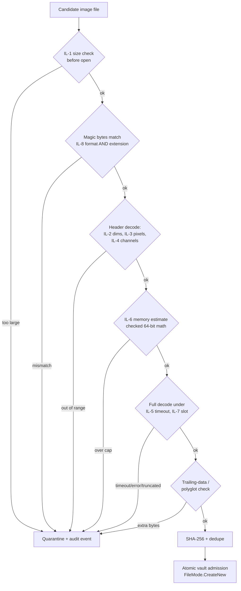
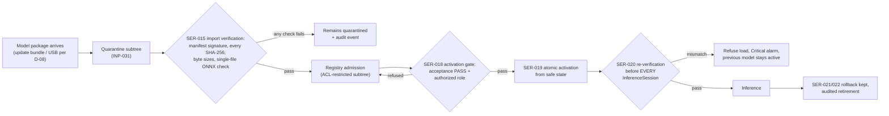
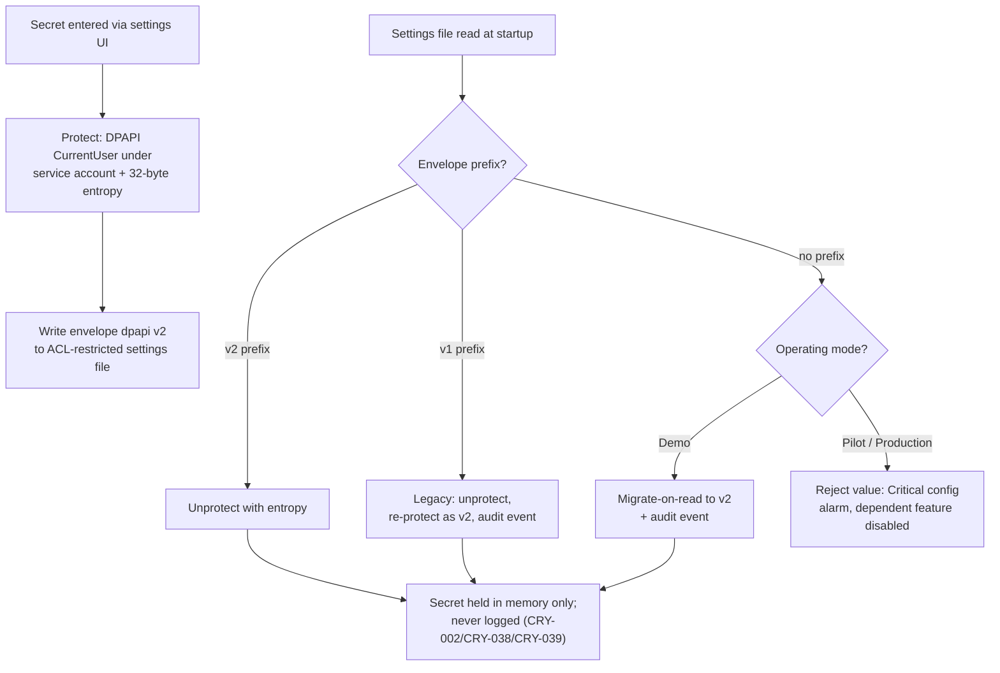

OpenAI/Codex and numerous other coding agents will review your output once you are done.

# VOL08 Input, Serialization, and Cryptography — AOI Software Architecture, Secure Development, and Change-Control Standard, v1.0 (2026-07-15)

Scope: this volume governs every byte that enters any AOI Monitor process (§29 — input, file, image, and serialization security, including the D-03 model-artifact rules) and every secret, key, certificate, and cryptographic primitive the product creates, stores, or verifies (§30).
Supersedes/Related existing docs: no repo document is fully superseded; this volume governs and extends the image-import rules described in `Docs/DATA_PIPELINE.md`, the model-artifact handling in `Docs/DATA_PIPELINE.md`, the adapter-package rules in `Docs/ARCHITECTURE.md`, and the secret-scanning rules embedded in `Scripts/check-code-quality.ps1` (CQ-SEC-001) and `Scripts/check-pr-quality.ps1` (PR-SEC-001).

---

## 29. Input, File, Image, and Serialization Security

This section defines the mandatory validation, containment, and rejection behavior for all external input, the hard limits of the image ingestion pipeline, filesystem and path safety, structured-format hardening, string and numeric validation, protocol robustness, parser test obligations, and the serialization policy including AI model artifacts (D-03). Boundary with neighboring sections: threat models and security architecture are §27 / VOL07; identity and authorization are §28 / VOL07; SQL parameterization and database integrity are the DAT catalogue, §21/§37 / VOL05; ML training-environment controls are the AIM catalogue, §31 / VOL09; update-bundle and installer supply-chain verification is §42–43 / VOL15; OPC UA message security is §35 / VOL11.

### 29.1 Trust model: every input is untrusted

AOI Monitor runs on a shop-floor Windows workstation whose filesystem, USB ports, network segments, and peer processes are all reachable by personnel and equipment outside the engineering team's control. The current codebase already demonstrates why the boundary must sit inside the application: the SQLite database and every settings JSON file are user-writable plain files (`context: AOI_Monitor/Services/AuthenticationSettingsService.cs`, `AOI_Monitor/Data/AoiDatabase.cs`), GigE Vision camera links carry zero authentication or integrity protection (GIGEV), and the camera/lighting plugin loaders execute unsigned DLLs named by a JSON manifest (`AOI_Monitor/Services/VisionCameraAdapters.cs:134`, `AOI_Monitor/Services/LightingControllerFactory.cs:99`). Table 29-1 is the normative input inventory; every row is untrusted regardless of who or what produced it.

Table 29-1 — Input inventory (normative)

| # | Source | Examples in the current product | Validating component |
|---|---|---|---|
| 1 | Filesystem | golden/sample images, dataset folders, adapter folders | ImageStore, Acquisition |
| 2 | Network | MES REST responses, central-sync endpoints, mock endpoints | MES, REST |
| 3 | USB / removable media | image import, recipe transfer, update bundles | Update, ImageStore |
| 4 | Operator entry | recipe names, thresholds, user IDs, free-text notes | HMI, Domain |
| 5 | Vendor SDK callbacks | camera frames, diagnostics strings, device identities | CameraAdapter |
| 6 | Camera links (GigE/U3V) | frame payloads, GenICam metadata | Acquisition |
| 7 | Serial / TCP text links | lighting controller command echoes and responses | LightingAdapter |
| 8 | Database contents | every SQLite row read back (user-writable file) | Persistence |
| 9 | Configuration files | layered JSON per D-10, auth/mode/MES settings | Config |
| 10 | Recipe files | recipe revisions, threshold profiles | Recipe |
| 11 | Model packages | ONNX + manifest, learned-visual artifacts | ModelMgmt, Inference |
| 12 | Update bundles | signed MSI/update packages (D-08) | Update, Installer |
| 13 | Other local processes | clipboard, named pipes (future D-06 IPC), CLI arguments | All |

Rows 8 and 9 are deliberate and non-negotiable: data the application wrote earlier is still untrusted when read back, because the files are modifiable outside the application (see the §27 / VOL07 threat models). Validation therefore applies on read, not only on first entry.

### R: Universal input-trust rules (INP-001–INP-003)

**[INP-001]** (P1 | ALL | All)
The application SHALL validate data from every input source listed in Table 29-1 at the receiving service boundary before first use.
- Why: no input channel in this product is authenticated end-to-end; unvalidated input is the root cause class behind CWE-20, CWE-22, and CWE-502 (all on the 2025 CWE Top 25). Maps: ASVS-V2; CWE-20; 62443-4-2 CR 3.5; SSDF-PW.5.
- Verify: code-review checklist item CR-INP-01 applied to every PR that adds or modifies a parser or reader. Evidence: PR review record. Owner: Software Architect. Auto: Manual review.
- Exception: Not allowed. Review: Annual.

**[INP-002]** (P1 | ALL | Domain, Config)
Input validation SHALL use allowlists (accepted formats, character sets, numeric ranges, enumerations) rather than denylists for every externally supplied value.
- Why: denylists are bypassable by construction; the repo's own regex-denylist secret scanner demonstrates the failure mode (`Scripts/check-code-quality.ps1:204-213`). Maps: ASVS-V2; CSC; CWE-183.
- Verify: unit tests per validator in test class `InputValidationPolicyTests` plus review checklist CR-INP-02. Evidence: test results in CI trx. Owner: Software Lead. Auto: Partially automated.
- Exception: Allowed — approver: Security Lead. Review: On change.

**[INP-003]** (P2 | ALL | Logging, Audit)
The application SHALL reject input that fails validation, recording the rejection through the logging service (D-09) with a stable event ID and without echoing the raw rejected bytes into the log record.
- Why: fail-closed rejection with evidence supports forensics while preventing log injection via the rejected payload itself (CWE-117). Maps: ASVS-V16; CWE-117; 62443-4-2 CR 2.8.
- Verify: test class `ValidationRejectionLoggingTests` asserting event ID presence and raw-byte absence. Evidence: CI test results. Owner: Software Lead. Auto: Fully automated.
- Exception: Not allowed. Review: Annual.

### 29.2 Image ingestion pipeline hard limits

The image pipeline is the product's highest-volume input surface and its primary denial-of-service and memory-corruption exposure (decoder CVE classes: CWE-787/125/190; ONNX Runtime's own 2026 security fixes were dominated by malformed-input memory-safety issues, ONNX-SEC). The existing import path already implements extension allowlisting, a decompression-bomb pixel guard, full-decode validation, and SHA-256 dedupe (`AOI_Monitor/Data/AoiDatabase.Images.cs:99-137`, `PixelDifferenceInspectionEngine.MaxDecodePixels`); this section fixes those controls as numbered defaults and closes the remaining gaps.

Table 29-2 — Image-pipeline default limits (normative defaults; site config MAY tighten, never relax without recorded exception)

| ID | Limit | Default value |
|---|---|---|
| IL-1 | Maximum file size | 100 MB |
| IL-2 | Maximum width / height | 16,384 px each axis |
| IL-3 | Maximum pixel count | 100,000,000 px (100 MP) |
| IL-4 | Channels / bit depth | 1–4 channels; 8 or 16 bits per channel |
| IL-5 | Decode timeout | 10 s per file |
| IL-6 | Decode memory cap | 1,024 MiB estimated buffer per decode |
| IL-7 | Concurrent decodes | 2 simultaneous decode operations |
| IL-8 | Format allowlist | PNG, JPEG (current `AoiDatabase.cs:14-17` allowlist) |

ASSUMPTION A-VOL08-1: the IL defaults are sized for Stage 1–2 PCB imagery from sensors up to roughly 65 MP. Risk: high-resolution line-scan or stitched-panel workflows at Stage 2+ exceed IL-1/IL-3 and would be rejected; the values must be ratified against the selected camera in §32 / VOL10 before Stage 2 hardware commissioning. Recorded in this volume's Open Decisions subsection (§30.7).

ASSUMPTION A-VOL08-2: IL-6 (1,024 MiB) assumes stations with at least 16 GB RAM per the §11 / VOL02 platform matrix. Risk: on smaller lab machines, two concurrent worst-case decodes plus inference can exhaust memory; IL-6 and IL-7 are jointly sized to cap worst-case decode memory at 2 GiB.

**Reading this diagram:** a candidate image passes eight ordered gates before it may enter the image vault. The file size (IL-1) is checked from directory metadata before the file is opened; magic bytes must agree with both an allowlisted format (IL-8) and the file extension; the header-declared dimensions, pixel count, and channel layout are validated (IL-2/IL-3/IL-4) before any pixel buffer is allocated; the required buffer size is computed in overflow-checked 64-bit arithmetic and compared to IL-6; the full decode runs inside one of the IL-7 concurrency slots under the IL-5 timeout; decoded files with trailing bytes after the format end marker are rejected as polyglot suspects; finally the SHA-256 content hash is computed and deduplicated, and the file is admitted to the vault with a collision-safe create. Every failing branch terminates in quarantine with an audit event — no failing file is deleted silently or processed partially.

### R: Image ingestion limits (INP-004–INP-017)

**[INP-004]** (P2 | ALL | ImageStore, Acquisition)
The image ingestion pipeline SHALL reject any image file larger than the configured maximum file size (default IL-1 = 100 MB) before opening the file for decoding.
- Why: caps attacker- and accident-driven resource exhaustion (CWE-770, new on the 2025 CWE Top 25) at the cheapest possible check. Maps: CWE-770; ASVS-V5; CSC.
- Verify: test class `ImageIngestionLimitTests` (oversize fixture rejected). Evidence: CI test results. Owner: Software Lead. Auto: Fully automated.
- Exception: Allowed — approver: Software Architect. Review: On change.

**[INP-005]** (P2 | ALL | ImageStore, Acquisition)
The image ingestion pipeline SHALL reject any image whose header-declared width or height exceeds 16,384 px (IL-2).
- Why: bounds each axis independently so that downstream stride/offset arithmetic cannot overflow 32-bit intermediates (CWE-190). Maps: CWE-190; ASVS-V5.
- Verify: `ImageIngestionLimitTests` with 16,385-px header fixtures. Evidence: CI test results. Owner: Software Lead. Auto: Fully automated.
- Exception: Allowed — approver: Software Architect. Review: On change.

**[INP-006]** (P2 | ALL | ImageStore, Inference)
The image ingestion pipeline SHALL reject any image whose header-declared pixel count (width × height, computed in 64-bit) exceeds 100,000,000 px (IL-3).
- Why: generalizes the existing decompression-bomb guard (`AoiDatabase.Images.cs:99-103`, `PixelDifferenceInspectionEngine.MaxDecodePixels`) into a normative limit applied on every decode path, not only vault import. Maps: CWE-770; ASVS-V5.
- Verify: `ImageIngestionLimitTests` bomb fixtures (small file, huge declared dims). Evidence: CI test results. Owner: Software Lead. Auto: Fully automated.
- Exception: Allowed — approver: Software Architect. Review: On change.

**[INP-007]** (P2 | ALL | ImageStore, Acquisition)
The image ingestion pipeline SHALL reject images whose channel count is outside 1–4 or whose bit depth per channel is neither 8 nor 16 (IL-4).
- Why: constrains decoder code paths to the formats the inference preprocessors actually implement (`OnnxInspectionEngine.cs:369-418` assumes RGB/gray), removing exotic-layout decoder paths from the attack surface. Maps: CWE-20; ASVS-V5.
- Verify: `ImageIngestionLimitTests` CMYK/32-bit-float fixtures rejected. Evidence: CI test results. Owner: Software Lead. Auto: Fully automated.
- Exception: Allowed — approver: Software Architect. Review: On change.

**[INP-008]** (P2 | ALL | ImageStore, Acquisition)
Every image decode operation SHALL be aborted and the file rejected when decoding exceeds 10 s (IL-5).
- Why: pathological files that pass static limits can still trigger quadratic decoder behavior; a wall-clock bound converts an availability hazard into a clean rejection (CWE-400). Maps: CWE-400; ASVS-V5; 62443-4-2 CR 7.1.
- Verify: `ImageIngestionLimitTests` with a decoder-stall fixture behind a fake clock. Evidence: CI test results. Owner: Software Lead. Auto: Fully automated.
- Exception: Allowed — approver: Software Architect. Review: On change.

**[INP-009]** (P2 | ALL | ImageStore, Acquisition)
The image pipeline SHALL compute the required decode buffer size (width × height × channels × bytes-per-channel) in checked 64-bit arithmetic and reject the file when the result exceeds 1,024 MiB (IL-6) before allocating any pixel buffer.
- Why: prevents unbounded allocation from header-controlled values — the exact CVE class ONNX Runtime patched repeatedly in 1.25–1.27 (TensorProto size validation, ONNX-SEC). Maps: CWE-789; CWE-190; ASVS-V5.
- Verify: `ImageIngestionLimitTests` allocation-estimate cases. Evidence: CI test results. Owner: Software Lead. Auto: Fully automated.
- Exception: Allowed — approver: Software Architect. Review: On change.

**[INP-010]** (P1 | ALL | ImageStore, Inference)
All arithmetic on externally supplied image dimensions, strides, offsets, and ROI coordinates SHALL be performed in checked 64-bit operations that reject overflow rather than wrapping.
- Why: integer wraparound in dimension math converts a validation pass into an out-of-bounds write (CWE-190 → CWE-787, ranked #5 on the 2025 CWE Top 25 and #3 on KEV). Maps: CWE-190; CWE-787; KEV.
- Verify: fitness function FF-INP-04 (analyzer rule: unchecked int math on identifiers matching dimension/stride/offset patterns in image code) plus `DimensionMathTests`. Evidence: CI gate log. Owner: Software Lead. Auto: Partially automated.
- Exception: Not allowed. Review: Per release.

**[INP-011]** (P2 | ALL | ImageStore)
Header-declared dimensions SHALL be validated against IL-2 and IL-3 using metadata-only decoding before any full-frame decode is attempted.
- Why: ordering matters — validating after allocation defeats IL-6; the current import already header-decodes first (`AoiDatabase.Images.cs:99-103`) and this fixes that ordering as normative. Maps: CWE-20; ASVS-V5.
- Verify: code review checklist CR-INP-03 on decode call sites; `ImageIngestionLimitTests` ordering assertion. Evidence: PR review record. Owner: Software Lead. Auto: Partially automated.
- Exception: Not allowed. Review: Annual.

**[INP-012]** (P2 | ALL | ImageStore, Inference)
Truncated or partially decodable image files SHALL be rejected in full so that no partially decoded frame enters the vault, an inference input, or an evidence record.
- Why: partial frames silently corrupt inspection evidence and can carry decoder state into undefined behavior; truncation is a standard fuzzing find (CWE-20). Maps: CWE-20; ASVS-V5.
- Verify: `ImageIngestionLimitTests` truncated-fixture corpus (see INP-065). Evidence: CI test results. Owner: Software Lead. Auto: Fully automated.
- Exception: Not allowed. Review: Annual.

**[INP-013]** (P1 | ALL | ImageStore, Update)
The application SHALL verify that a file's leading magic bytes identify an IL-8 allowlisted format and match the file extension, rejecting the file on any mismatch.
- Why: extension-only checks are spoofable and drive CWE-434 (#12, 2025 CWE Top 25); the Keras `.h5` CVE-2025-9905 shows extension-driven dispatch reaching the wrong (unsafe) loader. Maps: CWE-434; ASVS-V5; CSC.
- Verify: `ImageIngestionLimitTests` renamed-payload fixtures (e.g., ZIP renamed `.png`). Evidence: CI test results. Owner: Software Lead. Auto: Fully automated.
- Exception: Not allowed. Review: Per release.

**[INP-014]** (P2 | ALL | ImageStore)
The image pipeline SHALL reject files containing data after the format's end-of-stream marker (PNG `IEND`, JPEG `EOI`).
- Why: trailing data is the polyglot construction primitive (one file valid as two formats); safetensors bans buffer holes for the same reason (SAFETENSORS). Maps: CWE-434; Internal.
- Verify: `ImageIngestionLimitTests` polyglot fixtures (PNG+ZIP concatenation). Evidence: CI test results. Owner: Software Lead. Auto: Fully automated.
- Exception: Allowed — approver: Security Lead. Review: On change.

**[INP-015]** (P1 | ALL | ImageStore, Diagnostics)
The application SHALL treat EXIF, XMP, and all other embedded image metadata as inert data that is never used to construct or dereference any path, URL, or external reference contained in it.
- Why: metadata-driven fetches create SSRF/path-traversal pivots from a file that "is just an image" (CWE-918, CWE-610); metadata is display/logging data only. Maps: CWE-918; CWE-610; ASVS-V5.
- Verify: fitness function FF-INP-05 (grep/analyzer: no URI or path construction from metadata reader outputs) plus review checklist. Evidence: CI gate log. Owner: Security Lead. Auto: Partially automated.
- Exception: Not allowed. Review: Per release.

**[INP-016]** (P2 | ALL | ImageStore, Persistence)
Vault admission SHALL require a successful full decode of the candidate file before the INP-030 content hash is recorded in the `Images.FileHash` column.
- Why: preserves the existing full-decode + dedupe discipline (`AoiDatabase.Images.cs:104-137`) as a norm and orders a successful decode ahead of the INP-030 content hash, which alone anchors traceability and duplicate detection. Maps: ASVS-V5; 62443-4-2 CR 3.4; Internal.
- Verify: existing `AoiDatabaseTests` import cases extended with hash assertions. Evidence: CI test results. Owner: Software Lead. Auto: Fully automated.
- Exception: Not allowed. Review: Annual.

**[INP-017]** (P3 | S1–S4 | HMI, ImageStore)
Display thumbnails rendered from third-party images SHOULD be produced from a re-encoded copy rather than from the original file bytes.
- Why: re-encoding destroys embedded payloads before repeated UI-side decoding (File Upload guidance, CSC); the vaulted evidence copy stays byte-identical, so traceability is unaffected. Maps: CSC; ASVS-V5.
- Verify: review checklist CR-INP-04 on thumbnail code paths. Evidence: PR review record. Owner: Software Lead. Auto: Manual review.
- Exception: Allowed — approver: Software Lead. Review: Annual.

### 29.3 Filesystem and path security

Path handling is the product's second-largest input surface: operator-chosen folders, manifest-named plugin DLLs, archive extraction, recipe references, and the storage root itself. Path traversal is #6 on the 2025 CWE Top 25 and #6 on the KEV list, and the ONNX external-data CVE lineage (CVE-2024-27318 and its incomplete-fix successors) shows the class recurring inside ML tooling specifically. The controls below apply to every filesystem operation whose path derives, in whole or in part, from Table 29-1 input.

### R: Path and filesystem rules (INP-018–INP-031)

**[INP-018]** (P0 | ALL | ImageStore, Persistence, Config)
Every externally supplied path SHALL be canonicalized with `Path.GetFullPath` and verified to resolve strictly under an allowed storage root before any filesystem operation uses it.
- Why: canonicalize-then-validate is the only ordering that defeats `..`, mixed separators, and 8.3-name aliases (CWE-22, KEV #6); validating the raw string is bypassable. Maps: CWE-22; KEV; ASVS-V5; 62443-4-2 CR 3.5.
- Verify: fitness function FF-INP-02 (analyzer: filesystem APIs reachable only through the `PathValidation` facade for external-path parameters) plus test class `PathValidationTests`. Evidence: CI gate log. Owner: Software Lead. Auto: Fully automated.
- Exception: Not allowed. Review: Per release.

**[INP-019]** (P2 | ALL | Config, Update)
Fields defined as relative paths (manifest entries, archive member names, recipe file references) SHALL be rejected when they contain an absolute path, a drive designator, or a UNC prefix (`\\`).
- Why: absolute/UNC values in relative-path fields redirect writes outside managed roots and can leak NTLM credentials via UNC fetches. Maps: CWE-22; CWE-36; ASVS-V5.
- Verify: `PathValidationTests` absolute/UNC cases. Evidence: CI test results. Owner: Software Lead. Auto: Fully automated.
- Exception: Not allowed. Review: Annual.

**[INP-020]** (P1 | ALL | Update, Export)
Archive extraction SHALL validate every member name (canonicalized, relative, no traversal, no absolute/UNC form) against the destination root before writing that member.
- Why: zip-slip is the archive form of CWE-22 and applies to update bundles (D-08), adapter packages, and configuration-backup restore (`AOI_Monitor/Services/ConfigurationBackupService.cs`). Maps: CWE-22; ASVS-V5; CSC.
- Verify: test class `ArchiveExtractionTests` with zip-slip corpus. Evidence: CI test results. Owner: Software Lead. Auto: Fully automated.
- Exception: Not allowed. Review: Per release.

**[INP-021]** (P2 | ALL | ImageStore, Config)
Externally supplied file and directory names SHALL be rejected when they contain an NTFS alternate-data-stream separator (`:` in a name component) or match a reserved Windows device name (`CON`, `PRN`, `AUX`, `NUL`, `COM1`–`COM9`, `LPT1`–`LPT9`, case-insensitive, with or without extension).
- Why: ADS names hide payloads from casual inspection and device names hang or misdirect Win32 I/O (CWE-67). Maps: CWE-67; CWE-22; Internal.
- Verify: `PathValidationTests` ADS/device-name cases. Evidence: CI test results. Owner: Software Lead. Auto: Fully automated.
- Exception: Not allowed. Review: Annual.

**[INP-022]** (P1 | ALL | ImageStore, Persistence)
The application SHALL refuse to operate on any file or directory inside a managed storage root that is, or is reached through, a reparse point (symbolic link, junction, or volume mount point).
- Why: a link planted inside a managed root redirects reads/writes outside the root after INP-018 validation has passed — the local-filesystem TOCTOU variant of CWE-59. Maps: CWE-59; CWE-22; ASVS-V5.
- Verify: `PathValidationTests` reparse-point cases (junction created in temp root). Evidence: CI test results. Owner: Software Lead. Auto: Fully automated.
- Exception: Not allowed. Review: Per release.

**[INP-023]** (P2 | ALL | Update, Export)
Archive formats and package manifests SHALL be rejected when they define symbolic links, hard links, or junction entries.
- Why: link entries in archives recreate INP-022's hazard at extraction time; no AOI artifact class legitimately contains links. Maps: CWE-59; ASVS-V5.
- Verify: `ArchiveExtractionTests` link-entry corpus. Evidence: CI test results. Owner: Software Lead. Auto: Fully automated.
- Exception: Not allowed. Review: Annual.

**[INP-024]** (P2 | ALL | ImageStore, Persistence)
Files created in shared or externally writable directories SHALL be created with `FileMode.CreateNew` (fail if the path already exists) rather than create-or-truncate modes.
- Why: create-or-truncate is the classic TOCTOU primitive — a pre-planted file or link at the expected name silently redirects the write (CWE-367). Maps: CWE-367; CWE-377; Internal.
- Verify: fitness function FF-INP-06 (analyzer: `File.Create`/`FileMode.Create` on paths in shared roots flagged) plus `PathValidationTests`. Evidence: CI gate log. Owner: Software Lead. Auto: Partially automated.
- Exception: Allowed — approver: Software Architect. Review: On change.

**[INP-025]** (P2 | ALL | ImageStore, Export)
Temporary files SHALL be created only inside an application-owned temp directory using cryptographically random names and `FileMode.CreateNew`.
- Why: predictable temp names in world-writable locations enable pre-creation and squatting attacks (CWE-377); the app-owned directory keeps ACL control with the station service account. Maps: CWE-377; CWE-379; Internal.
- Verify: `PathValidationTests` temp-file cases; FF-INP-06 covers `Path.GetTempFileName` misuse. Evidence: CI test results. Owner: Software Lead. Auto: Fully automated.
- Exception: Not allowed. Review: Annual.

**[INP-026]** (P2 | ALL | ImageStore, Persistence, Config)
Each artifact class (image vault, model registry, quarantine, exports, spool payloads, temp) SHALL reside in its own dedicated directory subtree under the managed storage root with NTFS ACLs restricting write access to the station service account.
- Why: per-class subtrees make INP-018 root checks precise and let ACLs enforce least privilege per artifact type; today all classes share one loosely permissioned root. Maps: ASVS-V5; 62443-4-2 CR 2.1; SBD.
- Verify: installer/commissioning checklist item plus `StorageRootLayoutTests` verifying subtree creation. Evidence: commissioning record; CI test results. Owner: Software Lead. Auto: Partially automated.
- Exception: Allowed — approver: Software Architect. Review: On change.

**[INP-027]** (P2 | ALL | ImageStore, Diagnostics)
Ingestion into any managed storage subtree SHALL be refused, with a Warning alarm, when the subtree exceeds its configured quota or when volume free space falls below the configured floor (default 10 GB).
- Why: unbounded vault growth is a documented Stage-2 boundary (`Docs/DATA_PIPELINE.md:60-70`); disk exhaustion halts inspection and corrupts SQLite WAL checkpoints (CWE-770). Maps: CWE-770; 62443-4-2 CR 7.2; Internal.
- Verify: `StorageQuotaTests` with fake volume-info provider. Evidence: CI test results. Owner: Software Lead. Auto: Fully automated.
- Exception: Allowed — approver: IT Admin (customer). Review: Quarterly.

**[INP-028]** (P1 | ALL | Config, Persistence)
Startup validation SHALL raise a Critical configuration alarm and fail closed when the configured storage root fails the cloud-synchronized, roaming-profile, and network-share location check owned by the data-and-storage standard (§21 / §37 / VOL05).
- Why: sync engines rewrite and lock files underneath SQLite WAL and the vault, producing corruption and silent divergence, and the development repo itself currently sits under OneDrive (repo-reality gap 10); the data-and-storage standard owns the prohibited-location set (including network shares) while this record supplies the Critical-alarm, fail-closed startup behavior. Maps: Internal; 62443-4-2 CR 3.4.
- Verify: test class `StorageRootValidationTests` (known sync-root patterns rejected). Evidence: CI test results. Owner: Software Lead. Auto: Fully automated.
- Exception: Allowed — approver: Software Architect. Review: Quarterly.

**[INP-029]** (P1 | ALL | Config, Persistence, Export)
Every settings, manifest, and evidence file write SHALL be atomic: write to a temp file in the same directory, flush, then rename over the target (`File.Replace` or equivalent).
- Why: torn writes to auth/mode/config JSON files produce fail-open or undefined states at next startup; atomic replace guarantees readers see the old or the new file, never a partial one. Maps: CWE-362; ASVS-V13; Internal.
- Verify: fitness function FF-INP-07 (analyzer: direct `File.WriteAllText` on settings paths flagged; writes routed via `AtomicFileWriter`) plus `AtomicWriteTests`. Evidence: CI gate log. Owner: Software Lead. Auto: Fully automated.
- Exception: Not allowed. Review: Per release.

**[INP-030]** (P1 | ALL | ImageStore, ModelMgmt, Update)
The application SHALL record a SHA-256 content hash for every ingested artifact (image, model file, recipe file, update bundle, adapter package) at admission time via the central `HashUtil` helper.
- Why: content hashes anchor dedupe, tamper detection, and the SER-020 re-verification chain; the repo already applies this to images/models/exports (`AOI_Monitor/Services/HashUtil.cs:11-19`) — this extends it to all artifact classes. Maps: 62443-4-2 CR 3.4; SSDF-PS.1; ASVS-V5.
- Verify: `ArtifactHashCoverageTests` per artifact class. Evidence: CI test results. Owner: Software Lead. Auto: Fully automated.
- Exception: Not allowed. Review: Annual.

**[INP-031]** (P2 | ALL | ImageStore, Diagnostics)
Artifacts that fail any validation gate SHALL be moved, with a metadata record (source, failure reason, timestamp, SHA-256), into the dedicated quarantine subtree, from which no load, decode, or execution path is reachable.
- Why: quarantine preserves forensic evidence of attempted or accidental bad input while making "rejected" a terminal, inspectable state instead of silent deletion. Maps: ASVS-V5; 62443-4-2 CR 2.8; Internal.
- Verify: `QuarantineTests` (rejected fixture lands in quarantine with metadata; loader refuses quarantine paths). Evidence: CI test results. Owner: Software Lead. Auto: Fully automated.
- Exception: Not allowed. Review: Annual.

### 29.4 Structured-format hardening

The product's structured-format surface is: CSV (import of validation ground-truth manifests via `BatchValidationService`; export of metrics, threshold sweeps, and report tables that production engineers open in Excel), JSON (the D-10 configuration format, manifests, MES payloads), XML (present only through framework and export paths today), and HTML/PDF report generation. YAML exists only in the Python training environment (anomalib configuration).

ASSUMPTION A-VOL08-4: the product generates HTML/PDF reports but never parses externally supplied PDF files. Risk: if a future feature ingests PDFs (e.g., importing customer inspection specs), a sandboxed-parser requirement must be added before that feature ships; recorded in §30.7 as an open decision trigger.

### R: Format-specific rules (INP-032–INP-042)

**[INP-032]** (P1 | ALL | Export)
Every CSV export SHALL neutralize formula-leading cell values by prefixing any cell that begins with `=`, `+`, `-`, `@`, tab (0x09), carriage return (0x0D), or a full-width Unicode variant of these characters with a single-quote character.
- Why: Excel executes such cells as formulas — a defect-description or lot-ID value becomes code execution on an engineer's PC (OWASP CSV-injection guidance, CSC); quoting alone is insufficient because Excel strips it on re-save. Maps: CWE-1236; CSC; ASVS-V1.
- Verify: test class `CsvInjectionTests` covering every CSV writer (`ClassMetricsService` CSV, threshold-sweep CSV, ReportsView exports, spool exports). Evidence: CI test results. Owner: Software Lead. Auto: Fully automated.
- Exception: Not allowed. Review: Annual.

**[INP-033]** (P2 | ALL | ModelMgmt, Training)
CSV import parsers (validation manifests, alignment summaries) SHALL validate column count, header names, and per-cell type and length against the documented schema, treating every cell strictly as data.
- Why: the acceptance pipeline's ground-truth CSV directly shapes model release evidence; malformed or trojaned rows must fail loudly, not skew metrics silently. Maps: CWE-1236; CWE-20; ASVS-V2.
- Verify: `CsvImportSchemaTests` with malformed-manifest corpus. Evidence: CI test results. Owner: ML Lead. Auto: Fully automated.
- Exception: Not allowed. Review: Annual.

**[INP-034]** (P1 | ALL | Logging, Audit)
Text originating from any Table 29-1 source SHALL have CR (0x0D), LF (0x0A), and all other C0/C1 control characters stripped or visibly encoded before being written to a log or audit record.
- Why: CRLF injection forges log lines and audit rows, undermining the traceability evidence this product exists to produce (CWE-117). Maps: CWE-117; ASVS-V16; 62443-4-2 CR 2.8.
- Verify: fitness function FF-INP-08 (log-write facade sanitizer is the only path to the logging service) plus `LogInjectionTests`. Evidence: CI gate log. Owner: Software Lead. Auto: Fully automated.
- Exception: Not allowed. Review: Per release.

**[INP-035]** (P1 | ALL | Config, MES)
Every XML reader in the product SHALL be constructed with `DtdProcessing.Prohibit` and `XmlResolver = null` set explicitly, regardless of framework defaults.
- Why: modern .NET defaults are XXE-safe, but explicit settings survive refactors, parser swaps, and library upgrades (OWASP XXE sheet, CSC); XXE is CWE-611. Maps: CWE-611; CSC; ASVS-V2.
- Verify: fitness function FF-INP-09 (analyzer/grep over `XmlReader`/`XmlDocument` construction sites). Evidence: CI gate log. Owner: Software Lead. Auto: Fully automated.
- Exception: Not allowed. Review: Per release.

**[INP-036]** (P2 | ALL | Export, HMI)
Report generation SHALL insert data-derived values into HTML and PDF templates only through encoding functions that neutralize markup and template syntax.
- Why: operator notes, defect descriptions, and file names flow into HTML reports that engineers open in browsers — unencoded insertion is stored XSS in the evidence chain (CWE-79). Maps: CWE-79; CWE-1336; ASVS-V1.
- Verify: `ReportTemplateEncodingTests` with markup-bearing fixture strings. Evidence: CI test results. Owner: Software Lead. Auto: Fully automated.
- Exception: Not allowed. Review: Annual.

**[INP-037]** (P3 | ALL | Training, Config)
YAML documents SHALL be parsed only with type-restricted safe loaders that cannot instantiate arbitrary objects (Python `yaml.safe_load`; no YAML parsing in station code without an ADR).
- Why: default/unsafe YAML loaders construct arbitrary objects from tags — the YAML flavor of CWE-502; station code has no YAML today and this keeps the surface closed. Maps: CWE-502; CSC.
- Verify: CI lint FF-SER-05 (training scripts) plus repo grep gate for YAML libraries in station projects. Evidence: CI gate log. Owner: ML Lead. Auto: Fully automated.
- Exception: Allowed — approver: Security Lead. Review: On change.

**[INP-038]** (P2 | ALL | Config, MES)
Every deserialization of external JSON SHALL enforce a maximum document size (default 10 MB) and a maximum nesting depth (default 64).
- Why: unbounded documents and deep nesting are cheap denial-of-service inputs against `System.Text.Json` recursion and buffering (CWE-770). Maps: CWE-770; ASVS-V2.
- Verify: `JsonHardeningTests` (oversize and 65-deep fixtures rejected); enforced structurally via the SER-009 options factory. Evidence: CI test results. Owner: Software Lead. Auto: Fully automated.
- Exception: Allowed — approver: Software Architect. Review: On change.

**[INP-039]** (P2 | ALL | Config, IAM)
Parsers for security-relevant files (authentication settings, operating-mode settings, model manifests, update manifests) SHALL reject documents containing unrecognized top-level fields.
- Why: unknown fields in security-critical documents indicate tampering, version skew, or smuggling of data past signature checks; silent tolerance is how parser-differential attacks work. Maps: CWE-20; ASVS-V2; Internal.
- Verify: `JsonHardeningTests` unknown-field fixtures per file class. Evidence: CI test results. Owner: Security Lead. Auto: Fully automated.
- Exception: Allowed — approver: Security Lead. Review: On change.

**[INP-040]** (P3 | ALL | Config, IAM)
Parsers for security-relevant JSON files SHALL reject documents containing duplicate object keys.
- Why: last-write-wins duplicate handling lets a file present one value to a reviewer or scanner and a different value to the runtime (CWE-436 interpretation conflict). Maps: CWE-436; ASVS-V2.
- Verify: `JsonHardeningTests` duplicate-key fixtures. Evidence: CI test results. Owner: Security Lead. Auto: Fully automated.
- Exception: Allowed — approver: Security Lead. Review: On change.

**[INP-041]** (P1 | ALL | Config, Recipe, ModelMgmt)
Versioned document formats (configuration, recipes, model manifests, update manifests) SHALL reject documents whose declared schema version is below the minimum version accepted by the running release.
- Why: schema-downgrade acceptance reopens every vulnerability the newer schema fixed (CWE-757); the version floor makes fixes sticky. Maps: CWE-757; Internal.
- Verify: `SchemaVersionTests` downgrade fixtures per document class. Evidence: CI test results. Owner: Software Lead. Auto: Fully automated.
- Exception: Not allowed. Review: Per release.

**[INP-042]** (P1 | ALL | Config)
The application SHALL validate every configuration file against its JSON schema at startup and enter the fail-closed degraded state defined in §41 / VOL13 when validation fails (D-10).
- Why: invalid configuration silently normalized or defaulted produces undefined security posture; D-10 mandates fail-closed schema validation as the configuration trust boundary. Maps: ASVS-V13; CWE-20; 62443-4-2 CR 3.5.
- Verify: `ConfigSchemaStartupTests` (corrupt-config fixture drives degraded state). Evidence: CI test results. Owner: Software Lead. Auto: Fully automated.
- Exception: Not allowed. Review: Per release.

### 29.5 String validation

Operator-facing text in this product is Korean-first (product fact); machine identifiers are not. The controls below separate the two: identifiers (recipe IDs, model IDs, user IDs, taxonomy IDs per D-17) are constrained to a narrow ASCII set because they travel into paths, SQL parameters, protocol frames, and audit keys; display names and notes accept full Unicode under length and control-character rules.

### R: String rules (INP-043–INP-048)

**[INP-043]** (P2 | ALL | Domain, HMI)
Every externally supplied string SHALL be validated against a documented maximum length before further processing, with defaults of 256 characters for identifiers and 4,096 characters for free-text fields.
- Why: unbounded strings drive allocation abuse, UI freezes, and downstream buffer assumptions; explicit caps make every parser total. Maps: CWE-20; CWE-770; ASVS-V2.
- Verify: `InputValidationPolicyTests` length cases per field class. Evidence: CI test results. Owner: Software Lead. Auto: Fully automated.
- Exception: Allowed — approver: Software Architect. Review: On change.

**[INP-044]** (P3 | ALL | Domain, HMI)
Externally supplied text SHALL be validated as well-formed Unicode (rejecting unpaired surrogates and invalid encodings) and normalized to NFC before any validation or comparison.
- Why: normalize-then-validate prevents two byte sequences that render identically from passing different checks (CSC input-validation guidance); matters for Korean operator input. Maps: CWE-176; CSC.
- Verify: `InputValidationPolicyTests` Unicode cases (unpaired surrogate, NFD/NFC pair). Evidence: CI test results. Owner: Software Lead. Auto: Fully automated.
- Exception: Allowed — approver: Software Lead. Review: Annual.

**[INP-045]** (P2 | ALL | Domain, Persistence)
Identifiers and file names from external sources SHALL be rejected when they contain null bytes (0x00) or C0/C1 control characters.
- Why: embedded nulls truncate strings differently across managed/native layers (CWE-158), and control characters enable log/terminal injection downstream. Maps: CWE-158; CWE-117; ASVS-V2.
- Verify: `InputValidationPolicyTests` null/control cases. Evidence: CI test results. Owner: Software Lead. Auto: Fully automated.
- Exception: Not allowed. Review: Annual.

**[INP-046]** (P2 | ALL | Domain, Persistence)
Machine identifiers (recipe IDs, model IDs, station IDs, user IDs, defect-taxonomy IDs) SHALL match the pattern `[A-Za-z0-9][A-Za-z0-9._-]{0,63}`.
- Why: identifiers travel into paths, protocol frames, and audit keys; a closed ASCII grammar removes traversal, homoglyph, and encoding ambiguity at the source (D-17 requires stable string IDs). Maps: CWE-22; CWE-1007; Internal.
- Verify: `InputValidationPolicyTests` identifier grammar cases; shared validator in Domain. Evidence: CI test results. Owner: Software Lead. Auto: Fully automated.
- Exception: Allowed — approver: Software Architect. Review: On change.

**[INP-047]** (P3 | ALL | Domain, IAM)
Identifier comparison SHOULD flag pairs that are distinct as raw strings but identical after Unicode confusable-character folding, treating such pairs as a tamper signal in audit-relevant contexts.
- Why: homoglyph identifiers (Latin/Cyrillic lookalikes) let an attacker shadow an existing user or recipe name in reviews and audit trails (CWE-1007); INP-046 already blocks most of this for new IDs, this covers display-name and legacy data. Maps: CWE-1007; Internal.
- Verify: `InputValidationPolicyTests` confusable-pair cases. Evidence: CI test results. Owner: Software Lead. Auto: Fully automated.
- Exception: Allowed — approver: Software Lead. Review: Annual.

**[INP-048]** (P2 | ALL | Domain)
Every regular expression applied to external input SHALL be anchored, use bounded quantifiers, and execute with a match timeout of at most 1 s or under the non-backtracking engine.
- Why: catastrophic backtracking turns a crafted filename or note into a CPU-exhaustion denial of service (CWE-1333, ReDoS). Maps: CWE-1333; CSC; ASVS-V2.
- Verify: fitness function FF-INP-10 (analyzer: `Regex` constructions without timeout/`NonBacktracking` flagged). Evidence: CI gate log. Owner: Software Lead. Auto: Fully automated.
- Exception: Allowed — approver: Software Lead. Review: On change.

### 29.6 Numeric and semantic validation

Numeric validation in this product is semantic, not just syntactic: a "valid float" can still be a NaN confidence, a negative ROI width, or a coordinate outside the frame. The repo currently clamps several of these silently (`InspectionModelConfigurationService.cs:133-161`), which hides tampering and corruption; the rules below convert silent clamping into loud rejection for externally sourced values.

### R: Numeric rules (INP-049–INP-055)

**[INP-049]** (P2 | ALL | Domain, PostProc)
Numeric fields parsed from external sources SHALL reject NaN and infinite values except where a field is explicitly documented to accept them.
- Why: NaN propagates through comparisons with always-false semantics, silently disabling threshold logic (a NaN confidence passes no threshold and fails no threshold). Maps: CWE-20; Internal.
- Verify: `NumericValidationTests` NaN/Infinity cases per parser. Evidence: CI test results. Owner: Software Lead. Auto: Fully automated.
- Exception: Not allowed. Review: Annual.

**[INP-050]** (P3 | S2+ | Domain, ThreeD)
Every physical-quantity field crossing a module or file boundary SHALL be range-validated against limits expressed in the unit declared by its field name or schema.
- Why: unit confusion (mm vs µm vs px) between recipe, calibration, and 3D metrology data produces plausible-looking but wrong inspection geometry; declared units make range checks meaningful. Maps: Internal; CWE-20.
- Verify: schema review checklist CR-INP-05 plus `NumericValidationTests` unit-range cases. Evidence: PR review record. Owner: Software Lead. Auto: Partially automated.
- Exception: Allowed — approver: Software Architect. Review: On change.

**[INP-051]** (P2 | ALL | PostProc, Decision)
Defect and region coordinates (x, y, width, height) SHALL be validated to lie entirely within the decoded image bounds before persistence or display.
- Why: out-of-bounds regions corrupt overlays, crash renderers, and poison training-sample extraction; bounds are known at validation time so the check is total. Maps: CWE-20; CWE-1284; ASVS-V2.
- Verify: `NumericValidationTests` coordinate cases. Evidence: CI test results. Owner: Software Lead. Auto: Fully automated.
- Exception: Not allowed. Review: Annual.

**[INP-052]** (P2 | ALL | Domain)
Dimension, size, count, and duration fields from external sources SHALL be rejected when negative unless the schema explicitly defines a negative range.
- Why: negative dimensions flow into allocation and loop arithmetic as huge unsigned values or inverted ranges (CWE-190 feeder). Maps: CWE-20; CWE-190.
- Verify: `NumericValidationTests` negative cases. Evidence: CI test results. Owner: Software Lead. Auto: Fully automated.
- Exception: Not allowed. Review: Annual.

**[INP-053]** (P2 | ALL | Recipe, PostProc)
ROI definitions in recipes SHALL be validated at load time against the recipe's declared frame dimensions, rejecting out-of-bounds and zero-area ROIs.
- Why: a hand-edited recipe with an out-of-frame ROI silently inspects nothing — an escape path disguised as configuration. Maps: CWE-20; Internal.
- Verify: `RecipeValidationTests` ROI cases. Evidence: CI test results. Owner: Software Lead. Auto: Fully automated.
- Exception: Not allowed. Review: Annual.

**[INP-054]** (P2 | ALL | PostProc, Decision)
Confidence values read from persisted records or external documents SHALL be rejected when outside [0.0, 1.0] rather than silently clamped.
- Why: an out-of-range persisted confidence indicates corruption or tampering; clamping hides the signal and fabricates a legitimate-looking score (model-output normalization internals are governed by §31 / VOL09). Maps: CWE-20; Internal.
- Verify: `NumericValidationTests` confidence cases. Evidence: CI test results. Owner: Software Lead. Auto: Fully automated.
- Exception: Not allowed. Review: Annual.

**[INP-055]** (P2 | ALL | Config, ModelMgmt)
Threshold and tolerance values loaded from configuration or recipe files SHALL be rejected with a configuration alarm when outside their documented ranges, replacing the current silent clamping in `AOI_Monitor/Services/InspectionModelConfigurationService.cs:133-161`.
- Why: silent clamping converts a tampered or corrupted threshold into a valid-looking one without any audit trace, bypassing the `FALSE_CALL_THRESHOLD_APPLIED` audit path. Maps: CWE-20; ASVS-V13; 62443-4-2 CR 2.8.
- Verify: `ConfigSchemaStartupTests` out-of-range threshold fixtures. Evidence: CI test results. Owner: Software Lead. Auto: Fully automated.
- Exception: Not allowed. Review: Per release.

### 29.7 Protocol and message robustness

The product currently transmits on exactly two live channels — MES REST (`AOI_Monitor/Services/MesRestClient.cs`) and TCP/serial text lighting (`AOI_Monitor/Services/LightingControllers.cs`) — with robot, PLC, and OPC UA channels arriving at Stages 3–4. GVCP/GVSP camera links carry no authentication, integrity, or confidentiality at any protocol layer (GIGEV); their compensating controls are network zoning (§13 / VOL03) and camera-architecture rules (§32 / VOL10), not message validation here.

ASSUMPTION A-VOL08-7: the generic text lighting protocol has no vendor-defined checksum in the current template, so INP-059 applies only where a vendor protocol defines one; where absent, framing limits (INP-058) and command-echo verification are the only message-integrity controls. Risk: undetected corruption on unchecked serial links; mitigated by lighting acceptance runs (`LightingAcceptanceRuns` tables).

### R: Protocol rules (INP-056–INP-062)

**[INP-056]** (P2 | S3+ | RobotAdapter, MES)
Command messages received over any network or IPC channel SHALL be rejected when they lack a timestamp or sequence number, are older than the configured freshness window (default 30 s), or arrive out of sequence.
- Why: without freshness checks, a captured "start cycle" or "apply threshold" message replays indefinitely (CWE-294); mandatory once the D-06 worker IPC or Stage 3–4 command channels exist. Maps: CWE-294; 62443-4-2 CR 3.1; 800-82.
- Verify: `ProtocolFramingTests` replay cases against the IPC/command dispatcher. Evidence: CI test results. Owner: Software Lead. Auto: Fully automated.
- Exception: Not allowed. Review: Per release.

**[INP-057]** (P3 | S2+ | MES, Persistence)
Message consumers SHALL detect duplicate deliveries via an idempotency key and process each key at most once, extending the existing central-sync dedup guard (`CentralSyncService.cs:287-303`) to MES spool retries.
- Why: the spool retry design multiplies HTTP attempts (nested retry loops, hardware analysis §4); duplicate uploads corrupt MES-side counts and traceability. Maps: Internal; CWE-20.
- Verify: `MesRestIntegrationTests` extended duplicate-delivery cases. Evidence: CI test results. Owner: Software Lead. Auto: Fully automated.
- Exception: Allowed — approver: Software Lead. Review: Annual.

**[INP-058]** (P2 | S2+ | LightingAdapter, RobotAdapter)
Serial and TCP text-protocol readers SHALL enforce a maximum frame length (default 4,096 bytes) and a per-read timeout (default 2 s), discarding malformed frames and resynchronizing at the next frame terminator.
- Why: unbounded reads on a noisy or hostile serial link hang the adapter thread and block the cancellation-starved reflective serial path (`LightingControllers.cs:161-174`). Maps: CWE-400; 62443-4-2 CR 7.1.
- Verify: `ProtocolFramingTests` oversize/garbage-frame cases against a loopback stream. Evidence: CI test results. Owner: Software Lead. Auto: Fully automated.
- Exception: Allowed — approver: Software Architect. Review: On change.

**[INP-059]** (P3 | S2+ | LightingAdapter, RobotAdapter)
Frames on links whose protocol defines a checksum or CRC SHALL be validated against it, with mismatching frames dropped and a mismatch counter surfaced in diagnostics.
- Why: factory serial links are electrically noisy; unchecked corruption becomes wrong lighting/motion parameters (CWE-354); see A-VOL08-7 for links without checksums. Maps: CWE-354; Internal.
- Verify: `ProtocolFramingTests` checksum cases per adapter protocol. Evidence: CI test results. Owner: Software Lead. Auto: Fully automated.
- Exception: Allowed — approver: Software Lead. Review: On change.

**[INP-060]** (P2 | S2+ | LightingAdapter)
A frame that is incomplete when its read timeout expires SHALL be discarded in full and never processed as a truncated command or response.
- Why: acting on a partial frame executes a different command than the peer sent — the serial analog of INP-012 truncation handling. Maps: CWE-20; Internal.
- Verify: `ProtocolFramingTests` partial-frame cases. Evidence: CI test results. Owner: Software Lead. Auto: Fully automated.
- Exception: Not allowed. Review: Annual.

**[INP-061]** (P2 | S2+ | MES, REST)
Every network operation SHALL execute under an explicit configured deadline (default 30 s total per HTTP request including body read), replacing reliance on `HttpClient` defaults in `AOI_Monitor/Services/MesRestClient.cs:23`.
- Why: default timeouts (100 s) multiplied by the nested retry loops produce multi-minute UI-visible stalls and let a slow endpoint pin station resources (CWE-400). Maps: CWE-400; Internal.
- Verify: `MesRestIntegrationTests` deadline cases with a stalling test server. Evidence: CI test results. Owner: Software Lead. Auto: Fully automated.
- Exception: Allowed — approver: Software Architect. Review: On change.

**[INP-062]** (P3 | S2+ | MES, REST)
HTTP response bodies SHALL be capped at a configured maximum size (default 10 MB) via `MaxResponseContentBufferSize` or bounded streaming, with larger responses rejected.
- Why: an oversized or hostile MES response must not exhaust station memory; response schema validation (`MesRestClient.cs:197-237`) presumes a bounded body. Maps: CWE-770; Internal.
- Verify: `MesRestIntegrationTests` oversize-response case. Evidence: CI test results. Owner: Software Lead. Auto: Fully automated.
- Exception: Allowed — approver: Software Lead. Review: On change.

### 29.8 Parser testing obligations

Every rule in §29.1–29.7 is only as strong as the tests that exercise its rejection paths. The repo has ~524 executable test cases but no fuzzing, no property-based tests, and no versioned negative corpus (quality-CI facts pack); the three requirements below close that gap and feed the §39 / VOL14 testing strategy and the §52 / VOL17 fitness-function plan.

### R: Parser test rules (INP-063–INP-065)

**[INP-063]** (P2 | ALL | CI, All)
Every parser of external data (image header/decode wrapper, manifest and settings JSON, CSV import, serial framing, MES response parsing) SHALL have a named fuzz target executed in CI for at least 10 minutes per release.
- Why: fuzzing is the only scalable way to find the malformed-input crashes that dominate decoder and parser CVE classes; toolchain selection is open decision OD-VOL08-4. Maps: SSDF-PW.8; 62443-4-1 SVV-3; CWE-20.
- Verify: fitness function FF-INP-11 (CI job asserts one fuzz target per registered parser and minimum run time). Evidence: CI gate log + crash-corpus artifacts. Owner: QA Lead. Auto: Fully automated.
- Exception: Allowed — approver: QA Lead. Review: Per release.

**[INP-064]** (P3 | ALL | CI, Domain)
Validators with range or algebraic invariants (path validation, dimension math, threshold selection) SHOULD have property-based tests generating randomized inputs against stated invariants.
- Why: example-based tests sample the input space; property tests state the invariant ("canonicalized path is always under root") and search for counterexamples. Maps: SSDF-PW.8; Internal.
- Verify: presence check in `PropertyTestCoverageTests` for the named validator list. Evidence: CI test results. Owner: QA Lead. Auto: Fully automated.
- Exception: Allowed — approver: QA Lead. Review: Annual.

**[INP-065]** (P2 | ALL | CI, All)
A negative-input corpus (malformed, truncated, polyglot, oversized, and traversal fixtures) SHALL be version-controlled under `AOI_Monitor.Tests/TestData/negative/` and executed by the standard CI test run.
- Why: regression-proofing every rejection path requires the hostile fixtures to live in the repo, not in an engineer's head; every INP test class above draws from this corpus. Maps: SSDF-PW.8; 62443-4-1 SVV-1; Internal.
- Verify: `NegativeCorpusTests` enumerates the corpus and asserts each fixture is rejected by its parser. Evidence: CI test results. Owner: QA Lead. Auto: Fully automated.
- Exception: Not allowed. Review: Per release.

### 29.9 Serialization security: no code-executing decoders

The serialization policy has one organizing principle: no decoder that can instantiate attacker-chosen types or execute embedded code is ever pointed at data the application did not create — and because Table 29-1 rows 8–9 make even the application's own files untrusted on read-back, such decoders are not used at all. The codebase is currently clean: repo-wide searches find no `BinaryFormatter` and `System.Text.Json` is the only JSON serializer in product code (`context/repo/security.md` §4), and the single reflective instantiation (`AOI_Monitor/Services/LightingControllers.cs:165`) constructs a compile-time-constant framework type. The rules below freeze that clean state and forward-port it: `BinaryFormatter` was removed and throws on every use in .NET 9+ (NET-LC), so today the platform enforces SER-001 for free — the requirement exists so the guarantee survives dependency additions, the unsupported resurrection package, and future platform migrations. Python deserialization hazards cannot exist on stations at all (D-01 confines Python to the offline training pipeline), so the training environment is where the pickle rules bite; the station-side counterpart is the D-03 model-artifact policy in §29.10.

### R: Prohibited deserializers and serializer hygiene (SER-001–SER-010)

**[SER-001]** (P0 | ALL | All)
The application SHALL NOT use `BinaryFormatter`, `ObjectStateFormatter`, `NetDataContractSerializer`, `LosFormatter`, or `SoapFormatter` on any code path.
- Why: these formatters deserialize arbitrary attacker-controlled object graphs — the canonical CWE-502 remote-code-execution class; BinaryFormatter is removed and throws in .NET 9+ and this record forward-ports that guarantee across dependencies and future platform migrations (repo grep is currently clean). Maps: CWE-502; CWE-T25; MS-SDL; NET-LC.
- Verify: fitness function FF-SER-01 (Roslyn CA2300/CA2305/CA2310-series analyzers as errors plus a banned-API grep gate over source and transitive package IL). Evidence: CI gate log. Owner: Security Lead. Auto: Fully automated.
- Exception: Not allowed. Review: Annual.

**[SER-002]** (P2 | ALL | Build, CI)
The NuGet package `System.Runtime.Serialization.Formatters` SHALL be blocked as a direct or transitive dependency by the locked-mode dependency gate (D-07).
- Why: the package is Microsoft's explicitly unsupported escape hatch that restores the removed BinaryFormatter implementation, silently reopening SER-001 one package reference away (NET-LC migration guide). Maps: CWE-502; NET-LC; SSDF-PW.4.
- Verify: fitness function FF-SER-02 (CI check of `packages.lock.json` against the banned-package list). Evidence: CI gate log. Owner: Software Lead. Auto: Fully automated.
- Exception: Not allowed. Review: Annual.

**[SER-003]** (P1 | ALL | Config, MES)
JSON deserialization SHALL NOT resolve runtime types from document content: Newtonsoft `TypeNameHandling` values other than `None`, type-admitting `SerializationBinder` implementations, and `System.Text.Json` polymorphism outside closed attribute-declared hierarchies are prohibited.
- Why: type-name-driven deserialization reintroduces the full CWE-502 gadget-chain class inside otherwise-safe JSON, and it arrives silently with a package addition (Newtonsoft is one dependency away). Maps: CWE-502; ASVS-V15; CSC.
- Verify: fitness function FF-SER-03 (analyzer/grep over `TypeNameHandling`, `JavaScriptSerializer` with `SimpleTypeResolver`, and a review list for `[JsonDerivedType]` hierarchies). Evidence: CI gate log. Owner: Security Lead. Auto: Partially automated.
- Exception: Not allowed. Review: Per release.

**[SER-004]** (P2 | ALL | Persistence, Export)
The application SHALL NOT deserialize `DataSet` or `DataTable` instances from any external XML or JSON document, including via `ReadXml` and `ReadXmlSchema`.
- Why: DataSet deserialization instantiates types named inside the document even when wrapped in otherwise-safe serializers — a documented Microsoft security-guidance RCE class (CWE-502); the product has no DataSet usage today and this keeps that surface closed. Maps: CWE-502; MS-SDL; ASVS-V15.
- Verify: FF-SER-01 banned-API list includes the DataSet/DataTable read APIs. Evidence: CI gate log. Owner: Software Lead. Auto: Fully automated.
- Exception: Not allowed. Review: Annual.

**[SER-005]** (P1 | ALL | All)
The application SHALL NOT construct types through reflection (`Type.GetType`, `Assembly.Load` variants, `Activator.CreateInstance`) using type or assembly names that originate wholly or partly from any Table 29-1 input source.
- Why: reflection driven by external strings is deserialization without a serializer (CWE-470) and is exactly the shape of the current unsigned-plugin gap (`AOI_Monitor/Services/VisionCameraAdapters.cs:134`) whose signing remediation is owned by the §15 / VOL03 plugin rule; the constant-name serial-port reflection at `LightingControllers.cs:165` remains permitted because no external data reaches it. Maps: CWE-470; CWE-502; ASVS-V15.
- Verify: fitness function FF-SER-04 (analyzer: reflection APIs with non-constant name arguments flagged) plus review checklist CR-SER-01. Evidence: CI gate log. Owner: Security Lead. Auto: Partially automated.
- Exception: Allowed — approver: Security Lead. Review: On change.

**[SER-006]** (P3 | ALL | HMI)
Clipboard and drag-and-drop payloads SHALL be exchanged only as plain text, image bitmaps, file-drop lists, or the typed JSON clipboard APIs introduced with .NET 10.
- Why: legacy object clipboard payloads historically rode on BinaryFormatter; .NET 10 obsoletes those WPF methods and the typed replacements keep arbitrary object graphs out of the paste path (NET-LC). Maps: CWE-502; NET-LC; Internal.
- Verify: FF-SER-01 banned-API list includes the obsoleted clipboard overloads. Evidence: CI gate log. Owner: Software Lead. Auto: Fully automated.
- Exception: Allowed — approver: Software Architect. Review: On change.

**[SER-007]** (P1 | ALL | Training)
The training environment SHALL NOT load externally sourced files through pickle-based or code-executing deserializers, including `pickle`, `joblib`, `dill`, `shelve`, `marshal`, `numpy.load` with `allow_pickle=True`, and `yaml.load` without `SafeLoader`.
- Why: pickle-class loaders execute embedded code on load ("PyTorch models are programs", PT-SEC), so one poisoned third-party checkpoint compromises the training environment and everything it signs; stations are already Python-free by D-01. Maps: CWE-502; PT-SEC; AISVS; SSDF-AI.
- Verify: fitness function FF-SER-05 (CI lint over `Scripts/ml` for the banned loader list). Evidence: CI gate log. Owner: ML Lead. Auto: Fully automated.
- Exception: Not allowed. Review: Per release.

**[SER-008]** (P2 | ALL | Training)
Pickle-bearing checkpoints created inside the training pipeline SHALL remain quarantined in the pipeline's internal checkpoint store and be reloaded only after their SHA-256 matches the hash recorded at creation time.
- Why: internal checkpoints are the only pickle the pipeline may touch (PT-SEC recommends confining and checksum-verifying them); hash-at-creation makes a swapped checkpoint detectable before its code executes. Maps: CWE-502; PT-SEC; 62443-4-2 CR 3.4.
- Verify: training-pipeline test `checkpoint_integrity_test.py` (mismatched-hash fixture refused). Evidence: training CI results. Owner: ML Lead. Auto: Fully automated.
- Exception: Not allowed. Review: Annual.

**[SER-009]** (P2 | ALL | Config, MES)
All `System.Text.Json` serializer options in station code SHALL be obtained from a single central options factory that applies the INP-038 size and depth limits and the INP-039/INP-040 strictness settings per document class.
- Why: scattered ad-hoc `JsonSerializerOptions` instances (e.g., `ModelRegistryService.cs:12-17`) drift from hardened defaults one refactor at a time; a single factory makes the hardening structural and testable. Maps: CWE-20; ASVS-V15; Internal.
- Verify: fitness function FF-SER-06 (analyzer: direct `JsonSerializerOptions` construction outside the factory flagged) plus `JsonHardeningTests`. Evidence: CI gate log. Owner: Software Lead. Auto: Fully automated.
- Exception: Allowed — approver: Software Architect. Review: On change.

**[SER-010]** (P1 | ALL | Training, CI)
Training code SHALL call `torch.load` only with `weights_only=True` on PyTorch 2.6 or later, with every `torch.serialization.add_safe_globals` allowlist entry recorded and security-reviewed.
- Why: the restricted unpickler is hardening, not a boundary (PT-SEC; the default flipped only in PyTorch 2.6, released 2025-01-29), so the lint keeps the strongest available setting while SER-007 and SER-011 remain the actual trust boundary. Maps: CWE-502; PT-SEC; SSDF-AI.
- Verify: FF-SER-05 lint (`weights_only=False` and unreviewed `add_safe_globals` entries fail CI). Evidence: CI gate log; allowlist review record. Owner: ML Lead. Auto: Partially automated.
- Exception: Not allowed. Review: Per release.

### 29.10 AI model artifacts (D-03): the chain from import to retirement

D-03 fixes the production model artifact as a single-file ONNX model plus a signed JSON manifest and prohibits every pickle-bearing or code-executing format on stations (correcting source-spec defect SD-01, which proposed delivering `.pt`/`.h5`). The current implementation honors part of that intent and misses the rest: `ModelRegistryService.Register` computes a SHA-256 once at registration and audits it (`AOI_Monitor/Services/ModelRegistryService.cs:33, 98-103`), but the metadata is unsigned plain JSON (`ModelRegistryService.cs:302-306`), `SetActiveModel` performs neither a service-layer role check nor a hash re-check (`ModelRegistryService.cs:126-149`), and the inference engine constructs its `InferenceSession` directly from a configuration path with no verification of any kind (`AOI_Monitor/Services/OnnxInspectionEngine.cs:59`). Anyone able to write under `{StorageRoot}/model_registry/models/` can therefore substitute model bytes after registration, undetected — repo-reality gap 5. Malformed ONNX in ONNX Runtime is a memory-safety and denial-of-service class, not by-design code execution (13 security fixes in ORT 1.27.0 alone, ONNX-SEC), but memory corruption is potentially exploitable and inspection results are quality evidence, so the model file is treated as a full trust-boundary artifact.

ASSUMPTION A-VOL08-3: model-manifest signing uses the same D-12 custody infrastructure (HSM/hardware-token keys, detached signatures) as code signing rather than a separate PKI. Risk: couples ML release cadence to the code-signing ceremony's availability; if model deliveries outpace ceremony capacity, a dedicated model-signing key under equivalent custody must be issued. Signature format selection is OD-VOL08-8 (§30.7).

Table 29-3 — Signed model-manifest required fields (normative)

| Field | Content |
|---|---|
| modelId, version | identifiers conforming to the INP-046 grammar |
| files[] | relative name, byte size, and SHA-256 of every packaged file |
| onnx | declared opset version and IR version |
| taxonomyVersion | defect-taxonomy version the output classes map to (D-17) |
| provenance | training run ID, dataset snapshot hash, training-pipeline commit |
| signature | detached signature over the canonical manifest bytes (D-12 custody) |

**Reading this diagram:** a model package entering a station always lands in the quarantine subtree first. Import verification checks the manifest signature, the SHA-256 and byte size of every packaged file, and that the ONNX file is single-file (no external-data references); any failure leaves the package in quarantine with an audit event — quarantined packages are never loadable. A verified package is admitted to the ACL-restricted registry subtree, but admission is not activation: the activation gate additionally requires a passing acceptance status and an authorized role, checked at the service layer. Activation itself is atomic and happens only from a safe state (no inspection in progress). Critically, verification does not stop at activation — the full hash/signature/size/opset check re-runs immediately before every `InferenceSession` creation, so bytes swapped after registration are caught at time of use; a mismatch refuses the load, raises a Critical alarm, and leaves the previously active model in service. The previously accepted version is retained for verified rollback, and every transition from import to retirement emits an audit event carrying the model ID and hash.

### R: Model-artifact rules (SER-011–SER-025)

**[SER-011]** (P0 | ALL | ModelMgmt, Inference)
Stations SHALL load inference models only as single-file ONNX artifacts accompanied by a signed Table 29-3 manifest, to the exclusion of `.pt`, `.pth`, `.pkl`, `.h5`, and every other pickle-bearing or code-executing format (D-03).
- Why: pickle-class formats execute embedded code on load (CVE-2024-3660; CVE-2025-9905 shows vendor safe-mode flags failing silently), while ONNX confines residual risk to the ORT memory-safety class; corrects source-spec defect SD-01. Maps: CWE-502; PT-SEC; ONNX-SEC; AI-100-2.
- Verify: `ModelArtifactVerificationTests` (non-ONNX and manifest-less fixtures refused); FF-SER-01 confirms no station-side loader for banned formats exists. Evidence: CI test results. Owner: Software Lead. Auto: Fully automated.
- Exception: Not allowed. Review: Per release.

**[SER-012]** (P1 | ALL | ModelMgmt)
Model import SHALL reject any ONNX file whose tensors reference external data files, accepting single-file models only.
- Why: the ONNX external-data mechanism is a recurring path-traversal CVE lineage (CVE-2024-27318 plus incomplete-fix follow-ups — CVE-2026-27489 and the related DoS CVE-2026-44512, both UNVERIFIED against NVD), and D-03 prohibits it outright rather than trying to sandbox the resolution. Maps: CWE-22; ONNX-SEC; Internal.
- Verify: `ModelArtifactVerificationTests` external-data fixture rejected at import. Evidence: CI test results. Owner: ML Lead. Auto: Fully automated.
- Exception: Not allowed. Review: Per release.

**[SER-013]** (P2 | ALL | Training, ModelMgmt)
Conversion of trained models to ONNX SHALL be performed only inside the controlled training environment (§31 / VOL09), never on a station and never from an artifact that failed the pipeline's provenance checks.
- Why: conversion tooling must open the unsafe source formats, so it belongs where pickle handling is contained (SER-007/SER-008) and where the D-03 manifest is produced and signed. Maps: CWE-502; SSDF-AI; AISVS.
- Verify: FF-SER-01 confirms no conversion code ships in station binaries; training-CI gate FF-SER-08 blocks conversion of any artifact lacking a passing provenance record. Evidence: CI gate log. Owner: ML Lead. Auto: Partially automated.
- Exception: Not allowed. Review: Annual.

**[SER-014]** (P1 | ALL | ModelMgmt)
Every model package SHALL include a manifest containing all Table 29-3 fields, signed with a detached signature under D-12 key custody.
- Why: the unsigned `metadata.json` written today (`ModelRegistryService.cs:302-306`) is modifiable by anyone who can write the registry folder, so nothing currently binds hash, taxonomy version, and provenance to the model bytes. Maps: 62443-4-2 CR 3.4; SSDF-PS.1; SLSA; AISVS.
- Verify: `ModelArtifactVerificationTests` manifest-schema and signature cases. Evidence: CI test results. Owner: ML Lead. Auto: Fully automated.
- Exception: Not allowed. Review: Per release.

**[SER-015]** (P1 | ALL | ModelMgmt)
Import SHALL verify the manifest signature and the SHA-256 and byte size of every packaged file before a model package leaves quarantine, extending the registration-time hash in `ModelRegistryService.Register` (`ModelRegistryService.cs:33`) to the full package.
- Why: verification at the trust-boundary entry keeps unverifiable artifacts in the INP-031 quarantine where no load path reaches them; a hash without a signature detects only corruption, not substitution. Maps: CWE-494; 62443-4-2 CR 3.4; SSDF-PS.1.
- Verify: `ModelArtifactVerificationTests` tampered-hash and bad-signature fixtures. Evidence: CI test results. Owner: Software Lead. Auto: Fully automated.
- Exception: Not allowed. Review: Per release.

**[SER-016]** (P2 | ALL | ModelMgmt, Persistence)
A model package SHALL enter the registry subtree (INP-026) only after passing SER-015 verification, remaining in quarantine and unreferenced by any registry record until then.
- Why: the registry is the loader's only source of truth (SER-017), so admission control on the subtree is what makes "quarantine before activation" enforceable rather than advisory. Maps: ASVS-V5; 62443-4-2 CR 3.4; Internal.
- Verify: `ModelArtifactVerificationTests` quarantine-flow cases; `StorageRootLayoutTests` ACL assertions on the registry subtree. Evidence: CI test results. Owner: Software Lead. Auto: Fully automated.
- Exception: Not allowed. Review: Annual.

**[SER-017]** (P2 | ALL | Inference, ModelMgmt)
The inference engine SHALL load models only by explicit registry identity resolved through `ModelRegistryService`; enumerating a directory and loading discovered model files is prohibited.
- Why: directory auto-load turns write access to a folder into model substitution with zero registry evidence; explicit identity makes every load attributable to a registered, verified artifact. Maps: CWE-73; ASVS-V5; Internal.
- Verify: fitness function FF-SER-07 (architecture test: `InferenceSession` construction reachable only through the verified-loader facade) plus review checklist CR-SER-02. Evidence: CI gate log. Owner: Software Lead. Auto: Partially automated.
- Exception: Not allowed. Review: Annual.

**[SER-018]** (P1 | ALL | ModelMgmt, IAM)
`ModelRegistryService.SetActiveModel` (`ModelRegistryService.cs:126-149`) SHALL enforce, at the service layer, the model-activation gate — an authorized-role check and the acceptance/lifecycle-state check defined by the AI model-lifecycle standard (§19 / VOL04, §31 / VOL09) — before switching the active model.
- Why: the role gate exists today only in UI code-behind and view-model bindings, so any code path or file edit reaching the service activates an unaccepted model — the acceptance gate is bypassable (repo-reality gap 5); the AI model-lifecycle standard owns the exact admissible states while this record fixes the service-layer default-deny enforcement point (§28 / VOL07 pattern). Maps: CWE-862; 62443-4-2 CR 2.1; ASVS-V8.
- Verify: extended `RoleAuthorizationTests` service-layer cases (unauthorized role and non-PASS acceptance both refused). Evidence: CI test results. Owner: Software Lead. Auto: Fully automated.
- Exception: Not allowed. Review: Per release.

**[SER-019]** (P2 | ALL | ModelMgmt, Orchestrator)
Model activation SHALL execute atomically from a safe state — no inspection cycle in progress — with the previously active model remaining active whenever any activation step fails.
- Why: a half-switched model (configuration updated, session not yet created, or verification failed mid-switch) produces inspections attributable to no verified model version, destroying evidence integrity. Maps: CWE-362; 62443-4-2 CR 3.4; Internal.
- Verify: `ModelActivationTests` (failure injected at each activation step; active model unchanged). Evidence: CI test results. Owner: Software Lead. Auto: Fully automated.
- Exception: Not allowed. Review: Annual.

**[SER-020]** (P0 | ALL | Inference, ModelMgmt)
The application SHALL re-verify the model file's SHA-256, manifest signature, byte size, and declared opset against the registry record immediately before every `InferenceSession` creation, replacing the unverified load at `AOI_Monitor/Services/OnnxInspectionEngine.cs:59`.
- Why: hashes are currently computed at registration only, so bytes swapped in the user-writable registry folder afterwards load silently (repo-reality gap 5); verification at time of use closes the TOCTOU window that registration-time checking leaves open. Maps: CWE-494; CWE-367; 62443-4-2 CR 3.4; SSDF-PS.1.
- Verify: FF-SER-07 (verified-loader facade is the only `InferenceSession` construction path) plus `ModelArtifactVerificationTests` swapped-bytes fixture. Evidence: CI gate log; CI test results. Owner: Software Lead. Auto: Fully automated.
- Exception: Not allowed. Review: Per release.

**[SER-021]** (P2 | ALL | ModelMgmt)
The previously accepted model version SHALL be retained on the station, re-activatable only through the same verified activation path as any other model.
- Why: rollback after a bad activation must not require re-import (stations can be air-gapped, D-08), and an unverified "fast rollback" side door would defeat SER-018 and SER-020. Maps: 62443-4-2 CR 7.4; Internal.
- Verify: `ModelActivationTests` rollback case (previous version activates with full verification). Evidence: CI test results. Owner: Software Lead. Auto: Fully automated.
- Exception: Allowed — approver: Software Architect. Review: On change.

**[SER-022]** (P2 | ALL | ModelMgmt, Audit)
Every model lifecycle transition — import, verification result, registry admission, activation, rollback, retirement — SHALL produce an audit event carrying the model ID and its SHA-256.
- Why: the audited import-to-retirement chain answers "which exact bytes inspected this board", the product's core traceability promise; registration and activation are audited today (`ModelRegistryService.cs:98-103, 140-145`) but the remaining transitions are not. Maps: 62443-4-2 CR 2.8; ASVS-V16; AI-RMF.
- Verify: `ModelLifecycleAuditTests` (one event per transition, hash present). Evidence: CI test results. Owner: Software Lead. Auto: Fully automated.
- Exception: Not allowed. Review: Annual.

**[SER-023]** (P3 | ALL | Training, CI)
Model artifacts entering the training environment SHOULD be scanned with at least two maintained model scanners of different engines (picklescan-class and modelscan-class) as a promotion gate.
- Why: scanners are blocklist-based with a documented bypass history (four picklescan CVEs disclosed in 2025) — useful detection-in-depth, never the boundary, which remains the SER-007/SER-011 format policy. Maps: CWE-502; PT-SEC; SSDF-AI.
- Verify: training CI job runs pinned scanner versions; any finding blocks artifact promotion. Evidence: training CI log. Owner: ML Lead. Auto: Fully automated.
- Exception: Allowed — approver: ML Lead. Review: Quarterly.

**[SER-024]** (P2 | ALL | Training)
Weight artifacts exchanged between training-pipeline steps SHALL use the safetensors format, or ONNX for deployable models, rather than pickle-based checkpoints, per the AI training standard (§31 / VOL09) which confines pickle to the hash-verified internal store.
- Why: safetensors is designed for no-code-execution loading and bans buffer holes to prevent polyglot files (SAFETENSORS; independently audited by Trail of Bits, 2023), shrinking the pipeline's residual pickle surface to SER-008's quarantined store. Maps: SAFETENSORS; PT-SEC; CWE-502.
- Verify: FF-SER-05 lint reports pickle-format interchange between pipeline steps. Evidence: CI gate log. Owner: ML Lead. Auto: Fully automated.
- Exception: Allowed — approver: ML Lead. Review: Annual.

**[SER-025]** (P2 | ALL | Training)
The training environment SHALL NOT load third-party Keras or TensorFlow artifacts in `.h5`/HDF5 or SavedModel form; when such models must be evaluated, only the `.keras` v3 format with `safe_mode=True`, executed in an isolated sandbox, is acceptable.
- Why: `safe_mode` is silently ignored on the legacy `.h5` path (CVE-2025-9905, one of a series of bypasses) and TF-SEC states that untrusted SavedModels are equivalent to running untrusted code — vendor safe flags are hardening, not boundaries. Maps: CWE-502; TF-SEC; AI-100-2.
- Verify: FF-SER-05 lint (banned Keras/TF loader forms); training-environment review checklist. Evidence: CI gate log; review record. Owner: ML Lead. Auto: Partially automated.
- Exception: Allowed — approver: Security Lead. Review: On change.

---

## 30. Secrets, Keys, Certificates, and Cryptography

This section governs every secret the product stores or transmits, every certificate and key it trusts or holds, and every cryptographic primitive it invokes. Boundary with neighboring sections: password hashing parameters are fixed here, but account, session, and lockout policy is §28 / VOL07; the code-signing ceremony and release custody process are §42–43 / VOL15 (this section fixes the floor they must meet); OPC UA certificate lifecycle mechanics are §35 / VOL11; audit-trail tamper evidence is the OBS catalogue, §38 / VOL13.

### 30.1 Secret inventory and exposure prohibitions

Table 30-1 is the normative inventory of secret material; a change that adds a secret class extends this table in the same PR. Two verified weaknesses shape §30.2: the DPAPI envelope uses `DataProtectionScope.CurrentUser` with `optionalEntropy: null` (`AOI_Monitor/Services/SecretProtectionService.cs:9-35`), so any process under the same Windows account — the shared-operator-login norm on factory floors — decrypts every stored secret; and `Unprotect` silently passes through values without the `dpapi:v1:` prefix (`SecretProtectionService.cs:28-29`), so a hand-edited or tampered settings file downgrades protection to plaintext without any alarm. On the transport side, MES endpoint validation accepts `http://` (`AOI_Monitor/Services/MesIntegrationSettingsService.cs:83-87`), which can put the MES credential on the wire in cleartext. The posture to preserve, verified in `context/repo/security.md`: zero certificate-validation bypasses anywhere in the codebase, PBKDF2-SHA256 at 600,000 iterations with constant-time comparison, and tests already asserting secrets are absent from settings files, audit text, backups, and support bundles.

Table 30-1 — Secret inventory (normative)

| # | Secret | Where it lives today | Protection today |
|---|---|---|---|
| 1 | MES API key / bearer token / password | `mes_integration_settings.json` | DPAPI CurrentUser, null entropy |
| 2 | Central-sync shared secret | central-sync settings (`CentralSyncService.cs:34, 90`) | same DPAPI envelope |
| 3 | Local-user password hashes | `local_users.json` | PBKDF2-SHA256 600k; file unsigned |
| 4 | Backup copies of rows 1–2 | config backups (`ConfigurationBackupService.cs:380-430`) | re-protected DPAPI |
| 5 | OPC UA app-instance private key (S4) | Windows/CNG store, per §35 / VOL11 | CRY-023 |
| 6 | Code-/artifact-signing keys | never on stations — D-12 custody | CRY-032 |

### R: Secret-exposure prohibitions (CRY-001–CRY-005)

**[CRY-001]** (P0 | ALL | All)
Secrets of any kind — passwords, API keys, tokens, shared secrets, private keys, connection strings — SHALL NOT be present in source code, sample or default configuration, test fixtures, or any other artifact committed to version control.
- Why: a committed secret is permanently exposed through repository history and every clone (CWE-798), and the listed artifact classes are exactly where leaked credentials are most commonly found. Maps: CWE-798; SSDF-PS.1; 62443-4-2 CR 1.5; SBD.
- Verify: fitness function FF-CRY-04 (CRY-034 scanner on every commit and PR). Evidence: CI gate log. Owner: Security Lead. Auto: Fully automated.
- Exception: Not allowed. Review: Per release.

**[CRY-002]** (P1 | ALL | Logging, Diagnostics)
The application SHALL NOT write secret values, in plaintext or any recoverable encoding, into logs, audit records, crash reports, or support bundles.
- Why: diagnostics artifacts routinely leave the station (mailed to Field Service, copied to USB) and are the cheapest exfiltration channel (CWE-532); the existing redaction layer and its tests (`AOI_Monitor.Tests/AuthenticationAndSecretHandlingTests.cs:86-140`) implement this rule today and CRY-035 extends their coverage. Maps: CWE-532; ASVS-V16; 62443-4-2 CR 4.1.
- Verify: `AuthenticationAndSecretHandlingTests` plus `RedactionEncodingTests` (CRY-035). Evidence: CI test results. Owner: Security Lead. Auto: Fully automated.
- Exception: Not allowed. Review: Per release.

**[CRY-003]** (P2 | ALL | Installer, Config)
Secrets SHALL NOT be passed as process command-line arguments, MSI or installer property values, or environment variables captured in installer logs, process listings, or environment dumps.
- Why: command lines and MSI properties are recorded verbatim in installer logs and are readable by every local process through WMI and process inspection (CWE-214). Maps: CWE-214; CWE-532; Internal.
- Verify: installer review checklist CR-CRY-01; support-bundle test asserting no secret-bearing command lines appear in captured process metadata. Evidence: review record; CI test results. Owner: Release Manager. Auto: Partially automated.
- Exception: Not allowed. Review: Per release.

**[CRY-004]** (P2 | ALL | Build, CI)
Production credentials SHALL NOT exist on development machines, in developer-accessible secret stores, or in CI variables exposed to ordinary pull-request builds.
- Why: development environments have the weakest controls and the broadest tool exposure, and a production MES credential stolen from a laptop is indistinguishable from the site's own traffic. Maps: SSDF-PO.5; 62443-4-1 SM-7; Internal.
- Verify: credential-issuance procedure review; site credentials issued only at commissioning per CRY-005. Evidence: commissioning record. Owner: Security Lead. Auto: Manual review.
- Exception: Not allowed. Review: Annual.

**[CRY-005]** (P2 | ALL | MES, Config)
Every installation SHALL use credentials unique to that installation; sharing one long-lived credential across stations, sites, or customers is prohibited.
- Why: a shared credential makes one compromised station a fleet compromise and turns revocation into a fleet outage; per-installation issuance bounds both the blast radius and the rotation cost. Maps: 62443-4-2 CR 1.5; CSF2; Internal.
- Verify: commissioning checklist records credential uniqueness per installation; fleet credential register reviewed. Evidence: commissioning record. Owner: Field Service. Auto: Manual review.
- Exception: Allowed — approver: Security Lead. Review: Quarterly.

### 30.2 Secret storage at rest: hardening the DPAPI envelope

D-10 mandates DPAPI-backed secret storage; the current `SecretProtectionService` implements the mechanism but not the isolation, as described in §30.1. The hardened scheme below is versioned `dpapi:v2:` and adds the two missing factors — mandatory secondary entropy and a dedicated protection account — while defining explicit read-path behavior for legacy `dpapi:v1:` and plaintext values so migration is loud, audited, and finite.

ASSUMPTION A-VOL08-5: from the first Pilot deployment onward, stations run the application under a dedicated Windows service/user account provisioned by the §44 / VOL15 installation standard; Stage 1 demo installations may run under an interactive account. Risk: if the account model lands differently (e.g., customer IT refuses extra accounts), CurrentUser scope degrades to shared-account exposure and the LocalMachine+ACL alternative must be adopted instead — the choice is OD-VOL08-5 (§30.7); CRY-006 entropy is mandatory in either outcome.

**Reading this diagram:** on the write path, every secret is protected under the station service account's DPAPI scope with the mandatory 32-byte installation entropy and written as a `dpapi:v2:`-prefixed envelope into a settings file whose ACL restricts access to that account. On the read path the envelope prefix decides the behavior: `dpapi:v2:` values are unprotected normally; legacy `dpapi:v1:` values (protected, but without entropy) are accepted, immediately re-protected under the v2 scheme, and audited; unprefixed values — plaintext — are accepted only in Demo operating mode, where they are migrated on read with an audit event. In Pilot and Production modes an unprefixed value is rejected outright: the dependent feature (e.g., MES upload) is disabled and a Critical configuration alarm is raised, because silent plaintext acceptance is precisely the downgrade path the current passthrough creates. Successfully unprotected secrets exist only in process memory and are never written to any log or diagnostic artifact.

### R: Secret-storage rules (CRY-006–CRY-011)

**[CRY-006]** (P1 | ALL | Config)
Every DPAPI protect and unprotect operation SHALL supply a non-null secondary-entropy value of at least 32 CSPRNG-generated bytes created at installation time, replacing the `optionalEntropy: null` calls in `AOI_Monitor/Services/SecretProtectionService.cs:9-35`.
- Why: with null entropy, any process running under the same Windows account decrypts every stored secret (repo-reality gap 11); installation-bound entropy adds a second factor an in-account attacker must separately locate and read. Maps: CWE-522; 62443-4-2 CR 4.1; Internal.
- Verify: `SecretProtectionServiceTests` (API shape makes entropy non-optional; v2 blobs undecryptable without the entropy value). Evidence: CI test results. Owner: Software Lead. Auto: Fully automated.
- Exception: Not allowed. Review: Per release.

**[CRY-007]** (P2 | ALL | Config, Installer)
Secret protection SHALL use `DataProtectionScope.CurrentUser` under the dedicated station service account provisioned per §44 / VOL15, not under a shared interactive operator account.
- Why: factory stations commonly share one Windows login; scoping DPAPI to a dedicated service account separates operator-reachable processes from the secret store, which LocalMachine scope cannot do (any local process decrypts LocalMachine blobs) — see A-VOL08-5 and OD-VOL08-5. Maps: CWE-522; 62443-4-2 CR 2.1; Internal.
- Verify: commissioning checklist records the protection account identity; `SecretProtectionServiceTests` scope assertion. Evidence: commissioning record; CI test results. Owner: IT Admin (customer). Auto: Partially automated.
- Exception: Allowed — approver: Security Lead. Review: Quarterly.

**[CRY-008]** (P2 | ALL | Config, Persistence)
Files containing protected secrets (`mes_integration_settings.json`, central-sync settings, configuration backups) SHALL carry NTFS ACLs restricting read and write access to the station service account and local administrators.
- Why: the DPAPI envelope protects confidentiality, not integrity or availability — an operator-writable settings file still permits blob deletion or substitution; ACLs supply the missing layer, following the INP-026 subtree pattern. Maps: CWE-732; 62443-4-2 CR 2.1; Internal.
- Verify: `StorageRootLayoutTests` ACL assertions; commissioning checklist. Evidence: CI test results; commissioning record. Owner: Software Lead. Auto: Partially automated.
- Exception: Allowed — approver: Security Lead. Review: Quarterly.

**[CRY-009]** (P2 | ALL | Config)
Every protected-secret envelope SHALL carry a scheme-version prefix identifying protection scope and entropy version, continuing the existing `dpapi:v1:` convention with `dpapi:v2:` denoting the CRY-006/CRY-007 hardened scheme.
- Why: version-tagged envelopes make scheme upgrades detectable, migratable, and testable; without them a mixed population of old and new blobs is indistinguishable and downgrade passes unnoticed (CWE-757 feeder). Maps: CWE-757; Internal.
- Verify: `SecretProtectionServiceTests` envelope-version cases. Evidence: CI test results. Owner: Software Lead. Auto: Fully automated.
- Exception: Not allowed. Review: On change.

**[CRY-010]** (P1 | ALL | Config)
In Pilot and Production operating modes the application SHALL reject secret values that lack a recognized protection-scheme prefix instead of using them as plaintext, replacing the silent passthrough at `AOI_Monitor/Services/SecretProtectionService.cs:28-29`.
- Why: the passthrough turns a tampered or hand-edited settings file into a silent protection downgrade — plaintext credentials work identically to protected ones and nothing alarms (fail-open, CWE-636); Demo mode migrates on read with an audit event per the §30.2 diagram. Maps: CWE-636; CWE-757; ASVS-V13.
- Verify: `SecretProtectionServiceTests` (unprefixed value in Production mode rejected with Critical alarm; Demo mode migrate-on-read audited). Evidence: CI test results. Owner: Software Lead. Auto: Fully automated.
- Exception: Not allowed. Review: Per release.

**[CRY-011]** (P3 | ALL | Config, Audit)
The application SHOULD provide an administrator operation that re-protects every stored secret under the current envelope scheme in one pass, emitting an audit event per migrated value.
- Why: a rotation path that requires hand-editing settings files guarantees the fleet stays on the oldest scheme indefinitely; one-pass re-protection is what makes CRY-009 versioning actionable in the field. Maps: 62443-4-2 CR 4.1; Internal.
- Verify: `SecretProtectionServiceTests` migration-pass case. Evidence: CI test results. Owner: Software Lead. Auto: Fully automated.
- Exception: Allowed — approver: Software Architect. Review: Annual.

### 30.3 Credential lifecycle

Credentials age, leak, and expire; the lifecycle rules make each of those events a managed transition instead of a production surprise. The register of issued credentials (identifier, scope, issue date, maximum age, revocation contact) is a commissioning artifact per installation — it never contains the credential values themselves (CRY-017).

### R: Credential-lifecycle rules (CRY-012–CRY-017)

**[CRY-012]** (P2 | ALL | MES, Config)
Every long-lived external credential (MES API key, bearer token, basic-auth password, central-sync shared secret) SHALL have a documented maximum age of at most 180 days and be replaced before that age is reached.
- Why: static factory credentials otherwise live for the machine's lifetime; a bounded age caps the exposure window of an undetected leak and keeps the rotation procedure exercised. Maps: 62443-4-2 CR 1.5; CSF2; Internal.
- Verify: issue/expiry metadata stored per credential; `CredentialLifecycleTests` age-computation cases; CRY-014 monitoring covers the deadline. Evidence: CI test results; site credential register. Owner: IT Admin (customer). Auto: Partially automated.
- Exception: Allowed — approver: Security Lead. Review: Quarterly.

**[CRY-013]** (P2 | ALL | MES, Config)
Each credential class SHALL have a documented revocation procedure that removes a revoked credential from station stores within 24 hours of the revocation decision.
- Why: rotation handles scheduled replacement; revocation handles compromise — without a rehearsed removal path a leaked credential keeps working while paperwork circulates (feeds the §54 / VOL16 incident process). Maps: 62443-4-2 CR 1.5; CSF2; Internal.
- Verify: revocation runbook review plus an annual revocation drill. Evidence: drill record. Owner: Security Lead. Auto: Manual review.
- Exception: Not allowed. Review: Annual.

**[CRY-014]** (P2 | ALL | Diagnostics, Config)
The application SHALL raise a Warning diagnostic 30 days and a Critical diagnostic 7 days before any stored certificate or credential with a known expiry date reaches it.
- Why: expired credentials on air-gapped or rarely serviced stations otherwise present as sudden MES or OPC UA outages mid-production; early alarms convert an outage into scheduled maintenance. Maps: 62443-4-2 CR 1.5; Internal.
- Verify: `CredentialLifecycleTests` threshold cases against a fake clock. Evidence: CI test results. Owner: Software Lead. Auto: Fully automated.
- Exception: Allowed — approver: Software Architect. Review: On change.

**[CRY-015]** (P2 | S2+ | MES, IAM)
Each external credential SHALL be scoped to the minimum operations the product performs with it, so that an MES result-upload credential grants no administrative or query rights beyond the documented endpoint set.
- Why: least scope bounds what an attacker gains from any single stolen station credential; scope is negotiated at MES integration time and is nearly impossible to reduce afterwards. Maps: 62443-4-2 CR 2.1; SBD; Internal.
- Verify: MES integration checklist documents the granted scope per credential; reviewed at commissioning. Evidence: commissioning record. Owner: Security Lead. Auto: Manual review.
- Exception: Allowed — approver: Security Lead. Review: Quarterly.

**[CRY-016]** (P2 | ALL | Simulation, Config)
Credentials used in tests, simulators, mock endpoints, and documentation examples SHALL be drawn from a reserved `test-` namespace that Pilot and Production configuration validation rejects.
- Why: structurally distinguishable test credentials cannot be promoted into production by copy-paste, and a scanner hit on the reserved prefix is triaged in seconds instead of escalated as a leak. Maps: SSDF-PO.5; ASVS-V13; Internal.
- Verify: `ConfigSchemaStartupTests` reserved-prefix rejection cases; fixture audit in CI. Evidence: CI test results. Owner: QA Lead. Auto: Fully automated.
- Exception: Not allowed. Review: Annual.

**[CRY-017]** (P2 | ALL | Config, Logging)
Configuration, logs, and audit events SHALL reference keys, certificates, and stored secrets by a stable key identifier and version, never by value or value fragment.
- Why: identifier-based references let operators and auditors correlate rotations and failures without ever materializing the secret outside its store, making CRY-002 structural rather than best-effort. Maps: CWE-532; ASVS-V16; Internal.
- Verify: review checklist CR-CRY-02 on secret-adjacent log statements; `RedactionEncodingTests`. Evidence: PR review record; CI test results. Owner: Software Lead. Auto: Partially automated.
- Exception: Allowed — approver: Security Lead. Review: On change.

### 30.4 Transport security and certificate validation

Two channels carry secret material off the station today — MES REST and central-sync — and both are configurable to run in the clear: MES endpoint validation accepts `http://` (`AOI_Monitor/Services/MesIntegrationSettingsService.cs:83-87`) and `MesRestClient` uses a default `HttpClient` with no minimum-TLS or pinning (`AOI_Monitor/Services/MesRestClient.cs:23`). The one control the repo already banks is the absence of any certificate-validation bypass anywhere in the tree (`context/repo/security.md` §4); the rules below make that absence a permanent, machine-enforced invariant rather than a happy accident, and close the cleartext-transport hole. OPC UA transport security (Stage 4) is governed by §35 / VOL11; this subsection fixes the floor those channels inherit.

ASSUMPTION A-VOL08-6: every Stage-4 MES/ERP and central-sync endpoint the product integrates with exposes an HTTPS listener negotiating TLS 1.2 or higher. Risk: a legacy on-premises MES gateway offering only cleartext HTTP or a deprecated TLS version fails CRY-018/CRY-020 and blocks integration; where a customer cannot upgrade the gateway, the compensating control is a dedicated TLS-terminating reverse proxy inside the cell network zone (§13 / VOL03), and the legacy-transport exception is OD-VOL08-7 (§30.7).

### R: Transport and certificate-validation rules (CRY-018–CRY-024)

**[CRY-018]** (P1 | S2+ | MES, REST, Config)
The application SHALL reject any MES, central-sync, or update endpoint URL whose scheme is not `https`, replacing the scheme validation that currently also accepts `http://` at `AOI_Monitor/Services/MesIntegrationSettingsService.cs:83-87`.
- Why: an `http://` endpoint puts the API key, bearer token, or Basic credential on the wire in cleartext for any on-path device to read (CWE-319); URL-scheme validation is the cheapest place to make plaintext transport unrepresentable. Maps: CWE-319; CWE-311; 62443-4-2 CR 4.1.
- Verify: `MesSettingsValidationTests` (`http://` and scheme-less URLs rejected; `https://` accepted). Evidence: CI test results. Owner: Software Lead. Auto: Fully automated.
- Exception: Not allowed. Review: Per release.

**[CRY-019]** (P0 | ALL | MES, REST, OPCUA)
The application SHALL NOT install any TLS certificate-validation callback, trust manager, or option that accepts a certificate the platform's default validation would reject, including `HttpClientHandler.ServerCertificateCustomValidationCallback` returning true and `DangerousAcceptAnyServerCertificateValidator`.
- Why: a permissive validation callback silently converts every TLS channel into an unauthenticated one, defeating CRY-018's transport encryption against an active man-in-the-middle (CWE-295); the repo is currently free of any such bypass (`context/repo/security.md` §4) and this freezes that state. Maps: CWE-295; CWE-297; MS-SDL; 62443-4-2 CR 3.1.
- Verify: fitness function FF-CRY-01 (analyzer/grep bans `ServerCertificateCustomValidationCallback`, `RemoteCertificateValidationCallback` returning constant true, and `DangerousAcceptAnyServerCertificateValidator`). Evidence: CI gate log. Owner: Security Lead. Auto: Fully automated.
- Exception: Not allowed. Review: Per release.

**[CRY-020]** (P2 | S2+ | MES, REST)
Every outbound TLS connection SHALL negotiate TLS 1.2 or higher, offering and accepting no SSL 3.0, TLS 1.0, or TLS 1.1.
- Why: the deprecated protocol versions carry exploitable cipher and downgrade weaknesses (CWE-326); pinning the floor at TLS 1.2, preferring 1.3, keeps a misconfigured OS or a downgrade-forcing peer from weakening the channel. Maps: CWE-326; CWE-757; CSC.
- Verify: `MesRestIntegrationTests` negotiated-protocol assertion against a TLS-1.1-only test listener (connection refused); FF-CRY-01 flags explicit `SslProtocols` set below TLS 1.2. Evidence: CI test results; CI gate log. Owner: Software Lead. Auto: Fully automated.
- Exception: Allowed — approver: Security Lead. Review: On change.

**[CRY-021]** (P2 | S2+ | MES, REST)
Outbound TLS clients SHALL validate the server certificate chain, validity period, and hostname against the CRY-022 trust anchors, treating a name mismatch or expired certificate as a hard connection failure.
- Why: encryption without authentication is theatre — a valid-looking but mismatched or expired certificate is exactly what an intercepting proxy presents (CWE-297); explicit chain-and-name validation is the authentication half of TLS. Maps: CWE-295; CWE-297; CSC.
- Verify: `MesRestIntegrationTests` name-mismatch and expired-certificate fixtures rejected. Evidence: CI test results. Owner: Software Lead. Auto: Fully automated.
- Exception: Not allowed. Review: Per release.

**[CRY-022]** (P2 | S2+ | MES, OPCUA, Config)
Peer-certificate validation SHALL resolve trust only against an explicitly configured trust store (the Windows machine store or an application-managed trust list), never adding certificates to any system trust store at runtime.
- Why: a runtime-added trust anchor is a permanent backdoor for every future connection; an explicit, reviewed trust list bounds what the station will trust and localizes OPC UA application-instance trust-list management to §35 / VOL11. Maps: CWE-295; OPCUA-P2; 62443-4-2 CR 3.1.
- Verify: review checklist CR-CRY-03 on trust-configuration code; `MesRestIntegrationTests` untrusted-issuer rejection. Evidence: PR review record; CI test results. Owner: Security Lead. Auto: Partially automated.
- Exception: Allowed — approver: Security Lead. Review: Quarterly.

**[CRY-023]** (P1 | S4 | OPCUA, IAM)
The OPC UA application-instance certificate's private key SHALL be generated and held in the Windows CNG key store as non-exportable, never written to a settings file or the SQLite database, with lifecycle mechanics governed by §35 / VOL11.
- Why: an exportable or file-resident application-instance key lets any process that reads it impersonate the station to the MES OPC UA server (CWE-522); CNG non-exportable custody keeps the key inside the platform keystore. Maps: CWE-522; OPCUA-P2; 62443-4-2 CR 4.1.
- Verify: Stage-4 commissioning checklist records key-store location and the non-exportable flag; integration review. Evidence: commissioning record. Owner: Security Lead. Auto: Manual review.
- Exception: Not allowed. Review: Annual.

**[CRY-024]** (P2 | ALL | Config, Installer, OPCUA)
Every private key or key container the application holds outside a hardware keystore SHALL reside in a location whose NTFS ACLs grant read access only to the station service account and local administrators.
- Why: DPAPI and CNG protect key confidentiality cryptographically, but a private-key file readable by every local account is still exfiltratable for offline attack (CWE-732); ACLs are the filesystem-layer complement following the INP-026/CRY-008 pattern. Maps: CWE-732; 62443-4-2 CR 2.1; Internal.
- Verify: `StorageRootLayoutTests` ACL assertions on key-bearing paths; commissioning checklist. Evidence: CI test results; commissioning record. Owner: Software Lead. Auto: Partially automated.
- Exception: Allowed — approver: Security Lead. Review: Quarterly.

### 30.5 Cryptographic primitives and key management

This subsection fixes the algorithm floor, the password-hash parameters, the source of security-relevant randomness, and the key-lifecycle mechanics the rest of the volume assumes. The repo's cryptographic posture is already partly conformant to the Table 30-2 floor — password hashing is PBKDF2-HMAC-SHA-256 at 600,000 iterations with a 16-byte `RandomNumberGenerator` salt and constant-time comparison (`AOI_Monitor/Services/AuthenticationSettingsService.cs:290-298`), the Roslyn analyzers CA5350/CA5351 (broken and weak crypto) are already promoted to build errors, and no `BinaryFormatter` or weak-random construction was found — so most rules here codify an existing good state and make it non-regressable rather than demanding new work. Account, session, and lockout policy that consumes the password hash is §28 / VOL07; the release-time signing ceremony that consumes the signing key is §42–43 / VOL15; this subsection fixes only the primitive floors both must meet. Table 30-2 is the normative algorithm floor.

Table 30-2 — Cryptographic algorithm floor (normative minimums; stronger is always permitted)

| Purpose | Minimum | Prohibited for security use |
|---|---|---|
| Symmetric encryption | AES-128 (prefer AES-256-GCM) | DES, 3DES, RC4, ECB mode |
| Hashing / integrity | SHA-256 | MD5, SHA-1 |
| Message authentication | HMAC-SHA-256 | non-HMAC keyed hashes |
| Asymmetric (RSA) | RSA-2048 | RSA below 2048, PKCS#1 v1.5 encryption |
| Asymmetric (ECC) | ECDSA / ECDH P-256 | curves below 256-bit |
| Password KDF | PBKDF2-HMAC-SHA-256 ≥ 600,000 iters, or Argon2id | unsalted or general-purpose fast hashes |
| Random (security) | `RandomNumberGenerator` (CSPRNG) | `System.Random`, `Guid.NewGuid` as a secret |

### R: Cryptographic-primitive and key-management rules (CRY-025–CRY-033)

**[CRY-025]** (P1 | ALL | All)
Every cryptographic operation performed for a security purpose SHALL use an algorithm and parameter set at or above the Table 30-2 floor.
- Why: below-floor algorithms and key sizes offer a factoring, collision, or brute-force shortcut that makes the surrounding control cosmetic (CWE-326, CWE-327); a single normative floor stops each call site from re-deciding. Maps: CWE-326; CWE-327; 62443-4-2 CR 4.3; CSC.
- Verify: fitness function FF-CRY-02 (CA5350/CA5351/CA5385-class analyzers as build errors) plus review checklist CR-CRY-04 for algorithm choices. Evidence: CI gate log. Owner: Security Lead. Auto: Partially automated.
- Exception: Allowed — approver: Security Lead. Review: On change.

**[CRY-026]** (P1 | ALL | All)
The application SHALL NOT use MD5 or SHA-1 for any security purpose (integrity verification, signatures, key derivation, token generation), reserving them only for non-security uses explicitly annotated as such.
- Why: MD5 and SHA-1 are collision-broken, so an integrity or signature check built on them can be forged (CWE-328); SHA-256 already anchors the product's hashing (`AOI_Monitor/Services/HashUtil.cs`, `AuthenticationSettingsService`) and is the floor. Maps: CWE-327; CWE-328; MS-SDL.
- Verify: FF-CRY-02 (CA5350/CA5351 as build errors) plus a grep gate for `MD5`/`SHA1` outside an allowlisted non-security helper. Evidence: CI gate log. Owner: Security Lead. Auto: Fully automated.
- Exception: Not allowed. Review: Per release.

**[CRY-027]** (P1 | ALL | IAM, Config)
The password-hashing key-derivation function SHALL be PBKDF2-HMAC-SHA-256 with at least 600,000 iterations and a per-record CSPRNG salt of at least 16 bytes, or Argon2id with reviewed memory and time parameters, codifying `AOI_Monitor/Services/AuthenticationSettingsService.cs:290-298`.
- Why: a fast or under-iterated hash makes an offline crack of the unsigned `local_users.json` cheap (CWE-916); the repo already meets the PBKDF2 floor and this fixes it so a refactor cannot silently lower the iteration count, and the legacy 120,000 default on the record model must not become the effective value. Maps: CWE-916; CSC; 62443-4-2 CR 1.5.
- Verify: `AuthenticationAndSecretHandlingTests` iteration-floor assertion (records below 600,000 rejected or upgraded on next login); any Argon2id path gated behind OD-VOL08-6. Evidence: CI test results. Owner: Software Lead. Auto: Fully automated.
- Exception: Not allowed. Review: Per release.

**[CRY-028]** (P2 | ALL | All)
All randomness used for a security purpose — salts, tokens, entropy values, temp-file names, nonces — SHALL be generated with `System.Security.Cryptography.RandomNumberGenerator` rather than `System.Random`, `Guid.NewGuid` as a secret, or any non-cryptographic PRNG.
- Why: `System.Random` is predictable from a few observed outputs, so a token or salt drawn from it is guessable (CWE-330, CWE-338); the repo already uses `RandomNumberGenerator` for password salts and this generalizes the rule to every security-relevant draw. Maps: CWE-330; CWE-338; CSC.
- Verify: fitness function FF-CRY-03 (CA5394 "do not use insecure randomness" as a build error plus review of security-relevant random call sites). Evidence: CI gate log. Owner: Software Lead. Auto: Partially automated.
- Exception: Allowed — approver: Security Lead. Review: On change.

**[CRY-029]** (P2 | ALL | Config, Audit)
Every cryptographic key, certificate, and installation-entropy value the product manages SHALL be assigned a unique key identifier and a monotonically increasing version at creation or import, recorded in the per-installation key register.
- Why: without an identifier and version fixed at creation time, rotation (CRY-012) and identifier-based logging (CRY-017) have nothing stable to name, and two generations of one key become indistinguishable in audit reconstruction (CWE-320). Maps: CWE-320; 62443-4-2 CR 1.5; Internal.
- Verify: `KeyRegisterTests` (creation assigns id and version; version increments on rotation). Evidence: CI test results. Owner: Software Lead. Auto: Fully automated.
- Exception: Allowed — approver: Software Architect. Review: On change.

**[CRY-030]** (P3 | S2+ | Config, Diagnostics)
The certificate and credential renewal procedure SHALL be exercised end-to-end against a near-expiry fixture before any production certificate reaches the CRY-014 warning window, verifying that renewal installs without an inspection outage.
- Why: a renewal path first executed under real expiry pressure on an air-gapped station is where renewals fail; rehearsing it against a fake clock turns expiry into routine maintenance, completing the CRY-013 revocation and CRY-014 monitoring pair. Maps: 62443-4-2 CR 1.5; Internal.
- Verify: `CertificateRenewalTests` with a fake clock advanced past the renewal thresholds; renewal drill record. Evidence: CI test results; drill record. Owner: IT Admin (customer). Auto: Partially automated.
- Exception: Allowed — approver: Security Lead. Review: Annual.

**[CRY-031]** (P2 | S2+ | Diagnostics, Config)
Certificate and credential expiry evaluation SHALL derive the current time only from the NTP-monitored system clock (D-16), withholding every expiry-dependent trust decision and raising a diagnostic whenever clock synchronization has been lost beyond the configured threshold (default 24 h).
- Why: certificate validation is only as trustworthy as the clock it reads — a drifted or attacker-set clock either accepts an expired certificate or rejects a valid one (CWE-295, CWE-324); making the clock dependency explicit and monitored stops a silent-time failure from silently changing trust. Maps: CWE-295; CWE-324; Internal.
- Verify: `SecureClockTests` (expired-cert-with-skewed-clock and unsynced-clock cases; NTP-drift diagnostic asserted). Evidence: CI test results. Owner: Software Lead. Auto: Fully automated.
- Exception: Allowed — approver: Software Architect. Review: On change.

**[CRY-032]** (P1 | ALL | Build, CI, Installer)
Code-signing and artifact-signing private keys SHALL reside only in an HSM or hardware token meeting FIPS 140-3 Level 2 (or a still-valid FIPS 140-2 Level 2 validation) or Common Criteria EAL 4+, never on developer machines, ordinary CI runners, or in repository or pipeline secrets (D-12).
- Why: the CA/Browser Forum baseline has mandated hardware key custody for publicly trusted code-signing certificates since 2023-06-01, and a signing key stolen from a laptop or CI variable lets an attacker sign malware as the vendor (CWE-321, CWE-798); Azure Artifact Signing public trust is unavailable to Korean organizations, so an OV certificate on a commercial-CA token is the procurement path. Maps: CWE-321; SLSA; SSDF-PS.1; 62443-4-2 CR 3.4.
- Verify: release-process review confirms key custody and that the signing step runs off developer and CI hosts (§42–43 / VOL15); release evidence records the signing certificate chain. Evidence: release evidence; review record. Owner: Release Manager. Auto: Manual review.
- Exception: Not allowed. Review: Per release.

**[CRY-033]** (P3 | ALL | All)
A documented key- and credential-compromise runbook covering revocation, re-issue, artifact re-signing, and fleet notification SHALL exist and be referenced by the incident-response process in §54 / VOL16.
- Why: compromise of a signing key, MES credential, or DPAPI entropy is a when-not-if event whose response spans rotation (CRY-012), revocation (CRY-013), and re-signing (CRY-032); a runbook written before the incident is the difference between hours and weeks of exposure. Maps: CSF2; 62443-4-2 CR 1.5; Internal.
- Verify: runbook review plus an annual tabletop drill exercising one key-compromise scenario. Evidence: drill record. Owner: Security Lead. Auto: Manual review.
- Exception: Allowed — approver: Security Lead. Review: Annual.

### 30.6 Secret detection, redaction, and in-memory handling

The controls above keep secrets encrypted at rest and in transit; this subsection keeps them out of the three places secrets most often leak from — source control, diagnostics artifacts, and process memory. Two repo weaknesses set the agenda. The pre-commit and CI secret scan is a homemade regex with a broad allowlist (`Scripts/check-code-quality.ps1:204-213`, repo-reality gap 8), which is exactly the bypassable denylist pattern INP-002 warns against. And diagnostics redaction is literal blocklist string-matching (`AOI_Monitor/Services/SecretProtectionService.cs:41-54`, `context/repo/security.md` §7), so a secret that appears URL-encoded, Base64-wrapped, or split across fields passes straight through. The rules below replace both with structural controls and pin the tests that prove them, completing the CRY-001 and CRY-002 verification chains.

### R: Secret-detection and handling rules (CRY-034–CRY-040)

**[CRY-034]** (P1 | ALL | CI, Build)
Commits and pull requests SHALL be scanned by a maintained secret-scanning tool (gitleaks-class per D-14) run both as a pre-commit hook and as a CI gate, replacing the homemade regex allowlist at `Scripts/check-code-quality.ps1:204-213`.
- Why: the current denylist regex misses any secret shape it did not anticipate and its broad allowlist suppresses real findings (repo-reality gap 8), so committed credentials reach history undetected (CWE-798); a maintained scanner with an entropy engine is the enforcing control behind CRY-001. Maps: CWE-798; SSDF-PS.1; SBD.
- Verify: fitness function FF-CRY-04 (CI job runs the pinned scanner over the history delta; a seeded canary secret fails the build). Evidence: CI gate log. Owner: Security Lead. Auto: Fully automated.
- Exception: Not allowed. Review: Per release.

**[CRY-035]** (P2 | ALL | Diagnostics, Logging)
The diagnostics redaction layer SHALL be tested against secret values presented in URL-encoded, Base64-wrapped, whitespace-split, and case-varied forms, not only as literal known strings, in a `RedactionEncodingTests` suite.
- Why: blocklist string-matching redaction (`AOI_Monitor/Services/SecretProtectionService.cs:41-54`) passes any encoded or reshaped copy of a secret straight into a crash report or support bundle (CWE-532); testing the encoded variants is what makes CRY-002 and CRY-017 more than best-effort. Maps: CWE-532; ASVS-V16; Internal.
- Verify: `RedactionEncodingTests` encoded-secret corpus (each variant redacted from crash report and support bundle). Evidence: CI test results. Owner: Security Lead. Auto: Fully automated.
- Exception: Not allowed. Review: Per release.

**[CRY-036]** (P3 | ALL | Diagnostics)
Redaction of secrets from diagnostics artifacts SHOULD operate by clearing the secret-bearing fields of the object model before serialization rather than by pattern-matching secret values in already-rendered text.
- Why: field-level clearing cannot be defeated by an unanticipated encoding the way value string-matching can (CWE-116, CWE-532), and it fails safe because a newly added secret field defaults to present-and-cleared instead of silently emitted. Maps: CWE-116; CWE-532; Internal.
- Verify: review checklist CR-CRY-05 on diagnostics builders; `RedactionEncodingTests` structural cases. Evidence: PR review record; CI test results. Owner: Software Lead. Auto: Partially automated.
- Exception: Allowed — approver: Security Lead. Review: On change.

**[CRY-037]** (P3 | ALL | Diagnostics, Logging)
Every crash report and support-bundle artifact SHALL be produced only through the central redaction facade (`AOI_Monitor/Services/CrashReportService.cs`, `AOI_Monitor/Services/SupportBundleService.cs`), with no other code path writing a diagnostics artifact that bypasses it.
- Why: a single redaction chokepoint is the only way to guarantee CRY-002 holds for artifact types added later; a second, ad-hoc export path is how the next secret leak ships — the log-write facade in FF-INP-08 uses the same containment shape. Maps: CWE-532; ASVS-V16; Internal.
- Verify: fitness function FF-CRY-05 (architecture test: diagnostics-artifact writers reachable only through the redaction facade). Evidence: CI gate log. Owner: Software Lead. Auto: Partially automated.
- Exception: Allowed — approver: Security Lead. Review: On change.

**[CRY-038]** (P3 | ALL | All)
Unprotected secret values SHALL be released from process memory no later than completion of the operation that consumes them.
- Why: a secret left resident in a long-lived immutable `string` lingers on the managed heap until garbage collection and can surface in a memory dump or crash report (CWE-316, CWE-226); bounding the lifetime to the consuming operation shrinks that exposure window and reinforces CRY-002. Maps: CWE-316; CWE-226; Internal.
- Verify: review checklist CR-CRY-06 on secret-handling code paths; `SecretProtectionServiceTests` secret-lifetime case. Evidence: PR review record; CI test results. Owner: Software Lead. Auto: Partially automated.
- Exception: Allowed — approver: Security Lead. Review: Annual.

**[CRY-039]** (P2 | ALL | All)
The application SHALL NOT write an unprotected secret value to disk or any swap-backed file.
- Why: an unprotected secret persisted to disk or paged out to a swap-backed file outlives the process and becomes recoverable from the volume or the page file (CWE-316, CWE-591); keeping unprotected secrets memory-resident is what confines their exposure to a running process. Maps: CWE-316; CWE-591; Internal.
- Verify: review checklist CR-CRY-06 on secret-handling code paths; `SecretProtectionServiceTests` no-plaintext-persistence case. Evidence: PR review record; CI test results. Owner: Software Lead. Auto: Partially automated.
- Exception: Not allowed. Review: Per release.

**[CRY-040]** (P3 | ALL | All)
The application SHOULD hold every secret whose consuming API accepts a mutable buffer in a `char[]`/`Span<char>` zeroed immediately after use.
- Why: a secret held in a long-lived immutable `string` cannot be cleared and lingers on the managed heap until garbage collection, where it can surface in a memory dump (CWE-316, CWE-226); a clearable buffer zeroed after use bounds the window a dump can capture. Maps: CWE-316; CWE-226; Internal.
- Verify: review checklist CR-CRY-06 on secret-handling code paths; `SecretProtectionServiceTests` buffer-clearing case where the API supports it. Evidence: PR review record; CI test results. Owner: Software Lead. Auto: Partially automated.
- Exception: Allowed — approver: Security Lead. Review: Annual.

### 30.7 Volume assumptions and open decisions

This subsection consolidates the conservative assumptions this volume made where information was missing and the decisions it deliberately defers. Per the §6 / VOL01 process, both feed the merged specification-defects and open-decisions register. Each assumption is stated in full at its point of use (cross-referenced below) and carries its residual risk; the A-VOL08-n numbers are assigned by topic rather than by document position, so the "Stated at" column of Table 30-3 gives each assumption's location. Each open decision carries an owner and a resolution trigger. Nothing here is a placeholder — every item is a bounded, tracked decision with a defined forcing event, and none blocks the requirements above from being enforced today.

Table 30-3 — Volume assumptions (A-VOL08-n)

| ID | Stated at | Subject | Residual risk if wrong |
|---|---|---|---|
| A-VOL08-1 | §29.2 | Image IL-limit defaults sized for ≤ 65 MP Stage 1–2 imagery | line-scan / stitched-panel workflows rejected until ratified (§32 / VOL10) |
| A-VOL08-2 | §29.2 | IL-6 / IL-7 assume ≥ 16 GB station RAM | concurrent worst-case decodes exhaust memory on small lab machines |
| A-VOL08-3 | §29.10 | Model-manifest signing reuses D-12 code-signing custody | ML release cadence coupled to signing-ceremony capacity |
| A-VOL08-4 | §29.4 | Product never parses externally supplied PDF files | a future PDF-ingest feature needs a sandboxed parser first |
| A-VOL08-5 | §30.2 | Stations run under a dedicated service account from Pilot onward | CurrentUser DPAPI degrades to shared-account exposure (→ OD-VOL08-5) |
| A-VOL08-6 | §30.4 | Stage-4 MES / central endpoints offer HTTPS with TLS 1.2+ | legacy cleartext / legacy-TLS gateway blocks integration (→ OD-VOL08-7) |
| A-VOL08-7 | §29.7 | Generic text lighting protocol defines no checksum | undetected serial corruption on unchecked links (INP-058/INP-059 mitigate) |

Table 30-4 — Open decisions (OD-VOL08-n)

| ID | Decision needed | Owner | Resolution trigger |
|---|---|---|---|
| OD-VOL08-1 | Ratify image IL-1 / IL-2 / IL-3 limits against the selected Stage-2 camera | Software Architect | before Stage-2 hardware commissioning |
| OD-VOL08-2 | Whether and how to sandbox a future external-PDF parser | Security Lead | before any PDF-ingest feature ships |
| OD-VOL08-3 | SQLite encryption-at-rest (SQLCipher) versus BitLocker volume encryption for the station database | Software Architect | before Stage-2 deployment on shared or portable hardware |
| OD-VOL08-4 | Fuzzing toolchain selection for the INP-063 parser targets | QA Lead | before the first release claiming fuzz coverage |
| OD-VOL08-5 | DPAPI protection-account model: CurrentUser + service account versus LocalMachine + ACL | Security Lead | at the §44 / VOL15 installation-standard sign-off |
| OD-VOL08-6 | Whether to migrate password hashing from PBKDF2 to Argon2id | Security Lead | at the next §28 / VOL07 authentication review |
| OD-VOL08-7 | Legacy-transport exception via a TLS-terminating reverse proxy for a non-upgradable MES gateway | Security Lead | on the first customer MES gateway that fails CRY-018 / CRY-020 |
| OD-VOL08-8 | Model-manifest detached-signature format (CMS / PKCS#7, OpenPGP, or COSE) | Software Architect | before the first signed model release |

— End of VOL08. §29 INP-001–INP-065 (65) and SER-001–SER-025 (25); §30 CRY-001–CRY-040 (40). No requirement IDs are owned by another volume. —
