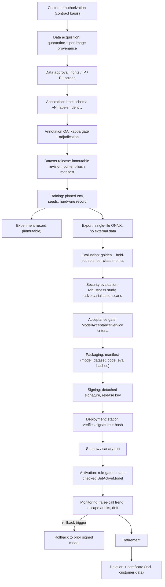

OpenAI/Codex and numerous other coding agents will review your output once you are done.

# AI/ML Security, Quality, and Defect Taxonomy — AOI Software Architecture, Secure Development, and Change-Control Standard, v1.0 (2026-07-15)

Scope: this volume owns global section §31 — the separated AI/ML lifecycles from data acquisition through deletion, dataset governance, ML security including the AI training-environment threat model, robustness and drift, the metrics mandate, reproducibility and provenance, MLOps, and the canonical defect taxonomy (D-17) — binding on every inspection engine type in AOI Monitor.

Supersedes/Related existing docs: `Docs/DATA_PIPELINE.md` remains as an operating procedure but its normative statements are superseded where they conflict with this volume; `Docs/ROADMAP.md`, `Docs/ARCHITECTURE.md`, and `AGENTS.md` remain authoritative for stage/evidence boundaries and the truthfulness contract and are compatible with this volume; the model state machine and activation sequence diagrams live in §19/VOL04.

## 31. AI/ML Security and Quality

This section governs how inspection intelligence — trained models, statistical learned references, and the fixed-algorithm pixel-difference baseline — is produced, proven, protected, deployed, watched, and withdrawn. It exists because the inspection verdict is the product's single safety- and money-bearing output: a silently degraded or tampered model ships defective boards to customers, and a noisy one halts their lines. Neighboring boundaries: model lifecycle *states and activation sequence* are diagrammed in §19/VOL04; generic file/serialization input rules in §29/VOL08 (the SER catalogue); package supply chain in §42/VOL15 (SUP); acceptance *test execution* mechanics in §39/VOL14 (TST); camera/lighting hardware controls in §32/VOL10 (CAM).

Terminology for adversarial ML follows NIST AI 100-2 E2025 §2 (Predictive AI taxonomy) and its appendix glossary [AI-100-2]. OWASP AISVS 1.0 chapters C1–C7, C11, C12 apply to this product; C8–C10 (vector DB, agents, MCP) are not applicable to a non-LLM computer-vision system [AISVS]. The OWASP ML Security Top 10 (v0.3 draft, 2023; freshness UNVERIFIED) is used only as an informative threat checklist, never as a requirements source [MLSTOP10]. NIST SP 800-218A is titled for generative/dual-use foundation models; its practice-level recommendations are written for AI model development generally and are adopted here as the analog baseline with that scope caveat recorded [SSDF-AI].

### 31.1 Scope: every engine type, not just "AI"

`InspectionEngineFactory` (`AOI_Monitor/Services/InspectionEngineFactory.cs:7-39`) registers three engine types: `pixel-difference` (`PixelDifferenceInspectionEngine`, the statistical default and fallback for unknown keys), `onnx` (`OnnxInspectionEngine`), and `learned-pcb-visual` (`LearnedPcbVisualInspectionEngine` wrapping `ImageOnlyPcbLearningService`). All three produce the same `AnalysisResult` consumed by the same disposition path. A tolerance-map regression in the learned-visual engine or a threshold edit in the pixel-difference baseline escapes a defective board exactly as an ONNX regression does. Section 31 therefore binds **all engine types, current and future**, including engines that contain no trained weights: the "model artifact" for the pixel-difference engine is its golden reference plus parameter set; for the learned-visual engine it is the learned reference, tolerance map, threshold map, and calibration record (`ImageOnlyPcbLearningService.WriteLearnedImageArtifacts`, `AOI_Monitor/Services/ImageOnlyPcbLearningService.cs:1124-1157`). Wherever this section says "model", read "the versioned artifact set that determines verdicts for an engine type".

Definitions used throughout §31:

- **Escape (false accept):** a defective board or region receiving an OK verdict. **False call (false reject at board level):** an OK board or region receiving an NG verdict.
- **Escape-critical class:** a defect class whose escape is contractually or functionally intolerable; the default set is Missing Component, Polarity Error, Solder Bridge, Partial Insertion, plus customer-designated classes.
- **Dataset revision:** an immutable, content-hash-manifested set of images and labels with split assignments.
- **Golden test set:** a change-controlled, hash-pinned evaluation set that persists across model generations to detect regressions.
- **Locked customer acceptance set:** a customer-agreed evaluation set frozen at contract signature and never used for training or tuning.
- **Gate dataset:** the dataset revision used by the acceptance gate (`ModelAcceptanceService.RunAcceptance`, `AOI_Monitor/Services/ModelAcceptanceService.cs:24-137`) for a release decision.

### 31.2 Separated lifecycles

The single largest process failure mode in ML-backed inspection is *lifecycle smearing*: labeling continues while training runs, evaluation data leaks into tuning, and "deployed" and "active" are the same click. This standard separates eighteen lifecycles. Each has entry criteria (what evidence must exist before the lifecycle starts), exit criteria (what evidence its completion stores), and exactly one owning role. A lifecycle instance that cannot show its exit evidence has not completed, whatever the calendar says.

Table 31-1 — Separated lifecycles, entry/exit criteria, owners:

| # | Lifecycle | Entry criteria | Exit criteria (stored evidence) | Owner |
|---|---|---|---|---|
| 1 | Data acquisition | Signed customer authorization; collection plan | Raw images in quarantine store, per-image provenance record | ML Lead |
| 2 | Data approval | Quarantined data with provenance | Rights/IP/PII screen recorded; approved-for-annotation set | Product Owner |
| 3 | Annotation | Approved set; released label-schema (taxonomy) version | All images labeled; labeler identity per label | ML Lead |
| 4 | Annotation QA | Completed annotation batch | Inter-rater agreement met; adjudication log; QA report | QA Lead |
| 5 | Dataset release | QA-passed labels; duplicate scan done | Immutable revision, content-hash manifest, split assignment | ML Lead |
| 6 | Training | Released dataset revision; pinned environment | Candidate weights; training log; seeds/env/hardware captured | ML Lead |
| 7 | Experiment tracking | Any training run starting | Immutable experiment record (params, seeds, metrics, hashes) | ML Lead |
| 8 | Evaluation | Exported single-file ONNX (or engine artifact set) | Metric report vs §31.7 thresholds on held-out + golden sets | QA Lead |
| 9 | Security evaluation | Evaluation-passed candidate | Robustness/adversarial/scan report signed by Security Lead | Security Lead |
| 10 | Approval | Evaluation + security reports attached | Recorded acceptance decision with criteria snapshot | Product Owner |
| 11 | Packaging | Approved candidate | Release package with manifest per §31.8 | Release Manager |
| 12 | Signing | Packaged artifact | Detached signature by release key; verification log | Release Manager |
| 13 | Deployment | Signed package | Package installed, signature verified, state `Staged` (pre-activation, inactive) | Release Manager |
| 14 | Activation | `Staged` model; acceptance PASS or unexpired audited waiver | State `Active`; canary/shadow plan started; audit event | ML Lead |
| 15 | Monitoring | Model active; monitoring plan | Continuous — exits only into rollback or retirement | QA Lead |
| 16 | Rollback | Trigger from monitoring plan met | Prior signed model active; incident record | Software Lead |
| 17 | Retirement | Retirement decision recorded | Model inactive, archived, blocked from activation | ML Lead |
| 18 | Deletion | Retention expiry or customer demand | Deletion certificate (artifact hashes, date, basis, approver) | Product Owner |

The repo already persists a nine-state model lifecycle (`ModelLifecycleState`, `AOI_Monitor/Models/InspectionModelConfiguration.cs:127-137`) with audited transitions in `ModelLifecycleService` — this standard keeps that machinery and aligns it to the twelve normative model states of §19/VOL04 (see AIM-003) rather than replacing it wholesale. The known bypass — `ModelRegistryService.SetActiveModel` admits `Registered` models with no acceptance run and carries no service-layer role check (`AOI_Monitor/Services/ModelRegistryService.cs:126-149`; repo-reality gap §9b-5) — is closed by AIM-011.

**Reading this diagram:** the flow runs top to bottom from customer authorization to deletion. Data-side lifecycles (acquisition, approval, annotation, annotation QA, dataset release) precede training; the training node forks into the immutable experiment record and the exported single-file ONNX artifact. Evaluation, security evaluation, and the acceptance gate are three distinct gates in series — a candidate that passes metrics can still fail the security evaluation. Packaging and signing happen before anything reaches a station; the station independently re-verifies the signature and hashes at deployment. Activation is reached only through the shadow/canary run, and the monitoring node has two exits: rollback (back to the prior signed model) or retirement, which is the only path into deletion. Every arrow crossing from one lifecycle to the next corresponds to the exit criteria of Table 31-1; provenance evidence accumulates left of each arrow and is enumerated in the signed manifest at the packaging step.

### R: Lifecycle machinery (AIM-001–AIM-016)

**[AIM-001]** (P1 | ALL | Inference, ModelMgmt, Decision)
Every inspection engine type registered in `InspectionEngineFactory` (`AOI_Monitor/Services/InspectionEngineFactory.cs:7-39`), including the non-ML `pixel-difference` baseline and the `learned-pcb-visual` statistical engine, SHALL be subject to the lifecycle, metric, robustness, and provenance requirements of §31 before its verdicts feed automatic disposition.
- Why: a threshold or reference-image change in a "simple" engine escapes defects exactly like an ML regression; scoping controls to "AI" leaves the default engine ungoverned. Maps: AI-RMF GOVERN 1.1; Internal.
- Verify: engine-onboarding checklist CHK-AIM-01; fitness function FF-AIM-ENG-01 diffs factory engine keys against acceptance-run records. Evidence: acceptance run per active engine key. Owner: ML Lead. Auto: Partially automated.
- Exception: Not allowed. Review: Per release.

**[AIM-002]** (P2 | ALL | Training, ModelMgmt)
Each of the eighteen lifecycles in Table 31-1 SHALL store its listed exit-criteria evidence in the model registry or dataset ledger before it is treated as complete (entry criteria are enumerated per lifecycle in Table 31-1).
- Why: lifecycle smearing (labeling during training, tuning on test data) is the root cause of optimistic metrics and untraceable releases. Maps: SSDF-AI PS.3.1; AI-RMF MAP 1; 62443-4-1 SM-1.
- Verify: release-audit checklist CHK-AIM-02 walks one release end-to-end against Table 31-1. Evidence: lifecycle evidence index in the release package. Owner: QA Lead. Auto: Manual review.
- Exception: Allowed — approver: Software Architect. Review: Per release.

**[AIM-003]** (P3 | ALL | ModelMgmt, Persistence)
The persisted model lifecycle state machine (`ModelLifecycleState`, `AOI_Monitor/Models/InspectionModelConfiguration.cs:127-137`) SHALL be migrated to the twelve normative model states defined in §19/VOL04, applying that section's state-migration mapping, so every Table 31-1 boundary is observable in the database.
- Why: states that exist only in people's heads cannot be audited or gated; today deployment and canary are indistinguishable from full activation. Maps: AISVS C3; Internal.
- Verify: xUnit suite ModelLifecycleStateTests (state-transition matrix). Evidence: CI test log; schema migration record. Owner: Software Lead. Auto: Fully automated.
- Exception: Allowed — approver: Software Architect. Review: Annual.

**[AIM-004]** (P2 | ALL | ModelMgmt, IAM)
The person recording the approval decision for a model version SHALL NOT be the person who activates that model version on a production station unless the solo-developer compensating control of §7/VOL01 is recorded for that release.
- Why: a single actor approving and activating defeats the gate; the current small-team reality demands the documented self-review + cooling-period control instead of silence. Maps: 62443-4-1 SM-7; SSDF PO.2; AI-RMF GOVERN 2.
- Verify: audit-trail query FF-AIM-SOD-01 compares approver and activator identities per model version. Evidence: audit rows for approval and activation events. Owner: QA Lead. Auto: Partially automated.
- Exception: Allowed — approver: Product Owner. Review: Per release.

**[AIM-005]** (P2 | ALL | Audit, ModelMgmt)
Every lifecycle transition SHALL write an audit event carrying actor identity, acting role, model ID, prior state, new state, and justification, extending the existing `MODEL_REGISTRY`/`MODEL_LIFECYCLE`/`MODEL_DEPLOYMENT` event family.
- Why: the repo already audits transitions consistently (`ModelLifecycleService`); codifying prevents regression and adds the prior-state field that reconstruction of incidents needs. Maps: AISVS C12; 62443-4-2 CR 2.8; SSDF-AI RV.1.1.
- Verify: xUnit suite ModelLifecycleAuditTests asserts event content per transition. Evidence: CI test log; audit rows. Owner: Software Lead. Auto: Fully automated.
- Exception: Not allowed. Review: Annual.

**[AIM-006]** (P1 | ALL | Training)
Training runs SHALL consume only released, immutable dataset revisions whose content-hash manifest verifies at run start.
- Why: training on a mutable folder makes the resulting model untraceable to its data and lets poisoned or accidental edits enter silently. Maps: AISVS 1.1.3; SSDF-AI PW.4.1; AI-100-2 §2.3.
- Verify: training-pipeline preflight FF-AIM-DSVERIFY-01 (manifest hash check, hard fail). Evidence: training log with verified manifest hash. Owner: ML Lead. Auto: Fully automated.
- Exception: Not allowed. Review: Per release.

**[AIM-007]** (P2 | ALL | Training)
Every training run SHALL produce an experiment record containing run ID, dataset revision, hyperparameters, seeds, code revision, environment lockfile hash, start/end time, and resulting artifact hashes.
- Why: without an immutable run record, no released model can be traced back or reproduced; the current `Scripts/ml/train_patchcore.py` records none of this. Maps: SSDF-AI PS.3.1; AI-RMF MEASURE 2.7; AISVS C3.
- Verify: schema validation of experiment records in CI (FF-AIM-EXP-01). Evidence: experiment record per run in the training ledger. Owner: ML Lead. Auto: Fully automated.
- Exception: Allowed — approver: ML Lead. Review: Quarterly.

**[AIM-008]** (P2 | ALL | ModelMgmt)
A model candidate SHALL enter the approval lifecycle only with a completed evaluation report and a completed security-evaluation report attached to its registry entry.
- Why: approval on partial evidence is how conditional prototypes become de-facto production models. Maps: AI-RMF MANAGE 1.2; AISVS C3; SSDF-AI PW.4.4.
- Verify: service-layer precondition test in xUnit suite ModelApprovalPreconditionTests. Evidence: CI test log; registry entries with report references. Owner: Software Lead. Auto: Fully automated.
- Exception: Not allowed. Review: Per release.

**[AIM-009]** (P1 | ALL | ModelMgmt)
The security-evaluation lifecycle SHALL be completed and recorded separately from functional evaluation, with sign-off by the Security Lead, before a model candidate can be approved.
- Why: robustness and adversarial behavior are orthogonal to accuracy; a single combined gate lets metric pressure crowd out security findings. Maps: AI-RMF MEASURE 2.7; AISVS C11; AITG-MOD-01.
- Verify: review checklist CHK-AIM-SEC-01 with named sign-off. Evidence: security-evaluation report with signature in release package. Owner: Security Lead. Auto: Manual review.
- Exception: Allowed — approver: Security Lead. Review: Per release.

**[AIM-010]** (P3 | ALL | ModelMgmt)
Only the latest acceptance run for a model SHALL be promotable to production candidate, preserving the latest-run-only check in `ModelLifecycleService.PromoteProductionCandidate` (`AOI_Monitor/Services/ModelLifecycleService.cs:61-82`).
- Why: promoting a stale PASS run after a newer FAIL is metric shopping; the repo already blocks it and this codifies the behavior against regression. Maps: Internal; AISVS C3.
- Verify: existing lifecycle coverage in AoiDatabaseTests plus dedicated case in ModelLifecycleStateTests. Evidence: CI test log. Owner: Software Lead. Auto: Fully automated.
- Exception: Not allowed. Review: Annual.

**[AIM-011]** (P0 | ALL | ModelMgmt, IAM)
`ModelRegistryService.SetActiveModel` (`AOI_Monitor/Services/ModelRegistryService.cs:126-149`) SHALL enforce, inside the service layer, both a role-authorization check and a lifecycle-state check admitting only models in `Staged` state (the pre-activation, inactive state of §19/VOL04) or under an unexpired audited waiver.
- Why: today only `Retired`/`AcceptanceFailed` are blocked and no role check exists, so any code path can bypass the acceptance gate entirely (repo-reality gap §9b-5). Maps: AISVS C5; 62443-4-2 CR 2.1; SSDF-AI PS.1.1.
- Verify: new xUnit suite ModelActivationAuthorizationTests (Operator denied; a non-`Staged` state such as `Candidate` denied; waiver path audited). Evidence: CI test log. Owner: Software Lead. Auto: Fully automated.
- Exception: Not allowed. Review: Per release.

**[AIM-012]** (P2 | ALL | ModelMgmt, Inference)
An expired deployment waiver SHALL force the affected model to the inspection-blocked `Degraded` state at the next self-test pass, per §19/VOL04, instead of remaining a readiness warning (`AOI_Monitor/Services/FactoryReadinessService.cs:410-416`).
- Why: an advisory-only expiry means a "temporary" waiver is permanent in practice; forcing the model to the inspection-blocked `Degraded` state at the next self-test pass — the enforcement point and outcome owned by §19/VOL04 — closes the hole without mid-cycle disruption. Maps: AISVS C3; AI-RMF MANAGE 2.4; Internal.
- Verify: xUnit case in ModelActivationAuthorizationTests simulating an expired waiver. Evidence: CI test log; audit `Degraded`-transition event. Owner: Software Lead. Auto: Fully automated.
- Exception: Allowed — approver: Product Owner. Review: Per release.

**[AIM-013]** (P2 | S2+ | ModelMgmt, Diagnostics)
Every model SHALL have, at activation time, a monitoring plan naming its production metrics, alert thresholds, alert recipients, and review cadence per §31.9.
- Why: activation without a watch plan converts every drift or regression into a customer-discovered escape. Maps: AI-RMF MANAGE 4.1; SSDF-AI RV.1.1; AISVS C12.
- Verify: activation precondition check FF-AIM-MON-01 (plan reference required on activation record). Evidence: monitoring plan linked from the registry entry. Owner: QA Lead. Auto: Partially automated.
- Exception: Allowed — approver: QA Lead. Review: Quarterly.

**[AIM-014]** (P1 | ALL | ModelMgmt, Update)
The previously accepted model package SHALL remain installed and activatable offline so a rollback completes within 15 minutes without network access.
- Why: stations are air-gap-capable (D-08); a rollback that needs a download or an engineer visit turns a model regression into a line-down event. Maps: SSDF-AI RV.2.2; AI-RMF MANAGE 2.4; Internal.
- Verify: timed rollback drill per release (see AIM-105). Evidence: drill record with elapsed time. Owner: Release Manager. Auto: Manual review.
- Exception: Allowed — approver: Release Manager. Review: Per release.

**[AIM-015]** (P2 | ALL | ModelMgmt)
A retired model SHALL NOT be re-activatable without a new registration and a new acceptance run.
- Why: retirement must be terminal, or it becomes a parking state for models that quietly return without re-proof; the repo blocks Retired activation and this extends the block to re-registration paths. Maps: AISVS C3; AI-RMF MANAGE 2.4.
- Verify: xUnit case in ModelActivationAuthorizationTests (retired model re-activation denied). Evidence: CI test log. Owner: Software Lead. Auto: Fully automated.
- Exception: Not allowed. Review: Annual.

**[AIM-016]** (P2 | ALL | ModelMgmt, Persistence)
The deletion lifecycle SHALL produce a deletion certificate enumerating the deleted artifacts by SHA-256, the deletion date, the contractual basis, and the approving role.
- Why: customer-data deletion obligations (contract, PIPA, GDPR) are unprovable without an artifact-level record of what was destroyed and when. Maps: GDPR; PIPA; SSDF-AI PS.3.1.
- Verify: deletion-procedure checklist CHK-AIM-DEL-01; certificate schema validated by FF-AIM-DEL-01. Evidence: deletion certificate in the compliance ledger. Owner: Product Owner. Auto: Partially automated.
- Exception: Not allowed. Review: Annual.

### 31.3 Dataset governance

Customer board images are customer intellectual property first and training data second. Every dataset obligation below exists to answer four questions at any time, for any released model: *whose data is in it, who said we could use it, who labeled it and how well, and could the evaluation have seen the training data?* The current repo hashes only the dataset folder name plus the ground-truth CSV (`ModelAcceptanceService.DatasetHash`, `AOI_Monitor/Services/ModelAcceptanceService.cs:348-352`), which means substituting every image in an evaluation set is undetectable — AIM-034 replaces that with content hashing. Split leakage is the second silent killer: two photographs of the same physical board in train and test inflate every metric; grouped splits by board, lot, and site (AIM-028/029) plus near-duplicate detection (AIM-027) are the defenses. The existing even/odd held-out calibration split in `ImageOnlyPcbLearningService.Calibrate` (`AOI_Monitor/Services/ImageOnlyPcbLearningService.cs:227-308`) avoids threshold-selection bias and is kept; it does not, however, substitute for board-level isolation.

### R: Dataset governance (AIM-017–AIM-036)

**[AIM-017]** (P2 | ALL | Training, Persistence)
Every training, validation, and test image SHALL have a provenance record written at ingest containing source customer, production line, lot, board serial where available, capture timestamp, acquiring operator or system, and ingest content hash.
- Why: unattributed images cannot be authorized, segregated, deleted, or investigated after a poisoning suspicion. Maps: AISVS 1.1.2; SSDF-AI PS.3.2; AI-RMF MAP 2.
- Verify: ingest-schema validation FF-AIM-PROV-01 rejects records with missing mandatory fields. Evidence: provenance ledger rows per dataset revision. Owner: ML Lead. Auto: Fully automated.
- Exception: Allowed — approver: ML Lead. Review: Quarterly.

**[AIM-018]** (P0 | ALL | Training, Licensing)
Customer-supplied images SHALL be used for model training only under the written authorization required by the privacy catalogue (§46/VOL16), whose reference is stored on the dataset revision.
- Why: training on customer IP without a lawful basis is a breach exposure that no engineering control can remediate after the fact; the privacy catalogue owns the authorization/consent rule and this stores its reference as the AI-side dataset hook. Maps: GDPR; PIPA; Internal.
- Verify: dataset-release checklist CHK-AIM-AUTH-01 (authorization reference mandatory); FF-AIM-PROV-02 blocks release without it. Evidence: contract reference on the dataset-release record. Owner: Product Owner. Auto: Partially automated.
- Exception: Not allowed. Review: Annual.

**[AIM-019]** (P1 | ALL | Training, Persistence)
Datasets and models derived from one customer's images SHALL be segregated per customer in storage and excluded from any other customer's training or delivery unless a written cross-use authorization exists.
- Why: cross-customer contamination leaks board designs (IP) between competitors and creates membership-inference exposure. Maps: GDPR; PIPA; AI-100-2 §2.4.2.
- Verify: storage-layout audit FF-AIM-SEG-01 (per-customer roots); release checklist cross-use check. Evidence: storage audit report; dataset lineage records. Owner: ML Lead. Auto: Partially automated.
- Exception: Allowed — approver: Product Owner. Review: Annual.

**[AIM-020]** (P0 | ALL | Training, Export)
Personnel and pipelines SHALL NOT upload customer images, labels, dataset archives, or models trained on them to any external or consumer AI service, hosted model hub, or third-party cloud analysis API.
- Why: a single upload irreversibly exfiltrates customer IP outside every contractual and technical control; consumer AI services may retain and train on submissions. Maps: GDPR; PIPA; SSDF-AI PS.1.1.
- Verify: policy attestation per release; egress review of training-environment network configuration (CHK-AIM-EGRESS-01). Evidence: signed attestation; environment network config. Owner: Security Lead. Auto: Manual review.
- Exception: Not allowed. Review: Annual.

**[AIM-021]** (P2 | ALL | Training)
Every label SHALL record the labeler's identity, the labeling-tool version, and the label timestamp.
- Why: label poisoning and systematic labeler error are undetectable and unattributable without per-label identity. Maps: AISVS 1.2.1; AI-100-2 §2.3.2.
- Verify: label-schema validation FF-AIM-LBL-01. Evidence: label records in the dataset revision. Owner: ML Lead. Auto: Fully automated.
- Exception: Allowed — approver: ML Lead. Review: Quarterly.

**[AIM-022]** (P2 | ALL | Training)
Every label of an escape-critical class, and a random sample of at least 10 % of all other labels, SHALL receive independent second-person review before dataset release.
- Why: unreviewed labels on critical classes convert one labeler's mistake into a trained-in escape; sampling bounds cost on non-critical classes. Maps: AISVS 1.2.1; AI-RMF MEASURE 2.
- Verify: annotation-QA report fields checked by FF-AIM-LBL-02 (review coverage computation). Evidence: QA report per dataset release. Owner: QA Lead. Auto: Partially automated.
- Exception: Allowed — approver: QA Lead. Review: Per release.

**[AIM-023]** (P2 | ALL | Training, Taxonomy)
Every label SHALL reference the taxonomy version (label-schema version) it was created against.
- Why: labels without schema versions become uninterpretable after any taxonomy change; migration (AIM-115) depends on this reference. Maps: AISVS 1.1.2; Internal.
- Verify: label-schema validation FF-AIM-LBL-01. Evidence: label records carrying taxonomy version. Owner: ML Lead. Auto: Fully automated.
- Exception: Not allowed. Review: On change.

**[AIM-024]** (P2 | ALL | Training)
Each dataset release SHALL include an inter-rater agreement measurement of at least Cohen's kappa 0.75 computed on a double-labeled sample of at least 200 images (ASSUMPTION A-VOL09-2).
- Why: low agreement means the label boundary itself is undefined, so model metrics against those labels are noise; kappa corrects for chance agreement where raw percent agreement does not. Maps: AISVS 1.2.1; AI-RMF MEASURE 2; Internal.
- Verify: QA report computation reviewed; FF-AIM-KAPPA-01 recomputes kappa from the double-labeled sample. Evidence: kappa value + sample in the dataset-release record. Owner: QA Lead. Auto: Partially automated.
- Exception: Allowed — approver: QA Lead. Review: Per release.

**[AIM-025]** (P2 | ALL | Training)
Images whose class cannot be agreed in review SHALL be labeled with the explicit Ambiguous marker, routed to adjudication, and excluded from training targets until adjudicated.
- Why: silently mapping ambiguous cases to OK teaches the model that borderline defects pass; ambiguity is data, not noise to discard. Maps: AISVS 1.2.1; AI-RMF MAP 2; Internal.
- Verify: FF-AIM-LBL-03 asserts no Ambiguous-marked labels appear in training splits. Evidence: dataset-release manifest split listing. Owner: ML Lead. Auto: Fully automated.
- Exception: Not allowed. Review: Per release.

**[AIM-026]** (P2 | ALL | Training)
Dataset release SHALL detect exact duplicates by content hash and collapse each duplicate group to a single instance with one split assignment.
- Why: duplicated images inflate sample counts and, when straddling splits, leak training data into evaluation verbatim. Maps: AISVS 1.1.4; Internal.
- Verify: FF-AIM-DUP-01 (hash-based duplicate scan in the release pipeline). Evidence: duplicate-scan section of the release manifest. Owner: ML Lead. Auto: Fully automated.
- Exception: Not allowed. Review: Per release.

**[AIM-027]** (P2 | ALL | Training)
Dataset release SHALL run near-duplicate detection (perceptual-hash similarity at a recorded threshold) and place every near-duplicate group entirely inside a single split.
- Why: consecutive captures of the same board differ by pixels only; a near-duplicate in test measures memorization, not generalization. Maps: AISVS 1.1.4; AITG-DAT-03; Internal.
- Verify: FF-AIM-DUP-02 (perceptual-hash scan, threshold recorded in manifest). Evidence: near-duplicate report in the release manifest. Owner: ML Lead. Auto: Fully automated.
- Exception: Allowed — approver: ML Lead. Review: Per release.

**[AIM-028]** (P1 | ALL | Training)
Images of the same physical board (same board serial or, absent serials, same panel/carrier identity) SHALL be assigned entirely to a single split.
- Why: board-level leakage is the most common source of inflated AOI metrics — the model recognizes the board, not the defect. Maps: AITG-DAT-03; AI-RMF MEASURE 2.7; Internal.
- Verify: FF-AIM-SPLIT-01 (group-by-board split audit at release). Evidence: split-isolation report in the release manifest. Owner: ML Lead. Auto: Fully automated.
- Exception: Not allowed. Review: Per release.

**[AIM-029]** (P3 | ALL | Training)
Split assignment SHALL use grouped sampling by lot and capture site, with the resulting per-lot and per-site composition recorded in the release manifest.
- Why: lot- and site-correlated artifacts (paste batch, lighting rig) leak across naive random splits and hide generalization failure to new lots/sites. Maps: AITG-DAT-03; Internal.
- Verify: FF-AIM-SPLIT-02 (composition report generation + review). Evidence: composition tables in the release manifest. Owner: ML Lead. Auto: Partially automated.
- Exception: Allowed — approver: ML Lead. Review: Per release.

**[AIM-030]** (P3 | ALL | Training)
Evaluation splits SHOULD consist of images captured after the latest training-split capture timestamp, with any deviation and its reason recorded in the dataset-release record.
- Why: temporal leakage (future process states informing training) overstates real-world performance where lines drift over time; a forward-in-time test is the honest simulation of deployment. Maps: AITG-MOD-06; Internal.
- Verify: FF-AIM-SPLIT-03 compares capture-time spans per split from provenance records. Evidence: capture-time span table in the release manifest. Owner: ML Lead. Auto: Fully automated.
- Exception: Allowed — approver: QA Lead. Review: Per release.

**[AIM-031]** (P1 | ALL | Training)
The test split SHALL NOT be used for threshold selection, hyperparameter tuning, or any decision other than the final gate evaluation of a candidate.
- Why: every tuning glance at the test split silently converts it into a validation split and voids the gate's statistical meaning. Maps: AI-RMF MEASURE 2.7; AITG-MOD-06; Internal.
- Verify: experiment-record audit FF-AIM-SPLIT-04 (test-split access count per candidate); training-pipeline code review. Evidence: experiment records; review minutes. Owner: QA Lead. Auto: Partially automated.
- Exception: Not allowed. Review: Per release.

**[AIM-032]** (P2 | ALL | Training, ModelMgmt)
A version-controlled, content-hash-pinned golden test set SHALL be maintained per supported PCB model family under the change-control process of the CHG catalogue (§48–53/VOL17).
- Why: without a stable cross-generation benchmark, regressions hide inside dataset churn — every model is measured against a different ruler. Maps: AISVS C3; AI-RMF MEASURE 2; Internal.
- Verify: golden-set registry check FF-AIM-GOLD-01 (hash pin + change history). Evidence: golden-set manifest with change log. Owner: QA Lead. Auto: Partially automated.
- Exception: Allowed — approver: QA Lead. Review: On change.

**[AIM-033]** (P1 | ALL | Training)
The customer acceptance dataset SHALL be frozen by content hash at contract signature and excluded from all training, tuning, and calibration activities.
- Why: an acceptance set the vendor can train on proves nothing to the customer and invites acceptance disputes (SD-06 lineage). Maps: AI-RMF MEASURE 2.7; Internal.
- Verify: FF-AIM-LOCK-01 asserts acceptance-set hashes never appear in any training-split manifest. Evidence: lock record + exclusion scan per release. Owner: Product Owner. Auto: Fully automated.
- Exception: Not allowed. Review: Per release.

**[AIM-034]** (P1 | ALL | Training, Persistence)
The dataset-revision hash SHALL be computed as a manifest of per-file SHA-256 content hashes over every image and label file plus the hash of that manifest, replacing the folder-name-plus-CSV hash in `ModelAcceptanceService.DatasetHash` (`AOI_Monitor/Services/ModelAcceptanceService.cs:348-352`).
- Why: the current hash covers only the folder name and CSV, so wholesale image substitution in a gate dataset is undetectable — the headline provenance field is currently misleading. Maps: AISVS 1.1.3; SSDF-AI PS.2.1; CWE-345.
- Verify: xUnit suite DatasetContentHashTests (image substitution changes the hash). Evidence: CI test log; release manifests carrying the new hash schema. Owner: Software Lead. Auto: Fully automated.
- Exception: Not allowed. Review: Per release.

**[AIM-035]** (P2 | ALL | Training, IAM)
Write access to released dataset revisions SHALL be restricted to the dataset-release role, with every modification attempt logged.
- Why: a released revision that anyone can edit is not a revision; poisoning and accidental corruption both enter through open write access. Maps: AISVS 1.1.3; SSDF-AI PS.1.1; 62443-4-2 CR 2.1.
- Verify: ACL audit CHK-AIM-ACL-01 on the dataset store; log-presence check. Evidence: ACL report; access log samples. Owner: Security Lead. Auto: Partially automated.
- Exception: Allowed — approver: Security Lead. Review: Quarterly.

**[AIM-036]** (P3 | ALL | Training, Persistence)
Every dataset revision SHALL record the owning customer and contract identifier so per-customer deletion obligations (§31.9) are executable without manual reconstruction.
- Why: deletion demands arrive years after ingest; without a recorded mapping, honoring them requires forensic archaeology and risks over- or under-deletion. Maps: GDPR; PIPA; Internal.
- Verify: FF-AIM-PROV-03 (mandatory owner/contract fields on release records). Evidence: dataset ledger rows. Owner: Product Owner. Auto: Fully automated.
- Exception: Allowed — approver: Product Owner. Review: Annual.

### 31.4 ML security and the AI training-environment threat model

Attack vocabulary follows NIST AI 100-2 E2025 §2 (Predictive AI): **evasion** (§2.2 — perturbed or crafted inputs at inference, including real-world/physical patches §2.2.4), **poisoning** (§2.3 — availability, targeted, and backdoor poisoning §2.3.3, plus model poisoning §2.3.4), and **privacy attacks** (§2.4 — data reconstruction, membership inference, property inference, and model extraction §2.4.4) [AI-100-2]. For this product the highest-likelihood surface is not the deployed station but the **offline training environment**: the image and label stores, the Python pipeline (`Scripts/ml/`), pretrained backbone downloads (PatchCore uses a `resnet18` backbone, `Scripts/ml/train_patchcore.py`), and the export/packaging step. A backdoor poisoned into training data (a trigger pattern that makes defective boards classify as pass) survives every downstream signature check, because signing certifies provenance, not innocence — which is why dataset controls (§31.3) and this threat model are gates of their own.

Realistic severity calibration, stated plainly: query-based model extraction and adversarial-example evasion require either network query access (absent before Stage 4) or physical process access; they are moderate risks. Training-data and label poisoning, dependency compromise, and unsafe deserialization are the risks that current repo reality leaves open and that this section closes. Scanner tooling (picklescan, modelscan) has a documented bypass history (four CVEs in 2025) and is detection-in-depth only — the preventive boundary is format prohibition (D-03, §31.5) [PT-SEC].

Table 31-2 — STRIDE threat model of the AI training environment:

| STRIDE class | Threat scenario | Primary asset | Treated by |
|---|---|---|---|
| Spoofing | Labeler identity spoofed; labels submitted as another person | Label store | AIM-021, AIM-035, IAM catalogue (§28/VOL07) |
| Spoofing | Forged "released" dataset folder consumed by training | Dataset revisions | AIM-006, AIM-034 |
| Tampering | Poisoned/backdoored images or labels inserted pre-release | Image + label stores | AIM-035, AIM-039, AIM-040 |
| Tampering | Malicious pretrained backbone or tampered download | Backbone cache | AIM-041, AIM-042 |
| Tampering | Training code or dependency compromise (PyPI attack) | Python pipeline | AIM-048, AIM-049, AIM-050 |
| Repudiation | Label or dataset change with no attributable actor | Label store, ledger | AIM-021, AIM-035, AIM-005 |
| Info. disclosure | Customer board imagery exfiltrated (upload, theft, model inversion) | Images, models | AIM-019, AIM-020, AIM-045, AIM-048 |
| Denial of service | Dataset/artifact store corrupted or encrypted (ransomware) | All training stores | AIM-050, backup rules §37/VOL05 |
| Elevation of privilege | Pickle/checkpoint deserialization executes code in the pipeline | Training workstation | AIM-054, AIM-056, AIM-057, AIM-052 |
| Elevation of privilege | Compromised training host reaches signing or production assets | Signing keys, stations | AIM-038, D-12 key custody (§43/VOL15) |

The table is normative input to the training-environment threat model document required by AIM-037: every row must appear there with its current risk rating and control status. Rows are deliberately phrased as scenarios, not CVEs — the model is reviewed when architecture changes (new pipeline host, new framework, network exposure of inference), not merely when a CVE lands.

### R: ML security (AIM-037–AIM-053)

**[AIM-037]** (P1 | ALL | Training)
A threat model of the training environment covering every row of Table 31-2 SHALL be maintained and re-reviewed at least annually and on any pipeline architecture change.
- Why: the training environment is the least-hardened, highest-leverage attack surface; an unmaintained threat model decays into a compliance ornament. Maps: AI-100-2 §2.1; SSDF PO.5; 62443-4-1 SR-2.
- Verify: threat-model document review CHK-AIM-TM-01 with row-by-row coverage check. Evidence: versioned threat-model document with review dates. Owner: Security Lead. Auto: Manual review.
- Exception: Allowed — approver: Security Lead. Review: Annual.

**[AIM-038]** (P2 | ALL | Training)
Model training SHALL run only on designated engineering machines that hold no production-station credentials, per D-01's confinement of Python to the offline pipeline.
- Why: a compromised training host must not be a pivot into production stations; Python and its dependency surface stay off the shop floor by decision D-01. Maps: SSDF-AI PO.3.2; 62443-3-3 SR 5.1; AI-100-2 §2.3.
- Verify: environment inventory check CHK-AIM-ENV-01 (designated hosts, credential scope). Evidence: training-host inventory; credential audit. Owner: Security Lead. Auto: Manual review.
- Exception: Allowed — approver: Security Lead. Review: Annual.

**[AIM-039]** (P2 | ALL | Training)
Dataset release SHALL include an ingest-anomaly screen consisting of a per-class outlier scan and a per-source contribution report, both recorded in the release manifest.
- Why: availability and targeted poisoning enter through skewed or outlier contributions; a per-source report makes a single compromised feed visible before training. Maps: AI-100-2 §2.3; AISVS 1.3.1; AITG-MOD-03.
- Verify: FF-AIM-POISON-01 (screen execution + manifest fields). Evidence: anomaly-screen section of the release manifest. Owner: ML Lead. Auto: Fully automated.
- Exception: Allowed — approver: Security Lead. Review: Per release.

**[AIM-040]** (P3 | ALL | Training, Audit)
Label modifications after annotation QA SHALL invalidate the batch's QA status and re-enter the annotation-QA lifecycle before the labels are releasable.
- Why: post-QA edits are the cheapest label-poisoning path and also the most common honest-mistake path; both are caught by forcing re-QA. Maps: AISVS 1.2.2; AI-100-2 §2.3.2.
- Verify: xUnit suite LabelStoreIntegrityTests (post-QA edit flips status). Evidence: CI test log; label-batch status history. Owner: Software Lead. Auto: Fully automated.
- Exception: Not allowed. Review: Per release.

**[AIM-041]** (P2 | ALL | Training)
Every externally sourced pretrained backbone or model SHALL pass a recorded acquisition check — allowlisted source, pinned content hash, license identification — before first use in training.
- Why: tampered or trojaned pretrained weights import a backdoor into every model fine-tuned from them (transfer-learning attack); hash pinning also defeats silent upstream replacement. Maps: SSDF-AI PW.4.4; AI-100-2 §3.2.2; AISVS C6.
- Verify: acquisition-record check FF-AIM-PRETRAIN-01 in the training preflight. Evidence: acquisition records referenced by experiment records. Owner: ML Lead. Auto: Partially automated.
- Exception: Allowed — approver: Security Lead. Review: Per release.

**[AIM-042]** (P2 | ALL | Training, ModelMgmt)
Candidates fine-tuned from externally sourced weights SHALL be tested for class-selective anomalies via per-class metric deltas against the previous accepted model, with results recorded in the security-evaluation report.
- Why: backdoors typically manifest as anomalous behavior confined to one class or trigger condition while aggregate metrics look normal (AI 100-2 §2.3.3). Maps: AI-100-2 §2.3.3; AITG-MOD-03; AISVS C6.
- Verify: security-evaluation template section BKD-01 computed by the evaluation pipeline. Evidence: per-class delta table in the security-evaluation report. Owner: Security Lead. Auto: Partially automated.
- Exception: Allowed — approver: Security Lead. Review: Per release.

**[AIM-043]** (P2 | ALL | Training, ModelMgmt)
The security evaluation SHALL execute a version-controlled adversarial test suite containing, at minimum, bounded pixel-perturbation attacks and localized patch overlays on defect regions of gate-dataset images.
- Why: evasion robustness is unmeasured today; a version-controlled suite makes robustness regressions between model generations visible and comparable. Maps: AISVS 11.1.2; AITG-MOD-01; AI-100-2 §2.2.
- Verify: suite execution log FF-AIM-ADV-01 (suite version + results archived per candidate). Evidence: adversarial-suite report in the security evaluation. Owner: Security Lead. Auto: Fully automated.
- Exception: Allowed — approver: Security Lead. Review: Per release.

**[AIM-044]** (P3 | S2+ | Inference)
The Stage 2+ security risk assessment SHALL document physical-evasion scenarios (crafted board appearance, marker stickers, deliberate fixture contamination) with their process-level countermeasures and residual risk rating.
- Why: physical adversarial patches are the realistic form of evasion on a factory floor (AI 100-2 §2.2.4); the countermeasures are procedural (incoming inspection, camera coverage), so they must be recorded, not coded. Maps: AI-100-2 §2.2.4; AITG-MOD-01.
- Verify: risk-assessment review CHK-AIM-PHYS-01. Evidence: risk-assessment section with scenario table. Owner: Security Lead. Auto: Manual review.
- Exception: Allowed — approver: Security Lead. Review: Annual.

**[AIM-045]** (P2 | ALL | ModelMgmt, Persistence)
Model artifacts and manifests at rest SHALL be protected by least-privilege ACLs restricting write access to the model-management service context, with modifications audited.
- Why: model files are both product IP (theft target) and verdict-determining code (tampering target); today anyone who can write `{StorageRoot}/model_registry/` swaps model bytes undetected. Maps: SSDF-AI PS.1.1; AISVS C6; 62443-4-2 CR 2.1.
- Verify: ACL audit CHK-AIM-ACL-02; tamper test in xUnit suite ModelIntegrityReverificationTests. Evidence: ACL report; CI test log. Owner: Security Lead. Auto: Partially automated.
- Exception: Allowed — approver: Security Lead. Review: Quarterly.

**[AIM-046]** (P2 | S4 | MES, REST)
Any Stage 4 network interface exposing inference or model outputs SHALL enforce per-client authentication before go-live; rate limiting and query logging for that interface are governed by the security-architecture and identity catalogues (§27–28/VOL07) and the logging/audit catalogue (§38/VOL13).
- Why: query access enables model extraction and black-box evasion search (AI 100-2 §2.4.4, §2.2.2); authentication is cheap before exposure and impossible to retrofit after cloning. Maps: AI-100-2 §2.4.4; AISVS 11.3; 62443-3-3 SR 1.1.
- Verify: interface security review CHK-AIM-API-01 confirming per-client authentication before go-live. Evidence: review record; authentication test log. Owner: Security Lead. Auto: Partially automated.
- Exception: Allowed — approver: Security Lead. Review: Per release.

**[AIM-047]** (P3 | S4 | MES)
MES and REST result payloads SHOULD carry verdict, defect class, and severity rather than full per-class probability vectors unless a contract explicitly requires the raw scores.
- Why: full probability vectors materially accelerate extraction and membership-inference attacks while adding no value to disposition (AI 100-2 §2.4.5 output-limiting mitigation). Maps: AI-100-2 §2.4.5; AISVS 11.3.
- Verify: payload-schema review CHK-AIM-API-02. Evidence: MES payload schema definitions. Owner: Software Lead. Auto: Manual review.
- Exception: Allowed — approver: Product Owner. Review: On change.

**[AIM-048]** (P2 | ALL | Training)
A privacy assessment covering membership inference and training-image reconstruction risk SHALL be recorded before a model trained on one customer's images is delivered to any party other than that customer.
- Why: model inversion can leak proprietary board layouts to a competitor; the assessment forces the cross-delivery decision to be explicit and owned. Maps: AI-100-2 §2.4.1; AITG-MOD-04; GDPR.
- Verify: delivery checklist CHK-AIM-PRIV-01 (assessment reference mandatory). Evidence: privacy-assessment record linked to the delivery. Owner: Product Owner. Auto: Manual review.
- Exception: Allowed — approver: Product Owner. Review: Per release.

**[AIM-049]** (P1 | ALL | Training, CI)
Training-pipeline code under `Scripts/ml/` SHALL be subject to the same pull-request review and CI gates as production code per the CHG catalogue (§48–53/VOL17).
- Why: training code determines what ships in the model; today `train_patchcore.py` has hardcoded `C:\AOI\ml` paths and no pinned dependencies, evidencing an ungoverned path. Maps: SSDF-AI PO.3.2; SSDF PW.7; SLSA.
- Verify: branch-protection and CI-scope configuration check FF-AIM-CI-01. Evidence: CI runs on `Scripts/ml/` changes. Owner: Software Lead. Auto: Fully automated.
- Exception: Not allowed. Review: Per release.

**[AIM-050]** (P2 | ALL | Training, CI)
The training environment SHALL install Python dependencies only from a hash-verified lockfile (pip `--require-hashes` or a uv lockfile) that pins PyTorch at version 2.6 or later, per D-07.
- Why: PyPI supply-chain compromise of an ML dependency executes attacker code exactly where datasets, backbones, and export live; the PyTorch ≥2.6 pin also guarantees the restricted-unpickler `weights_only=True` load default (released 2025-01-29) that AIM-056 lints against being reopened. Maps: SSDF-AI PO.3.2; SLSA; 800-161.
- Verify: FF-AIM-DEP-01 (CI fails on unpinned or hash-less installs, or a pinned PyTorch below 2.6, in pipeline setup). Evidence: lockfile in repo; CI gate log. Owner: ML Lead. Auto: Fully automated.
- Exception: Not allowed. Review: Per release.

**[AIM-051]** (P3 | ALL | Training, Diagnostics)
Dataset stores, label stores, and model-artifact stores in the training environment SHALL have file-integrity and access logging enabled, reviewed at least weekly.
- Why: SP 800-218A PO.5.3 requires continuous monitoring of environments hosting models and datasets; unlogged stores make poisoning forensically invisible. Maps: SSDF-AI PO.5.3; AISVS C12.
- Verify: logging-configuration audit CHK-AIM-LOG-01; review-log sampling. Evidence: monitoring configuration; weekly review notes. Owner: Security Lead. Auto: Partially automated.
- Exception: Allowed — approver: Security Lead. Review: Quarterly.

**[AIM-052]** (P2 | ALL | CI)
CI SHALL run pinned versions of both picklescan and modelscan on every model artifact entering the registry, treating scanner passes as detection-in-depth and never as the trust boundary.
- Why: both scanners are blocklist-based with a four-CVE bypass history (2025); they catch commodity attacks cheaply but cannot substitute for format prohibition (D-03). Maps: PT-SEC; SSDF-AI PW.4.4; Internal.
- Verify: FF-AIM-SCAN-01 (CI gate config with pinned scanner versions). Evidence: CI gate logs per artifact. Owner: Security Lead. Auto: Fully automated.
- Exception: Allowed — approver: Security Lead. Review: Quarterly.

**[AIM-053]** (P2 | ALL | Decision, Persistence)
Every persisted inspection result SHALL record the manifest hash and engine version that produced it, so post-hoc model tampering cannot hide behind an unchanged result trail.
- Why: the ONNX engine currently echoes the registration-time hash without recomputation (`AOI_Monitor/Services/OnnxInspectionEngine.cs:172-183`), making evidence actively misleading under tampering; results must bind to the verified artifact identity of AIM-092. Maps: AISVS C12; CWE-345; SSDF-AI PW.5.1.
- Verify: xUnit suite ResultProvenanceTests (result rows carry verified hash). Evidence: CI test log; result-row schema. Owner: Software Lead. Auto: Fully automated.
- Exception: Not allowed. Review: Per release.

### 31.5 Model serialization and artifact format (D-03)

Decision D-03 is restated here because it is the load-bearing wall of ML security on stations: the production model artifact is **single-file ONNX plus a signed JSON manifest**, and code-executing serialization formats never reach a station. The evidence base: PyTorch's own security policy states models are programs and TorchScript archives must be treated as executable code [PT-SEC]; Keras `safe_mode=True` was silently ignored for `.h5` files (CVE-2025-9905), proving extension-driven "safe" loading is not a boundary [TF-SEC]; the ONNX `external_data` field has a recurring path-traversal CVE lineage (CVE-2024-27318 and two incomplete-fix follow-ups), which is why external-data tensors are prohibited outright [ONNX-SEC]. Malformed ONNX in ONNX Runtime is a memory-safety/DoS CVE class (13 security fixes in ORT 1.27.0 alone), not by-design code execution — so model files remain trust-boundary artifacts even in the "safe" format, and ORT patch adoption is time-bound. The source specs proposed delivering `.pt`/`.h5` models; that is specification defect SD-01, resolved by D-03 and enforced below.

### R: Serialization and format (AIM-054–AIM-059)

**[AIM-054]** (P0 | ALL | Inference, ModelMgmt)
Production stations SHALL NOT load any model artifact other than a manifest-verified single-file ONNX model or a manifest-verified engine artifact set, which excludes `.pt`, `.pth`, `.pkl`, `.h5`, and every pickle-bearing or code-executing format (D-03).
- Why: pickle-class formats execute arbitrary code on load (CVE-2024-3660, CVE-2025-9905 lineage); one loaded file equals full station compromise including DPAPI-scoped secrets. Maps: CWE-502; PT-SEC; SSDF-AI PW.6.1.
- Verify: FF-AIM-FMT-01 (registry ingest rejects prohibited extensions and content-sniffed pickle streams); xUnit suite ModelIngestFormatTests. Evidence: CI test log; ingest rejection audit events. Owner: Software Lead. Auto: Fully automated.
- Exception: Not allowed. Review: Per release.

**[AIM-055]** (P1 | ALL | ModelMgmt)
Model ingest SHALL apply, to every model artifact before registration, the single-file-ONNX / external-data-rejection loading rule owned by the serialization catalogue (§29/VOL08).
- Why: the `external_data` path-traversal CVE class (CVE-2024-27318 plus incomplete-fix follow-ups) keeps reopening; the serialization catalogue owns the format rule and this binds the AI-side ingest path to it rather than duplicating the constraint. Maps: CWE-22; ONNX-SEC; SSDF-AI PW.6.1.
- Verify: xUnit case in ModelIngestFormatTests with an external-data ONNX fixture. Evidence: CI test log. Owner: Software Lead. Auto: Fully automated.
- Exception: Not allowed. Review: Annual.

**[AIM-056]** (P2 | ALL | Training, CI)
CI SHALL fail on any `weights_only=False` occurrence or unreviewed `torch.serialization.add_safe_globals` entry in training code.
- Why: one `weights_only=False` reopens arbitrary code execution on checkpoint load; the PyTorch ≥2.6 floor that makes `weights_only=True` the default is bound by AIM-050. Maps: PT-SEC; CWE-502; SSDF-AI PW.6.1.
- Verify: FF-AIM-LINT-01 (regex/AST lint gate over `Scripts/ml/`). Evidence: CI gate log. Owner: ML Lead. Auto: Fully automated.
- Exception: Allowed — approver: Security Lead. Review: Quarterly.

**[AIM-057]** (P2 | ALL | Training)
Intermediate and exchanged training weights SHALL use safetensors (or ONNX for deployables), confining raw pickle checkpoints to the hash-verified internal training store.
- Why: safetensors is audited (Trail of Bits 2023, no code-execution flaw) and executes nothing on load; pickle checkpoints crossing any machine boundary are a standing RCE offer. Maps: SAFETENSORS; PT-SEC; CWE-502.
- Verify: pipeline code review CHK-AIM-FMT-02; FF-AIM-LINT-02 flags `torch.save` targets outside the internal store. Evidence: review minutes; CI lint log. Owner: ML Lead. Auto: Partially automated.
- Exception: Allowed — approver: Security Lead. Review: Quarterly.

**[AIM-058]** (P1 | ALL | Inference, Update)
The product SHALL pin the exact ONNX Runtime version per release, with the security-patch adoption cadence for that runtime governed by the supply-chain catalogue (§42/VOL15).
- Why: ONNX Runtime publishes no LTS line and malformed-model memory-safety fixes ship in ordinary patch releases (13 in 1.27.0), so an exact per-release pin is the AI-side anchor the supply-chain patch cadence acts on (D-03). Maps: ONNX-SEC; SSDF-AI RV.1.1; KEV.
- Verify: FF-AIM-ORT-01 asserts an exact ONNX Runtime version pin in the release lockfile. Evidence: lockfile pin per release. Owner: Software Lead. Auto: Fully automated.
- Exception: Allowed — approver: Security Lead. Review: Quarterly.

**[AIM-059]** (P2 | ALL | Inference)
Before creating an `InferenceSession`, the application SHALL validate the model file's recorded opset range, declared tensor interface, and a configured maximum file size, refusing with a REVIEW verdict on any mismatch, extending `ModelConfigurationValidator` (`AOI_Monitor/Services/ModelConfigurationValidator.cs:21-123`).
- Why: malformed models are a memory-safety/DoS vector inside ONNX Runtime; structural validation before session creation plus the existing refuse-to-REVIEW pattern keeps failures safe and visible. Maps: ONNX-SEC; CWE-20; SSDF-AI PW.5.1.
- Verify: xUnit suite ModelConfigurationValidatorTests (new; malformed fixtures refuse without crash). Evidence: CI test log. Owner: Software Lead. Auto: Fully automated.
- Exception: Allowed — approver: Software Architect. Review: Per release.

### 31.6 Robustness, distribution shift, and drift

An AOI model's environment drifts even when nothing "changes": camera sensors age, lighting intensity decays, lenses collect flux vapor, fixtures loosen, paste suppliers rotate, and new PCB revisions arrive with different silkscreen and finishes. Each shift moves live inputs away from the training distribution, and a CNN-class model degrades *silently* — it keeps emitting confident verdicts on inputs it has never meaningfully seen. The governing principle of this subsection is therefore **abstention over confidence**: an input the system cannot place inside its validated distribution earns a REVIEW verdict and a human, never a silent pass.

The repo already has the right seed: `RobustnessStudyService` (`AOI_Monitor/Services/RobustnessStudyService.cs`) runs an MSA-adapted perturbation study over five deterministic disturbance families (brightness ±24, pixel offsets to 2 px, additive pseudo-noise, rotation ±1.5°, blur radius 1) and reports every rate through exact Clopper–Pearson intervals, with an explicit honesty limit that synthetic perturbation bounds modelled disturbances only. This standard builds on it: the study becomes a mandatory security-evaluation input (AIM-062), gains a physical-recapture counterpart at Stage 2 (AIM-063), and its disturbance families become the floor, not the ceiling. Alignment: AITG-MOD-06 (robustness to new data) and AISVS 11.4 (runtime anomaly detection on inference inputs) are the external anchors [AITG] [AISVS].

### R: Robustness and drift (AIM-060–AIM-071)

**[AIM-060]** (P0 | ALL | Inference, Decision)
Inputs flagged by the out-of-distribution detector SHALL be routed to human review with verdict REVIEW, never converted into an automatic pass.
- Why: OOD inputs are precisely the inputs on which model metrics are void; a silent pass on unknown data is an uncontrolled escape channel. Maps: AISVS 11.4.1; AI-RMF MANAGE 2.4; AITG-MOD-06.
- Verify: xUnit suite OodAbstentionTests (OOD-flagged fixture never yields OK). Evidence: CI test log; disposition audit rows. Owner: Software Lead. Auto: Fully automated.
- Exception: Not allowed. Review: Per release.

**[AIM-061]** (P2 | ALL | Inference, ModelMgmt)
Out-of-distribution detector thresholds SHALL be calibrated per model version and stored in the signed model manifest.
- Why: an OOD threshold tuned for one model is meaningless for the next; unmanifested thresholds drift outside change control. Maps: AISVS 11.4.2; Internal.
- Verify: manifest-schema check FF-AIM-MAN-01 (OOD fields mandatory). Evidence: manifest entries per release. Owner: ML Lead. Auto: Fully automated.
- Exception: Allowed — approver: ML Lead. Review: Per release.

**[AIM-062]** (P1 | ALL | Training, ModelMgmt)
Every model candidate SHALL pass a `RobustnessStudyService` perturbation study covering at least the brightness, offset, noise, rotation, and blur families with an OK-flip rate ≤ 2 % and NG-retention ≥ 99 % (ASSUMPTION A-VOL09-6).
- Why: verdicts that flip under one-pixel offsets or minor lighting shifts will flip in production hourly; the repo's study exists and only needs to become a gate. Maps: AITG-MOD-06; AISVS 11.1.3; AI-100-2 §2.2.
- Verify: study execution in the security evaluation; thresholds checked by FF-AIM-ROB-01. Evidence: robustness-study report (existing schema `robustness-study.v1`). Owner: QA Lead. Auto: Fully automated.
- Exception: Allowed — approver: QA Lead. Review: Per release.

**[AIM-063]** (P2 | S2+ | Training, CameraAdapter)
Stage 2 exit SHALL include a physical repeatability study using real repeated captures of the same boards across camera warm-up, lighting cycles, and refixturing.
- Why: the synthetic study bounds only modelled disturbances (its own stated honesty limit); real optics and mechanics produce disturbance modes no synthetic family covers. Maps: AITG-MOD-06; Internal.
- Verify: Stage-2 exit checklist CHK-AIM-PHYSREP-01. Evidence: physical study report with Clopper–Pearson intervals. Owner: QA Lead. Auto: Manual review.
- Exception: Allowed — approver: QA Lead. Review: Per release.

**[AIM-064]** (P2 | S2+ | CameraAdapter, Diagnostics)
Each production shift SHALL include an automated reference-target capture whose sharpness and exposure statistics are compared against commissioning bounds, raising a drift alert on breach.
- Why: camera drift (gain decay, focus creep) shifts the live distribution under a static model; a fixed target makes drift measurable independently of product mix. Maps: AISVS 11.4.3; Internal; GENICAM.
- Verify: scheduled-check configuration FF-AIM-DRIFT-01; alert-path test. Evidence: reference-capture log with bound comparisons. Owner: Field Service. Auto: Fully automated.
- Exception: Allowed — approver: QA Lead. Review: Quarterly.

**[AIM-065]** (P3 | S2+ | LightingAdapter, Diagnostics)
Lighting intensity and uniformity SHALL be measured against the golden reference capture at least once per shift, with alert bounds recorded at commissioning.
- Why: LED decay and diffuser contamination change contrast gradually; uniformity loss preferentially degrades edge-of-field defect classes. Maps: Internal; AISVS 11.4.3.
- Verify: FF-AIM-DRIFT-02 (per-shift measurement job + bounds). Evidence: lighting-drift log. Owner: Field Service. Auto: Fully automated.
- Exception: Allowed — approver: QA Lead. Review: Quarterly.

**[AIM-066]** (P3 | S2+ | CameraAdapter)
A focus/contrast metric computed on the reference target SHALL trigger a lens-cleaning alert when it drops more than the commissioned tolerance.
- Why: lens contamination (flux vapor, dust) is the most common slow-degradation mode in SMT AOI and is invisible in per-board verdicts until escapes occur. Maps: Internal.
- Verify: FF-AIM-DRIFT-03 (metric computation + alert threshold config). Evidence: contamination-alert log entries. Owner: Field Service. Auto: Fully automated.
- Exception: Allowed — approver: Field Service. Review: Quarterly.

**[AIM-067]** (P2 | S2+ | Inference, Decision)
Automatic verdicts SHALL be blocked (forced REVIEW) when the calibration profile referenced by the active recipe is expired or missing, per the calibration lifecycle of §20/VOL04.
- Why: metrology without valid calibration is fiction; the model's spatial assumptions (scale, alignment) silently break when calibration drifts. Maps: Internal; 62443-4-1 SD-4.
- Verify: xUnit suite CalibrationGateTests (expired profile forces REVIEW). Evidence: CI test log. Owner: Software Lead. Auto: Fully automated.
- Exception: Not allowed. Review: Per release.

**[AIM-068]** (P1 | ALL | Recipe, ModelMgmt)
A model SHALL run in shadow or review-only mode for any PCB revision or component type absent from its evaluation slices until a recorded revalidation admits that revision or type.
- Why: a new board revision is a distribution shift by construction; automatic verdicts on unevaluated designs are metrics-free guesses. Maps: AITG-MOD-06; AI-RMF MAP 1; Internal.
- Verify: recipe-to-slice coverage check FF-AIM-COVER-01 at recipe activation. Evidence: revalidation record per new revision. Owner: ML Lead. Auto: Partially automated.
- Exception: Allowed — approver: QA Lead. Review: Per release.

**[AIM-069]** (P3 | S2+ | Diagnostics)
Per-lot input statistics (mean brightness, contrast, histogram distance to the training reference) SHALL be logged with alert thresholds recorded in the model's monitoring plan.
- Why: distribution-level drift shows up in cheap input statistics long before it shows up in verdict quality; per-lot granularity localizes the cause. Maps: AISVS 11.4.3; SSDF-AI RV.1.1.
- Verify: FF-AIM-DRIFT-04 (statistic computation in the inspection pipeline). Evidence: per-lot statistics log. Owner: QA Lead. Auto: Fully automated.
- Exception: Allowed — approver: QA Lead. Review: Quarterly.

**[AIM-070]** (P2 | ALL | ModelMgmt)
The monitoring plan SHALL define retraining triggers — drift alarm, false-call trend breach, and confirmed escape at minimum — each with a named owner and a response deadline in working days.
- Why: without pre-agreed triggers, retraining decisions are made under production pressure and biased toward inaction. Maps: AI-RMF MANAGE 4.1; SSDF-AI RV.2.2.
- Verify: monitoring-plan template check CHK-AIM-MON-02. Evidence: monitoring plan sections per active model. Owner: QA Lead. Auto: Manual review.
- Exception: Allowed — approver: QA Lead. Review: Quarterly.

**[AIM-071]** (P1 | S2+ | Decision)
While any optical or sensor drift alarm (camera, lighting, or calibration drift per §31.6) is active for a recipe, the system SHALL disable automatic OK verdicts for that recipe, forcing REVIEW disposition until the alarm is cleared.
- Why: continuing unattended acceptance during a known drift condition converts a maintenance signal into escapes; failing toward review is the only defensible posture. Maps: AI-RMF MANAGE 2.4; Internal.
- Verify: xUnit suite DriftAlarmDispositionTests. Evidence: CI test log; disposition audit under simulated alarm. Owner: Software Lead. Auto: Fully automated.
- Exception: Allowed — approver: QA Lead. Review: Per release.

### 31.7 Metrics mandate

"Accuracy" as a headline number is specification defect SD-06: at realistic defect prevalence (well under 1 %), a model that passes every board scores above 99 % accuracy while escaping every defect. Acceptance is therefore expressed in the currencies factories actually trade in — **per-class recall (escape protection), false-call rate (line throughput), and their confidence intervals** — sliced finely enough that a weak class or a weak site cannot hide inside an aggregate.

Repo reality and its correction: `ModelAcceptanceService` already enforces default criteria of accuracy/precision/recall ≥ 0.90, false-call rate ≤ 0.05, possible-escape rate ≤ 0.02, review rate ≤ 0.10, and P95 inference ≤ 1000 ms (`AOI_Monitor/Models/AoiModels.cs:460-473`), computes per-class breakdowns (`ClassMetricsService`), threshold sweeps (`FalseCallReductionService`), and exact binomial intervals (`BinomialConfidence`). Those aggregates are kept as ceilings — and tightened with **per-escape-critical-class recall gates** that a high aggregate can never compensate (AIM-076/077). A statistical honesty note binds all readers: with 200 defect samples of a class and zero misses, the exact one-sided 95 % lower confidence bound on recall is ≈ 0.985 — below the 0.995 point target. The gate therefore requires the point estimate to meet threshold *and* the confidence bound to be reported (AIM-076, AIM-082); the remaining statistical gap is closed over time by production escape audits (§31.9), not by pretending the gate dataset proves more than it does.

### R: Metrics (AIM-072–AIM-087)

**[AIM-072]** (P1 | ALL | ModelMgmt, Decision)
Aggregate accuracy SHALL NOT be used as the sole or headline criterion for any model acceptance, release, or activation decision.
- Why: at low defect prevalence accuracy is dominated by true negatives and is blind to escapes (SD-06); it remains reportable for information only. Maps: AI-RMF MEASURE 2.5; Internal.
- Verify: acceptance-criteria schema check FF-AIM-MET-01 (decision fields exclude accuracy-only rules). Evidence: acceptance-run criteria snapshots. Owner: QA Lead. Auto: Fully automated.
- Exception: Not allowed. Review: Annual.

**[AIM-073]** (P2 | ALL | ModelMgmt)
Every evaluation report SHALL state precision, recall, and F1 per defect class alongside each class's sample count.
- Why: per-class visibility is the only way a weak minority class (often the critical one) surfaces; sample counts expose statistically empty claims. Maps: AI-RMF MEASURE 2.5; AISVS C12.
- Verify: report-schema validation FF-AIM-MET-02, extending `ClassMetricsService` output (`AOI_Monitor/Services/ClassMetricsService.cs:9-43`). Evidence: per-class metrics tables in acceptance runs. Owner: QA Lead. Auto: Fully automated.
- Exception: Not allowed. Review: Per release.

**[AIM-074]** (P2 | ALL | ModelMgmt)
Every evaluation report SHALL state the false-call rate (FP/(FP+TN)), the escape rate (FN/(FN+TP)), and the false-reject rate with the exact formulas used.
- Why: these three rates carry the contract meaning; publishing formulas prevents the classic dispute where vendor and customer compute "false-call rate" over different denominators. Maps: AI-RMF MEASURE 2.5; Internal.
- Verify: FF-AIM-MET-02 (formula fields mandatory in report schema). Evidence: acceptance-run reports. Owner: QA Lead. Auto: Fully automated.
- Exception: Not allowed. Review: Per release.

**[AIM-075]** (P1 | ALL | ModelMgmt)
The acceptance gate SHALL enforce, as non-relaxable defaults, false-call rate ≤ 0.05, aggregate escape rate ≤ 0.02, and review rate ≤ 0.10, with per-contract tightening permitted.
- Why: these are the existing repo defaults (`AoiModels.cs:460-473`) promoted to standard; relaxation converts the gate into decoration. Maps: Internal; AI-RMF MEASURE 2.5.
- Verify: existing acceptance-gate execution plus FF-AIM-MET-03 asserting configured criteria ≥ defaults in strictness. Evidence: acceptance-run criteria snapshots. Owner: QA Lead. Auto: Fully automated.
- Exception: Allowed — approver: Product Owner. Review: Per release.

**[AIM-076]** (P0 | ALL | ModelMgmt, Decision)
For every escape-critical class — at minimum Missing Component, Polarity Error, Solder Bridge, and Partial Insertion, plus customer-designated classes — the acceptance gate SHALL require measured recall of at least 0.995 on the gate dataset together with its exact one-sided 95 % lower confidence bound reported (ASSUMPTION A-VOL09-1).
- Why: these classes are Critical severity in the seed defect table and escapes of them are contractually intolerable; a per-class floor is the only gate an aggregate cannot launder. Maps: AI-RMF MEASURE 2.5; IPC-610; Internal.
- Verify: FF-AIM-MET-04 (per-critical-class recall + CI computation in the gate). Evidence: acceptance-run per-class gate table. Owner: QA Lead. Auto: Fully automated.
- Exception: Not allowed. Review: Per release.

**[AIM-077]** (P1 | ALL | ModelMgmt)
A passing aggregate metric SHALL NOT override or waive a failing per-class criterion in any acceptance decision.
- Why: aggregate compensation is the standard failure mode of ML acceptance — 99 % overall recall coexists happily with 60 % recall on Polarity Error. Maps: AI-RMF MEASURE 2.5; Internal.
- Verify: gate-logic test in xUnit suite ModelAcceptanceCriteriaTests (aggregate PASS + class FAIL = FAIL). Evidence: CI test log. Owner: Software Lead. Auto: Fully automated.
- Exception: Not allowed. Review: Annual.

**[AIM-078]** (P2 | ALL | ModelMgmt, Persistence)
Every acceptance run SHALL persist the full confusion matrix with REVIEW verdicts excluded from the matrix and reported as a separate count, preserving the behavior of `BatchValidationService.CalculateMetrics` (`AOI_Monitor/Services/BatchValidationService.cs:103-127`).
- Why: folding REVIEW into either pass or fail corrupts both rates; the repo's exclusion-plus-count treatment is correct and must not regress. Maps: Internal; AI-RMF MEASURE 2.5.
- Verify: existing BatchValidation tests extended with a REVIEW-exclusion regression case. Evidence: CI test log; persisted matrices. Owner: QA Lead. Auto: Fully automated.
- Exception: Not allowed. Review: Annual.

**[AIM-079]** (P2 | ALL | ModelMgmt)
Confidence calibration SHALL be measured per acceptance run as expected calibration error over at least 10 bins, with ECE ≤ 0.05 required for any model whose confidence values feed thresholding or review routing (ASSUMPTION A-VOL09-3).
- Why: threshold sweeps (`FalseCallReductionService`) assume confidences mean something; a miscalibrated model makes every threshold recommendation systematically wrong. Maps: AI-RMF MEASURE 2.5; AITG-MOD-06; Internal.
- Verify: FF-AIM-MET-05 (ECE computation in the acceptance pipeline). Evidence: ECE value in acceptance-run metrics. Owner: ML Lead. Auto: Fully automated.
- Exception: Allowed — approver: QA Lead. Review: Per release.

**[AIM-080]** (P3 | ALL | ModelMgmt)
Threshold-sensitivity curves and precision-recall curves SHALL be persisted per acceptance run, extending the existing `FalseCallReductionService` sweep output.
- Why: a single operating point hides how brittle it is; curves show whether the chosen threshold sits on a plateau or a cliff. Maps: AI-RMF MEASURE 2.5; Internal.
- Verify: FF-AIM-MET-06 (curve artifacts present in the release package). Evidence: sweep CSVs + PR-curve data per run. Owner: QA Lead. Auto: Fully automated.
- Exception: Allowed — approver: QA Lead. Review: Per release.

**[AIM-081]** (P1 | ALL | ModelMgmt)
Evaluation metrics SHALL be sliced by PCB model, camera, site, lighting profile, component family, and severity, reporting every slice with at least 30 samples and declaring smaller slices as evidence gaps.
- Why: aggregate metrics average away exactly the failures that matter (one bad camera, one dark site); declared gaps prevent silent extrapolation to unevaluated conditions. Maps: AI-RMF MEASURE 2.7; AITG-DAT-03; AISVS C12.
- Verify: FF-AIM-MET-07 (slice computation extending `ValidationBreakdownMetrics`). Evidence: slice tables + gap declarations per run. Owner: QA Lead. Auto: Fully automated.
- Exception: Allowed — approver: QA Lead. Review: Per release.

**[AIM-082]** (P1 | ALL | ModelMgmt)
Every reported rate SHALL carry its sample count and an exact 95 % binomial confidence interval computed via `BinomialConfidence` (`AOI_Monitor/Services/BinomialConfidence.cs`).
- Why: "0 escapes in 15 boards" and "0 escapes in 5,000 boards" are different claims; bare percentages are the standing invitation to over-read small samples. Maps: AI-RMF MEASURE 2.5; Internal.
- Verify: report-schema validation FF-AIM-MET-08 (CI fields mandatory on all rates). Evidence: acceptance-run reports. Owner: QA Lead. Auto: Fully automated.
- Exception: Not allowed. Review: Annual.

**[AIM-083]** (P2 | ALL | ModelMgmt)
The gate dataset SHALL contain at least 200 defect samples per escape-critical class, with any shortfall recorded as a conditional finding requiring Product Owner sign-off (ASSUMPTION A-VOL09-5).
- Why: below this floor the recall gate of AIM-076 is statistically hollow; making shortfall a signed conditional keeps the evidence state honest rather than blocking early-stage work outright. Maps: AI-RMF MEASURE 2.5; Internal.
- Verify: FF-AIM-MET-09 (per-class sample count check in dataset preflight). Evidence: preflight report; conditional sign-off record. Owner: QA Lead. Auto: Partially automated.
- Exception: Allowed — approver: Product Owner. Review: Per release.

**[AIM-084]** (P2 | ALL | ModelMgmt)
Every acceptance run SHALL record average and P95 per-image inference latency evaluated against the latency budget of §40/VOL13.
- Why: a model that meets recall but doubles cycle time fails the product; the repo already computes both values (`ModelAcceptanceService.cs:289-295`) and this binds them to the budget. Maps: 25010; Internal.
- Verify: existing acceptance-run latency computation + FF-AIM-MET-10 budget comparison. Evidence: latency fields in acceptance runs. Owner: QA Lead. Auto: Fully automated.
- Exception: Allowed — approver: Software Architect. Review: Per release.

**[AIM-085]** (P3 | ALL | ModelMgmt)
Every acceptance run SHALL record peak process memory, peak GPU memory where a GPU execution provider is in use, and sustained images-per-minute throughput.
- Why: memory growth and throughput ceilings decide station hardware sizing and soak stability; unrecorded, they surface as field crashes. Maps: 25010; Internal.
- Verify: FF-AIM-MET-11 (resource capture in the acceptance harness). Evidence: resource fields in acceptance runs. Owner: QA Lead. Auto: Fully automated.
- Exception: Allowed — approver: QA Lead. Review: Per release.

**[AIM-086]** (P2 | ALL | ModelMgmt)
Every acceptance run SHALL report the abstention (REVIEW) rate and the OOD-flag rate as first-class metrics evaluated against their configured targets.
- Why: abstention is the safety valve of AIM-060; unmeasured, it silently inflates (drowning reviewers) or deflates (silent passes). Maps: AISVS 11.4.1; AI-RMF MEASURE 2.5.
- Verify: FF-AIM-MET-12 (fields in acceptance-run schema). Evidence: acceptance-run reports. Owner: QA Lead. Auto: Fully automated.
- Exception: Allowed — approver: QA Lead. Review: Per release.

**[AIM-087]** (P3 | ALL | Inference)
Re-running the gate dataset twice on the same station SHALL yield identical verdicts for deterministic engines, with any nondeterministic engine documenting a measured verdict-agreement rate of at least 99.5 % on the gate dataset together with its tolerance.
- Why: run-to-run flicker is a measurement-system failure (the Gage R&R analogue of `RobustnessStudyService`); undocumented nondeterminism makes escapes irreproducible and disputes unresolvable. Maps: AITG-MOD-06; Internal.
- Verify: repeatability step in the acceptance harness (FF-AIM-MET-13). Evidence: agreement rate in acceptance runs. Owner: QA Lead. Auto: Fully automated.
- Exception: Allowed — approver: QA Lead. Review: Per release.

### 31.8 Reproducibility, provenance, and packaging

A released model is worth exactly as much as the chain that can be walked back from a live verdict to the data and code that produced it. Today that chain is broken in four places: `metadata.json` and `model_release_manifest.json` are unsigned plain files (`AOI_Monitor/Services/ModelRegistryService.cs:302-306`; `AOI_Monitor/Services/ModelAcceptanceService.cs:139-204`, schema `model-release/v1`); the ONNX engine echoes the registration-time SHA-256 into evidence but never recomputes it before inference (`AOI_Monitor/Services/OnnxInspectionEngine.cs:172-183`); the learned-visual load path checks only `File.Exists` and fingerprints the `name:sha:path` metadata string rather than artifact bytes (`AOI_Monitor/Services/ImageOnlyPcbLearningService.cs:1373-1400`; `AOI_Monitor/Services/LearnedVisualModelRegistryService.cs:214-231`); and `Scripts/ml/train_patchcore.py` records no dataset hash, seed set, dependency lockfile, or hardware identity, so a registered ONNX cannot be traced to its training data. This subsection closes all four, adopting SP 800-218A PS.2.1 (sign/hash models and components), PS.3.1 (archive releases with integrity and provenance), and PS.3.2 (track provenance via SBOM/SLSA) as the analog baseline with the generative-title caveat recorded in §31 [SSDF-AI]. The single highest-impact requirement is AIM-092: re-verify the artifact hash at load, not just at registration.

### R: Reproducibility, provenance, and packaging (AIM-088–AIM-100)

**[AIM-088]** (P2 | ALL | ModelMgmt, Update)
The release-package manifest schema SHALL be extended from `model-release/v1` to a `model-release/v2` that carries the model SHA-256, label-map SHA-256, dataset-revision content hash (per AIM-034), training experiment-record ID, code revision, pinned ONNX Runtime version, taxonomy version, acceptance-criteria snapshot, and a per-file artifact hash list.
- Why: the current v1 manifest omits the dataset content hash, experiment ID, code revision, and runtime version, so a fielded model cannot be tied to the exact inputs that produced it. Maps: SSDF-AI PS.3.1; SLSA; AISVS C3.
- Verify: manifest-schema validation FF-AIM-MAN-02 (mandatory fields present). Evidence: `model-release/v2` manifests in release packages. Owner: Release Manager. Auto: Fully automated.
- Exception: Not allowed. Review: Per release.

**[AIM-089]** (P1 | ALL | ModelMgmt, Build)
Every release manifest SHALL be covered by a detached cryptographic signature produced by the release signing key at the signing lifecycle step, so provenance is authenticated and not merely hashed.
- Why: `metadata.json` and the release manifest are unsigned today, so a hash proves integrity but not origin; an unsigned manifest is forgeable by anyone who can write the file. Maps: SSDF-AI PS.2.1; AISVS C6; SIGSTORE.
- Verify: xUnit suite ModelManifestSignatureTests plus signing-step check. Evidence: detached signatures accompanying release packages. Owner: Release Manager. Auto: Fully automated.
- Exception: Not allowed. Review: Per release.

**[AIM-090]** (P0 | ALL | ModelMgmt, Update)
A station SHALL verify the manifest signature and every listed artifact hash before registering or installing a model package, refusing the package on any signature or hash failure.
- Why: signing adds no protection without station-side verification; verification is the boundary that stops a tampered or foreign package from ever entering the registry. Maps: CWE-347; SSDF-AI PS.2.1; 62443-4-2 CR 3.4.
- Verify: xUnit suite ModelPackageVerificationTests (bad signature and bad hash each rejected). Evidence: CI test log; ingest-rejection audit events. Owner: Software Lead. Auto: Fully automated.
- Exception: Not allowed. Review: Per release.

**[AIM-091]** (P2 | ALL | ModelMgmt, Persistence)
The model registry SHALL store an unbroken provenance chain linking each deployed artifact to its training experiment record, dataset-revision hash, and signed release manifest.
- Why: incident response and customer audits require walking from a live verdict back to the exact data and code, which is impossible today because a registered ONNX has no recorded link to its training data. Maps: SSDF-AI PS.3.1; SSDF-AI PS.3.2; AISVS C3.
- Verify: provenance-completeness check FF-AIM-PROV-04 (every deployed model resolves its full chain). Evidence: provenance-chain records per deployed model. Owner: ML Lead. Auto: Partially automated.
- Exception: Allowed — approver: Software Architect. Review: Per release.

**[AIM-092]** (P0 | ALL | Inference, ModelMgmt)
Before creating an `InferenceSession` or loading any learned-artifact set, the application SHALL recompute the SHA-256 of every model artifact and compare it to the value in the signed manifest, refusing with a REVIEW verdict on any mismatch, replacing the echo-without-recompute behavior (`AOI_Monitor/Services/OnnxInspectionEngine.cs:172-183`) and the existence-only load (`AOI_Monitor/Services/ImageOnlyPcbLearningService.cs:1373-1400`).
- Why: SHA-256 is computed once at registration and never re-verified, so any process able to write under the model store swaps bytes while evidence still reports the original hash, actively misleading audit output. Maps: CWE-345; AISVS C6; SSDF-AI PS.2.1.
- Verify: xUnit suite ModelIntegrityReverificationTests (swapped bytes force REVIEW). Evidence: CI test log; integrity-failure audit events. Owner: Software Lead. Auto: Fully automated.
- Exception: Not allowed. Review: Per release.

**[AIM-093]** (P2 | ALL | ModelMgmt, Inference)
The learned-visual artifact fingerprint SHALL be computed over artifact file contents and re-verified on load, replacing the metadata-string fingerprint (`AOI_Monitor/Services/LearnedVisualModelRegistryService.cs:221-231`) and the existence-only `HasRequiredArtifacts` check (`AOI_Monitor/Services/LearnedVisualModelRegistryService.cs:214-219`).
- Why: hashing the `name:sha:path` metadata string instead of the bytes lets the learned reference, tolerance map, and threshold map be swapped undetected on the image-learning path. Maps: CWE-345; AISVS C6; Internal.
- Verify: xUnit suite LearnedArtifactIntegrityTests (a swapped tolerance map is rejected). Evidence: CI test log. Owner: Software Lead. Auto: Fully automated.
- Exception: Not allowed. Review: Per release.

**[AIM-094]** (P3 | ALL | ModelMgmt, Build)
Each shipped model SHALL be accompanied by a machine-readable ML-BOM in CycloneDX 1.7.1 enumerating the ONNX Runtime version, any pretrained backbone, training frameworks, and the dataset-revision references used to produce it.
- Why: SBOM-for-AI (CISA/G7 first edition, 2026) and PS.3.2 require component provenance for shipped models, without which a vulnerable runtime or backbone inside a fielded model is untraceable. Maps: SSDF-AI PS.3.2; CDX; SBOM-MIN.
- Verify: FF-AIM-MLBOM-01 (CycloneDX 1.7.1 schema validation of the ML-BOM). Evidence: ML-BOM per release package. Owner: Release Manager. Auto: Fully automated.
- Exception: Allowed — approver: Security Lead. Review: Per release.

**[AIM-095]** (P3 | ALL | ModelMgmt, Export)
Each released model SHALL ship a model card stating intended use, the evaluated slices (per AIM-081), known limitations, out-of-scope board types and conditions, and the taxonomy version, extending the release-limitations text already written at `AOI_Monitor/Services/ModelAcceptanceService.cs:297-302`.
- Why: undocumented scope invites use of a model outside its evidence base; the repo already writes free-text limitations, and this promotes that to a structured transparency record a reviewer can check. Maps: AI-RMF MAP 1.1; AISVS C3.
- Verify: model-card template check CHK-AIM-CARD-01. Evidence: model card in each release package. Owner: ML Lead. Auto: Manual review.
- Exception: Allowed — approver: Product Owner. Review: Per release.

**[AIM-096]** (P2 | ALL | Training, ModelMgmt)
Every released model SHALL record the dataset-revision hash, code revision, random seeds, environment lockfile hash, and training-hardware identity sufficient to re-derive it, closing the gap where `Scripts/ml/train_patchcore.py` records none of these.
- Why: a model that cannot be rebuilt from recorded inputs cannot be audited, patched, or defended in a dispute; reproducibility is the precondition for every other provenance control. Maps: SSDF-AI PS.3.1; AI-RMF MEASURE 2.7; SLSA.
- Verify: experiment-record completeness check FF-AIM-EXP-02. Evidence: reproducibility fields per experiment record. Owner: ML Lead. Auto: Fully automated.
- Exception: Allowed — approver: ML Lead. Review: Per release.

**[AIM-097]** (P3 | ALL | Training, ModelMgmt)
At least one release per model family SHALL undergo a re-derivation from its recorded inputs whose gate metrics reproduce within a tolerance recorded in the experiment record, with deviations investigated before the next release.
- Why: recorded inputs are only trustworthy if a rebuild actually reproduces; an untested reproducibility claim decays silently as tooling and dependencies drift. Maps: SSDF-AI PS.3.1; SLSA; Internal.
- Verify: reproducibility-drill record CHK-AIM-REPRO-01. Evidence: re-derivation report with metric deltas. Owner: ML Lead. Auto: Manual review.
- Exception: Allowed — approver: ML Lead. Review: Annual.

**[AIM-098]** (P2 | ALL | Config, Inference)
The active inspection-model configuration file (`{StorageRoot}/inspection_model_config.json`, `AOI_Monitor/Services/InspectionModelConfigurationService.cs:15,122-131`) SHALL be integrity-checked at load, forcing REVIEW disposition on mismatch, so edits made outside the application cannot silently change thresholds or model selection.
- Why: the config is plain unsigned JSON, so an edit outside the app bypasses `FALSE_CALL_THRESHOLD_APPLIED` auditing and nothing currently blocks inference on a tampered config. Maps: CWE-345; AISVS C4; SSDF-AI PW.5.1.
- Verify: xUnit suite ConfigIntegrityGateTests (a tampered config forces REVIEW). Evidence: CI test log; config-integrity audit events. Owner: Software Lead. Auto: Fully automated.
- Exception: Allowed — approver: Software Architect. Review: Per release.

**[AIM-099]** (P2 | ALL | ModelMgmt, Build)
Model-release and manifest signing keys SHALL be held in hardware key custody (HSM or hardware token) separate from developer machines and ordinary CI runners, per D-12.
- Why: a signing key on a build box means one compromised developer machine can forge valid model provenance for the entire fleet; CA/B Forum baseline mandates hardware key custody. Maps: SSDF PS.2.1; 62443-4-1 SM-6; SIGSTORE.
- Verify: key-custody review CHK-AIM-KEY-01 (cross-ref §43/VOL15). Evidence: key-custody attestation; hardware-token inventory. Owner: Release Manager. Auto: External assessment.
- Exception: Not allowed. Review: Annual.

**[AIM-100]** (P2 | ALL | Build, ModelMgmt)
Packaging SHALL fail closed if any mandated manifest field, detached signature, ML-BOM, model card, or provenance-chain link is absent, so an incomplete release can be neither signed nor shipped.
- Why: provenance controls enforced à la carte leave gaps; a single completeness gate makes the word "signed" mean "complete and traceable". Maps: SSDF-AI PS.3.1; SLSA; Internal.
- Verify: FF-AIM-PKG-01 (packaging completeness gate). Evidence: packaging-gate logs per release. Owner: Release Manager. Auto: Fully automated.
- Exception: Not allowed. Review: Per release.

### 31.9 Deployment, production monitoring, retirement, and deletion

Activation is not deployment, and a model earns automatic disposition through graduated exposure, then keeps it only while it is watched. The acceptance-gate bypass at `ModelRegistryService.SetActiveModel` is already closed at the service layer by AIM-011 (role plus lifecycle-state check); this subsection governs what happens *after* a model is legitimately activated: a shadow or canary period before full disposition, a compatibility check against the station and recipe, a rolling watch of the false-call and escape trend, a drilled offline rollback, and — when a model trained on customer images is retired — the deletion of that customer's data. The repo's seeds are `FalseCallReductionService` (the sweep and rate machinery that production monitoring reuses), `FactoryReadinessService` (readiness surfacing), and `ModelLifecycleService.RetireModel` (`AOI_Monitor/Services/ModelLifecycleService.cs:145-171`), which today resets the active configuration to the pixel-difference default but deletes no training data. Alignment: AI RMF MANAGE 1.2–1.4 (risk response and deactivation), 2.4 (post-deployment monitoring), 4.1 (feedback), and SP 800-218A RV.1.1 / RV.2.2 (monitor inputs and outputs; rollback and manual-operation criteria) [AI-RMF] [SSDF-AI].

### R: Deployment, monitoring, retirement, deletion (AIM-101–AIM-109)

**[AIM-101]** (P1 | S2+ | ModelMgmt, Decision)
A newly activated model version SHALL run in shadow or bounded-canary mode for at least one production shift or 500 inspected boards, whichever is larger, before it is permitted to drive automatic OK verdicts (ASSUMPTION A-VOL09-4).
- Why: a model that passed the gate on a finite dataset can still fail on the live product mix, and graduated exposure catches a bad activation before it produces escapes at line rate. Maps: AI-RMF MANAGE 1.2; AISVS C3; SSDF-AI RV.1.1.
- Verify: activation-mode check FF-AIM-CANARY-01 (shadow/canary state and exposure threshold enforced before full disposition). Evidence: canary record with recorded promotion decision. Owner: ML Lead. Auto: Partially automated.
- Exception: Allowed — approver: QA Lead. Review: Per release.

**[AIM-102]** (P1 | ALL | ModelMgmt, Recipe)
A model SHALL be activatable against a recipe only when a recorded compatibility matrix confirms that the ONNX Runtime version, execution provider, input geometry, taxonomy version, and required calibration profile all match the model's manifest.
- Why: running a model on an incompatible runtime, execution provider, or input geometry silently corrupts verdicts (for example GPU-execution-provider numeric drift or a wrong input size), and the mismatch must block activation rather than surface as field escapes. Maps: AISVS C4; 25010; Internal.
- Verify: xUnit suite ModelCompatibilityMatrixTests (each mismatch blocks activation). Evidence: CI test log; compatibility record per activation. Owner: Software Lead. Auto: Fully automated.
- Exception: Allowed — approver: Software Architect. Review: Per release.

**[AIM-103]** (P1 | S2+ | Diagnostics, Decision)
The false-call rate and confirmed-escape count per active model SHALL be computed on a rolling window and compared against the model's monitoring-plan thresholds, raising an alert on breach (ASSUMPTION A-VOL09-7).
- Why: production is the only place the true escape rate is measured, and without an automated trend watch degradation is discovered by the customer's field returns rather than by the vendor. Maps: SSDF-AI RV.1.1; AI-RMF MANAGE 4.1; AISVS C12.
- Verify: monitoring-job configuration FF-AIM-MON-03 plus alert-path test. Evidence: rolling-metric log with alert records. Owner: QA Lead. Auto: Fully automated.
- Exception: Allowed — approver: QA Lead. Review: Quarterly.

**[AIM-104]** (P3 | S2+ | Decision, Persistence)
Every operator-confirmed field escape and false call SHALL be recorded against the active model version and dataset revision and made available to the retraining-trigger evaluation of AIM-070.
- Why: the feedback loop that improves a model is also the loop an attacker skews (model skewing), so attributing each disposition to a model version makes both genuine improvement and abuse auditable. Maps: SSDF-AI RV.1.1; AI-100-2 §2.3; AISVS C12.
- Verify: xUnit suite EscapeFeedbackAttributionTests. Evidence: CI test log; disposition-to-model attribution rows. Owner: Software Lead. Auto: Fully automated.
- Exception: Allowed — approver: QA Lead. Review: Per release.

**[AIM-105]** (P2 | ALL | ModelMgmt, Update)
Each release SHALL execute a timed rollback drill demonstrating that the previously accepted signed model returns to active service within the 15-minute offline bound of AIM-014.
- Why: an untested rollback path is discovered to be broken exactly when it is needed under a line-down escape, so drilling it every release keeps AIM-014 a real capability rather than a paper claim. Maps: SSDF-AI RV.2.2; AI-RMF MANAGE 2.4; Internal.
- Verify: rollback-drill record CHK-AIM-ROLLBACK-01 with measured elapsed time. Evidence: drill record per release. Owner: Release Manager. Auto: Manual review.
- Exception: Allowed — approver: Release Manager. Review: Per release.

**[AIM-106]** (P1 | S2+ | Decision, ModelMgmt)
On a sustained model-quality metric breach (false-call or escape trend) defined in the monitoring plan and not already covered by the optical/sensor drift rule AIM-071, the system SHALL suspend automatic OK verdicts — forcing REVIEW or rollback per the plan — instead of continuing unattended acceptance.
- Why: continuing to auto-accept through a known degradation converts a monitoring signal into shipped escapes, and failing toward review is the only defensible posture, complementing the drift rule AIM-071 on a disjoint trigger class. Maps: AI-RMF MANAGE 2.4; SSDF-AI RV.2.2; Internal.
- Verify: xUnit suite ProductionBreachDispositionTests. Evidence: CI test log; disposition audit under simulated breach. Owner: Software Lead. Auto: Fully automated.
- Exception: Allowed — approver: QA Lead. Review: Per release.

**[AIM-107]** (P2 | ALL | Decision, Orchestrator)
The product SHALL remain operable in a manual inspection mode when no model is activatable, falling back to the pixel-difference baseline or human-only disposition without loss of traceability.
- Why: SP 800-218A RV.2.2 requires being prepared to operate without the model, and a station that stops inspecting when a model is withdrawn turns a model problem into a production outage. Maps: SSDF-AI RV.2.2; AI-RMF MANAGE 1.3; Internal.
- Verify: xUnit suite ManualFallbackModeTests (no active model still inspects and audits). Evidence: CI test log. Owner: Software Lead. Auto: Fully automated.
- Exception: Not allowed. Review: Per release.

**[AIM-108]** (P3 | ALL | ModelMgmt, Persistence)
When a model trained on a customer's images is retired and the applicable retention has lapsed or the customer requires it, the deletion lifecycle SHALL execute for that customer's datasets, derived models, and artifacts, producing the deletion certificate of AIM-016.
- Why: retirement without deletion leaves customer IP and any PII resident past its lawful basis, and `RetireModel` currently only resets the active configuration and deletes no training data. Maps: GDPR; PIPA; SSDF-AI PS.3.1.
- Verify: retirement-to-deletion checklist CHK-AIM-DEL-02; FF-AIM-DEL-02 links retirement events to deletion certificates. Evidence: deletion certificate referencing the retired model. Owner: Product Owner. Auto: Partially automated.
- Exception: Allowed — approver: Product Owner. Review: Annual.

**[AIM-109]** (P3 | S2+ | ModelMgmt, Diagnostics)
Every active model across the station fleet SHALL appear in a maintained model asset inventory recording model ID, station, activation date, lifecycle state, and manifest hash.
- Why: PS.3.1 requires models to appear in asset inventories, and an unlisted deployed model cannot be patched, rolled back, or deleted on schedule across a fleet. Maps: SSDF-AI PS.3.1; CSF2 ID.AM; AISVS C3.
- Verify: inventory-completeness check FF-AIM-INV-01 (active models reconcile to the inventory). Evidence: model asset inventory. Owner: Field Service. Auto: Partially automated.
- Exception: Allowed — approver: Software Architect. Review: Quarterly.

### 31.10 Canonical Defect Taxonomy (D-17)

The defect taxonomy is the shared vocabulary that binds datasets, training labels, model outputs, verdicts, MES codes, and customer reports; when it drifts, every one of those artifacts silently disagrees about what a defect *is*. Decision D-17 makes the taxonomy canonical, versioned, and — critically — decoupled from model class indices through an explicit per-model-version mapping. The repo already ships a taxonomy (`DefectTaxonomyService`, `AOI_Monitor/Services/DefectTaxonomyService.cs`, default id `default-aoi-defect-taxonomy`) whose `CreateDefaultTaxonomy` (`DefectTaxonomyService.cs:308-346`) seeds all thirty-seven catalogued entries from `DefectClassCatalog` (`AOI_Monitor/Models/DefectClassCatalog.cs`) — every row of the customer classification table plus the local additions — carrying `CanonicalClass`, `CustomerLabel`, `ModelLabelId`, aliases, MES codes, an `IsRequired` flag, and the classification-table `Severity` and `DetectionMethod` columns, and a companion capability catalogue (`DefectDetectionCapability`, `AOI_Monitor/Services/DefectDetectionCapability.cs:50-183`) that separates the 2D-anomaly, trained-classifier, side-view, 3D-hardware, and out-of-product-scope detection modalities. Two structural defects in that seed must be corrected. First, the canonical class *is* the human display name ("Solder Bridge"), so there are no stable string identifiers — D-17 requires `DEF-*` IDs whose meaning never changes even when a display name does. Second, `ModelLabelId` is a single global integer stored on the taxonomy entry (`DefectTaxonomyService.cs:322-336`), coupling the detector class index to the taxonomy instead of to a specific model version, so two model versions cannot use different index orders without corrupting each other's decode.

Table 31-3 — the six source categories of the PCBA Defect Classification Table, condensed (severities and detection methods are the table's own seed values, carried verbatim):

| Category | Representative defects | Seed severities | Seed detection methods |
|---|---|---|---|
| Solder-related | Solder Bridge, Insufficient/Excess Solder, Cold Joint, Poor Wetting, Solder Crack/Ball, Fillet Shape | Critical–Minor | AOI, Visual, AOI/3D |
| Component placement | Missing Component, Misalignment, Tombstone, Polarity/Rotation Error, Bent Lead, Damaged Component | Critical–Major | AOI, AOI/Visual, Visual |
| Solder paste printing | Paste Misalignment/Insufficient/Excess/Slump/Void | Major–Minor | SPI, AOI, X-ray |
| PCB / pad / surface | Pad Lift, Contamination, Scratch, Silkscreen Error, Copper Exposure | Critical–Minor | Visual, AOI/Visual |
| Electrical / circuit | Open/Short Circuit, Trace Damage, Via Defect | Critical–Major | ICT, AOI, Visual, X-ray |
| Connector / mechanical | Bent Pin, Pin Height Error, Partial Insertion, Shield Can Gap | Critical–Major | AOI/Visual, 3D AOI, Side-View AOI |

The ten defects the source table marks mandatory in every AOI recipe are Missing Component, Misalignment, Polarity Error, Solder Bridge, Tombstone, Cold Joint, Shield Can Gap, Connector Pin Height, 3D Coplanarity, and Solder Volume; AIM-119 binds their presence in every production recipe overlay.

Three inconsistencies in the source table are carried, not silently corrected, and are registered as specification defects in the VOL01 §6 register (reference, do not fix): (a) Cold Joint's own row lists detection as Visual only, yet Cold Joint is in the mandatory AOI set and `DefectDetectionCapability` tiers it as `RequiresTrainedClassifier` — three different positions on the same defect; (b) 3D Coplanarity and (c) Solder Volume appear only in the mandatory-AOI-set list and match no row in the six category tables, while "Connector Pin Height" in that list does not correspond by name to the "Pin Height Error" row in the connector category. Reconciling these is a customer-facing specification decision owned by VOL01, not an engineering convenience to be applied inside the taxonomy tooling; the taxonomy preserves each with its recorded SD reference and its `DefectDetectionCapability` tier.

The taxonomy separates facets that the seed conflates. Table 31-4 names them and maps each to its repo field or the new field this standard requires:

| Facet | What it is | Repo field / new field | Example |
|---|---|---|---|
| Business defect type | Canonical stable identity | new `DEF-*` ID (from `CanonicalClass`) | `DEF-SOLDER-BRIDGE` |
| AI training label | Label string in a dataset, taxonomy-versioned | label + taxonomy version (AIM-023) | "Solder Bridge" @ taxonomy vN |
| Detector output class | Per-model-version class index | new per-model map (replaces global `ModelLabelId`) | class 1 → `DEF-SOLDER-BRIDGE` |
| Severity | Criticality attribute plus customer overlay | new `Severity` field (+ overlay) | Critical |
| Detection modality | 2D anomaly / trained classifier / 3D, plus table method | `DefectDetectionCapability` tier | `RequiresThreeDHardware` |
| Human disposition | Operator judgment, IPC-A-610J classes | new field, exactly three values | Defect / Process Indicator / Acceptable |
| Repair disposition | Rework outcome | new field | Rework / Scrap / Use-as-is |
| Customer-specific name | Overlay display label | `CustomerLabel` as overlay | "SB-Short" |
| IPC-A-610J mapping | Standard disposition mapping | new field, exactly three classes | Acceptable / Process Indicator / Defect |

IPC-A-610J (March 2024) removed the former "Target" condition, so the standard leaves exactly three dispositions — Acceptable, Process Indicator, Defect — and the taxonomy models three, not four (AIM-118) [IPC-610].

### R: Canonical defect taxonomy (AIM-110–AIM-120)

**[AIM-110]** (P1 | ALL | Taxonomy, Domain)
The product SHALL maintain a single canonical, versioned defect taxonomy in which every defect type has a stable string ID (for example `DEF-SOLDER-BRIDGE`) that is distinct from its display name, extending `DefectTaxonomyService` (`AOI_Monitor/Services/DefectTaxonomyService.cs`) whose canonical classes are currently human display names.
- Why: the stable ID is the anchor every other facet references, so using the display name as identity means a rename silently breaks datasets, model maps, and MES mappings at once. Maps: AISVS 1.1.2; SSDF-AI PS.3.1; Internal.
- Verify: taxonomy-schema check FF-AIM-TAX-01 (stable-ID presence and immutability across renames). Evidence: taxonomy snapshot carrying `DEF-*` IDs. Owner: ML Lead. Auto: Fully automated.
- Exception: Not allowed. Review: On change.

**[AIM-111]** (P2 | ALL | Taxonomy)
Each canonical defect type SHALL record its stable ID, canonical name, synonyms, a written definition, at least one positive, one negative, and one ambiguous reference example, unit semantics where a measurement applies, applicable component types, seed severity, and seed detection modality.
- Why: an entry without examples and boundaries produces inconsistent labels and unarbitrable disputes, and the ambiguous example is precisely the boundary the Ambiguous marker of AIM-025 routes to adjudication. Maps: AISVS 1.2.1; 25010; Internal.
- Verify: taxonomy-record completeness check FF-AIM-TAX-02. Evidence: taxonomy records with all mandatory fields populated. Owner: ML Lead. Auto: Partially automated.
- Exception: Allowed — approver: ML Lead. Review: On change.

**[AIM-112]** (P1 | ALL | Taxonomy, ModelMgmt)
Each model version SHALL bind its detector output class indices to canonical defect IDs through an explicit per-model-version mapping table, and customer-facing names SHALL NOT be used as model class indices, replacing the single global `ModelLabelId` on the taxonomy entry (`DefectTaxonomyService.cs:263-271`).
- Why: coupling the class index to the taxonomy means two model versions cannot use different index orders without corrupting each other's decode, and a customer label used as an index breaks the moment that customer renames it. Maps: AISVS C3; Internal.
- Verify: xUnit suite ModelClassMappingTests (per-version maps resolve independently; a customer label is rejected as an index). Evidence: CI test log; per-version mapping records. Owner: Software Lead. Auto: Fully automated.
- Exception: Not allowed. Review: Per release.

**[AIM-113]** (P1 | ALL | Taxonomy, Decision)
The taxonomy SHALL define Unknown and Unclassifiable as mandatory members present in every taxonomy version and every model class map, distinct from OK and from any specific defect class.
- Why: without an explicit not-a-known-class outlet, a model is forced to map genuinely novel or unresolvable inputs onto OK or a wrong defect, manufacturing silent escapes; the current seed has only "Anomaly" and no Unclassifiable member. Maps: AISVS 11.4.1; AI-RMF MANAGE 2.4; Internal.
- Verify: taxonomy-schema check FF-AIM-TAX-03 (both members required). Evidence: taxonomy snapshots carrying both members. Owner: ML Lead. Auto: Fully automated.
- Exception: Not allowed. Review: On change.

**[AIM-114]** (P2 | ALL | Taxonomy)
Customer-specific defect names, severities, and enabled-subset selections SHALL be represented as overlays that reference canonical IDs rather than as per-customer forks of the taxonomy.
- Why: forking creates divergent taxonomies that silently disagree on class boundaries, so the repo's single `CustomerLabel` field must become a proper overlay that preserves canonical identity across every customer. Maps: AISVS 1.1.2; Internal.
- Verify: overlay-model check FF-AIM-TAX-04 (overlays resolve to canonical IDs; no orphan classes). Evidence: customer overlay records. Owner: ML Lead. Auto: Partially automated.
- Exception: Allowed — approver: Product Owner. Review: On change.

**[AIM-115]** (P2 | ALL | Taxonomy, ModelMgmt)
Every taxonomy version bump SHALL ship a migration mapping from prior IDs to current IDs and SHALL retire classes only by deprecation, never by deletion or silent redefinition.
- Why: labels and model class maps created against an older version become uninterpretable without a migration mapping — the dependency AIM-023 records — and deprecation preserves historical records while steering new work to current classes. Maps: AISVS C3; SSDF-AI PS.3.1; Internal.
- Verify: FF-AIM-TAX-05 (a version bump requires a migration mapping; deprecated IDs are retained, not removed). Evidence: migration mapping per taxonomy version. Owner: ML Lead. Auto: Fully automated.
- Exception: Not allowed. Review: On change.

**[AIM-116]** (P1 | ALL | Taxonomy, ModelMgmt)
A taxonomy change SHALL NOT reissue a retired or deprecated canonical ID with a new meaning, nor reorder detector class indices without a corresponding per-model-version mapping update recorded in the same change.
- Why: ID reuse and silent reindexing each corrupt every historical dataset, model map, and audit record that referenced the old meaning — the two most destructive taxonomy operations, both invisible until verdicts are already wrong. Maps: CWE-345; AISVS C3; Internal.
- Verify: FF-AIM-TAX-06 (deprecated-ID reuse and unmapped reindexing rejected at taxonomy edit). Evidence: taxonomy-edit gate log. Owner: Software Lead. Auto: Fully automated.
- Exception: Not allowed. Review: On change.

**[AIM-117]** (P2 | ALL | Taxonomy, Decision)
The taxonomy SHALL represent business defect type, AI training label, detector output class, severity, detection modality, human disposition, and repair disposition as separate fields, never conflated into a single value.
- Why: collapsing facets — as the seed does by making `CanonicalClass` double as the display name and coupling `ModelLabelId` to it — makes it impossible to change one without corrupting the others, and separation is the precondition for overlays, migration, and per-version maps. Maps: AISVS 1.1.2; 25010; Internal.
- Verify: taxonomy-schema check FF-AIM-TAX-07 (each facet is a distinct field). Evidence: taxonomy record schema. Owner: ML Lead. Auto: Partially automated.
- Exception: Not allowed. Review: On change.

**[AIM-118]** (P3 | ALL | Taxonomy, Decision)
The human-disposition facet SHALL use exactly the three IPC-A-610J classes — Acceptable, Process Indicator, and Defect — and no fourth class.
- Why: IPC-A-610J (March 2024) removed the "Target" condition, leaving exactly three dispositions, so modeling four re-introduces an ambiguous class that carries no standard meaning. Maps: IPC-610; Internal.
- Verify: disposition-enum check FF-AIM-TAX-08 (exactly three permitted values). Evidence: disposition enumeration in the schema. Owner: Software Lead. Auto: Fully automated.
- Exception: Not allowed. Review: Annual.

**[AIM-119]** (P3 | ALL | Taxonomy, Recipe)
Each of the ten mandatory AOI-set defects — Missing Component, Misalignment, Polarity Error, Solder Bridge, Tombstone, Cold Joint, Shield Can Gap, Connector Pin Height, 3D Coplanarity, and Solder Volume — SHALL be present in every production recipe's taxonomy overlay, enabled where the station hardware supports detection and otherwise flagged as a hardware-limited evidence gap per `DefectDetectionCapability` (`AOI_Monitor/Services/DefectDetectionCapability.cs:50-183`).
- Why: the source table mandates these ten in all AOI recipes, and silently omitting a class the 2D hardware cannot measure (Solder Volume, 3D Coplanarity, and Connector Pin Height are 3D-only) would hide a known blind spot rather than declare it. Maps: IPC-610; AITG-DAT-03; Internal.
- Verify: recipe-taxonomy coverage check FF-AIM-TAX-09. Evidence: per-recipe overlay coverage report. Owner: QA Lead. Auto: Partially automated.
- Exception: Allowed — approver: Product Owner. Review: Per release.

**[AIM-120]** (P1 | ALL | Taxonomy, ModelMgmt)
Every dataset label, model class map, acceptance run, and persisted inspection result SHALL reference the in-force taxonomy version, and `DefectTaxonomyService.ValidateModelLabels` (`AOI_Monitor/Services/DefectTaxonomyService.cs:86-136`) SHALL block model activation when a class map contains unknown or deprecated-without-migration IDs, upgrading its current advisory CONDITIONAL result to an enforced gate.
- Why: without a version reference every downstream artifact becomes uninterpretable after any taxonomy change, and the existing validator reports mismatches but does not stop activation, so a mislabeled model can still go live. Maps: AISVS C3; SSDF-AI PW.5.1; Internal.
- Verify: xUnit suite ModelLabelTaxonomyGateTests (unknown/deprecated IDs block activation; version reference required on each artifact). Evidence: CI test log; activation-block audit events. Owner: Software Lead. Auto: Fully automated.
- Exception: Not allowed. Review: Per release.

### 31.11 Assumptions and Open Decisions (VOL09)

The following assumptions are labeled inline in §31 and are merged into the consolidated register at §6/VOL01. Each states its conservative choice and the residual risk if the choice is wrong.

- **A-VOL09-1** (AIM-076) — Escape-critical-class recall target is 0.995 measured on the gate dataset. Risk: at 200 defect samples the exact one-sided 95 % lower bound is ≈ 0.985, so the point target overstates proven recall; mitigated by requiring the confidence bound to be reported and closed over time by production escape audits (§31.9).
- **A-VOL09-2** (AIM-024) — Inter-rater agreement floor is Cohen's kappa 0.75 on a double-labeled sample of at least 200 images. Risk: too low a floor admits an ill-defined label boundary; too high blocks early datasets. Revisit with measured labeler agreement.
- **A-VOL09-3** (AIM-079) — Confidence-calibration target is expected calibration error ≤ 0.05 over at least 10 bins for models whose confidence feeds thresholding. Risk: bin count and threshold are heuristic; a poorly binned ECE can mask tail miscalibration.
- **A-VOL09-4** (AIM-101) — Minimum canary exposure before full automatic disposition is one production shift or 500 inspected boards, whichever is larger. Risk: a low-volume line may take days to reach 500 boards, delaying promotion; a high-mix line may need more than one shift to exercise all board types.
- **A-VOL09-5** (AIM-083) — The gate dataset holds at least 200 defect samples per escape-critical class, with any shortfall a signed conditional. Risk: below this floor the recall gate is statistically hollow; the conditional keeps the evidence state honest rather than blocking early work.
- **A-VOL09-6** (AIM-062) — Robustness-study pass band is OK-flip rate ≤ 2 % and NG-retention ≥ 99 % over the five perturbation families. Risk: synthetic perturbations bound only modelled disturbances (the study's own honesty limit); real optics need the Stage 2 physical study (AIM-063).
- **A-VOL09-7** (AIM-103) — Production monitoring uses a rolling window of 1,000 inspected boards with an alert at 1.5× the accepted false-call rate. Risk: window and multiplier are pre-baseline estimates; too tight floods reviewers with noise, too loose delays drift detection.

Open decisions for this volume (also merged into §6/VOL01):

- **OD-VOL09-1** — The production monitoring window and alert multiplier (A-VOL09-7) are provisional pending first-customer soak baselines; revisit after the first Stage 2 field deployment produces a real false-call baseline.
- **OD-VOL09-2** — When the isolated inference worker of D-01 is introduced (trigger: GPU/CUDA execution provider, a crash-prone vendor SDK, or a UI-thread latency-budget breach), the integrity-reverification boundary of AIM-092 moves from in-process to the versioned IPC contract of D-06; revisit AIM-092 and AIM-102 on that trigger.
- **OD-VOL09-3** — Introducing the per-model-version class-index mapping (AIM-112) and the `DEF-*` stable IDs (AIM-110) requires a schema migration off the global `ModelLabelId`; sequencing against existing registry entries and in-flight recipes is deferred to the change-control process of §48–53/VOL17.

— End of VOL09 §31 (AI/ML Security, Quality, and Defect Taxonomy): requirement records AIM-001 through AIM-120; assumptions A-VOL09-1 through A-VOL09-7; open decisions OD-VOL09-1 through OD-VOL09-3. —
