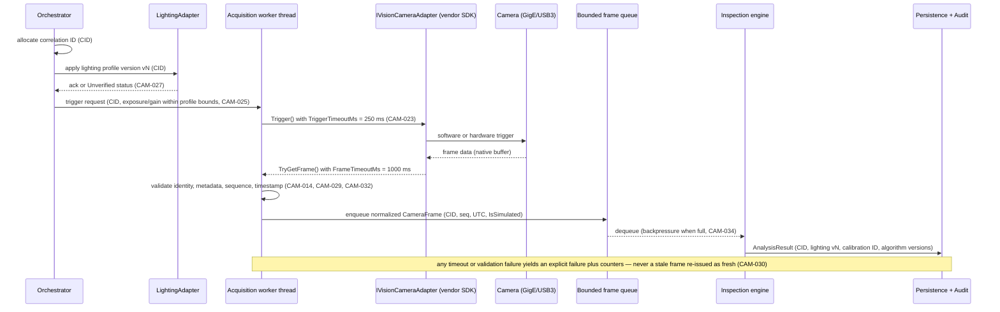
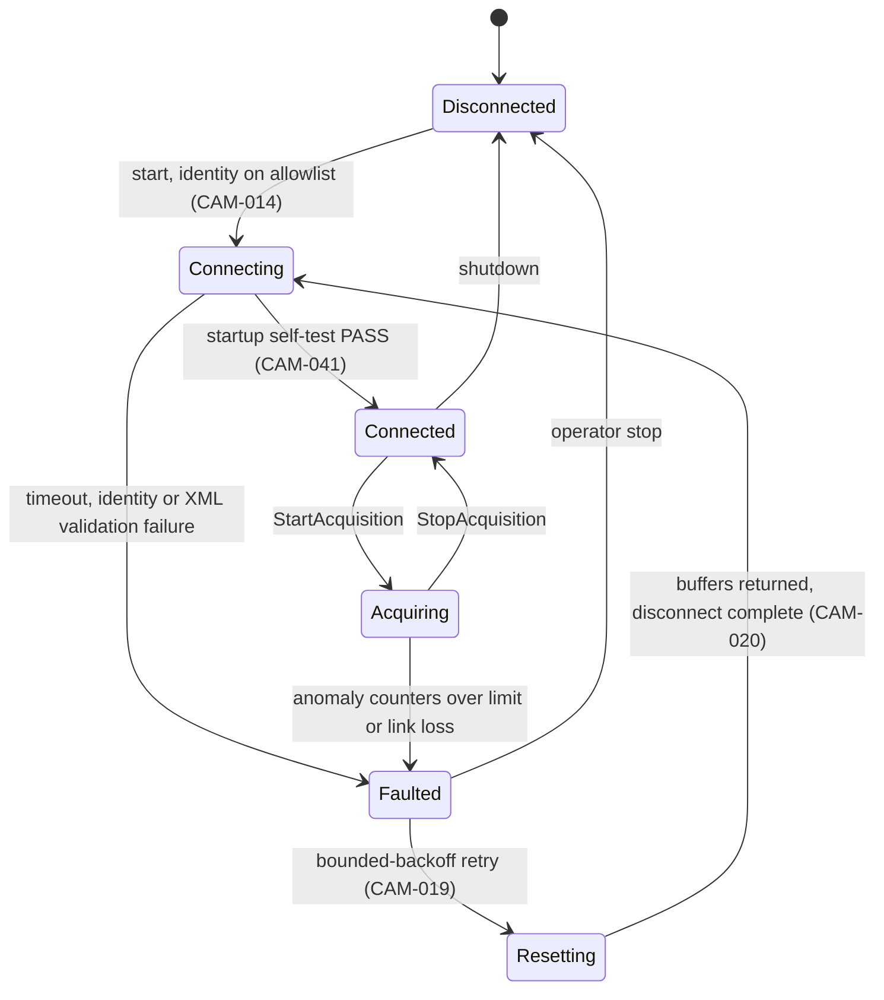
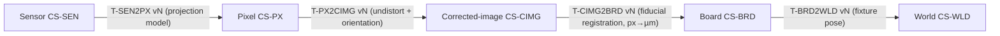

OpenAI/Codex and numerous other coding agents will review your output once you are done.

# VOL10 Camera, Lighting, and 3D Metrology — AOI Software Architecture, Secure Development, and Change-Control Standard, v1.0 (2026-07-15)

Scope: normative requirements for the camera/lighting acquisition boundary (§32) and for 3D metrology and coordinate-system integrity (§33) of AOI Monitor, Stages 1–4.

Supersedes/Related existing docs: `Docs/ARCHITECTURE.md` and `Docs/ARCHITECTURE.md` remain as implementation how-tos subordinate to this volume; `Docs/DEPLOYMENT.md` remains the execution checklist invoked by CAM-045; the 2D Calibration and 3D Sample-Data sections of `Docs/USER_MANUAL.md` and `Docs/USER_MANUAL.md` remain descriptive (non-normative).

---

## 32. Camera and Lighting Architecture

This section governs everything between a physical camera or lighting controller and the normalized `CameraFrame` handed to the inspection pipeline: vendor SDK containment, plugin integrity, native-library loading, device identity, connection lifecycle, triggering, illumination control, frame metadata, memory ownership, and the simulated-versus-real evidence boundary. It exists because the machine-vision transport standards the product depends on — GigE Vision (GVCP/GVSP), USB3 Vision, GenICam/GenTL — define **no authentication, no integrity, and no confidentiality** [GIGEV; U3V; GENICAM]; every security and evidence property must therefore be built on the host side. Boundary with neighbors: network zones and conduits are owned by §13 (VOL03); the plugin dependency rule by §15 (VOL03); calibration lifecycle states by §20 (VOL04); image/file parsing security by §29 (VOL08); HMI presentation rules (including purple simulation labeling) by §36 (VOL12); supply-chain controls by §42 (VOL15).

### 32.1 Current state (facts this section builds on)

| Item | Repo evidence |
|---|---|
| App-facing camera contract | `ICameraSource` (Services/ICameraSource.cs:3-14): Start/Stop/GetNextFrame + view/status |
| Vendor-SDK boundary | `IVisionCameraAdapter` (Services/VisionCameraAdapters.cs:19-28), bridged by `GenericVisionCameraSource` |
| Source keys | `CameraSourceFactory`: `none`, `folder-simulation`, `generic-vision-adapter`; unknown keys → null source (fail-closed) |
| Plugin loading | `VisionCameraPluginLoader` + `LightingAdapterPluginService`: JSON manifest → `Assembly.LoadFrom`, string-match identity, **no signature or hash check** |
| Real hardware present | **None.** Only Null/Diagnostic/Fake adapters and `FolderCameraSource` (always `IsSimulated: true`, FolderCameraSource.cs:106) |
| Lighting | `TcpTextLightingController` / `SerialTextLightingController` (LightingControllers.cs:68-196) — real writes, fire-and-forget, no ACK read |
| Frame model | `CameraFrame` record (Services/CameraFrame.cs:18-36): FrameId, CameraId, CapturedAtUtc, Width/Height/PixelFormat, IsSimulated — **no sequence number** |
| Camera settings | `CameraSourceSettings` (Models/CameraSourceSettings.cs): ExposureMs 5.0, Gain 1.0, TriggerTimeoutMs 250, FrameTimeoutMs 1000, acquisition modes Continuous/SoftwareTrigger/HardwareTrigger |
| Acceptance harness | `CameraAcceptanceTestService` (drop/trigger-failure/timeout counters; refuses "real hardware" status for folder/null/simulated evidence, CameraAcceptanceTestService.cs:64-78) |
| Simulation provenance | `GenericVisionCameraSource.NormalizeFrame` preserves `IsSimulated` unchanged ("a simulated frame can never be silently relabeled as real hardware evidence", GenericVisionCameraSource.cs:96-118) |

### 32.2 Threat and failure model summary

1. **Unauthenticated transport.** GVCP (UDP 3956) control writes and GVSP pixel streams are plaintext UDP; any host on the camera segment can discover, reconfigure, or spoof a camera [GIGEV]. Frame injection into a GVSP stream is demonstrated practice (arXiv:2410.05417, 2024) and maps directly to the AOI worst case: attacker-chosen images driving false PASS. Segmentation (CAM-016) plus identity pinning (CAM-014) plus anomaly counters (CAM-017, CAM-031) are the compensating controls.
2. **Native code in-process.** Vendor SDKs ship native runtimes, kernel/filter drivers, and GenTL producers (`.cti`) loaded into the inspection process; there is no centralized machine-vision PSIRT/CVE feed (absence of CVEs is absence of disclosure, not of defects — UNVERIFIED-absence as of 2026-07-15). Controls: signed/allowlisted loading (CAM-003, CAM-010..012), pinning (CAM-006), SBOM (CAM-007).
3. **Device-supplied input.** The GenICam feature XML is fetched from the device itself — a hostile camera feeds crafted XML to an in-process parser [GENICAM] (CAM-013).
4. **Evidence integrity.** Stale, duplicate, partial, or simulated frames presented as fresh real evidence corrupt accept/reject records (CAM-029..032, CAM-044).

Version baseline: GigE Vision **v2.2** is the deployed production baseline; v3.0 (approved 2026-04-17) is an additive supplement whose RDMA streaming (GVRSP) widens the host attack surface and requires a recorded risk review before adoption [GIGEV]. USB3 Vision **1.2** (exact release date UNVERIFIED as of 2026-07-15) [U3V]. GenICam package **2025.10** with GenTL 1.6 [GENICAM]. IEEE 1588/PTP multi-camera synchronization is out of scope under A-VOL10-2.

### 32.3 Camera-trigger and acquisition sequence

**Reading this diagram:** The orchestrator opens each inspection by allocating a correlation ID, then commands the lighting adapter to apply a *versioned* lighting profile; the adapter answers with an acknowledgment or an honest `Unverified` status when the controller protocol is fire-and-forget. The orchestrator then requests a trigger from the acquisition worker thread (never the UI thread), which drives the vendor adapter under two bounded timeouts — 250 ms for trigger dispatch and 1000 ms for frame retrieval. The returned native buffer is validated (allowlisted device identity, metadata consistency, sequence number, UTC timestamp), normalized into a `CameraFrame` carrying the correlation ID, and placed on a bounded queue that applies backpressure rather than growing without limit. The inspection engine consumes from the queue and persists a result stamped with the correlation ID, lighting profile version, calibration profile, and algorithm versions. The closing note is the section's central invariant: every failure path produces an explicit failure and a counter increment; no path re-delivers an old frame as new.

### 32.4 Camera connection state machine

**Reading this diagram:** A camera starts Disconnected and may only move to Connecting when its serial/MAC identity is on the station allowlist. Connecting reaches Connected solely through a passing startup self-test; any timeout, identity mismatch, or device-XML validation failure lands in Faulted instead. Acquiring is entered and left explicitly via start/stop calls, and excessive frame-anomaly counters or link loss force Acquiring into Faulted. Recovery is never a tight loop: Faulted transitions to Resetting under the bounded-backoff policy, and Resetting may only return to Connecting after all native buffers have been returned and the disconnect has completed — this ordering is what prevents buffer leaks and half-reset acquisitions. The operator can always force Faulted back to Disconnected, and shutdown closes from Connected. Every transition is logged with UTC timestamp and reason (CAM-018), and the four-state HMI status (`NotConnected`/`Simulated`/`Error`/`Ready`) is a projection of this machine, not a replacement for it.

### 32.5 Lighting profile model

A lighting profile is the versioned optical contract under which frames are comparable. Required fields: `ProfileId`, monotonically increasing `Version`, `ParameterSha256` (SHA-256 over the canonical serialized parameter set), per-channel settings (channel id, intensity, strobe/continuous mode), `ExposureBoundsMs`, `GainBounds`, `SettleTimeMs`, `CreatedAtUtc`, `CreatedBy`, `ApprovedBy`. Profiles are immutable per version: any parameter change creates a new version (CAM-026); recipes reference a profile version; every inspection result records the version in force. Exposure/gain applied to the camera must fall inside the profile's declared bounds (CAM-025), and acquisition waits the profile's settle time after a lighting change (CAM-028).

### 32.6 Current-state nonconformities and migration obligations

| # | Current state (evidence) | Governing req. | Migration obligation |
|---|---|---|---|
| N-32-1 | Unsigned `Assembly.LoadFrom` plugin loading, string-match identity only (VisionCameraAdapters.cs:134; LightingControllerFactory.cs:99) | CAM-003, CAM-004 | Signature/hash verification before any Stage 2 pilot with real adapters |
| N-32-2 | `CameraFrame` carries no sequence number (Services/CameraFrame.cs:18-36) | CAM-029 | Contract extension + adapter conformance update |
| N-32-3 | Lighting TCP/serial writes are fire-and-forget, no ACK read (LightingControllers.cs:68-196) | CAM-027 | Read-back where protocol supports; `Unverified` surfaced in readiness |
| N-32-4 | No connection state machine or backoff; `StopAcquisition` propagates adapter exceptions (GenericVisionCameraSource.cs:55-66) | CAM-018..020 | Implement before Stage 2 exit |
| N-32-5 | Exposure/gain are plain settings, no lighting-profile versioning (Models/CameraSourceSettings.cs:16-17) | CAM-025, CAM-026 | Versioned profile model + result stamping |
| N-32-6 | Adapter folders user-configurable with no ACL or signature checks on vendor binaries | CAM-010, CAM-012 | Startup ACL + Authenticode verification |

### 32.7 Fitness functions introduced by this volume

| FF ID | Mechanism (wiring plan in §52, VOL17) |
|---|---|
| FF-CAM-01 | CI grep gate: no vendor SDK package ids in `AOI_Monitor.csproj`/`packages.lock.json` |
| FF-CAM-02 | NetArchTest rule: `IVisionCameraAdapter` referenced only by the allowlisted bridge/acceptance types |
| FF-CAM-03 | Startup assertion + review checklist: controlled DLL search configuration |
| FF-CAM-04 | Schema gate: correlation-ID and lighting/calibration version fields non-null on result tables |
| FF-CAM-05 | Diagnostics contract test: required counter keys present in `GetDiagnostics()` |
| FF-CAM-06 | Analyzer/review rule + debug thread assertion: no adapter calls on the WPF UI thread |
| FF-THD-01 | Schema gate: units, coordinate-system ID, algorithm/transform versions on measurement records |
| FF-THD-02 | Analyzer rule: float `==`/`!=` banned in measurement namespaces |
| FF-THD-03 | NetArchTest rule: 3D viewer types cannot reference measurement-computation APIs |

### R: Vendor SDK isolation and plugin integrity (CAM-001–CAM-005)

**[CAM-001]** (P1 | S2+ | CameraAdapter, Acquisition)
The application SHALL confine every vendor camera SDK call to adapter assemblies that implement `IVisionCameraAdapter` (Services/VisionCameraAdapters.cs:19-28) and are deployed outside the `AOI_Monitor` project; referencing a vendor SDK NuGet package or native binary from `AOI_Monitor.csproj` is prohibited.
- Why: keeps crash-prone, unauditable native SDK code behind a replaceable seam (D-01 worker-split trigger) and preserves the rule already stated in Docs/ARCHITECTURE.md:3. Maps: 42010; SSDF-PW.4; Internal.
- Verify: fitness function FF-CAM-01 (CI grep gate over csproj and lock file for vendor SDK package ids: pylon, Spinnaker, eBUS, Vimba, MvCameraControl). Evidence: CI gate log. Owner: Software Architect. Auto: Fully automated.
- Exception: Not allowed. Review: Per release.

**[CAM-002]** (P2 | ALL | Acquisition, HMI)
View and service code outside the acquisition layer SHALL consume camera frames only through `ICameraSource` (Services/ICameraSource.cs:3-14); direct use of `IVisionCameraAdapter` outside `GenericVisionCameraSource` and the acceptance-test services is prohibited.
- Why: the single bridge (GenericVisionCameraSource.cs:13) is where frame normalization, simulation labeling, and counters live; bypassing it silently skips those guarantees. Maps: 42010; Internal.
- Verify: fitness function FF-CAM-02 (NetArchTest allowlist rule). Evidence: architecture test run in CI. Owner: Software Architect. Auto: Fully automated.
- Exception: Allowed — approver: Software Architect. Review: On change.

**[CAM-003]** (P0 | S2+ | CameraAdapter, Config)
The plugin loaders SHALL verify each adapter assembly against an Authenticode publisher allowlist or a per-file SHA-256 allowlist before `Assembly.LoadFrom`; loading an assembly that fails verification is prohibited.
- Why: today `VisionCameraPluginLoader` (VisionCameraAdapters.cs:134) and `LightingAdapterPluginService` (LightingControllerFactory.cs:99) execute any DLL named in a JSON manifest in a configurable folder — an arbitrary-code-execution path (see the plugin rule, §15, VOL03). Maps: CWE-494; CWE-347; 62443-4-2 CR 3.4; SSDF-PW.4.
- Verify: new test class `PluginSignatureVerificationTests` covering tampered/unsigned/allowlisted cases; penetration checklist item PT-32-01. Evidence: test run + review record. Owner: Security Lead. Auto: Partially automated.
- Exception: Not allowed. Review: Per release.

**[CAM-004]** (P2 | S2+ | CameraAdapter)
Adapter manifests (`*.camera-adapter.json`, `*.lighting-adapter.json`) SHALL carry an `assemblySha256` field that the loader verifies against the assembly file bytes at every load.
- Why: binds the manifest identity claims already validated at VisionCameraAdapters.cs:184-218 to the actual binary, closing the string-match-only spoofing gap. Maps: CWE-347; 62443-4-2 CR 3.4.
- Verify: `CameraAdapterPackageValidationServiceTests` extended with hash-mismatch cases; `Scripts/validate-camera-adapter-package.ps1` gate. Evidence: test run log. Owner: Software Lead. Auto: Fully automated.
- Exception: Not allowed. Review: Per release.

**[CAM-005]** (P2 | S2+ | CameraAdapter, Diagnostics)
On any plugin validation or load failure the loader SHALL return the diagnostic null adapter (`DiagnosticNullVisionCameraAdapter`, VisionCameraAdapters.cs:166-182) carrying the failure reason, never a partially initialized vendor adapter.
- Why: codifies the existing fail-closed behavior so future refactors cannot regress it; a half-loaded native SDK is a crash and evidence-integrity risk. Maps: Internal; 25010.
- Verify: `VendorAdapterTemplateTests` plus loader failure-path unit tests. Evidence: test run log. Owner: Software Lead. Auto: Fully automated.
- Exception: Not allowed. Review: Annual.

### R: SDK version pinning, compatibility, and bitness (CAM-006–CAM-009)

**[CAM-006]** (P1 | S2+ | CameraAdapter, Build)
Stations SHALL run only the vendor SDK version, camera driver version, and camera firmware version(s) present in the adapter release's declared compatibility matrix, which pins the exact combinations the adapter was tested with.
- Why: SDK/driver/firmware drift is a silent frame-corruption and crash source, and no central machine-vision PSIRT exists, so pinning deployment to the tested matrix is the primary control (research: vision-hw §4). Maps: SSDF-PW.4; 62443-4-1 SM-9; 800-161.
- Verify: install-time check of matrix file against `GetDiagnostics()` reported versions; HIL checklist item. Evidence: signed acceptance report per station. Owner: Field Service. Auto: Partially automated.
- Exception: Allowed — approver: Software Architect. Review: Quarterly.

**[CAM-007]** (P2 | S2+ | CameraAdapter, Build)
The release SBOM SHALL contain one CycloneDX component entry per vendor SDK runtime, kernel/filter driver, and GenTL producer (`.cti`), each with exact version and SHA-256.
- Why: camera SDKs are native in-process supply-chain dependencies with inconsistent vulnerability disclosure; the SBOM is the recall index when a vendor advisory lands. Maps: SBOM-MIN; CDX; SSDF-PW.4; 800-161.
- Verify: SBOM generation gate in CI (D-14 tooling) plus release checklist. Evidence: published SBOM artifact. Owner: Release Manager. Auto: Fully automated.
- Exception: Not allowed. Review: Per release.

**[CAM-008]** (P3 | S2+ | CameraAdapter)
The Software Lead SHOULD review each camera and lighting vendor's release/security channel quarterly and record the outcome (new versions, security notices, adopt/defer decision) in the dependency log.
- Why: absence of CVEs for vision SDKs reflects absence of disclosure, not absence of defects (research: vision-hw §4, UNVERIFIED-absence noted 2026-07-15); scheduled review is the compensating control. Maps: SSDF-RV.1; 62443-4-1 DM-1.
- Verify: dated quarterly entries in the dependency log. Evidence: dependency log. Owner: Software Lead. Auto: Manual review.
- Exception: Allowed — approver: Security Lead. Review: Quarterly.

**[CAM-009]** (P2 | S2+ | CameraAdapter)
The plugin loader SHALL reject, with an explicit diagnostic, any adapter assembly or native SDK dependency whose bitness does not match the x64 host process.
- Why: D-02 fixes the platform at x64; a 32-bit vendor SDK otherwise fails at first P/Invoke with an obscure `BadImageFormatException` mid-production instead of at load time. Maps: Internal; 25010.
- Verify: loader unit tests with mismatched-bitness fixture assemblies. Evidence: test run log. Owner: Software Lead. Auto: Fully automated.
- Exception: Not allowed. Review: Annual.

### R: Controlled native library loading (CAM-010–CAM-013)

**[CAM-010]** (P0 | S2+ | CameraAdapter, Acquisition)
The application SHALL load native camera and lighting SDK libraries only by absolute path or from directories registered via `AddDllDirectory` after `SetDefaultDllDirectories(LOAD_LIBRARY_SEARCH_DEFAULT_DIRS)`; resolution through the current working directory, `%PATH%`, or any user-writable directory is prohibited.
- Why: uncontrolled DLL search order lets a user-writable directory hijack the native load (CWE-427) — arbitrary code execution inside the inspection process. Maps: CWE-427; MS-SDL; 62443-4-2 CR 3.4.
- Verify: fitness function FF-CAM-03 (startup assertion plus review checklist for LoadLibrary/DllImport usage); process-monitor spot check during HIL. Evidence: CI log + HIL record. Owner: Security Lead. Auto: Partially automated.
- Exception: Not allowed. Review: Per release.

**[CAM-011]** (P1 | S2+ | CameraAdapter, Config)
If GenTL producers are used, the application SHALL honor `GENICAM_GENTL64_PATH` entries only when they point to administrator-writable-only directories and the referenced `.cti` files match a configured SHA-256 allowlist.
- Why: a GenTL `.cti` is native code loaded in-process via an environment variable an attacker may influence (research: vision-hw §3). Maps: GENICAM; CWE-427; CWE-829.
- Verify: startup validation test plus configuration review. Evidence: startup self-test log. Owner: Security Lead. Auto: Partially automated.
- Exception: Allowed — approver: Security Lead. Review: Per release.

**[CAM-012]** (P2 | S2+ | CameraAdapter, Config)
At startup the application SHALL verify that adapter plugin and vendor SDK directories deny write access to non-administrator accounts and that vendor native binaries carry valid Authenticode signatures from the publisher recorded in the compatibility matrix, raising a Critical alarm and refusing hardware activation when either check fails.
- Why: signature checks at load (CAM-003) are undermined if the operator account can swap files between check and use; ACL plus signed-vendor-binary verification closes the local-tamper window. Maps: CWE-347; 62443-4-2 CR 3.4; 800-82.
- Verify: startup self-test log assertion plus ACL unit test with temp-dir fixture. Evidence: startup self-test log. Owner: Security Lead. Auto: Fully automated.
- Exception: Allowed — approver: Security Lead. Review: Per release.

**[CAM-013]** (P2 | S2+ | CameraAdapter, Acquisition)
The adapter layer SHALL parse device-supplied GenICam XML with DTD processing and entity expansion disabled under a 10 MB input ceiling, treating any parse failure or ceiling breach as a connection failure rather than proceeding with partial features.
- Why: the camera feature XML is fetched from the device — a spoofed or hostile camera can deliver crafted XML to the in-process parser (research: vision-hw §3). Maps: GENICAM; CWE-20; CWE-776.
- Verify: adapter conformance test with oversized/malformed XML fixtures (extends `Scripts/validate-camera-adapter-package.ps1`). Evidence: adapter acceptance report. Owner: Software Lead. Auto: Fully automated.
- Exception: Allowed — approver: Software Architect. Review: On change.

### R: Camera identity and network placement (CAM-014–CAM-017)

**[CAM-014]** (P1 | S2+ | Acquisition, Config)
The acquisition layer SHALL reject connections and frames from any camera whose serial number (and MAC address, for GigE devices) is absent from the station's per-view identity allowlist.
- Why: GVCP discovery is unauthenticated — any device on the segment can present itself as a camera; identity pinning is the station-side control [GIGEV]. Maps: GIGEV; 62443-3-3 SR 1.2; CWE-290.
- Verify: acceptance test with a non-allowlisted simulator device; `CameraAcceptanceTestService` extension. Evidence: camera acceptance run record. Owner: Software Lead. Auto: Partially automated.
- Exception: Allowed — approver: Security Lead. Review: Per release.

**[CAM-015]** (P2 | S2+ | Acquisition, Persistence)
Frames lacking a physical device serial in `CameraFrame.CameraId` SHALL be classified as not-validated (non-real-hardware) evidence.
- Why: codifies the existing rule (CameraAcceptanceTestService.cs:64-69; Docs/ARCHITECTURE.md:34-48) that device identity is part of evidence integrity. Maps: Internal.
- Verify: `CameraAcceptanceTestService` classification tests. Evidence: test run log. Owner: QA Lead. Auto: Fully automated.
- Exception: Not allowed. Review: Annual.

**[CAM-016]** (P1 | S2+ | Acquisition)
GigE Vision camera links SHALL terminate in a dedicated, non-routed camera network segment reachable only by the station host, with no route to MES, enterprise, or internet-facing networks (zones and conduits, §13, VOL03).
- Why: GVCP (UDP 3956) and GVSP carry no authentication, integrity, or confidentiality — segmentation is the only transport control (research: vision-hw §1, cross-cutting finding). Maps: GIGEV; 62443-3-3 SR 5.1; 800-82.
- Verify: station network configuration audit per HIL checklist; route-table capture in readiness evidence. Evidence: HIL evidence package. Owner: IT Admin (customer). Auto: Manual review.
- Exception: Not allowed. Review: Per release.

**[CAM-017]** (P3 | S2+ | Acquisition, Diagnostics)
The acquisition layer SHOULD maintain per-stream counters of GVSP block-ID sequence gaps and packet-resend requests, exposed through `GetDiagnostics()` and the structured log.
- Why: GVSP frame injection is demonstrated practice (research: vision-hw §9, arXiv:2410.05417) and GVSP block-ID gaps and resend storms are its transport-layer side effects that CAM-031's frame-level counters do not cover; segmentation (CAM-016) is necessary but not sufficient. Maps: GIGEV; ATTACK-ICS; Internal.
- Verify: adapter conformance test with induced packet loss. Evidence: diagnostics log samples in the HIL package. Owner: Software Lead. Auto: Partially automated.
- Exception: Allowed — approver: Security Lead. Review: Quarterly.

### R: Connection lifecycle, reconnection, reset (CAM-018–CAM-021)

**[CAM-018]** (P2 | S2+ | Acquisition, Diagnostics)
Each camera connection SHALL be managed by an explicit state machine (Disconnected, Connecting, Connected, Acquiring, Faulted, Resetting) whose every transition is logged with UTC timestamp and reason.
- Why: implicit connection state is why reconnect bugs and zombie acquisitions escape review; the machine also feeds the four-state HMI status (`CameraSourceStatus`, Services/CameraFrame.cs:10-16). Maps: 25010; Internal.
- Verify: state-machine unit tests with 100 % transition-table coverage. Evidence: test run log. Owner: Software Lead. Auto: Fully automated.
- Exception: Allowed — approver: Software Architect. Review: On change.

**[CAM-019]** (P2 | S2+ | Acquisition)
Automatic reconnection SHALL use bounded exponential backoff (initial 500 ms, factor 2, ceiling 30 s, jitter ±20 %), raising a Warning alarm after 3 consecutive failures and a Critical alarm after 60 s disconnected.
- Why: unbounded tight retry loops flood the camera segment and hide hard faults; bounded backoff with alarms converts silent degradation into operator action (defaults per A-VOL10-1). Maps: 25010; Internal.
- Verify: reconnection policy unit tests with a fake clock. Evidence: test run log. Owner: Software Lead. Auto: Fully automated.
- Exception: Allowed — approver: Software Architect. Review: On change.

**[CAM-020]** (P2 | S2+ | Acquisition, CameraAdapter)
A camera reset SHALL execute the fixed sequence stop-acquisition → return all native buffers → disconnect → reconnect → startup self-test → resume, terminating any in-flight inspection with an INVALID (neither OK nor NG) outcome.
- Why: resets that skip buffer return leak native memory, and resets that let an in-flight inspection complete can pair a pre-reset frame with post-reset settings. Maps: CWE-401; 25010.
- Verify: reset-path integration test in the adapter conformance suite; HIL reset drill. Evidence: HIL record + test log. Owner: Software Lead. Auto: Partially automated.
- Exception: Not allowed. Review: Per release.

**[CAM-021]** (P2 | S2+ | Acquisition, HMI)
A camera Faulted state SHALL block new inspection starts and raise an HMI alarm within 2 s, until the state returns to Acquiring or the operator explicitly switches to a labeled simulation source.
- Why: continuing to inspect without a live camera silently converts real production into no-evidence cycles; the block plus explicit simulation switch keeps the evidence boundary honest (HMI rules, §36, VOL12). Maps: 25010; Internal.
- Verify: UI test (AOI_Monitor.UiTests) alarm-latency scenario plus orchestrator gate unit test. Evidence: test run log. Owner: QA Lead. Auto: Fully automated.
- Exception: Not allowed. Review: Annual.

### R: Triggering and correlation (CAM-022–CAM-024)

**[CAM-022]** (P1 | S2+ | Acquisition, Persistence)
Every trigger SHALL be assigned a unique correlation ID that is propagated unchanged into the resulting `CameraFrame`, the analysis result, the persisted inspection record, and any MES payload derived from it.
- Why: end-to-end correlation is what lets a disputed accept/reject be traced to the exact trigger, frame, lighting profile, and model version; without it evidence chains break at layer boundaries (traceability model, §21, VOL05). Maps: Internal; 62443-4-2 CR 2.8.
- Verify: fitness function FF-CAM-04 (schema gate: correlation-ID field non-null across result tables) plus an end-to-end test. Evidence: CI gate log. Owner: Software Lead. Auto: Fully automated.
- Exception: Not allowed. Review: Per release.

**[CAM-023]** (P2 | S2+ | Acquisition, Config)
Trigger dispatch and frame retrieval SHALL enforce the configured bounded timeouts (`TriggerTimeoutMs`, default 250 ms; `FrameTimeoutMs`, default 1000 ms; Models/CameraSourceSettings.cs:18-19), incrementing the trigger-failure or timeout counter on expiry instead of waiting indefinitely.
- Why: an indefinite wait on an unauthenticated UDP transport is a trivially inducible denial of service and stalls line takt. Maps: GIGEV; CWE-400; 25010.
- Verify: `CameraAcceptanceTestService` timeout metrics (TriggerFailureCount/TimeoutCount, CameraAcceptanceTestService.cs:52-53). Evidence: camera acceptance run record. Owner: Software Lead. Auto: Fully automated.
- Exception: Allowed — approver: Software Architect. Review: On change.

**[CAM-024]** (P3 | S3+ | Acquisition)
Line-integrated stations SHOULD use hardware trigger mode (`CameraAcquisitionMode.HardwareTrigger`) with the trigger wiring exercised in the hardware-in-the-loop checklist before production release.
- Why: software triggers add jitter that couples conveyor position to image geometry; hardware triggering removes the largest positional variance term. Maps: GIGEV; Internal.
- Verify: HIL trigger-to-frame timing section (Docs/DEPLOYMENT.md). Evidence: HIL evidence package. Owner: Controls & Safety Engineer. Auto: Manual review.
- Exception: Allowed — approver: Software Architect. Review: Per release.

### R: Lighting profile enforcement (CAM-025–CAM-028)

**[CAM-025]** (P2 | S2+ | LightingAdapter, Acquisition)
The acquisition layer SHALL reject any trigger request whose exposure or gain values fall outside the `ExposureBoundsMs`/`GainBounds` declared by the lighting profile version in force, logging the rejection with its correlation ID.
- Why: exposure/gain outside the profile's optical envelope silently changes defect contrast and destroys cross-board comparability; today exposure and gain are free-floating settings with no profile linkage (Models/CameraSourceSettings.cs:16-17, N-32-5). Maps: Internal; 25010.
- Verify: bounds-enforcement unit tests (in-bounds, at-bounds, out-of-bounds fixtures); fitness function FF-CAM-04 result-stamp check. Evidence: test run log. Owner: Software Lead. Auto: Fully automated.
- Exception: Allowed — approver: Software Architect. Review: On change.

**[CAM-026]** (P2 | S2+ | LightingAdapter, Recipe)
Lighting profiles SHALL be immutable per version: any change to any §32.5 field creates a new monotonically numbered version with recomputed `ParameterSha256`, and in-place edits of an existing version are prohibited.
- Why: inspection results are only comparable under identical illumination; mutable profiles make historical records unreproducible and mask drift-induced escape-rate changes (same immutability logic the recipe lifecycle applies in §18, VOL04). Maps: Internal; 62443-4-2 CR 3.4.
- Verify: profile-store unit tests (edit attempt yields new version; hash recomputation) plus schema uniqueness constraint on (ProfileId, Version). Evidence: test run log. Owner: Software Lead. Auto: Fully automated.
- Exception: Not allowed. Review: Annual.

**[CAM-027]** (P2 | S2+ | LightingAdapter, Diagnostics)
The lighting adapter SHALL classify every profile application as `Acknowledged` (controller response read and validated) or `Unverified` (no response readable from the protocol), surfacing `Unverified` in readiness evaluation and in the applied-profile log entry.
- Why: `TcpTextLightingController`/`SerialTextLightingController` write commands fire-and-forget with no ACK read (LightingControllers.cs:68-196, N-32-3), so a dead controller is indistinguishable from a working one unless the uncertainty is stated honestly. Maps: Internal; 25010.
- Verify: adapter unit tests for both classifications; readiness-report assertion extended in `FactoryReadinessServiceTests`. Evidence: test run log. Owner: Software Lead. Auto: Fully automated.
- Exception: Allowed — approver: Software Architect. Review: On change.

**[CAM-028]** (P3 | S2+ | LightingAdapter, Acquisition)
Acquisition SHOULD wait the active profile's `SettleTimeMs` after any lighting channel or intensity change before dispatching a trigger, recording the applied wait in the acquisition log.
- Why: LED drivers and strobe circuits need settle time after channel changes; frames captured mid-transition carry non-reproducible illumination that surfaces as phantom contrast defects. Maps: Internal; 25010.
- Verify: acquisition-timeline unit test with a fake clock asserting wait ≥ `SettleTimeMs`. Evidence: test run log. Owner: Software Lead. Auto: Fully automated.
- Exception: Allowed — approver: Software Architect. Review: On change.

### R: Frame metadata, sequencing, and evidence integrity (CAM-029–CAM-033)

**[CAM-029]** (P1 | S2+ | Acquisition, CameraAdapter)
The `CameraFrame` contract SHALL be extended with a per-stream monotonically increasing `SequenceNumber` taken from the device frame/block counter where available and otherwise assigned by the bridge at normalization, with frames lacking a sequence number rejected at validation.
- Why: without sequence numbers, dropped, duplicated, and reordered frames are undetectable (Services/CameraFrame.cs:18-36 has no sequence field, N-32-2), breaking the evidence chain and hiding the observable side effects of GVSP injection. Maps: GIGEV; CWE-345; Internal.
- Verify: contract test on the extended record plus adapter conformance suite sequence assertions. Evidence: test run log. Owner: Software Lead. Auto: Fully automated.
- Exception: Not allowed. Review: Per release.

**[CAM-030]** (P1 | S2+ | Acquisition, Decision)
On trigger timeout, frame timeout, or validation failure the acquisition layer SHALL return an explicit acquisition-failure result to the orchestrator; re-delivering a previously delivered frame, a cached frame, or any frame whose sequence number or timestamp predates the trigger is prohibited.
- Why: a stale frame silently paired with a new board is a false PASS/FAIL generator — the single worst evidence-integrity failure the acquisition layer can produce (§32.2 item 4). Maps: CWE-345; Internal; 25010.
- Verify: failure-path unit tests (timeout, stale-sequence, stale-timestamp fixtures) plus `CameraAcceptanceTestService` counter assertions. Evidence: test run log. Owner: QA Lead. Auto: Fully automated.
- Exception: Not allowed. Review: Per release.

**[CAM-031]** (P2 | S2+ | Acquisition, Diagnostics)
The acquisition layer SHALL maintain monotonic counters for dropped, duplicate, out-of-order, stale, partial/incomplete, and geometry-mismatch frames, exposed through `GetDiagnostics()` and the structured log, raising a Warning alarm when any counter increases by more than 5 within any 60 s window.
- Why: these counters are the observable side effects of link degradation, buffer exhaustion, and GVSP tampering (research: vision-hw §9, arXiv:2410.05417); counters without alarm thresholds are decoration, not detection (defaults per A-VOL10-3). Maps: GIGEV; ATTACK-ICS; 62443-3-3 SR 6.2.
- Verify: fitness function FF-CAM-05 (diagnostics contract test for required counter keys) plus induced-fault adapter conformance test. Evidence: CI test results. Owner: Software Lead. Auto: Fully automated.
- Exception: Allowed — approver: Software Architect. Review: On change.

**[CAM-032]** (P2 | S2+ | Acquisition)
Frame validation SHALL reject any frame whose `CapturedAtUtc` is earlier than the issuing trigger's UTC time or later than trigger time plus `FrameTimeoutMs`, counting each rejection as a stale-frame anomaly under CAM-031.
- Why: device clocks are settable over unauthenticated GVCP writes, so device timestamps cannot be trusted in isolation; trigger-anchored plausibility bounds are the host-side timestamp control [GIGEV]. Maps: GIGEV; CWE-345.
- Verify: validation unit tests with skewed-timestamp fixtures driven by a fake clock. Evidence: test run log. Owner: Software Lead. Auto: Fully automated.
- Exception: Allowed — approver: Software Architect. Review: On change.

**[CAM-033]** (P2 | S2+ | CameraAdapter, Acquisition)
Each adapter SHALL declare in its manifest and in `GetDiagnostics()` the delivered pixel format (PFNC name), color space, channel order, bit depth, sensor orientation (row-0 position and mirroring), and image coordinate-system origin, with the bridge rejecting frames that contradict the declaration.
- Why: undocumented format and orientation assumptions surface as silently flipped or color-shifted evidence images and corrupt every pixel-coordinate measurement downstream (§33); PFNC is the canonical pixel-format naming source [GENICAM]. Maps: GENICAM; CWE-20; Internal.
- Verify: `Scripts/validate-camera-adapter-package.ps1` manifest-field checks plus adapter conformance test comparing declaration to delivered frames. Evidence: adapter acceptance report. Owner: Software Lead. Auto: Fully automated.
- Exception: Not allowed. Review: On change.

### R: Frame queues, buffer ownership, and decode limits (CAM-034–CAM-037)

**[CAM-034]** (P2 | S2+ | Acquisition, Orchestrator)
Frames SHALL flow from acquisition to the inspection engine through a bounded queue (default capacity 8 frames) with a declared drop policy — reject-newest-with-counter in continuous mode, fail-the-trigger in software/hardware trigger modes — and unbounded frame buffering is prohibited.
- Why: an unbounded queue converts a slow consumer into memory exhaustion and guarantees the engine inspects ever-staler frames; an explicit, tested drop policy makes overload observable instead of latent (defaults per A-VOL10-3). Maps: CWE-400; CWE-770; 25010.
- Verify: queue unit tests (capacity, both drop policies, counter increments) plus the §40 soak-test memory ceiling (VOL13). Evidence: test run log. Owner: Software Lead. Auto: Fully automated.
- Exception: Allowed — approver: Software Architect. Review: On change.

**[CAM-035]** (P1 | S2+ | CameraAdapter, Acquisition)
Each adapter SHALL copy pixel data out of the vendor-SDK native buffer into managed memory (or a rent/return-disciplined managed pool) before `TryGetFrame` returns; reading or writing a native buffer after it is returned to the SDK is prohibited.
- Why: every native frame buffer must have exactly one documented owner at each lifecycle step (SDK allocates → adapter reads → adapter returns/requeues), and use-after-release of vendor-SDK buffers is native memory corruption — silently wrong pixel data at best, an exploitable crash at worst (CWE-416); the copy-out boundary keeps everything downstream of the adapter memory-safe. Maps: CWE-416; CWE-401; MS-SDL.
- Verify: adapter review checklist requiring a buffer-lifecycle table in the adapter README, plus a 10,000-frame stress test with reset injection in the conformance suite. Evidence: review record + HIL stress log. Owner: Software Lead. Auto: Partially automated.
- Exception: Not allowed. Review: Per release.

**[CAM-036]** (P3 | S2+ | CameraAdapter, Acquisition)
Zero-copy frame paths (pinned or memory-mapped SDK buffers consumed directly by inference or display) MAY be introduced only after a recorded design review documenting buffer lifetime, pinning duration, and failure behavior.
- Why: zero-copy trades the CAM-035 safety boundary for throughput; without a written lifetime analysis it reintroduces use-after-release and long-pinned-buffer GC fragmentation that ordinary code review does not see. Maps: CWE-416; Internal.
- Verify: design-review record containing the lifetime analysis; NetArchTest allowlist keeping zero-copy types enumerated. Evidence: review record + architecture test run. Owner: Software Architect. Auto: Manual review.
- Exception: Allowed — approver: Software Architect. Review: On change.

**[CAM-037]** (P2 | S2+ | Acquisition, Config)
Frame decode and pixel-format conversion SHALL enforce configured ceilings — defaults: 8192 px width, 8192 px height, 16 bits/channel, 256 MB decoded size per frame — rejecting an oversize frame as a geometry-mismatch anomaly instead of allocating for it.
- Why: frame geometry originates from an unauthenticated device, so allocation driven by device-supplied headers is a memory-exhaustion primitive (CWE-789), and an oversize frame also contradicts the adapter's CAM-033 declaration. Maps: CWE-789; CWE-400; GIGEV.
- Verify: decode-limit unit tests with oversized-header fixtures; ceilings present in the validated config schema (§29 input gates, VOL08). Evidence: test run log. Owner: Software Lead. Auto: Fully automated.
- Exception: Allowed — approver: Software Architect. Review: On change.

### R: Calibration linkage, threading, and health (CAM-038–CAM-041)

**[CAM-038]** (P1 | S2+ | Acquisition, Persistence)
The acquisition layer SHALL stamp every inspection-bound frame with the active camera-and-lens calibration profile ID and last-verification UTC date from the §20 device-and-calibration lifecycle (VOL04), blocking metric (mm/µm) inspection starts while the referenced calibration is expired or unverified and permitting labeled pixel-only runs consistent with the §17 Table 17-5 degraded-capability matrix and §20 (VOL04).
- Why: a metric measurement traced to no calibration, or a lapsed one, is unusable in a customer dispute and hides optical drift; the calibration states already exist in §20 (VOL04) and the §17 degraded-capability matrix blocks only metric judgments while permitting labeled pixel-only runs — this requirement binds frames and results to those states without contradicting the FSM degraded-mode rule. Maps: Internal; 62443-4-2 CR 2.8; 25010.
- Verify: fitness function FF-CAM-04 (calibration fields non-null on result tables) plus an expiry-block unit test. Evidence: CI gate log. Owner: QA Lead. Auto: Fully automated.
- Exception: Allowed — approver: QA Lead. Review: Quarterly.

**[CAM-039]** (P1 | ALL | CameraAdapter, HMI)
Vendor SDK and adapter calls (`Connect`, `Disconnect`, `StartAcquisition`, `StopAcquisition`, `Trigger`, `TryGetFrame`, `GetDiagnostics`) SHALL NOT execute on the WPF UI thread; all adapter interaction runs on dedicated acquisition threads with results marshaled to the HMI via the dispatcher.
- Why: adapter calls block for up to `FrameTimeoutMs` (1000 ms) and native SDK code can stall or crash in-process — on the UI thread that freezes the HMI past the §36 responsiveness budget (VOL12) and couples operator-facing status to vendor code (a D-01 worker-split trigger). Maps: Internal (D-01); 25010; MS-SDL.
- Verify: fitness function FF-CAM-06 (analyzer/review rule plus debug-build thread assertion in `GenericVisionCameraSource`). Evidence: CI log + assertion coverage. Owner: Software Lead. Auto: Partially automated.
- Exception: Not allowed. Review: Per release.

**[CAM-040]** (P2 | S2+ | Acquisition, Diagnostics)
While Connected or Acquiring, the acquisition layer SHALL run a periodic health check (default every 10 s) verifying device reachability, negotiated link speed, device temperature where exposed, and CAM-031 counter deltas, publishing the result to `GetDiagnostics()` and driving the state machine to Faulted after 3 consecutive failures.
- Why: cameras degrade between triggers too — a link renegotiated to 100 Mbit/s or an overheating sensor corrupts evidence quality long before a trigger fails outright (defaults per A-VOL10-3). Maps: 62443-3-3 SR 6.2; 25010.
- Verify: health-check unit tests with a fake clock and failing-probe fixtures. Evidence: test run log. Owner: Software Lead. Auto: Fully automated.
- Exception: Allowed — approver: Software Architect. Review: On change.

**[CAM-041]** (P2 | S2+ | Acquisition, Diagnostics)
The Connecting→Connected transition SHALL require a passing startup self-test that acquires and validates one complete frame end-to-end (identity, geometry versus the CAM-033 declaration, sequence, timestamp, decode), recording the result in the startup self-test log.
- Why: a camera that connects but cannot deliver a valid frame otherwise fails on the first production board; the self-test moves that discovery to startup, where it costs seconds instead of scrap (§32.4 state machine). Maps: 25010; Internal.
- Verify: state-machine tests asserting no Connected entry without self-test PASS; startup-log assertion. Evidence: startup self-test log. Owner: Software Lead. Auto: Fully automated.
- Exception: Not allowed. Review: Annual.

### R: Simulation, replay, and hardware-in-the-loop evidence (CAM-042–CAM-045)

**[CAM-042]** (P1 | ALL | Simulation, HMI)
Every simulation camera source (`FolderCameraSource`, template fakes, and any future recorded or synthetic source) SHALL set `IsSimulated: true` on every frame it emits and present the §36 purple simulation labeling (VOL12) whenever it is the active source.
- Why: codifies the existing invariant (FolderCameraSource.cs:106; Templates/CameraAdapterTemplate always simulated) — the purple label and the frame flag are the operator-level and record-level halves of the same evidence boundary. Maps: Internal; 25010.
- Verify: source unit tests asserting the flag on every emitted frame; simulation-banner UI test in `AOI_Monitor.UiTests`. Evidence: test run log. Owner: QA Lead. Auto: Fully automated.
- Exception: Not allowed. Review: Annual.

**[CAM-043]** (P3 | ALL | Simulation, Acquisition)
Recorded-frame replay through `FolderCameraSource` SHOULD preserve and expose the original capture metadata (source camera ID, original capture UTC, original sequence numbers) alongside the replay-time frame identity so every replayed frame is attributable to its recording.
- Why: replay is the Stage 1 regression tool and the HIL comparison baseline; a replay that loses provenance cannot reproduce a disputed inspection or be aligned with archived results (traceability model, §21, VOL05). Maps: Internal.
- Verify: `FolderCameraSource` metadata unit tests against a recorded-set fixture. Evidence: test run log. Owner: Software Lead. Auto: Fully automated.
- Exception: Allowed — approver: QA Lead. Review: On change.

**[CAM-044]** (P0 | ALL | Acquisition, Persistence)
No component SHALL clear, overwrite, or default the `IsSimulated` flag between frame emission and the persisted inspection record, and any accept/reject record derived from a simulated frame is permanently classified as non-production evidence in the database and in every export.
- Why: a simulated frame recorded as real hardware evidence is a falsified production record — the exact failure `GenericVisionCameraSource.NormalizeFrame` guards against (GenericVisionCameraSource.cs:96-118) and `CameraAcceptanceTestService` refuses to bless (CameraAcceptanceTestService.cs:64-78). Maps: CWE-345; Internal; 62443-4-2 CR 2.8.
- Verify: end-to-end propagation test (simulated source → database row → export) plus schema check that result tables carry the evidence classification. Evidence: CI test results. Owner: QA Lead. Auto: Fully automated.
- Exception: Not allowed. Review: Per release.

**[CAM-045]** (P1 | S2+ | Acquisition, CameraAdapter)
Before any adapter/SDK/driver/firmware combination is released to production, the station SHALL pass the hardware-in-the-loop checklist (`Docs/DEPLOYMENT.md`) against real hardware — including trigger-to-frame timing, the CAM-020 reset drill, disconnect/reconnect via induced-fault test hooks, and CAM-031 counter behavior — with the signed evidence package archived per station.
- Why: simulation proves the software contract, not the hardware truth; every "adapter conformance" and "HIL" verification in this section lands in this single auditable execution gate, and the induced-fault hooks are what make failure paths testable on demand. Maps: 62443-4-1 SVV-1; Internal; 25010.
- Verify: HIL checklist execution with induced-disconnect, forced-timeout, and counter-inspection hooks per checklist sections. Evidence: signed HIL evidence package per station. Owner: QA Lead. Auto: Manual review.
- Exception: Not allowed. Review: On change.

---

## 33. 3D Metrology and Coordinate-System Integrity

This section governs the numeric truth of every 3D measurement: which coordinate system a number lives in, how pixels become micrometers, what happens to invalid samples, which algorithm version produced a value, and the hard separation between measured evidence and rendered pictures. It exists because 3D solder metrology (height, region volume, coplanarity) feeds accept/reject decisions directly through recipe thresholds (`HeightMin/HeightMax`, `VolumeMin/VolumeMax`, Models/AoiModels.cs:1324-1326), and a coordinate, unit, or reference-plane error is a *systematic* misjudgment of every board, not a random one. Boundary with neighbors: 3D frame acquisition and the simulation evidence boundary follow the §32 rules through `IProfile3DSource`; calibration lifecycle states are owned by §20 (VOL04); recipe threshold governance by §18 (VOL04); result schema and storage by §21/§37 (VOL05); measurement-capability test hooks by §39 (VOL14); 3D rendering presentation rules by §36 (VOL12).

### 33.1 Current state (facts this section builds on)

| Item | Repo evidence |
|---|---|
| 3D source contract | `IProfile3DSource` (Services/Profile3DSourceService.cs:12-22): Start/Stop/GetNextHeightMap/GetDiagnostics |
| Sources | `NullProfile3DSource`; `CsvProfile3DSource` (sample CSV, always `IsSimulated: true`, Profile3DSourceService.cs:104); `GenericProfile3DAdapter` boundary stub (NotConnected). **No real 3D hardware exists.** |
| Frame model | `Profile3DFrame` (Models/AoiModels.cs:725-740): Width/Height, `Unit` default "microns", `XPitchMicrons`/`YPitchMicrons`, row-major `HeightValues` with NaN for missing samples |
| Frame validation | `Profile3DAcceptanceTestService.ValidateFrame` (dims, count = W×H, accepted units, positive pitch; Profile3DSourceService.cs:391-407) — acceptance path only |
| Region measurement | `EvaluateHeightRoi` (Profile3DSourceService.cs:304-348): baseline = mean of valid ROI samples; volume = Σ max(0, h−baseline)·pitchX·pitchY; judgment OK/NG/REVIEW |
| Evidence boundary | Simulated acceptance runs forced to `FactoryReadinessStatus = "NOT VALIDATED"` (Profile3DSourceService.cs:290) |
| Visualization | `Profile3DMeshBuilder.BuildSurface` (Profile3DMeshBuilder.cs:19-75): display-only min/max normalization, clamping, z-scaling; NaN quads skipped. Peak finding via mean+σ threshold (L82-113) |

### 33.2 Coordinate systems and transform chain

The five canonical coordinate systems. Every geometric quantity in the product is expressed in exactly one of them and says so (THD-001, THD-002).

| System | ID | Origin | Axes | Handedness | Units |
|---|---|---|---|---|---|
| Pixel | `CS-PX` | top-left of delivered image | +X right (columns), +Y down (rows) | 2D, Y-down | px |
| Sensor | `CS-SEN` | optical center of active sensor area | +X/+Y per sensor datasheet, +Z along optical axis toward scene | right-handed | mm |
| Corrected-image | `CS-CIMG` | top-left after undistortion and orientation normalization | +X right, +Y down | 2D, Y-down | px |
| Board | `CS-BRD` | recipe-designated fiducial datum | +X/+Y along board edges per recipe, +Z normal to board top, up | right-handed | µm |
| World | `CS-WLD` | station mechanical datum (fixture reference) | +X along conveyor travel, +Z vertical up | right-handed | µm |

**Reading this diagram:** The transform chain runs left to right: the sensor's projection model maps the physical sensor frame into raw pixel coordinates; the undistortion-and-orientation transform produces the corrected image in which straight board edges are straight; fiducial registration converts corrected-image pixels into micrometer positions in the board frame anchored at the recipe's fiducial datum; and the fixture-pose transform places the board in the station's world frame. Each arrow is a stored, versioned transform record (THD-003) with an identity of the form `T-<SRC>2<DST> vN` — measurements record which versions carried them (THD-002), and each invertible pair is round-trip tested in CI (THD-004). Defect positions reported to operators and MES live in `CS-BRD`; anything expressed in raw or corrected pixels is an intermediate, not a reportable measurement.

### 33.3 Measurement record contract

A 3D measurement is evidence only when its record is self-describing. The mandatory fields, enforced by FF-THD-01 and detailed in the requirements below: value at full double precision, unit (µm, µm², µm³, or px for intermediates), coordinate-system ID, transform-chain versions, calibration profile ID, measurement algorithm ID+version, height-reference definition ID, valid-sample fraction, sensor confidence where supplied, and the `IsSimulated` evidence classification inherited from the frame. Recipe thresholds compare against these records and nothing else (THD-020).

### 33.4 Current-state nonconformities and migration obligations

| # | Current state (evidence) | Governing req. | Migration obligation |
|---|---|---|---|
| N-33-1 | `EvaluateHeightRoi` returns NG when zero valid samples exist (Profile3DSourceService.cs:318-321) — conflates "cannot measure" with "defect" | THD-010 | Distinct INVALID outcome before production 3D use |
| N-33-2 | Volume baseline is the ROI mean with no algorithm ID or version on the result (Profile3DSourceService.cs:313-314) | THD-011, THD-012 | Algorithm registry + result stamping |
| N-33-3 | `Math.Max(1, frame.XPitchMicrons)` silently coerces zero/sub-micron pitch to 1 µm inside the volume formula (Profile3DSourceService.cs:314) | THD-005 | Reject invalid pitch; never coerce |
| N-33-4 | No coordinate-system or transform registry exists; pixel→physical uses raw pitch fields only | THD-001..THD-004 | Registry + stamping before any Stage 2 3D pilot |
| N-33-5 | Frame structural validation runs only in the acceptance harness, not the production path (Profile3DSourceService.cs:391-407) | THD-021 | Move validation onto every measurement-bound frame |
| N-33-6 | Viewer and measurement code share height arrays with no enforced boundary | THD-019 | FF-THD-03 NetArchTest rule active in CI |

### R: Coordinate systems and transforms (THD-001–THD-004)

**[THD-001]** (P2 | ALL | ThreeD, Domain)
The application SHALL maintain a versioned coordinate-system registry defining exactly the five systems of §33.2 (`CS-PX`, `CS-SEN`, `CS-CIMG`, `CS-BRD`, `CS-WLD`) with origin, axis directions, handedness, and units, rejecting at persistence any geometric data that references an unregistered system identifier.
- Why: unstated coordinate conventions are the classic metrology integration failure — a Y-down/Y-up or row/column swap mirrors every defect position while passing every unit test (N-33-4). Maps: Internal; 25010; 42010.
- Verify: fitness function FF-THD-01 (schema gate: coordinate-system ID non-null and registered). Evidence: CI gate log. Owner: Software Architect. Auto: Fully automated.
- Exception: Not allowed. Review: On change.

**[THD-002]** (P1 | ALL | ThreeD, Persistence)
Every persisted geometric or 3D measurement value SHALL record its coordinate-system ID, unit, transform-chain versions, calibration profile ID, and measurement algorithm ID plus version.
- Why: a bare number is not evidence — reproducing a disputed measurement requires the exact frame of reference and algorithm lineage that produced it (traceability model, §21, VOL05). Maps: Internal; 62443-4-2 CR 2.8.
- Verify: FF-THD-01 schema gate plus a persist-and-reload round-trip test. Evidence: CI gate log. Owner: Software Lead. Auto: Fully automated.
- Exception: Not allowed. Review: Per release.

**[THD-003]** (P2 | S2+ | ThreeD, Config)
Each transform between registered coordinate systems SHALL be stored as a versioned record (transform ID, source and target system, parameter set, SHA-256 of canonical parameters, creation UTC, calibration linkage), with parameter changes creating a new version rather than mutating an existing one.
- Why: transforms embody calibration; a silently edited transform makes every historical position irreproducible and masks fixture drift — the same immutability logic as lighting profiles (CAM-026). Maps: Internal; 62443-4-2 CR 3.4.
- Verify: transform-store unit tests (mutation attempt yields new version) plus schema uniqueness on (TransformId, Version). Evidence: test run log. Owner: Software Lead. Auto: Fully automated.
- Exception: Not allowed. Review: Annual.

**[THD-004]** (P2 | S2+ | ThreeD, CI)
For every invertible transform pair, CI SHALL execute a round-trip test (forward then inverse over a grid covering the full working area) asserting maximum round-trip error of 0.05 px for image-space transforms and 1.0 µm for physical-space transforms.
- Why: composition and inversion errors accumulate silently; a failing round-trip is the cheapest detector of a wrong sign, a transposed matrix, or a unit slip (tolerances per A-VOL10-5). Maps: Internal; 25010.
- Verify: `CoordinateTransformRoundTripTests` suite in CI. Evidence: CI test results. Owner: Software Lead. Auto: Fully automated.
- Exception: Allowed — approver: Software Architect. Review: On change.

### R: Units, resolution, and rounding (THD-005–THD-007)

**[THD-005]** (P1 | ALL | ThreeD, Domain)
Pixel-to-physical conversion SHALL use only the calibrated `XPitchMicrons`/`YPitchMicrons` of the frame's calibration lineage — heights and pitches in µm, areas in µm², volumes in µm³ — rejecting (never coercing) frames whose pitch is zero, negative, or non-finite.
- Why: `EvaluateHeightRoi` currently coerces invalid pitch through `Math.Max(1, frame.XPitchMicrons)` (Profile3DSourceService.cs:314, N-33-3), silently rescaling every volume computed from an unset or sub-micron pitch. Maps: CWE-20; Internal.
- Verify: unit tests asserting rejection of zero/negative/non-finite pitch; FF-THD-01 unit-field gate. Evidence: test run log. Owner: Software Lead. Auto: Fully automated.
- Exception: Not allowed. Review: Per release.

**[THD-006]** (P2 | S2+ | ThreeD, Diagnostics)
Each 3D measurement class (height, region volume, coplanarity) SHALL have a published resolution-and-precision statement covering lateral sampling pitch, height resolution, and measurement uncertainty derived from the THD-017 study, reviewed whenever the sensor, calibration method, or algorithm version changes.
- Why: recipe thresholds are meaningless without knowing whether the system can resolve them — accepting a 25 µm coplanarity limit with 20 µm measurement uncertainty is decision-making by noise. Maps: Internal; 25010.
- Verify: precision-statement document per measurement class, cross-checked at recipe review (§18, VOL04). Evidence: published statement + review record. Owner: QA Lead. Auto: Manual review.
- Exception: Not allowed. Review: On change.

**[THD-007]** (P3 | ALL | ThreeD, Export)
Measurement values SHOULD be persisted at full double precision and rounded exactly once — round-half-to-even, at presentation and export boundaries only — with displayed precision matching the class's THD-006 resolution statement.
- Why: repeated intermediate rounding accumulates bias, and displaying more digits than the sensor resolves fabricates precision that operators and customers then rely on. Maps: Internal.
- Verify: review rule on rounding call sites plus export unit tests comparing persisted versus displayed precision. Evidence: test run log. Owner: Software Lead. Auto: Partially automated.
- Exception: Allowed — approver: Software Lead. Review: On change.

### R: Invalid data and confidence handling (THD-008–THD-010)

**[THD-008]** (P1 | ALL | ThreeD)
Missing, saturated, or otherwise invalid height samples SHALL be represented as NaN (or an explicit invalid marker) end-to-end; substituting zero or any other numeric default for an invalid sample is prohibited.
- Why: a silent zero in a height map is indistinguishable from "no solder" and directly manufactures false NG or false volume loss — the repo's NaN convention (Profile3DMeshBuilder.cs:41; Profile3DSourceService.cs:92) is correct and must not regress. Maps: CWE-20; Internal.
- Verify: pipeline unit tests injecting invalid samples and asserting NaN propagation through measurement and persistence. Evidence: test run log. Owner: Software Lead. Auto: Fully automated.
- Exception: Not allowed. Review: Per release.

**[THD-009]** (P3 | S2+ | ThreeD, CameraAdapter)
Where the 3D sensor supplies per-point confidence or quality data, the adapter SHOULD propagate it into the frame and the measurement record, with points below a configured confidence floor treated as invalid samples under THD-008.
- Why: structured-light and laser-triangulation sensors flag low-confidence points at specular and shadowed regions — exactly where solder-joint measurements are least trustworthy; discarding that channel wastes the sensor's own error model. Maps: Internal; 25010.
- Verify: adapter conformance test with confidence-bearing fixture frames. Evidence: adapter acceptance report. Owner: Software Lead. Auto: Fully automated.
- Exception: Allowed — approver: Software Architect. Review: On change.

**[THD-010]** (P2 | ALL | ThreeD, Decision)
An ROI measurement SHALL yield the explicit outcome INVALID — never OK, and never NG on emptiness alone — when the valid-sample fraction inside the ROI falls below the configured minimum (default 80 %), with the fraction recorded on the result.
- Why: `EvaluateHeightRoi` today returns NG when zero valid samples exist (Profile3DSourceService.cs:318-321, N-33-1), conflating "cannot measure" with "defect", inflating false-call rates, and hiding sensor coverage problems. Maps: Internal; 25010.
- Verify: unit tests with empty and sparse ROI fixtures asserting INVALID plus a schema field for the valid-sample fraction. Evidence: test run log. Owner: QA Lead. Auto: Fully automated.
- Exception: Allowed — approver: QA Lead. Review: On change.

### R: Measurement algorithms and environment (THD-011–THD-014)

**[THD-011]** (P2 | ALL | ThreeD, Domain)
Every height measurement SHALL declare its height reference plane by versioned definition ID — the current baseline (mean of valid ROI samples, Profile3DSourceService.cs:313) is definition `HREF-ROI-MEAN v1` — with plane-fit alternatives (least-squares board plane, pad-local plane) introduced only as new definition IDs.
- Why: "height" is meaningless without its zero reference, and changing the reference silently reclassifies parts against fixed recipe thresholds. Maps: Internal; 25010.
- Verify: FF-THD-01 gate (height-reference ID non-null) plus regression tests per definition. Evidence: CI gate log. Owner: Software Lead. Auto: Fully automated.
- Exception: Not allowed. Review: On change.

**[THD-012]** (P2 | ALL | ThreeD, Decision)
The region-volume computation (currently Σ max(0, h − baseline) · pitchX · pitchY over valid ROI samples, Profile3DSourceService.cs:314) SHALL carry a registered algorithm ID and version stamped on every result, with any change to the formula, baseline, or sample-inclusion rule incrementing the version and passing a recorded regression comparison on a fixed fixture set.
- Why: volume drives solder-sufficiency NG decisions (`VolumeMin`/`VolumeMax`, Models/AoiModels.cs:1326); an unversioned formula change is an invisible mass reclassification of production boards. Maps: Internal; 62443-4-2 CR 2.8.
- Verify: FF-THD-01 algorithm-version fields plus the fixture regression suite. Evidence: CI gate log + regression report. Owner: Software Lead. Auto: Fully automated.
- Exception: Not allowed. Review: On change.

**[THD-013]** (P3 | S2+ | ThreeD, Decision)
Coplanarity measurement, when implemented, SHALL fit its reference plane by a documented, versioned algorithm (default: least-squares over recipe-designated seating points) and report the deviation metric named in its THD-006 statement, never an unnamed "flatness" number.
- Why: coplanarity values differ materially between min-zone, least-squares, and three-point fits; an unnamed metric cannot be compared against a recipe threshold or a component supplier's specification. Maps: Internal; 25010.
- Verify: algorithm registry entry plus unit tests against analytically known synthetic surfaces. Evidence: test run log. Owner: Software Lead. Auto: Fully automated.
- Exception: Allowed — approver: Software Architect. Review: On change.

**[THD-014]** (P2 | S2+ | ThreeD, Config)
Each 3D calibration profile SHALL declare a valid ambient temperature range, with measurements taken while the reported station temperature is outside that range flagged out-of-environment on the result and excluded from capability statistics (calibration lifecycle, §20, VOL04).
- Why: thermal expansion of fixtures and optics shifts height references by micrometers per kelvin — the same order as solder-joint tolerances; temperature is a calibration-validity factor, not a comfort metric (default range per A-VOL10-4). Maps: Internal; 25010.
- Verify: flagging unit test with an out-of-range temperature fixture plus a calibration-profile schema check. Evidence: test run log. Owner: QA Lead. Auto: Fully automated.
- Exception: Allowed — approver: QA Lead. Review: Quarterly.

### R: Numeric policy and measurement capability (THD-015–THD-018)

**[THD-015]** (P2 | ALL | ThreeD)
Measurement computations SHALL run in IEEE 754 double precision with a non-finite check (NaN/±∞) on every published result, marking the measurement INVALID on a non-finite outcome; clamping, saturating, or wrapping a non-finite intermediate into a numeric result is prohibited.
- Why: overflow and division artifacts otherwise surface as absurd-but-plausible values (a 10⁹ µm³ volume) that downstream threshold checks happily classify — INVALID is honest, a clamped number is fabricated. Maps: CWE-682; Internal.
- Verify: unit tests forcing overflow and NaN intermediates plus a code-review checklist item for measurement namespaces. Evidence: test run log. Owner: Software Lead. Auto: Partially automated.
- Exception: Not allowed. Review: Annual.

**[THD-016]** (P2 | ALL | ThreeD, CI)
Floating-point equality comparison (`==`/`!=`) SHALL NOT appear in measurement namespaces; comparisons use the per-class epsilon table (height 0.1 µm, volume 100 µm³, image coordinates 0.01 px, normalized ratios 1e-9) maintained beside the coordinate-system registry.
- Why: bitwise float equality is nondeterministic across optimization levels and hardware, and a per-class epsilon ties tolerance to physical meaning instead of developer habit (defaults per A-VOL10-5). Maps: CWE-1077; Internal.
- Verify: fitness function FF-THD-02 (analyzer rule banning float `==`/`!=` in measurement namespaces). Evidence: CI analyzer log. Owner: Software Lead. Auto: Fully automated.
- Exception: Allowed — approver: Software Architect. Review: On change.

**[THD-017]** (P1 | S2+ | ThreeD, Decision)
Before any 3D measurement class is used for production accept/reject, the QA Lead SHALL complete a gauge-R&R-style repeatability and reproducibility study (minimum 10 boards × 3 measurement cycles under production operating conditions), approving the class only while total measurement variation consumes at most 30 % of the tightest recipe tolerance applied to it (10 % target).
- Why: without a measured capability figure, threshold decisions are indistinguishable from noise; 30 % is the conventional conditional-acceptance ceiling for a measurement system and 10 % the acceptable target (limits per A-VOL10-4). Maps: Internal; 25010.
- Verify: R&R study report per measurement class per station type. Evidence: signed study report. Owner: QA Lead. Auto: Manual review.
- Exception: Allowed — approver: QA Lead. Review: On change.

**[THD-018]** (P3 | S2+ | ThreeD, Diagnostics)
Stations SHOULD re-measure a golden reference sample at least once per production day, trending results per measurement class and raising a Warning alarm when a class drifts beyond the measurement uncertainty stated in its THD-006 precision statement.
- Why: the THD-017 study establishes capability at a point in time; only periodic golden-sample checks catch thermal, mechanical, and contamination drift between calibrations (§20, VOL04). Maps: Internal; 25010.
- Verify: golden-sample trend log with the alarm rule configured. Evidence: trend log samples. Owner: Field Service. Auto: Partially automated.
- Exception: Allowed — approver: QA Lead. Review: Quarterly.

### R: Viewer separation and evidence validity (THD-019–THD-022)

**[THD-019]** (P0 | ALL | ThreeD, HMI)
The 3D visualization layer SHALL NOT alter, recompute, resample, or write back measurement data: display-side math such as `Profile3DMeshBuilder.BuildSurface`'s height normalization, clamping, and z-scaling (Profile3DMeshBuilder.cs:44-48) is presentation-only, and its outputs are prohibited as input to any measurement, record, or decision.
- Why: a viewer that recomputes values creates two competing truths — the recorded measurement and the rendered one — and the rendered one wins operator arguments while carrying display-tuned math (min/max normalization, clamping) that is wrong by design for metrology. Maps: CWE-345; Internal.
- Verify: fitness function FF-THD-03 (NetArchTest: 3D viewer types cannot reference measurement-computation APIs). Evidence: architecture test run in CI. Owner: Software Architect. Auto: Fully automated.
- Exception: Not allowed. Review: Per release.

**[THD-020]** (P1 | ALL | Decision, Persistence)
Accept/reject evaluation SHALL consume only validated persisted measurement records carrying their exact algorithm ID and version (THD-002); evaluating against values recomputed, cached, or transformed in the GUI layer is prohibited.
- Why: the decision path must be replayable from the database alone — GUI-recomputed values are unversioned, thread-timing-dependent, and invisible to audit. Maps: Internal; 62443-4-2 CR 2.8; CWE-345.
- Verify: FF-THD-03 architecture rule plus a decision-path integration test that replays persisted records. Evidence: CI test results. Owner: Software Architect. Auto: Fully automated.
- Exception: Not allowed. Review: Per release.

**[THD-021]** (P2 | ALL | ThreeD, Acquisition)
Every `Profile3DFrame` SHALL pass structural validation before measurement use — `HeightValues.Length` equals Width × Height, positive finite pitches, accepted unit, non-empty `FrameId` — extending the existing checks in `Profile3DAcceptanceTestService.ValidateFrame` (Profile3DSourceService.cs:391-407) from acceptance runs to the production path.
- Why: the validation exists today only in the acceptance harness (N-33-5); production measurement over a malformed frame indexes row-major math over a short array and produces coherent-looking garbage. Maps: CWE-20; Internal.
- Verify: production-path validation unit tests with malformed-frame fixtures. Evidence: test run log. Owner: Software Lead. Auto: Fully automated.
- Exception: Not allowed. Review: Annual.

**[THD-022]** (P2 | ALL | Simulation, ThreeD)
3D frames from sample or simulated sources SHALL carry `IsSimulated: true` with the CAM-042/CAM-044 labeling and evidence-classification rules applied unchanged, and 3D acceptance runs on simulated evidence retain `FactoryReadinessStatus = "NOT VALIDATED"`.
- Why: codifies existing behavior (`CsvProfile3DSource` sets the flag, Profile3DSourceService.cs:104; acceptance forces NOT VALIDATED, Profile3DSourceService.cs:290) so the 2D and 3D evidence boundaries cannot diverge. Maps: CWE-345; Internal.
- Verify: `Profile3DAcceptanceTestService` classification tests plus a readiness-status assertion. Evidence: test run log. Owner: QA Lead. Auto: Fully automated.
- Exception: Not allowed. Review: Annual.

### 33.5 Open Decisions and Assumptions (VOL10)

Assumptions (each carries risk if wrong; all feed §6, VOL01):

- **ASSUMPTION A-VOL10-1** — Reconnection backoff and alarm defaults (CAM-019: 500 ms initial, factor 2, 30 s ceiling, ±20 % jitter; Warning after 3 failures; Critical after 60 s disconnected) are set without line-takt data. Risk: alarms too chatty or too slow on a real line; replace with measured values at Stage 2 commissioning.
- **ASSUMPTION A-VOL10-2** — Multi-camera IEEE 1588/PTP synchronization is out of scope: the product is assumed single-camera-per-view with software or discrete hardware triggering. Risk: if Stage 2 hardware selection introduces synchronized multi-camera or strobe-synchronized capture, the PTP timing domain becomes security-relevant (unauthenticated and spoofable in default use) and §32 must gain a timing-integrity subsection before that hardware ships [GIGEV].
- **ASSUMPTION A-VOL10-3** — Sizing defaults precede hardware selection: queue capacity 8 frames (CAM-034), anomaly-alarm threshold >5 increments per 60 s (CAM-031), health-check cadence 10 s with 3-failure trip (CAM-040), and the decode ceilings of CAM-037. Risk: mis-sized for real frame rates and sensor resolutions; tune from HIL measurements and record each change.
- **ASSUMPTION A-VOL10-4** — Gauge R&R acceptance limits (≤ 10 % target / ≤ 30 % ceiling of tightest applied tolerance, THD-017) and the calibration temperature-range default (20 ± 5 °C until a profile states otherwise, THD-014) follow common measurement-systems-analysis convention without a customer-mandated MSA procedure. Risk: a customer quality agreement may impose different criteria; the stricter rule wins.
- **ASSUMPTION A-VOL10-5** — Round-trip tolerances (0.05 px / 1.0 µm, THD-004) and the epsilon table defaults (THD-016) precede 3D sensor selection. Risk: unrealistic for the chosen optics; recompute from the sensor datasheet and calibration results at hardware selection and re-baseline the CI gates.

Open decisions (tracked in §6, VOL01):

- **OD-VOL10-1** — 3D sensing technology (laser triangulation vs structured light vs confocal) and its vendor SDK are unselected; `GenericProfile3DAdapter` (Profile3DSourceService.cs:199-222) is the placeholder boundary. The choice determines sensor-confidence availability (THD-009) and every THD-006 resolution statement. Owner: Product Owner with Software Architect; decide before the Stage 2 3D pilot.
- **OD-VOL10-2** — GigE Vision 3.0 / GVRSP (RDMA) adoption: prohibited pending the recorded risk review required by §32.2 (kernel-bypass DMA widens the host attack surface); revisit only when selected camera hardware requires v3.0 features [GIGEV].
- **OD-VOL10-3** — Active capture-geometry challenge (randomized requested ROI/width verified against delivered frames, per arXiv:2410.05417) as an anti-injection control beyond CAM-031/CAM-032: deferred until the Stage 2 pilot measures its takt-time cost. Owner: Security Lead.
