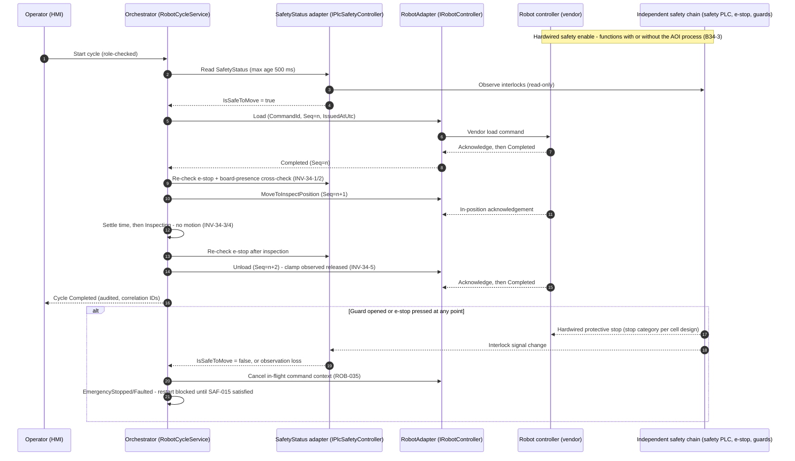

# VOL11 — Robot and Safety Boundary; MES/ERP and OPC UA Architecture — AOI Software Architecture, Secure Development, and Change-Control Standard, v1.0 (2026-07-15)

Scope: normative requirements for the robot/safety software boundary (§34) and for MES/ERP integration over REST and OPC UA, including the store-and-forward outbox (§35), across Stages 1–4 of AOI Monitor.

Supersedes/Related existing docs: this volume incorporates by reference and does not retire `Docs/Integration_Boundaries.md`, `Docs/Vendor_Adapter_Implementation_Guide.md`, `Docs/Architecture_Extension_Guide.md`, `Docs/Central_Sync_Mapping.md`, `Docs/Hardware_In_The_Loop_Checklist.md`, and `Docs/Factory_Acceptance_Test_Plan.md` (Stage 3/4 sections). Where the legacy `Docs/Industrial_Quality_Checklist.md` rows `MES-001`/`MES-002` and `HW-003`..`HW-005` overlap this volume, this volume governs; the legacy-ID reconciliation rule is owned by §5 (VOL01). The requirement IDs `MES-xxx` in this volume belong to this standard's namespace and are distinct from the legacy checklist IDs of the same shape.

---

## 34. Robot and Safety Boundary

This section governs every interaction between AOI Monitor and robot/handler motion, and every consumption of machinery-safety status. It exists because the source specifications assigned "safety interlock & emergency stop integration" to application software (spec defect SD-04, resolved by decision D-18), which is unsafe as written: a non-real-time Windows WPF process cannot implement a safety function under ISO 13849-1:2023 [13849-1] or IEC 62061:2021 [62061]. The boundary with §17 (VOL04) is that §17 owns the inspection state machine itself; this section owns what that state machine is permitted to send to a robot and what it must observe before doing so. The boundary with §27 (VOL07) is that VOL07 owns the Stage 3 robot-cell threat model; this section adds the residual robot-specific abuse cases and their controls. The boundary with §36 (VOL12) is that VOL12 owns HMI presentation rules; this section owns what safety information the HMI is prohibited from pretending to control.

### 34.1 Normative boundary statements

> **B34-1 (NORMATIVE).** General-purpose AOI software — including every part of AOI Monitor — is NOT a substitute for a safety-rated controller, safety PLC, safety relay, e-stop circuit, guard interlock, or any validated safety function. No AOI Monitor feature, present or future, satisfies a machinery safety requirement.
>
> **B34-2 (NORMATIVE).** The AOI GUI SHALL NOT be the sole implementation of an emergency stop. A software button is not an e-stop device under ISO 13850:2015 [13850] and IEC 60204-1:2016+AMD1:2021 [60204-1].
>
> **B34-3 (NORMATIVE).** Loss of the AOI process (crash, hang, power-down of the workstation, network loss) SHALL NOT defeat, delay, or degrade the independent safety chain. The safety chain functions identically with the AOI workstation removed from the cell.
>
> **B34-4 (NORMATIVE).** Safety functions require a machinery risk assessment per ISO 12100:2010 [12100] and qualified safety engineering to a Performance Level per ISO 13849-1:2023 [13849-1] or a SIL per IEC 62061:2021+AMD1:2024 [62061]; robot and robot-cell requirements follow ISO 10218-1:2025 and ISO 10218-2:2025 [10218-1][10218-2]. These are Controls & Safety Engineer and External Safety Assessor deliverables, not software deliverables.
>
> **B34-5 (NORMATIVE).** The application only OBSERVES safety status, via the Safety Status Adapter (component `SafetyStatus`; repo seam `IPlcSafetyController`/`IEmergencyStopMonitor` in `AOI_Monitor/Services/IntegrationContracts.cs`). Loss of the observation channel SHALL be treated as unsafe (decision D-18).

These statements are binding prose; SAF-001 through SAF-022 below make them individually testable. Two edition caveats carried from the research pack: EN ISO 10218-1/-2:2025 are not yet cited in the EU Official Journal (status UNVERIFIED/pending as of 2026-07-15 — design to the 2025 editions, declare against what is cited at build time), and the widely reported PL c floor for e-stop functions in ISO 13850:2015 clause 4.1.4 is UNVERIFIED at clause level and must be confirmed against the purchased standard text.

### 34.2 Current repo reality (grounding)

The repo is already on the correct side of the boundary in structure and mostly on the wrong side in defaults:

- `RobotCycleService` (`AOI_Monitor/Services/RobotCycleService.cs`) implements an 11-state load/inspect/unload FSM with per-transition audit, safety-status gating before each command, and a double e-stop check (before and after each command). This is the Orchestrator seam this section codifies.
- `SafetyStatus.IsSafeToMove` (`IntegrationContracts.cs:151-158`) requires six interlocks (guard door, e-stop, air pressure, servo ready, board clamp, light curtain) AND zero active faults. `NullPlcSafetyController` reports all interlocks false — unsafe-by-default, which is correct.
- Nonconformity 1: `PermitSafetyBypassForSimulation` defaults **true** (`RobotCycleService.cs:37`), and the bypass predicate keys off robot `Status != Ready`, so a misbehaving real adapter self-reporting `Error` with no PLC configured would receive motion commands with only an audit trail (repo gap 9b-6). SAF-010 and SAF-011 invert this.
- Nonconformity 2: e-stop is polled only at command edges; nothing aborts an in-flight adapter call (`RobotCycleService.cs:249-278`). SAF-013 and ROB-035 close this.
- Nonconformity 3: `TcpTextPlcSafetyController` (`IntegrationContracts.cs:341-379`) performs no TCP I/O despite its name; it must be renamed or replaced before any commissioning use (ROB-023 status-truthfulness scope).
- Correct by design: robot adapters are deliberately NOT loaded through the drop-folder plugin loader; registration happens in a reviewed commissioning bootstrap (`Templates/RobotControllerTemplate/README.md:9`; `Docs/Vendor_Adapter_Implementation_Guide.md:74`). ROB-026 makes this permanent.
- `RobotCycleService` state is not thread-safe (no lock around `CurrentState`) — ROB-034.

### 34.3 Robot command architecture

All robot interaction flows through exactly one path: Orchestrator (§17 state machine, VOL04 ORC catalogue) → `RobotAdapter` (`IRobotController` implementation registered at commissioning) → vendor controller. The command surface is a closed, versioned allowlist:

| Allowlist v1 command | Class | Motion-adjacent | Preconditions (Table 34-2) |
|---|---|---|---|
| `Load` | Primary | Yes | INV-34-1 |
| `MoveToInspectPosition` | Primary | Yes | INV-34-2 |
| `Unload` | Primary | Yes | INV-34-5 |
| `Home` | Auxiliary | Yes | INV-34-6 |
| `ResetFault` | Auxiliary | No | SAF-015 restart rule |
| `AbortCycle` | Auxiliary | No (stop request) | none — always permitted |
| `QueryStatus` | Auxiliary | No | none — always permitted |

`AbortCycle` is an ordinary-channel stop request and is NOT an e-stop; the independent safety chain remains the only protective stop. Any command not in the active allowlist version is rejected before transport (ROB-001). Commands are typed records — never strings — with monotonic sequence numbers, mandatory acknowledgements, per-command timeouts, and stale-command rejection (ROB-002..ROB-006).

### 34.4 Motion modes, roles, and operator presence

The application models three motion modes: `Automatic` (production cycle), `Manual` (single stepped commands), `Maintenance` (commissioning/diagnostics). Mode is observed from the controller; the application never selects the controller's physical operating mode (mode selection, teach enable, and safety reset are physical safety-rated devices per IEC 60204-1 and ISO 10218-2 — SAF-019). Manual and Maintenance commands carry role gates (≥ Engineer, mapped to the §28 role model, VOL07 IAM catalogue) and require the controller-reported enabling/operator-presence condition (ROB-012..ROB-014).

### 34.5 Motion invariants

Table 34-2 — motion invariants (binding via ROB-020):

| ID | Invariant |
|---|---|
| INV-34-1 | `Load` only when nest board-presence sensor reads empty, clamp observed released, and `IsSafeToMove` true |
| INV-34-2 | `MoveToInspectPosition` only when board load confirmed and clamp observed engaged |
| INV-34-3 | Inspection starts only after in-position acknowledgement plus configured settle time |
| INV-34-4 | No motion command while camera acquisition or exposure is in progress |
| INV-34-5 | `Unload` only when clamp observed released and board-presence sensor reads present |
| INV-34-6 | No new cycle (and no `Home`) until the previous cycle reached a terminal state (Completed, Canceled, or acknowledged Faulted/EmergencyStopped) |

### 34.6 Recovery matrix

Table 34-3 — recovery matrix (binding via ROB-028..ROB-031; each row = detection, safe state, resume rule, duplicate-motion prevention):

| Scenario | Detection | Safe state | Resume rule | Duplicate-motion prevention |
|---|---|---|---|---|
| Application crash/restart | Unclean-shutdown marker + persisted cycle state non-terminal | Orchestrator starts `NotSynchronized`; zero motion commands | Engineer-role reconciliation: `QueryStatus` + board-presence read, then `ResetFault`/`Home` | Last issued `CommandId`+sequence persisted before send; controller queried for last executed command before any new issue |
| Network loss to controller | Acknowledgement timeout or heartbeat loss (default 3 s) | `Faulted`; in-flight command outcome recorded `Unknown` | Reconnect, `QueryStatus`, operator reset | Commands with outcome `Unknown` are never auto-resent; re-issue only through the manual recovery flow |
| Controller reset | Sequence regression, session/boot-counter change, or `NotConnected`→`Ready` transition | `Faulted`; all pending intent invalidated | `Home` + operator confirmation of nest/board state | Session change invalidates every outstanding `CommandId`; no queued command survives the reset |
| Power loss (station or cell) | Unclean-shutdown marker (station); safety chain de-energizes actuators (cell, hardware behavior) | Hardware: safety chain removes power. Software on restart: as application crash + controller reset combined | Full re-home plus board-presence verification before any cycle | No persisted motion-command queue exists for auto-replay (ROB-031); recovery always starts from observed physical state |

The vendor controller holding a safe standstill on comms loss is a procurement requirement on the robot package (ISO 10218-1:2025 functional safety requirements), recorded in the Stage 3 procurement specification — not a behavior this application can create.

### 34.7 Load-inspect-unload sequence



**Reading this diagram:** The operator starts a cycle at the HMI; the Orchestrator first reads the Safety Status Adapter, which passively observes the independent safety chain. Only with `IsSafeToMove` true does the Orchestrator issue the typed `Load` command (with command ID, monotonic sequence number, and issue timestamp) through the RobotAdapter to the vendor controller, which must acknowledge and then report completion. Between `Load`, `MoveToInspectPosition`, and `Unload`, the Orchestrator re-checks e-stop status and the motion invariants of Table 34-2 (board presence, clamp state, in-position acknowledgement plus settle time). Inspection itself involves no motion. The bottom `alt` block is the safety-chain lane: when a guard opens or an e-stop is pressed, the safety chain stops the robot by hardware, entirely independent of the AOI process; the application merely observes the change, cancels its in-flight command context, transitions to `EmergencyStopped`/`Faulted`, and blocks restart until the chain is observed reset and a deliberate operator restart action occurs.

### 34.8 Threat model pointer and residual robot abuse cases

The Stage 3 robot-cell threat model (STRIDE, abuse cases, attack trees) is owned by §27 (VOL07). The following residual robot-specific abuse cases are additionally in scope here, each with its binding control in this volume:

| ID | Abuse case | Control |
|---|---|---|
| AC-ROB-01 | Config edit flips `PermitSafetyBypassForSimulation` true on a production station | SAF-010, SAF-012 |
| AC-ROB-02 | Real adapter self-reports `Simulated`/`Error` to inherit the simulation bypass | SAF-011 |
| AC-ROB-03 | Replayed or duplicated `Load` command causes a second motion into an occupied nest | ROB-003, ROB-006, ROB-007, ROB-018 |
| AC-ROB-04 | UI automation or scripted input drives motion through GUI event handlers | ROB-008, ROB-009 |
| AC-ROB-05 | Stale queued command executes after a guard was opened and re-closed | ROB-006, SAF-013, SAF-015 |
| AC-ROB-06 | Malicious/mistaken adapter registration outside the commissioning bootstrap | ROB-026, ROB-025 |
| AC-ROB-07 | MES/OPC UA channel used to trigger motion remotely | OPU-017 (§35), ROB-008 |
| AC-ROB-08 | Tampered persisted cycle state causes double unload after restart | ROB-028, ROB-031, ROB-017 |

### R: Safety boundary and safety-status observation (SAF-001..SAF-022)

**[SAF-001]** (P0 | ALL | SafetyStatus, Orchestrator)
The application SHALL NOT implement or substitute for any machinery safety function, including emergency stop, guard interlocking, protective stop, muting, or safety-rated speed/space limiting.
- Why: a Windows WPF process cannot meet SRP/CS obligations; a software "safety function" creates machinery liability (SD-04). Maps: 13849-1; 12100; Internal (D-18).
- Verify: architecture review checklist item ARC-SAFE-1 each release + FF-SAF-01 grep gate (no safety-function claims in code/docs). Evidence: review record + CI gate log. Owner: Software Architect. Auto: Partially automated.
- Exception: Not allowed. Review: Per release.

**[SAF-002]** (P0 | ALL | HMI, SafetyStatus)
The HMI SHALL NOT present any software control labeled or styled as an emergency stop device.
- Why: a soft button is not a single-action, always-available e-stop; ISO 13850 actuator requirements (red mushroom, yellow background, latching) apply to physical devices only. Maps: 13850; 60204-1; Internal (D-18).
- Verify: HMI review checklist item HMI-SAFE-1 + `HmiLayoutAuditService` rule extension scanning for e-stop-styled controls. Evidence: layout audit JSON. Owner: QA Lead. Auto: Partially automated.
- Exception: Not allowed. Review: Per release.

**[SAF-003]** (P0 | S3+ | SafetyStatus)
The Stage 3 cell commissioning SHALL demonstrate, with recorded evidence, that terminating the AOI process leaves e-stop and guard-interlock functions fully operational.
- Why: proves B34-3 physically — the safety chain is independent of the observation software. Maps: 13849-1; 10218-2; 60204-1.
- Verify: commissioning test in `Docs/Hardware_In_The_Loop_Checklist.md` (process-kill safety test) executed per deployment. Evidence: signed commissioning record. Owner: Controls & Safety Engineer. Auto: Manual review.
- Exception: Not allowed. Review: On change.

**[SAF-004]** (P1 | S3+ | SafetyStatus, All)
Every Stage 3 deployment SHALL have a documented, living ISO 12100 machinery risk assessment file before any motion enable in that cell.
- Why: risk assessment is the legal and normative entry condition for all safeguarding (ISO 10218-2:2025 integrator duty; MD/MR technical file). Maps: 12100; 10218-2; MR.
- Verify: Stage 3 readiness gate checks presence and date of the risk assessment record. Evidence: risk assessment file reference in FactoryReadiness export. Owner: Controls & Safety Engineer. Auto: Partially automated.
- Exception: Not allowed. Review: On change.

**[SAF-005]** (P1 | S3+ | SafetyStatus)
Each cell safety function SHALL have a documented required Performance Level (ISO 13849-1:2023) or SIL (IEC 62061:2021) assigned by qualified safety engineering before production enable.
- Why: PLr/SIL assignment is the quantitative core of functional safety; per-function values in ISO 10218-2:2025 are UNVERIFIED here and must come from the standard text plus risk assessment. Maps: 13849-1; 62061; 10218-2.
- Verify: External Safety Assessor review of the safety requirements specification. Evidence: SRS document per safety function. Owner: External Safety Assessor. Auto: External assessment.
- Exception: Not allowed. Review: On change.

**[SAF-006]** (P2 | S3+ | SafetyStatus)
The Stage 3 cell technical file SHALL contain an explicit statement that AOI Monitor is not part of any safety-related part of the control system (SRP/CS).
- Why: prevents an assessor or customer from mistakenly crediting the application in the safety loop, which would trigger ISO 13849-1 Clause 7 SRESW obligations it cannot meet. Maps: 13849-1; MR; Internal (D-18).
- Verify: technical-file review checklist item. Evidence: technical file section reference. Owner: Controls & Safety Engineer. Auto: Manual review.
- Exception: Not allowed. Review: On change.

**[SAF-007]** (P0 | S3+ | SafetyStatus, Orchestrator)
The Orchestrator SHALL treat any safety-status observation loss (adapter status `NotConnected` or `Error`, read timeout, or stale data per SAF-009) as not-safe-to-move.
- Why: fail-closed observation is the core of D-18; the existing `NullPlcSafetyController` all-unsafe default is the model behavior. Maps: Internal (D-18); 62443-4-2 CR 3.6; 800-82.
- Verify: `SafetyObservationTests` (new xUnit class extending `AOI_Monitor.Tests/IntegrationContractsTests.cs`) covering each loss mode. Evidence: CI test results. Owner: Software Lead. Auto: Fully automated.
- Exception: Not allowed. Review: Per release.

**[SAF-008]** (P1 | S3+ | SafetyStatus)
The `SafetyStatus` contract SHALL expose all six interlock signals (guard door, e-stop, air pressure, servo ready, board clamp, light curtain) plus the active-fault list, with `IsSafeToMove` true only when all six are satisfied and zero faults are active.
- Why: codifies the existing `SafetyStatus.IsSafeToMove` semantics (`IntegrationContracts.cs:151-158`) so no adapter can weaken the aggregate. Maps: Internal (D-18); 10218-2.
- Verify: contract test in `IntegrationContractsTests.cs` asserting the conjunction over all combinations. Evidence: CI test results. Owner: Software Lead. Auto: Fully automated.
- Exception: Not allowed. Review: Per release.

**[SAF-009]** (P2 | S3+ | SafetyStatus)
Every safety-status reading SHALL carry a source timestamp, and readings older than the configured maximum age (default 500 ms) SHALL be classified as observation loss.
- Why: a frozen adapter returning cached "safe" values is indistinguishable from a live one without freshness; default is ASSUMPTION A-VOL11-2. Maps: Internal (D-18); 62443-4-2 CR 3.6.
- Verify: `SafetyObservationTests` stale-reading case with a simulated frozen adapter. Evidence: CI test results. Owner: Software Lead. Auto: Fully automated.
- Exception: Allowed — approver: Controls & Safety Engineer. Review: On change.

**[SAF-010]** (P0 | ALL | Config, SafetyStatus)
`PermitSafetyBypassForSimulation` SHALL be false except while the operating mode is Demo with no real robot adapter registered.
- Why: the flag therefore defaults false and can never be true on a production station; inverts repo nonconformity 9b-6 (`RobotCycleService.cs:37` defaults true) so production hardening does not depend on configuration discipline. Maps: Internal (D-18); 62443-4-2 CR 7.7; CWE-1188.
- Verify: FF-SAF-02 fitness function (unit test asserting the default + config-schema gate) in CI. Evidence: CI gate log. Owner: Security Lead. Auto: Fully automated.
- Exception: Not allowed. Review: Per release.

**[SAF-011]** (P2 | ALL | SafetyStatus, Simulation)
The simulation safety bypass SHALL activate only when the registered robot controller reports status `Simulated`, never for controllers reporting `Error`, `NotConnected`, or `Ready`.
- Why: closes abuse case AC-ROB-02 — the current predicate (`Status != Ready` plus PLC `NotConnected`, `RobotCycleService.cs:296-299`) grants motion to malfunctioning real adapters. Maps: Internal (D-18); CWE-754.
- Verify: `SafetyObservationTests` bypass-predicate matrix over all four status values. Evidence: CI test results. Owner: Software Lead. Auto: Fully automated.
- Exception: Not allowed. Review: Per release.

**[SAF-012]** (P2 | ALL | Audit, SafetyStatus)
Every activation of the simulation safety bypass SHALL be recorded as a `ROBOT_SAFETY_BYPASS` audit event carrying operator identity, role, and the observed adapter statuses.
- Why: preserves the existing audited-bypass behavior (`RobotCycleService.cs:289-310`) as a permanent obligation for forensic traceability. Maps: 62443-4-2 CR 2.8; Internal.
- Verify: existing `IntegrationContractsTests.cs` bypass-audit assertions extended to include identity fields. Evidence: CI test results + audit rows. Owner: Software Lead. Auto: Fully automated.
- Exception: Not allowed. Review: Annual.

**[SAF-013]** (P1 | S3+ | SafetyStatus, Orchestrator)
During any in-flight motion command, the Orchestrator SHALL evaluate e-stop and interlock status continuously at a period of 250 ms or less and, on a not-safe observation, cancel the in-flight command context.
- Why: closes the edge-polling gap (`RobotCycleService.cs:249-278` checks only before/after commands); period default is ASSUMPTION A-VOL11-2. Maps: Internal (D-18); 60204-1.
- Verify: `SafetyObservationTests` in-flight abort case using a simulated long-running adapter call. Evidence: CI test results. Owner: Software Lead. Auto: Fully automated.
- Exception: Not allowed. Review: Per release.

**[SAF-014]** (P2 | S2+ | HMI, SafetyStatus)
The HMI SHALL display observed e-stop, guard, and interlock state using color plus a non-color signal (text or icon) per the §36 HMI rules (VOL12).
- Why: red/green-only safety indication is a defect-escape mechanism for color-vision-deficient operators; aligns with the repo rule "color must never be the only signal" (`AGENTS.md:81`). Maps: Internal; 60204-1.
- Verify: `HmiLayoutAuditService` status-signal rule + UI test. Evidence: layout audit JSON. Owner: QA Lead. Auto: Partially automated.
- Exception: Not allowed. Review: Per release.

**[SAF-015]** (P1 | S3+ | Orchestrator, SafetyStatus)
After an observed e-stop or protective stop, the Orchestrator SHALL block all motion commands until the safety chain is observed reset AND a deliberate, role-checked operator restart action is performed at the HMI.
- Why: mirrors the ISO 13850 anti-restart principle (e-stop reset must not restart the machine) in the observation layer; extends existing `ResetAsync` behavior (`RobotCycleService.cs:177-212`). Maps: 13850; 60204-1; Internal (D-18).
- Verify: `IntegrationContractsTests.cs` reset-sequence tests (existing e-stop tests at lines 121-136 extended with restart-action assertion). Evidence: CI test results. Owner: Software Lead. Auto: Fully automated.
- Exception: Not allowed. Review: Per release.

**[SAF-016]** (P3 | S3+ | SafetyStatus, Config)
The application SHALL record the cell's e-stop stop category (0 or 1 per IEC 60204-1 clause 9.2.2) as read-only commissioning metadata without implementing or selecting it.
- Why: safe-stop category awareness supports diagnostics and operator guidance; category selection is a controller-side risk-assessment output, never an application setting. Maps: 60204-1; 13850.
- Verify: commissioning checklist item recording the category into station config. Evidence: station configuration record. Owner: Controls & Safety Engineer. Auto: Manual review.
- Exception: Allowed — approver: Controls & Safety Engineer. Review: On change.

**[SAF-017]** (P2 | S3+ | SafetyStatus, RobotAdapter)
Safety status SHALL be represented, logged, and displayed on a channel separate from ordinary robot command status, never merged into a single aggregate indicator.
- Why: a merged "OK" light hides which of quality/motion/safety degraded; the repo's four-state `IntegrationConnectionStatus` already keeps them distinct — this preserves that separation. Maps: Internal (D-18); 62443-4-2 CR 2.9.
- Verify: contract review checklist + `HmiLayoutAuditService` indicator rule. Evidence: review record + layout audit JSON. Owner: Software Architect. Auto: Partially automated.
- Exception: Not allowed. Review: Annual.

**[SAF-018]** (P2 | S3+ | Audit, SafetyStatus)
Every transition of an observed safety signal SHALL be written as an audit event with UTC timestamp under a dedicated `SAFETY_STATUS` category.
- Why: incident reconstruction requires the safety-signal timeline alongside command audit; supports plant SOC log consumption. Maps: 62443-4-2 CR 2.8; 62443-3-3 SR 2.8; Internal (D-09).
- Verify: `SafetyObservationTests` transition-audit case. Evidence: audit rows in CI test DB. Owner: Software Lead. Auto: Fully automated.
- Exception: Not allowed. Review: Annual.

**[SAF-019]** (P2 | S3+ | SafetyStatus, HMI)
Operating-mode selection, teach enable, and safety-chain reset SHALL be physical controller-side devices, and the HMI SHALL NOT expose soft controls for them.
- Why: span-of-control and mode-selection devices are safety-rated hardware per IEC 60204-1 and ISO 10218-2; soft equivalents recreate SD-04. Maps: 60204-1; 10218-2; 13850.
- Verify: HMI review checklist item HMI-SAFE-2 per release. Evidence: review record. Owner: Controls & Safety Engineer. Auto: Manual review.
- Exception: Not allowed. Review: Per release.

**[SAF-020]** (P3 | ALL | SafetyStatus)
The Controls & Safety Engineer SHOULD re-verify the cited safety-standard editions (ISO 12100, ISO 13849-1/-2, ISO 13850, ISO 10218-1/-2, IEC 62061, IEC 60204-1) once per year and record the review outcome.
- Why: cited safety-standard editions drift over time — ISO 12100:2010 remains current with no published revision per the research pack (2026-07-15) — and unmonitored edition drift silently invalidates citations. Maps: Internal.
- Verify: annual standards-watch review record in the risk register. Evidence: dated review entry. Owner: Controls & Safety Engineer. Auto: Manual review.
- Exception: Allowed — approver: Software Architect. Review: Annual.

**[SAF-021]** (P1 | ALL | Inference, Decision, SafetyStatus)
No inference or ML output SHALL feed any safety function, safety decision, or motion-enable condition.
- Why: ML in a safety function triggers EU MR 2023/1230 Annex I Part A mandatory notified-body assessment and ISO 13849-1 Clause 7 obligations; inspection pass/fail is a quality function only. Maps: MR; 13849-1; AI-RMF.
- Verify: FF-SAF-03 NetArchTest rule (Inference/Decision namespaces have no reference path to RobotAdapter/SafetyStatus write surfaces) + architecture review. Evidence: CI gate log. Owner: Software Architect. Auto: Partially automated.
- Exception: Not allowed. Review: Per release.

**[SAF-022]** (P2 | S3+ | SafetyStatus)
The Safety Status Adapter for a real PLC SHALL be validated during commissioning against physically induced states (each interlock opened, e-stop pressed, chain reset) with recorded per-signal evidence before production enable.
- Why: proves the observation channel reads the real chain, not a stub — the current `TcpTextPlcSafetyController` reads nothing (`IntegrationContracts.cs:374`). Maps: 13849-2; 10218-2; Internal (D-18).
- Verify: `Docs/Hardware_In_The_Loop_Checklist.md` PLC interlock section executed per deployment. Evidence: signed HIL record + `RobotAcceptanceRuns` rows. Owner: Controls & Safety Engineer. Auto: Manual review.
- Exception: Not allowed. Review: On change.

### R: Robot command integration (ROB-001..ROB-041)

**[ROB-001]** (P1 | S3+ | RobotAdapter, Orchestrator)
Robot commands SHALL be restricted to the active versioned allowlist (v1: `Load`, `MoveToInspectPosition`, `Unload`, `Home`, `ResetFault`, `AbortCycle`, `QueryStatus`), with any other command rejected before transport.
- Why: a closed command surface removes entire injection and misuse classes; allowlist changes become reviewable artifacts. Maps: 62443-4-2 CR 3.5; CWE-749; ATTACK-ICS.
- Verify: `RobotCommandContractTests` (new xUnit class) rejection matrix + FF-ROB-01 gate asserting the allowlist constant is versioned. Evidence: CI test results. Owner: Software Lead. Auto: Fully automated.
- Exception: Allowed — approver: Software Architect. Review: On change.

**[ROB-002]** (P1 | S3+ | RobotAdapter)
Every robot command SHALL be a typed record containing `CommandId` (GUID), monotonic sequence number, allowlist command name, typed parameters, and `IssuedAtUtc`.
- Why: typed schemas make commands auditable, testable, and immune to string-assembly defects. Maps: CWE-20; 62443-4-2 CR 3.5; Internal (D-16).
- Verify: `RobotCommandContractTests` schema round-trip tests. Evidence: CI test results. Owner: Software Lead. Auto: Fully automated.
- Exception: Not allowed. Review: Per release.

**[ROB-003]** (P2 | S3+ | RobotAdapter)
Command sequence numbers SHALL be strictly monotonic per adapter session, and the adapter SHALL reject any out-of-order or duplicate sequence number.
- Why: ordering defense against duplication and reordering (AC-ROB-03), and the detection primitive for controller resets (ROB-030). Maps: CWE-294; 62443-4-2 CR 3.1.
- Verify: `RobotCommandContractTests` out-of-order/duplicate cases. Evidence: CI test results. Owner: Software Lead. Auto: Fully automated.
- Exception: Not allowed. Review: Per release.

**[ROB-004]** (P1 | S3+ | RobotAdapter, Orchestrator)
A robot command lacking an explicit adapter acknowledgement within its per-command timeout SHALL transition the cycle to `Faulted`.
- Why: unacknowledged motion is the canonical duplicate-motion hazard; fail to `Faulted`, with the no-automatic-retry rule owned by ROB-016. Maps: Internal; 62443-4-2 CR 3.6.
- Verify: `RobotCommandContractTests` ack-timeout case with simulated silent adapter. Evidence: CI test results. Owner: Software Lead. Auto: Fully automated.
- Exception: Not allowed. Review: Per release.

**[ROB-005]** (P2 | S3+ | RobotAdapter, Config)
Per-command timeout values SHALL be configured per command type in the commissioning configuration, with defaults Load 30 s, MoveToInspectPosition 15 s, Unload 30 s, Home 60 s, ResetFault 10 s, QueryStatus 5 s.
- Why: bounded waiting per command class; defaults are ASSUMPTION A-VOL11-1 pending vendor timing data (`Docs/Vendor_Adapter_Implementation_Guide.md:52-61`). Maps: Internal; 62443-4-2 CR 7.1.
- Verify: config schema validation test + `RobotCommandContractTests` timeout enforcement. Evidence: CI test results. Owner: Software Lead. Auto: Fully automated.
- Exception: Allowed — approver: Software Architect. Review: On change.

**[ROB-006]** (P2 | S3+ | RobotAdapter)
The adapter SHALL reject any command whose `IssuedAtUtc` age exceeds the configured maximum command age (default 2,000 ms) at the moment of transport.
- Why: stale-command rejection prevents queued intent from executing after conditions changed (AC-ROB-05); duration measurement uses monotonic clocks per D-16. Maps: CWE-294; Internal (D-16).
- Verify: `RobotCommandContractTests` stale-command case. Evidence: CI test results. Owner: Software Lead. Auto: Fully automated.
- Exception: Allowed — approver: Software Architect. Review: On change.

**[ROB-007]** (P2 | S3+ | RobotAdapter)
Where the robot transport provides session, message authentication, or anti-replay features, the adapter SHALL enable them; where it cannot, the residual replay risk SHALL be recorded in the risk register (§56, VOL19) with the compensating cell-network controls.
- Why: many vendor motion protocols carry no authentication (ASSUMPTION A-VOL11-4); the control is then segmentation plus point-to-point wiring, and pretending otherwise hides risk. Maps: CWE-294; 62443-3-3 SR 5.1; 800-82.
- Verify: adapter commissioning review checklist + risk-register entry check. Evidence: commissioning record. Owner: Security Lead. Auto: Manual review.
- Exception: Allowed — approver: Security Lead. Review: On change.

**[ROB-008]** (P1 | S3+ | Orchestrator, RobotAdapter)
Robot commands SHALL be issued exclusively by the Orchestrator component executing the §17 inspection state machine (VOL04 ORC catalogue).
- Why: single issuance point makes state validation enforceable and eliminates GUI-event-handler command paths (AC-ROB-04); `RobotCycleService` is the existing seam to be preserved. Maps: Internal; 62443-4-2 CR 2.1.
- Verify: FF-ROB-02 NetArchTest rule — only the Orchestrator namespace may reference `IRobotController`; Views/ViewModels references fail the gate. Evidence: CI gate log. Owner: Software Architect. Auto: Fully automated.
- Exception: Not allowed. Review: Per release.

**[ROB-009]** (P0 | ALL | RobotAdapter, HMI)
The application SHALL NOT derive any robot command name or command parameter from user-entered free text.
- Why: user strings becoming motion is command injection with physical consequences; parameters come only from typed configuration and recipe data under §18 lifecycle control. Maps: CWE-77; CWE-20; ATTACK-ICS.
- Verify: FF-ROB-03 analyzer/grep gate (no string-typed parameter path from UI input APIs into RobotAdapter) + code review checklist. Evidence: CI gate log. Owner: Security Lead. Auto: Partially automated.
- Exception: Not allowed. Review: Per release.

**[ROB-010]** (P1 | S3+ | Orchestrator)
The Orchestrator SHALL validate the FSM state transition before sending any command, rejecting and auditing invalid transitions without transport.
- Why: codifies existing behavior (`RobotCycleService.cs:339-347`) — the FSM is the contract that makes cycle behavior predictable and testable. Maps: CWE-841; Internal.
- Verify: existing `IntegrationContractsTests.cs` invalid-transition tests (line 108 area) kept green. Evidence: CI test results. Owner: Software Lead. Auto: Fully automated.
- Exception: Not allowed. Review: Per release.

**[ROB-011]** (P0 | S3+ | Orchestrator, SafetyStatus)
The Orchestrator SHALL evaluate the full `SafetyStatus` (SAF-008) immediately before every motion-adjacent transition and block the transition unless `IsSafeToMove` is true.
- Why: interlock validation before motion is the load-bearing observation control; preserves and hardens the existing gate order (`RobotCycleService.cs:249-278`). Maps: Internal (D-18); 10218-2; 62443-4-2 CR 2.1.
- Verify: `IntegrationContractsTests.cs` safety-fault-blocks-load tests (line 218 area) + `SafetyObservationTests`. Evidence: CI test results. Owner: Software Lead. Auto: Fully automated.
- Exception: Not allowed. Review: Per release.

**[ROB-012]** (P2 | S3+ | Orchestrator, RobotAdapter)
The application SHALL tag every robot command with the observed motion mode (`Automatic`, `Manual`, or `Maintenance`) at issue time.
- Why: mode-tagged commands make role gates (ROB-013), presence gates (ROB-014), and audits (ROB-024) enforceable and reconstructable. Maps: Internal; 62443-4-2 CR 2.8.
- Verify: `RobotCommandContractTests` mode-tag assertions. Evidence: CI test results. Owner: Software Lead. Auto: Fully automated.
- Exception: Not allowed. Review: Per release.

**[ROB-013]** (P2 | S3+ | Orchestrator, IAM)
Commands tagged `Manual` or `Maintenance` SHALL require an acting role of Engineer or higher, enforced at the service layer per the §28 role model (VOL07 IAM catalogue).
- Why: motion outside the automatic cycle is a commissioning/service activity; service-layer enforcement avoids the repo's UI-only permission pattern. Maps: 62443-4-2 CR 2.1; Internal (D-11).
- Verify: `RobotCommandContractTests` role-gate cases (Operator rejected, Engineer accepted). Evidence: CI test results. Owner: Software Lead. Auto: Fully automated.
- Exception: Not allowed. Review: Per release.

**[ROB-014]** (P2 | S3+ | Orchestrator, SafetyStatus)
The application SHALL issue `Manual` or `Maintenance` commands only while the controller reports the corresponding physical mode active and its operator-presence (enabling) condition satisfied.
- Why: enabling devices and mode selection are controller-side safety hardware (SAF-019); the application must not act against the physical mode. Maps: 10218-2; 60204-1.
- Verify: `RobotCommandContractTests` mode-mismatch rejection case. Evidence: CI test results. Owner: Software Lead. Auto: Fully automated.
- Exception: Not allowed. Review: Per release.

**[ROB-015]** (P1 | S3+ | Orchestrator)
After a `Faulted` state that is not an observed e-stop or protective stop, the Orchestrator SHALL block all motion commands until an explicit `ResetFault` succeeds under an Engineer-or-higher role.
- Why: restart prevention after a non-safety fault; the e-stop and protective-stop anti-restart path is owned solely by SAF-015. Extends `ResetAsync` (`RobotCycleService.cs:177-212`) with an explicit role gate. Maps: Internal (D-18); CWE-841; 62443-4-2 CR 3.6.
- Verify: `IntegrationContractsTests.cs` non-safety-fault reset tests asserting the Engineer-or-higher role gate. Evidence: CI test results. Owner: Software Lead. Auto: Fully automated.
- Exception: Not allowed. Review: Per release.

**[ROB-016]** (P1 | S3+ | Orchestrator, RobotAdapter)
The application SHALL NOT automatically retry any failed, rejected, timed-out, or unacknowledged motion command.
- Why: motion is not idempotent by default; blind retry is the primary duplicate-motion mechanism (crushed boards, tool collisions). Maps: Internal; CWE-841.
- Verify: FF-ROB-04 grep/analyzer gate (no retry loop around motion dispatch) + `RobotCommandContractTests` no-retry case. Evidence: CI gate log + test results. Owner: Software Lead. Auto: Fully automated.
- Exception: Not allowed. Review: Per release.

**[ROB-017]** (P1 | S3+ | Orchestrator)
Before any operator-initiated re-issue of a motion command after a fault, the Orchestrator SHALL query controller state and board-presence sensors and SHALL treat an unreconciled or unknown physical state as requiring manual recovery.
- Why: re-issue is permitted only with explicit idempotency and physical-state analysis; "unknown" must never default to "safe to move". Maps: Internal; 62443-4-2 CR 3.6.
- Verify: `RobotRecoveryMatrixTests` (new xUnit class) re-issue precondition cases. Evidence: CI test results. Owner: Software Lead. Auto: Fully automated.
- Exception: Not allowed. Review: Per release.

**[ROB-018]** (P2 | S3+ | Orchestrator, SafetyStatus)
The Orchestrator SHALL cross-check board-presence sensors against expected state before `Load` and `Unload`, transitioning to `Faulted` with an operator alarm on mismatch.
- Why: physical cross-checks catch duplicate loads, ghost unloads, and sensor faults that command-level checks cannot (INV-34-1/INV-34-5). Maps: Internal; 10218-2.
- Verify: `RobotRecoveryMatrixTests` presence-mismatch cases with simulated sensors. Evidence: CI test results. Owner: Software Lead. Auto: Fully automated.
- Exception: Not allowed. Review: Per release.

**[ROB-019]** (P2 | S3+ | Orchestrator, Acquisition)
Inspection SHALL start only after the controller's in-position acknowledgement for the inspect station plus the configured settle time (default 200 ms) has elapsed.
- Why: position verification before inspect prevents imaging a moving or misplaced board and corrupting quality evidence; settle default is ASSUMPTION A-VOL11-1. Maps: Internal; OPCUA-MV.
- Verify: `RobotCommandContractTests` in-position gating case. Evidence: CI test results. Owner: Software Lead. Auto: Fully automated.
- Exception: Allowed — approver: Software Architect. Review: On change.

**[ROB-020]** (P1 | S3+ | Orchestrator)
The Orchestrator SHALL block any robot command whose motion-invariant preconditions in Table 34-2 (INV-34-1..INV-34-6) are not satisfied.
- Why: the invariant table is the single normative statement of "never unload with clamp engaged" and its siblings; enforcement belongs at the issuance point. Maps: Internal; CWE-841.
- Verify: `RobotCommandContractTests` invariant matrix (one failing case per invariant). Evidence: CI test results. Owner: Software Lead. Auto: Fully automated.
- Exception: Not allowed. Review: Per release.

**[ROB-021]** (P2 | S3+ | RobotAdapter, Diagnostics)
The application and the robot adapter SHALL exchange bidirectional heartbeats with a configured period (default 1 s) and declare observation loss after a configured timeout (default 3 s).
- Why: watchdog in both directions detects hangs on either side between commands; defaults are ASSUMPTION A-VOL11-3. Maps: 62443-4-2 CR 7.1; Internal (D-18).
- Verify: `RobotRecoveryMatrixTests` heartbeat-loss case. Evidence: CI test results. Owner: Software Lead. Auto: Fully automated.
- Exception: Allowed — approver: Software Architect. Review: On change.

**[ROB-022]** (P2 | S3+ | RobotAdapter, Config)
The application SHALL NOT expose any editor or writable setting for robot speed, acceleration, workspace limits, or safety zones; these remain controller-side qualified configuration.
- Why: speed/workspace parameters are safety-relevant, owned by the integrator's validated controller configuration (ISO 10218-2), not by AOI-editable JSON. Maps: 10218-2; MR; Internal (D-18).
- Verify: settings review checklist + FF-ROB-05 grep gate over settings schemas. Evidence: CI gate log + review record. Owner: Software Architect. Auto: Partially automated.
- Exception: Not allowed. Review: Per release.

**[ROB-023]** (P3 | S3+ | RobotAdapter)
Robot command results SHALL use the closed vocabulary {`Accepted`, `Completed`, `Rejected`, `TimedOut`, `Aborted`, `Unknown`}, kept separate from `SafetyStatus` and from `IntegrationConnectionStatus`.
- Why: a truthful, closed result vocabulary prevents adapter-invented statuses and misleadingly named stubs (e.g. `TcpTextPlcSafetyController` performing no I/O). Maps: Internal; 62443-4-2 CR 2.9.
- Verify: `RobotCommandContractTests` result-vocabulary assertions. Evidence: CI test results. Owner: Software Lead. Auto: Fully automated.
- Exception: Not allowed. Review: Annual.

**[ROB-024]** (P2 | S3+ | Audit, RobotAdapter)
Every command issue, acknowledgement, completion, rejection, timeout, and abort SHALL be audited under `ROBOT_CYCLE` with the command's `CommandId` as correlation ID and UTC timestamps.
- Why: full command audit with correlation is the forensic backbone for incident and quality investigations; extends existing `ROBOT_CYCLE` auditing (`RobotCycleService.cs:47-50`). Maps: 62443-4-2 CR 2.8; 62443-3-3 SR 2.8; Internal (D-09).
- Verify: `RobotCommandContractTests` audit-correlation assertions over a full simulated cycle. Evidence: audit rows in CI test DB. Owner: Software Lead. Auto: Fully automated.
- Exception: Not allowed. Review: Annual.

**[ROB-025]** (P1 | ALL | CI, RobotAdapter)
Changes to motion sequencing or interlock handling code (at minimum `RobotCycleService.cs` and the robot/safety sections of `IntegrationContracts.cs`) SHALL require review by a second person, enforced via a CODEOWNERS path rule and required review status.
- Why: two-person review on motion-adjacent code is the change-control backstop; today CODEOWNERS is inert on the personal repo (repo gap 9b-8) — this is a migration obligation tied to the §49 review standard (VOL17 CHG catalogue). Maps: SSDF; 62443-4-1 SM-6; Internal.
- Verify: CODEOWNERS path entry + branch-protection required review; solo-developer fallback uses the §7 self-review + cooling-period control (VOL01). Evidence: PR review records. Owner: Software Lead. Auto: Partially automated.
- Exception: Allowed — approver: Software Architect. Review: Quarterly.

**[ROB-026]** (P2 | ALL | RobotAdapter, Config)
Robot and PLC-safety adapters SHALL be registered only through the reviewed commissioning bootstrap, never through a drop-folder plugin loader.
- Why: makes the repo's deliberate design permanent (`Templates/RobotControllerTemplate/README.md:9`); drop-folder loading of motion code is arbitrary code execution adjacent to hardware (AC-ROB-06). Maps: 62443-4-2 CR 3.4; CWE-829; Internal.
- Verify: FF-ROB-06 grep gate — no robot-manifest handling in plugin loaders; commissioning bootstrap review. Evidence: CI gate log + commissioning record. Owner: Security Lead. Auto: Partially automated.
- Exception: Not allowed. Review: Per release.

**[ROB-027]** (P3 | S3+ | RobotAdapter)
Every `IRobotController` implementation SHALL declare a contract version, and the application SHALL refuse to register an adapter whose major contract version differs from its own.
- Why: versioned adapter contracts prevent silent semantic drift between the app and vendor adapters commissioned months apart. Maps: Internal; 62443-4-1 SM-9.
- Verify: `RobotCommandContractTests` version-mismatch rejection case. Evidence: CI test results. Owner: Software Lead. Auto: Fully automated.
- Exception: Allowed — approver: Software Architect. Review: On change.

**[ROB-028]** (P2 | S3+ | Orchestrator, Persistence)
After an unclean application shutdown with a non-terminal persisted cycle state, the Orchestrator SHALL start in a `NotSynchronized` state that blocks all motion until the Table 34-3 application-crash reconciliation completes.
- Why: recovery matrix row 1 — restart with stale in-memory assumptions is a duplicate-motion source (AC-ROB-08). Maps: Internal; CWE-841.
- Verify: `RobotRecoveryMatrixTests` crash-restart case using persisted state fixtures. Evidence: CI test results. Owner: Software Lead. Auto: Fully automated.
- Exception: Not allowed. Review: Per release.

**[ROB-029]** (P2 | S3+ | Orchestrator, RobotAdapter)
On loss of adapter communications, the Orchestrator SHALL transition to `Faulted`, record the in-flight command outcome as `Unknown`, and require the Table 34-3 network-loss reconciliation before any further motion.
- Why: recovery matrix row 2 — comms loss mid-command leaves physical state ambiguous; ambiguity must be surfaced, not assumed away. Maps: Internal; 62443-4-2 CR 7.1.
- Verify: `RobotRecoveryMatrixTests` comms-loss case. Evidence: CI test results. Owner: Software Lead. Auto: Fully automated.
- Exception: Not allowed. Review: Per release.

**[ROB-030]** (P2 | S3+ | Orchestrator, RobotAdapter)
The Orchestrator SHALL detect controller resets (sequence regression, session identity change, or `NotConnected`→`Ready` transition) and treat them as requiring the Table 34-3 controller-reset recovery including re-homing.
- Why: recovery matrix row 3 — a rebooted controller has lost session context; continuing the old cycle is undefined behavior with hardware. Maps: Internal; CWE-372.
- Verify: `RobotRecoveryMatrixTests` reset-detection cases. Evidence: CI test results. Owner: Software Lead. Auto: Fully automated.
- Exception: Not allowed. Review: Per release.

**[ROB-031]** (P2 | S3+ | Orchestrator, Persistence)
The Orchestrator SHALL NOT persist any motion-command queue for automatic replay after restart.
- Why: recovery matrix row 4 — post-power-loss safety comes from recovering observed physical state, never from replaying stored intent; durable cycle-state persistence for display and forensics is owned by ROB-041. Maps: Internal; CWE-841.
- Verify: FF-ROB-07 gate (no command-queue persistence API) + `RobotRecoveryMatrixTests` power-loss case. Evidence: CI gate log + test results. Owner: Software Lead. Auto: Fully automated.
- Exception: Not allowed. Review: Per release.

**[ROB-032]** (P2 | ALL | Simulation, RobotAdapter)
Simulated robot cycles SHALL be labeled `Simulated` end-to-end across status, messages, and exports; every Stage 3 acceptance-evidence gate rejects cycles so labeled.
- Why: preserves the repo's simulation-honesty invariant ("No real robot command was sent", `IntegrationContracts.cs:424` and siblings; `Docs/Vendor_Adapter_Implementation_Guide.md:34-48`). Maps: Internal; 62443-4-1 SM-12.
- Verify: existing simulation-provenance tests + FactoryReadiness gate rules. Evidence: readiness export. Owner: QA Lead. Auto: Fully automated.
- Exception: Not allowed. Review: Per release.

**[ROB-033]** (P2 | S3+ | RobotAdapter, Audit)
Commissioning acceptance runs for the robot cell SHALL be recorded in the `RobotAcceptanceRuns`/`RobotAcceptanceSteps` tables with per-step pass/fail and operator identity.
- Why: durable acceptance evidence is the Stage 3 exit currency; the schema exists (`AoiDatabase.Infrastructure.cs` baseline tables) and must be the single evidence store. Maps: Internal; 62443-4-1 SVV-1.
- Verify: acceptance-run export reviewed at Stage 3 readiness gate. Evidence: `RobotAcceptanceRuns` export. Owner: QA Lead. Auto: Partially automated.
- Exception: Not allowed. Review: On change.

**[ROB-034]** (P2 | S3+ | Orchestrator)
`RobotCycleService` state transitions SHALL be serialized through a single synchronization primitive so that concurrent callers cannot produce interleaved transitions.
- Why: the current FSM state is unsynchronized (repo hardware survey §3); races between UI thread and async safety callbacks corrupt cycle state. Maps: CWE-362; Internal.
- Verify: `RobotCommandContractTests` concurrency stress case + code review checklist item. Evidence: CI test results. Owner: Software Lead. Auto: Fully automated.
- Exception: Not allowed. Review: Per release.

**[ROB-035]** (P2 | S3+ | RobotAdapter, Orchestrator)
Every adapter call for a motion command SHALL accept a cancellation token wired to the SAF-013 in-flight safety evaluation and to application shutdown.
- Why: gives the FSM a real abort hook so a not-safe observation can cancel the managed call context immediately (the physical stop remains the safety chain's job). Maps: Internal (D-18); CWE-833.
- Verify: `RobotCommandContractTests` cancellation propagation case. Evidence: CI test results. Owner: Software Lead. Auto: Fully automated.
- Exception: Not allowed. Review: Per release.

**[ROB-036]** (P3 | S3+ | Diagnostics, RobotAdapter)
The application SHALL record per-command latency (issue→ack, issue→complete) for each command type for capacity trending.
- Why: latency baselines expose degrading controllers and feed the §40 performance budgets (VOL13 PER catalogue). Maps: Internal; 25010.
- Verify: telemetry presence test in `RobotCommandContractTests`. Evidence: latency rows in CI test DB. Owner: Software Lead. Auto: Fully automated.
- Exception: Allowed — approver: Software Architect. Review: Annual.

**[ROB-037]** (P2 | S3+ | RobotAdapter, Config)
Robot and PLC links SHALL reside on the isolated cell network segment defined in §13 (VOL03), with no route to the MES conduit or corporate network.
- Why: segmentation is the compensating control for unauthenticated motion protocols (ROB-007) and the 62443 zone model for safety-adjacent assets. Maps: 62443-3-3 SR 5.1; 62443-3-2; 800-82.
- Verify: deployment network review against the §13 reference architecture per site. Evidence: signed network diagram in commissioning record. Owner: IT Admin (customer). Auto: Manual review.
- Exception: Allowed — approver: Security Lead. Review: On change.

**[ROB-038]** (P3 | S3+ | RobotAdapter)
Vendor robot adapters SHALL complete the safety-warning acknowledgement and acceptance procedure of `Docs/Vendor_Adapter_Implementation_Guide.md` before production registration.
- Why: the guide already carries the physical-validation checklist (e-stop, guard, LOTO, commissioning, lines 63-74); making it mandatory closes the gap between template and production. Maps: Internal; 62443-4-1 SM-9.
- Verify: onboarding checklist countersigned at commissioning. Evidence: signed vendor-onboarding record. Owner: Field Service. Auto: Manual review.
- Exception: Not allowed. Review: On change.

**[ROB-039]** (P2 | S3+ | CI, Orchestrator)
The automated test suite SHALL contain at least one fault-injection test per Table 34-3 recovery-matrix row, executed in CI on every release build.
- Why: recovery behavior decays silently without regression coverage; simulated adapters make all four rows testable without hardware. Maps: 62443-4-1 SVV-2; Internal (D-13).
- Verify: `RobotRecoveryMatrixTests` row-coverage assertion (4 scenarios minimum). Evidence: CI test results. Owner: QA Lead. Auto: Fully automated.
- Exception: Not allowed. Review: Per release.

**[ROB-040]** (P3 | S3+ | CI, RobotAdapter)
Each abuse case AC-ROB-01..AC-ROB-08 (§34.8) SHALL have either an automated regression test or a named manual test in the Stage 3 commissioning checklist.
- Why: threat-model findings without verification hooks are shelfware; this binds each residual abuse case to a check. Maps: 62443-4-1 SVV-2; ATTACK-ICS.
- Verify: traceability check — abuse-case table column mapping to test names, reviewed per release. Evidence: test-mapping table in `TestResults`. Owner: QA Lead. Auto: Partially automated.
- Exception: Allowed — approver: Security Lead. Review: Per release.

**[ROB-041]** (P2 | S3+ | Orchestrator, Persistence)
The Orchestrator SHALL persist cycle-state transitions durably for display and forensics.
- Why: recovery-matrix row 4 and the ROB-028 restart reconciliation both presume a durable non-terminal cycle state; this states that persistence obligation explicitly, separate from the ROB-031 replay prohibition. Maps: Internal; CWE-841.
- Verify: `RobotRecoveryMatrixTests` state-persistence case asserting transitions survive restart. Evidence: CI test results. Owner: Software Lead. Auto: Fully automated.
- Exception: Not allowed. Review: Per release.

---

## 35. MES/ERP and OPC UA Architecture

This section governs every exchange between AOI Monitor and manufacturing IT (MES/ERP), over two channels: the REST client that exists today (`AOI_Monitor/Services/MesRestClient.cs`) and the OPC UA server/client capability planned for Stage 4 (currently only `NullOpcUaMesClient`, `IntegrationContracts.cs:590-600`). It exists because MES connectivity is the first place this product touches networks it does not own, and because the source specs left the two most dangerous questions open: what happens when MES is down (SD-03), and who owns which data. The boundary with §21/§22 (VOL05) is that VOL05 owns data schemas and API grammar; this section owns transport security, delivery semantics, and system-of-record authority. The boundary with §28 (VOL07) is that VOL07 owns the identity model; this section binds its application to MES federation and OPC UA sessions. Roadmap note: `Docs/Roadmap_and_Stages.md` targets IPC-CFX [CFX] for Stage 4 — the relationship between CFX/Hermes [HERMES] and OPC UA Machine Vision is an open decision (OD-VOL11-4), and nothing here presumes one replaces the other. Consistent with VOL01's four-stage model, which places MES/ERP integration at Stage 4, every MES transport and outbox requirement below binds at Stage 4 even where the underlying REST client already exists in the codebase; only MES-022's never-drop guarantee spans all stages, since it protects inspection results whether or not MES is present.

### 35.1 Current repo reality (grounding)

- Real REST integration exists: `MesRestClient` (HTTP POST JSON + multipart image upload; ApiKey/Bearer/Basic auth at lines 253-268; response schema validation at 197-237), `TraceabilityUploadService`, and a durable spool (`MesSpoolQueue`, 16 columns, statuses Pending/Sent/Failed/Abandoned; `AoiDatabase.Integration.cs:179-230`) with per-attempt `MesUploadAttempts` rows and secret redaction at write time.
- Nonconformity 1 (crash-lossy outbox): payloads are sent first and spooled only on failure, and the enqueue is not atomic with the triggering inspection write (`TraceabilityUploadService.cs:53-57`) — MES-017 inverts this to enqueue-before-send.
- Nonconformity 2: failed image uploads are never spooled (`TraceabilitySignoffService.cs:84-85`) — MES-018.
- Nonconformity 3: retry is manual-only (UI button, `ReportsView.Operations.cs:415`), backoff is fixed (`AoiDatabase.Integration.cs:424`), and `MesRestClient`'s internal retry multiplies spool retries quadratically (`MesRestClient.cs:148-192`) — MES-014, MES-015, MES-019.
- Nonconformity 4: settings validation accepts `http://` MES endpoints (`MesIntegrationSettingsService.cs:83-87`) — MES-001. Positive: no certificate-validation bypass exists anywhere (repo-wide grep clean) — MES-002 keeps it that way.
- Nonconformity 5: `DeleteMesSpoolItem` aliases "mark sent" (`AoiDatabase.Integration.cs:401-402`) — MES-024.
- `CentralSyncService` mirrors the outbox pattern for reporting data with dedup guards; its `RestApi` mode is configured-but-nonfunctional (`CentralSyncService.cs:619`) and is governed by the same truthful-status rule.

### 35.2 Authority matrix (normative)

Table 35-1 — system-of-record authority (binding via MES-027):

| Data domain | Authoritative system | AOI Monitor role | Offline behavior | Conflict handling |
|---|---|---|---|---|
| User identities and roles (Stage 4 federation) | MES/AD | Local cache per D-11 | Cached identity, bounded 72 h; privileged ops fail closed | MES/AD wins on reconnect; delta audited |
| Lots, serials, routing | MES | Consumer + format validator | Operator/scanner entry marked `Unverified` | Reconciliation report (MES-028) |
| Models, recipes, defect taxonomy | AOI Monitor (D-03, D-17, §18/§19 lifecycles) | Owner | Fully functional offline | MES-initiated change requests enter the §18 lifecycle; never applied directly |
| Final inspection results and dispositions | AOI Monitor (SQLite system of record, D-04) | Owner; MES receives copies | Fully functional offline; results queue for delivery | Corrections are new versioned records; never in-place edits |

### 35.3 Outage behavior (normative decisions)

The following decisions, resolving SD-03 and the Stage 4 archiving ambiguity, are binding and restated as requirements MES-020..MES-022 and MES-029..MES-030:

1. Inspection CONTINUES during any MES outage. MES availability is never a precondition for inspecting boards.
2. Results queue locally in the durable outbox, bounded at 72 hours of retention-in-queue or 50,000 pending results, whichever is crossed first. Crossing a bound puts the station into the `Degraded` state (§41, VOL13 REL catalogue) and raises an operator alarm.
3. No inspection result is ever silently dropped. SQLite remains the system of record regardless of queue state; anything beyond the bound enters delayed-result reconciliation after connectivity returns.
4. Offline MES authentication follows D-11: fail-closed for privileged operations, fail-open only for view-only operator functions, bounded at 72 h, all offline sessions audited.
5. Conflicting data between AOI and MES produces a reconciliation report; silent overwrite is prohibited in both directions.

### 35.4 MES result-upload sequence

```mermaid
sequenceDiagram
    autonumber
    participant INSP as Inspection pipeline (Orchestrator)
    participant DB as SQLite (InspectionResults + MesSpoolQueue)
    participant SPO as Spool dispatcher (MesSpoolService)
    participant CLI as MesRestClient
    participant MES as MES/ERP endpoint

    INSP->>DB: Persist result + enqueue outbox row in the same transaction (MES-017)
    Note over DB: Result is durable before any network I/O
    SPO->>DB: Claim due Pending items (NextAttemptAtUtc <= now)
    SPO->>CLI: Dispatch payload (idempotency key, correlation ID)
    CLI->>MES: HTTPS POST results (TLS-validated, authenticated)
    alt Happy path
        MES-->>CLI: 200 accepted (response schema-validated, MES-005)
        CLI-->>SPO: Accepted
        SPO->>DB: MarkSent + MesUploadAttempts row
    else MES outage
        MES--xCLI: Timeout, 5xx, or TLS failure
        CLI-->>SPO: Failed attempt (structured, secrets redacted)
        SPO->>DB: Record attempt; NextAttemptAtUtc = exponential backoff + jitter (MES-014)
        Note over SPO: Circuit breaker opens after 5 consecutive transport failures (MES-016)
        Note over INSP,DB: Inspection continues; results keep enqueueing (MES-020)
        SPO->>DB: Bound crossed (72 h or 50,000) -> station Degraded + operator alarm (MES-021)
        MES-->>CLI: Half-open probe succeeds (connectivity restored)
        SPO->>CLI: Drain queue in original order, original timestamps (MES-030)
        SPO->>DB: Exhausted items -> Failed (dead-letter) -> reconciliation report (MES-026)
    end
```

**Reading this diagram:** The inspection pipeline persists each result and its outbox row in a single SQLite transaction, so a crash at any later point loses nothing. A background dispatcher claims due `Pending` rows and hands them to the REST client, which posts over validated TLS with an idempotency key and correlation ID. On the happy path, a schema-validated acceptance marks the row `Sent` and records the attempt. On the outage path, each failed attempt is recorded and rescheduled with exponential backoff plus jitter; after five consecutive transport failures the circuit breaker stops hammering the endpoint and probes periodically. Throughout the outage, inspection continues and results keep accumulating; crossing the 72-hour/50,000-item bound degrades the station visibly and alarms the operator rather than dropping data. When connectivity returns, the queue drains in original order carrying original inspection timestamps, and anything that exhausted its retry budget lands in the dead-letter state and the reconciliation report instead of vanishing.

### 35.5 OPC UA architecture

Stage 4 OPC UA exposure follows the current OPC 10000 security model (Part 2 v1.05.06 [OPCUA-P2], Part 4 v1.05.07, Part 6 v1.05.07, Part 7 profiles) with the OPC UA for Machine Vision companion information model (OPC 40100-1 v1.0, 40100-2 v1.00) [OPCUA-MV] as the recommended surface (VisionSystemType state machine, recipe management with ExternalId/InternalId separation, ResultManagement). Security policies are a living profile list maintained in the OPC Foundation online Profile application — the allowlist below reflects its verified state as of 2026-07-15 and is re-checked at Stage 4 design review (OPU-030). The implementation stack of record is OPCFoundation UA-.NETStandard (MIT-licensed since Dec 2025; 1.x vs 2.0 line selection is OD-VOL11-3). Whether AOI Monitor acts as OPC UA server, client, or both against the customer's MES is OD-VOL11-1; the requirements below bind whichever roles are enabled. KS (Korea) adoption of IEC 62541 is UNVERIFIED — cite IEC 62541-x in Korean procurement contexts only after confirming the KSA catalogue.

### R: MES/REST transport and outbox (MES-001..MES-030)

**[MES-001]** (P0 | S4 | MES, Config)
The application SHALL reject any configured MES base URL whose scheme is not `https`.
- Why: the current validator accepts `http://` (`MesIntegrationSettingsService.cs:83-87`), allowing API keys and Basic credentials to transit plaintext (CWE-319). Maps: CWE-319; ASVS-V12; 62443-4-2 CR 4.1.
- Verify: FF-MES-01 — settings-validation unit test rejecting `http` in `MesRestIntegrationTests.cs`. Evidence: CI test results. Owner: Security Lead. Auto: Fully automated.
- Exception: Not allowed. Review: Per release.

**[MES-002]** (P1 | S4 | MES, REST)
The application SHALL NOT disable or weaken TLS server-certificate validation on any MES connection.
- Why: the repo is currently clean (no `ServerCertificateCustomValidationCallback` bypass exists); this keeps validation-bypass out permanently. Maps: CWE-295; ASVS-V12; 62443-4-2 CR 3.1.
- Verify: FF-MES-02 grep/analyzer gate over the solution for bypass patterns. Evidence: CI gate log. Owner: Security Lead. Auto: Fully automated.
- Exception: Not allowed. Review: Per release.

**[MES-003]** (P1 | S4 | MES, IAM)
Every MES request SHALL carry an authentication credential (API key, bearer token, or Basic over TLS) stored per the §30 secret-storage rules (VOL08 CRY catalogue).
- Why: unauthenticated result upload invites forgery of quality records; credentials at rest follow D-10/DPAPI rules owned by VOL08. Maps: CWE-306; 62443-4-2 CR 1.2; ASVS-V13.
- Verify: `MesRestIntegrationTests.cs` auth-header assertions (existing, lines around 253-268 behavior) kept green. Evidence: CI test results. Owner: Software Lead. Auto: Fully automated.
- Exception: Not allowed. Review: Per release.

**[MES-004]** (P3 | S4 | MES)
The MES service account used by the station SHALL be provisioned with only the operations the integration uses (result upload, image upload, lot/serial query).
- Why: least privilege on the MES side bounds the blast radius of a leaked station credential. Maps: 62443-4-2 CR 2.1; CSF2.
- Verify: integration-onboarding checklist countersigned by the customer. Evidence: onboarding record. Owner: IT Admin (customer). Auto: Manual review.
- Exception: Allowed — approver: Security Lead. Review: Annual.

**[MES-005]** (P2 | S4 | MES, REST)
The application SHALL validate every MES request and response against its versioned typed schema, treating an empty or non-conforming response body as failure unless the endpoint is explicitly configured as legacy-empty-body.
- Why: the current client silently treats an empty body as "legacy endpoint" success (`MesRestClient.cs:199-205`) — implicit leniency hides broken integrations. Maps: CWE-20; ASVS-V4; Internal.
- Verify: `MesRestIntegrationTests.cs` schema-validation cases + explicit legacy-flag case. Evidence: CI test results. Owner: Software Lead. Auto: Fully automated.
- Exception: Allowed — approver: Software Architect. Review: On change.

**[MES-006]** (P2 | S4 | MES, REST)
The application SHALL enforce payload size caps on MES traffic: 1 MB per JSON request, 10 MB per image upload, and 1 MB per read response.
- Why: bounded I/O protects both ends from malformed or hostile payloads (resource exhaustion, CWE-400). Maps: CWE-400; ASVS-V4; 62443-4-2 CR 7.1.
- Verify: `MesRestIntegrationTests.cs` oversize-rejection cases. Evidence: CI test results. Owner: Software Lead. Auto: Fully automated.
- Exception: Allowed — approver: Software Architect. Review: On change.

**[MES-007]** (P2 | S4 | MES, REST)
Every MES HTTP call SHALL enforce a configured per-request timeout (default 30 s) and honor cooperative cancellation.
- Why: hung sockets must not stall the dispatcher or shutdown; cancellation makes outage drills deterministic. Maps: CWE-400; Internal.
- Verify: `MesRestIntegrationTests.cs` timeout + cancellation cases. Evidence: CI test results. Owner: Software Lead. Auto: Fully automated.
- Exception: Allowed — approver: Software Architect. Review: On change.

**[MES-008]** (P2 | S4 | MES)
Every result and image upload SHALL carry a stable idempotency key (station ID + local record ID + payload schema version) and its original issued-at UTC timestamp.
- Why: lets MES deduplicate retried deliveries and reject replays; keys survive across process restarts because they derive from durable IDs. Maps: CWE-294; Internal (D-16); ASVS-V13.
- Verify: `MesOutboxTests` (new xUnit class) key-stability cases across simulated restarts. Evidence: CI test results. Owner: Software Lead. Auto: Fully automated.
- Exception: Not allowed. Review: Per release.

**[MES-009]** (P3 | S4 | MES, REST)
The dispatcher SHALL cap outbound MES request rate at a configured limit (default 10 requests/s).
- Why: protects the MES endpoint from drain storms after long outages; a client-side cap is cheaper than an MES-side incident. Maps: 62443-4-2 CR 7.1; Internal.
- Verify: `MesOutboxTests` drain-rate case. Evidence: CI test results. Owner: Software Lead. Auto: Fully automated.
- Exception: Allowed — approver: Software Architect. Review: Annual.

**[MES-010]** (P3 | S4 | MES, REST)
MES query operations returning collections SHALL use pagination with a bounded page size of at most 500 items.
- Why: unbounded list responses are a memory and latency hazard on a station PC. Maps: CWE-400; ASVS-V4.
- Verify: `MesRestIntegrationTests.cs` pagination cases. Evidence: CI test results. Owner: Software Lead. Auto: Fully automated.
- Exception: Allowed — approver: Software Architect. Review: On change.

**[MES-011]** (P2 | S4 | MES, REST)
The MES API contract SHALL carry an explicit version (URL segment or header), and breaking changes SHALL be introduced as a new version with a dual-support window recorded in the integration contract.
- Why: versionless integration contracts break silently at customer upgrade time; delivery payloads already carry schema strings (e.g. "inspection-result/v1") — this extends that to the transport contract. Maps: Internal; ASVS-V13.
- Verify: contract review checklist at integration onboarding + version assertion in `MesRestIntegrationTests.cs`. Evidence: integration contract document. Owner: Software Architect. Auto: Partially automated.
- Exception: Not allowed. Review: On change.

**[MES-012]** (P2 | S4 | MES, Logging)
MES error responses SHALL be parsed into a structured error record (code, message, correlation ID) with secrets redacted before any persistence or logging.
- Why: preserves the existing redaction discipline (`MesRestClient.cs:166-187`; `AoiDatabase.Integration.cs:211`) and makes failures machine-analyzable. Maps: CWE-532; Internal (D-09).
- Verify: existing redaction tests in `AuthenticationAndSecretHandlingTests.cs` + `MesRestIntegrationTests.cs` error-shape cases. Evidence: CI test results. Owner: Software Lead. Auto: Fully automated.
- Exception: Not allowed. Review: Annual.

**[MES-013]** (P2 | S4 | MES, Audit)
Every MES request SHALL carry a correlation ID that is recorded in the spool row, the `MesUploadAttempts` row, and the transmitted payload.
- Why: end-to-end correlation is the only way to reconcile "MES says received, station says failed" disputes. Maps: 62443-4-2 CR 2.8; Internal (D-09).
- Verify: `MesOutboxTests` correlation propagation case. Evidence: CI test results + attempt rows. Owner: Software Lead. Auto: Fully automated.
- Exception: Not allowed. Review: Annual.

**[MES-014]** (P2 | S4 | MES, Persistence)
Spool retry scheduling SHALL use exponential backoff with full jitter: initial delay 10 s, factor 2, maximum 15 min.
- Why: replaces the fixed `RetryBackoffMs` interval (`AoiDatabase.Integration.cs:424`) that synchronizes retry storms across stations after a shared outage. Maps: Internal; 62443-4-2 CR 7.1.
- Verify: `MesOutboxTests` backoff-schedule assertions. Evidence: CI test results. Owner: Software Lead. Auto: Fully automated.
- Exception: Allowed — approver: Software Architect. Review: On change.

**[MES-015]** (P2 | S4 | MES, REST)
Retry loops SHALL exist only in the spool dispatcher; `MesRestClient` SHALL perform exactly one HTTP attempt per dispatch.
- Why: the current nested retries multiply to (MaxRetryCount+1)² HTTP calls per item (repo hardware survey §4) — one retry authority makes attempt counts truthful. Maps: Internal; CWE-400.
- Verify: FF-MES-03 gate (no retry loop in `MesRestClient`) + `MesOutboxTests` attempt-count case. Evidence: CI gate log + test results. Owner: Software Lead. Auto: Fully automated.
- Exception: Not allowed. Review: Per release.

**[MES-016]** (P2 | S4 | MES, REST)
The dispatcher SHALL open a circuit after 5 consecutive transport failures, hold it open for a 60 s cool-down, and probe with a single half-open request before resuming.
- Why: circuit breaking stops futile hammering during outages and gives the outage path a defined shape for testing. Maps: Internal; 62443-4-2 CR 7.1.
- Verify: `MesOutboxTests` breaker state-machine cases. Evidence: CI test results. Owner: Software Lead. Auto: Fully automated.
- Exception: Allowed — approver: Software Architect. Review: On change.

**[MES-017]** (P1 | S4 | MES, Persistence)
Every outbound MES payload SHALL be durably enqueued in `MesSpoolQueue` within the same SQLite transaction as the domain write that produced it, before any network send is attempted.
- Why: converts the crash-lossy send-then-spool pattern (`TraceabilityUploadService.cs:53-57`; repo gap 9b-7) into a true transactional outbox — a crash between result and enqueue can no longer lose the payload. Maps: Internal (D-04); CWE-390.
- Verify: `MesOutboxTests` crash-window case (kill between commit and dispatch; payload survives). Evidence: CI test results. Owner: Software Lead. Auto: Fully automated.
- Exception: Not allowed. Review: Per release.

**[MES-018]** (P1 | S4 | MES, ImageStore)
Failed image uploads SHALL be spooled as `UploadImageCommand` items with the same delivery guarantees as result payloads.
- Why: today a failed image upload just returns "FAIL" and the image is never retried (`TraceabilitySignoffService.cs:84-85`) — silent evidence loss for the traceability chain. Maps: Internal; CWE-390.
- Verify: `MesOutboxTests` image-spool case; production code (not only tests) writes `UploadImageCommand` rows. Evidence: CI test results. Owner: Software Lead. Auto: Fully automated.
- Exception: Not allowed. Review: Per release.

**[MES-019]** (P2 | S4 | MES)
A background dispatcher SHALL retry eligible spool items automatically at a period of at most 60 s while pending items exist, independent of any UI action.
- Why: recovery must not depend on an operator pressing the Reports-view button (`ReportsView.Operations.cs:415` is the only trigger today). Maps: Internal; 62443-4-2 CR 7.1.
- Verify: `MesOutboxTests` background-dispatch case with virtual clock. Evidence: CI test results. Owner: Software Lead. Auto: Fully automated.
- Exception: Not allowed. Review: Per release.

**[MES-020]** (P1 | S4 | MES, Orchestrator)
Inspection SHALL continue without interruption during any MES outage.
- Why: resolves SD-03's line-stoppage ambiguity in favor of availability — the OT priority order (800-82) puts production continuity above delivery immediacy; local durability makes this safe. Maps: 800-82; 62443-3-3 SR 7.1; Internal.
- Verify: `MesOutboxTests` outage-continuity case (inspections succeed with a dead endpoint). Evidence: CI test results. Owner: Software Lead. Auto: Fully automated.
- Exception: Not allowed. Review: Per release.

**[MES-021]** (P1 | S4 | MES, Diagnostics)
Crossing either queue bound (72 h in-queue age or 50,000 pending results) SHALL put the station into the `Degraded` state and raise an operator alarm.
- Why: bounded queues need explicit, visible full-behavior; degradation is a state operators act on, not a log line. Maps: Internal; 62443-3-3 SR 7.1; 25010.
- Verify: `MesOutboxTests` bound-crossing cases for both bounds. Evidence: CI test results + alarm rows. Owner: Software Lead. Auto: Fully automated.
- Exception: Allowed — approver: Product Owner. Review: On change.

**[MES-022]** (P0 | ALL | MES, Persistence)
The application SHALL NOT drop, purge, or overwrite any inspection result that lacks a confirmed MES delivery, outside the §37 retention rules that archive-then-purge with recoverable payloads.
- Why: never-silent-drop is the traceability contract (also closes SD-02/defect register #21 — local purge before confirmed upload is silent traceability loss). Maps: Internal (D-04); 62443-4-2 CR 2.8; CWE-390.
- Verify: `MesOutboxTests` retention-interaction case + `LogRetentionTests.cs` extension asserting undelivered rows survive retention. Evidence: CI test results. Owner: Software Lead. Auto: Fully automated.
- Exception: Not allowed. Review: Per release.

**[MES-023]** (P2 | S4 | MES, Persistence)
Every spool item SHALL expose its delivery status from the closed vocabulary {`Pending`, `Sent`, `Failed`, `Abandoned`} together with its full per-attempt history.
- Why: codifies the existing status model and `MesUploadAttempts` history as a permanent contract for readiness evaluation and audits. Maps: Internal; 62443-4-2 CR 2.8.
- Verify: `MesOutboxTests` status-lifecycle assertions. Evidence: CI test results. Owner: Software Lead. Auto: Fully automated.
- Exception: Not allowed. Review: Annual.

**[MES-024]** (P2 | S4 | MES, Persistence)
Spool APIs SHALL NOT expose an operation whose name differs from its persisted effect; specifically, no deletion-named operation may set `Sent`.
- Why: `DeleteMesSpoolItem` currently aliases `MarkMesSpoolItemSent` (`AoiDatabase.Integration.cs:401-402`), so queue reports can misstate operator intent (repo gap 9b-12). Maps: Internal; CWE-1164.
- Verify: FF-MES-04 API-naming gate + `MesOutboxTests` terminal-state truth case. Evidence: CI gate log + test results. Owner: Software Lead. Auto: Fully automated.
- Exception: Not allowed. Review: Annual.

**[MES-025]** (P2 | S4 | MES, Persistence)
The outbox SHALL reject enqueue of a second `Pending` item carrying the same idempotency key.
- Why: enqueue-side duplicate detection complements MES-side dedupe (MES-008); the `CentralSyncQueue` dedup guard (`CentralSyncService.cs:287-303`) is the in-repo precedent. Maps: Internal; CWE-694.
- Verify: `MesOutboxTests` duplicate-enqueue case. Evidence: CI test results. Owner: Software Lead. Auto: Fully automated.
- Exception: Not allowed. Review: Annual.

**[MES-026]** (P2 | S4 | MES, Export)
Items that exhaust their retry budget SHALL move to the dead-letter state (`Failed`), and an exportable reconciliation report (JSON + HTML) of `Failed`, `Abandoned`, and over-age `Pending` items SHALL feed the factory-readiness evaluation.
- Why: dead-lettering plus a human-facing reconciliation report is the honest end state for undeliverable data; extends existing queue exports (`MesSpoolService.cs:210-231`) and readiness logic (`EvaluateReadiness`, lines 89-154). Maps: Internal; 62443-4-2 CR 2.8.
- Verify: `MesOutboxTests` dead-letter + report content cases. Evidence: reconciliation report artifact. Owner: QA Lead. Auto: Fully automated.
- Exception: Not allowed. Review: Per release.

**[MES-027]** (P1 | S4 | MES, Domain)
Data exchange with MES SHALL conform to the authority assignments of Table 35-1, with AOI Monitor never accepting direct external mutation of the domains it owns.
- Why: an explicit system-of-record matrix prevents the classic MES-integration failure where both sides edit the same records; recipe/taxonomy changes must flow through the §18 lifecycle even when MES requests them. Maps: Internal (D-04, D-17); 62443-3-3 SR 3.4.
- Verify: integration design review against Table 35-1 + `MesRestIntegrationTests.cs` mutation-rejection cases. Evidence: review record + CI test results. Owner: Software Architect. Auto: Partially automated.
- Exception: Not allowed. Review: On change.

**[MES-028]** (P1 | S4 | MES, Audit)
On detection of conflicting data between AOI Monitor and MES, the application SHALL generate a reconciliation report and SHALL NOT overwrite either side silently.
- Why: silent overwrite converts an integration bug into falsified quality records; the report makes the human decision auditable. Maps: Internal; 62443-4-2 CR 2.12; CWE-390.
- Verify: `MesOutboxTests` conflict-detection case (mismatched lot/serial response). Evidence: reconciliation report artifact. Owner: Software Lead. Auto: Fully automated.
- Exception: Not allowed. Review: Per release.

**[MES-029]** (P1 | S4 | IAM, MES)
Offline MES authentication SHALL follow D-11: cached identities honored for at most 72 h, privileged operations fail closed, view-only operator functions fail open, and every offline session audited.
- Why: resolves SD-03 with an explicit, bounded policy instead of the current stub that grants any typed user ID an Operator session (`MainWindow.xaml.cs:1154-1164`). Maps: Internal (D-11); 62443-4-2 CR 1.1; ASVS-V6.
- Verify: `AuthenticationAndSecretHandlingTests.cs` extension covering the offline matrix (privileged denied, view-only allowed, 72 h expiry). Evidence: CI test results. Owner: Security Lead. Auto: Fully automated.
- Exception: Not allowed. Review: Per release.

**[MES-030]** (P2 | S4 | MES)
Delayed-result reconciliation after an outage SHALL deliver spooled items in original enqueue order carrying their original inspection UTC timestamps, never the delivery timestamps.
- Why: MES-side traceability must reflect when boards were inspected, not when the network recovered; ordering preserves lot sequence semantics. Maps: Internal (D-16); 62443-4-2 CR 2.11.
- Verify: `MesOutboxTests` drain-order and timestamp-preservation cases. Evidence: CI test results. Owner: Software Lead. Auto: Fully automated.
- Exception: Not allowed. Review: Annual.

### R: OPC UA (OPU-001..OPU-030)

**[OPU-001]** (P1 | S4 | OPCUA, Config)
OPC UA endpoints SHALL expose only security policies on the configured allowlist {`Basic256Sha256` (minimum), `Aes128_Sha256_RsaOaep`, `Aes256_Sha256_RsaPss` (preferred), `ECC_nistP256`, `ECC_nistP384`}, except as narrowly permitted by OPU-002 for a contractually required legacy peer.
- Why: these are the current, non-deprecated policies per OPC 10000-7 profiles as verified 2026-07-15; the allowlist is configuration, so tightening needs no release, and the only permitted departure is the OPU-002 legacy-peer path under a recorded risk acceptance. Maps: OPCUA-P2; 62443-3-3 SR 4.1; CWE-327.
- Verify: FF-OPU-01 config-schema gate + `OpcUaEndpointConfigTests` (new xUnit class) endpoint enumeration. Evidence: CI gate log + test results. Owner: Security Lead. Auto: Fully automated.
- Exception: Not allowed. Review: Per release.

**[OPU-002]** (P1 | S4 | OPCUA)
The deprecated security policies `Basic128Rsa15` and `Basic256` SHALL be disabled on every endpoint unless a contractually required legacy peer forces them under a recorded risk acceptance.
- Why: both depend on SHA-1 (and PKCS#1 v1.5 encryption), deprecated since OPC UA 1.04; the UA-.NETStandard stack still compiles them in, so explicit exclusion is required. Maps: OPCUA-P2; CWE-327; KEV.
- Verify: `OpcUaEndpointConfigTests` deprecated-policy rejection case. Evidence: CI test results; risk-acceptance record when excepted. Owner: Security Lead. Auto: Fully automated.
- Exception: Allowed — approver: Security Lead. Review: Quarterly.

**[OPU-003]** (P1 | S4 | OPCUA)
SecurityPolicy `None` SHALL be disabled in every production configuration.
- Why: `None` transmits everything, including user tokens, in cleartext; it exists for isolated test benches only. Maps: OPCUA-P2; CWE-319.
- Verify: `OpcUaEndpointConfigTests` production-profile case + readiness gate rule. Evidence: CI test results + readiness export. Owner: Security Lead. Auto: Fully automated.
- Exception: Allowed — approver: Security Lead. Review: Quarterly.

**[OPU-004]** (P1 | S4 | OPCUA)
Production OPC UA endpoints SHALL use MessageSecurityMode `SignAndEncrypt`.
- Why: Sign-only leaves result and recipe data readable on the conduit; SignAndEncrypt is the 62443-aligned default for the MES conduit. Maps: OPCUA-P2; 62443-3-3 SR 4.1; CWE-319.
- Verify: `OpcUaEndpointConfigTests` mode assertion. Evidence: CI test results. Owner: Security Lead. Auto: Fully automated.
- Exception: Allowed — approver: Security Lead. Review: Quarterly.

**[OPU-005]** (P2 | S4 | OPCUA, CRY)
Each station SHALL have its own X.509 v3 application instance certificate with the ApplicationUri in SubjectAltName and an RSA key of at least 2048 bits.
- Why: per-application certificates are the OPC UA application-authentication primitive (Part 2); shared certs destroy attribution; new issuance should prefer 3072-bit RSA keys per the §30 key-strength guidance (VOL08 CRY). Maps: OPCUA-P2; 62443-4-2 CR 1.2; CWE-321.
- Verify: certificate provisioning procedure + `OpcUaSecurityTests` certificate-property assertions. Evidence: provisioning record. Owner: Security Lead. Auto: Partially automated.
- Exception: Not allowed. Review: Annual.

**[OPU-006]** (P1 | S4 | OPCUA, Config)
The application SHALL validate peer certificates against an explicitly managed trust list and SHALL NOT auto-trust unknown certificates (`AutoAcceptUntrustedCertificates` false in every configuration).
- Why: auto-accept converts mutual authentication into decoration; trust-list management is an administered, audited operation. Maps: OPCUA-P2; CWE-295; 62443-3-3 SR 1.2.
- Verify: `OpcUaSecurityTests` unknown-cert rejection case + FF-OPU-02 config gate. Evidence: CI test results + gate log. Owner: Security Lead. Auto: Fully automated.
- Exception: Not allowed. Review: Per release.

**[OPU-007]** (P2 | S4 | OPCUA)
Certificate validation SHALL perform the full OPC 10000-4 check sequence — trust chain, validity period, revocation status, ApplicationUri match, and hostname check — rejecting and auditing each failure.
- Why: partial validation (skip-revocation, skip-URI) is the common field shortcut that enables rogue-server attacks enumerated in the Part 2 threat model. Maps: OPCUA-P2; CWE-295; ATTACK-ICS.
- Verify: `OpcUaSecurityTests` per-check failure matrix. Evidence: CI test results. Owner: Security Lead. Auto: Fully automated.
- Exception: Not allowed. Review: Per release.

**[OPU-008]** (P2 | S4 | OPCUA, Diagnostics)
The application SHALL raise an operator alarm at least 30 days before any OPC UA certificate in its stores expires.
- Why: expired certificates are the leading cause of sudden OPC UA outages; expiry is fully predictable and must never surprise a factory. Maps: Internal; 62443-4-2 CR 1.8.
- Verify: `OpcUaSecurityTests` expiry-warning case with clock manipulation. Evidence: CI test results + alarm rows. Owner: Software Lead. Auto: Fully automated.
- Exception: Not allowed. Review: Annual.

**[OPU-009]** (P2 | S4 | OPCUA)
The trust store SHALL refresh certificate revocation lists at a configured interval (default 24 h), treating an unavailable or stale CRL as a validation failure.
- Why: OPU-007 already rejects an already-revoked peer certificate; this record adds the freshness obligation so revocation data cannot silently go stale between renewal cycles. Maps: OPCUA-P2; CWE-299; CWE-672.
- Verify: `OpcUaSecurityTests` stale-CRL and refresh-interval cases. Evidence: CI test results. Owner: Security Lead. Auto: Fully automated.
- Exception: Allowed — approver: Security Lead. Review: Annual.

**[OPU-010]** (P1 | S4 | OPCUA, IAM)
Anonymous OPC UA sessions SHALL be disabled by default, with any read-only anonymous exposure requiring a recorded exception.
- Why: anonymous sessions defeat use control and audit attribution; the default-deny posture matches the §28 model. Maps: OPCUA-P2; 62443-4-2 CR 1.1; CWE-306.
- Verify: `OpcUaEndpointConfigTests` anonymous-token rejection case. Evidence: CI test results. Owner: Security Lead. Auto: Fully automated.
- Exception: Allowed — approver: Security Lead. Review: Quarterly.

**[OPU-011]** (P1 | S4 | OPCUA, IAM)
OPC UA user identity tokens (UserName or X.509) SHALL map onto the §28 role model (VOL07 IAM catalogue) with default-deny for unmapped identities.
- Why: a second, parallel role system for OPC UA would recreate the default-allow page-gate defect (repo gap 9b-1) at the plant boundary. Maps: 62443-4-2 CR 2.1; OPCUA-P2; Internal (D-11).
- Verify: `OpcUaSecurityTests` role-mapping matrix incl. unmapped-identity denial. Evidence: CI test results. Owner: Security Lead. Auto: Fully automated.
- Exception: Not allowed. Review: Per release.

**[OPU-012]** (P1 | S4 | OPCUA, IAM)
Authorization for every writable node and callable method SHALL be enforced server-side per session role, independent of any client-side filtering.
- Why: client-enforced authorization is no authorization; the repo's UI-layer permission pattern must not be replicated at the OPC UA surface. Maps: 62443-4-2 CR 2.1; CWE-862; OPCUA-P2.
- Verify: `OpcUaSecurityTests` unauthorized write/call rejection matrix. Evidence: CI test results. Owner: Security Lead. Auto: Fully automated.
- Exception: Not allowed. Review: Per release.

**[OPU-013]** (P2 | S4 | OPCUA)
UserName token secrets SHALL be accepted only when encrypted with the server certificate under a negotiated security policy, never over SecurityPolicy `None`.
- Why: Part 4 ActivateSession semantics — plaintext password tokens over an unsecured channel are credential disclosure by design. Maps: OPCUA-P2; CWE-319; ASVS-V6.
- Verify: `OpcUaSecurityTests` plaintext-token rejection case. Evidence: CI test results. Owner: Security Lead. Auto: Fully automated.
- Exception: Not allowed. Review: Per release.

**[OPU-014]** (P2 | S4 | OPCUA)
The AOI namespace SHALL carry an explicit version, with NodeIds stable across releases and breaking information-model changes introduced only under a new namespace version.
- Why: MES integrations bind to NodeIds; silent NodeId churn breaks customer dashboards without any error surfacing at the station. Maps: Internal; OPCUA-MV.
- Verify: `OpcUaEndpointConfigTests` NodeId-stability regression against the published NodeSet. Evidence: CI test results + NodeSet artifact. Owner: Software Architect. Auto: Fully automated.
- Exception: Not allowed. Review: On change.

**[OPU-015]** (P3 | S4 | OPCUA, Domain)
The OPC UA information model SHOULD implement OPC 40100-1 Machine Vision (VisionSystemType state machine, ResultManagement, RecipeManagement facets) with the implemented facets declared in product documentation.
- Why: the companion spec is the standard interoperability surface for vision systems; facet declaration keeps conformance claims honest (repo certification-boundary rule). Maps: OPCUA-MV; Internal.
- Verify: facet declaration reviewed at Stage 4 design review; model conformance test where CTT facets apply. Evidence: design-review record. Owner: Software Architect. Auto: Manual review.
- Exception: Allowed — approver: Software Architect. Review: On change.

**[OPU-016]** (P2 | S4 | OPCUA)
Every OPC UA method call argument SHALL be validated (type, range, allowlisted values) before execution, returning `Bad_InvalidArgument` and an audit event on failure.
- Why: method calls are the OPC UA remote-execution surface; input validation is the same obligation §29 (VOL08 INP catalogue) imposes on every other input path. Maps: CWE-20; OPCUA-P2; ASVS-V4.
- Verify: `OpcUaSecurityTests` argument fuzz/negative matrix per exposed method. Evidence: CI test results. Owner: Software Lead. Auto: Fully automated.
- Exception: Not allowed. Review: Per release.

**[OPU-017]** (P0 | S4 | OPCUA, RobotAdapter)
The OPC UA and MES surfaces SHALL NOT expose any method or writable node that initiates robot motion or alters safety-relevant state.
- Why: remote motion via the plant network is abuse case AC-ROB-07 and would put the MES conduit inside the §34 safety argument; result/recipe/status exchange never requires it. Maps: Internal (D-18); 62443-3-3 SR 2.1; ATTACK-ICS.
- Verify: FF-OPU-03 NetArchTest rule (OPCUA/MES namespaces hold no reference path to RobotAdapter command surfaces) + node-set review. Evidence: CI gate log + design-review record. Owner: Software Architect. Auto: Partially automated.
- Exception: Not allowed. Review: Per release.

**[OPU-018]** (P2 | S4 | OPCUA, Audit)
Security-relevant OPC UA events (secure-channel open/reject, session create/activate/reject, certificate failures) SHALL be recorded in the audit trail with UTC timestamps.
- Why: Part 4 defines the audit event types; recording them locally feeds both incident response and the customer's SIEM per 62443-3-3 SR 2.8. Maps: OPCUA-P2; 62443-3-3 SR 2.8; Internal (D-09).
- Verify: `OpcUaSecurityTests` audit-event assertions on rejected sessions. Evidence: audit rows. Owner: Software Lead. Auto: Fully automated.
- Exception: Not allowed. Review: Annual.

**[OPU-019]** (P2 | S4 | OPCUA, Config)
OPC UA sessions SHALL enforce a configured maximum session timeout (default 600 s) and a maximum concurrent-session count (default 10).
- Why: session limits are the primary session-hijack and resource-exhaustion controls (Part 4); defaults are ASSUMPTION A-VOL11-5. Maps: OPCUA-P2; CWE-400; 62443-4-2 CR 7.1.
- Verify: `OpcUaEndpointConfigTests` limit-enforcement cases. Evidence: CI test results. Owner: Software Lead. Auto: Fully automated.
- Exception: Allowed — approver: Software Architect. Review: On change.

**[OPU-020]** (P2 | S4 | OPCUA, Config)
Subscription quotas SHALL be configured per session: at most 10 subscriptions, 1,000 monitored items, and a minimum publishing interval of 250 ms.
- Why: unbounded subscriptions are the documented OPC UA resource-exhaustion vector (Pwn2Own 2023 class); defaults are ASSUMPTION A-VOL11-5. Maps: OPCUA-P2; CWE-400.
- Verify: `OpcUaEndpointConfigTests` quota cases. Evidence: CI test results. Owner: Software Lead. Auto: Fully automated.
- Exception: Allowed — approver: Software Architect. Review: On change.

**[OPU-021]** (P2 | S4 | OPCUA, Config)
Transport limits SHALL be configured: MaxMessageSize at most 4 MB and MaxChunkCount at most 64.
- Why: Part 6 chunking limits are the transport-level DoS control; defaults are ASSUMPTION A-VOL11-5. Maps: OPCUA-P2; CWE-400.
- Verify: `OpcUaEndpointConfigTests` transport-limit cases. Evidence: CI test results. Owner: Software Lead. Auto: Fully automated.
- Exception: Allowed — approver: Software Architect. Review: On change.

**[OPU-022]** (P2 | S4 | OPCUA)
Per-session service operation limits (Read, Write, Call, Browse) SHALL be configured to finite values in every production configuration.
- Why: operation limits cap the per-request work an authenticated-but-hostile client can demand. Maps: OPCUA-P2; CWE-400; 62443-4-2 CR 7.1.
- Verify: `OpcUaEndpointConfigTests` operation-limit presence assertions. Evidence: CI test results. Owner: Software Lead. Auto: Fully automated.
- Exception: Allowed — approver: Software Architect. Review: On change.

**[OPU-023]** (P2 | S4 | OPCUA)
OPC UA client reconnection SHALL use exponential backoff with jitter and re-establish sessions and subscriptions without operator intervention.
- Why: a defined reconnection policy keeps the Stage 4 conduit self-healing and testable, mirroring the MES-014 discipline on the REST side. Maps: Internal; 62443-4-2 CR 7.1.
- Verify: `OpcUaSecurityTests` reconnect case against a bounced test server. Evidence: CI test results. Owner: Software Lead. Auto: Fully automated.
- Exception: Allowed — approver: Software Architect. Review: On change.

**[OPU-024]** (P2 | S4 | OPCUA, Config)
OPC UA clients SHALL connect only to endpoint URLs on the configured allowlist, using GetEndpoints solely against those hosts and rejecting any redirect outside the allowlist.
- Why: endpoint allowlisting plus disciplined discovery blocks rogue-server redirection (Part 2 threat model); dynamic discovery of arbitrary servers has no place on a production conduit. Maps: OPCUA-P2; CWE-940; 62443-3-3 SR 5.2.
- Verify: `OpcUaSecurityTests` off-allowlist rejection case. Evidence: CI test results. Owner: Security Lead. Auto: Fully automated.
- Exception: Not allowed. Review: Per release.

**[OPU-025]** (P2 | S4 | OPCUA, Build)
The OPC UA implementation SHALL use a maintained, conformant stack (OPCFoundation UA-.NETStandard, MIT license, pinned exact version via `packages.lock.json`), with hand-rolled UA protocol code prohibited.
- Why: Part 6 cryptographic message mechanics are implemented by the stack; reimplementation is a guaranteed vulnerability source; pinning follows D-07. Maps: Internal (D-07); OPCUA-P2; 62443-4-1 SM-9.
- Verify: FF-OPU-04 lockfile gate + dependency review. Evidence: CI gate log. Owner: Software Lead. Auto: Fully automated.
- Exception: Allowed — approver: Software Architect. Review: On change.

**[OPU-026]** (P2 | S4 | OPCUA, CI)
The team SHALL monitor OPC Foundation security advisories (CSAF feed and the UA-.NETStandard GitHub security tab) and apply stack security patches within 30 days of publication.
- Why: most OPC UA products inherit vulnerabilities from their SDK; the OPC Foundation gives SDK consumers advance-notice channels worth subscribing to. Maps: 62443-4-1 DM-1; SSDF; KEV.
- Verify: vulnerability-watch log entry per advisory + patch-latency metric in the §54 process (VOL16 IR catalogue). Evidence: watch log + dependency update PRs. Owner: Security Lead. Auto: Partially automated.
- Exception: Allowed — approver: Security Lead. Review: Quarterly.

**[OPU-027]** (P2 | S4 | OPCUA, MES)
Before production enable at a site, the OPC UA integration SHALL pass a recorded interoperability test against the customer's actual MES peer covering session establishment, security negotiation, result transfer, and outage/reconnect behavior.
- Why: profile conformance on paper does not guarantee two stacks interoperate; the outage path is where field failures hide. Maps: Internal; OPCUA-MV; 62443-4-1 SVV-1.
- Verify: site interop test plan executed at commissioning. Evidence: signed interop test record. Owner: Field Service. Auto: Manual review.
- Exception: Not allowed. Review: On change.

**[OPU-028]** (P3 | S4 | OPCUA)
ECC security policies (`ECC_nistP256`, `ECC_nistP384`) MAY be enabled where both peers support them.
- Why: ECC policies match Aes256_Sha256_RsaPss strength with smaller keys; `ECC_curve25519`/`ECC_curve448` are already excluded by the OPU-001 allowlist and by the pinned UA-.NETStandard 1.x line, which omits those variants. Maps: OPCUA-P2; Internal.
- Verify: `OpcUaEndpointConfigTests` ECC-offer matrix against pinned stack capabilities. Evidence: CI test results. Owner: Software Lead. Auto: Fully automated.
- Exception: Allowed — approver: Security Lead. Review: On change.

**[OPU-029]** (P2 | S4 | OPCUA, Config)
The OPC UA server capability SHALL be disabled by default and enabled only by explicit Stage 4 configuration under an Admin role.
- Why: attack-surface reduction — today the product ships only `NullOpcUaMesClient`, and a listening industrial endpoint must never appear as a side effect of an upgrade. Maps: 62443-4-2 CR 7.7; SBD; CWE-1188.
- Verify: `OpcUaEndpointConfigTests` default-off assertion + readiness gate rule. Evidence: CI test results. Owner: Security Lead. Auto: Fully automated.
- Exception: Not allowed. Review: Per release.

**[OPU-030]** (P3 | S4 | OPCUA)
The Security Lead SHALL re-verify the security-policy allowlist against the OPC Foundation online Profile application at the Stage 4 design review and at least annually thereafter, recording the check.
- Why: the normative policy list is now maintained online precisely so deprecations land faster than spec PDFs; a dated verification record keeps OPU-001/OPU-002 current. Maps: OPCUA-P2; Internal.
- Verify: dated profile-check entry in the security review log. Evidence: review log entry. Owner: Security Lead. Auto: Manual review.
- Exception: Not allowed. Review: Annual.

### 35.6 Open Decisions and Assumptions (VOL11)

Assumptions (each carries risk if wrong; all feed §6, VOL01):

- **ASSUMPTION A-VOL11-1** — Default robot command timeouts (ROB-005) and inspect settle time (ROB-019) are set without vendor timing data. Risk: too-short values fault healthy cycles; too-long values delay fault detection. Replace with measured values during Stage 3 commissioning.
- **ASSUMPTION A-VOL11-2** — Safety-observation freshness (500 ms max age, SAF-009) and in-flight evaluation period (250 ms, SAF-013) assume a PLC/fieldbus gateway that can publish at ≥ 2 Hz. Risk: a slower gateway would force relaxation; relaxation requires Controls & Safety Engineer approval and re-analysis of observation-loss windows.
- **ASSUMPTION A-VOL11-3** — Heartbeat defaults (1 s period / 3 s loss, ROB-021) assume a dedicated cell network with sub-100 ms round trips. Risk: congested networks cause false observation-loss faults.
- **ASSUMPTION A-VOL11-4** — The eventual robot vendor transport is assumed to lack native authentication/anti-replay (ROB-007). Risk understated if the vendor offers security features that then go unconfigured — commissioning must positively confirm and enable whatever exists.
- **ASSUMPTION A-VOL11-5** — OPC UA session/subscription/transport limits (OPU-019..OPU-021) are pre-Stage-4 sizing guesses. Risk: real MES subscription patterns exceed the quotas and get throttled; revisit with measured Stage 4 traffic.

Open decisions (tracked in §6, VOL01):

- **OD-VOL11-1** — OPC UA server vs client role (or both) for the MES integration; decided at Stage 4 design review with the customer's MES architecture on the table.
- **OD-VOL11-2** — Functional-safety methodology per cell (ISO 13849-1 PL as default vs IEC 62061 SIL where the integrator ecosystem is SIL-based); owner: Controls & Safety Engineer. One methodology per safety function, never mixed metrics.
- **OD-VOL11-3** — UA-.NETStandard 1.5.x line vs 2.0 line at Stage 4 design freeze (2.0 adds modern AEAD policies but is pre-release as of 2026-07-15).
- **OD-VOL11-4** — Relationship between IPC-CFX [CFX]/Hermes [HERMES] (roadmap Stage 4 target) and OPC UA Machine Vision: which channel is primary for result publication, and whether both are offered. The MES-008/MES-013 idempotency and correlation rules apply to whichever channel carries results.

