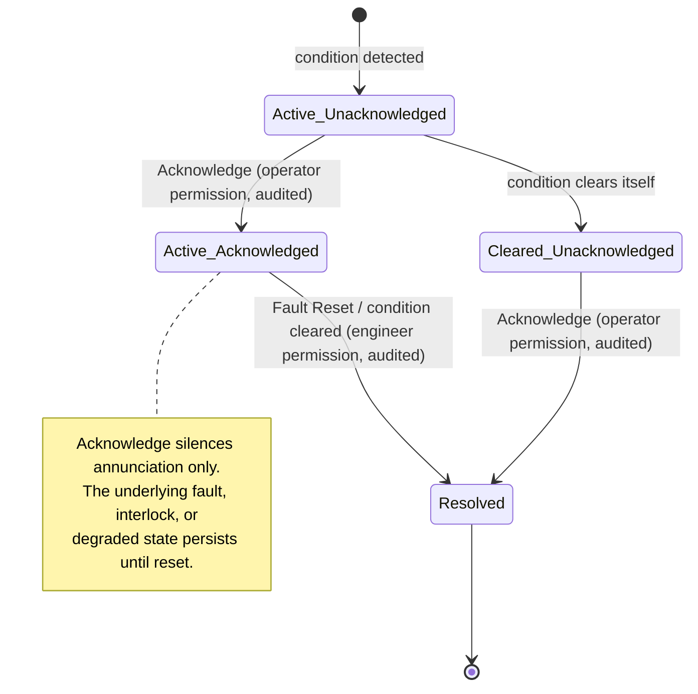
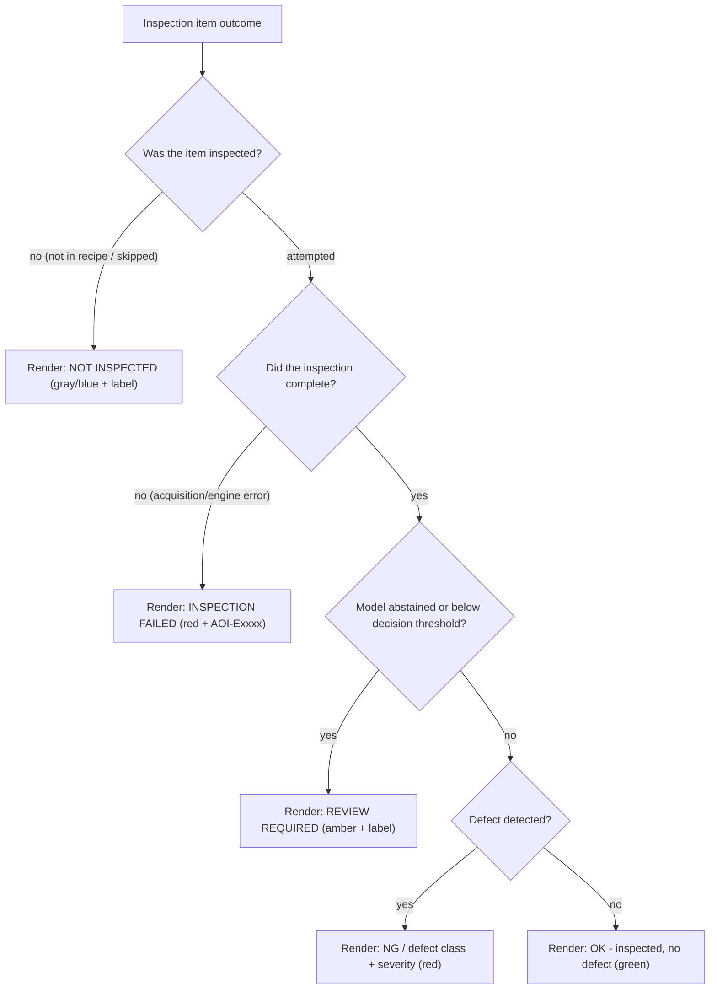
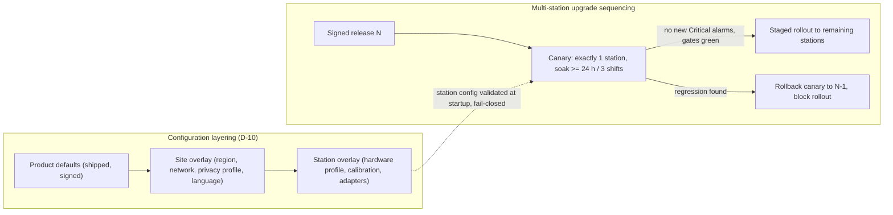

OpenAI/Codex and numerous other coding agents will review your output once you are done.

# VOL12 — HMI and Localization — AOI Software Architecture, Secure Development, and Change-Control Standard, v1.0 (2026-07-15)

Scope: normative requirements for the operator-facing HMI (§36) and for localization and international/multi-site deployment (§47) of AOI Monitor.

Supersedes/Related existing docs: this volume supersedes the `HMI-`, `COLOR-`, and `ALARM-` prefixed rows of `CONTRIBUTING.md` and the HMI/typography/color/alarm portions of `DESIGN.md` (per that baseline's own coupling rule, `Tools/quality-gates/industrial_quality_gates.json` and `AOI_Monitor/Services/StandardsTraceabilityService.cs` SHALL be updated in the same change that retires those rows; ID reconciliation follows the §5 mapping rule in VOL01). `DESIGN.md`, `DESIGN.md`, `DESIGN.md`, and the HMI rules in `AGENTS.md` remain in force as implementation companions; where wording conflicts, this standard prevails. `Docs/Standards_Traceability_Matrix.md` (certification-boundary wording) and `Docs/Requirements_Traceability_Matrix.md` (RTM IDs) are incorporated by reference and are not modified by this volume.

---

## 36. HMI and Operator-Safety Design

### 36.1 Scope, design authority, and boundaries

This section governs everything an operator, engineer, or administrator sees and can do through the AOI Monitor WPF shell (`AOI_Monitor/MainWindow.xaml.cs`), its 18 view pages (`AOI_Monitor/Views/`), the shared design system (`AOI_Monitor/Styles/FactoryHmiLayout.xaml`), and every dialog or viewer window the application opens. It codifies, as enforceable requirements, the rules that today live as prose in `DESIGN.md`, `DESIGN.md`, and `AGENTS.md`, and it extends them with command-safety, session, and AI-result-presentation obligations that the existing documents do not state.

Boundaries with neighboring sections:

- §25 (VOL06) owns the error and exception architecture, including the `AOI-Exxxx` error-code registry; §36 owns how errors are presented to operators.
- §28 (VOL07) owns identity, authentication, session policy, and the authoritative critical-action catalogue; §36 owns the HMI behavior around those actions (re-authentication prompts, session-expiry behavior, identity display).
- §34 (VOL11) owns the robot/safety boundary (D-18: the application only observes safety state); §36 owns how observed safety and degraded states are displayed.
- §38 (VOL13) owns audit persistence and log structure; §36 owns which UI actions must generate audit events.
- §40 (VOL13) owns end-to-end latency budgets; §36 owns the UI-thread budget and perceived-responsiveness rules.
- §41 (VOL13) owns degraded-mode semantics; §36 owns the degraded-mode banner.
- §47 (this volume) owns language, locale, and multi-site deployment.
- §39 (VOL14) owns the overall test strategy; the named test suites in this section register there.

Repo reality this section governs: the shell is a hand-rolled but production-grade router with cancellable navigation, per-page role checks, a 150 ms delayed loading overlay, and error boundaries (`MainWindow.xaml.cs:168-261, 347-398`; `AOI_Monitor/Services/UiErrorBoundaryService.cs`); the alarm model already carries severity, acknowledgement state, acknowledged-by, resolved-by, and a recommended action (`AOI_Monitor/Models/AlarmEvent.cs:5-41`); layout and navigation quality are machine-audited (`AOI_Monitor/Services/HmiLayoutAuditService.cs`, `HmiLayoutAuditTests`, `UiNavigationPerformanceTests`). The known structural nonconformity — 14,652 LOC of view code-behind against 581 LOC of ViewModels, with 21 views calling `AoiDatabase` directly — is governed by §12/§15/§23 (ARC/MOD/COD categories); §36 does not restate those obligations but its testability requirements assume they are being executed.

Severity finding (carried from the specification-defect register, SD-11): the customer GUI specification prescribes color-only status coding ("Green (OK), Red (NG), Yellow (Warning)"). That is a defect-escape mechanism on a factory floor — red/green is the classic deuteranopia failure pair — and it contradicts the repo's own binding contract (`AGENTS.md:81` "Color must never be the only signal"). This section resolves the conflict in favor of the repo contract; the spec is wrong.

### 36.2 Operator information model

The operator must never have to ask "what is the machine doing, with which model and recipe, on which board, as whom, and is any of this simulated?" The persistent shell banner (`DESIGN.md`, Banner section; `MainWindow.xaml.cs` footer/status paths) is the single always-visible instrument strip for this information.

The five operator-facing banner state labels are deliberately coarse projections of the canonical inspection state machine owned by §17 (ORC, VOL04); that section's 22-state FSM is the authoritative state vocabulary, and this projection is maintained in lockstep with it so one state vocabulary governs the fleet:

| Banner label | Underlying §17 (VOL04) FSM state(s) |
|---|---|
| idle | Idle |
| inspecting | BoardLoading, BoardPresent, Positioning, Acquiring, Inspecting, Evaluating, Persisting |
| reviewing | AwaitingOperatorReview |
| error | Faulted, ConfigurationInvalid, AcquisitionFailed, Degraded |
| stopped | Paused, Maintenance, ShuttingDown, EmergencyStopped |

#### R: State and identity visibility

**[HMI-001]** (P1 | ALL | HMI)
The persistent shell banner SHALL display the current machine state and inspection state (idle, inspecting, reviewing, error, stopped — the §17 FSM projection defined in §36.2) at all times on every page.
- Why: operators act on state they cannot verify; hidden state causes wrong interventions (CWE-451 UI misrepresentation). Maps: CWE-451; 800-82; 25010.
- Verify: `HmiLayoutAuditTests` banner assertions plus new suite `ShellBannerContentTests`. Evidence: `hmi_layout_audit.json`. Owner: Software Lead. Auto: Fully automated.
- Exception: Not allowed. Review: Per release.

**[HMI-002]** (P2 | ALL | HMI, Diagnostics)
The HMI SHALL display the connection state of every configured integration (camera, lighting, 3D, robot, MES, central sync) using exactly the status vocabulary NotConnected / Simulated / Error / Ready defined in `AOI_Monitor/Services/IntegrationContracts.cs`.
- Why: a stale or invented connection state hides dead hardware and mock boundaries (`Docs/ARCHITECTURE.md`). Maps: Internal; 25010.
- Verify: `IntegrationContractsTests` status-vocabulary assertions plus `ShellBannerContentTests`. Evidence: test run in `TestResults/*.trx`. Owner: Software Lead. Auto: Fully automated.
- Exception: Allowed — approver: Software Architect. Review: Per release.

**[HMI-003]** (P1 | ALL | HMI, Diagnostics)
Whenever the application operates in a degraded mode as defined in §41 (database initialization failure, integration loss, retention failure, observation-channel loss), the HMI SHALL display a persistent full-width degraded-mode banner naming the degraded capability until the condition clears.
- Why: the app already continues in degraded mode after DB-init failure (`MainWindow.xaml.cs:60-138`); silent degradation produces untraceable inspection gaps. Maps: Internal; 800-82; 25010.
- Verify: new suite `DegradedModeBannerTests` (fault-injection: DB init failure, camera loss). Evidence: test run + screenshot in stage-exit package. Owner: Software Lead. Auto: Partially automated.
- Exception: Not allowed. Review: Per release.

**[HMI-004]** (P2 | ALL | HMI, ModelMgmt, Recipe)
The HMI SHALL display the active inspection engine, active model identity with version, and active recipe identity with revision on the banner or on every inspection-related page.
- Why: results are meaningless without knowing what produced them (AGENTS.md rules 10-11); supports the §21 traceability model. Maps: Internal; SSDF-PW.1; 25010.
- Verify: `ShellBannerContentTests` + `HmiLayoutAuditTests`. Evidence: `hmi_layout_audit.json`. Owner: Software Lead. Auto: Fully automated.
- Exception: Allowed — approver: Software Architect. Review: Per release.

**[HMI-005]** (P2 | ALL | HMI, Persistence)
Every inspection, review, and disposition screen SHALL display the identity of the board and lot currently in context (board/serial identifier and lot identifier, or an explicit "no lot assigned" marker).
- Why: dispositioning the wrong board is a quality escape; the log/export spec defect SD-18 (no operator column) shows how identity gaps propagate. Maps: Internal; CFX; 25010.
- Verify: new suite `BoardLotIdentityDisplayTests` over MonitorView/ReviewView. Evidence: test run. Owner: Software Lead. Auto: Fully automated.
- Exception: Allowed — approver: QA Lead. Review: Per release.

**[HMI-006]** (P2 | ALL | HMI, IAM)
The HMI SHALL display the current session identity (user ID, role, and authentication mode) in the persistent banner at all times.
- Why: audit rows inherit ambient identity (`AoiDatabase.AuditOperatorProvider`); an operator acting under a stale Admin session is an authorization failure in practice. Maps: 62443-4-2 CR 1.1; ASVS-V7; CWE-306.
- Verify: `ShellBannerContentTests`; existing `AuthenticationAndSecretHandlingTests` identity assertions. Evidence: test run. Owner: Security Lead. Auto: Fully automated.
- Exception: Not allowed. Review: Per release.

**[HMI-007]** (P1 | ALL | HMI, Simulation)
Whenever any simulated, mock, demo, or sample-data source is active, the HMI SHALL display a purple simulation indicator in the persistent banner naming the simulated source(s).
- Why: simulated evidence presented as real is the product's defined worst failure (`AGENTS.md:63,80`; simulation rule repeated across 6+ docs). Maps: Internal; SBD; 25010.
- Verify: existing purple-labeling checks in `HmiLayoutAuditTests` plus `ShellBannerContentTests` simulation cases. Evidence: `hmi_layout_audit.json`. Owner: QA Lead. Auto: Fully automated.
- Exception: Not allowed. Review: Per release.

**[HMI-008]** (P2 | ALL | HMI, ModelMgmt, Recipe)
Every screen that lists or activates recipes or models SHALL display the artifact's lifecycle/approval state using the state vocabularies defined in §18 and §19 (VOL04), never a bare name.
- Why: activating a draft or rejected artifact because its state was invisible bypasses the approval gates; the SetActiveModel acceptance-gate bypass makes display honesty the last visible line. Maps: Internal; SSDF-PS.1; 25010.
- Verify: new suite `ApprovalStateDisplayTests` over RecipeView/AIModelTestView and model registry lists. Evidence: test run. Owner: Software Lead. Auto: Fully automated.
- Exception: Allowed — approver: Software Architect. Review: Per release.

### 36.3 Alarm priority model

The alarm model follows ISA-18.2/IEC 62682-style discipline (the repo baseline's own alignment claim): every alarm has exactly one severity, a recommended operator action, and a lifecycle that separates *seeing* an alarm from *fixing* the fault behind it. The implemented model (`AOI_Monitor/Models/AlarmEvent.cs`) already carries `Severity` (Info=0, Warning=1, Alarm=2, Critical=3), `RecommendedAction`, `AcknowledgementState` (Unacknowledged/Acknowledged/Resolved), `AcknowledgedBy`, and `ResolvedBy`; this section binds that model normatively.

**Reading this diagram:** an alarm is born Active and Unacknowledged. An operator acknowledgement moves it to Active/Acknowledged — this records "a human has seen it" and quiets annunciation, nothing more. The fault behind the alarm is removed only by a separate fault-reset action (or by the condition clearing itself), which requires its own, higher permission and its own audit event. If the condition clears before anyone acknowledges, the alarm remains listed as Cleared/Unacknowledged until a human acknowledges it, so transient faults cannot pass unseen. Acknowledge and reset are therefore two different controls, two different permissions, and two different audit events.

#### R: Alarms

**[HMI-009]** (P1 | ALL | HMI, Diagnostics)
The application SHALL classify every alarm into exactly one of the four severities Info, Warning, Alarm, Critical, each with a stored recommended operator action.
- Why: unprioritized alarms produce alarm floods and ignored criticals; the enum and `RecommendedAction` field exist (`AlarmEvent.cs:5-35`) and must remain the single model. Maps: Internal; 800-82; 25010.
- Verify: new suite `AlarmLifecycleHmiTests` (severity completeness, non-empty recommended action). Evidence: test run. Owner: Software Lead. Auto: Fully automated.
- Exception: Not allowed. Review: Annual.

**[HMI-010]** (P3 | ALL | HMI)
The alarm list SHALL present alarms ordered by severity (Critical first) then recency by default, with active Critical/Alarm counts always visible in the persistent banner without opening the list.
- Why: buried critical alarms are the classic annunciation failure; the banner-count rule exists in `DESIGN.md` (Banner) and must not regress. Maps: Internal; 25010.
- Verify: `AlarmLifecycleHmiTests` ordering cases (uses `AlarmSortOrder.SeverityDescending`). Evidence: test run. Owner: Software Lead. Auto: Fully automated.
- Exception: Allowed — approver: Software Architect. Review: Per release.

**[HMI-011]** (P0 | ALL | HMI, IAM)
Alarm acknowledgement and fault reset SHALL be implemented as two separate UI controls bound to two distinct RBAC permissions, such that acknowledging an alarm never clears, resets, or restarts the underlying fault, device, or inspection.
- Why: conflating ack with reset lets an operator clear a hardware fault or restart motion with a "make the noise stop" click — an operator-safety hazard in a Stage 3 cell (D-18). Maps: 62443-4-2 CR 2.1; CWE-863; Internal.
- Verify: `AlarmLifecycleHmiTests` (ack leaves fault state; reset denied to Operator role). Evidence: test run + audit rows. Owner: Security Lead. Auto: Fully automated.
- Exception: Not allowed. Review: Per release.

**[HMI-012]** (P2 | ALL | HMI, Audit)
Every alarm acknowledgement and every fault reset SHALL create an audit event carrying the fields defined in HMI-039 plus the alarm ID and the action taken.
- Why: `AlarmEvent` already carries `AcknowledgedBy`/`ResolvedBy`; without an immutable audit row the who-silenced-what question is unanswerable in an escape investigation. Maps: 62443-4-2 CR 2.8; ASVS-V16; SSDF-PW.1.
- Verify: `AlarmLifecycleHmiTests` audit assertions against `AuditEvents`. Evidence: audit rows in test DB. Owner: Software Lead. Auto: Fully automated.
- Exception: Not allowed. Review: Annual.

### 36.4 Color semantics, contrast, and physical minimums

The five-color semantic palette is a product-truthfulness mechanism, not a styling preference: green is a *claim* that something is validated. The palette below is copied exactly from the repo contract (`AGENTS.md:75-80`; `DESIGN.md`, Status Colors) and is closed — no sixth semantic color may be introduced without a change to this standard.

| Color | Meaning (exclusive) |
|---|---|
| Green | validated OK / pass / ready / connected / running-normal only |
| Red | NG / fail / alarm / stop / critical error |
| Amber/yellow | warning / review / pending / conditional / not tested |
| Gray/blue | disabled / not connected / unavailable / not configured |
| Purple | simulated / mock / demo / non-production evidence |

#### R: Color and accessibility

**[HMI-013]** (P1 | ALL | HMI)
Every status indication SHALL use the five-color semantic palette defined in §36.4 with the stated meanings and no others.
- Why: divergent per-page palettes destroy the operator's learned state model; the customer GUI spec's 3-color scheme (SD-11) cannot express simulated/mock and is rejected. Maps: Internal; 25010; CWE-451.
- Verify: `HmiLayoutAuditTests` color-token audit over `FactoryHmiLayout.xaml` resource usage; FF-HMI-05 (registered in the §52 catalogue, VOL17). Evidence: `hmi_layout_audit.json`. Owner: Software Lead. Auto: Fully automated.
- Exception: Not allowed. Review: Per release.

**[HMI-014]** (P0 | ALL | HMI, Simulation)
The HMI SHALL NOT render green (or the words OK/READY/CONNECTED/VALIDATED) for any simulated, mock, demo, unvalidated, or not-yet-accepted state.
- Why: green-for-simulated is the exact overclaim the product's evidence discipline exists to prevent (`DESIGN.md`: "Do not use green for Demo mode..."); it converts a demo into a false factory-readiness claim. Maps: Internal; SBD; CWE-451.
- Verify: `HmiLayoutAuditTests` overclaim checks + PR claim-language gates (`Scripts/check-pr-quality.ps1` PR-CLAIM-001 family). Evidence: `hmi_layout_audit.json`, CI gate log. Owner: QA Lead. Auto: Fully automated.
- Exception: Not allowed. Review: Per release.

**[HMI-015]** (P1 | ALL | HMI)
Every color-coded status SHALL be reinforced by at least one non-color signal (text label, icon, or shape) conveying the same state.
- Why: red/green color-vision deficiency affects roughly 8% of males; a color-only NG signal is a defect-escape path, not a cosmetic issue (SD-11). Maps: CWE-451; 25010; Internal (WCAG 2.2 SC 1.4.1-derived).
- Verify: `HmiLayoutAuditTests` reinforcement audit (extend `HmiLayoutAuditService` to flag color-only badges). Evidence: `hmi_layout_audit.json`. Owner: Software Lead. Auto: Fully automated.
- Exception: Not allowed. Review: Per release.

**[HMI-016]** (P2 | ALL | HMI)
All operator-facing text SHALL maintain a contrast ratio of at least 4.5:1 against its background in both the dark and light HMI themes.
- Why: sub-threshold contrast is unreadable under shop-floor lighting and glare; 4.5:1 is the WCAG 2.2 SC 1.4.3-derived floor adopted by this standard. Maps: 25010; Internal (WCAG 2.2 1.4.3-derived).
- Verify: FF-HMI-05 contrast audit added to `HmiLayoutAuditService` computing ratios for text/background resource pairs in `FactoryHmiLayout.xaml`. Evidence: `hmi_layout_audit.json` contrast section. Owner: Software Lead. Auto: Fully automated.
- Exception: Allowed — approver: Software Architect. Review: Per release.

**[HMI-017]** (P2 | ALL | HMI)
Operator-facing text SHALL be rendered at 14 pt equivalent or larger, with any smaller secondary annotation recorded as an approved exception in `Tools/quality-gates/hmi_layout_approved_exceptions.json` with a reason.
- Why: sub-14 pt text fails at arm's-length viewing on a 1920x1080 line-side display; the gate already exists (PR-HMI-FONT-001 fails XAML `FontSize` < 14, `Scripts/check-pr-quality.ps1:437-443`). Maps: Internal; 25010.
- Verify: PR-HMI-FONT-001 (FAIL level) + `HmiLayoutAuditTests`. Evidence: CI gate log, exceptions file diff. Owner: Software Lead. Auto: Fully automated.
- Exception: Allowed — approver: Software Architect. Review: Per release.

**[HMI-018]** (P2 | ALL | HMI)
Primary action buttons SHALL be at least 120x40 px at 100% DPI scaling.
- Why: undersized touch/click targets cause mis-operation with gloves and under time pressure; the minimum is already machine-checked (PR-HMI-SIZE-001, `check-pr-quality.ps1:445-450`). Maps: Internal; 25010.
- Verify: PR-HMI-SIZE-001 + `HmiLayoutAuditTests` button audit. Evidence: CI gate log, `hmi_layout_audit.json`. Owner: Software Lead. Auto: Fully automated.
- Exception: Allowed — approver: Software Architect. Review: Per release.

**[HMI-019]** (P2 | ALL | HMI)
Every page SHALL render at 1920x1080 without clipping of text, buttons, inputs, or table headers, with dense secondary content reachable by page-body scrolling per the `DESIGN.md` layout rules.
- Why: 1920x1080 is the minimum operator display target (`AGENTS.md:73`); clipped verdicts and alarm text are release-blocking today (checklist ALARM-002 lineage). Maps: Internal; 25010.
- Verify: `HmiLayoutAuditTests` full-page clipping audit (FF-HMI-04). Evidence: `hmi_layout_audit.json`, `hmi_layout_audit.html`. Owner: QA Lead. Auto: Fully automated.
- Exception: Allowed — approver: Software Architect. Review: Per release.

**[HMI-020]** (P2 | ALL | HMI)
Every page SHALL remain fully usable (no clipping, no unreachable controls) at Windows DPI scaling of 100%, 125%, and 150%.
- Why: factory panel PCs commonly run 125/150%; fixed-pixel assumptions clip under scaling (`DESIGN.md` Spacing rules). Maps: Internal; 25010.
- Verify: `HmiLayoutAuditTests` DPI matrix runs + manual screenshot evidence per AGENTS Definition of Done. Evidence: `hmi_layout_audit.json` + screenshots in stage-exit package. Owner: QA Lead. Auto: Partially automated.
- Exception: Allowed — approver: Software Architect. Review: Per release.

**[HMI-051]** (P3 | ALL | HMI)
Every page SHOULD remain fully usable (no clipping, no unreachable controls) at Windows DPI scaling of 200%.
- Why: some factory panel PCs run 200% on 4K line-side displays; usability at 200% is desirable but, unlike 100/125/150%, a deviation is acceptable with recorded rationale rather than release-blocking. Maps: Internal; 25010.
- Verify: `HmiLayoutAuditTests` DPI matrix 200% run (advisory) + manual screenshot spot check. Evidence: `hmi_layout_audit.json` DPI section. Owner: QA Lead. Auto: Partially automated.
- Exception: Allowed — approver: Software Architect. Review: Per release.

### 36.5 Interaction and layout robustness

#### R: Layout, input, and large data

**[HMI-021]** (P3 | ALL | HMI)
Every Engineer- and Admin-facing screen SHALL be fully operable by keyboard alone, with visible focus indicators and a documented tab order.
- Why: engineers work with the panel keyboard during commissioning and remote sessions where mouse precision is poor; keyboard operability is also the accessibility floor. Maps: 25010; Internal (WCAG 2.2 2.1.1-derived).
- Verify: manual keyboard-walkthrough checklist per screen + FlaUI-based `KeyboardNavigationTests` for the recipe and settings screens. Evidence: checklist in stage-exit package. Owner: QA Lead. Auto: Partially automated.
- Exception: Allowed — approver: Software Architect. Review: Annual.

**[HMI-022]** (P2 | ALL | HMI)
Text-bearing UI elements SHALL NOT use fixed pixel widths; long values SHALL wrap, scroll, or trim with a tooltip exposing the full value.
- Why: fixed widths clip under DPI scaling and Korean-English swaps (`DESIGN.md` Spacing; PR-HMI-WIDTH-001 currently WARN-only — this requirement promotes it). Maps: Internal; 25010.
- Verify: PR-HMI-WIDTH-001 elevated to FAIL for new fixed `Width` >= 80 outside `Styles/`; `HmiLayoutAuditTests` trim/tooltip audit. Evidence: CI gate log. Owner: Software Lead. Auto: Fully automated.
- Exception: Allowed — approver: Software Architect. Review: Per release.

**[HMI-023]** (P2 | ALL | HMI, Config)
User-facing display strings SHALL be sourced from the localization dictionary in `AOI_Monitor/Services/UiPreferencesService.cs` (or its successor resource store), not hardcoded per page.
- Why: per-page literals bypass the EN/KO parity gate and rot silently; the CI-facing fitness function is defined in §47 (LOC category). Maps: Internal; SSDF-PW.1; 25010.
- Verify: `LocalizationParityTests` + FF-LOC-01 literal scanner (§47). Evidence: CI gate log. Owner: Software Lead. Auto: Fully automated.
- Exception: Allowed — approver: Software Architect. Review: Per release.

**[HMI-024]** (P2 | ALL | HMI)
Every table or list capable of exceeding 200 rows SHALL enable UI virtualization (WPF `VirtualizingStackPanel` row virtualization on `HmiTable`-styled DataGrids).
- Why: non-virtualized defect lists freeze the UI thread and exhaust memory on real production runs (AGENTS rule 17: design for large result sets). Maps: Internal; CWE-400; 25010.
- Verify: new suite `UiVirtualizationTests` (10,000-row load stays under the HMI-027 budget); `LayoutStressTestService` runs. Evidence: test run + perf trace. Owner: Software Lead. Auto: Fully automated.
- Exception: Allowed — approver: Software Architect. Review: Per release.

**[HMI-025]** (P2 | ALL | HMI, ImageStore)
Image zoom, pan, and viewer windows SHALL route bitmap lifetime through `AOI_Monitor/Services/ImageCacheService.cs` with cache release on page unload (`ClearOnPageUnload`) and `IReleasablePageResources.ReleasePageResources()` on navigation away.
- Why: WPF bitmap retention is the dominant desktop-HMI leak class; the release hooks exist (`MainWindow.xaml.cs:314-324`) and must remain the only pattern. Maps: CWE-401; Internal; 25010.
- Verify: `UiNavigationSoakTestService` soak with memory-growth threshold < 20 MB/h steady-state; new `ImageViewerMemoryTests`. Evidence: soak report JSON. Owner: Software Lead. Auto: Fully automated.
- Exception: Allowed — approver: Software Architect. Review: Per release.

**[HMI-026]** (P2 | ALL | HMI)
The HMI SHALL render mixed Korean (Hangul) and Latin text without missing-glyph boxes, clipping, or baseline misalignment at every supported DPI scale, using the declared font stack with Hangul coverage.
- Why: the shell already switches `FontFamily` for Korean (`UiPreferencesService.cs:620`); an undeclared fallback produces tofu on stripped-down IoT LTSC images. Maps: Internal; 25010.
- Verify: `HmiLayoutAuditTests` executed in Korean language mode (extend existing KO runs); `KoreanLocalizationPersistenceTests`. Evidence: `hmi_layout_audit.json` KO run. Owner: QA Lead. Auto: Fully automated.
- Exception: Not allowed. Review: Per release.

### 36.6 Responsiveness

#### R: UI-thread budget

**[HMI-027]** (P1 | ALL | HMI, ViewModels)
The application SHALL NOT execute any single synchronous work item longer than 50 ms on the UI thread during steady-state operation (`ASSUMPTION A-VOL12-1`).
- Why: dispatcher stalls freeze alarm annunciation and command response; the repo already bans UI-thread I/O (CQ-UI-001/002 gates; AGENTS rule 3) and D-01 makes a worker-process split mandatory if inference breaches this budget. Maps: Internal; 25010; CWE-400.
- Verify: `UiPerformanceMonitorService` stall telemetry with a 50 ms threshold asserted by `UiNavigationPerformanceTests`; CQ-UI-001/002 static gates. Evidence: `ui_navigation_performance.json`. Owner: Software Lead. Auto: Fully automated.
- Exception: Allowed — approver: Software Architect. Review: Per release.

**[HMI-028]** (P2 | ALL | HMI, ViewModels)
Every operation that can exceed the 50 ms UI-thread budget SHALL run asynchronously off the UI thread with a visible progress indication and, for operations over 2 s, a cancellation control.
- Why: unobservable long work reads as a hang and triggers repeated clicks (see HMI-034); the async page pattern exists (`IAsyncNavigationPage`, `UiErrorBoundaryService.RunAsync`). Maps: Internal; 25010.
- Verify: `UiNavigationPerformanceTests` + code review checklist item COD-async (per §23 review checklist). Evidence: test run + review record. Owner: Software Lead. Auto: Partially automated.
- Exception: Allowed — approver: Software Architect. Review: Per release.

**[HMI-029]** (P2 | ALL | HMI)
Page navigation SHALL remain cancellable via the shell cancellation token, so that a superseded navigation is abandoned rather than completed.
- Why: the shell's navigation lifecycle (sequence tokens, cancellation, delayed overlay — `MainWindow.xaml.cs:168-261`) is load-bearing operator experience and must not regress during the MVVM migration. Maps: Internal; 25010.
- Verify: `UiNavigationPerformanceTests` (existing CI gate PERF-001 lineage). Evidence: `ui_navigation_performance.json`. Owner: Software Lead. Auto: Fully automated.
- Exception: Allowed — approver: Software Architect. Review: Per release.

**[HMI-052]** (P2 | ALL | HMI)
Page navigation SHALL suppress duplicate navigation requests to the same page key while a navigation to that page is already in flight.
- Why: rapid repeated activation of a nav control otherwise queues redundant page loads that stall the UI thread; the shell already suppresses duplicates (`MainWindow.xaml.cs:168-261`) and must not regress. Maps: Internal; CWE-799; 25010.
- Verify: `UiNavigationPerformanceTests` duplicate-suppression cases. Evidence: `ui_navigation_performance.json`. Owner: Software Lead. Auto: Fully automated.
- Exception: Allowed — approver: Software Architect. Review: Per release.

**[HMI-053]** (P3 | ALL | HMI)
The navigation loading overlay SHALL appear only after a navigation has been in progress for at least 150 ms.
- Why: showing the overlay for sub-150 ms transitions produces a distracting flash on fast page switches; the delayed-overlay behavior exists (`MainWindow.xaml.cs:168-261`) and is load-bearing operator experience. Maps: Internal; 25010.
- Verify: `UiNavigationPerformanceTests` overlay-delay cases. Evidence: `ui_navigation_performance.json`. Owner: Software Lead. Auto: Fully automated.
- Exception: Allowed — approver: Software Architect. Review: Per release.

**[HMI-054]** (P2 | ALL | HMI)
The p95 page-switch time SHALL stay within the budget published in the `ui_navigation_performance.json` gates.
- Why: navigation latency above budget reads as a hang and drives repeated clicks; the existing CI gate (PERF-001 lineage) must remain green through the MVVM migration. Maps: Internal; 25010.
- Verify: `UiNavigationPerformanceTests` p95 budget assertion (existing CI gate). Evidence: `ui_navigation_performance.json`. Owner: Software Lead. Auto: Fully automated.
- Exception: Allowed — approver: Software Architect. Review: Per release.

### 36.7 Command safety and approval workflows

Commands that change hardware state, production configuration, or evidence must be deliberate, attributable, and reversible where physics allows. This subsection also carries the two approval-workflow display obligations (recipe diff, model manifest) because their purpose is command safety: the approver must see what they are approving.

#### R: Command safety

**[HMI-030]** (P2 | ALL | HMI)
Confirmation dialogs SHALL assign the default (Enter-key) button to the non-destructive option; a destructive or hazardous action SHALL NOT be any dialog's default.
- Why: muscle-memory Enter presses execute defaults; destructive-by-default converts a reflex into data loss or motion. Maps: CWE-451; Internal; 25010.
- Verify: new suite `CommandGuardTests` dialog-default assertions; dialog style in `FactoryHmiLayout.xaml`. Evidence: test run. Owner: Software Lead. Auto: Fully automated.
- Exception: Not allowed. Review: Per release.

**[HMI-031]** (P1 | ALL | HMI)
Every destructive or hazardous action (deletion of records/images/models, retention purge, hardware motion command, mode change) SHALL require an explicit confirmation step that names the object acted on and states the consequence.
- Why: single-click destruction of quality evidence or initiation of motion is unacceptable in a traceability product and a Stage 3 cell. Maps: 62443-4-2 CR 2.1; CWE-306; Internal.
- Verify: `CommandGuardTests` per destructive action inventory (inventory maintained in the §57 template set). Evidence: test run. Owner: Software Lead. Auto: Fully automated.
- Exception: Not allowed. Review: Per release.

**[HMI-032]** (P1 | ALL | HMI, IAM)
The HMI SHALL require re-authentication (fresh credential entry, not the cached session) immediately before executing any action in the §28 critical-action catalogue (`ASSUMPTION A-VOL12-3` interim list: model activation, recipe approval/unlock, operating-mode change, authentication-mode change, user/role management, retention-policy change, bulk data deletion, safety-simulation bypass, NG-verdict override).
- Why: shared shop-floor PCs mean the person at the keyboard is often not the session owner; re-auth binds the critical act to a human, not a session (repo gap: passwordless Demo Admin boot, `CurrentUser.cs:7-9`). Maps: 62443-4-2 CR 2.1; ASVS-V6; CWE-306.
- Verify: `CommandGuardTests` re-auth cases per catalogue entry; denial without credentials asserted. Evidence: test run + audit rows. Owner: Security Lead. Auto: Fully automated.
- Exception: Allowed — approver: Security Lead. Review: Quarterly.

**[HMI-033]** (P1 | S2+ | HMI, Acquisition)
Every control that commands physical hardware (camera trigger, lighting change, robot/handler command, axis motion) SHALL enforce a re-arm guard of at least 500 ms after activation during which repeated activation is ignored (`ASSUMPTION A-VOL12-2`).
- Why: switch bounce and double-clicks issue duplicate hardware commands; duplicate motion or lighting commands corrupt acquisitions and can jam handlers. Maps: Internal; CWE-799; 800-82.
- Verify: `CommandGuardTests` debounce cases against the simulated adapters in `IntegrationContracts.cs`. Evidence: test run. Owner: Software Lead. Auto: Fully automated.
- Exception: Allowed — approver: Controls & Safety Engineer. Review: On change.
- Note: the guard interval is a UI-side minimum; per-device interlocks in §34 (SAF category) remain authoritative for motion safety.

**[HMI-034]** (P2 | ALL | HMI)
While a command it initiated is in flight, the initiating control SHALL be disabled until the command completes, fails, or times out with a defined timeout.
- Why: the navigation router already implements this pattern (duplicate-navigation suppression); un-guarded buttons elsewhere permit double submission of exports, uploads, and hardware actions. Maps: CWE-799; Internal; 25010.
- Verify: `CommandGuardTests` in-flight cases for export, MES send, and model activation buttons. Evidence: test run. Owner: Software Lead. Auto: Fully automated.
- Exception: Allowed — approver: Software Architect. Review: Per release.

**[HMI-035]** (P3 | ALL | HMI)
Every disabled control SHALL expose the reason it is disabled (tooltip or adjacent inline text naming the missing permission, state, or precondition).
- Why: unexplained dead buttons generate support calls and dangerous workarounds; "disabled because Engineer role required" is also an honesty signal for RBAC. Maps: Internal; 25010.
- Verify: `HmiLayoutAuditTests` disabled-reason audit (extend `HmiLayoutAuditService`). Evidence: `hmi_layout_audit.json`. Owner: Software Lead. Auto: Fully automated.
- Exception: Allowed — approver: Software Architect. Review: Per release.

**[HMI-036]** (P2 | ALL | HMI, IAM)
The application SHALL NOT contain keyboard shortcuts, gestures, or input sequences that invoke a privileged function without passing the same RBAC check as the visible control for that function.
- Why: hidden privileged shortcuts are undocumented bypasses of the role model (CWE-912 hidden functionality); repo gap 9b-1 (default-allow unknown page keys) shows how bypass paths accrete. Maps: CWE-912; CWE-862; 62443-4-2 CR 2.1.
- Verify: shortcut inventory review each release + `CommandGuardTests` asserting RBAC on every registered `InputBinding`. Evidence: inventory + test run. Owner: Security Lead. Auto: Partially automated.
- Exception: Not allowed. Review: Per release.

**[HMI-037]** (P2 | ALL | HMI, IAM)
The application SHALL NOT contain maintenance, diagnostic, or configuration screens absent from the documented navigation map (`MainWindow.xaml.cs` `CreatePage` routes) and the per-page role matrix in `AOI_Monitor/Services/RoleAuthorization.cs`.
- Why: secret maintenance menus defeat both audit and RBAC; every engineering function must be a named, role-gated route (the 15-route map is the closed set). Maps: CWE-912; CWE-489; 62443-4-2 CR 2.1.
- Verify: fitness function FF-HMI-06: route-enumeration test comparing `CreatePage` switch, `CanAccessPage` matrix, and the documented page inventory for exact agreement. Evidence: CI gate log. Owner: Security Lead. Auto: Fully automated.
- Exception: Not allowed. Review: Per release.

**[HMI-038]** (P2 | ALL | HMI, Audit)
Every operator or engineer override (NG-verdict override, false-call disposition override, threshold bypass, acceptance waiver) SHALL require selection of a reason from a controlled dropdown plus a free-text justification of at least 10 characters before the override commits.
- Why: unexplained overrides are unauditable quality decisions; structured reason codes make override patterns analyzable for §31 model-feedback and §38 metrics. Maps: Internal; SSDF-PW.1; 62443-4-2 CR 2.8.
- Verify: new suite `OverrideReasonCaptureTests` (commit blocked without reason; reason persisted with audit row). Evidence: test run + audit rows. Owner: QA Lead. Auto: Fully automated.
- Exception: Not allowed. Review: Annual.

**[HMI-039]** (P1 | ALL | HMI, Audit)
Every UI-initiated privileged action (all §28 critical-action catalogue entries plus overrides, alarm resets, and exports of evidence) SHALL create an audit event carrying user ID, role, UTC timestamp, action category, target entity, and outcome.
- Why: the audit pipeline exists (`AoiDatabase.RecordAuditEvent`, ambient identity providers); coverage gaps make the trail unusable in disputes; tamper-evidence of the rows themselves is governed by the DAT/OBS categories (§21/§38). Maps: 62443-4-2 CR 2.8; ASVS-V16; SSDF-PW.1.
- Verify: audit-coverage matrix test extending `AOI_Monitor.Tests/UiServiceCoverageTests.cs` (every privileged UI action maps to an audit event constant). Evidence: test run. Owner: Security Lead. Auto: Fully automated.
- Exception: Not allowed. Review: Per release.

**[HMI-040]** (P2 | ALL | HMI, Recipe)
Before a recipe revision can be approved or activated, the HMI SHALL display a field-level diff between the candidate revision and the currently active revision (changed thresholds, ROIs, rules, and metadata).
- Why: approving an unseen diff is rubber-stamping; `RecipeRevisions` persistence exists and makes the diff computable. Maps: Internal; SSDF-PS.1; 25010.
- Verify: new suite `RecipeDiffDisplayTests` (approval control disabled until diff rendered). Evidence: test run. Owner: Software Lead. Auto: Fully automated.
- Exception: Not allowed. Review: Per release.

**[HMI-041]** (P1 | ALL | HMI, ModelMgmt)
Before a model can be activated, the HMI SHALL display the model's manifest contents — SHA-256, taxonomy version, training-provenance summary, acceptance state, and manifest signature-verification result per D-03.
- Why: repo gap 9b-5: SHA-256 is computed at registration but never re-verified at activation, and the acceptance gate is bypassable via `SetActiveModel`; the activation screen is where verification must become visible and binding. Maps: SSDF-PS.2; SLSA; CWE-494; AISVS.
- Verify: new suite `ModelActivationManifestTests` (tampered artifact blocks activation; manifest fields rendered). Evidence: test run. Owner: ML Lead. Auto: Fully automated.
- Exception: Not allowed. Review: Per release.

**[HMI-055]** (P1 | ALL | HMI, ModelMgmt)
The HMI SHALL block model activation when the model manifest's signature or hash verification fails.
- Why: repo gap 9b-5: SHA-256 is computed at registration but never re-verified at activation, and the acceptance gate is bypassable via `SetActiveModel`; blocking on verification failure is where artifact integrity becomes binding at the UI. Maps: SSDF-PS.2; SLSA; CWE-494.
- Verify: `ModelActivationManifestTests` (tampered artifact blocks activation). Evidence: test run. Owner: ML Lead. Auto: Fully automated.
- Exception: Not allowed. Review: Per release.

### 36.8 Error and failure presentation

#### R: Errors, sessions, and unsaved work

**[HMI-042]** (P1 | ALL | HMI, Diagnostics)
Operator-facing error surfaces SHALL show only a stable `AOI-Exxxx` code from the §25 registry, an operator-safe message, and a UTC timestamp — never stack traces, exception type names, file paths, or connection strings.
- Why: stack traces leak internals (CWE-209) and are useless to operators; the crash pipeline already writes full detail to `CrashReportService` reports for engineers, and the CQ-MSG-001 gate bans stack traces in MessageBoxes. Maps: CWE-209; ASVS-V16; SSDF-PW.5.
- Verify: CQ-MSG-001 static gate + `UiErrorBoundaryService` tests asserting code+message shape. Evidence: CI gate log + test run. Owner: Software Lead. Auto: Fully automated.
- Exception: Not allowed. Review: Per release.

**[HMI-043]** (P2 | ALL | HMI)
Every operator-initiated action SHALL produce a visible outcome — a success indication, an error card, or a progress state — so that no failure is silently discarded.
- Why: silent failure teaches operators the system is flaky and hides real faults; the error-boundary pattern (`UiErrorBoundaryService.RunAsync`) turns refresh failures into visible cards and is the mandated pattern; the 332 raw `MessageBox.Show` call sites in Views migrate to it under the §23 code standard. Maps: CWE-390; Internal; 25010.
- Verify: `CommandGuardTests` outcome-visibility cases + empty-catch gates (CQ-CATCH-001, PR-CATCH-001). Evidence: CI gate log + test run. Owner: Software Lead. Auto: Fully automated.
- Exception: Not allowed. Review: Per release.

**[HMI-044]** (P3 | ALL | HMI)
Navigation away from a page holding unsaved edits (recipe, settings, disposition notes) SHALL warn the user and offer save, discard, or cancel before proceeding.
- Why: the navigation router switches cached pages without a dirty-check today; silent loss of recipe edits destroys engineering work and trust. Maps: Internal; 25010.
- Verify: new suite `UnsavedChangesGuardTests` over RecipeView and SettingsView. Evidence: test run. Owner: Software Lead. Auto: Fully automated.
- Exception: Allowed — approver: Software Architect. Review: Per release.

**[HMI-045]** (P2 | ALL | HMI, IAM)
On session expiry (per the §28 session policy), the HMI SHALL lock all state-changing controls to view-only while preserving on-screen results and requiring re-authentication before any control is reactivated (`ASSUMPTION A-VOL12-5`).
- Why: a hard logout mid-inspection either loses evidence or, worse, leaves hardware mid-sequence; expiry must degrade to observe-only, mirroring D-18's observe-only safety posture. Maps: ASVS-V7; 62443-4-2 CR 2.5; Internal.
- Verify: new suite `SessionExpiryHmiTests` (expiry injected mid-batch: controls lock to view-only, audit row written). Evidence: test run. Owner: Security Lead. Auto: Fully automated.
- Exception: Allowed — approver: Security Lead. Review: Per release.

**[HMI-056]** (P2 | ALL | HMI, IAM)
On session expiry, the HMI SHALL complete or durably persist any in-flight inspection cycle before locking controls, and SHALL NOT abort mid-cycle work or discard unpersisted results (`ASSUMPTION A-VOL12-5`).
- Why: a hard logout mid-inspection either loses evidence or leaves hardware mid-sequence; expiry must preserve the cycle rather than tear it down, mirroring D-18's observe-only safety posture. Maps: ASVS-V7; 62443-4-2 CR 2.5; Internal.
- Verify: `SessionExpiryHmiTests` (expiry injected mid-batch: cycle persists, no unpersisted results discarded). Evidence: test run. Owner: Security Lead. Auto: Fully automated.
- Exception: Allowed — approver: Security Lead. Review: Per release.

### 36.9 AI-result and measurement presentation

AI output is evidence, not verdict. The HMI must keep three distinctions permanently visible: (a) model confidence is not engineering severity; (b) "we found nothing" is not "we looked and it is good"; (c) "the model is unsure" is never "pass". These rules bind every result table, board map, chart, and export preview.

**Reading this diagram:** every inspection item resolves to exactly one of five rendered states. First the HMI asks whether the item was inspected at all — an item outside the recipe or skipped renders as NOT INSPECTED (gray/blue), never as OK. If inspection was attempted but did not complete (camera fault, engine error), the item renders INSPECTION FAILED in red with its `AOI-Exxxx` code — again never OK and never silently absent. If the pipeline completed but the model abstained or scored below the decision threshold, the item renders as amber REVIEW REQUIRED. Only a completed inspection with no detected defect renders green OK, and a detected defect renders red NG with its taxonomy class and engineering severity. No path leads from "missing", "skipped", or "unsure" to green.

#### R: Result-state honesty

**[HMI-046]** (P2 | ALL | HMI, Inference)
Every defect/result table SHALL display AI confidence and engineering severity (taxonomy severity per D-17) as two separate columns, never merged into one score.
- Why: a 0.93-confidence cosmetic scratch and a 0.55-confidence solder bridge demand opposite operator behavior; merging them destroys both signals. Maps: AI-RMF; AISVS; Internal.
- Verify: new suite `ResultStateRenderingTests` column assertions over ReviewView/MonitorView grids. Evidence: test run. Owner: ML Lead. Auto: Fully automated.
- Exception: Allowed — approver: ML Lead. Review: Per release.

**[HMI-047]** (P0 | ALL | HMI, Inference)
Every result display SHALL render "OK", "not detected", "not inspected", and "inspection failed" as four distinct, labeled states that are never conflated or omitted.
- Why: conflating "not inspected" with "OK" is the canonical AOI escape mechanism — boards pass because nothing looked at them; this is the display-side counterpart of the §17 state machine (ORC category). Maps: CWE-451; AI-100-2; Internal.
- Verify: `ResultStateRenderingTests` four-state matrix (each state injected, rendering asserted distinct). Evidence: test run. Owner: QA Lead. Auto: Fully automated.
- Exception: Not allowed. Review: Per release.

**[HMI-048]** (P2 | ALL | HMI, Export)
Aggregations, yield statistics, and charts SHALL exclude not-inspected and inspection-failed items from pass/fail denominators, never counting missing results as zero defects.
- Why: missing-as-zero silently inflates yield and hides coverage gaps in exactly the reports managers act on; export-side format rules live in §37 (DAT category). Maps: CWE-451; Internal; AI-RMF.
- Verify: `ResultStateRenderingTests` aggregate cases + export verification suite (`ExportVerification` gate lineage). Evidence: test run + export verification report. Owner: QA Lead. Auto: Fully automated.
- Exception: Not allowed. Review: Per release.

**[HMI-057]** (P2 | ALL | HMI, Export)
Not-inspected and inspection-failed counts SHALL be labeled and reported separately from pass/fail results, never presented as zero defects.
- Why: missing-as-zero silently inflates yield and hides coverage gaps in exactly the reports managers act on; separate labeling makes the coverage gap visible. Maps: CWE-451; Internal; AI-RMF.
- Verify: `ResultStateRenderingTests` separate-label cases + export verification suite. Evidence: test run + export verification report. Owner: QA Lead. Auto: Fully automated.
- Exception: Not allowed. Review: Per release.

**[HMI-049]** (P0 | ALL | HMI, Inference)
Any inference output flagged as uncertain, abstained, out-of-distribution, or below the configured decision threshold SHALL be rendered exclusively as a review-required state, never as OK or pass.
- Why: rendering model uncertainty as pass converts every low-confidence escape into an invisible one; abstention semantics are defined in §31 (AIM category) — this binds their display. Maps: AI-100-2; AI-RMF; AISVS; CWE-451.
- Verify: `ResultStateRenderingTests` abstention cases (threshold-edge and abstain-flag inputs render REVIEW). Evidence: test run. Owner: ML Lead. Auto: Fully automated.
- Exception: Not allowed. Review: Per release.

**[HMI-050]** (P2 | ALL | HMI, ThreeD)
3D visualization controls (rotate, zoom, section, palette, exaggeration) SHALL be read-only with respect to measurement data — no view manipulation may alter stored profile values, derived measurements, or their exports.
- Why: view-state leaking into measurement (palette rescaling written back, exaggerated Z exported) fabricates metrology results; coordinate-system integrity is owned by §33 (THD category). Maps: Internal; 25010; CWE-451.
- Verify: new suite `Profile3DReadOnlyTests` (hash of stored profile data unchanged across all viewer interactions). Evidence: test run. Owner: Software Lead. Auto: Fully automated.
- Exception: Not allowed. Review: Annual.

### 36.10 Usability and accessibility verification cadence

Two obligations close the loop between the automated audits above and real humans: a structured usability session before each stage exit, and a periodic manual accessibility review. Both are catalogued records (HMI-058, HMI-059) enforced as stage-gate / release-gate entries (§39/VOL14 owns the gate mechanics; §51/VOL17 owns Definition of Done). Usability sessions use customer personnel where available and may be conducted in Korean (`ASSUMPTION A-VOL12-6`); their findings are triaged into the pilot-issue workflow (`AOI_Monitor/Services/PilotIssueService.cs`). The per-release half of the accessibility cadence is the automated layout, contrast, and reinforcement audits (FF-HMI-04/05); the annual half is the manual review bound by HMI-059.

#### R: Usability and accessibility cadence

**[HMI-058]** (P2 | ALL | HMI)
A structured usability session SHALL be conducted before each stage exit (Stage 1–4) with at least one production operator and at least one process engineer, covering the stage's new workflows end-to-end.
- Why: automated layout audits cannot detect workflow confusion or operator-safety friction; direct observation before stage exit catches usability defects the gates cannot. Maps: Internal; 25010; SBD.
- Verify: session-notes and issue-list review as a stage-exit gate entry (§39/VOL14 owns gate mechanics); findings triaged via `PilotIssueService`. Evidence: session notes + issue list in the stage-exit package. Owner: Product Owner. Auto: Manual review.
- Exception: Allowed — approver: Product Owner. Review: Per release.

**[HMI-059]** (P3 | ALL | HMI)
A manual accessibility review — color-vision-deficiency simulation over all status screens, a keyboard-only walkthrough of engineer screens, and a DPI-matrix spot check — SHALL be performed at least annually.
- Why: the per-release automated audits (FF-HMI-04/05) cannot fully model human color-vision deficiency or keyboard-only operation; an annual human pass closes that residual gap. Maps: Internal; 25010.
- Verify: annual accessibility-review record covering CVD simulation, keyboard-only walkthrough (HMI-021), and DPI spot checks. Evidence: annual review record. Owner: QA Lead. Auto: Manual review.
- Exception: Allowed — approver: Software Architect. Review: Annual.

---

## 47. Localization and International Deployment

### 47.1 Scope and boundaries

This section governs (a) language and locale correctness of the product (Korean-first, English-parallel), and (b) the deployment mechanics that make one codebase serve many sites, regions, and customers without forking. Korean-first deployment is a product fact (roadmap: Korea → ASEAN/Japan → Europe, `Docs/ROADMAP.md:17-18`); the standard's prose language remains American English per the global style rules.

Boundaries: §21 (DAT) owns the UTC persistence rule (D-16) and the traceability model; §37 (DAT) owns export formats — this section adds only their locale obligations. §43/§45 (BLD/RELS/DEP/OPS, VOL15) own packaging, update transport, and fleet tooling — this section owns the compatibility and sequencing *policy*. VOL16 owns privacy (§46), incident response (§54), and compliance mapping (§55) — this section places the regional pointers.

Repo reality: localization is a runtime dictionary walk, not resx resources. `AOI_Monitor/Services/UiPreferencesService.cs` holds the English→Korean dictionary (`KoreanText`), applies it over the visual tree (`ApplyLocalization`, lines 702-778), switches culture between `en-US` and `ko-KR` (line 587) and the shell font family for Korean (line 620). Four test suites already gate it: `LocalizationParityTests` (EN/KO parity with an explicit `IntentionallyUntranslated` ledger, each entry with a reason), `KoreanLocalizationPersistenceTests`, `ComboBoxLocalizationRegressionTests`, and `LocalizationDynamicTextTests`, plus `PlainLanguageGlossaryTests` for the operator glossary (`PlainLanguageGlossaryService`). Two known nonconformities this section governs: (1) HTML evidence reports are English-by-design and untested for KO (`LocalizationParityTests.cs:10-13`) — see OD-VOL12-2; (2) some persisted values were saved as Korean display strings and are reverse-mapped via `UiPreferencesService.ReverseLocalize` (lines 846-857) — prohibited going forward by LOC-014.

### 47.2 Site configuration and fleet model

One binary, layered configuration, per-site overlays, no forks. This is the deployment counterpart of D-10 (layered JSON config), D-04 (per-station SQLite with store-and-forward central sync), and D-17 (versioned taxonomy with per-model mapping).

**Reading this diagram:** the left half shows the only permitted way to specialize the product for a customer or region: shipped, signed product defaults are overridden by a site overlay (region, network and certificate profile, privacy profile, language default) and then by a station overlay (hardware profile, calibration, adapter selection). Each layer overrides the one before it; all three are schema-validated at startup and the application fails closed on invalid configuration (D-10). There is no fourth mechanism — no per-customer source branch. The right half shows how a signed release reaches a multi-station site: exactly one canary station is upgraded first and soaked for at least 24 hours / 3 production shifts; only if no new Critical alarms appear and the quality gates stay green does the release roll to the remaining stations, otherwise the canary rolls back to N-1 and the rollout is blocked. Central and station components tolerate one version of skew (N/N-1) so the fleet is never forced into a big-bang upgrade.

### 47.3 R: Language resources and rendering

**[LOC-001]** (P1 | ALL | HMI, Config)
Every user-facing UI string SHALL have both an English and a Korean entry in the localization resource store, with the EN/KO parity gate (`LocalizationParityTests`) blocking release on any unlisted gap.
- Why: partial translation forces operators to guess; the parity suite and its honest exception ledger already exist and become normative here. Maps: Internal; 25010.
- Verify: `LocalizationParityTests` in CI (existing). Evidence: CI test run. Owner: Software Lead. Auto: Fully automated.
- Exception: Allowed — approver: Product Owner. Review: Per release.

**[LOC-002]** (P2 | ALL | HMI, CI)
Fitness function FF-LOC-01 SHALL fail CI when an operator-facing literal is neither present in the localization dictionary nor recorded in the `IntentionallyUntranslated` ledger with a stated reason.
- Why: hardcoded text silently escapes translation and the parity gate; the ledger pattern (`LocalizationParityTests.cs:37-79`) makes every exception explicit and reviewable. Maps: Internal; SSDF-PO.3; 25010.
- Verify: FF-LOC-01 (extend `LocalizationParityTests` literal scan to all operator screens; registered in the §52 catalogue, VOL17). Evidence: CI gate log. Owner: Software Lead. Auto: Fully automated.
- Exception: Allowed — approver: Software Architect. Review: Per release.

**[LOC-003]** (P2 | ALL | Persistence, Export)
All text SHALL be stored, exported, and exchanged as Unicode (UTF-8 for files and interchange), with no legacy code-page (EUC-KR/CP949) reads or writes.
- Why: mixed encodings corrupt Korean recipe names, operator IDs, and CSV round-trips; SQLite TEXT and System.Text.Json are already UTF-8 — this closes the file-export edge. Maps: Internal; 25010.
- Verify: new suite `EncodingRoundTripTests` (Hangul recipe/operator/lot names through DB, CSV, JSON, and re-import). Evidence: test run. Owner: Software Lead. Auto: Fully automated.
- Exception: Not allowed. Review: Annual.

**[LOC-004]** (P2 | ALL | HMI)
The application SHALL declare an explicit font-fallback chain covering Hangul and Latin glyph ranges, and SHALL NOT rely on undeclared OS default fallback for operator-facing text.
- Why: the Korean font switch exists (`UiPreferencesService.cs:620`); stripped IoT LTSC images differ in installed fonts, and undeclared fallback produces tofu exactly where D-02's OS choice is deployed. Maps: Internal; 25010; WIN-LC.
- Verify: `HmiLayoutAuditTests` KO-mode glyph audit; install-image font check in the §44 installation checklist (DEP category). Evidence: `hmi_layout_audit.json` KO run. Owner: Software Lead. Auto: Partially automated.
- Exception: Allowed — approver: Software Architect. Review: On change.

**[LOC-005]** (P3 | ALL | HMI)
Every operator-facing layout SHALL tolerate a text-length expansion of at least 35% relative to its English baseline without clipping or overlap (`ASSUMPTION A-VOL12-4`).
- Why: EN↔KO swaps change string widths unpredictably (Korean is often shorter but compound technical phrases grow); fixed tolerance makes the layout audit locale-independent. Maps: Internal; 25010.
- Verify: pseudo-localization stress run via `LayoutStressTestService` with +35% inflation, asserted by `HmiLayoutAuditTests`. Evidence: stress-run report. Owner: QA Lead. Auto: Fully automated.
- Exception: Allowed — approver: Software Architect. Review: Annual.

**[LOC-006]** (P3 | ALL | HMI, Config)
Language selection SHALL apply at runtime without application restart and SHALL persist per station across restarts.
- Why: line-side language switching (Korean operator, English field engineer) is a daily event; the runtime tree-walk and persistence already exist (`ApplyLocalization`; `KoreanLocalizationPersistenceTests`) and become contractual. Maps: Internal; 25010.
- Verify: `KoreanLocalizationPersistenceTests` (existing) + `LocalizationDynamicTextTests`. Evidence: test run. Owner: Software Lead. Auto: Fully automated.
- Exception: Allowed — approver: Software Architect. Review: Per release.

### 47.4 R: Locale-dependent formats

**[LOC-007]** (P1 | ALL | Persistence, Export)
All machine-readable persistence, parsing, and interchange SHALL use culture-invariant formats (ISO-8601 timestamps, "." decimal separator, invariant number formatting), with locale-aware formatting applied only in the display layer.
- Why: locale-parsed decimals silently corrupt thresholds and measurements when a station's culture changes (ko-KR vs de-DE); the DB already stores ISO-8601 invariant TEXT — this closes every other parse/format site. Maps: Internal; CWE-172; SSDF-PW.1.
- Verify: analyzer gate re-enabling CA1305 (currently downgraded to suggestion in `.editorconfig`) to error for non-UI namespaces; `EncodingRoundTripTests` numeric cases. Evidence: CI build log. Owner: Software Lead. Auto: Fully automated.
- Exception: Not allowed. Review: Per release.

**[LOC-008]** (P3 | ALL | Export)
Every CSV export SHALL declare its encoding, decimal separator, and timestamp convention in a header or sidecar metadata line, per the §37 export standard (DAT category).
- Why: an undeclared-locale CSV opened in Korean Excel reinterprets separators and dates; declaration makes customer-side parsing deterministic. Maps: Internal; SSDF-PW.1.
- Verify: `ExportVerification` suite extended with locale-declaration assertions. Evidence: export verification report. Owner: Software Lead. Auto: Fully automated.
- Exception: Allowed — approver: Software Architect. Review: Per release.

**[LOC-009]** (P2 | ALL | HMI, Persistence)
Every displayed local time SHALL be labeled with its timezone or UTC-offset.
- Why: unlabeled local times across multi-region fleets make cross-site incident timelines unreconstructable; UTC persistence is governed by §21/D-16, and this record binds only the LOC-owned display label. Maps: Internal; 62443-4-2 CR 2.8; SSDF-PW.1.
- Verify: `ResultStateRenderingTests` timestamp-label cases + DB ISO-8601 checks in `AoiDatabaseTests`. Evidence: test run. Owner: Software Lead. Auto: Fully automated.
- Exception: Not allowed. Review: Annual.

**[LOC-010]** (P3 | ALL | HMI, Export)
Every displayed or exported physical quantity SHALL carry an explicit unit label (mm, µm, ms, %), with SI/metric units as the product default in all locales.
- Why: unit-less metrology numbers invite mil/mm confusion between Korean and European sites; explicit labels remove the ambiguity without per-locale unit switching. Maps: Internal; 25010.
- Verify: `HmiLayoutAuditTests` unit-label audit over measurement fields; export verification unit checks. Evidence: `hmi_layout_audit.json`. Owner: QA Lead. Auto: Fully automated.
- Exception: Allowed — approver: Software Architect. Review: Annual.

### 47.5 R: Translation governance

**[LOC-011]** (P2 | ALL | HMI)
Every release that adds or changes Korean UI text SHALL obtain recorded sign-off from a native Korean reviewer before the release gate passes.
- Why: machine-assisted or developer translation of operator-safety text (alarm actions, confirmations) risks wrong operator behavior; the reviewer role and record make translation quality auditable. Maps: Internal; 25010.
- Verify: translation-review record attached to the release checklist (§51 Definition of Done, CHG catalogue, VOL17). Evidence: signed review record in release package. Owner: Product Owner. Auto: Manual review.
- Exception: Allowed — approver: Product Owner. Review: Per release.

**[LOC-012]** (P1 | ALL | HMI, Diagnostics)
All alarm messages, recommended operator actions, and operator-safe error messages SHALL be fully translated in every supported language before release.
- Why: an untranslated Critical alarm is an unreadable Critical alarm; alarms and error text are the highest-consequence strings in the product. Maps: Internal; 25010; 800-82.
- Verify: FF-LOC-02 completeness scan over the alarm catalogue and `AOI-Exxxx` operator-message table blocks release on any untranslated entry (registered in the §52 catalogue). Evidence: CI gate log. Owner: QA Lead. Auto: Fully automated.
- Exception: Not allowed. Review: Per release.

**[LOC-013]** (P1 | ALL | HMI, Diagnostics)
Error codes (`AOI-Exxxx`), alarm IDs, and audit event category tokens SHALL render identically in every UI language.
- Why: a support call quoting a translated code cannot be matched to logs or documentation; codes are the cross-language join key between operators, field service, and engineering. Maps: Internal; ASVS-V16; SSDF-PW.1.
- Verify: `LocalizationParityTests` code-invariance cases (codes asserted byte-identical across languages). Evidence: test run. Owner: Software Lead. Auto: Fully automated.
- Exception: Not allowed. Review: Annual.

**[LOC-014]** (P0 | ALL | Persistence, Taxonomy)
Machine-readable identifiers — defect taxonomy IDs (D-17), page keys, enum tokens, CSV column keys, verdict tokens (OK/NG/REVIEW), station IDs, recipe and model IDs — SHALL be persisted and exchanged only in their canonical untranslated form, with translation applied at render time only.
- Why: the repo already persists some Korean display strings and reverse-maps them (`UiPreferencesService.ReverseLocalize`, lines 846-857) — a data-corruption time bomb: any dictionary change orphans stored values; D-17's stable string IDs exist precisely to prevent this. Remediation of the existing Korean-persisted values is bound separately by LOC-023. Maps: Internal; SSDF-PW.1; CWE-451.
- Verify: FF-LOC-03: scan for `ReverseLocalize` call sites (target: zero after migration) + `AoiDatabaseTests` canonical-token assertions. Evidence: CI gate log + migration test run. Owner: Software Architect. Auto: Fully automated.
- Exception: Not allowed. Review: Per release.

**[LOC-023]** (P1 | ALL | Persistence, Taxonomy)
Existing values persisted as Korean display strings SHALL be migrated to canonical untranslated tokens by a versioned schema migration before the next release.
- Why: the repo persists some Korean display strings reverse-mapped via `UiPreferencesService.ReverseLocalize` (lines 846-857); until migrated, any dictionary change orphans stored values — a standing data-corruption hazard that LOC-014 prohibits going forward. Maps: Internal; CWE-451; SSDF-PW.1.
- Verify: `AoiDatabaseTests` migration cases (Korean-persisted rows converted to canonical tokens) + FF-LOC-03 `ReverseLocalize` call-site scan reaching zero. Evidence: migration test run + CI gate log. Owner: Software Architect. Auto: Fully automated.
- Exception: Not allowed. Review: Per release.

### 47.6 R: Regional deployment profiles

**[LOC-015]** (P2 | ALL | Config)
Each deployment SHALL select exactly one regional privacy profile (KR-PIPA or EU-GDPR at v1.0) in the site configuration overlay, which parameterizes retention, operator-identifier handling, and data-subject-request behavior as defined in §46 (PRI category, VOL16).
- Why: PIPA and GDPR diverge on retention and worker-data handling; encoding the difference as configuration keeps one binary lawful in both regions (PIPC↔EU mutual adequacy, Sep 2025, eases KR→EU transfer but not obligations). Maps: PIPA; GDPR; Internal.
- Verify: config-schema validation (profile field mandatory, fail-closed per D-10) + §46 profile conformance checklist. Evidence: startup validation log + checklist. Owner: Data Protection Officer (advisory) with Security Lead. Auto: Partially automated.
- Exception: Allowed — approver: Security Lead. Review: Annual.

**[LOC-016]** (P3 | ALL | Config, Update)
Site-specific network and trust requirements — TLS trust anchors, proxy settings, NTP sources, and any customer CA certificates — SHALL be expressed in the site configuration overlay and validated at installation, never patched into code or images ad hoc.
- Why: hand-patched trust stores are unauditable and unreproducible; the overlay keeps the D-08 offline/air-gap installer path deterministic per site. Maps: Internal; 62443-4-2 CR 1.1; 800-82.
- Verify: installation checklist item (§44, DEP category) + config-schema validation. Evidence: signed installation record. Owner: Field Service. Auto: Partially automated.
- Exception: Allowed — approver: Security Lead. Review: On change.

**[LOC-017]** (P1 | ALL | Config, Build)
Customer- and site-specific behavior SHALL be delivered exclusively through the layered configuration overlays (defaults < site < station, D-10) and versioned adapter plugins; maintaining customer-specific source branches or forks of the product is prohibited.
- Why: forks bifurcate the security patch stream and invalidate the single evidence chain (D-04/D-17 depend on one schema/taxonomy lineage); every fork is an unpatchable fleet member within a year. Maps: Internal; SSDF-PS.1; SLSA.
- Verify: repository audit — single release branch policy per §49 (CHG catalogue); overlay-only customization asserted in release review. Evidence: release review record. Owner: Software Architect. Auto: Manual review.
- Exception: Not allowed. Review: Per release.

**[LOC-018]** (P1 | S2+ | Recipe, ModelMgmt, Persistence)
Before a recipe, model, or taxonomy version is shared to another station, the application SHALL verify compatibility (schema version, taxonomy version per D-17's model-to-taxonomy mapping table, and app version) and SHALL reject transfer on mismatch with a stated reason.
- Why: a recipe referencing taxonomy v3 loaded on a station holding v2 silently mislabels defects fleet-wide; explicit compatibility checks convert silent drift into visible rejection. Maps: Internal; SSDF-PW.1; CWE-439.
- Verify: new suite `FleetCompatibilityTests` (mismatched schema/taxonomy transfers rejected; reason surfaced per HMI-035). Evidence: test run. Owner: Software Lead. Auto: Fully automated.
- Exception: Not allowed. Review: Per release.

**[LOC-019]** (P2 | S4 | MES, Persistence)
Central components SHALL accept station payloads produced by application versions N and N-1 (one version of backward skew) for all store-and-forward sync interfaces per D-04.
- Why: multi-station sites cannot upgrade atomically; without an N-1 window, the canary pattern (LOC-020) would sever the canary's sync during soak. Maps: Internal; SSDF-PW.1.
- Verify: `FleetCompatibilityTests` N-1 payload cases against `CentralSyncService` contract fixtures. Evidence: test run. Owner: Software Architect. Auto: Fully automated.
- Exception: Allowed — approver: Software Architect. Review: Per release.

**[LOC-020]** (P2 | S2+ | Update)
Multi-station site upgrades SHALL proceed as a staged rollout in which exactly one canary station is upgraded first and soaked for at least 24 hours or 3 production shifts with no new Critical alarms before any remaining station is upgraded (`ASSUMPTION A-VOL12-7`).
- Why: a fleet-wide simultaneous upgrade converts one bad release into a full line stop; staged activation is D-08's field-side counterpart. Maps: SBD; Internal; 800-82.
- Verify: upgrade runbook (§45, OPS category) with recorded canary soak evidence per site upgrade. Evidence: signed upgrade record + soak report. Owner: Release Manager with Field Service. Auto: Manual review.
- Exception: Allowed — approver: Release Manager. Review: On change.

**[LOC-021]** (P2 | ALL | Persistence, Config)
Each site SHALL maintain a documented backup set (station SQLite databases, configuration overlays, local user store, recipes, model registry and artifacts, image-vault manifest) with a restore drill executed at commissioning and at least annually thereafter.
- Why: an untested backup is a hope, not a control; `ConfigurationBackupService` exists for config — this extends coverage to the full evidence chain and proves restorability. Maps: Internal; CSF2; 800-82.
- Verify: restore-drill record per the §45 runbook; `ConfigurationBackupServiceTests` for the config subset. Evidence: drill record + test run. Owner: Field Service with IT Admin (customer). Auto: Partially automated.
- Exception: Allowed — approver: Release Manager. Review: Annual.

**[LOC-022]** (P2 | ALL | All)
The product SHALL publish, per region, a support-lifecycle document stating the supported version window (N/N-1 per LOC-019), the security-fix policy, the vulnerability-notification channel and timelines (for EU deployments, aligned to CRA (EU 2024/2847) Article 14 reporting obligations applicable from 2026-09-11), and an end-of-life process with at least 12 months' notice, per §54/§55 (IR/COM categories, VOL16).
- Why: customers plan multi-year line lifetimes; an undefined EOL and notification posture becomes a contractual and (in the EU) regulatory gap — CRA reporting starts within two months of this standard's generation date. Maps: CRA; SSDF-RV.1; CSF2.
- Verify: published lifecycle document reviewed against §55 compliance matrix each release. Evidence: published document + review record. Owner: Product Owner with Security Lead. Auto: Manual review.
- Exception: Allowed — approver: Product Owner. Review: Annual.

---

### Open Decisions (VOL12)

Assumptions (each carries risk if wrong; all are revisit-on-evidence):

- **ASSUMPTION A-VOL12-1** — The 50 ms UI-thread budget is interpreted as: no single synchronous dispatcher work item exceeds 50 ms during steady-state operation (startup governed separately by §26/§40). Risk: `UiPerformanceMonitorService` instrumentation granularity may under-detect short stalls; mitigated by the static CQ-UI gates.
- **ASSUMPTION A-VOL12-2** — 500 ms is the default re-arm guard for hardware-affecting controls, chosen without vendor actuator data. Risk: too short for slow lighting rigs, needlessly long for camera triggers; revisit at Stage 2 hardware-in-the-loop testing with per-device overrides via station overlay.
- **ASSUMPTION A-VOL12-3** — The interim critical-action list in HMI-032 stands until the §28 catalogue (VOL07) is merged; any divergence is reconciled in favor of §28 at document merge. Risk: temporary over- or under-coverage of re-authentication prompts.
- **ASSUMPTION A-VOL12-4** — +35% layout expansion tolerance is derived from observed EN↔KO string-growth extremes plus buffer. Risk: individual compound Korean technical phrases may exceed it; such cases route through the wrap/trim+tooltip rule (HMI-022).
- **ASSUMPTION A-VOL12-5** — A session-expiry mechanism will exist per §28; none exists in the repo today (no timeout, no lock — `context` security survey). HMI-045 binds only the HMI behavior at expiry, not the timeout value.
- **ASSUMPTION A-VOL12-6** — v1.0 supported locales are exactly en-US and ko-KR; each additional locale is a change-controlled addition entering through the LOC-001/002/011/012 gates. Usability sessions (§36.10, HMI-058) may be conducted in Korean, since ko-KR is a supported operator locale.
- **ASSUMPTION A-VOL12-7** — Canary soak duration is 24 hours or 3 production shifts, whichever is longer. Risk: low-volume lines may need calendar-longer soaks; site overlay may extend but never shorten it.

Open decisions (for the §6 register, VOL01):

- **OD-VOL12-1** — Whether *operator* screens (not only engineer screens, HMI-021) must be fully keyboard-operable, trading gloved-touch ergonomics against keyboard access. Decision needed before Stage 2 exit. Owner: Product Owner.
- **OD-VOL12-2** — Whether HTML evidence reports remain English-by-design (current documented behavior, `LocalizationParityTests.cs:10-13`) or become bilingual for Korean customer sign-off packages. Decision needed before the first customer validation package of Stage 2. Owner: Product Owner.
- **OD-VOL12-3** — The activation date for productizing the EU-GDPR regional profile (LOC-015) and CRA notification tooling (LOC-022), driven by the Europe entry on the commercial roadmap. Owner: Product Owner with Security Lead.
- **OD-VOL12-4** — Whether to adopt the 3:1 contrast floor for large text and graphical status objects in addition to the 4.5:1 text minimum (HMI-016). Owner: Software Architect.
