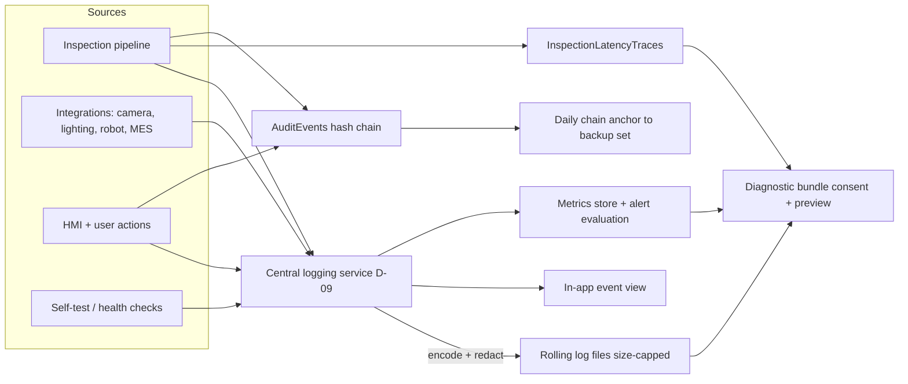
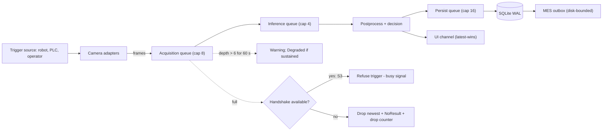
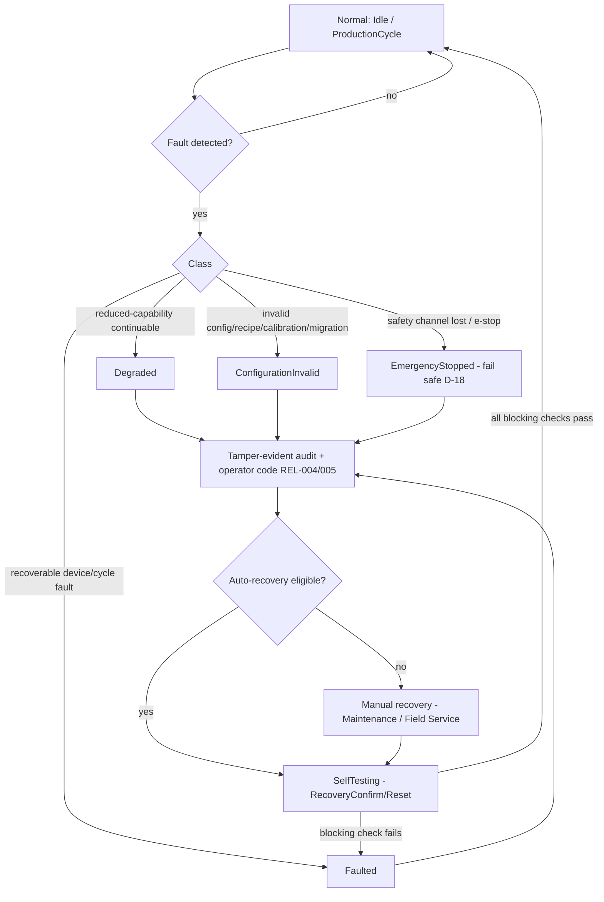

# VOL13 Observability, Performance, and Reliability — AOI Software Architecture, Secure Development, and Change-Control Standard, v1.0 (2026-07-15)

Scope: this volume defines the normative telemetry, audit, diagnostics, performance/capacity, and failure-recovery requirements for AOI Monitor (§38, §40, §41; §39 Testing Strategy is owned by VOL14).
Supersedes/Related existing docs: supersedes the `PERF-*`/`REL-*` rows of `Docs/Industrial_Quality_Checklist.md` and the Performance and Reliability sections of `Docs/Industrial_HMI_and_Software_Quality_Baseline.md` (mapping published in VOL20); related and kept: `Docs/Factory_Acceptance_Test_Plan.md` (soak procedure), `Docs/Database_Schema.md` (retention boundary), `DESIGN.md` (operator-message rules), `Docs/Standards_Traceability_Matrix.md` (evidence-export mechanics and certification-boundary wording). The runtime IDs `PERF-001`/`REL-001` in `AOI_Monitor/Services/StandardsTraceabilityService.cs` collide with this volume's category names; the reconciliation rule is owned by VOL01 §5.

---

## 38. Logging, Audit, Metrics, Tracing, and Diagnostics

This section governs everything the software records about its own behavior: structured logs, the tamper-evident audit trail, the metrics catalogue, per-cycle latency tracing, crash artifacts, diagnostic bundles, and health checks. Its boundary with neighbors: §25 (VOL06) owns *how* errors are raised and typed; this section owns how they are *recorded and observed*. §37 (VOL05) owns database/image storage mechanics; this section owns what telemetry is persisted and for how long. §27/§28 (VOL07) own the identity model; this section consumes identities as correlation fields. Decision D-09 is binding: a single logging service, stable event IDs, rolling size-capped files, no third-party telemetry by default.

Repo reality this section builds on: audit rows via `AoiDatabase.RecordAuditEvent` with ambient identity providers (`AOI_Monitor/Data/AoiDatabase.Audit.cs`, `AoiDatabase.cs:22-25`); per-cycle latency spans with a generated `TraceId` (`AOI_Monitor/Services/InspectionLatencyService.cs`, `InspectionLatencyTraces` table); crash reports (`AOI_Monitor/Services/CrashReportService.cs`); support bundles with SHA-256 manifests (`AOI_Monitor/Services/SupportBundleService.cs`); memory snapshots (`AOI_Monitor/Services/MemoryDiagnosticsService.cs`); archive-then-purge retention over exactly four tables (`AOI_Monitor/Data/AoiDatabase.Infrastructure.cs:3288-3332`). Known nonconformities to be closed by this section: no central logging service exists; audit rows have no tamper evidence (repo gap; user-writable SQLite); retention covers only four tables; silent-fallback readers mask corruption.



**Reading this diagram:** All four event sources (pipeline, integrations, HMI, self-tests) emit through one central logging service, which applies control-character encoding and secret redaction before fan-out to size-capped rolling files and the in-app event view. In parallel, the inspection pipeline writes per-cycle latency spans to `InspectionLatencyTraces`, and audited actions append to the hash-chained `AuditEvents` table whose daily anchor is exported with backups. The metrics store evaluates alert thresholds locally. Diagnostic bundles draw from files, traces, and metrics only through the consent-and-preview path — never from the raw image vault.

### 38.1 Structured events and the event-ID registry

Every log or audit event type has a stable identifier of the form `AOI-<COMPONENT>-<NNNN>` (component token from the canonical vocabulary, four digits). The registry file is `Docs/observability/event_id_registry.json` in this repository: one entry per event ID with component, severity, message template, correlation-field applicability, and introduction version. CI parses the registry and the codebase; an emitted ID absent from the registry — or a registry entry whose template drifted from code — fails the build.

Severity levels (Table 38-1):

| Severity | Use | Operator-visible? |
|---|---|---|
| Trace | Span-level detail, disabled in production default config | No |
| Debug | Engineer diagnostics, disabled in production default config | No |
| Info | Normal lifecycle events (startup, mode change, cycle complete) | Event view only |
| Warning | Degradation risk, threshold approach, retried faults | Status area |
| Error | Failed operation with containment, cycle-level failure | Alarm list |
| Critical | Safe-state entry, data-integrity or safety-observation failure | Modal alarm + alarm list |

### 38.2 Correlation fields

Table 38-2 — mandatory correlation fields on every inspection-path event (logs, latency spans, audit rows, MES payload envelopes). Where a field's stage does not apply, the literal string `n/a` is recorded, never null/empty:

| Field | Source | Applies from |
|---|---|---|
| InspectionId | persisted result key | S1 |
| BoardId | barcode/MES board identity (import batch ID at S1) | S1 |
| LotId | MES/operator lot entry | S1 |
| StationId | station configuration | S1 |
| CameraId | device identity from adapter (`n/a` for folder source) | S2 |
| TriggerId | hardware/robot trigger sequence number | S2 |
| RecipeVersion | active `RecipeRevisions` revision | S1 |
| ModelVersion | active `ModelRegistry` entry ID | S1 |
| SoftwareVersion | assembly informational version | S1 |
| UserOrServiceIdentity | `WorkflowState` user or service account | S1 |
| MesMessageId | outbox enqueue identity | S4 |
| RobotCycleId | `RobotCycleService` cycle identity | S3 |
| TraceId | one GUID per cycle (`InspectionLatencyTraceBuilder`) | S1 |

### 38.3 Metrics catalogue

Table 38-3 — the normative metrics catalogue. Types: C = counter, G = gauge, H = histogram (p50/p95/p99/max + count). Latency thresholds mirror Table 40-2, which is authoritative for budgets. "Warn"/"Crit" raise Warning/Critical alarms per §38.1.

| Metric | Unit | Type | Alert threshold |
|---|---|---|---|
| insp.latency.capture | ms | H | p95 > 80 Warn |
| insp.latency.transfer | ms | H | p95 > 30 Warn |
| insp.latency.decode | ms | H | p95 > 60 Warn |
| insp.latency.preprocess | ms | H | p95 > 130 Warn |
| insp.latency.inference | ms | H | p95 > 370 Warn |
| insp.latency.postprocess | ms | H | p95 > 60 Warn |
| insp.latency.overlay | ms | H | p95 > 70 Warn |
| insp.latency.persist | ms | H | p95 > 90 Warn |
| insp.latency.ui_update | ms | H | p95 > 60 Warn |
| insp.latency.mes_handoff | ms | H | p95 > 30 Warn |
| insp.latency.e2e | ms | H | p95 > 1000 Crit; p99 > 1500 Crit |
| insp.queue.acquisition_depth | frames | G | > 6 of 8 for 60 s Warn |
| insp.frames.dropped | count | C | > 0/h Warn; > 10/h Crit + Degraded |
| insp.throughput | boards/h | G | < configured line takt 15 min Warn |
| quality.defect_count | count/board | C | recipe control limit (recipe-defined) |
| quality.false_call_rate | ratio | G | > 0.05 Warn (ground truth present only) |
| quality.escape_rate | ratio | G | > 0.02 Crit (ground truth present only) |
| integration.retry_count | count/h | C | > 30/h Warn |
| camera.reconnects | count/day | C | > 3/day Warn |
| robot.timeouts | count/day | C | >= 1 Warn; >= 3 Crit |
| mes.outage_minutes | min | G | > 15 Warn; > 240 Crit |
| mes.spool_pending | rows | G | > 10000 Warn; > 50000 Crit |
| db.errors | count/h | C | >= 1 Warn; >= 5/h Crit |
| storage.used_percent | % | G | >= 80 Warn; >= 90 Crit |
| storage.days_to_full | days | G | < 30 Warn; < 7 Crit |
| gpu.memory_used (GPU EP only) | MB | G | > 80% device Warn |
| gpu.utilization (GPU EP only) | % | G | > 95 for 5 min Warn |
| proc.cpu_percent | % | G | > 85 for 5 min Warn |
| proc.working_set | MB | G | > 1500 Warn; > 2500 Crit |
| proc.managed_heap | MB | G | > 650 Warn |
| proc.handle_count | count | G | > 10000 Warn; > 20000 Crit |
| proc.thread_count | count | G | > 200 Warn |
| model.load_time (incl. warm-up) | ms | H | > 15000 Crit |
| calibration.age | days | G | > recipe interval Warn; > 2x Crit |
| cert.days_to_expiry | days | G | < 30 Warn; < 7 Crit |
| backup.age | h | G | > 26 Warn; > 72 Crit |
| update.status | enum | G | Pending > 14 days Warn |
| clock.ntp_offset | s | G | > 5 Warn; > 60 Crit (F-25) |
| audit.chain_verified | bool | G | false = Crit + Degraded |

The warn thresholds for `proc.working_set` (1500 MB) and `proc.managed_heap` (650 MB) codify the existing constants in `AOI_Monitor/Services/MemoryDiagnosticsService.cs:30-31`.

### 38.4 Redaction, log security, and retention

Redaction is a single choke point: the central logging service applies `SecretProtectionService.RedactKnownSecrets` (extended per OBS-019) and control-character encoding (OBS-022) to every record. Customer board images never enter logs; records reference vault path + SHA-256 only. The audit trail becomes tamper-evident through per-row hash chaining (OBS-025..027) — this closes the highest-ranked forensic gap identified in the data-layer survey (plain rows in user-writable SQLite).

Table 38-4 — telemetry retention classes (all configurable archive-then-purge, extending `LogRetentionService`; defaults below; SD-02 resolution — the hardcoded "30 days" from the source spec is void):

| Class | Default retention | Notes |
|---|---|---|
| AuditEvents + chain anchors | 730 days on-station | never shorter than customer quality-record policy |
| InspectionResults/Defects | 730 days | quality-evidence class; §37.5 (VOL05) is authoritative for database-record retention |
| Rolling application logs | 90 days, size caps per file 64 MB | rotation tested (OBS-029) |
| Metrics aggregates | 180 days | raw spans 30 days |
| Crash reports | 90 days | dumps 30 days (Customer-IP class) |
| Diagnostic bundles | transfer + 30 days | consent artifacts kept with bundle |
| MES spool rows (Sent) | 90 days | Pending rows exempt from purge |

Records pending confirmed MES upload are exempt from purge (source-spec defect: local purge before upload confirmation would silently break traceability).

### 38.5 Crash artifacts, diagnostic bundles, operator codes, health

Crash dumps of the AOI process can contain decoded board images in heap memory; they are classified Customer-IP (data classes per §8/VOL02) and handled accordingly. Diagnostic bundles are produced only via `SupportBundleService`, which already excludes vault images and emits a per-file SHA-256 manifest; this section makes consent + preview mandatory. Operators see stable error codes with plain-language actions (existing DESIGN.md rule); engineers get full diagnostics behind role gating. Each boot persists a startup self-test report (consumed by §40 startup budget and §41 recovery rules).

### R: Structured logging and event identity

**[OBS-001]** (P0 | ALL | Logging)
The application SHALL route every runtime log record through a single central structured-logging service (D-09), with no direct console, Debug-output, or ad-hoc file log writes outside that service.
- Why: one choke point makes redaction, event IDs, injection encoding, and rotation enforceable; today logging is scattered across services and code-behind. Maps: 62443-4-2 CR 2.8; ASVS-V16; CWE-778.
- Verify: fitness function FF-OBS-01 (analyzer + grep gate banning `Console.Write*`, `Trace.WriteLine`, ad-hoc `File.Append*` outside `Services/Logging`). Evidence: CI gate log. Owner: Software Lead. Auto: Fully automated.
- Exception: Not allowed. Review: Annual.

**[OBS-002]** (P1 | ALL | Logging, CI)
Every emitted event type SHALL have a stable event ID registered in `Docs/observability/event_id_registry.json` before the change that introduces it merges.
- Why: unregistered IDs break machine parsing, alarm routing, and long-term log analysis across versions. Maps: 62443-4-2 CR 2.8; Internal.
- Verify: fitness function FF-OBS-02 (CI diff of emitted IDs vs registry). Evidence: CI gate log + registry file history. Owner: Software Lead. Auto: Fully automated.
- Exception: Not allowed. Review: Per release.

**[OBS-003]** (P2 | ALL | Logging)
Every event ID SHALL keep its meaning permanently; renumbering, reusing, or repurposing a released ID is prohibited.
- Why: historical logs and customer tooling parse by ID; silent meaning changes corrupt evidence interpretation. Maps: Internal.
- Verify: FF-OBS-02 rejects registry entries whose semantics field changed without a new ID. Evidence: registry file history. Owner: Software Lead. Auto: Fully automated.
- Exception: Not allowed. Review: Annual.

**[OBS-004]** (P2 | ALL | Logging)
Each structured log record SHALL contain at minimum: UTC timestamp (ISO-8601 round-trip), event ID, severity, source component, message template, and named field values carried as structured data.
- Why: parseable records are the precondition for correlation, alerting, and export; free-text lines are not machine-checkable. Maps: ASVS-V16; 62443-4-2 CR 2.11 (timestamps); D-16.
- Verify: test class `StructuredLogSchemaTests` (new) validating serialized records against a JSON schema. Evidence: test run in trx. Owner: Software Lead. Auto: Fully automated.
- Exception: Not allowed. Review: Annual.

**[OBS-005]** (P2 | ALL | Logging, HMI)
The logging service SHALL support exactly the six severities of Table 38-1 with the stated operator-visibility rules.
- Why: alarm discipline requires a fixed severity vocabulary; ad-hoc levels defeat alarm prioritization on the shop floor. Maps: 62443-4-2 CR 2.8; Internal.
- Verify: `StructuredLogSchemaTests` severity enumeration case. Evidence: test run. Owner: Software Lead. Auto: Fully automated.
- Exception: Allowed — approver: Software Architect. Review: Annual.

**[OBS-006]** (P2 | ALL | Logging)
Log message templates SHALL use named placeholders with variable data carried as separate structured fields; concatenating variable data into the template text is prohibited.
- Why: separates trusted template from untrusted data (log-injection defense) and keeps event cardinality stable for analysis. Maps: CWE-117; ASVS-V16.
- Verify: FF-OBS-01 analyzer rule on logging call sites (interpolated-string argument ban). Evidence: CI gate log. Owner: Software Lead. Auto: Fully automated.
- Exception: Not allowed. Review: Annual.

**[OBS-007]** (P3 | ALL | Logging, HMI)
The logging service SHOULD feed the in-app event view and the rolling files from the same record stream so that on-screen history and persisted logs never diverge.
- Why: today `WorkflowState` keeps a separate 500-entry event history; divergent streams mislead incident analysis. Maps: Internal.
- Verify: code review checklist item CR-OBS-01. Evidence: PR review record. Owner: Software Lead. Auto: Manual review.
- Exception: Allowed — approver: Software Architect. Review: Annual.

**[OBS-008]** (P2 | ALL | Logging, Config)
The application SHALL NOT transmit logs, metrics, or telemetry to any external endpoint unless explicitly enabled in station configuration and documented in the customer deployment record (D-09).
- Why: customer IP protection and air-gap compatibility; silent telemetry is a contract and PIPA/GDPR exposure. Maps: PIPA; GDPR; SBD.
- Verify: FF-OBS-03 (no default outbound telemetry endpoints in config schema); network review at FAT. Evidence: config schema + FAT record. Owner: Security Lead. Auto: Partially automated.
- Exception: Not allowed. Review: Per release.

### R: Correlation and tracing

**[OBS-009]** (P1 | ALL | Logging, Orchestrator)
Every inspection-path event SHALL carry all thirteen correlation fields of Table 38-2, recording the literal `n/a` where a field's stage does not apply.
- Why: without uniform correlation, cross-artifact investigation (image ↔ result ↔ MES message ↔ robot cycle) is manual guesswork; drives CR 2.8 auditable-event content. Maps: 62443-4-2 CR 2.8; IPC-610 (traceability intent); Internal.
- Verify: test class `CorrelationFieldTests` (new) asserting field presence on representative pipeline events. Evidence: test run. Owner: Software Lead. Auto: Fully automated.
- Exception: Not allowed. Review: Per release.

**[OBS-010]** (P2 | ALL | Orchestrator, Logging)
A TraceId SHALL be created exactly once per inspection cycle — at trigger receipt (S2+) or image import (S1) — and propagated unchanged to every log record, latency span, audit row, and MES payload of that cycle.
- Why: a stable per-cycle key is the join column for all telemetry; `InspectionLatencyTraceBuilder` already generates one but it does not reach logs/audit/MES. Maps: Internal.
- Verify: `CorrelationFieldTests` propagation case. Evidence: test run. Owner: Software Lead. Auto: Fully automated.
- Exception: Not allowed. Review: Annual.

**[OBS-011]** (P2 | ALL | Persistence, Logging)
Persisted logs and audit rows SHALL be queryable by InspectionId and TraceId through indexed columns.
- Why: incident triage under production time pressure requires indexed lookup, not table scans of JSON blobs. Maps: 62443-4-2 CR 6.1; Internal.
- Verify: schema test in `AoiDatabaseTests` asserting index existence. Evidence: test run. Owner: Software Lead. Auto: Fully automated.
- Exception: Allowed — approver: Software Architect. Review: Annual.

**[OBS-012]** (P2 | ALL | Audit, Persistence)
The `AuditEvents` schema SHALL be extended with a `TraceId` column (additive migration) populated for all inspection-path audit rows.
- Why: audit rows currently carry user/station/category but cannot be joined to the cycle that caused them. Maps: 62443-4-2 CR 2.8; Internal.
- Verify: migration test in `AoiDatabaseTests`; `CorrelationFieldTests`. Evidence: test run + migration entry. Owner: Software Lead. Auto: Fully automated.
- Exception: Not allowed. Review: On change.

**[OBS-013]** (P3 | S4 | MES, Logging)
MesMessageId SHOULD be assigned at durable outbox enqueue time and echoed unchanged in every retry attempt and server exchange for that payload.
- Why: enables server-side duplicate suppression and end-to-end message tracing across outages. Maps: Internal.
- Verify: `MesRestIntegrationTests` extension case. Evidence: test run. Owner: Software Lead. Auto: Fully automated.
- Exception: Allowed — approver: Software Architect. Review: Annual.

### R: Metrics

**[OBS-014]** (P1 | ALL | Diagnostics, Logging)
The application SHALL emit every metric listed in Table 38-3 with the specified unit and instrument type.
- Why: the catalogue is the contract for capacity engineering (§40), reliability KPIs (§41), and customer acceptance; missing metrics make budgets unverifiable. Maps: 25010 (performance efficiency); 62443-4-2 CR 6.2; Internal.
- Verify: FF-OBS-04 (emitted-metric inventory vs catalogue file). Evidence: CI gate log. Owner: Software Lead. Auto: Fully automated.
- Exception: Allowed — approver: Software Architect. Review: Per release.

**[OBS-015]** (P2 | ALL | Diagnostics, HMI)
Alert thresholds from Table 38-3 SHALL be evaluated on-station with each breach raised as an alarm carrying the metric name, value, and threshold.
- Why: stations run air-gapped; alerting cannot depend on external monitoring infrastructure. Maps: 62443-4-2 CR 6.2; 800-82.
- Verify: test class `MetricAlertThresholdTests` (new). Evidence: test run. Owner: Software Lead. Auto: Fully automated.
- Exception: Allowed — approver: Software Architect. Review: Per release.

**[OBS-016]** (P2 | ALL | Diagnostics, Orchestrator)
Per-cycle latency spans SHALL be recorded for every pipeline stage of Table 40-2 by extending the existing `InspectionLatencyService` span set (`AOI_Monitor/Services/InspectionLatencyService.cs`).
- Why: budget enforcement (§40) requires per-stage evidence; today only a subset of spans exists. Maps: Internal; SD-07.
- Verify: `LatencyBudgetTests` (new) span-coverage case. Evidence: test run + `InspectionLatencyTraces` rows. Owner: Software Lead. Auto: Fully automated.
- Exception: Not allowed. Review: Per release.

**[OBS-017]** (P2 | ALL | Diagnostics)
Latency and throughput metrics SHALL be aggregated as p50/p95/p99/max with sample counts over 1-hour and 24-hour rolling windows.
- Why: percentile discipline is this product's SD-07 correction; window definitions make alarms reproducible. Maps: 25010; Internal.
- Verify: `MetricAlertThresholdTests` aggregation case. Evidence: test run. Owner: Software Lead. Auto: Fully automated.
- Exception: Not allowed. Review: Annual.

**[OBS-018]** (P3 | ALL | Export, Diagnostics)
A machine-readable JSON metrics snapshot SHOULD be exportable per shift and per day for offline analysis.
- Why: customers analyze line performance without station access; JSON export avoids screen-scraping. Maps: Internal.
- Verify: `ExportVerification` record for the snapshot export. Evidence: export verification row. Owner: Software Lead. Auto: Partially automated.
- Exception: Allowed — approver: Product Owner. Review: Annual.

### R: Redaction, log security, and audit chain

**[OBS-019]** (P0 | ALL | Logging, Audit)
No secret, token, key, password, or credential value SHALL appear in any log record, audit row, metric, crash report, or diagnostic bundle.
- Why: logs travel (bundles, exports, backups); a leaked MES key compromises the plant conduit. The existing `SecretProtectionService.RedactKnownSecrets` blocklist SHALL be the extended single mechanism. Maps: CWE-532; ASVS-V16; 62443-4-1 SM-7.
- Verify: existing `AuthenticationAndSecretHandlingTests` + FF-OBS-05 secret-pattern scan over produced artifacts in CI. Evidence: test run + gate log. Owner: Security Lead. Auto: Fully automated.
- Exception: Not allowed. Review: Quarterly.

**[OBS-020]** (P1 | ALL | Logging, ImageStore)
Log and audit records SHALL reference customer images only by vault path and SHA-256, never by embedded pixel data or base64-encoded content.
- Why: customer-IP images in logs escape the vault's access and retention controls; existing `CrashReportService` already redacts image paths — this generalizes the rule. Maps: PIPA; GDPR; Internal.
- Verify: FF-OBS-05 artifact scan (base64/image-magic-byte detector). Evidence: CI gate log. Owner: Security Lead. Auto: Fully automated.
- Exception: Not allowed. Review: Quarterly.

**[OBS-021]** (P2 | ALL | Logging, Audit)
Personal data in telemetry SHALL be limited to the operator or service identity fields defined in Table 38-2.
- Why: bounded personal-data surface keeps PIPA/GDPR review tractable and supports §46 (VOL16) privacy analysis. Maps: PIPA; GDPR.
- Verify: privacy review checklist item PR-PRIV-01 per release. Evidence: review record. Owner: Data Protection Officer (advisory). Auto: Manual review.
- Exception: Allowed — approver: Security Lead. Review: Annual.

**[OBS-022]** (P1 | ALL | Logging)
All externally influenced string values (file names, recipe names, device strings, MES responses) SHALL have CR, LF, and C0 control characters encoded before being written to any log or audit record.
- Why: prevents forged log lines and split records (log injection, CWE-117) from attacker-influenced inputs. Maps: CWE-117; ASVS-V16.
- Verify: test class `LogInjectionTests` (new) with adversarial inputs. Evidence: test run. Owner: Security Lead. Auto: Fully automated.
- Exception: Not allowed. Review: Annual.

**[OBS-023]** (P2 | ALL | Persistence, Config)
Telemetry retention SHALL implement the per-class configurable archive-then-purge policies of Table 38-4, extending the existing `LogRetentionService` beyond its current four tables.
- Why: SD-02 resolution; single-policy retention over four tables leaves logs, metrics, spool, and bundles unmanaged (unbounded or lost). Maps: 62443-4-2 CR 2.9; PIPA; Internal.
- Verify: existing `LogRetentionTests` extended per class. Evidence: test run. Owner: Software Lead. Auto: Fully automated.
- Exception: Allowed — approver: Product Owner. Review: Annual.

**[OBS-024]** (P2 | ALL | IAM, Export)
Log export and diagnostic-bundle creation SHALL require the Admin role enforced at the service layer, extending the existing `RoleAuthorization.CanExportLogs` gate beyond UI code-behind.
- Why: logs aggregate operational and quality data; UI-only gating is bypassable by any non-UI caller (repo gap: enforcement lives in code-behind). Maps: 62443-4-2 CR 2.1, CR 6.1.
- Verify: `RoleAuthorizationTests` extension: service-layer denial case. Evidence: test run. Owner: Security Lead. Auto: Fully automated.
- Exception: Not allowed. Review: Per release.

**[OBS-025]** (P1 | ALL | Audit, Persistence)
Each `AuditEvents` row SHALL store a per-row chain hash constructed per the §21 (VOL05) audit-row chain-hash rule, so that deletion, reordering, and edits become detectable in the observability trail.
- Why: audit rows currently sit unprotected in user-writable SQLite — the single biggest forensic gap; the hash construction is defined once by §21 (VOL05, the data/storage owner) to prevent formula drift, and this record binds the observability layer to persist and rely on it. Maps: 62443-4-2 CR 2.8, CR 3.4; CWE-778.
- Verify: test class `AuditChainTests` (new): append, verify, tamper-detect cases. Evidence: test run. Owner: Security Lead. Auto: Fully automated.
- Exception: Not allowed. Review: Per release.

**[OBS-026]** (P2 | S2+ | Audit, Export)
A daily audit-chain anchor (latest chain hash + row count + UTC date) SHALL be written into the backup set so that off-station copies can detect chain truncation or rewrite.
- Why: an attacker with file access can rebuild the whole chain; an external anchor bounds the rewrite window to one day. Maps: 62443-4-2 CR 3.4; Internal.
- Verify: `AuditChainTests` anchor case + backup-content check FF-REL-03. Evidence: test run + backup manifest. Owner: Security Lead. Auto: Fully automated.
- Exception: Allowed — approver: Security Lead. Review: Annual.

**[OBS-027]** (P2 | ALL | Audit, Diagnostics)
Scheduled audit-chain verification SHALL run at least weekly and on demand, raising a Critical alarm and Degraded entry (§41, Table 41-1) on any mismatch.
- Why: tamper evidence is worthless if never checked; scheduled verification bounds detection latency to seven days. Maps: 62443-4-2 CR 3.3, CR 6.2.
- Verify: `AuditChainTests` scheduled-verification case. Evidence: test run + `audit.chain_verified` metric. Owner: Security Lead. Auto: Fully automated.
- Exception: Not allowed. Review: Annual.

### R: Clock and disk protection

**[OBS-028]** (P2 | ALL | Diagnostics, Config)
NTP clock offset SHALL be sampled at least every 15 minutes, with Warning above 5 s offset and clock-jump handling (§41, F-25) above 60 s (D-16).
- Why: timestamps order quality evidence; unmonitored drift silently corrupts cross-system correlation with MES and robot logs. Maps: 62443-4-2 CR 2.11; D-16.
- Verify: `MetricAlertThresholdTests` clock case; FAT checklist item. Evidence: test run + FAT record. Owner: IT Admin (customer). Auto: Partially automated.
- Exception: Allowed — approver: Software Architect. Review: Annual.

**[OBS-029]** (P1 | ALL | Logging)
Log files SHALL be size-capped rolling files (per-file ≤ 64 MB, per-class total caps per Table 38-4) whose rotation behavior is exercised by an automated test.
- Why: unbounded logs are a disk-full self-DoS on 24/7 stations (D-09); untested rotation fails exactly when disks are already full. Maps: CWE-400; 62443-4-2 CR 2.9.
- Verify: test class `LogRotationTests` (new) forcing rollover. Evidence: test run. Owner: Software Lead. Auto: Fully automated.
- Exception: Not allowed. Review: Annual.

**[OBS-030]** (P2 | ALL | Logging, Diagnostics)
When free disk space falls below 5% or 2 GB (whichever is larger), telemetry writers SHALL stop growing (drop-oldest within their caps) so that inspection-result persistence retains write priority.
- Why: a station must keep producing quality records even when diagnostics fill the disk; priority inversion here loses legally relevant evidence. Maps: CWE-400; 62443-3-3 SR 7.2.
- Verify: fault-injection test FI-18 (disk-full, §41). Evidence: FI test record. Owner: Software Lead. Auto: Partially automated.
- Exception: Not allowed. Review: Annual.

### R: Crash artifacts and diagnostic bundles

**[OBS-031]** (P1 | ALL | Diagnostics)
Process crash dumps SHALL be classified and handled as Customer-IP data — stored under the access-controlled diagnostics folder and never transmitted automatically.
- Why: dumps contain decoded board images and session state from heap memory; automatic transmission would exfiltrate customer IP. Maps: PIPA; GDPR; CWE-532.
- Verify: review checklist CR-OBS-02 + FF-OBS-03 (no dump paths in any upload/export config). Evidence: review record + gate log. Owner: Security Lead. Auto: Partially automated.
- Exception: Not allowed. Review: Annual.

**[OBS-032]** (P2 | ALL | Diagnostics)
Crash reports SHALL pass the central redaction rules before persistence and be retained for 90 days by default (codifying `AOI_Monitor/Services/CrashReportService.cs`).
- Why: crash reports embed operator identity, workflow history, and paths; unredacted or immortal reports widen the exposure window. Maps: CWE-532; PIPA.
- Verify: existing crash-report tests + `LogRetentionTests` crash-class case. Evidence: test run. Owner: Software Lead. Auto: Fully automated.
- Exception: Allowed — approver: Security Lead. Review: Annual.

**[OBS-033]** (P1 | ALL | Diagnostics, HMI)
Diagnostic bundles SHALL be produced only through `SupportBundleService` after explicit operator consent with an on-screen preview of the bundle manifest (file list and exclusions) before creation.
- Why: bundles are the sanctioned exfiltration path; consent + preview (to be added — the service exists, the consent UI does not) keeps the customer in control of what leaves the station. Maps: PIPA; GDPR; SBD.
- Verify: existing `SupportBundleServiceTests` + new consent-flow UI test. Evidence: test run. Owner: Security Lead. Auto: Partially automated.
- Exception: Not allowed. Review: Per release.

**[OBS-034]** (P2 | ALL | Diagnostics)
Diagnostic bundles SHALL exclude vault images and raw customer datasets and include the per-file SHA-256 manifest (codifying existing `SupportBundleService` behavior as mandatory).
- Why: turns current good behavior into a regression-protected obligation; the manifest enables receiver-side integrity checks. Maps: PIPA; Internal.
- Verify: `SupportBundleServiceTests` exclusion + manifest cases (exist). Evidence: test run. Owner: Software Lead. Auto: Fully automated.
- Exception: Not allowed. Review: Per release.

**[OBS-035]** (P3 | ALL | Diagnostics, Config)
Windows crash-dump collection SHOULD be configured (WER LocalDumps or `createdump`) with a ring buffer of at most 5 dumps per process.
- Why: bounded dump collection preserves post-mortem capability without unbounded Customer-IP accumulation. Maps: Internal.
- Verify: installation validation script check. Evidence: install validation log. Owner: Field Service. Auto: Partially automated.
- Exception: Allowed — approver: Software Lead. Review: Annual.

### R: Operator codes, engineer diagnostics, and health

**[OBS-036]** (P2 | ALL | HMI, Diagnostics)
Operator-facing failures SHALL present a stable operator error code from the event registry with a plain-language action, never a stack trace or raw exception text (codifying the DESIGN.md rule).
- Why: operators act on codes, not exceptions; stack traces leak internals and violate the existing factory-safe dialog policy. Maps: 25010 (usability); CWE-209.
- Verify: existing CQ-MSG-001 gate in `Scripts/check-code-quality.ps1` + `UiErrorBoundaryService` tests. Evidence: CI gate log. Owner: Software Lead. Auto: Fully automated.
- Exception: Not allowed. Review: Annual.

**[OBS-037]** (P2 | ALL | HMI, IAM)
Engineer-level diagnostic detail (raw exception text, internal paths, span timings) SHALL be visible only to Engineer or higher roles.
- Why: separates the operator's action surface from the engineer's investigation surface; limits internal-detail exposure on shared floor PCs. Maps: 62443-4-2 CR 2.1; CWE-209.
- Verify: `RoleAuthorizationTests` diagnostics-visibility case. Evidence: test run. Owner: Software Lead. Auto: Fully automated.
- Exception: Allowed — approver: Security Lead. Review: Annual.

**[OBS-038]** (P2 | ALL | Diagnostics)
An on-demand local health check SHALL report the status of database, storage headroom, camera, lighting, robot, MES, active model, license, calibration age, clock sync, and backup age, extending `FactoryReadinessService`.
- Why: air-gapped stations need self-contained triage; a single panel prevents blind restarts that destroy failure evidence. Maps: 62443-4-2 CR 3.3; 25010 (maintainability).
- Verify: `FactoryReadinessServiceTests` coverage of all eleven checks. Evidence: test run. Owner: Software Lead. Auto: Fully automated.
- Exception: Allowed — approver: Software Architect. Review: Per release.

**[OBS-039]** (P1 | ALL | Diagnostics, Persistence)
Each application start SHALL persist a startup self-test report (check outcomes, durations, software/model/recipe versions) as a database record and JSON file before the station enters Idle.
- Why: the self-test report is the §40 startup-budget evidence and the §41 recovery gate; unpersisted checks cannot be audited after an incident. Maps: 62443-4-2 CR 3.3; Internal.
- Verify: test class `StartupSelfTestTests` (new). Evidence: test run + persisted report. Owner: Software Lead. Auto: Fully automated.
- Exception: Not allowed. Review: Per release.

**[OBS-040]** (P3 | ALL | CI, Diagnostics)
The machine-readable metrics catalogue `Docs/observability/metrics_catalogue.json` SHOULD be maintained as the authoritative form of Table 38-3, with a CI drift check failing the build on any divergence between the JSON catalogue and the table.
- Why: OBS-014 already gates emitted code against the catalogue, so this record's distinct obligation is keeping the JSON catalogue and Table 38-3 themselves in lockstep — the way `Docs/Industrial_Quality_Checklist.md` and the gate JSON already drifted. Maps: Internal.
- Verify: FF-OBS-06 (catalogue-vs-table drift check) in `Scripts/run-quality-gates.ps1`. Evidence: CI gate log. Owner: QA Lead. Auto: Fully automated.
- Exception: Allowed — approver: Software Lead. Review: Annual.

---

## 40. Performance and Capacity Engineering

This section converts the source spec's "within 1 second per image" (SD-07) into an enforceable engineering contract: a per-stage latency budget at a defined workload on defined hardware, capacity plans for storage, network, and compute, bounded queues with explicit overload behavior, and a soak ladder that supersedes the 8-hour acceptance figure (SD-08). Boundary with neighbors: §38 owns the measurement plumbing (spans, metrics, alerts) that makes this section checkable; §26 (VOL06) owns concurrency mechanics and resource ownership; §37 (VOL05) owns storage and archival mechanics; §39 (VOL14) owns when the performance and soak suites execute; §36 (VOL12) owns HMI responsiveness beyond the pipeline `ui_update` span.

Repo reality this section builds on: per-stage latency spans (`AOI_Monitor/Services/InspectionLatencyService.cs`); memory snapshots with existing thresholds (`AOI_Monitor/Services/MemoryDiagnosticsService.cs`); soak infrastructure (`AOI_Monitor/Services/SoakTestService.cs`, `AOI_Monitor/Services/UiNavigationSoakTestService.cs`, `SoakTestRuns`/`SoakTestIterations` tables); image-cache release hooks (`AOI_Monitor/Services/ImageCacheService.cs`, `IReleasablePageResources`); the decode-bomb guard on import (`AOI_Monitor/Data/AoiDatabase.Images.cs:99-103`); the navigation-performance CI gate (PERF-001 in `Scripts/run-quality-gates.ps1`). Known nonconformities to be closed here: no per-stage budget enforcement exists; storage growth is unbounded beyond four retained tables; queues are not uniformly bounded; soak runs are ad-hoc rather than laddered.

### 40.1 Reference workload and hardware

A latency or capacity number without a stated workload and hardware profile is not a claim — it is the exact defect SD-07 documents. Every budget in this section is defined against Table 40-1; measurements on other workloads or hardware are recorded with their own profile identity and never compared against these budgets directly (`ASSUMPTION A-VOL13-2`: the workload and hardware values are conservative pre-Stage-2 engineering choices; risk is mis-sized budgets, corrected by the PER-033 re-baseline rule at pilot).

Table 40-1 — reference workload WL-REF and reference hardware REF-HW:

| Item | Definition |
|---|---|
| WL-REF top view | 1 frame, 24 MP (6000 x 4000), 8-bit Bayer, 24 MB raw |
| WL-REF side views | 2 frames, 5 MP (2448 x 2048), 8-bit Bayer, 5 MB each, transferred in parallel with the top view |
| WL-REF recipe | 100 ROIs evaluated, 20 defects found (each with overlay annotation and crop), no 3D scan |
| WL-REF outputs | 1 result row + 20 defect rows + annotated overlay + thumbnails + 1 MES payload enqueued |
| WL-BATCH (S1) | WL-REF images imported from folder in batches of 100, no capture/transfer stages |
| REF-HW | x64, 8 physical cores at 3.0 GHz or better, 32 GB RAM, NVMe SSD, no GPU (CPU EP per D-01), Windows 11 IoT Enterprise LTSC 2024 |
| Camera links | top view on a dedicated 10 Gbit/s-class link; each side view on a 2.5 Gbit/s-class link or better |

WL-REF is deliberately 2D-only: the ThreeD module's per-stage budget cannot be allocated before sensor selection (§33, VOL10) and is Open Decision OD-VOL13-2. The worst-case 3D point count is still bounded now (Table 40-3) so that adapter input validation ships before the hardware does.

### 40.2 The latency budget

Table 40-2 is the authoritative latency budget (Table 38-3 mirrors its p95 column as alert thresholds). All values are milliseconds at WL-REF on REF-HW, warm pipeline. Column semantics: **p50** is a SHOULD target (engineering headroom); **p95** and **p99** are SHALL budgets (PER-002); **Max tolerated** is the per-stage abort timeout — a stage exceeding it aborts the cycle to a NoResult outcome. Span names match the §38 metrics catalogue.

| Stage (span) | p50 | p95 | p99 | Max tolerated |
|---|---|---|---|---|
| Acquisition — trigger accepted to last pixel exposed (`capture`) | 40 | 80 | 110 | 250 |
| Transfer — camera to host memory (`transfer`) | 15 | 30 | 45 | 100 |
| Decode — debayer/decode to working format (`decode`) | 30 | 60 | 90 | 200 |
| Preprocess — alignment, normalization, ROI extraction (`preprocess`) | 65 | 130 | 190 | 400 |
| Inference — ONNX session run over all ROIs (`inference`) | 220 | 370 | 550 | 1200 |
| Postprocess — thresholds, taxonomy mapping, verdict (`postprocess`) | 30 | 60 | 90 | 200 |
| Overlay — annotated image and defect crops (`overlay`) | 35 | 70 | 105 | 250 |
| Persist — result, defects, image refs committed (`persist`) | 45 | 90 | 140 | 300 |
| UI update — verdict visible on the HMI (`ui_update`) | 30 | 60 | 90 | 200 |
| MES handoff — durable outbox enqueue (`mes_handoff`) | 10 | 30 | 50 | 100 |
| **End-to-end — trigger to verdict visible and enqueued (`e2e`)** | **600** | **1000** | **1500** | **3000 (watchdog)** |

Budget arithmetic and rules:

- The stage p95 values sum to 980 ms, leaving 20 ms scheduling slack under the 1000 ms end-to-end budget (S2+ live target, SD-07 resolution).
- Per-stage Max values are individual stage timeouts; they intentionally sum past 3000 ms because the end-to-end watchdog (PER-006) binds first — a cycle is aborted at 3000 ms even if no single stage timed out.
- `mes_handoff` is measured to durable outbox enqueue only; server confirmation is asynchronous store-and-forward and is governed by §35 (VOL11), not this budget.
- **S1 offline batch tolerance:** end-to-end p95 ≤ 2000 ms per image at WL-BATCH (import replaces capture/transfer; batch pipelining is permitted).
- **Warm vs. cold:** budgets apply to the warm pipeline. The first inference executes during the startup self-test with a separate initialization budget — `model.load_time` including warm-up ≤ 15,000 ms (Table 38-3, PER-007). Warm-up cycles are excluded from production latency statistics but are recorded.
- **Startup and shutdown:** process start to Idle (self-test complete) ≤ 60 s (PER-008); graceful shutdown ≤ 10 s (PER-009).
- **Trigger jitter (S2+):** hardware trigger to exposure start ≤ 1 ms at p99 over 10,000 triggers; software-trigger paths ≤ 20 ms at p95 (PER-010).
- **Percentile discipline:** an arithmetic mean presented without percentile, sample count, workload, and hardware identity is prohibited in any performance claim (PER-004). Averages hide exactly the tail behavior that stops a production line.

### 40.3 Worst-case envelope

Budgets hold only inside a declared input envelope; inputs beyond it are rejected before entering the pipeline rather than degrading it (CWE-400 self-DoS prevention). Table 40-3 — worst-case envelope, enforced per PER-011 and exercised per release per PER-012:

| Dimension | Limit | Enforcement point |
|---|---|---|
| Pixels per view | 26,000,000 | decode guard before pipeline (`AoiDatabase.Images.cs:99-103`); constant bound to this table |
| Views per cycle | 4 | recipe schema validation |
| ROIs per recipe | 500 | recipe schema validation |
| Defect records per board | 500 (excess counted; board marked ReviewRequired) | postprocess cap |
| 3D points per scan | 20,000,000 | 3D adapter input validation (stage budget: OD-VOL13-2) |
| Import batch size (S1) | 10,000 images | import UI/CLI validation |
| Sustained trigger rate | 1 per 2 s (1,800 cycles/h) | trigger handshake refusal (PER-022) |

### 40.4 Capacity: storage, network, and compute

**Storage growth projection.** Each station's capacity plan (PER-013) uses the normative formula:

```
GB_per_day = boards_per_day x views_per_board x avg_stored_MB_per_view x 1.10 / 1024
```

The 1.10 factor covers result rows, overlays, thumbnails, WAL, and logs. Worked example at 2,000 boards/day, 3 views, 12 MB average stored PNG: about 77 GB/day — a 2 TB data disk holds roughly 25 days at full retention. That number is why the quota alarms exist: `storage.used_percent` at 80/90% and `storage.days_to_full` at 30/7 days (Table 38-3, computed from the trailing 14-day consumption rate per PER-014) drive the §37 (VOL05) archival path long before the §41 disk-full fault (F-18) is reachable.

**Network.** Camera transfer is a per-frame deadline, not an average-rate problem: the 24 MB top-view frame requires roughly 800 MB/s effective link throughput to meet the 30 ms transfer budget — a 10 Gbit/s-class link; each 5 MB side view fits a 2.5 Gbit/s-class link. Links are sized per PER-015 and verified by a commissioning bandwidth measurement. GVCP/GVSP carry no authentication or integrity; segmentation and zoning are owned by §32 (VOL10) and §13 (VOL03).

Table 40-4 — resource budgets and measurement methods (alert thresholds per Table 38-3):

| Resource | Budget | Measurement method |
|---|---|---|
| Process CPU | ≤ 85% sustained over any 5-min window | `proc.cpu_percent`, 10 s samples, 1-min aggregates |
| Working set | ≤ 1,500 MB Warning / 2,500 MB Critical | `MemoryDiagnosticsService` snapshots (`MemoryDiagnosticsService.cs:30-31`) |
| Managed heap | ≤ 650 MB Warning | `GC.GetTotalMemory` within the same snapshots |
| Handles / threads | ≤ 10,000 / ≤ 200 Warning | `Process.HandleCount`, thread count per Table 38-3 |
| GPU memory / utilization (GPU EP only) | ≤ 80% device / ≤ 95% for 5 min | DXGI adapter query + EP counters at snapshot cadence |
| Camera links | worst-case frame transferred within the 30 ms p95 budget | commissioning bandwidth test record |
| Storage | growth per formula; alarms at 80/90% and 30/7 days-to-full | `storage.*` metrics, trailing 14-day rate |

### 40.5 Bounded queues, backpressure, and overload

Every producer-consumer hand-off on the inspection path is a bounded queue with a declared full-queue policy (PER-021; ownership and cancellation mechanics per §26, VOL06). Overload propagates upstream as backpressure — ultimately a trigger refusal at the machine boundary — never as unbounded accumulation in memory or on disk.



**Reading this diagram:** Frames flow from the camera adapters through three bounded in-memory queues — acquisition (8 frames), inference (4 cycles), persist (16 results) — into the WAL-mode database, from which the disk-bounded MES outbox drains asynchronously. The UI channel is a latest-wins conflation slot, so the HMI can never back-pressure the pipeline. When acquisition depth exceeds the high-water mark (6 of 8) for 60 seconds, a Warning is raised and sustained overload enters Degraded. When the queue is actually full, the station refuses the next trigger through the robot/PLC handshake where one exists (S3); where no handshake exists it drops the newest frame, records an explicit NoResult for the affected board, and increments the drop counter that feeds the Degraded threshold of Table 38-3.

Table 40-5 — bounded queues (capacities binding via PER-021):

| Queue | Capacity | Full-queue policy |
|---|---|---|
| Acquisition frame queue | 8 frames | refuse trigger via handshake (S3); else drop-newest + NoResult + `insp.frames.dropped` |
| Inference work queue | 4 cycles | backpressure to acquisition queue |
| Persist queue | 16 results | producers block — persistence has priority (§26, VOL06) |
| UI update channel | 1 (latest-wins conflation) | conflate; the HMI never back-pressures the pipeline |
| Log/telemetry queue | 10,000 records | drop-oldest Trace/Debug first; drop counter emitted (OBS-030 governs disk floor) |
| MES outbox + central sync | disk-bounded: 50,000 pending rows or 5 GB | Critical alarm + operator action; pending quality records never silently dropped |

Caches follow the same rule: every in-memory cache declares a capacity bound and eviction policy (PER-024). Log, metric, spool, and bundle growth is bounded by the Table 38-4 retention classes (§38.4) — "no unbounded anything" is the invariant.

### 40.6 The soak ladder

The source spec's "8-hour stability" (SD-08) is retained as the proof-of-concept floor and superseded as acceptance: production readiness is demonstrated by climbing the full ladder. Each rung's criteria are cumulative (a rung includes all earlier rungs' criteria). Execution cadence is owned by §39 (VOL14); evidence persistence by PER-030.

Table 40-6 — soak ladder (binding via PER-028/PER-029):

| Rung | Duration | Environment / source | Workload | Additional pass criteria |
|---|---|---|---|---|
| R1 PoC (SD-08 floor) | 8 h | lab, simulated source | WL-REF at 2 s takt (~14,400 cycles) | zero crashes/restarts; PER-019 leak slopes; e2e p95 within budget; zero unexplained Critical alarms |
| R2 Pilot | 72 h | pilot cell, real camera + lighting | line takt | zero manual interventions; camera reconnects ≤ 3/day; frame drops ≤ 10/h never breached |
| R3 Pre-production | 7 days | target line, shadow mode | production takt | MES spool drains to zero after an induced 4 h outage; storage consumption within ±20% of projection |
| R4 Production observation | 30 days | live production | production | weekly reliability report; MTBF ≥ 7 days; every Degraded/Faulted entry explained and dispositioned |

### R: Latency budgets and percentile discipline

**[PER-001]** (P0 | S2+ | Orchestrator, Inference)
At the WL-REF workload on REF-HW, end-to-end inspection latency (`insp.latency.e2e`, trigger to verdict visible and MES payload enqueued) SHALL be at most 1000 ms at p95 over any window of 1000 consecutive production cycles.
- Why: SD-07 resolution — "1 second per image" without percentile, workload, and hardware is unverifiable; p95 over a defined window makes the line-takt promise testable. Maps: 25010; Internal; SD-07.
- Verify: test class `LatencyBudgetTests` (new) on synthetic WL-REF + commissioning measurement. Evidence: trx + `InspectionLatencyTraces` aggregates. Owner: Software Architect. Auto: Partially automated.
- Exception: Not allowed. Review: Per release.

**[PER-002]** (P1 | ALL | Orchestrator, Diagnostics)
Every pipeline stage SHALL meet the p95 and p99 budgets of Table 40-2 at WL-REF on REF-HW, measured through the §38 spans (OBS-016).
- Why: an end-to-end number alone cannot localize a regression; per-stage budgets make the slow stage identifiable in one query. Reallocation between stages is permitted only while the end-to-end budget holds. Maps: 25010; Internal.
- Verify: `LatencyBudgetTests` per-stage cases. Evidence: trx + metric aggregates. Owner: Software Lead. Auto: Fully automated.
- Exception: Allowed — approver: Software Architect. Review: Per release.

**[PER-003]** (P2 | S1 | Orchestrator)
In S1 offline batch operation (WL-BATCH), per-image end-to-end latency SHALL be at most 2000 ms at p95.
- Why: offline review tolerates a looser bound than a live line, but an unbounded batch pipeline hides regressions that surface later at S2; 2 s keeps 100-image batches under 4 minutes. Maps: 25010; Internal.
- Verify: `LatencyBudgetTests` WL-BATCH case. Evidence: trx. Owner: Software Lead. Auto: Fully automated.
- Exception: Allowed — approver: Software Architect. Review: Annual.

**[PER-004]** (P1 | ALL | Diagnostics, CI)
Every recorded performance claim (documentation, release evidence, PR descriptions, customer reports) SHALL state percentile, sample count, workload, and hardware profile; an arithmetic mean presented without these is prohibited.
- Why: averages hide the tail behavior that stops production lines — the core defect of SD-07; this extends the repo's existing claim-language gate family (PR-CLAIM rules in `Scripts/check-pr-quality.ps1`). Maps: Internal; SD-07.
- Verify: fitness function FF-PER-01 (claim-pattern rule added to `check-pr-quality.ps1`) + release-evidence review. Evidence: CI gate log + review record. Owner: QA Lead. Auto: Partially automated.
- Exception: Not allowed. Review: Annual.

**[PER-005]** (P2 | ALL | Diagnostics)
All latency measurements SHALL be taken with the monotonic `Stopwatch` clock through `InspectionLatencyService` spans, never by subtracting wall-clock timestamps (D-16).
- Why: wall-clock subtraction breaks under NTP steps and clock jumps (F-25), silently corrupting every percentile computed from it. Maps: 62443-4-2 CR 2.11; Internal.
- Verify: fitness function FF-PER-02 (analyzer rule banning `DateTime` subtraction in span code paths). Evidence: CI gate log. Owner: Software Lead. Auto: Fully automated.
- Exception: Not allowed. Review: Annual.

**[PER-006]** (P2 | S2+ | Orchestrator)
A cycle watchdog SHALL abort any inspection cycle exceeding 3000 ms end-to-end, recording a NoResult outcome and incrementing an overrun counter.
- Why: a hung cycle must never hold the line or age into a stale verdict; the watchdog converts an open-ended hang into a bounded, dispositioned event. Maps: CWE-400; 62443-3-3 SR 7.2.
- Verify: `LatencyBudgetTests` watchdog case with an injected stall. Evidence: trx. Owner: Software Lead. Auto: Fully automated.
- Exception: Not allowed. Review: Annual.

**[PER-007]** (P2 | ALL | Inference, ModelMgmt)
First-inference warm-up SHALL execute during the startup self-test with `model.load_time` (load plus warm-up) at most 15,000 ms, and warm-up cycles excluded from production latency statistics.
- Why: cold-start inference is multiples of warm latency; paying it during self-test keeps the first production board inside Table 40-2 and stops warm-up from polluting percentiles. Maps: 25010; Internal.
- Verify: `StartupSelfTestTests` warm-up case (extends OBS-039 report). Evidence: self-test report + metric. Owner: ML Lead. Auto: Fully automated.
- Exception: Allowed — approver: Software Architect. Review: Per release.

### R: Startup, shutdown, and trigger jitter

**[PER-008]** (P1 | ALL | Orchestrator, Diagnostics)
Application startup SHALL reach the Idle state, with the startup self-test complete (OBS-039), within 60 s of process start on REF-HW.
- Why: startup time bounds recovery time (§41 RTO) and line-start delay; an unbounded startup makes the REL-010 crash-recovery objective unmeetable. Maps: 25010; Internal.
- Verify: `StartupSelfTestTests` duration assertion over 20 consecutive starts. Evidence: self-test reports. Owner: Software Lead. Auto: Fully automated.
- Exception: Allowed — approver: Software Architect. Review: Per release.

**[PER-009]** (P2 | ALL | Orchestrator)
Graceful shutdown — persist-queue flush, transaction completion, camera and database release — SHALL complete within 10 s, after which the forced-exit path runs and records an unclean-shutdown marker.
- Why: an unbounded shutdown blocks Windows-update maintenance windows and power-down procedures; the marker feeds the F-01/F-26 recovery scan. Maps: Internal.
- Verify: UI test extension in `AOI_Monitor.UiTests` (timed shutdown case). Evidence: trx. Owner: Software Lead. Auto: Fully automated.
- Exception: Allowed — approver: Software Architect. Review: Annual.

**[PER-010]** (P2 | S2+ | Acquisition, CameraAdapter)
Hardware trigger-to-exposure-start jitter SHALL be at most 1 ms at p99 over 10,000 triggers, measured from camera timestamps at commissioning (software-trigger paths: at most 20 ms at p95).
- Why: jitter shifts board position relative to strobe and motion, degrading alignment and measurement repeatability in ways averages never show. Maps: GENICAM; Internal.
- Verify: commissioning jitter measurement procedure (camera timestamp method). Evidence: commissioning record. Owner: Controls & Safety Engineer. Auto: Partially automated.
- Exception: Allowed — approver: Software Architect. Review: On change.

### R: Worst-case envelope

**[PER-011]** (P1 | ALL | Recipe, Config)
Every input dimension of Table 40-3 SHALL be enforced by validation at the listed enforcement point, rejecting over-limit inputs before they enter the pipeline.
- Why: unbounded inputs are a self-DoS and a decompression-bomb vector; the existing decode guard (`AoiDatabase.Images.cs:99-103`) becomes budget-bound instead of an unstated constant. Maps: CWE-400; 62443-3-3 SR 7.2; ASVS-V2.
- Verify: test class `WorstCaseEnvelopeTests` (new) with over-limit inputs per dimension. Evidence: trx. Owner: Software Lead. Auto: Fully automated.
- Exception: Not allowed. Review: Per release.

**[PER-012]** (P2 | ALL | Diagnostics, CI)
A worst-case cycle test at the Table 40-3 limits SHALL run per release, with every stage remaining within its Max-tolerated bound.
- Why: budgets proven only at the reference workload say nothing about the envelope edge; the release gate catches superlinear blowups (decode, overlay, persist) before the field does. Maps: 25010; Internal.
- Verify: `WorstCaseEnvelopeTests` timing case in the release tier (§39, VOL14). Evidence: trx + gate report. Owner: QA Lead. Auto: Fully automated.
- Exception: Allowed — approver: Software Architect. Review: Per release.

### R: Storage, network, and compute capacity

**[PER-013]** (P2 | ALL | ImageStore, Diagnostics)
A per-station capacity plan SHALL be produced at commissioning documenting the §40.4 storage-growth projection, camera-link sizing, and compute headroom for the ordered line rate.
- Why: capacity failures (disk full, saturated links) present as mysterious latency and data-loss incidents months after install; the plan makes them a calculation instead. Maps: 62443-3-3 SR 7.2; Internal.
- Verify: commissioning checklist item with the plan as a controlled document. Evidence: capacity plan record. Owner: Field Service. Auto: Manual review.
- Exception: Allowed — approver: Product Owner. Review: On change.

**[PER-014]** (P2 | ALL | ImageStore, Diagnostics)
`storage.days_to_full` SHALL be computed from the trailing 14-day consumption rate and drive the Table 38-3 storage alarms (30-day Warning, 7-day Critical).
- Why: percent-used alarms fire too late on fast lines and too early on slow ones; a rate-based projection gives operators actionable lead time to run the §37 (VOL05) archival path. Maps: CWE-400; Internal.
- Verify: `MetricAlertThresholdTests` days-to-full computation case. Evidence: trx. Owner: Software Lead. Auto: Fully automated.
- Exception: Allowed — approver: Software Architect. Review: Annual.

**[PER-015]** (P2 | S2+ | Acquisition, CameraAdapter)
Each camera link SHALL be sized so the worst-case single-frame transfer completes within the Table 40-2 transfer budget at p95, verified by a commissioning bandwidth measurement.
- Why: transfer is a per-frame deadline — a 24 MB frame needs roughly 800 MB/s effective throughput for 30 ms; average-rate sizing passes on paper and misses every cycle. Maps: GIGEV; U3V; Internal.
- Verify: commissioning bandwidth test procedure. Evidence: commissioning record. Owner: Field Service. Auto: Partially automated.
- Exception: Allowed — approver: Software Architect. Review: On change.

**[PER-016]** (P2 | ALL | Diagnostics)
Sustained process CPU utilization at production takt SHALL remain at most 85% over any 5-minute window on REF-HW-equivalent hardware.
- Why: CPU saturation turns every queue into a latency amplifier and starves the UI thread; 15% headroom absorbs retention sweeps, exports, and health checks without breaching Table 40-2. Maps: 25010; 62443-3-3 SR 7.2.
- Verify: `proc.cpu_percent` alert (Table 38-3) + soak-rung evidence. Evidence: metric aggregates + soak report. Owner: Software Lead. Auto: Fully automated.
- Exception: Allowed — approver: Software Architect. Review: Per release.

**[PER-017]** (P1 | ALL | Diagnostics)
Process memory SHALL remain within the Table 40-4 budgets (working set at most 1,500 MB Warning and 2,500 MB Critical; managed heap at most 650 MB), codifying the existing `MemoryDiagnosticsService` thresholds.
- Why: on a 24/7 station, memory growth is the dominant slow-failure mode; the budgets convert the repo's advisory constants (`MemoryDiagnosticsService.cs:30-31`) into binding limits with alarms. Maps: CWE-400; CWE-401; 25010.
- Verify: `MetricAlertThresholdTests` memory cases + soak evidence. Evidence: trx + soak report. Owner: Software Lead. Auto: Fully automated.
- Exception: Allowed — approver: Software Architect. Review: Per release.

**[PER-018]** (P3 | S2+ | Inference, Diagnostics)
When the GPU execution provider is adopted (D-01), GPU device-memory use SHOULD remain at most 80% of device capacity with utilization monitored per Table 38-3.
- Why: GPU OOM (F-20) is avoidable by budgeting; 20% headroom covers driver overhead, display composition, and fragmentation on shared-desktop GPUs. Maps: Internal.
- Verify: GPU metric alerts (Table 38-3) once the EP is adopted. Evidence: metric aggregates. Owner: ML Lead. Auto: Fully automated.
- Exception: Allowed — approver: Software Architect. Review: On change.

### R: Resource-leak detection

**[PER-019]** (P1 | ALL | Diagnostics)
Over the R1 soak rung (Table 40-6), the linear-regression slope of `proc.working_set`, `proc.managed_heap`, and `proc.handle_count` against cycle count SHALL be at most 0.5 MB, 0.2 MB, and 1 handle per 1,000 cycles respectively.
- Why: on a 24/7 station a slow leak is the dominant slow-failure mode; a bounded slope over a long run catches accumulation that any single `MemoryDiagnosticsService` snapshot hides (A-VOL13-3 sets the numeric slopes). Maps: CWE-401; CWE-400; 25010.
- Verify: `SoakTestService` trend assertions (slope + R² over `SoakTestIterations`), added to the currently ad-hoc soak path. Evidence: soak report + `SoakTestRuns` rows. Owner: Software Lead. Auto: Fully automated.
- Exception: Not allowed. Review: Per release.

**[PER-020]** (P2 | ALL | ImageStore, Diagnostics)
Every decoded image, ONNX inference session, native camera buffer, and GDI/bitmap handle SHALL be released deterministically at end of scope or page unload through the `IDisposable`/`IReleasablePageResources` contract, never left to finalization.
- Why: finalizer-only cleanup lets native and large-object memory accumulate under load; the repo's forever-cached pages and static-event leak pattern (architecture gap 9) already make undisposed subscriptions a second leak vector. Maps: CWE-401; CWE-772.
- Verify: fitness function FF-PER-03 (CA2000/disposal analyzer over pipeline and view paths) + soak image-cache-count assertion via `MemoryDiagnosticsService`. Evidence: CI gate log + soak report. Owner: Software Lead. Auto: Fully automated.
- Exception: Not allowed. Review: Annual.

### R: Bounded queues, caches, and backpressure

**[PER-021]** (P1 | ALL | Orchestrator)
Every producer-consumer hand-off on the inspection path SHALL be a bounded queue with the capacity and full-queue policy of Table 40-5; an unbounded in-memory queue on the inspection path is prohibited.
- Why: an unbounded queue converts a transient slowdown into an out-of-memory crash and hides the backpressure signal; ownership and cancellation mechanics are governed by §26 (VOL06). Maps: CWE-400; CWE-770; 62443-3-3 SR 7.2.
- Verify: test class `BoundedQueueTests` (new) asserting capacity and policy per queue; FF-PER-04 bans unbounded `Channel`/`BlockingCollection` construction on pipeline paths. Evidence: trx + CI gate log. Owner: Software Lead. Auto: Fully automated.
- Exception: Not allowed. Review: Per release.

**[PER-022]** (P1 | S3 | Acquisition, RobotAdapter)
When the acquisition queue is full at Stage 3, the station SHALL refuse the next trigger through the robot/PLC handshake (busy signal) rather than accept a frame it cannot process.
- Why: accepting triggers past capacity drops boards silently and destroys traceability; refusal propagates backpressure to the machine boundary where the line can pause, and the sustained trigger rate is bounded to 1 per 2 s (Table 40-3). Maps: CWE-400; 62443-3-3 SR 7.2; Internal.
- Verify: `BoundedQueueTests` handshake-refusal case + integration test with a simulated trigger source. Evidence: trx. Owner: Software Lead. Auto: Fully automated.
- Exception: Not allowed. Review: Per release.

**[PER-023]** (P2 | S2+ | Acquisition, Orchestrator)
Where no trigger handshake exists, a full acquisition queue SHALL apply the Table 40-5 drop-newest policy, recording an explicit NoResult for the affected board and incrementing the `insp.frames.dropped` counter.
- Why: a dropped frame must never become a silent pass; an explicit NoResult keeps the board traceable, and the drop counter feeds the Degraded threshold of Table 38-3. Maps: CWE-400; IPC-610 (traceability intent); Internal.
- Verify: `BoundedQueueTests` drop-policy case. Evidence: trx. Owner: Software Lead. Auto: Fully automated.
- Exception: Not allowed. Review: Per release.

**[PER-024]** (P2 | ALL | ImageStore, Diagnostics)
Every in-memory cache (image, thumbnail, page, model-output) SHALL declare a maximum capacity and an eviction policy, extending the existing `ImageCacheService` bounds to every cache; an unbounded cache is prohibited.
- Why: unbounded caches are the classic long-running-desktop memory leak; the repo already bounds the image cache but other caches are unaudited. Maps: CWE-401; CWE-400.
- Verify: FF-PER-04 cache-construction scan + `MemoryDiagnosticsService` cache-count assertions in soak. Evidence: CI gate log + soak report. Owner: Software Lead. Auto: Fully automated.
- Exception: Allowed — approver: Software Architect. Review: Annual.

**[PER-025]** (P1 | S4 | MES, Persistence)
Every MES result SHALL be persisted to the durable outbox before the first send attempt (store-then-send), so that a crash between produce and send cannot lose the record.
- Why: the current send-then-spool path (`MesSpoolQueue`, `Integration.cs`) loses results on a crash mid-send and never spools failed image uploads (repo gap 7); making the outbox the source of truth closes that data-loss window. Maps: CWE-400; IPC-2591 (traceability); Internal.
- Verify: test class `MesOutboxDurabilityTests` (new) with an injected crash between enqueue and send. Evidence: trx. Owner: Software Lead. Auto: Fully automated.
- Exception: Not allowed. Review: Per release.

**[PER-026]** (P2 | ALL | Persistence, Diagnostics)
Every accumulating store on a station — logs, metrics, spool/outbox, caches, archives, vault — SHALL have a declared upper bound in size, row count, or retention age.
- Why: "no unbounded anything" is the disk-full self-DoS invariant (F-18); the repo today bounds only four retained tables and lets the vault, `ImageLearning*`, exports, and the outbox grow without limit (data-layer gap 5). Maps: CWE-400; 62443-3-3 SR 7.2; Internal.
- Verify: FF-PER-05 (unbounded-growth scan) + retention-coverage test extending `LogRetentionTests`. Evidence: CI gate log + trx. Owner: Software Lead. Auto: Partially automated.
- Exception: Not allowed. Review: Per release.

**[PER-027]** (P3 | ALL | HMI, Orchestrator)
The HMI update channel SHOULD be a latest-wins conflation slot of depth one so that a slow or blocked UI can never apply backpressure to the inspection pipeline.
- Why: coupling pipeline throughput to render speed lets a stalled HMI stop the line; conflation discards stale frames instead of queuing them. Maps: 25010; Internal.
- Verify: `BoundedQueueTests` UI-conflation case. Evidence: trx. Owner: Software Lead. Auto: Fully automated.
- Exception: Allowed — approver: Software Architect. Review: Annual.

### R: The soak ladder, regression, and worst-case sizing

**[PER-028]** (P1 | ALL | Diagnostics, CI)
Production release SHALL be gated on completing rungs R1–R4 of the soak ladder (Table 40-6) with each rung's cumulative pass criteria met; the 8-hour proof-of-concept figure (SD-08) is the R1 floor, not acceptance.
- Why: SD-08 resolution — 8-hour stability is a proof-of-concept minimum, and a 24/7 line requires demonstrated multi-day endurance before the software carries production quality decisions. Maps: 25010 (reliability); SD-08; Internal.
- Verify: soak-ladder completion evidence reviewed at the §51 (VOL17) Definition of Done. Evidence: `SoakTestRuns` records per rung + review sign-off. Owner: QA Lead. Auto: Partially automated.
- Exception: Allowed — approver: Product Owner. Review: Per release.

**[PER-029]** (P2 | ALL | Diagnostics)
A soak rung SHALL be marked passed only when every criterion in its Table 40-6 row holds; a failed criterion at any rung blocks promotion to the next rung and to production.
- Why: a ladder that promotes on partial results proves nothing — the failing-rung block is what makes endurance a gate rather than a formality. Maps: 25010; Internal.
- Verify: `SoakTestService` per-criterion pass/fail evaluation per rung. Evidence: soak report. Owner: QA Lead. Auto: Fully automated.
- Exception: Not allowed. Review: Per release.

**[PER-030]** (P2 | ALL | Diagnostics, Persistence)
Each soak run SHALL persist per-iteration metrics (latency percentiles, working set, handles, drops, alarms) to `SoakTestRuns`/`SoakTestIterations` and emit a run report retained with release evidence.
- Why: an endurance claim without persisted per-iteration evidence is unverifiable after the fact and cannot demonstrate the PER-019 leak slopes; today's ad-hoc soak runs leave no durable trail. Maps: 25010; Internal.
- Verify: `SoakTestService` persistence test asserting iteration rows and the report artifact. Evidence: trx + `SoakTestRuns` rows. Owner: Software Lead. Auto: Fully automated.
- Exception: Not allowed. Review: Per release.

**[PER-031]** (P3 | ALL | Diagnostics)
During the R4 production-observation rung (Table 40-6), every Degraded, Faulted, or EmergencyStopped entry SHALL be explained and dispositioned in the weekly reliability report.
- Why: unexplained safe-state entries hide systemic faults; disposition converts each into a fix or an accepted risk, and the report tracks MTBF against the at-least-7-day target (A-VOL13-3). Maps: 25010 (reliability); Internal.
- Verify: reliability-report review for each week of R4. Evidence: weekly reliability report. Owner: QA Lead. Auto: Manual review.
- Exception: Allowed — approver: Product Owner. Review: Per release.

**[PER-032]** (P3 | ALL | CI, Diagnostics)
A performance-regression check SHOULD compare per-stage p95 latencies against the previous release baseline and fail when any stage regresses by more than 15% or breaches Table 40-2.
- Why: absolute budgets catch a breach but not slow creep; a relative gate catches a stage drifting toward its limit before it crosses, reusing the repo's `UiNavigationPerformanceTests` (PERF-001) gate machinery. Maps: 25010; Internal.
- Verify: fitness function FF-PER-06 (baseline comparison in `Scripts/run-quality-gates.ps1`). Evidence: CI gate log. Owner: QA Lead. Auto: Fully automated.
- Exception: Allowed — approver: Software Architect. Review: Per release.

**[PER-033]** (P2 | ALL | Diagnostics)
At the R2 pilot rung the WL-REF and REF-HW budgets SHALL be re-validated against measured pilot hardware and real workload, with every budget adjustment recorded as a controlled change.
- Why: the reference profile (A-VOL13-2) is a conservative pre-Stage-2 estimate; the pilot is the first point at which real hardware and image sizes exist, so lab-calibrated budgets must be confirmed or corrected before production. Maps: 25010; SD-07; Internal.
- Verify: R2 re-baseline record comparing measured values against Table 40-2 and Table 40-4. Evidence: pilot capacity/latency record. Owner: Software Architect. Auto: Partially automated.
- Exception: Allowed — approver: Product Owner. Review: On change.

**[PER-034]** (P2 | ALL | ImageStore, Inference)
At the Table 40-3 worst case (4 views at 26 MP plus a 20,000,000-point 3D scan), peak per-cycle decoded-image and point-cloud memory SHALL fit within the Table 40-4 working-set budget through buffer reuse or streaming, not simultaneous full-resolution retention.
- Why: input-size limits (PER-011) bound admission, but a cycle that decodes every view at full resolution at once still blows the working-set budget; bounding peak per-cycle memory stops the envelope edge from OOM-ing the process. Maps: CWE-400; CWE-789; 25010.
- Verify: `WorstCaseEnvelopeTests` peak-memory case measuring working set at the envelope edge. Evidence: trx + `MemoryDiagnosticsService` peak. Owner: Software Lead. Auto: Fully automated.
- Exception: Allowed — approver: Software Architect. Review: Per release.

**[PER-035]** (P3 | S2+ | Orchestrator, Diagnostics)
Sustained inspection throughput (`insp.throughput`) SHALL meet the configured line takt over any production shift with `insp.queue.acquisition_depth` staying below its 6-of-8 high-water mark for at least 95% of the shift and never sustaining full for more than 60 s (Table 38-3, Table 40-5).
- Why: meeting per-cycle latency does not guarantee sustained rate if queues saturate; a throughput floor plus a measurable non-saturation bound on the acquisition queue is the condition a line owner actually experiences, replacing the unquantifiable "permanent backpressure". Maps: 25010; Internal.
- Verify: soak-rung throughput evidence (R2–R4) + `insp.throughput` and `insp.queue.acquisition_depth` metric aggregates. Evidence: soak report + metric aggregates. Owner: Software Lead. Auto: Partially automated.
- Exception: Allowed — approver: Software Architect. Review: Annual.

---

## 41. Reliability, Recovery, and Degraded Modes

This section makes failure a designed-for, tested condition rather than an accident. It catalogues 34 named failure modes (F-01..F-34) and, for each, specifies detection, containment, operator indication, audit, the safe state it drives, automatic and manual recovery, expected data loss, duplicate-result prevention, the resume rule, escalation, and the test that proves the path. Boundary with neighbors: §17 (VOL04) owns the state machine and the exact state semantics — this section references those states and never invents new ones; §38 owns the detection plumbing (alarms, metrics, health checks) these rules trigger on; §40 owns the performance envelope whose breach is itself several of these faults; §34/§35 (VOL11) own robot and MES protocol mechanics; §37 (VOL05) owns database and image-store mechanics. Decision D-18 is binding: the application observes safety, it never implements it; on loss of the safety-observation channel the station enters EmergencyStopped (fail-safe), it does not attempt to compensate.

Repo reality this section builds on: the 11-state `RobotCycleService` FSM with audited invalid-transition rejection that seeds the 22-state orchestrator of VOL04 §17; WAL-mode SQLite with per-migration transactions stamped atomically (`AoiDatabase.Infrastructure.cs`, `AoiDatabaseMigrations.cs`); three global exception handlers routing through `CrashReportService` (`App.xaml.cs:31-33`); the single-instance mutex `Local\AOI_Monitor_SingleInstance` (`App.xaml.cs:14-28`); the `MesSpoolQueue`/`CentralSyncQueue` outbox tables; and `RunIntegrityCheck` exposing `PRAGMA integrity_check` (`AOI_Monitor/Data/AoiDatabase.Integration.cs:734-742`). Known nonconformities to be closed here: DB-init failure currently continues in a degraded mode with no defined safe state (`MainWindow.xaml.cs`); the robot safety-bypass flag `PermitSafetyBypassForSimulation` defaults TRUE and e-stop is polled only at command edges with no in-flight abort (repo gap 6); MES send-then-spool is crash-lossy (repo gap 7); audit rows are not tamper-evident (repo gap 4); and there is no fault-injection test program.

### 41.1 Safe-state vocabulary (binding on VOL04 §17)

Every "safe state" cell in the catalogue is one of the canonical VOL04 §17 states — this section adds no new state name. The states used here: **Idle** (ready, no output active), **Paused** (operator hold), **Maintenance** (role-gated manual mode under interlocks), **Degraded** (reduced-capability operation per the VOL04 degraded-capability matrix), **Faulted** (recoverable fault; production blocked until cause cleared and reset), **EmergencyStopped** (safety trip or safety-observation-channel loss, S3+), **ConfigurationInvalid** (fail-closed on invalid config/recipe/calibration/migration, D-10), **AwaitingOperatorReview** (a produced result held for disposition), and the transient **SelfTesting** and **ShuttingDown**. Recovery to production always re-enters through **SelfTesting** (via the `RecoveryConfirm`/`Reset`/`ExitMaintenance` intents of VOL04 §17), never by resuming directly into a production cycle.

### 41.2 Fault register and thematic catalogue

Table 41-1 is the master fault register (the "Degraded entry" reference used by §38). The seven thematic detail tables (41-2..41-8) carry the full twelve-attribute contract per fault; column headers are abbreviated for width (Detect, Contain, Operator, Audit, Safe state, Auto-recov, Manual-recov, Data loss, Dup-prevent, Resume, Escalate, Test). Every fault has a fault-injection test FI-nn matching its Fnn (PER program bound by REL-040).

Table 41-1 — master fault register:

| Fault | Failure mode | Theme | Primary safe state | Detail table |
|---|---|---|---|---|
| F-01 | Power loss | Power/process | Faulted → SelfTesting | 41-2 |
| F-02 | Process crash | Power/process | Faulted → SelfTesting | 41-2 |
| F-03 | GUI crash | Power/process | Faulted → SelfTesting | 41-2 |
| F-04 | Inference-worker crash | Power/process | Degraded | 41-2 |
| F-05 | Native SDK crash | Power/process | Degraded | 41-2 |
| F-06 | Camera disconnect | Camera/lighting | Degraded | 41-3 |
| F-07 | Camera freeze | Camera/lighting | Degraded | 41-3 |
| F-08 | Lost trigger | Camera/lighting | AwaitingOperatorReview | 41-3 |
| F-09 | Duplicate trigger | Camera/lighting | Idle (dedup) | 41-3 |
| F-10 | Lighting-controller failure | Camera/lighting | Faulted | 41-3 |
| F-11 | Serial corruption | Camera/lighting | Degraded | 41-3 |
| F-12 | Network partition | Robot/network | Degraded | 41-4 |
| F-13 | Robot-controller timeout | Robot/network | Faulted | 41-4 |
| F-14 | MES outage | MES/certs | Degraded (store-and-forward) | 41-5 |
| F-15 | OPC UA cert expiry | MES/certs | Degraded | 41-5 |
| F-30 | Invalid license | MES/certs | Degraded (safe-mode) | 41-5 |
| F-31 | Cert renewal failure | MES/certs | Degraded | 41-5 |
| F-16 | Database lock | Storage/DB | Faulted (bounded retry) | 41-6 |
| F-17 | Database corruption | Storage/DB | Faulted | 41-6 |
| F-18 | Disk full | Storage/DB | Degraded | 41-6 |
| F-19 | Filesystem permission change | Storage/DB | ConfigurationInvalid | 41-6 |
| F-29 | Partial DB migration | Storage/DB | ConfigurationInvalid | 41-6 |
| F-32 | Backup failure | Storage/DB | Degraded | 41-6 |
| F-33 | Restore failure | Storage/DB | Faulted | 41-6 |
| F-20 | GPU OOM | GPU/model | Degraded (CPU fallback) | 41-7 |
| F-21 | GPU reset / TDR | GPU/model | Degraded (CPU fallback) | 41-7 |
| F-22 | Model-load failure | GPU/model | Faulted (keep prior model) | 41-7 |
| F-23 | Invalid recipe | GPU/model | ConfigurationInvalid | 41-7 |
| F-24 | Invalid calibration | GPU/model | ConfigurationInvalid | 41-7 |
| F-25 | Clock jump | Platform | Degraded | 41-8 |
| F-26 | Windows-update interruption | Platform | Faulted → SelfTesting | 41-8 |
| F-27 | Antivirus interference | Platform | Degraded | 41-8 |
| F-28 | Partial software update | Platform | ConfigurationInvalid (rollback) | 41-8 |
| F-34 | Configuration corruption | Platform | ConfigurationInvalid | 41-8 |



**Reading this diagram:** From normal operation the station continuously watches for faults. When one is detected it is classified into exactly one of four safe-state families: a lost safety-observation channel or an e-stop trip drives EmergencyStopped (fail-safe per D-18, no compensation attempted); an invalid configuration, recipe, calibration, or migration drives the fail-closed ConfigurationInvalid; a recoverable device or cycle fault drives Faulted; and a fault that still permits reduced-capability operation drives Degraded. Every entry writes a tamper-evident audit row and shows the operator a stable code with a plain-language action (REL-004/REL-005). Recovery is never a jump back into a production cycle: an eligible fault re-enters through SelfTesting via the `RecoveryConfirm` or `Reset` intent, faults that need hands go through Maintenance or Field Service first, and only a SelfTesting run whose blocking checks all pass returns the station to normal — a failing blocking check drops back to Faulted.

Table 41-2 — Power and process faults (F-01..F-05):

| Fault | Detect | Contain | Operator | Audit | Safe state | Auto-recov | Manual-recov | Data loss | Dup-prevent | Resume | Escalate | Test |
|---|---|---|---|---|---|---|---|---|---|---|---|---|
| F-01 Power loss | Unclean marker on boot | WAL replay | Critical on restart | recovery row | Faulted→SelfTesting | relaunch + recovery scan | none if scan clean | ≤1 in-flight cycle | BoardId+TraceId key | after SelfTesting pass | 3 restarts/10 min | FI-01 |
| F-02 Process crash | mutex + exit code | global handlers | Critical on restart | crash report | Faulted→SelfTesting | supervised relaunch | inspect crash report | ≤1 in-flight cycle | idempotent result | after SelfTesting pass | crash-loop→Faulted | FI-02 |
| F-03 GUI crash | `DispatcherUnhandledException` | operator-safe dialog | factory-safe code | crash report | Faulted→SelfTesting | relaunch, no DB corruption | relaunch | none (no committed loss) | idempotent result | after SelfTesting pass | repeat→Field Service | FI-03 |
| F-04 Inference-worker crash | IPC deadline/exit | isolate worker (D-06) | Warning + Degraded | fault row | Degraded | restart worker | restart / CPU EP | current cycle NoResult | NoResult recorded | on worker ready | 3 restarts/10 min | FI-04 |
| F-05 Native SDK crash | worker exit/native fault | worker isolation (D-01) | Warning + Degraded | fault row | Degraded | restart worker | vendor-SDK check | current cycle NoResult | NoResult recorded | on worker ready | vendor escalation | FI-05 |

Reading Table 41-2: the power/process faults share one recovery spine — a crash or power loss leaves an unclean-shutdown marker, WAL guarantees every committed cycle survives, and relaunch runs a recovery scan that records at most the single in-flight board as NoResult before the station re-enters through SelfTesting; isolating the inference worker (D-01/D-06) keeps a native-SDK or worker crash to a Degraded single-cycle loss instead of taking down the UI, and both crash-loop paths escalate after three restarts in ten minutes.

Table 41-3 — Camera and lighting faults (F-06..F-11):

| Fault | Detect | Contain | Operator | Audit | Safe state | Auto-recov | Manual-recov | Data loss | Dup-prevent | Resume | Escalate | Test |
|---|---|---|---|---|---|---|---|---|---|---|---|---|
| F-06 Camera disconnect | adapter IO error/heartbeat | pause acquisition | Warning + Degraded | fault row | Degraded | reconnect with backoff | check cable/power | current cycle NoResult | NoResult recorded | on reconnect + SelfTesting | > 3 reconnects/day | FI-06 |
| F-07 Camera freeze | frame-timeout watchdog | abort cycle, reset stream | Warning + Degraded | fault row | Degraded | stream restart | power-cycle camera | current cycle NoResult | NoResult recorded | on live frames + SelfTesting | repeat → Faulted | FI-07 |
| F-08 Lost trigger | trigger-seq gap, no frame | hold board, no verdict | Warning + code | fault row | AwaitingOperatorReview | none (board unimaged) | operator dispositions board | board NoResult (traceable) | TriggerId seq check | after disposition | recurring → Field Service | FI-08 |
| F-09 Duplicate trigger | repeated TriggerId in window | dedup, drop second | Info (event view) | fault row (dedup) | Idle (dedup) | automatic (idempotent) | none | none | TriggerId+BoardId key | immediate | burst → wiring check | FI-09 |
| F-10 Lighting-controller failure | serial error / no-ack | block cycle (light invalid) | Error + code | fault row | Faulted | none (verdict untrusted) | check controller, Reset | none (no verdict) | n/a (no result) | after SelfTesting pass | repeat → Field Service | FI-10 |
| F-11 Serial corruption | CRC/parity/framing error | discard frame, bounded resync | Warning + Degraded | fault row | Degraded | reopen port, resync | check cable/EMI | affected command retried | sequence/ack match | on clean link | error rate → Faulted | FI-11 |

Reading Table 41-3: the imaging faults degrade rather than stop wherever a verdict can still be trusted once the sensor recovers. A camera disconnect or freeze holds acquisition and reconnects with backoff, marking the interrupted board NoResult so it is never silently passed; a lost trigger cannot be auto-recovered because a board physically passed unimaged, so it parks in AwaitingOperatorReview for disposition; a duplicate trigger is deduplicated by TriggerId within the debounce window and leaves state at Idle. Only a lighting-controller failure escalates to Faulted, because an unlit or mis-lit frame yields an untrustworthy verdict and must block production until Reset; serial corruption is contained by CRC and framing checks with bounded resync. FI-06..FI-11 prove each path.

Table 41-4 — Robot and network faults (F-12..F-13):

| Fault | Detect | Contain | Operator | Audit | Safe state | Auto-recov | Manual-recov | Data loss | Dup-prevent | Resume | Escalate | Test |
|---|---|---|---|---|---|---|---|---|---|---|---|---|
| F-12 Network partition | link down / peer unreachable | switch to store-and-forward | Warning + Degraded | fault row | Degraded | auto-reconnect + drain | check network | none (spooled locally) | MesMessageId idempotency | on link restore | > 15 min outage | FI-12 |
| F-13 Robot-controller timeout | command deadline / no-ack | abort own command seq, safe hold | Error + code | fault row | Faulted | none (cell state unknown) | verify cell, Reset | current cycle NoResult | RobotCycleId key | after SelfTesting pass | >= 3/day Critical | FI-13 |

Reading Table 41-4: the robot and network faults separate physical uncertainty from data uncertainty. A robot-controller timeout leaves the mechanical state unknown, so the application aborts its own command sequence to a safe hold, records the cycle NoResult keyed by RobotCycleId, and enters Faulted until an operator verifies the cell and Resets — it never re-drives the robot on assumption, and it never touches the independent safety chain (D-18). A network partition loses only connectivity, so the station stays productive in Degraded, spooling results locally and draining on reconnect with MesMessageId idempotency. FI-12 and FI-13 exercise both.

Table 41-5 — MES and certificate faults (F-14, F-15, F-30, F-31):

| Fault | Detect | Contain | Operator | Audit | Safe state | Auto-recov | Manual-recov | Data loss | Dup-prevent | Resume | Escalate | Test |
|---|---|---|---|---|---|---|---|---|---|---|---|---|
| F-14 MES outage | send failure / no-ack | enqueue MesSpoolQueue outbox | Warning + Degraded | MES_SPOOL row | Degraded (store-and-forward) | bounded retry + drain | check MES endpoint | none (store-then-send) | MesMessageId server dedup | automatic on reconnect | > 240 min or spool > 50k | FI-14 |
| F-15 OPC UA cert expiry | handshake reject / days-to-expiry | block session, spool locally | Warning + code | fault row | Degraded | none (needs valid cert) | renew/replace cert | none (spooled) | MesMessageId | on valid cert + SelfTesting | < 7 days Critical | FI-15 |
| F-30 Invalid license | validation fail at start/renewal | safe-mode, no new production | Warning + code | fault row | Degraded (safe-mode) | none | install valid license | none (records readable) | n/a | on valid license + SelfTesting | grace expiry → Field Service | FI-30 |
| F-31 Cert renewal failure | renewal job error / CA unreachable | keep prior cert, alarm early | Warning + code | fault row | Degraded | retry renewal with backoff | manual cert renewal | none | n/a | on renewed cert | < 7 days to expiry Critical | FI-31 |

Reading Table 41-5: the MES and certificate faults share the store-and-forward spine — nothing that blocks the plant conduit is allowed to lose a quality record. An MES outage, an expired OPC UA certificate, and a failed certificate renewal all keep producing in Degraded while results accumulate in the durable `MesSpoolQueue` outbox and drain automatically once the channel is valid, with MesMessageId carrying server-side duplicate suppression; an invalid license drops to a Degraded safe-mode that blocks new production but keeps existing records readable, never disabling any safety-relevant behavior. Certificate alarms fire at 30 and 7 days before expiry so renewal precedes the fault. FI-14, FI-15, FI-30, and FI-31 prove the paths; §35 (VOL11) owns the MES and OPC UA protocol mechanics.

Table 41-6 — Storage and database faults (F-16..F-19, F-29, F-32, F-33):

| Fault | Detect | Contain | Operator | Audit | Safe state | Auto-recov | Manual-recov | Data loss | Dup-prevent | Resume | Escalate | Test |
|---|---|---|---|---|---|---|---|---|---|---|---|---|
| F-16 Database lock | SQLITE_BUSY / lock timeout | bounded retry with backoff (WAL) | Warning → Error | fault row | Faulted (bounded retry) | retry within budget succeeds | identify contender, Reset | none if within tx | idempotent write key | after retry / SelfTesting | budget exhausted → Faulted | FI-16 |
| F-17 Database corruption | RunIntegrityCheck / malformed | stop writes, protect file | Critical + code | recovery row | Faulted | none | restore from backup | since last good backup | restore-point marker | after restore + SelfTesting | immediate Field Service | FI-17 |
| F-18 Disk full | storage.used_percent / free floor | drop-oldest telemetry (OBS-030) | Critical + Degraded | fault row | Degraded | retention purge / archival | free space / add disk | none for results (priority) | n/a | on free space | < 7 days-to-full Critical | FI-18 |
| F-19 Filesystem permission change | access-denied on root/vault | fail-closed, block production | Critical + code | startup marker | ConfigurationInvalid | none | restore ACLs, restart | none (no writes) | n/a | after SelfTesting pass | IT Admin | FI-19 |
| F-29 Partial DB migration | migration rollback / version mismatch | per-migration tx rollback (D-10) | Critical + code | startup marker | ConfigurationInvalid | none | restore/repair, re-run | none (tx atomic) | SchemaVersion in-tx stamp | on clean migration + SelfTesting | Software Lead | FI-29 |
| F-32 Backup failure | backup job error / backup.age | alarm, keep producing | Warning → Critical | fault row | Degraded | retry backup | fix backup target | none (recovery risk grows) | n/a | on successful backup | > 72 h backup.age Critical | FI-32 |
| F-33 Restore failure | restore verify / hash mismatch | keep current DB, no partial restore | Critical + code | recovery row | Faulted | none | alternate backup / drill runbook | potential (backup unusable) | restore-point verify | after verified restore + SelfTesting | immediate Field Service | FI-33 |

Reading Table 41-6: the storage and database faults are graded by how far the data can still be trusted. A database lock is transient, so WAL-mode bounded retry with backoff resolves it and only exhaustion escalates to Faulted; disk-full stays Degraded because inspection-result persistence keeps write priority while telemetry drops oldest (OBS-030), and pending-MES rows are exempt from purge so traceability is never traded for space. Corruption detected by `RunIntegrityCheck` and a failed restore both reach Faulted and stop writes to protect the file, recovering only through a verified backup. A filesystem permission change and a partial migration are configuration-integrity failures, not device faults, so they fail closed to ConfigurationInvalid — a rolled-back per-migration transaction leaves no partial schema in service. Backup failure stays Degraded but raises the recovery-risk alarm at 72 h. FI-16..FI-19, FI-29, FI-32, and FI-33 prove each.

Table 41-7 — GPU and model faults (F-20..F-24):

| Fault | Detect | Contain | Operator | Audit | Safe state | Auto-recov | Manual-recov | Data loss | Dup-prevent | Resume | Escalate | Test |
|---|---|---|---|---|---|---|---|---|---|---|---|---|
| F-20 GPU OOM | ORT alloc failure / gpu.memory_used | fall back to CPU EP (D-01) | Warning + Degraded | fault row | Degraded (CPU fallback) | CPU EP session | reduce batch / check GPU | current cycle retried on CPU | idempotent result key | on CPU session ready | repeated OOM → Field Service | FI-20 |
| F-21 GPU reset / TDR | device-removed / TDR event | CPU EP fallback, rebuild session | Warning + Degraded | fault row | Degraded (CPU fallback) | CPU EP; GPU re-init later | driver check | current cycle NoResult, retried | idempotent result key | on session ready | repeat TDR → driver escalation | FI-21 |
| F-22 Model-load failure | manifest/SHA-256 mismatch or load error | keep prior active model | Error + code | fault row | Faulted (keep prior model) | prior model continues serving | re-stage valid model | none (prior model serves) | n/a | prior immediate; new after re-verify | ML Lead | FI-22 |
| F-23 Invalid recipe | schema/signature validation fail | fail-closed, refuse activation (D-10) | Error + code | fault row | ConfigurationInvalid | none | correct/re-approve recipe | none | n/a | on valid recipe + SelfTesting | Software Lead | FI-23 |
| F-24 Invalid calibration | calibration.age / validation fail | fail-closed, block measurement | Error + code | fault row | ConfigurationInvalid | none | recalibrate | none | n/a | on valid calibration + SelfTesting | > 2x interval → Field Service | FI-24 |

Reading Table 41-7: the inference faults preserve a trustworthy verdict path at all times. Because the D-01 baseline execution provider is CPU, a GPU out-of-memory fault or a TDR device-reset falls back to the CPU EP and retries the cycle idempotently — the GPU is an accelerator, never a single point of failure. A model-load failure keeps the prior active model serving and refuses the new artifact until its manifest and SHA-256 re-verify, so a bad deployment can never leave the station with no model. An invalid recipe or invalid calibration is a configuration-integrity failure and fails closed to ConfigurationInvalid rather than inspecting against unvalidated parameters. FI-20..FI-24 prove each path.

Table 41-8 — Platform faults (F-25..F-28, F-34):

| Fault | Detect | Contain | Operator | Audit | Safe state | Auto-recov | Manual-recov | Data loss | Dup-prevent | Resume | Escalate | Test |
|---|---|---|---|---|---|---|---|---|---|---|---|---|
| F-25 Clock jump | ntp_offset > 60 s / monotonic divergence | durations from Stopwatch (D-16) | Warning + Degraded | fault row | Degraded | on NTP resync | fix time source | none (monotonic durations) | n/a | on offset < 5 s | > 60 s Critical | FI-25 |
| F-26 Windows-update interruption | unclean marker / version change on boot | WAL replay, recovery scan | Critical on restart | recovery row | Faulted → SelfTesting | relaunch + recovery scan | verify install integrity | ≤ 1 in-flight cycle | BoardId+TraceId key | after SelfTesting pass | repeated → IT Admin | FI-26 |
| F-27 Antivirus interference | file lock / IO latency spike | bounded retry, alarm | Warning + Degraded | fault row | Degraded | retry after AV release | add storage-path exclusions | none (retry) | idempotent write key | on normal IO latency | persistent → IT Admin | FI-27 |
| F-28 Partial software update | signature/version/component mismatch | refuse start, roll back (D-08) | Critical + code | startup marker | ConfigurationInvalid (rollback) | staged-activation rollback | re-apply signed bundle | none | n/a | on verified install + SelfTesting | Release Manager | FI-28 |
| F-34 Configuration corruption | schema validation fail at startup (D-10) | load last-known-good or defaults | Critical + code | startup marker | ConfigurationInvalid | none | restore config | none | n/a | on valid config + SelfTesting | Software Lead | FI-34 |

Reading Table 41-8: the platform faults are the ones the operating environment inflicts on the application. A clock jump cannot corrupt latency evidence because every duration is measured on the monotonic `Stopwatch` (D-16), so the fault only flags records and drops to Degraded above the 60 s offset; a Windows-update interruption is handled exactly like a power loss — unclean-marker boot, WAL replay, recovery scan, SelfTesting; antivirus interference is contained by bounded retry with documented exclusion guidance. A partial software update and a corrupt configuration both fail closed: the update stages a rollback to the prior signed build (D-08) and the configuration loads last-known-good or defaults, both landing in ConfigurationInvalid until an operator restores a valid state. FI-25..FI-28 and FI-34 prove each.

### R: Fault detection, containment, and safe-state classification

**[REL-001]** (P0 | ALL | Orchestrator, Diagnostics)
Every failure mode of Table 41-1 SHALL be detected and driven to exactly one of the canonical VOL04 §17 safe states listed in §41.1, with no state name outside that vocabulary.
- Why: an unmapped fault leaves the station in an undefined state that can emit or suppress verdicts unpredictably; a closed safe-state set makes every failure a designed, testable transition. Maps: 25010 (reliability); 62443-3-3 SR 7.2; Internal.
- Verify: test class `FaultCatalogueTests` (new) asserting each of F-01..F-34 maps to a §41.1 state. Evidence: trx. Owner: Software Architect. Auto: Fully automated.
- Exception: Not allowed. Review: Per release.

**[REL-002]** (P2 | ALL | Diagnostics, Orchestrator)
Each fault of Table 41-1 SHALL be detected through its named §38 signal (alarm, metric threshold, or health check) within 2 s of fault onset, or within the tighter per-fault budget where OD-VOL13-1 defines one.
- Why: containment cannot start before detection, so binding each fault to a concrete §38 signal plus a fixed 2 s default upper bound removes the self-referential "whatever the test asserts" bar and makes latency objectively checkable; tighter per-fault budgets are calibrated under OD-VOL13-1 but never exceed the 2 s ceiling. Maps: 62443-4-2 CR 6.2; 25010; Internal.
- Verify: fault-injection suite FI-01..FI-34 asserting detection latency at most the 2 s default (or the tighter OD-VOL13-1 budget) per fault. Evidence: FI test records. Owner: Software Lead. Auto: Partially automated.
- Exception: Allowed — approver: Software Architect. Review: Per release.

**[REL-003]** (P1 | ALL | Orchestrator)
On detecting any Table 41-1 fault the station SHALL contain it — stopping production of new verdicts on the affected path — before attempting any recovery action.
- Why: recovering before containment can commit an invalid verdict or corrupt state; contain-then-recover is the ordering that keeps a fault from becoming a data-integrity incident. Maps: 62443-3-3 SR 7.2; 25010; Internal.
- Verify: `FaultCatalogueTests` containment-ordering cases + the FI suite. Evidence: trx + FI records. Owner: Software Lead. Auto: Partially automated.
- Exception: Not allowed. Review: Per release.

**[REL-004]** (P1 | ALL | HMI, Diagnostics)
Every safe-state entry SHALL present the operator a stable error code drawn from the §38 event registry (referenced as REL-004 by the Table 41-1 fault-flow diagram).
- Why: operators triage by durable code, not prose; a registry-backed code routes to the right runbook and survives localization and version changes. Maps: 25010 (usability); 62443-4-2 CR 2.8; Internal.
- Verify: test class `SafeStateOperatorMessageTests` (new) asserting a registered code on each state entry. Evidence: trx. Owner: Software Lead. Auto: Fully automated.
- Exception: Not allowed. Review: Per release.

**[REL-005]** (P2 | ALL | HMI)
On every safe-state entry the operator error code of REL-004 SHALL be accompanied by a plain-language recommended action (referenced as REL-005 by the fault-flow diagram).
- Why: an operator needs the next action, not internals; the complementary rule that no raw stack trace or exception text is shown to the operator role is OBS-036, so this record keeps to the single positive obligation and defers stack-trace suppression there. Maps: CWE-209; 25010 (usability); Internal.
- Verify: existing CQ-MSG-001 gate (`Scripts/check-code-quality.ps1`) + `SafeStateOperatorMessageTests` action-text case. Evidence: CI gate log + trx. Owner: Software Lead. Auto: Fully automated.
- Exception: Not allowed. Review: Annual.

### R: Tamper-evident audit on fault

**[REL-006]** (P1 | ALL | Audit, Persistence)
Every safe-state entry and exit SHALL append a hash-chained audit row (per the OBS-025 chain) recording the fault ID, TraceId, and the from-state and to-state.
- Why: a fault trail in plain user-writable SQLite can be edited or deleted to hide an escape; chaining fault transitions into the tamper-evident audit closes the repo's audit-tamper-evidence gap for the reliability path. Maps: 62443-4-2 CR 2.8, CR 3.4; CWE-778.
- Verify: test class `FaultAuditTrailTests` (new): entry/exit-row, chain-verify, and tamper-detect cases. Evidence: trx. Owner: Security Lead. Auto: Fully automated.
- Exception: Not allowed. Review: Per release.

### R: Safety boundary and fail-safe (D-18)

**[REL-007]** (P0 | S3+ | SafetyStatus, Orchestrator)
On loss of the safety-observation channel the station SHALL enter EmergencyStopped and SHALL NOT attempt to compensate for, infer, or override the missing safety signal (D-18).
- Why: the application only observes an independent safety chain, so guessing safety state or continuing on a stale reading is exactly the unsafe behavior D-18 forbids, and fail-safe is the only defensible default. Maps: 13849-1; 13850; D-18.
- Verify: fault-injection test for safety-channel loss + `SafetyStatusMonitorTests` (new) fail-safe case. Evidence: FI record + trx. Owner: Controls & Safety Engineer. Auto: Partially automated.
- Exception: Not allowed. Review: Per release.

**[REL-008]** (P1 | S3+ | RobotAdapter, SafetyStatus)
The robot safety-bypass flag `PermitSafetyBypassForSimulation` SHALL default to FALSE.
- Why: the flag defaults TRUE in the repo (gap 6), so a mis-provisioned station could run with safety observation bypassed; a FALSE default removes that latent unsafe default, and the complementary simulation-profile gating is REL-041. Maps: 13849-1; 62443-4-2 CR 2.1; D-18.
- Verify: `RobotSafetyConfigTests` (new) default-value case asserting FALSE when unset. Evidence: trx. Owner: Controls & Safety Engineer. Auto: Fully automated.
- Exception: Not allowed. Review: Per release.

**[REL-009]** (P2 | S3 | RobotAdapter, SafetyStatus)
The application SHALL evaluate the safety-observation channel continuously and abort its own in-flight robot-command sequence on a safety trip, not only at command boundaries.
- Why: edge-only polling (repo gap 6) lets a trip go unobserved for the length of a motion command, so the application keeps commanding into an unsafe cell; continuous evaluation bounds the application's own reaction to the trip. Maps: 13849-1; 60204-1; D-18.
- Verify: `RobotCycleServiceTests` in-flight-abort case with an injected mid-command trip. Evidence: trx. Owner: Controls & Safety Engineer. Auto: Fully automated.
- Exception: Not allowed. Review: Per release.

### R: Fail-closed configuration integrity

**[REL-010]** (P1 | ALL | Config, Recipe)
An invalid configuration, recipe, calibration, or database migration SHALL drive the station to ConfigurationInvalid and block production until a valid artifact is loaded (fail-closed, D-10).
- Why: inspecting against an unvalidated recipe, stale calibration, corrupt config, or half-applied schema produces silently wrong verdicts, so fail-closed refusal is the only safe response for a quality-decision system. Maps: 62443-4-2 CR 3.5; CWE-20; D-10.
- Verify: test class `ConfigurationInvalidTests` (new) covering each of config, recipe, calibration, and migration. Evidence: trx. Owner: Software Lead. Auto: Fully automated.
- Exception: Not allowed. Review: Per release.

**[REL-011]** (P2 | ALL | Persistence, Orchestrator)
Database-initialization failure at startup SHALL enter ConfigurationInvalid and block production, and the application SHALL NOT continue in an undefined degraded mode.
- Why: the repo today raises a Critical alarm and continues in an undefined degraded mode on DB-init failure (`MainWindow.xaml.cs`), letting a station run without its evidence store; a defined fail-closed state closes that named nonconformity. Maps: 62443-3-3 SR 7.2; CWE-636; Internal.
- Verify: `StartupSelfTestTests` DB-init-failure case asserting ConfigurationInvalid. Evidence: trx. Owner: Software Lead. Auto: Fully automated.
- Exception: Not allowed. Review: Per release.

**[REL-012]** (P2 | ALL | Persistence)
A partial or failed database migration SHALL roll back within its per-migration transaction and enter ConfigurationInvalid, leaving no partially migrated schema in service.
- Why: a half-applied migration is an undefined schema that silent-fallback readers can mask; the repo's per-migration transaction with in-transaction version stamping (`AoiDatabaseMigrations.cs`) makes atomic rollback enforceable rather than incidental. Maps: CWE-636; 62443-4-2 CR 3.5; Internal.
- Verify: `AoiDatabaseTests` migration-rollback case + `ConfigurationInvalidTests` migration case. Evidence: trx. Owner: Software Lead. Auto: Fully automated.
- Exception: Not allowed. Review: On change.

### R: Crash durability and data-loss bounds

**[REL-013]** (P0 | ALL | Persistence, Orchestrator)
Every inspection cycle committed before a process crash or power loss SHALL survive restart, and recovery SHALL lose at most the single in-flight cycle.
- Why: a quality-record store that loses committed results on a crash is unusable as traceability evidence; WAL-mode SQLite plus a bounded in-flight window makes the durability guarantee explicit and testable. Maps: D-04; IPC-2591 (traceability); 25010 (reliability).
- Verify: test class `CrashDurabilityTests` (new) with an injected crash and power-cut across commit boundaries. Evidence: trx. Owner: Software Lead. Auto: Fully automated.
- Exception: Not allowed. Review: Per release.

**[REL-014]** (P2 | ALL | Orchestrator, Persistence)
On restart after an unclean shutdown the recovery scan SHALL record the interrupted in-flight board as an explicit NoResult before the station reaches Idle.
- Why: an in-flight board that silently vanishes on crash breaks traceability, so an explicit NoResult keeps every board accounted for and prevents a gap being read as a pass. Maps: IPC-610 (traceability intent); 62443-4-2 CR 7.4; Internal.
- Verify: `CrashDurabilityTests` recovery-scan case + FI-01, FI-02, and FI-26. Evidence: trx + FI records. Owner: Software Lead. Auto: Fully automated.
- Exception: Not allowed. Review: Per release.

**[REL-015]** (P2 | ALL | Diagnostics, HMI)
An unhandled process or GUI exception SHALL be captured by the global handlers through `CrashReportService`, drive the station to Faulted, and show the operator a factory-safe code rather than the exception.
- Why: the repo already routes three global handlers to `CrashReportService` (`App.xaml.cs`), so binding that to a defined Faulted transition and an operator-safe message makes crash handling a reliability contract instead of incidental behavior. Maps: CWE-209; CWE-248; Internal.
- Verify: existing crash-report tests + `SafeStateOperatorMessageTests` crash case. Evidence: trx. Owner: Software Lead. Auto: Fully automated.
- Exception: Not allowed. Review: Annual.

### R: Idempotent recovery and resume discipline

**[REL-016]** (P1 | ALL | Orchestrator, Persistence)
Resuming after any fault SHALL be idempotent, so that replaying an interrupted cycle SHALL NOT create a duplicate inspection result, defect row, or MES message.
- Why: crash-then-replay without a dedup key double-counts boards and double-reports to MES, corrupting yield data; a BoardId+TraceId key (and MesMessageId for MES) makes replay safe. Maps: IPC-2591 (traceability); 25010; Internal.
- Verify: `CrashDurabilityTests` idempotent-replay case + `MesOutboxDurabilityTests`. Evidence: trx. Owner: Software Lead. Auto: Fully automated.
- Exception: Not allowed. Review: Per release.

**[REL-017]** (P1 | ALL | Orchestrator)
Recovery to production SHALL re-enter through SelfTesting via a RecoveryConfirm, Reset, or ExitMaintenance intent, and resuming directly into a production cycle from any fault state is prohibited.
- Why: skipping self-test after a fault can resume onto a still-broken device or stale model, so forcing the SelfTesting gate re-establishes preconditions before the next verdict. Maps: 62443-4-2 CR 7.4; 25010 (reliability); Internal.
- Verify: `FaultCatalogueTests` resume-path case asserting SelfTesting on every recovery edge. Evidence: trx. Owner: Software Architect. Auto: Fully automated.
- Exception: Not allowed. Review: Per release.

**[REL-018]** (P2 | ALL | Orchestrator, Diagnostics)
A SelfTesting run whose blocking checks do not all pass SHALL return the station to Faulted and SHALL NOT enter a production state.
- Why: promoting to production on a partial self-test defeats the recovery gate; the diagram's fail-back edge makes a failed blocking check a hard stop, not a warning. Maps: 62443-4-2 CR 3.3; 25010; Internal.
- Verify: `StartupSelfTestTests` blocking-check-failure case. Evidence: trx. Owner: Software Lead. Auto: Fully automated.
- Exception: Not allowed. Review: Per release.

### R: Degraded-mode continuity

**[REL-019]** (P2 | ALL | Orchestrator, Diagnostics)
Every result produced while the station is in Degraded SHALL be marked with the active degraded reason so downstream consumers can distinguish it from full-capability output.
- Why: an unmarked Degraded result is indistinguishable from a normal one, so a customer cannot weight it correctly; the mark makes reduced-capability operation auditable per the VOL04 degraded-capability matrix. Maps: 25010 (reliability); IPC-610 (traceability intent); Internal.
- Verify: test class `DegradedModeTests` (new) result-marking case. Evidence: trx. Owner: Software Lead. Auto: Fully automated.
- Exception: Allowed — approver: Software Architect. Review: Per release.

**[REL-020]** (P2 | S2+ | CameraAdapter, Acquisition)
A camera disconnect or freeze SHALL drive Degraded with bounded auto-reconnect, recording the interrupted cycle as NoResult.
- Why: an imaging dropout must never pass an unimaged board, so Degraded with backoff reconnect keeps the line moving while the NoResult preserves traceability (F-06, F-07). Maps: 62443-4-2 CR 7.4; IPC-610 (traceability intent); Internal.
- Verify: FI-06 and FI-07 fault-injection cases. Evidence: FI records. Owner: Software Lead. Auto: Partially automated.
- Exception: Allowed — approver: Software Architect. Review: Per release.

**[REL-021]** (P2 | S2+ | Acquisition, Orchestrator)
A detected lost trigger, where a board is present but no frame is acquired, SHALL place the affected board in AwaitingOperatorReview rather than auto-recovering.
- Why: a physically unimaged board cannot be re-inspected automatically, so silent auto-recovery would drop it; holding it for operator disposition keeps the escape visible (F-08). Maps: IPC-610 (traceability intent); 25010; Internal.
- Verify: FI-08 fault-injection case + `FaultCatalogueTests` state assertion. Evidence: FI record + trx. Owner: Software Lead. Auto: Partially automated.
- Exception: Not allowed. Review: Per release.

**[REL-022]** (P3 | S2+ | Acquisition)
A duplicate trigger for a board already in-cycle SHALL be deduplicated by TriggerId within the debounce window, producing no second result and leaving station state at Idle.
- Why: double triggers from noisy wiring would otherwise create phantom duplicate boards, so TriggerId dedup keeps counts truthful (F-09). Maps: 25010; Internal.
- Verify: FI-09 fault-injection case. Evidence: FI record. Owner: Software Lead. Auto: Fully automated.
- Exception: Allowed — approver: Software Architect. Review: Annual.

### R: Integration resilience — MES, network, certificates, licensing

**[REL-023]** (P1 | S4 | MES, Orchestrator)
An MES or central-system outage SHALL drive Degraded store-and-forward operation in which results already persisted to the durable outbox before send (PER-025) drain automatically on reconnect without operator action.
- Why: manual-only retry (repo gap 7) strands quality records during long outages, so automatic bounded drain over the durable outbox keeps traceability intact across a multi-hour partition (F-14); protocol mechanics are owned by §35 (VOL11). Maps: IPC-2591 (traceability); 62443-4-2 CR 7.4; Internal.
- Verify: FI-14 fault-injection case + `MesOutboxDurabilityTests` drain case. Evidence: FI record + trx. Owner: Software Lead. Auto: Fully automated.
- Exception: Not allowed. Review: Per release.

**[REL-024]** (P3 | S4 | MES, ImageStore)
Failed MES image or attachment uploads SHALL be spooled to the durable outbox and retried on the same bounded schedule as result payloads.
- Why: the repo spools result messages but never spools failed image uploads (gap 7), so an outage silently loses the image half of a traceability record; uniform spooling closes that asymmetry. Maps: IPC-2591 (traceability); Internal.
- Verify: `MesOutboxDurabilityTests` image-spool case. Evidence: trx. Owner: Software Lead. Auto: Fully automated.
- Exception: Not allowed. Review: Per release.

**[REL-025]** (P2 | S4 | MES, Persistence)
The MES outbox and central-sync queue SHALL be disk-bounded per Table 40-5 with duplicate suppression keyed by MesMessageId.
- Why: an unbounded outbox is a disk-full self-DoS during a long outage, so the Table 40-5 bound with MesMessageId dedup caps growth without double-reporting; the complementary no-silent-drop guard on overflow is REL-042. Maps: CWE-400; IPC-2591 (traceability); 62443-3-3 SR 7.2.
- Verify: `BoundedQueueTests` outbox-bound case + `MesOutboxDurabilityTests` dedup case. Evidence: trx. Owner: Software Lead. Auto: Fully automated.
- Exception: Not allowed. Review: Per release.

**[REL-026]** (P2 | S3+ | MES, RobotAdapter)
A network-link partition (F-12) SHALL NOT block local inspection or result persistence, draining the durable outbox on reconnect through the store-and-forward spine of REL-023.
- Why: connectivity loss must not stop a station from producing and storing verdicts, so decoupling local inspection from the network keeps the line running through a partition; the store-and-forward Degraded spine is REL-023, so this record narrows to the link-partition trigger and the local-decoupling delta rather than restating it. Maps: 62443-4-2 CR 7.4; 25010 (reliability); Internal.
- Verify: FI-12 fault-injection case. Evidence: FI record. Owner: Software Lead. Auto: Partially automated.
- Exception: Allowed — approver: Software Architect. Review: Per release.

**[REL-027]** (P3 | S4 | OPCUA, MES)
An OPC UA certificate expiry or a certificate-renewal failure SHALL drive Degraded store-and-forward with a Warning at 30 days and Critical at 7 days before expiry (`cert.days_to_expiry`).
- Why: a silently expired certificate drops the plant conduit with no warning, so alarming ahead of expiry lets renewal precede the outage rather than follow it (F-15, F-31). Maps: 62443-4-2 CR 1.8; OPCUA-P2; Internal.
- Verify: FI-15 and FI-31 fault-injection cases + `MetricAlertThresholdTests` cert case. Evidence: FI records + trx. Owner: Security Lead. Auto: Partially automated.
- Exception: Allowed — approver: Security Lead. Review: Annual.

**[REL-028]** (P3 | ALL | Licensing, Orchestrator)
An invalid or expired license SHALL drive a Degraded safe-mode that blocks starting new production while keeping existing quality records readable, and SHALL NOT disable any safety-relevant behavior.
- Why: licensing is a commercial control, not a safety control, so degrading to view-only preserves evidence access and never trades safety for license enforcement (F-30). Maps: 25010; D-18; Internal.
- Verify: FI-30 fault-injection case. Evidence: FI record. Owner: Product Owner. Auto: Partially automated.
- Exception: Allowed — approver: Product Owner. Review: Annual.

### R: GPU, model, and database faults

**[REL-029]** (P2 | S2+ | Inference, ModelMgmt)
A GPU out-of-memory or device-reset (TDR) fault SHALL fall back to the CPU execution provider (D-01 baseline) and retry the affected cycle idempotently.
- Why: the GPU is an accelerator over a working CPU baseline, so an out-of-memory or TDR fault must degrade throughput rather than stop inspection, and idempotent retry keeps the board's single result correct (F-20, F-21). Maps: 25010 (reliability); D-01; Internal.
- Verify: FI-20 and FI-21 fault-injection cases. Evidence: FI records. Owner: ML Lead. Auto: Partially automated.
- Exception: Allowed — approver: Software Architect. Review: Per release.

**[REL-030]** (P1 | ALL | ModelMgmt, Inference)
A model-load failure SHALL keep the prior active model serving so a bad deployment never leaves the station with no model.
- Why: a station must never be left without a model by a failed deployment (F-22), so keep-prior is the availability control; the complementary load-time manifest and SHA-256 re-verification of the new artifact is REL-043. Maps: ONNX-SEC; 62443-4-2 CR 3.4; D-03.
- Verify: FI-22 fault-injection case (keep-prior on load failure). Evidence: FI record. Owner: ML Lead. Auto: Partially automated.
- Exception: Not allowed. Review: Per release.

**[REL-031]** (P2 | ALL | Persistence)
A database-lock (`SQLITE_BUSY`) condition SHALL be resolved by bounded retry with backoff on the WAL-mode connection, reaching Faulted only after the retry budget is exhausted.
- Why: brief lock contention is transient and common under WAL, so failing on the first busy signal would fault a station needlessly while unbounded retry would hang it — a bounded budget is the middle path (F-16, retry budget calibrated per OD-VOL13-1). Maps: 62443-3-3 SR 7.2; 25010; D-04.
- Verify: FI-16 fault-injection case + `AoiDatabaseTests` busy-retry case. Evidence: FI record + trx. Owner: Software Lead. Auto: Fully automated.
- Exception: Allowed — approver: Software Architect. Review: Annual.

**[REL-032]** (P2 | ALL | Persistence, Diagnostics)
Database corruption detected by `RunIntegrityCheck` (`PRAGMA integrity_check`) SHALL drive Faulted, stop further writes, and require restore from a verified backup before recovery.
- Why: continuing to write to a corrupt database compounds the damage and can propagate bad rows into archives, so stop-and-restore bounds the loss to the last good backup (F-17). Maps: 62443-4-2 CR 7.4; CWE-636; D-04.
- Verify: FI-17 fault-injection case + `AoiDatabaseTests` integrity-check case. Evidence: FI record + trx. Owner: Software Lead. Auto: Partially automated.
- Exception: Not allowed. Review: Per release.

### R: Disk, backup, and restore

**[REL-033]** (P1 | ALL | Persistence, ImageStore)
On disk-full the station SHALL exempt records pending confirmed MES upload from retention purge while in Degraded, so freeing space never discards un-uploaded quality evidence (telemetry-versus-result write priority is governed by OBS-030).
- Why: purging un-uploaded results to free space would silently break traceability, so exempting pending-upload records from purge protects the evidence path on a full disk (F-18); the complementary rule that inspection-result persistence keeps write priority over telemetry is OBS-030. Maps: CWE-400; IPC-2591 (traceability); 62443-3-3 SR 7.2.
- Verify: FI-18 fault-injection case + `LogRetentionTests` purge-guard case. Evidence: FI record + trx. Owner: Software Lead. Auto: Partially automated.
- Exception: Not allowed. Review: Per release.

**[REL-034]** (P2 | ALL | Persistence, Config)
A filesystem permission change that denies access to the storage root or image vault SHALL drive ConfigurationInvalid and block production until access is restored.
- Why: a station that cannot write its vault or database cannot produce trustworthy evidence, so failing closed rather than continuing and losing writes surfaces the environment fault immediately (F-19). Maps: CWE-636; 62443-4-2 CR 3.5; Internal.
- Verify: FI-19 fault-injection case. Evidence: FI record. Owner: Software Lead. Auto: Partially automated.
- Exception: Not allowed. Review: Per release.

**[REL-035]** (P3 | ALL | Persistence, Diagnostics)
The station SHALL run a scheduled backup of the database and audit-chain anchors with a `backup.age` alarm at 26 h Warning and 72 h Critical.
- Why: an unbacked-up station has an unbounded restore-loss window, so age alarms make a stalled backup visible before a corruption event turns it into permanent loss (F-32, thresholds per A-VOL13-4); the backup-failure Degraded transition is REL-044. Maps: 62443-4-2 CR 7.3; CSF2; Internal.
- Verify: `MetricAlertThresholdTests` backup-age case. Evidence: trx. Owner: IT Admin (customer). Auto: Partially automated.
- Exception: Allowed — approver: Product Owner. Review: Annual.

**[REL-036]** (P3 | ALL | Persistence)
A restore drill SHALL be performed and verified at least quarterly against a runbook, with the drill result recorded.
- Why: a backup never test-restored is not a recovery capability, so a periodic verified drill converts an assumed restore into a proven one and catches unusable backups before an incident needs them (F-33, cadence per A-VOL13-4); the restore-failure Faulted transition is REL-045. Maps: 62443-4-2 CR 7.4; CSF2; Internal.
- Verify: quarterly restore-drill record against the runbook. Evidence: drill report. Owner: IT Admin (customer). Auto: Manual review.
- Exception: Allowed — approver: Product Owner. Review: Quarterly.

### R: Platform faults and the fault-injection program

**[REL-037]** (P3 | ALL | Diagnostics, Config)
A Windows-update interruption SHALL recover through the power-loss spine — unclean-marker boot, WAL replay, recovery scan, and SelfTesting.
- Why: the OS maintenance environment routinely kills or stalls the process (F-26), so reusing the power-loss recovery machinery keeps an interrupted update from being mistaken for an application fault; the complementary antivirus-interference containment is REL-046. Maps: 62443-4-2 CR 7.4; WIN-LC; Internal.
- Verify: FI-26 fault-injection case. Evidence: FI record. Owner: IT Admin (customer). Auto: Partially automated.
- Exception: Allowed — approver: Software Architect. Review: Annual.

**[REL-038]** (P3 | ALL | Update, Config)
A partial or signature-invalid software update SHALL fail closed to ConfigurationInvalid and roll back to the prior signed build via staged activation (D-08).
- Why: running a half-applied or unverified update mixes component versions unpredictably, so staged-activation rollback keeps a known-good build in service until a fully verified update is present (F-28). Maps: 62443-4-2 CR 3.4; SLSA; D-08.
- Verify: FI-28 fault-injection case + package-validation gate (`publish.ps1 -ValidationOnly`). Evidence: FI record + CI gate log. Owner: Release Manager. Auto: Partially automated.
- Exception: Not allowed. Review: Per release.

**[REL-039]** (P3 | ALL | Diagnostics)
On a clock jump the station SHALL drop to Degraded above a 60 s NTP offset (F-25), duration evidence remaining valid because elapsed time is measured on the monotonic `Stopwatch` per PER-005 (D-16).
- Why: a silently stepped or manually changed clock would corrupt cross-system ordering, so dropping to Degraded above the 60 s offset flags the environment fault; the monotonic-clock measurement rule that keeps latency percentiles immune is owned by PER-005 and is not restated here. Maps: 62443-4-2 CR 2.11; D-16; Internal.
- Verify: FI-25 fault-injection case (clock-jump). Evidence: FI record. Owner: Software Lead. Auto: Partially automated.
- Exception: Not allowed. Review: Annual.

### R: Fault-injection test program

**[REL-040]** (P1 | ALL | Diagnostics, CI)
A fault-injection test program SHALL provide one test FI-01..FI-34 for the matching fault F-01..F-34 of Table 41-1, each exercised in the §39 (VOL14) test tiers with its detection, safe state, and recovery asserted.
- Why: a reliability catalogue that is never fault-injected is untested prose, so one FI per fault turns every row of §41 into an executed, regression-guarded path. Maps: 25010 (reliability); 62443-4-1 SVV-3; Internal.
- Verify: fitness function FF-REL-01 mapping each F-nn to an existing FI-nn test and failing on any gap. Evidence: CI gate log + trx. Owner: QA Lead. Auto: Fully automated.
- Exception: Not allowed. Review: Per release.

### R: Complementary atomic obligations

These records carry the second obligation of an earlier compound requirement so that each requirement binds exactly one obligation (5-line grammar); each names the sibling record it complements.

**[REL-041]** (P1 | S3+ | RobotAdapter, SafetyStatus)
The robot safety-bypass flag `PermitSafetyBypassForSimulation` SHALL be honored only inside an explicitly selected simulation profile that cannot be active on a production station, with startup rejecting the flag when it is set outside such a profile.
- Why: gating the bypass to a simulation-only profile prevents a mis-provisioned production station from running with safety observation bypassed (repo gap 6), the complement to the REL-008 FALSE default. Maps: 13849-1; 62443-4-2 CR 2.1; D-18.
- Verify: `RobotSafetyConfigTests` (new) profile-gating case asserting startup rejection outside a simulation profile. Evidence: trx. Owner: Controls & Safety Engineer. Auto: Fully automated.
- Exception: Not allowed. Review: Per release.

**[REL-042]** (P2 | S4 | MES, Persistence)
A pending quality record in the MES outbox or central-sync queue SHALL NOT be silently dropped on overflow, the Table 40-5 disk bound instead raising a Critical alarm for operator action.
- Why: silent drop-on-overflow during a long outage loses traceability evidence, so forcing a Critical alarm makes overflow an operator decision rather than quiet data loss, complementing the REL-025 bound. Maps: CWE-400; IPC-2591 (traceability); 62443-3-3 SR 7.2.
- Verify: `MesOutboxDurabilityTests` overflow-alarm case asserting no silent drop. Evidence: trx. Owner: Software Lead. Auto: Fully automated.
- Exception: Not allowed. Review: Per release.

**[REL-043]** (P1 | ALL | ModelMgmt, Inference)
A new model artifact SHALL be refused at load time until its signed manifest and SHA-256 re-verify, so a tampered or corrupt artifact never becomes the active model.
- Why: the repo computes the model hash at registration but never re-checks it at load (gap 5), so load-time re-verification is the control that blocks a tampered artifact (F-22, D-03), complementing the REL-030 keep-prior rule. Maps: ONNX-SEC; 62443-4-2 CR 3.4; D-03.
- Verify: `ModelLoadIntegrityTests` (new) hash-reverify case with a tampered artifact. Evidence: trx. Owner: ML Lead. Auto: Fully automated.
- Exception: Not allowed. Review: Per release.

**[REL-044]** (P3 | ALL | Persistence, Diagnostics)
A backup failure SHALL drive the station to Degraded with the failure alarmed until a successful backup completes.
- Why: a stalled backup grows the restore-loss window silently, so degrading and alarming on failure makes the recovery risk visible before a corruption event turns it into permanent loss (F-32), complementing the REL-035 scheduled-backup and age alarms. Maps: 62443-4-2 CR 7.3; CSF2; Internal.
- Verify: FI-32 fault-injection case. Evidence: FI record. Owner: IT Admin (customer). Auto: Partially automated.
- Exception: Allowed — approver: Product Owner. Review: Annual.

**[REL-045]** (P3 | ALL | Persistence)
A restore failure SHALL drive the station to Faulted with the failed-restore result recorded.
- Why: a restore that fails verification means the backup is unusable, so faulting and recording the failure stops production on an unrecoverable evidence store rather than continuing blind (F-33), complementing the REL-036 quarterly drill. Maps: 62443-4-2 CR 7.4; CSF2; Internal.
- Verify: FI-33 fault-injection case. Evidence: FI record. Owner: IT Admin (customer). Auto: Partially automated.
- Exception: Allowed — approver: Product Owner. Review: Quarterly.

**[REL-046]** (P3 | ALL | Diagnostics, Config)
Antivirus interference SHALL be contained by bounded retry with documented storage-path exclusions so a scanner file lock or IO-latency spike does not fault the station.
- Why: on-access scanners routinely lock vault files or spike IO latency (F-27), so bounded retry plus published exclusions keeps the scanner from being mistaken for an application fault, complementing the REL-037 Windows-update recovery spine. Maps: 62443-4-2 CR 7.4; WIN-LC; Internal.
- Verify: FI-27 fault-injection case. Evidence: FI record. Owner: IT Admin (customer). Auto: Partially automated.
- Exception: Allowed — approver: Software Architect. Review: Annual.

---

### 41.3 Volume open decisions and assumptions (merge into §6 / VOL01)

Per the author brief, the assumptions and open decisions used across VOL13 (§38, §40, §41) are consolidated here for merge into §6 (VOL01). Each states its risk and revisit condition; A-VOL13-2/A-VOL13-3 and OD-VOL13-2 originate in §40 and are restated for completeness.

Assumptions:

- **A-VOL13-1** — The Table 38-4 telemetry retention defaults (audit 730 d, results 730 d matching the §37.5/VOL05 quality-evidence class, logs 90 d, metrics 180 d) are conservative pre-deployment values pending each customer's quality-record and compliance policy. Risk: retention set shorter than a legal hold or longer than privacy allows. Mitigation: per-class configurability (OBS-023) plus a commissioning review; revisit On change of customer policy.
- **A-VOL13-2** — WL-REF (Table 40-1) and REF-HW are conservative pre-Stage-2 engineering estimates (origin §40.1). Risk: mis-sized latency and capacity budgets. Mitigation: PER-033 re-baseline at the R2 pilot; revisit Per release until pilot.
- **A-VOL13-3** — The PER-019 resource-leak slope thresholds and the at-least-7-day MTBF target (PER-031) are engineering targets pending field data. Risk: thresholds too strict (false alarms) or too loose (missed leaks). Mitigation: recalibrate against R2/R4 soak evidence; revisit Per release.
- **A-VOL13-4** — The REL-036 quarterly restore-drill cadence and the 26 h / 72 h `backup.age` thresholds (REL-035) are default operational intervals pending the customer maintenance-window agreement. Risk: drills too infrequent to catch an unusable backup before it is needed. Mitigation: bind to the customer maintenance contract at commissioning; revisit On change.

Open decisions:

- **OD-VOL13-1** — REL-002 fixes a 2 s default detection-latency upper bound; the tighter per-fault budgets and the database-lock bounded-retry budget (REL-031) are calibrated inside the fault-injection suite at its first run rather than fixed in this volume. Until that run the 2 s default is the interim bound each FI test asserts against, and the retry count is provisional. Owner: QA Lead. Target: first FI-program execution (§39, VOL14).
- **OD-VOL13-2** — The ThreeD per-stage latency budget is deferred until sensor selection (§33, VOL10); the worst-case 3D point count is bounded now (Table 40-3, 20,000,000 points) so 3D-adapter input validation ships before the hardware. Owner: Software Architect. Target: 3D sensor selection.

---

*End of VOL13 — Observability, Performance, and Reliability (§38, §40, §41). Requirement counts: OBS 40 · PER 35 · REL 46 = 121 atomic requirements.*
