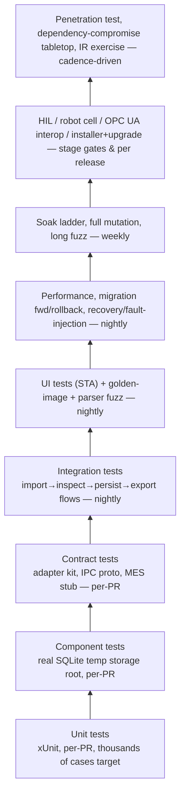
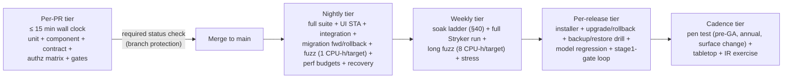

# VOL14 Testing — AOI Software Architecture, Secure Development, and Change-Control Standard, v1.0 (2026-07-15)

Scope: the normative testing strategy for AOI Monitor — the full test pyramid, coverage and mutation floors, security and authorization testing, AI-model and hardware test gates, fault injection, performance/reliability testing, test-data rules, and CI tiering (global section 39).

Supersedes/Related existing docs: no repo document is superseded in full. This volume governs and is executed through `Docs/Factory_Acceptance_Test_Plan.md`, `Docs/Manual_Test_Plan.md`, `Docs/Hardware_In_The_Loop_Checklist.md`, `Docs/Customer_Dataset_Validation_Kit.md`, `Docs/Developer_CI.md`, and `Docs/Branch_Protection_and_Quality_Gates.md` (retained as procedure kits); the test-discipline expectations in `Docs/Industrial_Quality_Checklist.md` (REL-*, PERF-*) are restated here with binding IDs and remain valid until VOL20 publishes the reconciliation index (see §5 / VOL01 for the ID-namespace mapping rule).

---

## 39. Testing Strategy

### 39.1 Purpose and boundary

This section defines what must be tested, at which level, with which tooling, how much coverage is enough, and which test activities gate which stage transitions. It exists because the product's core claim — trustworthy, evidence-backed inspection verdicts — is only as strong as the verification behind it, and because the repo's own history shows the failure mode this section prevents: an elaborate gate system that is advisory in practice (no branch protection, coverage referenced but never collected, WARN-level test-discipline rules that never fail CI — `context` facts cited in §39.2).

Boundaries with neighboring sections: the performance budget table and soak ladder live in §40 (VOL13) — this section defines the tests that enforce them. The failure catalogue lives in §41 (VOL13) — this section maps every catalogue row to a required test. The permissions matrix lives in §28 (VOL07) — this section requires a test for every cell. The parser/fuzz corpus targets live in §29 (VOL08). AI dataset and metric standards live in §31 (VOL09). Machine enforcement of gates is catalogued in §52 (VOL17); the fitness functions named here (FF-TST-01…12) are contributed to that catalogue. Review and merge rules live in §49 (VOL17).

Per D-13, the test stack is **xUnit 2.9.3** (the existing ~524-case suite), the WPF UI test suite (STA, Windows-only), coverlet coverage collection, and Stryker.NET mutation testing. MSTest is **not** used anywhere in the repo (`[TestMethod]` count = 0) and is prohibited; any external draft that assumed MSTest is corrected by D-13.

### 39.2 Current verification state (repo facts)

The requirements in this section are written against this measured baseline, not a blank slate:

| Asset | State (verified 2026-07-15) |
|---|---|
| Unit/component tests | `AOI_Monitor.Tests`: 488 `[Fact]` + 5 `[Theory]` (~524 cases, 17,087 LOC) |
| UI tests | `AOI_Monitor.UiTests`: 12 `[Fact]`, STA/WPF, serial-only |
| CLI smokes | `AOI_Monitor.Tools` CLI runs in CI (`dotnet-ci.yml:43-165`): image-learning demo, stage1-exit, stage2-camera-pilot |
| Gate runner | `Scripts/run-quality-gates.ps1`: build, full test, HMI layout audit, nav-perf smoke, export verify, package validation |
| Release loop | `/stage1-gate` skill (`.claude/skills/stage1-gate/SKILL.md`): 5-step manual gate loop, agent-followed, not machine-enforced |
| Coverage | `coverlet.collector 6.0.4` referenced by both test projects; **never collected** — zero `--collect` flags in Scripts/CI |
| Mutation testing | Stryker.NET installed on the dev machine; **no repo config, no CI step** |
| Localization | `LocalizationParityTests.cs` (EN/KO parity) exists and runs in the full suite |
| Simulators | §14 Simulation module: `Simulated*`/`Null*`/`Mock*` implementations in `Services/IntegrationContracts.cs`, `FolderCameraSource`, `MockMesClient`, `SimulatedPlcSafetyController`, `SimulatedRobotController` |
| Known test gaps | No dedicated tests for `OnnxInspectionEngine`, `ModelRegistryService`, `ModelConfigurationValidator`, `GenericDetectionOutputParser`; UI logic testable only via 12 UI tests; PR-SVC-001 (service change needs tests) is WARN-only in CI |
| Enforcement | CI is a detector, not a gate: no branch protection, direct pushes to main, no required status checks |

Migration obligations (tracked as CHG items per §48–53 / VOL17):
- **M-39-1**: activate coverlet collection in `run-quality-gates.ps1` and publish reports — within one release cycle of this standard's adoption.
- **M-39-2**: promote `PR-SVC-001` and `PR-HMI-001` from WARN to FAIL (`Scripts/check-pr-quality.ps1` invoked with `-TreatWarningsAsErrors`) — same release.
- **M-39-3**: land Stryker configuration and the Table 39-3 module set — within two release cycles.
- **M-39-4**: configure branch protection and required checks on `main` — before the next external release.
- **M-39-5**: coverage-floor ratchet — measure baseline at M-39-1, then raise the failing threshold by ≥3 percentage points per release until the TST-014 floors are reached; the floors are non-negotiable endpoints, the ratchet is the path.

### 39.3 The test pyramid

**Reading this diagram:** the pyramid is drawn bottom-up: the widest, fastest layers (unit, component, contract) run on every pull request and form the base; integration, UI, golden-image, fuzz, performance, migration, and recovery layers run nightly; soak, full mutation, and long fuzz runs are weekly; hardware-in-the-loop, robot cell, OPC UA interop, and installer/upgrade tests execute at stage gates and per release; the apex is the human-driven assurance cadence (penetration tests, tabletop and incident-response exercises). Each arrow means "is a prerequisite confidence layer for" — a layer is only meaningful if every layer below it is green.

Test levels, their scope, and their tooling are fixed by Table 39-1.

| # | Level | Scope | Primary tooling (repo-grounded) | Tier |
|---|---|---|---|---|
| 1 | Unit | one class/method, no I/O | xUnit in `AOI_Monitor.Tests` | Per-PR |
| 2 | Component | service + real SQLite in temp storage root | `AoiDatabase.ConfigureStorageRoot` seams | Per-PR |
| 3 | Contract | adapter/IPC/MES interface conformance | adapter contract kit, proto goldens, MES stub | Per-PR |
| 4 | Integration | cross-module workflows | tagged xUnit integration suite | Nightly |
| 5 | API | inbound REST endpoints (S4) | endpoint tests per §22 | Nightly |
| 6 | UI | shell + pages, STA | `AOI_Monitor.UiTests` | Nightly |
| 7 | Database/migration | forward + rollback, all released versions | migration fixture DBs | Nightly |
| 8 | Security/authorization | §28 matrix, tamper, negative | matrix-driven theories, tamper fixtures | Per-PR + nightly |
| 9 | Fuzz | §29 parser corpus | harness per OD-VOL14-2 | Nightly + weekly |
| 10 | Property-based | invariants (§39.3 list) | library per OD-VOL14-3 | Nightly |
| 11 | Model regression / golden-image | golden datasets, deterministic outputs | `ModelAcceptanceService` + golden fixtures | Per model release |
| 12 | Simulator / recovery | §14 doubles, §41 catalogue | Table 39-4 mechanisms | Per-PR + nightly |
| 13 | Performance / load / stress / soak | §40 budgets and ladder | `UiNavigationPerformanceTests`, `SoakTestService` | Nightly + weekly |
| 14 | HIL / robot cell / OPC UA | physical devices, stage gates | HIL checklist, commissioning procedures | Stage gates |
| 15 | Installer / upgrade / backup | MSI lifecycle, rollback, restore | clean-VM procedures per release | Per release |
| 16 | Human assurance | pen test, tabletop, IR exercise | external assessor + exercises | Cadence |

Property-based invariant list (referenced by TST-033): threshold-selection monotonicity (`ImageOnlyPcbLearningService.SelectThreshold` — a stricter false-call target never selects a lower threshold), alignment transform round-trips, model-ID sanitization idempotence (`ModelRegistryService` ID builder), LIKE-filter wildcard escaping (`AoiDatabase` filter builders), spool retry-count monotonicity, and metric identities (precision/recall/false-call computed from a synthetic confusion matrix match `BatchValidationService.CalculateMetrics`).

### 39.4 Coverage, mutation, and decision-path floors

Coverage floors apply to **hand-written production code** (see ASSUMPTION A-VOL14-1 for scope). Floors: **≥85 % line, ≥80 % branch**. Coverage is a floor, not a goal — TST-019 exists precisely because coverage without assertions is theater.

**Table 39-2 — 100 % decision-path set.** Every branch and decision path of the following members must be covered (TST-016); these are the places where a missed branch is a security or safety defect:

| Area | Concrete members (current code) |
|---|---|
| Authorization checks | `RoleAuthorization` predicates + `CanAccessPage`; service-layer role checks in `AuthenticationSettingsService`, `ModelLifecycleService` |
| Recipe validation | recipe revision validation and approval-state guards (`AoiDatabase.Recipes` + `RecipeService`) |
| Model-manifest validation | `ModelConfigurationValidator.Test`; signed-manifest verification introduced per §19/§31 |
| Artifact-signature verification | SHA-256 + signature checks at model/recipe/update load (per D-03/D-12 corrections) |
| Safety-status handling | `SafetyStatus.IsSafeToMove`; `RobotCycleService.BlockIfSafetyNotOk` / `BlockIfEmergencyStopped` |
| Robot transition guards | `RobotCycleService` FSM transition validity checks |
| Critical-defect decision logic | verdict assignment (OK/NG/REVIEW) in engines and `BatchValidationService`; critical-class overrides per §31 |
| DB migration guards | `AoiDatabaseMigrations.ApplyPending`, version stamping, `AddColumnIfMissing`/`TableExists`/`ColumnExists` |
| Update verification | update-bundle signature/hash/version checks per §43 (VOL15) |

**Table 39-3 — mutation-testing module set** (Stryker.NET, minimum mutation score **≥75 %** per module, TST-017). Inclusion criterion: any module whose silent misbehavior corrupts a verdict, an authorization decision, a safety gate, evidence integrity, or persisted data:

| Module (file/type) | Reason |
|---|---|
| `Services/RoleAuthorization.cs` | every authorization decision |
| `Services/AuthenticationSettingsService.cs` | credential verification, user CRUD guards |
| `Services/SecretProtectionService.cs` | secret at-rest protection and redaction |
| `Services/ModelRegistryService.cs`, `Services/ModelLifecycleService.cs` | model activation and lifecycle gating |
| `Services/ModelConfigurationValidator.cs` | runtime model validation |
| `Services/ModelOutputParsers.cs` | tensor → defect decision path |
| `Services/BatchValidationService.cs`, `Services/FalseCallReductionService.cs` | acceptance metrics, threshold selection |
| `Services/ImageOnlyPcbLearningService.cs` (calibration/threshold members) | learned-model thresholds |
| `Services/RobotCycleService.cs` | safety gating and FSM guards |
| `Data/AoiDatabaseMigrations.cs` + retention members of `AoiDatabase.Infrastructure.cs` | schema evolution, purge correctness |
| `Services/MesSpoolService.cs`, `Services/MesRestClient.cs` (response validation) | traceability durability |
| `Services/HashUtil.cs`, `Services/ExportVerificationService.cs` | evidence hashing |

### 39.5 Fault-injection catalogue

Fault injection uses **named mechanisms**, not ad-hoc hacks. Table 39-4 is the binding mechanism map (TST-047 requires every §41 failure-catalogue row to reference one of these rows or register a new mechanism here):

| Fault (Table 39-4) | Injection mechanism (named) | Primary suite |
|---|---|---|
| Timeouts | configurable-latency doubles: `MockMesClient` slow endpoint, delaying `HttpMessageHandler` stub, `SimulatedRobotController` step delay | Contract/recovery |
| Exceptions | throwing test doubles for `IVisionCameraAdapter`, `ILightingController`, `IMesClient` (§14 Simulation module seams) | Component |
| Partial reads/writes | truncated-file fixtures (cut PNG/JSON/CSV); stream wrapper that ends early | Fuzz/negative |
| Malformed frames | corrupted `CameraFrame` payloads via adapter double; malformed MES JSON from the stub server | Contract/fuzz |
| Disk full | small-quota VHDX mounted as the temp storage root; `IOException`-throwing filesystem seam for unit tier | Recovery |
| Lost network | stub server hard-close mid-response; unreachable endpoint configuration | Recovery/MES outage |
| Stale state | pre-seeded stale JSON snapshots (config, spool, `WorkflowState` via reset seams) older than validity windows | Component |
| Duplicate/reordered messages | duplicated/reordered `MesSpoolQueue` rows and repeated acknowledgements from the MES stub | MES outage |
| Driver failure | camera adapter double reporting `Error`/disconnect mid-acquisition (`DiagnosticNullVisionCameraAdapter` pattern) | Simulator |
| GPU failure | inference-worker double returning EP initialization failure (applicable once the D-01 worker split occurs) | Contract (S2+) |
| DB failure | read-only DB file; corrupted-page fixture failing `PRAGMA integrity_check`; locked-DB concurrent writer | Recovery |
| Permission failure | ACL-denied directory as storage root; `UnauthorizedAccessException`-throwing seam | Recovery |

### 39.6 CI tiers and required checks

**Reading this diagram:** five tiers move left to right in decreasing frequency and increasing cost. The per-PR tier must finish in 15 minutes and is the only tier wired as a required status check — a red per-PR tier blocks merge outright once M-39-4 lands. The nightly tier runs everything automated, including the UI STA suite (which must not run in parallel), migration forward/rollback fixtures, short fuzz runs, and performance-budget tests. The weekly tier owns long-running work: the §40 soak ladder, a full mutation run, long fuzz, and stress. The per-release tier adds the artifacts a release physically ships (installer, upgrade path, restore drill, model regression) plus the `/stage1-gate` loop. The rightmost tier is calendar-driven human assurance. A failure in any right-hand tier does not block merges retroactively but blocks the release train until dispositioned.

**Table 39-5 — CI tier composition** (binding for TST-056; `Tier` traits per TST-003):

| Tier | Composition (by Tier trait) | Budget | Blocking effect |
|---|---|---|---|
| Per-PR | Unit, Component, Contract, Security (matrix + tamper), hygiene/format/analyzer gates | ≤15 min | Required status check (TST-057) |
| Nightly | full suite + Integration, UI, API, Fuzz (1 CPU-h/target), Property, Perf, Recovery, migration fwd/rollback | ≤8 h | Red blocks the next release train |
| Weekly | Soak ladder, full Stryker run (Table 39-3), long fuzz (8 CPU-h/target), stress | ≤72 h | Red blocks the next release train |
| Per-release | installer lifecycle, upgrade/rollback pair, backup/restore drill, model regression, `/stage1-gate` loop | per release | Release gate — no ship while red |
| Cadence | penetration test, dependency tabletop, IR exercise (TST-058/059/060) | calendar | Findings enter §54/§56 tracking |

Evidence artifacts produced by the tiers keep the existing repo conventions: trx logs and `industrial_quality_gate_report.json` under `TestResults/`, coverage and Stryker reports as uploaded CI artifacts, fuzz and soak reports in their run folders, HIL/commissioning evidence in the readiness package. Artifact retention follows §38 (VOL13); release-gating artifacts are archived with the release per §43 (VOL15).

### 39.7 Test-data management

The rules are absolute because the repo already enforces most of them mechanically: `Scripts/check-repo-hygiene.ps1` bans customer datasets, image vaults, training sets, and >10 MB images from the tree. Customer production imagery never enters the repository, CI artifacts, or checked-in corpora; automated tests use synthetic imagery (the CI workflow already generates its 25 OK / 13 bridge / 12 missing PNG dataset in-workflow) or licensed corpora with recorded license terms. Customer data is used only in the segregated evaluation environment governed by §31 (VOL09) and §46 (VOL16). Fuzz seed corpora are synthetic or derived from public test vectors.

### 39.8 Assumptions and open decisions

- **ASSUMPTION A-VOL14-1**: "hand-written production code" = `AOI_Monitor` + `AOI_Monitor.Tools`, excluding generated sources (`*.g.cs`, `*.Designer.cs`, XAML-generated partials) and `Templates/*` stub projects; test projects are excluded from the denominator. Risk: mis-scoping distorts the TST-014 ratio; the coverlet filter file is the single scope authority.
- **ASSUMPTION A-VOL14-2**: until §40 (VOL13) nominates the pinned reference hardware, performance tests run on a documented development-station class and their thresholds carry a "provisional hardware" marker in the report. Risk: unrepresentative timings; resolved by OD-VOL14-1.
- **ASSUMPTION A-VOL14-3**: no hardware-attached CI runner exists today; HIL, robot cell, and installer tests execute as documented manual procedures with recorded evidence artifacts until such a runner exists (S2+). Risk: human skips; mitigated by stage-gate evidence requirements (TST-036/037/049).
- **ASSUMPTION A-VOL14-4**: the OPC UA interop counterpart is the OPC Foundation UA-.NETStandard reference server (MIT-licensed since Dec 2025, per verified research). Risk: reference-stack quirks differ from the customer's MES OPC UA server; final interop evidence comes from the customer system at Stage-4 commissioning.
- **ASSUMPTION A-VOL14-5**: mutation scores are measured per-module with Stryker.NET default mutators; the ≥75 % threshold applies per module in Table 39-3, not solution-wide. Risk: default mutators may miss domain-specific mutants; revisit at first full run.

Open decisions (merged into §6 / VOL01):
- **OD-VOL14-1**: nominate the pinned reference performance hardware (joint owner with §40 / VOL13). Due before Stage-2 pilot.
- **OD-VOL14-2**: fuzz harness selection (SharpFuzz + libFuzzer on Windows vs. an alternative coverage-guided harness). Due before Stage-2 pilot; TST-025 timings are binding regardless of harness.
- **OD-VOL14-3**: property-based testing library (FsCheck vs. CsCheck). Due at the first property-based suite.
- **OD-VOL14-4**: runner topology for nightly/weekly tiers (GitHub-hosted `windows-latest` vs. self-hosted), given soak durations exceed hosted-runner job limits.

---

### R: Test levels and suites (TST-001–TST-012)

**[TST-001]** (P2 | ALL | CI)
All managed test code SHALL use the xUnit framework version pinned in `packages.lock.json` (currently 2.9.3 per D-13); adding MSTest or NUnit test projects is prohibited.
- Why: one framework keeps filters, traits, and tooling uniform; D-13 records that the ~524-case suite is xUnit and MSTest is absent. Maps: Internal.
- Verify: fitness function FF-TST-11 (framework allowlist: grep for `[TestMethod]`/NUnit attributes + package check). Evidence: CI gate log. Owner: Software Lead. Auto: Fully automated.
- Exception: Not allowed. Review: Annual.

**[TST-002]** (P1 | ALL | CI)
Every pull request that changes production code under `AOI_Monitor/Services`, `AOI_Monitor/Data`, or `AOI_Monitor.Tools` SHALL add or update at least one test exercising the changed behavior.
- Why: PR-SVC-001 exists but is WARN-only in CI (`dotnet-ci.yml:33` omits `-TreatWarningsAsErrors`), so the rule most tied to test discipline never blocks. Maps: SSDF-PW.7; 62443-4-1 SVV-1.
- Verify: `Scripts/check-pr-quality.ps1` PR-SVC-001 promoted to FAIL (migration M-39-2). Evidence: CI gate log. Owner: QA Lead. Auto: Fully automated.
- Exception: Allowed — approver: QA Lead (mechanical refactors covered by existing characterization tests). Review: Per release.

**[TST-003]** (P2 | ALL | CI)
Every automated test SHALL carry exactly one `[Trait("Tier", …)]` value from {Unit, Component, Contract, Integration, API, UI, Security, Fuzz, Property, Perf, Recovery, Soak, HIL} so that CI tiers filter deterministically.
- Why: tiering (TST-056) is impossible without a machine-readable taxonomy; today's filters rely on class-name conventions (`run-quality-gates.ps1:141-169`). Maps: Internal.
- Verify: fitness function FF-TST-04 (trait completeness scan over test assemblies). Evidence: CI gate log. Owner: QA Lead. Auto: Fully automated.
- Exception: Not allowed. Review: Annual.

**[TST-004]** (P2 | ALL | Persistence, CI)
Component tests that touch persistent state SHALL isolate it in a per-test-class temporary storage root established via `AoiDatabase.ConfigureStorageRoot` and the existing `*ForTests` reset seams; sharing a storage root across test classes is prohibited.
- Why: the static service world is only testable because every stateful service exposes a reset seam (`AoiDatabaseTests.cs:18-30`); shared roots create order-dependent flakiness. Maps: Internal.
- Verify: review checklist item + FF-TST-04 extension (grep for `%LOCALAPPDATA%`/absolute paths in tests). Evidence: PR review record. Owner: QA Lead. Auto: Partially automated.
- Exception: Not allowed. Review: Annual.

**[TST-005]** (P2 | S1–S4 | Orchestrator, CI)
An integration suite tagged `Tier=Integration` SHALL cover the end-to-end workflow image import → inspection → persistence → disposition → export → report as executable tests run at least nightly.
- Why: unit tests cover services in isolation; regressions in cross-module wiring (e.g. audit ordering, vault-then-insert) only surface in whole-flow tests. Maps: SSDF-PW.8; 25010.
- Verify: named suite `Stage1WorkflowIntegrationTests`; nightly tier log. Evidence: trx artifact. Owner: QA Lead. Auto: Fully automated.
- Exception: Allowed — approver: QA Lead. Review: Per release.

**[TST-006]** (P2 | ALL | HMI, CI)
Every navigable page key registered in the shell SHALL have UI-tier coverage consisting of at least a load smoke test and inclusion in the HMI layout audit.
- Why: 15 routes exist (`MainWindow.xaml.cs:326-345`) but only 12 UI tests; an unregistered page silently escapes `HmiLayoutAuditTests` and the §36 minima. Maps: 25010; Internal.
- Verify: fitness function FF-TST-12 (route-to-test parity: `CreatePage` keys vs. UiTests inventory). Evidence: CI gate log + HMI layout audit JSON. Owner: QA Lead. Auto: Fully automated.
- Exception: Allowed — approver: Software Architect. Review: Per release.

**[TST-007]** (P2 | S2–S4 | CameraAdapter, LightingAdapter, CI)
Every vendor camera or lighting adapter SHALL pass the shared adapter contract suite (an extension of `VendorAdapterTemplateTests` and `CameraAdapterPackageValidationServiceTests`) before its integration status is permitted to report `Ready`.
- Why: adapters are third-party code behind `IVisionCameraAdapter`/`ILightingController`; a contract kit is the only scalable way to hold vendors to the frame-metadata and status rules in `Docs/Vendor_Adapter_Implementation_Guide.md`. Maps: 62443-4-1 SVV-1; Internal.
- Verify: named suite `AdapterContractSuite` executed against the candidate adapter package. Evidence: adapter acceptance report artifact. Owner: Software Lead. Auto: Partially automated.
- Exception: Not allowed. Review: On change.

**[TST-008]** (P2 | S2+ | Inference, CI)
When the local inference worker process is introduced per D-01/D-06, the versioned gRPC proto contract SHALL be covered by contract tests replaying golden serialized request/response frames from every previously released contract version.
- Why: IPC contract drift between HMI and worker is a silent-corruption class; golden frames make backward compatibility a failing test instead of a field incident. Maps: SSDF-PW.8; Internal.
- Verify: named suite `InferenceIpcContractTests` with checked-in golden frames. Evidence: trx artifact. Owner: Software Lead. Auto: Fully automated.
- Exception: Not allowed. Review: On change.

**[TST-009]** (P2 | ALL | MES, CI)
MES REST integration SHALL be covered by contract tests against a local stub server asserting both schema-conformant acceptance and rejection of malformed, truncated, empty-body, and unexpected-status responses, extending `MesRestIntegrationTests` (16 facts today).
- Why: `MesRestClient` validates response schemas (`MesRestClient.cs:197-237`) and treats empty bodies as legacy success — every branch of that policy needs a pinned test or a customer MES change breaks traceability silently. Maps: ASVS-V4; 62443-4-1 SVV-1.
- Verify: named suite `MesRestIntegrationTests` (extended). Evidence: trx artifact. Owner: QA Lead. Auto: Fully automated.
- Exception: Allowed — approver: QA Lead. Review: Per release.

**[TST-010]** (P2 | S4 | REST, IAM)
Every inbound REST API endpoint introduced under §22 SHALL have endpoint tests covering authentication, authorization, request-schema validation, and HTTP-method restriction before the endpoint is first exposed on any network.
- Why: an untested inbound endpoint on a factory network is the fastest route to CWE-306; testing before exposure is the enforceable ordering. Maps: ASVS-V4; CWE-306; 62443-4-2 CR 1.1.
- Verify: named suite per endpoint (`<Endpoint>ApiTests`); release checklist item. Evidence: trx artifact + release checklist. Owner: Security Lead. Auto: Partially automated.
- Exception: Not allowed. Review: Per release.

**[TST-011]** (P2 | ALL | Domain, CI)
Every public service API SHALL have negative tests asserting that invalid, boundary, and out-of-range inputs are rejected with a typed error or documented refusal result rather than accepted or silently coerced.
- Why: silent-fallback readers already mask corruption in the data layer (`ParseDateTime` → `MinValue`); negative tests are the countermeasure to that class. Maps: ASVS-V2; CWE-20.
- Verify: review checklist item + FF-TST-03 assertion-quality gate sampling. Evidence: PR review record. Owner: QA Lead. Auto: Partially automated.
- Exception: Allowed — approver: QA Lead. Review: Annual.

**[TST-012]** (P3 | ALL | Export, CI)
Every `AOI_Monitor.Tools` CLI command SHOULD have tests asserting exit codes and evidence-output file creation, extending `LearnFromImagesCommandTests` and `ClientImageLearningDemoCommandTests`.
- Why: the CLI is the Stage-1 evidence generator run in CI (`dotnet-ci.yml:43-165`); an untested command can emit malformed evidence with exit code 0. Maps: Internal.
- Verify: named suites `<Command>CommandTests`. Evidence: trx artifact. Owner: QA Lead. Auto: Fully automated.
- Exception: Allowed — approver: QA Lead. Review: Annual.

### R: Coverage floors and mutation testing (TST-013–TST-019)

**[TST-013]** (P1 | ALL | CI)
The CI gate SHALL collect line and branch coverage via the coverlet collector already referenced by both test projects and publish the coverage report as a build artifact for every gate run.
- Why: coverlet 6.0.4 is referenced but never invoked (zero `--collect` flags in Scripts/CI) — 524 tests with unmeasured breadth is unquantified risk. Maps: SSDF-PW.8; Internal.
- Verify: fitness function FF-TST-01 (coverage step present + artifact uploaded). Evidence: coverage artifact in `TestResults/`. Owner: Software Lead. Auto: Fully automated.
- Exception: Not allowed. Review: Per release.

**[TST-014]** (P1 | ALL | CI)
Hand-written production code (scope per A-VOL14-1) SHALL meet coverage floors of ≥85 % line and ≥80 % branch, enforced as failing thresholds in the coverage gate after the M-39-5 ratchet completes.
- Why: floors make test erosion visible; the ratchet acknowledges the unmeasured baseline without renegotiating the endpoint. Maps: SSDF-PW.8; 62443-4-1 SVV-1.
- Verify: fitness function FF-TST-01 (threshold mode). Evidence: coverage artifact + CI gate log. Owner: QA Lead. Auto: Fully automated.
- Exception: Allowed — approver: Software Architect (per-module, with TST-015 record). Review: Quarterly.

**[TST-015]** (P2 | ALL | CI)
Every coverage exclusion SHALL be recorded in `Tools/quality-gates/coverage_exclusions.json` with file/member, written justification, approver, and review date; exclusions absent from that file are prohibited.
- Why: undocumented exclusions turn a floor into fiction; the repo already uses `Tools/quality-gates/*.json` for approved waivers (HMI layout exceptions). Maps: Internal; SSDF-PW.8.
- Verify: fitness function FF-TST-01 (exclusion file is the only accepted filter source). Evidence: `coverage_exclusions.json` history. Owner: QA Lead. Auto: Fully automated.
- Exception: Not allowed. Review: Quarterly.

**[TST-016]** (P0 | ALL | All)
The critical decision set in Table 39-2 (authorization checks, recipe validation, model-manifest validation, artifact-signature verification, safety-status handling, robot transition guards, critical-defect decision logic, DB migration guards, update verification) SHALL have 100 % decision/branch-path coverage.
- Why: a missed branch in these members is a security or safety defect, not a quality gap — e.g. the untested `_ => true` default arm in `CanAccessPage` is exactly such a branch. Maps: 62443-4-1 SVV-1; CWE-863; ASVS-V8.
- Verify: fitness function FF-TST-01 (per-member 100 % assertion over the Table 39-2 list). Evidence: coverage artifact, per-member section. Owner: Security Lead. Auto: Fully automated.
- Exception: Not allowed. Review: Per release.

**[TST-017]** (P1 | ALL | Domain, CI)
Stryker.NET mutation testing SHALL achieve a mutation score ≥75 % on every module listed in Table 39-3, with the Stryker configuration tracked in the repository and the break threshold set to 75.
- Why: coverage proves execution, mutation proves detection; the Table 39-3 modules are where an undetected mutant corrupts verdicts, authorization, safety gating, or evidence. Maps: SSDF-PW.8; Internal.
- Verify: fitness function FF-TST-02 (Stryker break threshold in weekly tier). Evidence: Stryker HTML/JSON report artifact. Owner: QA Lead. Auto: Fully automated.
- Exception: Allowed — approver: Security Lead (per-module, time-boxed, recorded). Review: Quarterly.

**[TST-018]** (P3 | ALL | CI)
Modules that newly meet the Table 39-3 inclusion criterion (silent misbehavior corrupts a verdict, authorization decision, safety gate, evidence integrity, or persisted data) SHOULD be added to the mutation module set within one release of their introduction.
- Why: a static module list rots; the criterion, not the list, is the invariant. Maps: Internal.
- Verify: review checklist item at architecture review. Evidence: Stryker config history. Owner: Software Architect. Auto: Manual review.
- Exception: Allowed — approver: Software Architect. Review: Quarterly.

**[TST-019]** (P1 | ALL | CI)
Tests SHALL assert observable behavior, invariants, permissions, or boundaries; tests containing no assertions, or that execute code solely to raise coverage, are prohibited and blocked by the assertion-quality gate.
- Why: with TST-014 floors in force, the cheapest cheat is assertion-free tests — the gate closes it; the repo's claim-language gates (`check-pr-quality.ps1`) establish the precedent of policing dishonesty mechanically. Maps: SSDF-PW.8; Internal.
- Verify: fitness function FF-TST-03 (assertion-presence analyzer extending `Scripts/check-pr-quality.ps1`). Evidence: CI gate log. Owner: QA Lead. Auto: Fully automated.
- Exception: Not allowed. Review: Annual.

### R: Security and authorization testing (TST-020–TST-027)

**[TST-020]** (P1 | ALL | IAM, CI)
Authorization tests SHALL be generated from the §28 permissions matrix such that every role × capability cell — both allow and deny outcomes — is asserted by at least one data-driven test case.
- Why: hand-picked authorization tests miss cells (today: 4 `RoleAuthorizationTests` facts cover 15 predicates × 3 roles); driving `[Theory]` rows from the matrix file makes matrix and tests inseparable. Maps: ASVS-V8; CWE-862; 62443-4-2 CR 2.1.
- Verify: fitness function FF-TST-05 (matrix-to-test parity count). Evidence: trx artifact + parity report. Owner: Security Lead. Auto: Fully automated.
- Exception: Not allowed. Review: On change.

**[TST-021]** (P1 | ALL | IAM)
A regression test SHALL pin default-deny behavior: unknown page keys and unknown capabilities are denied for every role.
- Why: `RoleAuthorization.CanAccessPage` currently returns `true` for unknown keys (`RoleAuthorization.cs:41`); once §28 inverts it, only a pinned test prevents regression to default-allow. Maps: CWE-862; ASVS-V8; SBD.
- Verify: named tests in `RoleAuthorizationTests` (unknown-key theories). Evidence: trx artifact. Owner: Security Lead. Auto: Fully automated.
- Exception: Not allowed. Review: Per release.

**[TST-022]** (P2 | ALL | IAM)
Authentication tests SHALL cover lockout/throttling behavior, password-policy enforcement, disabled-user rejection, stored-iteration-count handling, and operating-mode boundaries as the §28 controls land, extending `AuthenticationAndSecretHandlingTests`.
- Why: `TryAuthenticate` currently has no lockout and honors attacker-writable iteration counts (`AuthenticationSettingsService.cs:149`); each §28 fix needs a test that fails if the control is removed. Maps: ASVS-V6; CWE-307.
- Verify: named suite `AuthenticationAndSecretHandlingTests` (extended). Evidence: trx artifact. Owner: Security Lead. Auto: Fully automated.
- Exception: Allowed — approver: Security Lead. Review: Per release.

**[TST-023]** (P2 | ALL | Persistence, Update)
Tamper-rejection tests SHALL verify that modification of any signed or integrity-protected artifact or store (model manifests, recipe packages, update bundles, user/role stores, audit hash chain) is detected and refused at load time.
- Why: hashes computed at registration but never re-verified (`OnnxInspectionEngine.Analyze` echoes the stored SHA-256) are the repo's highest-impact integrity gap; tests must prove verification actually runs. Maps: CWE-494; CWE-345; 62443-4-2 CR 3.4.
- Verify: named suite `ArtifactTamperRejectionTests` using bit-flipped fixtures. Evidence: trx artifact. Owner: Security Lead. Auto: Fully automated.
- Exception: Not allowed. Review: Per release.

**[TST-024]** (P2 | ALL | CI)
Every remediation of a nonconformity recorded in the §6 register (VOL01) SHALL ship with a regression test pinning the corrected behavior in the same pull request.
- Why: the known-gap list (default-allow page gate, unsigned plugin loading, hash never re-verified, bypassable acceptance gate, safety-bypass default) is only permanently fixed if each fix is pinned. Maps: SSDF-RV.3; Internal.
- Verify: PR review checklist item; §6 register links each closed item to its test. Evidence: register entry + trx artifact. Owner: QA Lead. Auto: Manual review.
- Exception: Not allowed. Review: Per release.

**[TST-025]** (P2 | ALL | CI)
Coverage-guided fuzzing SHALL run against every parser target in the §29 corpus catalogue (VOL08) — the image import decode path, JSON configuration/manifest readers, the validation-manifest CSV parser, the MES response parser, and the model-output tensor parsers — for ≥1 CPU-hour per target nightly and ≥8 CPU-hours per target weekly.
- Why: these parsers consume untrusted files and network bytes; `AnomalyHeatmapOutputParser` has tests but `GenericDetectionOutputParser` has none, and image decode is the Stage-1 attack surface. Maps: SSDF-PW.8; 62443-4-1 SVV-3; CWE-125.
- Verify: fuzz harness job (OD-VOL14-2) in nightly/weekly tiers with duration log. Evidence: fuzz run report + corpus statistics. Owner: Security Lead. Auto: Fully automated.
- Exception: Allowed — approver: Security Lead (target-by-target, with risk note). Review: Quarterly.

**[TST-026]** (P2 | ALL | CI)
Every fuzzing-discovered crash or hang SHALL be closed only after a defect is filed, a minimized reproducer is added to the checked-in seed corpus, and a regression test exists.
- Why: fuzz findings without regression tests recur; corpus growth is how fuzzing compounds. Maps: SSDF-RV.1; 62443-4-1 SVV-3.
- Verify: defect-tracker link check on fuzz findings; corpus diff in PR. Evidence: issue record + corpus commit. Owner: Security Lead. Auto: Partially automated.
- Exception: Not allowed. Review: Quarterly.

**[TST-027]** (P2 | ALL | Diagnostics, Export)
Secret-absence tests SHALL cover every export and diagnostic artifact path (crash reports, support bundles, readiness exports, spool exports, logs), asserting that no plaintext secret and no `dpapi:v1:` payload appears in the artifact.
- Why: `AuthenticationAndSecretHandlingTests` and `SupportBundleServiceTests` already prove this for existing paths; every new export path must join the suite or it becomes the leak. Maps: ASVS-V14; CWE-532.
- Verify: named suites `AuthenticationAndSecretHandlingTests`/`SupportBundleServiceTests` (extended); FF-TST-09 lists export paths vs. covered paths. Evidence: trx artifact. Owner: Security Lead. Auto: Fully automated.
- Exception: Not allowed. Review: Per release.

### R: AI model and golden-image testing (TST-028–TST-034)

**[TST-028]** (P1 | S1–S4 | ModelMgmt, Training)
Every model release SHALL pass a model-regression run on the versioned golden dataset, failing when any per-defect-class precision, recall, or escape metric degrades beyond the tolerance recorded per §31 (VOL09) relative to the previously released model.
- Why: aggregate accuracy hides per-class collapse (SD-06); the acceptance gate (`ModelAcceptanceService.RunAcceptance`) already computes per-class breakdowns — regression comparison makes them binding. Maps: AITG; AI-100-2; AISVS.
- Verify: `ModelAcceptanceService` regression mode against the prior release's persisted `ModelAcceptanceMetrics`. Evidence: acceptance run record + release package. Owner: ML Lead. Auto: Fully automated.
- Exception: Allowed — approver: ML Lead + QA Lead jointly (documented per-class waiver with expiry). Review: Per release.

**[TST-029]** (P2 | ALL | Training, ModelMgmt)
Golden datasets SHALL be integrity-locked by a manifest that hashes every image file's bytes and the ground-truth CSV, verified before every acceptance or regression run.
- Why: `ModelAcceptanceService.DatasetHash` hashes only folder name + CSV (`ModelAcceptanceService.cs:348-352`) — image substitution is currently undetectable, which invalidates any regression claim. Maps: AISVS; SSDF-PS.1; CWE-345.
- Verify: dataset manifest check in `CustomerDatasetPreflightService` (extended). Evidence: preflight report with per-file hashes. Owner: ML Lead. Auto: Fully automated.
- Exception: Not allowed. Review: Per release.

**[TST-030]** (P2 | ALL | Inference, Export)
Deterministic pipeline outputs — pixel-difference verdicts, defect overlays, and export artifacts — SHALL be covered by golden-image tests comparing against committed reference outputs with explicit per-artifact tolerances.
- Why: rendering and export regressions are invisible to logic-level asserts; tolerance-bounded byte/pixel comparison catches them and stays stable across benign environment drift. Maps: Internal; 25010.
- Verify: named suite `GoldenOutputTests` with tolerances recorded per fixture. Evidence: trx artifact + fixture diff images on failure. Owner: QA Lead. Auto: Fully automated.
- Exception: Allowed — approver: QA Lead. Review: Per release.

**[TST-031]** (P2 | ALL | Inference)
Every model-output parser SHALL have a dedicated test class covering shape dispatch, malformed and NaN/Inf tensor values, and boundary dimensions, closing the current `GenericDetectionOutputParser` and `AutoDetectOutputParser` gaps.
- Why: parsers translate raw tensors into defect verdicts; only the heatmap parser is directly tested today (`AnomalyHeatmapOutputParserTests`, 7 facts) — the detection-row parser decides verdicts untested. Maps: CWE-20; AITG.
- Verify: named suites `GenericDetectionOutputParserTests`, `AutoDetectOutputParserTests`. Evidence: trx artifact. Owner: ML Lead. Auto: Fully automated.
- Exception: Not allowed. Review: Per release.

**[TST-032]** (P2 | ALL | ModelMgmt, IAM)
Service-layer authorization tests SHALL assert that `ModelRegistryService.Register` and `SetActiveModel` enforce role checks and lifecycle-state prerequisites, pinning that no code path activates a model without a passing acceptance run or a recorded waiver.
- Why: `SetActiveModel` today blocks only `Retired`/`AcceptanceFailed` and has no service-layer role check (`ModelRegistryService.cs:126-149`) — the acceptance gate is bypassable; the §19 correction must be test-pinned. Maps: CWE-862; AISVS; ASVS-V8.
- Verify: named suite `ModelLifecycleAuthorizationTests`. Evidence: trx artifact. Owner: ML Lead. Auto: Fully automated.
- Exception: Not allowed. Review: Per release.

**[TST-033]** (P3 | ALL | Domain)
Property-based tests SHOULD cover the invariants listed in §39.3 (threshold-selection monotonicity, alignment round-trips, model-ID sanitization idempotence, LIKE-filter escaping, spool retry-count monotonicity, metric identities) using the library selected under OD-VOL14-3.
- Why: these invariants hold over input ranges, not examples; property testing finds the boundary cases example tests reliably miss. Maps: SSDF-PW.8; Internal.
- Verify: named suite `InvariantPropertyTests`. Evidence: trx artifact. Owner: QA Lead. Auto: Fully automated.
- Exception: Allowed — approver: QA Lead. Review: Annual.

**[TST-034]** (P3 | ALL | Inference)
An inference-determinism test SHOULD assert identical `AnalysisResult` content for a fixed model, configuration, and input image across three consecutive runs on the CPU execution provider.
- Why: D-01 baselines CPU-EP inference; nondeterminism would invalidate golden-dataset regression comparisons and evidence reproducibility, and must be detected before a GPU EP (which relaxes determinism) is adopted. Maps: AITG; Internal.
- Verify: named test in `OnnxInspectionEngineTests` (new suite — currently no dedicated tests exist). Evidence: trx artifact. Owner: ML Lead. Auto: Fully automated.
- Exception: Allowed — approver: ML Lead. Review: Annual.

### R: Hardware, robot, OPC UA, and MES testing (TST-035–TST-042)

**[TST-035]** (P2 | ALL | Simulation, CI)
All hardware-dependent logic SHALL be executable per-PR against the §14 Simulation module doubles (`Simulated*`/`Null*`/`Mock*` implementations in `IntegrationContracts.cs`, `FolderCameraSource`, `MockMesClient`) without any physical device attached.
- Why: simulator-first testing is the only way hardware logic gets per-PR feedback; the repo's Null/Simulated/Ready status taxonomy makes this structurally honest. Maps: Internal; 62443-4-1 SVV-1.
- Verify: per-PR tier runs with no hardware; FF-TST-04 confirms no HIL-tier test in the per-PR filter. Evidence: CI gate log. Owner: Software Lead. Auto: Fully automated.
- Exception: Not allowed. Review: Annual.

**[TST-036]** (P1 | S2–S4 | Acquisition, CameraAdapter)
Stage-2 hardware features SHALL NOT be reported at any integration status above `Simulated` until the hardware-in-the-loop procedure in `Docs/Hardware_In_The_Loop_Checklist.md` has been executed on physical devices with recorded evidence.
- Why: simulated evidence never satisfies real-hardware gates — the rule is already repeated across ≥6 repo docs and machine-enforced by claim-language gates; this makes the HIL execution itself the gate. Maps: Internal; 62443-4-1 SVV-1.
- Verify: HIL checklist evidence package reviewed at the S2 gate. Evidence: HIL evidence folder + readiness report. Owner: QA Lead. Auto: Manual review.
- Exception: Not allowed. Review: On change.

**[TST-037]** (P1 | S3–S4 | RobotAdapter, SafetyStatus)
Robot cell test campaigns SHALL execute the full interlock and fault-injection scenario set on the simulator (`SimulatedRobotController` + `SimulatedPlcSafetyController`) with passing results before the same scenarios are executed on the physical cell during commissioning under the Controls & Safety Engineer.
- Why: simulator-first ordering finds logic defects without endangering the cell; the physical rerun proves the observation channel, not the logic. Per D-18 the application only observes safety — the safety chain itself is validated by the independent safety assessment, not by this suite. Maps: 13849-1; 10218-2; Internal.
- Verify: scenario matrix signed off twice (simulator run log, commissioning record). Evidence: commissioning test report. Owner: Controls & Safety Engineer. Auto: Partially automated.
- Exception: Not allowed. Review: On change.

**[TST-038]** (P2 | ALL | RobotAdapter)
The robot cycle FSM SHALL have transition-matrix tests covering every state × command pair — valid transitions, invalid-transition rejection, and e-stop assertion between any two steps — extending `IntegrationContractsTests` (19 facts today).
- Why: the 11-state FSM (`RobotCycleService.cs`) gates motion; untested transitions are where a sequencing bug becomes physical damage at Stage 3. Maps: 62443-4-1 SVV-1; Internal.
- Verify: named suite `RobotCycleTransitionMatrixTests` generated from the FSM definition. Evidence: trx artifact. Owner: QA Lead. Auto: Fully automated.
- Exception: Not allowed. Review: On change.

**[TST-039]** (P0 | S3–S4 | SafetyStatus)
A test SHALL verify that loss of the safety-status observation channel (PLC or e-stop monitor unreachable, faulted, or stale) causes the application to refuse all motion commands and enter the §34 fail-safe behavior.
- Why: D-18 makes the application an observer of safety status; the one obligation an observer has is to fail safe when it goes blind — this is the test that proves it. Maps: 13849-1; 60204-1; Internal.
- Verify: named tests in `RobotCycleTransitionMatrixTests` using the disconnect/fault injection rows of Table 39-4. Evidence: trx artifact. Owner: Controls & Safety Engineer. Auto: Fully automated.
- Exception: Not allowed. Review: Per release.

**[TST-040]** (P0 | ALL | RobotAdapter, SafetyStatus)
A regression test SHALL pin that `PermitSafetyBypassForSimulation` defaults to false and cannot be enabled in any non-Demo operating mode.
- Why: the flag currently defaults to true (`RobotCycleService.cs:37`) and the bypass predicate grants motion to a misbehaving adapter — after the §34 correction, only a pinned test prevents the unsafe default from returning. Maps: Internal; 13849-1.
- Verify: named test `RobotSafetyBypassDefaultTests`. Evidence: trx artifact. Owner: Controls & Safety Engineer. Auto: Fully automated.
- Exception: Not allowed. Review: Per release.

**[TST-041]** (P2 | S4 | OPCUA, CI)
OPC UA integration SHALL be covered by interop tests against the OPC Foundation UA-.NETStandard reference server asserting session establishment with `Basic256Sha256` or stronger and rejection of `Basic128Rsa15` and `Basic256` endpoints.
- Why: Basic128Rsa15/Basic256 are deprecated (verified research); an interop suite against the MIT-licensed reference stack (A-VOL14-4) proves both connectivity and policy floor before customer commissioning. Maps: OPCUA-P2; 62443-3-3; Internal.
- Verify: named suite `OpcUaInteropTests` in the nightly tier once the §35 client exists. Evidence: trx artifact. Owner: Software Lead. Auto: Fully automated.
- Exception: Allowed — approver: Security Lead. Review: Per release.

**[TST-042]** (P2 | ALL | MES, Simulation)
MES outage tests SHALL cover endpoint-unreachable, timeout-exceeding slow response, malformed response, duplicate acknowledgement, and process-crash-between-send-and-spool scenarios, asserting that no inspection result is lost under the §35 store-and-forward obligations.
- Why: the current design is send-then-spool and crash-lossy, failed image uploads are never spooled, and nested retries multiply attempts — each §35 correction needs an outage test that fails if the durability property regresses. Maps: 62443-3-3; Internal; CWE-390.
- Verify: named suite `MesOutageRecoveryTests` using Table 39-4 mechanisms. Evidence: trx artifact. Owner: QA Lead. Auto: Fully automated.
- Exception: Not allowed. Review: Per release.

### R: Performance, reliability, and operational testing (TST-043–TST-050)

**[TST-043]** (P1 | ALL | CI, Diagnostics)
Every row of the §40 performance budget table SHALL be enforced by a named performance test that fails when the budgeted percentile is exceeded on the pinned reference hardware (A-VOL14-2 until OD-VOL14-1 resolves).
- Why: SD-07 showed what an unenforced "within 1 second" claim is worth; `UiNavigationPerformanceTests` and the acceptance-run p95 latency check prove budget-as-test is already feasible in this codebase. Maps: 25010; Internal.
- Verify: fitness function FF-TST-07 (budget-row-to-test parity + threshold assertions). Evidence: nav-perf JSON + perf trx artifacts. Owner: QA Lead. Auto: Fully automated.
- Exception: Allowed — approver: Software Architect (per-row, recorded). Review: Per release.

**[TST-044]** (P2 | S2–S4 | Orchestrator)
A load test SHALL demonstrate sustained inspection throughput at the §40 rated cycle rate for ≥1 hour with p95 end-to-end latency remaining within budget.
- Why: per-image latency tests miss queueing, GC pressure, and session-per-inference costs (a known repo inefficiency) that only appear under sustained load. Maps: 25010; Internal.
- Verify: named suite `InspectionLoadTests` in the weekly tier. Evidence: load run report with latency percentiles. Owner: QA Lead. Auto: Fully automated.
- Exception: Allowed — approver: QA Lead. Review: Per release.

**[TST-045]** (P3 | ALL | Orchestrator)
A stress test SHOULD drive input volume to ≥2× the §40 rated load and assert that the system degrades in the priority order defined in §41 without crash or data loss.
- Why: the failure mode under overload must be chosen, not discovered; asserting the §41 degradation order turns "it survived" into a checkable contract. Maps: 25010; Internal.
- Verify: named suite `OverloadDegradationTests` in the weekly tier. Evidence: stress run report. Owner: QA Lead. Auto: Fully automated.
- Exception: Allowed — approver: QA Lead. Review: Annual.

**[TST-046]** (P2 | ALL | Diagnostics, CI)
The §40 soak ladder SHALL be executed weekly and before every release, with the 8-hour PoC soak (SD-08) as the floor rung, using `SoakTestService` with results persisted to the `SoakTestRuns` table.
- Why: SD-08 correctly demoted "8-hour stability" from acceptance criterion to minimum rung; leaks and drift (static-event subscriptions, unbounded growth) only appear over hours. Maps: 25010; Internal.
- Verify: weekly tier soak job; release checklist gate on latest soak result. Evidence: `SoakTestRuns` rows + soak report. Owner: QA Lead. Auto: Fully automated.
- Exception: Allowed — approver: Release Manager (release-timing only; weekly cadence non-waivable). Review: Per release.

**[TST-047]** (P1 | ALL | Simulation, CI)
Every row of the §41 failure catalogue SHALL be mapped to at least one recovery test that uses a named injection mechanism from Table 39-4, with mapping completeness machine-checked.
- Why: a failure catalogue without tests is a wish list; the mapping gate makes "each row has its test" a property CI can falsify. Maps: 62443-4-1 SVV-2; 25010; Internal.
- Verify: fitness function FF-TST-10 (catalogue-row-to-test parity). Evidence: parity report + trx artifacts. Owner: QA Lead. Auto: Fully automated.
- Exception: Allowed — approver: Software Architect (per-row, with risk note). Review: Quarterly.

**[TST-048]** (P2 | ALL | Update, Installer)
Every release SHALL pass an upgrade/rollback test pair: the signed update applied over the previous release image with staged activation and data preserved, then rollback via the documented restore procedure returning the prior version to service with the pre-upgrade database intact.
- Why: D-08 mandates staged activation and offline capability; SQLite migrations are additive-only (no down scripts), so rollback is restore-based and must be rehearsed, and the older binary must fail closed with an explicit schema-version error against a newer DB rather than corrupt it. Maps: SSDF-PS.2; CRA; Internal.
- Verify: named procedure `UpgradeRollbackTests` (automated VM run per A-VOL14-3). Evidence: upgrade/rollback run report. Owner: Release Manager. Auto: Partially automated.
- Exception: Not allowed. Review: Per release.

**[TST-049]** (P2 | ALL | Installer)
Every release SHALL pass installer tests covering install, upgrade-in-place, uninstall, and repair of the signed WiX MSI on a clean Windows 11 IoT Enterprise LTSC 2024 image.
- Why: D-08 selects per-machine MSI for offline/air-gap factories; installer defects are unfixable remotely there, and repair/uninstall paths are never exercised by developers organically. Maps: SSDF-PS.2; D-02/D-08 (Internal).
- Verify: named procedure `InstallerLifecycleTests` on a clean VM snapshot. Evidence: installer test report + logs. Owner: Release Manager. Auto: Partially automated.
- Exception: Allowed — approver: Release Manager (repair leg only). Review: Per release.

**[TST-050]** (P2 | ALL | Config, Persistence)
Backup and restore SHALL be verified per release by a drill that restores a configuration backup plus database and image-vault snapshot onto a clean environment and passes `PRAGMA integrity_check` and a smoke inspection.
- Why: `ConfigurationBackupService` exists with tests, but a backup that has never been restored is not a backup; the drill also validates DPAPI-protected fields survive the §30 re-protection path. Maps: CSF2; 25010; Internal.
- Verify: named procedure `BackupRestoreDrill` in the per-release tier. Evidence: drill report + integrity-check output. Owner: QA Lead. Auto: Partially automated.
- Exception: Allowed — approver: Release Manager. Review: Per release.

### R: Localization and accessibility testing (TST-051–TST-052)

**[TST-051]** (P2 | ALL | HMI, CI)
The localization parity suite SHALL fail when any user-visible string lacks a translation in every supported language (currently English and Korean), with each newly supported language added to the suite before its first release.
- Why: Korean-first deployment is a product fact; `LocalizationParityTests.cs` already enforces EN/KO parity — this binds the pattern for every future language. Maps: 25010; Internal.
- Verify: named suite `LocalizationParityTests` in the per-PR tier. Evidence: trx artifact. Owner: QA Lead. Auto: Fully automated.
- Exception: Not allowed. Review: Per release.

**[TST-052]** (P2 | ALL | HMI, CI)
Accessibility tests SHALL enforce the §36 minima — ≥14 pt fonts, ≥120×40 px primary controls, DPI usability at 100–200 %, non-color status reinforcement, and keyboard operability of primary workflows — via the HMI layout audit plus keyboard-navigation smoke tests.
- Why: `HmiLayoutAuditTests` and the XAML font/size gates already enforce most minima; keyboard operability and non-color reinforcement (SD-11) are the unautomated remainder that must join the suite. Maps: 25010; Internal.
- Verify: `HmiLayoutAuditTests` + named suite `KeyboardOperabilityTests`; approved exceptions only via `Tools/quality-gates/hmi_layout_approved_exceptions.json`. Evidence: HMI layout audit JSON/HTML + trx artifact. Owner: QA Lead. Auto: Fully automated.
- Exception: Allowed — approver: Software Architect (per-control, recorded in the exceptions file). Review: Quarterly.

### R: Process, cadence, and anti-false-confidence (TST-053–TST-060)

**[TST-053]** (P1 | ALL | CI)
Every confirmed bug SHALL be closed only with a regression test reproducing the defect, or with a written technically-impossible review approved by the QA Lead and recorded in the issue.
- Why: a bug without a regression test is a bug scheduled to return; the impossibility escape hatch exists but is documented and approved, never assumed. Maps: SSDF-RV.3; Internal.
- Verify: issue-closure checklist; PR link from issue to test. Evidence: issue record + trx artifact. Owner: QA Lead. Auto: Manual review.
- Exception: Not allowed. Review: Quarterly.

**[TST-054]** (P2 | ALL | CI)
A test observed to fail intermittently SHALL be quarantined in a tracked repo list within one working day and either fixed or the destabilizing change reverted within 48 hours of quarantine, with quarantined tests continuing to run non-blocking.
- Why: flaky tests train humans to ignore red — the single most corrosive failure of a gate system; a hard 48 h fix-or-revert clock prevents quarantine from becoming a graveyard. Maps: Internal; SSDF-PW.8.
- Verify: fitness function FF-TST-06 (quarantine-entry age check fails CI at >48 h). Evidence: quarantine list history + CI gate log. Owner: QA Lead. Auto: Fully automated.
- Exception: Allowed — approver: QA Lead (single 48 h extension, once per test). Review: Quarterly.

**[TST-055]** (P0 | ALL | Training, CI)
Customer production images SHALL NOT be stored in the repository, CI artifacts, or checked-in test corpora; automated-test imagery is limited to synthetic or licensed corpora, and customer data is used only in the segregated evaluation environment per §31 (VOL09) and §46 (VOL16).
- Why: customer imagery is customer intellectual property (PIPA/GDPR exposure when boards carry identifying context); `check-repo-hygiene.ps1` already bans customer datasets and the CI already generates synthetic PNGs — this binds the boundary permanently. Maps: PIPA; GDPR; SSDF-PS.1.
- Verify: fitness function FF-TST-09 (extends `Scripts/check-repo-hygiene.ps1` forbidden-pattern scan to CI artifact uploads). Evidence: hygiene gate log. Owner: Data Protection Officer (advisory) with QA Lead executing. Auto: Fully automated.
- Exception: Not allowed. Review: Annual.

**[TST-056]** (P1 | ALL | CI)
CI SHALL be tiered as a per-PR fast suite completing in ≤15 minutes wall clock, a nightly full suite, and a weekly extended tier (soak ladder, full mutation run, long fuzz, stress), per Table 39-5.
- Why: one monolithic job (today's `dotnet-ci.yml`, triple-building the solution on every push) makes fast feedback and deep verification enemies; tiering gives both. Maps: SSDF-PO.3; Internal.
- Verify: workflow-structure audit (FF-TST-08 companion check) + per-PR duration telemetry. Evidence: workflow files + run-duration history. Owner: Software Lead. Auto: Fully automated.
- Exception: Allowed — approver: Software Lead (per-PR duration overage, two-release limit). Review: Quarterly.

**[TST-057]** (P1 | ALL | CI, Build)
The per-PR tier of the `.NET CI / Build, Test, Package` workflow SHALL be configured as a required status check with branch protection on `main`, making merge or push around a failed required check impossible.
- Why: today CI failure blocks nothing — the whole gate system is advisory (no branch protection, direct pushes to main, inert CODEOWNERS); a gate that cannot stop anything is a dashboard. Maps: SSDF-PO.3; SLSA; Internal.
- Verify: fitness function FF-TST-08 (branch-protection configuration audit via API, run in the nightly tier). Evidence: protection-settings audit report. Owner: Software Lead. Auto: Fully automated.
- Exception: Allowed — approver: Product Owner (documented emergency per §50, auto-expiring). Review: Quarterly.

**[TST-058]** (P1 | ALL | All)
Penetration testing SHALL be performed by an assessor independent of the implementing developers before general availability, at least annually thereafter, and within 90 days after any major attack-surface change (first camera-network connection, robot cell commissioning, MES/OPC UA connectivity, inbound REST exposure, remote-support enablement).
- Why: automated suites test what authors imagined; independent adversarial testing finds what they did not — and each stage transition adds a genuinely new surface. Independence per 62443-4-1 SVV-5 is satisfiable externally for a solo team. Maps: 62443-4-1 SVV-4; WSTG; SSDF-PW.8.
- Verify: professional assessment with scoped rules of engagement. Evidence: penetration test report + remediation tracker. Owner: Security Lead. Auto: External assessment.
- Exception: Allowed — approver: Product Owner (schedule slip ≤90 days, once). Review: Annual.

**[TST-059]** (P2 | ALL | Build, CI)
A dependency-compromise tabletop exercise SHALL be run at least annually, simulating a malicious NuGet package or compromised GitHub Action and rehearsing the §42 (VOL15) detection and response path, with a written after-action report.
- Why: the supply-chain posture (tag-pinned actions, no vulnerability scanning today) is a known weak spot; a tabletop is the cheapest way to find out whether the §42 controls would actually fire before an attacker does. Maps: 800-161; SSDF-RV.1; SLSA.
- Verify: exercise conducted per the §57 tabletop template. Evidence: after-action report with tracked findings. Owner: Security Lead. Auto: Manual review.
- Exception: Allowed — approver: Security Lead (schedule only). Review: Annual.

**[TST-060]** (P2 | ALL | All)
An incident-response exercise SHALL be conducted at least annually — and before Stage-4 go-live — including a timed dry run of the §54 (VOL16) CRA Article 14 reporting workflow (24-hour early warning, 72-hour notification).
- Why: CRA Article 14 reporting obligations begin 2026-09-11 (~2 months from this standard's date); a first-ever regulatory notification should never happen live and untimed. Maps: CRA; CSF2; SSDF-RV.2.
- Verify: exercise conducted per the §57 IR-exercise template with timing log. Evidence: exercise record + timing measurements. Owner: Security Lead. Auto: Manual review.
- Exception: Allowed — approver: Product Owner (schedule only; the pre-Stage-4 run is non-waivable). Review: Annual.

---

### 39.9 Requirement summary

| Subsection | IDs | Count |
|---|---|---|
| Test levels and suites | TST-001–012 | 12 |
| Coverage floors and mutation | TST-013–019 | 7 |
| Security and authorization | TST-020–027 | 8 |
| AI model and golden-image | TST-028–034 | 7 |
| Hardware, robot, OPC UA, MES | TST-035–042 | 8 |
| Performance, reliability, ops | TST-043–050 | 8 |
| Localization and accessibility | TST-051–052 | 2 |
| Process, cadence, anti-false-confidence | TST-053–060 | 8 |
| **Total** | **TST-001–060** | **60** |

Priority distribution: P0 × 4 (TST-016, 039, 040, 055), P1 × 16, P2 × 35, P3 × 5. The P2 weighting above the ~45 % guidance is deliberate: most testing obligations are Required-but-waivable-with-approval rather than Blocker or Recommended, and the four P0s are exactly the places where a missing test is a safety or customer-IP incident.
