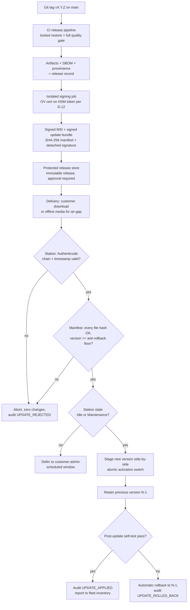

# VOL15 Supply Chain, Build, Deployment, and Field Operations — AOI Software Architecture, Secure Development, and Change-Control Standard, v1.0 (2026-07-15)

Scope: this volume governs everything between "the code is correct" and "a customer station runs it safely": software supply-chain security (§42), build/packaging/signing/release/update engineering (§43), installation and Windows hardening of production stations (§44), and field operations including remote support and fleet management (§45) for the AOI Monitor product (`jdseo921/AOI_PCB_Database`).

Supersedes/Related existing docs: §43–§44 are the normative layer above `Docs/Deployment_Package_Guide.md` and `Docs/Installation_Guide.md` (those remain as operator instructions; where they conflict with this volume, this volume prevails — both still name Windows 10, see DEP-002). `Docs/Branch_Protection_and_Quality_Gates.md` and `Docs/Developer_CI.md` remain as CI operating instructions; branch-protection *governance* is owned by the CHG catalogue (§48–53/VOL17), while this volume owns the pipeline's supply-chain hardening. `Docs/ONNX_Model_Training.md` remains the training-environment how-to; its dependency handling is bound by SUP-005/SUP-006.

Requirement IDs owned by this volume: **SUP-001..045, BLD-001..025, RELS-001..025, DEP-001..022, OPS-001..022** (139 records). Assumptions: **A-VOL15-1..5**. Open decisions: **OD-VOL15-1..3** (§45.6; merged into §6/VOL01).

---

## 42. Software Supply-Chain Security

This section governs every externally produced thing the product depends on — packages, tools, actions, models, drivers, firmware, build machines — and the pipeline that turns source into shipped artifacts. It exists because the current repository's supply-chain posture is its weakest layer relative to its otherwise deep quality gates: lock files exist but CI does not enforce them, GitHub Actions are tag-pinned rather than SHA-pinned, workflows run with default token permissions, there is no vulnerability scanning, no SBOM, no code signing, and secret detection is a home-made regex with a broad allowlist (`context` facts verified against `.github/workflows/dotnet-ci.yml`, `.github/workflows/build-windows-app.yml`, `Directory.Build.props`, `Scripts/check-code-quality.ps1:204-213`). The boundary with neighbors: §43 owns what the release pipeline *produces*; §30/VOL08 (CRY catalogue) owns key custody mechanics; §15/VOL03 owns the in-process plugin-loading rule (the unsigned `Assembly.LoadFrom` adapter path is a supply-chain hazard governed there); §48–53/VOL17 own change governance and branch protection.

### 42.1 Inventory scope

The supply-chain inventory (SUP-001) SHALL cover every class in Table 42-1. "Not applicable yet" classes stay in the table with an empty entry so their adoption is a visible inventory event, not an untracked drift.

Table 42-1 — Supply-chain inventory classes

| # | Class | Current instances (repo reality, 2026-07-15) |
|---|---|---|
| 1 | NuGet packages, direct + transitive | `Microsoft.Data.Sqlite 10.0.1`, `Microsoft.ML.OnnxRuntime 1.27.0`, `SQLitePCLRaw.bundle_e_sqlite3 3.0.3`, xUnit 2.9.3, coverlet 6.0.4; locked via `packages.lock.json` (all 4 projects) |
| 2 | .NET SDK + bundled runtime | SDK `10.0.x` (CI floats the minor — see SUP-008); self-contained publish ships the runtime copy |
| 3 | Build tools | MSBuild (SDK-delivered), `dotnet format`, PowerShell gate scripts (`Scripts/`, 8 files) |
| 4 | CI actions | `actions/checkout@v4`, `actions/setup-dotnet@v4`, `actions/upload-artifact@v4` — tag-pinned, not SHA-pinned |
| 5 | CI build machines | GitHub-hosted `windows-latest` runners (image version currently unrecorded) |
| 6 | Installer tools | WiX toolset (to be adopted per D-08); `signtool` (to be adopted per D-12) |
| 7 | Signing tools + certificates | none yet — OV certificate + HSM token pending (OD-03, D-12) |
| 8 | Native DLLs | `e_sqlite3` (via SQLitePCLRaw), `onnxruntime.dll` (via the NuGet package) |
| 9 | DB engine | SQLite (embedded via #8; D-04) |
| 10 | Image codecs / PDF / compression | WPF/WIC in-box codecs, in-house `PdfExportService` (no third-party PDF lib), `System.IO.Compression` |
| 11 | Camera / lighting SDKs | none in the main app (hygiene gate bans vendor packages there); Stage-2 adapter plugins load out-of-app (§15/VOL03) |
| 12 | Robot SDKs / PLC libraries | none yet (Stage 3) |
| 13 | OPC UA stacks | none yet (Stage 4); UA-.NETStandard (MIT-licensed since Dec 2025) is the assessed candidate [OPCUA-P2] |
| 14 | Python interpreter + wheels (training env) | Python 3.11 + anomalib toolchain via uv (`Scripts/ml`, `Docs/ONNX_Model_Training.md`) |
| 15 | CUDA / cuDNN / GPU drivers | not adopted (CPU EP baseline, D-01; adoption tracked as OD-02) |
| 16 | Model runtimes | ONNX Runtime 1.27.0 — no vendor LTS exists; the product defines its own support window (D-03) |
| 17 | AI models incl. base/pretrained lineage | anomalib pretrained backbones consumed in training; shipped artifact = single-file ONNX + signed manifest (D-03) |
| 18 | Device firmware (cameras, lighting, robot, safety PLC) | Stage 2+; tracked per station in the fleet inventory (OPS-009) |
| 19 | License/keys material | signing keys (D-12), license-file signing keys (OD-04) — custody per the CRY catalogue (§30/VOL08) |

### 42.2 Threat model TM-42-A — build and release environment (STRIDE-lite)

| STRIDE | Scenario | Current exposure (fact) | Treatment |
|---|---|---|---|
| Spoofing | Typosquat/confusable package resolves at restore | no source mapping in `nuget.config` | SUP-009, SUP-010, SUP-011 |
| Spoofing | Fork of an action serves malicious code at the same tag | all actions tag-pinned (`@v4`) | SUP-035, SUP-036, SUP-040 |
| Tampering | Upstream mutates a tag (tj-actions class, Mar 2025) | tag pins mutable | SUP-035 |
| Tampering | Restore silently drifts from lock file | CI restore not locked (`dotnet-ci.yml:25`) | SUP-003 |
| Tampering | Workflow edited to implant/exfiltrate | direct pushes to `main`, CODEOWNERS inert | SUP-037; CHG catalogue (§49/VOL17) |
| Repudiation | Cannot prove which commit produced a shipped exe | no provenance, no signing | SUP-029, SUP-030; BLD-005 |
| Info disclosure | Secrets reachable from PR-triggered builds | no `permissions:` blocks in either workflow | SUP-037, SUP-038 |
| DoS | Runaway jobs / queue exhaustion | no `timeout-minutes`, no `concurrency` | SUP-039 |
| Elevation | Default `GITHUB_TOKEN` write scope lets a job push/tag | default token permissions in force | SUP-037 |
| Elevation | Signing keys reachable from ordinary CI jobs | N/A yet — must be prevented at adoption | SUP-043, SUP-044 |

### 42.3 Threat model TM-42-B — field update path (STRIDE-lite)

| STRIDE | Scenario | Current exposure (fact) | Treatment |
|---|---|---|---|
| Spoofing | Fake "vendor update" handed to an operator on USB | shipped builds unsigned (`build-windows-app.yml`, no signing step) | BLD-008, RELS-011; DEP-022 |
| Tampering | MSI or bundle altered in transit | no manifest/signature today | BLD-009, RELS-011 |
| Tampering | Power loss mid-update leaves a half-written install | no updater exists yet; must be designed in | RELS-009, RELS-012 |
| Repudiation | No record of who installed what, when | no install audit | RELS-018 |
| Info disclosure | Bundle leaks confidential model/recipe content | bundles are Conf-class assets (§8/VOL02) | RELS-025; OPS-005 |
| DoS | Corrupt update bricks the station | no rollback design yet | RELS-009, RELS-010, RELS-012 |
| Elevation | Downgrade to a version with a known fixed vulnerability | nothing blocks downgrades | RELS-014, RELS-015 |
| Elevation | Installer custom actions run arbitrary code as SYSTEM | installer not yet built (D-08) | BLD-011, BLD-012 |

### 42.4 Threat model TM-42-C — licensing (STRIDE-lite)

Licensing requirements themselves are owned by the LIC catalogue (§55/VOL16) and the mechanism decision by OD-04 (per-station, offline-verifiable license file). This threat model binds that design.

| STRIDE | Scenario | Treatment |
|---|---|---|
| Spoofing | Forged license file enables unpaid features/stations | signed license files, offline signature verification (LIC catalogue, §55/VOL16) |
| Tampering | License state file edited on disk | signature + ACLs (DEP-017 class of protections) |
| Tampering | Clock rollback extends a time-limited license | UTC + monotonic anchoring, last-seen-time persistence (D-16; DEP-021) |
| Repudiation | License moved between stations without trace | station-identity binding recorded in fleet inventory (OPS-009) |
| DoS | License-check failure halts a running production line | enforcement degrades only at the next Idle state, never mid-inspection (LIC catalogue, §55/VOL16) |
| Elevation | License parser as an attack surface for crafted files | license files parsed under the INP catalogue rules (§29/VOL08) |

### 42.5 Secure update and artifact-verification flow



**Reading this diagram:** a release starts from a git tag on `main`; the CI release pipeline restores dependencies in locked mode and must pass the full quality gate before anything downstream happens. The build emits the artifacts together with the SBOM, provenance, and a machine-readable release record. Signing happens in a separate, isolated job holding the OV certificate on hardware (D-12) — ordinary CI jobs never touch keys. The signed MSI and update bundle (with a SHA-256 per-file manifest and detached signature) land in a protected, immutable release store that requires human approval to publish. Delivery reaches the station either online or as offline media for air-gapped sites. The station then performs two independent verifications before touching any file: first the Authenticode chain and timestamp, then the manifest hashes and the anti-rollback version floor; any failure aborts with zero filesystem changes and an `UPDATE_REJECTED` audit event. Installation proceeds only in Idle or Maintenance state (never during an inspection run), stages the new version side-by-side, switches atomically, retains the previous version, and runs a post-update self-test whose failure triggers automatic rollback. Every outcome is audited and reported to the fleet inventory.

### 42.6 SLSA position statement

The product claims explicit SLSA v1.2 levels, never a vague "SLSA compliant" [SLSA]:

- **Build track — now:** Build L1 (provenance exists for every release, SUP-029). **Trajectory:** Build L2 (signed provenance from the hosted platform) before the first commercial release (SUP-030).
- **Source track — now:** Source L1 (version control, retained history). **Target:** Source L2 requires continuous branch protection on `main`, which does not exist today (direct pushes are the norm); the enforcement obligation is owned by the CHG catalogue (§49/VOL17), and SUP-031 binds the release side to that outcome.

### R: Inventory, pinning, and lock files

**[SUP-001]** (P2 | ALL | Build, CI)
The Release Manager SHALL maintain a supply-chain inventory enumerating every component class of Table 42-1 with name, exact version, source, and SHA-256 or signer identity per entry.
- Why: an uninventoried component is invisible to vulnerability triage, SBOM generation, and EOL planning; today only NuGet is tracked (lock files). Maps: 800-161; SBOM-MIN; SSDF-PW.4; CWE-1104.
- Verify: inventory completeness cross-check against the release SBOM and Table 42-1 at release review. Evidence: inventory file in the release evidence package. Owner: Release Manager. Auto: Partially automated.
- Exception: Not allowed. Review: Quarterly.

**[SUP-002]** (P1 | ALL | Build)
Every .NET project in the solution SHALL commit a NuGet lock file (`packages.lock.json`) pinning the exact resolved version and content hash of every direct and transitive package.
- Why: exact pinning with content hashes is the precondition for tamper detection and repeatable builds; the repo already satisfies this (`Directory.Build.props:5`, lock files in all 4 projects) — this record makes removal a violation. Maps: SSDF-PW.4; SLSA; CWE-494.
- Verify: fitness function FF-SUP-01 (CI check: lock file present per project, `RestorePackagesWithLockFile=true` set). Evidence: CI gate log. Owner: Software Lead. Auto: Fully automated.
- Exception: Not allowed. Review: Annual.

**[SUP-003]** (P1 | ALL | CI)
Every CI and release restore SHALL run in locked mode (`dotnet restore --locked-mode` or `RestoreLockedMode=true`) so that any drift from the committed lock files fails the build.
- Why: without locked mode the lock file is decorative — restore silently regenerates it; `dotnet-ci.yml:25` currently restores unlocked, so CI does not actually enforce the pins. Maps: SSDF-PW.4; SLSA; CWE-494.
- Verify: fitness function FF-SUP-02 (workflow lint requiring the locked-mode flag on every restore step). Evidence: CI gate log + workflow file. Owner: Software Lead. Auto: Fully automated.
- Exception: Not allowed. Review: Annual.

**[SUP-004]** (P2 | ALL | Build, CI)
Every change to a lock file SHALL be reviewed by a human with the introducing dependency and reason identified in the change description.
- Why: lock-file diffs are where dependency-confusion and malicious-version swaps become visible; unreviewed hash churn defeats the point of pinning. Maps: SSDF-PW.4; OSSF; CWE-829.
- Verify: PR review checklist item CHK-SUP-LOCK in the §49/VOL17 review standard. Evidence: PR review record. Owner: Software Lead. Auto: Manual review.
- Exception: Not allowed. Review: Annual.

**[SUP-005]** (P2 | ALL | Training)
The Python training environment (`Scripts/ml`) SHALL install packages only from a committed, fully pinned dependency set with per-distribution SHA-256 hashes (`uv.lock` or `pip --require-hashes`).
- Why: the training pipeline produces the shipped model artifacts; an unpinned wheel is a direct model-poisoning path (D-07 already selects this mechanism). Maps: SSDF-PW.4; SLSA; AI-RMF; CWE-494.
- Verify: presence and use of the committed lock/hash file in the training runbook run log. Evidence: training-run environment capture in the model provenance record (§31/VOL09 AIM catalogue). Owner: ML Lead. Auto: Partially automated.
- Exception: Not allowed. Review: Annual.

**[SUP-006]** (P2 | ALL | Build, Training)
A hash or signature mismatch during any dependency restore or install SHALL abort the operation with no fallback to an unverified source.
- Why: fail-open verification is worse than none — it converts tamper detection into a log line; NuGet NU3008 and pip hash-checking both support hard failure. Maps: CWE-494; SSDF-PW.4; 62443-4-1 SM-9.
- Verify: negative test TST-class: corrupt one cached package, assert restore fails (test suite SupplyChainGateTests). Evidence: test run in CI. Owner: Software Lead. Auto: Fully automated.
- Exception: Not allowed. Review: Annual.

**[SUP-007]** (P3 | ALL | Build)
The solution SHOULD adopt NuGet Central Package Management (`Directory.Packages.props`) so every package version is declared exactly once repo-wide.
- Why: scattered per-project versions invite skew between the four projects and complicate lock-file review; CPM complements (not replaces) lock files. Maps: SSDF-PW.4; Internal.
- Verify: presence of `Directory.Packages.props` with per-project versions removed. Evidence: repo file inspection at review. Owner: Software Lead. Auto: Fully automated.
- Exception: Allowed — approver: Software Architect. Review: Annual.

**[SUP-008]** (P2 | ALL | Build, CI)
The .NET SDK used for CI and release builds SHALL be pinned to one exact version declared in `global.json` and mirrored by the workflow setup step.
- Why: `dotnet-ci.yml:20` currently floats `10.0.x`, so the compiler can change under the team between runs — a silent build-input change that breaks reproducibility (D-02 mandates the pin). Maps: SLSA; SSDF-PO.3; NET-LC.
- Verify: fitness function FF-SUP-03 (lint: `global.json` exact version equals workflow `dotnet-version`). Evidence: CI gate log. Owner: Software Lead. Auto: Fully automated.
- Exception: Allowed — approver: Software Architect. Review: On change.

### R: Registries, intake review, and dependency hygiene

**[SUP-009]** (P1 | ALL | Build, CI)
NuGet package sources SHALL be restricted by a committed `nuget.config` to nuget.org plus explicitly approved vendor feeds; every other source is prohibited.
- Why: an open source list lets any feed (including a machine-level leftover) inject packages; the allowlist is the perimeter for all downstream verification. Maps: 800-161; SSDF-PW.4; CWE-829.
- Verify: fitness function FF-SUP-04 (lint: `<clear/>` plus allowlisted sources only in `nuget.config`). Evidence: CI gate log. Owner: Security Lead. Auto: Fully automated.
- Exception: Allowed — approver: Security Lead. Review: On change.

**[SUP-010]** (P2 | ALL | Build)
`nuget.config` SHALL declare package source mapping so that vendor- or internal-prefixed package IDs can never resolve from public feeds.
- Why: dependency confusion works by publishing a higher version of an internal name publicly; source mapping removes the resolution path entirely. Maps: CWE-427; SSDF-PW.4; OSSF.
- Verify: fitness function FF-SUP-04 (extends the `nuget.config` lint with `packageSourceMapping` presence). Evidence: CI gate log. Owner: Security Lead. Auto: Fully automated.
- Exception: Not allowed. Review: Annual.

**[SUP-011]** (P2 | ALL | Build, Training)
The intake review for a new package SHALL verify the package ID, publisher/owner, and source-repository URL against the intended upstream project before the package is first restored.
- Why: typosquats and confusable names (NuGet and PyPI both) are caught only by a human comparing the claimed identity with the real project; restore tooling cannot know intent. Maps: CWE-829; OSSF; 800-161.
- Verify: completed dependency-intake template (§57/VOL18) attached to the introducing PR. Evidence: intake record. Owner: Software Lead. Auto: Manual review.
- Exception: Not allowed. Review: Annual.

**[SUP-012]** (P0 | ALL | Build, CI)
A dependency added by an AI coding agent SHALL NOT be merged without a completed human dependency-intake review (§57/VOL18 template) recorded on the introducing change.
- Why: agents hallucinate or pick abandoned/typosquatted packages ("slopsquatting"); an unreviewed agent-added package is an unaudited code-execution grant to an unknown third party. Maps: SSDF-PW.4; SBD; CWE-829.
- Verify: PR review checklist item CHK-SUP-AI plus lock-file diff cross-check against intake records. Evidence: PR review record + intake record. Owner: Security Lead. Auto: Manual review.
- Exception: Not allowed. Review: Per release.

**[SUP-013]** (P2 | ALL | Build)
A new dependency SHALL NOT be adopted when the needed functionality is a single clear function of 50 logical lines or fewer that the team can implement and test in-repo.
- Why: each dependency is a permanent attack-surface and maintenance liability (left-pad class); the repo's in-house `PdfExportService` over a PDF library is the working precedent. Maps: 800-161; CWE-1104; Internal.
- Verify: intake template question "why not implement locally" answered with a size/complexity estimate. Evidence: intake record. Owner: Software Architect. Auto: Manual review.
- Exception: Allowed — approver: Software Architect. Review: Annual.

**[SUP-014]** (P2 | ALL | Build, Training)
Every new dependency SHALL pass a recorded maintenance-health review covering last release date, maintainer activity, open security advisories, and known EOL date, using the §57/VOL18 intake template.
- Why: adopting an unmaintained package imports future unpatchable CVEs (CWE-1104); the health check is the cheapest point to refuse them. Maps: CWE-1104; 800-161; OSSF.
- Verify: completed intake template per new dependency in the introducing PR. Evidence: intake record. Owner: Software Lead. Auto: Manual review.
- Exception: Not allowed. Review: Annual.

**[SUP-015]** (P3 | ALL | Build)
New open-source dependencies SHOULD have an OpenSSF Scorecard score of at least 5.0, with a recorded rationale for any adoption below that threshold.
- Why: Scorecard automates a floor for branch protection, pinning, review, and maintenance signals of upstream projects; it is a screen, not a verdict [OSSF]. Maps: OSSF; 800-161.
- Verify: Scorecard value captured in the intake template (public API where the repo is scored). Evidence: intake record. Owner: Security Lead. Auto: Partially automated.
- Exception: Allowed — approver: Security Lead. Review: Annual.

**[SUP-016]** (P1 | ALL | Build, Training)
Every dependency license SHALL be on the recorded license allowlist (MIT, Apache-2.0, BSD-2-Clause, BSD-3-Clause, MS-PL, ISC) or approved through External Legal Counsel review before it ships in a release.
- Why: copyleft or unknown licenses in a proprietary industrial product create distribution-blocking legal exposure discovered cheapest at intake; full obligations live in the LIC catalogue (§55/VOL16). Maps: SBOM-MIN; Internal.
- Verify: license field required in the intake template; SBOM license audit at release (FF-SUP-05). Evidence: intake record + SBOM. Owner: Release Manager. Auto: Partially automated.
- Exception: Allowed — approver: External Legal Counsel. Review: Per release.

**[SUP-017]** (P2 | S2+ | Build, CameraAdapter)
Every commercial SDK (camera, lighting, robot, OPC UA stack) SHALL be entered in the supplier-risk register with support/EOL commitment, security contact, and patch-delivery terms recorded before integration work begins.
- Why: vendor SDKs are native code inside the trust boundary with no public advisory feeds; NIST C-SCRM supplier practices are the only leverage available [800-161]. Maps: 800-161; 62443-4-1 SM-9; 62443-4-1 SM-10.
- Verify: supplier-register entry reviewed at the stage-gate review for the integrating stage. Evidence: supplier-risk register. Owner: Release Manager. Auto: Manual review.
- Exception: Not allowed. Review: Quarterly.

**[SUP-018]** (P2 | ALL | Build, Installer)
Every native DLL or vendor binary shipped with the product SHALL be recorded in the inventory with its SHA-256 and, where signed, its Authenticode signer identity.
- Why: native binaries bypass NuGet signature machinery; hash + signer records are the only way to detect substitution (`e_sqlite3`, `onnxruntime.dll` today; camera SDK DLLs at Stage 2). Maps: SBOM-MIN; CWE-494; 62443-4-2 CR 3.4.
- Verify: fitness function FF-SUP-06 (publish-output scan diffing shipped binaries against the inventory hash list). Evidence: CI gate log. Owner: Release Manager. Auto: Fully automated.
- Exception: Not allowed. Review: Per release.

### R: Vulnerability monitoring and dependency lifecycle

**[SUP-019]** (P1 | ALL | CI)
CI SHALL run `dotnet list package --vulnerable --include-transitive` on every push and fail the gate on any Critical or High advisory without a recorded exception.
- Why: the repo currently has zero dependency scanning (no dependabot.yml, no review action, no CLI gate) — a known-vulnerable package would ship silently. Maps: SSDF-RV.1; KEV; CWE-1104; D-14.
- Verify: fitness function FF-SUP-07 (gate step in `run-quality-gates.ps1`). Evidence: CI gate log + `industrial_quality_gate_report.json` entry. Owner: Security Lead. Auto: Fully automated.
- Exception: Allowed — approver: Security Lead. Review: Per release.

**[SUP-020]** (P2 | ALL | Build, Training)
The Security Lead SHALL subscribe to and triage security advisories for all inventory components (GitHub Advisory Database, .NET release notes, ONNX Runtime releases, CISA KEV) within 7 calendar days of publication.
- Why: the CLI gate only sees NuGet; native components, the bundled runtime, Python wheels, and OS-adjacent tooling need a human advisory funnel; KEV entries indicate active exploitation. Maps: SSDF-RV.1; KEV; 62443-4-1 DM-1.
- Verify: triage log with advisory ID, decision, and date. Evidence: advisory triage log. Owner: Security Lead. Auto: Manual review.
- Exception: Not allowed. Review: Quarterly.

**[SUP-021]** (P1 | ALL | Inference, Build)
ONNX Runtime patch releases containing security fixes SHALL be adopted within 30 calendar days of publication.
- Why: ONNX Runtime publishes no LTS line, so the product's own supported window (D-03) is the only patch policy; a stale inference runtime processes untrusted image inputs. Maps: SSDF-RV.1; ONNX-SEC; CWE-1104.
- Verify: inventory version vs upstream release date check at the quarterly review; release notes cite the adoption. Evidence: inventory + release notes. Owner: ML Lead. Auto: Partially automated.
- Exception: Allowed — approver: Security Lead. Review: Quarterly.

**[SUP-022]** (P3 | ALL | CI)
Dependabot (or an equivalent automated update service) SHOULD be enabled for the NuGet, GitHub Actions, and pip ecosystems so that pinned versions and action SHAs receive automated update proposals.
- Why: SHA-pinning without automated updates rots into never-updating; Dependabot updates the SHA and its version comment together [GitHub secure-use guidance]. Maps: OSSF; SSDF-PW.4.
- Verify: `dependabot.yml` present covering the three ecosystems. Evidence: repo file + open update PR history. Owner: Software Lead. Auto: Fully automated.
- Exception: Allowed — approver: Software Lead. Review: Annual.

**[SUP-023]** (P2 | ALL | Build)
A release SHALL NOT ship a runtime or dependency whose vendor support ends within 6 months of the release date unless a recorded migration plan with dates exists.
- Why: .NET 8 and .NET 9 both reach EOL 2026-11-10 — any auxiliary tooling on them must migrate this year; shipping onto a dying runtime creates an unpatchable fleet [NET-LC]. Maps: NET-LC; WIN-LC; CWE-1104.
- Verify: EOL-date column in the inventory checked at release review. Evidence: inventory + release checklist. Owner: Release Manager. Auto: Partially automated.
- Exception: Allowed — approver: Software Architect. Review: Per release.

### R: SBOM and AI/model BOM

**[SUP-024]** (P1 | ALL | Build, CI)
Every release SHALL emit a CycloneDX 1.7.1 JSON SBOM covering the NuGet dependency graph, shipped native binaries, and the bundled self-contained .NET runtime.
- Why: no SBOM exists today (zero hits in `Scripts/publish.ps1` and workflows); customers and EU CRA Annex I conformity arguments both require one; 1.7.1 is pinned because it fixed ModelCard schema inconsistencies [CDX]. Maps: CDX; SBOM-MIN; CRA; SSDF-PS.3.
- Verify: fitness function FF-SUP-05 (SBOM generated + schema-validated in the release pipeline). Evidence: SBOM artifact in the release record. Owner: Release Manager. Auto: Fully automated.
- Exception: Not allowed. Review: Per release.

**[SUP-025]** (P2 | ALL | Build)
The release SBOM SHALL contain the seven NTIA 2021 minimum fields plus per-component hashes, licenses, generation-tool identity, and generation context (build phase).
- Why: NTIA 2021 is the operative final baseline; the CISA 2025 update (hash/license/tool/context additions) is still a draft — adopting its fields now is cheap future-proofing, claiming conformance to it is not permitted. Maps: SBOM-MIN; CDX; 800-161.
- Verify: SBOM field audit in FF-SUP-05 (schema + required-field assertions). Evidence: CI gate log. Owner: Release Manager. Auto: Fully automated.
- Exception: Not allowed. Review: Annual.

**[SUP-026]** (P2 | ALL | ModelMgmt, Training)
Every vendor-shipped ONNX model SHALL be accompanied by an ML-BOM (CycloneDX 1.7.1 ModelCard) recording model hash, architecture, base/pretrained-model lineage, training-dataset identity and version, training-pipeline version, and acceptance metrics.
- Why: the CISA/G7 SBOM-for-AI minimum elements (1st ed., June 2026) define exactly these clusters (Models, Dataset Properties, KPI, Security Properties); the anomalib pretrained backbones are inherited third-party lineage that must be visible. Maps: CDX; SBOM-MIN; AI-RMF; SSDF-AI.
- Verify: ML-BOM presence and field completeness checked by the model-release step (§19/VOL04 lifecycle gate). Evidence: ML-BOM artifact in the model provenance record. Owner: ML Lead. Auto: Partially automated.
- Exception: Not allowed. Review: Per release.

**[SUP-027]** (P2 | ALL | Build)
SBOMs and ML-BOMs SHALL be retained for the support life of their release and delivered to a requesting customer within 10 business days.
- Why: an SBOM that cannot be produced during a customer's incident response is functionally nonexistent; air-gapped industrial customers ask post-hoc, not at delivery. Maps: SBOM-MIN; CRA; 800-161.
- Verify: retention location named in the release record; delivery drill once annually. Evidence: release record + drill log. Owner: Release Manager. Auto: Manual review.
- Exception: Not allowed. Review: Annual.

**[SUP-028]** (P3 | ALL | Build)
The vendor SHOULD publish CycloneDX VEX statements for published CVEs affecting components bundled in supported releases, stating exploitability in the product context.
- Why: most CVEs in bundled components (SQLite, ONNX Runtime, .NET) are not reachable in this product; VEX prevents customers from forcing emergency updates on non-exploitable findings [CDX]. Maps: CDX; SBOM-MIN; SSDF-RV.1.
- Verify: VEX artifact linked from the advisory triage log for each applicable CVE decision. Evidence: VEX documents. Owner: Security Lead. Auto: Partially automated.
- Exception: Allowed — approver: Security Lead. Review: Quarterly.

### R: Provenance, SLSA position, and reproducibility

**[SUP-029]** (P1 | ALL | CI, Build)
Every release SHALL include a build-provenance record identifying the builder, source commit SHA, workflow definition, and material inputs, satisfying SLSA v1.2 Build L1.
- Why: without provenance nobody can prove a shipped binary came from the audited pipeline rather than a laptop; L1 is achievable immediately with a generated document. Maps: SLSA; SSDF-PS.2; CWE-494.
- Verify: provenance file emitted by the release pipeline and referenced by the release record. Evidence: provenance artifact. Owner: Release Manager. Auto: Fully automated.
- Exception: Not allowed. Review: Per release.

**[SUP-030]** (P2 | ALL | CI)
Signed build provenance from the hosted CI platform (GitHub artifact attestations or an equivalent in-toto/Sigstore bundle), satisfying SLSA v1.2 Build L2, SHALL be in place before the first commercial release.
- Why: unsigned L1 provenance is assertable by anyone; L2's platform-signed attestation is what a customer or auditor can verify offline (cosign v3 bundles support air-gapped verification) [SLSA; SIGSTORE]. Maps: SLSA; SIGSTORE; SSDF-PS.2.
- Verify: attestation verification step documented and executed in a release rehearsal. Evidence: verification transcript in release evidence. Owner: Release Manager. Auto: Partially automated.
- Exception: Allowed — approver: Security Lead. Review: Quarterly.

**[SUP-031]** (P2 | ALL | CI)
The repository SHALL satisfy SLSA v1.2 Source L2 (retained revision history plus continuously enforced branch protection on `main`) before the first commercial release.
- Why: today anyone with push access rewrites `main` unreviewed (branch protection documented but not enforced); Source L1 is met, L2 is not — the enforcement mechanics are owned by the CHG catalogue (§49/VOL17), this record binds the release gate to the outcome. Maps: SLSA; SSDF-PS.1; CSF2 PR.
- Verify: repository ruleset/branch-protection API query in the release checklist. Evidence: protection-settings capture in release evidence. Owner: Release Manager. Auto: Partially automated.
- Exception: Allowed — approver: Product Owner. Review: Per release.

**[SUP-032]** (P2 | ALL | Build)
Deterministic-build settings (`Deterministic=true` plus locked restore) SHALL remain enabled for all Release-configuration builds.
- Why: determinism is already on (`Directory.Build.props`) and is the precondition for any byte-comparison verification (BLD-021); silently dropping it would void reproducibility claims. Maps: SLSA; SSDF-PW.6; Internal.
- Verify: fitness function FF-SUP-08 (props lint). Evidence: CI gate log. Owner: Software Lead. Auto: Fully automated.
- Exception: Not allowed. Review: Annual.

**[SUP-033]** (P0 | S2+ | Update, Config)
Production stations SHALL NOT download code, packages, or models from public registries (NuGet, PyPI, container or model hubs) at runtime.
- Why: a station that pulls from public infrastructure inherits every upstream compromise instantly and defeats the entire signed-release chain; all station-bound artifacts arrive only via the §42.5 verified path. Maps: CWE-494; CWE-829; 62443-3-3 SR 3.4; 800-82.
- Verify: firewall outbound ruleset (DEP-009) blocks registry endpoints; code review confirms no package-manager invocation paths on stations. Evidence: firewall ruleset + review record. Owner: Security Lead. Auto: Partially automated.
- Exception: Not allowed. Review: Annual.

**[SUP-034]** (P1 | ALL | CI, Build)
Build and CI steps SHALL NOT fetch and execute scripts or binaries that are not version-pinned with integrity verification (no `curl | sh`, no unpinned `Invoke-WebRequest | Invoke-Expression`, no `dotnet tool install` without a pinned version).
- Why: piped-shell installs execute whatever the remote host serves at that moment — the canonical unauditable supply-chain step. Maps: CWE-494; SLSA; SSDF-PO.3.
- Verify: fitness function FF-SUP-09 (workflow + script lint for fetch-and-execute patterns). Evidence: CI gate log. Owner: Software Lead. Auto: Fully automated.
- Exception: Not allowed. Review: Annual.

### R: CI pipeline hardening

**[SUP-035]** (P1 | ALL | CI)
Every GitHub Actions workflow step SHALL reference actions by full-length commit SHA (with a version comment); tag and branch references are prohibited.
- Why: both repo workflows are tag-pinned (`@v4` — `dotnet-ci.yml:14,19`; `build-windows-app.yml:21,24,48`); tags are mutable, and the March 2025 tj-actions compromise is the canonical exploitation of exactly this gap. Maps: SLSA; OSSF; CWE-829.
- Verify: fitness function FF-SUP-10 (workflow lint: every `uses:` matches a 40-hex SHA). Evidence: CI gate log. Owner: Software Lead. Auto: Fully automated.
- Exception: Not allowed. Review: Annual.

**[SUP-036]** (P3 | ALL | CI)
The repository (or a future owning organization) actions policy SHOULD be configured to hard-enforce SHA pinning so unpinned workflows fail at the platform level (GitHub enforcement available since 2025-08-15).
- Why: platform enforcement survives a compromised or careless PR that edits the lint itself; on the current personal account this is settings-dependent (A-VOL15-2). Maps: OSSF; SLSA; Internal.
- Verify: repository/org actions-policy settings capture. Evidence: settings screenshot/API export in release evidence. Owner: Software Lead. Auto: Partially automated.
- Exception: Allowed — approver: Software Lead. Review: Annual.

**[SUP-037]** (P1 | ALL | CI)
Every workflow SHALL declare a top-level `permissions:` block of `contents: read`, with any elevation granted per-job and justified by an in-file comment.
- Why: neither workflow declares `permissions:` today, so every job gets the default writable `GITHUB_TOKEN` — a compromised step can push commits, tags, or releases. Maps: OSSF; SLSA; CWE-250.
- Verify: fitness function FF-SUP-11 (workflow lint: top-level read-only permissions present). Evidence: CI gate log. Owner: Software Lead. Auto: Fully automated.
- Exception: Allowed — approver: Security Lead. Review: On change.

**[SUP-038]** (P1 | ALL | CI)
Workflows triggered by pull requests SHALL NOT expose repository or environment secrets to build steps, and `pull_request_target` with checkout of the PR head is prohibited.
- Why: PR-triggered code is attacker-controlled by definition on a public remote; secrets in that context are exfiltratable by the change under review (Dangerous-Workflow class). Maps: OSSF; CWE-522; SLSA.
- Verify: fitness function FF-SUP-12 (workflow lint for `pull_request_target` + secret references in PR contexts). Evidence: CI gate log. Owner: Security Lead. Auto: Fully automated.
- Exception: Not allowed. Review: Annual.

**[SUP-039]** (P3 | ALL | CI)
Every workflow SHALL declare per-job `timeout-minutes` and a `concurrency` group that cancels superseded runs of the same ref.
- Why: neither workflow has either today; hung jobs burn the runner quota (a real DoS on a personal-account plan) and stale double-runs (push + PR both trigger) waste half the CI capacity. Maps: Internal; OSSF.
- Verify: fitness function FF-SUP-13 (workflow lint). Evidence: CI gate log. Owner: Software Lead. Auto: Fully automated.
- Exception: Allowed — approver: Software Lead. Review: Annual.

**[SUP-040]** (P2 | ALL | CI)
A third-party GitHub Action SHALL pass the same dependency-intake review as a package (source audit of the pinned SHA, maintenance health, license) before first use.
- Why: an action runs with repository context and token — it is a dependency with more privilege than most packages, not less. Maps: OSSF; 800-161; CWE-829.
- Verify: intake template (§57/VOL18) filed for each new action. Evidence: intake record. Owner: Security Lead. Auto: Manual review.
- Exception: Not allowed. Review: Annual.

**[SUP-041]** (P1 | ALL | CI)
CI SHALL run a maintained secret scanner (gitleaks or GitHub-native secret scanning) on every push, with the existing home-made regex gates retained as defense-in-depth only.
- Why: the current regexes (`Scripts/check-code-quality.ps1:204-213`, `check-pr-quality.ps1:468-482`) allowlist any match near `test|example|dummy` and exempt test projects entirely — that is secret-scanning theater, not scanning. Maps: CWE-798; SSDF-PS.1; OSSF.
- Verify: fitness function FF-SUP-14 (scanner step present and blocking; seeded-secret canary test fails the gate). Evidence: CI gate log. Owner: Security Lead. Auto: Fully automated.
- Exception: Not allowed. Review: Annual.

### R: Package signature validation, signing isolation, and release protection

**[SUP-042]** (P1 | ALL | Build, CI)
`nuget.config` SHALL set `signatureValidationMode=require` with a maintained `<trustedSigners>` list (nuget.org repository signature plus approved authors); the default `accept` mode is prohibited.
- Why: in `accept` mode a package signed by an untrusted certificate is treated as unsigned and installs silently — only `require` mode makes signatures an enforcement boundary (NU3008 blocks tampered content). Maps: CWE-347; SSDF-PW.4; 62443-4-1 SM-9.
- Verify: fitness function FF-SUP-04 (nuget.config lint) plus `dotnet nuget verify` spot check in the release pipeline. Evidence: CI gate log. Owner: Security Lead. Auto: Fully automated.
- Exception: Allowed — approver: Security Lead. Review: On change.

**[SUP-043]** (P0 | ALL | CI, Build)
Code-signing operations SHALL execute only in a dedicated signing job under a dedicated identity, with private keys held in an HSM or hardware token per D-12 and inaccessible to ordinary CI jobs and developer machines.
- Why: a signing key reachable from general CI turns any workflow compromise into signed malware under the product identity; CA/B Forum baseline already mandates hardware key custody (since 2023-06) [dotnet-windows research §10]. Maps: 62443-4-1 SM-8; SSDF-PS.2; CWE-522; SLSA.
- Verify: signing architecture review — key material location, job isolation, identity scoping. Evidence: signing-architecture record + pipeline definition. Owner: Security Lead. Auto: Manual review.
- Exception: Not allowed. Review: Annual.

**[SUP-044]** (P1 | ALL | CI)
Release publication SHALL run only in a protected pipeline environment that requires a recorded human approval by the Release Manager before executing.
- Why: `build-windows-app.yml` currently publishes on every push to `main` with no human in the loop; an approval-gated environment is the platform hook that separates "CI ran" from "we shipped". Maps: SLSA; SSDF-PS.2; 62443-4-1 SM-7.
- Verify: environment protection rule capture + workflow reference to the environment. Evidence: settings export + workflow file. Owner: Release Manager. Auto: Partially automated.
- Exception: Not allowed. Review: Annual.

**[SUP-045]** (P3 | ALL | Build, Installer)
Installer, signing, and SBOM toolchain executables (WiX toolset, signtool, CycloneDX generators) SHALL be version-pinned and verified by hash or signature before use in the pipeline.
- Why: build tools are code that runs with full access to the artifacts they produce; an unpinned tool download is the same class of hole as an unpinned package (SolarWinds-class implant point). Maps: SLSA; SSDF-PO.3; CWE-494; 62443-4-1 SM-7.
- Verify: tool-acquisition steps in the pipeline show pin + hash check (FF-SUP-09 extension). Evidence: CI gate log. Owner: Software Lead. Auto: Fully automated.
- Exception: Allowed — approver: Software Lead. Review: Annual.

---

## 43. Build, Packaging, Signing, Release, and Update

This section defines how source becomes a shippable, verifiable, updatable product. It exists because the repo's current publishing path is a live nonconformity: `.github/workflows/build-windows-app.yml` publishes a self-contained, single-file, **unsigned** executable on every push to `main` and on `v*` tags, and is *deliberately isolated from the quality gate* (its own header comment, lines 3–5). That design was acceptable for reviewer convenience; it is not acceptable as a release channel. The fix is defined normatively here: the publish job becomes gate-coupled (BLD-002), its output is labeled and quarantined as a test build (BLD-017), and the real release channel is the signed WiX MSI pipeline of §42.5. Boundary with neighbors: §42 owns the inputs and pipeline hardening; §44 owns what happens on the station's OS; the CHG catalogue (§48–53/VOL17) owns who may approve a release.

### 43.1 Installer decision (D-08): WiX MSI, MSIX rejected

D-08 selects a signed WiX MSI (per-machine, offline/air-gap capable). The MSIX alternative was evaluated and rejected for reasons that are structural, not preferential:

| Criterion | WiX MSI | MSIX |
|---|---|---|
| Air-gapped install | plain file + Authenticode; no store infra | sideloading policy + cert deployment machinery |
| Filesystem model | real paths — matches vault/plugin/data layout | virtualized FS/registry breaks `{StorageRoot}` + plugin design |
| Per-machine install + ACLs | native (DEP-007 set at install) | per-user-centric; machine-wide ACL control limited |
| Update semantics | customer-scheduled, staged activation | platform background staging conflicts with RELS-016/017 |
| LTSC / App Control estates | mature, universally supported | servicing/store dependencies not guaranteed on locked-down LTSC |
| Custom install steps (firewall, ACLs) | supported, auditable (BLD-012 bounds them) | restricted |

The MSI's known weakness — custom actions running as SYSTEM — is bounded by BLD-012 rather than avoided by switching technology.

### 43.2 Release content

Every release consists of: signed MSI + signed update bundle (BLD-020), SBOM + ML-BOM (SUP-024/026), provenance (SUP-029), release notes with security-impact summary (RELS-001), migration/rollback plan (RELS-002), compatibility matrix (RELS-003), known limitations (RELS-004), third-party notices (BLD-015), and the machine-readable release record (BLD-025). The compatibility matrix rows are fixed: application version ↔ DB schema version (`SchemaInfo`, migrations currently ≥ v29) ↔ recipe schema version ↔ model manifest schema version ↔ taxonomy version (D-17).

### R: Deterministic builds, stamping, and signing

**[BLD-001]** (P0 | ALL | Build, CI)
Release artifacts SHALL be produced exclusively by the CI release pipeline from a clean checkout of a tagged commit; binaries built on developer machines are prohibited as release artifacts.
- Why: developer-machine builds have unauditable inputs (local caches, uncommitted changes, injected tooling) and void provenance; CI-only builds are the root of every claim in §42.5. Maps: SLSA; SSDF-PS.2; 62443-4-1 SM-7.
- Verify: provenance record (SUP-029) names the CI builder for every shipped artifact; hash cross-check at release review. Evidence: provenance + release record. Owner: Release Manager. Auto: Partially automated.
- Exception: Not allowed. Review: Per release.

**[BLD-002]** (P1 | ALL | CI)
The publish job SHALL execute only after the full quality gate (`Scripts/run-quality-gates.ps1` chain) has succeeded on the same commit.
- Why: `build-windows-app.yml` is explicitly isolated from the gate today (its lines 3–5), so an artifact can ship from a commit whose tests fail — the gate must be a `needs:` dependency or an in-job gate invocation. Maps: SSDF-PS.2; Internal; D-14.
- Verify: fitness function FF-BLD-01 (workflow lint: publish job depends on gate success). Evidence: CI gate log + workflow file. Owner: Software Lead. Auto: Fully automated.
- Exception: Not allowed. Review: Annual.

**[BLD-003]** (P2 | ALL | Build, CI)
Each release build SHALL begin from a fresh clone at the release tag with no build outputs from prior runs present in the workspace.
- Why: residual bin/obj or mutated caches make two "identical" builds diverge and can carry poisoned intermediates across runs; hosted ephemeral runners give this property today — the requirement preserves it if runners ever change. Maps: SLSA; SSDF-PO.5; Internal.
- Verify: pipeline definition review — no cross-run workspace reuse for release jobs. Evidence: workflow file review record. Owner: Software Lead. Auto: Manual review.
- Exception: Not allowed. Review: Annual.

**[BLD-004]** (P1 | ALL | Build)
Every release SHALL be versioned per SemVer 2.0.0 with the git commit SHA embedded in `AssemblyInformationalVersion` and surfaced in the HMI About panel and the startup log line.
- Why: field triage dies without an exact source pin — "version 1.2" is not a commit; the SHA closes the loop between a station's report and the repository. Maps: SSDF-PS.3; SLSA; Internal.
- Verify: fitness function FF-BLD-02 (publish output inspected for informational version pattern `X.Y.Z+g<sha>`); UiTests assert About-panel display. Evidence: CI gate log + test run. Owner: Software Lead. Auto: Fully automated.
- Exception: Not allowed. Review: Annual.

**[BLD-005]** (P2 | ALL | CI)
The release record SHALL capture the source commit SHA, tag, CI run identifier, and runner image identity for every published artifact.
- Why: this is the minimal fact set to reconstruct or investigate any build later; runner image identity is currently unrecorded, which blocks build-environment forensics. Maps: SLSA; SSDF-PS.3; 62443-4-1 SM-7.
- Verify: release-record schema check in the release pipeline (part of BLD-025). Evidence: release record JSON. Owner: Release Manager. Auto: Fully automated.
- Exception: Not allowed. Review: Per release.

**[BLD-006]** (P2 | ALL | Build)
The exact dependency manifests (all `packages.lock.json` files and the training-environment lock file where a model ships) SHALL be archived with each release.
- Why: the lock files are the only complete record of what actually went into the binary; the SBOM is derived data, the locks are the source of truth for reproduction. Maps: SLSA; SSDF-PS.3; SBOM-MIN.
- Verify: release-record content listing includes the lock files. Evidence: release archive. Owner: Release Manager. Auto: Fully automated.
- Exception: Not allowed. Review: Per release.

**[BLD-007]** (P2 | ALL | CI)
SBOM generation SHALL run as a blocking step of the release pipeline, failing the release when the SBOM is missing or schema-invalid.
- Why: SUP-024 defines the artifact; this record wires it into the pipeline so it cannot be skipped under schedule pressure — post-hoc SBOMs are reconstructions, not records. Maps: CDX; SSDF-PS.3; CRA.
- Verify: fitness function FF-SUP-05 executes in the release pipeline with failure propagation. Evidence: CI gate log. Owner: Release Manager. Auto: Fully automated.
- Exception: Not allowed. Review: Per release.

**[BLD-008]** (P0 | ALL | Build, Installer)
Every shipped PE binary (exe, dll) and the installer SHALL carry a timestamped Authenticode signature under the product's OV certificate per D-12.
- Why: unsigned binaries are anonymous — SmartScreen zeroes their reputation each release, App Control estates block them, and customers cannot distinguish vendor code from malware; EV buys no SmartScreen advantage (verified 2026), so OV + hardware key custody is the architecture. Maps: CWE-347; SSDF-PS.2; 62443-4-2 CR 3.4.
- Verify: fitness function FF-BLD-03 (`signtool verify /pa` over every shipped PE + installer in the pipeline). Evidence: CI gate log + signature report. Owner: Release Manager. Auto: Fully automated.
- Exception: Not allowed. Review: Per release.

**[BLD-009]** (P1 | ALL | Update, Build)
Every update bundle SHALL include a SHA-256 manifest of all contained files plus a detached signature over that manifest.
- Why: Authenticode covers PE files only; recipes, models, manifests, and notes inside a bundle need file-level integrity that survives offline relay through USB media (D-12 second mechanism). Maps: CWE-494; CWE-347; 62443-4-2 CR 3.4.
- Verify: bundle-verification unit tests (corrupt one file → verification fails, nothing installs). Evidence: test run in CI. Owner: Software Lead. Auto: Fully automated.
- Exception: Not allowed. Review: Per release.

**[BLD-010]** (P2 | ALL | Build)
All Authenticode signatures SHALL include an RFC 3161 timestamp so signature validity survives certificate expiry and rotation.
- Why: industrial stations run releases for years; without timestamps every signature dies with the certificate (~1–3 year validity), breaking reinstalls and audits of old versions. Maps: CWE-347; Internal.
- Verify: FF-BLD-03 asserts timestamp presence in each signature. Evidence: signature report. Owner: Release Manager. Auto: Fully automated.
- Exception: Not allowed. Review: Annual.

**[BLD-011]** (P1 | ALL | Installer)
The product installer SHALL be a WiX-built per-machine MSI that installs binaries under `%ProgramFiles%` with no user-writable binary directory (D-08).
- Why: per-user or user-writable installs let any operator-level compromise persist into the application binaries; `%ProgramFiles%` + DEP-007 ACLs make binaries admin-writable only. Maps: CWE-276; 62443-4-2 CR 3.4; MS-SDL.
- Verify: install test on the reference image — ACL audit of the install directory (FF-DEP-01). Evidence: install test record. Owner: Release Manager. Auto: Partially automated.
- Exception: Not allowed. Review: Per release.

**[BLD-012]** (P2 | ALL | Installer)
MSI custom actions SHALL be limited to signed, product-owned binaries, each with a documented purpose in the installer design record.
- Why: custom actions run as SYSTEM during install — the highest-privilege code the product ever executes; an undocumented custom action is an unauditable SYSTEM backdoor. Maps: CWE-250; MS-SDL; 62443-4-1 SD-4.
- Verify: installer source review at release; custom-action inventory in the installer design record. Evidence: review record. Owner: Security Lead. Auto: Manual review.
- Exception: Allowed — approver: Security Lead. Review: Per release.

### R: Packaging, validation, and build records

**[BLD-013]** (P2 | ALL | CI, Installer)
The package-validation gate (`Scripts/publish.ps1 -ValidationOnly`, gate PKG-001 in `run-quality-gates.ps1:186-195`) SHALL remain a blocking step of every release build.
- Why: the existing validation catches packaging regressions (missing content, layout drift) before signing; codifying it prevents "temporary" removal under deadline pressure. Maps: Internal; SSDF-PS.2.
- Verify: gate report entry PKG-001 present and passing per release. Evidence: `industrial_quality_gate_report.json`. Owner: Software Lead. Auto: Fully automated.
- Exception: Not allowed. Review: Annual.

**[BLD-014]** (P2 | ALL | Installer)
Install, upgrade-in-place, repair, and uninstall SHALL each be executed on a clean reference OS image for every release, with per-scenario results recorded.
- Why: MSI servicing bugs (component-rule violations, orphaned files, broken upgrades) surface only in these four paths and brick field updates when missed. Maps: Internal; MS-SDL.
- Verify: install-test checklist (§57/VOL18 template) executed on the reference image. Evidence: install test record in release evidence. Owner: QA Lead. Auto: Partially automated.
- Exception: Allowed — approver: Release Manager. Review: Per release.

**[BLD-015]** (P2 | ALL | Build, Installer)
A third-party notices file generated from the license inventory SHALL be included in every installed package.
- Why: attribution is a license obligation for most of the allowlist (MIT/BSD/Apache); generating from the inventory keeps it from silently drifting as dependencies change. Maps: SBOM-MIN; Internal.
- Verify: notices file presence + diff against SBOM component list in the release pipeline. Evidence: CI gate log. Owner: Release Manager. Auto: Fully automated.
- Exception: Not allowed. Review: Per release.

**[BLD-016]** (P3 | ALL | Build)
Release symbol files (PDBs) SHALL be archived with each release for the release's support life and excluded from customer-shipped packages.
- Why: crash-dump triage (§38/VOL13 diagnostics) is blind without matching symbols; shipping them to stations, conversely, eases reverse engineering of customer-facing IP. Maps: Internal; SSDF-PS.3.
- Verify: release archive listing includes PDBs; package validation asserts their absence from the MSI. Evidence: release archive + PKG-001 report. Owner: Release Manager. Auto: Fully automated.
- Exception: Allowed — approver: Software Lead. Review: Annual.

**[BLD-017]** (P1 | ALL | Build, CI)
Artifacts produced outside the signed release pipeline (including the current `build-windows-app.yml` self-contained test build) SHALL NOT be delivered to customers.
- Why: that workflow's unsigned single-file exe exists for reviewer convenience; if it leaks into customer channels it bypasses signing, SBOM, provenance, release notes, and every §42.5 verification. Maps: SSDF-PS.2; CWE-494; Internal.
- Verify: artifact naming carries a `test-build` marker; release checklist asserts customer deliverables originate from the release store only. Evidence: release checklist. Owner: Release Manager. Auto: Partially automated.
- Exception: Not allowed. Review: Per release.

**[BLD-018]** (P2 | ALL | CI)
GitHub immutable releases SHALL be enabled so that published release assets and their tags cannot be modified, moved, or deleted after publication.
- Why: mutable release assets allow post-publication substitution — the exact attack signed manifests exist to catch; platform immutability (GA 2025-10-28) closes it at the source. Maps: SLSA; OSSF; CWE-494.
- Verify: repository settings capture; attempted asset modification fails (annual drill). Evidence: settings export. Owner: Release Manager. Auto: Partially automated.
- Exception: Not allowed. Review: Annual.

**[BLD-019]** (P2 | ALL | Build, CI)
The binary set that passed the quality gate SHALL be byte-identical to the binary set that is signed and released (promotion of the same artifacts, never a rebuild).
- Why: "rebuild for release" means the tested binaries and the shipped binaries are different artifacts; hash-verified promotion is what makes test evidence apply to the shipped product. Maps: SLSA; SSDF-PS.2; Internal.
- Verify: hash comparison between gate-job outputs and signing-job inputs in the pipeline. Evidence: pipeline hash log. Owner: Software Lead. Auto: Fully automated.
- Exception: Not allowed. Review: Annual.

**[BLD-020]** (P2 | ALL | Update, Build)
The signed update bundle SHALL contain the MSI, the bundle manifest (product version, per-file SHA-256, minimum-upgrade floor, compatibility-matrix reference), the SBOM, and the release notes.
- Why: the bundle is the unit that travels to air-gapped sites — everything the station and the customer admin need to verify and decide must be inside it, not on a website. Maps: CWE-494; CRA; 62443-4-1 SUM-2.
- Verify: bundle-schema validation in the release pipeline. Evidence: CI gate log + bundle manifest. Owner: Release Manager. Auto: Fully automated.
- Exception: Not allowed. Review: Per release.

**[BLD-021]** (P3 | ALL | Build, CI)
The Software Lead SHOULD rebuild one shipped release from its tag each quarter and compare output hashes against the released binaries, investigating any divergence.
- Why: deterministic flags are already on (SUP-032); periodic double-build comparison is the cheapest honest check that "reproducible where feasible" stays true instead of decaying silently. Maps: SLSA; SSDF-PW.6; Internal.
- Verify: quarterly reproducibility report with hash table. Evidence: reproducibility report. Owner: Software Lead. Auto: Partially automated.
- Exception: Allowed — approver: Software Architect. Review: Quarterly.

**[BLD-022]** (P2 | ALL | CI)
The full test and gate evidence set (trx files, `industrial_quality_gate_report.json`, HMI/perf/export artifacts) SHALL be archived with each release.
- Why: release-time evidence is the baseline for regression disputes and customer audits; CI artifact retention on the platform is time-limited and not under contract. Maps: SSDF-PS.3; Internal.
- Verify: release-archive listing check. Evidence: release archive. Owner: Release Manager. Auto: Fully automated.
- Exception: Not allowed. Review: Per release.

**[BLD-023]** (P2 | ALL | Build)
A signed artifact SHALL NOT be modified after signing; any change requires re-signing and regeneration of the bundle manifest.
- Why: post-signing edits (config tweaks, re-zipping, resource patching) silently invalidate signatures or — worse — ship with stale manifests that verification then wrongly trusts. Maps: CWE-494; CWE-347; SSDF-PS.2.
- Verify: FF-BLD-03 re-verification runs at the final packaging step, after all file operations. Evidence: CI gate log. Owner: Release Manager. Auto: Fully automated.
- Exception: Not allowed. Review: Annual.

**[BLD-024]** (P2 | ALL | Installer)
The MSI UpgradeCode SHALL remain stable across all releases of the product while each release carries a unique ProductCode and incremented ProductVersion.
- Why: MSI upgrade/downgrade detection (and therefore RELS-014 floor enforcement and clean in-place upgrades) is keyed on these identifiers; churning the UpgradeCode orphans installed fleets. Maps: Internal; MS-SDL.
- Verify: installer source lint comparing codes across releases (FF-BLD-04). Evidence: CI gate log. Owner: Release Manager. Auto: Fully automated.
- Exception: Not allowed. Review: On change.

**[BLD-025]** (P3 | ALL | CI)
The release pipeline SHALL emit a machine-readable release record (JSON) linking artifact hashes, SBOM, ML-BOM, provenance, signatures, evidence paths, and the compatibility matrix.
- Why: fleet tooling (OPS-009/010) and audits need one join point; without it the release is a folder of loosely related files whose relationships live in someone's memory. Maps: SLSA; SSDF-PS.3; Internal.
- Verify: release-record schema validation in the pipeline. Evidence: release record JSON. Owner: Release Manager. Auto: Fully automated.
- Exception: Allowed — approver: Release Manager. Review: Annual.

### 43.3 Release and update mechanism

§43.1–43.2 defined how source becomes a signed, verifiable artifact. §43.3 governs what that artifact carries to the customer (release content) and how a station safely moves from one version to the next (the update mechanism). The update mechanism is designed against TM-42-B (§42.3): a shipped build is unsigned today and there is no updater at all, so the whole path below is greenfield and must be built to the §42.5 flow rather than retrofitted onto the current `build-windows-app.yml` publish. Every station-side control here presumes the two independent verifications of §42.5 (Authenticode chain + timestamp, then manifest + anti-rollback floor) and the Idle/Maintenance activation gate of the inspection state machine (§17/VOL04).

Table 43-1 — Compatibility matrix rows (RELS-003; every release fixes one value per row)

| Row | Version identifier | Repo anchor / source of truth |
|---|---|---|
| Application | SemVer + git SHA (BLD-004) | `AssemblyInformationalVersion` |
| DB schema | integer schema version | `SchemaInfo` (migrations currently ≥ v29) |
| Recipe schema | recipe-format version | recipe schema (§18/VOL04) |
| Model manifest schema | manifest-format version | signed model manifest (D-03) |
| Taxonomy | taxonomy version string | canonical defect taxonomy (D-17) |

A station SHALL treat any combination not listed as compatible as a blocked activation (enforced through the pre-flight check RELS-023 and the post-update self-test RELS-024, which both read this matrix).

### R: Release content, notes, and compatibility

**[RELS-001]** (P2 | ALL | Update)
Every release SHALL ship release notes containing a dedicated security-impact summary that lists fixed CVEs, security-relevant behavioral changes, and an explicit security-critical yes/no flag.
- Why: operators and customer admins decide update urgency from the notes; without a security-impact summary a security-critical fix is indistinguishable from a cosmetic one, and the anti-rollback floor (RELS-014) has no human-readable justification. Maps: CRA; 62443-4-1 SUM-4; SSDF-RV.2.
- Verify: release-notes template (§57/VOL18) requires the security-impact section; release review confirms it is populated. Evidence: release notes in the release record. Owner: Release Manager. Auto: Manual review.
- Exception: Not allowed. Review: Per release.

**[RELS-002]** (P1 | ALL | Update, Persistence)
Every release SHALL include a migration plan for all forward schema and artifact changes and a matching rollback plan that restores the previous version and its data without loss.
- Why: an update that migrates the SQLite schema (currently ≥ v29) or the recipe/model formats but cannot be reversed strands a customer on a broken version; the rollback plan is the precondition for RELS-012 automatic rollback. Maps: 62443-4-1 SUM-2; CWE-1188; Internal.
- Verify: migration/rollback plan present and its rollback path exercised in the upgrade/downgrade install test (BLD-014). Evidence: install test record. Owner: Release Manager. Auto: Partially automated.
- Exception: Not allowed. Review: Per release.

**[RELS-003]** (P1 | ALL | Update, ModelMgmt, Taxonomy)
Every release SHALL publish a compatibility matrix binding the application version to the exact DB schema, recipe schema, model manifest schema, and taxonomy versions it requires (Table 43-1).
- Why: the five artifact families version independently; a station running app vN with a vN-1 model manifest or a vN+1 recipe silently misbehaves, so the matrix is the single source that the pre-flight check (RELS-023) and post-update self-test (RELS-024) validate against. Maps: 62443-4-1 SUM-2; 25010; Internal.
- Verify: compatibility matrix present in the release record and schema-validated (extends BLD-025). Evidence: release record JSON. Owner: Release Manager. Auto: Fully automated.
- Exception: Not allowed. Review: Per release.

**[RELS-004]** (P2 | ALL | Update)
Every release SHALL document its known limitations and open defects with severity and, where one exists, a workaround.
- Why: shipping known issues silently converts a documented limitation into a field surprise and an unplanned support call; the PoC-stage soak and false-call limits (§40/VOL13) must travel with the release. Maps: 62443-4-1 SUM-4; SSDF-RV.2; Internal.
- Verify: known-limitations section present in release notes; release review confirms open Sev-1/Sev-2 defects are listed. Evidence: release notes. Owner: QA Lead. Auto: Manual review.
- Exception: Not allowed. Review: Per release.

**[RELS-005]** (P2 | ALL | Update, Build)
The release notes and the update-bundle manifest SHALL both declare the SemVer version and full git commit SHA that match the release record for that build.
- Why: a station reports a version string, and triage must map that string to exactly one immutable release record; divergent version identity between notes, bundle, and binary (BLD-004) breaks the whole traceability chain. Maps: SLSA; SSDF-PS.3; Internal.
- Verify: release pipeline cross-checks the notes and bundle-manifest version fields against the BLD-004 informational version and the BLD-025 record. Evidence: CI gate log. Owner: Release Manager. Auto: Fully automated.
- Exception: Not allowed. Review: Per release.

**[RELS-006]** (P3 | ALL | Update, Licensing)
The update bundle SHALL contain the third-party notices file and the full license texts for every bundled component so an air-gapped customer receives attribution without network access.
- Why: attribution is a license obligation for the MIT/BSD/Apache allowlist (SUP-016), and a customer who receives only offline media otherwise never obtains the required notices. Maps: SBOM-MIN; Internal.
- Verify: bundle-content check confirms the notices plus license-text files, diffed against the installed-package notices (BLD-015). Evidence: CI gate log. Owner: Release Manager. Auto: Fully automated.
- Exception: Allowed — approver: External Legal Counsel. Review: Per release.

**[RELS-007]** (P2 | ALL | Update, CI)
A release SHALL NOT be approved for delivery until its evidence package contains passing install, upgrade, repair, uninstall, and rollback results plus the signed-artifact verification transcript.
- Why: the signed pipeline can produce a technically valid but operationally broken update, so the Release Manager go/no-go decision must rest on recorded servicing evidence rather than on the build having merely completed. Maps: 62443-4-1 SUM-5; MS-SDL; Internal.
- Verify: release checklist gate requires the five servicing results and the verification transcript before the protected-environment approval (SUP-044). Evidence: release checklist. Owner: Release Manager. Auto: Manual review.
- Exception: Not allowed. Review: Per release.

### R: Offline bundle, atomic activation, and rollback

**[RELS-008]** (P2 | ALL | Update, Installer)
An update SHALL be fully installable and verifiable from offline removable media with no network callout at any point in the install or verification path.
- Why: Stage 1–3 sites are air-gapped (A-VOL15-3), so any online dependency in the updater turns an air-gapped update into an impossible one and reintroduces the registry-pull risk barred by SUP-033. Maps: 62443-3-3 SR 3.4; CWE-494; 800-82.
- Verify: update rehearsal on a network-isolated reference station; a network monitor confirms zero egress during install and verification. Evidence: rehearsal record. Owner: Field Service. Auto: Partially automated.
- Exception: Not allowed. Review: Per release.

**[RELS-009]** (P1 | ALL | Update, Installer)
Version activation SHALL be a single atomic switch such that a power loss or process kill at any instant leaves the station running either the complete previous version or the complete new version, never a partially written mixture.
- Why: half-applied updates are the classic way a field update bricks an unattended station (TM-42-B); staging the new version side-by-side and switching by an atomic pointer swap is the only design that survives interruption. Maps: 62443-4-1 SUM-2; CWE-494; Internal.
- Verify: power-interruption test that kills the updater during activation leaves a bootable known-good version across at least 20 trials. Evidence: interruption test record. Owner: Software Lead. Auto: Partially automated.
- Exception: Not allowed. Review: Per release.

**[RELS-010]** (P1 | ALL | Update, Installer)
On the next start after an interrupted update the station SHALL detect the incomplete state and automatically resume or revert to the last known-good version before entering any inspection state.
- Why: atomicity (RELS-009) bounds the damage, and recovery closes it; a station that boots into an ambiguous update state must not begin inspecting product until it has resolved to a known-good version. Maps: 62443-4-1 SUM-2; CWE-1188; 800-82.
- Verify: interrupted-update recovery test — forced interruption then reboot yields a known-good running version with no manual step. Evidence: recovery test record. Owner: Software Lead. Auto: Partially automated.
- Exception: Not allowed. Review: Per release.

**[RELS-011]** (P0 | ALL | Update, Installer, Audit)
Before modifying any file a station SHALL verify the Authenticode certificate chain with a valid timestamp, the SHA-256 manifest of every bundle file, and the anti-rollback version floor, aborting with zero filesystem changes and an UPDATE_REJECTED audit event on any failure.
- Why: this is the enforcement point of the entire §42.5 chain; skipping it makes signing decorative and lets a tampered or spoofed USB bundle (TM-42-B) install. Maps: CWE-347; CWE-494; 62443-4-2 CR 3.4; 62443-4-1 SUM-1.
- Verify: bundle-verification tests tamper each of the signature, one file hash, and the version floor independently, and each aborts with no change and emits UPDATE_REJECTED. Evidence: test run in CI. Owner: Security Lead. Auto: Fully automated.
- Exception: Not allowed. Review: Per release.

**[RELS-012]** (P1 | ALL | Update, Installer)
After activation the updater SHALL retain the immediately previous version (N-1) and automatically roll back to it when the post-update self-test fails.
- Why: retention is what makes rollback instantaneous rather than a re-download, and automatic rollback on self-test failure (RELS-024) prevents a bad update from leaving the line down. Maps: 62443-4-1 SUM-2; CWE-1188; Internal.
- Verify: post-update self-test negative test forces failure and asserts automatic reversion to N-1; retention of N-1 confirmed on disk. Evidence: rollback test record. Owner: Software Lead. Auto: Partially automated.
- Exception: Not allowed. Review: Per release.

### R: Key rotation, anti-rollback, scheduling, and audit

**[RELS-013]** (P3 | ALL | Update, Build)
The signing process SHALL support signing-certificate rotation such that releases signed by a superseded certificate remain verifiable through their RFC 3161 timestamps after that certificate is retired.
- Why: OV certificates expire every one-to-three years and rotate, and without timestamp-anchored validity every rotation would invalidate reinstalls of older supported releases (BLD-010 provides the timestamps this relies on). Maps: CWE-347; 62443-4-1 SUM-1; Internal.
- Verify: rotation rehearsal verifies an old timestamped release still validates after a new signing certificate is introduced. Evidence: rotation rehearsal record. Owner: Release Manager. Auto: Partially automated.
- Exception: Allowed — approver: Security Lead. Review: Annual.

**[RELS-014]** (P1 | ALL | Update, Installer)
A station SHALL refuse to install or activate any version below the anti-rollback floor recorded in the bundle manifest for security-critical releases, with downgrade below the floor permitted only through a Security-Lead-approved documented safe-recovery override.
- Why: unrestricted downgrade lets an attacker or a well-meaning operator reintroduce a fixed vulnerability (TM-42-B elevation); the floor blocks it while the override prevents anti-rollback from itself bricking a station that must recover. Maps: CWE-1188; 62443-4-1 SUM-2; KEV.
- Verify: downgrade test confirms an install below the floor is refused and that the override path requires the recorded approval token. Evidence: downgrade test record. Owner: Security Lead. Auto: Partially automated.
- Exception: Allowed — approver: Security Lead. Review: Per release.

**[RELS-015]** (P2 | ALL | Update, Persistence)
Every release SHALL include a documented downgrade analysis stating the data, schema, recipe, and model consequences of reverting to each still-supported prior version and whether that downgrade is supported or blocked.
- Why: downgrade is not the inverse of upgrade once a schema migration has run, so without the analysis the RELS-014 override decisions are made blind to data-loss risk. Maps: CWE-1188; 62443-4-1 SUM-2; Internal.
- Verify: downgrade-analysis section present and cross-checked against the migration set (`SchemaInfo`) at release review. Evidence: release record. Owner: Software Lead. Auto: Manual review.
- Exception: Not allowed. Review: Per release.

**[RELS-016]** (P1 | ALL | Update, Orchestrator)
Update activation SHALL occur only while the inspection state machine is in the Idle or Maintenance state, never during an active inspection run (see the inspection state machine, §17/VOL04).
- Why: activating a new binary or model mid-inspection abandons in-flight product decisions and can corrupt the result record, so the orchestrator's Idle and Maintenance states are the only safe activation windows. Maps: 62443-4-1 SUM-2; 800-82; Internal.
- Verify: activation is guarded by an orchestrator state check; a test asserts activation is rejected in every non-Idle/Maintenance state. Evidence: test run. Owner: Software Lead. Auto: Fully automated.
- Exception: Not allowed. Review: Per release.

**[RELS-017]** (P2 | ALL | Update, Config)
A staged update SHALL activate only inside a maintenance window set by the customer administrator, and never on a vendor-chosen schedule.
- Why: an industrial line owner, not the vendor, decides when a station may go down for activation, and vendor-scheduled activation is an availability risk the customer did not accept (D-08 no auto-download). Maps: 62443-4-1 SUM-3; 800-82; Internal.
- Verify: scheduling control is exposed to the IT Admin (customer) role only; a test confirms activation waits for the configured window. Evidence: test run + config schema. Owner: Software Lead. Auto: Partially automated.
- Exception: Allowed — approver: Product Owner. Review: On change.

**[RELS-018]** (P2 | ALL | Update, Audit)
Every install, update, activation, rollback, and update-rejection event SHALL be written to the tamper-evident audit log with actor, timestamp, source version, and target version.
- Why: no install audit exists today (TM-42-B repudiation), so a fleet cannot answer "who installed what, when" during an incident, and these rows must carry the hash-chain protection the standard mandates elsewhere (§38/VOL13). Maps: 62443-4-2 CR 2.8; CWE-778; SSDF-PS.3.
- Verify: audit-event tests assert each update-lifecycle transition emits a record with the required fields. Evidence: test run. Owner: Software Lead. Auto: Fully automated.
- Exception: Not allowed. Review: Per release.

### R: Update governance, revocation, and channel integrity

**[RELS-019]** (P0 | ALL | Update)
The product SHALL NOT contain any automatic-download, phone-home, or remotely triggered push-install update capability; every update is initiated locally by an authorized customer action from verified media.
- Why: a hidden remote-update channel is a single point through which the entire fleet can be compromised or silently changed, and it violates the customer's change-control authority (D-08), so its absence must be a verifiable design property rather than an accident. Maps: CWE-494; 62443-3-3 SR 3.4; SBD; 800-82.
- Verify: source review and network monitoring on a running station confirm no update-fetch or remote-install path exists. Evidence: review record + network capture. Owner: Security Lead. Auto: Partially automated.
- Exception: Not allowed. Review: Annual.

**[RELS-020]** (P2 | ALL | Update, Installer)
A station SHALL refuse to install any artifact whose signing certificate or release identifier appears on the revocation list delivered in-band with releases.
- Why: a compromised signing key or a withdrawn bad release must be stoppable at air-gapped stations that cannot reach an online CRL or OCSP responder, and in-band revocation delivery is the only mechanism that reaches them (see OD-VOL15-1). Maps: CWE-347; 62443-4-1 SUM-1; KEV.
- Verify: revocation test confirms a bundle signed by a revoked certificate and a revoked release identifier are both refused. Evidence: revocation test record. Owner: Security Lead. Auto: Partially automated.
- Exception: Not allowed. Review: Per release.

**[RELS-021]** (P2 | ALL | Update, Installer)
The field-update mechanism SHALL deliver updates only as the signed WiX MSI and signed bundle of D-08, excluding MSIX background auto-update and platform-managed background staging.
- Why: MSIX background staging and auto-update conflict with customer-controlled scheduling (RELS-017) and staged activation (RELS-016) and are not guaranteed on locked-down LTSC estates (§43.1). Maps: 62443-4-1 SUM-3; MS-SDL; Internal.
- Verify: installer-technology review confirms MSI-only delivery with no MSIX auto-update component present. Evidence: installer design record. Owner: Release Manager. Auto: Manual review.
- Exception: Not allowed. Review: Annual.

**[RELS-022]** (P2 | ALL | Update, CI)
The unsigned self-contained single-file build produced by `build-windows-app.yml` SHALL NOT function as an update or release channel and is retained only as a labeled non-release test build.
- Why: that workflow publishes an unsigned exe on every push to `main`, outside the gate (its lines 3–5); if a station or customer ever treated it as an update it would bypass signing, the manifest, anti-rollback, and every §42.5 check. Maps: CWE-494; SSDF-PS.2; Internal.
- Verify: station-side verification (RELS-011) rejects the unsigned single-file output, and the workflow artifact name carries the test-build marker (BLD-017). Evidence: verification test + workflow file. Owner: Software Lead. Auto: Partially automated.
- Exception: Not allowed. Review: Per release.

**[RELS-023]** (P3 | ALL | Update, Diagnostics)
The updater SHALL run a pre-flight check of free disk space, OS edition, and compatibility-matrix conformance and abort cleanly before staging when any precondition is unmet.
- Why: staging that runs out of space or targets an unsupported OS or artifact combination fails mid-way and risks the partial state RELS-009 guards against, whereas a clean pre-flight abort keeps the station on its current good version. Maps: 62443-4-1 SUM-2; 25010; Internal.
- Verify: pre-flight tests with insufficient space, wrong OS edition, and an incompatible matrix each abort before any staging occurs. Evidence: test run. Owner: Software Lead. Auto: Fully automated.
- Exception: Allowed — approver: Software Architect. Review: Annual.

**[RELS-024]** (P2 | ALL | Update, Diagnostics)
Activation of a new version SHALL be gated on a post-update self-test whose pass criteria are defined in the release and whose failure triggers the RELS-012 rollback.
- Why: "installed" is not "working", and the self-test (aligned with the startup self-test, §17/VOL04) is what distinguishes a good activation from a rollback trigger and keeps a broken update from reaching inspection. Maps: 62443-4-1 SUM-5; 25010; Internal.
- Verify: post-update self-test defined per release; a negative test forces failure and confirms rollback. Evidence: self-test definition + rollback test record. Owner: QA Lead. Auto: Partially automated.
- Exception: Not allowed. Review: Per release.

**[RELS-025]** (P2 | ALL | Update, ModelMgmt)
An update bundle containing models or recipes SHALL be treated as Confidential-class and protected by access controls on the release store and delivery media so its contents are not exposed to unauthorized parties.
- Why: bundles carry customer-tunable recipes and trained models (Conf-class assets, §8/VOL02), so a leaked bundle discloses inspection IP and can seed model-evasion analysis; support-bundle sanitization (OPS-005) is the sibling control. Maps: CWE-200; 62443-4-2 CR 4.1; Internal.
- Verify: release-store and media-handling ACL review; bundle classification recorded in the release record. Evidence: ACL review + release record. Owner: Release Manager. Auto: Manual review.
- Exception: Not allowed. Review: Annual.

---

## 44. Installation and Windows Hardening

This section governs the state of the Windows workstation the product runs on: which OS editions are permitted, how the machine is hardened at install, and which OS-level controls the product depends on. It exists because the strongest application code is undermined by a soft host, and because the repository ships two customer-facing deployment documents (`Docs/Deployment_Package_Guide.md`, `Docs/Installation_Guide.md`) that still name Windows 10 — an out-of-support OS since 2025-10-14 (DEP-002) — and because the current storage root sits under a OneDrive-synced profile path (repo reality; DEP-019). Boundary with neighbors: §43 owns the installer and update artifacts that land here; §32/VOL10 owns camera-network segmentation (GVCP/GVSP have no authentication, so the host firewall and zoning are the only controls); §27–28/VOL07 own the application-level security architecture and identity model that these OS controls sit beneath; the CRY catalogue (§30/VOL08) owns DPAPI and key-custody mechanics referenced by DEP-017.

Table 44-1 — Windows Firewall inbound posture (DEP-009; deny-by-default, allow only these per stage)

| Stage | Allowed inbound | Source scope | Everything else |
|---|---|---|---|
| S1 (offline) | none | — | denied |
| S2 (camera) | GigE Vision GVCP/GVSP | camera subnet only (§32/VOL10) | denied |
| S3 (robot cell) | robot/PLC status channel | cell control subnet only | denied |
| S4 (MES) | none inbound (station initiates egress to MES) | — | denied |

Egress is denied by default and opened only to the customer-approved MES/OPC UA endpoint (Stage 4) and the time source (DEP-021); public package, model, and container registries are never reachable (SUP-033).

### R: Supported platform and baseline

**[DEP-001]** (P1 | ALL | Installer, Config)
New AOI stations SHALL run Windows 11 IoT Enterprise LTSC 2024 as the baseline edition, with Windows 11 Pro 24H2+ or a non-IoT Windows 11 LTSC 2024 edition accepted only under a recorded end-of-support-date plan and Windows 10 prohibited for new deployments.
- Why: Windows 10 support ended 2025-10-14, and only the IoT Enterprise LTSC 2024 edition carries a ten-year lifecycle to 2034-10-10 (the non-IoT LTSC ends 2029-10-09), matching an industrial asset's service life (D-02). Maps: WIN-LC; 62443-3-3 SR 7.6; CWE-1104.
- Verify: OS edition and build captured in the station provisioning record and the fleet inventory (OPS-009). Evidence: provisioning record. Owner: IT Admin (customer). Auto: Manual review.
- Exception: Allowed — approver: Software Architect. Review: On change.

**[DEP-002]** (P1 | ALL | Config, Installer)
The client-facing repository documents that still name Windows 10 as a supported platform (`Docs/Deployment_Package_Guide.md`, `Docs/Installation_Guide.md`, and the two further deployment/CI documents identified at the doc-fix per A-VOL15-4) SHALL be corrected to state the D-02 supported-OS matrix before the next customer release.
- Why: customer-facing docs that name an out-of-support OS invite a customer to deploy onto Windows 10 in direct conflict with DEP-001, and the docs are the platform statement operators actually read. Maps: WIN-LC; CWE-1104; Internal.
- Verify: documentation review confirms no client-facing `Docs/*.md` file lists Windows 10 as supported (grep gate over `Docs`). Evidence: doc-review record + grep gate log. Owner: Release Manager. Auto: Partially automated.
- Exception: Not allowed. Review: Per release.

**[DEP-003]** (P2 | ALL | Config)
The station SHALL apply monthly Windows security updates and service its bundled .NET 10 runtime copy with security patches within 30 days of the corresponding .NET release.
- Why: self-contained deployments carry their own runtime copy and do not auto-update (dotnet-windows research §1), so an unpatched bundled runtime and an unpatched LTSC OS both accumulate exploitable CVEs over a multi-year deployment. Maps: NET-LC; WIN-LC; SSDF-RV.1; CWE-1104.
- Verify: patch-status check in the fleet inventory (OPS-009) compares installed OS and runtime patch level against the current baseline. Evidence: fleet inventory patch report. Owner: IT Admin (customer). Auto: Partially automated.
- Exception: Allowed — approver: Security Lead. Review: Quarterly.

**[DEP-004]** (P2 | ALL | Config)
Each station image SHALL apply the Microsoft security baseline for the installed Windows build as the normative baseline, cross-checked against the CIS Microsoft Windows 11 Benchmark v5.0.0, with every deviation risk-assessed and recorded.
- Why: an unhardened default install exposes services and policies (including the inactivity screen lock, legacy SMB, and weak authentication) an industrial station never needs; taking Microsoft's baseline as normative and CIS v5.0.0 as cross-check avoids conflicting settings (dotnet-windows research §6–7). Maps: CSF2; 62443-3-3 SR 7.6; MS-SDL.
- Verify: Policy Analyzer diff of the applied image against the baseline attached as provisioning evidence with deviations listed. Evidence: baseline diff report. Owner: IT Admin (customer). Auto: Partially automated.
- Exception: Allowed — approver: Security Lead. Review: Annual.

### R: Identity, execution, and filesystem integrity

**[DEP-005]** (P1 | ALL | IAM, Config)
The HMI process and every product service SHALL run under a least-privilege identity that is not a member of the local Administrators group and holds only the specific rights it requires.
- Why: the app boots with broad rights today, and a standard-user run confines the blast radius of any application compromise and is the precondition for the ACL model in DEP-007/DEP-016/DEP-017. Maps: CWE-250; CWE-269; 62443-4-2 CR 2.1; MS-SDL.
- Verify: runtime identity audit on the reference station confirms non-admin process tokens and scoped service accounts. Evidence: identity audit record. Owner: Security Lead. Auto: Partially automated.
- Exception: Not allowed. Review: Annual.

**[DEP-006]** (P1 | ALL | Installer, All)
The application SHALL NOT resolve or load any DLL from the current working directory or a user-writable directory, loading native and managed libraries only from its ACL-protected install directory (see the plugin rule, §15/VOL03 and §32/VOL10).
- Why: current-working-directory and user-writable search paths are the classic DLL-preloading hijack, and the unsigned `Assembly.LoadFrom` adapter path (repo gap) makes a disciplined, ACL-bounded search order mandatory. Maps: CWE-427; CWE-426; 62443-4-2 CR 3.4; MS-SDL.
- Verify: DLL-search-order review plus a preload test that places a decoy DLL in the working directory and temp and asserts it is never loaded. Evidence: test record. Owner: Software Lead. Auto: Partially automated.
- Exception: Not allowed. Review: Annual.

**[DEP-007]** (P0 | ALL | Installer)
Application binaries SHALL be installed under `%ProgramFiles%` with ACLs granting write only to Administrators and SYSTEM, leaving no user-writable binary directory.
- Why: a user-writable binary directory lets any operator-level compromise persist into the application itself and defeats App Control publisher rules; this is a blocker-class hardening property for a shared shop-floor station. Maps: CWE-276; CWE-732; 62443-4-2 CR 3.4; MS-SDL.
- Verify: fitness function FF-DEP-01 (install-directory ACL audit on the reference image). Evidence: ACL audit report. Owner: Release Manager. Auto: Fully automated.
- Exception: Not allowed. Review: Per release.

**[DEP-008]** (P1 | ALL | Config, All)
App Control for Business SHALL be applied on production stations — enforced where the Windows edition and customer policy permit, and in audit mode as the documented minimum otherwise.
- Why: application allow-listing is among the most effective executable-malware controls for a fixed-function station (dotnet-windows research §8), and enforcement forces PowerShell into Constrained Language Mode, so the maintenance scripts must be validated under CLM before enforcement is turned on. Maps: 62443-4-2 CR 3.4; 62443-3-3 SR 2.4; MS-SDL.
- Verify: App Control policy present (enforced or audit) and CLM compatibility of maintenance scripts recorded in the hardening evidence. Evidence: App Control policy + CLM test record. Owner: Security Lead. Auto: Partially automated.
- Exception: Allowed — approver: Security Lead. Review: Annual.

### R: Network, boot, and endpoint protection

**[DEP-009]** (P1 | ALL | Config, MES)
The Windows Firewall SHALL deny all inbound connections except the per-stage endpoints enumerated in Table 44-1 and deny egress to public package, model, and container registries.
- Why: GVCP/GVSP and OPC UA carry their own exposure (§32/VOL10, §35/VOL11), the station must never reach public registries (SUP-033), and a deny-by-default host firewall is the per-host control that survives a flat customer network. Maps: 62443-3-3 SR 5.1; 62443-3-3 SR 3.4; 800-82.
- Verify: fitness function FF-DEP-02 (firewall ruleset export compared against Table 44-1 and the registry-egress denylist). Evidence: firewall ruleset export. Owner: Security Lead. Auto: Partially automated.
- Exception: Allowed — approver: Security Lead. Review: On change.

**[DEP-010]** (P2 | ALL | Config)
Remote Desktop SHALL be disabled by default on production stations and enabled only with Network Level Authentication and multi-factor authentication where a customer requires it.
- Why: an exposed RDP service is a primary ransomware entry vector, a shop-floor inspection station has no default need for interactive remote logon, and remote support uses the governed path of §45 instead. Maps: 62443-3-3 SR 1.13; CWE-284; 800-82.
- Verify: station configuration audit confirms RDP disabled, or NLA and MFA enforced where enabled. Evidence: configuration audit. Owner: IT Admin (customer). Auto: Partially automated.
- Exception: Allowed — approver: Security Lead. Review: Annual.

**[DEP-011]** (P2 | ALL | Config)
Only WHQL- or vendor-signed kernel and device drivers SHALL be installed on production stations.
- Why: unsigned drivers run in the kernel and bypass App Control's user-mode scope; camera and robot vendors ship signed drivers, and an unsigned driver is a direct kernel-compromise path. Maps: CWE-347; 62443-4-2 CR 3.4; MS-SDL.
- Verify: driver-signature audit (PnP signer check) on the reference image. Evidence: driver audit report. Owner: IT Admin (customer). Auto: Partially automated.
- Exception: Allowed — approver: Security Lead. Review: Annual.

**[DEP-012]** (P2 | ALL | Config)
Secure Boot SHALL be enabled in station firmware.
- Why: Secure Boot blocks bootkit-class persistence below the OS trust boundary, without which the hardening above the OS can be undermined from the boot chain. Maps: 62443-4-2 CR 3.4; CSF2; MS-SDL.
- Verify: firmware configuration audit confirms Secure Boot enabled. Evidence: firmware audit. Owner: IT Admin (customer). Auto: Manual review.
- Exception: Allowed — approver: Security Lead. Review: Annual.

**[DEP-013]** (P2 | ALL | Config, ImageStore)
Volumes holding the customer image, the SQLite database, models, and recipes SHALL be encrypted with BitLocker, with recovery keys held under a documented escrow procedure.
- Why: an inspection station accumulates confidential customer product images and tuned recipes, BitLocker protects them against drive theft or RMA-return disclosure, and key escrow prevents encryption from becoming a self-inflicted data loss (dotnet-windows research §12). Maps: CWE-311; 62443-4-2 CR 4.1; CSF2.
- Verify: encryption-status audit of the data volumes with the escrow procedure recorded. Evidence: BitLocker status + escrow record. Owner: IT Admin (customer). Auto: Partially automated.
- Exception: Allowed — approver: Security Lead. Review: Annual.

**[DEP-014]** (P3 | ALL | Config, IAM)
Credential Guard SHOULD be enabled on stations whose edition and hardware support it.
- Why: Credential Guard isolates derived credentials from an OS-level compromise and is most valuable on Stage 4 stations holding MES or AD credentials. Maps: CWE-522; 62443-4-2 CR 1.5; MS-SDL.
- Verify: configuration audit records the Credential Guard state and the reason where unsupported. Evidence: configuration audit. Owner: IT Admin (customer). Auto: Manual review.
- Exception: Allowed — approver: Security Lead. Review: Annual.

**[DEP-015]** (P2 | ALL | Config)
Microsoft Defender Antivirus, or a customer-mandated equivalent, SHALL run alongside App Control with performance exclusions limited to a minimum documented set.
- Why: application control is not an antivirus replacement (dotnet-windows research §8), and broad exclusions on the image and vault directories re-open the very paths App Control and ACLs protect, so exclusions must be justified and minimal. Maps: 62443-3-3 SR 3.2; CSC; MS-SDL.
- Verify: antivirus configuration and exclusion list reviewed against the documented minimal set. Evidence: AV configuration audit. Owner: Security Lead. Auto: Manual review.
- Exception: Allowed — approver: Security Lead. Review: Annual.

### R: Data-at-rest, secrets, and station monitoring

**[DEP-016]** (P1 | ALL | ModelMgmt, Recipe)
The directories holding models, recipes, and trust stores SHALL be writable only by Administrators and the product's privileged maintenance identity, never by the interactive operator account.
- Why: a user-writable model or trust store is a direct model-poisoning and signature-bypass path (repo gap: the SHA is computed at registration but not re-verified at load), and operator-writable inference inputs void the integrity chain. Maps: CWE-732; CWE-494; 62443-4-2 CR 3.4; AI-RMF.
- Verify: ACL audit of the model, recipe, and trust-store directories on the reference station. Evidence: ACL audit report. Owner: Security Lead. Auto: Fully automated.
- Exception: Not allowed. Review: Annual.

**[DEP-017]** (P2 | ALL | Config, Licensing)
Configuration files, secret stores, and the license-state file SHALL be admin-writable only and free of plaintext secrets, with secrets protected via Windows DPAPI (D-10) and the license state signature-protected.
- Why: world-writable config and plaintext registry or file secrets let any local process tamper with trust decisions and read credentials, and DPAPI plus ACLs plus license-state signing (TM-42-C) close the local-tamper path. Maps: CWE-732; CWE-312; 62443-4-2 CR 4.1; Internal.
- Verify: ACL and content audit of the config, secret, and license directories, plus a grep for plaintext secret patterns in config. Evidence: config audit report. Owner: Security Lead. Auto: Partially automated.
- Exception: Not allowed. Review: Annual.

**[DEP-018]** (P2 | ALL | Audit, Logging)
The station SHALL configure the Windows security audit policy to record logon, privilege-use, and object-access events and forward its security-relevant events to a customer SOC where one exists.
- Why: host audit events are the forensic substrate for any station incident; on a connected site a SOC needs them, and on an air-gapped site they must at least be locally retained (§38/VOL13). Maps: 62443-3-3 SR 2.8; 62443-3-3 SR 6.1; CWE-778.
- Verify: audit-policy configuration audit; where a SOC exists, the forwarding channel is verified. Evidence: audit-policy report. Owner: IT Admin (customer). Auto: Partially automated.
- Exception: Allowed — approver: Security Lead. Review: Annual.

**[DEP-019]** (P2 | ALL | Persistence, ImageStore)
The production storage root (database, image vault, models, recipes, logs) SHALL NOT reside under a cloud-synced profile path such as a OneDrive-backed `%LOCALAPPDATA%` or user-profile folder.
- Why: the current storage root sits under a OneDrive-synced profile (repo gap #10), and background sync of an open SQLite/WAL database and a multi-gigabyte image vault causes corruption, lock contention, and unintended off-site replication of confidential customer images. Maps: CWE-200; CWE-1188; 62443-4-2 CR 4.1; Internal.
- Verify: startup configuration check rejects a storage root under a known cloud-sync path; provisioning audit confirms the root location. Evidence: startup check + provisioning audit. Owner: Software Lead. Auto: Partially automated.
- Exception: Not allowed. Review: On change.

**[DEP-020]** (P2 | ALL | Diagnostics)
Crash dumps SHALL be written only to an Administrators-only directory, never to a world-readable location.
- Why: a crash dump can contain confidential images, recipes, and in-memory secrets, so a world-readable dump directory is an information-disclosure channel that bypasses the ACLs on the live data (§38/VOL13). Maps: CWE-200; CWE-528; 62443-4-2 CR 4.1.
- Verify: dump-directory ACL audit; a forced test crash writes only to the restricted path. Evidence: ACL audit + crash test record. Owner: Software Lead. Auto: Partially automated.
- Exception: Not allowed. Review: Annual.

**[DEP-021]** (P2 | ALL | Config, Diagnostics)
The station SHALL synchronize its clock via `w32tm` against a customer-approved time source and monitor synchronization health, with UTC persisted and monotonic clocks used for durations (D-16).
- Why: audit ordering, license time-limits, certificate and timestamp validation, and anti-rollback all depend on trustworthy time, so an unmonitored clock drift or rollback undermines TM-42-C license enforcement and signature validity. Maps: 62443-3-3 SR 2.11; CWE-367; Internal.
- Verify: time-sync configuration and health check in the fleet inventory; the drift alarm is tested. Evidence: time-sync monitoring record. Owner: IT Admin (customer). Auto: Partially automated.
- Exception: Allowed — approver: Security Lead. Review: Annual.

**[DEP-022]** (P2 | ALL | Config, Update)
Removable-media use on production stations SHALL be governed by a documented USB policy that disables autorun and treats update media as untrusted until it passes the RELS-011 verification.
- Why: USB is the delivery channel for air-gapped updates and therefore the prime vector for the fake-vendor-update attack (TM-42-B), and an unmanaged USB policy lets arbitrary media execute or substitute a bundle before verification. Maps: 62443-3-3 SR 3.2; CWE-494; 800-82.
- Verify: USB/removable-media policy applied and audited on the reference station, with autorun disabled. Evidence: media-policy audit. Owner: IT Admin (customer). Auto: Partially automated.
- Exception: Allowed — approver: Security Lead. Review: Annual.

---

## 45. Field Operations, Remote Support, and Fleet Management

This section governs the deployed fleet's ongoing operation: how a vendor supports a station remotely without becoming a standing backdoor, how a fleet is inventoried and updated in controlled phases, how each site keeps recoverable backups, and how field telemetry and on-site service roles are bounded. It exists because remote access and fleet tooling are the two capabilities most likely to be built for convenience and to quietly become the fleet's largest attack surface. Boundary with neighbors: §44 owns the station's hardened state at install; §45 owns what happens to that state in the field; §28/VOL07 owns the identity and role model these field roles instantiate; §38/VOL13 owns diagnostics and support-bundle content (OPS-005 governs its consented, sanitized export); the change-control catalogue (§48–53/VOL17) owns the process a field change is recorded against.

### 45.1 Threat model TM-45-A — remote support (STRIDE-lite)

| STRIDE | Scenario | Treatment |
|---|---|---|
| Spoofing | Attacker impersonates vendor support to gain a session | per-session customer approval + MFA (OPS-001, OPS-002) |
| Tampering | Malicious file pushed into a station during a session | inbound-file verification, RELS-011 reuse (OPS-006) |
| Repudiation | No record of what a remote operator did | full session logging with actions (OPS-004) |
| Info disclosure | Support bundle exfiltrates confidential images/recipes | consent + preview + sanitization (OPS-005) |
| DoS | Forgotten session leaves a station remotely controllable | time-limited, auto-terminating sessions (OPS-003) |
| Elevation | Permanent tunnel / hidden account gives standing fleet access | no unattended tunnel; no hidden accounts (OPS-007, OPS-008) |

### 45.2 Remote-support session approval flow

```mermaid
sequenceDiagram
  participant V as Vendor operator
  participant C as Customer admin (on-site)
  participant S as Station
  participant A as Audit log
  V->>C: Request support session (reason, scope)
  C->>S: Approve this session (per-session, on-station)
  V->>S: Authenticate (MFA)
  S->>A: Session start (operator, time, scope)
  Note over V,S: Time-limited window; file transfers verified (RELS-011)
  V->>S: Support actions
  S->>A: Actions logged
  S-->>V: Auto-terminate at window expiry
  S->>A: Session end (duration, files transferred)
```

**Reading this diagram:** a remote-support session cannot start on the vendor's initiative. The vendor operator requests a session stating a reason and scope; a customer administrator physically present at the station grants a per-session approval (there is no standing grant). The vendor then authenticates with MFA, and only then does the station open the session and write a start record to the tamper-evident audit log capturing operator identity, time, and scope. The session runs inside a bounded time window during which any file transferred into the station passes the same verification an update does (RELS-011). Every support action is logged, and when the window expires the session terminates automatically, writing an end record with the session duration and the files transferred. This flow instantiates OPS-001 through OPS-006 and is the only sanctioned remote path — the permanent tunnels and hidden accounts barred by OPS-007 and OPS-008 have no place in it.

### R: Remote support

**[OPS-001]** (P1 | ALL | Diagnostics, IAM)
A remote-support session SHALL begin only after an authorized customer representative grants explicit per-session approval at the station.
- Why: standing or pre-authorized vendor access removes the customer's control over who sees their line, whereas per-session consent is the boundary that makes remote support auditable and refusable (TM-45-A). Maps: 62443-3-3 SR 1.13; 62443-4-2 CR 2.1; CWE-284.
- Verify: remote-support tooling requires an on-station approval action logged per session. Evidence: session approval log. Owner: Field Service. Auto: Partially automated.
- Exception: Not allowed. Review: Annual.

**[OPS-002]** (P1 | ALL | IAM)
Remote-support access SHALL require multi-factor authentication of the vendor operator.
- Why: a single stolen vendor credential otherwise reaches customer production lines, and MFA raises remote access to the bar the connected-line risk demands. Maps: 62443-3-3 SR 1.1; CWE-287; 800-82.
- Verify: remote-access authentication configuration confirms MFA is enforced. Evidence: access configuration audit. Owner: Security Lead. Auto: Partially automated.
- Exception: Not allowed. Review: Annual.

**[OPS-003]** (P2 | ALL | IAM, Diagnostics)
A remote-support session SHALL be time-limited and terminate automatically when its approved window expires.
- Why: sessions that outlive their purpose become forgotten standing access, and an automatic expiry bounds exposure without relying on the operator to disconnect. Maps: 62443-3-3 SR 2.5; CWE-613; Internal.
- Verify: session-timeout test confirms automatic termination at window expiry. Evidence: session test record. Owner: Field Service. Auto: Partially automated.
- Exception: Allowed — approver: Security Lead. Review: Annual.

**[OPS-004]** (P1 | ALL | Audit, Diagnostics)
Every remote-support session SHALL be logged with operator identity, start and end time, and the actions taken, retained under the audit-retention policy.
- Why: remote sessions touch production configuration, and without an action log the customer cannot review what a vendor did and disputes have no record (TM-45-A repudiation). Maps: 62443-3-3 SR 2.8; 62443-3-3 SR 6.1; CWE-778.
- Verify: session-log audit confirms the required fields are captured for each session. Evidence: session logs. Owner: Field Service. Auto: Partially automated.
- Exception: Not allowed. Review: Annual.

**[OPS-005]** (P2 | ALL | Diagnostics, Audit)
A support bundle SHALL be generated only with customer consent, presented for preview, and sanitized of confidential image, recipe, and personal data before it leaves the site (see diagnostics, §38/VOL13).
- Why: support bundles otherwise exfiltrate confidential customer IP under the guise of diagnostics, so consent, preview, and sanitization keep troubleshooting from becoming data leakage (bundles are Conf-class, RELS-025). Maps: CWE-200; GDPR; 62443-4-2 CR 4.1; PIPA.
- Verify: support-bundle flow tests confirm the consent gate, the preview step, and the sanitization of Conf and PII fields. Evidence: support-bundle test record. Owner: Field Service. Auto: Partially automated.
- Exception: Not allowed. Review: Annual.

**[OPS-006]** (P2 | ALL | Diagnostics)
Files transferred during remote support SHALL be logged, with inbound executables and bundles subject to the RELS-011 verification before use.
- Why: remote support is a live file-injection channel, and an unverified inbound binary during a session bypasses the whole signed-update chain. Maps: CWE-494; 62443-3-3 SR 3.4; 800-82.
- Verify: file-transfer log review confirms logging and that inbound-file verification is enforced in the session. Evidence: transfer logs. Owner: Field Service. Auto: Partially automated.
- Exception: Not allowed. Review: Annual.

**[OPS-007]** (P0 | ALL | Diagnostics, Config)
The product and its deployment SHALL NOT provide any unattended, always-on, or permanent vendor remote-access tunnel into a customer station.
- Why: a permanent vendor tunnel is a fleet-wide backdoor that a customer cannot see or revoke and that a vendor compromise turns into mass access; all remote access is per-session and consented (OPS-001). Maps: CWE-284; 62443-3-3 SR 1.13; SBD; 800-82.
- Verify: network and configuration review confirms no persistent inbound tunnel or listening remote-access agent. Evidence: review record + network capture. Owner: Security Lead. Auto: Partially automated.
- Exception: Not allowed. Review: Annual.

**[OPS-008]** (P0 | ALL | IAM)
The product SHALL NOT contain hidden, hard-coded, or undocumented remote-management or maintenance accounts.
- Why: a backdoor account is the most damaging supply-chain betrayal and a regulatory red line, so every account must be customer-visible and governed by the IAM catalogue (§28/VOL07). Maps: CWE-798; CWE-912; CRA; SBD.
- Verify: account inventory and source review confirm no hidden or hard-coded credentials (extends the secret-scan gate, SUP-041). Evidence: account inventory + scan log. Owner: Security Lead. Auto: Partially automated.
- Exception: Not allowed. Review: Annual.

### R: Fleet management and continuity

**[OPS-009]** (P2 | ALL | Diagnostics, Config)
The vendor SHALL maintain a fleet inventory recording, per station, a stable station identity, OS edition and patch level, application version, and the active model, recipe, and taxonomy versions.
- Why: fleet-wide vulnerability response, license binding (TM-42-C), and staged rollouts all require knowing what runs where, and without an inventory each station is triaged blind. Maps: 800-161; CSF2; 62443-3-3 SR 7.6.
- Verify: fleet inventory completeness cross-checked against deployed stations quarterly. Evidence: fleet inventory. Owner: Field Service. Auto: Partially automated.
- Exception: Not allowed. Review: Quarterly.

**[OPS-010]** (P2 | ALL | Diagnostics)
The fleet inventory SHALL surface a version dashboard reconciling each station's installed version against its release record (BLD-025) and flagging stations off the supported-version set.
- Why: a raw inventory does not answer which stations run an unsupported or vulnerable version, and the dashboard turns inventory data into an actionable patch and end-of-life view. Maps: CSF2; SSDF-RV.1; Internal.
- Verify: dashboard renders per-station version versus release record and highlights out-of-support versions. Evidence: dashboard export. Owner: Field Service. Auto: Partially automated.
- Exception: Allowed — approver: Product Owner. Review: Quarterly.

**[OPS-011]** (P2 | ALL | Update)
Fleet updates SHALL be rolled out in defined phases rather than to all stations simultaneously.
- Why: a simultaneous fleet-wide push multiplies a bad release into a fleet-wide outage, whereas phased rollout bounds the blast radius of an undetected regression. Maps: 62443-4-1 SUM-3; 25010; Internal.
- Verify: rollout plan records the phase groups and sequencing per release. Evidence: rollout plan. Owner: Release Manager. Auto: Manual review.
- Exception: Allowed — approver: Release Manager. Review: Per release.

**[OPS-012]** (P2 | ALL | Update, Diagnostics)
A new release SHALL be validated on a designated canary station in the production environment before fleet-wide rollout.
- Why: reference-image install tests (BLD-014) do not reproduce a real customer line's cameras, lighting, and recipes, and a canary catches environment-specific regressions before they reach the fleet. Maps: 62443-4-1 SUM-5; 25010; Internal.
- Verify: canary sign-off recorded before the rollout phases proceed. Evidence: canary validation record. Owner: Field Service. Auto: Manual review.
- Exception: Allowed — approver: Release Manager. Review: Per release.

**[OPS-013]** (P1 | ALL | Persistence, ImageStore)
Each site SHALL take scheduled backups of the database, recipes, configuration, models, and trust stores on a defined retention schedule.
- Why: a station loss without backups destroys traceability records and tuned recipes that represent months of customer engineering, and scheduled backups are the precondition for the restore drills of OPS-014. Maps: CSF2; 62443-3-3 SR 7.3; CWE-1188.
- Verify: backup schedule configured and backup completion monitored per site. Evidence: backup monitoring record. Owner: IT Admin (customer). Auto: Partially automated.
- Exception: Not allowed. Review: Quarterly.

**[OPS-014]** (P1 | ALL | Persistence)
Backup restorability SHALL be verified by an actual restore drill at least quarterly at each site.
- Why: an untested backup is an assumption rather than a recovery capability, and restore drills are the only proof the backups (OPS-013) are usable and the encrypted-DB key escrow (DEP-013) works. Maps: CSF2; 62443-3-3 SR 7.4; CWE-1188.
- Verify: quarterly restore-drill record showing a successful restore to a test target. Evidence: restore-drill record. Owner: Field Service. Auto: Manual review.
- Exception: Not allowed. Review: Quarterly.

**[OPS-015]** (P2 | ALL | Installer, Config)
A spare-station provisioning runbook SHALL exist that rebuilds a replacement station to the hardened, known-good baseline and restores site data.
- Why: hardware fails, and without a repeatable provisioning runbook a replacement is hand-built, drifting from the hardened baseline (§44) and delaying line recovery. Maps: CSF2; 62443-3-3 SR 7.3; Internal.
- Verify: provisioning runbook exists and is exercised in a spare-build drill. Evidence: runbook + drill record. Owner: Field Service. Auto: Manual review.
- Exception: Allowed — approver: Software Architect. Review: Annual.

### R: Telemetry, field roles, and lifecycle

**[OPS-016]** (P1 | ALL | Diagnostics, Logging)
Product telemetry that leaves a customer site SHALL be disabled by default and enabled only under an explicit contractual opt-in (D-09).
- Why: silent telemetry from an industrial line exfiltrates operational and possibly confidential data the customer never agreed to share, so opt-in-by-contract keeps the default at no egress (no third-party telemetry by default). Maps: GDPR; PIPA; 62443-4-2 CR 4.1; CWE-359.
- Verify: default configuration ships telemetry off; opt-in requires a recorded contractual setting. Evidence: default-config audit + opt-in record. Owner: Data Protection Officer (advisory). Auto: Partially automated.
- Exception: Not allowed. Review: Annual.

**[OPS-017]** (P2 | ALL | Diagnostics)
Where telemetry is contractually enabled, it SHALL be limited to a documented field set and sanitized of confidential image content and personal data before transmission.
- Why: even opted-in telemetry must not become a channel for customer IP or PII, and a documented, sanitized field set bounds what can ever leave. Maps: CWE-200; GDPR; PIPA; 62443-4-2 CR 4.1.
- Verify: telemetry field-set review confirms no Conf or PII fields, with sanitization tested. Evidence: telemetry field review. Owner: Data Protection Officer (advisory). Auto: Partially automated.
- Exception: Not allowed. Review: Annual.

**[OPS-018]** (P2 | ALL | IAM)
On-site service technicians SHALL operate under a scoped service-technician role whose permissions are bounded by the IAM catalogue (§28/VOL07), without silent elevation to operator or administrator functions.
- Why: a service visit should not implicitly grant production or admin rights, and role boundaries keep maintenance access from becoming a standing privilege. Maps: 62443-4-2 CR 2.1; CWE-269; Internal.
- Verify: role-permission review confirms the service-technician role is bounded and audited. Evidence: role definition audit. Owner: Security Lead. Auto: Partially automated.
- Exception: Not allowed. Review: Annual.

**[OPS-019]** (P2 | ALL | Diagnostics, Config)
Remote-support tooling used against production stations SHALL be an approved, signed product- or customer-sanctioned tool, not an arbitrary operator-installed remote utility.
- Why: an ad-hoc remote tool reintroduces the unattended-tunnel and unsigned-code risks OPS-007 and DEP-008 exclude, and the support tool itself is part of the trust boundary. Maps: CWE-494; 62443-3-3 SR 1.13; SBD.
- Verify: approved remote-tool list recorded, with the App Control policy permitting only the sanctioned tool. Evidence: tool allowlist + App Control policy. Owner: Security Lead. Auto: Partially automated.
- Exception: Allowed — approver: Security Lead. Review: Annual.

**[OPS-020]** (P2 | ALL | Diagnostics, Audit)
Fleet update status SHALL be reconciled against release records so that every deployed version maps to an approved, signed release.
- Why: reconciliation detects stations running unreleased or side-loaded builds (including the test build of RELS-022), and an unmatched version on a station is an integrity alarm. Maps: SLSA; SSDF-PS.3; CSF2.
- Verify: reconciliation report flags any deployed version absent from the release records. Evidence: reconciliation report. Owner: Release Manager. Auto: Partially automated.
- Exception: Allowed — approver: Release Manager. Review: Quarterly.

**[OPS-021]** (P2 | ALL | Persistence, ImageStore)
A decommissioned or returned station SHALL have its confidential data securely wiped before disposal or transfer.
- Why: a retired station's disks hold confidential customer images, recipes, and possibly credentials, so disposal without a secure wipe is an uncontrolled data disclosure. Maps: CWE-212; GDPR; 62443-4-2 CR 4.2; PIPA.
- Verify: decommissioning checklist records the secure-wipe step and its verification. Evidence: decommissioning record. Owner: Field Service. Auto: Manual review.
- Exception: Not allowed. Review: Annual.

**[OPS-022]** (P3 | ALL | Config, Audit)
On-site configuration changes to a production station SHOULD be recorded in a field-change log referencing the change-control process (§48–53/VOL17).
- Why: undocumented field tweaks drift stations away from their validated baseline and defeat fleet reconciliation (OPS-020), and a field-change log keeps on-site changes traceable. Maps: CSF2; 62443-4-1 SUM-3; Internal.
- Verify: field-change log reviewed for on-site changes during service visits. Evidence: field-change log. Owner: Field Service. Auto: Manual review.
- Exception: Allowed — approver: Software Architect. Review: Annual.

---

## 45.6 Assumptions and Open Decisions

These entries are declared here and merged into the global specification-defects and open-decisions register (§6/VOL01). They record where this volume made a conservative assumption or left a decision open rather than inventing a fact.

### Assumptions

- **A-VOL15-1** — No installer, signing, or SBOM toolchain exists in the repository yet, so the exact pinned versions of the WiX toolset, `signtool`, and the CycloneDX generator (SUP-045) are assumed to be the current stable releases at first adoption and are pinned at that point. Risk: a version chosen later may carry a known advisory; mitigated by SUP-045's pin-and-verify obligation.
- **A-VOL15-2** — The GitHub remote is a personal account, not an organization, so platform-level enforcement of SHA-pinning (SUP-036), branch protection (SUP-031), immutable releases (BLD-018), and protected release environments (SUP-044) is settings-limited until an owning organization exists. Risk: the release protections remain advisory until then; mitigated by the workflow-lint fitness functions that enforce the same properties in-repo.
- **A-VOL15-3** — Customer sites are assumed air-gapped or tightly egress-filtered by default through Stage 3; any connected-site behavior (fleet dashboard, telemetry, SOC forwarding) is opt-in per contract. Risk: a connected Stage-4 site changes the network threat model; mitigated by the deny-by-default firewall (DEP-009) and no-egress default (SUP-033, OPS-016).
- **A-VOL15-4** — The client-facing documents naming Windows 10 (DEP-002) are assumed to be `Docs/Deployment_Package_Guide.md`, `Docs/Installation_Guide.md`, and two further deployment/CI documents; the exact set is confirmed at the doc-fix. Risk: more than four documents may reference Windows 10; mitigated by DEP-002's grep gate over all of `Docs`.
- **A-VOL15-5** — The customer-administrator role that controls the maintenance window (RELS-017) and much of the station-hardening ownership (§44) is assumed to map to the IT Admin (customer) role of §7; where a site has no such role, the vendor Release Manager holds it under contract. Risk: role ambiguity at small sites; mitigated by recording the acting role-hat per the §7 solo-team compensating control.

### Open Decisions

- **OD-VOL15-1** — Offline revocation distribution mechanism: how a revoked signing certificate or a revoked release (RELS-020) reaches air-gapped stations that cannot query an online CRL/OCSP responder (candidate: a signed revocation list carried in each update bundle and in a standalone revocation bundle). Owner: Security Lead. Target: before the first commercial release.
- **OD-VOL15-2** — Anti-rollback floor governance for a solo/small team: who authors the security floor per release (RELS-014) and how the safe-recovery override's two-person expectation is satisfied under the §7 self-review-plus-cooling-period compensating control. Owner: Security Lead. Target: before the first field update.
- **OD-VOL15-3** — Fleet telemetry, dashboard transport, and remote-support tooling selection: which concrete transport and remote-support product (OPS-002, OPS-010, OPS-019) satisfy the per-session, MFA, logged, no-permanent-tunnel constraints for connected sites, pending customer contracts and Korea-first data-residency terms. Owner: Product Owner. Target: before the first Stage-4 connected deployment.

<!-- END VOL15 — SUP-001..045, BLD-001..025, RELS-001..025, DEP-001..022, OPS-001..022 = 139 records; §42–§45 complete; A-VOL15-1..5; OD-VOL15-1..3. -->

