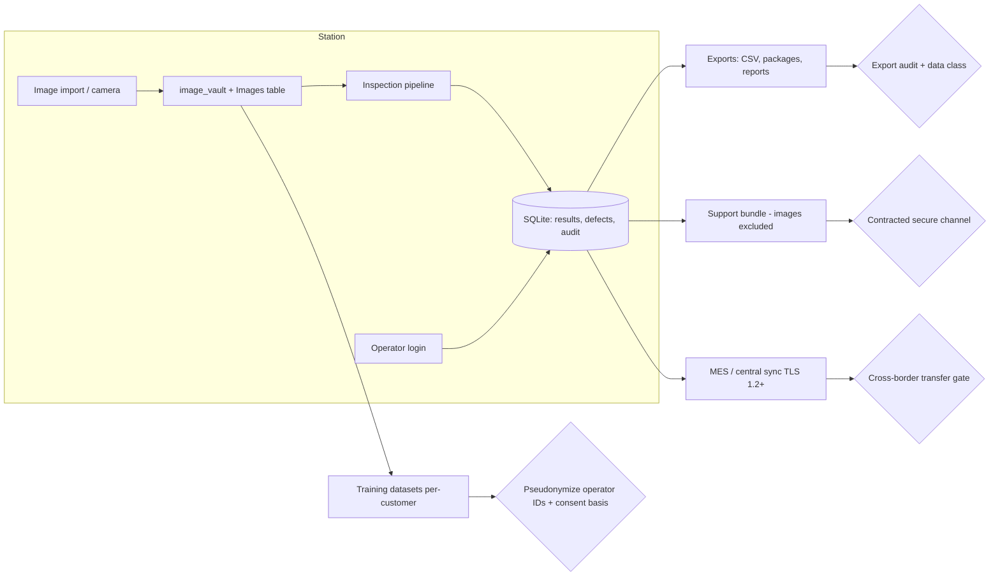
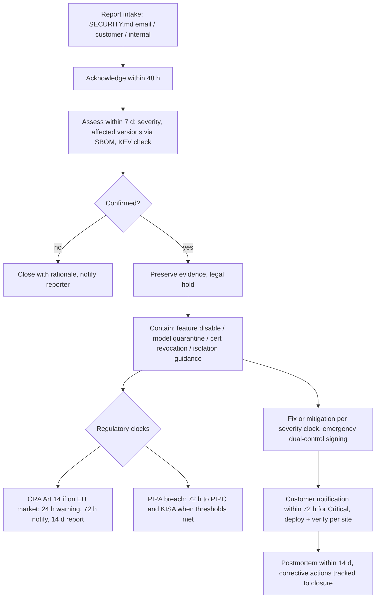

# VOL16 Privacy, Incident Response, and Compliance — AOI Software Architecture, Secure Development, and Change-Control Standard, v1.0 (2026-07-15)

Scope: this volume defines the normative rules for handling customer intellectual property and personal data (§46), for responding to vulnerabilities and security incidents (§54), and for the single authoritative register of which external standards and regulations apply to AOI Monitor, in what capacity, including software licensing (§55).
Supersedes/Related existing docs: related and kept: `Docs/Standards_Traceability_Matrix.md` (its certification-boundary wording is incorporated by reference and made binding by COM-001), `Docs/Database_Schema.md` (its "Data Growth and Retention Boundary" and "Data Handling Warning" sections are converted from documented gaps into PRI requirements), `Docs/Customer_Dataset_Validation_Kit.md` and `Docs/Client_Test_Kit_Guide.md` (customer-data intake procedures — both must be updated to reference §46 handling rules in their next revision). No existing repo document covers incident response, vulnerability disclosure, or licensing; the repository has no `SECURITY.md` (`.github/` contains only CODEOWNERS, a PR template, and workflows) — §54 creates these from zero.

---

## 46. Privacy and Customer Intellectual Property

This section governs every artifact the product stores, transmits, or derives that belongs to a customer or identifies a person. Its boundary with neighbors: §8 (VOL02) owns the asset inventory framework; §27/§28 (VOL07) own the security and identity mechanisms this section relies on; §21/§37 (VOL05) own database and image-storage mechanics; §31 (VOL09) owns training-pipeline controls, which this section constrains with customer-consent and segregation rules; §54 owns breach response once a privacy incident occurs. This section is engineering policy, not legal advice: PIPA, GDPR, and contract determinations require External Legal Counsel (COM catalogue, §55).

Two facts drive everything here. First, a PCB image **is** the customer's product design: component placement, routing visible on the top layers, silkscreen part numbers, and board revisions are competitively sensitive engineering data, and a model trained on those images is a derivative of them. Second, operator identities in the HMI and audit trail are personal information under PIPA Art. 2(1) (identifiers "easily combined" with other data) and under GDPR — the product's user accounts (`{StorageRoot}/local_users.json`), session records (`LocalUserSessions`), and audit rows (`AuditEvents.UserId`, `UserRole`) are all in scope [PIPA; GDPR].

### 46.1 Data classification (Table 46-1)

Every artifact class the product persists is classified below. The classes bind handling: **Customer-IP** artifacts carry the segregation, training-consent, and no-reuse rules; **Personal data** carries PIPA/GDPR duties; **Confidential** carries access-control and export-audit duties. Mixed containers inherit the highest contained class.

| # | Artifact | Where it lives today | Class |
|---|---|---|---|
| 1 | PCB images incl. visible board designs | `{StorageRoot}/image_vault`, `Images` table | Customer-IP / Confidential |
| 2 | Ground-truth labels, validation manifests | `TrainingSamples`, validation CSVs, dataset folders | Customer-IP |
| 3 | Board serials, lot IDs, barcodes | `InspectionResults`, traceability fields | Confidential traceability data |
| 4 | Customer names, plant/site identifiers | contracts, pilot sessions, config | Confidential |
| 5 | Operator identities, user accounts, sessions | `LocalUsers`, `LocalUserSessions`, `AuditEvents` | Personal data (PIPA / GDPR) |
| 6 | Support bundles, crash reports | `exports/crash_reports`, support bundle zips | Mixed → highest contained class |
| 7 | Model weights trained on customer data | `model_registry/models/*`, learned artifacts | Customer-IP derivative |
| 8 | Production results (verdicts, metrics, rates) | `InspectionResults`, acceptance/validation tables | Confidential |
| 9 | Operator performance statistics (if ever built) | not implemented | Personal data + regulatory tripwire |

Notes on the table. Row 3: a serial or barcode alone is not personal information under PIPA Art. 2(1), but it is contractual traceability evidence and stays Confidential. Row 6: `SupportBundleService` already excludes raw customer images and the image vault and records the exclusion in its manifest (`AOI_Monitor/Services/SupportBundleService.cs:324-331`) — PRI-024 freezes that behavior. Row 7: model weights, tolerance maps (`tolerance_map.png`), and learned references (`learned_reference.png`) can memorize and partially reconstruct board appearance; they are treated exactly like the images they were trained on. Row 9 is deliberately listed although unimplemented: operator-performance analytics would trigger PIPA Art. 37-2 (automated decisions), GDPR Art. 35 (DPIA for systematic employee monitoring), and — if used for employment decisions — EU AI Act Annex III point 4 high-risk classification (application date governed by the Digital Omnibus amendment, expected 2027-12-02 — UNVERIFIED pending OJ publication) [AIA]. PRI-025 fences this.

### 46.2 Handling rules and current-state honesty

The classification only matters if handling follows it. Current repo reality, stated plainly: the image vault and SQLite database are plaintext files under a user-writable storage root, which in the development environment sits under a OneDrive-synced profile path (known repo gap — sync/corruption hazard); retention (`RunLogRetention`, `AOI_Monitor/Data/AoiDatabase.Infrastructure.cs:3288-3332`) covers exactly four log tables while the vault, `Images`, and all `ImageLearning*` tables grow unbounded (`Docs/Database_Schema.md:60-70`); MES endpoint validation accepts `http://` (`AOI_Monitor/Services/MesIntegrationSettingsService.cs:83-87`); DPAPI protection uses CurrentUser scope with null entropy, so any same-account process reads every stored secret. The PRI catalogue below converts each of these from "documented boundary" into a requirement with an owner and a verification method.

On deletion, this standard is deliberately honest: file deletion plus database purge is **logical** deletion. On SSD media, wear-leveling and flash translation layers mean overwritten or deleted blocks can persist physically and are not reachable from the application; no application-level overwrite guarantees physical erasure. The product therefore documents deletion as logical (PRI-008) and names full-volume encryption with key destruction (BitLocker, PRI-016) as the only defensible sanitization mechanism for decommissioned stations. Claiming "secure erase" from application code would be false.

### 46.3 Data flows and control points

**Reading this diagram:** Customer images enter through import or (Stage 2+) cameras into the vault and `Images` table, feed the inspection pipeline, and land as results and audit rows in SQLite alongside operator identity from login. Four egress paths exist, and each has exactly one mandatory control point: exports pass the export-audit control (PRI-009: audit event with user, data class, scope, destination); training datasets pass the pseudonymization and consent-basis control (PRI-010, PRI-021) and stay in per-customer trees (PRI-013); support bundles exclude raw images and leave only over the contracted channel (PRI-014, PRI-024); MES and central-sync traffic requires TLS 1.2+ (PRI-015) and, when the destination is in another country, the cross-border transfer gate (PRI-017, PRI-018). No egress path bypasses its control point.

### 46.4 Cross-border transfers

Korea-first deployment makes PIPA the primary regime. Overseas transfer of personal data requires a legal basis under PIPA Arts. 28-8 to 28-11: separate consent, statutory/treaty provision, contract-performance necessity disclosed in the privacy policy, a PIPC-recognized certification, or PIPC equivalence recognition of the destination [PIPA]. Two adequacy facts ease the expected flows: the EU adequacy decision for Korea (2021-12-17) covers EU-plant data supported from Korea under GDPR Art. 45, and the PIPC's reverse equivalence recognition of the EU/EEA (September 2025) eases Korea→EU transfers [GDPR; PIPA]. Onward transfer from the first foreign recipient must meet the same safeguards (Art. 28-11) — this binds any sub-processor (cloud storage, external labeling vendor) in the support chain. Customer-IP that is not personal data is not regulated by PIPA but is regulated by contract: the same transfer register (PRI-017) records both.

### 46.5 Privacy threat analysis (LINDDUN-lite, Table 46-2)

| Threat | Product-specific scenario | Control |
|---|---|---|
| Linking | Audit rows + shift schedule link verdict rates to one operator | PRI-021 pseudonyms; §38 access rules |
| Identifying | Camera FOV captures a worker's face into the vault | PRI-004 FOV verification at commissioning |
| Non-repudiation | Audit trail exposes operator actions beyond quality need | PRI-003 minimization; purpose limit PRI-002 |
| Detecting | Export/file names reveal customer + board project to third parties | PRI-009 audit; PRI-013 segregation |
| Data disclosure | Support bundle or training upload leaks images/design | PRI-012, PRI-014, PRI-024 |
| Unawareness | Operators unaware what the HMI logs about them | PRI-019 RoPA doc enables employer notice |
| Non-compliance | Retention/backup outlives deletion duty; unlawful transfer | PRI-006, PRI-022, PRI-017, PRI-018 |

The table is deliberately scoped to the seven LINDDUN categories with one dominant scenario each; the full privacy analysis is re-run when a new data category is added to Table 46-1 (verification hooks in PRI-001 and PRI-019). The most dangerous residual threat is **Data disclosure via the training path**: engineering machines hold multi-customer datasets, and a single careless upload to a consumer AI tool exfiltrates a customer's board design permanently — hence PRI-011 and PRI-012 are the volume's P0 requirements.

### R: Classification, purpose, and access (PRI-001–PRI-005)

**[PRI-001]** (P1 | ALL | Persistence, ImageStore, Config)
Every persisted artifact type SHALL be assigned exactly one Table 46-1 data class in the machine-readable inventory `Docs/standard/data_classification.json` before the change introducing that artifact type merges.
- Why: unclassified stores silently escape retention, export-audit, and encryption controls; the schema already grew to 60 tables plus a filesystem vault without any classification record. Maps: GDPR (Art 30); PIPA; CSF2 (ID.AM).
- Verify: fitness function FF-PRI-01 (CI script compares SQLite table list and storage-root folders against the inventory file; unknown entries fail). Evidence: CI gate log. Owner: Software Architect. Auto: Fully automated.
- Exception: Not allowed. Review: Per release.

**[PRI-002]** (P2 | ALL | Domain, Export)
Customer-IP and personal data SHALL be processed only for the purposes enumerated in the customer contract's data-processing annex (inspection, quality evidence, contracted support, and contracted training use).
- Why: purpose limitation is the anchor duty of both PIPA and GDPR Art 5(1)(b); an enumerated purpose list makes every new feature's data use reviewable instead of implicit. Maps: GDPR; PIPA; CRA (Annex I 2(g)).
- Verify: PR review checklist item "new data use vs. purpose register" plus the §57/VOL18 data-processing annex template. Evidence: review record in PR. Owner: Product Owner. Auto: Manual review.
- Exception: Allowed — approver: Product Owner. Review: On change.

**[PRI-003]** (P2 | ALL | Persistence, Logging)
The application SHALL NOT collect personal data beyond user-account records, session and audit identity fields, and operator-entered review notes.
- Why: data minimization; every additional personal field expands PIPA/GDPR exposure with no inspection value, and CRA Annex I 2(g) makes minimization a product property. Maps: GDPR (Art 5(1)(c)); PIPA; CRA.
- Verify: FF-PRI-01 inventory diff flags any new personal-data field for review. Evidence: CI gate log + review record. Owner: Data Protection Officer (advisory). Auto: Partially automated.
- Exception: Allowed — approver: Data Protection Officer (advisory). Review: On change.

**[PRI-004]** (P1 | S2+ | Acquisition, CameraAdapter)
Camera fields of view SHALL be configured and verified at commissioning so that no person is identifiable in captured frames, with the verification recorded in the camera acceptance run.
- Why: person-capturing frames pull the entire image store into the PIPA Art 25 fixed-visual-device (CCTV) regime and GDPR; the `CameraAcceptanceRuns` tables are the existing evidence anchor for commissioning checks. Maps: PIPA (Art 25); GDPR.
- Verify: commissioning checklist item in the camera acceptance procedure (§32/VOL10 CAM catalogue) with sample frames attached. Evidence: `CameraAcceptanceRuns` record + signed checklist. Owner: Field Service. Auto: Manual review.
- Exception: Allowed — approver: Data Protection Officer (advisory). Review: On change.

**[PRI-005]** (P2 | ALL | IAM, ImageStore)
Read access to Customer-IP artifacts (images, labels, model weights) through the application SHALL be denied by default and granted only to roles enumerated in the §28 permission matrix (VOL07 IAM catalogue).
- Why: the existing page gate defaults to allow for unknown keys (`AOI_Monitor/Services/RoleAuthorization.cs:41`, `_ => true`) — Customer-IP must not inherit that nonconformity when the gate is inverted. Maps: PIPA (Art 29); GDPR (Art 32); 62443-4-2 CR 2.1.
- Verify: extension of `RoleAuthorizationTests` asserting default-deny for Customer-IP views and export actions. Evidence: test run. Owner: Software Lead. Auto: Fully automated.
- Exception: Not allowed. Review: Per release.

### R: Retention, deletion, and export control (PRI-006–PRI-009)

**[PRI-006]** (P1 | ALL | Persistence, ImageStore, Config)
Data retention SHALL be configurable per data class and per site (range 1–3650 days), covering the image vault, `Images`, and `ImageLearning*` stores and export folders in addition to the four tables `RunLogRetention` purges today.
- Why: SD-02's hardcoded 30-day auto-archive is rejected; vault growth is unbounded (`Docs/Database_Schema.md:60-70`) and deletion obligations are unimplementable while retention covers only 4 of 60 tables. Maps: GDPR (Art 5(1)(e)); PIPA; Internal (SD-02).
- Verify: `LogRetentionTests` extended with vault and image-class retention cases, including the orphan-vault-file sweep. Evidence: test run. Owner: Software Lead. Auto: Fully automated.
- Exception: Allowed — approver: Software Architect. Review: Per release.

**[PRI-007]** (P2 | ALL | Persistence, Config)
A legal-hold mechanism SHALL suspend retention-driven deletion for a named customer or dataset scope, recording the hold reason, the Admin who set it, and the planned release date as an audit event.
- Why: incident forensics (§54) and litigation duties can require preserving data past its retention date; without a hold switch, operators face a choice between violating retention config and destroying evidence. Maps: GDPR (Art 17(3)); Internal.
- Verify: test class `LegalHoldTests` (new) asserting held scopes survive `RunLogRetention`. Evidence: test run + audit rows. Owner: Software Lead. Auto: Fully automated.
- Exception: Not allowed. Review: Annual.

**[PRI-008]** (P2 | ALL | Persistence, ImageStore)
Product documentation SHALL state that deletion is logical (file removal plus database purge), that physical erasure on SSD media is not guaranteed due to wear-leveling, and that full-volume encryption with key destruction (PRI-016) is the sanitization method for decommissioned stations.
- Why: honest deletion semantics prevent false "secure erase" claims to customers and regulators; application-level overwriting cannot defeat flash translation layers. Maps: GDPR (Art 17); Internal.
- Verify: documentation review checklist item against `Docs/Deployment_Package_Guide.md` decommissioning section. Evidence: doc revision. Owner: Security Lead. Auto: Manual review.
- Exception: Not allowed. Review: Annual.

**[PRI-009]** (P1 | ALL | Export, Audit)
Every export of Customer-IP or personal data off the station (CSV, validation packages, reports, support bundles) SHALL record an audit event capturing user, role, data class, record scope, and destination path.
- Why: exports are the primary uncontrolled egress today; `ExportHistory`/`ExportVerification` already exist but do not capture data class or destination, so exfiltration is invisible to audit review. Maps: PIPA (Art 29); GDPR (Art 30); 62443-4-2 CR 2.8.
- Verify: extension of the EXPORT-001 gate (`Scripts/run-quality-gates.ps1`) plus `ExportVerification` schema test asserting the new fields. Evidence: CI gate log + audit rows. Owner: Software Lead. Auto: Fully automated.
- Exception: Not allowed. Review: Per release.

### R: Training use, segregation, and prohibited flows (PRI-010–PRI-014)

**[PRI-010]** (P2 | ALL | Training, ModelMgmt)
Customer images and labels SHALL be used for model training only under a written contract clause or documented customer consent whose reference is recorded in the training dataset's provenance manifest.
- Why: training use is a distinct processing purpose from inspection; an unrecorded basis makes every derived model an IP dispute waiting for the first customer audit. Maps: PIPA; GDPR (Art 6); AI-RMF (MAP).
- Verify: training-pipeline gate rejects datasets whose provenance manifest lacks a consent/contract reference (§31/VOL09 AIM catalogue hook). Evidence: provenance manifest. Owner: ML Lead. Auto: Partially automated.
- Exception: Not allowed. Review: On change.

**[PRI-011]** (P0 | ALL | Training, ModelMgmt)
Datasets, ground-truth labels, and model weights derived from one customer's data SHALL NOT be used to train, fine-tune, calibrate, or evaluate models delivered to any other customer.
- Why: cross-customer reuse leaks board designs through model memorization and comparative metrics — the single most damaging IP breach available to this product; trust here is the commercial foundation of the Korea-first rollout. Maps: Internal; AI-100-2 (privacy attacks); GDPR.
- Verify: fitness function FF-PRI-02 (per-customer dataset ID recorded in every model provenance manifest; the model release gate rejects manifests with mixed or absent customer IDs). Evidence: provenance manifest + CI gate log. Owner: ML Lead. Auto: Partially automated.
- Exception: Not allowed. Review: Per release.

**[PRI-012]** (P0 | ALL | Training, Diagnostics)
Customer images, labels, inspection results, and support-bundle contents SHALL NOT be uploaded to public or consumer AI services (hosted chat assistants, public model-training APIs, or online labeling tools operating without a signed data-processing contract).
- Why: such uploads place Customer-IP in third-party corpora outside any contract, are irreversible, and constitute an unauthorized overseas transfer under PIPA Arts 28-8 to 28-11. Maps: PIPA; GDPR; Internal.
- Verify: signed engineering handling-policy acknowledgment per person per year plus an annual spot audit of engineering machines; the AGENTS.md AI-agent contract carries the same prohibition (§48/VOL17 CHG catalogue). Evidence: signed acknowledgments + audit record. Owner: Security Lead. Auto: Manual review.
- Exception: Not allowed. Review: Annual.

**[PRI-013]** (P2 | ALL | Training, ImageStore)
Customer datasets SHALL be stored in per-customer directory trees keyed by a customer dataset ID that propagates into training runs, model provenance manifests, and acceptance evidence.
- Why: segregation is the mechanism that makes PRI-011 verifiable; commingled folders make cross-customer contamination undetectable after the fact. Maps: Internal; GDPR (Art 32); AI-RMF (MAP).
- Verify: FF-PRI-02 (same fitness function as PRI-011: dataset ID present and single-valued end-to-end). Evidence: CI gate log. Owner: ML Lead. Auto: Partially automated.
- Exception: Not allowed. Review: Per release.

**[PRI-014]** (P2 | ALL | Diagnostics, Export)
Support bundles SHALL be transferred off the station only over a channel agreed in the support contract (customer-approved share or TLS 1.2+ endpoint), never over unencrypted email or consumer file-sharing links.
- Why: bundles are Mixed-class containers (Table 46-1 row 6); an uncontrolled transfer channel defeats every in-product redaction control at the last hop. Maps: PIPA; GDPR (Art 32); CRA (Annex I 2(e)).
- Verify: support-runbook checklist item + per-transfer log entry reviewed quarterly. Evidence: transfer log. Owner: Field Service. Auto: Manual review.
- Exception: Allowed — approver: Security Lead. Review: Quarterly.

### R: Encryption and transfer gates (PRI-015–PRI-018)

**[PRI-015]** (P1 | ALL | MES, REST, Config)
The application SHALL enforce TLS 1.2 or higher on every channel that carries customer data off the station, rejecting endpoint configurations whose scheme is not `https` (`MesIntegrationSettingsService.cs:83-87` accepts `http://` today).
- Why: API keys, Basic credentials, and result payloads currently may transit plaintext on a misconfigured factory network — a known repo nonconformity. Maps: CWE-319; PIPA; GDPR (Art 32); CRA (Annex I 2(e)).
- Verify: `MesRestIntegrationTests` scheme-rejection case (new) + FF-PRI-03 grep gate banning `http://` endpoint defaults in settings services. Evidence: test run + CI gate log. Owner: Software Lead. Auto: Fully automated.
- Exception: Not allowed. Review: Per release.

**[PRI-016]** (P1 | ALL | Installer, ImageStore)
Production stations storing customer images SHALL have full-volume encryption (BitLocker) enabled and verified at installation, with the `manage-bde -status` output archived in the installation record.
- Why: the vault and SQLite database are plaintext files; disk theft or decommissioning without volume encryption exposes every stored board design, and PIPA's safety-measure notification expects at-rest protection commensurate with risk. Maps: PIPA; GDPR (Art 32); CRA (Annex I 2(e)).
- Verify: installation checklist item (§44/VOL15 DEP catalogue). Evidence: archived status output in the installation record. Owner: Field Service. Auto: Manual review.
- Exception: Allowed — approver: Security Lead. Review: On change.

**[PRI-017]** (P1 | ALL | Export, Training)
Personal data and Customer-IP SHALL NOT leave the deployment country until a transfer basis (for personal data: PIPA Arts 28-8 to 28-11 — consent, statutory provision, contract necessity, certification, or PIPC equivalence; for Customer-IP: a contract clause) is recorded in the transfer register.
- Why: overseas transfer is a regulated act with PIPC suspension powers (Art 28-9); an unrecorded transfer to a global HQ or cloud training environment is both a legal violation and a contract breach. Maps: PIPA (Arts 28-8 to 28-11); GDPR.
- Verify: transfer register reviewed before first activation of any cross-border support or training flow. Evidence: transfer register entry. Owner: Data Protection Officer (advisory). Auto: Manual review.
- Exception: Not allowed. Review: On change.

**[PRI-018]** (P2 | ALL | Export, Training)
For EU deployments, any transfer of personal data out of the EU/EEA SHALL be reviewed against GDPR Chapter V before commissioning, applying the EU→Korea adequacy decision (2021-12-17) for vendor remote support performed from Korea.
- Why: EU-plant operator data supported from Korea is a Chapter V transfer; adequacy makes it lawful without SCCs, but the determination must be recorded per deployment, not assumed. Maps: GDPR (Ch V, Art 45); PIPA.
- Verify: per-deployment transfer review record signed by counsel. Evidence: review record. Owner: External Legal Counsel. Auto: External assessment.
- Exception: Not allowed. Review: On change.

### R: Transparency, pseudonymization, and lifecycle consistency (PRI-019–PRI-025)

**[PRI-019]** (P2 | ALL | Domain, Config)
The product SHALL ship a records-of-processing (RoPA-style) document enumerating every personal-data field, its purpose, storage location, retention default, and recipients, updated with each release.
- Why: the deployer (factory) owes operators transparency under GDPR Arts 13/14 and PIPA Art 30; they cannot write an accurate notice unless the vendor documents what the product records. Maps: GDPR (Art 30); PIPA (Art 30).
- Verify: release checklist item; document diffed against `data_classification.json` (FF-PRI-01 output) per release. Evidence: shipped document. Owner: Data Protection Officer (advisory). Auto: Partially automated.
- Exception: Not allowed. Review: Per release.

**[PRI-020]** (P2 | ALL | Diagnostics, Config)
Any feature that transmits usage or telemetry data off the station SHALL pass a recorded privacy review before release and default to off, activating only on explicit customer opt-in or contract clause (D-09 baseline: no third-party telemetry).
- Why: silent telemetry from a factory floor is both a PIPA violation waiting to happen and a trust-destroying discovery during customer network monitoring. Maps: GDPR (Art 25); PIPA; CRA (Annex I 2(g)); Internal (D-09).
- Verify: privacy-review record attached to the feature PR; FF-PRI-03 network-endpoint inventory diff. Evidence: review record + CI gate log. Owner: Data Protection Officer (advisory). Auto: Partially automated.
- Exception: Not allowed. Review: On change.

**[PRI-021]** (P2 | ALL | Training, Export)
Operator identifiers SHALL be replaced by per-site pseudonyms before inclusion in training datasets, cross-site analytics, or non-support exports, with the re-identification key held by the customer's IT Admin and never shipped to the vendor.
- Why: PIPA Art 28-2 permits pseudonymized processing for statistics/research without consent — pseudonymizing at the boundary converts a consent problem into an engineering step; support exports that contractually require identity are the recorded exception path. Maps: PIPA (Art 28-2); GDPR (Art 25).
- Verify: export-pipeline test asserting no raw `UserId` values in training and analytics CSVs. Evidence: test run. Owner: ML Lead. Auto: Fully automated.
- Exception: Allowed — approver: Data Protection Officer (advisory). Review: On change.

**[PRI-022]** (P2 | ALL | Persistence, Config)
Backup retention SHALL be configured so that no backup copy of a deleted record outlives that record's retention class by more than 90 days, and the deletion documentation states this window.
- Why: deletion duties (GDPR Art 17, PIPA) extend to backups; an unbounded backup shelf silently voids every retention promise made to the customer. The 90-day window is ASSUMPTION A-VOL16-4. Maps: GDPR (Art 17); PIPA.
- Verify: backup-policy configuration review against `ConfigurationBackupService` and site backup settings. Evidence: reviewed policy record. Owner: IT Admin (customer). Auto: Manual review.
- Exception: Allowed — approver: Data Protection Officer (advisory). Review: Annual.

**[PRI-023]** (P1 | ALL | Audit, Diagnostics)
Upon a confirmed breach involving personal data, the incident process SHALL produce a notification decision within 24 hours of confirmation that applies the PIPA rule (report to PIPC/KISA and notify subjects within 72 hours when thresholds are met: ≥1,000 subjects, sensitive data, or hacking-caused) and the GDPR Art 33 rule (supervisory authority within 72 hours) using §54 timeline evidence.
- Why: 72-hour clocks are unmeetable without a pre-built decision step; the vendor/customer controller-processor split (OD-VOL16-1) determines who files, and that must be decided per contract before the first incident. Maps: PIPA; GDPR (Arts 33/34); CRA (Art 14 alignment).
- Verify: annual incident tabletop exercise executing the breach-notification template (§57/VOL18). Evidence: tabletop record. Owner: Security Lead. Auto: Manual review.
- Exception: Not allowed. Review: Annual.

**[PRI-024]** (P3 | ALL | Diagnostics)
Support bundles and crash reports SHALL continue to exclude raw customer images and the image vault, carrying the exclusion statement in the bundle manifest.
- Why: freezes the existing correct behavior (`SupportBundleService.cs:324-331` manifest `ExcludedData`) against regression; bundles routinely leave the customer's control. Maps: GDPR (Art 5(1)(c)); PIPA; Internal.
- Verify: existing `SupportBundleServiceTests` exclusion cases. Evidence: test run. Owner: Software Lead. Auto: Fully automated.
- Exception: Not allowed. Review: Per release.

**[PRI-025]** (P2 | ALL | HMI, IAM)
The application SHALL NOT make fully automated decisions that affect an operator's rights or duties (automatic account lockout with no appeal path, performance scoring used for discipline or task allocation) without a human re-review step and a documented explanation path.
- Why: PIPA Art 37-2 grants refusal/explanation rights against fully automated decisions; operator-performance scoring for employment decisions is additionally the EU AI Act Annex III point 4 high-risk tripwire (COM-008) — this requirement keeps the product on the minimal-risk side. Maps: PIPA (Art 37-2); AIA; GDPR (Art 22).
- Verify: feature-review checklist item; no such feature exists today, so the check is a design gate on future work. Evidence: review record. Owner: Product Owner. Auto: Manual review.
- Exception: Not allowed. Review: On change.

---

## 54. Incident Response and Vulnerability Handling

This section governs what happens when the product is — or may be — compromised or defective in a security-relevant way: intake of vulnerability reports, triage, severity scoring, containment, model and certificate revocation, emergency updates, regulatory and customer notification, forensics, root-cause analysis, and support timelines. Boundaries: §42/§43 (VOL15 SUP/BLD/RELS catalogues) own the build, signing, and update mechanics this section invokes under time pressure; §38 (VOL13 OBS catalogue) owns the audit and logging evidence this section consumes; §50 (VOL17 CHG catalogue) owns the emergency-hotfix change-control path that every fix produced here must travel; §46 supplies the data classes that decide whether an incident is also a privacy breach.

Current state, stated plainly: the project has **no** incident-response capability. There is no `SECURITY.md`, no published contact, no disclosure policy, no severity model, no notification templates, and the CI/branch-protection posture is advisory (known repo gap: no enforced branch protection, tag-pinned actions, no `permissions:` blocks). The solo-team reality (§7/VOL01) applies: one person may hold several roles below, recording role-hats, and P0/P1 approvals use the documented self-review compensating control where a second person is unavailable.

### 54.1 Severity model (Table 54-1)

Severity is CVSS v4.0 base scoring adjusted by two recorded modifiers — neither optional:

| Severity | CVSS v4.0 base | Escalators (either forces the higher severity) |
|---|---|---|
| Critical | 9.0–10.0 | listed in CISA KEV; exploitation observed in the field |
| High | 7.0–8.9 | public PoC exists; reachable from plant network without authentication |
| Medium | 4.0–6.9 | requires local access or authenticated user |
| Low | 0.1–3.9 | requires physical access or Admin-equivalent preconditions |

Deployment exposure class de-escalates at most one level and only with recorded rationale: `air-gapped` (Stage 1, no NICs active), `plant-network` (Stage 2–3), `MES-connected` (Stage 4). A KEV-listed component vulnerability is Critical regardless of computed base score (IR-006). Severity drives the IR-021 fix clocks and the IR-014 notification clock.

### 54.2 Process and timeline

**Reading this diagram:** A report from any channel (the published `SECURITY.md` mailbox, a customer, or internal detection) is acknowledged within 48 hours and assessed within 7 days — assessment includes SBOM lookup of affected shipped versions and a CISA KEV check. Unconfirmed reports close with a written rationale to the reporter. Confirmed ones fork into three parallel tracks: evidence preservation under legal hold (before any remediation touches the station), containment (feature disable, model quarantine with forced rollback, certificate revocation, or network-isolation guidance to the customer), and the regulatory clocks — CRA Article 14 timelines when the product is on the EU market, PIPA's 72-hour breach report when personal-data thresholds are met. The fix travels the emergency-signing path under dual control, customers receive Critical advisories within 72 hours of confirmation, deployment is verified per site, and the incident closes only after a postmortem within 14 days whose corrective actions are tracked to verified closure.

### 54.3 Regulatory notification register

The register below states each regime's trigger and clock. Legal ownership of the filing (vendor vs. customer) is contract-dependent (OD-VOL16-1).

| Regime | Trigger | Clock | Channel |
|---|---|---|---|
| CRA Art 14 [CRA] | actively exploited vulnerability; severe incident | 24 h early warning / 72 h notify / 14 d report (incident: 1 month) | ENISA single reporting platform + CSIRT |
| PIPA [PIPA] | personal-data breach: ≥1,000 subjects, sensitive data, or hacking | 72 h report + subject notice | PIPC / KISA |
| GDPR Arts 33/34 [GDPR] | personal-data breach (EU deployments) | 72 h to supervisory authority | per-deployment authority |
| K-AI Act [K-AI] | none for non-high-impact AI; corrective orders possible (Arts 40/43) | per order | MSIT |

**CRA Article 14 applies from 2026-09-11 — two months after this document's date** — and applies to products already on the EU market at that date [CRA]. AOI Monitor is not on the EU market today, so no legal duty is live yet; the readiness obligation, however, is **now**: the roadmap targets EU entry (`Docs/Roadmap_and_Stages.md`), and a 24-hour early-warning capability cannot be improvised after the first exploited vulnerability. IR-012 therefore requires the process to be exercised before 2026-09-11. Full CRA application (essential requirements, CE marking, SBOM, support period) follows on 2027-12-11; the product's conformity route is default-class Module A self-assessment per Implementing Regulation (EU) 2025/2392 — owned by the COM catalogue (COM-005). The K-AI Framework Act (in force 2026-01-22, enforcement grace during 2026) imposes no incident-notification duty on a non-high-impact industrial classifier; its Art. 33(1) self-review duty is owned by COM-009.

### 54.4 Containment and revocation mechanics

Containment options must exist before they are needed. The catalogue (IR-008) maps every remotely reachable or integrity-critical feature to its off-switch: MES/central-sync disable (fail-closed config per D-10), model quarantine and forced rollback (IR-009 — the rollback target chain is: last non-revoked accepted model → `pixel-difference` baseline engine with forced REVIEW verdicts, reusing the `RetireModel` reset path in `ModelLifecycleService.cs:160`), update-signing certificate revocation via a signed revocation list that distributes offline (IR-010), and written network-isolation guidance the customer's IT Admin can execute without vendor access. Model revocation exists because the repo's own analysis shows model hashes are computed at registration but never re-verified at load (`OnnxInspectionEngine.cs:59` opens a fresh session per call without hash check) — until VOL09's load-time verification lands, revocation plus rollback is the only lever against a swapped model file.

### R: Intake, disclosure, and triage (IR-001–IR-007)

**[IR-001]** (P1 | ALL | All)
The project SHALL publish a security contact and intake channel as `SECURITY.md` at the repository root and in customer-facing release notes, naming a monitored mailbox and the IR-003/IR-004 response commitments.
- Why: no `SECURITY.md` or contact exists today; CRA Part II requires a contact point for vulnerability reports, and reporters who find no channel go public instead. Maps: CRA (Annex I Part II); SSDF-RV.1; SBD.
- Verify: fitness function FF-IR-01 (repo check: `SECURITY.md` present with contact, scope, SLA, and safe-harbor fields). Evidence: CI gate log. Owner: Security Lead. Auto: Fully automated.
- Exception: Not allowed. Review: Annual.

**[IR-002]** (P2 | ALL | All)
The disclosure policy in `SECURITY.md` SHALL grant good-faith researchers safe harbor (a written commitment not to pursue legal action for testing within the stated scope) and commit to coordinated disclosure with a default 90-day publication window.
- Why: safe-harbor wording is what converts hostile disclosure into cooperative disclosure; without it, the rational reporter sells or dumps the finding. Maps: CRA; SBD; SSDF-RV.1.
- Verify: FF-IR-01 field check + annual policy review by counsel. Evidence: CI gate log + review record. Owner: Security Lead. Auto: Partially automated.
- Exception: Allowed — approver: External Legal Counsel. Review: Annual.

**[IR-003]** (P2 | ALL | All)
Every vulnerability report SHALL be acknowledged to the reporter within 48 hours of receipt.
- Why: the acknowledgment clock is the reporter's only early signal that coordinated disclosure is worth their patience; missed acknowledgments are the most common trigger for early publication. Maps: CRA; SSDF-RV.1.
- Verify: intake-log timestamps sampled quarterly against mailbox receipt times. Evidence: intake log. Owner: Security Lead. Auto: Manual review.
- Exception: Not allowed. Review: Quarterly.

**[IR-004]** (P2 | ALL | All)
Every acknowledged report SHALL receive a completed triage assessment (validity, severity per Table 54-1, affected versions, exploitability) within 7 days of receipt.
- Why: a bounded assessment window forces prioritization decisions onto evidence instead of backlog order; 7 days is the ceiling, not the target, for Critical candidates. Maps: CRA; SSDF-RV.2.
- Verify: intake-log assessment timestamps sampled quarterly. Evidence: triage records. Owner: Security Lead. Auto: Manual review.
- Exception: Allowed — approver: Product Owner. Review: Quarterly.

**[IR-005]** (P2 | ALL | All)
Each confirmed vulnerability SHALL be scored with CVSS v4.0 and adjusted by the two Table 54-1 modifiers — active-exploitation status and deployment exposure class — with all three values recorded in the triage record.
- Why: base score alone misranks OT reality: an air-gapped Stage 1 station and an MES-connected Stage 4 line have different effective exposure, and exploited-in-the-wild findings outrank spec-sheet severity. Maps: KEV; SSDF-RV.2; 62443-4-1.
- Verify: triage-record template fields (§57/VOL18) reviewed per incident. Evidence: triage records. Owner: Security Lead. Auto: Manual review.
- Exception: Not allowed. Review: Annual.

**[IR-006]** (P2 | ALL | All)
Triage SHALL include a CISA KEV catalog check for every affected first- and third-party component, with a KEV listing forcing Critical handling regardless of computed CVSS score.
- Why: KEV listing means proven in-the-wild exploitation — a stronger must-act signal than any modeled score; the 2025 KEV analysis is dominated by exactly the weakness classes this stack carries (deserialization, missing authentication, path traversal). Maps: KEV; CWE-T25.
- Verify: triage-record KEV field + quarterly spot check against the KEV feed. Evidence: triage records. Owner: Security Lead. Auto: Partially automated.
- Exception: Not allowed. Review: Quarterly.

**[IR-007]** (P2 | ALL | All)
Every confirmed vulnerability SHALL receive a written customer impact analysis covering deployed sites, affected data classes (Table 46-1), inspection-integrity impact, and safety-observation relevance (D-18 status channel).
- Why: the same CVE can be cosmetic on one site and quality-evidence-corrupting on another; notification and containment decisions are indefensible without a per-customer impact statement. Maps: CRA; CSF2 (RS.AN); Internal (D-18).
- Verify: impact-analysis section of the triage template completed per confirmed finding. Evidence: triage records. Owner: Product Owner. Auto: Manual review.
- Exception: Not allowed. Review: Annual.

### R: Containment, revocation, and emergency release (IR-008–IR-011)

**[IR-008]** (P2 | ALL | Update, ModelMgmt, MES)
Release documentation SHALL include a containment catalogue mapping every remotely reachable or integrity-critical feature to its disable switch, revocation mechanism, or customer-executable isolation step.
- Why: containment invented mid-incident is guesswork; the catalogue is the difference between "disable MES sync via config X, fail-closed" and hours of code archaeology under a 24-hour CRA clock. Maps: CRA (Art 14); 62443-3-3 SR 5.1; CSF2 (RS.MI).
- Verify: release checklist item; catalogue diffed against the FF-PRI-03 network-endpoint inventory. Evidence: shipped catalogue. Owner: Software Architect. Auto: Partially automated.
- Exception: Not allowed. Review: Per release.

**[IR-009]** (P1 | ALL | ModelMgmt, Inference)
Upon revocation of a deployed model, the application SHALL quarantine the revoked model (blocked from activation and from loading) and roll back to the last non-revoked accepted model — or to the `pixel-difference` baseline engine with forced REVIEW verdicts when none exists — before the next inspection cycle starts.
- Why: a tampered or defective model silently emits false accepts; hashes are not re-verified at load today (`OnnxInspectionEngine.cs:59`), so revocation plus forced rollback is the containment lever; the `RetireModel` reset path (`ModelLifecycleService.cs:160`) is the existing seam to extend. Maps: AI-100-2; CRA; Internal (D-03).
- Verify: test class `ModelRevocationTests` (new): revoked model cannot activate, rollback target selection, REVIEW-only fallback. Evidence: test run. Owner: ML Lead. Auto: Fully automated.
- Exception: Not allowed. Review: Per release.

**[IR-010]** (P1 | ALL | Update, Config)
The update client SHALL reject any artifact signed by a certificate listed in the product's signed revocation list, which is distributable and installable independently of full update packages, including on offline stations.
- Why: a leaked signing key otherwise turns the update channel (D-12) into a malware distribution channel with no recall path on air-gapped sites. Maps: Internal (D-12); CRA; CWE-347.
- Verify: update-client test suite revocation cases (§43/VOL15 RELS catalogue hook). Evidence: test run. Owner: Release Manager. Auto: Fully automated.
- Exception: Not allowed. Review: Per release.

**[IR-011]** (P0 | ALL | Build, Update)
Emergency releases SHALL be signed under the same key-custody controls as scheduled releases — hardware-token/HSM keys with two-person control, or the §7/VOL01 solo-mode compensating control (recorded role-hat plus a minimum 2-hour cooling period before distribution) — with no bypass signing path.
- Why: incident pressure is exactly when an attacker-induced "emergency" extracts a signature from a weakened process; a bypass path once used becomes the de facto process. Maps: Internal (D-12); SLSA; 62443-4-1.
- Verify: signing-log review for every emergency release; keys verifiably absent from developer machines and ordinary CI runners. Evidence: signing log + key-custody record. Owner: Release Manager. Auto: Manual review.
- Exception: Not allowed. Review: Per release.

### R: Notification and regulatory clocks (IR-012–IR-014)

**[IR-012]** (P1 | ALL | All)
Before 2026-09-11, the incident process SHALL be exercised end-to-end against the CRA Article 14 timeline — early warning within 24 hours, vulnerability notification within 72 hours, final report within 14 days (severe incident report within 1 month) — including a dry-run of the ENISA single-reporting-platform submission workflow.
- Why: Article 14 applies from 2026-09-11 (two months after this document's date) to products already on the EU market; the product is Korea-only today, but EU entry is on the roadmap and a 24-hour capability cannot be built during the first exploited vulnerability. Maps: CRA (Art 14).
- Verify: tabletop exercise record with timestamped simulated filings. Evidence: exercise record. Owner: Security Lead. Auto: Manual review.
- Exception: Allowed — approver: Product Owner. Review: Annual.

**[IR-013]** (P1 | ALL | All)
Upon a personal-data breach meeting PIPA thresholds (≥1,000 affected subjects, sensitive information, or hacking-caused), the responsible party under the support contract SHALL report to PIPC/KISA and notify affected data subjects within 72 hours.
- Why: PIPA's 72-hour clock and the ~Aug 2026 penalty escalation (administrative surcharge up to 3% of total revenue; a rise toward 10% for aggravated large-scale cases is UNVERIFIED — confirm with External Legal Counsel) make missed notification an existential business risk; the vendor/customer filing split is OD-VOL16-1. Maps: PIPA; GDPR (alignment).
- Verify: breach-notification template (§57/VOL18) exercised in the annual tabletop (PRI-023). Evidence: tabletop record. Owner: Security Lead. Auto: Manual review.
- Exception: Not allowed. Review: Annual.

**[IR-014]** (P2 | ALL | All)
Customer notification for Critical vulnerabilities SHALL be sent within 72 hours of confirmation using the pre-approved bilingual (EN/KR) templates for vulnerability advisory, breach notice, and emergency-update instruction (§57/VOL18).
- Why: drafting customer language mid-incident produces overclaims or underclaims; pre-approved templates keep notifications consistent with the COM-001 claim discipline under pressure. Maps: CRA; PIPA; Internal.
- Verify: template existence check (FF-IR-01) + per-incident send timestamps. Evidence: notification log. Owner: Product Owner. Auto: Partially automated.
- Exception: Allowed — approver: Product Owner. Review: Annual.

### R: Evidence, root cause, and closure (IR-015–IR-020)

**[IR-015]** (P2 | ALL | Audit, Diagnostics)
Before any remediation modifies an affected station, the responder SHALL capture a hashed forensic evidence set — relevant logs, the audit-trail segment, a support bundle, and the affected artifacts with SHA-256 digests — and place it under legal hold (PRI-007).
- Why: remediation destroys evidence; without a preserved set, root cause and regulatory reports degrade to speculation, and the existing SHA-256 discipline (`HashUtil.ComputeSha256` call sites) makes hashing cheap. Maps: CSF2 (RS.AN); SSDF-RV.3; Internal.
- Verify: incident-runbook step with evidence-set manifest per incident. Evidence: evidence-set manifest. Owner: Security Lead. Auto: Manual review.
- Exception: Allowed — approver: Security Lead. Review: Annual.

**[IR-016]** (P2 | ALL | All)
Every Critical or High incident SHALL conclude with a written postmortem using the §57/VOL18 template within 14 days of closure, identifying root cause, detection gap, and at least one preventive change.
- Why: SSDF RV.3 exists because unanalyzed incidents recur; the mandatory template forces the "why was this not caught" question that ad-hoc write-ups skip. Maps: SSDF-RV.3; CSF2 (RC.IM).
- Verify: postmortem document per qualifying incident, reviewed at the next release gate. Evidence: postmortem record. Owner: Software Architect. Auto: Manual review.
- Exception: Not allowed. Review: Per release.

**[IR-017]** (P2 | ALL | CI)
Postmortem corrective actions SHALL be tracked as repository issues with a named owner and due date and verified closed before the next release's gate report.
- Why: corrective actions without tracked closure are apologies, not fixes; tying closure to the release gate makes evasion visible. Maps: SSDF-RV.3; 62443-4-1.
- Verify: fitness function FF-IR-02 (release gate cross-checks open postmortem-labeled issues). Evidence: CI gate log. Owner: QA Lead. Auto: Partially automated.
- Exception: Allowed — approver: Product Owner. Review: Per release.

**[IR-018]** (P2 | ALL | Build, CI)
For every confirmed third-party vulnerability, affected shipped versions SHALL be identified by querying the per-release CycloneDX SBOM archive (§42/VOL15 SUP catalogue), not by memory or ad-hoc source inspection.
- Why: "which customers run the vulnerable ONNX Runtime" must be answerable in minutes under the CRA 24-hour clock; no SBOM exists today (repo gap), so this requirement consumes the SUP catalogue's generation obligation. Maps: SBOM-MIN; CDX; SSDF-RV.1.
- Verify: triage-record field citing the SBOM query result. Evidence: triage records. Owner: Release Manager. Auto: Partially automated.
- Exception: Not allowed. Review: Per release.

**[IR-019]** (P2 | ALL | Update, Diagnostics)
Deployment of a security fix SHALL be confirmed per site by recording installed version and artifact hash in the fleet record within the applicable IR-021 window, with unreachable sites escalated to Field Service.
- Why: a fix that ships but never installs protects nobody; offline/air-gapped stations (D-08) make silent non-deployment the default failure mode. Maps: CRA (Annex I Part II); SSDF-RV.2.
- Verify: fleet-record completeness check per advisory. Evidence: fleet record. Owner: Field Service. Auto: Partially automated.
- Exception: Allowed — approver: Product Owner. Review: Per release.

**[IR-020]** (P3 | ALL | All)
After each incident closure, a post-incident review SHOULD evaluate SLA adherence and containment effectiveness and feed resulting changes to this section through the §53 exception-and-change process (VOL17).
- Why: the process itself is a product; timeline misses found in review are cheaper than timeline misses found by a regulator. Maps: CSF2 (RC.IM); SSDF-RV.3.
- Verify: review minutes attached to the postmortem record. Evidence: review minutes. Owner: Product Owner. Auto: Manual review.
- Exception: Allowed — approver: Product Owner. Review: Annual.

### R: Support timelines and end of support (IR-021–IR-022)

**[IR-021]** (P1 | ALL | Update)
For supported versions, a fix or documented mitigation SHALL be available within 7 days for Critical, 30 days for High, 90 days for Medium, and by the next scheduled release for Low severity.
- Why: bounded remediation clocks are the substance behind any "we take security seriously" claim and the operational core of CRA's "address and remediate without delay" duty. Maps: CRA (Annex I Part II); SSDF-RV.2; KEV.
- Verify: advisory-to-availability timestamps per finding, reviewed at release gate. Evidence: advisory log. Owner: Release Manager. Auto: Partially automated.
- Exception: Allowed — approver: Product Owner. Review: Per release.

**[IR-022]** (P2 | ALL | Update)
Security fixes SHALL be provided for every shipped version until its published end-of-support date, which is announced in release notes at least 6 months before it takes effect.
- Why: CRA expects a stated support period (≥5 years unless a shorter product lifetime is documented); silent end-of-support strands factory stations that cannot upgrade mid-production-cycle. Maps: CRA (Annex I Part II); NET-LC; WIN-LC.
- Verify: supported-versions table in each release's notes, checked by the release gate. Evidence: release notes. Owner: Release Manager. Auto: Partially automated.
- Exception: Allowed — approver: Product Owner. Review: Per release.

---

## 55. Compliance and Standards Applicability Matrix

This section is the single register of every external standard, regulation, and lifecycle policy the product tracks: what applies, in what capacity, at which stages, who owns it, and where this standard addresses it. It exists so that applicability decisions are recorded facts with owners, not tribal knowledge. Boundaries: the topical volumes own the requirements that implement each row; VOL19 §60 owns full bibliographic entries; this section owns the applicability verdicts and the licensing rules (§55.9).

Two honesty rules govern the matrix. **First**, legal determinations are provisional until confirmed: whether CRA classification, Machinery Regulation applicability, EU AI Act classification, and the PIPA controller/processor split hold as stated requires External Legal Counsel (COM-003) — this document records the engineering team's reasoned position, not legal advice. **Second**, safety-standard applicability (ISO 12100, 13849-1, 10218-1/-2, 13850, IEC 62061, 60204-1) is determined by a certified functional-safety engineer through the machine builder's risk assessment (COM-004); the software is non-safety-rated by decision D-18 and this team is not qualified to declare safety conformity. One fact in the matrix carries an explicit **UNVERIFIED** marker: the EU AI Act Digital Omnibus amendment (quality-control carve-out, revised high-risk dates) is politically adopted (Council final approval 2026-06-29) but its OJ publication and final text were unconfirmed as of 2026-07-15 [AIA] — COM-014 blocks claims built on it.

Legend — Class: **RL** = Required by law (named market); **RC** = Required by contract (when invoked); **RB** = Recommended baseline (adopted via this standard's mappings); **PA** = Potentially applicable pending professional assessment. Status: **aligned** / **gap** / **assessment-needed** (statuses reflect the repo as analyzed 2026-07-15). Where: section owning the implementing requirements.

### 55.1 Secure development and application security

| Standard (edition) | Class | Stages | Owner | Status | Where |
|---|---|---|---|---|---|
| NIST SP 800-218 SSDF v1.1 (v1.2 is draft) [SSDF] | RB | ALL | Security Lead | gap | §2/VOL01, §48–53/VOL17 |
| NIST CSF 2.0 [CSF2] | RB | ALL | Product Owner | gap | §2/VOL01, §54 |
| OWASP ASVS 5.0.0 (2025-05-30) [ASVS-Vx] | RB | ALL | Security Lead | gap | §27–30/VOL07–08, §22/VOL05 |
| CWE Top 25, 2025 ed. [CWE-T25] | RB | ALL | Software Lead | gap | §23/VOL06, §29/VOL08 |
| CISA KEV CWE Top 10, 2025 (pub. 2026-01-27) [KEV] | RB | ALL | Security Lead | gap | §27/VOL07, §54 |

Status rationale: the codebase has real strengths (parameterized SQL throughout, no BinaryFormatter, PBKDF2-600k) but CI is advisory, coverage is uncollected, SBOM/signing are absent, and default-allow authorization survives — every row is a governed gap with migration obligations in the owning volumes, not an alignment claim.

### 55.2 OT/ICS security (IEC 62443 family)

| Standard (edition) | Class | Stages | Owner | Status | Where |
|---|---|---|---|---|---|
| IEC 62443-4-1:2018 [62443-4-1] | RC/RB | ALL | Security Lead | gap | §48–53/VOL17, §54 |
| IEC 62443-4-2:2019+COR1 [62443-4-2] | RC/RB | S2+ | Security Lead | gap | §27–28/VOL07, §38/VOL13 |
| IEC 62443-3-3:2013+COR1 [62443-3-3] | PA (site-level) | S3–S4 | IT Admin (customer) | assessment-needed | §13/VOL03, §34–35/VOL11 |
| IEC 62443-3-2:2020 [62443-3-2] | PA | S2+ | Security Lead | assessment-needed | §13/VOL03, COM-017 |

62443-3-2 zone-and-conduit risk assessment is a per-site activity that sets SL-T values; until one exists for a reference deployment, no SL claim of any level is made (COM-017).

### 55.3 AI security and quality

| Standard (edition) | Class | Stages | Owner | Status | Where |
|---|---|---|---|---|---|
| NIST AI RMF 1.0 (revision underway) [AI-RMF] | RB | ALL | ML Lead | gap | §31/VOL09 |
| NIST AI 100-2 E2025 (Mar 2025) [AI-100-2] | RB | ALL | ML Lead | gap | §31/VOL09 |
| OWASP AISVS 1.0 (2026-06-24; C8/C9/C10 N/A to CV) [AISVS] | RB | ALL | ML Lead | gap | §31/VOL09 |
| OWASP AI Testing Guide 1.0 (2025-11-26) [AITG] | RB | ALL | QA Lead | gap | §39/VOL14, §31/VOL09 |

The OWASP ML Top 10 (2023 v0.3 draft) and MLSVS (no published content) are deliberately absent: neither is a citable requirements source.

### 55.4 Supply chain and SBOM

| Standard (edition) | Class | Stages | Owner | Status | Where |
|---|---|---|---|---|---|
| SLSA v1.2 (2025-11-24; Source track normative) [SLSA] | RB | ALL | Release Manager | gap | §42–43/VOL15 |
| SBOM minimum elements (NTIA 2021; CISA 2025 update DRAFT) [SBOM-MIN] | RB now; RL via CRA 2027-12-11 | ALL | Release Manager | gap | §42/VOL15 |
| CISA/G7 SBOM for AI, 1st ed. (June 2026) [SBOM-MIN] | RB | ALL | ML Lead | gap | §31/VOL09, §42/VOL15 |
| SPDX 3.0.1 (ISO/IEC 5962 codifies 2.2.1) [SPDX] | RB | ALL | Release Manager | gap | §42/VOL15 |
| CycloneDX 1.7.1 (pinned schema for ML-BOM) [CDX] | RB | ALL | Release Manager | gap | §42/VOL15 |

No SBOM is generated today (zero hits in `Scripts/publish.ps1` and workflows); Korea's public-sector SBOM mandate (institutionalization announced for ~2027) upgrades this row to conditionally required if public-sector procurement ever occurs.

### 55.5 Machinery safety (Stage 3 cell — all rows gated on professional assessment)

| Standard (edition) | Class | Stages | Owner | Status | Where |
|---|---|---|---|---|---|
| ISO 12100:2010 [12100] | PA (machine builder RL-adjacent) | S3 | Controls & Safety Engineer | assessment-needed | §34/VOL11, COM-004 |
| ISO 13849-1:2023 [13849-1] | PA | S3 | External Safety Assessor | assessment-needed | §34/VOL11 |
| ISO 10218-1:2025 / 10218-2:2025 [10218-1; 10218-2] | PA | S3 | External Safety Assessor | assessment-needed | §34/VOL11 |
| ISO 13850:2015 (e-stop, stop cat 0/1) [13850] | PA | S3 | Controls & Safety Engineer | assessment-needed | §34/VOL11 |
| IEC 62061:2021+A1:2024 [62061] | PA | S3 | External Safety Assessor | assessment-needed | §34/VOL11 |
| IEC 60204-1:2016+A1:2021 [60204-1] | PA | S3 | Controls & Safety Engineer | assessment-needed | §34/VOL11 |

Per D-18, the application only observes safety status; these standards bind the cell's independent safety chain, designed and verified by qualified safety engineering. EN ISO 10218:2025 was not yet OJ-cited as of 2026-07-15: design targets the 2025 editions, and the declaration cites whatever is OJ-listed at build time.

### 55.6 Electronics industry and factory protocols

| Standard (edition) | Class | Stages | Owner | Status | Where |
|---|---|---|---|---|---|
| IPC-A-610J (Mar 2024; 3 dispositions) [IPC-610] | RC | ALL | Product Owner | gap | §31/VOL09 taxonomy, COM-012 |
| J-STD-001J (Mar 2024) + JA automotive addendum (Sep 2025) [JSTD-001] | RC | ALL | Product Owner | gap | §18/VOL04, COM-012 |
| IPC-2591 CFX v2.0 (Feb 2025; v2.1 UNVERIFIED) [CFX] | RC | S4 | Software Architect | gap | §35/VOL11, §22/VOL05 |
| IPC-HERMES-9852 v1.6 (2024) [HERMES] | RC | S2–S3 | Software Architect | gap | §32/VOL10, §13/VOL03 |
| OPC UA 1.05.x (Part 2 v1.05.06; min Basic256Sha256) [OPCUA-P2] | RC | S4 | Software Architect | gap | §35/VOL11 |
| OPC 40100-1 v1.0 / 40100-2 v1.00 (Machine Vision) [OPCUA-MV] | RB | S4 | Software Architect | gap | §35/VOL11 |

610J removed the "Target" condition: the taxonomy models exactly three dispositions (Acceptable / Process Indicator / Defect) per D-17. CFX/Hermes/OPC UA are unimplemented (Stage 4/2 roadmap items) — "gap" here means "planned, not built", which is the accurate public statement.

### 55.7 EU and Korean law

| Instrument | Class | Stages | Owner | Status | Where |
|---|---|---|---|---|---|
| CRA (EU) 2024/2847: Art 14 from 2026-09-11; full 2027-12-11; default class, Module A per Impl. Reg. 2025/2392 [CRA] | RL (EU market) | ALL | Product Owner | gap | §54, COM-005, COM-006 |
| Machinery Reg. (EU) 2023/1230 (applies 2027-01-20, hard switch) [MR] | RL (EU, Stage 3 cells) | S3 | Controls & Safety Engineer | assessment-needed | §34/VOL11, COM-007 |
| EU AI Act 2024/1689 + Digital Omnibus (QC carve-out; OJ publication pending — UNVERIFIED) [AIA] | RL (EU) | ALL | Product Owner | aligned (minimal-risk rationale documented, two tripwires fenced) | §31/VOL09, COM-008 |
| GDPR 2016/679 [GDPR] | RL (EU deployments/support) | ALL | Data Protection Officer (advisory) | gap | §46 |
| PIPA (Act 19234 base; penalty escalation ~Aug 2026) + PIPC Safety Standards Notification [PIPA] | RL (Korea) | ALL | Data Protection Officer (advisory) | gap | §46, §28/VOL07, COM-010 |
| K-AI Framework Act (Law 20676, in force 2026-01-22, grace 2026) [K-AI] | RL (Korea) | ALL | Product Owner | gap (Art 33(1) self-review pending) | COM-009, §31/VOL09 |

The AI Act row is the only "aligned" verdict in the matrix, and it is narrow: alignment means the minimal-risk classification rationale is documented and both tripwires (ML in the safety chain; operator-performance scoring for employment decisions) are fenced by D-18 and PRI-025 — it is not a conformity claim, and it is re-checked against the final Omnibus OJ text (COM-008, COM-014).

### 55.8 Vision interfaces and platform lifecycles

| Standard/policy | Class | Stages | Owner | Status | Where |
|---|---|---|---|---|---|
| GigE Vision 2.2 (3.0 approved 2026-04-17, additive, not field default) [GIGEV] | RB | S2+ | Software Architect | gap (no hardware yet) | §32/VOL10 |
| USB3 Vision 1.2 [U3V] | RB | S2+ | Software Architect | gap (no hardware yet) | §32/VOL10 |
| GenICam 2025.10 [GENICAM] | RB | S2+ | Software Architect | gap (no hardware yet) | §32/VOL10 |
| .NET support policy (.NET 10 LTS to 2028-11-14; 8 and 9 EOL 2026-11-10) [NET-LC] | RB (binding via D-02) | ALL | Software Lead | aligned (`global.json` pins SDK 10) | §11/VOL02, COM-016 |
| Windows lifecycle (Win11 IoT LTSC 2024 to 2034-10-10; Win10 EOL 2025-10-14) [WIN-LC] | RB (binding via D-02) | ALL | IT Admin (customer) | gap (fleet OS not yet standardized) | §11/VOL02, §44/VOL15 |

GVCP/GVSP carry zero authentication, integrity, or confidentiality; the vision rows therefore never contribute security claims — segmentation and host hardening (§13/VOL03, §32/VOL10) are the only controls.

### R: Claim discipline and matrix governance (COM-001–COM-002)

**[COM-001]** (P0 | ALL | All)
Customer-facing and public materials SHALL NOT claim certification, compliance, or approval against any standard or regulation for which no third-party certificate or completed conformity assessment exists, applying the certification-boundary wording of `Docs/Standards_Traceability_Matrix.md` ("standards-aligned evidence", never "certified").
- Why: false conformity claims create market-surveillance and contract liability under CRA/MR and destroy the evidence-first credibility the project's claim-language CI gates already enforce (PR-CLAIM-001 family in `Scripts/check-pr-quality.ps1`). Maps: CRA; MR; Internal.
- Verify: existing claim-language gates (PR-CLAIM-001, PR-PROD-CLAIM-001, PR-MES-CLAIM-001) plus release-notes review for off-repo materials. Evidence: CI gate log + release review record. Owner: Product Owner. Auto: Partially automated.
- Exception: Not allowed. Review: Per release.

**[COM-002]** (P2 | ALL | All)
The §55 applicability matrix SHALL be reviewed and re-issued with every release, with each row carrying class, stages, owner, status, and section reference.
- Why: an unmaintained register is worse than none — stale "gap" or "aligned" verdicts propagate into customer answers and audits. Maps: CSF2 (GV.OC); Internal.
- Verify: fitness function FF-COM-01 (matrix parser: every row complete, statuses from the allowed vocabulary). Evidence: CI gate log + release checklist. Owner: Software Architect. Auto: Partially automated.
- Exception: Not allowed. Review: Per release.

### R: Professional assessments (COM-003–COM-004)

**[COM-003]** (P1 | ALL | All)
Legal applicability determinations for CRA, the Machinery Regulation, the EU AI Act, GDPR, and PIPA SHALL be confirmed by External Legal Counsel before the first EU placing-on-the-market or before signing any contract that warrants regulatory compliance.
- Why: this document's classifications (CRA default class, AI Act minimal risk, controller/processor split) are engineering positions; only counsel can convert them into defensible legal determinations. Maps: CRA; MR; AIA; PIPA.
- Verify: counsel opinion letters on file per instrument. Evidence: opinion letters. Owner: Product Owner. Auto: External assessment.
- Exception: Not allowed. Review: On change.

**[COM-004]** (P1 | S3 | SafetyStatus, RobotAdapter)
Safety-standard applicability (ISO 12100, 13849-1, 10218-1/-2, 13850, IEC 62061, 60204-1) for any Stage 3 cell SHALL be determined by a certified functional-safety engineer through the machine builder's risk assessment, never by the software team alone.
- Why: PL/SIL determination and standard selection are licensed-competence activities; a software team declaring safety conformity is itself a safety defect (D-18 keeps the application out of the safety chain precisely for this reason). Maps: 12100; 13849-1; 10218-2; MR.
- Verify: risk-assessment report signed by the assessor before cell commissioning. Evidence: risk-assessment report. Owner: Controls & Safety Engineer. Auto: External assessment.
- Exception: Not allowed. Review: On change.

### R: EU obligations (COM-005–COM-008)

**[COM-005]** (P1 | ALL | All)
A CRA technical file SHALL be assembled before EU placing-on-the-market, recording the default-class determination and Module A self-assessment rationale per Implementing Regulation (EU) 2025/2392, the risk assessment, and the Annex I requirement mappings.
- Why: Module A means the vendor carries the whole evidence burden internally; assembling the file at market entry, not after, is what makes the 2027-12-11 full-application date survivable. Maps: CRA; Internal.
- Verify: technical-file completeness checklist (§57/VOL18 template). Evidence: technical file. Owner: Product Owner. Auto: Manual review.
- Exception: Not allowed. Review: Annual.

**[COM-006]** (P2 | ALL | Update)
EU sales SHALL state a product support period with free security updates of at least 5 years, unless a shorter expected lifetime is documented in the CRA technical file and stated at purchase.
- Why: the support period is a CRA Part II obligation and a purchasing-decision fact; it also bounds the IR-022 end-of-support economics before contracts are signed. Maps: CRA (Annex I Part II).
- Verify: contract/quotation template field review. Evidence: contract template. Owner: Product Owner. Auto: Manual review.
- Exception: Allowed — approver: Product Owner. Review: Annual.

**[COM-007]** (P2 | S3 | Audit, ModelMgmt)
For Stage 3 cells placed on the EU market from 2027-01-20, the product SHALL supply the machine builder the Machinery Regulation Annex III 1.1.9 evidence set: identification of safety-relevant software versions, alteration detection for safety-relevant data, and the log of legitimate and illegitimate interventions.
- Why: EHSR 1.1.9 makes tamper-evident versioning of safety-adjacent software a machine-conformity input; the product's audit trail and signed-artifact manifests are the natural carriers, and the machine builder cannot conform without them. Maps: MR (EHSR 1.1.9); 62443-4-2 CR 3.4.
- Verify: evidence-set export procedure demonstrated in the Stage 3 acceptance test (§34/VOL11 hooks). Evidence: exported evidence set. Owner: Software Architect. Auto: Partially automated.
- Exception: Not allowed. Review: On change.

**[COM-008]** (P2 | ALL | ModelMgmt, Inference)
The EU AI Act classification record SHALL document the Article 6 minimal-risk rationale and be re-executed whenever either tripwire changes: ML entering the Stage 3 safety chain, or operator-performance scoring used for employment decisions.
- Why: the classification is only as durable as its assumptions; the Digital Omnibus quality-control carve-out that reinforces it is UNVERIFIED pending OJ publication, so the record must stand on the base-regulation Art 6 analysis alone. Maps: AIA; Internal (D-18).
- Verify: classification record in the technical file, diffed at every model-lifecycle or HMI-analytics feature change. Evidence: classification record. Owner: Product Owner. Auto: Manual review.
- Exception: Not allowed. Review: On change.

### R: Korean obligations (COM-009–COM-010)

**[COM-009]** (P1 | ALL | ModelMgmt)
A documented K-AI Framework Act Art. 33(1) high-impact self-review SHALL exist before each Korean production deployment and be retained for at least 5 years.
- Why: the Act is in force (2026-01-22) and the self-review is the product's entire operative duty as a non-high-impact industrial classifier; skipping it converts a paperwork task into an enforcement finding after the 2026 grace period. Maps: K-AI (Art 33).
- Verify: self-review record per deployment, using the §57/VOL18 template. Evidence: self-review record. Owner: Product Owner. Auto: Manual review.
- Exception: Not allowed. Review: Annual.

**[COM-010]** (P2 | ALL | IAM, Audit, Persistence)
The matrix SHALL map each PIPC Safety-Standards control (unique per-user IDs, least privilege, one-way password hashing, access-log retention ≥1 year, encryption in transit and at rest, malware protection, physical safeguards) to its implementing requirement category, marking unimplemented controls as gap.
- Why: the PIPC Notification is the binding source of Korean technical duties for the operator-account data the product holds; a control-by-control map is what an inspector asks for first. Maps: PIPA (Arts 29/30).
- Verify: FF-COM-01 matrix parse includes the PIPC control rows. Evidence: matrix + CI gate log. Owner: Security Lead. Auto: Partially automated.
- Exception: Not allowed. Review: Annual.

### R: Register hygiene and platform lifecycles (COM-011–COM-018)

**[COM-011]** (P3 | ALL | All)
The regulatory watch list (SSDF v1.2 draft finalization, AI RMF revision, CFX v2.1 verification, EN ISO 10218:2025 OJ citation, MR cyber-EHSR postponement request, Digital Omnibus OJ text, PIPA Feb 2026 amendment act number) SHOULD be checked quarterly with findings recorded in the matrix change log.
- Why: five matrix rows carry known pending changes as of 2026-07-15; unwatched, each becomes a silently wrong citation in customer-facing material. Maps: Internal; CSF2 (ID.RA).
- Verify: quarterly watch-log entry. Evidence: matrix change log. Owner: Software Architect. Auto: Manual review.
- Exception: Allowed — approver: Product Owner. Review: Quarterly.

**[COM-012]** (P2 | ALL | Export, Decision)
Every stored inspection result SHALL record the acceptance-criteria document, revision, and class it was judged against (for example `IPC-A-610J Class 3 + JA overlay`).
- Why: J-STD-001J requires objective evidence of inspection; a verdict without its criteria revision is unreproducible once the customer moves from Rev J to a successor, and the JA addendum overrides base criteria for automotive work. Maps: JSTD-001; IPC-610.
- Verify: schema test asserting the criteria fields on `InspectionResults` writes (extends `AoiDatabaseTests`). Evidence: test run. Owner: Software Lead. Auto: Fully automated.
- Exception: Not allowed. Review: Per release.

**[COM-013]** (P2 | ALL | All)
Compliance artifacts SHALL be retained for at least their statutory period: 10 years for CRA technical documentation and EU declarations, 5 years for K-AI self-review records, and the §2/VOL01 release-evidence period for everything else.
- Why: retention shorter than the statute converts a compliant past into an unprovable one; market surveillance can request the CRA file for 10 years after the last unit ships. Maps: CRA; K-AI.
- Verify: compliance-archive inventory check in the annual self-audit (COM-018). Evidence: archive inventory. Owner: Release Manager. Auto: Manual review.
- Exception: Not allowed. Review: Annual.

**[COM-014]** (P2 | ALL | All)
A regulatory or standards fact marked UNVERIFIED in this standard SHALL NOT be used as the basis of a customer-facing claim or contractual commitment until it is verified against the primary source and the marker removed by a recorded change.
- Why: the matrix deliberately carries pending facts (Digital Omnibus OJ text, CFX v2.1, PIPA amendment number); using them as settled law reproduces the overclaiming failure the repo's gates exist to prevent. Maps: Internal.
- Verify: claim-review checklist cross-references the UNVERIFIED marker list. Evidence: review record. Owner: Product Owner. Auto: Manual review.
- Exception: Not allowed. Review: Quarterly.

**[COM-015]** (P3 | ALL | All)
Standards invoked by customer contracts (IPC-A-610J class and addenda, CFX, Hermes, 62443 SL targets) SHOULD be recorded in the matrix with class RC and the contract identifier within 30 days of contract signature.
- Why: contractual invocation changes a row's class and priority; an RC obligation missing from the register is a latent breach nobody is tracking. Maps: Internal; JSTD-001.
- Verify: contract-onboarding checklist item. Evidence: matrix change log. Owner: Product Owner. Auto: Manual review.
- Exception: Allowed — approver: Product Owner. Review: Quarterly.

**[COM-016]** (P2 | ALL | Installer, Build)
The product SHALL NOT be deployed on platform versions past their published support end date (Windows 10 prohibited per D-02, EOL 2025-10-14; .NET 10 supported to 2028-11-14 with migration begun at least 6 months before).
- Why: an unpatched OS or runtime under the application voids every higher-layer control; the D-02 edition choice (Win11 IoT Enterprise LTSC 2024, supported to 2034-10-10) was made precisely for lifecycle headroom. Maps: WIN-LC; NET-LC; Internal (D-02).
- Verify: installer OS/edition check (§44/VOL15 DEP catalogue) + fitness function FF-COM-02 (CI compares `global.json` and TFM against a lifecycle table). Evidence: installer log + CI gate log. Owner: Software Lead. Auto: Partially automated.
- Exception: Allowed — approver: Software Architect. Review: Quarterly.

**[COM-017]** (P2 | S2+ | All)
IEC 62443 alignment claims SHALL be limited to the specific 4-1/4-2 requirements mapped in this standard until a 62443-3-2 zone-and-conduit risk assessment for a reference deployment establishes SL-T values.
- Why: security-level claims without a 3-2 assessment are unfounded by the standard's own method; partial requirement mappings are honest, SL numbers are not. Maps: 62443-3-2; 62443-4-2; Internal.
- Verify: claim-review checklist; SL wording banned from materials until the assessment exists. Evidence: review record. Owner: Security Lead. Auto: Manual review.
- Exception: Not allowed. Review: Annual.

**[COM-018]** (P3 | ALL | All)
An annual compliance self-audit SHOULD re-verify every matrix row's status against current repo and deployment reality and produce a gap report reviewed by the Product Owner.
- Why: statuses decay silently as code, law, and deployments move; an annual forcing function is the cheapest correction mechanism a small team can sustain. Maps: CSF2 (GV.OC); SSDF-PO.
- Verify: dated gap report on file. Evidence: gap report. Owner: Product Owner. Auto: Manual review.
- Exception: Allowed — approver: Product Owner. Review: Annual.

### 55.9 Licensing (LIC-001–LIC-008)

This subsection governs both directions of licensing: how the product enforces its own commercial license against customers, and how the product complies with the licenses of the third-party components it ships. No licensing subsystem exists in the codebase today (no licensing service under `AOI_Monitor/Services/`; ASSUMPTION A-VOL16-2) — these requirements are the design constitution for the subsystem the commercialization milestone (first release 1Q 2027 per `Docs/Roadmap_and_Stages.md`) must build.

The governing principle for enforcement is that **licensing is a commercial control, never an operational weapon**: a factory line must not stop, and quality evidence must not become hostage, because a license file expired over a weekend. Enforcement therefore fails soft for viewing (LIC-001), degrades gradually with a visible countdown (LIC-002), and never interrupts work in progress (LIC-003). The threat model for the licensing mechanism itself (forged licenses, clock rollback, replay of transfer requests) is owned by §42/VOL15's licensing threat model; the requirements here state the behavioral contract.

On third-party compliance: dependencies are currently NuGet-locked (`packages.lock.json` in all four projects) but no notices file or license inventory ships with the published package. One verified licensing fact matters for Stage 4 planning: the OPC Foundation UA-.NETStandard stack is MIT-licensed since December 2025 [OPCUA-P2], removing the dual-license constraint that previously complicated shipping OPC UA support in a commercial product.

**[LIC-001]** (P1 | ALL | Licensing, HMI)
License validation failure SHALL NOT prevent viewing, exporting, or auditing inspection results and evidence already recorded on the station.
- Why: quality evidence belongs to the customer's production record; withholding it turns a commercial dispute into a traceability breach and makes the vendor a single point of failure for the customer's audits. Maps: Internal; CRA (Annex I 2(h)).
- Verify: test class `LicensingFailSoftTests` (new): expired/invalid/missing license still permits result viewing, export, and audit access. Evidence: test run. Owner: Software Lead. Auto: Fully automated.
- Exception: Not allowed. Review: Per release.

**[LIC-002]** (P2 | ALL | Licensing, HMI)
The application MAY block starting new inspections after license expiry only once a grace period of at least 14 days has elapsed, during which an operator-visible banner shows the expiry date and remaining grace days.
- Why: graceful degradation with visible countdown gives the customer's procurement cycle time to act; silent hard stops punish operators for a purchasing delay they cannot influence. Maps: Internal.
- Verify: `LicensingFailSoftTests` grace-window and banner cases; banner meets §36/VOL12 HMI visibility rules. Evidence: test run. Owner: Software Lead. Auto: Fully automated.
- Exception: Allowed — approver: Product Owner. Review: Annual.

**[LIC-003]** (P0 | ALL | Licensing, Orchestrator)
License enforcement SHALL NOT interrupt an inspection cycle or lot in progress; enforcement state transitions take effect only at lot boundaries.
- Why: a mid-lot stop scraps in-process boards, corrupts lot-level quality statistics, and creates a remote denial-of-service surface aimed at the customer's production — unacceptable for an industrial quality system under any commercial circumstance. Maps: Internal; CRA (Annex I 2(h)).
- Verify: `LicensingFailSoftTests` mid-lot case: expiry during an active lot completes the lot before any block. Evidence: test run. Owner: Software Lead. Auto: Fully automated.
- Exception: Not allowed. Review: Per release.

**[LIC-004]** (P2 | ALL | Licensing, Config)
License validation SHALL operate fully offline with offline activation supported, and any network-based license check must be disclosed in product documentation, disabled by default, and logged as an audit event when enabled.
- Why: hidden phone-home is both an air-gap violation (D-08 targets offline-capable deployment) and a trust breach discoverable by any customer network monitor; disclosure plus default-off makes the behavior contractual instead of covert. Maps: Internal (D-08); CRA (Annex I 2(g)).
- Verify: FF-PRI-03 network-endpoint inventory (no undisclosed license endpoints) + offline-activation test on an air-gapped station image. Evidence: CI gate log + test record. Owner: Software Lead. Auto: Partially automated.
- Exception: Not allowed. Review: Per release.

**[LIC-005]** (P2 | ALL | Build, Installer)
Every shipped package SHALL include a third-party notices file, generated from the release SBOM, listing each shipped component with its license identifier and required attribution text.
- Why: attribution is the license fee of permissive open source; the published single-file build ships today with no notices file, which is a latent license breach across the whole dependency tree. Maps: SBOM-MIN; SPDX; Internal.
- Verify: fitness function FF-LIC-01 (packaging gate in `Scripts/publish.ps1`: notices file present and consistent with the SBOM component list). Evidence: CI gate log + shipped notices file. Owner: Release Manager. Auto: Fully automated.
- Exception: Not allowed. Review: Per release.

**[LIC-006]** (P1 | ALL | Build, CI)
A license-allowlist gate SHALL fail CI when any shipped dependency carries a license outside the approved set (MIT, Apache-2.0, BSD-2-Clause, BSD-3-Clause, MS-PL), with copyleft-licensed components prohibited in shipped binaries absent a recorded legal review.
- Why: one GPL transitive dependency in the self-contained single-file build can contaminate the entire distribution; the allowlist makes the decision explicit per component — the UA-.NETStandard stack qualifies under MIT since December 2025. Maps: Internal; SPDX; CDX.
- Verify: FF-LIC-02 (SBOM license-field scan in CI against the allowlist file). Evidence: CI gate log. Owner: Release Manager. Auto: Fully automated.
- Exception: Allowed — approver: External Legal Counsel. Review: On change.

**[LIC-007]** (P2 | ALL | Licensing)
License files SHALL be digitally signed and bound to a machine identifier, with the application rejecting unsigned, modified, or machine-mismatched license files.
- Why: an unsigned license file is a text file anyone edits — the same class of defect as the repo's unsigned `local_users.json` trust store; signing plus machine binding is the minimum for the license to mean anything. Maps: CWE-347; Internal (D-12).
- Verify: test class `LicenseFileValidationTests` (new): tampered signature, altered fields, and foreign machine ID all rejected. Evidence: test run. Owner: Software Lead. Auto: Fully automated.
- Exception: Not allowed. Review: Per release.

**[LIC-008]** (P2 | ALL | Licensing, Diagnostics)
A documented transfer procedure SHALL rebind a license to a replacement machine within 1 business day using offline evidence: a signed transfer request plus either a deactivation code from the old machine or a Field Service attestation of its decommissioning.
- Why: stations fail and get replaced mid-production; without a bounded offline transfer path, machine binding (LIC-007) becomes a denial-of-service against the paying customer's line. Maps: Internal.
- Verify: transfer-procedure walkthrough in the Field Service runbook, exercised once per year. Evidence: runbook + exercise record. Owner: Field Service. Auto: Manual review.
- Exception: Allowed — approver: Product Owner. Review: Annual.

---

## Open Decisions and Assumptions (VOL16 — for merge into §6)

Assumptions (conservative, labeled per §1 rule 2):

- **ASSUMPTION A-VOL16-1:** the vendor acts as processor and the customer factory as controller for personal data processed on the station, fixed in the support contract. Risk: if vendor-side telemetry or a central training service makes the vendor a controller, PIPA/GDPR duties expand (own RoPA, own breach filings). Confirmation owner: External Legal Counsel (COM-003).
- **ASSUMPTION A-VOL16-2:** no licensing subsystem exists in the codebase today; LIC-001..008 govern its design before the first commercial release (1Q 2027 per `Docs/Roadmap_and_Stages.md`). Risk: retrofit cost if commercialization outruns design; mitigation: LIC requirements enter the commercialization milestone's Definition of Done (§51/VOL17).
- **ASSUMPTION A-VOL16-3:** all datasets currently in the repo and `SampleData/` are synthetic or non-confidential (the hygiene gate `Scripts/check-repo-hygiene.ps1` bans customer datasets from the repo); customer data first arrives through the `Docs/Customer_Dataset_Validation_Kit.md` intake flow, where Table 46-1 classification attaches. Risk: an out-of-band dataset delivery (email, USB) bypasses intake; mitigation: PRI-013 segregation applies at first touch.
- **ASSUMPTION A-VOL16-4:** the 90-day backup-deletion window (PRI-022) is a conservative engineering default pending counsel review. Risk: a specific contract or regulator may demand a shorter window; the value is site-configurable downward without exception process.

Open decisions:

- **OD-VOL16-1:** the vendor/customer split of breach-notification filing duties (who reports to PIPC/KISA, who notifies subjects) per deployment contract — requires External Legal Counsel; blocks finalization of the §57/VOL18 breach template's responsibility fields.
- **OD-VOL16-2:** whether to pursue voluntary ISMS-P alignment and IPC CFX QPL qualification as Korean-market trust signals — Product Owner decision, informed by first-customer procurement requirements.
- **OD-VOL16-3:** licensing mechanism design: license file format, signature scheme, and machine-identifier source (TPM-backed vs. hardware fingerprint) — Software Architect decision, due with the commercialization release design (constrained by LIC-004 offline operation and LIC-007 binding).
- **OD-VOL16-4:** ENISA single-reporting-platform registration mechanics (which legal entity registers, whether an EU authorized representative files) — open until the EU market-entry structure (direct sale vs. importer) is decided; blocks the IR-012 dry-run's final step from being fully realistic.
