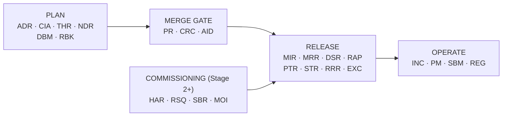

# VOL18 Templates — AOI Software Architecture, Secure Development, and Change-Control Standard, v1.0 (2026-07-15)

Scope: the complete, immediately usable set of 25 engineering record templates required by this standard (global section 57), with filing, completion, and approval rules for each.

Supersedes/Related existing docs: the Pull Request Description template (§57.5) supersedes the content of `.github/pull_request_template.md` (the file remains, its body is replaced by the §57.5 skeleton); the Code Review Checklist (§57.6) absorbs the review items of `Docs/Contributor_Quality_Checklist.md` (retained as a contributor quick-reference). All other templates are new record types; they are executed alongside — not instead of — the procedure kits `Docs/Factory_Acceptance_Test_Plan.md`, `Docs/Hardware_In_The_Loop_Checklist.md`, and `Docs/Customer_Dataset_Validation_Kit.md`.

---

## 57. Required Engineering Templates

This section is the single source for every record the standard requires an engineer to produce. Other volumes state *when* a record is mandatory; this section states *what the record contains*. A record that omits a template field without writing "none" or "not applicable + reason" in that field is incomplete and SHALL be rejected at review. This volume contains no requirement records of its own — the templates are the deliverable; the obligations that mandate them live in the cited sections.

### 57.1 Filing, identity, and completion rules (apply to every template)

1. **Format.** Records are GitHub-flavored Markdown, UTF-8, one file per record, filed in the repo so that git history is the retention and integrity mechanism. Records SHALL NOT be deleted; an erroneous record is marked `Status: Withdrawn` with a dated note.
2. **Filing path.** `Docs/records/<type>/YYYY/<ID>-<kebab-slug>.md`, where `<type>` is the slug given per template and `YYYY` is the year of creation. Standing inventories that are not per-event records (the destructive-action inventory required by §36/VOL12, the fitness-function catalogue owned by §52/VOL17) live under `Docs/records/registers/` as living documents.
3. **Record IDs.** `<PREFIX>-<YYYY>-<NNN>` with a per-type, per-year sequence starting at 001 (exception: ADRs use a global `ADR-NNNN` sequence because they are cited across years). The ID is allocated when the file is created and never reused.
4. **Immutability after approval.** An approved record SHALL NOT be edited. Corrections are appended under a dated `## Corrections` heading, or the record is superseded by a new one that names its predecessor.
5. **Identity and role-hats.** Every record names the acting person AND the role-hat (roles per §7/VOL01). Where a template demands a second reviewer and the team is one person, the record SHALL state that the documented self-review + cooling-period compensating control of §7 (VOL01) was applied, with the cooling interval recorded.
6. **Approval vocabulary.** `Approved` | `Approved-with-conditions` (conditions listed, each with owner + due date) | `Rejected`. Nothing else.
7. **Timestamps.** UTC, ISO-8601 (D-16). Local time MAY be shown in parentheses.
8. **Content restrictions.** No secrets, no credentials, no personal data beyond name + role, no customer images, and no customer-confidential parameters in any record (privacy rules in §46/VOL16). Reference such material by artifact path + SHA-256 instead of embedding it.
9. **Claim discipline.** Records use the certification-boundary wording of `Docs/Standards_Traceability_Matrix.md`: "standards-aligned", never "certified"; simulated evidence is always labeled simulated and never satisfies a real-hardware gate.
10. **Language.** American English; a Korean translation MAY be appended below the English record, which governs.



**Reading this diagram:** change records flow left to right through the change lifecycle defined by the Change Execution Contract (§3/VOL01). Planning records (Architecture Decision Record, Change Impact Assessment, Security Threat Delta, New Dependency Review, Database Migration Plan, Rollback Plan) are produced before code is written. Merge-gate records (Pull Request Description, Code Review Checklist, AI-Generated Change Disclosure) attach to every pull request. Release records (Model Import Review, Model Release Record, Dataset Release Record, Recipe Approval Record, Performance Test Record, Soak Test Record, Release Readiness Review, Exception Request) gate what ships. Commissioning records (Hardware Adapter Review, Robot Sequence Review, Safety Boundary Review, MES/OPC UA Integration Review) gate Stage 2–4 hardware and integration enablement and feed the release gate. Operations records (Incident Report, Postmortem, Customer Support Bundle Manifest, Regulatory Applicability Assessment) are produced while the product runs in the field.

Template index (prefix → template → filing type → mandating sections):

| # | Template | Prefix | `Docs/records/` type | Mandated by |
|---|---|---|---|---|
| 1 | Architecture Decision Record | ADR | `adr` | §24/VOL06, §11/VOL02, CEC-D11 |
| 2 | Change Impact Assessment | CIA | `impact` | §3/VOL01, §48–53/VOL17 |
| 3 | Security Threat Delta | THR | `threat-delta` | §27/VOL07 |
| 4 | Pull Request Description | (PR number) | in the PR | §49/VOL17 |
| 5 | Code Review Checklist | CRC | in the PR review | §49/VOL17 |
| 6 | AI-Generated Change Disclosure | AID | in the PR | §48/VOL17 |
| 7 | New Dependency Review | NDR | `dependency` | §15/VOL03, §42/VOL15, CEC-D2 |
| 8 | Model Import Review | MIR | `model-import` | §31/VOL09, D-03 |
| 9 | Model Release Record | MRR | `model-release` | §19/VOL04, §31/VOL09 |
| 10 | Dataset Release Record | DSR | `dataset-release` | §31/VOL09, §46/VOL16 |
| 11 | Recipe Approval Record | RAP | `recipe-approval` | §18/VOL04 |
| 12 | Database Migration Plan | DBM | `db-migration` | §37/VOL05, CEC-M11 |
| 13 | Rollback Plan | RBK | `rollback` | §3/VOL01 (CEC-B8/M15), §43/VOL15 |
| 14 | Hardware Adapter Review | HAR | `hw-adapter` | §32/VOL10, §15/VOL03 |
| 15 | Robot Sequence Review | RSQ | `robot-sequence` | §34/VOL11 |
| 16 | Safety Boundary Review | SBR | `safety-boundary` | §34/VOL11, D-18 |
| 17 | MES/OPC UA Integration Review | MOI | `mes-opcua` | §35/VOL11 |
| 18 | Performance Test Record | PTR | `perf-test` | §40/VOL13 |
| 19 | Soak Test Record | STR | `soak-test` | §39/VOL14, §40/VOL13 |
| 20 | Release Readiness Review | RRR | `release-readiness` | §43/VOL15, §51/VOL17 |
| 21 | Exception Request | EXC | `exception` | §53/VOL17 |
| 22 | Incident Report | INC | `incident` | §54/VOL16 |
| 23 | Postmortem | PM | `postmortem` | §54/VOL16, §50/VOL17 |
| 24 | Customer Support Bundle Manifest | SBM | `support-bundle` | §45/VOL15, §46/VOL16 |
| 25 | Regulatory Applicability Assessment | REG | `regulatory` | §55/VOL16 |

Tabletop and timed incident-response exercises required by §39 (VOL14) use templates 22 and 23 with the `Classification` field set to the exercise type — no separate exercise template exists.

### 57.2 Template 1 — Architecture Decision Record (`adr`, prefix ADR)

**Purpose:** capture one architecturally significant decision — its forces, rejected options, and consequences — so it survives staff and AI-session turnover.
**Mandatory when:** required by §24 (VOL06) for every architecturally significant decision: a new dependency, a module or trust-boundary change, a technology choice, or a fired revisit condition of a D-01…D-18 register entry (§11/VOL02). CEC-D11 blocks merge until the ADR exists.
**Fills:** change author. **Approves:** Software Architect. **Files to:** `Docs/records/adr/YYYY/ADR-NNNN-<slug>.md`.

```markdown
# ADR-0001 — <imperative decision title, e.g. "Split inference into a local worker process">
- **Status:** Proposed | Accepted | Rejected | Superseded by ADR-NNNN
- **Date:** 2026-07-15
- **Author / role-hat:** <name> / Software Architect
- **Decision Register impact:** <D-xx confirmed, revisited, or "none">
- **Requirement IDs affected:** <IDs from this standard, or "none">

## Context
<!-- 3-10 sentences. Name the forces and cite repo facts with file paths,
     e.g. "OnnxInspectionEngine.cs:59 creates an InferenceSession per call". -->

## Options considered
| # | Option | Rejected because |
|---|---|---|
| 1 | <option> | <concrete reason with numbers where available> |
| 2 | <chosen option> | — (chosen) |

## Decision
<!-- One paragraph, present tense: "We use ...". State the trigger conditions
     under which this decision is revisited. -->

## Consequences
<!-- Positive and negative. Every migration obligation gets an owner and a deadline. -->

## Verification
<!-- The fitness function, test class, or review item that proves the decision
     holds over time; register machine checks in the §52 catalogue (VOL17). -->

## Open decisions raised
<!-- OD entries forwarded to §6 (VOL01), or "none". -->
```

### 57.3 Template 2 — Change Impact Assessment (`impact`, prefix CIA)

**Purpose:** enumerate everything a proposed change touches — modules, boundaries, data, contracts — before any code is written, so review effort lands where the risk is.
**Mandatory when:** the CEC-B2/B3/B4 answers (§3/VOL01) are recorded for every change; a standalone CIA record is mandatory when the change crosses or adds a trust boundary (§9/VOL02), touches two or more modules of the §14 catalogue (VOL03), alters the database schema or a persisted file format, changes a versioned external contract (IPC, MES, OPC UA, plugin manifest), or exceeds the D-15 PR soft limit of 400 changed lines.
**Fills:** change author. **Approves:** Software Architect (plus the specialist owner of every "yes" row, per the §7 RACI). **Files to:** `Docs/records/impact/YYYY/CIA-YYYY-NNN-<slug>.md`.

```markdown
# CIA-2026-001 — <change title>
- **Date / author / role-hat:** 2026-07-15 / <name> / Software Lead
- **Issue link (CEC-B1):** <tracker URL or repo issue #>
- **Requirement IDs affected (CEC-B2):** <IDs or "none">
- **Stages affected:** S1 | S2 | S3 | S4 | ALL

## Modules and boundaries (CEC-B3)
| Module (§14 catalogue, VOL03) | Change kind | Trust boundary crossed? |
|---|---|---|
| <e.g. Persistence> | schema +1 table | no |

## Sensitive-area screen (CEC-B4) — answer every row
| Area | Touched? | Owning checklist triggered |
|---|---|---|
| Authentication / authorization | yes/no | §28/VOL07 |
| Parsing / deserialization | yes/no | §29/VOL08 |
| Secrets / cryptography | yes/no | §30/VOL08 |
| Model artifacts | yes/no | §31/VOL09 |
| Recipes | yes/no | §18/VOL04 |
| Data retention / migration | yes/no | §37/VOL05 |
| Camera / lighting hardware | yes/no | §32/VOL10 |
| Robot commands | yes/no | §34/VOL11 |
| Safety-status observation | yes/no | §34/VOL11 |
| MES / OPC UA | yes/no | §35/VOL11 |
| Installer / update | yes/no | §43/VOL15 |
| Customer data / privacy | yes/no | §46/VOL16 |

## Blast radius and contracts
<!-- Downstream consumers of changed APIs/tables/files; field-installed data affected;
     compatibility statement for each versioned contract. -->

## Linked records
- Threat delta: THR-YYYY-NNN or "not triggered"
- Migration plan: DBM-YYYY-NNN or "no schema change"
- Rollback plan: RBK-YYYY-NNN (mandatory)
- Test plan (CEC-B7): <test classes to add/extend>
- New spec defect discovered: <register as SD-xx via §6/VOL01, or "none">
```

### 57.4 Template 3 — Security Threat Delta (`threat-delta`, prefix THR)

**Purpose:** record how a change moves the threat model, instead of re-deriving the whole model per change.
**Mandatory when:** required by §27 (VOL07) whenever any CEC-B4 sensitive-area answer is "yes", a trust boundary is crossed or added, a new network listener/endpoint/parser/file-intake path appears, or the plugin, model, recipe, or update intake path changes.
**Fills:** change author. **Approves:** Security Lead. **Files to:** `Docs/records/threat-delta/YYYY/THR-YYYY-NNN-<slug>.md`.

```markdown
# THR-2026-001 — <change title>
- **Date / author / role-hat:** 2026-07-15 / <name> / Security Lead
- **Baseline threat model:** §27 (VOL07) Stage <S1|S2|S3|S4> model, version/date
- **Linked CIA:** CIA-YYYY-NNN

## Elements added or changed
| Element (process/store/flow/boundary) | New or changed | Notes |
|---|---|---|
| <e.g. new UDP listener for GVSP frames> | new | GVCP/GVSP carry no auth or integrity (GIGEV) |

## STRIDE per changed element
| Element | S | T | R | I | D | E | Notes |
|---|---|---|---|---|---|---|---|
| <element> | y/n | y/n | y/n | y/n | y/n | y/n | <one line per applicable letter> |

## New or changed attack surface
<!-- Entry points, parsers, privileges, files written/read, network exposure.
     State plainly if surface REDUCED (that is also a delta worth recording). -->

## Mitigations
| Threat | Mitigation | Mapped requirement category/section | Verification |
|---|---|---|---|
| <threat> | <control> | <e.g. INP catalogue §29/VOL08> | <test/gate> |

## Abuse cases added to the test plan
<!-- Concrete attacker actions that become negative tests (§39/VOL14). -->

## Residual risk
<!-- What remains unmitigated, its severity, and whether an EXC record is required. -->
```

### 57.5 Template 4 — Pull Request Description (in the PR; no separate file)

**Purpose:** make every merged change self-explaining: what, why, evidence, and its CEC state — the record FF-GOV-01-style gates parse (§3/VOL01).
**Mandatory when:** every pull request, per §49 (VOL17). This skeleton replaces the body of `.github/pull_request_template.md` in the same change that adopts this standard.
**Fills:** change author. **Approves:** the PR reviewer(s) per the §7 RACI. **Files to:** stays in the PR; the merge commit references the PR number. If the repo ever leaves GitHub, open PRs are exported to `Docs/records/pr-export/` first (OD-VOL18-2).

```markdown
## Summary
<!-- 1-3 sentences: what changed and why. Present tense. -->

## Issue and requirements
- Issue (CEC-B1): #NNN
- Requirement IDs affected (CEC-B2): <IDs or "none">
- CIA record: CIA-YYYY-NNN or "below CIA threshold"
- Root cause (CEC-B5, defects only): <one sentence naming the causal defect class>

## Change plan conformance
- [ ] Smallest coherent change; no unrelated refactors (CEC-B6/D3)
- [ ] D-15 size limits respected or split justified (CEC-B9/D12)
- [ ] Docs updated with the code (CEC-D4); ADR-NNNN if structure changed (CEC-D11)
- [ ] No suppressed warnings without written justification (CEC-D13)
- [ ] No TODO/FIXME without issue link + owner + expiry (CEC-D18)

## Verification evidence (CEC-M19 — paste actual results)
- Build/format/analyzers: <command + result>
- Tests: <suite(s) run + counts, e.g. "dotnet test Release: 531 passed">
- Gates: <Scripts/run-quality-gates.ps1 outcome + report artifact>
- Targeted suites for touched areas (CEC-M9..M14): <list or "none triggered">

## Evidence labeling
- [ ] All screenshots/logs above are labeled **simulated** or **real hardware** (EP-4)

## AI disclosure
- AID block present below: yes | no AI involvement

## Risk and rollback
- Rollback (CEC-B8): RBK-YYYY-NNN or inline: <how to revert code/schema/config>
- Post-merge observation (CEC-A): <what will be watched, for how long>
```

### 57.6 Template 5 — Code Review Checklist (in the PR review, prefix CRC)

**Purpose:** force every review to walk the same defect-prone surfaces instead of relying on reviewer mood; the completed checklist is the review record.
**Mandatory when:** every PR review, per §49 (VOL17). Rows marked `n/a` require a reason when the CIA sensitive-area screen says the area was touched.
**Fills:** reviewer. **Approves:** the reviewer's verdict IS the approval. **Files to:** posted as the PR review body; solo-developer reviews additionally record the §7 (VOL01) cooling period (start/end timestamps).

```markdown
# CRC — PR #NNN review by <name> / <role-hat> on 2026-07-15
Verdict: Approved | Approved-with-conditions | Rejected
Cooling period (solo only): started <UTC>, review performed <UTC>

| # | Check | Pass/Fail/n/a |
|---|---|---|
| 1 | Change does what the PR summary claims; nothing undeclared | |
| 2 | Layering: no new View→`AoiDatabase` call (21-file legacy set is capped, §15/VOL03) | |
| 3 | Authorization at the service boundary, default-deny — not only UI `EnsurePermission` | |
| 4 | All new external input validated (files, images, JSON, CLI, network — §29/VOL08) | |
| 5 | No empty catch, no swallowed exception, errors reach the §25 (VOL06) pipeline | |
| 6 | Concurrency: no UI-thread blocking; new I/O has timeout + cancellation (CEC-D8) | |
| 7 | New queues/caches/collections bounded (CEC-D9) | |
| 8 | State changes on audited entities write `RecordAuditEvent` with identity (CEC-D10) | |
| 9 | No secrets, tokens, or credentials in code, config, tests, or logs (CEC-D16) | |
| 10 | SQL parameterized; no string-built SQL (existing `AoiDatabase` discipline) | |
| 11 | Tests exist, run, and assert observable behavior — not merely "does not throw" | |
| 12 | EN/KO localization parity for operator-facing strings (`LocalizationParityTests`) | |
| 13 | Simulated-vs-real claim language correct in code, messages, and docs (EP-4) | |
| 14 | D-15 size/complexity limits met, or split/exception recorded | |
| 15 | Docs, diagrams, and traceability rows updated (CEC-M16/M17) | |

Conditions (if Approved-with-conditions): <each with owner + due date>
Findings worth a standalone issue: <links or "none">
```

### 57.7 Template 6 — AI-Generated Change Disclosure (in the PR, prefix AID)

**Purpose:** make AI involvement in a change visible and reviewable, so human verification depth can be matched to machine authorship (§48/VOL17; supports SSDF-AI as analog).
**Mandatory when:** any change where an AI tool generated or materially transformed code, configuration, schema, scripts, or normative documentation. "No AI involvement" is declared in the PR description when true.
**Fills:** change author. **Approves:** PR reviewer countersigns the attestation. **Files to:** a section of the PR body (see §57.5); referenced by the CRC.

```markdown
## AID — AI-Generated Change Disclosure for PR #NNN
- **Tools and versions:** <e.g. Claude Code, model claude-fable-5, 2026-07-15 session>
- **Extent:** entire change | named files | named regions:
  <file:line-range list of AI-authored content>
- **Prompt/session retention:** <where the session transcript or prompt is stored, or
  "not retained" — not retaining is permitted, stating it is not>

## Human verification performed (check all that apply, at least rows 1-3 required)
- [ ] Every AI-authored line read and understood by the author (not skimmed)
- [ ] Public API/framework calls verified against official documentation
      (AI-invented members are a known failure mode)
- [ ] Tests proving the behavior were reviewed or written by the human author
- [ ] Security-sensitive regions (CEC-B4 areas) re-derived by hand, not trusted

## Provenance screen
- [ ] No verbatim third-party code of unknown license introduced
- [ ] No training-data-style boilerplate secrets/URLs/domains left in place

Attestation: I reviewed the AI-generated content to the depth recorded above and
take authorship responsibility for it. — <name>, <role-hat>, <UTC date>
```

### 57.8 Template 7 — New Dependency Review (`dependency`, prefix NDR)

**Purpose:** gate every new third-party component — NuGet package, Python package, GitHub Action, vendor SDK — on evidenced supply-chain review, keeping the app's 3-package footprint deliberate.
**Mandatory when:** required by §15 (VOL03) and §42 (VOL15) before any new direct dependency or any major-version upgrade; CEC-D2 blocks merge without it. Maps: 800-161, OSSF, SSDF-PW.4.
**Fills:** change author. **Approves:** Software Architect + Security Lead. **Files to:** `Docs/records/dependency/YYYY/NDR-YYYY-NNN-<package>.md`.

```markdown
# NDR-2026-001 — <ecosystem>/<package-id> <exact version>
- **Date / author / role-hat:** 2026-07-15 / <name> / Software Lead
- **Consumer project:** <e.g. AOI_Monitor.csproj> — Stage(s): <S1-S4>
- **Purpose:** <one sentence: what capability it provides>

## Build-vs-buy
<!-- Why not write it in-repo. Name the estimated in-house cost and the rejected
     alternative packages (at least one), with reasons. -->

## Health and provenance
| Item | Value |
|---|---|
| License (SPDX id) | <e.g. MIT> |
| Latest release date / cadence | <date; releases/year> |
| Maintainers / bus factor | <n maintainers; org or individual> |
| Known CVEs (`dotnet list package --vulnerable`, OSV query date) | <result> |
| Direct + transitive dependency count | <n + m> |
| Signed package / publisher verified | <NuGet signature status> |

## Pinning and integrity (D-07, D-14)
- [ ] Exact version pinned; `packages.lock.json` updated (NuGet) or hash-pinned
      requirements/uv lock (Python)
- [ ] GitHub Actions: pinned by full commit SHA, not tag
- [ ] NuGet source config uses `signatureValidationMode=require` + `trustedSigners`
      entry added (default `accept` mode installs untrusted-signed packages silently)

## Exposure
<!-- Does it parse untrusted input, touch the network, run native code, or load at
     startup? Each "yes" needs the mitigating requirement category cited. -->

## Exit plan
<!-- Removal/replacement path if abandoned or compromised; encapsulation seam. -->
Approvals: <table per §57.1 rule 6>
```

### 57.9 Template 8 — Model Import Review (`model-import`, prefix MIR)

**Purpose:** gate every externally produced model artifact before it enters the training environment or a station, enforcing the D-03 serialization boundary.
**Mandatory when:** required by §31 (VOL09) before registering any model not produced end-to-end by the controlled in-repo pipelines (`Scripts/ml/`, `ImageOnlyPcbLearningService`); also for pretrained backbones pulled into the training environment. Maps: AI-100-2, AISVS, SSDF-AI (analog), SLSA.
**Fills:** ML Lead. **Approves:** Security Lead. **Files to:** `Docs/records/model-import/YYYY/MIR-YYYY-NNN-<model>.md`.

```markdown
# MIR-2026-001 — <model name and origin>
- **Date / author / role-hat:** 2026-07-15 / <name> / ML Lead
- **Source:** <URL/vendor/customer + retrieval date>
- **Intended use:** training-environment backbone | station inference candidate

## Format gate (D-03 — hard rules)
- [ ] Single-file ONNX; **no external-data tensors** (recurring path-traversal CVE class)
- [ ] NOT `.pt`/`.pth`/`.pkl`/`.h5`/pickle-bearing — such artifacts never reach a
      station; conversion to ONNX happens only in the controlled training environment
- [ ] SHA-256 of the artifact: <64-hex> (computed with `HashUtil.ComputeSha256` parity)

## Content inspection
| Item | Value |
|---|---|
| ONNX opset / IR version | <e.g. opset 17 / IR 8> |
| Input tensor name/shape/type | <e.g. input, 1x3x256x256, float32> |
| Output tensor name/shape/type | <e.g. anomaly_map, 1x1x256x256, float32> |
| Custom operators present | <list or "none" — custom ops require Security Lead sign-off> |
| Scanner results (modelscan or equivalent) | <output summary — detection-in-depth only;
  scanners have documented bypass history and never substitute for the format gate> |

## Contract and taxonomy fit
- [ ] Passes `ModelConfigurationValidator.Test` (status Ready) on a workstation
- [ ] Class indices mapped to taxonomy IDs via an explicit per-model-version
      mapping table (D-17), version: <taxonomy vN / mapping vN>

## License and provenance
<!-- Model license, training-data claims made by the source, and what remains
     unverifiable. Unverifiable provenance caps the model at evaluation use. -->

Lifecycle entry state on approval: Registered (never higher). Approvals: <table>
```

### 57.10 Template 9 — Model Release Record (`model-release`, prefix MRR)

**Purpose:** the complete, signed provenance record for a model reaching `Deployed`; extends the app's `model_release_manifest.json` (schema `model-release/v1`, `ModelAcceptanceService.CreateReleasePackage`) with the approval and signing evidence the JSON lacks.
**Mandatory when:** required by §19 (VOL04) and §31 (VOL09) before `DeployModel` is executed for any station; a CONDITIONAL acceptance additionally requires the waiver block below.
**Fills:** ML Lead. **Approves:** Software Architect + Product Owner (waiver: the deploy-approver role per §19). **Files to:** `Docs/records/model-release/YYYY/MRR-YYYY-NNN-<modelId>.md`.

```markdown
# MRR-2026-001 — <registry modelId, e.g. board7-v3-20260715083000-a1b2c3d4>
- **Date / author / role-hat:** 2026-07-15 / <name> / ML Lead

## Artifact identity
| Item | Value |
|---|---|
| Model SHA-256 | <64-hex — MUST match `ModelRegistry.Sha256` and the signed manifest> |
| Label map SHA-256 | <64-hex or "none"> |
| Signed manifest path + signature status | <path; detached signature verified per D-03/D-12> |
| Taxonomy version / mapping table version | <vN / vN (D-17)> |

## Training provenance
- Dataset release record: DSR-YYYY-NNN
- Training entry point + commit: <e.g. Scripts/ml/train_patchcore.py @ <sha>>
- Environment lock (hash of requirements/uv lock): <hash>
- Seed / determinism notes: <e.g. torch.manual_seed(42); CPU>

## Acceptance evidence (§31 metrics — per-defect, not headline accuracy)
- Acceptance run ID + verdict: <ModelAcceptanceRuns id; PASS | CONDITIONAL>
- Per-defect-class precision / recall / escape table: <paste or link package CSV>
- False-call rate / possible-escape rate / review rate: <values vs criteria>
- Latency avg / p95 vs budget: <ms vs §40 budget>
- Dataset content hash manifest verified (not folder-name+CSV only): yes/no

## Waiver (only if CONDITIONAL)
Reason, risk classification, expiry (future UTC date), approver role-hat.
Expired waiver = model leaves service; expiry is enforced, not advisory (§19).

## Deployment
Targets (stations/stages): <list> · Rollback model: <previous modelId or
"pixel-difference default engine"> · Approvals: <table>
```

### 57.11 Template 10 — Dataset Release Record (`dataset-release`, prefix DSR)

**Purpose:** freeze the identity, contents, and permissions of a dataset used for training or acceptance evidence, so results are reproducible and customer IP is respected.
**Mandatory when:** required by §31 (VOL09) before any dataset is used for training, calibration, or a model acceptance run whose output feeds an MRR; required by §46 (VOL16) whenever the dataset contains customer images.
**Fills:** ML Lead. **Approves:** QA Lead (+ Data Protection Officer advisory when customer data is present). **Files to:** `Docs/records/dataset-release/YYYY/DSR-YYYY-NNN-<dataset>.md`.

```markdown
# DSR-2026-001 — <dataset name>
- **Date / author / role-hat:** 2026-07-15 / <name> / ML Lead
- **Origin:** customer <name/site> | synthetic (generator + commit) | internal capture
- **Collection window:** <UTC dates> · **Storage path:** <path outside the repo>

## Contents
| Class (taxonomy ID) | Train | OK-validation | NG-validation | Golden |
|---|---|---|---|---|
| <e.g. DEF-SOLDER-BRIDGE> | 0 | 0 | 13 | — |
| OK (no defect) | 25 | 12 | — | 2 |

- Ground-truth manifest CSV SHA-256: <64-hex>
- **Per-image content hash manifest:** <path + SHA-256 of the manifest itself>
  (mandatory — the app's `DatasetHash` covers only folder name + CSV; image
  substitution is otherwise undetectable, §31/VOL09)
- Balance/coverage gates of `Docs/Customer_Dataset_Validation_Kit.md`: PASS/FAIL detail

## Rights and privacy (§46/VOL16)
- Customer authorization for this use: <document ref + date, or "internal data">
- Personal data present: <none expected on PCB images; state the check performed>
- Retention / deletion obligation: <date or contractual trigger>

## Known limitations and biases
<!-- Lighting conditions, board revisions covered, defect classes absent,
     synthetic-vs-real composition. These lines flow into MRR limitations text. -->
Approvals: <table>
```

### 57.12 Template 11 — Recipe Approval Record (`recipe-approval`, prefix RAP)

**Purpose:** the human approval that promotes a recipe revision to active production use, with the validation evidence that justifies it.
**Mandatory when:** required by §18 (VOL04) before any recipe revision becomes the active inspection recipe for a product on any station; re-required after any threshold-profile change bound to the recipe.
**Fills:** the proposing Engineer (role-hat: Software Lead or ML Lead as applicable). **Approves:** QA Lead; second reviewer per §7 separation of duties. **Files to:** `Docs/records/recipe-approval/YYYY/RAP-YYYY-NNN-<recipe>.md`.

```markdown
# RAP-2026-001 — <recipe name> rev <RecipeRevisions revision id>
- **Date / proposer / role-hat:** 2026-07-15 / <name> / <role>
- **Product / board side:** <PCBA id / TOP|BOTTOM> · **Stations:** <list>
- **Supersedes:** rev <n-1> (active since <date>)

## What changed vs the prior revision
<!-- Field-level diff summary: ROIs added/removed, thresholds, engine key,
     model binding (registry modelId), taxonomy mapping version. -->

## Validation evidence (real data of the target product)
| Metric | Value | Gate |
|---|---|---|
| Validation batch (BatchTestRuns id) | <id> | formal manifest required |
| False-call rate | <e.g. 0.031> | ≤ threshold in force (§31/VOL09) |
| Possible-escape count | <e.g. 0> | 0 on the NG validation set |
| Review-rate | <value> | ≤ threshold in force |
- Dataset: DSR-YYYY-NNN · Evidence labeled simulated/real: <label>

## Operational checks
- [ ] Recipe lock behavior verified (`WorkflowState` recipe lock)
- [ ] Audit events written for the revision (RECIPE category rows cited)
- [ ] Rollback: prior revision restorable and named above

Effective from: <UTC datetime> · Approvals: <table>
```

### 57.13 Template 12 — Database Migration Plan (`db-migration`, prefix DBM)

**Purpose:** plan and evidence every schema version increment so field databases upgrade predictably and reversibly.
**Mandatory when:** required by §37 (VOL05) for every increment of `AoiDatabaseMigrations.LatestVersion`; CEC-M11 requires the forward test before merge. The additive-only policy of `Docs/Database_Schema.md` applies; a destructive migration additionally requires an EXC record.
**Fills:** change author. **Approves:** Software Architect. **Files to:** `Docs/records/db-migration/YYYY/DBM-YYYY-NNN-v<NN>.md`.

```markdown
# DBM-2026-001 — schema v30 → v31: <title>
- **Date / author / role-hat:** 2026-07-15 / <name> / Software Lead
- **Migration entry:** AoiDatabaseMigrations.cs version 31 — "<description string>"

## DDL summary
| Object | Action | Notes |
|---|---|---|
| <table/index/column> | create / add column / backfill | additive-only confirmed |

- [ ] Idempotent (`IF NOT EXISTS` / `AddColumnIfMissing`) — re-run safe
- [ ] Runs inside its own transaction with version stamped in the same transaction
      (existing `ApplyPending` discipline)
- [ ] No data-destructive statement (else: EXC-YYYY-NNN attached)
- [ ] Frozen SQL captured in this record — migrations that delegate to live
      `Ensure*` builders must paste the DDL as it exists at merge time, because
      builder code evolves after the fact (§37/VOL05)

## Data backfill and size
<!-- Rows affected, expected duration on a representative field DB (state the DB size
     tested), WAL growth expectation, retention interaction. -->

## Test evidence (CEC-M11)
- Forward test on representative data: <test name/run + DB fixture size>
- Fresh-DB path test (SchemaSql-then-migrations ordering): <test/run>

## Rollback
SQLite ships no down-migrations: rollback = restore the pre-upgrade backup file
created by the updater before migration (§43/VOL15). Backup verified at: <path/hash>.
Approvals: <table>
```

### 57.14 Template 13 — Rollback Plan (`rollback`, prefix RBK)

**Purpose:** prove, before a change ships, that it can be taken back — in code, schema, config, models, recipes, and the field.
**Mandatory when:** CEC-B8 requires rollback thinking on every change; a standalone RBK record is mandatory for releases (§43/VOL15), schema migrations, model deployments, recipe activations, and any field-visible configuration change. CEC-M15 requires the plan verified executable before merge.
**Fills:** change author. **Approves:** Release Manager. **Files to:** `Docs/records/rollback/YYYY/RBK-YYYY-NNN-<slug>.md`.

```markdown
# RBK-2026-001 — rollback plan for <change/release/deployment>
- **Date / author / role-hat:** 2026-07-15 / <name> / Release Manager
- **Applies to:** PR #NNN | release v<X.Y.Z> | MRR-YYYY-NNN | RAP-YYYY-NNN

## Trigger criteria (measurable — no judgment-call-only triggers)
| # | Trigger | Threshold | Detection source |
|---|---|---|---|
| 1 | <e.g. possible-escape verdicts on golden set> | > 0 in first 100 boards | audit rows / QA check |
| 2 | <e.g. inspection p95 latency> | > §40 budget for 30 min | perf telemetry |

## Procedure (numbered, executable by Field Service without the author)
1. <step — exact command/file/screen>
2. <step>

## Data implications
- Schema: <restore-backup path per DBM-YYYY-NNN, or "no schema change">
- Image vault / exports: <orphan handling>
- Audit trail: rollback itself writes audit events; records are never deleted

## Fallback state
<!-- e.g. previous model id re-activated; RetireModel resets the active engine to
     the pixel-difference default — state which fallback applies and why it is safe. -->

## Verification after rollback
<!-- The specific checks proving the system is back in the pre-change state. -->
- Time-to-rollback target: <minutes> · Dry-run performed: <date + result (CEC-M15)>
Approvals: <table>
```

### 57.15 Template 14 — Hardware Adapter Review (`hw-adapter`, prefix HAR)

**Purpose:** gate every camera or lighting adapter package before a station loads it — the plugin path is in-process code execution, so this review is a code-trust decision, not a device checklist.
**Mandatory when:** required by §32 (VOL10) and the §15 (VOL03) plugin rule before any adapter package is placed in a station's adapter folder, and again on every adapter version change. `Docs/Vendor_Adapter_Implementation_Guide.md` is the companion procedure.
**Fills:** the integrating Engineer. **Approves:** Security Lead (code trust) + QA Lead (acceptance evidence). **Files to:** `Docs/records/hw-adapter/YYYY/HAR-YYYY-NNN-<adapterId>.md`.

```markdown
# HAR-2026-001 — <adapterId> v<version> (<vendor>, camera|lighting)
- **Date / author / role-hat:** 2026-07-15 / <name> / Software Lead
- **Manifest:** <*.camera-adapter.json fields: AdapterId, Version, interfaces, views,
  pixel formats — paste>

## Code trust (§15 plugin rule — blocks everything else)
- [ ] Package Authenticode-signed by an allowlisted publisher, signature verified
      before load (string-match manifest identity alone is nonconforming — the
      current `Assembly.LoadFrom` path is a governed migration item, §15/VOL03)
- [ ] Package SHA-256 recorded: <64-hex> · Signer thumbprint: <hex>
- [ ] Vendor SDK dependencies stay out of `AOI_Monitor.csproj` (repo hygiene gate)
- [ ] `Scripts/validate-camera-adapter-package.ps1` output attached: PASS

## Frame/behavior contract (camera) or command contract (lighting)
- [ ] Stable `FrameId`, real `CameraId`, UTC timestamps on every frame
- [ ] `IsSimulated=false` only for live sensor frames — never for replay/test paths
- [ ] Trigger-to-frame timing measured: <ms, n samples> vs guide expectation
- [ ] Disconnect/timeout behavior observed: status transitions to Error/NotConnected,
      no crash, diagnostics populated
- [ ] Lighting: command ACK/response behavior stated (fire-and-forget is recorded
      as a limitation, §32/VOL10)

## Evidence
- HIL checklist rows executed (`Docs/Hardware_In_The_Loop_Checklist.md`): <refs>
- Acceptance run: CameraAcceptanceRuns/LightingAcceptanceRuns id <n>, labeled
  **real hardware** (simulated evidence cannot pass this review)
- SDK license + redistribution terms: <summary>
Approvals: <table>
```

### 57.16 Template 15 — Robot Sequence Review (`robot-sequence`, prefix RSQ)

**Purpose:** review every new or changed robot command sequence against the motion-gating rules before it is commissioned on a cell.
**Mandatory when:** required by §34 (VOL11) before commissioning any robot controller registration, any change to the `RobotCycleService` state machine or gate order, and any new load/inspect/unload sequence variant.
**Fills:** the integrating Engineer. **Approves:** Controls & Safety Engineer (mandatory, non-delegable) + Software Architect. **Files to:** `Docs/records/robot-sequence/YYYY/RSQ-YYYY-NNN-<slug>.md`.

```markdown
# RSQ-2026-001 — <sequence name / controller>
- **Date / author / role-hat:** 2026-07-15 / <name> / Controls & Safety Engineer
- **Cell / stations:** <id> · **Stage:** S3

## Sequence definition
| Step | FSM state (11-state machine) | Command | Timeout (ms) | Fault path |
|---|---|---|---|---|
| 1 | Idle → Loading | <cmd> | <n> | → Faulted, operator alarm |

## Gate-order conformance (per motion command, §34/VOL11)
- [ ] Safety status read (all six interlocks + zero faults) BEFORE dispatch
- [ ] E-stop polled before dispatch AND after completion
- [ ] In-flight abort: adapter cancels motion on e-stop during execution
      (edge-only polling is insufficient for commissioning — §34/VOL11)
- [ ] `PermitSafetyBypassForSimulation` = **false** on this cell's configuration
      (the default-true value is a governed nonconformity; production cells run false)
- [ ] No retry loop wraps a motion command

## Registration path
- [ ] Controller registered via the reviewed commissioning bootstrap — NOT a
      drop-folder plugin (the app deliberately has no robot plugin loader)

## Evidence
- Simulated dry-run: <IntegrationContractsTests / run refs>
- Real-hardware supervised run: RobotAcceptanceRuns id <n>, date, witnesses
- Invalid-transition rejection spot checks: <cases exercised>
Approvals: <table — Controls & Safety Engineer signature is blocking>
```

### 57.17 Template 16 — Safety Boundary Review (`safety-boundary`, prefix SBR)

**Purpose:** re-verify, at commissioning and after relevant changes, that the D-18 boundary holds: the application observes safety, an independent safety chain implements it.
**Mandatory when:** required by §34 (VOL11) at every Stage 3 cell commissioning; re-required after any change touching SafetyStatus observation, interlock display, e-stop monitoring, or the cell's safety hardware. Maps: 13849-1, 13850, 60204-1, 10218-2.
**Fills:** Controls & Safety Engineer. **Approves:** External Safety Assessor (cell level) + Software Architect (software claims). **Files to:** `Docs/records/safety-boundary/YYYY/SBR-YYYY-NNN-<cell>.md`.

```markdown
# SBR-2026-001 — safety boundary review, cell <id>
- **Date / author / role-hat:** 2026-07-15 / <name> / Controls & Safety Engineer

## Boundary declaration (D-18)
- [ ] AOI Monitor performs NO safety function on this cell: e-stop, guard
      interlocks, and safe stop are implemented in the independent safety chain
- [ ] No code, document, or HMI text claims a safety function (claim-scan gate
      from the §52 catalogue cited: <run ref>)

## Independent safety chain (from the machinery risk assessment)
| Item | Value |
|---|---|
| Safety controller | <safety PLC/relay model> |
| Required PLr (ISO 13849-1:2023) | <e.g. PLr d — from the cell risk assessment (12100)> |
| E-stop stop category (13850 / 60204-1) | 0 | 1 |
| Assessment document | <External Safety Assessor report ref + date> |

## Observation channel
- Source: <IPlcSafetyController implementation + transport>
- Poll interval / staleness limit: <ms>
- [ ] Fail-safe on channel loss verified: app treats lost/stale status as NOT safe,
      blocks motion dispatch, raises operator alarm (test/run ref)
- [ ] Displayed status matches physical chain state in a live test (guard open,
      e-stop pressed, light curtain broken — each exercised and observed)

## Residual software risks
<!-- Remaining software failure modes (stale display, misleading status text)
     and the mitigations in force. -->
Approvals: <table — External Safety Assessor entry required at commissioning>
```

### 57.18 Template 17 — MES/OPC UA Integration Review (`mes-opcua`, prefix MOI)

**Purpose:** review every MES REST or OPC UA connection before it is enabled at a site, covering transport security, identity, spool behavior, and data mapping.
**Mandatory when:** required by §35 (VOL11) before enabling any MES/OPC UA endpoint at a customer site and after any endpoint, credential, mapping, or security-policy change. Maps: OPCUA-P2, 62443-3-3, CFX (IPC-2591).
**Fills:** the integrating Engineer. **Approves:** Security Lead + IT Admin (customer). **Files to:** `Docs/records/mes-opcua/YYYY/MOI-YYYY-NNN-<site>.md`.

```markdown
# MOI-2026-001 — <site / MES system> integration review
- **Date / author / role-hat:** 2026-07-15 / <name> / Software Lead
- **Kind:** MES REST | OPC UA | both · **Stage:** S4

## Transport and identity
- Endpoint: <URL — `https://` only; `http://` endpoints are prohibited (§35/VOL11);
  the legacy validator accepting http is a governed nonconformity>
- Auth method: ApiKey | Bearer | Basic | OPC UA cert — storage: DPAPI-protected
  settings (`dpapi:v1:` prefix verified in the settings file)
- TLS: <version negotiated; certificate chain verified; pinning decision + reason>
- OPC UA security policy: <minimum Basic256Sha256; prefer Aes256_Sha256_RsaPss;
  Basic128Rsa15 and Basic256 are deprecated and prohibited> · Message mode: SignAndEncrypt
- OPC UA certificates: <trust-list management, rotation owner, expiry dates>

## Spool/outbox behavior (verified, not assumed)
- [ ] Failed uploads (results AND images) enqueue durably before send attempt
- [ ] Crash between failure and enqueue leaves no lost payload (§35/VOL11 outbox rule)
- [ ] Retry policy: <automatic cadence + backoff; manual-only retry is nonconforming>
- [ ] Terminal statuses truthful (no delete-aliased-to-sent semantics)

## Data mapping
| App field | MES/CFX field | Notes |
|---|---|---|
| <InspectionResults column> | <target> | <units/enums> |
- Defect codes: MesDefectCodeMappings version <n> against taxonomy <vN>
- Network zone/conduit: <ref to the §13 (VOL03) conduit table row>

## Site sign-off
Customer IT contact, firewall rules opened, test transaction ids (labeled
simulated/real), go-live date. Approvals: <table>
```

### 57.19 Template 18 — Performance Test Record (`perf-test`, prefix PTR)

**Purpose:** evidence that a build meets the §40 latency and capacity budgets on defined hardware, with percentiles — not averages — as the verdict basis.
**Mandatory when:** required by §40 (VOL13) per release, and after any change to inference, image pipeline, database hot paths, or navigation. Replaces the source spec's undefined "within 1 second per image" (SD-07) with percentile budgets.
**Fills:** QA Lead. **Approves:** Software Architect. **Files to:** `Docs/records/perf-test/YYYY/PTR-YYYY-NNN-v<version>.md`.

```markdown
# PTR-2026-001 — performance test, build v<X.Y.Z> (<commit sha>)
- **Date / author / role-hat:** 2026-07-15 / <name> / QA Lead
- **Environment:** <CPU, RAM, disk type, OS build, station-representative? yes/no —
  results from non-representative hardware cannot close a release gate>

## Scenario results vs §40 budgets
| Scenario | Image/size class | n | p50 | p95 | p99 | Budget (p95) | Verdict |
|---|---|---|---|---|---|---|---|
| Inference per image | <e.g. 5 MP PNG> | 200 | <ms> | <ms> | <ms> | <ms> | PASS/FAIL |
| Frame-to-overlay | <class> | 100 | | | | | |
| Page navigation | per §40 route table | | | | | | |
| DB hot path <name> | | | | | | | |

## Resource profile
- Peak working set / GC pauses / UI-thread stalls > 200 ms: <values>
- Throughput sustained: <boards/hour equivalent for the scenario mix>

## Artifacts
- Navigation perf JSON (`TestResults/`): <path + hash>
- trx / benchmark output: <path + hash>
- Workload definition (repeatable): <script/commit ref>

## Deviations
<!-- Any budget miss: cause analysis or EXC-YYYY-NNN reference. A FAIL row with
     neither is a blocked release. -->
Approvals: <table>
```

### 57.20 Template 19 — Soak Test Record (`soak-test`, prefix STR)

**Purpose:** evidence of sustained stable operation — memory, handles, errors, recovery — over a defined duration and workload.
**Mandatory when:** required by §39 (VOL14) and §40 (VOL13) for release readiness. The 8-hour soak is the PoC minimum inherited from the source spec (SD-08); production targets per §40 supersede it for Stage 2+ acceptance.
**Fills:** QA Lead. **Approves:** Release Manager. **Files to:** `Docs/records/soak-test/YYYY/STR-YYYY-NNN-v<version>.md`.

```markdown
# STR-2026-001 — soak test, build v<X.Y.Z> (<commit sha>)
- **Date / author / role-hat:** 2026-07-15 / <name> / QA Lead
- **Duration:** <hours — 8 h PoC minimum; Stage target per §40> · Run id: SoakTestRuns <n>
- **Workload profile:** <inspections/hour, image mix, navigation cadence,
  MES/export activity — the definition must be re-runnable>
- **Evidence class:** simulated | real hardware (labeled per EP-4)

## Stability metrics
| Metric | Start | End | Trend verdict |
|---|---|---|---|
| Working set (MB) | | | flat / bounded growth explained / FAIL |
| Handle / GDI object count | | | |
| Unhandled exceptions (CrashReportService) | 0 expected | | |
| Alarm count by severity | | | each alarm dispositioned below |

## Events during soak
<!-- Every error, alarm, degraded-mode entry, and recovery: timestamp (UTC),
     what happened, whether recovery was automatic, operator action needed. -->

## Iteration data
- SoakTestIterations rows exported: <path + hash>

## Verdict
PASS requires: zero uninvestigated crashes, memory/handle trends flat or
explained-and-bounded, all alarms dispositioned. Verdict: PASS | FAIL.
Approvals: <table>
```

### 57.21 Template 20 — Release Readiness Review (`release-readiness`, prefix RRR)

**Purpose:** the single go/no-go record before a release tag — Definition of Done status, gate evidence, supply-chain artifacts, open exceptions, and approvals in one place.
**Mandatory when:** required by §43 (VOL15) and §51 (VOL17) before every release tag, including client-demo packages built with `Scripts/publish.ps1 -ClientDemoGate`.
**Fills:** Release Manager. **Approves:** Product Owner + Software Architect. **Files to:** `Docs/records/release-readiness/YYYY/RRR-YYYY-NNN-v<version>.md`.

```markdown
# RRR-2026-001 — release readiness, v<X.Y.Z> (<commit sha>, tag pending)
- **Date / author / role-hat:** 2026-07-15 / <name> / Release Manager

## Definition of Done (§51/VOL17 — every DOD item answered)
| DOD item | Status | Evidence |
|---|---|---|
| <DOD-1 …> | met / not met / excepted (EXC-YYYY-NNN) | <artifact ref> |

## Gate evidence
- `Scripts/run-quality-gates.ps1` report: <industrial_quality_gate_report.json hash;
  all steps PASS>
- Coverage: <% vs §39 floor; artifact ref> · Mutation score (in-scope modules): <%>
- Fitness-function catalogue status (§52/VOL17): <all green / listed reds + EXC refs>

## Supply-chain artifacts (§42–43/VOL15)
- [ ] SBOM generated (CycloneDX 1.7.1 schema) and attached: <path + hash>
- [ ] Binaries + installer Authenticode-signed (D-12): <signer thumbprint;
      timestamped>
- [ ] Update package signed; staged-activation metadata present
- [ ] Lock files restored in locked mode in the release build

## Records attached
PTR-YYYY-NNN · STR-YYYY-NNN · RBK-YYYY-NNN · DBM (if schema changed) ·
MRR/RAP (if model/recipe ships) · open EXC list with expiry dates

## Known issues shipped
| Issue | Severity | Workaround | Tracking |
|---|---|---|---|

## Regulatory checkpoint
- CRA Art 14 reporting channel operational (from 2026-09-11): yes/no
- REG record current for all target markets: REG-YYYY-NNN
Decision: GO | NO-GO. Approvals: <table>
```

### 57.22 Template 21 — Exception Request (`exception`, prefix EXC)

**Purpose:** the only sanctioned way to deviate from a SHALL/SHALL NOT of this standard: time-boxed, risk-assessed, compensated, and approved by the role the requirement names.
**Mandatory when:** required by §53 (VOL17) before merging or shipping any deviation from a requirement whose Exception line reads `Allowed`. Requirements marked `Not allowed` cannot be excepted; P0 requirements are non-waivable outside the documented emergency process (§50/VOL17).
**Fills:** requesting engineer. **Approves:** the approver role named on the requirement's Exception line; Security Lead co-signs any security-category exception. **Files to:** `Docs/records/exception/YYYY/EXC-YYYY-NNN-<slug>.md`.

```markdown
# EXC-2026-001 — exception to <requirement ID(s)>
- **Date / requester / role-hat:** 2026-07-15 / <name> / <role>
- **Requirement text (paste):** <the exact obligation being deviated from>
- **Exception line of the requirement:** Allowed — approver: <role> | review: <cadence>

## Deviation
- Current conformance state: <what the code/process actually does today, with paths>
- Requested deviation: <precisely what will NOT conform, scope-limited>
- Scope: <stations/stages/modules covered — "all" requires Product Owner co-sign>

## Risk
- Risk classification: Low | Medium | High
- Threat scenario enabled: <what an attacker/failure can now do that the
  requirement prevents>
- Affected assets (§8/VOL02 classes): <list>

## Compensating controls (each verifiable)
| # | Control | Verification | Owner |
|---|---|---|---|
| 1 | <control in force during the exception> | <how checked> | <role> |

## Time box
- Expiry: <UTC date — a concrete date is mandatory; §53 (VOL17) bounds apply, and
  in their absence the conservative default is 180 days (A-VOL18-4)>
- Closure criteria: <the condition that ends the exception early>
- Review cadence: per the requirement's Review field

Approvals: <table — approver role per the requirement; solo team applies the §7
self-review + cooling-period control and records it here>
```

### 57.23 Template 22 — Incident Report (`incident`, prefix INC)

**Purpose:** the operational record of a security incident, vulnerability report, or field failure — timeline, impact, containment, and regulatory clocks.
**Mandatory when:** required by §54 (VOL16) for any suspected or confirmed security incident, externally reported vulnerability, data loss, safety-observation failure, or field defect causing an escape or false-call surge. Tabletop and timed IR exercises (§39/VOL14) use this template with `Classification` set accordingly.
**Fills:** the responder on duty (any role). **Approves:** Security Lead. **Files to:** `Docs/records/incident/YYYY/INC-YYYY-NNN-<slug>.md`.

```markdown
# INC-2026-001 — <one-line incident title>
- **Opened (UTC):** 2026-07-15T09:30:00Z · **Status:** Open | Contained | Closed
- **Reporter / responder / role-hat:** <names/roles>
- **Classification:** Real incident | Tabletop exercise | Timed IR exercise
- **Severity:** Sev1–Sev4 per the §54 (VOL16) scale
  <!-- interim default until §54 publishes (A-VOL18-3): Sev1 = safety-observation
  failure or actively exploited vulnerability; Sev2 = confirmed escape-affecting
  defect, data loss, or credential compromise; Sev3 = degraded operation with
  workaround; Sev4 = minor, no production impact -->

## Impact
- Stations / customers affected: <list> · Data or privacy impact: <PIPA/GDPR
  trigger assessment — if personal data involved, §46 (VOL16) notification rules>
- Inspection integrity impact: <boards passed during the incident window that
  require re-review: yes/no + count>

## Timeline (UTC, append-only)
| Time | Event / action | Actor |
|---|---|---|
| | detection (source: alarm / operator / external report / gate) | |

## Containment and eradication
<!-- Actions taken; artifacts preserved BEFORE cleanup: support bundle id,
     audit-row export range, model/recipe hashes in force. -->

## Regulatory clock (CRA Art 14 — applies from 2026-09-11)
- Actively exploited vulnerability: early warning ≤ 24 h → notification ≤ 72 h →
  final report ≤ 14 days. Severe incident: ≤ 24 h → ≤ 72 h → final ≤ 1 month.
- Clock status for this incident: <not triggered | timestamps of each submission>

## Closure
Fix reference (PR/hotfix per §50/VOL17): <ref> · Postmortem: PM-YYYY-NNN
(mandatory for Sev1/Sev2). Approvals: <table>
```

### 57.24 Template 23 — Postmortem (`postmortem`, prefix PM)

**Purpose:** convert an incident or emergency hotfix into systemic prevention: root cause, defect-class sweep, detection-gap analysis, and tracked actions — blameless by rule.
**Mandatory when:** required by §54 (VOL16) within 10 working days of closing a Sev1/Sev2 incident, and by §50 (VOL17) after every emergency hotfix regardless of severity.
**Fills:** the incident responder or hotfix author. **Approves:** Software Architect + Security Lead. **Files to:** `Docs/records/postmortem/YYYY/PM-YYYY-NNN-<slug>.md`.

```markdown
# PM-2026-001 — postmortem for INC-YYYY-NNN / hotfix <ref>
- **Date / author / role-hat:** 2026-07-15 / <name> / <role>
- **Blameless statement:** this record names causes in systems and process,
  not fault in persons.

## Summary and impact
<!-- 3-6 sentences: what happened, duration, measured impact (boards, customers,
     data), what ended it. -->

## Root cause (EP-7 — the causal defect class, not the symptom)
<!-- Causal chain (5-whys or equivalent). The chain ends at a cause that, if
     removed, prevents the class — not just this instance. -->

## Defect-class sweep
- Question: what other code shares this defect class?
- Sweep method + result: <grep/analyzer/review performed, files found, issues filed>

## Detection gap
- Why did no existing gate/test/alarm catch it earlier: <named gate + reason>
- New fitness-function or test candidate: <proposed FF/test, registered in the
  §52 catalogue (VOL17), or reason none is feasible>

## What went well / what went poorly
<!-- Response mechanics: detection latency, rollback execution, communication. -->

## Actions (each tracked to closure)
| # | Action | Owner | Due | Tracking issue |
|---|---|---|---|---|
| 1 | | | | |

Approvals: <table>
```

### 57.25 Template 24 — Customer Support Bundle Manifest (`support-bundle`, prefix SBM)

**Purpose:** the human-approved manifest accompanying every diagnostic bundle that leaves a customer site — what is inside, what was excluded, who authorized it, and how it will be destroyed.
**Mandatory when:** required by §45 (VOL15) and §46 (VOL16) for every support bundle transferred off a customer station, whether by Field Service or by the customer. The app-generated zip (`SupportBundleService`) is the payload; this record is its transfer authorization.
**Fills:** Field Service. **Approves:** the customer's authorizing contact + Security Lead (vendor side). **Files to:** `Docs/records/support-bundle/YYYY/SBM-YYYY-NNN-<site>.md`.

```markdown
# SBM-2026-001 — support bundle transfer, <site/station id>
- **Date / collector / role-hat:** 2026-07-15 / <name> / Field Service
- **Reason:** <linked INC-YYYY-NNN, support ticket, or maintenance visit ref>
- **Bundle id / generated by:** <zip name; app version that produced it>

## Contents and integrity
- Per-file SHA-256 manifest from the bundle: <embedded manifest verified against
  recomputed hashes at receipt — the manifest alone is not tamper-proof until
  bundle signing (§45/VOL15) ships; note verification result>
- Bundle-level SHA-256: <64-hex, computed at collection AND at receipt>

## Exclusion and redaction verification (each checked, not assumed)
- [ ] Raw customer images and image vault excluded (bundle `ExcludedData` section)
- [ ] No `dpapi:v1:` payloads; secrets shown as PROTECTED/*** only
- [ ] Storage-root and image paths redacted
- [ ] Operator personal data limited to user id + role
- [ ] Manual spot-check of <n> files performed by the collector: <result>

## Customer authorization
| Item | Value |
|---|---|
| Authorizing person / title | |
| Authorization form or email ref | |
| Permitted use | diagnosis of <scope> only |
| Vendor retention limit | <date — deletion is confirmed back to the customer> |

## Transfer
Channel: <encrypted transport used — plaintext email/HTTP prohibited> ·
Received by / date: <name, UTC>. Deletion confirmation appended on: <date>.
Approvals: <table>
```

### 57.26 Template 25 — Regulatory Applicability Assessment (`regulatory`, prefix REG)

**Purpose:** the per-market determination of which regulations bind a given release and deployment stage, with the evidence trail behind each conclusion.
**Mandatory when:** required by §55 (VOL16) before first shipment into a new market or jurisdiction, on each new deployment stage at a customer (the Stage 3 cell changes the regulatory picture), and on any watched regulation change (revision-watch list in §55).
**Fills:** Product Owner. **Approves:** External Legal Counsel (review recorded) + Security Lead. **Files to:** `Docs/records/regulatory/YYYY/REG-YYYY-NNN-<market>.md`.

```markdown
# REG-2026-001 — regulatory applicability, <market/jurisdiction>, v<X.Y.Z>, Stage <n>
- **Date / author / role-hat:** 2026-07-15 / <name> / Product Owner
- **Assessment basis date:** 2026-07-15 <!-- regulations cited as of this date -->

## Determinations (one row per instrument; conclusions need cited reasoning below)
| Instrument | Applies? | Classification / duty | Deadline driving action |
|---|---|---|---|
| CRA (EU 2024/2847) | y/n | default class; Module A self-assessment (Impl. Reg 2025/2392) | Art 14 reporting from 2026-09-11; full application 2027-12-11 |
| Machinery Reg (EU 2023/1230) | y/n at Stage 3 | Annex III 1.1.9/1.2.1 cybersecurity EHSRs bind the cell | applies 2027-01-20 (hard switch) |
| EU AI Act (2024/1689) | y/n | minimal-risk (quality-control carve-out per Digital Omnibus, OJ publication pending — re-verify) | tripwires below |
| GDPR | y/n | <basis if EU personal data processed> | |
| PIPA (Korea) | y/n | <duty; penalty escalation ~Aug 2026> | |
| K-AI Framework Act | y/n | NOT high-impact for industrial inspection; Art. 33(1) self-review documented | in force since 2026-01-22 |

## Tripwire watch (each answered explicitly)
- [ ] ML output used in any SAFETY function? (yes ⇒ Machinery Reg notified body,
      AI Act high-risk — prohibited by D-18; a "yes" here is a stop-ship)
- [ ] Operator-performance scoring for employment decisions? (yes ⇒ AI Act high-risk)
- [ ] Personal data leaving Korea to the EU or back? (PIPC↔EU adequacy, Sep 2025)

## Reasoning and evidence
<!-- Per row above: the clause, why it does/does not apply to THIS product and
     stage, and the artifact that proves the duty is met (self-assessment doc,
     Art. 33(1) self-review record, reporting-channel test). -->

## Actions
| # | Action | Owner | Due |
|---|---|---|---|

Counsel review: <External Legal Counsel name, date, scope of review>.
Approvals: <table>
```

### 57.27 Assumptions and open decisions

**ASSUMPTION A-VOL18-1.** Records are filed in the git repository under `Docs/records/` and git history is the retention/integrity mechanism. Risk: anyone with repo access reads every record, and the repo currently lives on a personal GitHub account under a OneDrive-synced working tree — records containing customer names or incident details inherit that exposure. Mitigation: §57.1 rule 8 bans sensitive payloads in records; the residual risk is accepted until OD-VOL18-1 is decided.

**ASSUMPTION A-VOL18-2.** Record IDs are allocated manually at file creation with per-type, per-year sequences. Risk: two parallel changes can allocate the same ID; the collision is resolved at merge (second allocator renumbers), and the FF-STD-01 catalogue run (§58/VOL20) detects duplicate record filenames. No central allocator exists for a solo-scale team.

**ASSUMPTION A-VOL18-3.** The interim incident severity scale embedded in §57.23 applies until §54 (VOL16) publishes its scale; on conflict, §54 governs and this template's comment is updated in the same change. Risk: a mis-graded incident during the interim; mitigated by Security Lead approval on every INC record.

**ASSUMPTION A-VOL18-4.** Where §53 (VOL17) does not state a tighter bound, exception expiry defaults to 180 days from approval. Risk: a long-lived deviation; mitigated by the mandatory review cadence inherited from the excepted requirement.

**Open decisions (forwarded to §6/VOL01):**
- **OD-VOL18-1** — whether engineering records migrate from `Docs/records/` to a dedicated QMS/eQMS system once the team exceeds three engineers or a customer audit requires controlled-copy semantics; decision owner: Product Owner.
- **OD-VOL18-2** — whether PR descriptions and review records are periodically exported from GitHub into `Docs/records/pr-export/` (the repo is on a personal account; platform loss would orphan merge-gate records); decision owner: Software Architect.
- **OD-VOL18-3** — whether approved records receive detached signatures (same signing infrastructure as D-12) to make the approval itself tamper-evident, given that plain git history on a personal repo can be force-pushed; decision owner: Security Lead.

