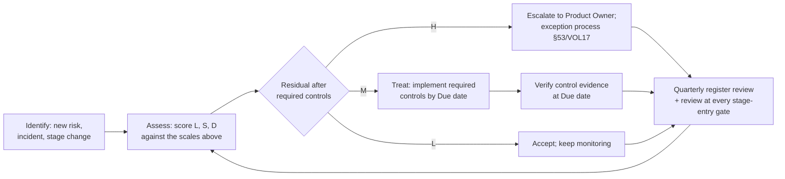

# Risk Register, Glossary, and Bibliography — AOI Software Architecture, Secure Development, and Change-Control Standard, v1.0 (2026-07-15)

Scope: this volume carries the standard's initial product risk register (§56), the canonical glossary for every specialized term used across VOL01–VOL20 (§59), and the full verified bibliography behind the citation keys used in `Maps:` fields (§60). It contains no requirement records; its content is itself the deliverable.

Supersedes/Related existing docs: supersedes none. §59 is the canonical terminology source for this standard. Related: `Docs/Standards_Traceability_Matrix.md` (its certification-boundary wording — "standards-aligned, not certified" — is reused verbatim by this volume), `Docs/Requirements_Traceability_Matrix.md` (pre-existing requirement-ID namespaces; reconciliation rule in §5/VOL01), `Docs/Industrial_Quality_Checklist.md` and `Tools/quality-gates/industrial_quality_gates.json` (gate IDs referenced by several risks below).

---

## 56. Risk Register

This section records the initial risk register of the AOI Monitor product: the risks the rest of the standard exists to control. Each row is grounded in either verified repository state (file paths cited), verified repository nonconformities (implementation gaps governed as migration obligations in their owning volumes per §6.1/VOL01, cited by the owning section they resolve to), source-specification defects (SD-xx, §6/VOL01), or the verified research corpus (§60 citation keys). Register-maintenance obligations (review cadence, ownership, escalation) are bound as requirements in the GOV catalogue (§2/VOL01) and the exception process (§53/VOL17); this section is the content those requirements govern.

### 56.1 Method and scales

Each risk carries: Risk ID (RSK-xx) | Scenario | Cause | Asset | Security impact | Safety impact | Quality impact | Likelihood (L, 1–5) | Severity (S, 1–5) | Detectability (D, 1–5, **5 = hard to detect**) | Existing controls | Required controls | Residual risk (L/M/H, assessed as of the point where all Required controls are verified) | Owner | Due | Status | Related requirement categories. To keep rows readable, each theme is rendered as three aligned sub-tables (identification, impact/scoring, treatment) keyed by Risk ID.

| Score | Likelihood | Severity | Detectability |
|---|---|---|---|
| 1 | Not expected within 3 years | Negligible; no customer-visible effect | Blocked or auto-detected before impact |
| 2 | Possible within 3 years | Minor; rework contained in one shift | Existing automated gate/alarm flags it same day |
| 3 | Possible within 1 year | Moderate; <1 shift stoppage or one quality complaint | Routine human review finds it within days |
| 4 | Likely within 1 year | Major; field escapes, data loss, or multi-day outage | Found only by targeted investigation |
| 5 | Expected within months, or already observed in repo | Critical; safety exposure, legal breach, or IP loss that ends the business relationship | Likely undetected until customer or field impact |

Status vocabulary: **Open** (no required control started), **In progress** (at least one required control being implemented), **Monitoring** (risk conditional on a future stage or decision; watched, no action due yet). Owner abbreviations: SW Arch = Software Architect, SW Lead = Software Lead, Sec Lead = Security Lead, ML Lead = ML Lead, QA Lead = QA Lead, C&S Eng = Controls & Safety Engineer, Rel Mgr = Release Manager, Field Svc = Field Service, Prod Owner = Product Owner, DPO = Data Protection Officer (advisory), IT Admin = IT Admin (customer). Due values are either ISO dates or named gates defined in §13/VOL03 and §4/VOL01: "S2 entry gate", "S3 entry gate", "S4 design gate", "First field deploy", "First signed release".

**Reading this diagram:** every new risk (or material change to an existing one) enters at identification and is scored with the Likelihood/Severity/Detectability scales defined in the table above. The residual rating — the expected rating after the listed Required controls are in place — routes the risk: residual High escalates to the Product Owner and the formal exception process in §53/VOL17; residual Medium gets a treatment plan with a named owner and a due date whose completion evidence is verified; residual Low is accepted and monitored. All paths converge on a quarterly register review, which is additionally re-run at every stage-entry gate (S2, S3, S4), and any review can send a risk back to re-assessment. No risk in the initial register below carries residual High; if a required control misses its due date, the risk's residual reverts to its pre-treatment level and the escalation path applies.

### 56.2 Theme A — AI/ML integrity and inspection quality

| ID | Scenario | Cause | Asset |
|---|---|---|---|
| RSK-01 | Code-executing model file (`.pt`/`.h5`/pickle) loaded on a station | Source spec proposed `.pt`/`.h5` delivery (SD-01); no format gate at ingest | Station process, customer data |
| RSK-02 | Poisoned/trigger images inserted into training folders; retrained model passes defective boards | Dataset hash covers folder name + CSV only (`ModelAcceptanceService.cs:348-352`); no image-byte provenance ledger | Training datasets, learned models |
| RSK-03 | Defective board escapes AOI and ships to end customer | Threshold tuned for false-call reduction; distribution shift; incomplete class coverage | Customer product quality, liability |
| RSK-04 | Displayed confidence overstates certainty; operator skips manual verify | Per-image min-max normalization (`ModelOutputParsers.cs:146-153`) makes scores non-comparable; no calibration-error measurement | Operator decisions, verdicts |
| RSK-05 | Aggregate metrics pass while one mandatory defect class underperforms | "Accuracy" headline aggregation (SD-06); no per-class acceptance floor | Per-class detection performance |
| RSK-06 | Model activated in production without any acceptance run | `SetActiveModel` blocks only Retired/AcceptanceFailed and has no service-layer role check (`ModelRegistryService.cs:126-149`) | Model lifecycle integrity |

| ID | Security impact | Safety impact | Quality impact | L | S | D |
|---|---|---|---|---|---|---|
| RSK-01 | Arbitrary code execution on station | None (station is non-safety, D-18) | Tampered verdicts possible | 2 | 5 | 4 |
| RSK-02 | Training-data integrity loss | None | Systematic, targeted escapes | 2 | 4 | 5 |
| RSK-03 | None direct | None (quality function, D-18) | Field escape, warranty/recall exposure | 3 | 5 | 4 |
| RSK-04 | None direct | None | Missed manual catches; over-trust of AI | 3 | 3 | 4 |
| RSK-05 | None | None | Class-specific escapes hidden by averages | 3 | 4 | 4 |
| RSK-06 | Verdict-integrity bypass | None | Un-vetted model produces live verdicts | 3 | 4 | 3 |

| ID | Existing controls | Required controls | Res | Owner | Due | Status | Categories |
|---|---|---|---|---|---|---|---|
| RSK-01 | ONNX-only inference stack in repo (ORT 1.27.0); no torch loaders on stations | D-03 format allowlist: single-file ONNX + signed manifest; reject external-data tensors; ban pickle-bearing formats (AIM/SER catalogues) | L | ML Lead | 2026-09-30 | In progress | AIM, SER, INP |
| RSK-02 | SHA-256 image dedupe at import; labeled-dataset acceptance gate | Dataset provenance ledger with per-image hashes; label-change audit; poisoning screen per AISVS C1/AI-100-2 §2.3 | M | ML Lead | 2026-10-31 | Open | AIM, DAT |
| RSK-03 | Escape-rate limit ≤0.02 in acceptance criteria; held-out calibration; possible-escape gate | Per-class recall floors; production escape monitoring; OOD input handling (AIM §31, OBS §38) | M | ML Lead | S2 entry gate | In progress | AIM, TST, OBS |
| RSK-04 | REVIEW verdict class; evidence-boundary wording in reports | Embedded normalization mandatory; per-release calibration-error (ECE) measurement; HMI wording rules (§36/VOL12) | M | ML Lead | 2026-11-30 | Open | AIM, HMI |
| RSK-05 | Per-class breakdown (`ClassMetricsService`); class-coverage precondition | Per-class acceptance thresholds for the mandatory defect set; release blocked on class regression | M | ML Lead | 2026-10-31 | Open | AIM, TST |
| RSK-06 | `DeployModel` gated path with waiver + audit; UI role gating | Default-deny lifecycle state machine at service layer; SHA-256 re-verification at load (closes the model-integrity nonconformity in `ModelRegistryService.cs:126-149`; §31/VOL09) | L | SW Lead | 2026-09-30 | Open | AIM, IAM, ORC |

### 56.3 Theme B — Camera, optics, and station hardware

| ID | Scenario | Cause | Asset |
|---|---|---|---|
| RSK-07 | Compromised/tampered camera vendor SDK or GenTL producer runs in-process | Native SDKs with no centralized PSIRT/CVE feed; `.cti` loaded via `GENICAM_GENTL64_PATH` | Station process incl. DPAPI secrets |
| RSK-08 | Attacker drops DLL into adapter folder or DLL search path; app executes it | Unsigned `Assembly.LoadFrom` plugin loading with string-match identity only (`VisionCameraAdapters.cs:134`, `LightingControllerFactory.cs:99`) | Station process, all stored secrets |
| RSK-09 | mm-per-pixel scale drifts after lens/fixture change; measurements silently wrong | No recalibration interval enforcement; no drift monitor | Measurement validity, verdicts |
| RSK-10 | LED aging/ambient change alters images; false-call surge or escapes | No scheduled lighting re-acceptance; fire-and-forget lighting control without ACK (`LightingControllers.cs`) | Image quality, model inputs |
| RSK-11 | Future GPU EP deployed on unsupported/mismatched driver; crashes or divergent results | GPU adoption trigger (D-01) without a controlled driver matrix; ORT CUDA-version coupling | Inference availability, determinism |

| ID | Security impact | Safety impact | Quality impact | L | S | D |
|---|---|---|---|---|---|---|
| RSK-07 | Full in-process code execution | None direct | Verdict tampering possible | 2 | 5 | 5 |
| RSK-08 | Arbitrary code execution, secret theft | None direct | Verdict tampering possible | 3 | 5 | 4 |
| RSK-09 | None | None | Wrong dimensional verdicts, silent | 3 | 3 | 5 |
| RSK-10 | None | None | Escape/false-call drift | 3 | 3 | 4 |
| RSK-11 | Larger native attack surface | None | Station downtime; CPU/GPU result divergence | 2 | 3 | 3 |

| ID | Existing controls | Required controls | Res | Owner | Due | Status | Categories |
|---|---|---|---|---|---|---|---|
| RSK-07 | Vendor packages banned from main csproj (hygiene gate); adapters isolated behind `IVisionCameraAdapter` | SBOM entry + pinned hash per SDK/`.cti`; vendor security-channel subscription; supplier risk register per 800-161; fuzz ingest before S2 sign-off | M | Sec Lead | S2 entry gate | Open | CAM, SUP |
| RSK-08 | Manifest field validation (non-cryptographic); load failure is non-fatal | Signed/allowlisted plugins per §15/VOL03 plugin rule; App Control for Business enforced policy on stations (§44/VOL15) | L | Sec Lead | 2026-10-31 | Open | CAM, SEC, DEP |
| RSK-09 | `CalibrationProfiles`/`CalibrationPoints` tables; 2D calibration workflow | Calibration expiry enforcement; golden-board verification runs on schedule; drift alarm (ORC §20, CAM §32) | M | QA Lead | S2 entry gate | Open | ORC, CAM, THD |
| RSK-10 | `LightingAcceptanceRuns` evidence tables | Periodic light-level verification against reference target; lighting ACK/verify protocol; drift alarm | M | QA Lead | S2 entry gate | Open | CAM, OBS |
| RSK-11 | CPU-only baseline (D-01); no GPU packages in solution | Supported GPU/driver/EP matrix in §11/VOL02 before any GPU adoption; CPU-vs-GPU determinism checks in acceptance | L | SW Arch | Monitoring until GPU trigger | Monitoring | ARC, AIM, PER |

### 56.4 Theme C — Robot cell and safety boundary

| ID | Scenario | Cause | Asset |
|---|---|---|---|
| RSK-12 | Replayed/injected robot commands on the cell network cause unexpected motion | Vendor robot TCP APIs are unauthenticated by default (ROGUE-ROBOTS); no session integrity or sequence checks | Cell equipment, product, uptime |
| RSK-13 | Application's safety-status view is wrongly relied on, or simulation bypass ships enabled | `PermitSafetyBypassForSimulation` defaults **true** (`RobotCycleService.cs:37`); e-stop polled only at command edges; safety role disclaimed only in docs | Persons in cell (via integrator misuse), cycle integrity |

| ID | Security impact | Safety impact | Quality impact | L | S | D |
|---|---|---|---|---|---|---|
| RSK-12 | Command-channel integrity loss | Bounded by hardware safety chain (D-18); severe only if that chain is misconfigured | Crashed boards, line stop | 2 | 5 | 4 |
| RSK-13 | Bypass flag misuse | Severe if integrator treats app as part of the safety loop, contrary to D-18 | Motion commands issued without interlock validation | 3 | 5 | 3 |

| ID | Existing controls | Required controls | Res | Owner | Due | Status | Categories |
|---|---|---|---|---|---|---|---|
| RSK-12 | No real robot adapter exists (simulation only); hardware safety chain mandated by D-18; no drop-folder robot loader by design | Isolated interlock/cell network (zones per 62443-3-2); secured fieldbus profile where the device supports it; command sequence numbering + logging (ROB §34) | M | C&S Eng | S3 entry gate | Monitoring | ROB, SAF, SEC |
| RSK-13 | Fail-closed `NullPlcSafetyController` (all interlocks false); dual e-stop sourcing; `ROBOT_SAFETY_BYPASS` audit; docs disclaim safety role | Bypass default inverted to false with production-build guard; in-flight e-stop abort hook in the cycle FSM; SAF catalogue observe-only rules (§34/VOL11) | L | C&S Eng | 2026-09-30 (flag), S3 entry gate (full) | Open | SAF, ROB, ORC |

### 56.5 Theme D — MES, OPC UA, and enterprise integration

| ID | Scenario | Cause | Asset |
|---|---|---|---|
| RSK-14 | Stored MES API key/bearer/password decrypted by any same-user process, or transits plaintext HTTP | DPAPI CurrentUser scope with null entropy (`SecretProtectionService.cs`); endpoint validation accepts `http://` (`MesIntegrationSettingsService.cs:83-87`) | MES credentials, factory network trust |
| RSK-15 | Stage-4 OPC UA endpoint runs SecurityPolicy None or deprecated policies; expired/unpinned certs admit a rogue MES peer | No certificate lifecycle process yet; UA stack still compiles deprecated Basic128Rsa15/Basic256 | OPC UA channel, result integrity |
| RSK-16 | Inspection results/images silently never reach MES; local purge later deletes the only copy | Send-then-spool (crash-lossy); failed image uploads never spooled; manual-only retry (MES send-then-spool nonconformity, §35/VOL11); no purge-before-upload ordering rule (SD-02) | Traceability records, customer audit trail |

| ID | Security impact | Safety impact | Quality impact | L | S | D |
|---|---|---|---|---|---|---|
| RSK-14 | Credential theft; lateral movement toward MES | None | None direct | 3 | 3 | 4 |
| RSK-15 | Spoofed/eavesdropped MES channel | None | Corrupted or forged uploaded results | 3 | 3 | 3 |
| RSK-16 | None direct | None | Traceability gap discovered in customer audit | 4 | 3 | 4 |

| ID | Existing controls | Required controls | Res | Owner | Due | Status | Categories |
|---|---|---|---|---|---|---|---|
| RSK-14 | DPAPI at rest; redaction in logs/exports; tests assert secrets absent from exports | HTTPS-only endpoint validation; TLS minimum version; DPAPI secondary entropy + dedicated service account (CRY §30, MES §35) | L | Sec Lead | 2026-09-30 | Open | MES, CRY, SEC |
| RSK-15 | None (OPC UA not yet implemented; `NullOpcUaMesClient` placeholder) | Policy allowlist: Basic256Sha256 floor, prefer Aes256_Sha256_RsaPss, None disabled; cert provisioning/rotation runbook (OPU §35) | L | Sec Lead | S4 design gate | Monitoring | OPU, CRY |
| RSK-16 | Durable SQLite spool for traceability payloads; capped retries; audit; secret redaction | Transactional outbox (enqueue atomic with source write); spool all upload types incl. images; automatic retry with jittered backoff; purge blocked until upload confirmed | L | SW Lead | 2026-11-30 | Open | MES, DAT, REL |

### 56.6 Theme E — Data, storage, and evidence integrity

| ID | Scenario | Cause | Asset |
|---|---|---|---|
| RSK-17 | SQLite database corrupted (power loss, disk fault, sync conflict) and corruption masked | Silent-fallback readers return defaults on parse failure (`AoiDatabase.Infrastructure.cs:2032-2069`); user-writable DB file | Inspection records, evidence |
| RSK-18 | Disk fills (image vault, exports); inspections halt or writes fail mid-transaction | Retention covers only 4 log tables; vault/exports grow unbounded; no orphan sweep (vault copy precedes DB insert) | Station availability, DB integrity |
| RSK-19 | Proprietary customer board images/layouts leak (support bundle, sync, export, stolen disk) | Images unencrypted at rest; blocklist-based redaction; uncontrolled egress paths | Customer IP, PIPA-relevant data |
| RSK-20 | Insider edits `AuditEvents` rows or `LogArchive` JSON to hide actions | No hash chain or signature on `AuditEvents` rows in user-writable SQLite (audit tamper-evidence nonconformity, §38/VOL13) | Audit trail, legal evidence value |
| RSK-21 | Stored verdict cannot be tied to the model/recipe/threshold/calibration/software version that produced it | Partial lineage columns; requirement-ID namespace collisions across docs and runtime (reconciliation rule §5/VOL01) | Traceability, dispute defense |
| RSK-22 | Station clock skews; timestamps disorder audit/MES correlation; future cert validation fails | No NTP sync monitoring; no drift alarm | Timestamps, evidence ordering |
| RSK-23 | OneDrive sync corrupts live SQLite/WAL, rolls back files, or uploads customer images to cloud | Repo working copy lives under a OneDrive-synced path; storage roots configurable under synced user-profile paths (storage-root nonconformity, OD-07/§6/VOL01) | DB, image vault, customer IP, source tree |

| ID | Security impact | Safety impact | Quality impact | L | S | D |
|---|---|---|---|---|---|---|
| RSK-17 | Evidence integrity loss | None | Silent wrong/missing records | 2 | 4 | 4 |
| RSK-18 | None | None | Inspection stoppage; partial writes | 4 | 3 | 2 |
| RSK-19 | Confidentiality breach; PIPA exposure | None | Customer-relationship damage | 3 | 4 | 4 |
| RSK-20 | Repudiation; forged history | None | Evidence worthless in dispute | 3 | 4 | 5 |
| RSK-21 | None direct | None | Unusable quality evidence in audit | 2 | 4 | 4 |
| RSK-22 | Cert/token validation errors (S4) | None | Broken event ordering, wrong correlation | 3 | 2 | 4 |
| RSK-23 | Uncontrolled cloud copy of customer data | None | DB corruption; evidence/version rollback | 4 | 4 | 3 |

| ID | Existing controls | Required controls | Res | Owner | Due | Status | Categories |
|---|---|---|---|---|---|---|---|
| RSK-17 | WAL mode; `PRAGMA integrity_check` exposed; per-migration transactions | Scheduled integrity check + verified backup/restore drill; fail-loud readers replacing silent defaults (DAT §21, REL §41) | L | SW Lead | 2026-11-30 | Open | DAT, REL |
| RSK-18 | Archive-then-purge retention on 4 tables with pre-warning; documented growth boundary | Disk-space monitor with alarm thresholds; vault retention policy + orphan sweep (§37/VOL05) | L | SW Lead | 2026-10-31 | Open | DAT, OBS, REL |
| RSK-19 | Support bundles exclude raw images/vault; secret + path redaction; PIPA pseudonymization seeds | At-rest protection baseline (BitLocker; SQLCipher decision per §37/VOL05); data-handling contract terms; egress review of every export path (PRI §46) | M | Sec Lead | 2026-12-31 | Open | PRI, DAT, CRY |
| RSK-20 | SHA-256 on exports/models; audit rows carry identity + role | Audit hash chain with periodic external anchor; restrictive ACLs on DB; signed evidence exports (DAT §21, OBS §38) | M | Sec Lead | 2026-12-31 | Open | DAT, OBS, SEC |
| RSK-21 | Engine + model version persisted per result; schema versioning + 30 migrations | Full lineage record (model, recipe rev, thresholds, calibration profile, software version, operator) per DAT catalogue; ID-namespace reconciliation per §5/VOL01 | L | SW Lead | 2026-10-31 | In progress | DAT, GOV |
| RSK-22 | UTC persisted everywhere (D-16); `Stopwatch` for durations | NTP sync monitor + drift alarm; time-source requirement in deployment baseline (DEP §44, OBS §38) | L | SW Lead | S2 entry gate | Open | DEP, OBS |
| RSK-23 | Default DB path is `%LOCALAPPDATA%` (not synced) | Prohibit sync-scoped storage roots with install-time path validation (DEP/DAT); relocate the development working copy off OneDrive; exclude repo from sync | L | SW Lead | 2026-08-31 | Open | DEP, DAT, GOV |

### 56.7 Theme F — Supply chain, build, and release

| ID | Scenario | Cause | Asset |
|---|---|---|---|
| RSK-24 | Credential committed to the public GitHub repo and abused | Homemade regex secret gate with broad allowlist (`test`, `example`, `dummy`… bypasses); test projects exempt (CI secret-gate nonconformity, §42/VOL15) | Repo, connected services |
| RSK-25 | Known-vulnerable NuGet/Python package ships in a release | No `dotnet list package --vulnerable` gate, no Dependabot, restore not run in locked mode in CI | Shipped product, stations |
| RSK-26 | Compromised third-party GitHub Action exfiltrates `GITHUB_TOKEN`/repo contents | Actions pinned to `@v4` tags not SHAs; no `permissions:` or `timeout-minutes` in workflows (CI-hardening nonconformity, §42/VOL15; tj-actions incident class) | CI pipeline, repo integrity |
| RSK-27 | Code-signing key stolen; attacker ships malware signed as the vendor | No signing exists yet; future OV key custody undefined; Azure Artifact Signing Public Trust unavailable to Korean organizations | Publisher identity, all customers |
| RSK-28 | Field update bricks a station mid-shift with no rollback | No updater; manual copy deployments; no staged activation or rollback automation | Station availability, line uptime |
| RSK-29 | Bad model or threshold deployed with no fast revert; escapes accumulate | Rollback criteria undefined; retire path resets engine to pixel-difference default (AI-100-2 / SSDF-AI RV.2.2 gap) | Inspection quality, recovery time |

| ID | Security impact | Safety impact | Quality impact | L | S | D |
|---|---|---|---|---|---|---|
| RSK-24 | Credential compromise | None | None direct | 3 | 4 | 3 |
| RSK-25 | Exploitable component in field | None | Emergency patching churn | 4 | 4 | 3 |
| RSK-26 | Supply-chain compromise of releases | None | Tampered build artifacts | 2 | 4 | 4 |
| RSK-27 | Vendor-signed malware at customers | None | Brand/contract destruction | 2 | 5 | 4 |
| RSK-28 | None direct | None | Line-down event; data loss on failed migrate | 3 | 4 | 2 |
| RSK-29 | None | None | Prolonged escape window after bad deploy | 3 | 4 | 3 |

| ID | Existing controls | Required controls | Res | Owner | Due | Status | Categories |
|---|---|---|---|---|---|---|---|
| RSK-24 | CQ-SEC-001/PR-SEC-001 regex scans; DPAPI for stored secrets | gitleaks-class scanner as blocking gate (D-14); GitHub secret scanning + push protection enabled | L | Sec Lead | 2026-08-31 | Open | SUP, CHG |
| RSK-25 | Only 3 app NuGet packages; `packages.lock.json` committed | Vulnerability gate in CI; `--locked-mode` restore; Dependabot; 30-day security-patch SLA for ORT and deps (D-03/D-07) | L | Sec Lead | 2026-08-31 | Open | SUP, BLD |
| RSK-26 | Minimal action set (checkout, setup-dotnet, upload-artifact) | Full-SHA pinning + org policy enforcement; least-privilege `permissions:`; `timeout-minutes`; branch protection (SUP §42, CHG §49) | L | Sec Lead | 2026-08-31 | Open | SUP, CHG |
| RSK-27 | None (builds currently unsigned) | OV cert with HSM/token custody per D-12; keys never on dev machines or ordinary runners; revocation + re-signing runbook (IR §54) | L | Rel Mgr | First signed release | Open | CRY, RELS, IR |
| RSK-28 | `Docs/Deployment_Package_Guide.md` manual rollback plan | Signed WiX MSI + staged activation + automated rollback criteria and drill (D-08; RELS §43, OPS §45) | L | Rel Mgr | First field deploy | Open | RELS, DEP, REL |
| RSK-29 | Model lifecycle states + retire audit; prior versions retained in registry | Documented rollback criteria; one-action revert to last-accepted model; post-rollback verification run (ORC §19, AIM §31) | L | ML Lead | 2026-11-30 | Open | ORC, AIM, REL |

### 56.8 Theme G — Platform and field operations

| ID | Scenario | Cause | Asset |
|---|---|---|---|
| RSK-30 | Vendor remote-support session becomes a standing backdoor into the customer network | No remote-support standard; commodity remote-desktop tools; robot controllers with embedded vendor routers | Customer network, station |
| RSK-31 | Station runs Windows 10 (EOL 2025-10-14) unpatched; exposed to actively exploited vulnerabilities | Four client-facing repo docs still name Windows 10 (`Docs/Installation_Guide.md:11` et al., SD-09); customer-supplied PCs | Station OS, everything on it |

| ID | Security impact | Safety impact | Quality impact | L | S | D |
|---|---|---|---|---|---|---|
| RSK-30 | Persistent unauthorized access path | None direct | Uncontrolled changes to a validated station | 3 | 4 | 4 |
| RSK-31 | KEV-class exploitation of EOL OS | None direct | Unsupported platform for .NET 10 | 4 | 4 | 2 |

| ID | Existing controls | Required controls | Res | Owner | Due | Status | Categories |
|---|---|---|---|---|---|---|---|
| RSK-30 | None in product (no remote tooling shipped) | Attended, time-limited, logged sessions via customer-approved jump host with MFA (800-82 remote-access pattern; OPS §45) | L | Field Svc | First field deploy | Open | OPS, SEC, IAM |
| RSK-31 | .NET 10 supported-OS matrix excludes consumer Windows 10 | D-02 enforcement: Windows 11 IoT Enterprise LTSC 2024 baseline; correct the four docs; install-time gate refusing EOL OS (DEP §44) | L | SW Lead | 2026-08-31 (docs); per release (gate) | In progress | DEP, DOC, COM |

### 56.9 Theme H — Engineering process and organization

| ID | Scenario | Cause | Asset |
|---|---|---|---|
| RSK-32 | Per-customer code fork drifts; a security fix misses the fork | Pressure for site customization without config/plugin discipline | Codebase unity, patchability |
| RSK-33 | AI-assisted change reintroduces a banned pattern (default-allow, `http://`, secret in code) and review misses it | Heavy AI-assisted development; CI is advisory (no branch protection); single reviewer | Code security posture |
| RSK-34 | Code-behind/static-service growth erodes layer boundaries until change cost and defect rate spike | 14,652 LOC code-behind vs 581 LOC ViewModels; 21 views call `AoiDatabase` directly (layering nonconformity, §15/VOL03) | Maintainability, velocity |
| RSK-35 | Security-relevant path regresses undetected; test breadth shrinks invisibly | Coverage referenced (coverlet) but never collected; no mutation testing; no dedicated tests for `OnnxInspectionEngine`, `ModelRegistryService`, `ModelConfigurationValidator` | Test suite effectiveness |
| RSK-36 | Sole developer unavailable; nobody can build, sign, fix, or support fielded stations | One person currently holds all roles; tacit knowledge; local-only credentials | Business continuity |
| RSK-37 | New page/capability is reachable by Operators by default; unauthorized change made and audited under a weak identity | Default-ALLOW page gate (`RoleAuthorization.cs:41` `_ => true`); app boots as in-memory Admin in Demo mode; unsigned role/user JSON stores (default-allow-gate and demo-admin nonconformities, §28/VOL07) | Access control, audit validity |

| ID | Security impact | Safety impact | Quality impact | L | S | D |
|---|---|---|---|---|---|---|
| RSK-32 | Unpatched forks in the field | None | Divergent, untested variants | 3 | 3 | 3 |
| RSK-33 | Regression of security invariants | None | Rework, weakened gates | 4 | 4 | 3 |
| RSK-34 | Security fixes harder to localize | None | Rising defect rate and change cost | 4 | 3 | 3 |
| RSK-35 | Untested security paths | None | Silent regression of verdict logic | 4 | 3 | 4 |
| RSK-36 | Incident response impossible | None direct | Fielded product unsupported | 3 | 5 | 2 |
| RSK-37 | Privilege escalation by default; audit spoofing | None | Unauthorized threshold/recipe changes | 4 | 3 | 3 |

| ID | Existing controls | Required controls | Res | Owner | Due | Status | Categories |
|---|---|---|---|---|---|---|---|
| RSK-32 | Single `main` branch today; layered config design decided (D-10) | Single-codebase policy: customer variation only via config/capability flags and signed plugins; fork prohibition in GOV/CHG catalogues | L | SW Arch | 2026-09-30 | Open | GOV, CHG, ARC |
| RSK-33 | Claim-language CI gates; analyzers-as-errors; AGENTS.md contract; push-gate hooks (staged) | §48/VOL17 AI-development controls; fitness functions as blocking gates incl. branch protection; documented self-review + cooling period for solo P0/P1 changes (§7/VOL01) | M | SW Lead | 2026-09-30 | In progress | CHG, GOV, TST |
| RSK-34 | Partial-class decomposition campaign (recent commits); DESIGN.md rules | NetArchTest dependency-direction gates (D-14); §15/VOL03 dependency rules with migration obligations for the 21 direct-DB views (MOD catalogue) | M | SW Arch | 2026-12-31 | In progress | ARC, MOD, CHG |
| RSK-35 | ~524 executable test cases; UI test suite; layered quality gates | Coverage collection with thresholds activated (D-13); Stryker.NET on critical modules; dedicated tests for the named untested classes (TST §39) | L | QA Lead | 2026-10-31 | Open | TST, CHG |
| RSK-36 | 46 repo docs; reproducible CI; this standard | Escrow of build/signing materials; runbooks for build/release/support; second-maintainer onboarding plan; §7/VOL01 compensating controls (recorded role-hats, cooling periods) | M | Prod Owner | 2026-12-31 | Open | GOV, OPS, DOC |
| RSK-37 | Role checks on known pages; service-layer RBAC on user CRUD; audit rows with identity | Invert page gate to default-deny; integrity-protected (signed/DPAPI) role, user, and mode stores; boot as least privilege (IAM §28) | L | SW Lead | 2026-09-30 | Open | IAM, SEC, HMI |

### 56.10 Register-level observations

1. The two highest-exposure clusters before treatment are **arbitrary code execution on stations** (RSK-01, RSK-07, RSK-08 — model files, camera SDKs, unsigned plugins) and **evidence integrity** (RSK-20, RSK-21, RSK-23). Both clusters are addressed by controls that already have decided architecture backing (D-03, D-12, §15 plugin rule, DAT catalogue) — the residual ratings assume those decisions are implemented, not merely documented.
2. Detectability 5 appears on RSK-02 (image poisoning), RSK-07 (SDK compromise), RSK-09 (calibration drift), and RSK-20 (log tampering): these are the risks where the product today would not tell anyone anything was wrong. Monitoring controls (OBS catalogue, §38/VOL13) are therefore treated as risk controls, not conveniences.
3. Safety impact is "None" on almost every row **by design**: D-18 places all safety functions in an independent hardware safety chain. The two rows where safety appears (RSK-12, RSK-13) exist precisely to keep that boundary true; if either required control lapses, the D-18 assumption — and every "None" in the safety column — must be re-assessed.
4. No initial risk carries residual High. Any register change that produces a residual High enters the §53/VOL17 exception and risk-acceptance process before the change is accepted.

### 56.11 Assumptions and Open Decisions

- **ASSUMPTION A-VOL19-1:** Due dates anchored to stage gates assume Stage 2 hardware entry no earlier than 2026-Q4 and Stage 3 no earlier than 2027, per `Docs/Roadmap_and_Stages.md`. Risk: earlier hardware arrival compresses treatment windows; the stage-entry register review is the correction mechanism.
- **ASSUMPTION A-VOL19-2:** Scoring baseline is the repository state at commit `a0d8b29` (2026-07-15) and current solo-developer staffing; likelihood scores for the process risks (RSK-32 to RSK-36) assume no second engineer joins before 2027. Risk: staffing changes invalidate the scores; re-score at the next quarterly review after any staffing change.
- **ASSUMPTION A-VOL19-3:** The register is maintained as this Markdown section under version control; every edit is a normal change under the CHG catalogue (§48–53/VOL17). Risk: Markdown offers no workflow enforcement; see OD-VOL19-1.
- **OD-VOL19-1 (open decision):** Register tooling — remain Markdown-in-repo or mirror into an issue tracker with due-date automation. Decide by 2026-10-31. Owner: Product Owner.
- **OD-VOL19-2 (open decision):** Whether a residual-High rating triggers the §53/VOL17 exception process automatically (proposed) or at Product Owner discretion. Confirm at the first quarterly register review (due 2026-10-15). Owner: Product Owner.
- **OD-VOL19-3 (open decision):** Bibliography re-verification cadence for the watch items flagged in §60 (SSDF v1.2 final, COSAiS predictive-AI overlay, EN ISO 10218:2025 OJ citation, CISA 2025 SBOM final, AI Act Digital Omnibus OJ text, CFX v2.1). Proposed: quarterly, owner Security Lead. Decide by 2026-10-31.

---

## 59. Glossary

This glossary is the canonical terminology source for the standard. Definitions are written for the AOI Monitor context; where a term has a formal definition in a cited standard, the entry names the source and the formal text prevails for compliance mapping. English is authoritative (ASSUMPTION A-VOL19-4: Korean operator-facing translations are UI localization resources under the LOC catalogue, §47/VOL12, not glossary variants). Terms are alphabetical; cross-references use *italics*.

- **Acceptance gate** — The evidence-gated decision that a model, recipe, or release may enter the next lifecycle state; in this product, `ModelAcceptanceService.RunAcceptance` plus the criteria in §31/VOL09.
- **ADR (Architecture Decision Record)** — A short, versioned record of one architectural decision, its context, alternatives, and revisit conditions. The Decision Register D-01..D-18 is recorded as ADRs in §11/VOL02.
- **AI Act (EU)** — Regulation (EU) 2024/1689 laying down harmonised AI rules, as proposed to be amended by the 2026 Digital Omnibus (adopted; OJ publication of the amending regulation pending — UNVERIFIED as of 2026-07-15). AOI inspection AI is classified minimal-risk with two tripwires (ML in a safety chain; operator-performance scoring). Cited as AIA.
- **Air gap** — A deployment with no network path between the station (or cell) and other networks; updates and evidence move by controlled removable media.
- **Anomaly heat map** — A per-pixel anomaly-score image produced by an anomaly-detection model (e.g., PatchCore); regions above threshold become candidate defects.
- **AOI (Automated Optical Inspection)** — Camera-based automatic inspection of assembled PCBs against acceptance criteria; this product's domain. Verdicts are quality decisions, never safety functions (D-18).
- **App Control for Business** — Windows kernel-enforced application allow-listing (formerly Windows Defender Application Control, WDAC). Required station hardening control (§44/VOL15).
- **ASVS** — OWASP Application Security Verification Standard (v5.0.0); the requirement taxonomy behind many `Maps:` entries (cited ASVS-Vx by chapter).
- **Attack tree** — A tree-structured decomposition of the ways an attacker can reach a goal; mandated for critical paths in the §27/VOL07 threat models.
- **Audit trail** — The append-intent record of who did what, when, to which entity (`AuditEvents` table). Must become tamper-evident via *hash chain* (RSK-20).
- **Authenticode** — Windows code-signing format binding a publisher certificate to a binary; with a timestamp, signatures outlive certificate expiry. Required for all shipped binaries (D-12).
- **AXI (Automated X-ray Inspection)** — X-ray-based inspection for hidden features (BGA joints, internal voids). Out of AOI optical scope; taxonomy rows requiring AXI are marked out-of-sensor-scope.
- **Backdoor poisoning** — Training-time attack that implants a trigger pattern so the model misclassifies inputs containing it (e.g., defective boards pass). Taxonomy: AI-100-2 §2.3.3.
- **Break-glass account** — A tightly audited emergency credential for use when normal authentication (e.g., MES federation) is unavailable; bounded by D-11's 72 h offline policy.
- **Calibration drift** — Gradual invalidation of a sensor-to-world mapping (e.g., mm-per-pixel scale) due to mechanical, thermal, or optical change. Controlled by expiry and golden-board verification (RSK-09).
- **Calibration profile** — The persisted set of parameters mapping pixel coordinates to physical units for a given station/optics configuration (`CalibrationProfiles` tables).
- **CFX (IPC-2591 Connected Factory Exchange)** — IPC's machine-to-system message standard (AMQP 1.0 + JSON); `UnitsInspected` is the canonical AOI result message. Stage-4 integration surface.
- **Class 1/2/3 (IPC product classes)** — IPC-A-610/J-STD-001 acceptance strata: Class 1 general, Class 2 dedicated-service, Class 3 high-performance/harsh-environment. Product class is per-recipe configuration.
- **Cold joint** — A solder joint that did not properly reflow/wet; dull, grainy, mechanically weak. Optically ambiguous — its detection-method limits are recorded in the defect taxonomy (§31/VOL09).
- **Collaborative operation** — An *application* property (ISO 10218-2:2025) where humans and robots share space under specific risk-reduction measures. The 2025 editions deleted "collaborative robot" as a robot property.
- **Conduit** — In IEC 62443-3-2, the controlled communication channel between *zones*; the AOI cell's MES link is a conduit with defined security requirements.
- **Coplanarity** — The maximum deviation of component leads/balls from a common seating plane; a 3D metrology measurement (SPI/3D AOI), not a 2D optical one.
- **Coverage (code coverage)** — The fraction of code executed by tests. Referenced by the test projects (coverlet) but not yet collected; activation with thresholds is required by D-13 (RSK-35).
- **CRA (Cyber Resilience Act)** — Regulation (EU) 2024/2847 on cybersecurity requirements for products with digital elements. AOI software is a default-class product (Module A self-assessment); Art. 14 reporting applies from 2026-09-11.
- **CVE** — Common Vulnerabilities and Exposures; the public identifier scheme for disclosed vulnerabilities.
- **CWE** — Common Weakness Enumeration; MITRE's taxonomy of software weakness classes (cited CWE-nnn in `Maps:` fields).
- **CycloneDX** — OWASP/Ecma BOM standard (v1.7.1 pinned) used for this product's SBOM and *ML-BOM*; cited CDX.
- **Defect taxonomy** — The canonical, versioned catalogue of defect classes with stable string IDs (e.g., `DEF-SOLDER-BRIDGE`), decoupled from model class indices via a per-model-version mapping (D-17).
- **Detectability** — Risk-register scale (1–5) for how likely a risk's occurrence goes unnoticed; 5 means likely undetected until customer or field impact (§56.1).
- **DFD (Data Flow Diagram)** — Diagram of data stores, processes, flows, and *trust boundaries*; the basis of STRIDE threat modeling (§9/VOL02).
- **DPAPI** — Windows Data Protection API (`ProtectedData`); machine/user-scoped secret encryption at rest. D-10 mandates DPAPI with per-machine entropy for stored secrets.
- **ECE (Expected Calibration Error)** — A measure of how far predicted confidence deviates from observed accuracy; low ECE means confidence values are trustworthy (RSK-04).
- **EP (execution provider)** — An ONNX Runtime backend (CPU, CUDA, DirectML…) that executes graph operators. The product baseline is the CPU EP; GPU EP adoption is gated by D-01 triggers.
- **ERP (Enterprise Resource Planning)** — Business-level planning/inventory system; consumes AOI data indirectly via the *MES*.
- **Escape (defect escape)** — A truly defective board that AOI passed as OK; the costliest AOI failure mode. Escape rate is a headline acceptance metric (replacing "accuracy", SD-06).
- **E-stop (emergency stop)** — The hardware emergency-stop function (ISO 13850): single human action, stop category 0 or 1, latching actuator, restart never automatic. The application only observes e-stop state (D-18).
- **Evidence package** — A signed/hashed export bundle (reports, CSV, images, manifests) proving a validation or acceptance claim; produced by the export services and verified via `ExportVerification`.
- **False call** — A good board (or feature) that AOI flagged as defective; drives operator re-inspection cost. Bounded by the false-call-rate criterion (≤0.05 default).
- **Fiducial** — A dedicated optical registration mark on a PCB used to align camera coordinates to board coordinates before inspection.
- **Fitness function** — An automated, continuously executed check that verifies an architectural or security property (e.g., dependency direction, no-SQL-concatenation); catalogued in §52/VOL17.
- **GenICam** — EMVA's generic camera-programming standard family (GenApi, SFNC, PFNC, GenDC, GenCP); defines naming/description/API layers, and no security mechanisms.
- **GenTL producer (.cti)** — A native transport-layer plugin module loaded by GenICam consumers to talk to cameras. Native code in-process; its provenance and load path are supply-chain controls (RSK-07).
- **GigE Vision** — A3's camera control/streaming standard over Ethernet (v2.2 baseline; v3.0 additive). Its GVCP/GVSP protocols have no authentication, integrity, or confidentiality — segmentation is the only control.
- **Golden board / golden image** — A known-good reference board (or its captured image) against which inspected boards are compared; the reference input of the image-learning workflow.
- **GVCP** — GigE Vision Control Protocol (UDP port 3956): unauthenticated camera discovery/configuration; any host on the segment can issue control writes.
- **GVSP** — GigE Vision Stream Protocol: unauthenticated UDP pixel transport; frame injection is a demonstrated attack (GVSP-SPOOF), motivating capture-integrity controls (§32/VOL10).
- **Hash chain** — A record scheme where each entry includes the hash of its predecessor, making deletion or edit of history detectable; required for audit tamper-evidence (RSK-20).
- **Hermes (IPC-HERMES-9852)** — The TCP/XML board-handover protocol replacing SMEMA wiring on SMT lines (v1.6); carries board ID and product data machine-to-machine.
- **HMI (Human-Machine Interface)** — The operator-facing UI of the station; governed by §36/VOL12 and the repo's DESIGN.md contract.
- **Hold-out set** — Data excluded from training/threshold selection and used only for unbiased evaluation; the image-learning calibration uses an even/odd hold-out split.
- **Interlock** — A safety device/circuit that prevents hazardous operation unless a condition holds (guard closed, light curtain clear). Implemented in the hardware safety chain; the application only reads status (D-18).
- **IPC-A-610** — "Acceptability of Electronic Assemblies" (Revision J, 2024): the visual acceptance criteria vocabulary for AOI verdicts. Revision J dispositions are exactly Acceptable / Process Indicator / Defect.
- **KEV (Known Exploited Vulnerabilities)** — CISA's catalog of vulnerabilities with confirmed in-the-wild exploitation; with the annual CWE "Top 10 KEV Weaknesses" list, the severity driver for patching SLAs.
- **Lot** — A production batch of boards sharing traceability identity (lot ID); the unit MES uses to group inspection results.
- **LTSC (Long-Term Servicing Channel)** — Windows servicing model with security-only updates and no feature churn; Windows 11 IoT Enterprise LTSC 2024 (support to 2034-10-10) is the station baseline (D-02).
- **MES (Manufacturing Execution System)** — The plant system that tracks units, routes work, and collects results; Stage-4 integration target via REST, OPC UA, and optionally CFX.
- **ML-BOM (model card)** — The machine-readable bill of materials for a model: identity, hash, architecture, dataset provenance, metrics; expressed as a CycloneDX `modelCard` per the SBOM-for-AI guidance.
- **Modular monolith** — A single deployable process with strictly enforced internal module boundaries; the target architecture (D-01, Strategy B).
- **Monotonic clock** — A clock that only moves forward and is immune to wall-time adjustment (`Stopwatch`); mandatory for measuring durations (D-16).
- **Mutation testing** — Test-suite evaluation that injects code mutants and measures how many the tests kill; Stryker.NET is mandated on critical modules (D-13).
- **NodeId** — The typed identifier of a node in an OPC UA server's address space; recipe/result nodes exposed at Stage 4 have stable, documented NodeIds.
- **NTP (Network Time Protocol)** — Network time synchronization; sync health must be monitored with drift alarms (D-16, RSK-22).
- **ONNX (Open Neural Network Exchange)** — The open, protobuf-based model interchange format; the only permitted production model format, single-file, with external-data tensors prohibited (D-03).
- **ONNX Runtime (ORT)** — Microsoft's inference engine executing ONNX models (pinned 1.27.0). Publishes no LTS; the product defines its own supported window with a 30-day security-patch SLA (D-03).
- **OOD (out-of-distribution)** — Input that differs materially from the training distribution (new board type, lighting shift); OOD detection routes such inputs to REVIEW instead of trusting model output.
- **OPC UA** — OPC Unified Architecture (OPC 10000 / IEC 62541): the secure industrial interoperability stack for Stage-4 integration; security policy floor Basic256Sha256, prefer Aes256_Sha256_RsaPss.
- **Opset** — The versioned operator set an ONNX model targets; recorded per deployed model and validated against the pinned ORT's supported range.
- **Outbox pattern** — Persisting an outbound message in the same local transaction as the state change that produced it, then relaying asynchronously; required fix for the MES send-then-spool gap (RSK-16).
- **Parameterized query** — SQL with values bound as parameters, never concatenated; the repo's uniform practice and a prohibited-deviation rule (CWE-89).
- **PBKDF2** — Password-based key derivation function; local user passwords use PBKDF2-SHA256 with ≥600,000 iterations and per-user salt (D-11).
- **Pickle** — Python's native serialization; deserialization executes arbitrary code. Pickle-bearing model formats are prohibited on stations and confined to the controlled training environment (D-03).
- **PIPA** — Korea's Personal Information Protection Act (2023 amendment regime). Operator IDs and audit-trail names in the station database are personal information under PIPA Art. 2(1).
- **PL / PLr (Performance Level / required PL)** — ISO 13849-1's discrete safety-capability levels a–e for safety functions; PLr is the level a risk assessment requires. All PL-rated functions live outside this software (D-18).
- **Poisoning (data poisoning)** — Manipulating training data (or labels) to degrade or backdoor a model; the primary training-pipeline threat class (AI-100-2 §2.3).
- **Process indicator** — IPC-A-610J's non-reject disposition: a condition that signals process variation without warranting rejection; maps to the product's warning/trend classification feeding SPC.
- **Provenance** — Verifiable origin history of an artifact (who built what, from which sources, on which system); expressed as signed attestations under SLSA.
- **PSIRT (Product Security Incident Response Team)** — The function (§54/VOL16) that receives, triages, fixes, and discloses product vulnerabilities — mandatory under 62443-4-1 DM and CRA Part II regardless of team size.
- **PTP (IEEE 1588 Precision Time Protocol)** — Sub-microsecond network clock sync used by GigE Vision Scheduled Action Commands for multi-camera triggering; unauthenticated in default use.
- **Quantization** — Reducing model numeric precision (e.g., FP32→INT8) for speed/size; changes accuracy and robustness behavior, so quantized models re-enter the acceptance gate as new models.
- **RBAC (Role-Based Access Control)** — Authorization decided by role membership, default-deny at the service boundary (D-11). The current default-allow page gate inverts this and must be fixed (RSK-37).
- **Recipe** — The complete inspection program for one board type: ROIs, criteria, thresholds, model binding, class/criteria revision. Versioned with an approval lifecycle (§18/VOL04).
- **Reflow** — The solder-paste melting process in SMT assembly; many defect classes (tombstone, bridging, cold joint) originate in reflow behavior.
- **ROI (Region of Interest)** — A defined sub-area of the board image inspected with specific criteria; the unit at which recipes attach rules.
- **safetensors** — Hugging Face's non-executable tensor storage format (no code on load); the required interchange format for weights inside the training pipeline.
- **Safety function** — A machine function whose failure immediately increases risk (e-stop, interlock monitoring, speed limiting); implemented only in safety-rated hardware per ISO 13849-1, never in this application (D-18).
- **SBOM (Software Bill of Materials)** — Machine-readable inventory of a release's components with versions, hashes, and relationships; generated per release in CycloneDX (D-14; NTIA minimum elements).
- **Security level (SL, IEC 62443)** — Capability strata SL 1–4 expressing resistance against increasingly resourced attackers, expressed per foundational requirement as an SL vector; used for component capability claims (62443-4-2).
- **SIL (Safety Integrity Level)** — IEC 62061's SIL 1–3 for machinery safety-control systems (the machinery cap); the parent standard IEC 61508 itself defines SIL 1–4. The SIL-based alternative to PL; one methodology is chosen per safety function, never mixed.
- **SLSA (Supply-chain Levels for Software Artifacts)** — OpenSSF's provenance framework (v1.2); the product targets explicit Build L2 and Source L2 claims, not vague "SLSA compliance".
- **SMEMA (IPC-SMEMA-9851)** — The legacy 4-signal electrical board-handshake between SMT machines; still the installed-base interface, functionally succeeded by Hermes.
- **Solder bridge** — Unintended solder connection between adjacent conductors; a mandatory AOI defect class (`DEF-SOLDER-BRIDGE`) and the classic optical short-circuit evidence.
- **SPI (Solder Paste Inspection)** — 3D measurement of printed solder paste (volume, height, area) before placement; a distinct sensor class — paste-volume taxonomy rows are SPI scope, not 2D AOI.
- **Stop category 0/1/2** — IEC 60204-1 stop classes: 0 = immediate power removal (uncontrolled), 1 = controlled stop then power removal, 2 = controlled stop with power retained. E-stop must be category 0 or 1; category 2 is prohibited for e-stop.
- **Store-and-forward** — Persisting outbound data locally and forwarding when the peer is reachable; the architecture of the MES spool and central sync (D-04).
- **STRIDE** — Threat-classification mnemonic (Spoofing, Tampering, Repudiation, Information disclosure, Denial of service, Elevation of privilege) used for the per-stage threat models (§27/VOL07).
- **Threat model** — A documented analysis of assets, trust boundaries, attacker capabilities, and mitigations for a defined scope; kept current per release (62443-4-1 SR-2).
- **Tombstone** — A chip component lifted vertically on one termination during reflow (one open joint); a mandatory optical defect class.
- **Trust boundary** — A line in the architecture where the level of trust in data or callers changes and validation/authentication must occur (e.g., file import, plugin load, MES channel).
- **VEX (Vulnerability Exploitability eXchange)** — A machine-readable statement of whether a product is affected by a given CVE in its components; published alongside the SBOM for air-gapped customers.
- **WAL (Write-Ahead Logging)** — SQLite journaling mode that appends changes to a log before checkpointing; the configured mode (D-04). WAL files make live file-copy/sync of the database unsafe (RSK-23).
- **Zone (IEC 62443)** — A grouping of assets sharing security requirements, separated from other zones by *conduits*; the camera network and robot cell are distinct zones in the Stage 2/3 architecture (§13/VOL03).

---

## 60. Bibliography

This section compiles every external source behind the citation keys used in the standard's `Maps:` fields, grouped by domain. All entries were verified against primary or official pages on **2026-07-15** by the research pass documented in the project's research pack; entries the research pass could not fully confirm carry an explicit **UNVERIFIED** marker, which authors citing them must carry forward. The product claims alignment with, never certification against, any entry here (certification-boundary wording per `Docs/Standards_Traceability_Matrix.md`).

Applicability classes used below:
- **Required by law** — legally binding for the stated jurisdiction/condition.
- **Contractual/de-facto** — not law, but demanded by the market, CA/OS ecosystem, or customer contracts.
- **Recommended baseline** — voluntary framework the standard adopts as its reference practice.
- **Informative** — background, threat intelligence, or research evidence; never a sole requirements source.
- **Monitored** — draft or empty project; not citable as a requirements source; tracked for change (OD-VOL19-3).
- **Recorded exclusion** — assessed and documented as not applicable.

### 60.1 Secure development frameworks

- **[SSDF]** NIST. "Secure Software Development Framework (SSDF) Version 1.1: Recommendations for Mitigating the Risk of Software Vulnerabilities" (SP 800-218). v1.1, 2022-02. Status: final; the citable SSDF version. https://csrc.nist.gov/pubs/sp/800/218/final. Accessed 2026-07-15. Applicability: recommended baseline.
- **[SSDF-12D]** NIST. "Secure Software Development Framework (SSDF) Version 1.2" (SP 800-218r1 ipd). Initial public draft, 2025-12-17 (comments closed 2026-01-30; final not published as of 2026-07-15). Status: DRAFT — cite as draft only; adds PO.6 (continuous improvement) and PS.4 (robust/reliable updates). https://csrc.nist.gov/pubs/sp/800/218/r1/ipd. Accessed 2026-07-15. Applicability: monitored.
- **[SSDF-AI]** NIST. "Secure Software Development Practices for Generative AI and Dual-Use Foundation Models: An SSDF Community Profile" (SP 800-218A). Final, 2024-07-26 (not withdrawn despite EO 14110 rescission). Status: final; formally GenAI-scoped — adopted as an analog for the discriminative CV training pipeline with a recorded scope caveat. https://csrc.nist.gov/pubs/sp/800/218/a/final. Accessed 2026-07-15. Applicability: recommended baseline (with scope caveat).
- **[SBD]** CISA + NSA/FBI + international partners. "Shifting the Balance of Cybersecurity Risk: Principles and Approaches for Secure by Design Software." Updated joint guide (2nd iteration, 36 pp.), 2023-10-16. Status: current voluntary guidance. Exact page wording UNVERIFIED-direct (cisa.gov blocked automated fetch); facts multi-source corroborated. https://www.cisa.gov/resources-tools/resources/secure-by-design. Accessed 2026-07-15. Applicability: recommended baseline.
- **[MS-SDL]** Microsoft. "Microsoft Security Development Lifecycle (SDL) — 10 security practices." Continuously updated web edition (AI-security expansion 2026-02-03). Status: current vendor guidance; informative. https://www.microsoft.com/en-us/securityengineering/sdl/practices. Accessed 2026-07-15. Applicability: recommended baseline (native to the Windows/.NET stack).
- **[CSF2]** NIST. "The NIST Cybersecurity Framework (CSF) 2.0" (CSWP 29). v2.0, 2024-02-26. Status: final. https://csrc.nist.gov/pubs/cswp/29/the-nist-cybersecurity-framework-csf-20/final. Accessed 2026-07-15. Applicability: recommended baseline (organizational governance umbrella).
- **[42010]** ISO/IEC/IEEE. "Software, systems and enterprise — Architecture description" (ISO/IEC/IEEE 42010:2022). 2nd edition, 2022-11; replaces the 2011 edition. Status: final; normative template for this standard's architecture descriptions. https://www.iso.org/standard/74393.html. Accessed 2026-07-15. Applicability: recommended baseline.
- **[25010]** ISO/IEC. "SQuaRE — Product quality model" (ISO/IEC 25010:2023). 2nd edition, 2023-11; together with ISO/IEC 25002 and ISO/IEC 25019 replaces 25010:2011; adds top-level "safety" characteristic. Status: final; quality-attribute taxonomy for §10/VOL02. https://www.iso.org/standard/78176.html. Accessed 2026-07-15. Applicability: recommended baseline.

### 60.2 Application security

- **[ASVS]** OWASP Foundation. "OWASP Application Security Verification Standard." v5.0.0, 2025-05-30 (17 chapters; supersedes 4.0.3). Status: final/stable; cited per chapter as ASVS-Vx. https://github.com/OWASP/ASVS/releases. Accessed 2026-07-15. Applicability: recommended baseline (selective — web chapters activate at Stage 4).
- **[WSTG]** OWASP Foundation. "OWASP Web Security Testing Guide." v4.2, 2020-12-03 (v5.0 in development, not released). Status: final/stable; pin references to v4.2. https://owasp.org/www-project-web-security-testing-guide/. Accessed 2026-07-15. Applicability: recommended baseline for security test procedures.
- **[CSC]** OWASP Foundation. "OWASP Cheat Sheet Series" (Deserialization; File Upload; Input Validation; XXE Prevention; plus the CSV Injection community page). Living documents, no version numbers. Status: active/maintained; cite by sheet + access date. https://cheatsheetseries.owasp.org/. Accessed 2026-07-15. Applicability: informative implementation guidance.
- **[CWE]** MITRE. "Common Weakness Enumeration (CWE)." Living taxonomy; cited as CWE-nnn. Status: current. https://cwe.mitre.org/. Accessed 2026-07-15. Applicability: informative (weakness identifier scheme for `Maps:` fields).
- **[CWE-T25]** MITRE (HSSEDI), sponsored by DHS/CISA. "2025 CWE Top 25 Most Dangerous Software Weaknesses." 2025 edition, published 2025-12 (CISA alert 2025-12-11). Status: final; latest edition; re-check ~Dec 2026. https://cwe.mitre.org/top25/archive/2025/2025_cwe_top25.html. Accessed 2026-07-15. Applicability: informative prioritization baseline.
- **[KEV]** MITRE (CWE program) with CISA. "2025 CWE Top 10 KEV Weaknesses" (built on the CISA Known Exploited Vulnerabilities catalog). 2025 list, published 2026-01-27. Status: final; latest edition; the exploited-in-the-wild severity driver. https://cwe.mitre.org/top25/archive/2025/2025_kev_list.html. Accessed 2026-07-15. Applicability: informative prioritization baseline.
- **[CERT]** Carnegie Mellon SEI (CERT Division). "SEI CERT Coding Standards" (C 2016 edition; C++ 2016 edition; living wiki migrated to https://cmu-sei.github.io/secure-coding-standards/). Status: active, slow-moving. **There is no SEI CERT C# or Python standard — this standard never cites one.** Accessed 2026-07-15. Applicability: recommended baseline for first-party C/C++ only (interop shims, custom ops).

### 60.3 AI risk management and adversarial ML (NIST)

- **[AI-RMF]** NIST. "Artificial Intelligence Risk Management Framework (AI RMF 1.0)" (AI 100-1). v1.0, 2023-01-26. Status: final, **under revision** (no 1.1/2.0 released as of 2026-07-15 — revision-watch item). https://www.nist.gov/itl/ai-risk-management-framework. Accessed 2026-07-15. Applicability: recommended baseline (governance skeleton for the model lifecycle).
- **[AI-100-2]** NIST. "Adversarial Machine Learning: A Taxonomy and Terminology of Attacks and Mitigations" (AI 100-2 E2025). 2025 edition, 2025-03-24. Status: final; §2 (Predictive AI taxonomy) is the directly applicable part and the normative AML vocabulary for this standard. https://csrc.nist.gov/pubs/ai/100/2/e2025/final. Accessed 2026-07-15. Applicability: recommended baseline (threat taxonomy).
- **[AI-600-1]** NIST. "AI RMF: Generative Artificial Intelligence Profile" (AI 600-1). Final, 2024-07-26. Status: final. https://www.nist.gov/itl/ai-risk-management-framework. Accessed 2026-07-15. Applicability: recorded exclusion — the product's AI is discriminative CV; re-assess only if any generative component is added.
- **[COSAIS]** NIST. "SP 800-53 Control Overlays for Securing AI Systems (COSAiS)" — concept paper (2025-08) and annotated outline for "Using and Fine-Tuning Predictive AI" (2026-01-08). Status: DRAFT/in development; not citable as a requirements source; the predictive-AI overlay is the single most on-target future NIST deliverable for this product. https://csrc.nist.gov/projects/cosais. Accessed 2026-07-15. Applicability: monitored.
- **[IR-8596]** NIST. "Cybersecurity Framework Profile for Artificial Intelligence (Cyber AI Profile)" (IR 8596 iprd). Preliminary draft, 2025-12-16; initial public draft not released as of 2026-07-15. Status: DRAFT. https://csrc.nist.gov/pubs/ir/8596/iprd. Accessed 2026-07-15. Applicability: monitored.
- **[AI-800-1]** NIST/CAISI. "Managing Misuse Risk for Dual-Use Foundation Models" (AI 800-1 2pd). Second public draft, 2025-01; status beyond 2pd UNVERIFIED as of 2026-07-15. https://nvlpubs.nist.gov/nistpubs/ai/NIST.AI.800-1.ipd2.pdf. Accessed 2026-07-15. Applicability: recorded exclusion — the AOI model is not a dual-use foundation model.

### 60.4 AI security verification (OWASP)

- **[AISVS]** OWASP Foundation. "OWASP Artificial Intelligence Security Verification Standard (AISVS)." v1.0, released 2026-06-24 (12 chapters + 3 appendices). Status: final/stable (Incubator). Chapters C8 (vector DBs), C9 (agents), C10 (MCP) are N/A to this CV product. https://owasp.org/www-project-artificial-intelligence-security-verification-standard-aisvs-docs/. Accessed 2026-07-15. Applicability: recommended baseline (C1–C7, C11, C12).
- **[AITG]** OWASP Foundation. "OWASP AI Testing Guide." v1.0, 2025-11-26. Status: final/released (Incubator). AITG-MOD-01..06, APP-09/14, INF-01/02/06, DAT-01/03 apply; LLM-only tests marked N/A. https://owasp.org/www-project-ai-testing-guide/. Accessed 2026-07-15. Applicability: recommended baseline (test methodology).
- **[AI-EXCH]** OWASP Foundation. "OWASP AI Exchange." Living publication, no version numbers; cite by URL + access date. Status: active; explicitly covers discriminative/predictive AI incl. computer vision; OWASP maturity tier UNVERIFIED as of 2026-07-15 — do not cite a tier. https://owaspai.org/. Accessed 2026-07-15. Applicability: informative (primary threat/control taxonomy for CV).
- **[MLSTOP10]** OWASP Foundation. "OWASP Machine Learning Security Top Ten." v0.3, 2023. Status: DRAFT — page states content is draft and frequently modified; no 1.0 as of 2026-07-15; repo freshness UNVERIFIED. Cite as informative draft threat list only, never as a requirements source. https://owasp.org/www-project-machine-learning-security-top-10/. Accessed 2026-07-15. Applicability: informative (draft).
- **[MLSVS]** OWASP Foundation. "OWASP Machine Learning Security Verification Standard (MLSecOps Verification Standard)." No published deliverable as of 2026-07-15 (project accepted 2023-01-25; effectively dormant). Status: not citable — any claimed "MLSVS version" is UNVERIFIED. https://owasp.org/www-project-mlsecops-verification-standard/. Accessed 2026-07-15. Applicability: monitored (no deliverable).

### 60.5 Model serialization and inference-runtime security

- **[PT-SEC]** PyTorch Foundation / Meta. "SECURITY.md — pytorch/pytorch repository security policy" ("PyTorch models are programs"). Living document. Status: final/authoritative. https://github.com/pytorch/pytorch/blob/main/SECURITY.md. Accessed 2026-07-15. Applicability: recommended baseline (training pipeline).
- **[PT-LOAD]** PyTorch Foundation. "torch.load — PyTorch stable API documentation" (`weights_only=True` default; restricted unpickler semantics). Stable docs, current stable release line (the exact minor version at access was not re-verified — UNVERIFIED; the citable content is the `weights_only=True` semantics, not a version). Status: final/current. https://docs.pytorch.org/docs/stable/generated/torch.load.html. Accessed 2026-07-15. Applicability: recommended baseline (training-pipeline code rules).
- **[PT-26]** PyTorch Foundation. "PyTorch 2.6.0 Release Notes — Backwards Incompatible changes" (the `weights_only=True` default flip). v2.6.0, 2025-01-29. Status: final. https://github.com/pytorch/pytorch/releases/tag/v2.6.0. Accessed 2026-07-15. Applicability: informative (pins the version fact for D-03 rationale).
- **[SAFETENSORS]** Hugging Face. "safetensors — Simple, safe way to store and distribute tensors." v0.8.0, 2026-06-09. Status: final, actively maintained; no-code-execution-on-load format. https://github.com/huggingface/safetensors. Accessed 2026-07-15. Applicability: recommended baseline (weight interchange in training).
- **[STF-AUDIT]** Trail of Bits (for EleutherAI/Hugging Face/Stability AI). "EleutherAI, Hugging Face Safetensors Library Security Assessment." Final report, 2023-05-03. Status: final, public; found no critical code-execution flaw. https://github.com/trailofbits/publications/blob/master/reviews/2023-03-eleutherai-huggingface-safetensors-securityreview.pdf. Accessed 2026-07-15. Applicability: informative (evidence base).
- **[TF-SEC]** Google / TensorFlow. "SECURITY.md — tensorflow/tensorflow" ("TensorFlow models are programs"). Living document. Status: final/authoritative. https://github.com/tensorflow/tensorflow/blob/master/SECURITY.md. Accessed 2026-07-15. Applicability: informative guard-rail — TF/Keras enter this product only under sandbox rules (D-03).
- **[KERAS-SAFE]** Keras team (Google). "Model saving & loading — Keras 3 API docs" (`safe_mode` applies only to `.keras` v3 format). Current docs. Status: final. https://keras.io/api/models/model_saving_apis/model_saving_and_loading/. Accessed 2026-07-15. Applicability: informative guard-rail.
- **[VU-253266]** CERT/CC (Carnegie Mellon SEI). "VU#253266 — Keras 2 Lambda Layers Allow Arbitrary Code Injection in TensorFlow Models" (CVE-2024-3660). 2024-04-16. Status: final vulnerability note. https://kb.cert.org/vuls/id/253266. Accessed 2026-07-15. Applicability: informative (evidence for the "models are code" rule).
- **[GHSA-KERAS-H5]** Keras team (GitHub Security Advisory). "GHSA-36rr-ww3j-vrjv — `safe_mode=True` silently ignored for `.h5`/`.hdf5`" (CVE-2025-9905; fixed 3.11.3). 2025-09-19. Status: final advisory. https://github.com/keras-team/keras/security/advisories/GHSA-36rr-ww3j-vrjv. Accessed 2026-07-15. Applicability: informative (reinforces D-03: extension-based dispatch is never a security control).
- **[ONNX-SEC]** ONNX (LF AI & Data). "ONNX Security Policy" ("ONNX does not guarantee that models or inputs are trustworthy"). Living document. Status: final/authoritative. https://github.com/onnx/onnx/security/policy. Accessed 2026-07-15. Applicability: recommended baseline (the deployment format's trust posture).
- **[ONNX-CVE]** NVD / GitHub Advisory Database. "CVE-2024-27318 — ONNX directory traversal via TensorProto external_data" (GHSA-whh8-fjgc-qp73; fixed onnx 1.16.0), with lineage CVE-2022-25882 and incomplete-fix follow-up CVE-2026-27489; related DoS CVE-2026-44512 (fix version onnx 1.22.0 sourced from a secondary tracker — UNVERIFIED against NVD; confirm before normative citation). 2024-02-23 onward. Status: final records (except as marked). https://nvd.nist.gov/vuln/detail/CVE-2024-27318. Accessed 2026-07-15. Applicability: informative (defines the ONNX external-data CVE class behind D-03's single-file rule).
- **[ORT-REL]** Microsoft. "ONNX Runtime releases and servicing" + GitHub release notes. Current line 1.27.0 (2026-06-15) / 1.27.1 patch (~2026-07, exact day approximate — release-date rendering ambiguous). Status: final/rolling; **no LTS designation exists** — the product defines its own supported window (D-03). https://onnxruntime.ai/docs/reference/releases-servicing.html. Accessed 2026-07-15. Applicability: contractual/de-facto (core runtime servicing facts).
- **[ORT-SEC]** Microsoft. "microsoft/onnxruntime SECURITY.md" (MSRC reporting path; contains no model-trust guidance — use ONNX-SEC for that). Living document. Status: final. https://github.com/microsoft/onnxruntime/blob/main/SECURITY.md. Accessed 2026-07-15. Applicability: informative (PSIRT intake path).
- **[PICKLESCAN]** mmaitre314 (community). "picklescan — Security scanner detecting Python Pickle files performing suspicious actions." v1.0.5, 2026-07-01. Status: final, maintained; four 2025 bypass CVEs (CVE-2025-1716/-1889/-1944/-1945) — detection-in-depth only, never a boundary. https://github.com/mmaitre314/picklescan. Accessed 2026-07-15. Applicability: informative (CI detection layer).
- **[MODELSCAN]** Protect AI (Palo Alto Networks since 2025-07-22). "modelscan — Protection Against ML Model Serialization Attacks." v0.8.8, 2026-02-18. Status: final, maintained OSS (Apache-2.0); monitor long-term OSS commitment post-acquisition. https://github.com/protectai/modelscan. Accessed 2026-07-15. Applicability: informative (CI detection layer).

### 60.6 Software supply chain

- **[SLSA]** OpenSSF / SLSA community. "SLSA Specification." v1.2, approved 2025-11-24 (Source track now Approved alongside Build track). Status: final (Approved). https://slsa.dev/spec/v1.2/. Accessed 2026-07-15. Applicability: recommended baseline (product targets explicit Build L2 / Source L2 claims).
- **[SBOM-MIN]** NTIA. "The Minimum Elements For a Software Bill of Materials (SBOM)." 2021-07-12. Status: final; **the operative SBOM baseline** while the CISA 2025 update remains draft. https://www.ntia.gov/report/2021/minimum-elements-software-bill-materials-sbom. Accessed 2026-07-15. Applicability: recommended baseline / contractual.
- **[SBOM-MIN-25D]** CISA. "2025 Minimum Elements for a Software Bill of Materials (SBOM)." Draft, 2025-08-22 (comments closed 2025-10-03). Status: DRAFT, pre-decisional; final issuance UNVERIFIED as of 2026-07-15 (one secondary claim of a 2026-06-26 final conflates the AI-SBOM release). Adds Component Hash, License, Tool Name, Generation Context. https://www.cisa.gov/resources-tools/resources/2025-minimum-elements-software-bill-materials-sbom. Accessed 2026-07-15. Applicability: monitored (direction of travel — the product already emits its new fields).
- **[SBOM-AI]** CISA with G7 partners (incl. BSI). "Software Bill of Materials for AI — Minimum Elements." 1st edition, June 2026 (~2026-06-26). Status: final joint guidance (non-binding). Applies to the shipped ONNX models (ML-BOM clusters: Metadata, Models, Dataset Properties, KPI, Security Properties). https://www.cisa.gov/resources-tools/resources/software-bill-materials-ai-minimum-elements. Accessed 2026-07-15. Applicability: recommended baseline.
- **[SPDX]** Linux Foundation / SPDX Project. "SPDX Specification." v3.0.1 (2024); ISO/IEC 5962:2021 still codifies SPDX 2.2.1 — contracts citing "ISO/IEC 5962" mean 2.2.1, not 3.x. Status: final (v3.0.1); ISO DIS for 3.0 in enquiry. https://spdx.github.io/spdx-spec/v3.0.1/. Accessed 2026-07-15. Applicability: informative (CycloneDX is this product's primary format).
- **[CDX]** OWASP Foundation / Ecma International. "CycloneDX Bill of Materials Specification." v1.7.1, 2026-06-02 (v1.7 2025-10-21; v1.6 = ECMA-424 1st ed.; 2nd-edition ratification UNVERIFIED as of 2026-07-15). Status: final; pin 1.7.1 schemas for ML-BOM (ModelCard fixes). https://cyclonedx.org/. Accessed 2026-07-15. Applicability: recommended baseline (primary SBOM/ML-BOM format, D-14).
- **[SIGSTORE]** OpenSSF Sigstore. "cosign — artifact signing." v3.x (v3.0 2025-10-08; standardized offline-verifiable bundle format). Status: final/GA. https://github.com/sigstore/cosign/releases. Accessed 2026-07-15. Applicability: recommended baseline (models/SBOM/provenance signing; complements — never replaces — Authenticode).
- **[OSSF]** OpenSSF. "OpenSSF Scorecard — Security health metrics for Open Source." v5.5.0, 2026-04-23. Status: active/maintained. https://scorecard.dev/. Accessed 2026-07-15. Applicability: recommended baseline (own-repo posture + dependency-intake gate).
- **[800-161]** NIST. "Cybersecurity Supply Chain Risk Management Practices for Systems and Organizations" (SP 800-161r1-upd1). Rev. 1 Update 1, 2024-11-01. Status: final (current version). https://csrc.nist.gov/pubs/sp/800/161/r1/upd1/final. Accessed 2026-07-15. Applicability: recommended baseline (supplier risk register for camera/robot/MES vendors).
- **[NUGET-SEC]** Microsoft (NuGet team). "Enable repeatable package restores using a lock file"; "Manage package trust boundaries" (`signatureValidationMode=require` + `trustedSigners`; default `accept` mode installs untrusted-signed packages silently). Current product documentation. Status: final, living. https://learn.microsoft.com/en-us/nuget/consume-packages/installing-signed-packages. Accessed 2026-07-15. Applicability: recommended baseline (directly implementable; D-07).
- **[PIP-HASH]** PyPA (pip) / Astral (uv). "Secure installs — pip hash-checking mode" (pip 26.1.2 docs) and uv lockfile/export documentation (uv.lock SHA-256-by-default: high-confidence, primary page not fetched — treat that single fact as UNVERIFIED-direct). Status: final, living. https://pip.pypa.io/en/stable/topics/secure-installs/. Accessed 2026-07-15. Applicability: recommended baseline (training-environment pinning, D-07).
- **[GHA-SEC]** GitHub. "Actions — Secure use reference"; changelogs "Actions policy now supports blocking and SHA pinning actions" (2025-08-15) and "Immutable releases are now generally available" (2025-10-28). Status: final/shipped. https://docs.github.com/en/actions/reference/security/secure-use. Accessed 2026-07-15. Applicability: recommended baseline (CI hardening, D-14; RSK-26).

### 60.7 OT/ICS security

- **[800-82]** NIST. "Guide to Operational Technology (OT) Security" (SP 800-82r3). Rev. 3, 2023-09-28. Status: final, current (Rev. 4 only at pre-draft call for comments as of 2026-07-15). https://csrc.nist.gov/pubs/sp/800/82/r3/final. Accessed 2026-07-15. Applicability: recommended baseline (segmentation, remote access, OT hardening).
- **[62443-1-1]** IEC. "Industrial communication networks — Network and system security — Part 1-1: Terminology, concepts and models" (IEC TS 62443-1-1:2009). TS Ed. 1.0, 2009-07. Status: published/current TS; Edition 2 project status UNVERIFIED as of 2026-07-15; newer parts' definitions prevail on conflict. https://webstore.iec.ch/en/publication/7029. Accessed 2026-07-15. Applicability: informative (vocabulary).
- **[62443-4-1]** IEC/ISA. "Security for industrial automation and control systems — Part 4-1: Secure product development lifecycle requirements" (IEC 62443-4-1:2018). Ed. 1.0, 2018-01. Status: published/current; CENELEC draft amendment prAA:2026 (CRA alignment) in development — DRAFT. https://webstore.iec.ch/en/publication/33615. Accessed 2026-07-15. Applicability: recommended baseline (this standard's SDL backbone; likely EU CRA conformity route).
- **[62443-4-2]** IEC/ISA. "Part 4-2: Technical security requirements for IACS components" (IEC 62443-4-2:2019 + COR1:2022). Ed. 1.0, 2019-02. Status: published/current; CENELEC draft amendment prAA:2026 DRAFT; evaluation methodology IEC TS 62443-6-2:2025 published 2025-01-28. https://webstore.iec.ch/en/publication/34421. Accessed 2026-07-15. Applicability: recommended baseline (component requirements: SAR/HDR types).
- **[62443-3-3]** IEC/ISA. "Part 3-3: System security requirements and security levels" (IEC 62443-3-3:2013 + COR1:2014). Ed. 1.0, 2013-08. Status: published/current; revision activity UNVERIFIED as of 2026-07-15. https://webstore.iec.ch/en/publication/7033. Accessed 2026-07-15. Applicability: recommended baseline (system-level SRs; integrator-facing language).
- **[62443-3-2]** IEC/ISA. "Part 3-2: Security risk assessment for system design" (IEC 62443-3-2:2020). Ed. 1.0, 2020-06. Status: published/current. https://webstore.iec.ch/en/publication/30727. Accessed 2026-07-15. Applicability: recommended baseline (zones/conduits process the product must feed with facts: comms matrix, SL-C claims).
- **[62443-2-1]** IEC/ISA. "Part 2-1: Security program requirements for IACS asset owners" (IEC 62443-2-1:2024). Ed. 2.0, 2024-08-07 (restructured into Security Program Elements). Status: published/current. https://webstore.iec.ch/en/publication/62883. Accessed 2026-07-15. Applicability: informative (customer-side program the product documentation maps into).
- **[ATTACK-ICS]** MITRE. "MITRE ATT&CK — ICS Matrix." v19.1, current since 2026-04-28 (12 tactics, 90 techniques). Status: current living knowledge base; pin analyses to an explicit version. https://attack.mitre.org/matrices/ics/. Accessed 2026-07-15. Applicability: informative (threat modeling and detection engineering).

### 60.8 OPC UA

- **[OPCUA-P2]** OPC Foundation. "OPC Unified Architecture — Part 2: Security Model" (OPC 10000-2). v1.05.06, 2025-10-22. Status: final, normative for the Stage-4 OPC UA implementation; mirrored as IEC 62541-2:2026. https://reference.opcfoundation.org/specs/OPC-10000-2. Accessed 2026-07-15. Applicability: contractual/de-facto at Stage 4.
- **[OPCUA-P4]** OPC Foundation. "Part 4: Services" (OPC 10000-4). v1.05.07, 2026-04-15. Status: final, normative; the IEC mirror IEC 62541-4:2025 corresponds to an earlier Part 4 edition, not v1.05.07 (IEC editions lag OPC releases per part — cf. [OPCUA-P6], [IEC-62541]). https://reference.opcfoundation.org/specs/OPC-10000-4. Accessed 2026-07-15. Applicability: contractual/de-facto at Stage 4.
- **[OPCUA-P6]** OPC Foundation. "Part 6: Mappings" (OPC 10000-6). v1.05.07, 2026-04-15. Status: final, normative; IEC mirror 62541-6:2020 lags this release. https://reference.opcfoundation.org/specs/OPC-10000-6. Accessed 2026-07-15. Applicability: contractual/de-facto at Stage 4.
- **[OPCUA-P7]** OPC Foundation. "Part 7: Profiles" (OPC 10000-7) + online Profile Reporting Application. Document v1.05.02, 2022-11-01; the **online application is the living normative source for security policies** — Basic128Rsa15 and Basic256 DEPRECATED; floor Basic256Sha256; prefer Aes256_Sha256_RsaPss; re-verify at S4 design review. https://reference.opcfoundation.org/specs/OPC-10000-7 ; https://profiles.opcfoundation.org/profile/. Accessed 2026-07-15. Applicability: contractual/de-facto (policy allowlist source).
- **[OPCUA-MV]** OPC Foundation + VDMA. "OPC UA for Machine Vision — Part 1: Control, configuration management, recipe management, result management" (OPC 40100-1). v1.0, 2019-08-01. Status: final, current (only released version). https://reference.opcfoundation.org/specs/OPC-40100-1. Accessed 2026-07-15. Applicability: recommended baseline (Stage-4 information model).
- **[OPCUA-MV2]** OPC Foundation + VDMA. "OPC UA for Machine Vision — Part 2: Asset Management and Condition Monitoring" (OPC 40100-2). v1.00.0, 2024-05-17. No Part 3 exists as of 2026-07-15. Status: final. https://reference.opcfoundation.org/specs/OPC-40100-2. Accessed 2026-07-15. Applicability: recommended baseline (optional, Stage 4).
- **[OPCUA-SEC]** OPC Foundation (Security WG). "OPC Foundation Security Bulletins / OPC-SecurityAdvisories" (CSAF 2.0 machine-readable, signed; SDK vendors get advance notice). Living process. Status: active. https://github.com/OPCFoundation/OPC-SecurityAdvisories. Accessed 2026-07-15. Applicability: recommended baseline (named intelligence source for the PSIRT process, §54/VOL16).
- **[UA-NET]** OPC Foundation. "OPC UA .NET Standard Stack" (OPCFoundation/UA-.NETStandard; NuGet OPCFoundation.NetStandard.Opc.Ua.*). v1.5.378.156, 2026-07-10; 2.0 in development. Status: actively maintained; **license is now MIT** (from ~v1.5.378.65, 2025-12-18) — verify LICENSE at the pinned version when adopting; deprecated policies still compiled in and must be excluded from endpoint configuration. https://github.com/OPCFoundation/UA-.NETStandard. Accessed 2026-07-15. Applicability: recommended implementation choice (Stage 4).
- **[IEC-62541]** IEC (TC 65/SC 65E). "IEC 62541 series — OPC Unified Architecture" (62541-2:2026, 62541-4:2025, 62541-6:2020 Ed. 3.0). Status: final; IEC editions lag OPC releases per part — cite IEC numbers for Korean (KS adopts IEC) and EU procurement; Korean KS adoption (e.g., KS C IEC 62541) UNVERIFIED as of 2026-07-15. https://webstore.iec.ch/en/publication/81514. Accessed 2026-07-15. Applicability: informative (procurement/regulatory citation form).

### 60.9 Machinery and robot safety

- **[12100]** ISO (TC 199). "Safety of machinery — General principles for design — Risk assessment and risk reduction" (ISO 12100:2010). Ed. 1, 2010-11. Status: published/current; revision in progress (further DIS round ~2026-04; new edition NOT published as of 2026-07-15). https://www.iso.org/standard/51528.html. Accessed 2026-07-15. Applicability: required-by-law in effect for EU CE (type-A harmonised standard); recommended baseline everywhere.
- **[13849-1]** ISO (TC 199). "Safety-related parts of control systems — Part 1: General principles for design" (ISO 13849-1:2023). Ed. 4, 2023-04. Status: published/current; EN edition OJ-cited 2024-05-15 (exact cessation date of the 2015 edition's presumption UNVERIFIED). Clause 7 software requirements are why safety functions stay out of this application (D-18). https://www.iso.org/standard/73481.html. Accessed 2026-07-15. Applicability: required for any Stage-3 safety function (implemented by the safety chain, not this software).
- **[13849-2]** ISO (TC 199). "Part 2: Validation" (ISO 13849-2:2012). Ed. 2, 2012-10 (confirmed 2018). Status: published/current; DIS revision voting closed 2026-05-02 — new edition NOT published as of 2026-07-15; watch during Stage 3. https://www.iso.org/standard/53640.html. Accessed 2026-07-15. Applicability: required companion for Stage-3 validation (integrator/safety engineer scope).
- **[10218-1]** ISO (TC 299). "Robotics — Safety requirements — Part 1: Industrial robots" (ISO 10218-1:2025). Ed. 3, 2025-02; replaces 2011 (withdrawn). "Collaborative robot" concept deleted — collaboration is an application property; adds safety-related cybersecurity requirements and Class I/II robot classification. Status: published/current; EN OJ citation pending as of 2026-07-15 (UNVERIFIED/pending — design to 2025 editions, declare against what is cited at build time). https://www.iso.org/standard/73933.html. Accessed 2026-07-15. Applicability: procurement criterion for the Stage-3 robot.
- **[10218-2]** ISO (TC 299). "Part 2: Industrial robot applications and robot cells" (ISO 10218-2:2025). Ed. 2, 2025-02; **absorbs ISO/TS 15066** (TS formal withdrawal status UNVERIFIED); per-function PL table values UNVERIFIED here (obtain standard text before deriving numeric PLr — the 2011 default was PL d Cat 3). Status: published/current; EN OJ citation pending. https://www.iso.org/standard/73934.html. Accessed 2026-07-15. Applicability: the governing standard for the Stage-3 cell (integrator obligations).
- **[62061]** IEC (TC 44). "Safety of machinery — Functional safety of safety-related control systems" (IEC 62061:2021 + AMD1:2024, Ed. 2.1). 2021-03-22 / 2024. Status: published/current; EN edition harmonised. https://webstore.iec.ch/en/publication/59927. Accessed 2026-07-15. Applicability: alternative SIL-based methodology to 13849-1 — one methodology per safety function, never mixed.
- **[60204-1]** IEC (TC 44). "Electrical equipment of machines — Part 1: General requirements" (IEC 60204-1:2016 + AMD1:2021, Ed. 6.1). 2021-09-15. Status: published/current. Source of the stop-category vocabulary (e-stop = category 0 or 1; category 2 prohibited). https://webstore.iec.ch/en/publication/71256. Accessed 2026-07-15. Applicability: required for the Stage-2/3 electrical build (integrator scope); HMI mirrors, never replaces, its operator-device conventions.
- **[13850]** ISO (TC 199). "Emergency stop function — Principles for design" (ISO 13850:2015). Ed. 3, 2015-10. Status: published/current; flagged "to be revised" (systematic review closed 2026-03-05; no new edition as of 2026-07-15). Commonly cited PL c floor at clause 4.1.4 UNVERIFIED at clause level — confirm against purchased text. https://www.iso.org/standard/59970.html. Accessed 2026-07-15. Applicability: required for Stage 3; the application treats e-stop state as read-only input.
- **[KCS]** MOEL / KOSHA (Republic of Korea). "Safety Certification & Autonomous Safety Confirmation (KCs mark)" under the Occupational Safety and Health Act Art. 84. In force. Status: verified at system level; item-level listing of industrial robots on the self-declaration list UNVERIFIED — confirm with KOSHA before Stage-3 procurement. https://miis.kosha.or.kr/oshci/eng/busi/KCsInfo.do. Accessed 2026-07-15. Applicability: required by law for the Korea-first Stage-3 rollout (robot KCs marking; employer safeguarding duties).

### 60.10 EU regulations

- **[CRA]** European Parliament & Council. "Regulation (EU) 2024/2847 — Cyber Resilience Act." OJ 2024-11-20; in force 2024-12-10; Art. 14 reporting applies **2026-09-11**; full application 2027-12-11. Status: in force, phased. AOI software = product with digital elements, default category, Module A self-assessment. https://eur-lex.europa.eu/eli/reg/2024/2847/oj. Accessed 2026-07-15. Applicability: required by law for EU market placement (design-for now; Korea-only sales unaffected).
- **[CRA-IR]** European Commission. "Commission Implementing Regulation (EU) 2025/2392 — technical description of important and critical product categories." OJ 2025-12-01; in force 2025-12-21. Status: in force. Its "core functionality" principle confirms the AOI product's default-category classification. https://eur-lex.europa.eu/eli/reg_impl/2025/2392/oj. Accessed 2026-07-15. Applicability: required by law (classification route).
- **[MR]** European Parliament & Council. "Regulation (EU) 2023/1230 — Machinery Regulation." OJ 2023-06-29; applies **2027-01-20** (hard switch, no overlap with Directive 2006/42/EC). Annex III EHSR 1.1.9 (protection against corruption) and 1.2.1 (control-system safety incl. cybersecurity and self-evolving behaviour) bind the Stage-3 cell; Annex I Part A points 5–6 make ML-based safety components subject to mandatory notified-body assessment — reinforcing D-18. Industry request to postpone the cybersecurity EHSRs is proposal-only, UNVERIFIED as adopted. Status: in force, application pending. https://eur-lex.europa.eu/eli/reg/2023/1230/oj. Accessed 2026-07-15. Applicability: required by law for EU Stage-3 machinery placement.
- **[AIA]** European Parliament & Council. "Regulation (EU) 2024/1689 — Artificial Intelligence Act," as amended by the "Digital Omnibus on AI" (Parliament first reading 2026-06-16; Council final approval 2026-06-29; **OJ number of the amending regulation UNVERIFIED as of 2026-07-15** — adoption verified, exact citation pending). New dates: Annex III high-risk 2027-12-02; Annex I embedded high-risk 2028-08-02. AOI inspection AI = minimal-risk with the quality-control carve-out (verify in final OJ text), subject to two tripwires: ML in a safety chain; operator-performance scoring for employment decisions. Status: in force, amended timeline. https://eur-lex.europa.eu/eli/reg/2024/1689/oj. Accessed 2026-07-15. Applicability: required by law on EU placement; current classification minimal-risk.
- **[GDPR]** European Parliament & Council. "Regulation (EU) 2016/679 — General Data Protection Regulation." Applied since 2018-05-25. Status: in force, stable (Nov 2025 Digital-Omnibus GDPR amendments still in procedure — UNVERIFIED outcome). EU→Korea: Commission adequacy decision for Korea adopted 2021-12-17 (permits transfers from the EU to Korea); the KR→EU direction is eased by the PIPC↔EU mutual adequacy of September 2025. https://eur-lex.europa.eu/eli/reg/2016/679/oj. Accessed 2026-07-15. Applicability: required by law once EU personal data (operator accounts, audit logs) is processed.

### 60.11 Korean law and cybersecurity

- **[PIPA]** National Assembly of Korea / PIPC. "Personal Information Protection Act" (Act No. 19234, 2023-03-14 amendment regime; main provisions effective 2023-09-15). Status: in force; February 2026 penalty-escalation amendment (surcharge cap to 10% of revenue for aggravated cases, effective ~Aug 2026) reported by practice guides — **act number UNVERIFIED as of 2026-07-15**. English translation reference-only. https://elaw.klri.re.kr/eng_service/lawView.do?hseq=62389&lang=ENG. Accessed 2026-07-15. Applicability: required by law (operator/user data in the station DB is personal information).
- **[PIPA-ED]** Korean Government (Presidential Decree). "Enforcement Decree of the Personal Information Protection Act" (amendments Sept 2023; 2024-03-15 automated-decision rules; portability expansion noticed 2025-06-23). Status: in force. law.go.kr (Korean authoritative text). Accessed 2026-07-15. Applicability: required by law (operationalizes PIPA duties).
- **[PIPC-STD]** PIPC. "Standards for Measures to Ensure the Safety of Personal Information" (PIPC Notification; consolidated Sept 2023; explanatory guide 2024-10-31). Widely cited as Notification No. 2023-6 — **notification number UNVERIFIED as of 2026-07-15**. Status: in force (binding subordinate regulation under PIPA Arts. 29/30). pipc.go.kr (Korean). Accessed 2026-07-15. Applicability: required by law — the main source of atomic technical duties (unique IDs, least privilege, ≥1-year access-log retention, credential hashing, encryption).
- **[ISMS-P]** MSIT + PIPC / KISA. "Personal Information & Information Security Management System (ISMS-P)" certification scheme (102 controls; ISMS subset = 80). In force since 2018-11-07. Status: active; mandatory only above ISP/revenue/user thresholds a B2B AOI vendor does not meet; possible expansion to large data handlers UNVERIFIED as enacted law. https://isms.kisa.or.kr. Accessed 2026-07-15. Applicability: recommended baseline (voluntary trust signal for Korean enterprise customers).
- **[K-SBOM]** MSIT + NIS + Digital Platform Government Committee. "Software Supply Chain Security Guidelines 1.0." Announced 2024-05-13; 2025-10-22 roadmap: SBOM mandated for public-sector IT by 2027 (implementing rules pending). Status: guidelines in force (non-binding for private sector). https://www.msit.go.kr. Accessed 2026-07-15. Applicability: recommended baseline now; conditionally required (~2027) for Korean public-sector procurement.
- **[K-AI]** National Assembly of Korea / MSIT. "Framework Act on the Development of Artificial Intelligence and Establishment of Trust" (AI Framework Act, Law No. 20676) + Enforcement Decree. Promulgated 2025-01-21; **in force 2026-01-22** (both Act and Decree); MSIT grace period through 2026. Industrial inspection AI is not an enumerated high-impact domain; the operative duty is a documented Art. 33(1) high-impact self-review. Status: in force. English translation: https://cset.georgetown.edu/wp-content/uploads/t0625_south_korea_ai_law_EN.pdf. Accessed 2026-07-15. Applicability: required by law (framework; product duty = documented self-review, retained documentation).
- **[K-NET]** Korea. "Act on Promotion of Information and Communications Network Utilization and Information Protection" (Network Act) and "Act on the Protection of Information and Communications Infrastructure" (CIIP Act). Status: in force. No dedicated Korean ICS/OT statute exists as of 2026-07-15; ICS security is handled via CIIP designation + ISMS + sectoral guidance. law.go.kr. Accessed 2026-07-15. Applicability: conditionally required — obligations bind ISPs and designated infrastructure operators (customer-side assessment per deployment).
- **[KISA-CIC]** MSIT / KISA. "Certification of IoT Cybersecurity (CIC)" (grades Lite/Basic/Standard; statutory-basis article number UNVERIFIED). Status: in force, voluntary; a 2025-12-07 inter-agency IP-camera security framework announcement's implementing rules UNVERIFIED as of 2026-07-15. https://www.kisa.or.kr/EN. Accessed 2026-07-15. Applicability: informative (machine-vision cameras are not consumer IP cameras; watch item for Stage 2).
- **[ITSCC]** ITSCC / NIS / MSIT. "Korea IT Security Evaluation and Certification Scheme (Common Criteria, ISO/IEC 15408)." Active. https://www.itscc.kr/main/mainEn.do. Accessed 2026-07-15. Applicability: recorded exclusion — the AOI product is not an information-security product; re-assess only for Korean public-sector/defense procurement demands.
- **[CSAP]** KISA / MSIT. "Cloud Security Assurance Program." In force for cloud services sold to Korean public institutions. https://isms.kisa.or.kr. Accessed 2026-07-15. Applicability: recorded exclusion — the product is on-premises workstation software; re-assess only if a cloud-hosted service is offered to Korean public-sector customers.

### 60.12 Electronics manufacturing (IPC / Global Electronics Association)

Note: IPC International rebranded as the **Global Electronics Association** in 2025; ipc.org redirects to electronics.org; standard designators keep the "IPC" prefix. None of these is required by law; all are invoked contractually or adopted voluntarily.

- **[IPC-610]** IPC / Global Electronics Association. "IPC-A-610J, Acceptability of Electronic Assemblies." Revision J, March 2024 (supersedes H, 2020). Status: final/current. Revision J removed "Target" — dispositions are exactly Acceptable / Process Indicator / Defect (the defect taxonomy models 3 dispositions, not 4; D-17). https://shop.ipc.org/ipc-a-610/ipc-a-610-standard-only/Revision-j/english. Accessed 2026-07-15. Applicability: contractual/de-facto (the acceptance-criteria vocabulary of the product).
- **[JSTD-001]** IPC / Global Electronics Association. "IPC J-STD-001J, Requirements for Soldered Electrical and Electronic Assemblies." Revision J, March 2024. Addenda: J-STD-001JS (space/military, Jan 2025); joint automotive addendum J-STD-001JA/IPC-A-610JA (Sept 2025 — supports the "addendum overlay" criteria mechanism). Status: final/current. https://store.accuristech.com/standards/ipc-j-std-001j?product_id=2901328. Accessed 2026-07-15. Applicability: contractual/de-facto (process-requirement counterpart to IPC-610).
- **[IPC-600]** IPC / Global Electronics Association. "IPC-A-600, Acceptability of Printed Boards." Latest revision; **exact revision letter and publication date UNVERIFIED as of 2026-07-15** — the "Revision M / 2025-05-01 / no Revision L existed" specifics are not corroborated by the research pass (which verified only IPC-A-610J and J-STD-001J); confirm the edition against the Global Electronics Association store before citing. Status: bare-board acceptance standard. https://shop.ipc.org. Accessed 2026-07-15. Applicability: informative (bare-board scope; relevant only if bare-board inspection is added).
- **[CFX]** IPC / Global Electronics Association. "IPC-2591, Connected Factory Exchange (CFX)." Version 2.0, February 2025 (announced 2025-04-22); **Version 2.1 (2026-04-30) appears only in Google Books metadata — UNVERIFIED as of 2026-07-15; cite v2.0**; IPC's own landing page still listing v1.7 is stale. Status: final/current (living standard; free .NET SDK). https://www.electronics.org/ipc-2591-connected-factory-exchange-cfx. Accessed 2026-07-15. Applicability: recommended baseline (Stage-4 `UnitsInspected` result surface).
- **[HERMES]** The Hermes Standard Initiative / IPC. "IPC-HERMES-9852, The Global Standard for Machine-to-Machine Communication in SMT Assembly." Version 1.6 (initiative release 2024-04-08; IPC edition July 2024). Status: final/current; spec free of charge. https://www.the-hermes-standard.info/download/. Accessed 2026-07-15. Applicability: recommended baseline (Stage 2/3 inline board handover; board-ID traceability key).
- **[SMEMA]** IPC (ex-SMEMA council). "IPC-SMEMA-9851, Mechanical Equipment Interface Standard." Single long-standing edition (pre-2000 lineage). Status: active/legacy; functionally succeeded by Hermes but dominant in the installed base. https://shop.ipc.org. Accessed 2026-07-15. Applicability: informative (hardware I/O fallback requirement for legacy lines).

### 60.13 Machine vision and fieldbus

Cross-cutting verified finding: none of the core machine-vision transports (GigE Vision, USB3 Vision, GenICam/GenTL) defines confidentiality, integrity, or authentication — deployment controls (segmentation, host hardening, parser robustness) are the only security layer (§32/VOL10, §13/VOL03).

- **[GIGEV]** A3 (Association for Advancing Automation). "GigE Vision — Video Streaming and Device Control Over Ethernet Standard." v2.2 (2022) = deployed production baseline; v3.0 committee-approved 2026-04-17 (additive supplement adding RDMA/GVRSP streaming, not a field default). Status: final (both). GVCP/GVSP are plaintext UDP with zero auth/integrity. https://www.automate.org/vision/vision-standards/vision-standards-gige-vision. Accessed 2026-07-15. Applicability: interface standard, informative to security (Stage 2).
- **[U3V]** A3. "USB3 Vision Standard." v1.2 (adds GenDC); exact v1.2 release date UNVERIFIED as of 2026-07-15 (A3 download page gated; version and content multi-source corroborated). Status: final/current. https://www.automate.org/vision/vision-standards/usb3-vision-standard. Accessed 2026-07-15. Applicability: interface standard, informative to security (Stage 2; physical-bus posture: USB device allow-listing).
- **[GENICAM]** EMVA. "GenICam Standard" (GenApi 3.5, GenTL 1.6, SFNC 2.7, PFNC 2.4, GenCP 1.3.1, GenDC 1.1, FWUpdate 1.0.1). Package 2025.10. Status: final/current. Device-supplied XML and native `.cti` producers are the attack-relevant surfaces. https://www.emva.org/standards-technology/genicam/genicam-downloads/. Accessed 2026-07-15. Applicability: interface/software-API standard, informative to security (Stage 2 SDK layer).
- **[VSDK]** Basler / Teledyne FLIR / Pleora et al. Vendor machine-vision SDK security posture (pylon, Spinnaker, eBUS, Vimba). No centralized PSIRT/CVE feed located for these SDKs as of 2026-07-15 — absence of CVEs is not evidence of absence of bugs; "Spinnaker" CVEs on public DBs refer to the unrelated CD platform. Status: commercial, ongoing. Accessed 2026-07-15. Applicability: informative (supply-chain posture feeding RSK-07 controls).
- **[MODBUS]** Modbus Organization. "MODBUS over Serial Line Specification and Implementation Guide" V1.02 (2006-12-20); "MODBUS Application Protocol Specification" V1.1b3 (2012-04-26). Status: final, long-stable; **defines no security** (CRC only). https://www.modbus.org/modbus-specifications. Accessed 2026-07-15. Applicability: interface standard with inherent security gap (Stage-3 lighting/cell I/O).
- **[MODBUS-SEC]** Modbus Organization. "MODBUS/TCP Security Protocol Specification." v36, 2021-07-30 (TLS ≥1.2 on TCP 802, X.509 mutual auth). Status: final; rarely implemented in shipping field hardware — never assume availability. https://www.modbus.org/modbus-specifications. Accessed 2026-07-15. Applicability: recommended security baseline where the device supports it.
- **[CIP-SEC]** ODVA. "The EtherNet/IP Specification — CIP Security (Volume 8)." Phase 1 2015; Pull Model enhancement 2025-03-31. Status: final, actively extended; optional per-device. https://www.odva.org/technology-standards/distinct-cip-services/cip-security/. Accessed 2026-07-15. Applicability: recommended security baseline (Stage-3 cell where EtherNet/IP is present).
- **[PN-SEC]** PROFIBUS & PROFINET International. "PROFINET Specification security extensions — Security Classes 1/2/3" (V2.4 line; certificate management 2021-07-21; MU4/MU5 2023–2024, exact MU5 publication date UNVERIFIED — PI download page gated). Status: final for Class 1; Classes 2/3 framework defined. https://www.profibus.com/download/profinet-specification. Accessed 2026-07-15. Applicability: recommended security baseline (Stage 3 where PROFINET is present).
- **[ROGUE-ROBOTS]** Trend Micro / Politecnico di Milano. "Rogue Robots: Testing the Limits of an Industrial Robot's Security." Research white paper, 2017. Status: primary security research; evidences that robot controllers are designed for physical safety, not cybersecurity (unauthenticated network services; silent precision manipulation). https://documents.trendmicro.com/assets/wp/wp-industrial-robot-security.pdf. Accessed 2026-07-15. Applicability: informative (drives RSK-12 controls).
- **[PTP-1588]** IEEE. "IEEE Std 1588-2019 — Precision Clock Synchronization Protocol for Networked Measurement and Control Systems" (PTP v2.1). Published 2020-06-16. Status: final/current. Security mechanisms (Annex P) are optional and rarely enabled in vision gear. https://ieeexplore.ieee.org/document/9120376. Accessed 2026-07-15. Applicability: functional/timing standard, security-adjacent (multi-camera trigger sync only).
- **[GVSP-SPOOF]** Peri, D.; Wool, A. (Tel Aviv University). "STOP! Camera Spoofing via the in-Vehicle IP Network." arXiv:2410.05417, 2024-10-07. Status: preprint (peer-review status not confirmed). Demonstrates working GVSP frame injection — the exact false-PASS threat model for AOI; proposes randomized capture-geometry checks. https://arxiv.org/abs/2410.05417. Accessed 2026-07-15. Applicability: informative (justifies §32/VOL10 capture-integrity controls).

### 60.14 .NET and Windows platform

- **[NET-LC]** Microsoft. ".NET and .NET Core official support policy." Live policy page (verified content of 2026-07-14). Status: final/authoritative. Facts pinned by this standard: .NET 10 LTS GA 2025-11-11, EOL **2028-11-14**; .NET 8 and .NET 9 both EOL 2026-11-10; consumer Windows 10 22H2 is not a supported .NET 10 OS. https://dotnet.microsoft.com/en-us/platform/support/policy/dotnet-core. Accessed 2026-07-15. Applicability: contractual/de-facto (platform lifecycle facts behind D-02).
- **[BF-REM]** Microsoft. "Breaking change: In-box BinaryFormatter implementation removed and always throws" (.NET 9+; unsupported compatibility package `System.Runtime.Serialization.Formatters` is banned by this standard). 2024-08-06 (updated 2025-12-03). Status: final. https://learn.microsoft.com/en-us/dotnet/core/compatibility/serialization/9.0/binaryformatter-removal. Accessed 2026-07-15. Applicability: recommended baseline (SER catalogue rationale).
- **[WPF-10]** Microsoft. "What's new in WPF for .NET 10." Doc dated 2026-02-10. Status: final; WPF actively developed; Fluent theme support explicitly incomplete in .NET 10 — HMI theming requirements must not assume it. https://learn.microsoft.com/en-us/dotnet/desktop/wpf/whats-new/net100. Accessed 2026-07-15. Applicability: informative (platform viability evidence for D-05).
- **[WIN10-EOL]** Microsoft. "Windows 10 support has ended on October 14, 2025" + "Extended Security Updates (ESU) program for Windows 10." Live pages. Status: final — Windows 10 (incl. 22H2) out of support 2025-10-14; consumer ESU to 2026-10-13; commercial ESU max 3 years; Windows 10 IoT Enterprise LTSC editions retain their own lifecycles. https://learn.microsoft.com/en-us/windows/whats-new/extended-security-updates. Accessed 2026-07-15. Applicability: contractual/de-facto (basis of RSK-31 and the D-02 Windows-10 prohibition).
- **[WIN-LC]** Microsoft. "Windows 11 IoT Enterprise LTSC 2024 — Microsoft Lifecycle." Fixed lifecycle: start 2024-10-01, mainstream end 2029-10-09, **extended end 2034-10-10** (the only 10-year Windows 11 option; non-IoT LTSC 2024 ends 2029). Status: final. https://learn.microsoft.com/en-us/lifecycle/products/windows-11-iot-enterprise-ltsc-2024. Accessed 2026-07-15. Applicability: contractual/de-facto (baseline OS lifecycle behind D-02).
- **[MS-BASE]** Microsoft. "Microsoft Security Compliance Toolkit" + "Windows 11, version 24H2 security baseline" (applicable to LTSC 2024, which is 24H2-based; LGPO.exe applies it to air-gapped stations). SCT 1.0 live; 24H2 baseline Oct 2024. Status: final, vendor-maintained. https://learn.microsoft.com/en-us/windows/security/operating-system-security/device-management/windows-security-configuration-framework/security-compliance-toolkit-10. Accessed 2026-07-15. Applicability: recommended baseline (normative hardening authority per §44/VOL15).
- **[CIS-WIN11]** Center for Internet Security. "CIS Microsoft Windows 11 Enterprise Benchmark." v5.0.0, Feb–Mar 2026. Status: final/current; no LTSC-specific variant confirmed (UNVERIFIED as of 2026-07-15) — the Enterprise benchmark is applied to LTSC with documented deviations. https://www.cisecurity.org/benchmark/microsoft_windows_desktop. Accessed 2026-07-15. Applicability: recommended cross-check (Microsoft baseline is the normative authority to avoid conflicting atomics).
- **[APPCTRL]** Microsoft. "Application Control for Windows — App Control for Business" (renamed from Windows Defender Application Control/WDAC). Live doc (2026-03-29). Status: final. Kernel-enforced allow-listing incl. scripts/MSI; forces PowerShell Constrained Language Mode under enforcement. https://learn.microsoft.com/en-us/windows/security/application-security/application-control/app-control-for-business/appcontrol. Accessed 2026-07-15. Applicability: recommended baseline (station lockdown; RSK-08 control).
- **[SMARTSCREEN]** Microsoft. "SmartScreen reputation for Windows app developers." Live doc (2026-05-04). Status: final. **EV certificates no longer confer SmartScreen reputation** — reputation accrues per file-hash + publisher history for OV and EV alike; do not architect around EV (D-12). https://learn.microsoft.com/en-us/windows/apps/package-and-deploy/smartscreen-reputation. Accessed 2026-07-15. Applicability: contractual/de-facto (ecosystem rule).
- **[ACS-SIGN]** Microsoft. "Azure Artifact Signing (formerly Trusted Signing) — FAQ." FAQ dated 2026-05-14; GA date UNVERIFIED. Status: GA, region-restricted. **Public Trust onboarding is unavailable to Korean organizations as of 2026-07-15** — the Korea-compatible signing path is an OV certificate with HSM/token custody from a commercial CA (D-12). https://learn.microsoft.com/en-us/azure/artifact-signing/faq. Accessed 2026-07-15. Applicability: contractual/de-facto (signing-service landscape fact).
- **[CABF-CSBR]** CA/Browser Forum (Code Signing WG). "Code Signing Baseline Requirements." Current version number UNVERIFIED as of 2026-07-15 (maintained at cabforum.org); key-protection rules in force since 2023-06-01: private keys for all publicly trusted code-signing certs must live in FIPS 140-2 L2 / CC EAL4+ hardware, non-exportable. Status: in force. https://cabforum.org/working-groups/code-signing/requirements/. Accessed 2026-07-15. Applicability: contractual/de-facto (mandates the D-12 hardware-key custody model).
- **[DPAPI-DOC]** Microsoft. "How to: Use Data Protection" / "ProtectedData Class" / "ASP.NET Core Data Protection overview." .NET 10-era docs. Status: final, supported. LocalMachine-scoped blobs are decryptable by any process on the machine; CurrentUser scope plus entropy plus ACLs is the pattern for station secrets. https://learn.microsoft.com/en-us/dotnet/api/system.security.cryptography.protecteddata. Accessed 2026-07-15. Applicability: recommended baseline (D-10 secret storage; RSK-14 control).
- **[SQLITE-ENC]** Microsoft / Hipp (SQLite SEE) / Zetetic (SQLCipher) / Telle (SQLite3 Multiple Ciphers). "Encryption — Microsoft.Data.Sqlite" and the SQLite encryption product landscape. Current docs/products. Status: final/maintained. **Plain SQLite does not encrypt database files**; the default bundle shipped by this product has no encryption support — the at-rest decision (SQLCipher vs BitLocker-only) is owned by §37/VOL05 and RSK-19. https://learn.microsoft.com/en-us/dotnet/standard/data/sqlite/encryption. Accessed 2026-07-15. Applicability: informative (technology options for the DAT/CRY catalogues).

### 60.15 Bibliography maintenance

Watch items with pending status changes (re-verified on the OD-VOL19-3 cadence): SSDF v1.2 final [SSDF-12D]; COSAiS predictive-AI overlay [COSAIS]; NIST IR 8596 ipd→final [IR-8596]; AI RMF revision [AI-RMF]; CISA 2025 SBOM minimum elements final [SBOM-MIN-25D]; ECMA-424 2nd edition ratification [CDX]; EN ISO 10218-1/-2:2025 OJ citation [10218-1]/[10218-2]; ISO 12100 and ISO 13849-2 revisions [12100]/[13849-2]; ISO 13850 revision [13850]; Machinery-Regulation cybersecurity-EHSR postponement proposal [MR]; AI Act Digital Omnibus OJ citation [AIA]; PIPA Feb-2026 amendment act number [PIPA]; CFX v2.1 [CFX]; USB3 Vision v1.2 date [U3V]; PROFINET MU5 date [PN-SEC]; Korean KS adoption of IEC 62541 [IEC-62541]; WSTG v5.0 release [WSTG]. Entries marked "monitored" or carrying UNVERIFIED never appear alone in a requirement's `Maps:` field; they may only accompany a final, verified source.
